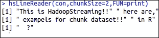

# 第四章. 使用 Hadoop Streaming 与 R

在上一章中，我们学习了如何借助 RHIPE 和 RHadoop 将 R 与 Hadoop 进行集成，并且通过示例进行演示。在本章中，我们将讨论以下主题：

+   理解 Hadoop Streaming 的基础

+   理解如何使用 R 运行 Hadoop Streaming

+   探索 HadoopStreaming R 包

# 理解 Hadoop Streaming 的基础

Hadoop Streaming 是一个 Hadoop 工具，用于通过可执行脚本（如 Mapper 和 Reducer）运行 Hadoop MapReduce 作业。这类似于 Linux 中的管道操作。通过这种方式，文本输入文件会被打印到流中（`stdin`），该流作为输入提供给 Mapper，Mapper 的输出（`stdout`）则作为输入提供给 Reducer；最终，Reducer 将输出写入 HDFS 目录。

Hadoop Streaming 工具的主要优势在于它允许 Java 以及非 Java 编写的 MapReduce 作业在 Hadoop 集群上执行。此外，它还负责处理正在运行的 MapReduce 作业的进度。Hadoop Streaming 支持 Perl、Python、PHP、R 和 C++编程语言。若要运行用其他编程语言编写的应用程序，开发人员只需将应用程序逻辑转换为 Mapper 和 Reducer 部分，并且指定键值输出元素。我们在第二章，*编写 Hadoop MapReduce 程序*中已经了解到，要创建 Hadoop MapReduce 作业，我们需要 Mapper、Reducer 和 Driver 作为三个主要组件。在这里，当我们用 R 和 Hadoop 实现 MapReduce 时，创建用于运行 MapReduce 作业的驱动程序文件是可选的。

本章的编写目的是为了将 R 与 Hadoop 进行集成。因此，我们将展示 R 与 Hadoop Streaming 的示例。现在，我们将看到如何使用 Hadoop Streaming 与 R 脚本（包括 Mapper 和 Reducer）一起使用。从下图中，我们可以识别出 Hadoop Streaming MapReduce 作业的各个组成部分。


Hadoop Streaming 组件

假设我们已经将 Mapper 和 Reducer 实现为`code_mapper.R`和`code_reducer.R`。我们将看到如何在 R 和 Hadoop 的集成环境中运行它们。这可以通过带有各种通用和 Streaming 选项的 Hadoop Streaming 命令来运行。

让我们来看一下 Hadoop Streaming 命令的格式：

```py
 bin/hadoop command [generic Options] [streaming Options]

```

下图展示了 Hadoop Streaming 的执行示例，这是一个带有多个 Streaming 选项的 MapReduce 作业。


Hadoop Streaming 命令选项

在上面的图片中，有大约六个独特的重要组件是执行整个 Hadoop Streaming MapReduce 作业所必需的。它们都属于 Streaming 选项，除了 jar。

以下是前面 Hadoop Streaming 命令的逐行描述：

+   **Line 1**: 此选项用于指定 Hadoop jar 文件（为 Hadoop jar 设置类路径）。

+   **Line 2**: 此选项用于指定 HDFS 的输入目录。

+   **Line 3**: 此选项用于指定 HDFS 的输出目录。

+   **Line 4**: 此选项用于将文件提供给本地机器。

+   **Line 5**: 此选项用于定义可用的 R 文件作为 Mapper。

+   **Line 6**: 此选项用于将文件提供给本地机器。

+   **Line 7**: 此选项用于定义可用的 R 文件作为 Reducer。

上述命令中的六个主要 Hadoop 流式组件列出了并解释如下：

+   **jar:** 此选项用于运行带有编码类的 jar 文件，这些类设计用于提供 Java 流功能，以及其他编程的 Mapper 和 Reducer。它被称为 Hadoop 流式 jar。

+   **input****:** 此选项用于指定输入数据集的位置（存储在 HDFS 上），并传递给 Hadoop 流式 MapReduce 作业。

+   **output:** 此选项用于指定 HDFS 输出目录（MapReduce 作业的输出将写入该目录），并传递给 Hadoop 流式 MapReduce 作业。

+   **file:** 此选项用于将 MapReduce 资源（如 Mapper、Reducer 和 Combiner）复制到计算机节点（Tasktrackers），以使其本地化。

+   **mapper:** 此选项用于标识可执行的`Mapper`文件。

+   **reducer:** 此选项用于标识可执行的`Reducer`文件。

还有其他 Hadoop 流式命令选项，但它们是可选的。让我们来看看它们：

+   `inputformat`: 用于通过指定 Java 类名称来定义输入数据格式。默认情况下，它是`TextInputFormat`。

+   `outputformat`: 用于通过指定 Java 类名称来定义输出数据格式。默认情况下，它是`TextOutputFormat`。

+   `partitioner`: 用于包括编写的类或文件，以实现将 Mapper 阶段的输出按（键，值）对进行分区。

+   `combiner`: 用于包括编写的类或文件，用于通过聚合键的值来减少 Mapper 输出的值。另外，我们也可以使用默认的 combiner，它会在将 Mapper 的输出提供给 Reducer 之前，简单地合并所有键属性的值。

+   `cmdenv`: 此选项用于将环境变量传递给流式命令。例如，可以传递`R_LIBS = /your /path /to /R /libraries`。

+   `inputreader`: 可用此选项替代`inputformat`类来指定记录读取器类。

+   `verbose`: 用于详细显示输出。

+   `numReduceTasks`: 此选项用于指定 Reducer 的数量。

+   `mapdebug`: 当 Mapper 任务失败时，用于调试`Mapper`文件的脚本。

+   `reducedebug`: 当 Reducer 任务失败时，用于调试`Reducer`文件的脚本。

现在，是时候来看一些 Hadoop 流式 MapReduce 作业的通用选项了。

+   `conf`: 用于指定应用程序配置文件。

    ```py
    -conf configuration_file

    ```

+   `D`：用于定义特定 MapReduce 或 HDFS 属性的值。例如：

+   `-D property = value 或指定临时 HDFS 目录`。

    ```py
    -D dfs.temp.dir=/app/tmp/Hadoop/

    ```

    或指定零 Reducer 的总数：

    ```py
    -D mapred.reduce.tasks=0

    ```

    ### 注意

    `-D`选项仅在工具实现时有效。

+   `fs`：用于定义 Hadoop NameNode。

    ```py
    -fs localhost:port

    ```

+   `jt`：用于定义 Hadoop JobTracker。

    ```py
    -jt localhost:port

    ```

+   `files`：用于指定来自 HDFS 的大型或多个文本文件。

    ```py
    -files hdfs://host:port/directory/txtfile.txt

    ```

+   `libjars`：用于指定要包含在类路径中的多个 jar 文件。

    ```py
    -libjars  /opt/ current/lib/a.jar, /opt/ current/lib/b.jar

    ```

+   `archives`：用于指定在本地机器上解压的 jar 文件。

    ```py
    -archives hdfs://host:fs_port/user/testfile.jar

    ```

# 理解如何使用 R 运行 Hadoop 流式处理

现在，我们了解了 Hadoop 流式处理是什么以及如何使用 Hadoop 通用选项和流式选项调用它。接下来，了解如何开发和运行 R 脚本。为此，我们可以考虑一个比简单的词频统计程序更好的示例。

MapReduce 操作的四个不同阶段如下所述：

+   理解 MapReduce 应用程序

+   理解如何编写 MapReduce 应用程序

+   理解如何运行 MapReduce 应用程序

+   理解如何探索 MapReduce 应用程序的输出

## 理解 MapReduce 应用程序

问题定义：该问题是根据地理位置对页面访问进行分段。在这个问题中，我们将考虑网站[`www.gtuadmissionhelpline.com/`](http://www.gtuadmissionhelpline.com/)，该网站旨在为希望进入古吉拉特科技大学的学生提供指导。该网站包含多个领域的学院信息，如工程（大专、学位和硕士）、医学、酒店管理、建筑、药学、MBA 和 MCA。通过这个 MapReduce 应用程序，我们将识别访客在地理位置上的兴趣领域。

例如，来自瓦尔萨德市的大多数在线访客更常访问 MBA 院校的页面。基于此，我们可以识别瓦尔萨德学生的心态；他们对进入 MBA 领域有着浓厚的兴趣。因此，通过这个网站流量数据集，我们可以识别按城市划分的兴趣水平。现在，如果瓦尔萨德没有 MBA 院校，对他们来说将是一个大问题。他们将需要搬到其他城市，这可能会增加他们的教育成本。

通过使用这种数据，古吉拉特科技大学可以为来自不同城市的学生生成有价值的洞察。

输入数据集来源：要执行此类分析，我们需要获取该网站的 Web 流量数据。Google Analytics 是一个流行的免费服务，用于跟踪在线访客的元数据。Google Analytics 按各种维度和指标存储 Web 流量数据。我们需要设计一个特定的查询，从 Google Analytics 中提取数据集。

输入数据集：提取的 Google Analytics 数据集包含以下四个数据列：

+   `date`：这是访问日期，格式为 YYYY/MM/DD。

+   `country`：这是访问者所在的国家。

+   `city`：这是访问者所在的城市。

+   `pagePath`：这是网站页面的 URL。

输入数据集的头部如下：

```py
$ head -5 gadata_mr.csv
20120301,India,Ahmedabad,/
20120302,India,Ahmedabad,/gtuadmissionhelpline-team
20120302,India,Mumbai,/
20120302,India,Mumbai,/merit-calculator
20120303,India,Chennai,/

```

预期的输出格式如下图所示：


以下是一个示例输出：


## 理解如何编写 MapReduce 应用程序

在这一部分中，我们将学习 MapReduce 应用程序的以下两个单元：

+   Mapper 代码

+   Reducer 代码

让我们从 Mapper 代码开始。

Mapper 代码：这个名为 `ga-mapper.R` 的 R 脚本将处理 MapReduce 作业的 Map 阶段。

Mapper 的工作是处理每一行，提取一对（键，值）并将其传递给 Reducer 以进行分组/聚合。在这个示例中，每一行是输入到 Mapper 的数据，输出为 `City:PagePath`。`City` 是键，`PagePath` 是值。现在 Reducer 可以获取给定城市的所有页面路径，因此可以轻松地进行分组。

```py
# To identify the type of the script, here it is RScript
#! /usr/bin/env Rscript
# To disable the warning massages to be printed
options(warn=-1)
# To initiating the connection to standard input
input <- file("stdin", "r")
Each line has these four fields (date, country, city, and pagePath) in the same order. We split the line by a comma. The result is a vector which has the date, country, city, and pathPath in the indexes 1,2,3, and 4 respectively.

```

我们分别提取城市和页面路径的第三个和第四个元素。然后，它们将作为键值对写入流并传递给 Reducer 以进一步处理。

```py
# Running while loop until all the lines are read
while(length(currentLine <- readLines(input, n=1, warn=FALSE)) > 0) {

# Splitting the line into vectors by "," separator 
 fields <- unlist(strsplit(currentLine, ","))

# Capturing the city and pagePath from fields
 city <- as.character(fields[3])
 pagepath <- as.character(fields[4])

# Printing both to the standard output
print(paste(city, pagepath,sep="\t"),stdout())

}

# Closing the connection to that input stream
close(input)

```

一旦 Mapper 阶段的输出作为（键，值）对可用，Reducers 将从 `stdout` 读取按行输出，并将其转换为最终的聚合键值对。

让我们看看 Mapper 输出格式是什么样的，以及 Reducer 输入数据格式是怎样的。

Reducer 代码：这个名为 `ga_reducer.R` 的 R 脚本将处理 MapReduce 作业的 Reducer 部分。

如我们所讨论的，Mapper 的输出将作为 Reducer 的输入。Reducer 会读取这些城市和页面路径对，并将所有值与其相应的键元素进行合并。

```py
# To identify the type of the script, here it is RScript
#! /usr/bin/env Rscript

# Defining the variables with their initial values
city.key <- NA
page.value <- 0.0

# To initiating the connection to standard input
input <- file("stdin", open="r")

# Running while loop until all the lines are read
while (length(currentLine <- readLines(input, n=1)) > 0) {

# Splitting the Mapper output line into vectors by 
# tab("\t") separator
 fields <- strsplit(currentLine, "\t")

# capturing key and value form the fields
# collecting the first data element from line which is city
 key <- fields[[1]][1]
# collecting the pagepath value from line 
 value <- as.character(fields[[1]][2])

```

Mapper 输出以两个主要字段写入，使用 `\t` 作为分隔符，并按行输出数据；因此，我们通过使用 `\t` 分割数据，以便从流输入中捕获两个主要属性（键和值）。

收集键和值后，Reducer 会将其与之前捕获的值进行比较。如果之前没有设置，则进行设置；否则，使用 R 中的 `combine` 函数将其与之前的字符值结合，最后将其打印到 HDFS 输出位置。

```py
# setting up key and values

# if block will check whether key attribute is 
# initialized or not. If not initialized then it will be # assigned from collected key attribute with value from # mapper output. This is designed to run at initial time.
 if (is.na(city.key)) {
 city.key <- key
 page.value <- value
 }
 else {

# Once key attributes are set, then will match with the previous key attribute value. If both of them matched then they will combined in to one.
 if (city.key == key) {
 page.value <- c(page.value, value)

 }
 else {

# if key attributes are set already but attribute value # is other than previous one then it will emit the store #p agepath values along with associated key attribute value of city,

 page.value <- unique(page.value)
# printing key and value to standard output
print(list(city.key, page.value),stdout())
 city.key <- key
 page.value <- value
 }
 }
}

print(list(city.key, page.value), stdout())

# closing the connection
close(input)

```

## 理解如何运行 MapReduce 应用程序

在使用 R 语言开发 Mapper 和 Reducer 脚本后，是时候在 Hadoop 环境中运行它们了。在执行这个脚本之前，建议先在简单的管道操作上测试它们，使用样本数据集进行验证。

```py
$ cat gadata_sample.csv | ga_mapper.R |sort | ga_reducer.R

```

前面的命令将在本地计算机上运行开发的 Mapper 和 Reducer 脚本。但它将类似于 Hadoop 流式作业的运行方式。我们需要测试这个命令，以便发现可能在运行时出现的问题，或者识别编程或逻辑错误。

现在，我们已经测试并准备好使用 Hadoop 流式命令运行 Mapper 和 Reducer。这个 Hadoop 流式操作可以通过调用通用的 `jar` 命令并附带流式命令选项来执行，就像我们在本章的 *理解 Hadoop 流式处理的基础知识* 部分中学到的那样。我们可以通过以下方式执行 Hadoop 流式作业：

+   从命令提示符

+   R 或 RStudio 控制台

执行命令与通用命令选项和流式命令选项在两种方式下是相同的。

### 从命令提示符执行 Hadoop 流式作业

正如我们在 *理解 Hadoop 流式处理的基础知识* 部分中学到的，使用 R 开发的 Hadoop 流式 MapReduce 作业的执行可以使用以下命令：

```py
$ bin/hadoop jar {HADOOP_HOME}/contrib/streaming/hadoop-streaming-1.0.3.jar 
 -input /ga/gadaat_mr.csv 
 -output /ga/output1 
 -file /usr/local/hadoop/ga/ga_mapper.R  
 -mapper ga_mapper.R 
 -file /usr/local/hadoop/ga/ga_ reducer.R 
 -reducer ga_reducer.R

```

### 从 R 或 RStudio 控制台执行 Hadoop 流式作业

作为 R 用户，从 R 控制台运行 Hadoop 流式作业会更合适。这可以通过 `system` 命令完成：

```py
system(paste("bin/hadoop jar”, “{HADOOP_HOME}/contrib/streaming/hadoop-streaming-1.0.3.jar",
 "-input /ga/gadata_mr.csv", 
 "-output /ga/output2", 
 "-file /usr/local/hadoop/ga/ga_mapper.R",
"-mapper ga_mapper.R", 
 "-file /usr/local/hadoop/ga/ga_reducer.R", 
 "-reducer ga_reducer.R")) 

```

这个前面的命令与您已在命令提示符中使用的命令相似，用于执行带有通用选项和流式选项的 Hadoop 流式作业。

## 理解如何探索 MapReduce 应用的输出

执行成功后，就该探索输出，以检查生成的输出是否重要。输出将与两个目录 `_logs` 和 `_SUCCESS` 一起生成。`_logs` 用于跟踪所有操作和错误；`_SUCCESS` 仅在 MapReduce 作业成功完成时生成。

再次，可以通过以下两种方式触发命令：

+   从命令提示符

+   从 R 控制台

### 从命令提示符查看输出

要列出输出目录中生成的文件，将调用以下命令：

```py
$ bin/hadoop dfs -cat /ga/output/part-* > temp.txt
$ head -n 40 temp.txt

```

用于检查输出的快照如下：


### 从 R 或 RStudio 控制台查看输出

相同的命令可以在 R（与 RStudio）控制台中通过 `system` 方法使用。

```py
dir <- system("bin/hadoop dfs -ls /ga/output",intern=TRUE)
out <- system("bin/hadoop dfs -cat /ga/output2/part-00000",intern=TRUE)

```

前面函数的截图如下：


## 理解 Hadoop MapReduce 脚本中使用的基本 R 函数

现在，我们将查看一些在 Hadoop Mapper 和 Reducer 中用于数据处理的基本实用函数：

+   `file`：此函数用于创建文件连接以进行读写操作。它还用于从 `stdin` 或 `stdout` 读写。此函数将在 Mapper 和 Reducer 阶段的初始化时使用。

    ```py
    Con <- file("stdin", "r")

    ```

+   `write`：此函数用于将数据写入文件或标准输入。它将在 Mapper 中设置好键值对后使用。

    ```py
    write(paste(city,pagepath,sep="\t"),stdout())

    ```

+   `print`：此函数用于将数据写入文件或标准输入。它将在 Mapper 中准备好键值对后使用。

    ```py
    print(paste(city,pagepath,sep="\t"),stdout())

    ```

+   `close`：此函数可用于在读取或写入操作完成后关闭与文件的连接。它可以在所有处理完成时与 Mapper 和 Reducer 一起使用，位于关闭（`conn`）端。

+   `stdin`：这是对应输入的标准连接。`stdin()` 函数是一个文本模式连接，返回连接对象。此函数将在 Mapper 和 Reducer 中使用。

    ```py
    conn <- file("stdin", open="r")

    ```

+   `stdout`：这是对应输出的标准连接。`stdout()` 函数是一个文本模式连接，也会返回对象。此函数将在 Mapper 和 Reducer 中使用。

    ```py
    print(list(city.key, page.value),stdout())

    ## where city.key is key and page.value is value of that key

    ```

+   `sink`：`sink` 将 R 输出发送到连接。如果是文件或流连接，输出将返回到文件或流。这将在 Mapper 和 Reducer 中用于跟踪所有功能输出以及错误。

    ```py
    sink("log.txt")
    k <- 1:5
    for(i in 1:k){
    print(paste("value of k",k))
    }sink()
    unlink("log.txt")
    ```

## 监控 Hadoop MapReduce 作业

Reducer 阶段的一个小语法错误会导致 MapReduce 作业失败。在 Hadoop MapReduce 作业失败后，我们可以通过 Hadoop MapReduce 管理页面跟踪问题，在该页面上可以获取关于正在运行的作业以及已完成作业的信息。

如果作业失败，我们可以看到已完成/失败的 Map 和 Reduce 作业的总数。点击失败的作业将提供导致这些特定 Mappers 或 Reducers 失败的原因。

同时，我们可以通过 JobTracker 控制台查看正在运行的 MapReduce 作业的实时进度，如下图所示：


监控 Hadoop MapReduce 作业

通过命令，我们可以通过指定其输出目录来检查特定 MapReduce 作业的历史，使用以下命令：

```py
$ bin/hadoop job –history /output/location 

```

以下命令将打印 MapReduce 作业的详细信息、失败的作业以及被终止作业的原因。

```py
$ bin/hadoop job -history all /output/location 

```

上述命令将打印每个任务的成功任务和任务尝试的详细信息。

# 探索 HadoopStreaming R 包

HadoopStreaming 是一个由 *David S. Rosenberg* 开发的 R 包。我们可以说这是一个简单的 MapReduce 脚本框架。它还可以在没有 Hadoop 的情况下以流式方式操作数据。我们可以将这个 R 包看作是 Hadoop MapReduce 的启动器。对于任何无法回忆起 Hadoop 流式命令的分析师或开发者，这个包将有助于快速运行 Hadoop MapReduce 作业。

该包的三个主要功能如下：

+   分块数据读取：该包允许分块数据读取和写入 Hadoop 流式处理。此功能将解决内存问题。

+   支持多种数据格式：该软件包允许以三种不同的数据格式读取和写入数据。

+   针对 Hadoop 流式命令的强大工具：该软件包还允许用户为 Hadoop 流式命令指定命令行参数。

本软件包主要设计了三个功能，以高效读取数据：

+   `hsTableReader`

+   `hsKeyValReader`

+   `hsLineReader`

现在，让我们理解这些功能及其用例。之后，我们将通过单词计数的 MapReduce 作业来理解这些功能。

## 理解`hsTableReader`函数

`hsTableReader`函数设计用于读取表格格式的数据。该函数假设已经与文件建立了输入连接，因此它将检索整行数据。它假设所有具有相同键的行都连续存储在输入文件中。

由于 Hadoop 流式作业保证在提供给 Reducer 之前，Mapper 的输出行会被排序，因此在 Hadoop 流式 MapReduce 作业中不需要使用`sort`函数。当我们不在 Hadoop 上运行时，必须在`Mapper`函数执行后显式调用`sort`函数。

定义`hsTableReader`函数：

```py
hsTableReader(file="", cols='character',
 chunkSize=-1, FUN=print,
 ignoreKey=TRUE, singleKey=TRUE, skip=0,
 sep='\t', keyCol='key',
 FUN=NULL, ,carryMemLimit=512e6,
 carryMaxRows=Inf,
 stringsAsFactors=FALSE)

```

上述代码中的术语如下：

+   `file`：这是一个连接对象、流或字符串。

+   `chunkSize`：指示函数每次读取的最大行数。`-1`表示一次读取所有行。

+   `cols`：表示作为“what”参数扫描的列名列表。

+   `skip`：用于跳过前 n 行数据。

+   `FUN`：此函数将使用用户输入的数据。

+   `carryMemLimit`：指示单个键值的最大内存限制。

+   `carryMaxRows`：指示要考虑或读取的最大行数。

+   `stringsAsFactors`：定义是否将字符串转换为因子（`TRUE` 或 `FALSE`）。

例如，文件中的数据：

```py
# Loading libraries
Library("HadoopStreaming")
# Input data String with collection of key and values
str <- " key1\t1.91\nkey1\t2.1\nkey1\t20.2\nkey1\t3.2\nkey2\t1.2\nkey2\t10\nkey3\t2.5\nkey3\t2.1\nkey4\t1.2\n"cat(str)

```

上述代码的输出如下图所示：


`hsTableReader`读取的数据如下：

```py
# A list of column names, as'what' arg to scan
cols = list(key='',val=0)

# To make a text connection
con <- textConnection(str, open = "r")
# To read the data with chunksize 3
hsTableReader(con,cols,chunkSize=3,FUN=print,ignoreKey=TRUE)

```

上述代码的输出如下图所示：


## 理解`hsKeyValReader`函数

`hsKeyValReader`函数设计用于读取以键值对格式存储的数据。该函数还使用`chunkSize`定义一次读取的行数，每行由键字符串和值字符串组成。

```py
hsKeyValReader(file = "", chunkSize = -1, skip = 0, sep = "\t",FUN = function(k, v) cat(paste(k, v))

```

该函数的术语与`hsTablereader()`类似。

示例：

```py
# Function for reading chunkwise dataset
printkeyval <- function(k,v) {cat('A chunk:\n')cat(paste(k,v,sep=': '),sep='\n')}
str <- "key1\tval1\nkey2\tval2\nkey3\tval3\n"
con <- textConnection(str, open = "r")

hsKeyValReader(con, chunkSize=1, FUN=printFn)

```

上述代码的输出如下图所示：


## 理解`hsLineReader`函数

`hsLineReader` 函数设计用于将整行读取为字符串，而不执行数据解析操作。它反复从文件中读取 `chunkSize` 行数据，并将这些字符串的字符向量传递给 `FUN`。

```py
hsLineReader(file = "", chunkSize = 3, skip = 0, FUN = function(x) cat(x, sep = "\n"))

```

该函数的术语与 `hsTablereader()` 相似。

示例：

```py
str <- " This is HadoopStreaming!!\n here are,\n examples for chunk dataset!!\n in R\n  ?"

#  For defining the string as data source
con <- textConnection(str, open = "r")

# read from the con object
hsLineReader(con,chunkSize=2,FUN=print)

```

上述代码的输出如下图所示：



你可以在[`cran.r-project.org/web/packages/HadoopStreaming/HadoopStreaming.pdf`](http://cran.r-project.org/web/packages/HadoopStreaming/HadoopStreaming.pdf)上获取关于这些方法以及其他现有方法的更多信息。

现在，我们将使用 Hadoop MapReduce 程序实现上述数据读取方法，并在 Hadoop 上运行。在某些情况下，键值对或数据行不会被加载到机器内存中，因此逐块读取数据比改进机器配置更为合适。

问题定义：

Hadoop 词频统计：由于我们已经知道什么是词频统计应用，我们将使用上述方法来实现词频统计的概念。这个 R 脚本已从 HadoopStreaming R 包中复制，这个包可以和 HadoopStreaming R 库一起作为示例代码下载。

输入数据集：该数据集取自俄罗斯作家 *列夫·托尔斯泰* 的小说 *安娜·卡列尼娜* 第一章。

R 脚本：本节包含了 Mapper、Reducer 及其他配置参数的代码。

文件：`hsWordCnt.R`

```py
## Loading the library
library(HadoopStreaming)

## Additional command line arguments for this script (rest are default in hsCmdLineArgs)
spec = c('printDone','D',0,"logical","A flag to write DONE at the end.",FALSE)

opts = hsCmdLineArgs(spec, openConnections=T)

if (!opts$set) {
 quit(status=0)
}

# Defining the Mapper columns names
mapperOutCols = c('word','cnt')

# Defining the Reducer columns names
reducerOutCols = c('word','cnt')

# printing the column header for Mapper output
if (opts$mapcols) {
 cat( paste(mapperOutCols,collapse=opts$outsep),'\n', file=opts$outcon )
} 

# Printing the column header for Reducer output 
if (opts$reducecols) {
 cat( paste(reducerOutCols,collapse=opts$outsep),'\n', file=opts$outcon )
}

## For running the Mapper
if (opts$mapper) {
 mapper <- function(d) {
    words <- strsplit(paste(d,collapse=' '),'[[:punct:][:space:]]+')[[1]] # split on punctuation and spaces
    words <- words[!(words=='')]  # get rid of empty words caused by whitespace at beginning of lines
    df = data.frame(word=words)
    df[,'cnt']=1

# For writing the output in the form of key-value table format
hsWriteTable(df[,mapperOutCols],file=opts$outcon,sep=opts$outsep)
  }

## For chunk wise reading the Mapper output, to be feeded to Reducer hsLineReader(opts$incon,chunkSize=opts$chunksize,FUN=mapper)

## For running the Reducer
} else if (opts$reducer) {

  reducer <- function(d) {
    cat(d[1,'word'],sum(d$cnt),'\n',sep=opts$outsep)
  }
  cols=list(word='',cnt=0)  # define the column names and types (''-->string 0-->numeric)
  hsTableReader(opts$incon,cols,chunkSize=opts$chunksize,skip=opts$skip,sep=opts$insep,keyCol='word',singleKey=T, ignoreKey= F, FUN=reducer)
  if (opts$printDone) {
    cat("DONE\n");
  }
}

# For closing the connection corresponding to input
if (!is.na(opts$infile)) {
  close(opts$incon)
}

# For closing the connection corresponding to input
if (!is.na(opts$outfile)) {
  close(opts$outcon)
}

```

## 运行 Hadoop 流式作业

由于这是一个 Hadoop 流式作业，它将像之前执行的 Hadoop 流式作业一样运行。对于这个例子，我们将使用一个 shell 脚本来执行 `runHadoop.sh` 文件以运行 Hadoop 流式作业。

设置系统环境变量：

```py
#! /usr/bin/env bash
HADOOP="$HADOOP_HOME/bin/hadoop"   # Hadoop command

HADOOPSTREAMING="$HADOOP jar
$HADOOP_HOME/contrib/streaming/hadoop-streaming-1.0.3.jar" # change version number as appropriate

RLIBPATH=/usr/local/lib/R/site-library  # can specify additional R Library paths here

```

设置 MapReduce 作业参数：

```py
INPUTFILE="anna.txt"
HFSINPUTDIR="/HadoopStreaming"
OUTDIR="/HadoopStreamingRpkg_output"

RFILE=" home/hduser/Desktop/HadoopStreaming/inst/wordCntDemo/ hsWordCnt.R"
#LOCALOUT="/home/hduser/Desktop/HadoopStreaming/inst/wordCntDemo/annaWordCnts.out"
# Put the file into the Hadoop file system
#$HADOOP fs -put $INPUTFILE $HFSINPUTDIR

```

删除现有输出目录：

```py
# Remove the directory if already exists (otherwise, won't run)
#$HADOOP fs -rmr $OUTDIR

```

设计具有通用选项和流式选项的 Hadoop MapReduce 命令：

```py
MAPARGS="--mapper" 
REDARGS="--reducer"
JOBARGS="-cmdenv R_LIBS=$RLIBPATH" # numReduceTasks 0
# echo $HADOOPSTREAMING -cmdenv R_LIBS=$RLIBPATH  -input $HFSINPUTDIR/$INPUTFILE -output $OUTDIR -mapper "$RFILE $MAPARGS" -reducer "$RFILE $REDARGS" -file $RFILE 

$HADOOPSTREAMING $JOBARGS   -input $HFSINPUTDIR/$INPUTFILE -output $OUTDIR -mapper "$RFILE $MAPARGS" -reducer "$RFILE $REDARGS" -file $RFILE 

```

从 HDFS 提取输出到本地目录：

```py
# Extract output
./$RFILE --reducecols > $LOCALOUT
$HADOOP fs -cat $OUTDIR/part* >> $LOCALOUT

```

### 执行 Hadoop 流式作业

我们现在可以通过执行命令 `runHadoop.sh` 来执行 Hadoop 流式作业。为了执行此操作，我们需要设置用户权限。

```py
sudo chmod +x runHadoop.sh

```

通过以下命令执行：

```py
./runHadoop.sh

```

最后，它将执行整个 Hadoop 流式作业，然后将输出复制到本地目录。

# 总结

我们已经学习了大部分将 R 与 Hadoop 集成以执行数据操作的方法。在下一章中，我们将学习如何利用 R 和 Hadoop 解决现实世界的数据分析问题。
