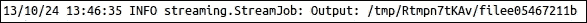

# 第五章 使用 R 和 Hadoop 学习数据分析

在前面的章节中，我们学习了 R 和 Hadoop 的安装、配置和集成。

在本章中，我们将学习如何在集成的 R 和 Hadoop 环境中执行数据分析操作。由于本章旨在介绍数据分析，我们将通过一个有效的数据分析周期来理解这一过程。

在本章中，我们将学习：

+   理解数据分析项目生命周期

+   理解数据分析问题

# 理解数据分析项目生命周期

在处理数据分析项目时，有一些固定任务需要遵循，以便获得预期的结果。因此，我们将构建一个数据分析项目周期，这将是一组标准的数据驱动流程，旨在有效地将数据转化为洞察力。项目生命周期中定义的数据分析流程应按顺序执行，以便有效地使用输入数据集实现目标。这个数据分析过程可能包括识别数据分析问题、设计和收集数据集、数据分析和数据可视化。

数据分析项目生命周期的各个阶段见下图：


让我们从这些阶段的角度来看一下如何进行数据分析。

## 确定问题

今天，商业分析趋势通过对 Web 数据集执行数据分析来推动业务增长。由于他们的数据量逐渐增加，他们的分析应用需要具备可扩展性，以便从数据集中提取洞察。

借助 Web 分析，我们可以解决商业分析问题。假设我们有一个大型电子商务网站，我们希望了解如何增加业务量。我们可以通过按受欢迎程度将网站的重要页面分为高、中、低类别，来识别这些重要页面。根据这些流行页面的类型、流量来源和内容，我们将能够制定出通过提高网站流量和改进内容来改善业务的路线图。

## 设计数据需求

为了对特定问题进行数据分析，需要来自相关领域的数据集。根据领域和问题规格，可以决定数据源，并根据问题定义，定义这些数据集的数据属性。

例如，如果我们要进行社交媒体分析（问题规格），我们可以使用 Facebook 或 Twitter 作为数据源。为了识别用户特征，我们需要用户档案信息、点赞和帖子作为数据属性。

## 数据预处理

在数据分析中，我们并不总是使用相同的数据源、数据属性、数据工具和算法，因为它们并不总是以相同的格式使用数据。这导致需要进行数据操作，例如数据清洗、数据聚合、数据增强、数据排序和数据格式化，以便将数据提供为所有数据工具和算法所支持的格式，这些工具和算法将用于数据分析。

简而言之，预处理用于执行数据操作，将数据转换为固定的数据格式，然后将数据提供给算法或工具。数据分析过程将以该格式化数据作为输入开始。

在大数据情况下，数据集需要格式化并上传到**Hadoop 分布式文件系统**（**HDFS**），并由 Hadoop 集群中的各种节点使用映射器和减少器进一步处理。

## 对数据进行分析

数据在满足数据分析算法所需格式后，将进行数据分析操作。数据分析操作旨在通过数据挖掘概念从数据中发现有意义的信息，以便做出更好的商业决策。这些操作可能会使用描述性分析或预测性分析来进行商业智能。

数据分析可以通过各种机器学习和自定义算法概念进行，例如回归、分类、聚类和基于模型的推荐。对于大数据，相同的算法可以转换为 MapReduce 算法，在 Hadoop 集群上运行，通过将它们的数据分析逻辑转化为 MapReduce 任务，这些任务将运行在 Hadoop 集群上。这些模型需要通过机器学习概念的各个评估阶段进一步评估和改进。改进或优化后的算法可以提供更好的洞察。

## 数据可视化

数据可视化用于展示数据分析的输出。可视化是一种交互式的方式来展示数据洞察。可以使用各种数据可视化软件以及 R 包来完成这项工作。R 有多种用于数据集可视化的包。如下所示：

+   `ggplot2`：这是*Dr. Hadley Wickham*（[`had.co.nz/`](http://had.co.nz/)）提出的图形语法的实现。欲了解更多信息，请参阅[`cran.r-project.org/web/packages/ggplot2/`](http://cran.r-project.org/web/packages/ggplot2/)。

+   `rCharts`：这是一个 R 包，用于通过*Markus Gesmann*和*Diego de Castillo*提供的熟悉的网格式绘图界面，创建、定制并发布交互式 JavaScript 可视化。欲了解更多信息，请参阅[`ramnathv.github.io/rCharts/`](http://ramnathv.github.io/rCharts/)。

以下是使用 R 进行可视化的一些流行示例：

+   **面板比例的图形**（`ggplot`）：下图展示了男性和女性在不同指标下的对比，具体包括教育、收入、预期寿命和识字率，使用`ggplot`：

+   **仪表板图表**：这是一种`rCharts`类型。使用它，我们可以使用 R 构建交互式动画仪表板。

# 理解数据分析问题

在这一部分，我们包含了三个实际的数据分析问题，涉及使用 R 和 Hadoop 技术的各个阶段的基于数据的活动。这些数据分析问题的定义旨在帮助读者理解如何利用 R 的函数、包以及 Hadoop 的计算能力进行大数据分析。

数据分析问题的定义如下：

+   探索网页分类

+   计算股市变化频率

+   预测推土机蓝色书籍的销售价格（案例研究）

## 探索网页分类

这个数据分析问题的设计目的是识别网站网页的类别，基于页面的访问次数，可以将其按受欢迎程度分为高、中或低（常规）。在设计数据分析生命周期的数据需求阶段时，我们将看到如何从**Google Analytics**收集这些类型的数据。


### 确定问题

由于这是一个网页分析问题，该问题的目标是识别为网站设计的网页的重要性。基于这些信息，可以改善或增加较不受欢迎页面的内容、设计或访问量。

### 设计数据需求

在这一部分，我们将处理该数据分析问题的数据需求和数据收集。首先，让我们看看如何为该问题实现数据需求。

由于这是一个网页分析问题，我们将使用 Google Analytics 数据源。要从 Google Analytics 中提取这些数据，我们需要有一个现有的 Google Analytics 账户，并且该账户上存储有网页流量数据。为了增加受欢迎度，我们将需要所有网页的访问信息。此外，Google Analytics 中还提供了许多与维度和指标相关的其他属性。

#### 理解所需的 Google Analytics 数据属性

从 Google Analytics 提取的数据集的表头格式如下：

```py
date, source, pageTitle, pagePath
```

+   `date`：这是网页被访问的日期

+   `source`：这是指向网页的推荐链接

+   `pageTitle`：这是网页的标题

+   `pagePath`：这是网页的 URL

##### 数据收集

由于我们将从 Google Analytics 中提取数据，因此我们需要使用 `RGoogleAnalytics`，这是一个用于在 R 中提取 Google Analytics 数据集的 R 库。要提取数据，您需要先在 R 中安装此插件。然后，您将能够使用其函数。

以下是从 Google Analytics 提取数据的代码：

```py
# Loading the RGoogleAnalytics library
require("RGoogleAnalyics")

# Step 1\. Authorize your account and paste the access_token
query <- QueryBuilder()
access_token <- query$authorize()

# Step 2\. Create a new Google Analytics API object
ga <- RGoogleAnalytics()

# To retrieve profiles from Google Analytics
ga.profiles <- ga$GetProfileData(access_token)

# List the GA profiles 
ga.profiles

# Step 3\. Setting up the input parameters
profile <- ga.profiles$id[3] 
startdate <- "2010-01-08"
enddate <- "2013-08-23"
dimension <- "ga:date,ga:source,ga:pageTitle,ga:pagePath"
metric <- "ga:visits"
sort <- "ga:visits"
maxresults <- 100099

# Step 4\. Build the query string, use the profile by setting its index value
query$Init(start.date = startdate,
           end.date = enddate,
           dimensions = dimension,
           metrics = metric,

           max.results = maxresults,
           table.id = paste("ga:",profile,sep="",collapse=","),
           access_token=access_token)

# Step 5\. Make a request to get the data from the API
ga.data <- ga$GetReportData(query)

# Look at the returned data
head(ga.data)
write.csv(ga.data,"webpages.csv", row.names=FALSE)
```

上述文件将在章节内容中提供下载。

### 数据预处理

现在，我们有了 Google Analytics 的原始数据，存储在 CSV 文件中。在将数据提供给 MapReduce 算法之前，我们需要处理这些数据。

需要对数据集进行两项主要更改：

+   需要从 `pagePath` 列中移除查询参数，如下所示：

    ```py
    pagePath <- as.character(data$pagePath)
    pagePath <- strsplit(pagePath,"\\?")
    pagePath <- do.call("rbind", pagePath)
    pagePath <- pagePath [,1]
    ```

+   需要创建新的 CSV 文件，如下所示：

    ```py
    data  <- data.frame(source=data$source, pagePath=d,visits =)
    write.csv(data, "webpages_mapreduce.csv" , row.names=FALSE)
    ```

### 执行数据分析

为了对网站页面进行分类，我们将构建并运行与 R 和 Hadoop 集成的 MapReduce 算法。正如在第二章《编写 Hadoop MapReduce 程序》中已讨论的那样，*编写 Hadoop MapReduce 程序*，有时我们需要使用多个 Mappers 和 Reducers 来执行数据分析；这意味着需要使用链式 MapReduce 任务。

在链式 MapReduce 任务中，多个 Mappers 和 Reducers 可以通过某种方式进行通信，使得第一个任务的输出作为第二个任务的输入。MapReduce 执行顺序如下图所示：


链式 MapReduce

现在让我们开始编程任务以执行分析：

1.  通过设置 Hadoop 变量并加载 RHadoop 库中的 `rmr2` 和 `rhdfs` 包来初始化：

    ```py
    # setting up the Hadoop variables need by RHadoop
    Sys.setenv(HADOOP_HOME="/usr/local/hadoop/")
    Sys.setenv(HADOOP_CMD="/usr/local/hadoop/bin/hadoop")

    # Loading the RHadoop libraries rmr2 and rhdfs
    library(rmr2)
    library(rhdfs)

    # To initializing hdfs
    hdfs.init()
    ```

1.  上传数据集到 HDFS：

    ```py
    # First uploading the data to R console,
    webpages <- read.csv("/home/vigs/Downloads/webpages_mapreduce.csv")

    # saving R file object to HDFS,
    webpages.hdfs <- to.dfs(webpages) 
    ```

现在我们将看到这些分析的 Hadoop MapReduce 任务 1 的开发过程。我们将这个任务分为 Mapper 和 Reducer。由于有两个 MapReduce 任务，因此将有两个 Mappers 和 Reducers。还需要注意的是，我们只需要为两个任务创建一个文件，包含所有的 Mappers 和 Reducers。Mapper 和 Reducer 将通过定义它们各自的函数来建立。

让我们来看一下 MapReduce 任务 1。

+   **Mapper 1**：代码如下：

    ```py
    mapper1 <- function(k,v) {

     # To storing pagePath column data in to key object
     key <- v[2]

     # To store visits column data into val object
     Val <- v[3]

     # emitting key and value for each row
     keyval(key, val)
    }
    totalvisits <- sum(webpages$visits)
    ```

+   **Reducer 1**：代码如下：

    ```py
    reducer1 <- function(k,v) {

      # Calculating percentage visits for the specific URL
      per <- (sum(v)/totalvisits)*100
      # Identify the category of URL
      if (per <33 )
     {
    val <- "low"
    }
     if (per >33 && per < 67)
     {
     val <- "medium"
     }
     if (per > 67)
     {
     val <- "high"
     }

     # emitting key and values
     keyval(k, val)
    }
    ```

+   **MapReduce 任务 1 的输出**：信息的中间输出如下截图所示：

上述截图中的输出仅为 MapReduce 任务 1 的输出信息。这可以视为一个中间输出，其中仅考虑了整个数据集中的 100 行数据来提供输出。在这些行中，23 个 URL 是唯一的；因此，输出提供了 23 个 URL。

让我们看看 Hadoop MapReduce 任务 2：

+   **Mapper 2**：代码如下：

    ```py
    #Mapper:
    mapper2 <- function(k, v) {

    # Reversing key and values and emitting them 
     keyval(v,k)
    }
    ```

+   **Reducer 2**：代码如下：

    ```py
    key <- NA
    val <- NULL
    # Reducer:
    reducer2  <-  function(k, v) {

    # for checking whether key-values are already assigned or not.
     if(is.na(key)) {
     key <- k
     val <- v
      } else {
       if(key==k) {
     val <- c(val,v)
      } else{
       key <- k
       val <- v
      }
     }
    # emitting key and list of values 
    keyval(key,list(val))
    }
    ```

    ### 提示

    在执行 MapReduce 作业之前，请启动所有 Hadoop 守护进程，并通过 `hdfs.init()` 方法检查 HDFS 连接。如果您的 Hadoop 守护进程尚未启动，可以通过 `$hduser@ubuntu :~ $HADOOP_HOME/bin/start-all.sh` 启动它们。

一旦我们准备好 Mapper 和 Reducer 的逻辑，就可以通过 `rmr2` 包中的 MapReduce 方法执行 MapReduce 作业。在这里，我们开发了多个 MapReduce 作业，因此我们需要在 `mapreduce` 函数内调用 `mapreduce` 函数，并传入所需的参数。

调用链式 MapReduce 作业的命令如下图所示：


以下是从 HDFS 检索生成的输出的命令：

```py
from.dfs(output)

```

在执行 Hadoop MapReduce 时，执行日志输出将打印到终端，用于监控目的。我们将通过将 MapReduce 作业 1 和 MapReduce 作业 2 分成不同的部分来理解它们。

MapReduce 作业 1 的详细信息如下：

+   **跟踪 MapReduce 作业元数据**：通过这部分初始日志，我们可以识别 Hadoop MapReduce 作业的元数据。我们还可以通过调用给定的 `Tracking URL` 使用浏览器跟踪作业状态。

+   **跟踪 Mapper 和 Reducer 任务的状态**：通过这部分日志，我们可以监控在 Hadoop 集群上运行的 Mapper 或 Reducer 任务的状态，获取任务是否成功或失败等详细信息。

+   **跟踪 HDFS 输出位置**：一旦 MapReduce 作业完成，其输出位置将在日志末尾显示。

对于 MapReduce 作业 2。

+   **跟踪 MapReduce 作业元数据**：通过这部分初始日志，我们可以识别 Hadoop MapReduce 作业的元数据。我们还可以通过调用给定的 `Tracking URL` 使用浏览器跟踪作业状态。

+   **跟踪 Mapper 和 Reducer 任务的状态**：通过这部分日志，我们可以监控在 Hadoop 集群上运行的 Mapper 或 Reducer 任务的状态，获取任务是否成功或失败等详细信息。

+   **跟踪 HDFS 输出位置**：一旦 MapReduce 作业完成，其输出位置将在日志末尾显示。

这个链式 MapReduce 作业的输出存储在 HDFS 位置，可以通过以下命令检索：

```py
from.dfs(output)

```

前述命令的响应如下图所示（仅显示数据集前 1000 行的输出）：


### 数据可视化

我们使用三个类别收集了网页分类输出。我认为我们最好的做法是简单地列出这些 URL。但如果我们有更多的信息，比如来源，我们可以将网页表示为一个图的节点，通过用户跟随链接的有向边来标记其流行度。这可以带来更多有价值的见解。

## 计算股票市场变化的频率

这个数据分析 MapReduce 问题旨在计算股票市场变化的频率。

### 确定问题

由于这是一个典型的股票市场数据分析问题，它将计算某一特定符号的股票市场过去变动的频率，比如**傅里叶变换**。基于这些信息，投资者可以获得关于不同时间段变化的更多见解。因此，这次分析的目标是计算百分比变化的频率。


### 设计数据需求

对于本次股票市场分析，我们将使用 Yahoo! Finance 作为输入数据集。我们需要检索特定符号的股票信息。为此，我们将使用 Yahoo! API，传递以下参数：

+   从某月开始

+   从某天开始

+   从某年开始

+   到某月

+   到某天

+   到某年

+   符号

### 提示

有关此 API 的更多信息，请访问[`developer.yahoo.com/finance/`](http://developer.yahoo.com/finance/)。

### 数据预处理

为了对提取的数据集进行分析，我们将使用 R 来执行以下命令：

```py
stock_BP <- read.csv("http://ichart.finance.yahoo.com/table.csv?s=BP")

```

或者你也可以通过终端下载：

```py
wget http://ichart.finance.yahoo.com/table.csv?s=BP
#exporting to csv file

write.csv(stock_BP,"table.csv", row.names=FALSE)

```

然后通过创建一个特定的 Hadoop 目录将其上传到 HDFS：

```py
# creating /stock directory in hdfs
bin/hadoop dfs -mkdir /stock

# uploading table.csv to hdfs in /stock directory
bin/hadoop dfs -put /home/Vignesh/downloads/table.csv /stock/ 

```

### 对数据进行分析

为了执行数据分析操作，我们将使用 R 和 Hadoop 进行流式处理（无需`HadoopStreaming`包）。因此，这个 MapReduce 作业的开发可以在没有任何 RHadoop 集成库/包的情况下完成。

在这个 MapReduce 作业中，我们已经在不同的 R 文件中定义了 Map 和 Reduce，并将它们提供给 Hadoop streaming 函数。

+   **Mapper**: `stock_mapper.R`

    ```py
    #! /usr/bin/env/Rscript
    # To disable the warnings
    options(warn=-1)
    # To take input the data from streaming
    input <- file("stdin", "r")

    # To reading the each lines of documents till the end
    while(length(currentLine <-readLines(input, n=1, warn=FALSE)) > 0)
    {

    # To split the line by "," seperator
    fields <- unlist(strsplit(currentLine, ","))

    # Capturing open column value
     open <- as.double(fields[2])

    # Capturing close columns value
     close <- as.double(fields[5])

    # Calculating the difference of close and open attribute
     change <- (close-open)

    # emitting change as key and value as 1
    write(paste(change, 1, sep="\t"), stdout())
    }

    close(input)

    ```

+   **Reducer**: `stock_reducer.R`

    ```py
    #! /usr/bin/env Rscript
    stock.key <- NA
    stock.val <- 0.0

    conn <- file("stdin", open="r")
    while (length(next.line <- readLines(conn, n=1)) > 0) {
     split.line <- strsplit(next.line, "\t")
     key <- split.line[[1]][1]
     val <- as.numeric(split.line[[1]][2])
     if (is.na(current.key)) {
     current.key <- key
     current.val <- val
     }
     else {
     if (current.key == key) {
    current.val <- current.val + val
    }
    else {
    write(paste(current.key, current.val, sep="\t"), stdout())
    current.key <- key
    current.val<- val
    }
    }
    }
    write(paste(current.key, current.val, sep="\t"), stdout())
    close(conn)

    ```

从以下代码中，我们可以在 R 中运行 MapReduce，而无需安装或使用任何 R 库/包。R 中有一个`system()`方法，可以在 R 控制台内触发系统命令，帮助我们在 R 中直接启动 Hadoop 作业。它还会将命令的响应提供到 R 控制台。

```py
# For locating at Hadoop Directory
system("cd $HADOOP_HOME")

# For listing all HDFS first level directorysystem("bin/hadoop dfs -ls /")

# For running Hadoop MapReduce with streaming parameters
system(paste("bin/hadoop jar 
/usr/local/hadoop/contrib/streaming/hadoop-streaming-1.0.3.jar ",

" -input /stock/table.csv",
" -output /stock/outputs",
" -file /usr/local/hadoop/stock/stock_mapper.R",
" -mapper /usr/local/hadoop/stock/stock_mapper.R",
" -file /usr/local/hadoop/stock/stock_reducer.R",
" -reducer /usr/local/hadoop/stock/stock_reducer.R"))

# For storing the output of list command 
dir <- system("bin/hadoop dfs -ls /stock/outputs", intern=TRUE)
dir

# For storing the output from part-oooo (output file)
out <- system("bin/hadoop dfs -cat /stock/outputs/part-00000", intern=TRUE)

# displaying Hadoop MapReduce output data out

```

你也可以通过终端运行这个相同的程序：

```py
bin/hadoop jar /usr/local/hadoop/contrib/streaming/hadoop-streaming-1.0.3.jar \

 -input /stock/table.csv \
 -output /stock/outputs\
 -file /usr/local/hadoop/stock/stock_mapper.R \
 -mapper /usr/local/hadoop/stock/stock_mapper.R \
 -file /usr/local/hadoop/stock/stock_reducer.R \
 -reducer /usr/local/hadoop/stock/stock_reducer.R 

```

在运行该程序时，R 控制台或终端的输出将如以下截图所示，通过此输出我们可以监控 Hadoop MapReduce 作业的状态。这里我们将按顺序查看这些输出的各个部分。请注意，我们已将日志输出分为几个部分，以帮助您更好地理解。

MapReduce 的日志输出包含（当从终端运行时）：

+   使用日志的这部分，我们可以识别 Hadoop MapReduce 作业的元数据。我们还可以通过浏览器通过调用给定的`Tracking URL`来跟踪作业状态。这就是 MapReduce 作业元数据的跟踪方式。

+   使用这部分日志，我们可以监控在 Hadoop 集群上运行的 Mapper 或 Reducer 任务的状态，查看是否成功或失败。这就是我们跟踪 Mapper 和 Reducer 任务状态的方式。

+   一旦 MapReduce 作业完成，其输出位置将在日志的最后显示。这就是跟踪 HDFS 输出位置的方式。

+   从终端，Hadoop MapReduce 程序的输出可以通过以下命令调用：

    ```py
    bin/hadoop dfs -cat /stock/outputs/part-00000

    ```

+   你 MapReduce 程序输出的表头将如下所示：

    ```py
    change    frequency

    ```

+   下图展示了 MapReduce 问题的示例输出：

### 数据可视化

如果我们通过各种图表在 R 中可视化我们的输出，我们可以获得更多的见解。在这里，我们通过`ggplot2`包尝试可视化输出。


从前面的图表中，我们可以迅速识别出，大部分时间股票价格从 0 附近变动到 1.5。因此，股票历史上的价格波动在投资时会很有帮助。

生成此图所需的代码如下：

```py
# Loading ggplot2 library
library(ggplot2);

# we have stored above terminal output to stock_output.txt file

#loading it to R workspace
myStockData <- read.delim("stock_output.txt", header=F, sep="", dec=".");

# plotting the data with ggplot2 geom_smooth function
ggplot(myStockData, aes(x=V1, y=V2)) + geom_smooth() + geom_point();
```

在下一部分，我们将介绍如何使用 R 和 Hadoop 进行大数据分析的案例研究，应用于**Kaggle**数据竞赛。

## 预测推土机蓝皮书销售价格——案例研究

这是一个案例研究，旨在预测重型设备拍卖销售价格，并为推土机创建蓝皮书。

### 识别问题

在这个例子中，我包括了 Cloudera 数据科学家的一项案例研究，讲述了如何对大数据集进行重采样，并在 R 和 Hadoop 中应用随机森林模型。在这里，我参考了 Kaggle 推土机蓝皮书竞赛来理解大数据问题定义的类型。该竞赛的目标是根据设备的使用情况、设备类型和配置，预测某一特定重型设备在使用拍卖中的销售价格。这个解决方案由*Uri Laserson*（Cloudera 的数据科学家）提供。提供的数据包含拍卖结果发布、使用情况和设备配置的信息。

这是一个技巧，用于对大数据集建模并将其划分为较小的数据集。将模型应用于该数据集是传统的机器学习技术，如随机森林或集成方法。随机森林可能有两个原因：

+   大型数据集通常存储在集群中，因此任何操作都将具有一定程度的并行性。不同的模型在不同的节点上拟合，这些节点包含初始数据的不同子集。

+   即使你可以使用整个初始数据集来拟合单个模型，事实证明，集成方法（通过使用数据子集来拟合多个较小的模型）通常优于单一模型。实际上，用 1 亿数据点拟合单个模型的效果可能比用每个包含 1000 万数据点的几个模型要差（即较小的总数据集优于较大的总数据集）。

有放回抽样是从初始数据集中采样以生成样本集合用于模型拟合的最常见方法。该方法等同于从多项分布中抽样，其中选择任何单个输入数据点的概率在整个数据集上是均匀的。

### 提示

Kaggle 是一个大数据平台，来自全球的数据科学家在这里竞赛，解决由数据驱动的组织主办的大数据分析问题。

### 设计数据需求

对于本次竞赛，Kaggle 提供了一个包含约 400,000 个训练数据点的真实世界数据集。每个数据点代表了推土机销售、配置以及销售价格的各种属性。为了预测销售价格，随机森林回归模型需要被实现。

### 注意

该 Kaggle 竞赛的参考链接为 [`www.kaggle.com/c/bluebook-for-bulldozers`](http://www.kaggle.com/c/bluebook-for-bulldozers)。你可以查看数据、信息、论坛和排行榜，还可以探索其他大数据分析竞赛并参与其中，以评估你的数据分析技能。

我们选择这个模型是因为我们有兴趣从一个大型数据集的随机集合中预测销售价格的数值。

数据集以以下数据文件的形式提供：

| 文件名 | 描述格式（大小） |
| --- | --- |
| `Train` | 这是一个包含 2011 年数据的训练集。 |
| `Valid` | 这是一个验证集，包含 2012 年 1 月 1 日至 2012 年 4 月 30 日的数据。 |
| `Data dictionary` | 这是训练数据集变量的元数据。 |
| `Machine_Appendix` | 这包含了给定机器的正确制造年份，以及品牌、型号和产品类别的详细信息。 |
| `Test` | 这是测试数据集。 |
| `random_forest_benchmark_test` | 这是主办方提供的基准解决方案。 |

### 提示

如果你想学习和实践大数据分析，可以通过参与 Kaggle 数据竞赛从 Kaggle 数据源获取大数据集。这些数据集来自世界各地不同行业的多个领域。

### 数据预处理

为了对提供的 Kaggle 数据集执行分析，我们需要构建一个预测模型。为了预测拍卖的销售价格，我们将在提供的数据集上拟合模型。但是数据集提供了多个文件。因此，我们将它们合并，并进行数据增强以获取更有意义的数据。我们将从`Train.csv`和`Machine_Appendix.csv`构建模型，以更好地预测销售价格。

下面是需要在数据集上执行的数据预处理任务：

```py
# Loading Train.csv dataset which includes the Sales as well as machine identifier data attributes.

transactions <- read.table(file="~/Downloads/Train.csv",
header=TRUE,
sep=",",
quote="\"",
row.names=1,
fill=TRUE,
colClasses=c(MachineID="factor",
 ModelID="factor",
datasource="factor",
YearMade="character",
SalesID="character",
auctioneerID="factor",
UsageBand="factor",
saledate="custom.date.2",
Tire_Size="tire.size",
Undercarriage_Pad_Width="undercarriage",
Stick_Length="stick.length"),
na.strings=na.values)

# Loading Machine_Appendix.csv for machine configuration information

machines <- read.table(file="~/Downloads/Machine_Appendix.csv",
header=TRUE,
sep=",",
quote="\"",
fill=TRUE,
colClasses=c(MachineID="character",
ModelID="factor",
fiManufacturerID="factor"),
na.strings=na.values)

# Updating the values to numeric 
# updating sale data number
transactions$saledatenumeric <- as.numeric(transactions$saledate)
transactions$ageAtSale <- as.numeric(transactions$saledate - as.Date(transactions$YearMade, format="%Y"))

transactions$saleYear <- as.numeric(format(transactions$saledate, "%Y"))

# updating the month of sale from transaction
transactions$saleMonth <- as.factor(format(transactions$saledate, "%B"))

# updating the date of sale from transaction
transactions$saleDay <- as.factor(format(transactions$saledate, "%d"))

# updating the day of week of sale from transaction
transactions$saleWeekday <- as.factor(format(transactions$saledate, "%A"))

# updating the year of sale from transaction
transactions$YearMade <- as.integer(transactions$YearMade)

# deriving the model price from transaction
transactions$MedianModelPrice <- unsplit(lapply(split(transactions$SalePrice, 
transactions$ModelID), median), transactions$ModelID)

# deriving the model count from transaction
transactions$ModelCount <- unsplit(lapply(split(transactions$SalePrice, transactions$ModelID), length), transactions$ModelID)

# Merging the transaction and machine data in to dataframe 
training.data <- merge(x=transactions, y=machines, by="MachineID")

# write denormalized data out
write.table(x=training.data,
file="~/temp/training.csv",
sep=",",
quote=TRUE,
row.names=FALSE,
eol="\n",
col.names=FALSE)
# Create poisson directory at HDFS
bin/hadoop dfs -mkdir /poisson

# Uploading file training.csv at HDFS
bin/hadoop dfs -put ~/temp/training.csv /poisson/
```

### 在数据上执行分析

由于我们将使用采样的数据集执行分析，我们需要了解需要对多少个数据集进行采样。

对于随机抽样，我们考虑了三个模型参数，如下所示：

+   我们在初始训练集中有 N 个数据点。这非常大（106-109），分布在一个 HDFS 集群中。

+   我们将为一个集成分类器训练一组 M 个不同的模型。

+   每个 M 个模型将使用 K 个数据点进行拟合，其中通常 K << N。（例如，K 可能是 N 的 1-10%）。

我们有 N 个训练数据集，这些数据集是固定的，通常在我们的控制之外。由于我们将通过**泊松**抽样来处理这些数据，我们需要定义要输入随机森林模型的总输入向量数。

需要考虑三种情况：

+   **KM < N**：在这种情况下，我们没有使用我们可用的全部数据量。

+   **KM = N**：在这种情况下，我们可以完全分割我们的数据集，以生成完全独立的样本。

+   **KM > N**：在这种情况下，我们必须用替换的方式对部分数据进行重新抽样。

在下一节中描述的泊松抽样方法在相同的框架内处理所有三种情况。但是请注意，对于 KM = N 的情况，它不会对数据进行分区，而只是重新抽样。

### 理解泊松近似重采样

广义线性模型是一般线性模型的扩展。泊松回归是广义模型的一种情况。因变量服从泊松分布。

泊松抽样将在 MapReduce 任务的 Map 上运行，因为它发生在输入数据点上。这并不保证每个数据点都将被考虑到模型中，但它比全数据集的多项式重新抽样更好。但它将通过使用 N 个训练输入点保证生成独立样本。

在这里，下图显示了在泊松抽样中可以检索到的遗漏数据集的数量，其功能为 KM/N：


灰线指示了 KM=N 的值。现在，让我们看看 MapReduce 算法的伪代码。我们使用了三个参数：N、M 和 K，其中 K 是固定的。我们使用 T=K/N 来消除先验值 N 的需求。

+   **采样参数的示例**：在这里，我们将用伪代码实现前述逻辑。首先，我们将定义两个模型输入参数`frac.per.model`和`num.models`，其中`frac.per.model`用于定义可以使用的完整数据集的比例，而`num.models`用于定义将从数据集中拟合的模型数量。

    ```py
    T = 0.1  # param 1: K / N-average fraction of input data in each model 10%

    M = 50   # param 2: number of models
    ```

+   **Mapper 的逻辑**：Mapper 将被设计为通过数据整理生成完整数据集的样本。

    ```py
    def map(k, v):
    // for each input data point
        for i in 1:M  
        // for each model
            m = Poisson(T)  
        // num times curr point should appear in this sample
            if m > 0
                for j in 1:m
       // emit current input point proper num of times
                    emit (i, v)
    ```

+   **Reducer 的逻辑**：Reducer 将接受一个数据样本作为输入，并对其进行随机森林模型的拟合。

    ```py
    def reduce(k, v):
        fit model or calculate statistic with the sample in v
    ```

#### 使用 RHadoop 拟合随机森林

在机器学习中，拟合模型意味着将最佳的线拟合到我们的数据中。拟合模型有几种类型，分别是欠拟合、过拟合和正常拟合。在欠拟合和过拟合的情况下，可能会出现较高的偏差（交叉验证和训练误差高）和较高的方差（交叉验证误差高但训练误差低）的影响，这是不理想的。我们通常会对数据集进行模型拟合。

下面是拟合模型的三种拟合类型的示意图：

+   **欠拟合**：在这种情况下，交叉验证和训练误差较高

+   **正常拟合**：在这种情况下，交叉验证和训练误差是正常的

+   **过拟合**：在这种情况下，交叉验证误差较高但训练误差较低

我们将使用机器学习中的随机森林技术对数据进行拟合。这是一种递归划分方法，特别适用于大规模和小规模问题。它涉及一组（或集合）分类（或回归）树，这些树是通过在数据的随机子集上计算得出的，每个分类树的每次分割都使用一个随机选择和限制的预测变量子集。

此外，使用分类/回归树集成的结果已经被用于生成比使用单一分类树更好的预测。

我们将使用 RHadoop 实现我们的泊松采样策略。首先，我们会为参数设置全局值：

```py
#10% of input data to each sample on avg
frac.per.model <- 0.1  
num.models <- 50
```

让我们检查如何按照伪代码的规范，使用 RHadoop 实现 Mapper。

+   Mapper 的实现方式如下：

    ```py
    poisson.subsample <- function(k, input) {
      # this function is used to generate a sample from the current block of data
      generate.sample <- function(i) {
        # generate N Poisson variables
        draws <- rpois(n=nrow(input), lambda=frac.per.model)
        # compute the index vector for the corresponding rows,
        # weighted by the number of Poisson draws
        indices <- rep((1:nrow(input)), draws)
        # emit the rows; RHadoop takes care of replicating the key appropriately
        # and rbinding the data frames from different mappers together for the
        # reducer
        keyval(i, input[indices, ])
      }

      # here is where we generate the actual sampled data
      c.keyval(lapply(1:num.models, generate.sample))
    }
    ```

    由于我们使用的是 R，因此在收集的样本数据集上使用随机森林模型拟合模型是一个复杂的过程。

+   Reducer 的实现方式如下：

    ```py
    # REDUCE function
    fit.trees <- function(k, v) {
      # rmr rbinds the emitted values, so v is a dataframe
      # note that do.trace=T is used to produce output to stderr to keep the reduce task from timing out
      rf <- randomForest(formula=model.formula,
                            data=v,
                            na.action=na.roughfix,
                            ntree=10,
                            do.trace=FALSE)

     # rf is a list so wrap it in another list to ensure that only
     # one object gets emitted. this is because keyval is vectorized
      keyval(k, list(forest=rf))
    }
    ```

+   为了拟合模型，我们需要`model.formula`，其内容如下：

    ```py
    model.formula <- SalePrice ~ datasource + auctioneerID + YearMade + saledatenumeric + ProductSize + ProductGroupDesc.x + Enclosure + Hydraulics + ageAtSale + saleYear + saleMonth + saleDay + saleWeekday + MedianModelPrice + ModelCount + MfgYear

    ```

    `SalePrice`定义为响应变量，其他变量定义为随机森林模型的预测变量。

    ### 提示

    R 中的随机森林模型不支持具有超过 32 个级别的因子变量。

+   MapReduce 作业可以通过以下命令执行：

    ```py
    mapreduce(input="/poisson/training.csv",
     input.format=bulldozer.input.format,
     map=poisson.subsample,
     reduce=fit.trees,
     output="/poisson/output")

    ```

    生成的树被导出到 HDFS 的`/poisson/output`路径下。

+   最后，我们可以加载这些树，合并它们，并用它们来分类新的测试点：

    ```py
    mraw.forests <- values(from.dfs("/poisson/output"))
    forest <- do.call(combine, raw.forests)

    ```

每个 50 个样本都生成了一个包含 10 棵树的随机森林，因此最终的随机森林是由 500 棵树组成的，并且以分布式的方式在 Hadoop 集群上进行拟合。

### 注意

所有源文件的完整集合可以在 Cloudera 官方网站的博客中找到，链接：[`blog.cloudera.com/blog/2013/02/how-to-resample-from-a-large-data-set-in-parallel-with-r-on-hadoop/`](http://blog.cloudera.com/blog/2013/02/how-to-resample-from-a-large-data-set-in-parallel-with-r-on-hadoop/)。

希望我们已经学习到了一种可扩展的方法，通过使用泊松近似来进行多项式采样，从而以并行方式训练集成分类器或进行自助法（bootstrapping）。

# 总结

在本章中，我们学习了如何在 R 和 Hadoop 集成环境中，利用各种数据驱动活动进行大数据分析。

在下一章中，我们将学习更多关于如何使用 R 和 Hadoop 来执行机器学习技术的内容。
