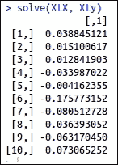
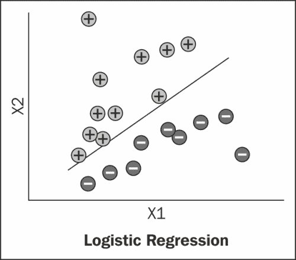

# 第六章：使用机器学习理解大数据分析

在本章中，我们将学习不同的机器学习技术，这些技术可以与 R 和 Hadoop 一起使用，以通过以下要点执行大数据分析：

+   机器学习简介

+   机器学习算法类型

+   监督式机器学习算法

+   无监督机器学习算法

+   推荐算法

# 机器学习简介

机器学习是人工智能的一个分支，它使我们能够在没有显式编程的情况下，使应用程序具备智能。机器学习的概念被用于使应用程序能够从现有数据集中做出决策。机器学习与数据挖掘的结合可以用于开发垃圾邮件检测器、自动驾驶汽车、语音识别、面部识别和在线交易欺诈活动检测等。

有许多知名的组织正在使用机器学习算法，使他们的服务或产品能够理解用户的需求，并根据用户的行为提供服务。谷歌拥有其智能的网页搜索引擎，提供了第一大搜索引擎、Google Mail 中的垃圾邮件分类、Google News 中的新闻标签分类，以及亚马逊的推荐系统。许多开源框架可用于开发这些类型的应用程序/框架，如 R、Python、Apache Mahout 和 Weka。

## 机器学习算法类型

目前有三种不同类型的机器学习算法，用于智能系统开发：

+   监督式机器学习算法

+   无监督机器学习算法

+   推荐系统

在本章中，我们将讨论一些著名的商业问题，包括分类、回归和聚类，以及如何在 Hadoop 上执行这些机器学习技术，以克服内存问题。

如果你加载的某个数据集无法适应机器的内存，并且你尝试运行它，预测分析将抛出与机器内存相关的错误，例如**错误：无法分配大小为 990.1 MB 的向量**。解决方案是增加机器配置或使用商品硬件进行并行化。

# 监督式机器学习算法

在本节中，我们将学习监督式机器学习算法。算法如下：

+   线性回归

+   逻辑回归

## 线性回归

线性回归主要用于基于历史信息预测和预报值。回归是一个监督式机器学习技术，用于识别目标变量和解释变量之间的线性关系。我们可以说，它用于预测目标变量的数值。

在接下来的章节中，我们将学习如何使用 R 和 Hadoop 进行线性回归。

这里，目标变量是需要预测的变量，帮助预测目标变量的变量称为解释变量。通过线性关系，我们可以识别解释变量变化对目标变量的影响。

在数学中，回归可以如下表示：

y = ax + e

其他公式包括：

+   回归线的斜率由以下公式给出：

    a = (NΣxy - (Σx)(Σy)) / (NΣx² - (Σx)²)

+   回归的截距点由以下公式给出：

    e = (Σy - b(Σx)) / N

这里，*x* 和 *y* 是构成数据集的变量，*N* 是值的总数。

假设我们有以下表格中的数据：

| x | y |
| --- | --- |
| 63 | 3.1 |
| 64 | 3.6 |
| 65 | 3.8 |
| 66 | 4 |

如果我们有一个新的 *x* 值，我们可以通过回归公式获得对应的 *y* 值。

线性回归的应用包括：

+   销售预测

+   预测最佳产品价格

+   从各种来源和活动中预测下一次在线购买

让我们看看如何使用统计技术来实现提供的数据集的回归模型。假设我们已获得 n 个统计数据单元。


它的公式如下：

Y = e[0] + a[0]x[0] + a[1]x[1] + a[2]x[2] + a[3]x[3] + a[4]x[4]

这里，*Y* 是目标变量（响应变量），*xi* 是解释变量，*e[0]* 是误差项的平方和，可以视为噪声。为了获得更准确的预测，我们需要尽早通过 `call` 函数减少这个误差项。

### 使用 R 进行线性回归

现在我们将看看如何在 R 中执行线性回归。我们可以使用内置的 `lm()` 方法来构建一个线性回归模型。

```py
Model <-lm(target ~ ex_var1, data=train_dataset)
```

它将基于提供的数据集的属性构建回归模型，并存储所有用于预测和识别数据模式的变量系数和模型参数。

```py
# Defining data variables
X = matrix(rnorm(2000), ncol = 10)
y = as.matrix(rnorm(200))

# Bundling data variables into dataframe
train_data <- data.frame(X,y)

# Training model for generating prediction
lmodel<- lm(y~ train_data $X1 + train_data $X2 + train_data $X3 + train_data $X4 + train_data $X5 + train_data $X6 + train_data $X7 + train_data $X8 + train_data $X9 + train_data $X10,data= train_data)

summary(lmodel)
```

以下是使用前述 `summary` 命令可以显示的各种模型参数：

+   **RSS**：这等于 ∑(y 实际 - y)²。

+   **自由度**（**DOF**）：用于识别预测模型的拟合度，应该尽可能小（从逻辑上讲，值为 0 表示完美预测）。

+   **残差标准误差**（**RSS/DF**）：用于识别预测模型的拟合度，应该尽可能小（从逻辑上讲，值为 0 表示完美预测）。

+   **pr**：这是变量被纳入模型的概率；要将一个变量纳入模型，其值应小于 0.05。

+   **t 值**：这等于 15。

+   **f**：这是检查 R 方是否为非零值的统计量。


### 使用 R 和 Hadoop 进行线性回归

假设我们有一个大型数据集。现在我们如何进行回归数据分析？在这种情况下，我们可以使用 R 和 Hadoop 集成，通过实现 Mapper 和 Reducer 来执行并行线性回归。它将把数据集分配到各个节点之间，然后这些节点将并行处理分布式数据。当我们在 R 和 Hadoop 集群中运行时，它不会引发内存问题，因为大型数据集将被分布式并与 Hadoop 计算节点中的 R 一起处理。同时，请记住，这种实现方法的预测精度不比 `lm()` 模型高。

RHadoop 用于集成 R 和 Hadoop，它是 **Revolution Analytics** 的一个受信的开源发行版。如需了解有关 RHadoop 的更多信息，请访问 [`github.com/RevolutionAnalytics/RHadoop/wiki`](https://github.com/RevolutionAnalytics/RHadoop/wiki)。在 RHadoop 的软件包中，这里我们只使用 `rmr` 和 `rhdfs` 库。

让我们看看如何使用 R 和 Hadoop 数据技术进行回归分析。

```py
# Defining the datasets with Big Data matrix X
X = matrix(rnorm(20000), ncol = 10)
X.index = to.dfs(cbind(1:nrow(X), X))
y = as.matrix(rnorm(2000))
```

在这里，`Sum()` 函数是可重用的，如以下代码所示：

```py
# Function defined to be used as reducers 
Sum = 
  function(., YY) 
    keyval(1, list(Reduce('+', YY)))
```

线性回归算法的大纲如下：

1.  使用 MapReduce 作业 1 计算 `Xtx` 值。

1.  使用 MapReduce 作业 2 计算 `Xty` 值。

1.  使用 `Solve (Xtx, Xty)` 推导系数值。

让我们逐一理解这些步骤。

第一步是使用 MapReduce 作业 1 计算 `Xtx` 值。

1.  大矩阵以完整行的块传递给 Mapper。这些子矩阵的较小交叉乘积会被计算并传递给单个 Reducer，后者将它们加总在一起。由于我们有一个单一的键，Combiner 是必须的，而且由于矩阵求和具有结合性和交换性，我们当然可以在这里使用它。

    ```py
    # XtX = 
      values(

    # For loading hdfs data in to R 
        from.dfs(

    # MapReduce Job to produce XT*X
          mapreduce(
            input = X.index,

    # Mapper – To calculate and emitting XT*X
            map = 
              function(., Xi) {
                yi = y[Xi[,1],]
                Xi = Xi[,-1]
                keyval(1, list(t(Xi) %*% Xi))},

    # Reducer – To reduce the Mapper output by performing sum operation over them
            reduce = Sum,
            combine = TRUE)))[[1]]
    ```

1.  当我们有大量数据存储在 **Hadoop 分布式文件系统** (**HDFS**) 中时，我们需要将其路径值传递给 `MapReduce` 方法的输入参数。

1.  在前面的代码中，我们看到 `X` 是设计矩阵，它是通过以下函数创建的：

    ```py
    X = matrix(rnorm(2000), ncol = 10)
    ```

1.  它的输出将如下所示：

所以，这里所有列将被视为解释变量，并且它们的标准误差可以按照与正常线性回归中计算标准误差的相同方式来计算。

计算 `Xty` 值与 MapReduce 作业 2 基本相同，向量 `y` 会根据正常作用域规则在各节点中可用。

```py
Xty = values(

# For loading hdfs data
from.dfs(

# MapReduce job to produce XT * y
      mapreduce(
       input = X.index,

# Mapper – To calculate and emitting XT*y
        map = function(., Xi) {
          yi = y[Xi[,1],]
          Xi = Xi[,-1]
          keyval(1, list(t(Xi) %*% yi))},

# Reducer – To reducer the Mapper output by performing # sum operation over them
        reduce = Sum,
        combine = TRUE)))[[1]]
```

要推导系数值，使用 `solve (Xtx, Xty)`，请按照以下步骤操作：

1.  最后，我们只需要调用以下代码行来获取系数值。

    ```py
    solve(XtX, Xty)
    ```

1.  前面的命令的输出将如下所示：

## 逻辑回归

在统计学中，逻辑回归或 logit 回归是一种概率分类模型。逻辑回归在许多学科中广泛应用，包括医学和社会科学领域。它可以是二项式或多项式。

二元逻辑回归处理因变量结果可能有两种可能类型的情况。多项式逻辑回归处理结果可能有三种或更多类型的情况。

逻辑回归可以使用逻辑函数实现，这里列出了它们。

+   要预测对数几率比，请使用以下公式：

    logit(p) = β0 + β1 × x1 + β2 × x2 + ... + βn × xn

+   概率公式如下：

    p = e^(logit(p)) ⁄ 1 + e^(logit(p))

`logit(p)`是解释变量 X（x1，x2，x3..xn）的线性函数，类似于线性回归。因此，该函数的输出将在 0 到 1 的范围内。根据概率分数，我们可以将其概率范围设置为 0 到 1。在大多数情况下，如果分数大于 0.5，则视为 1，否则为 0。此外，我们可以说它为分类结果提供了分类边界。



上述图是一个训练数据集。基于训练数据集的绘图，我们可以说`glm`模型在 R 中生成了一个分类边界。

逻辑回归的应用包括：

+   预测在线购买的可能性

+   检测糖尿病的存在

### 使用 R 进行逻辑回归

要使用 R 执行逻辑回归，我们将使用`iris`数据集和`glm`模型。

```py
#loading iris dataset
data(iris)

# Setting up target variable
target <- data.frame(isSetosa=(iris$Species == 'setosa'))

# Adding target to iris and creating new dataset
inputdata <- cbind(target,iris)

# Defining the logistic regression formula
formula <- isSetosa ~ Sepal.Length + Sepal.Width + Petal.Length + Petal.Width

# running Logistic model via glm()
logisticModel <- glm(formula, data=inputdata, family="binomial")
```

### 使用 R 和 Hadoop 进行逻辑回归

要使用 R 和 Hadoop 执行逻辑回归，我们将使用`rmr2`和 RHadoop。

逻辑回归算法的大纲如下：

+   定义`lr.map`映射函数

+   定义`lr.reducer`减少函数

+   定义`logistic.regression` MapReduce 函数

让我们逐一理解它们。

我们将首先定义梯度下降的逻辑回归函数。可以通过将非依赖变量形成矩阵数据格式来执行多变量回归。对于因子变量，我们可以将它们转换为二元变量以适应模型。此函数将要求`input`，`iterations`，`dims`和`alpha`作为输入参数。

+   `lr.map`：这代表逻辑回归映射器，将计算子集点对梯度的贡献。

    ```py
    # Mapper – computes the contribution of a subset of points to the gradient.

    lr.map = 
        function(., M) {
          Y = M[,1] 
          X = M[,-1]
          keyval(
            1,
            Y * X * 
              g(-Y * as.numeric(X %*% t(plane))))}
    ```

+   `lr.reducer`：这代表逻辑回归减少器，仅执行键 1 所有值的总和。

    ```py
    # Reducer – Perform sum operation over Mapper output.

    lr.reduce =
        function(k, Z) 
          keyval(k, t(as.matrix(apply(Z,2,sum))))
    ```

+   `logistic.regression`：这将主要定义`logistic.regression` MapReduce 函数，并带有以下输入参数。调用此函数将开始执行 MapReduce 函数的逻辑回归。

    +   `input`: 这是一个输入数据集。

    +   `iterations`: 这是计算梯度的固定迭代次数。

    +   `dims`：这是输入变量的维度

    +   `alpha`：这是学习率

让我们看看如何开发逻辑回归函数。

```py
# MapReduce job – Defining MapReduce function for executing logistic regression

logistic.regression = 
  function(input, iterations, dims, alpha){
  plane = t(rep(0, dims))
  g = function(z) 1/(1 + exp(-z))
  for (i in 1:iterations) {
    gradient = 
      values(
        from.dfs(
          mapreduce(
            input,
            map = lr.map,
            reduce = lr.reduce,
            combine = T)))
    plane = plane + alpha * gradient }
  plane }
```

让我们按如下方式运行这个逻辑回归函数：

```py
# Loading dataset
data(foodstamp)

# Storing data to hdfs 
testdata <-  to.dfs(as.matrix(foodstamp))

# Running logistic regression with R and Hadoop
print(logistic.regression(testdata,10,3,0.05))
```

前述命令的输出结果如下：


# 无监督机器学习算法

在机器学习中，无监督学习用于从未标记的数据集中发现隐藏的结构。由于数据集是未标记的，因此在评估潜在解决方案时不会出现错误。

无监督机器学习包括几种算法，以下是其中的一些：

+   聚类

+   人工神经网络

+   向量量化

我们将在这里考虑流行的聚类算法。

## 聚类

聚类是将一组对象分组的任务，使得具有相似特征的对象被分到同一类别，而其他对象则分到不同类别。在聚类中，输入数据集是未标记的；它们需要根据数据结构的相似性进行标记。

在无监督机器学习中，分类技术执行相同的程序，通过提供的输入训练数据集将数据映射到一个类别。这个相应的过程称为聚类（或聚类分析），它通过某种固有相似性的度量将数据分组到不同的类别中；例如，数据点之间的距离。

从下图中，我们可以识别出聚类是基于相似性将对象分组：


R 库中有几种聚类技术，如 k-means、k-medoids、层次聚类和基于密度的聚类。在这些技术中，k-means 是数据科学中广泛使用的聚类算法。该算法要求用户提供聚类的数量作为输入参数。

聚类的应用如下：

+   市场细分

+   社交网络分析

+   组织计算机网络

+   天文数据分析

### 使用 R 进行聚类

我们在这里考虑`k-means`方法来实现聚类模型，基于`iris`输入数据集，只需调用其内置的 R 数据集——`iris`数据（欲了解更多信息，请访问[`stat.ethz.ch/R-manual/R-devel/library/datasets/html/iris.html`](http://stat.ethz.ch/R-manual/R-devel/library/datasets/html/iris.html)）。在这里我们将看到如何使用 R 执行 k-means 聚类。

```py
# Loading iris flower dataset
data("iris")
# generating clusters for iris dataset
kmeans <- kmeans(iris[, -5], 3, iter.max = 1000)

# comparing iris Species with generated cluster points
Comp <- table(iris[, 5], kmeans$cluster)
```

对于小型数据集，推导聚类是相当简单的，但对于大型数据集，推导聚类需要使用 Hadoop 来提供计算能力。

### 使用 R 和 Hadoop 进行聚类

由于 k-means 聚类算法已经在 RHadoop 中开发完成，我们将使用并理解它。您可以根据输入数据集格式修改它们的 Mappers 和 Reducers。由于我们正在处理 Hadoop，因此需要开发 Mappers 和 Reducers，以便在节点上并行运行。

聚类算法的概述如下：

+   定义`dist.fun`距离函数

+   定义`k-means.map` k-means Mapper 函数

+   定义`k-means.reduce` k-means Reducer 函数

+   定义`k-means.mr` k-means MapReduce 函数

+   定义要提供给聚类算法的输入数据点

现在我们将通过提供所需的参数运行`k-means.mr`（k-means MapReduce 作业）。

让我们逐一理解它们。

+   `dist.fun`：首先，我们将查看`dist.fun`函数，该函数用于计算中心矩阵`C`与点矩阵`P`之间的距离。它经过测试后，能够在大约 16 秒内生成 10⁶个点和 10²个中心（5 维）。

    ```py
    # distance calculation function
    dist.fun = 
          function(C, P) {
            apply(
              C,
              1, 
              function(x) 
                colSums((t(P) - x)²))}
    ```

+   `k-means.map`：k-means MapReduce 算法的 Mapper 将计算点与所有中心之间的距离，并返回每个点的最近中心。这个 Mapper 将根据以下代码进行迭代运行。在第一次迭代中，聚类中心将被随机分配，从下一次迭代开始，它将根据与聚类中所有点的最小距离计算这些聚类中心。

    ```py
    # k-Means Mapper
      kmeans.map = 
          function(., P) {
            nearest = {

    # First interations- Assign random cluster centers 
              if(is.null(C)) 
                sample(
                  1:num.clusters, 
                  nrow(P), 
                  replace = T)

    # Rest of the iterations, where the clusters are assigned # based on the minimum distance from points
              else {
                D = dist.fun(C, P)
                nearest = max.col(-D)}}

           if(!(combine || in.memory.combine))
              keyval(nearest, P) 
            else 
              keyval(nearest, cbind(1, P))}
    ```

+   `k-means.reduce`：k-means MapReduce 算法的 Reducer 将计算矩阵点的列平均值作为键。

    ```py
    # k-Means Reducer
    kmeans.reduce = {

    # calculating the column average for both of the 
    # conditions

          if (!(combine || in.memory.combine) ) 
            function(., P) 
              t(as.matrix(apply(P, 2, mean)))
          else 
            function(k, P) 
              keyval(
                k, 
                t(as.matrix(apply(P, 2, sum))))}
    ```

+   `kmeans.mr`：定义 k-means MapReduce 函数涉及指定几个输入参数，具体如下：

    +   `P`：表示输入数据点。

    +   `num.clusters`：这是总的聚类数量。

    +   `num.iter`：这是处理数据集的总迭代次数。

    +   `combine`：这将决定是否启用 Combiner（`TRUE`或`FALSE`）。

        ```py
        # k-Means MapReduce – for 
        kmeans.mr = 
          function(
            P, 
            num.clusters, 
            num.iter, 
            combine, 
            in.memory.combine) {
            C = NULL
            for(i in 1:num.iter ) {
              C = 
                values(

        # Loading hdfs dataset
                  from.dfs(

        # MapReduce job, with specification of input dataset,
        # Mapper and Reducer
                    mapreduce(
                      P,
                      map = kmeans.map,
                      reduce = kmeans.reduce)))
              if(combine || in.memory.combine)
                C = C[, -1]/C[, 1]
              if(nrow(C) < num.clusters) {
                C = 
                  rbind(
                    C,
                    matrix(
                      rnorm(
                        (num.clusters - 
                           nrow(C)) * nrow(C)), 
                      ncol = nrow(C)) %*% C) }}
                C}
        ```

+   定义要提供给聚类算法的输入数据点：

    ```py
    # Input data points
    P = do.call(
          rbind, 
          rep(

            list(

    # Generating Matrix of
              matrix(
    # Generate random normalized data with sd = 10
                rnorm(10, sd = 10), 
                ncol=2)), 
            20)) + 
        matrix(rnorm(200), ncol =2)
    ```

+   通过提供所需参数运行`kmeans.mr`（k-means MapReduce 作业）。

    ```py
    # Running kmeans.mr Hadoop MapReduce algorithms with providing the required input parameters

    kmeans.mr(
          to.dfs(P),
          num.clusters = 12, 
          num.iter = 5,
          combine = FALSE,
          in.memory.combine = FALSE)
    ```

+   上述命令的输出显示在以下截图中：

# 推荐算法

推荐是机器学习技术，用于预测用户可能喜欢的新项目，基于用户与之前项目的关联。推荐广泛应用于电子商务领域。通过这种灵活的数据和行为驱动算法，企业可以通过确保在正确的时间向正确的客户自动推荐相关选择，从而增加转化率，实现交叉销售或追加销售。

例如，当一个客户在亚马逊上寻找三星 Galaxy S IV/S4 手机时，商店还会建议其他类似的手机，这些手机会出现在**购买此商品的客户还购买了**窗口中。

有两种不同类型的推荐：

+   **基于用户的推荐**：在这种类型中，将确定与当前用户（客户）相似的用户（客户）。基于这种用户相似性，他们感兴趣/使用的物品可以推荐给其他用户。让我们通过一个例子来学习它。

    假设有两个用户，Wendell 和 James，他们有相似的兴趣，因为两人都在使用 iPhone。Wendell 使用了两种物品：iPad 和 iPhone，所以 James 会被推荐使用 iPad。这是基于用户的推荐。

+   **基于项目的推荐**：在这种类型中，将确定与用户当前使用的项目相似的项目。基于项目相似度分数，将向用户展示类似的项目，以进行交叉销售和向上销售类型的推荐。让我们通过一个例子来学习它。

例如，一个名为 Vaibhav 的用户喜欢并使用以下几本书：

+   *《Apache Mahout 秘籍》*，*Piero Giacomelli*，*Packt Publishing*

+   *《Hadoop MapReduce 秘籍》*，*Thilina Gunarathne* 和 *Srinath Perera*，*Packt Publishing*

+   *《Hadoop 真实世界解决方案秘籍》*，*Brian Femiano*，*Jon Lentz* 和 *Jonathan R. Owens*，*Packt Publishing*

+   *《大数据入门》*，*Dr. Fern Halper*，*Judith Hurwitz*，*Marcia Kaufman* 和 *Alan Nugent*，*John Wiley & Sons Publishers*

基于上述信息，推荐系统将预测 Vaibhav 会喜欢阅读哪些新书，如下所示：

+   *《大数据分析与 R 与 Hadoop》*，*Vignesh Prajapati*，*Packt Publishing*

现在我们将了解如何使用 R 和 Hadoop 生成推荐。但是，在讲解 R 和 Hadoop 的结合之前，首先让我们看看如何用 R 来生成推荐。这将帮助你理解如何将生成的推荐系统转换为 MapReduce 推荐算法。在使用 R 和 Hadoop 生成推荐时，我们将使用**Revolution Analytics**的 RHadoop 分发版。

## 在 R 中生成推荐的步骤

为了生成用户推荐，我们需要具有特定格式的数据集，算法可以读取这些数据。在这里，我们将使用协同过滤算法来生成推荐，而不是基于内容的算法。因此，我们需要用户对可用项目集的评分信息。因此，`small.csv`数据集采用`user ID, item ID, item's ratings`格式。

```py
# user ID, item ID, item's rating
1,         101,     5.0
1,         102,     3.0
1,         103,     2.5
2,         101,     2.0
2,         102,     2.5
2,         103,     5.0
2,         104,     2.0
3,         101,     2.0
3,         104,     4.0
3,         105,     4.5
3,         107,     5.0
4,         101,     5.0
4,         103,     3.0
4,         104,     4.5
4,         106,     4.0
5,         101,     4.0
5,         102,     3.0
5,         103,     2.0
5,         104,     4.0
5,         105,     3.5
5,         106,     4.0
```

上述代码和数据集摘自《*Mahout in Action*》一书，作者为*Robin Anil*、*Ellen Friedman*、*Ted Dunning*和*Sean Owen*，由 Manning Publications 出版，网址为[`www.fens.me/`](http://www.fens.me/)。

推荐可以通过矩阵分解技术推导出来，如下所示：

```py
Co-occurrence matrix * scoring matrix = Recommended Results
```

为了生成推荐系统，我们将遵循以下步骤：

1.  计算共现矩阵。

1.  建立用户评分矩阵。

1.  生成推荐。

从下一部分开始，我们将看到执行前述步骤的技术细节。

1.  在第一部分中，计算共现矩阵时，我们能够识别数据集中给定的共现物品集。简单来说，我们可以称之为从给定数据集中计数物品对。

    ```py
    # Quote plyr package
    library (plyr)

    # Read dataset
    train <-read.csv (file = "small.csv", header = FALSE)
    names (train) <-c ("user", "item", "pref") 

    # Calculated User Lists
    usersUnique <-function () {
      users <-unique (train $ user)
      users [order (users)]
    }

    # Calculation Method Product List
    itemsUnique <-function () {
      items <-unique (train $ item)
      items [order (items)]
    }

    # Derive unique User Lists
    users <-usersUnique () 

    # Product List
    items <-itemsUnique () 

    # Establish Product List Index
    index <-function (x) which (items %in% x)
    data<-ddply(train,.(user,item,pref),summarize,idx=index(item)) 

    # Co-occurrence matrix
    Co-occurrence <-function (data) {
      n <-length (items)
      co <-matrix (rep (0, n * n), nrow = n)
      for (u in users) {
        idx <-index (data $ item [which(data$user == u)])
        m <-merge (idx, idx)
        for (i in 1: nrow (m)) {
          co [m$x[i], m$y[i]] = co[m$x[i], m$y[i]]+1
        }
      }
      return (co)
    }

    # Generate co-occurrence matrix
    co <-co-occurrence (data) 
    ```

1.  为了基于用户评分信息建立用户评分矩阵，可以为用户生成用户-物品评分矩阵。

    ```py
    # Recommendation algorithm
    recommend <-function (udata = udata, co = coMatrix, num = 0) {
      n <- length(items)

      # All of pref
      pref <- rep (0, n)
      pref[udata$idx] <-udata$pref

      # User Rating Matrix
      userx <- matrix(pref, nrow = n)

      # Scoring matrix co-occurrence matrix *
      r <- co %*% userx

      # Recommended Sort
      r[udata$idx] <-0
      idx <-order(r, decreasing = TRUE)
      topn <-data.frame (user = rep(udata$user[1], length(idx)), item = items[idx], val = r[idx])

      # Recommended results take months before the num
      if (num> 0) {
        topn <-head (topn, num)
      }

      # Recommended results take months before the num
      if (num> 0) {
        topn <-head (topn, num)
      }

      # Back to results 
      return (topn)
    }
    ```

1.  最终，可以通过两个矩阵项的产品操作生成输出推荐：共现矩阵和用户评分矩阵。

    ```py
    # initializing dataframe for recommendations storage
    recommendation<-data.frame()

    # Generating recommendations for all of the users
    for(i in 1:length(users)){
      udata<-data[which(data$user==users[i]),]
      recommendation<-rbind(recommendation,recommend(udata,co,0)) 
    }
    ```

### 提示

通过**Myrrix**和 R 接口生成推荐非常简单。更多信息，请参考[`github.com/jwijffels/Myrrix-R-interface`](https://github.com/jwijffels/Myrrix-R-interface)。

## 使用 R 和 Hadoop 生成推荐

为了使用 R 和 Hadoop 生成推荐，我们需要开发一个能够并行执行和处理数据的算法。这可以通过使用 Mappers 和 Reducers 来实现。该部分的一个非常有趣的部分是我们如何将 R 和 Hadoop 结合使用，从大数据集生成推荐。

所以，以下步骤类似于使用 R 生成推荐，但将其转换为 Mapper 和 Reducer 范式有些复杂：

1.  建立共现矩阵项。

1.  将用户评分矩阵建立到文章中。

1.  生成推荐。

我们将使用与之前在 R 中生成推荐相同的概念来结合 R 和 Hadoop 生成推荐。但在这种情况下，我们需要使用键值对范式，因为它是并行操作的基础。因此，每个函数都将通过考虑键值对范式来实现。

1.  在第一部分中，建立共现矩阵项时，我们将按照步骤建立共现项：按用户分组，定位每个用户选择的单独出现物品计数，以及配对计数。

    ```py
    # Load rmr2 package
    library (rmr2)

    # Input Data File
    train <-read.csv (file = "small.csv", header = FALSE)
    names (train) <-c ("user", "item", "pref")

    # Use the hadoop rmr format, hadoop is the default setting.
    rmr.options (backend = 'hadoop')

    # The data set into HDFS
    train.hdfs = to.dfs (keyval (train$user, train))

    # see the data from hdfs
    from.dfs (train.hdfs)
    ```

    需要注意的要点是：

    +   `train.mr`：这是 MapReduce 任务的键值对范式信息

    +   **key**：这是物品列表向量

    +   **value**：这是物品组合向量

    ```py
    # MapReduce job 1 for co-occurrence matrix items
    train.mr <-mapreduce (
      train.hdfs, 
      map = function (k, v) {
        keyval (k, v$item)
      }

    # for identification of co-occurrence items
      , Reduce = function (k, v) {
        m <-merge (v, v)
        keyval (m$x, m$y)
      }
    )
    ```

    共现矩阵项将被组合以进行计数。

    为了定义一个 MapReduce 任务，使用`step2.mr`来计算物品组合的频率。

    +   `Step2.mr`：这是 MapReduce 任务的键值对范式信息

    +   **key**：这是物品列表向量

    +   **value**：这是共现矩阵数据框的值（`item`，`item`，`Freq`）

    ```py
    # MapReduce function for calculating the frequency of the combinations of the items.
    step2.mr <-mapreduce (
      train.mr,

      map = function (k, v) {
        d <-data.frame (k, v)
        d2 <-ddply (d,. (k, v), count)

        key <- d2$k
        val <- d2
        keyval(key, val)
      }
    )

    # loading data from HDFS
    from.dfs(step2.mr)
    ```

1.  为了将用户评分矩阵建立到文章中，让我们定义`Train2.mr` MapReduce 任务。

    ```py
    # MapReduce job for establish user scoring matrix to articles

    train2.mr <-mapreduce (
      train.hdfs, 
      map = function(k, v) {
          df <- v

    # key as item
        key <-df $ item

    # value as [item, user pref]
        val <-data.frame (item = df$item, user = df$user, pref = df$pref)

    # emitting (key, value)pairs
        keyval(key, val)
      }
    )

    # loading data from HDFS
    from.dfs(train2.mr)
    ```

    +   `Train2.mr`：这是 MapReduce 任务的键值对范式信息

    +   **key**：这是物品列表

    +   **value**：这是用户商品评分矩阵的值

    以下是合并和共现评分矩阵：

    ```py
    # Running equi joining two data – step2.mr and train2.mr
    eq.hdfs <-equijoin (
      left.input = step2.mr, 
      right.input = train2.mr,
      map.left = function (k, v) {
        keyval (k, v)
      },
      map.right = function (k, v) {
        keyval (k, v)
      },
      outer = c ("left")
    )

    # loading data from HDFS
    from.dfs (eq.hdfs)
    ```

    +   `eq.hdfs`：这是 MapReduce 任务的键值对范式信息

    +   **key**：这里的键是空的

    +   **value**：这是合并的数据框值

1.  在生成推荐的部分，我们将获取推荐结果的列表。

    ```py
    # MapReduce job to obtain recommended list of result from equijoined data
    cal.mr <-mapreduce (
      input = eq.hdfs,

      map = function (k, v) {
        val <-v
        na <-is.na (v$user.r)
        if (length (which(na))> 0) val <-v [-which (is.na (v $ user.r)),]
        keyval (val$kl, val)
      }
      , Reduce = function (k, v) {
        val <-ddply (v,. (kl, vl, user.r), summarize, v = freq.l * pref.r)
        keyval (val $ kl, val)
      }
    )

    # loading data from HDFS
    from.dfs (cal.mr)
    ```

    +   `Cal.mr`: 这是 MapReduce 作业的键值范式信息

    +   **key**: 这是项目列表

    +   **value**: 这是推荐结果数据框的值

    通过定义用于获取带有优先级值的推荐项目列表的结果，将对推荐结果进行排序处理。

    ```py
    # MapReduce job for sorting the recommendation output
    result.mr <-mapreduce (
      input = cal.mr,
      map = function (k, v) {
        keyval (v $ user.r, v)
      }
      , Reduce = function (k, v) {
        val <-ddply (v,. (user.r, vl), summarize, v = sum (v))
        val2 <-val [order (val$v, decreasing = TRUE),]
        names (val2) <-c ("user", "item", "pref")
        keyval (val2$user, val2)
      }
    )
    # loading data from HDFS
    from.dfs (result.mr)
    ```

    +   `result.mr`: 这是 MapReduce 作业的键值范式信息

    +   **key**: 这是用户 ID

    +   **value**: 这是推荐结果数据框的值

在这里，我们设计了用于生成基于项目推荐的协同算法。由于我们尝试使其在并行节点上运行，我们重点关注了 Mapper 和 Reducer。它们在某些情况下可能不是最优的，但你可以通过使用现有代码使其变得最优。

# 总结

在这一章中，我们学习了如何借助 R 和 Hadoop 技术利用机器学习进行大数据分析。在下一章，我们将学习如何通过将 R 与各种外部数据源集成来丰富数据集。
