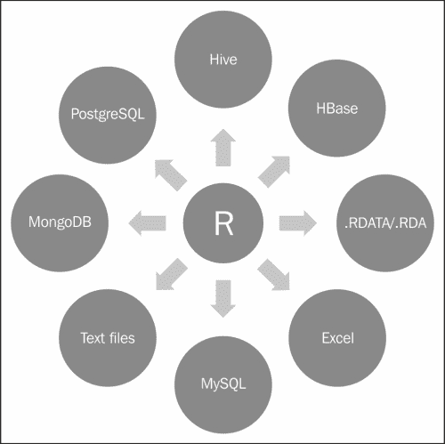

# 第七章 从各种数据库导入和导出数据

在本章的最后，我们将看到如何将来自不同来源的数据加载到 R 中，以执行数据分析操作。在这里，我们考虑了一些流行的数据库，它们被用作数据存储，支持不同应用和技术下的分析操作。如我们所知，使用 R 执行分析操作相较于其他分析工具非常简单，而且 R 是免费的、开源的。由于 R 可以通过安装 R 包使用自定义函数，CRAN 上有许多数据库包可供与 R 连接使用。因此，R 编程语言因其数据库独立性以及操作系统独立性，越来越受欢迎。

我们特别设计了本章，旨在分享如何将来自不同数据库系统的数据加载到 R 中进行数据建模。我们在本章中包括了多个流行的数据库示例，用于执行各种数据库操作。

我们已经覆盖了与 R 一起使用的各种流行数据源。它们如下：

+   RData

+   MySQL

+   Excel

+   MongoDB

+   SQLite

+   PostgreSQL

+   Hive

+   HBase



从上面的图表中，我们可以理解到，R 支持多种数据库系统，可以在不同的数据库上执行与数据分析相关的操作。由于 R 有大量的库可以连接各种数据库，我们只需要继承它们即可。

在下面的表格中，列出了常见的数据库系统及其相关的 R 包，以便更容易理解相关的 R 包：

| 数据库系统名称 | 有用的 R 包 / 函数工具 |
| --- | --- |
| 文本文件 | 文本数据文件，如`.csv`、`.txt`和`.r` |
| MySQL | RMySQL |
| Excel | Xlsx |
| Mongo | RMongo |
| SQLlite | RSQLlite |
| PostgreSQL | RPostgreSQL |
| HDFS | RHDFS |
| Hive | RHive |
| HBase | RHBase |

正如我们所知，提到的每个数据库都有其独特的重要性和功能。为了更好地理解，每个数据源都将通过以下几点进行描述：

+   介绍

+   特性

+   安装

+   将数据导入到 R 中

+   数据操作

+   从 R 导出数据

在本章中，我们将安装并使用 R 包，这些包将用于 R 中的各种数据操作。

现在，我们将开始了解数据库以及如何执行与数据相关的操作，以便为所有数据库的后续数据分析做准备。

# 学习数据文件作为数据库

在进行数据分析活动时，我们需要不断进行数据导入、加载或导出功能。有时，可能需要使用 R 编程语言反复执行相同的操作。因此，我们可以使用 R 的现有函数来执行相同的数据操作。

## 理解不同类型的文件

常用的 R 数据存储操作文件有四种不同的类型。它们如下：

+   CSV（逗号分隔值）

+   Txt（带有制表符分隔值）

+   .RDATA（R 的本地数据格式）

+   .rda（R 的本地数据格式）

## 安装 R 包

要使用之前指定格式的数据文件，我们不需要额外安装 R 包。我们只需要使用 R 提供的内置函数。

## 将数据导入 R

要执行与分析相关的活动，我们需要使用以下函数将数据导入 R：

+   CSV：`read.csv()` 用于读取 **逗号分隔值**（**CSV**）文件，其中小数点是 `","`。检索到的数据将存储到一个 R 对象中，这被视为 `Dataframe`。

    ```py
    Dataframe <- read.csv("data.csv",sep=",")

    ```

+   TXT：要检索制表符分隔的值，`read.table()` 函数将与一些重要参数一起使用，该函数的返回类型将是 `Dataframe 类型`。

    ```py
    Dataframe <- read.table("data.csv", sep="\t")

    ```

+   .RDATA：此处，.RDATA 格式由 R 用于存储特定时间段的工作区数据。它被视为图像文件。这将存储/检索工作区中所有可用的数据。

    ```py
    load("history.RDATA")

    ```

+   .rda：这也是 R 的本地数据格式，根据需要存储特定的数据变量。

    ```py
    load("data_variables_a_and_b.rda")

    ```

## 从 R 导出数据

要从 R 导出现有的数据对象并支持按要求的数据文件，我们需要使用以下函数：

+   CSV：通过以下命令将 dataframe 对象写入 `csv` 数据文件：

    ```py
    write.csv(mydata, "c:/mydata.csv", sep=",", row.names=FALSE)

    ```

+   TXT：通过以下命令将数据写入带有制表符分隔符的数据文件：

    ```py
    write.table(mydata, "c:/mydata.txt", sep="\t")

    ```

+   .RDATA：要存储可用于 R 会话的工作区数据变量，请使用以下命令：

    ```py
    save.image()

    ```

+   .rda：此函数用于存储特定的数据对象，供以后使用。使用以下代码将它们保存到 `.rda` 文件中。

    ```py
    # column vector
    a <- c(1,2,3)

    # column vector
    b <- c(2,4,6)

    # saving it to R (.rda) data format
    save(a, b, file=" data_variables_a_and_b.rda")

    ```

# 理解 MySQL

MySQL 是世界上最流行的开源数据库。世界上许多最大和发展最快的组织，包括 Facebook、Google、Adobe 和 Zappos，都依赖 MySQL 数据库，以节省时间和金钱，支持高流量的网站、关键业务系统和软件包。

由于 R 和 MySQL 都是开源的，它们可以用于构建交互式网页分析应用程序。同时，借助这个独特的包，也可以对现有的网页应用程序进行简单的数据分析。

要在 Linux 机器上安装 MySQL，您需要按照以下步骤顺序进行操作：

+   安装 MySQL

+   安装 RMySQL

## 安装 MySQL

我们将看到如何在 Linux 上安装 MySQL：

```py
// Updating the linux package list
sudo apt-get update

// Upgrading the updated packages
sudo apt-get dist-upgrade

//First, install the MySQL server and client packages:
sudo apt-get install mysql-server mysql-client

```

### 提示

使用以下命令登录到 MySQL 数据库：

```py
mysql -u root -p

```

## 安装 RMySQL

现在，我们已经在 Linux 机器上安装了 MySQL。是时候通过以下 R 命令从 CRAN 安装 RMySQL 库：

```py
# to install RMySQL library
install.packages("RMySQL")

#Loading RMySQL
library(RMySQL)

```

在 RMySQL 库安装在 R 上后，通过提供 MySQL 管理控制台中提供的用户权限，执行 MySQL 数据库连接：

```py
mydb = dbConnect(MySQL(), user='root', password='', dbname='sample_table', host='localhost')

```

## 学习列出表格及其结构

现在，数据库连接已成功完成。要列出 MySQL 数据库中可用的表及其数据结构，可以查看以下命令。要返回 `mydb` 数据库下创建的可用表，请使用以下命令：

```py
dbListTables(mydb)

```

要返回在 `sample_table` 表中创建的数据字段列表，请使用以下命令：

```py
dbListFields(mydb, 'sample_table')

```

## 将数据导入到 R 中

我们知道如何检查 MySQL 表及其字段。在识别出有用的数据表后，我们可以使用以下 RMySQL 命令将其导入 R 中。为了根据提供的 SQL 查询从 MySQL 数据库中检索自定义数据，我们需要将其存储在一个对象中：

```py
rs = dbSendQuery(mydb, "select * from sample_table")

```

可用的数据相关信息可以通过以下 `fetch` 命令从 MySQL 获取到 R 中：

```py
dataset = fetch(rs, n=-1)

```

在此，指定参数 `n = -1` 用于检索所有待处理的记录。

## 理解数据操作

要执行 MySQL 数据库的数据操作，我们需要执行 SQL 查询。但在 RMySQL 的情况下，我们可以通过 `dbSendQuery` 函数执行命令。

使用现有的 R 数据框在 MySQL 数据库中创建新表可以通过以下命令完成：

```py
dbWriteTable(mydb, name='mysql_table_name', value=data.frame.name)

```

要将 R 矩阵数据插入到 MySQL 中现有的数据表，可以使用以下命令：

```py
# defining data matrix
datamatrix <- matrix(1:4, 2, 2)

# defining query to insert the data
query <- paste("INSERT INTO names VALUES(",datamatrix [1,1], ",", datamatrix [1,2], ")")

# command for submitting the defined SQL query dbGetQuery(con, query)

```

有时候，当 MySQL 表不再使用时，我们需要删除它。可以执行以下查询来删除 `mysql_some_table` 表：

```py
dbSendQuery(mydb, 'drop table if exists mysql_some_table').

```

# 理解 Excel

Excel 是由微软开发的一款电子表格应用程序，支持在 Windows 和 Mac OS 上运行，具有类似于 R 的功能，用于执行统计计算、图形可视化和数据建模。Excel 是微软在 Microsoft Office 套件中提供的，主要支持 `.xls` 电子表格数据文件格式。如果我们希望从 R 中读取或写入 Microsoft Excel 电子表格，可以使用许多可用的 R 包。但其中一个流行且有效的 R 库是 xlsx。

该包通过编程方式提供对 Excel 文件的控制，允许用户将 `.xlsx` 文档的电子表格读取到 `data.frame` 中，并将 `data.frame` 写入文件。该包是由 *Adrian A. Dragulescu* 开发的。

## 安装 Excel

在这里，我们将 `.xls` 文件作为数据源，可以借助 Microsoft Excel 97/2000/XP/2003 来构建和维护该文件。

以下是 xlsx 包的前提条件：

+   xlsxjars

+   rJava

安装 xlsxX 包：

+   Install.packages("xlsxjars")

+   Install.packages("rJava")

+   Install.packages("xlsx")

## 将数据导入到 R 中

假设我们已经创建了一个 Excel 文件，现在我们希望在 R 中执行与数据分析相关的操作，那么这个包是将 Excel 文件加载到 R 中进行处理的最佳选择。

```py
es <- read.xlsx("D:/ga.xlsx",1) 

```

前面的命令将把 Excel 数据（带有工作表 1）存储到 R 中的 `es` 数据框格式。

## 理解 R 和 Excel 中的数据操作

以下命令将用于选择数据框`res`的子集，其中选择前五行：

```py
r <- res[1:5,]

```

## 将数据导出到 Excel

根据定义的名称，处理后的数据可以以`xls`文件格式存储，支持 Excel。

```py
ress <- write.xlsx(r, "D:/ga1.xls") 

```

# 理解 MongoDB

MongoDB 是一种基于 NoSQL 的分布式文档数据存储。它特别设计用于提供可扩展且高性能的数据存储解决方案。在许多场景中，它可以用来替代传统的关系型数据库或键值数据存储。Mongo 的最大特点是其查询语言，非常强大，语法与面向对象的查询语言有些相似。

以下是 MongoDB 的特点：

+   面向集合的存储，易于存储对象类型

+   支持动态查询

+   完整的索引支持

+   丰富的查询语言

+   数据碎片处理顺序以支持云级扩展

+   基于 BSON 的文件数据存储

+   支持 C、C++、C#、Erlang、Haskell、Java、JavaScript、Perl、PHP、Python、Ruby 和 Scala

我们可以通过安装以下先决条件，将 R 和 MongoDB 一起使用：

+   MongoDB 安装

+   rmongodb 安装

## 安装 MongoDB

以下是在 Ubuntu 12.04 和 CentOS 中安装 MongoDB 的步骤：

首先，我们将看到 Ubuntu 的安装步骤。

1.  使用以下命令配置软件包管理系统（APT）：

    ```py
    sudo apt-key adv --keyserverhkp://keyserver.ubuntu.com:80 --recv 7F0CEB10

    ```

1.  使用以下命令创建`/etc/apt/sources.list.d/mongodb.list`：

    ```py
    echo 'deb http://downloads-distro.mongodb.org/repo/ubuntu-upstart dist 10gen' | sudo tee /etc/apt/sources.list.d/mongodb.list

    ```

1.  现在，使用以下命令更新您的操作系统软件包列表：

    ```py
    sudo apt-get update

    ```

1.  使用以下命令安装 MongoDB 的最新版本：

    ```py
    apt-get install mongodb-10gen

    ```

现在，我们将看到 CentOS 的安装步骤。

1.  配置软件包管理系统（YUM）。

1.  创建`/etc/yum.repos.d/mongodb.repo`并使用以下配置：

    +   对于 64 位系统，请使用以下命令：

        ```py
        [mongodb]
        name=MongoDB Repository
        baseurl=http://downloads-distro.mongodb.org/repo/redhat/os/x86_64/
        gpgcheck=0
        enabled=1

        ```

    +   对于 32 位系统，请使用以下命令：

        ```py
        [mongodb]
        name=MongoDB Repository
        baseurl=http://downloads-distro.mongodb.org/repo/redhat/os/i686/
        gpgcheck=0
        enabled=1

        ```

1.  安装软件包。

使用以下命令，安装 MongoDB 的稳定版本及相关工具：

```py
yum install mongo-10gen mongo-10gen-server

```

现在，您已成功安装 MongoDB。

### 提示

**用于控制 mongodb 服务的有用命令**

要启动 mongodb 服务，我们使用以下命令：

```py
sudo service mongodb start

```

要停止 mongodb 服务，我们使用以下命令：

```py
sudo service mongodb stop

```

要重启 mongodb 服务，我们使用以下命令：

```py
sudo service mongodb restart

```

要启动 Mongo 控制台，我们使用以下命令：

```py
mongo

```

### SQL 映射到 MongoDB

以下是 SQL 术语与 MongoDB 术语的映射，帮助更好地理解数据存储：

| 序号 | SQL 术语 | MongoDB 术语 |
| --- | --- | --- |
| 1. | 数据库 | 数据库 |
| 2. | 表 | 集合 |
| 3. | 索引 | 索引 |
| 4. | 行 | 文档 |
| 5. | 列 | 字段 |
| 6. | 加入 | 嵌入与链接 |

### SQL 映射到 MongoQL

以下是 SQL 语句与 Mongo QL 语句的映射，帮助理解查询开发/转换：

| 序号 | SQL 语句 | Mongo QL 语句 |
| --- | --- | --- |
| 1. |

```py
INSERT INTO students VALUES(1,1)

```

|

```py
$db->students->insert(array("a" => 1, "b" => 1));

```

|

| 2. |
| --- |

```py
SELECT a, b FROM students

```

|

```py
$db->students->find(array(), array("a" => 1, "b" => 1));

```

|

| 3. |
| --- |

```py
SELECT * FROM students WHERE age < 15

```

|

```py
$db->students->find(array("age" => array('$lt' => 15)));

```

|

| 4. |
| --- |

```py
UPDATE students SET a=1 WHERE b='q'

```

|

```py
$db->students->update(array("b" => "q"), array('$set' => array("a" => 1)));

```

|

| 5. |
| --- |

```py
DELETE FROM students WHERE name="siddharth"

```

|

```py
$db->students->remove(array("name" => " siddharth"));

```

|

## 安装 rmongodb

要在 R 中使用 MongoDB，我们需要安装带有 rmongodb 库的 R。我们可以通过以下命令从 CRAN 安装 rmongodb：

```py
# installing library rmongodb in R
install.packages (rmongodb)

```

## 将数据导入 R

我们已经学习了如何在 Ubuntu 12.04 上安装 MongoDB。现在，我们可以对数据执行所有必要的操作。在本节中，我们将学习如何在 R 中处理和导入 Mongo 数据进行数据分析活动。加载库时，我们使用以下命令：

```py
# loading the library of rmongodb
library (rmongodb)

Mongo connection establishment
mongo <-mongo.create ()

Check whether the normal series
mongo.is.connected (mongo)

Create a BSON object cache
buf <- mongo.bson.buffer.create ()

Add element to the object buf
mongo.bson.buffer.append (buf, "name", "Echo")

```

`mongo.bson` 类的对象用于存储 BSON 文档。BSON 是 MongoDB 用来在其数据库中存储文档的格式。MongoDB 的网络流量也使用 BSON 消息：

```py
b <- mongo.bson.from.list(list(name="Fred", age=29, city="Boston"))iter <- mongo.bson.iterator.create(b)  # b is of class "mongo.bson"while (mongo.bson.iterator.next(iter))print(mongo.bson.iterator.value(iter))

```

## 了解数据操作

现在我们将看到如何在 R 中操作 Mongo 数据对象：

```py
# To check whether mongo is connected or not in R.
if (mongo.is.connected(mongo)) {ns <- "test.people"
#Returns a fresh mongo.bson.buffer object ready to have data 
#appended onto it in R.buf <- mongo.bson.buffer.create()mongo.bson.buffer.append(buf, "name", "Joe")criteria <- mongo.bson.from.buffer(buf)

# mongo.bson.buffer objects are used to build mongo.bson objects.buf <- mongo.bson.buffer.create()
 mongo.bson.buffer.start.object(buf, "inc")mongo.bson.buffer.append(buf, "age", 1L)mongo.bson.buffer.finish.object(buf)objNew <- mongo.bson.from.buffer(buf)# increment the age field of the first record   matching name "Joe"mongo.update(mongo, ns, criteria, objNew)

# mongo.bson.buffer objects are used to build mongo.bson objects.buf <- mongo.bson.buffer.create()mongo.bson.buffer.append(buf, "name", "Jeff")criteria <- mongo.bson.from.buffer(buf)

# mongo.bson.buffer objects are used to build mongo.bson objects.buf <- mongo.bson.buffer.create()mongo.bson.buffer.append(buf, "name", "Jeff")mongo.bson.buffer.append(buf, "age", 27L)objNew <- mongo.bson.from.buffer(buf)# update the entire record to { name: "Jeff", age: 27 }# where name equals "Jeff"# if such a record exists; otherwise, insert this as a new reordmongo.update(mongo, ns, criteria, objNew,mongo.update.upsert)# do a shorthand update:mongo.update(mongo, ns, list(name="John"), list(name="John", age=25))}

```

# 了解 SQLite

SQLite 是一个使用 C 编程语言开发的关系型数据库管理系统。SQLite 遵循 ACID 原则，并实现了大部分 SQL 标准。与其他数据库系统不同，SQLite 没有独立的进程来为客户端应用程序提供数据。它是一个嵌入式 SQL 数据库引擎。SQLite 系统直接读取和写入系统磁盘文件，因为它是一个基于文件的数据库。相关的 SQL 数据库包含多个表、索引和视图，并且这种数据库文件格式支持跨平台使用。

快速了解事务的 ACID 属性：

为了执行事务，需要满足一系列属性。它们是原子性、一致性、隔离性和持久性，具体解释如下：

+   原子性指的是数据库所有任务都必须执行的保证。

+   一致性确保数据库始终保持一致状态，就像我们开始之前的状态一样。

+   隔离性指的是在事务期间，其他操作无法访问或查看数据的中间状态。

+   持久性指的是一旦用户收到成功通知，事务将会持久化，不会被撤销。这意味着它能在系统故障后生存，并且数据库系统已检查完整性约束，且不需要中止事务。

## 了解 SQLite 的特点

以下是遵循 ACID 属性的 SQLite 数据库特性：

+   零配置

+   支持跨平台的磁盘格式

+   比客户端-服务器型数据库系统更快

+   易于使用的 API

使用 SQLite 和 R 一起使用时，我们需要以下先决条件：

+   SQLite 安装

+   安装 RSQLite

## 安装 SQLite

要在 Ubuntu 中安装 SQLite 数据库，请遵循给定的命令：

```py
// install sqllite by firing the following commands
sudo apt-get purge sqlite3 sqlite3-doc libsqlite3-0
sudo apt-get autoremove
sudo apt-get install sqlite3 sqlite3-doc

```

## 安装 RSQLite

我们可以通过以下命令安装 RSQLite：

```py
# installing RSQLite library from CRAN in R
Install.packages("RSQLite")

```

## 将数据导入 R

我们将看到如何使用 RSQLite 包将数据插入 R 中。

要加载已安装的包，我们使用以下命令：

```py
#loading the installed package
library("RSQLite")

```

使用以下命令，您可以连接到数据库并列出所有数据库中的表：

```py
# connect to db
con <- dbConnect(SQLite(), dbname="data/first.db")

# list all tables
tables <- dbListTables(con)

# exclude sqlite_sequence (contains table information)
tables <- tables[tables != "sqlite_sequence"]
lDataFrames <- vector("list", length=length(tables))

# create a data.frame for each table
for (i in seq(along=tables)) {
 lDataFrames[[i]] <- dbGetQuery(conn=con, statement=paste("SELECT * FROM '", tables[[i]], "'", sep=""))
}

```

## 了解数据操作

我们可以使用以下命令操作数据集：

```py
dbBeginTransaction(con)
rs <- dbSendQuery(con, "DELETE from candidates WHERE age > 50")
Exporting the data from Rdata(USArrests)
dbWriteTable(con, "USArrests", USArrests)

```

# 理解 PostgreSQL

PostgreSQL 是一个开源的对象关系型数据库管理系统。PostgreSQL 可以在大多数操作系统上运行，如 Linux、UNIX 和 Windows。它支持文本、图像、声音和视频数据源。它还支持 C、C++、Java、Python、Ruby 和 Tcl 等编程技术。

## 理解 PostgreSQL 的特性

以下是 PostgreSQL 的特性：

+   复杂 SQL 查询

+   完全符合 ACID 规范

+   SQL 子查询

使用 PostgreSQL 在 R 中时，我们需要安装以下先决条件：

+   安装 PostgreSQL

+   安装 RPostgreSQL

## 安装 PostgreSQL

在这一节中，我们将学习如何安装 PostgreSQL。

安装 PostgreSQL 时，将按照以下命令进行：

```py
// updating the packages list
Sudo apt-get update

// installing postgresql 
sudo apt-get install postgresql postgresql-contrib

// creating postgresql user
su – postgres createuser

```

## 安装 RPostgreSQL

现在我们将了解如何安装并使用 RPostgreSQL：

```py
# installing package from CRAN
install.packages(RPostgreSQL)
Importing the data into R# loading the installed package
library(RPostgreSQL)

## load the PostgreSQL driver
drv <- dbDriver("PostgreSQL")

## Open a connection
con <- dbConnect(drv, dbname="oxford")

## Submits a statement
rs <- dbSendQuery(con, "select * from student")

## fetch all elements from the result set
fetch(rs,n=-1)

## Closes the connection
dbDisconnect(con)

## Frees all the resources on the driver
dbUnloadDriver(drv)

```

使用以下代码，我们将学习如何在 R 中操作存储在 PostgreSQL 中的数据：

```py
opendbGetQuery(con, "BEGIN TRANSACTION")
rs <- dbSendQuery(con,
"Delete * from sales as p where p.cost>10")
if(dbGetInfo(rs, what = "rowsAffected") > 250){
  warning("Rolling back transaction")
  dbRollback(con)
}else{
  dbCommit(con)
}
```

## 从 R 中导出数据

在这一节中，我们将学习如何加载数据，将数据框中的内容写入指定的表，并从数据库连接中删除指定的表：

```py
conn <- dbConnect("PostgreSQL", dbname = "wireless")
if(dbExistsTable(con, "frame_fuel")){
  dbRemoveTable(conn, "frame_fuel")
  dbWriteTable(conn, "frame_fuel", fuel.frame)
}
if(dbExistsTable(conn, "RESULTS")){
  dbWriteTable(conn, "RESULTS", results2000, append = T)
  else
  dbWriteTable(conn, "RESULTS", results2000)
}
```

# 理解 Hive

Hive 是一个基于 Hadoop 的数据仓库框架，由 Facebook 开发。它允许用户使用 SQL 查询，并通过 HiveQL 等语言将查询高度抽象化为 Hadoop MapReduce。这使得没有 MapReduce 经验的 SQL 程序员能够使用该数据仓库，并且便于与商业智能和可视化工具集成，实现实时查询处理。

## 理解 Hive 的特性

以下是 Hive 的特性：

+   Hibernate 查询语言（HQL）

+   支持 UDF

+   元数据存储

+   数据索引

+   不同的存储类型

+   Hadoop 集成

RHive 的先决条件如下：

+   Hadoop

+   Hive

我们假设读者已经配置了 Hadoop；如果没有，他们可以通过 第一章，*准备使用 R 和 Hadoop* 来学习 Hadoop 的安装。由于运行 RHive 需要 Hive，我们将首先了解如何安装 Hive。

## 安装 Hive

安装 Hive 的命令如下：

```py
// Downloading the hive source from apache mirror
wget http://www.motorlogy.com/apache/hive/hive-0.11.0/hive-0.11.0.tar.gz

// For extracting the hive source
tar xzvf  hive-0.11.0.tar.gz

```

### 设置 Hive 配置

要设置 Hive 配置，我们需要通过添加几项内容来更新 `hive-site.xml` 文件：

+   使用以下命令更新 `hive-site.xml` 文件：

    ```py
    <description> JDBC connect string for a JDBC metastore </ description>
    </Property>

    <property>
    <name> javax.jdo.option.ConnectionDriverName </ name>
    <value> com.mysql.jdbc.Driver </ value>
    <description> Driver class name for a JDBC metastore </ description>
    </Property>

    <property>
    <name> javax.jdo.option.ConnectionUserName </ name>
    <value> hive </value>
    <description> username to use against metastore database </ description>
    </ Property>

    <property>
    <name> javax.jdo.option.ConnectionPassword </name>
    <value> hive</value>
    <description> password to use against metastore database </ description>
    </Property>

    <property>
    <name> hive.metastore.warehouse.dir </ name>
    <value> /user/hive/warehouse </value>
    <description> location of default database for the warehouse </ description>
    </Property>
    ```

+   通过添加以下行来更新 `hive-log4j.properties`：

    ```py
    log4j.appender.EventCounter = org.apache.hadoop.log.metrics.EventCounter

    ```

+   使用以下命令更新环境变量：

    ```py
    export $HIVE_HOME=/usr/local/ hive-0.11.0

    ```

+   在 HDFS 中，为 Hive 创建特定目录：

    ```py
    $HADOOP_HOME/bin/ hadoop fs-mkidr /tmp
    $HADOOP_HOME/bin/ hadoop fs-mkidr /user/hive/warehouse
    $HADOOP_HOME/bin/ hadoop fs-chmod g+w / tmp
    $HADOOP_HOME/bin/ hadoop fs-chmod g+w /user/hive/warehouse

    ```

    ### 提示

    要启动 Hive 服务器，需要从 `HIVE_HOME` 执行 `hive --service hiveserver` 命令。

## 安装 RHive

+   使用以下命令安装依赖库 `rjava`：

    ```py
    // for setting up java configuration variables
    sudo R CMD javareconf

    // Installing rJava package
    install.packages ("rJava")

    // Installing RHive package from CRAN
    install.packages("RHive")

    // Loading RHive library
    library("RHive")

    ```

## 理解 RHive 操作

我们将了解如何使用 RHive 库在 R 中加载并操作 Hive 数据集：

+   初始化 RHive 时，我们使用：

    ```py
    rhive.init ()

    ```

+   要连接到 Hive 服务器，我们使用：

    ```py
    rhive.connect ("192.168.1.210")

    ```

+   要查看所有表，我们使用：

    ```py
    rhive.list.tables ()
     tab_name
    1 hive_algo_t_account
    2 o_account
    3 r_t_account

    ```

+   要查看表结构，我们使用：

    ```py
    rhive.desc.table ('o_account');
     col_name data_type comment

    1 id int
    2 email string
    3 create_date string

    ```

+   执行 HQL 查询时我们使用：

    ```py
    rhive.query ("select * from o_account");

    ```

+   关闭与 Hive 服务器的连接时我们使用：

    ```py
    rhive.close()

    ```

# 理解 HBase

Apache HBase 是一个分布式大数据存储系统，适用于 Hadoop。它允许对大数据进行随机、实时的读写访问。该系统设计为面向列的数据存储模型，灵感来自于 Google Bigtable。

## 理解 HBase 的特性

以下是 HBase 的特性：

+   使用 XML 的 RESTful web 服务

+   线性和模块化的可扩展性

+   严格一致的读写操作

+   可扩展的 shell

+   用于实时查询的块缓存和布隆过滤器

RHBase 的前提条件如下：

+   Hadoop

+   HBase

+   Thrift

在这里我们假设用户已经为其 Linux 机器配置了 Hadoop。如果有人想了解如何在 Linux 上安装 Hadoop，请参考 第一章，*准备使用 R 和 Hadoop*。

## 安装 HBase

以下是安装 HBase 的步骤：

1.  下载 HBase 的 tar 文件并解压：

    ```py
    wget http://apache.cs.utah.edu/hbase/stable/hbase-0.94.11.tar.gz

    tar -xzf hbase-0.94.11.tar.gz

    ```

1.  进入 HBase 安装目录并更新配置文件：

    ```py
    cd hbase-0.94.11/

    vi conf/hbase-site.xml

    ```

1.  修改配置文件：

    1.  更新 `hbase-env.sh`。

        ```py
        ~ Vi conf / hbase-env.sh 

        ```

    1.  设置 HBase 配置：

        ```py
         export JAVA_HOME = /usr/lib/jvm/java-6-sun
         export HBASE_HOME = /usr/local/hbase-0.94.11
         export HADOOP_INSTALL = /usr/local/hadoop
         export HBASE_CLASSPATH = /usr/local/hadoop/conf
         export HBASE_MANAGES_ZK = true

        ```

    1.  更新 `hbase-site.xmlzxml`：

        ```py
        Vi conf / hbase-site.xml

        ```

    1.  修改 `hbase-site.cml`，其内容应类似于以下代码：

        ```py
            <configuration>
              <property>
                <name> hbase.rootdir </name>
                <value> hdfs://master:9000/hbase </value>
              </Property>

              <property>
                <name>hbase.cluster.distributed </name>
                <value>true</value>
              </Property>

              <property>
                 <name>dfs.replication </name>
                 <value>1</value>
              </Property>

              <property>
                <name>hbase.zookeeper.quorum </name>
                <value>master</value>
              </Property>

              <property>
                  <name>hbase.zookeeper.property.clientPort </name>
                  <value>2181</value>
              </Property>

              <property>
                <name>hbase.zookeeper.property.dataDir </name>
                <value>/root/hadoop/hdata</​​value>
              </Property>
            </ Configuration>
        ```

        ### 提示

        如果使用了独立的 Zookeeper 配置，则需要更改配置。

    1.  复制 Hadoop 环境配置文件和库文件。

        ```py
        Cp $HADOOP_HOME/conf/hdfs-site.xml $HBASE_HOME/conf
        Cp $HADOOP_HOME/hadoop-core-1.0.3.jar $HBASE_HOME/lib
        Cp $HADOOP_HOME/lib/commons-configuration-1.6.jar $HBASE_HOME/lib
        Cp $HADOOP_HOME/lib/commons-collections-3.2.1.jar $HBASE_HOME/lib

        ```

## 安装 thrift

以下是安装 thrift 的步骤：

1.  从网上下载 thrift 源码并将其放置到客户端。我们将使用 Ubuntu O.S 12.04 来完成此操作：

    ```py
    get http://archive.apache.org/dist/thrift/0.8.0/thrift-0.8.0.tar.gz

    ```

1.  使用以下命令解压下载的 `.tar.gz` 文件：

    ```py
    tar xzvf thrift-0.8.0.tar.gz
    cd thrift-0.8.0/

    ```

1.  编译配置参数：

    ```py
    ./Configure

    ```

1.  安装 thrift：

    ```py
    Make
    Make install

    ```

    ### 提示

    启动 HBase thrift 服务器时，我们需要调用以下命令：

    ```py
    $HBASE_HOME/bin/hbase-daemon.sh start

    ```

## 安装 RHBase

安装 HBase 后，我们将展示如何获取 RHBase 库。

+   安装 `rhbase` 时使用以下命令：

    ```py
    wget https://github.com/RevolutionAnalytics/rhbase/blob/master/build/rhbase_1.2.0.tar.gz

    ```

+   使用以下命令安装下载的包：

    ```py
    R CMD INSTALL rhbase_1.2.0.tar.gz

    ```

## 将数据导入到 R 中

一旦 RHBase 安装完成，我们可以借助 RHBase 将数据集从 HBase 加载到 R 中：

+   列出所有表时我们使用：

    ```py
    hb.list.tables ()

    ```

+   创建新表时我们使用：

    ```py
    hb.new.table ("student")

    ```

+   显示表结构时我们使用：

    ```py
    hb.describe.table("student_rhbase")

    ```

+   读取数据时我们使用：

    ```py
    hb.get ('student_rhbase', 'mary')

    ```

## 理解数据操作

现在，我们将展示如何在 R 中操作 HBase 数据集：

+   创建表时我们使用：

    ```py
    hb.new.table ("student_rhbase", "info")

    ```

+   插入数据时我们使用：

    ```py
    hb.insert ("student_rhbase", list (list ("mary", "info: age", "24")))

    ```

+   删除表时我们使用：

    ```py
    hb.delete.table ('student_rhbase')

    ```

# 总结

在本章中，我们学习了如何将与各种数据库系统和其数据集集成的 R 包加载到 R 中进行数据分析。大多数流行的数据库系统都提供了 R 包，用于加载数据、更新数据以及查询数据以进行分析。
