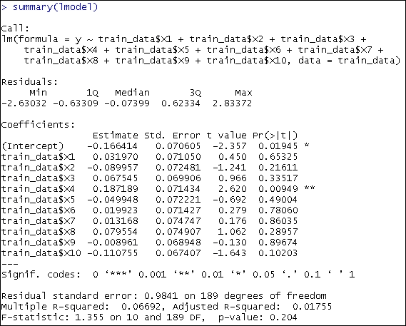
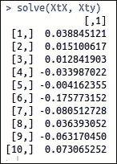
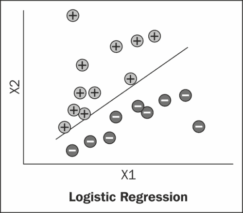
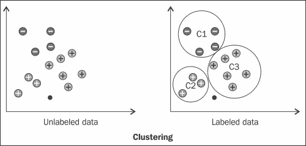
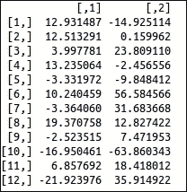
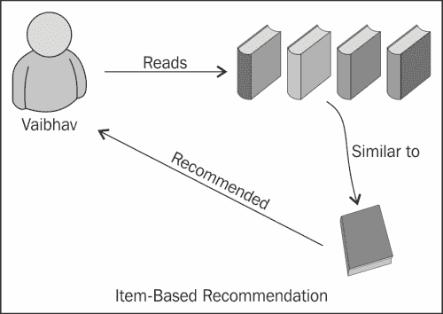

# 六、使用机器学习理解大数据分析

在本章中，我们将学习不同的机器学习技术，这些技术可以与 R 和 Hadoop 一起使用，借助以下几点来执行大数据分析:

*   机器学习导论
*   机器学习算法的类型
*   监督机器学习算法
*   无监督机器学习算法
*   推荐算法

# 机器学习入门

机器学习是人工智能的一个分支，它允许我们在没有明确编程的情况下使我们的应用变得智能。机器学习概念用于使应用能够从可用的数据集做出决策。机器学习和数据挖掘的结合可用于开发垃圾邮件检测器、自动驾驶汽车、语音识别、人脸识别和在线交易欺诈活动检测。

有许多流行的组织正在使用机器学习算法来使他们的服务或产品理解用户的需求，并根据他们的行为提供服务。谷歌有自己的智能网络搜索引擎，它提供排名第一的搜索，谷歌邮件中的垃圾邮件分类，谷歌新闻中的新闻标签，以及推荐系统的亚马逊。有许多开源框架可用于开发这些类型的应用/框架，例如 R、Python、Apache Mahout 和 Weka。

## 机器学习算法的类型

智能系统开发有三种不同类型的机器学习算法:

*   监督机器学习算法
*   无监督机器学习算法
*   推荐系统

在这一章中，我们将讨论众所周知的分类、回归和聚类的业务问题，以及如何在 Hadoop 上执行这些机器学习技术来克服内存问题。

如果您加载一个无法装入机器内存的数据集，并尝试运行它，预测分析将抛出一个与机器内存相关的错误，例如**错误:无法分配大小为 990.1 MB 的向量**。解决办法是增加机器配置或与商品硬件并行。

# 监督机器学习算法

在这一部分，我们将学习监督机器学习算法。算法如下:

*   线性回归
*   逻辑回归

## 线性回归

线性回归主要是基于历史信息进行预测值的预测。回归是一种有监督的机器学习技术，用于识别目标变量和解释变量之间的线性关系。我们可以说它是用来预测目标变量值的数值形式。

在下一节中，我们将学习使用 R 的线性回归以及使用 R 和 Hadoop 的线性回归。

这里，将被预测的变量视为目标变量，将帮助预测目标变量的变量称为解释变量。通过线性关系，我们可以确定解释变量的变化对目标变量的影响。

在数学中，回归可以表述如下:

y = ax +e

其他公式包括:

*   The slope of the regression line is given by:

    a= （NSxy - （Sx）（Σy）） / （NSx <sup>2</sup> - （Sx） <sup>2</sup> ）

*   The intercept point of regression is given by:

    e = （Σy - b（Σx）） / N

这里， *x* 和 *y* 是构成数据集的变量， *N* 是数值的总数。

假设我们有下表所示的数据:

<colgroup><col style="text-align: left"> <col style="text-align: left"></colgroup> 
| 

x

 | 

y

 |
| --- | --- |
| Sixty-three | Three point one |
| Sixty-four | Three point six |
| Sixty-five | Three point eight |
| Sixty-six | four |

如果我们有一个新的值 *x* ，我们可以借助回归公式得到 *y* 的值。

线性回归的应用包括:

*   销售预测
*   预测最佳产品价格
*   预测各种来源和活动的下一次在线购买

让我们看一下为所提供的数据集实现回归模型的统计技术。假设我们得到了 n 个统计数据单元。


其公式如下:

y = e<sub>0</sub>+a<sub>0</sub>x<sub>0</sub>+a<sub>1</sub>x<sub>1</sub>+a<sub>2</sub>x<sub>2</sub>+a<sub>3</sub>x<sub>3</sub>+a<sub>4</sub>x<sub>4</sub>

这里 *Y* 是目标变量(响应变量) *xi* 是解释变量*e<sub>0</sub>T9】是平方误差项之和，可以认为是噪声。为了得到更准确的预测，我们需要借助`call`函数尽快将这个误差项减少为。*

### R 的线性回归

现在我们来看看如何在 r 中进行线性回归，我们可以使用内置的`lm()`方法来用 r 建立线性回归模型。

```r
Model <-lm(target ~ ex_var1, data=train_dataset)
```

它将基于所提供的数据集的属性建立一个回归模型，并存储所有用于从模型变量值预测和识别数据模式的变量系数和模型参数。

```r
# Defining data variables
X = matrix(rnorm(2000), ncol = 10)
y = as.matrix(rnorm(200))

# Bundling data variables into dataframe
train_data <- data.frame(X,y)

# Training model for generating prediction
lmodel<- lm(y~ train_data $X1 + train_data $X2 + train_data $X3 + train_data $X4 + train_data $X5 + train_data $X6 + train_data $X7 + train_data $X8 + train_data $X9 + train_data $X10,data= train_data)

summary(lmodel)
```

以下是可以用前面的`summary`命令显示的各种模型参数:

*   **RSS** :等于∑(yaactual-y)<sup>2</sup>。
*   **自由度** ( **自由度**):用于识别预测模型的拟合程度，应尽可能小(逻辑上，值 0 表示完美预测)。
*   **残差标准误差** ( **RSS/DF** ):用于识别预测模型的拟合优度，应该尽可能小(逻辑上，值 0 表示完美预测)。
*   **pr** :这是一个变量被纳入模型的概率；要包含的变量应该小于 0.05。
*   **t 值**:这个等于 15。
*   **f** :这是检查 R 平方是否为非零值的统计量。



### 用 R 和 Hadoop 进行线性回归

假设我们有一个大数据集。我们现在将如何进行回归数据分析？在这种情况下，我们可以使用 R 和 Hadoop 集成来通过实现映射器和减速器来执行并行线性回归。它会将数据集分成可用节点中的块，然后它们会并行处理分布式数据。当我们使用 R 和 Hadoop 集群运行时，它不会引发内存问题，因为大数据集将在 Hadoop 计算节点之间使用 R 进行分发和处理。此外，请记住，这种实现的方法不能提供比 `lm()`模型更高的预测精度。

这里使用 RHadoop 进行 R 和 Hadoop 的集成，这是 **Revolution Analytics** 值得信赖的开源发行版。欲了解更多关于 RHadoop 的信息，请访问[https://github.com/RevolutionAnalytics/RHadoop/wiki](https://github.com/RevolutionAnalytics/RHadoop/wiki)。在 RHadoop 的包中，这里我们只使用了`rmr`和`rhdfs`库。

让我们看看如何使用 R 和 Hadoop 数据技术执行回归分析。

```r
# Defining the datasets with Big Data matrix X
X = matrix(rnorm(20000), ncol = 10)
X.index = to.dfs(cbind(1:nrow(X), X))
y = as.matrix(rnorm(2000))
```

这里`Sum()`功能是可重复使用的，如下代码所示:

```r
# Function defined to be used as reducers 
Sum = 
  function(., YY) 
    keyval(1, list(Reduce('+', YY)))
```

线性回归算法的概要如下:

1.  用 MapReduce 作业 1 计算`Xtx`值。
2.  用 MapReduce 作业 2 计算`Xty`值。
3.  用`Solve (Xtx, Xty)`导出系数值。

让我们逐一了解这些步骤。

第一步是用 MapReduce 作业 1 计算`Xtx`值。

1.  大矩阵以整行的块传递给映射器。为这些子矩阵计算较小的叉积，并传递给单个 Reducer，Reducer 将它们相加。因为我们只有一个键，所以组合器是强制的，并且因为矩阵和是关联的和可交换的，所以我们当然可以在这里使用它。

    ```r
    # XtX = 
      values(

    # For loading hdfs data in to R 
        from.dfs(

    # MapReduce Job to produce XT*X
          mapreduce(
            input = X.index,

    # Mapper – To calculate and emitting XT*X
            map = 
              function(., Xi) {
                yi = y[Xi[,1],]
                Xi = Xi[,-1]
                keyval(1, list(t(Xi) %*% Xi))},

    # Reducer – To reduce the Mapper output by performing sum operation over them
            reduce = Sum,
            combine = TRUE)))[[1]]
    ```

2.  当 **Hadoop 分布式文件系统** ( **HDFS** 中存储了大量数据时，我们需要将其路径值传递给`MapReduce`方法中的输入参数。
3.  在前面的代码中，我们看到`X`是设计矩阵，它是用以下函数创建的:

    ```r
    X = matrix(rnorm(2000), ncol = 10)
    ```

4.  Its output will look as shown in the following screenshot:

    

因此，这里所有的列都将被视为解释变量，它们的标准误差可以用类似于我们用正态线性回归计算它们的方式来计算。

使用 MapReduce 作业 2 计算`Xty`值与计算向量`y`几乎相同，根据正常范围规则，向量对节点可用。

```r
Xty = values(

# For loading hdfs data
from.dfs(

# MapReduce job to produce XT * y
      mapreduce(
       input = X.index,

# Mapper – To calculate and emitting XT*y
        map = function(., Xi) {
          yi = y[Xi[,1],]
          Xi = Xi[,-1]
          keyval(1, list(t(Xi) %*% yi))},

# Reducer – To reducer the Mapper output by performing # sum operation over them
        reduce = Sum,
        combine = TRUE)))[[1]]
```

要用`solve (Xtx, Xty)`导出系数值，请使用以下步骤:

1.  最后，我们只需要调用下面一行代码就可以得到系数值。

    ```r
    solve(XtX, Xty)
    ```

2.  The output of the preceding command will be as shown in the following screenshot:

    

## 逻辑回归

在统计学中，逻辑回归或 logit 回归是一种概率分类模型。逻辑回归广泛应用于许多学科，包括医学和社会科学领域。它可以是二项式或多项式。

二元逻辑回归处理因变量的结果可能有两种可能类型的情况。多项式逻辑回归处理结果可能有三种或三种以上可能类型的情况。

逻辑回归可以使用这里列出的逻辑函数来实现。

*   To predict the log odds ratios, use the following formula:

    logit(p) = β0 + β1 × x1 + β2 × x2 +...+ βn × xn

*   The probability formula is as follows:

    p = e<sup>logit(p)</sup>1+e<sup>logit(p)</sup>

`logit(p)`是解释变量 X 的线性函数(x1，x2，x3..xn)，这类似于线性回归。因此，这个函数的输出将在 0 到 1 的范围内。根据概率得分，我们可以设置它的概率范围从 0 到 1。在大多数情况下，如果分数大于 0.5，将被视为 1，否则为 0。同样，我们可以说它提供了一个分类边界来对结果变量进行分类。



上图中的是一个训练数据集。基于训练数据集图，我们可以说在 r 中有一个由`glm`模型生成的分类边界。

逻辑回归的应用包括:

*   预测在线购买的可能性
*   检测糖尿病的存在

### R 的逻辑回归

为了用 R 执行逻辑回归，我们将使用`iris`数据集和`glm`模型。

```r
#loading iris dataset
data(iris)

# Setting up target variable
target <- data.frame(isSetosa=(iris$Species == 'setosa'))

# Adding target to iris and creating new dataset
inputdata <- cbind(target,iris)

# Defining the logistic regression formula
formula <- isSetosa ~ Sepal.Length + Sepal.Width + Petal.Length + Petal.Width

# running Logistic model via glm()
logisticModel <- glm(formula, data=inputdata, family="binomial")
```

### 基于 R 和 Hadoop 的逻辑回归

为了用 R 和 Hadoop 执行逻辑回归，我们将使用带有`rmr2`的 RHadoop。

逻辑回归算法的概要如下:

*   定义 `lr.map`映射器功能
*   定义`lr.reducer`减速器功能
*   定义`logistic.regression`地图缩减功能

让我们一个一个地理解它们。

我们将首先定义梯度下降的逻辑回归函数。多元回归可以通过将非相关变量形成矩阵数据格式来执行。对于阶乘变量，我们可以将它们转换为二进制变量来拟合模型。该功能将要求`input`、`iterations`、`dims`和`alpha`作为输入参数。

*   `lr.map`:这个代表逻辑回归映射器，它将计算子集点对梯度的贡献。

    ```r
    # Mapper – computes the contribution of a subset of points to the gradient.

    lr.map = 
        function(., M) {
          Y = M[,1] 
          X = M[,-1]
          keyval(
            1,
            Y * X * 
              g(-Y * as.numeric(X %*% t(plane))))}
    ```

*   `lr.reducer`:这个代表逻辑回归缩减器，它执行的只是关键 1 所有值的大和。

    ```r
    # Reducer – Perform sum operation over Mapper output.

    lr.reduce =
        function(k, Z) 
          keyval(k, t(as.matrix(apply(Z,2,sum))))
    ```

*   `logistic.regression`:主要定义`logistic.regression` MapReduce 功能，输入参数如下。调用这个函数将开始执行 MapReduce 函数的逻辑回归。
    *   `input`:这是一个输入数据集
    *   `iterations`:这是计算梯度的固定迭代次数
    *   `dims`:这是输入变量的维度
    *   `alpha`:这是学习率

让我们看看如何开发逻辑回归函数。

```r
# MapReduce job – Defining MapReduce function for executing logistic regression

logistic.regression = 
  function(input, iterations, dims, alpha){
  plane = t(rep(0, dims))
  g = function(z) 1/(1 + exp(-z))
  for (i in 1:iterations) {
    gradient = 
      values(
        from.dfs(
          mapreduce(
            input,
            map = lr.map,
            reduce = lr.reduce,
            combine = T)))
    plane = plane + alpha * gradient }
  plane }
```

让我们如下运行逻辑回归函数:

```r
# Loading dataset
data(foodstamp)

# Storing data to hdfs 
testdata <-  to.dfs(as.matrix(foodstamp))

# Running logistic regression with R and Hadoop
print(logistic.regression(testdata,10,3,0.05))
```

前面命令的输出如下:


# 无监督机器学习算法

在机器学习中，无监督学习用于从未标记的数据集中寻找隐藏结构。由于数据集没有标记，因此在评估潜在解决方案时不会出现错误。

无监督机器学习包括几种算法，其中一些如下:

*   使聚集
*   人工神经网络
*   矢量量化

我们将在这里考虑流行的聚类算法。

## 聚类

聚类是将一组对象分组的任务，其方式是将具有相似特征的相似对象分组在同一类别中，而将其他对象分组在其他类别中。在聚类中，输入数据集没有标记；它们需要根据数据结构的相似性进行标记。

在无监督的机器学习中，分类技术在所提供的一组输入训练数据集的帮助下执行相同的过程来将数据映射到一个类别。相应的过程称为聚类(或聚类分析)，包括根据某种固有的相似性度量将数据分组到类别中；例如，数据点之间的距离。

从下图中，我们可以将聚类识别为基于相似性对对象进行分组:



R 库中有几种可用的聚类技术，如 k-means、k-medoids、层次聚类和基于密度的聚类。其中，k-means 被广泛用作数据科学中的聚类算法。该算法要求用户侧输入多个聚类作为输入参数。

聚类的应用如下:

*   市场分割
*   社交网络分析
*   组织计算机网络
*   天文数据分析

### 用 R 聚类

我们正在考虑在`iris`输入数据集上实现聚类模型的`k-means`方法，只需调用其内置的 R 数据集——即`iris`数据即可实现(更多信息，请访问[。这里我们将看到如何用 r 进行 k-means 聚类。](http://stat.ethz.ch/R-manual/R-devel/library/datasets/html/iris.html)

```r
# Loading iris flower dataset
data("iris")
# generating clusters for iris dataset
kmeans <- kmeans(iris[, -5], 3, iter.max = 1000)

# comparing iris Species with generated cluster points
Comp <- table(iris[, 5], kmeans$cluster)
```

为小数据集导出聚类非常简单，但是为大数据集导出需要使用 Hadoop 来提供计算能力。

### 用 R 和 Hadoop 进行聚类

既然 k-means 聚类算法已经在 RHadoop 中开发出来了，我们就要使用并理解它。您可以根据输入数据集的格式在其映射器和缩减器中进行更改。当我们处理 Hadoop 时，我们需要开发以并行方式在节点上运行的映射器和缩减器。

聚类算法的概要如下:

*   定义 `dist.fun`距离函数
*   定义 `k-means.map` k-means 映射函数
*   定义 `k-means.reduce` k-means Reducer 功能
*   定义 `k-means.mr` k-means MapReduce 函数
*   定义要提供给聚类算法的输入数据点

现在我们将通过提供所需的参数来运行`k-means.mr`(k-means MapReduce 作业)。

让我们一个一个地理解它们。

*   `dist.fun`:首先我们来看`dist.fun`函数，计算一个中心的矩阵`C`和一个点的矩阵`P`之间的距离，已经测试过了。它可以在大约 16 秒内产生 10 个 <sup>6</sup> 点和 10 个 <sup>2</sup> 五维中心。

    ```r
    # distance calculation function
    dist.fun = 
          function(C, P) {
            apply(
              C,
              1, 
              function(x) 
                colSums((t(P) - x)^2))}
    ```

*   `k-means.map`:k-means MapReduce 算法的 Mapper 将计算点与所有中心之间的距离，并为每个点返回最近的中心。这个映射器将基于下面的代码在迭代中运行。在第一次迭代中，聚类中心将被随机分配，并且从下一次迭代开始，它将基于离聚类的所有点的最小距离来计算这些聚类中心。

    ```r
    # k-Means Mapper
      kmeans.map = 
          function(., P) {
            nearest = {

    # First interations- Assign random cluster centers 
              if(is.null(C)) 
                sample(
                  1:num.clusters, 
                  nrow(P), 
                  replace = T)

    # Rest of the iterations, where the clusters are assigned # based on the minimum distance from points
              else {
                D = dist.fun(C, P)
                nearest = max.col(-D)}}

           if(!(combine || in.memory.combine))
              keyval(nearest, P) 
            else 
              keyval(nearest, cbind(1, P))}
    ```

*   `k-means.reduce`:k-means MapReduce 算法的 Reduce 将计算矩阵点的列平均值作为关键。

    ```r
    # k-Means Reducer
    kmeans.reduce = {

    # calculating the column average for both of the 
    # conditions

          if (!(combine || in.memory.combine) ) 
            function(., P) 
              t(as.matrix(apply(P, 2, mean)))
          else 
            function(k, P) 
              keyval(
                k, 
                t(as.matrix(apply(P, 2, sum))))}
    ```

*   `kmeans.mr`:定义 k-means MapReduce 函数需要指定几个输入参数，如下:
    *   `P`:此表示输入数据点
    *   `num.clusters`:这是集群的总数
    *   `num.iter`:这是数据集要处理的迭代总数
    *   `combine`:这将决定组合器应该启用还是禁用(`TRUE`或`FALSE` )

        ```r
        # k-Means MapReduce – for 
        kmeans.mr = 
          function(
            P, 
            num.clusters, 
            num.iter, 
            combine, 
            in.memory.combine) {
            C = NULL
            for(i in 1:num.iter ) {
              C = 
                values(

        # Loading hdfs dataset
                  from.dfs(

        # MapReduce job, with specification of input dataset,
        # Mapper and Reducer
                    mapreduce(
                      P,
                      map = kmeans.map,
                      reduce = kmeans.reduce)))
              if(combine || in.memory.combine)
                C = C[, -1]/C[, 1]
              if(nrow(C) < num.clusters) {
                C = 
                  rbind(
                    C,
                    matrix(
                      rnorm(
                        (num.clusters - 
                           nrow(C)) * nrow(C)), 
                      ncol = nrow(C)) %*% C) }}
                C}
        ```

*   定义要提供给聚类算法的输入数据点:

    ```r
    # Input data points
    P = do.call(
          rbind, 
          rep(

            list(

    # Generating Matrix of
              matrix(
    # Generate random normalized data with sd = 10
                rnorm(10, sd = 10), 
                ncol=2)), 
            20)) + 
        matrix(rnorm(200), ncol =2)
    ```

*   通过向其提供所需参数来运行`kmeans.mr`(k-means MapReduce 作业)。

    ```r
    # Running kmeans.mr Hadoop MapReduce algorithms with providing the required input parameters

    kmeans.mr(
          to.dfs(P),
          num.clusters = 12, 
          num.iter = 5,
          combine = FALSE,
          in.memory.combine = FALSE)
    ```

*   The output of the preceding command is shown in the following screenshot:

    

# 推荐算法

推荐是一种机器学习技术，用于根据与用户先前的项目的关联来预测用户想要什么新项目。推荐广泛应用于电子商务应用领域。通过这种灵活的数据和行为驱动的算法，企业可以通过交叉销售或追加销售来帮助确保在正确的时间向正确的客户自动建议相关选择，从而提高转化率。

例如，当顾客在亚马逊上寻找三星 Galaxy S IV/S4 手机时，商店也会推荐类似这款手机的其他手机，在**购买此商品的顾客也购买了**窗口中展示。

有两种不同类型的建议:

*   **User-based recommendations**: In this type, users (customers) similar to current user (customer) are determined. Based on this user similarity, their interested/used items can be recommended to other users. Let's learn it through an example.

    

    假设有两个用户分别叫温德尔和詹姆斯；两人有着相似的兴趣，因为他们都在使用 iPhone。温德尔曾经用过两个物品，iPad 和 iPhone，所以会推荐詹姆斯使用 iPad。这是基于用户的推荐。

*   **Item-based recommendations**: In this type, items similar to the items that are being currently used by a user are determined. Based on the item-similarity score, the similar items will be presented to the users for cross-selling and up-selling type of recommendations. Let's learn it through an example.

    

例如，一个名为 Vaibhav 的用户喜欢并使用以下书籍:

*   *Apache·马胡特食谱**皮耶罗·贾科姆利**帕克特出版*
*   *Hadoop MapReduce 食谱**Thilina Gunarathne*和*Srinath Perera**Packt Publishing*
*   *Hadoop 现实世界解决方案食谱*、 *Brian Femiano* 、 *Jon Lentz* 和 *Jonathan R. Owens* 、 *Packt Publishing*
*   *假人的大数据*、*弗恩·哈尔珀博士*、*朱迪思·赫维茨*、*玛西娅·考夫曼*和*艾伦·纽金特*、*约翰·威利&儿子出版社*

基于前面的信息，推荐系统将预测瓦伊巴夫想读哪些新书，如下所示:

*   *采用 R 和 Hadoop 的大数据分析**Vignesh Prajapati**Packt Publishing*

现在我们将看到如何用 R 和 Hadoop 生成推荐。但是在走向 R 和 Hadoop 的结合之前，让我们首先看看如何用 R 生成它。这将明确概念，以将您生成的推荐系统转换为 MapReduce 推荐算法。在使用 R 和 Hadoop 生成推荐的情况下，我们将使用 **Revolution Analytics** 的 RHadoop 发行版。

## 在 R 中生成推荐的步骤

为了给用户生成推荐，我们需要有一个特殊格式的数据集，可以被算法读取。这里，我们将使用协作过滤算法来生成推荐，而不是基于内容的算法。因此，我们需要用户对可用项目集的评分信息。所以`small.csv`数据集以`user ID, item ID, item's ratings`的格式给出。

```r
# user ID, item ID, item's rating
1,         101,     5.0
1,         102,     3.0
1,         103,     2.5
2,         101,     2.0
2,         102,     2.5
2,         103,     5.0
2,         104,     2.0
3,         101,     2.0
3,         104,     4.0
3,         105,     4.5
3,         107,     5.0
4,         101,     5.0
4,         103,     3.0
4,         104,     4.5
4,         106,     4.0
5,         101,     4.0
5,         102,     3.0
5,         103,     2.0
5,         104,     4.0
5,         105,     3.5
5,         106,     4.0
```

前面的代码和数据集是从《行动中的马宏，罗宾·阿尼尔，艾伦·弗里德曼，泰德·邓宁，和*肖恩·欧文，曼宁出版物*中复制的，网站是[http://www.fens.me/](http://www.fens.me/)。

可以从矩阵分解技术中得出如下建议:

```r
Co-occurrence matrix * scoring matrix = Recommended Results
```

要生成推荐人，我们将按照给定的步骤进行:

1.  计算共现矩阵。
2.  建立用户评分矩阵。
3.  生成建议。

在下一节中，我们将看到执行上述步骤的技术细节。

1.  在第一部分，计算共现矩阵，我们将能够识别数据集中给定的共现项目集。简单地说，我们可以称之为从给定的数据集中计算项目对。

    ```r
    # Quote plyr package
    library (plyr)

    # Read dataset
    train <-read.csv (file = "small.csv", header = FALSE)
    names (train) <-c ("user", "item", "pref") 

    # Calculated User Lists
    usersUnique <-function () {
      users <-unique (train $ user)
      users [order (users)]
    }

    # Calculation Method Product List
    itemsUnique <-function () {
      items <-unique (train $ item)
      items [order (items)]
    }

    # Derive unique User Lists
    users <-usersUnique () 

    # Product List
    items <-itemsUnique () 

    # Establish Product List Index
    index <-function (x) which (items %in% x)
    data<-ddply(train,.(user,item,pref),summarize,idx=index(item)) 

    # Co-occurrence matrix
    Co-occurrence <-function (data) {
      n <-length (items)
      co <-matrix (rep (0, n * n), nrow = n)
      for (u in users) {
        idx <-index (data $ item [which(data$user == u)])
        m <-merge (idx, idx)
        for (i in 1: nrow (m)) {
          co [m$x[i], m$y[i]] = co[m$x[i], m$y[i]]+1
        }
      }
      return (co)
    }

    # Generate co-occurrence matrix
    co <-co-occurrence (data) 
    ```

2.  根据用户的评分信息建立用户评分矩阵，可以为用户生成用户项评分矩阵。

    ```r
    # Recommendation algorithm
    recommend <-function (udata = udata, co = coMatrix, num = 0) {
      n <- length(items)

      # All of pref
      pref <- rep (0, n)
      pref[udata$idx] <-udata$pref

      # User Rating Matrix
      userx <- matrix(pref, nrow = n)

      # Scoring matrix co-occurrence matrix *
      r <- co %*% userx

      # Recommended Sort
      r[udata$idx] <-0
      idx <-order(r, decreasing = TRUE)
      topn <-data.frame (user = rep(udata$user[1], length(idx)), item = items[idx], val = r[idx])

      # Recommended results take months before the num
      if (num> 0) {
        topn <-head (topn, num)
      }

      # Recommended results take months before the num
      if (num> 0) {
        topn <-head (topn, num)
      }

      # Back to results 
      return (topn)
    }
    ```

3.  最后，作为输出的推荐可以通过矩阵项:共现矩阵和用户评分矩阵的乘积运算生成。

    ```r
    # initializing dataframe for recommendations storage
    recommendation<-data.frame()

    # Generating recommendations for all of the users
    for(i in 1:length(users)){
      udata<-data[which(data$user==users[i]),]
      recommendation<-rbind(recommendation,recommend(udata,co,0)) 
    }
    ```

### 类型

通过**桃金娘**和界面生成推荐非常容易。更多信息请参考[https://github.com/jwijffels/Myrrix-R-interface](https://github.com/jwijffels/Myrrix-R-interface)。

## 用 R 和 Hadoop 生成推荐

为了用 R 和 Hadoop 生成推荐，我们需要开发一种算法，该算法将能够以并行方式运行和执行数据处理。这可以使用映射器和减少器来实现。这一部分非常有趣的部分是我们如何使用 R 和 Hadoop 一起从大数据集生成推荐。

因此，这里有一些类似于用 R 生成建议的步骤，但是将它们转换成 Mapper 和 Reducer 范例有点棘手:

1.  建立共现矩阵项。
2.  建立文章的用户评分矩阵。
3.  生成建议。

我们将使用与之前对 R 的操作相同的概念，用 R 和 Hadoop 生成推荐。但是在这种情况下，我们需要使用键值范式，因为它是并行操作的基础。因此，每个功能都将通过考虑键值范式来实现。

1.  In the first section, establishment of the co-occurrence matrix items, we will establish co-occurrence items in steps: grouped by user, locate each user-selected items appearing alone counting, and counting in pairs.

    ```r
    # Load rmr2 package
    library (rmr2)

    # Input Data File
    train <-read.csv (file = "small.csv", header = FALSE)
    names (train) <-c ("user", "item", "pref")

    # Use the hadoop rmr format, hadoop is the default setting.
    rmr.options (backend = 'hadoop')

    # The data set into HDFS
    train.hdfs = to.dfs (keyval (train$user, train))

    # see the data from hdfs
    from.dfs (train.hdfs)
    ```

    需要注意的要点是:

    *   `train.mr`:这是 MapReduce 作业的键值范式信息
    *   **键**:这是物品矢量列表
    *   **值**:这是项目组合向量

    ```r
    # MapReduce job 1 for co-occurrence matrix items
    train.mr <-mapreduce (
      train.hdfs, 
      map = function (k, v) {
        keyval (k, v$item)
      }

    # for identification of co-occurrence items
      , Reduce = function (k, v) {
        m <-merge (v, v)
        keyval (m$x, m$y)
      }
    )
    ```

    将共现矩阵项进行合并计数。

    要定义一个 MapReduce 作业，`step2.mr`用于计算项目组合的频率。

    *   `Step2.mr`:这是 MapReduce 作业的关键价值范式信息
    *   **键**:这是物品矢量列表
    *   **值**:这是同现矩阵数据框值(`item`、`item`、`Freq`)

    ```r
    # MapReduce function for calculating the frequency of the combinations of the items.
    step2.mr <-mapreduce (
      train.mr,

      map = function (k, v) {
        d <-data.frame (k, v)
        d2 <-ddply (d,. (k, v), count)

        key <- d2$k
        val <- d2
        keyval(key, val)
      }
    )

    # loading data from HDFS
    from.dfs(step2.mr)
    ```

2.  To establish the user-scoring matrix to articles, let us define the `Train2.mr` MapReduce job.

    ```r
    # MapReduce job for establish user scoring matrix to articles

    train2.mr <-mapreduce (
      train.hdfs, 
      map = function(k, v) {
          df <- v

    # key as item
        key <-df $ item

    # value as [item, user pref]
        val <-data.frame (item = df$item, user = df$user, pref = df$pref)

    # emitting (key, value)pairs
        keyval(key, val)
      }
    )

    # loading data from HDFS
    from.dfs(train2.mr)
    ```

    *   `Train2.mr`:这是 MapReduce 作业的关键价值范式信息
    *   **键**:这是物品清单
    *   **值**:这是用户商品评分矩阵的值

    以下是合并和同现评分矩阵:

    ```r
    # Running equi joining two data – step2.mr and train2.mr
    eq.hdfs <-equijoin (
      left.input = step2.mr, 
      right.input = train2.mr,
      map.left = function (k, v) {
        keyval (k, v)
      },
      map.right = function (k, v) {
        keyval (k, v)
      },
      outer = c ("left")
    )

    # loading data from HDFS
    from.dfs (eq.hdfs)
    ```

    *   `eq.hdfs`:这是 MapReduce 作业的关键价值范式信息
    *   **键**:这里的键为空
    *   **值**:这是合并后的数据帧值
3.  In the section of generating recommendations, we will obtain the recommended list of results.

    ```r
    # MapReduce job to obtain recommended list of result from equijoined data
    cal.mr <-mapreduce (
      input = eq.hdfs,

      map = function (k, v) {
        val <-v
        na <-is.na (v$user.r)
        if (length (which(na))> 0) val <-v [-which (is.na (v $ user.r)),]
        keyval (val$kl, val)
      }
      , Reduce = function (k, v) {
        val <-ddply (v,. (kl, vl, user.r), summarize, v = freq.l * pref.r)
        keyval (val $ kl, val)
      }
    )

    # loading data from HDFS
    from.dfs (cal.mr)
    ```

    *   `Cal.mr`:这是 MapReduce 作业的关键价值范式信息
    *   **键**:这是物品清单
    *   **值**:这是推荐的结果数据框值

    通过定义获得具有偏好值的推荐项目列表的结果，排序过程将应用于推荐结果。

    ```r
    # MapReduce job for sorting the recommendation output
    result.mr <-mapreduce (
      input = cal.mr,
      map = function (k, v) {
        keyval (v $ user.r, v)
      }
      , Reduce = function (k, v) {
        val <-ddply (v,. (user.r, vl), summarize, v = sum (v))
        val2 <-val [order (val$v, decreasing = TRUE),]
        names (val2) <-c ("user", "item", "pref")
        keyval (val2$user, val2)
      }
    )
    # loading data from HDFS
    from.dfs (result.mr)
    ```

    *   `result.mr`:这是 MapReduce 作业的关键价值范式信息
    *   **键**:这是用户 ID
    *   **值**:这是推荐的结果数据框值

在这里，我们设计了生成基于项目推荐的协同算法。自从我们试图让它在并行节点上运行以来，我们一直关注映射器和缩减器。在某些情况下，它们可能不是最佳的，但是您可以通过使用可用的代码来使它们成为最佳的。

# 总结

在这一章中，我们学习了如何在 R 和 Hadoop 技术的帮助下，通过机器学习来执行大数据分析。在下一章中，我们将学习如何通过将 R 集成到各种外部数据源来丰富 R 中的数据集。