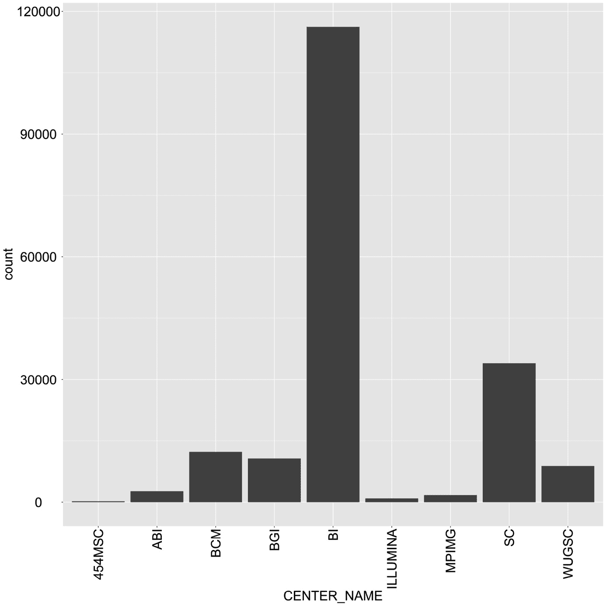
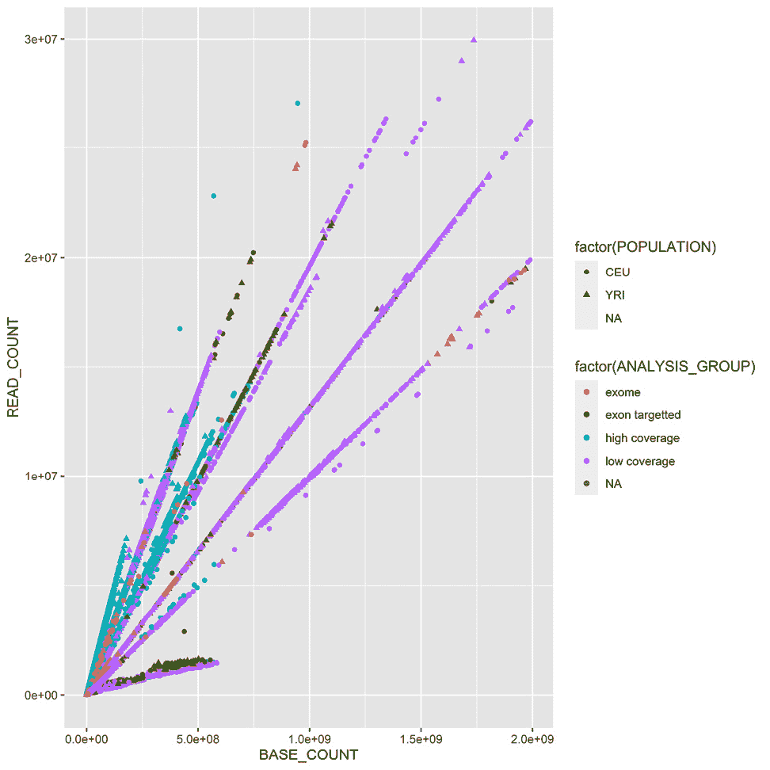

# 第二章：Python 与周边软件生态

我们将从安装本书大部分内容所需的基本软件开始。包括**Python**发行版，一些基本的 Python 库，以及外部生物信息学软件。在这里，我们还将关注 Python 之外的世界。在生物信息学和大数据领域，**R** 也是一个重要的角色；因此，你将学习如何通过 **rpy2** 与其进行交互，**rpy2** 是一个 Python/R 桥接工具。此外，我们将探索 **IPython** 框架（通过 Jupyter Lab）所能带来的优势，以便高效地与 R 进行接口。由于 Git 和 GitHub 在源代码管理中的广泛应用，我们将确保我们的设置能够与它们兼容。本章将为本书剩余部分的所有计算生物学工作奠定基础。

由于不同用户有不同的需求，我们将介绍两种安装软件的方式。一种方式是使用 Anaconda Python（[`docs.continuum.io/anaconda/`](http://docs.continuum.io/anaconda/)）发行版，另一种方式是通过 Docker 安装软件（Docker 是基于容器共享同一操作系统内核的服务器虚拟化方法；请参考 https://www.docker.com/）。这种方法仍然会为你安装 Anaconda，但是在容器内安装。如果你使用的是 Windows 操作系统，强烈建议你考虑更换操作系统或使用 Windows 上现有的 Docker 选项。在 macOS 上，你可能能够原生安装大部分软件，但 Docker 也是可用的。使用本地发行版（如 Anaconda 或其他）学习比使用 Docker 更简单，但考虑到 Python 中的包管理可能较为复杂，Docker 镜像提供了更高的稳定性。

本章将涵盖以下内容：

+   使用 Anaconda 安装所需的软件

+   使用 Docker 安装所需的软件

+   通过 `rpy2` 与 R 交互

+   在 Jupyter 中使用 R 魔法

# 使用 Anaconda 安装所需的基本软件

在我们开始之前，我们需要安装一些基本的前置软件。接下来的章节将引导你完成所需软件及其安装步骤。每个章节和部分可能会有额外的要求，我们会在本书后续部分中明确说明。另一种启动方式是使用 Docker 配方，之后所有工作将通过 Docker 容器自动处理。

如果你已经在使用其他 Python 发行版，强烈建议考虑使用 Anaconda，因为它已经成为数据科学和生物信息学的*事实标准*。此外，它是可以让你从 **Bioconda** 安装软件的发行版（[`bioconda.github.io/`](https://bioconda.github.io/)）。

## 准备工作

Python 可以在不同的环境中运行。例如，你可以在 **Java 虚拟机**（**JVM**）中使用 Python（通过 **Jython** 或使用 .NET 中的 **IronPython**）。然而，在这里，我们不仅关注 Python，还关注围绕它的完整软件生态系统。因此，我们将使用标准的（**CPython**）实现，因为 JVM 和 .NET 版本主要是与这些平台的原生库进行交互。

对于我们的代码，我们将使用 Python 3.10。如果你刚开始学习 Python 和生物信息学，任何操作系统都可以使用。但在这里，我们主要关注的是中级到高级的使用。所以，虽然你可能可以使用 Windows 和 macOS，但大多数繁重的分析将会在 Linux 上进行（可能是在 Linux **高性能计算**（**HPC**）集群上）。**下一代测序**（**NGS**）数据分析和复杂的机器学习大多数是在 Linux 集群上进行的。

如果你使用的是 Windows，考虑升级到 Linux 来进行生物信息学工作，因为大多数现代生物信息学软件无法在 Windows 上运行。请注意，除非你计划使用计算机集群，否则 macOS 对几乎所有分析都是可以的，计算机集群通常基于 Linux。

如果你使用的是 Windows 或 macOS，并且没有轻松访问 Linux 的方式，别担心。现代虚拟化软件（如 **VirtualBox** 和 **Docker**）将会帮你解决问题，它们允许你在操作系统上安装一个虚拟的 Linux。如果你正在使用 Windows 并决定使用原生方式而不是 Anaconda，要小心选择库；如果你为所有内容（包括 Python 本身）安装 32 位版本，可能会更安全。

注意

如果你使用的是 Windows，许多工具将无法使用。

生物信息学和数据科学正在以惊人的速度发展，这不仅仅是炒作，而是现实。在安装软件库时，选择版本可能会很棘手。根据你所使用的代码，某些旧版本可能无法工作，或者可能甚至无法与新版本兼容。希望你使用的任何代码会指出正确的依赖项——尽管这并不保证。在本书中，我们将固定所有软件包的精确版本，并确保代码可以与这些版本一起工作。代码可能需要根据其他软件包版本进行调整，这是非常自然的。

本书开发的软件可以在 [`github.com/PacktPublishing/Bioinformatics-with-Python-Cookbook-third-edition`](https://github.com/PacktPublishing/Bioinformatics-with-Python-Cookbook-third-edition) 找到。要访问它，你需要安装 Git。习惯使用 Git 可能是个好主意，因为许多科学计算软件都是在它的基础上开发的。

在正确安装 Python 环境之前，你需要先安装所有与 Python 交互的外部非 Python 软件。这个列表会根据章节有所不同，所有章节特定的软件包将在相应的章节中解释。幸运的是，自本书的前几个版本以来，大多数生物信息学软件已经可以通过 Bioconda 项目安装，因此安装通常很容易。

你需要安装一些开发编译器和库，所有这些都是免费的。在 Ubuntu 上，建议安装 build-essential 包（`apt-get install build-essential`），在 macOS 上，建议安装 **Xcode**（[`developer.apple.com/xcode/`](https://developer.apple.com/xcode/)）。

在下表中，你将找到开发生物信息学所需的最重要的 Python 软件列表：

| **名称** | **应用** | **网址** | **目的** |
| --- | --- | --- | --- |
| Project Jupyter | 所有章节 | https://jupyter.org/ | 交互式计算 |
| pandas | 所有章节 | https://pandas.pydata.org/ | 数据处理 |
| NumPy | 所有章节 | http://www.numpy.org/ | 数组/矩阵处理 |
| SciPy | 所有章节 | https://www.scipy.org/ | 科学计算 |
| Biopython | 所有章节 | https://biopython.org/ | 生物信息学库 |
| seaborn | 所有章节 | http://seaborn.pydata.org/ | 统计图表库 |
| R | 生物信息学与统计 | https://www.r-project.org/ | 统计计算语言 |
| rpy2 | R 连接 | https://rpy2.readthedocs.io | R 接口 |
| PyVCF | NGS | https://pyvcf.readthedocs.io | VCF 处理 |
| Pysam | NGS | https://github.com/pysam-developers/pysam | SAM/BAM 处理 |
| HTSeq | NGS/基因组 | https://htseq.readthedocs.io | NGS 处理 |
| DendroPY | 系统发育学 | https://dendropy.org/ | 系统发育学 |
| PyMol | 蛋白质组学 | https://pymol.org | 分子可视化 |
| scikit-learn | 机器学习 | http://scikit-learn.org | 机器学习库 |
| Cython | 大数据 | http://cython.org/ | 高性能 |
| Numba | 大数据 | https://numba.pydata.org/ | 高性能 |
| Dask | 大数据 | http://dask.pydata.org | 并行处理 |

图 1.1 – 显示在生物信息学中有用的各种软件包的表格

我们将使用 `pandas` 来处理大多数表格数据。另一种选择是仅使用标准 Python。`pandas` 在数据科学中已经变得非常普及，因此如果数据量适合内存，使用它处理所有表格数据可能是明智之举。

所有的工作将在 Jupyter 项目内进行，即 Jupyter Lab。Jupyter 已成为编写交互式数据分析脚本的*事实*标准。不幸的是，Jupyter Notebooks 的默认格式基于 JSON。这种格式难以阅读、难以比较，并且需要导出才能输入到普通的 Python 解释器中。为了解决这个问题，我们将使用`jupytext` ([`jupytext.readthedocs.io/`](https://jupytext.readthedocs.io/)) 扩展 Jupyter，允许我们将 Jupyter 笔记本保存为普通的 Python 程序。

## 怎么做...

要开始，请查看以下步骤：

1.  首先从 https://www.anaconda.com/products/individual 下载 Anaconda 发行版。我们将使用版本 21.05，尽管您可能可以使用最新版本。您可以接受安装的所有默认设置，但您可能希望确保`conda`二进制文件在您的路径中（不要忘记打开一个新窗口，以便路径可以更新）。如果您有另一个 Python 发行版，请注意您的`PYTHONPATH`和现有的 Python 库。最好卸载所有其他 Python 版本和已安装的 Python 库。尽可能地，删除所有其他 Python 版本和已安装的 Python 库。

1.  让我们继续使用库。我们现在将使用以下命令创建一个名为`bioinformatics_base`的新`conda`环境，并安装`biopython=1.70`：

    ```py
    conda create -n bioinformatics_base python=3.10
    ```

1.  让我们按以下步骤激活环境：

    ```py
    conda activate bioinformatics_base
    ```

1.  让我们将`bioconda`和`conda-forge`通道添加到我们的源列表：

    ```py
    conda config --add channels bioconda
    conda config --add channels conda-forge
    ```

1.  还要安装基本软件包：

    ```py
    conda install \
    biopython==1.79 \
    jupyterlab==3.2.1 \
    jupytext==1.13 \
    matplotlib==3.4.3 \
    numpy==1.21.3 \
    pandas==1.3.4 \
    scipy==1.7.1
    ```

1.  现在，让我们保存我们的环境，以便以后在其他机器上创建新的环境，或者如果需要清理基础环境：

    ```py
    conda list –explicit > bioinformatics_base.txt
    ```

1.  我们甚至可以从`conda`安装 R：

    ```py
    conda install rpy2 r-essentials r-gridextra
    ```

请注意，`r-essentials`会安装许多 R 包，包括后面要用到的 ggplot2。另外，我们还会安装`r-gridextra`，因为我们在 Notebook 中会用到它。

## 还有更多...

如果您不喜欢使用 Anaconda，您可以选择使用任何发行版通过`pip`安装许多 Python 库。您可能需要许多编译器和构建工具，不仅包括 C 编译器，还包括 C++和 Fortran。

我们将不再使用前面步骤中创建的环境。相反，我们将把它用作克隆工作环境的基础。这是因为使用 Python 进行环境管理，即使借助`conda`包系统的帮助，仍可能非常痛苦。因此，我们将创建一个干净的环境，以免造成损害，并可以从中派生出开发环境，如果开发环境变得难以管理。

例如，假设您想创建一个带有`scikit-learn`的机器学习环境。您可以执行以下操作：

1.  使用以下命令创建原始环境的克隆：

    ```py
    conda create -n scikit-learn --clone bioinformatics_base
    ```

1.  添加`scikit-learn`：

    ```py
    conda activate scikit-learn
    conda install scikit-learn
    ```

在 JupyterLab 中，我们应该通过 notebook 打开我们的 jupytext 文件，而不是通过文本编辑器。由于 jupytext 文件与 Python 文件具有相同的扩展名——这是一个特性，而非 bug——JupyterLab 默认会使用普通的文本编辑器。当我们打开 jupytext 文件时，我们需要覆盖默认设置。右键点击并选择 **Notebook**，如下图所示：


图 1.2 – 在 Notebook 中打开 jupytext 文件

我们的 jupytext 文件将不会保存图形输出，这对于本书来说已经足够。如果你想要一个带有图片的版本，这是可以通过配对的 notebooks 实现的。更多详情，请查看 Jupytext 页面 ([`github.com/mwouts/jupytext`](https://github.com/mwouts/jupytext))。

警告

由于我们的代码是为了在 Jupyter 中运行的，本书中很多地方，我不会使用 `print` 输出内容，因为单元格的最后一行会被自动渲染。如果你没有使用 notebook，请记得使用 `print`。

# 使用 Docker 安装所需的软件

Docker 是实现操作系统级虚拟化的最广泛使用的框架。这项技术使你能够拥有一个独立的容器：一个比虚拟机更轻量的层，但仍然允许你将软件进行隔离。这基本上隔离了所有进程，使得每个容器看起来像一个虚拟机。

Docker 在开发领域的两端表现得非常好：它是设置本书内容以用于学习目的的便捷方式，并且可以成为你在复杂环境中部署应用程序的首选平台。这个方案是前一个方案的替代。

然而，对于长期的开发环境，类似前一个方案的方法可能是你的最佳选择，尽管它可能需要更繁琐的初始设置。

## 准备工作

如果你使用的是 Linux，首先需要做的是安装 Docker。最安全的解决方案是从 [`www.docker.com/`](https://www.docker.com/) 获取最新版本。虽然你的 Linux 发行版可能有 Docker 包，但它可能过时且有 bug。

如果你使用的是 Windows 或 macOS，不要灰心；查看 Docker 网站。有多种可供选择的方案，但没有明确的公式，因为 Docker 在这些平台上发展得很快。你需要一台相对较新的计算机来运行我们的 64 位虚拟机。如果遇到任何问题，重启计算机并确保 BIOS、VT-X 或 AMD-V 已启用。至少你需要 6 GB 内存，最好更多。

注意

这将需要从互联网进行非常大的下载，因此请确保你有足够的带宽。另外，准备好等待很长时间。

## 如何操作...

要开始，请按照以下步骤操作：

1.  在 Docker shell 中使用以下命令：

    ```py
    docker build -t bio https://raw.githubusercontent.com/PacktPublishing/Bioinformatics-with-Python-Cookbook-third-edition/main/docker/main/Dockerfile
    ```

在 Linux 上，你需要有 root 权限或被加入到 Docker Unix 组中。

1.  现在你准备好运行容器，具体如下：

    ```py
    docker run -ti -p 9875:9875 -v YOUR_DIRECTORY:/data bio
    ```

1.  将 `YOUR_DIRECTORY` 替换为你操作系统中的一个目录。该目录将在主机操作系统和 Docker 容器之间共享。`YOUR_DIRECTORY` 在容器内会显示为 `/data`，反之亦然。

`-p 9875:9875` 将暴露容器的 TCP 端口 `9875` 到主机计算机的端口 `9875`。

特别是在 Windows 上（也许在 macOS 上），请确保你的目录在 Docker shell 环境中确实可见。如果不可见，请查看官方 Docker 文档，了解如何暴露目录。

1.  现在你准备好使用系统了。将浏览器指向 `http://localhost:9875`，你应该会看到 Jupyter 环境。

如果在 Windows 上无法运行，请查看官方 Docker 文档 ([`docs.docker.com/`](https://docs.docker.com/))，了解如何暴露端口。

## 另请参见

以下内容也值得了解：

+   Docker 是最广泛使用的容器化软件，最近在使用量上增长巨大。你可以在 [`www.docker.com/`](https://www.docker.com/) 阅读更多关于它的信息。

+   作为 Docker 的一个面向安全的替代方案，**rkt** 可以在 [`coreos.com/rkt/`](https://coreos.com/rkt/) 找到。

+   如果你无法使用 Docker，例如，如果你没有必要的权限（这通常发生在大多数计算集群中），可以查看 Singularity，网址为 [`www.sylabs.io/singularity/`](https://www.sylabs.io/singularity/)。

# 通过 rpy2 与 R 进行交互

如果你需要某些功能，但在 Python 库中找不到，首先应该检查该功能是否已经在 R 中实现。对于统计方法，R 仍然是最完整的框架；此外，某些生物信息学功能*仅*在 R 中可用，并且可能作为 Bioconductor 项目的一部分提供。

`ggplot2`，我们将从人类 1,000 基因组计划 ([`www.1000genomes.org/`](http://www.1000genomes.org/)) 下载它的元数据。这本书不是关于 R 的，但我们希望提供有趣且实用的示例。

## 准备工作

你需要从 1,000 基因组序列索引中获取元数据文件。请查看 [`github.com/PacktPublishing/Bioinformatics-with-Python-Cookbook-third-edition/blob/main/Datasets.py`](https://github.com/PacktPublishing/Bioinformatics-with-Python-Cookbook-third-edition/blob/main/Datasets.py)，并下载 `sequence.index` 文件。如果你使用 Jupyter Notebook，打开 `Chapter01/Interfacing_R.py` 文件，并直接执行顶部的 `wget` 命令。

该文件包含了项目中所有 FASTQ 文件的信息（在接下来的章节中，我们将使用来自人类 1,000 基因组项目的数据）。这包括 FASTQ 文件、样本 ID、来源人群以及每条数据通道的重要统计信息，例如读取数和读取的 DNA 序列数。

要设置 Anaconda，可以运行以下命令：

```py
conda create -n bioinformatics_r --clone bioinformatics_base
conda activate bioinformatics_r
conda install r-ggplot2=3.3.5 r-lazyeval r-gridextra rpy2
```

使用 Docker，你可以运行以下命令：

```py
docker run -ti -p 9875:9875 -v YOUR_DIRECTORY:/data tiagoantao/bioinformatics_r
```

现在我们可以开始了。

## 如何操作...

开始之前，请按照以下步骤操作：

1.  让我们从导入一些库开始：

    ```py
    import os
    from IPython.display import Image
    import rpy2.robjects as robjects
    import rpy2.robjects.lib.ggplot2 as ggplot2
    from rpy2.robjects.functions import SignatureTranslatedFunction
    import pandas as pd
    import rpy2.robjects as ro
    from rpy2.robjects import pandas2ri
    from rpy2.robjects import local_converter
    ```

我们将在 Python 端使用`pandas`。R 中的 DataFrame 与`pandas`非常匹配。

1.  我们将使用 R 的`read.delim`函数从文件中读取数据：

    ```py
    read_delim = robjects.r('read.delim')
    seq_data = read_delim('sequence.index', header=True, stringsAsFactors=False)
    #In R:
    # seq.data <- read.delim('sequence.index', header=TRUE, stringsAsFactors=FALSE)
    ```

导入后，我们做的第一件事是访问 R 中的`read.delim`函数，它允许你读取文件。R 语言规范允许在对象名称中使用点。因此，我们必须将函数名转换为`read_delim`。然后，我们调用正确的函数名；请注意以下几个显著的特性。首先，大多数原子对象（如字符串）可以直接传递而无需转换。其次，参数名也可以无缝转换（除了点问题）。最后，对象可在 Python 命名空间中使用（然而，对象实际上不能在 R 命名空间中使用；我们稍后会详细讨论）。

作为参考，我附上了相应的 R 代码。我希望你能看出它的转换是非常简单的。`seq_data`对象是一个 DataFrame。如果你了解基本的 R 或者`pandas`，你可能对这种数据结构有所了解。如果不了解，那么它基本上是一个表格，即一系列行，其中每一列都具有相同的数据类型。

1.  让我们对这个 DataFrame 进行基本的检查，如下所示：

    ```py
    print('This dataframe has %d columns and %d rows' %
    (seq_data.ncol, seq_data.nrow))
    print(seq_data.colnames)
    #In R:
    # print(colnames(seq.data))
    # print(nrow(seq.data))
    # print(ncol(seq.data))
    ```

再次注意代码的相似性。

1.  你甚至可以使用以下代码混合不同的风格：

    ```py
    my_cols = robjects.r.ncol(seq_data)
    print(my_cols)
    ```

你可以直接调用 R 函数；在这种情况下，如果函数名称中没有点，我们将调用`ncol`；但是要小心。这样做会输出结果，而不是 26（列数），而是[26]，这是一个包含`26`元素的向量。这是因为默认情况下，R 中的大多数操作返回向量。如果你想要列数，必须执行`my_cols[0]`。另外，谈到陷阱，注意 R 数组的索引是从 1 开始的，而 Python 是从 0 开始的。

1.  现在，我们需要进行一些数据清理。例如，有些列应该解释为数字，但它们却被当作字符串读取：

    ```py
    as_integer = robjects.r('as.integer')
    match = robjects.r.match
    my_col = match('READ_COUNT', seq_data.colnames)[0] # vector returned
    print('Type of read count before as.integer: %s' % seq_data[my_col - 1].rclass[0])
    seq_data[my_col - 1] = as_integer(seq_data[my_col - 1])
    print('Type of read count after as.integer: %s' % seq_data[my_col - 1].rclass[0])
    ```

`match`函数与 Python 列表中的`index`方法有些相似。正如预期的那样，它返回一个向量，因此我们可以提取`0`元素。它也是从 1 开始索引的，因此在 Python 中工作时需要减去 1。`as_integer`函数会将一列数据转换为整数。第一次打印会显示字符串（即被`"`包围的值），而第二次打印会显示数字。

1.  我们需要对这张表进行更多处理；有关详细信息可以在笔记本中找到。在这里，我们将完成将 DataFrame 获取到 R 中的操作（请记住，虽然它是一个 R 对象，但实际上在 Python 命名空间中可见）：

    ```py
    robjects.r.assign('seq.data', seq_data)
    ```

这将在 R 命名空间中创建一个名为`seq.data`的变量，其内容来自 Python 命名空间中的 DataFrame。请注意，在此操作之后，两个对象将是独立的（如果更改其中一个对象，将不会反映到另一个对象中）。

注意

尽管你可以在 Python 上执行绘图，R 默认内置了绘图功能（这里我们将忽略）。它还有一个叫做`ggplot2`的库，实现了**图形语法**（一种声明性语言，用于指定统计图表）。

1.  关于我们基于人类 1,000 个基因组计划的具体示例，首先，我们将绘制一个直方图，显示生成所有测序通道的中心名称的分布。为此，我们将使用`ggplot`：

    ```py
    from rpy2.robjects.functions import SignatureTranslatedFunction
    ggplot2.theme = SignatureTranslatedFunction(ggplot2.theme, init_prm_translate = {'axis_text_x': 'axis.text.x'})
    bar = ggplot2.ggplot(seq_data) + ggplot2.geom_bar() + ggplot2.aes_string(x='CENTER_NAME') + ggplot2.theme(axis_text_x=ggplot2.element_text(angle=90, hjust=1))
    robjects.r.png('out.png', type='cairo-png')
    bar.plot()
    dev_off = robjects.r('dev.off')
    dev_off()
    ```

第二行有点无趣，但是是重要的样板代码的一部分。我们将调用的一个 R 函数具有其名称中带有点的参数。由于 Python 函数调用中不能有这个点，我们必须将`axis.text.x`的 R 参数名称映射到`axis_text_r`的 Python 名称中的函数主题中。我们对其进行了修补（即，我们用其自身的修补版本替换了`ggplot2.theme`）。

然后，我们绘制图表本身。请注意`ggplot2`的声明性质，因为我们向图表添加特性。首先，我们指定`seq_data`数据框，然后使用称为`geom_bar`的直方图条形图。接下来，我们注释`x`变量（`CENTER_NAME`）。最后，通过更改主题，我们旋转*x 轴*的文本。我们通过关闭 R 打印设备来完成这一操作。

1.  现在，我们可以在 Jupyter Notebook 中打印图像：

    ```py
    Image(filename='out.png')
    ```

生成以下图表：



图 1.3 – 使用 ggplot2 生成的中心名称直方图，负责从 1,000 个基因组计划中测序人类基因组数据的通道

1.  作为最后一个示例，我们现在将对 Yoruban（`YRI`）和来自北欧和西欧的犹他州居民（`CEU`）的所有测序通道的读取和碱基计数进行散点图绘制，使用人类 1,000 个基因组计划（该项目的数据总结，我们将充分使用，可以在*第三章*的*使用现代序列格式*食谱中看到）。此外，我们对不同类型的测序之间的差异感兴趣（例如，外显子覆盖率、高覆盖率和低覆盖率）。首先，我们生成一个仅包含`YRI`和`CEU`通道的 DataFrame，并限制最大碱基和读取计数：

    ```py
    robjects.r('yri_ceu <- seq.data[seq.data$POPULATION %in% c("YRI", "CEU") & seq.data$BASE_COUNT < 2E9 & seq.data$READ_COUNT < 3E7, ]')
    yri_ceu = robjects.r('yri_ceu')
    ```

1.  现在我们已经准备好绘图了：

    ```py
    scatter = ggplot2.ggplot(yri_ceu) + ggplot2.aes_string(x='BASE_COUNT', y='READ_COUNT', shape='factor(POPULATION)', col='factor(ANALYSIS_GROUP)') + ggplot2.geom_point()
    robjects.r.png('out.png')
    scatter.plot()
    ```

希望这个例子（请参考下面的截图）能清楚地展示图形语法方法的强大。我们将首先声明 DataFrame 和正在使用的图表类型（即通过 `geom_point` 实现的散点图）。

注意到很容易表达每个点的形状取决于 `POPULATION` 变量，而颜色取决于 `ANALYSIS_GROUP` 变量：



图 1.4 – 由 ggplot2 生成的散点图，显示所有测序通道的基础和读取计数；每个点的颜色和形状反映了类别数据（种群和所测序的数据类型）

1.  由于 R DataFrame 与 `pandas` 非常相似，因此在两者之间进行转换是很有意义的，因为 `rpy2` 支持这种转换：

    ```py
    import rpy2.robjects as ro
    from rpy2.robjects import pandas2ri
    from rpy2.robjects.conversion import localconverter 
    with localconverter(ro.default_converter + pandas2ri.converter):
      pd_yri_ceu = ro.conversion.rpy2py(yri_ceu)
    del pd_yri_ceu['PAIRED_FASTQ']
    with localconverter(ro.default_converter + pandas2ri.converter):
      no_paired = ro.conversion.py2rpy(pd_yri_ceu)
    robjects.r.assign('no.paired', no_paired)
    robjects.r("print(colnames(no.paired))")
    ```

我们首先导入必要的转换模块 —— `rpy2` 提供了许多将数据从 R 转换到 Python 的策略。这里，我们关注的是数据框的转换。然后，我们转换 R DataFrame（请注意，我们正在转换 R 命名空间中的 `yri_ceu`，而不是 Python 命名空间中的）。我们删除了 `pandas` DataFrame 中指示配对 FASTQ 文件名称的列，并将其复制回 R 命名空间。如果你打印新 R DataFrame 的列名，你会发现 `PAIRED_FASTQ` 列丢失了。

## 还有更多内容...

值得重复的是，Python 软件生态的进展速度非常快。这意味着如果今天某个功能不可用，它可能在不久的将来会发布。因此，如果你正在开发一个新项目，务必在使用 R 包中的功能之前，先检查 Python 领域的最新进展。

Bioconductor 项目中有许多适用于生物信息学的 R 包（[`www.bioconductor.org/`](http://www.bioconductor.org/)）。这应该是你在 R 世界中进行生物信息学功能开发的首选。不过，需要注意的是，许多 R 生物信息学包并不在 Bioconductor 上，因此务必在 **综合 R 存档网络** (**CRAN**) 中查找更广泛的 R 包（请参阅 CRAN：[`cran.rproject.org/`](http://cran.rproject.org/)）。

Python 中有许多绘图库。Matplotlib 是最常用的库，但你也可以选择其他众多的库。在 R 的背景下，值得注意的是，Python 中有一个类似于 ggplot2 的实现，它基于图形语法描述语言，用于图表的绘制，惊讶吗？这就是 `ggplot`！（[`yhat.github.io/ggpy/`](http://yhat.github.io/ggpy/)）。

## 另见

要了解更多关于这些主题的信息，请参考以下资源：

+   有许多关于 R 的教程和书籍；请访问 R 的官方网站 ([`www.r-project.org/`](http://www.r-project.org/)) 查看文档。

+   对于 Bioconductor，请查看文档：[`manuals.bioinformatics.ucr.edu/home/R_BioCondManual`](http://manuals.bioinformatics.ucr.edu/home/R_BioCondManual)。

+   如果你从事 NGS 工作，可能还想查看 Bioconductor 中的高通量序列分析：[`manuals.bioinformatics.ucr.edu/home/ht-seq`](http://manuals.bioinformatics.ucr.edu/home/ht-seq)。

+   `rpy`库的文档是你通往 R 的 Python 接口，文档可以在[`rpy2.bitbucket.io/`](https://rpy2.bitbucket.io/)找到。

+   *图形语法*方法在 Leland Wilkinson 所著的书《*图形语法*》中有详细描述，由 Springer 出版。

+   在数据结构方面，可以在`pandas`库中找到类似于 R 的功能。你可以在[`pandas.pydata.org/pandas-docs/dev/tutorials.xhtml`](http://pandas.pydata.org/pandas-docs/dev/tutorials.xhtml)找到一些教程。Wes McKinney 的《*Python 数据分析*》一书（由 O'Reilly Media 出版）也是一个可以考虑的替代方案。在下一章中，我们将讨论 pandas，并在整本书中使用它。

# 在 Jupyter 中执行 R 魔法

Jupyter 相比标准 Python 提供了许多额外的功能。在这些功能中，它提供了一种名为**魔法**的可扩展命令框架（实际上，这只适用于 Jupyter 的 IPython 内核，因为它本质上是 IPython 的一个功能，但这正是我们关注的内容）。魔法命令允许你以许多有用的方式扩展语言。有一些魔法函数可以用于处理 R。如你在示例中将看到的，这使得与 R 的接口更加简洁和声明式。本配方不会引入任何新的 R 功能，但希望能清楚地说明，IPython 如何在科学计算中为提高生产力提供重要帮助。

## 准备工作

你需要遵循*通过 rpy2 与 R 接口*配方中的前期准备步骤。笔记本是`Chapter01/R_magic.py`。该笔记本比这里呈现的配方更完整，包含更多的图表示例。为了简洁起见，我们将只集中介绍与 R 交互的基本构造。如果你使用 Docker，可以使用以下命令：

```py
docker run -ti -p 9875:9875 -v YOUR_DIRECTORY:/data tiagoantao/bioinformatics_r
```

## 操作方法...

本配方是对前一个配方的大胆简化，它展示了 R 魔法的简洁性和优雅性：

1.  首先需要做的是加载 R 魔法和`ggplot2`：

    ```py
    import rpy2.robjects as robjects
    import rpy2.robjects.lib.ggplot2 as ggplot2
    %load_ext rpy2.ipython
    ```

请注意，`%`符号表示一个 IPython 特定的指令。举个简单的例子，你可以在 Jupyter 单元格中写入`%R print(c(1, 2))`。

查看一下如何无需使用`robjects`包就能轻松执行 R 代码。实际上，`rpy2`被用来查看背后的实现。

1.  让我们读取在之前配方中下载的`sequence.index`文件：

    ```py
    %%R
    seq.data <- read.delim('sequence.index', header=TRUE, stringsAsFactors=FALSE)
    seq.data$READ_COUNT <- as.integer(seq.data$READ_COUNT)
    seq.data$BASE_COUNT <- as.integer(seq.data$BASE_COUNT)
    ```

然后，您可以使用 `%%R` 来指定整个单元格应该被解释为 R 代码（注意双 `%%`）。

1.  现在，我们可以将变量传递到 Python 命名空间：

    ```py
    seq_data = %R seq.data
    print(type(seq_data))  # pandas dataframe!
    ```

DataFrame 的类型不是标准的 Python 对象，而是一个 `pandas` DataFrame。这与之前版本的 R magic 接口有所不同。

1.  由于我们有一个 `pandas` DataFrame，我们可以通过 `pandas` 接口轻松操作它：

    ```py
    my_col = list(seq_data.columns).index("CENTER_NAME")
    seq_data['CENTER_NAME'] = seq_data['CENTER_NAME'].apply(lambda` x: x.upper())
    ```

1.  让我们将这个 DataFrame 重新放入 R 命名空间，如下所示：

    ```py
    %R -i seq_data
    %R print(colnames(seq_data))
    ```

`-i` 参数通知 magic 系统，将后面的变量从 Python 空间复制到 R 命名空间。第二行仅显示 DataFrame 确实在 R 中可用。我们使用的名称与原始名称不同——它是 `seq_data`，而不是 `seq.data`。

1.  让我们进行最后的清理（有关更多详细信息，请参见之前的食谱），并打印出与之前相同的条形图：

    ```py
    %%R
    bar <- ggplot(seq_data) +  aes(factor(CENTER_NAME)) + geom_bar() + theme(axis.text.x = element_text(angle = 90, hjust = 1))
    print(bar)
    ```

此外，R magic 系统允许您减少代码量，因为它改变了 R 与 IPython 交互的行为。例如，在前一个食谱中的 `ggplot2` 代码中，您无需使用 `.png` 和 `dev.off` R 函数，因为 magic 系统会为您处理这些。当您告诉 R 打印图表时，它会神奇地出现在您的笔记本或图形控制台中。

## 还有更多内容...

随着时间的推移，R magic 的接口似乎发生了很大的变化。例如，我已经多次更新了本书第一版中的 R 代码。当前版本的 DataFrame 赋值返回 `pandas` 对象，这是一个重大变化。

## 另请参见

欲了解更多信息，请查看以下链接：

+   有关 IPython 魔法命令的基本说明，请参见 [`ipython.readthedocs.io/en/stable/interactive/magics.xhtml`](https://ipython.readthedocs.io/en/stable/interactive/magics.xhtml)。

+   包括魔法命令在内的 IPython 第三方扩展的列表可以在 [`github.com/ipython/ipython/wiki/Extensions-Index`](https://github.com/ipython/ipython/wiki/Extensions-Index) 找到。
