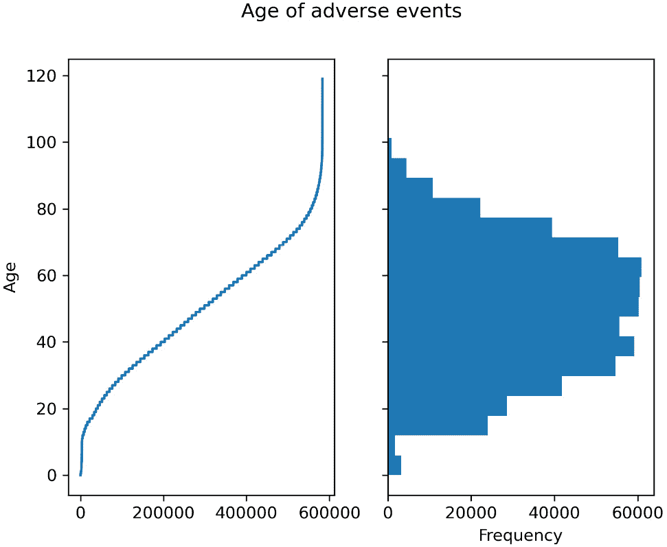
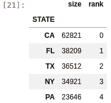
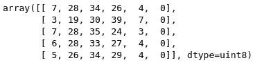
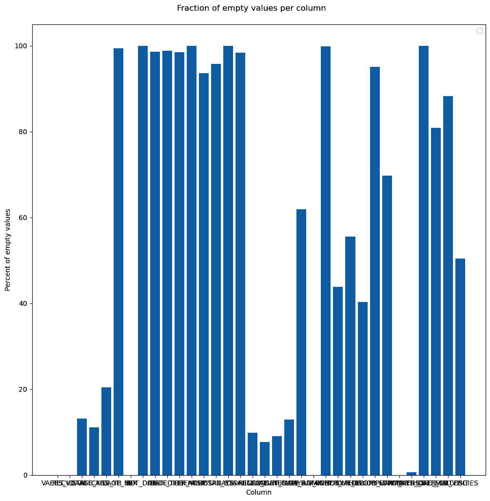
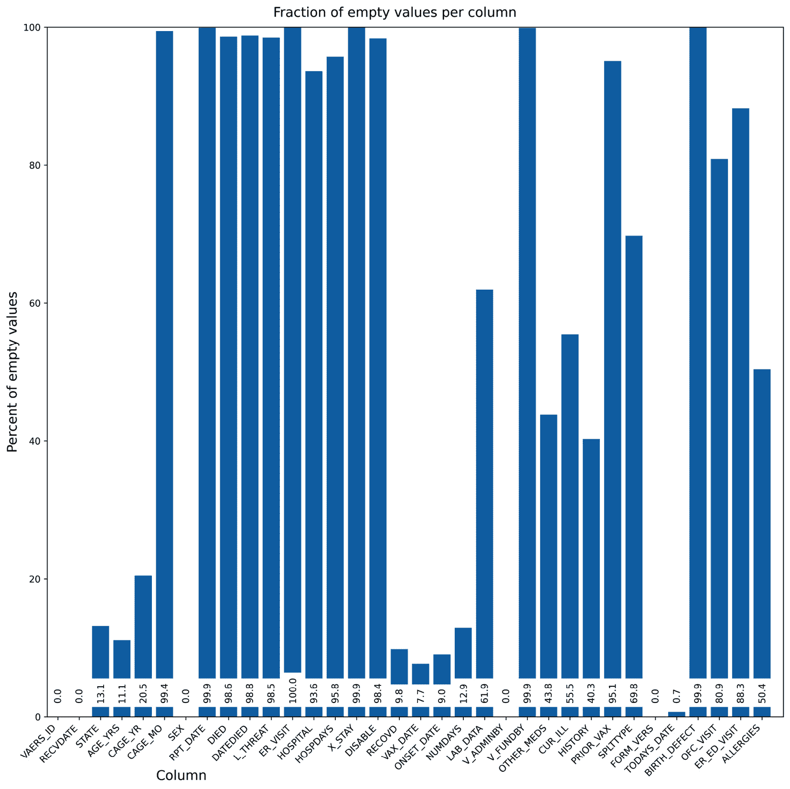
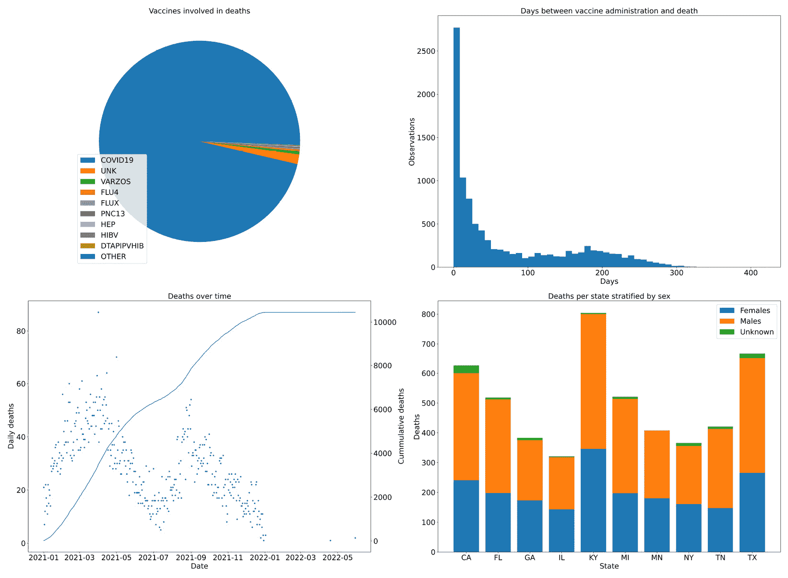

# 第三章：了解 NumPy、pandas、Arrow 和 Matplotlib

Python 的最大优势之一是其丰富的高质量科学和数据处理库。所有这些库的核心是**NumPy**，它提供了高效的数组和矩阵支持。在 NumPy 之上，我们几乎可以找到所有的科学库。例如，在我们这一领域，有**Biopython**。但其他通用的数据分析库也可以在我们这一领域使用。例如，**pandas** 是处理表格数据的*事实标准*。最近，**Apache Arrow** 提供了一些 pandas 功能的高效实现，并且支持语言互操作性。最后，**Matplotlib** 是 Python 领域中最常见的绘图库，适用于科学计算。虽然这些库都是广泛应用的通用库，但它们对生物信息学处理至关重要，因此我们将在本章中学习它们。

我们将从 pandas 开始，因为它提供了一个高层次的库，具有非常广泛的实际应用性。然后，我们将介绍 Arrow，我们只在支持 pandas 的范围内使用它。接下来，我们将讨论 NumPy，这是几乎所有工作背后的驱动力。最后，我们将介绍 Matplotlib。

我们的教程非常基础——这些库中的每一个都可以轻松占据一本完整的书，但这些教程应该足够帮助你完成本书的内容。如果你使用 Docker，并且由于所有这些库对于数据分析至关重要，它们可以在来自*第一章*的 `tiagoantao/bioinformatics_base` Docker 镜像中找到。

在本章中，我们将涵盖以下教程：

+   使用 pandas 处理疫苗不良事件

+   处理 pandas DataFrame 合并的陷阱

+   降低 pandas DataFrame 的内存使用

+   使用 Apache Arrow 加速 pandas 处理

+   理解 NumPy 作为 Python 数据科学和生物信息学的引擎

+   介绍 Matplotlib 用于图表生成

# 使用 pandas 处理疫苗不良事件

我们将通过一个具体的生物信息学数据分析示例来介绍 pandas：我们将研究来自**疫苗不良事件报告系统**（**VAERS**，[`vaers.hhs.gov/`](https://vaers.hhs.gov/)）的数据。VAERS 由美国卫生与公共服务部维护，包含自 1990 年以来的疫苗不良事件数据库。

VAERS 提供的数据是**逗号分隔值**（**CSV**）格式。CSV 格式非常简单，甚至可以用简单的文本编辑器打开（请注意，文件过大会导致编辑器崩溃），或者使用类似 Excel 的电子表格程序打开。pandas 可以非常轻松地处理这种格式。

## 准备工作

首先，我们需要下载数据。可以在[`vaers.hhs.gov/data/datasets.xhtml`](https://vaers.hhs.gov/data/datasets.xhtml)下载。请下载 ZIP 文件：我们将使用 2021 年文件，不要仅下载单个 CSV 文件。下载文件后，解压缩它，然后使用`gzip –9 *csv`将所有文件单独重新压缩，以节省磁盘空间。

随时可以使用文本编辑器查看文件，或者最好使用诸如`less`（压缩文件用`zless`）的工具。您可以在[`vaers.hhs.gov/docs/VAERSDataUseGuide_en_September2021.pdf`](https://vaers.hhs.gov/docs/VAERSDataUseGuide_en_September2021.pdf)找到文件内容的文档。

如果您使用的是笔记本，代码已在开头提供，您可以处理所需的处理步骤。如果您使用的是 Docker，基础镜像已足够。

代码可以在`Chapter02/Pandas_Basic.py`中找到。

## 如何做到这一点...

请按照以下步骤操作：

1.  让我们从加载主要数据文件并收集基本统计信息开始：

    ```py
    vdata = pd.read_csv(
        "2021VAERSDATA.csv.gz", encoding="iso-8859-1")
    vdata.columns
    vdata.dtypes
    vdata.shape
    ```

我们首先加载数据。在大多数情况下，默认的 UTF-8 编码就可以正常工作，但在这种情况下，文本编码是`legacy iso-8859-1`。接下来，我们打印列名，列名以`VAERS_ID`、`RECVDATE`、`STATE`、`AGE_YRS`等开头，共有 35 个条目，分别对应每一列。然后，我们打印每列的类型。以下是前几个条目：

```py
VAERS_ID          int64
RECVDATE         object
STATE            object
AGE_YRS         float64
CAGE_YR         float64
CAGE_MO         float64
SEX              object
```

通过这样做，我们获得了数据的形状：`(654986, 35)`。这意味着有 654,986 行和 35 列。您可以使用上述任何一种策略来获取有关表格元数据的信息。

1.  现在，让我们探索数据：

    ```py
    vdata.iloc[0]
    vdata = vdata.set_index("VAERS_ID")
    vdata.loc[916600]
    vdata.head(3)
    vdata.iloc[:3]
    vdata.iloc[:5, 2:4]
    ```

我们可以通过多种方式查看数据。我们将从根据位置检查第一行开始。以下是简化版本：

```py
VAERS_ID                                       916600
RECVDATE                                       01/01/2021
STATE                                          TX
AGE_YRS                                        33.0
CAGE_YR                                        33.0
CAGE_MO                                        NaN
SEX                                            F
…
TODAYS_DATE                                          01/01/2021
BIRTH_DEFECT                                  NaN
OFC_VISIT                                     Y
ER_ED_VISIT                                       NaN
ALLERGIES                                       Pcn and bee venom
```

在按`VAERS_ID`索引后，我们可以使用一个 ID 来获取一行。我们可以使用 916600（这是前一条记录的 ID）并获得相同的结果。

然后，我们提取前三行。注意我们可以通过两种不同的方式做到这一点：

+   使用`head`方法

+   使用更通用的数组规范；也就是`iloc[:3]`

最后，我们提取前五行，但仅提取第二和第三列——`iloc[:5, 2:4]`。以下是输出：

```py
          AGE_YRS  CAGE_YR
VAERS_ID                  
916600       33.0     33.0
916601       73.0     73.0
916602       23.0     23.0
916603       58.0     58.0
916604       47.0     47.0
```

1.  现在，让我们做一些基本的计算，即计算数据集中最大年龄：

    ```py
    vdata["AGE_YRS"].max()
    vdata.AGE_YRS.max()
    ```

最大值为 119 岁。比结果更重要的是，注意两种访问`AGE_YRS`的方式（作为字典键和作为对象字段）来访问列。

1.  现在，让我们绘制涉及的年龄分布：

    ```py
    vdata["AGE_YRS"].sort_values().plot(use_index=False)
    vdata["AGE_YRS"].plot.hist(bins=20) 
    ```

这将生成两个图表（以下步骤显示的是简化版本）。我们在这里使用的是 pandas 的绘图工具，它底层使用 Matplotlib。

1.  虽然我们已经有完整的 Matplotlib 绘图食谱（*引入 Matplotlib 进行图表生成*），但让我们在此先通过直接使用它来一窥究竟：

    ```py
    import matplotlib.pylot as plt
    fig, ax = plt.subplots(1, 2, sharey=True)
    fig.suptitle("Age of adverse events")
    vdata["AGE_YRS"].sort_values().plot(
        use_index=False, ax=ax[0],
        xlabel="Obervation", ylabel="Age")
    vdata["AGE_YRS"].plot.hist(bins=20, orientation="horizontal")
    ```

这包括前一步的两个图表。以下是输出：



图 2.1 – 左侧 – 每个不良反应观察的年龄；右侧 – 显示年龄分布的直方图

1.  我们也可以采取一种非图形的、更分析性的方法，比如按年计数事件：

    ```py
    vdata["AGE_YRS"].dropna().apply(lambda x: int(x)).value_counts()
    ```

输出结果如下：

```py
50     11006
65     10948
60     10616
51     10513
58     10362
      ...
```

1.  现在，让我们看看有多少人死亡：

    ```py
    vdata.DIED.value_counts(dropna=False)
    vdata["is_dead"] = (vdata.DIED == "Y")
    ```

计数结果如下：

```py
NaN    646450
Y        8536
Name: DIED, dtype: int64
```

注意，`DIED` 的类型*不是*布尔值。使用布尔值表示布尔特性更具声明性，因此我们为它创建了 `is_dead`。

提示

在这里，我们假设 NaN 应该被解释为 `False`。一般来说，我们必须小心解读 NaN。它可能表示 `False`，或者像大多数情况一样，仅表示数据缺失。如果是这种情况，它不应该被转换为 `False`。

1.  现在，让我们将死亡的个人数据与所涉及的疫苗类型进行关联：

    ```py
    dead = vdata[vdata.is_dead]
    vax = pd.read_csv("2021VAERSVAX.csv.gz", encoding="iso-8859-1").set_index("VAERS_ID")
    vax.groupby("VAX_TYPE").size().sort_values()
    vax19 = vax[vax.VAX_TYPE == "COVID19"]
    vax19_dead = dead.join(vax19)
    ```

获取仅包含死亡数据的 DataFrame 后，我们需要读取包含疫苗信息的数据。首先，我们需要进行一些关于疫苗类型及其不良反应的探索性分析。以下是简化后的输出：

```py
           …
HPV9         1506
FLU4         3342
UNK          7941
VARZOS      11034
COVID19    648723
```

之后，我们必须选择与 COVID 相关的疫苗，并将其与个人数据进行合并。

1.  最后，让我们看看前 10 个在死亡数量上过度代表的 COVID 疫苗批次，以及每个批次影响的美国州数：

    ```py
    baddies = vax19_dead.groupby("VAX_LOT").size().sort_values(ascending=False)
    for I, (lot, cnt) in enumerate(baddies.items()):
        print(lot, cnt, len(vax19_dead[vax19_dead.VAX_LOT == lot].groupby""STAT"")))
        if i == 10:
            break
    ```

输出结果如下：

```py
Unknown 254 34
EN6201 120 30
EN5318 102 26
EN6200 101 22
EN6198 90 23
039K20A 89 13
EL3248 87 17
EL9261 86 21
EM9810 84 21
EL9269 76 18
EN6202 75 18
```

本节到此结束！

## 还有更多内容...

关于疫苗和批次的前述数据并不完全正确；我们将在下一个食谱中讨论一些数据分析中的陷阱。

在 *引入 Matplotlib 用于图表生成* 的食谱中，我们将介绍 Matplotlib，一个为 pandas 绘图提供后端支持的图表库。它是 Python 数据分析生态系统的一个基础组件。

## 参见

以下是一些可能有用的额外信息：

+   虽然本章的前三个食谱足以支持你阅读本书，但网络上有很多资源可以帮助你理解 pandas。你可以从主要的用户指南开始，网址为 [`pandas.pydata.org/docs/user_guide/index.xhtml`](https://pandas.pydata.org/docs/user_guide/index.xhtml)。

+   如果你需要绘制数据图表，不要忘记查看指南中的可视化部分，因为它特别有帮助：[`pandas.pydata.org/docs/user_guide/visualization.xhtml`](https://pandas.pydata.org/docs/user_guide/visualization.xhtml)。

# 处理连接 pandas DataFrame 时的陷阱

上一个食谱是对 pandas 的快速介绍，涵盖了我们在本书中将使用的大部分功能。尽管关于 pandas 的详细讨论需要一本完整的书，但在本食谱（以及下一个食谱）中，我们将讨论一些对数据分析有影响的主题，这些主题在文献中很少讨论，但却非常重要。

在这个食谱中，我们将讨论通过连接（joins）关联 DataFrame 时的一些陷阱：事实证明，许多数据分析错误是由于不小心连接数据所引入的。我们将在这里介绍一些减少此类问题的技巧。

## 准备工作

我们将使用与上一食谱相同的数据，但会稍微打乱它，以便讨论典型的数据分析陷阱。我们将再次将主要的不良事件表与疫苗表连接，但会从每个表中随机采样 90% 的数据。这模拟了例如你只有不完整信息的场景。这是很多情况下，表之间的连接结果并不直观明显的一个例子。

使用以下代码通过随机采样 90% 的数据来准备我们的文件：

```py
vdata = pd.read_csv("2021VAERSDATA.csv.gz", encoding="iso-8859-1")
vdata.sample(frac=0.9).to_csv("vdata_sample.csv.gz", index=False)
vax = pd.read_csv("2021VAERSVAX.csv.gz", encoding="iso-8859-1")
vax.sample(frac=0.9).to_csv("vax_sample.csv.gz", index=False)
```

由于此代码涉及随机采样，因此你将得到与此处报告的结果不同的结果。如果你想得到相同的结果，我已经提供了我在 `Chapter02` 目录中使用的文件。此食谱的代码可以在 `Chapter02/Pandas_Join.py` 中找到。

## 如何操作...

请按照以下步骤操作：

1.  让我们先对个体数据和疫苗数据表做一个内连接：

    ```py
    vdata = pd.read_csv("vdata_sample.csv.gz")
    vax = pd.read_csv("vax_sample.csv.gz")
    vdata_with_vax = vdata.join(
        vax.set_index("VAERS_ID"),
        on="VAERS_ID",
        how="inner")
    len(vdata), len(vax), len(vdata_with_vax)
    ```

这个代码的 `len` 输出结果是：个体数据为 589,487，疫苗数据为 620,361，连接结果为 558,220。这表明一些个体数据和疫苗数据没有被捕获。

1.  让我们通过以下连接查找未被捕获的数据：

    ```py
    lost_vdata = vdata.loc[~vdata.index.isin(vdata_with_vax.index)]
    lost_vdata
    lost_vax = vax[~vax["VAERS_ID"].isin(vdata.index)]
    lost_vax
    ```

你会看到 56,524 行个体数据没有被连接，并且有 62,141 行疫苗数据。

1.  还有其他方式可以连接数据。默认的方法是执行左外连接：

    ```py
    vdata_with_vax_left = vdata.join(
        vax.set_index("VAERS_ID"),
        on="VAERS_ID")
    vdata_with_vax_left.groupby("VAERS_ID").size().sort_values()
    ```

左外连接确保左表中的所有行始终被表示。如果右表没有匹配的行，则所有右侧的列将被填充为 `None` 值。

警告

有一个警告需要小心。请记住，左表 - `vdata` - 每个 `VAERS_ID` 都有一条记录。当你进行左连接时，可能会遇到左侧数据被重复多次的情况。例如，我们之前做的 `groupby` 操作显示，`VAERS_ID` 为 962303 的数据有 11 条记录。这是正确的，但也不罕见的是，很多人错误地期望左侧的每一行在输出中仍然是单独一行。这是因为左连接会返回一个或多个左侧条目，而上述的内连接返回的是 0 或 1 条记录，而有时我们希望每个左侧的行都精确对应一条记录。务必始终测试输出结果，确保记录的数量符合预期。

1.  也有右连接。让我们将 COVID 疫苗数据（左表）与死亡事件数据（右表）做右连接：

    ```py
    dead = vdata[vdata.DIED == "Y"]
    vax19 = vax[vax.VAX_TYPE == "COVID19"]
    vax19_dead = vax19.join(dead.set_index("VAERS_ID"), on="VAERS_ID", how="right")
    len(vax19), len(dead), len(vax19_dead)
    len(vax19_dead[vax19_dead.VAERS_ID.duplicated()])
    len(vax19_dead) - len(dead)
    ```

如你所料，右连接将确保右表中的所有行都会被表示出来。因此，我们最终得到了 583,817 个 COVID 记录，7,670 个死亡记录，以及一个 8,624 条记录的右连接。

我们还检查了连接表中的重复条目数量，结果是 954。如果我们从连接表中减去死表的长度，结果也是 954。做连接时，确保进行这样的检查。

1.  最后，我们将重新审视有问题的 COVID 批次计算，因为我们现在知道我们可能在过度计算批次：

    ```py
    vax19_dead["STATE"] = vax19_dead["STATE"].str.upper()
    dead_lot = vax19_dead[["VAERS_ID", "VAX_LOT", "STATE"]].set_index(["VAERS_ID", "VAX_LOT"])
    dead_lot_clean = dead_lot[~dead_lot.index.duplicated()]
    dead_lot_clean = dead_lot_clean.reset_index()
    dead_lot_clean[dead_lot_clean.VAERS_ID.isna()]
    baddies = dead_lot_clean.groupby("VAX_LOT").size().sort_values(ascending=False)
    for i, (lot, cnt) in enumerate(baddies.items()):
        print(lot, cnt, len(dead_lot_clean[dead_lot_clean.VAX_LOT == lot].groupby("STATE")))
        if i == 10:
            break
    ```

注意到我们在这里使用的策略确保了没有重复项：首先，我们限制了将要使用的列的数量，然后移除重复的索引和空的`VAERS_ID`。这样就能确保`VAERS_ID`和`VAX_LOT`的组合不重复，并且不会有没有 ID 关联的批次。

## 还有更多...

除了左连接、内连接和右连接外，还有其他类型的连接。最值得注意的是外连接，它确保两个表中的所有条目都有表示。

确保你对连接操作有测试和断言：一个非常常见的 bug 是对连接行为的预期错误。你还应该确保在连接的列上没有空值，因为空值可能会产生大量多余的元组。

# 减少 pandas DataFrame 的内存使用

当你处理大量信息时——例如在分析全基因组测序数据时——内存使用可能会成为分析的限制因素。事实证明，天真的 pandas 在内存方面并不是很高效，我们可以大幅减少它的内存消耗。

在这个方案中，我们将重新审视我们的 VAERS 数据，并探讨几种减少 pandas 内存使用的方法。这些变化的影响可能是巨大的：在许多情况下，减少内存消耗可能意味着能否使用 pandas，或者需要采用更复杂的替代方法，如 Dask 或 Spark。

## 准备就绪

我们将使用第一个方案中的数据。如果你已经运行过它，你就可以开始了；如果没有，请按照其中讨论的步骤操作。你可以在`Chapter02/Pandas_Memory.py`找到这段代码。

## 如何操作...

按照这些步骤操作：

1.  首先，让我们加载数据并检查 DataFrame 的大小：

    ```py
    import numpy as np
    import pandas as pd
    vdata = pd.read_csv("2021VAERSDATA.csv.gz", encoding="iso-8859-1")
    vdata.info(memory_usage="deep")
    ```

下面是输出的简化版本：

```py
RangeIndex: 654986 entries, 0 to 654985
Data columns (total 35 columns):
#   Column        Non-Null Count   Dtype  
---  ------        --------------   -----  
0   VAERS_ID      654986 non-null  int64  
2   STATE         572236 non-null  object 
3   AGE_YRS       583424 non-null  float64
6   SEX           654986 non-null  object 
8   SYMPTOM_TEXT  654828 non-null  object 
9   DIED          8536 non-null    object 
31  BIRTH_DEFECT  383 non-null     object 
34  ALLERGIES     330630 non-null  object 
dtypes: float64(5), int64(2), object(28)
memory usage: 1.3 GB
```

在这里，我们有关于行数、每行类型和非空值的相关信息。最后，我们可以看到，DataFrame 需要高达 1.3 GB 的内存。

1.  我们还可以检查每一列的大小：

    ```py
    for name in vdata.columns:
        col_bytes = vdata[name].memory_usage(index=False, deep=True)
        col_type = vdata[name].dtype
        print(
            name,
            col_type, col_bytes // (1024 ** 2))
    ```

下面是输出的简化版本：

```py
VAERS_ID int64 4
STATE object 34
AGE_YRS float64 4
SEX object 36
RPT_DATE object 20
SYMPTOM_TEXT object 442
DIED object 20
ALLERGIES object 34
```

`SYMPTOM_TEXT`占用了 442 MB，相当于我们整个表的 1/3。

1.  现在，让我们看看`DIED`这一列。我们能找到更高效的表示方式吗？

    ```py
    vdata.DIED.memory_usage(index=False, deep=True)
    vdata.DIED.fillna(False).astype(bool).memory_usage(index=False, deep=True)
    ```

原始列占用了 21,181,488 字节，而我们的压缩表示仅占用 656,986 字节。也就是说减少了 32 倍！

1.  那么`STATE`这一列呢？我们能做得更好吗？

    ```py
    vdata["STATE"] = vdata.STATE.str.upper()
    states = list(vdata["STATE"].unique())
    vdata["encoded_state"] = vdata.STATE.apply(lambda state: states.index(state))
    vdata["encoded_state"] = vdata["encoded_state"].astype(np.uint8)
    vdata["STATE"].memory_usage(index=False, deep=True)
    vdata["encoded_state"].memory_usage(index=False, deep=True)
    ```

在这里，我们将 `STATE` 列（文本类型）转换为 `encoded_state`（数字类型）。这个数字是州名在州列表中的位置。我们使用这个数字来查找州的列表。原始列大约占用 36 MB，而编码后的列只占用 0.6 MB。

作为这种方法的替代方案，您可以查看 pandas 中的分类变量。我更喜欢使用它们，因为它们有更广泛的应用。

1.  我们可以在 *加载* 数据时应用大多数这些优化，因此让我们为此做好准备。但现在，我们遇到了一个先有鸡还是先有蛋的问题：为了能够了解州表的内容，我们必须进行第一次遍历，获取州列表，如下所示：

    ```py
    states = list(pd.read_csv(
        "vdata_sample.csv.gz",
        converters={
           "STATE": lambda state: state.upper()
        },
        usecols=["STATE"]
    )["STATE"].unique())
    ```

我们有一个转换器，简单地返回州的全大写版本。我们只返回 `STATE` 列，以节省内存和处理时间。最后，我们从 DataFrame 中获取 `STATE` 列（该列只有一个字段）。

1.  最终的优化是 *不* 加载数据。假设我们不需要 `SYMPTOM_TEXT` —— 这大约占数据的三分之一。在这种情况下，我们可以跳过它。以下是最终版本：

    ```py
    vdata = pd.read_csv(
        "vdata_sample.csv.gz",
        index_col="VAERS_ID",
        converters={
           "DIED": lambda died: died == "Y",
           "STATE": lambda state: states.index(state.upper())
        },
        usecols=lambda name: name != "SYMPTOM_TEXT"
    )
    vdata["STATE"] = vdata["STATE"].astype(np.uint8)
    vdata.info(memory_usage="deep") 
    ```

我们现在的内存占用为 714 MB，稍微超过原始数据的一半。通过将我们对 `STATE` 和 `DIED` 列使用的方法应用于所有其他列，这个数字还可以大大减少。

## 另请参见

以下是一些可能有用的额外信息：

+   如果您愿意使用支持库来帮助 Python 处理，请查看下一个关于 Apache Arrow 的食谱，它将帮助您在更多内存效率上节省额外的内存。

+   如果最终得到的 DataFrame 占用了比单台机器可用内存更多的内存，那么您必须提高处理能力并使用分块处理——我们在 Pandas 上下文中不会涉及——或者使用可以自动处理大数据的工具。Dask（我们将在 *第十一章* “*使用 Dask 和 Zarr 进行并行处理” 中讨论）允许您使用类似 pandas 的接口处理超大内存数据集。

# 使用 Apache Arrow 加速 pandas 处理

当处理大量数据时，例如全基因组测序，pandas 的速度较慢且占用内存较大。Apache Arrow 提供了几种 pandas 操作的更快且更节省内存的实现，并且可以与 pandas 进行互操作。

Apache Arrow 是由 pandas 的创始人 Wes McKinney 共同创立的一个项目，它有多个目标，包括以与语言无关的方式处理表格数据，这样可以实现语言间的互操作性，同时提供高效的内存和计算实现。在这里，我们将只关注第二部分：提高大数据处理的效率。我们将与 pandas 一起以集成的方式实现这一点。

在这里，我们将再次使用 VAERS 数据，并展示如何使用 Apache Arrow 加速 pandas 数据加载并减少内存消耗。

## 准备工作

再次，我们将使用第一个食谱中的数据。确保你已经按照 *准备工作* 部分中解释的方式下载并准备好它，代码可以在 `Chapter02/Arrow.py` 中找到。

## 如何做到...

按照以下步骤进行：

1.  让我们开始使用 pandas 和 Arrow 加载数据：

    ```py
    import gzip
    import pandas as pd
    from pyarrow import csv
    import pyarrow.compute as pc 
    vdata_pd = pd.read_csv("2021VAERSDATA.csv.gz", encoding="iso-8859-1")
    columns = list(vdata_pd.columns)
    vdata_pd.info(memory_usage="deep") 
    vdata_arrow = csv.read_csv("2021VAERSDATA.csv.gz")
    tot_bytes = sum([
        vdata_arrow[name].nbytes
        for name in vdata_arrow.column_names])
    print(f"Total {tot_bytes // (1024 ** 2)} MB")
    ```

pandas 需要 1.3 GB，而 Arrow 只需 614 MB：不到一半的内存。对于像这样的超大文件，这可能意味着能否将数据加载到内存中进行处理，或者需要寻找其他解决方案，比如 Dask。虽然 Arrow 中某些函数与 pandas 的名称相似（例如，`read_csv`），但这并不是最常见的情况。例如，注意我们计算 DataFrame 总大小的方法：通过获取每一列的大小并求和，这与 pandas 的方法不同。

1.  让我们并排比较推断出的类型：

    ```py
    for name in vdata_arrow.column_names:
        arr_bytes = vdata_arrow[name].nbytes
        arr_type = vdata_arrow[name].type
        pd_bytes = vdata_pd[name].memory_usage(index=False, deep=True)
        pd_type = vdata_pd[name].dtype
        print(
            name,
            arr_type, arr_bytes // (1024 ** 2),
            pd_type, pd_bytes // (1024 ** 2),)
    ```

这里是输出的简化版本：

```py
VAERS_ID int64 4 int64 4
RECVDATE string 8 object 41
STATE string 3 object 34
CAGE_YR int64 5 float64 4
SEX string 3 object 36
RPT_DATE string 2 object 20
DIED string 2 object 20
L_THREAT string 2 object 20
ER_VISIT string 2 object 19
HOSPITAL string 2 object 20
HOSPDAYS int64 5 float64 4
```

如你所见，Arrow 在类型推断方面通常更为具体，这也是其内存使用显著更低的主要原因之一。

1.  现在，让我们做一个时间性能比较：

    ```py
    %timeit pd.read_csv("2021VAERSDATA.csv.gz", encoding="iso-8859-1")
    %timeit csv.read_csv("2021VAERSDATA.csv.gz")
    ```

在我的计算机上，结果如下：

```py
7.36 s ± 201 ms per loop (mean ± std. dev. of 7 runs, 1 loop each)
2.28 s ± 70.7 ms per loop (mean ± std. dev. of 7 runs, 1 loop each)
```

Arrow 的实现速度是三倍。由于这取决于硬件，因此你电脑上的结果可能有所不同。

1.  让我们在不加载 `SYMPTOM_TEXT` 列的情况下重复内存占用比较。这是一个更公平的比较，因为大多数数值数据集通常没有非常大的文本列：

    ```py
    vdata_pd = pd.read_csv("2021VAERSDATA.csv.gz", encoding="iso-8859-1", usecols=lambda x: x != "SYMPTOM_TEXT")
    vdata_pd.info(memory_usage="deep")
    columns.remove("SYMPTOM_TEXT")
    vdata_arrow = csv.read_csv(
        "2021VAERSDATA.csv.gz",
         convert_options=csv.ConvertOptions(include_columns=columns))
    vdata_arrow.nbytes
    ```

pandas 需要 847 MB，而 Arrow 只需 205 MB：少了四倍。

1.  我们的目标是使用 Arrow 将数据加载到 pandas 中。为此，我们需要转换数据结构：

    ```py
    vdata = vdata_arrow.to_pandas()
    vdata.info(memory_usage="deep")
    ```

这里有两点非常重要：Arrow 创建的 pandas 表示只用了 1 GB，而 pandas 从其本地的 `read_csv` 创建的表示则需要 1.3 GB。这意味着即使你使用 pandas 处理数据，Arrow 也可以首先创建一个更紧凑的表示。

上述代码存在一个内存消耗问题：当转换器运行时，它将需要内存来存储 *pandas* 和 *Arrow* 的两个表示，从而违背了使用更少内存的初衷。Arrow 可以在创建 pandas 版本的同时自我销毁其表示，从而解决这个问题。相关代码行是 `vdata = vdata_arrow.to_pandas(self_destruct=True)`。

## 还有更多...

如果你有一个非常大的 DataFrame，甚至在 Arrow 加载后也无法由 pandas 处理，那么或许 Arrow 可以完成所有处理，因为它也有计算引擎。尽管如此，Arrow 的计算引擎在写作时，功能上远不如 pandas 完善。记住，Arrow 还有许多其他功能，例如语言互操作性，但我们在本书中不会使用到这些。

# 理解 NumPy 作为 Python 数据科学和生物信息学的引擎

即使你没有显式使用 NumPy，大多数分析都将使用 NumPy。NumPy 是一个数组操作库，它是 pandas、Matplotlib、Biopython、scikit-learn 等许多库背后的基础。虽然你在生物信息学工作中可能不需要直接使用 NumPy，但你应该了解它的存在，因为它几乎支持了你所做的一切，即使是通过其他库间接使用。

在这个例子中，我们将使用 VAERS 数据演示 NumPy 如何在我们使用的许多核心库中发挥作用。这是一个非常简要的 NumPy 入门介绍，目的是让你了解它的存在，并知道它几乎在所有东西背后。我们的示例将从五个美国州中提取不良反应案例的数量，并按年龄分组：0 至 19 岁、20 至 39 岁，直到 100 至 119 岁。

## 准备工作

再次提醒，我们将使用第一个例子中的数据，因此请确保数据可用。相关的代码可以在 `Chapter02/NumPy.py` 找到。

## 如何实现…

按照以下步骤操作：

1.  我们首先通过 pandas 加载数据，并将数据减少到仅与前五个美国州相关：

    ```py
    import numpy as np
    import pandas as pd
    import matplotlib.pyplot as plt
    vdata = pd.read_csv(
        "2021VAERSDATA.csv.gz", encoding="iso-8859-1")
    vdata["STATE"] = vdata["STATE"].str.upper()
    top_states = pd.DataFrame({
        "size": vdata.groupby("STATE").size().sort_values(ascending=False).head(5)}).reset_index()
    top_states["rank"] = top_states.index
    top_states = top_states.set_index("STATE")
    top_vdata = vdata[vdata["STATE"].isin(top_states.index)]
    top_vdata["state_code"] = top_vdata["STATE"].apply(
        lambda state: top_states["rank"].at[state]
    ).astype(np.uint8)
    top_vdata = top_vdata[top_vdata["AGE_YRS"].notna()]
    top_vdata.loc[:,"AGE_YRS"] = top_vdata["AGE_YRS"].astype(int)
    top_states
    ```

前五个州如下。这个排名将在后续用来构建 NumPy 矩阵：



图 2.2 – 美国具有最大不良反应数量的州

1.  现在，让我们提取包含年龄和州数据的两个 NumPy 数组：

    ```py
    age_state = top_vdata[["state_code", "AGE_YRS"]]
    age_state["state_code"]
    state_code_arr = age_state["state_code"].values
    type(state_code_arr), state_code_arr.shape, state_code_arr.dtype
    age_arr = age_state["AGE_YRS"].values
    type(age_arr), age_arr.shape, age_arr.dtype
    ```

请注意，pandas 背后的数据是 NumPy 数据（对于 Series，`values` 调用返回的是 NumPy 类型）。此外，你可能还记得 pandas 有 `.shape` 或 `.dtype` 等属性：这些属性的设计灵感来源于 NumPy，且行为相同。

1.  现在，让我们从头开始创建一个 NumPy 矩阵（一个二维数组），其中每一行代表一个州，每一列代表一个年龄组：

    ```py
    age_state_mat = np.zeros((5,6), dtype=np.uint64)
    for row in age_state.itertuples():
        age_state_mat[row.state_code, row.AGE_YRS//20] += 1
    age_state_mat
    ```

这个数组有五行——每行代表一个州——和六列——每列代表一个年龄组。数组中的所有单元格必须具有相同的类型。

我们用零来初始化数组。虽然初始化数组有很多方法，但如果你的数组非常大，初始化可能会花费很长时间。有时，根据你的任务，数组一开始为空（意味着它被初始化为随机垃圾）也是可以接受的。在这种情况下，使用 `np.empty` 会快得多。我们在这里使用 pandas 的迭代：从 pandas 的角度来看，这不是最好的做法，但我们希望让 NumPy 的部分非常明确。

1.  我们可以非常轻松地提取单一的行——在我们这个例子中，是某个州的数据。对列同样适用。我们来看看加利福尼亚州的数据，然后是 0-19 岁的年龄组：

    ```py
    cal = age_state_mat[0,:]
    kids = age_state_mat[:,0]
    ```

注意提取行或列的语法。鉴于 pandas 复制了 NumPy 的语法，且我们在之前的例子中也遇到过，它应该对你来说很熟悉。

1.  现在，让我们计算一个新的矩阵，矩阵中的每个元素表示每个年龄组的案例比例：

    ```py
    def compute_frac(arr_1d):
        return arr_1d / arr_1d.sum()
    frac_age_stat_mat = np.apply_along_axis(compute_frac, 1, age_state_mat)
    ```

最后一行对所有行应用了 `compute_frac` 函数。`compute_frac` 接受一行数据并返回一个新行，其中所有元素都被总和除以。

1.  现在，让我们创建一个新的矩阵，表示百分比而不是比例——这样看起来更清晰：

    ```py
    perc_age_stat_mat = frac_age_stat_mat * 100
    perc_age_stat_mat = perc_age_stat_mat.astype(np.uint8)
    perc_age_stat_mat
    ```

第一行代码仅仅是将 2D 数组的所有元素乘以 100。Matplotlib 足够聪明，能够处理不同的数组结构。只要传递给它任何维度的数组，这行代码都能正常工作并按预期进行操作。

这是结果：



图 2.3 – 一个矩阵，表示美国五个病例最多的州中疫苗不良反应的分布

1.  最后，让我们使用 Matplotlib 创建该矩阵的图形表示：

    ```py
    fig = plt.figure()
    ax = fig.add_subplot()
    ax.matshow(perc_age_stat_mat, cmap=plt.get_cmap("Greys"))
    ax.set_yticks(range(5))
    ax.set_yticklabels(top_states.index)
    ax.set_xticks(range(6))
    ax.set_xticklabels(["0-19", "20-39", "40-59", "60-79", "80-99", "100-119"])
    fig.savefig("matrix.png")
    ```

不要过多纠结于 Matplotlib 的代码——我们将在下一个示例中讨论它。这里的关键点是，你可以将 NumPy 数据结构传递给 Matplotlib。Matplotlib 就像 pandas 一样，是基于 NumPy 的。

## 另见

以下是一些可能有用的额外信息：

+   NumPy 有许多功能超出了我们在这里讨论的范围。市面上有许多书籍和教程可以帮助学习这些功能。官方文档是一个很好的起点：[`numpy.org/doc/stable/`](https://numpy.org/doc/stable/)。

+   NumPy 有许多重要的功能值得探索，但其中最重要的可能是广播：NumPy 能够处理不同结构的数组，并正确地进行操作。详细信息请参见 [`numpy.org/doc/stable/user/theory.broadcasting.xhtml`](https://numpy.org/doc/stable/user/theory.broadcasting.xhtml)。

# 介绍用于图表生成的 Matplotlib

Matplotlib 是最常用的 Python 图表生成库。虽然也有一些更现代的替代库，如**Bokeh**，它是以 web 为中心的，但 Matplotlib 的优势不仅在于它是最广泛可用且文档最为丰富的图表库，还因为在计算生物学领域，我们需要一个既适用于 web 又适用于纸质文档的图表库。这是因为我们许多图表将会提交给科学期刊，这些期刊同样关注这两种格式。Matplotlib 能够为我们处理这一需求。

本示例中的许多例子也可以直接使用 pandas（间接使用 Matplotlib）完成，但这里的重点是练习使用 Matplotlib。

我们将再次使用 VAERS 数据来绘制有关 DataFrame 元数据的信息，并总结流行病学数据。

## 准备工作

再次，我们将使用第一个示例中的数据。代码可以在 `Chapter02/Matplotlib.py` 中找到。

## 如何做到…

按照以下步骤操作：

1.  我们要做的第一件事是绘制每列空值的比例：

    ```py
    import numpy as np
    import pandas as pd
    import matplotlib as mpl
    import matplotlib.pyplot as plt
    vdata = pd.read_csv(
        "2021VAERSDATA.csv.gz", encoding="iso-8859-1",
        usecols=lambda name: name != "SYMPTOM_TEXT")
    num_rows = len(vdata)
    perc_nan = {}
    for col_name in vdata.columns:
        num_nans = len(vdata[col_name][vdata[col_name].isna()])
        perc_nan[col_name] = 100 * num_nans / num_rows
    labels = perc_nan.keys()
    bar_values = list(perc_nan.values())
    x_positions = np.arange(len(labels))
    ```

`labels` 是我们正在分析的列名，`bar_values` 是空值的比例，`x_positions` 是接下来要绘制的条形图上条形的位置。

1.  以下是第一个版本的条形图代码：

    ```py
    fig = plt.figure()
    fig.suptitle("Fraction of empty values per column")
    ax = fig.add_subplot()
    ax.bar(x_positions, bar_values)
    ax.set_ylabel("Percent of empty values")
    ax.set_ylabel("Column")
    ax.set_xticks(x_positions)
    ax.set_xticklabels(labels)
    ax.legend()
    fig.savefig("naive_chart.png")
    ```

我们首先创建一个带有标题的图形对象。该图形将包含一个子图，用于显示条形图。我们还设置了几个标签，并且仅使用了默认设置。以下是令人沮丧的结果：



图 2.4 – 我们的第一次图表尝试，使用默认设置

1.  当然，我们可以做得更好。让我们对图表进行更大幅度的格式化：

    ```py
    fig = plt.figure(figsize=(16, 9), tight_layout=True, dpi=600)
    fig.suptitle("Fraction of empty values per column", fontsize="48")
    ax = fig.add_subplot()
    b1 = ax.bar(x_positions, bar_values)
    ax.set_ylabel("Percent of empty values", fontsize="xx-large")
    ax.set_xticks(x_positions)
    ax.set_xticklabels(labels, rotation=45, ha="right")
    ax.set_ylim(0, 100)
    ax.set_xlim(-0.5, len(labels))
    for i, x in enumerate(x_positions):
        ax.text(
            x, 2, "%.1f" % bar_values[i], rotation=90,
            va="bottom", ha="center",
            backgroundcolor="white")
    fig.text(0.2, 0.01, "Column", fontsize="xx-large")
    fig.savefig("cleaner_chart.png")
    ```

我们做的第一件事是为 Matplotlib 设置一个更大的图形，以提供更紧凑的布局。我们将 *x* 轴的刻度标签旋转 45 度，使其更合适地显示。我们还在条形上标注了数值。最后，我们没有使用标准的 *x* 轴标签，因为它会遮挡住刻度标签。相反，我们明确写出了文本。请注意，图形的坐标系与子图的坐标系可能完全不同——例如，比较 `ax.text` 和 `fig.text` 的坐标。以下是结果：



图 2.5 – 我们的第二次图表尝试，已考虑布局问题

1.  现在，我们将根据一个图形上的四个子图来对数据进行一些汇总分析。我们将展示与死亡相关的疫苗、接种与死亡之间的天数、随时间变化的死亡情况以及十大州的死亡者性别：

    ```py
    dead = vdata[vdata.DIED == "Y"]
    vax = pd.read_csv("2021VAERSVAX.csv.gz", encoding="iso-8859-1").set_index("VAERS_ID")
    vax_dead = dead.join(vax, on="VAERS_ID", how="inner")
    dead_counts = vax_dead["VAX_TYPE"].value_counts()
    large_values = dead_counts[dead_counts >= 10]
    other_sum = dead_counts[dead_counts < 10].sum()
    large_values = large_values.append(pd.Series({"OTHER": other_sum}))
    distance_df = vax_dead[vax_dead.DATEDIED.notna() & vax_dead.VAX_DATE.notna()]
    distance_df["DATEDIED"] = pd.to_datetime(distance_df["DATEDIED"])
    distance_df["VAX_DATE"] = pd.to_datetime(distance_df["VAX_DATE"])
    distance_df = distance_df[distance_df.DATEDIED >= "2021"]
    distance_df = distance_df[distance_df.VAX_DATE >= "2021"]
    distance_df = distance_df[distance_df.DATEDIED >= distance_df.VAX_DATE]
    time_distances = distance_df["DATEDIED"] - distance_df["VAX_DATE"]
    time_distances_d = time_distances.astype(int) / (10**9 * 60 * 60 * 24)
    date_died = pd.to_datetime(vax_dead[vax_dead.DATEDIED.notna()]["DATEDIED"])
    date_died = date_died[date_died >= "2021"]
    date_died_counts = date_died.value_counts().sort_index()
    cum_deaths = date_died_counts.cumsum()
    state_dead = vax_dead[vax_dead["STATE"].notna()][["STATE", "SEX"]]
    top_states = sorted(state_dead["STATE"].value_counts().head(10).index)
    top_state_dead = state_dead[state_dead["STATE"].isin(top_states)].groupby(["STATE", "SEX"]).size()#.reset_index()
    top_state_dead.loc["MN", "U"] = 0  # XXXX
    top_state_dead = top_state_dead.sort_index().reset_index()
    top_state_females = top_state_dead[top_state_dead.SEX == "F"][0]
    top_state_males = top_state_dead[top_state_dead.SEX == "M"][0]
    top_state_unk = top_state_dead[top_state_dead.SEX == "U"][0]
    ```

上述代码完全基于 pandas，并为绘图活动做了准备。

1.  以下代码同时绘制所有信息。我们将有四个子图，按 2x2 格式排列：

    ```py
    fig, ((vax_cnt, time_dist), (death_time, state_reps)) = plt.subplots(
        2, 2,
        figsize=(16, 9), tight_layout=True)
    vax_cnt.set_title("Vaccines involved in deaths")
    wedges, texts = vax_cnt.pie(large_values)
    vax_cnt.legend(wedges, large_values.index, loc="lower left")
    time_dist.hist(time_distances_d, bins=50)
    time_dist.set_title("Days between vaccine administration and death")
    time_dist.set_xlabel("Days")
    time_dist.set_ylabel("Observations")
    death_time.plot(date_died_counts.index, date_died_counts, ".")
    death_time.set_title("Deaths over time")
    death_time.set_ylabel("Daily deaths")
    death_time.set_xlabel("Date")
    tw = death_time.twinx()
    tw.plot(cum_deaths.index, cum_deaths)
    tw.set_ylabel("Cummulative deaths")
    state_reps.set_title("Deaths per state stratified by sex") state_reps.bar(top_states, top_state_females, label="Females")
    state_reps.bar(top_states, top_state_males, label="Males", bottom=top_state_females)
    state_reps.bar(top_states, top_state_unk, label="Unknown",
                   bottom=top_state_females.values + top_state_males.values)
    state_reps.legend()
    state_reps.set_xlabel("State")
    state_reps.set_ylabel("Deaths")
    fig.savefig("summary.png")
    ```

我们首先创建一个 2x2 的子图图形。`subplots` 函数返回图形对象及四个坐标轴对象，我们可以使用这些坐标轴对象来创建我们的图表。请注意，图例位于饼图中，我们在时间距离图上使用了双坐标轴，并且在每个州的死亡率图上计算了堆积条形图。以下是结果：



图 2.6 – 汇总疫苗数据的四个合并图表

## 还有更多...

Matplotlib 有两个接口可供使用——一个较旧的接口，设计上类似于 MATLAB，另一个是功能更强大的 `matplotlib.pyplot` 模块。为了增加混淆，面向对象接口的入口点就在这个模块中——即 `matplotlib.pyplot.figure` 和 `matplotlib.pyplot.subplots`。

## 另见

以下是一些可能有用的额外信息：

+   Matplotlib 的文档真的非常出色。例如，它提供了一个包含每个示例代码链接的可视化样本画廊。你可以在[`matplotlib.org/stable/gallery/index.xhtml`](https://matplotlib.org/stable/gallery/index.xhtml)找到这个画廊。API 文档通常非常完整。

+   改善 Matplotlib 图表外观的另一种方法是使用 Seaborn 库。Seaborn 的主要目的是添加统计可视化工具，但作为副作用，它在导入时会将 Matplotlib 的默认设置更改为更易接受的样式。我们将在本书中始终使用 Seaborn；请查看下一章中提供的图表。
