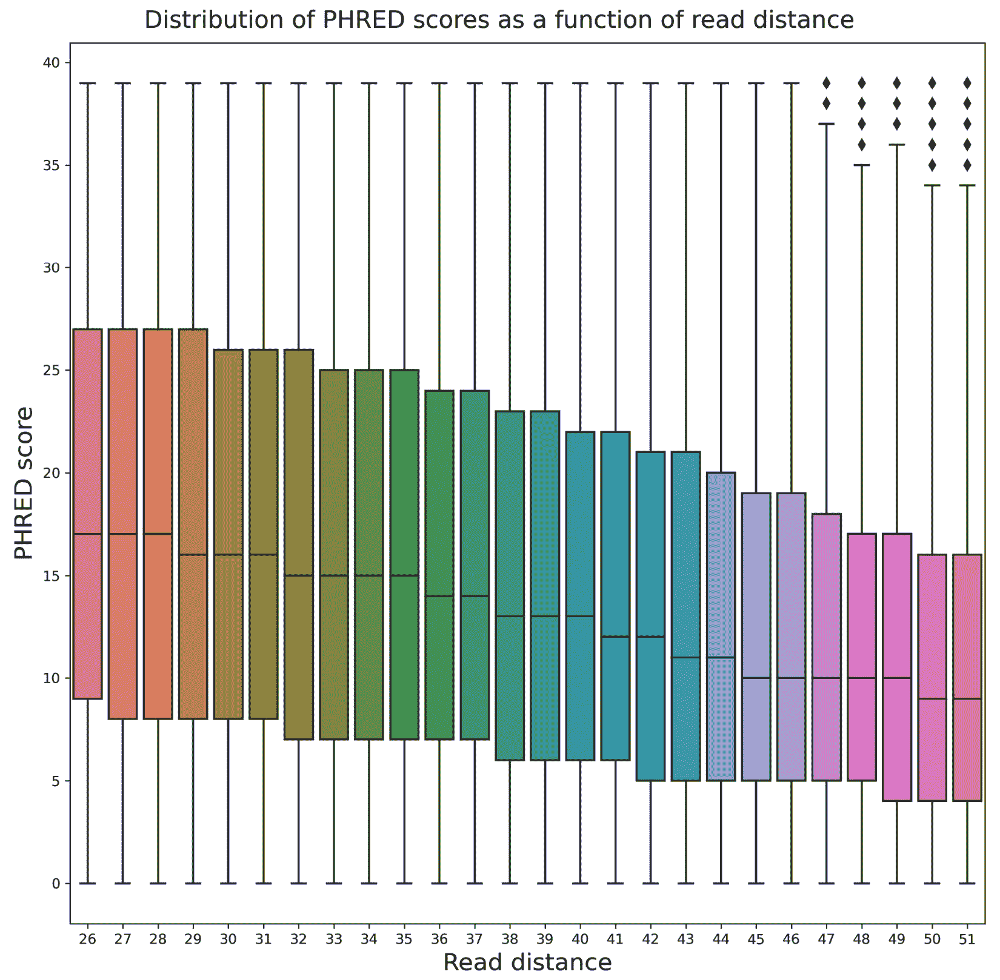
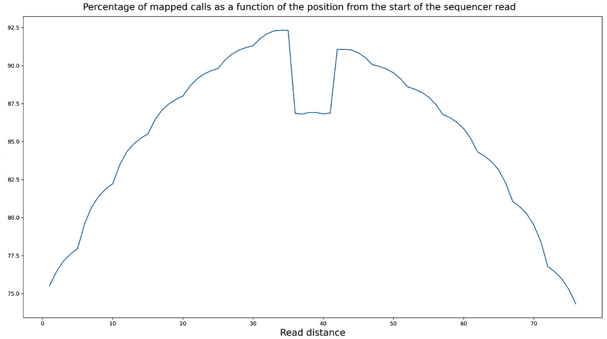
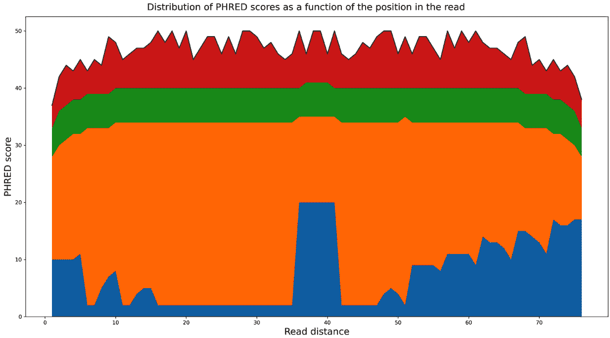
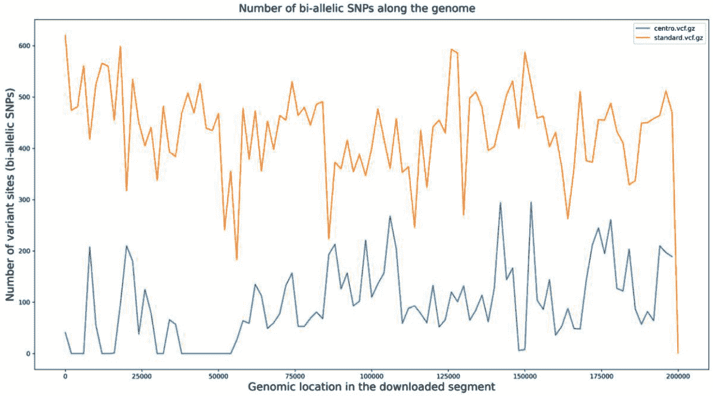
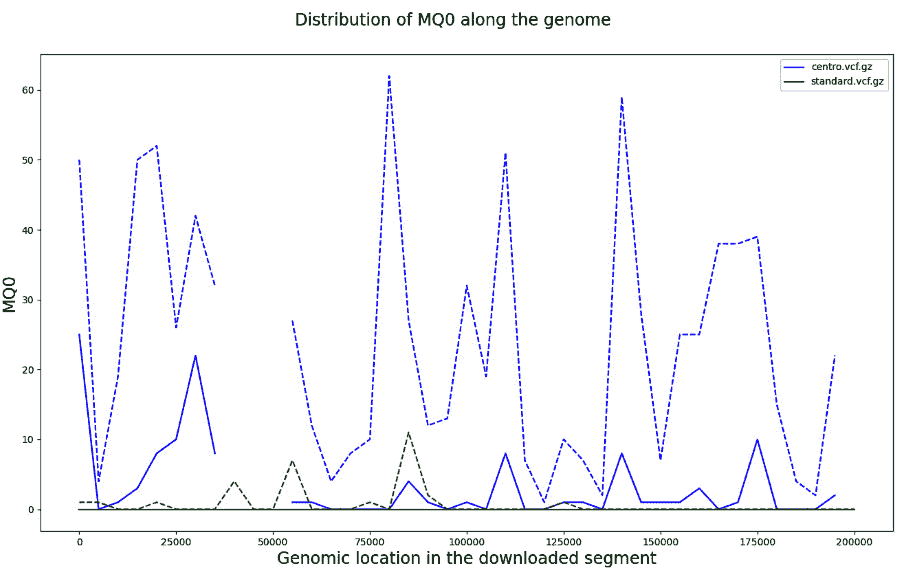
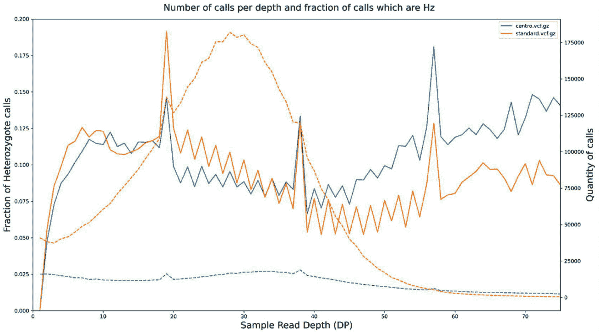
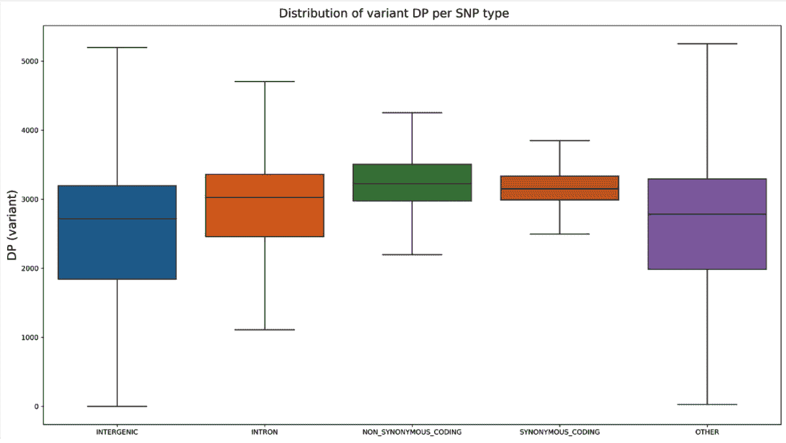

# 第四章：下一代测序

**下一代测序**（**NGS**）是本世纪生命科学领域的基础性技术发展之一。**全基因组测序**（**WGS**）、**限制酶切位点关联 DNA 测序**（**RAD-Seq**）、**核糖核酸测序**（**RNA-Seq**）、**染色质免疫沉淀测序**（**ChIP-Seq**）以及其他几种技术已被广泛应用于研究重要的生物学问题。这些技术也被称为高通量测序技术，且理由充分：它们产生大量需要处理的数据。NGS 是计算生物学成为大数据学科的主要原因。最重要的是，这是一个需要强大生物信息学技术的领域。

在这里，我们不会讨论每一种单独的 NGS 技术*本身*（这将需要一本完整的书）。我们将使用现有的 WGS 数据集——千人基因组计划，来说明分析基因组数据所需的最常见步骤。这里提供的步骤可以轻松应用于其他基因组测序方法。其中一些也可以用于转录组分析（例如，RNA-Seq）。这些步骤也与物种无关，因此你可以将它们应用于任何其他已测序物种的数据。来自不同物种的数据处理之间最大的差异与基因组大小、多样性以及参考基因组的质量（如果存在的话）有关。这些因素不会对 NGS 处理的自动化 Python 部分产生太大影响。无论如何，我们将在*第五章*中讨论不同的基因组，*基因组分析*。

由于这不是一本入门书籍，你需要至少了解**FASTA**（**FASTA**）、FASTQ、**二进制比对映射**（**BAM**）和**变异调用格式**（**VCF**）文件是什么。我还将使用一些基本的基因组术语而不做介绍（例如外显子、非同义突变等）。你需要具备基本的 Python 知识。我们将利用这些知识来介绍 Python 中进行 NGS 分析的基本库。在这里，我们将遵循标准的生物信息学流程。

然而，在我们深入研究来自真实项目的真实数据之前，让我们先熟悉访问现有的基因组数据库和基本的序列处理——在风暴来临之前的简单开始。

如果你通过 Docker 运行内容，可以使用`tiagoantao/bioinformatics_ngs`镜像。如果你使用的是 Anaconda Python，本章所需的软件将在每个步骤中介绍。

在本章中，我们将涵盖以下步骤：

+   访问 GenBank 并浏览**国家生物技术信息中心**（**NCBI**）数据库

+   执行基本的序列分析

+   处理现代序列格式

+   处理比对数据

+   从 VCF 文件中提取数据

+   研究基因组可访问性并筛选**单核苷酸多态性**（**SNP**）数据

+   使用 HTSeq 处理 NGS 数据

# 访问 GenBank 并在 NCBI 数据库中浏览

虽然你可能有自己的数据需要分析，但你很可能需要现有的基因组数据集。在这里，我们将探讨如何访问 NCBI 的这些数据库。我们不仅会讨论 GenBank，还会讨论 NCBI 的其他数据库。许多人错误地将整个 NCBI 数据库集称为 GenBank，但 NCBI 还包括核苷酸数据库和其他许多数据库——例如，PubMed。

由于测序分析是一个庞大的主题，而本书面向的是中高级用户，我们不会对这个本质上并不复杂的主题进行非常详尽的讲解。

尽管如此，这也是一个很好的热身练习，为我们在本章末尾看到的更复杂的教程做准备。

## 准备工作

我们将使用你在*第一章*中安装的 Biopython，*Python 与周围的软件生态*。Biopython 为`Entrez`提供了接口，`Entrez`是 NCBI 提供的数据检索系统。

这个教程可以在`Chapter03/Accessing_Databases.py`文件中找到。

小贴士

你将访问 NCBI 的实时**应用程序编程接口**（**API**）。请注意，系统的性能可能会在一天中有所波动。此外，使用时需要保持“良好的公民行为”。你可以在[`www.ncbi.nlm.nih.gov/books/NBK25497/#chapter2.Usage_Guidelines_and_Requiremen`](https://www.ncbi.nlm.nih.gov/books/NBK25497/#chapter2.Usage_Guidelines_and_Requiremen)找到一些使用建议。特别需要注意的是，查询时你需要指定一个电子邮件地址。你应尽量避免在高峰时段（工作日美国东部时间上午 9:00 到下午 5:00 之间）发出大量请求（100 个或更多），并且每秒不超过三次查询（Biopython 会为你处理这个问题）。这不仅是为了遵守规定，而且如果你过度使用 NCBI 的服务器，你可能会被封锁（这也是一个好理由提供真实的电子邮件地址，因为 NCBI 可能会联系你）。

## 如何操作...

现在，让我们来看看如何从 NCBI 数据库中搜索和获取数据：

1.  我们将从导入相关模块并配置电子邮件地址开始：

    ```py
    from Bio import Entrez, SeqIO
    Entrez.email = 'put@your.email.here'
    ```

我们还将导入用于处理序列的模块。请不要忘记填写正确的电子邮件地址。

1.  我们现在将尝试在`nucleotide`数据库中查找`Plasmodium falciparum`（导致最致命疟疾的寄生虫）：

    ```py
    handle = Entrez.esearch(db='nucleotide', term='CRT[Gene Name] AND "Plasmodium falciparum"[Organism]')
    rec_list = Entrez.read(handle)
    if int(rec_list['RetMax']) < int(rec_list['Count']):
        handle = Entrez.esearch(db='nucleotide', term='CRT[Gene Name] AND "Plasmodium falciparum"[Organism]', retmax=rec_list['Count'])
        rec_list = Entrez.read(handle)
    ```

我们将搜索 `nucleotide` 数据库中的基因和生物体（关于搜索字符串的语法，参考 NCBI 网站）。然后，我们将读取返回的结果。请注意，标准搜索会将记录引用的数量限制为 20，因此如果有更多记录，可能需要重复查询并增加最大限制。在我们的例子中，我们将使用 `retmax` 来覆盖默认限制。`Entrez` 系统提供了多种复杂的方法来检索大量结果（更多信息请参考 Biopython 或 NCBI Entrez 文档）。尽管现在你已经拥有了所有记录的**标识符**（**ID**），但你仍然需要正确地检索记录。

1.  现在，让我们尝试检索所有这些记录。以下查询将从 GenBank 下载所有匹配的核苷酸序列，截至本书编写时，共有 1,374 条。你可能不想每次都这样做：

    ```py
    id_list = rec_list['IdList']
    hdl = Entrez.efetch(db='nucleotide', id=id_list, rettype='gb')
    ```

好吧，在这种情况下，继续进行吧。然而，使用这种技术时要小心，因为你将检索大量完整的记录，其中一些记录包含相当大的序列。你有可能下载大量数据（这会对你的机器和 NCBI 服务器都造成压力）。

有几种方法可以解决这个问题。一个方法是进行更严格的查询和/或每次只下载少量记录，当你找到需要的记录时就停止。具体策略取决于你的目标。无论如何，我们将检索 GenBank 格式的记录列表（该格式包含序列以及大量有趣的元数据）。

1.  让我们读取并解析结果：

    ```py
    recs = list(SeqIO.parse(hdl, 'gb'))
    ```

请注意，我们已经将一个迭代器（`SeqIO.parse` 的结果）转换为列表。这样做的好处是我们可以多次使用结果（例如，多次迭代），而无需在服务器上重复查询。

如果你打算进行多次迭代，这可以节省时间、带宽和服务器使用。缺点是它会为所有记录分配内存。对于非常大的数据集，这种方法不可行；你可能不想像在 *第五章* 《处理基因组》那样进行全基因组的转换。如果你正在进行交互式计算，你可能更倾向于获取一个列表（以便你可以多次分析和实验），但如果你在开发一个库，迭代器可能是最佳的选择。

1.  现在我们将集中精力处理单条记录。只有当你使用完全相同的前一个查询时，这种方法才有效：

    ```py
    for rec in recs:
        if rec.name == 'KM288867':
            break
    print(rec.name)
    print(rec.description)
    ```

`rec` 变量现在包含我们感兴趣的记录。`rec.description` 文件将包含它的人类可读描述。

1.  现在，让我们提取一些包含 `gene` 产品和序列中 `exon` 位置等信息的序列特征：

    ```py
    for feature in rec.features:
         if feature.type == 'gene':
             print(feature.qualifiers['gene'])
         elif feature.type == 'exon':
             loc = feature.location
             print(loc.start, loc.end, loc.strand)
         else:
             print('not processed:\n%s' % feature)
    ```

如果`feature.type`值是`gene`，我们将打印其名称，它会在`qualifiers`字典中。我们还将打印所有外显子的位置。外显子和所有特征一样，具有该序列的位置：起始位置、结束位置，以及它们读取的链。虽然所有外显子的起始和结束位置都是`ExactPosition`，但请注意，Biopython 支持许多其他类型的位置。位置的一种类型是`BeforePosition`，它指定某个位置点位于某个特定序列位置之前。另一种类型是`BetweenPosition`，它给出了某个位置的起始/结束区间。还有许多其他位置类型，这些只是一些例子。

坐标将以这样一种方式指定，使得你能够轻松地从带有范围的 Python 数组中检索序列，因此通常开始位置会比记录上的值小 1，结束位置将相等。坐标系统的问题将在未来的教程中再次讨论。

对于其他特征类型，我们只需打印它们。请注意，当你打印特征时，Biopython 会提供一个可读的人类版本。

1.  现在我们来看一下记录上的注释，这些注释主要是与序列位置无关的元数据：

    ```py
    for name, value in rec.annotations.items():
        print('%s=%s' % (name, value))
    ```

请注意，有些值不是字符串；它们可以是数字，甚至是列表（例如，分类注释就是一个列表）。

1.  最后但同样重要的是，你可以访问一个基础信息——序列：

    ```py
    print(len(rec.seq))
    ```

序列对象将是我们下一个教程的主要主题。

## 还有更多内容...

NCBI 还有许多其他数据库。如果你正在处理 NGS 数据，可能会想查看**序列读取档案**（**SRA**）数据库（以前称为**短序列档案**）。SNP 数据库包含 SNP 信息，而蛋白质数据库包含蛋白质序列，等等。Entrez 数据库的完整列表可在本教程的*另见*部分找到。

另一个你可能已经知道的与 NCBI 相关的数据库是 PubMed，它包含了科学和医学的引用、摘要，甚至是全文。你也可以通过 Biopython 访问它。此外，GenBank 记录通常包含指向 PubMed 的链接。例如，我们可以在之前的记录上执行此操作，如下所示：

```py
from Bio import Medline
refs = rec.annotations['references']
for ref in refs:
    if ref.pubmed_id != '':
        print(ref.pubmed_id)
        handle = Entrez.efetch(db='pubmed', id=[ref.pubmed_id], rettype='medline', retmode='text')
        records = Medline.parse(handle)
        for med_rec in records:
            for k, v in med_rec.items():
                print('%s: %s' % (k, v))
```

这将获取所有参考注释，检查它们是否具有 PubMed ID，然后访问 PubMed 数据库以检索记录，解析它们，并打印出来。

每条记录的输出是一个 Python 字典。请注意，典型的 GenBank 记录中有许多指向外部数据库的引用。

当然，NCBI 之外还有许多其他生物数据库，如 Ensembl（[`www.ensembl.org`](http://www.ensembl.org)）和**加利福尼亚大学圣克鲁兹分校**（**UCSC**）基因组生物信息学（[`genome.ucsc.edu/`](http://genome.ucsc.edu/)）。这些数据库在 Python 中的支持程度差异很大。

介绍生物数据库的食谱如果没有至少提到**基础本地比对搜索工具**（**BLAST**），那就不完整了。BLAST 是一种评估序列相似性的算法。NCBI 提供了一项服务，允许你将目标序列与其数据库进行比对。当然，你也可以使用本地 BLAST 数据库，而不是 NCBI 的服务。Biopython 为此提供了广泛的支持，但由于这是一个入门教程，我仅将你指引至 Biopython 的教程。

## 另见

这些附加信息也会很有用：

+   你可以在 Biopython 教程中找到更多示例，链接为[`biopython.org/DIST/docs/tutorial/Tutorial.xhtml`](http://biopython.org/DIST/docs/tutorial/Tutorial.xhtml)。

+   可访问的 NCBI 数据库列表可以在[`www.ncbi.nlm.nih.gov/gquery/`](http://www.ncbi.nlm.nih.gov/gquery/)找到。

+   一个很棒的**问答**（**Q&A**）网站，你可以在上面找到关于数据库和序列分析问题的帮助，就是 Biostars ([`www.biostars.org`](http://www.biostars.org))；你可以使用它来查找本书中的所有内容，而不仅仅是本章的这道示例。

# 执行基本的序列分析

现在我们将对 DNA 序列进行一些基本分析。我们将处理 FASTA 文件，并进行一些操作，例如反向互补或转录。与前面介绍的食谱一样，我们将使用你在*第一章*中安装的 Biopython，*Python 与周边软件生态*。这两道食谱为你提供了执行本章和*第五章*中所有现代 NGS 分析和基因组处理所需的入门基础。

## 准备工作

本食谱的代码可以在`Chapter03/Basic_Sequence_Processing.py`中找到。我们将使用人类`Entrez`研究接口：

```py
from Bio import Entrez, SeqIO, SeqRecord
Entrez.email = "your@email.here"
hdl = Entrez.efetch(db='nucleotide', id=['NM_002299'], rettype='gb') # Lactase gene
gb_rec = SeqIO.read(hdl, 'gb')
```

现在我们有了 GenBank 记录，让我们提取基因序列。该记录中包含的内容比这更多，但首先让我们获取基因的精确位置：

```py
for feature in gb_rec.features:
    if feature.type == 'CDS':
        location = feature.location  # Note translation existing
cds = SeqRecord.SeqRecord(gb_rec.seq[location.start:location.end], 'NM_002299', description='LCT CDS only')
```

我们的示例序列已经包含在 Biopython 序列记录中。

## 如何操作...

让我们来看一下接下来的步骤：

1.  由于我们的目标序列已经存储在一个 Biopython 序列对象中，首先让我们把它保存为本地磁盘上的 FASTA 文件：

    ```py
    from Bio import SeqIO
    w_hdl = open('example.fasta', 'w')
    SeqIO.write([cds], w_hdl, 'fasta')
    w_hdl.close()
    ```

`SeqIO.write`函数接受一个序列列表进行写入（在我们这里只是一个序列）。使用这个惯用法时要小心。如果你想写入多个序列（并且你可能会用 NGS 写入数百万个序列），不要使用列表（如前面的代码片段所示），因为这会分配大量内存。应使用迭代器，或者每次写入时只处理序列的子集，并多次调用`SeqIO.write`函数。

1.  在大多数情况下，你实际上会把序列保存在磁盘上，因此你会对读取它感兴趣：

    ```py
    recs = SeqIO.parse('example.fasta', 'fasta')
    for rec in recs:
        seq = rec.seq
        print(rec.description)
        print(seq[:10])
    ```

在这里，我们关注的是处理单一序列，但 FASTA 文件可以包含多个记录。实现这一点的 Python 惯用法非常简单。要读取 FASTA 文件，你只需使用标准的迭代技巧，如以下代码片段所示。对于我们的示例，前面的代码将打印以下输出：

```py
NM_002299 LCT CDS only
 ATGGAGCTGT
```

请注意，我们打印了`seq[:10]`。序列对象可以使用典型的数组切片来获取序列的一部分。

1.  既然我们现在有了明确无误的 DNA，我们可以按如下方式转录它：

    ```py
    rna = seq.transcribe()
    print(rna)
    ```

1.  最终，我们可以将我们的基因转化为蛋白质：

    ```py
    prot = seq.translate()
    print(prot)
    ```

现在，我们已经有了我们基因的氨基酸序列。

## 还有更多...

关于在 Biopython 中管理序列，还可以说很多，但这些主要是介绍性的内容，你可以在 Biopython 教程中找到。我认为给你们一个序列管理的概述是很重要的，主要是为了完整性。为了支持那些可能在生物信息学其他领域有一些经验，但刚刚开始做序列分析的人，尽管如此，仍然有几个点是你们应该注意的：

+   当你执行 RNA 翻译以获得你的蛋白质时，请确保使用正确的遗传密码。即使你正在处理“常见”的生物体（如人类），也要记住线粒体的遗传密码是不同的。

+   Biopython 的`Seq`对象比这里展示的要灵活得多。有一些很好的例子可以参考 Biopython 教程。然而，这个教程足以应付我们需要处理的 FASTQ 文件（请参见下一个教程）。

+   为了处理与链相关的问题，正如预期的那样，有一些序列函数，比如`reverse_complement`。

+   我们开始的 GenBank 记录包含了关于序列的大量元数据，所以一定要深入探索。

## 另请参见

+   Biopython 已知的遗传密码是由 NCBI 指定的，可以在[`www.ncbi.nlm.nih.gov/Taxonomy/Utils/wprintgc.cgi`](http://www.ncbi.nlm.nih.gov/Taxonomy/Utils/wprintgc.cgi)找到。

+   如同前面的教程一样，Biopython 教程是你的主要参考资料，可以在[`biopython.org/DIST/docs/tutorial/Tutorial.xhtml`](http://biopython.org/DIST/docs/tutorial/Tutorial.xhtml)找到。

+   确保也查看 Biopython 的 SeqIO 页面，[`biopython.org/wiki/SeqIO`](http://biopython.org/wiki/SeqIO)。

# 使用现代序列格式

在这里，我们将处理 FASTQ 文件，这是现代测序仪使用的标准格式输出。你将学习如何处理每个碱基的质量分数，并考虑不同测序仪和数据库的输出变化。这是第一个将使用来自人类 1000 基因组计划的真实数据（大数据）的教程。我们将首先简要介绍这个项目。

## 准备工作

人类 1,000 基因组计划旨在 catalog 世界范围的人类遗传变异，并利用现代测序技术进行全基因组测序（WGS）。这个项目使所有数据公开可用，包括来自测序仪的输出、序列比对、SNP 调用以及许多其他数据。这一名称“1,000 基因组”实际上是一个误称，因为它目前包含了超过 2,500 个样本。这些样本分布在数百个人群中，遍布全球。我们将主要使用四个人群的数据：**非洲约鲁巴人**（**YRI**），**拥有北欧和西欧血统的犹他州居民**（**CEU**），**东京的日本人**（**JPT**），以及**北京的汉族人**（**CHB**）。之所以选择这些特定的人群，是因为它们是最早来自 HapMap 的样本，HapMap 是一个具有类似目标的旧项目。它们使用基因分型阵列来进一步了解该子集的质量。我们将在*第六章*“*种群遗传学*”中重新回顾 1,000 基因组和 HapMap 项目。

提示

下一代数据集通常非常大。由于我们将使用真实数据，你下载的某些文件可能会非常大。尽管我已经尽量选择最小的真实示例，但你仍然需要一个良好的网络连接以及相当大的磁盘空间。等待下载可能是你在这个配方中遇到的最大障碍，但数据管理是 NGS 中一个严重的问题。在现实生活中，你需要为数据传输预留时间，分配磁盘空间（这可能会涉及财务成本），并考虑备份策略。NGS 的最常见初始错误是认为这些问题微不足道，但事实并非如此。像将一组 BAM 文件复制到网络，甚至复制到你的计算机上，都会变成一件头疼的事。要做好准备。下载大文件后，至少应检查文件大小是否正确。一些数据库提供**消息摘要 5**（**MD5**）校验和。你可以通过使用像 md5sum 这样的工具，将这些校验和与下载文件中的校验和进行对比。

下载数据的指令位于笔记本的顶部，正如`Chapter03/Working_with_FASTQ.py`文件的第一单元格中所指定的。这是一个相当小的文件（27 `NA18489`）。如果你参考 1,000 基因组计划，你会发现绝大多数的 FASTQ 文件要大得多（大约大两个数量级）。

FASTQ 序列文件的处理将主要使用 Biopython 来完成。

## 如何操作...

在我们开始编写代码之前，让我们先看一下 FASTQ 文件，你将会看到许多记录，正如以下代码片段所示：

```py
@SRR003258.1 30443AAXX:1:1:1053:1999 length=51
 ACCCCCCCCCACCCCCCCCCCCCCCCCCCCCCCCCCCACACACACCAACAC
 +
 =IIIIIIIII5IIIIIII>IIII+GIIIIIIIIIIIIII(IIIII01&III
```

*第 1 行*以`@`开始，后面跟着一个序列 ID 和描述字符串。描述字符串会根据测序仪或数据库源有所不同，但通常是可以自动解析的。

第二行包含测序的 DNA，类似于 FASTA 文件。第三行是一个`+`符号，有时后面会跟上第一行的描述行。

第四行包含每个在*第二行*读取的碱基的质量值。每个字母编码一个 Phred 质量分数（[`en.wikipedia.org/wiki/Phred_quality_score`](http://en.wikipedia.org/wiki/Phred_quality_score)），该分数为每个读取分配一个错误概率。这个编码在不同平台间可能略有不同。请确保在您的特定平台上检查此内容。

让我们看看接下来的步骤：

1.  让我们打开文件：

    ```py
    import gzip
    from Bio import SeqIO
    recs = SeqIO.parse(gzip.open('SRR003265.filt.fastq.gz'),'rt', encoding='utf-8'), 'fastq')
    rec = next(recs)
    print(rec.id, rec.description, rec.seq)
    print(rec.letter_annotations)
    ```

我们将打开一个`gzip`模块，并指定`fastq`格式。请注意，这种格式的某些变体会影响 Phred 质量分数的解释。您可能需要指定一个稍有不同的格式。有关所有格式的详细信息，请参考[`biopython.org/wiki/SeqIO`](http://biopython.org/wiki/SeqIO)。

提示

通常，您应该将 FASTQ 文件存储为压缩格式。这样不仅可以节省大量磁盘空间（因为这些是文本文件），而且可能还可以节省一些处理时间。尽管解压缩是一个较慢的过程，但它仍然可能比从磁盘读取一个更大的（未压缩的）文件更快。

我们将从之前的例子中打印标准字段和质量分数到`rec.letter_annotations`。只要我们选择正确的解析器，Biopython 会将所有 Phred 编码字母转换为对数分数，我们很快就会使用这些分数。

目前，*不要*这样做：

```py
recs = list(recs) # do not do it!
```

尽管这种方法可能适用于某些 FASTA 文件（以及这个非常小的 FASTQ 文件），但如果您这样做，您将分配内存以便将完整文件加载到内存中。对于一个普通的 FASTQ 文件，这是让您的计算机崩溃的最佳方式。一般来说，始终遍历您的文件。如果您需要对文件执行多次操作，您有两个主要选择。第一种选择是一次性执行所有操作。第二种选择是多次打开文件并重复迭代。

1.  现在，让我们看看核苷酸读取的分布：

    ```py
    from collections import defaultdict
    recs = SeqIO.parse(gzip.open('SRR003265.filt.fastq.gz', 'rt', encoding='utf-8'), 'fastq')
    cnt = defaultdict(int)
    for rec in recs:
        for letter in rec.seq:
            cnt[letter] += 1
    tot = sum(cnt.values())
    for letter, cnt in cnt.items():
        print('%s: %.2f %d' % (letter, 100\. * cnt / tot, cnt))
    ```

我们将重新打开文件并使用`defaultdict`来维护 FASTQ 文件中核苷酸引用的计数。如果您从未使用过这种 Python 标准字典类型，您可能会考虑使用它，因为它消除了初始化字典条目的需要，并为每种类型假设默认值。

注意

这里有一个`N`调用的剩余数目。这些是测序仪报告的未知碱基。在我们的 FASTQ 文件示例中，我们稍微作弊了一下，因为我们使用了一个过滤后的文件（`N`调用的比例会非常低）。在从测序仪未过滤的文件中，您会看到更多的`N`调用。事实上，您可能还会看到关于`N`调用的空间分布方面更多的信息。

1.  让我们根据读取位置绘制`N`的分布：

    ```py
    import seaborn as sns
    import matplotlib.pyplot as plt
    recs = SeqIO.parse(gzip.open('SRR003265.filt.fastq.gz', 'rt', encoding='utf-8'), 'fastq')
    n_cnt = defaultdict(int)
    for rec in recs:
        for i, letter in enumerate(rec.seq):
            pos = i + 1
            if letter == 'N':
                n_cnt[pos] += 1
    seq_len = max(n_cnt.keys())
    positions = range(1, seq_len + 1)
    fig, ax = plt.subplots(figsize=(16,9))
    ax.plot(positions, [n_cnt[x] for x in positions])
    fig.suptitle('Number of N calls as a function of the distance from the start of the sequencer read')
    ax.set_xlim(1, seq_len)
    ax.set_xlabel('Read distance')
    ax.set_ylabel('Number of N Calls')
    ```

我们导入`seaborn`库。尽管目前我们并没有显式使用它，但这个库的优点在于它能使`matplotlib`绘图看起来更好，因为它调整了默认的`matplotlib`样式。

然后，我们再次打开文件进行解析（记住，这时你不使用列表，而是再次进行迭代）。我们遍历文件，找出所有指向`N`的引用位置。接着，我们将`N`的分布作为序列开始位置的距离函数绘制出来：


图 3.1 – `N`调用的数量与序列读取起始位置的距离函数

你会看到，直到位置`25`，没有错误。这并不是你从典型的测序仪输出中得到的结果。我们的示例文件已经经过过滤，1,000 基因组过滤规则要求在位置`25`之前不能有`N`调用。

虽然我们不能在位置`25`之前研究`N`在这个数据集中的行为（如果你有一个未过滤的 FASTQ 文件，可以使用这段代码查看`N`在读取位置的分布），但我们可以看到，在位置`25`之后，分布远非均匀。在这里有一个重要的教训，那就是未调用的碱基数量是与位置相关的。那么，读取的质量如何呢？

1.  让我们研究 Phred 分数的分布（即我们读取的质量）：

    ```py
    recs = SeqIO.parse(gzip.open('SRR003265.filt.fastq.gz', 'rt', encoding='utf-8'), 'fastq')
    cnt_qual = defaultdict(int)
    for rec in recs:
        for i, qual in enumerate(rec.letter_annotations['phred_quality']):
            if i < 25:
                continue
            cnt_qual[qual] += 1
    tot = sum(cnt_qual.values())
    for qual, cnt in cnt_qual.items():
        print('%d: %.2f %d' % (qual, 100\. * cnt / tot, cnt))
    ```

我们将重新打开文件（再次）并初始化一个默认字典。然后，我们获取`phred_quality`字母注释，但我们忽略从起始位置到`24`的测序位置**碱基对**（**bp**）（由于我们的 FASTQ 文件已过滤，如果你有未过滤的文件，可能需要删除此规则）。我们将质量分数添加到默认字典中，最后打印出来。

注意

简单提醒一下，Phred 质量分数是准确调用概率的对数表示。这个概率可以表示为！[](img/B17942_03_009.png)。因此，*Q* 为 10 表示 90% 的调用准确率，20 表示 99% 的调用准确率，30 表示 99.9%。对于我们的文件，最大准确率将是 99.99%（40）。在某些情况下，60 的值是可能的（99.9999%的准确率）。

1.  更有趣的是，我们可以根据读取位置绘制质量分布：

    ```py
    recs = SeqIO.parse(gzip.open('SRR003265.filt.fastq.gz', 'rt', encoding='utf-8'), 'fastq')
    qual_pos = defaultdict(list)
    for rec in recs:
        for i, qual in enumerate(rec.letter_annotations['phred_quality']):
            if i < 25 or qual == 40:
               continue
            pos = i + 1
            qual_pos[pos].append(qual)
    vps = []
    poses = list(qual_pos.keys())
    poses.sort()
    for pos in poses:
        vps.append(qual_pos[pos])
    fig, ax = plt.subplots(figsize=(16,9))
    sns.boxplot(data=vps, ax=ax)
    ax.set_xticklabels([str(x) for x in range(26, max(qual_pos.keys()) + 1)])
    ax.set_xlabel('Read distance')
    ax.set_ylabel('PHRED score')
    fig.suptitle('Distribution of PHRED scores as a function of read distance')
    ```

在这种情况下，我们将忽略序列位置为从起始位置`25` bp 的两个位置（如果你有未过滤的测序数据，请删除此规则），以及该文件的最大质量分数（`40`）。不过，在你的情况下，你可以考虑从最大值开始绘制分析。你可能想要检查你测序仪硬件的最大可能值。通常，由于大多数调用可以在最大质量下执行，如果你想了解质量问题的所在，可能会希望删除这些数据。

请注意，我们使用的是`seaborn`的`boxplot`函数；我们之所以使用它，是因为它的输出效果比`matplotlib`的标准`boxplot`函数稍好。如果你不想依赖`seaborn`，可以直接使用`matplotlib`的内建函数。在这种情况下，你可以调用`ax.boxplot(vps)`，而不是`sns.boxplot(data=vps, ax=ax)`。

正如预期的那样，分布并不均匀，如下图所示：



图 3.2 – Phred 得分与测序读取起始位置距离的关系分布

## 还有更多内容...

尽管无法讨论来自测序仪文件的所有输出变化，但双端读取值得一提，因为它们很常见并且需要不同的处理方式。在双端测序中，DNA 片段的两端会被测序，并且中间有一个间隙（称为插入）。在这种情况下，将生成两个文件：`X_1.FASTQ`和`X_2.FASTQ`。这两个文件的顺序相同，且包含相同数量的序列。`X_1`中的第一个序列与`X_2`中的第一个序列配对，以此类推。关于编程技巧，如果你想保持配对信息，你可以执行如下操作：

```py
f1 = gzip.open('X_1.filt.fastq.gz', 'rt, enconding='utf-8')
f2 = gzip.open('X_2.filt.fastq.gz', 'rt, enconding='utf-8')
recs1 = SeqIO.parse(f1, 'fastq')
recs2 = SeqIO.parse(f2, 'fastq')
cnt = 0
for rec1, rec2 in zip(recs1, recs2):
    cnt +=1
print('Number of pairs: %d' % cnt)
```

上面的代码按顺序读取所有配对并简单地计算配对的数量。你可能需要做更多的操作，但这展示了一种基于 Python `zip`函数的语法，它允许你同时迭代两个文件。记得用你的`FASTQ`前缀替换`X`。

最后，如果你正在测序人类基因组，可能想要使用 Complete Genomics 的测序数据。在这种情况下，请阅读下一个食谱中的*更多内容…*部分，我们会简要讨论 Complete Genomics 数据。

## 另见

这里有一些提供更多信息的链接：

+   关于 FASTQ 格式的维基百科页面信息非常丰富（[`en.wikipedia.org/wiki/FASTQ_format`](http://en.wikipedia.org/wiki/FASTQ_format)）。

+   你可以在[`www.1000genomes.org/`](http://www.1000genomes.org/)找到更多关于 1000 基因组计划的信息。

+   关于 Phred 质量分数的信息可以在[`en.wikipedia.org/wiki/Phred_quality_score`](http://en.wikipedia.org/wiki/Phred_quality_score)找到。

+   Illumina 在[`www.illumina.com/science/technology/next-generation-sequencing/paired-end-vs-single-read-sequencing.xhtml`](https://www.illumina.com/science/technology/next-generation-sequencing/paired-end-vs-single-read-sequencing.xhtml)提供了一篇关于双端读取的良好介绍页面。

+   Medvedev 等人在《自然方法》期刊上发表的论文《*使用下一代测序发现结构变异的计算方法*》([`www.nature.com/nmeth/journal/v6/n11s/abs/nmeth.1374.xhtml`](http://www.nature.com/nmeth/journal/v6/n11s/abs/nmeth.1374.xhtml))；请注意，这篇文章并非开放获取。

# 处理对齐数据

在您从测序仪获得数据后，通常会使用像`bwa`这样的工具将您的序列与参考基因组进行比对。大多数用户会有自己物种的参考基因组。您可以在*第五章*，*与基因组工作*中了解更多关于参考基因组的信息。

对齐数据最常见的表示方法是 SAMtools 的`tabix`工具。SAMtools 可能是最广泛使用的 SAM/BAM 文件操作工具。

## 准备工作

如前一篇食谱中所讨论的，我们将使用来自 1,000 基因组计划的数据。我们将使用女性`NA18489`的染色体 20 外显子对齐数据。数据大小为 312 MB。该个体的全外显子对齐数据为 14.2 **吉字节**（**GB**），全基因组对齐数据（低覆盖度为 4x）为 40.1 GB。该数据为双端读取，读取长度为 76 bp。如今这很常见，但处理起来稍微复杂一些。我们会考虑这一点。如果您的数据不是双端数据，可以适当简化以下食谱。

`Chapter03/Working_with_BAM.py`文件顶部的单元格将为您下载数据。您需要的文件是`NA18490_20_exome.bam`和`NA18490_20_exome.bam.bai`。

我们将使用`pysam`，它是 SAMtools C API 的 Python 包装器。您可以通过以下命令安装它：

```py
conda install –c bioconda pysam
```

好的—让我们开始吧。

## 如何操作...

在开始编码之前，请注意，您可以使用`samtools view -h`检查 BAM 文件（前提是您已经安装了 SAMtools，我们推荐您安装，即使您使用的是**基因组分析工具包**（**GATK**）或其他变异调用工具）。我们建议您查看头文件和前几个记录。SAM 格式过于复杂，无法在这里描述。网上有很多关于它的信息；不过，有时，某些非常有趣的信息就隐藏在这些头文件中。

提示

NGS 中最复杂的操作之一是从原始序列数据生成良好的比对文件。这不仅涉及调用比对工具，还包括清理数据。在高质量的 BAM 文件的 `@PG` 头部，你将找到用于生成该 BAM 文件的绝大多数（如果不是全部）过程的实际命令行。在我们的示例 BAM 文件中，你会找到所有运行 bwa、SAMtools、GATK IndelRealigner 和 Picard 应用程序套件来清理数据所需的信息。记住，虽然你可以轻松生成 BAM 文件，但之后的程序对于 BAM 输入的正确性会非常挑剔。例如，如果你使用 GATK 的变异调用器来生成基因型调用，文件必须经过广泛的清理。因此，其他 BAM 文件的头部可以为你提供生成自己文件的最佳方式。最后的建议是，如果你不处理人类数据，尝试为你的物种找到合适的 BAM 文件，因为某些程序的参数可能略有不同。此外，如果你使用的是非 WGS 数据，检查类似类型的测序数据。

让我们看看以下步骤：

1.  让我们检查一下头文件：

    ```py
    import pysam
    bam = pysam.AlignmentFile('NA18489.chrom20.ILLUMINA.bwa.YRI.exome.20121211.bam', 'rb')
    headers = bam.header
    for record_type, records in headers.items():
        print (record_type)
        for i, record in enumerate(records):
            if type(record) == dict:
                print('\t%d' % (i + 1))
                for field, value in record.items():
                    print('\t\t%s\t%s' % (field, value))
            else:
                print('\t\t%s' % record)
    ```

头部被表示为字典（其中键是 `record_type`）。由于同一 `record_type` 可能有多个实例，字典的值是一个列表（其中每个元素再次是一个字典，或者有时是包含标签/值对的字符串）。

1.  现在，我们将检查一个单一的记录。每个记录的数据量相当复杂。在这里，我们将重点关注配对末端读取的一些基本字段。有关更多详细信息，请查看 SAM 文件规范和 `pysam` API 文档：

    ```py
    for rec in bam:
        if rec.cigarstring.find('M') > -1 and rec.cigarstring.find('S') > -1 and not rec.is_unmapped and not rec.mate_is_unmapped:
        break
    print(rec.query_name, rec.reference_id, bam.getrname(rec.reference_id), rec.reference_start, rec.reference_end)
    print(rec.cigarstring)
    print(rec.query_alignment_start, rec.query_alignment_end, rec.query_alignment_length)
    print(rec.next_reference_id, rec.next_reference_start,rec.template_length)
    print(rec.is_paired, rec.is_proper_pair, rec.is_unmapped, rec.mapping_quality)
    print(rec.query_qualities)
    print(rec.query_alignment_qualities)
    print(rec.query_sequence)
    ```

请注意，BAM 文件对象可以通过其记录进行迭代。我们将遍历它，直到找到一个 **Concise Idiosyncratic Gapped Alignment Report**（**CIGAR**）字符串包含匹配和软剪切的记录。

CIGAR 字符串给出了单个碱基的比对信息。序列中被剪切的部分是比对工具未能对齐的部分（但未从序列中删除）。我们还需要读取序列、其配对 ID 以及映射到参考基因组上的位置（由于我们有配对末端读取，因此是配对的位置信息）。

首先，我们打印查询模板名称，接着是参考 ID。参考 ID 是指向给定参考序列查找表中序列名称的指针。一个示例可以使这点更加清晰。对于该 BAM 文件中的所有记录，参考 ID 是`19`（一个没有实际意义的数字），但如果你应用`bam.getrname(19)`，你会得到`20`，这就是染色体的名称。所以，不要将参考 ID（此处是`19`）与染色体名称（`20`）混淆。接下来是参考开始和参考结束。`pysam`是基于 0 的，而非基于 1 的，所以在将坐标转换为其他库时要小心。你会注意到，在这个例子中，开始和结束的位置分别是 59,996 和 60,048，这意味着一个 52 碱基的比对。为什么当读取大小是 76（记住，这是该 BAM 文件中使用的读取大小）时，只有 52 个碱基？答案可以通过 CIGAR 字符串找到，在我们的例子中是`52M24S`，即 52 个匹配碱基，后面是 24 个软剪接的碱基。

然后，我们打印比对的开始和结束位置，并计算其长度。顺便说一句，你可以通过查看 CIGAR 字符串来计算这一点。它从 0 开始（因为读取的第一部分已被比对），并在 52 处结束。长度再次是 76。

现在，我们查询配对端（如果你有双端读取，才会做这个操作）。我们获取它的参考 ID（如前面的代码片段所示），它的开始位置，以及两个配对之间的距离度量。这个距离度量只有在两个配对都映射到同一染色体时才有意义。

接着，我们绘制序列的 Phred 分数（参见之前的配方，*处理现代序列格式*，关于 Phred 分数的部分），然后仅绘制已比对部分的 Phred 分数。最后，我们打印出该序列（别忘了这么做！）。这是完整的序列，而不是剪接过的序列（当然，你可以使用之前的坐标来进行剪接）。

1.  现在，让我们在 BAM 文件中的一个子集序列中绘制成功映射位置的分布：

    ```py
    import seaborn as sns
    import matplotlib.pyplot as plt
    counts = [0] * 76
    for n, rec in enumerate(bam.fetch('20', 0, 10000000)):
        for i in range(rec.query_alignment_start, rec.query_alignment_end):
            counts[i] += 1
    freqs = [x / (n + 1.) for x in counts]
    fig, ax = plt.subplots(figsize=(16,9))
    ax.plot(range(1, 77), freqs)
    ax.set_xlabel('Read distance')
    ax.set_ylabel('PHRED score')
    fig.suptitle('Percentage of mapped calls as a function of the position from the start of the sequencer read')
    ```

我们将首先初始化一个数组，用来保存整个`76`个位置的计数。请注意，我们接下来只获取染色体 20 上从位置 0 到 10 的记录（`tabix`）进行此类抓取操作；执行速度将会完全不同。

我们遍历所有位于 10 Mbp 边界内的记录。对于每个边界，我们获取比对的开始和结束，并增加在这些已比对位置中的映射性计数器。最后，我们将其转换为频率，然后进行绘制，如下图所示：



图 3.3 – 映射调用的百分比与测序器读取开始位置的函数关系

很明显，映射性分布远非均匀；在极端位置更差，中间位置则出现下降。

1.  最后，让我们获取映射部分的 Phred 分数分布。正如你可能猜到的，这可能不会是均匀分布的：

    ```py
    from collections import defaultdict
    import numpy as np
    phreds = defaultdict(list)
    for rec in bam.fetch('20', 0, None):
        for i in range(rec.query_alignment_start, rec.query_alignment_end):
            phreds[i].append(rec.query_qualities[i])
    maxs = [max(phreds[i]) for i in range(76)]
    tops = [np.percentile(phreds[i], 95) for i in range(76)]
    medians = [np.percentile(phreds[i], 50) for i in range(76)]
    bottoms = [np.percentile(phreds[i], 5) for i in range(76)]
    medians_fig = [x - y for x, y in zip(medians, bottoms)]
    tops_fig = [x - y for x, y in zip(tops, medians)]
    maxs_fig = [x - y for x, y in zip(maxs, tops)]
    fig, ax = plt.subplots(figsize=(16,9))
    ax.stackplot(range(1, 77), (bottoms, medians_fig,tops_fig))
    ax.plot(range(1, 77), maxs, 'k-')
    ax.set_xlabel('Read distance')
    ax.set_ylabel('PHRED score')
    fig.suptitle('Distribution of PHRED scores as a function of the position in the read')
    ```

在这里，我们再次使用默认字典，它允许你使用一些初始化代码。我们现在从开始到结束提取数据，并在字典中创建一个 Phred 分数的列表，其中索引是序列读取中的相对位置。

然后，我们使用 NumPy 计算每个位置的 95 百分位、50 百分位（中位数）和 5 百分位，以及质量分数的最大值。对于大多数计算生物学分析，拥有数据的统计汇总视图是非常常见的。因此，你可能不仅熟悉百分位数的计算，还熟悉其他 Pythonic 方式来计算均值、标准差、最大值和最小值。

最后，我们将绘制每个位置的 Phred 分数的堆叠图。由于`matplotlib`期望堆叠的方式，我们必须通过 `stackplot` 调用从前一个百分位值中减去较低百分位的值。我们可以使用底部百分位数的列表，但我们需要修正中位数和顶部百分位，如下所示：



图 3.4 – Phred 分数在读取位置上的分布；底部蓝色表示从 0 到 5 百分位；绿色表示中位数，红色表示 95 百分位，紫色表示最大值

## 还有更多...

虽然我们将在本章的*学习基因组可达性与过滤 SNP 数据*配方中讨论数据过滤，但我们的目标并不是详细解释 SAM 格式或给出数据过滤的详细课程。这项任务需要一本专门的书籍，但凭借`pysam`的基础，你可以浏览 SAM/BAM 文件。不过，在本章的最后一个配方中，我们将探讨如何从 BAM 文件中提取全基因组度量（通过表示 BAM 文件度量的 VCF 文件注释），目的是了解我们数据集的整体质量。

你可能会有非常大的数据文件需要处理。有可能某些 BAM 处理会花费太多时间。减少计算时间的第一个方法是抽样。例如，如果你以 10% 进行抽样，你将忽略 10 条记录中的 9 条。对于许多任务，比如一些 BAM 文件质量评估的分析，以 10%（甚至 1%）进行抽样就足够获得文件质量的大致情况。

如果你使用的是人类数据，你可能会在 Complete Genomics 上进行测序。在这种情况下，比对文件将会有所不同。尽管 Complete Genomics 提供了将数据转换为标准格式的工具，但如果使用其自己的数据，可能会更适合你。

## 另见

额外的信息可以通过以下链接获得：

+   SAM/BAM 格式的描述可以在[`samtools.github.io/hts-specs/SAMv1.pdf`](http://samtools.github.io/hts-specs/SAMv1.pdf)找到。

+   你可以在 Abecasis 小组的维基页面上找到关于 SAM 格式的介绍：[`genome.sph.umich.edu/wiki/SAM`](http://genome.sph.umich.edu/wiki/SAM)。

+   如果你真的需要从 BAM 文件中提取复杂的统计数据，Alistair Miles 的`pysamstats`库是你的首选，网址：[`github.com/alimanfoo/pysamstats`](https://github.com/alimanfoo/pysamstats)。

+   要将原始序列数据转换为比对数据，你需要一个比对工具；最常用的是 bwa，网址：[`bio-bwa.sourceforge.net/`](http://bio-bwa.sourceforge.net/)。

+   Picard（显然是指*星际迷航：下一代*中的人物）是最常用的工具来清理 BAM 文件；参考：[`broadinstitute.github.io/picard/`](http://broadinstitute.github.io/picard/)。

+   序列分析的技术论坛叫做*SEQanswers*，网址：[`seqanswers.com/`](http://seqanswers.com/)。

+   我想在这里重复一下 Biostars 上的推荐（在前面的“*处理现代序列格式*”一节中提到过）；这是一个信息宝库，且拥有一个非常友好的社区，网址：[`www.biostars.org/`](http://www.biostars.org/)。

+   如果你有 Complete Genomics 数据，可以查看**常见问题解答**（**FAQs**），网址：[`www.completegenomics.com/customer-support/faqs/`](http://www.completegenomics.com/customer-support/faqs/)。

# 从 VCF 文件中提取数据

在运行基因型调用工具（例如，GATK 或 SAMtools）后，你将得到一个 VCF 文件，报告基因组变异信息，如 SNPs，`cyvcf2`模块。

## 准备工作

尽管 NGS 主要涉及大数据，但我不能要求你为本书下载过多的数据集。我认为 2 到 20 GB 的数据对于教程来说太多了。虽然 1,000 基因组计划的 VCF 文件和实际注释数据在这个数量级，但我们这里将处理更少的数据。幸运的是，生物信息学社区已经开发了工具，允许部分下载数据。作为 SAMtools/`htslib`包的一部分（[`www.htslib.org/`](http://www.htslib.org/)），你可以下载`tabix`和`bgzip`，它们将负责数据管理。在命令行中，执行以下操作：

```py
tabix -fh ftp://ftp-
trace.ncbi.nih.gov/1000genomes/ftp/release/20130502/supporting/vcf_with_sample_level_annotation/ALL.chr22.phase3_shapeit2_mvncall_integrated_v5_extra_anno.20130502.genotypes.vcf.gz 22:1-17000000 | bgzip -c > genotypes.vcf.gz
tabix -p vcf genotypes.vcf.gz
```

第一行将部分下载来自 1,000 基因组计划的 22 号染色体 VCF 文件（最多 17 Mbp），然后，`bgzip`会进行压缩。

第二行将创建一个索引，这是我们直接访问基因组某一部分所需要的。像往常一样，你可以在笔记本中找到执行此操作的代码（`Chapter03/Working_with_VCF.py`文件）。

你需要安装`cyvcf2`：

```py
conda install –c bioconda cyvcf2
```

提示

如果你遇到冲突解决问题，可以尝试改用 `pip`。这是一个最后的解决方案，当你使用 `conda` 时，往往会因为其无法解决软件包依赖问题而不得不这样做，你可以执行 `pip install cyvcf2`。

## 如何操作……

请查看以下步骤：

1.  让我们从检查每条记录可以获取的信息开始：

    ```py
    from cyvcf2 import VCF
    v = VCF('genotypes.vcf.gz')
    rec = next(v)
    print('Variant Level information')
    info = rec.INFO
    for info in rec.INFO:
        print(info)
    print('Sample Level information')
    for fmt in rec.FORMAT:
        print(fmt)
    ```

我们从检查每条记录可用的注释开始（记住，每条记录编码一个变异，例如 SNP、CNV、INDEL 等，以及该变异在每个样本中的状态）。在变异（记录）级别，我们会找到 `AC` —— 在调用基因型中 `ALT` 等位基因的总数，`AF` —— 估算的等位基因频率，`NS` —— 有数据的样本数，`AN` —— 在调用基因型中的等位基因总数，以及 `DP` —— 总读取深度。还有其他信息，但它们大多数是 1000 基因组计划特有的（在这里，我们将尽量保持通用）。你自己的数据集可能有更多的注释（或没有这些注释）。

在样本级别，这个文件中只有两个注释：`GT` —— 基因型，和 `DP` —— 每个样本的读取深度。你有每个变异的总读取深度和每个样本的读取深度，请确保不要混淆两者。

1.  现在我们知道了有哪些信息可用，让我们查看单个 VCF 记录：

    ```py
    v = VCF('genotypes.vcf.gz')
    samples = v.samples
    print(len(samples))
    variant = next(v)
    print(variant.CHROM, variant.POS, variant.ID, variant.REF, variant.ALT, variant.QUAL, variant.FILTER)
    print(variant.INFO)
    print(variant.FORMAT)
    print(variant.is_snp)
    str_alleles = variant.gt_bases[0]
    alleles = variant.genotypes[0][0:2]
    is_phased = variant.genotypes[0][2]
    print(str_alleles, alleles, is_phased)
    print(variant.format('DP')[0])
    ```

我们将从获取标准信息开始：染色体、位置、ID、参考碱基（通常只有一个）和替代碱基（可以有多个，但作为一种常见的初步筛选方法，通常只接受单个 `ALT`，例如只接受双等位基因 SNP），质量（如你所预期，采用 Phred 扩展评分），以及过滤状态。关于过滤状态，请记住，不论 VCF 文件中如何表示，你可能仍然需要应用额外的过滤器（如下一个教程所述，*研究基因组可访问性和筛选 SNP 数据*）。

然后，我们打印附加的变异级别信息（`AC`、`AS`、`AF`、`AN`、`DP` 等），接着是样本格式（在此案例中为 `DP` 和 `GT`）。最后，我们统计样本数并检查单个样本，以确认它是否针对该变异进行了调用。同时，还包括报告的等位基因、杂合性和相位状态（该数据集恰好是相位的，虽然这并不常见）。

1.  让我们一次性检查变异的类型和非双等位基因 SNP 的数量：

    ```py
    from collections import defaultdict
    f = VCF('genotypes.vcf.gz')
    my_type = defaultdict(int)
    num_alts = defaultdict(int)
    for variant in f:
        my_type[variant.var_type, variant.var_subtype] += 1
        if variant.var_type == 'snp':
            num_alts[len(variant.ALT)] += 1
    print(my_type)
    ```

我们将使用现在常见的 Python 默认字典。我们发现该数据集中包含 INDEL、CNV 和——当然——SNP（大约三分之二是转换突变，一三分之一是倒位突变）。还有一个剩余的数量（79）为三等位基因 SNP。

## 还有更多内容……

本教程的目的是让你快速熟悉 `cyvcf2` 模块。此时，你应该已经能熟练使用该 API。我们不会花太多时间讲解使用细节，因为下一个教程的主要内容是：使用 VCF 模块研究变异调用的质量。

虽然`cyvcf2`非常快速，但处理基于文本的 VCF 文件仍然可能需要很长时间。有两种主要策略来处理这个问题。一种策略是并行处理，我们将在最后一章*第九章*，*生物信息学管道*中讨论。第二种策略是转换为更高效的格式；我们将在*第六章*，*群体遗传学*中提供示例。请注意，VCF 开发人员正在开发**二进制变异调用格式**（**BCF**）版本，以解决这些问题的部分内容（[`www.1000genomes.org/wiki/analysis/variant-call-format/bcf-binary-vcf-version-2`](http://www.1000genomes.org/wiki/analysis/variant-call-format/bcf-binary-vcf-version-2)）。

## 另见

一些有用的链接如下：

+   VCF 的规格可以在[`samtools.github.io/hts-specs/VCFv4.2.pdf`](http://samtools.github.io/hts-specs/VCFv4.2.pdf)找到。

+   GATK 是最广泛使用的变异调用工具之一；详情请查阅[`www.broadinstitute.org/gatk/`](https://www.broadinstitute.org/gatk/)。

+   SAMtools 和`htslib`用于变异调用和 SAM/BAM 管理；详情请查阅[`htslib.org`](http://htslib.org)。

# 研究基因组可及性和过滤 SNP 数据

虽然之前的配方集中于提供 Python 库的概述，用于处理比对和变异调用数据，但在这篇配方中，我们将专注于实际使用这些库，并明确目标。

如果你正在使用 NGS 数据，很可能你要分析的最重要文件是 VCF 文件，它由基因型调用器（如 SAMtools、`mpileup`或 GATK）生成。你可能需要评估和过滤你的 VCF 调用的质量。在这里，我们将建立一个框架来过滤 SNP 数据。我们不会提供具体的过滤规则（因为在一般情况下无法执行这一任务），而是给出评估数据质量的程序。通过这些程序，你可以设计自己的过滤规则。

## 准备工作

在最佳情况下，你会有一个应用了适当过滤的 VCF 文件。如果是这种情况，你可以直接使用你的文件。请注意，所有 VCF 文件都会有一个`FILTER`列，但这可能并不意味着所有正确的过滤都已应用。你必须确保数据已正确过滤。

在第二种情况中，这是最常见的一种情况，你的文件将包含未过滤的数据，但你会有足够的注释，并且可以应用硬过滤（无需程序化过滤）。如果你有 GATK 注释的文件，可以参考[`gatkforums.broadinstitute.org/discussion/2806/howto-apply-hard-filters-to-a-call-set`](http://gatkforums.broadinstitute.org/discussion/2806/howto-apply-hard-filters-to-a-call-set)。

在第三种情况下，你有一个包含所有必要注释的 VCF 文件，但你可能希望应用更灵活的过滤器（例如，“如果读取深度 > 20，则映射质量 > 30 时接受；否则，映射质量 > 40 时接受”）。

在第四种情况下，你的 VCF 文件缺少所有必要的注释，你必须重新检查 BAM 文件（甚至其他信息来源）。在这种情况下，最好的解决方案是找到任何额外的信息，并创建一个带有所需注释的新 VCF 文件。一些基因型调用器（如 GATK）允许你指定需要哪些注释；你可能还需要使用额外的程序来提供更多的注释。例如，**SnpEff** ([`snpeff.sourceforge.net/`](http://snpeff.sourceforge.net/)) 会为你的 SNPs 注释其效应预测（例如，如果它们位于外显子中，它们是编码区还是非编码区？）。

提供一个明确的配方是不可能的，因为它会根据你的测序数据类型、研究物种以及你对错误的容忍度等变量有所不同。我们能做的是提供一套典型的高质量过滤分析方法。

在这个配方中，我们不会使用来自人类 1000 基因组计划的数据。我们想要的是*脏*的、未过滤的数据，其中有许多常见的注释可以用来进行过滤。我们将使用来自按蚊 1000 基因组计划的数据（按蚊是传播疟疾寄生虫的蚊子载体），该计划提供了过滤和未过滤的数据。你可以在[`www.malariagen.net/projects/vector/ag1000g`](http://www.malariagen.net/projects/vector/ag1000g)上找到有关此项目的更多信息。

我们将获取大约 100 只蚊子的染色体`3L`的部分着丝粒区域，接着获取该染色体中间某部分（并索引两者）：

```py
tabix -fh ftp://ngs.sanger.ac.uk/production/ag1000g/phase1/preview/ag1000g.AC.phase1.AR1.vcf.gz 3L:1-200000 |bgzip -c > centro.vcf.gz
tabix -fh ftp://ngs.sanger.ac.uk/production/ag1000g/phase1/preview/ag1000g.AC.phase1.AR1.vcf.gz 3L:21000001-21200000 |bgzip -c > standard.vcf.gz
tabix -p vcf centro.vcf.gz
tabix -p vcf standard.vcf.gz
```

如果链接无法使用，请确保查看[`github.com/PacktPublishing/Bioinformatics-with-Python-Cookbook-third-edition/blob/main/Datasets.py`](https://github.com/PacktPublishing/Bioinformatics-with-Python-Cookbook-third-edition/blob/main/Datasets.py)以获取更新。像往常一样，用于下载该数据的代码在`Chapter02/Filtering_SNPs.ipynb`笔记本中。

最后，关于这个配方的一个警告：这里的 Python 难度会比平时稍微复杂一些。我们编写的越通用的代码，你就越容易将其重用于你的特定情况。我们将广泛使用函数式编程技术（`lambda`函数）和`partial`函数应用。

## 如何做...

看一下以下步骤：

1.  让我们从绘制两个文件中基因组变异分布的图表开始：

    ```py
    from collections import defaultdict
    import functools
    import numpy as np
    import seaborn as sns
    import matplotlib.pyplot as plt
    from cyvcf2 import VCF
    def do_window(recs, size, fun):
        start = None
        win_res = []
        for rec in recs:
            if not rec.is_snp or len(rec.ALT) > 1:
                continue
            if start is None:
                start = rec.POS
            my_win = 1 + (rec.POS - start) // size
            while len(win_res) < my_win:
                win_res.append([])
            win_res[my_win - 1].extend(fun(rec))
        return win_res
    wins = {}
    size = 2000
    names = ['centro.vcf.gz', 'standard.vcf.gz']
    for name in names:
     recs = VCF(name)
     wins[name] = do_window(recs, size, lambda x: [1])
    ```

我们将从执行所需的导入开始（和往常一样，如果你不使用 IPython Notebook，请记得删除第一行）。在我解释功能之前，请注意我们正在做什么。

对于这两个文件，我们将计算窗口统计数据。我们将我们的数据文件（包含 200,000 bp 的数据）分成大小为 2,000 的窗口（100 个窗口）。每次找到一个双等位基因 SNP，我们将在`window`函数相关的列表中添加一个 1。

`window`函数将获取一个 VCF 记录（`rec.is_snp`表示不是双等位基因的 SNP，长度为`(rec.ALT) == 1`），确定该记录所属的窗口（通过将`rec.POS`整除大小来执行），并通过作为`fun`参数传递给它的函数（在我们的情况下，只是 1）扩展该窗口结果列表。

因此，现在我们有了一个包含 100 个元素的列表（每个代表 2,000 bp）。每个元素将是另一个列表，其中每个双等位基因 SNP 找到时将有一个 1。

因此，如果在前 2,000 bp 中有 200 个 SNP，列表的第一个元素将有 200 个 1。

1.  让我们继续，如下所示：

    ```py
    def apply_win_funs(wins, funs):
        fun_results = []
        for win in wins:
            my_funs = {}
            for name, fun in funs.items():
                try:
                    my_funs[name] = fun(win)
                except:
                    my_funs[name] = None
            fun_results.append(my_funs)
        return fun_results
    stats = {}
    fig, ax = plt.subplots(figsize=(16, 9))
    for name, nwins in wins.items():
        stats[name] = apply_win_funs(nwins, {'sum': sum})
        x_lim = [i * size for i in range(len(stats[name]))]
        ax.plot(x_lim, [x['sum'] for x in stats[name]], label=name)
    ax.legend()
    ax.set_xlabel('Genomic location in the downloaded segment')
    ax.set_ylabel('Number of variant sites (bi-allelic SNPs)')
    fig.suptitle('Number of bi-allelic SNPs along the genome', fontsize='xx-large')
    ```

在这里，我们执行一个包含每个 100 个窗口的统计信息的图表。`apply_win_funs`将为每个窗口计算一组统计数据。在这种情况下，它将对窗口中的所有数字求和。请记住，每次找到一个 SNP，我们都会在窗口列表中添加一个 1。这意味着如果我们有 200 个 SNP，我们将有 200 个 1；因此，将它们求和将返回 200。

因此，我们能够以一种显然复杂的方式计算每个窗口中的 SNP 数量。为什么我们用这种策略执行事情很快就会显而易见。但是，现在，让我们检查这两个文件的计算结果，如下屏幕截图所示：



图 3.5 – 位于染色体 3L 附近 200 千碱基对（kbp）区域的 2000 bp 大小的双等位基因 SNP 分布窗口（橙色），以及染色体中部（蓝色）的情况；这两个区域来自约 100 只乌干达按蚊的 Anopheles 1,000 基因组计划。

小贴士

注意，在中心粒的 SNP 数量比染色体中部少。这是因为在染色体中调用变异体比在中部更困难。此外，中心粒的基因组多样性可能较少。如果您习惯于人类或其他哺乳动物，您会发现变异体的密度非常高——这就是蚊子的特点！

1.  让我们来看看样本级别的注释。我们将检查映射质量零（请参阅 [`www.broadinstitute.org/gatk/guide/tooldocs/org_broadinstitute_gatk_tools_walkers_annotator_MappingQualityZeroBySample.php`](https://www.broadinstitute.org/gatk/guide/tooldocs/org_broadinstitute_gatk_tools_walkers_annotator_MappingQualityZeroBySample.php) 了解详情），这是衡量参与调用该变异的序列是否能够清晰地映射到此位置的一个指标。请注意，变异级别也有一个 `MQ0` 注释：

    ```py
    mq0_wins = {}
    size = 5000
    def get_sample(rec, annot, my_type):
        return [v for v in rec.format(annot) if v > np.iinfo(my_type).min]
    for vcf_name in vcf_names:
        recs = vcf.Reader(filename=vcf_name)
        mq0_wins[vcf_name] = do_window(recs, size, functools.partial(get_sample, annot='MQ0', my_type=np.int32))
    ```

从检查最后一个 `for` 开始；我们将通过读取每个记录中的 `MQ0` 注释进行窗口分析。我们通过调用 `get_sample` 函数来执行此操作，该函数将返回我们首选的注释（在本例中为 `MQ0`），该注释已被转换为特定类型（`my_type=np.int32`）。我们在这里使用了 `partial` 应用函数。Python 允许您指定函数的某些参数，等待稍后再指定其他参数。请注意，这里最复杂的部分是函数式编程风格。此外，请注意，这使得计算其他样本级别的注释变得非常容易。只需将 `MQ0` 替换为 `AB`、`AD`、`GQ` 等，您就能立即得到该注释的计算结果。如果该注释不是整数类型，也没问题；只需调整 `my_type` 即可。如果您不习惯这种编程风格，它可能比较困难，但您很快就会发现它的好处。

1.  现在，让我们打印每个窗口的中位数和第 75 百分位数（在本例中，窗口大小为 5,000）：

    ```py
    stats = {}
    colors = ['b', 'g']
    i = 0
    fig, ax = plt.subplots(figsize=(16, 9))
    for name, nwins in mq0_wins.items():
        stats[name] = apply_win_funs(nwins, {'median':np.median, '75': functools.partial(np.percentile, q=75)})
        x_lim = [j * size for j in range(len(stats[name]))]
        ax.plot(x_lim, [x['median'] for x in stats[name]], label=name, color=colors[i])
        ax.plot(x_lim, [x['75'] for x in stats[name]], '--', color=colors[i])
        i += 1
    ax.legend()
    ax.set_xlabel('Genomic location in the downloaded segment')
    ax.set_ylabel('MQ0')
    fig.suptitle('Distribution of MQ0 along the genome', fontsize='xx-large')
    ```

请注意，现在我们在 `apply_win_funs` 上有两种不同的统计数据（百分位数和中位数）。我们再次将函数作为参数传递（`np.median` 和 `np.percentile`），并在 `np.percentile` 上进行了 `partial` 函数应用。结果如下所示：



图 3.6 – 样本 SNP 的 MQ0 中位数（实线）和第 75 百分位数（虚线），这些 SNP 分布在每个窗口大小为 5,000 bp 的区域内，覆盖了位于着丝粒附近（蓝色）和染色体中部（绿色）的 200 kbp 区域；这两个区域来自 100 只左右乌干达蚊子的 3L 染色体，数据来自蚊子基因组 1,000 项目。

对于 `standard.vcf.gz` 文件，中位数 `MQ0` 为 `0`（它绘制在图表底部，几乎不可见）。这是好的，表明大部分涉及变异调用的序列都能清晰地映射到基因组的这个区域。对于 `centro.vcf.gz` 文件，`MQ0` 的质量较差。此外，还有一些区域，基因型调用器无法找到任何变异（因此图表不完整）。

1.  让我们将杂合性与**DP**（样本级注释）进行比较。在这里，我们将绘制每个 SNP 的杂合性调用比例与**样本读取深度**（**DP**）的关系图。首先，我们将解释结果，然后是生成它的代码。

下一张截图显示了在某一深度下杂合体调用的比例：



图 3.7 – 连续线表示在某一深度计算的杂合体调用比例；橙色区域为着丝粒区域；蓝色区域为“标准”区域；虚线表示每个深度的样本调用数；这两个区域来自于安哥拉疟蚊 1000 基因组计划中大约 100 只乌干达蚊子的 3L 号染色体。

在前面的截图中，有两个因素需要考虑。在非常低的深度下，杂合体调用的比例是偏倚的——在这种情况下，它较低。这是有道理的，因为每个位置的读取次数不足以准确估计样本中两种等位基因的存在。因此，您不应该相信在非常低深度下的调用。

正如预期的那样，着丝粒区域的调用次数明显低于其外部区域。着丝粒外的 SNP 分布遵循许多数据集中常见的模式。

下面是这部分代码的展示：

```py
def get_sample_relation(recs, f1, f2):
    rel = defaultdict(int)
    for rec in recs:
        if not rec.is_snp:
             continue
        for pos in range(len(rec.genotypes)):
            v1 = f1(rec, pos)
            v2 = f2(rec, pos)
            if v1 is None or v2 == np.iinfo(type(v2)).min:
                continue  # We ignore Nones
            rel[(v1, v2)] += 1
            # careful with the size, floats: round?
        #break
    return rel get_sample_relation(recs, f1, f2):
rels = {}
for vcf_name in vcf_names:
    recs = VCF(filename=vcf_name)
    rels[vcf_name] = get_sample_relation(
        recs,
        lambda rec, pos: 1 if rec.genotypes[pos][0] != rec.genotypes[pos][1] else 0,
        lambda rec, pos: rec.format('DP')[pos][0])
```

首先，寻找`for`循环。我们再次使用函数式编程；`get_sample_relation`函数将遍历所有 SNP 记录并应用两个函数参数。第一个参数确定杂合性，第二个参数获取样本的`DP`（记住，`DP`也有变种）。

现在，由于代码本身相当复杂，我选择使用一个朴素的数据结构来返回`get_sample_relation`：一个字典，键是结果对（在此案例中为杂合性和`DP`），值是共享这两个值的 SNP 总数。还有更优雅的数据结构，具有不同的权衡。比如，您可以使用 SciPy 稀疏矩阵、pandas DataFrame，或者考虑使用 PyTables。这里的关键是要有一个足够通用的框架来计算样本注释之间的关系。

此外，注意多个注释的维度空间。例如，如果您的注释是浮动类型，您可能需要对其进行四舍五入（如果不进行处理，数据结构的大小可能会变得过大）。

1.  现在，让我们来看一下绘图代码。我们分两部分来进行。以下是第一部分：

    ```py
    def plot_hz_rel(dps, ax, ax2, name, rel):
        frac_hz = []
        cnt_dp = []
        for dp in dps:
            hz = 0.0
            cnt = 0
            for khz, kdp in rel.keys():
                if kdp != dp:
                    continue
                cnt += rel[(khz, dp)]
                if khz == 1:
                    hz += rel[(khz, dp)]
            frac_hz.append(hz / cnt)
            cnt_dp.append(cnt)
        ax.plot(dps, frac_hz, label=name)
        ax2.plot(dps, cnt_dp, '--', label=name)
    ```

该函数将接受由`get_sample_relation`生成的数据结构，假定关键元组的第一个参数是杂合状态（`0`=纯合子，`1`=杂合子），第二个参数是`DP`。这样，它将生成两条数据：一条表示在某一深度下为杂合子的样本比例，另一条表示 SNP 数量。

1.  现在，让我们调用这个函数：

    ```py
    fig, ax = plt.subplots(figsize=(16, 9))
    ax2 = ax.twinx()
    for name, rel in rels.items():
        dps = list(set([x[1] for x in rel.keys()]))
    dps.sort()
    plot_hz_rel(dps, ax, ax2, name, rel)
    ax.set_xlim(0, 75)
    ax.set_ylim(0, 0.2)
    ax2.set_ylabel('Quantity of calls')
    ax.set_ylabel('Fraction of Heterozygote calls')
    ax.set_xlabel('Sample Read Depth (DP)')
    ax.legend()
    fig.suptitle('Number of calls per depth and fraction of calls which are Hz', fontsize='xx-large')
    ```

在这里，我们将使用两个坐标轴。左边是杂合 SNP 的比例，右边是 SNP 的数量。然后，我们为两个数据文件调用`plot_hz_rel`。其余部分是标准的`matplotlib`代码。

1.  最后，让我们将`DP`变异与类别变异级注释（`EFF`）进行比较。`EFF`由 SnpEff 提供，告诉我们（以及其他许多信息）SNP 类型（例如，基因间、内含子、同义编码和非同义编码）。疟蚊数据集提供了这个有用的注释。让我们从提取变异级注释和功能编程样式开始：

    ```py
    def get_variant_relation(recs, f1, f2):
        rel = defaultdict(int)
        for rec in recs:
            if not rec.is_snp:
                continue
        try:
            v1 = f1(rec)
            v2 = f2(rec)
            if v1 is None or v2 is None:
                continue # We ignore Nones
            rel[(v1, v2)] += 1
        except:
            pass
        return rel
    ```

这里的编程风格类似于`get_sample_relation`，但我们不会深入讨论任何样本。现在，我们定义我们将处理的效应类型，并将其效应转换为整数（因为这将允许我们将其作为索引使用——例如，矩阵）。现在，考虑为类别变量编写代码：

```py
accepted_eff = ['INTERGENIC', 'INTRON', 'NON_SYNONYMOUS_CODING', 'SYNONYMOUS_CODING']
def eff_to_int(rec):
    try:
        annot = rec.INFO['EFF']
        master_type = annot.split('(')[0]
        return accepted_eff.index(master_type)
    except ValueError:
        return len(accepted_eff)
```

1.  我们现在将遍历文件；样式现在应该对你清晰可见：

    ```py
    eff_mq0s = {}
    for vcf_name in vcf_names:
        recs = VCF(filename=vcf_name)
        eff_mq0s[vcf_name] = get_variant_relation(recs, lambda r: eff_to_int(r), lambda r: int(r.INFO['DP']))
    ```

1.  最后，我们使用 SNP 效应绘制`DP`的分布：

    ```py
    fig, ax = plt.subplots(figsize=(16,9))
    vcf_name = 'standard.vcf.gz'
    bp_vals = [[] for x in range(len(accepted_eff) + 1)]
    for k, cnt in eff_mq0s[vcf_name].items():
        my_eff, mq0 = k
        bp_vals[my_eff].extend([mq0] * cnt)
    sns.boxplot(data=bp_vals, sym='', ax=ax)
    ax.set_xticklabels(accepted_eff + ['OTHER'])
    ax.set_ylabel('DP (variant)')
    fig.suptitle('Distribution of variant DP per SNP type', fontsize='xx-large')
    ```

在这里，我们仅为非着丝粒文件打印一个`箱线图`，如下面的图所示。结果符合预期：编码区域中的 SNP 可能会有更高的深度，因为它们位于更复杂的区域，这些区域比基因间的 SNP 更容易被调用：



图 3.8 – 不同 SNP 效应下变异读取深度的箱线图

## 还有更多内容...

关于过滤 SNP 和其他基因组特征的问题，需要一本书来详细讲解。这个方法将取决于你所拥有的测序数据类型、样本数量以及潜在的附加信息（例如，样本之间的家系关系）。

这个方法本身非常复杂，但其中一些部分非常简单（在一个简单的配方中，我无法强行加上过于复杂的内容）。例如，窗口代码不支持重叠窗口。并且，数据结构相对简单。然而，我希望它们能给你提供一种处理基因组高通量测序数据的整体策略。你可以在*第四章*，*高级 NGS 处理*中阅读更多内容。

## 另见

更多信息可以通过以下链接找到：

+   有许多过滤规则，但我想特别提醒你注意需要有足够好的覆盖度（显然需要超过 10x）。请参考*Meynert et al.*的论文《全基因组和外显子组测序中的变异检测灵敏度与偏差》，网址：[`www.biomedcentral.com/1471-2105/15/247/`](http://www.biomedcentral.com/1471-2105/15/247/)。

+   `bcbio-nextgen`是一个基于 Python 的高通量测序分析管道，值得一试 ([`bcbio-nextgen.readthedocs.org`](https://bcbio-nextgen.readthedocs.org))。

# 使用 HTSeq 处理 NGS 数据

HTSeq（[`htseq.readthedocs.io`](https://htseq.readthedocs.io)）是一个用于处理 NGS 数据的替代库。HTSeq 提供的大部分功能实际上在本书中覆盖的其他库中也有，但是你应该知道它作为一种替代方式来处理 NGS 数据。HTSeq 支持包括 FASTA、FASTQ、SAM（通过`pysam`）、VCF、**通用特征格式**（**GFF**）和**浏览器可扩展数据**（**BED**）文件格式等。它还包括一组用于处理（映射）基因组数据的抽象概念，涵盖了如基因组位置、区间或比对等概念。由于本书无法详细探讨该库的所有功能，我们将专注于其中的一小部分功能，并借此机会介绍 BED 文件格式。

BED 格式允许为注释轨道指定特征。它有许多用途，但常见的用途是将 BED 文件加载到基因组浏览器中以可视化特征。每行包含关于至少位置（染色体、起始和结束）的信息，也包括可选字段，如名称或链。关于该格式的详细信息可以在[`genome.ucsc.edu/FAQ/FAQformat.xhtml#format1`](https://genome.ucsc.edu/FAQ/FAQformat.xhtml#format1)找到。

## 准备工作

我们的简单示例将使用来自人类基因组中 LCT 基因所在区域的数据。LCT 基因编码乳糖酶，这是一种参与乳糖消化的酶。

我们将从 Ensembl 获取这些信息。请访问[`uswest.ensembl.org/Homo_sapiens/Gene/Summary?db=core;g=ENSG00000115850`](http://uswest.ensembl.org/Homo_sapiens/Gene/Summary?db=core;g=ENSG00000115850)，并选择`LCT.bed`文件，该文件位于`Chapter03`目录中。

这段代码的笔记本文件名为`Chapter03/Processing_BED_with_HTSeq.py`。

在开始之前，先查看一下文件。这里提供了该文件几行内容的示例：

```py
track name=gene description="Gene information"
 2       135836529       135837180       ENSE00002202258 0       -
 2       135833110       135833190       ENSE00001660765 0       -
 2       135789570       135789798       NM_002299.2.16  0       -
 2       135787844       135788544       NM_002299.2.17  0       -
 2       135836529       135837169       CCDS2178.117    0       -
 2       135833110       135833190       CCDS2178.116    0       -
```

第四列是特征名称。这个名称在不同的文件中会有很大的不同，你需要每次都检查它。然而，在我们的案例中，似乎显而易见的是我们有 Ensembl 外显子（`ENSE`...）、GenBank 记录（`NM`_...）以及来自**共识编码序列**（**CCDS**）数据库的编码区信息（[`www.ncbi.nlm.nih.gov/CCDS/CcdsBrowse.cgi`](https://www.ncbi.nlm.nih.gov/CCDS/CcdsBrowse.cgi)）。

你需要安装 HTSeq：

```py
conda install –c bioconda htseq
```

现在，我们可以开始了。

## 如何做到...

看一下以下步骤：

1.  我们将首先为文件设置一个读取器。记住，这个文件已经提供给你，并且应该在你的当前工作目录中：

    ```py
    from collections import defaultdict
    import re
    import HTSeq
    lct_bed = HTSeq.BED_Reader('LCT.bed')
    ```

1.  现在我们将通过它们的名称提取所有类型的特征：

    ```py
    feature_types = defaultdict(int)
    for rec in lct_bed:
        last_rec = rec
        feature_types[re.search('([A-Z]+)', rec.name).group(0)] += 1
    print(feature_types)
    ```

记住，这段代码是特定于我们的例子。你需要根据你的情况调整它。

提示

你会发现前面的代码使用了 **正则表达式** (**regex**) 。使用正则表达式时要小心，因为它们往往生成只读代码，难以维护。你可能会找到更好的替代方案。不管怎样，正则表达式是存在的，你会时不时遇到它们。

在我们的案例中，输出结果如下所示：

```py
defaultdict(<class 'int'>, {'ENSE': 27, 'NM': 17, 'CCDS': 17})
```

1.  我们保存了最后一条记录，以便检查它：

    ```py
    print(last_rec)
    print(last_rec.name)
    print(type(last_rec))
    interval = last_rec.iv
    print(interval)
    print(type(interval))
    ```

有许多可用的字段，最显著的是 `name` 和 `interval`。对于前面的代码，输出如下所示：

```py
<GenomicFeature: BED line 'CCDS2178.11' at 2: 135788543 -> 135788322 (strand '-')>
 CCDS2178.11
 <class 'HTSeq.GenomicFeature'>
 2:[135788323,135788544)/-
 <class 'HTSeq._HTSeq.GenomicInterval'>
```

1.  让我们深入研究这个区间：

    ```py
    print(interval.chrom, interval.start, interval.end)
    print(interval.strand)
    print(interval.length)
    print(interval.start_d)
    print(interval.start_as_pos)
    print(type(interval.start_as_pos))
    ```

输出如下所示：

```py
2 135788323 135788544
 -
 221
 135788543
 2:135788323/-
 <class 'HTSeq._HTSeq.GenomicPosition'>
```

注意基因组位置（染色体、起始位置和结束位置）。最复杂的问题是如何处理链。如果特征是编码在负链上，你需要小心处理。HTSeq 提供了 `start_d` 和 `end_d` 字段来帮助你处理这个问题（也就是说，如果链是负链，起始和结束位置会被反转）。

最后，让我们从编码区域（CCDS 记录）中提取一些统计信息。我们将使用 CCDS，因为它可能比这里的策划数据库更好：

```py
exon_start = None
exon_end = None
sizes = []
for rec in lct_bed:
    if not rec.name.startswith('CCDS'):
        continue
    interval = rec.iv
    exon_start = min(interval.start, exon_start or interval.start)
    exon_end = max(interval.length, exon_end or interval.end)
    sizes.append(interval.length)
sizes.sort()
print("Num exons: %d / Begin: %d / End %d" % (len(sizes), exon_start, exon_end))
print("Smaller exon: %d / Larger exon: %d / Mean size: %.1f" % (sizes[0], sizes[-1], sum(sizes)/len(sizes)))
```

输出应该是自我解释的：

```py
Num exons: 17 / Begin: 135788323 / End 135837169
 Smaller exon: 79 / Larger exon: 1551 / Mean size: 340.2
```

## 还有更多...

BED 格式可能比这更复杂。此外，前面的代码是基于我们的文件内容的特定前提。不过，这个例子应该足够让你入门。即使在最糟糕的情况下，BED 格式也不是特别复杂。

HTSeq 的功能远不止这些，但这个例子主要作为整个包的起点。HTSeq 具有可以替代我们到目前为止介绍的大部分配方的功能。
