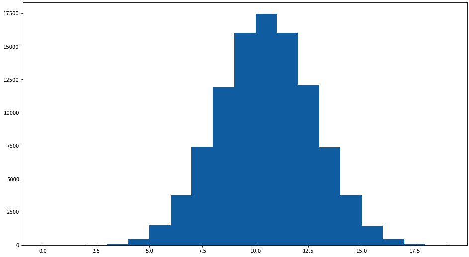
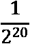
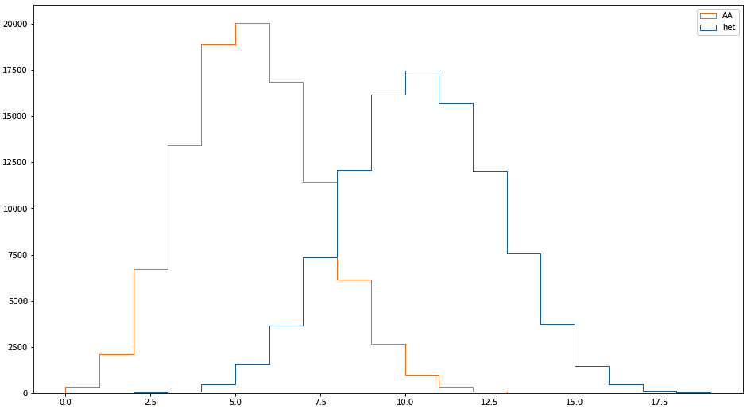
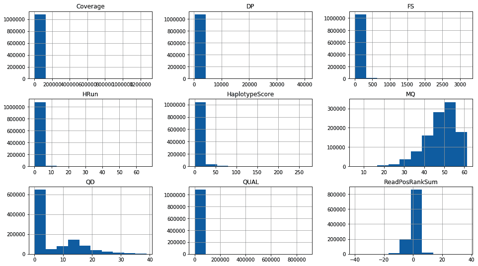
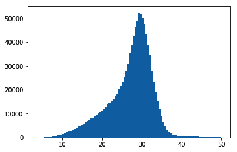
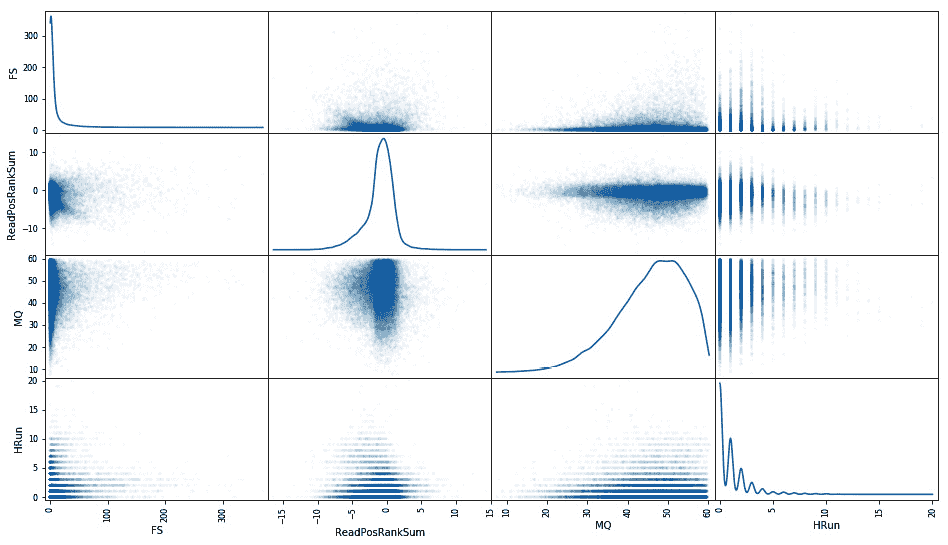
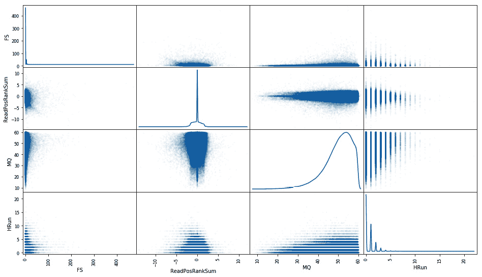
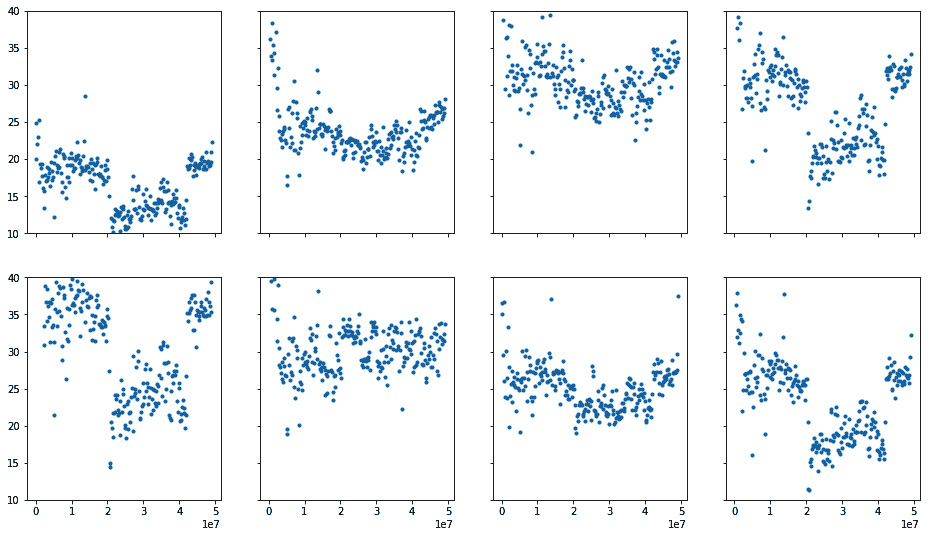
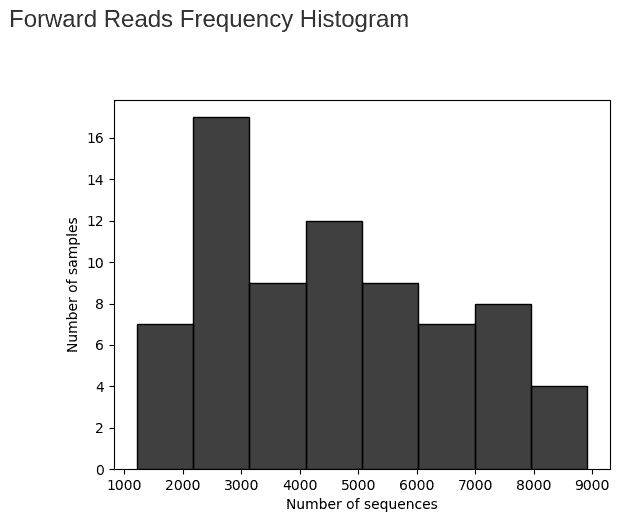

# 第五章：高级 NGS 数据处理

如果您使用**下一代测序**（**NGS**）数据，您会知道质量分析和处理是获取结果中的两个主要时间消耗。在本章的第一部分，我们将通过使用包含亲属信息的数据集来深入探讨 NGS 分析 - 在我们的情况下，是一个母亲、一个父亲和大约 20 个后代的数据集。这是进行质量分析的常见技术，因为家系信息将允许我们推断出我们的过滤规则可能产生的错误数量。我们还将利用同一数据集来查找基于现有注释的基因组特征。

本章的最后一个配方将深入探讨使用 NGS 数据的另一个高级主题：宏基因组学。我们将使用 QIIME2，一个用于宏基因组学的 Python 包，来分析数据。

如果您使用 Docker，请使用 tiagoantao/bioinformatics_base 镜像。有关 QIIME2 内容的特殊设置过程将在相关配方中讨论。

本章包括以下配方：

+   准备用于分析的数据集

+   使用门利因错误信息进行质量控制

+   使用标准统计方法探索数据

+   从测序注释中找到基因组特征

+   使用 QIIME2 进行宏基因组学

# 准备用于分析的数据集

我们的起点将是一个 VCF 文件（或等效文件），其中包含由基因分析工具（在我们的情况下是**基因组分析工具包**（**GATK**））进行的调用，包括注释信息。因为我们将过滤 NGS 数据，我们需要可靠的决策标准来调用一个位点。那么，我们如何获取这些信息？一般来说，我们做不到，但如果我们确实需要这样做，有三种基本方法：

+   使用更强大的测序技术进行比较 - 例如，使用 Sanger 测序验证 NGS 数据集。这种方法成本高昂，只能用于少数基因位点。

+   对于测序密切相关的个体，例如两个父母及其后代。在这种情况下，我们使用门利因遗传规则来决定某个调用是否可接受。这是人类基因组计划和安非蚊 1000 基因组计划均采用的策略。

+   最后，我们可以使用模拟。这种设置不仅相当复杂，而且可靠性存疑。这更多是一个理论选项。

在本章中，我们将使用第二个选项，基于安非蚊 1000 基因组计划。该项目提供了基于蚊子杂交的信息。一个杂交会包括父母（母亲和父亲）以及最多 20 个后代。

在这个配方中，我们将准备我们的数据，以便在后续配方中使用。

## 准备就绪

我们将以 HDF5 格式下载文件以加快处理速度。请注意，这些文件相当大；您需要良好的网络连接和充足的磁盘空间：

```py
wget -c ftp://ngs.sanger.ac.uk/production/ag1000g/phase1/AR3/variation/main/hdf5/ag1000g.phase1.ar3.pass.3L.h5
wget -c ftp://ngs.sanger.ac.uk/production/ag1000g/phase1/AR3/variation/main/hdf5/ag1000g.phase1.ar3.pass.2L.h5
```

这些文件有四个交叉，每个交叉大约有 20 个后代。我们将使用染色体臂 3L 和 2L。在这一阶段，我们也计算孟德尔误差（这是下一个食谱的主题，因此我们将在那时详细讨论）。

相关的笔记本文件是`Chapter04/Preparation.py`。目录中还有一个名为`samples.tsv`的本地样本元数据文件。

## 如何操作……

下载数据后，按照以下步骤操作：

1.  首先，从一些导入开始：

    ```py
    import pickle
    import gzip
    import random
    import numpy as np
    import h5py
    import pandas as pd
    ```

1.  让我们获取样本元数据：

    ```py
    samples = pd.read_csv('samples.tsv', sep='\t')
    print(len(samples))
    print(samples['cross'].unique())
    print(samples[samples['cross'] == 'cross-29-2'][['id', 'function']])
    print(len(samples[samples['cross'] == 'cross-29-2']))
    print(samples[samples['function'] == 'parent'])
    ```

我们还打印一些关于我们将要使用的交叉和所有父母的基本信息。

1.  我们准备根据其 HDF5 文件处理染色体臂 3L：

    ```py
    h5_3L = h5py.File('ag1000g.crosses.phase1.ar3sites.3L.h5', 'r')
    samples_hdf5 = list(map(lambda sample: sample.decode('utf-8'), h5_3L['/3L/samples']))
    calldata_genotype = h5_3L['/3L/calldata/genotype']
    MQ0 = h5_3L['/3L/variants/MQ0']
    MQ = h5_3L['/3L/variants/MQ']
    QD = h5_3L['/3L/variants/QD']
    Coverage = h5_3L['/3L/variants/Coverage']
    CoverageMQ0 = h5_3L['/3L/variants/CoverageMQ0']
    HaplotypeScore = h5_3L['/3L/variants/HaplotypeScore']
    QUAL = h5_3L['/3L/variants/QUAL']
    FS = h5_3L['/3L/variants/FS']
    DP = h5_3L['/3L/variants/DP']
    HRun = h5_3L['/3L/variants/HRun']
    ReadPosRankSum = h5_3L['/3L/variants/ReadPosRankSum']
    my_features = {
        'MQ': MQ,
        'QD': QD,
        'Coverage': Coverage,
        'HaplotypeScore': HaplotypeScore,
        'QUAL': QUAL,
        'FS': FS,
        'DP': DP,
        'HRun': HRun,
        'ReadPosRankSum': ReadPosRankSum
    }
    num_features = len(my_features)
    num_alleles = h5_3L['/3L/variants/num_alleles']
    is_snp = h5_3L['/3L/variants/is_snp']
    POS = h5_3L['/3L/variants/POS']
    ```

1.  计算孟德尔误差的代码如下：

    ```py
    #compute mendelian errors (biallelic)
    def compute_mendelian_errors(mother, father, offspring):
        num_errors = 0
        num_ofs_problems = 0
        if len(mother.union(father)) == 1:
            # Mother and father are homogenous and the            same for ofs in offspring:
                if len(ofs) == 2:
                    # Offspring is het
                    num_errors += 1
                    num_ofs_problems += 1
                elif len(ofs.intersection(mother)) == 0:
                    # Offspring is homo, but opposite from parents
                    num_errors += 2
                    num_ofs_problems += 1
        elif len(mother) == 1 and len(father) == 1:
            # Mother and father are homo and different
            for ofs in offspring:
                if len(ofs) == 1:
                    # Homo, should be het
                    num_errors += 1
                    num_ofs_problems += 1
        elif len(mother) == 2 and len(father) == 2:
            # Both are het, individual offspring can be anything
            pass
        else:
            # One is het, the other is homo
            homo = mother if len(mother) == 1 else father
            for ofs in offspring:
                if len(ofs) == 1 and ofs.intersection(homo):
                    # homo, but not including the allele from parent that is homo
                    num_errors += 1
                    num_ofs_problems += 1
        return num_errors, num_ofs_problems
    ```

我们将在下一个食谱中讨论这个问题，*使用孟德尔误差信息进行质量控制*。

1.  现在，我们定义一个支持生成器和函数，用于选择可接受的位置并累积基本数据：

    ```py
    def acceptable_position_to_genotype():
        for i, genotype in enumerate(calldata_genotype):
            if is_snp[i] and num_alleles[i] == 2:
                if len(np.where(genotype == -1)[0]) > 1:
                    # Missing data
                    continue
                yield i
    def acumulate(fun):
        acumulator = {}
        for res in fun():
            if res is not None:
                acumulator[res[0]] = res[1]
        return acumulator
    ```

1.  现在，我们需要找到在 HDF5 文件中交叉的索引（母亲、父亲和 20 个后代）：

    ```py
    def get_family_indexes(samples_hdf5, cross_pd):
        offspring = []
        for i, individual in cross_pd.T.iteritems():
            index = samples_hdf5.index(individual.id)
            if individual.function == 'parent':
                if individual.sex == 'M':
                    father = index
                else:
                    mother = index
            else:
                offspring.append(index)
        return {'mother': mother, 'father': father, 'offspring': offspring}
    cross_pd = samples[samples['cross'] == 'cross-29-2']
    family_indexes = get_family_indexes(samples_hdf5, cross_pd)
    ```

1.  最后，我们将实际计算孟德尔误差并将其保存到磁盘：

    ```py
    mother_index = family_indexes['mother']
    father_index = family_indexes['father']
    offspring_indexes = family_indexes['offspring']
    all_errors = {}
    def get_mendelian_errors():
        for i in acceptable_position_to_genotype():
            genotype = calldata_genotype[i]
            mother = set(genotype[mother_index])
            father = set(genotype[father_index])
            offspring = [set(genotype[ofs_index]) for ofs_index in offspring_indexes]
            my_mendelian_errors = compute_mendelian_errors(mother, father, offspring)
            yield POS[i], my_mendelian_errors
    mendelian_errors = acumulate(get_mendelian_errors)
    pickle.dump(mendelian_errors, gzip.open('mendelian_errors.pickle.gz', 'wb'))
    ```

1.  我们现在将生成一个高效的带注释和孟德尔误差信息的 NumPy 数组：

    ```py
    ordered_positions = sorted(mendelian_errors.keys())
    ordered_features = sorted(my_features.keys())
    num_features = len(ordered_features)
    feature_fit = np.empty((len(ordered_positions), len(my_features) + 2), dtype=float)
    for column, feature in enumerate(ordered_features):  # 'Strange' order
        print(feature)
        current_hdf_row = 0
        for row, genomic_position in enumerate(ordered_positions):
            while POS[current_hdf_row] < genomic_position:
                current_hdf_row +=1
            feature_fit[row, column] = my_features[feature][current_hdf_row]
    for row, genomic_position in enumerate(ordered_positions):
        feature_fit[row, num_features] = genomic_position
        feature_fit[row, num_features + 1] = 1 if mendelian_errors[genomic_position][0] > 0 else 0
    np.save(gzip.open('feature_fit.npy.gz', 'wb'), feature_fit, allow_pickle=False, fix_imports=False)
    pickle.dump(ordered_features, open('ordered_features', 'wb'))
    ```

在这段代码中埋藏着整个章节中最重要的决定之一：我们如何权衡孟德尔误差？在我们的案例中，如果有任何误差，我们只存储 1，如果没有误差，我们存储 0。另一种选择是计数错误的数量——因为我们有最多 20 个后代，这将需要一些复杂的统计分析，而我们这里不进行这种分析。

1.  转换思路，现在让我们从染色体臂 2L 提取一些信息：

    ```py
    h5_2L = h5py.File('ag1000g.crosses.phase1.ar3sites.2L.h5', 'r')
    samples_hdf5 = list(map(lambda sample: sample.decode('utf-8'), h5_2L['/2L/samples']))
    calldata_DP = h5_2L['/2L/calldata/DP']
    POS = h5_2L['/2L/variants/POS']
    ```

1.  在这里，我们只关心父母：

    ```py
    def get_parent_indexes(samples_hdf5, parents_pd):
        parents = []
        for i, individual in parents_pd.T.iteritems():
            index = samples_hdf5.index(individual.id)
            parents.append(index)
        return parents
    parents_pd = samples[samples['function'] == 'parent']
    parent_indexes = get_parent_indexes(samples_hdf5, parents_pd)
    ```

1.  我们提取每个父母的样本 DP：

    ```py
    all_dps = []
    for i, pos in enumerate(POS):
        if random.random() > 0.01:
            continue
        pos_dp = calldata_DP[i]
        parent_pos_dp = [pos_dp[parent_index] for parent_index in parent_indexes]
        all_dps.append(parent_pos_dp + [pos])
    all_dps = np.array(all_dps)
    np.save(gzip.open('DP_2L.npy.gz', 'wb'), all_dps, allow_pickle=False, fix_imports=False)
    ```

现在，我们已经为本章的分析准备好了数据集。

# 使用孟德尔误差信息进行质量控制

那么，如何使用孟德尔遗传规则推断调用质量呢？让我们看看父母不同基因型配置的预期结果：

+   对于某个潜在的双等位基因 SNP，如果母亲是 AA 且父亲也是 AA，则所有后代将是 AA。

+   如果母亲是 AA，父亲是 TT，则所有后代必须是杂合子（AT）。他们总是从母亲那里得到一个 A，总是从父亲那里得到一个 T。

+   如果母亲是 AA，父亲是 AT，则后代可以是 AA 或 AT。他们总是从母亲那里得到一个 A，但可以从父亲那里得到一个 A 或一个 T。

+   如果母亲和父亲都是杂合子（AT），则后代可以是任何基因型。从理论上讲，在这种情况下我们无法做太多。

实际上，我们可以忽略突变，这是在大多数真核生物中都可以安全做到的。从我们的角度来看，突变（噪声）的数量比我们正在寻找的信号低几个数量级。

在这个例子中，我们将进行一个小的理论研究，分析分布和孟德尔错误，并进一步处理数据以便下游分析。这相关的笔记本文件是 `Chapter04/Mendel.py`。

## 如何做…

1.  我们需要几个导入：

    ```py
    import random
    import matplotlib.pyplot as plt
    ```

1.  在进行任何经验分析之前，让我们尝试理解在母亲是 AA 且父亲是 AT 的情况下我们可以提取什么信息。我们来回答这个问题，*如果我们有 20 个后代，所有后代为杂合子的概率是多少？*：

    ```py
    num_sims = 100000
    num_ofs = 20
    num_hets_AA_AT = []
    for sim in range(num_sims):
        sim_hets = 0
        for ofs in range(20):
            sim_hets += 1 if random.choice([0, 1]) == 1 else 0
        num_hets_AA_AT.append(sim_hets)

    fig, ax = plt.subplots(1,1, figsize=(16,9))
    ax.hist(num_hets_AA_AT, bins=range(20))
    print(len([num_hets for num_hets in num_hets_AA_AT if num_hets==20]))
    ```

我们得到以下输出：



图 4.1 - 来自 100,000 次模拟的结果：在母亲是 AA 且父亲是杂合子的情况下，后代在某些基因座上为杂合子的数量

在这里，我们进行了 100,000 次模拟。就我而言（这是随机的，所以你的结果可能不同），我得到了零次模拟结果，其中所有的后代都是杂合子的。事实上，这些是带重复的排列，因此所有都是杂合子的概率是  或 9.5367431640625e-07——并不太可能。所以，即使对于单个后代，我们可能得到 AT 或 AA，对于 20 个后代来说，它们全部都是同一种类型的概率也非常小。这就是我们可以用来更深入解释孟德尔错误的信息。

1.  让我们重复一下母亲和父亲都为 AT 的分析：

    ```py
    num_AAs_AT_AT = []
    num_hets_AT_AT = []
    for sim in range(num_sims):
        sim_AAs = 0
        sim_hets = 0
        for ofs in range(20):
            derived_cnt = sum(random.choices([0, 1], k=2))
            sim_AAs += 1 if derived_cnt == 0 else 0
            sim_hets += 1 if derived_cnt == 1 else 0
        num_AAs_AT_AT.append(sim_AAs)
        num_hets_AT_AT.append(sim_hets)
    fig, ax = plt.subplots(1,1, figsize=(16,9))
    ax.hist([num_hets_AT_AT, num_AAs_AT_AT], histtype='step', fill=False, bins=range(20), label=['het', 'AA'])
    plt.legend()
    ```

输出如下：



图 4.2 - 来自 100,000 次模拟的结果：在母亲和父亲都是杂合子的情况下，后代在某个基因座上为 AA 或杂合子的数量

在这种情况下，我们也有带重复的排列，但我们有四个可能的值，而不是两个：AA、AT、TA 和 TT。结果是所有个体为 AT 的概率相同：9.5367431640625e-07。对于所有个体都是同型合子的情况（所有为 TT 或者所有为 AA），情况更糟（实际上是两倍糟糕）。

1.  好的，在这个概率性的序言之后，让我们开始更多数据处理的工作。我们首先要做的是检查我们有多少个错误。让我们从前一个例子中加载数据：

    ```py
    import gzip
    import pickle
    import random
    import numpy as np
    mendelian_errors = pickle.load(gzip.open('mendelian_errors.pickle.gz', 'rb'))
    feature_fit = np.load(gzip.open('feature_fit.npy.gz', 'rb'))
    ordered_features = np.load(open('ordered_features', 'rb'))
    num_features = len(ordered_features)
    ```

1.  让我们看看我们有多少个错误：

    ```py
    print(len(mendelian_errors), len(list(filter(lambda x: x[0] > 0,mendelian_errors.values()))))
    ```

输出如下：

```py
(10905732, 541688)
```

并不是所有的调用都有孟德尔错误——只有大约 5%，很好。

1.  让我们创建一个平衡集，其中大约一半的集合有错误。为此，我们将随机丢弃大量正常调用。首先，我们计算错误的比例：

    ```py
    total_observations = len(mendelian_errors)
    error_observations = len(list(filter(lambda x: x[0] > 0,mendelian_errors.values())))
    ok_observations = total_observations - error_observations
    fraction_errors = error_observations/total_observations
    print (total_observations, ok_observations, error_observations, 100*fraction_errors)
    del mendelian_errors
    ```

1.  我们使用这些信息来获取一组被接受的条目：所有错误和一个大致相等数量的正常调用。我们在最后打印条目数量（这将随着 OK 列表的随机性而变化）：

    ```py
    prob_ok_choice = error_observations / ok_observations
    def accept_entry(row):
        if row[-1] == 1:
            return True
        return random.random() <= prob_ok_choice
    accept_entry_v = np.vectorize(accept_entry, signature='(i)->()')
    accepted_entries = accept_entry_v(feature_fit)
    balanced_fit = feature_fit[accepted_entries]
    del feature_fit
    balanced_fit.shape
    len([x for x in balanced_fit if x[-1] == 1]), len([x for x in balanced_fit if x[-1] == 0])
    ```

1.  最后，我们保存它：

    ```py
    np.save(gzip.open('balanced_fit.npy.gz', 'wb'), balanced_fit, allow_pickle=False, fix_imports=False)
    ```

## 还有更多……

关于孟德尔错误及其对成本函数的影响，让我们思考以下情况：母亲是 AA，父亲是 AT，所有后代都是 AA。这是否意味着父亲的基因型判断错误，或者我们未能检测到一些杂合的后代？从这个推理来看，可能是父亲的基因型判断错误。这在一些更精细的孟德尔错误估计函数中有影响：让几个后代错误比仅仅一个样本（父亲）错误可能更有成本。在这种情况下，你可能会认为这很简单（没有杂合子后代的概率很低，所以可能是父亲的错误），但如果有 18 个后代是 AA，2 个是 AT，那是否还能算“简单”呢？这不仅仅是一个理论问题，因为它会严重影响成本函数的设计。

我们在之前的食谱中的函数，*为分析准备数据集*，虽然很简单，但足够满足我们进一步获得有趣结果所需的精度。

# 使用标准统计方法探索数据

现在我们有了孟德尔错误分析的见解，让我们探索数据，以便获得更多可能帮助我们更好地过滤数据的见解。你可以在`Chapter04/Exploration.py`中找到此内容。

## 如何做到……

1.  我们像往常一样，先导入必要的库：

    ```py
    import gzip
    import pickle
    import random
    import numpy as np
    import matplotlib.pyplot as plt
    import pandas as pd
    from pandas.plotting import scatter_matrix
    ```

1.  然后我们加载数据。我们将使用 pandas 来导航：

    ```py
    fit = np.load(gzip.open('balanced_fit.npy.gz', 'rb'))
    ordered_features = np.load(open('ordered_features', 'rb'))
    num_features = len(ordered_features)
    fit_df = pd.DataFrame(fit, columns=ordered_features + ['pos', 'error'])
    num_samples = 80
    del fit
    ```

1.  让我们让 pandas 显示所有注释的直方图：

    ```py
    fig,ax = plt.subplots(figsize=(16,9))
    fit_df.hist(column=ordered_features, ax=ax)
    ```

生成的直方图如下：



图 4.3 - 数据集中所有注释的直方图，错误约占 50%

1.  对于某些注释，我们没有得到有趣的信息。我们可以尝试放大，举个例子，使用 DP：

    ```py
    fit_df['MeanDP'] = fit_df['DP'] / 80
    fig, ax = plt.subplots()
    _ = ax.hist(fit_df[fit_df['MeanDP']<50]['MeanDP'], bins=100)
    ```



图 4.4 - 放大显示 DP 相关兴趣区域的直方图

实际上，我们将 DP 除以样本数，以便得到一个更有意义的数字。

1.  我们将把数据集分为两部分，一部分用于错误，另一部分用于没有孟德尔错误的位置：

    ```py
    errors_df = fit_df[fit_df['error'] == 1]
    ok_df = fit_df[fit_df['error'] == 0]
    ```

1.  让我们看一下 `QUAL` 并以 0.005 为分割点，检查我们如何得到错误和正确调用的分割：

    ```py
    ok_qual_above_df = ok_df[ok_df['QUAL']>0.005]
    errors_qual_above_df = errors_df[errors_df['QUAL']>0.005]
    print(ok_df.size, errors_df.size, ok_qual_above_df.size, errors_qual_above_df.size)
    print(ok_qual_above_df.size / ok_df.size, errors_qual_above_df.size / errors_df.size)
    ```

结果如下：

```py
6507972 6500256 484932 6114096
0.07451353509203788 0.9405931089483245
```

显然，`['QUAL']>0.005`产生了很多错误，而没有产生很多正确的位置。这是积极的，因为我们有一些希望通过过滤来处理这些错误。

1.  对 QD 做同样的处理：

    ```py
    ok_qd_above_df = ok_df[ok_df['QD']>0.05]
    errors_qd_above_df = errors_df[errors_df['QD']>0.05]
    print(ok_df.size, errors_df.size, ok_qd_above_df.size, errors_qd_above_df.size)
    print(ok_qd_above_df.size / ok_df.size, errors_qd_above_df.size / errors_df.size)
    ```

再次，我们得到了有趣的结果：

```py
6507972 6500256 460296 5760288
0.07072802402960554 0.8861632526472804
```

1.  让我们选择一个错误较少的区域，研究注释之间的关系。我们将成对绘制注释：

    ```py
    not_bad_area_errors_df = errors_df[(errors_df['QUAL']<0.005)&(errors_df['QD']<0.05)]
    _ = scatter_matrix(not_bad_area_errors_df[['FS', 'ReadPosRankSum', 'MQ', 'HRun']], diagonal='kde', figsize=(16, 9), alpha=0.02)
    ```

前面的代码生成了以下输出：



图 4.5 - 搜索空间区域的错误注释散点矩阵

1.  现在对正确的调用做相同的处理：

    ```py
    not_bad_area_ok_df = ok_df[(ok_df['QUAL']<0.005)&(ok_df['QD']<0.05)]
    _ = scatter_matrix(not_bad_area_ok_df[['FS', 'ReadPosRankSum', 'MQ', 'HRun']], diagonal='kde', figsize=(16, 9), alpha=0.02)
    ```

输出结果如下：



图 4.6 - 搜索空间区域内良好标记的注释散点矩阵

1.  最后，让我们看看我们的规则在完整数据集上的表现（记住，我们使用的数据集大约由 50%的错误和 50%的正确标记组成）：

    ```py
    all_fit_df = pd.DataFrame(np.load(gzip.open('feature_fit.npy.gz', 'rb')), columns=ordered_features + ['pos', 'error'])
    potentially_good_corner_df = all_fit_df[(all_fit_df['QUAL']<0.005)&(all_fit_df['QD']<0.05)]
    all_errors_df=all_fit_df[all_fit_df['error'] == 1]
    print(len(all_fit_df), len(all_errors_df), len(all_errors_df) / len(all_fit_df))
    ```

我们得到如下结果：

```py
10905732 541688 0.04967002673456491
```

让我们记住，我们的完整数据集中大约有 1090 万个标记，误差大约为 5%。

1.  让我们获取一些关于我们`good_corner`的统计数据：

    ```py
    potentially_good_corner_errors_df = potentially_good_corner_df[potentially_good_corner_df['error'] == 1]
    print(len(potentially_good_corner_df), len(potentially_good_corner_errors_df), len(potentially_good_corner_errors_df) / len(potentially_good_corner_df))
    print(len(potentially_good_corner_df)/len(all_fit_df))
    ```

输出结果如下：

```py
9625754 32180 0.0033431147315836243
0.8826325458942141
```

所以，我们将误差率从 5%降低到了 0.33%，同时标记数量仅减少到了 960 万个。

## 还有更多……

从 5%的误差减少到 0.3%，同时失去 12%的标记，这样的变化是好还是坏呢？嗯，这取决于你接下来想要做什么样的分析。也许你的方法能抵御标记丢失，但不太容忍错误，如果是这种情况，这样的变化可能会有帮助。但如果情况相反，也许即使数据集错误更多，你也更倾向于保留完整的数据集。如果你使用不同的方法，可能会根据方法的不同而使用不同的数据集。在这个疟蚊数据集的具体案例中，数据量非常大，因此减少数据集大小对几乎所有情况都没有问题。但如果标记数量较少，你需要根据标记和质量来评估你的需求。

# 从测序注释中寻找基因组特征

我们将以一个简单的步骤总结这一章及本书内容，表明有时你可以从简单的、意外的结果中学到重要的东西，而表面上的质量问题可能掩盖了重要的生物学问题。

我们将绘制读取深度——`DP`——在染色体臂 2L 上所有交叉父本的分布情况。此步骤的代码可以在 `Chapter04/2L.py` 中找到。

## 如何做……

我们将从以下步骤开始：

1.  让我们从常规导入开始：

    ```py
    from collections import defaultdict
    import gzip
    import numpy as np
    import matplotlib.pylab as plt
    ```

1.  让我们加载在第一步中保存的数据：

    ```py
    num_parents = 8
    dp_2L = np.load(gzip.open('DP_2L.npy.gz', 'rb'))
    print(dp_2L.shape)
    ```

1.  现在让我们打印整个染色体臂的中位 DP，以及其中部的一部分数据，针对所有父本：

    ```py
    for i in range(num_parents):
        print(np.median(dp_2L[:,i]), np.median(dp_2L[50000:150000,i]))
    ```

输出结果如下：

```py
17.0 14.0
23.0 22.0
31.0 29.0
28.0 24.0
32.0 27.0
31.0 31.0
25.0 24.0
24.0 20.0
```

有趣的是，整个染色体的中位数有时并不适用于中间的那个大区域，所以我们需要进一步挖掘。

1.  我们将打印染色体臂上 200,000 kb 窗口的中位 DP。让我们从窗口代码开始：

    ```py
    window_size = 200000
    parent_DP_windows = [defaultdict(list) for i in range(num_parents)]
    def insert_in_window(row):
        for parent in range(num_parents):
            parent_DP_windows[parent][row[-1] // window_size].append(row[parent])
    insert_in_window_v = np.vectorize(insert_in_window, signature='(n)->()')
    _ = insert_in_window_v(dp_2L)
    ```

1.  让我们绘制它：

    ```py
    fig, axs = plt.subplots(2, num_parents // 2, figsize=(16, 9), sharex=True, sharey=True, squeeze=True)
    for parent in range(num_parents):
        ax = axs[parent // 4][parent % 4]
        parent_data = parent_DP_windows[parent]
        ax.set_ylim(10, 40)
        ax.plot(*zip(*[(win*window_size, np.mean(lst)) for win, lst in parent_data.items()]), '.')
    ```

1.  以下是绘制的结果：



图 4.7 - 所有父本数据集在染色体臂 2L 上每个窗口的中位 DP

你会注意到，在某些蚊子样本中，例如第一列和最后一列，染色体臂中间有明显的 DP 下降。在某些样本中，比如第三列的样本，下降程度较轻——不那么明显。对于第二列的底部父本样本，根本没有下降。

## 还有更多……

前述模式有一个生物学原因，最终对测序产生影响：按蚊可能在 2L 臂中间有一个大的染色体倒位。与用于做调用的参考基因组不同的核型，由于进化分化，较难进行调用。这导致该区域的测序读取数量较少。这在这种物种中特别明显，但你可能会期望在其他生物中也出现类似特征。

一个更广为人知的案例是 `n`，此时你可以预期在整个基因组中看到 `n` 倍于中位数的 DP。

但在一般情况下，保持警惕并留意分析中的 *异常* 结果是个好主意。有时候，这正是一个有趣生物学特征的标志，就像这里一样。要么这就是指向一个错误的信号：例如，**主成分分析**（**PCA**）可以用来发现标签错误的样本（因为它们可能会聚集在错误的组中）。

# 使用 QIIME 2 Python API 进行宏基因组学分析

Wikipedia 表示，宏基因组学是直接从环境样本中回收遗传物质的研究。注意，这里的“环境”应广泛理解：在我们的例子中，我们将处理肠道微生物组，研究的是儿童肠道问题中的粪便微生物组移植。该研究是 QIIME 2 的其中一个教程，QIIME 2 是最广泛使用的宏基因组数据分析应用之一。QIIME 2 有多个接口：图形用户界面（GUI）、命令行界面和一个称为 Artifact API 的 Python API。

Tomasz Kościółek 提供了一个出色的 Artifact API 使用教程，基于 QIIME 2 最成熟的（客户端基础的，而非基于 Artifact 的）教程，即 *“Moving Pictures”* 教程（[`nbviewer.jupyter.org/gist/tkosciol/29de5198a4be81559a075756c2490fde`](http://nbviewer.jupyter.org/gist/tkosciol/29de5198a4be81559a075756c2490fde)）。在这里，我们将创建一个 Python 版本的粪便微生物群移植研究，正如客户端接口一样，详细内容可参见 [`docs.qiime2.org/2022.2/tutorials/fmt/`](https://docs.qiime2.org/2022.2/tutorials/fmt/)。你应该熟悉它，因为我们不会在这里深入探讨生物学的细节。我走的路线比 Tomasz 更为复杂：这将帮助你更好地了解 QIIME 2 Python 的内部结构。获得这些经验后，你可能更倾向于按照 Tomasz 的路线，而非我的路线。然而，你在这里获得的经验将使你在使用 QIIME 的内部功能时更加舒适和自信。

## 准备开始

这个设置稍微复杂一些。我们将需要创建一个 `conda` 环境，将 QIIME 2 的软件包与其他应用程序的软件包分开。你需要遵循的步骤很简单。

在 OS X 上，使用以下代码创建一个新的 `conda` 环境：

```py
wget wget https://data.qiime2.org/distro/core/qiime2-2022.2-py38-osx-conda.yml
conda env create -n qiime2-2022.2 --file qiime2-2022.2-py38-osx-conda.yml
```

在 Linux 上，使用以下代码创建环境：

```py
wget wget https://data.qiime2.org/distro/core/qiime2-2022.2-py38-linux-conda.yml
conda env create -n qiime2-2022.2 --file qiime2-2022.2-py38-linux-conda.yml
```

如果这些指令不起作用，请查看 QIIME 2 网站上的更新版本（[`docs.qiime2.org/2022.2/install/native`](https://docs.qiime2.org/2022.2/install/native)）。QIIME 2 会定期更新。

在这个阶段，你需要通过使用`source activate qiime2-2022.2`进入 QIIME 2 的`conda`环境。如果你想回到标准的`conda`环境，可以使用`source deactivate`。我们将安装`jupyter lab`和`jupytext`：

```py
conda install jupyterlab jupytext
```

你可能想要在 QIIME 2 的环境中使用`conda install`安装其他你想要的包。

为了准备 Jupyter 执行，你应该安装 QIIME 2 扩展，方法如下：

```py
jupyter serverextension enable --py qiime2 --sys-prefix
```

提示

该扩展具有高度交互性，允许你从不同的视角查看数据，这些视角在本书中无法捕捉。缺点是它不能在`nbviewer`中工作（某些单元格的输出在静态查看器中无法显示）。记得与扩展中的输出进行交互，因为许多输出是动态的。

你现在可以启动 Jupyter。Notebook 可以在`Chapter4/QIIME2_Metagenomics.py`文件中找到。

警告

由于 QIIME 的包安装具有流动性，我们没有为其提供 Docker 环境。这意味着如果你是通过我们的 Docker 安装工作，你将需要下载食谱并手动安装这些包。

你可以找到获取 Notebook 文件和 QIIME 2 教程数据的说明。

## 如何操作...

让我们看一下接下来的步骤：

1.  让我们首先检查一下有哪些插件可用：

    ```py
    import pandas as pd
    from qiime2.metadata.metadata import Metadata
    from qiime2.metadata.metadata import CategoricalMetadataColumn
    from qiime2.sdk import Artifact
    from qiime2.sdk import PluginManager
    from qiime2.sdk import Result
    pm = PluginManager()
    demux_plugin = pm.plugins['demux']
    #demux_emp_single = demux_plugin.actions['emp_single']
    demux_summarize = demux_plugin.actions['summarize']
    print(pm.plugins)
    ```

我们还在访问解混插件及其摘要操作。

1.  让我们来看看摘要操作，即`inputs`、`outputs`和`parameters`：

    ```py
    print(demux_summarize.description)
    demux_summarize_signature = demux_summarize.signature
    print(demux_summarize_signature.inputs)
    print(demux_summarize_signature.parameters)
    print(demux_summarize_signature.outputs)
    ```

输出将如下所示：

```py
Summarize counts per sample for all samples, and generate interactive positional quality plots based on `n` randomly selected sequences.
 OrderedDict([('data', ParameterSpec(qiime_type=SampleData[JoinedSequencesWithQuality | PairedEndSequencesWithQuality | SequencesWithQuality], view_type=<class 'q2_demux._summarize._visualizer._PlotQualView'>, default=NOVALUE, description='The demultiplexed sequences to be summarized.'))])
 OrderedDict([('n', ParameterSpec(qiime_type=Int, view_type=<class 'int'>, default=10000, description='The number of sequences that should be selected at random for quality score plots. The quality plots will present the average positional qualities across all of the sequences selected. If input sequences are paired end, plots will be generated for both forward and reverse reads for the same `n` sequences.'))])
 OrderedDict([('visualization', ParameterSpec(qiime_type=Visualization, view_type=None, default=NOVALUE, description=NOVALUE))])
```

1.  现在，我们将加载第一个数据集，对其进行解混，并可视化一些解混统计数据：

    ```py
    seqs1 = Result.load('fmt-tutorial-demux-1-10p.qza')
    sum_data1 = demux_summarize(seqs1)
    sum_data1.visualization
    ```

这是来自 QIIME 扩展为 Jupyter 提供的输出的一部分：



图 4.8 - QIIME 2 扩展为 Jupyter 提供的输出部分

记住，扩展是迭代的，并且提供的信息比仅仅这张图表多得多。

提示

本食谱的原始数据是以 QIIME 2 格式提供的。显然，你将拥有自己原始数据的其他格式（可能是 FASTQ 格式）—请参见*还有更多...*部分，了解如何加载标准格式。

QIIME 2 的`.qza`和`.qzv`格式只是压缩文件。你可以通过`unzip`查看其内容。

图表将类似于 QIIME CLI 教程中的图表，但务必检查我们输出的交互质量图。

1.  让我们对第二个数据集做相同的操作：

    ```py
    seqs2 = Result.load('fmt-tutorial-demux-2-10p.qza')
    sum_data2 = demux_summarize(seqs2)
    sum_data2.visualization
    ```

1.  让我们使用 DADA2（[`github.com/benjjneb/dada2`](https://github.com/benjjneb/dada2)）插件进行质量控制：

    ```py
    dada2_plugin = pm.plugins['dada2']
    dada2_denoise_single = dada2_plugin.actions['denoise_single']
    qual_control1 = dada2_denoise_single(demultiplexed_seqs=seqs1,
                                        trunc_len=150, trim_left=13)
    qual_control2 = dada2_denoise_single(demultiplexed_seqs=seqs2,
                                        trunc_len=150, trim_left=13)
    ```

1.  让我们从去噪（第一组）中提取一些统计数据：

    ```py
    metadata_plugin = pm.plugins['metadata']
    metadata_tabulate = metadata_plugin.actions['tabulate']
    stats_meta1 = metadata_tabulate(input=qual_control1.denoising_stats.view(Metadata))
    stats_meta1.visualization
    ```

同样，结果可以在 QIIME 2 命令行版本的教程中找到。

1.  现在，让我们对第二组数据做相同的操作：

    ```py
    stats_meta2 = metadata_tabulate(input=qual_control2.denoising_stats.view(Metadata))
    stats_meta2.visualization
    ```

1.  现在，合并去噪后的数据：

    ```py
    ft_plugin = pm.plugins['feature-table']
    ft_merge = ft_plugin.actions['merge']
    ft_merge_seqs = ft_plugin.actions['merge_seqs']
    ft_summarize = ft_plugin.actions['summarize']
    ft_tab_seqs = ft_plugin.actions['tabulate_seqs']
    table_merge = ft_merge(tables=[qual_control1.table, qual_control2.table])
    seqs_merge = ft_merge_seqs(data=[qual_control1.representative_sequences, qual_control2.representative_sequences])
    ```

1.  然后，从合并结果中收集一些质量统计数据：

    ```py
    ft_sum = ft_summarize(table=table_merge.merged_table)
    ft_sum.visualization
    ```

1.  最后，让我们获取一些关于合并序列的信息：

    ```py
    tab_seqs = ft_tab_seqs(data=seqs_merge.merged_data)
    tab_seqs.visualization
    ```

## 还有更多内容...

上面的代码没有展示如何导入数据。实际代码会根据情况有所不同（单端数据、双端数据，或已经解多重条形码的数据），但对于主要的 QIIME 2 教程《*移动图像*》，假设你已经将单端、未解多重条形码的数据和条形码下载到名为`data`的目录中，你可以执行以下操作：

```py
data_type = 'EMPSingleEndSequences'
conv = Artifact.import_data(data_type, 'data')
conv.save('out.qza')
```

如上面的代码所述，如果你在 GitHub 上查看这个笔记本，静态的`nbviewer`系统将无法正确渲染笔记本（你需要自己运行它）。这远非完美；它不具备交互性，质量也不是很好，但至少它能让你在不运行代码的情况下大致了解输出结果。
