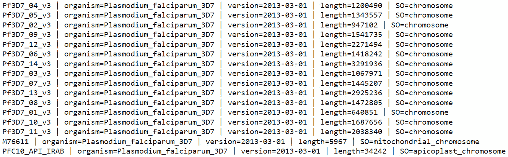
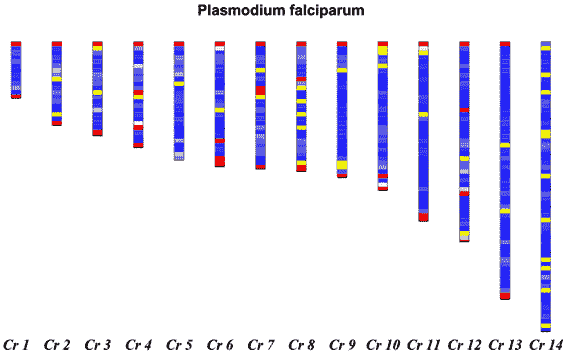
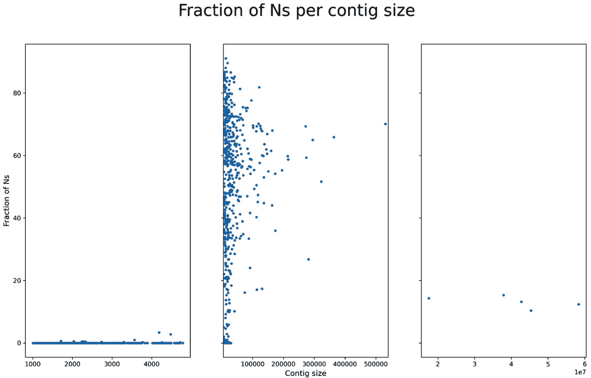
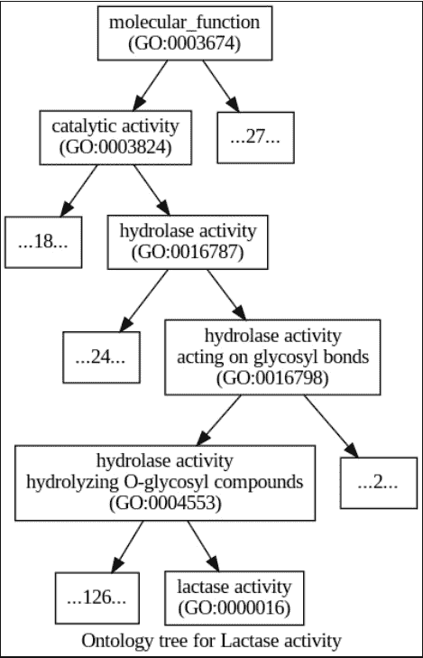

# 第六章：处理基因组

计算生物学中的许多任务依赖于参考基因组的存在。如果你正在进行序列比对、寻找基因或研究种群遗传学，你将直接或间接使用参考基因组。在本章中，我们将开发一些处理参考基因组的技术，解决不同质量的参考基因组问题，这些基因组的质量可能从高质量（在这里，高质量仅指基因组组装的状态，这是本章的重点），如人类基因组，到存在问题的非模式物种基因组。我们还将学习如何处理基因组注释（处理能够指引我们发现基因组中有趣特征的数据库），并使用注释信息提取序列数据。我们还将尝试跨物种寻找基因同源物。最后，我们将访问**基因本体论**（**GO**）数据库。

在本章中，我们将涵盖以下内容：

+   处理高质量参考基因组

+   处理低质量参考基因组

+   遍历基因组注释

+   使用注释从参考基因组中提取基因

+   使用 Ensembl REST API 查找同源基因

+   从 Ensembl 获取基因本体信息

# 技术要求

如果你通过 Docker 运行本章内容，你可以使用`tiagoantao/bioinformatics_genomes`镜像。如果你使用 Anaconda，本章所需的软件将在每个相关部分介绍。

# 处理高质量参考基因组

在本节中，你将学习一些操作参考基因组的通用技术。作为一个示例，我们将研究*恶性疟原虫*的 GC 含量——即基因组中以鸟嘌呤-胞嘧啶为基础的部分，这是导致疟疾的最重要寄生虫物种。参考基因组通常以 FASTA 文件的形式提供。

## 准备工作

生物体基因组的大小差异很大，从像 HIV 这样的病毒（其基因组为 9.7 kbp）到像*大肠杆菌*这样的细菌，再到像*恶性疟原虫*这样的原生动物（其基因组跨越 14 条染色体、线粒体和顶体，大小为 22 Mbp），再到果蝇，具有三对常染色体、线粒体和 X/Y 性染色体，再到人类，其基因组由 22 对常染色体、X/Y 染色体和线粒体组成，总大小为 3 Gbp，一直到*日本巴黎*，一种植物，基因组大小为 150 Gbp。在这个过程中，你会遇到不同的倍性和性染色体组织。

提示

正如你所看到的，不同的生物体有非常不同的基因组大小。这个差异可以达到几个数量级。这对你的编程风格有重大影响。处理一个大型基因组将要求你更加节省内存。不幸的是，更大的基因组将从更高效的编程技术中受益（因为你需要分析的数据更多）；这些是相互矛盾的要求。一般来说，对于较大的基因组，你必须更加小心地处理效率（无论是速度还是内存）。

为了让这个方法不那么繁琐，我们将使用*恶性疟原虫*的一个小型真核基因组。这个基因组仍然具有大基因组的一些典型特征（例如，多个染色体）。因此，它在复杂性和大小之间是一个很好的折衷。请注意，对于像*恶性疟原虫*这样大小的基因组，可以通过将整个基因组加载到内存中来执行许多操作。然而，我们选择了一种可以应用于更大基因组（例如，哺乳动物）的编程风格，这样你可以以更通用的方式使用这个方法，但如果是像这种小型基因组，也可以使用更依赖内存的方式。

我们将使用 Biopython，这是你在*第一章*，*Python 与相关软件生态*中安装的。如往常一样，这个方法可以在本书的 Jupyter 笔记本中找到，路径为`Chapter05/Reference_Genome.py`，在本书的代码包中。我们需要下载参考基因组——你可以在上述笔记本中找到最新的下载地址。为了生成本方法最后的图表，我们还需要`reportlab`：

```py
conda install -c bioconda reportlab
```

现在，我们准备开始。

## 如何操作...

按照以下步骤进行：

1.  我们将首先检查参考基因组 FASTA 文件中所有序列的描述：

    ```py
    from Bio import SeqIO
    genome_name = 'PlasmoDB-9.3_Pfalciparum3D7_Genome.fasta'
    recs = SeqIO.parse(genome_name, 'fasta')
    for rec in recs:
        print(rec.description)
    ```

这段代码应该很熟悉，来自上一章，*第三章*，*下一代测序*。让我们来看一下部分输出：



图 5.1 – 显示*恶性疟原虫*参考基因组的 FASTA 描述的输出

不同的基因组参考将有不同的描述行，但它们通常包含重要信息。在这个示例中，你可以看到我们有染色体、线粒体和顶体。我们还可以查看染色体的大小，但我们将使用序列长度中的值。

1.  让我们解析描述行，以提取染色体编号。我们将从序列中获取染色体大小，并基于窗口计算每个染色体的`GC`含量：

    ```py
    from Bio import SeqUtils
    recs = SeqIO.parse(genome_name, 'fasta')
    chrom_sizes = {}
    chrom_GC = {}
    block_size = 50000
    min_GC = 100.0
    max_GC = 0.0
    for rec in recs:
        if rec.description.find('SO=chromosome') == -1:
            continue
        chrom = int(rec.description.split('_')[1])
        chrom_GC[chrom] = []
        size = len(rec.seq)
        chrom_sizes[chrom] = size
        num_blocks = size // block_size + 1
        for block in range(num_blocks):
            start = block_size * block
            if block == num_blocks - 1:
                end = size
            else:
                end = block_size + start + 1
            block_seq = rec.seq[start:end]
            block_GC = SeqUtils.GC(block_seq)
            if block_GC < min_GC:
                min_GC = block_GC
            if block_GC > max_GC:
                max_GC = block_GC
            chrom_GC[chrom].append(block_GC)
    print(min_GC, max_GC)
    ```

在这里，我们对所有染色体进行了窗口分析，类似于我们在*第三章*中所做的，*下一代测序*。我们从定义一个 50 kbp 的窗口大小开始。这对于*Plasmodium falciparum*来说是合适的（你可以自由调整其大小），但对于那些染色体大小差异数量级较大的基因组，你会想考虑其他的数值。

注意，我们正在重新读取文件。由于基因组如此之小，实际上在*步骤 1*中可以将整个基因组加载到内存中。对于小型基因组来说，尝试这种编程风格是可行的——它更快！然而，我们的代码是为了可以在更大的基因组上复用而设计的。

1.  注意，在`for`循环中，我们通过解析`SO`条目来忽略线粒体和顶体。`chrom_sizes`字典将维护染色体的大小。

`chrom_GC`字典是我们最有趣的数据结构，将包含每个 50 kbp 窗口中`GC`含量的一个分数的列表。所以，染色体 1 的大小为 640,851 bp，它会有 14 个条目，因为该染色体的大小为 14 个 50 kbp 的块。

注意*疟原虫*（*Plasmodium falciparum*）基因组的两个不寻常特征：该基因组非常富含 AT，即 GC 贫乏。因此，你得到的数字会非常低。此外，染色体是按大小排序的（这很常见），但从最小的大小开始。通常的约定是从最大的大小开始（比如在人类基因组中）。

1.  现在，让我们创建一个`GC`分布的基因组图。我们将使用蓝色的不同色调表示`GC`含量。然而，对于高离群值，我们将使用红色的不同色调。对于低离群值，我们将使用黄色的不同色调：

    ```py
    from reportlab.lib import colors
    from reportlab.lib.units import cm
    from Bio.Graphics import BasicChromosome
    chroms = list(chrom_sizes.keys())
    chroms.sort()
    biggest_chrom = max(chrom_sizes.values())
    my_genome = BasicChromosome.Organism(output_format="png")
    my_genome.page_size = (29.7*cm, 21*cm)
    telomere_length = 10
    bottom_GC = 17.5
    top_GC = 22.0
    for chrom in chroms:
        chrom_size = chrom_sizes[chrom]
        chrom_representation = BasicChromosome.Chromosome ('Cr %d' % chrom)
        chrom_representation.scale_num = biggest_chrom
        tel = BasicChromosome.TelomereSegment()
        tel.scale = telomere_length
        chrom_representation.add(tel)
        num_blocks = len(chrom_GC[chrom])
        for block, gc in enumerate(chrom_GC[chrom]):
            my_GC = chrom_GC[chrom][block]
            body = BasicChromosome.ChromosomeSegment()
            if my_GC > top_GC:
                body.fill_color = colors.Color(1, 0, 0)
            elif my_GC < bottom_GC:
                body.fill_color = colors.Color(1, 1, 0)
            else:
                my_color = (my_GC - bottom_GC) / (top_GC -bottom_GC)
                body.fill_color = colors.Color(my_color,my_color, 1)
            if block < num_blocks - 1:
                body.scale = block_size
            else:
                body.scale = chrom_size % block_size
            chrom_representation.add(body)
        tel = BasicChromosome.TelomereSegment(inverted=True)
        tel.scale = telomere_length
        chrom_representation.add(tel)
        my_genome.add(chrom_representation)
    my_genome.draw('falciparum.png', 'Plasmodium falciparum')
    ```

第一行将`keys`方法的返回值转换为一个列表。在 Python 2 中这是多余的，但在 Python 3 中并非如此，因为`keys`方法的返回类型是特定的`dict_keys`类型。

我们按顺序绘制染色体（因此需要排序）。我们需要最大的染色体的大小（在*Plasmodium falciparum*中为 14）来确保染色体的大小以正确的比例打印（即`biggest_chrom`变量）。

然后，我们创建一个 A4 大小的有机体表示，并输出为 PNG 文件。注意，我们绘制了非常小的端粒（10 bp）。这将产生一个类似矩形的染色体。你可以将端粒做得更大，给它们一个圆形的表示，或者你也可以选择使用适合你物种的端粒尺寸。

我们声明，任何`GC`含量低于 17.5%或高于 22.0%的都会被视为离群值。记住，对于大多数其他物种来说，这个值会更高。

然后，我们打印这些染色体：它们被端粒限制，且由 50 kbp 的染色体片段组成（最后一个片段的大小为剩余部分）。每个片段将用蓝色表示，并基于两种极值之间的线性归一化，呈现红绿成分。每个染色体片段将为 50 kbp，或者如果它是染色体的最后一个片段，可能会更小。输出结果如下图所示：



图 5.2 – 疟原虫的 14 条染色体，用 GC 含量进行颜色编码（红色表示超过 22%，黄色表示少于 17%，蓝色阴影代表这两个数值之间的线性渐变）

提示

Biopython 代码的演变发生在 Python 成为流行语言之前。过去，库的可用性非常有限。`reportlab`的使用大多可以视为遗留问题。我建议你只需学到足够的知识，能与 Biopython 配合使用。如果你计划学习现代的 Python 绘图库，那么标准的代表是 Matplotlib，正如我们在*第二章**中所学的，《了解 NumPy、pandas、Arrow 和 Matplotlib》。替代方案包括 Bokeh、HoloViews，或 Python 版本的 ggplot（甚至更复杂的可视化替代方案，如 Mayavi、**可视化工具包**（**VTK**）甚至 Blender API）。

1.  最后，你可以在笔记本中内嵌打印图像：

    ```py
    from IPython.core.display import Image
    Image("falciparum.png")
    ```

就这样完成了这个方案！

## 还有更多……

*疟原虫*是一个合理的例子，它是一个基因组较小的真核生物，能够让你进行一个具有足够特征的小型数据练习，同时对于大多数真核生物仍然具有参考价值。当然，它没有性染色体（如人类的 X/Y 染色体），但这些应该容易处理，因为参考基因组并不涉及倍性问题。

*疟原虫*确实有线粒体，但由于篇幅限制，我们在此不讨论它。Biopython 确实具有打印圆形基因组的功能，你也可以将其用于细菌。关于细菌和病毒，这些基因组更容易处理，因为它们的大小非常小。

## 另见

这里有一些你可以深入了解的资源：

+   你可以在 Ensembl 网站上找到许多模式生物的参考基因组，网址是[`www.ensembl.org/info/data/ftp/index.xhtml`](http://www.ensembl.org/info/data/ftp/index.xhtml)。

+   像往常一样，**国家生物技术信息中心**（**NCBI**）也提供了一个庞大的基因组列表，网址是[`www.ncbi.nlm.nih.gov/genome/browse/`](http://www.ncbi.nlm.nih.gov/genome/browse/)。

+   有许多网站专注于单一生物体（或一组相关生物体）。除了你从*Plasmodium falciparum*基因组下载的 PlasmoDB（[`plasmodb.org/plasmo/`](http://plasmodb.org/plasmo/)），你还会在下一个关于病媒生物的食谱中找到 VectorBase（[`www.vectorbase.org/`](https://www.vectorbase.org/)）。用于*果蝇（Drosophila melanogaster）*的 FlyBase（[`flybase.org/`](http://flybase.org/)）也值得一提，但不要忘记搜索你感兴趣的生物体。

# 处理低质量的基因组参考

不幸的是，并非所有参考基因组都具备*Plasmodium falciparum*那样的质量。除了某些模型物种（例如人类，或常见的果蝇*Drosophila melanogaster*）和少数其他物种外，大多数参考基因组仍有待改进。在本食谱中，我们将学习如何处理低质量的参考基因组。

## 准备工作

继续围绕疟疾主题，我们将使用两种疟疾传播蚊子的参考基因组：*Anopheles gambiae*（这是最重要的疟疾传播者，存在于撒哈拉以南的非洲）和*Anopheles atroparvus*，一种欧洲的疟疾传播者（尽管欧洲已经消除了该病，但该传播者依然存在）。*Anopheles gambiae*基因组质量较好，大多数染色体已经被映射，尽管 Y 染色体仍需要一些工作。还有一个相当大的未知染色体，可能由 X 和 Y 染色体的部分片段以及中肠微生物群组成。该基因组中有一些位置未被注释（即，你会看到*N*而不是 ACTG）。*Anopheles atroparvus*基因组仍处于框架格式。遗憾的是，许多非模型物种的基因组都是这种情况。

请注意，我们将稍微提高难度。*Anopheles*基因组比*Plasmodium falciparum*基因组大一个数量级（但仍然比大多数哺乳动物小一个数量级）。

我们将使用你在*第一章*中安装的 Biopython，*Python 和周边软件生态*。像往常一样，本食谱可在本书的 Jupyter 笔记本中找到，路径为`Chapter05/Low_Quality.py`，在本书的代码包中。在笔记本的开始部分，你可以找到两个基因组的最新位置，以及下载它们的代码。

## 如何操作...

请按照以下步骤操作：

1.  让我们从列出*Anopheles gambiae*基因组的染色体开始：

    ```py
    import gzip
    from Bio import SeqIO
    gambiae_name = 'gambiae.fa.gz'
    atroparvus_name = 'atroparvus.fa.gz'
    recs = SeqIO.parse(gzip.open(gambiae_name, 'rt', encoding='utf-8'), 'fasta')
    for rec in recs:
        print(rec.description)
    ```

这将产生一个输出，其中包括生物体的染色体（以及一些未映射的超级重组片段，未显示）：

```py
AgamP4_2L | organism=Anopheles_gambiae_PEST | version=AgamP4 | length=49364325 | SO=chromosome
AgamP4_2R | organism=Anopheles_gambiae_PEST | version=AgamP4 | length=61545105 | SO=chromosome
AgamP4_3L | organism=Anopheles_gambiae_PEST | version=AgamP4 | length=41963435 | SO=chromosome
AgamP4_3R | organism=Anopheles_gambiae_PEST | version=AgamP4 | length=53200684 | SO=chromosome
AgamP4_X | organism=Anopheles_gambiae_PEST | version=AgamP4 | length=24393108 | SO=chromosome
AgamP4_Y_unplaced | organism=Anopheles_gambiae_PEST | version=AgamP4 | length=237045 | SO=chromosome
AgamP4_Mt | organism=Anopheles_gambiae_PEST | version=AgamP4 | length=15363 | SO=mitochondrial_chromosome
```

代码非常简单。我们使用`gzip`模块，因为较大基因组的文件通常是压缩的。我们可以看到四个染色体臂（`2L`、`2R`、`3L` 和 `3R`）、线粒体（`Mt`）、`X` 染色体和 `Y` 染色体，后者非常小，名字几乎表明它的状态可能不佳。此外，未知的（`UNKN`）染色体占参考基因组的较大比例，几乎相当于一个染色体臂的大小。

不要在*Anopheles atroparvus*上执行此操作；否则，您将得到超过一千个条目，这归功于 scaffolding 状态。

1.  现在，让我们检查一下未调用的位置（`Ns`）及其在*按蚊（Anopheles gambiae）*基因组中的分布：

    ```py
    recs = SeqIO.parse(gzip.open(gambiae_name, 'rt', encoding='utf-8'), 'fasta')
    chrom_Ns = {}
    chrom_sizes = {}
    for rec in recs:
        if rec.description.find('supercontig') > -1:
            continue
        print(rec.description, rec.id, rec)
        chrom = rec.id.split('_')[1]
        if chrom in ['UNKN']:
            continue
        chrom_Ns[chrom] = []
        on_N = False
        curr_size = 0
        for pos, nuc in enumerate(rec.seq):
            if nuc in ['N', 'n']:
                curr_size += 1
                on_N = True
            else:
                if on_N:
                    chrom_Ns[chrom].append(curr_size)
                    curr_size = 0
                on_N = False
        if on_N:
            chrom_Ns[chrom].append(curr_size)
        chrom_sizes[chrom] = len(rec.seq)
    for chrom, Ns in chrom_Ns.items():
        size = chrom_sizes[chrom]
        if len(Ns) > 0:
            max_Ns = max(Ns)
        else:
            max_Ns = 'NA'
        print(f'{chrom} ({size}): %Ns ({round(100 * sum(Ns) / size, 1)}), num Ns: {len(Ns)}, max N: {max_Ns}')
    ```

上面的代码将需要一些时间来运行，请耐心等待；我们将检查所有常染色体的每个碱基对。和往常一样，我们将重新打开并重新读取文件以节省内存。

我们有两个字典：一个包含染色体大小，另一个包含 `Ns` 运行的大小分布。为了计算 `Ns` 运行，我们必须遍历所有常染色体（注意何时 `N` 位置开始和结束）。然后，我们必须打印 `Ns` 分布的基本统计信息：

```py
2L (49364325): %Ns (1.7), num Ns: 957, max N: 28884
2R (61545105): %Ns (2.3), num Ns: 1658, max N: 36427
3L (41963435): %Ns (2.9), num Ns: 1272, max N: 31063
3R (53200684): %Ns (1.8), num Ns: 1128, max N: 24292
X (24393108): %Ns (4.1), num Ns: 1287, max N: 21132
Y (237045): %Ns (43.0), num Ns: 63, max N: 7957
Mt (15363): %Ns (0.0), num Ns: 0, max N: NA
```

因此，对于 `2L` 染色体臂（大小为 49 Mbp），1.7% 是 `N` 调用，并且分布在 `957` 个运行中。最大的运行是 `28884` bp。请注意，`X` 染色体具有最高的 `Ns` 位置比例。

1.  现在，让我们将注意力转向*Anopheles Atroparvus*基因组。让我们计算一下 scaffolds 的数量，并且查看 scaffold 大小的分布：

    ```py
    import numpy as np
    recs = SeqIO.parse(gzip.open(atroparvus_name, 'rt', encoding='utf-8'), 'fasta')
    sizes = []
    size_N = []
    for rec in recs:
        size = len(rec.seq)
        sizes.append(size)
        count_N = 0
        for nuc in rec.seq:
            if nuc in ['n', 'N']:
                count_N += 1
        size_N.append((size, count_N / size))
    print(len(sizes), np.median(sizes), np.mean(sizes),
          max(sizes), min(sizes),
          np.percentile(sizes, 10), np.percentile(sizes, 90))
    ```

这段代码与我们之前看到的相似，但我们使用 NumPy 打印了更详细的统计信息，因此我们得到了以下结果：

```py
1320 7811.5 170678.2 58369459 1004 1537.1 39644.7
```

因此，我们有 `1371` 个 scaffolds（与*Anopheles gambiae*基因组中的七个条目相比），中位大小为 `7811.5`（平均值为 `17,0678.2`）。最大的 scaffold 为 5.8 Mbp，最小的 scaffold 为 1004 bp。大小的第十百分位为 `1537.1`，而第九十百分位为 `39644.7`。

1.  最后，让我们绘制 scaffold 的比例 —— 即 `N` —— 作为其大小的函数：

    ```py
    import matplotlib.pyplot as plt
    small_split = 4800
    large_split = 540000
    fig, axs = plt.subplots(1, 3, figsize=(16, 9), squeeze=False, sharey=True)
    xs, ys = zip(*[(x, 100 * y) for x, y in size_N if x <= small_split])
    axs[0, 0].plot(xs, ys, '.')
    xs, ys = zip(*[(x, 100 * y) for x, y in size_N if x > small_split and x <= large_split])
    axs[0, 1].plot(xs, ys, '.')
    axs[0, 1].set_xlim(small_split, large_split)
    xs, ys = zip(*[(x, 100 * y) for x, y in size_N if x > large_split])
    axs[0, 2].plot(xs, ys, '.')
    axs[0, 0].set_ylabel('Fraction of Ns', fontsize=12)
    axs[0, 1].set_xlabel('Contig size', fontsize=12)
    fig.suptitle('Fraction of Ns per contig size', fontsize=26)
    ```

上面的代码将生成如下图所示的输出，在该图中，我们将图表按 scaffold 大小分成三部分：一部分用于小于 4,800 bp 的 scaffolds，一部分用于介于 4,800 和 540,000 bp 之间的 scaffolds，另一部分用于更大的 scaffolds。小型 scaffolds 的 `Ns` 比例非常低（始终低于 3.5%）；中型 scaffolds 的 `Ns` 比例有较大变异（大小范围为 0% 至超过 90%）；而对于最大的 scaffolds，`Ns` 的变异性较小（在 0% 至 25% 之间）。



图 5.3 – 作为其大小函数的 N 片段比例

## 还有更多内容...

有时，参考基因组携带额外的信息。例如，*按蚊*基因组是软屏蔽的。这意味着对基因组进行了某些操作，以识别低复杂度区域（这些区域通常更难分析）。这种情况可以通过大写字母注释：ACTG 表示高复杂度，而 actg 表示低复杂度。

拥有大量 scaffolds 的参考基因组不仅仅是麻烦。例如，非常小的 scaffold（比如小于 2000 bp）在使用比对工具时（如**Burrows-Wheeler 比对器**（**BWA**））可能会出现比对问题，尤其是在极端位置（大多数 scaffold 在极端位置会有比对问题，但如果 scaffold 较小，这些问题将占据 scaffold 更大的比例）。如果你使用这样的参考基因组进行比对，建议在比对到小 scaffold 时考虑忽略配对信息（假设你有双端读取），或者至少衡量 scaffold 大小对比对工具性能的影响。无论如何，关键在于你应该小心，因为 scaffold 的大小和数量会时不时地带来麻烦。

对于这些基因组，仅识别出完全模糊（`N`）。请注意，其他基因组组装可能会给出一个介于**模糊和确定性**（**ACTG**）之间的中间代码。

## 另见

以下是一些你可以从中了解更多信息的资源：

+   工具如 RepeatMasker 可以用来查找基因组中低复杂度的区域。了解更多信息，请访问[`www.repeatmasker.org/`](http://www.repeatmasker.org/)。

+   在处理其他基因组时，IUPAC 模糊码可能会非常有用。了解更多信息，请访问[`www.bioinformatics.org/sms/iupac.xhtml`](http://www.bioinformatics.org/sms/iupac.xhtml)。

# 遍历基因组注释

拥有一个基因组序列很有趣，但我们还需要从中提取特征，例如基因、外显子和编码序列。这类注释信息通常以**通用特征格式**（**GFF**）和**通用转移格式**（**GTF**）文件的形式提供。在本教程中，我们将以*按蚊*基因组的注释为例，学习如何解析和分析 GFF 文件。

## 准备工作

使用提供的`Chapter05/Annotations.py`笔记本文件，该文件包含在本书的代码包中。我们将使用的 GFF 文件的最新位置可以在笔记本顶部找到。

你需要安装`gffutils`：

```py
conda install -c bioconda gffutils
```

现在，我们准备开始了。

## 如何做...

按照以下步骤操作：

1.  让我们从创建一个基于 GFF 文件的注释数据库开始，使用`gffutils`：

    ```py
    import gffutils
    import sqlite3
    try:
        db = gffutils.create_db('gambiae.gff.gz', 'ag.db')
    except sqlite3.OperationalError:
        db = gffutils.FeatureDB('ag.db')
    ```

`gffutils`库创建一个 SQLite 数据库来高效存储注释信息。在这里，我们将尝试创建数据库，如果数据库已存在，则使用现有的。这一步可能需要一些时间。

1.  现在，让我们列出所有可用的特征类型并统计它们：

    ```py
    print(list(db.featuretypes()))
    for feat_type in db.featuretypes():
        print(feat_type, db.count_features_of_type(feat_type))
    ```

这些特征包括 contigs、基因、外显子、转录本等等。请注意，我们将使用 `gffutils` 包的 `featuretypes` 函数。它将返回一个生成器，但我们会将其转换为列表（在这里这样做是安全的）。

1.  让我们列出所有的 seqids：

    ```py
    seqids = set()
    for e in db.all_features():
        seqids.add(e.seqid)
    for seqid in seqids:
        print(seqid)
    ```

这将显示所有染色体臂和性染色体、线粒体以及未知染色体的注释信息。

1.  现在，让我们按染色体提取大量有用的信息，比如基因数量、每个基因的转录本数量、外显子数量等等：

    ```py
    from collections import defaultdict
    num_mRNAs = defaultdict(int)
    num_exons = defaultdict(int)
    max_exons = 0
    max_span = 0
    for seqid in seqids:
        cnt = 0
        for gene in db.region(seqid=seqid, featuretype='protein_coding_gene'):
            cnt += 1
            span = abs(gene.start - gene.end) # strand
            if span > max_span:
                max_span = span
                max_span_gene = gene
            my_mRNAs = list(db.children(gene, featuretype='mRNA'))
            num_mRNAs[len(my_mRNAs)] += 1
            if len(my_mRNAs) == 0:
                exon_check = [gene]
            else:
                exon_check = my_mRNAs
            for check in exon_check:
                my_exons = list(db.children(check, featuretype='exon'))
                num_exons[len(my_exons)] += 1
                if len(my_exons) > max_exons:
                    max_exons = len(my_exons)
                    max_exons_gene = gene
        print(f'seqid {seqid}, number of genes {cnt}')
    print('Max number of exons: %s (%d)' % (max_exons_gene.id, max_exons))
    print('Max span: %s (%d)' % (max_span_gene.id, max_span))
    print(num_mRNAs)
    print(num_exons)
    ```

我们将在提取所有蛋白质编码基因的同时遍历所有 seqids（使用 `region`）。在每个基因中，我们统计可变转录本的数量。如果没有（注意这可能是注释问题，而不是生物学问题），我们统计外显子数（`children`）。如果有多个转录本，我们统计每个转录本的外显子数。我们还会考虑跨度大小，以检查跨越最大区域的基因。

我们遵循类似的步骤来查找基因和最大的外显子数。最后，我们打印一个字典，包含每个基因的可变转录本数量分布（`num_mRNAs`）和每个转录本的外显子数量分布（`num_exons`）。

## 还有更多...

GFF/GTF 格式有许多变种。不同的 GFF 版本和许多非官方的变体。如果可能的话，选择 GFF 版本 3。然而，残酷的事实是，你会发现处理这些文件非常困难。`gffutils` 库尽可能地适应了这一点。事实上，许多关于这个库的文档都是帮助你处理各种尴尬变体的（参考 [`pythonhosted.org/gffutils/examples.xhtml`](https://pythonhosted.org/gffutils/examples.xhtml)）。

使用 `gffutils` 也有替代方案（无论是因为你的 GFF 文件有问题，还是你不喜欢这个库的接口或它依赖 SQL 后端）。自己手动解析文件。如果你看一下格式，你会发现它并不复杂。如果你只进行一次性操作，手动解析或许足够。当然，长期来看，一次性操作往往并不是最好的选择。

另外，请注意，注释的质量往往差异很大。随着质量的提高，复杂性也会增加。只要看看人类注释，就能看到这一点的例子。可以预见，随着我们对生物体的认识不断深入，注释的质量和复杂性也会逐渐提升。

## 另请参见

以下是一些你可以学习更多资源：

+   GFF 规范可以在 [`www.sanger.ac.uk/resources/software/gff/spec.xhtml`](https://www.sanger.ac.uk/resources/software/gff/spec.xhtml) 找到。

+   关于 GFF 格式的最佳解释，以及最常见的版本和 GTF，可以在 [`gmod.org/wiki/GFF3`](http://gmod.org/wiki/GFF3) 找到。

# 从参考基因组中提取基因信息

在这个步骤中，我们将学习如何借助注释文件提取基因序列，并将其与参考 FASTA 文件的坐标对齐。我们将使用 *Anopheles gambiae* 基因组及其注释文件（如前两个步骤所示）。首先，我们将提取 **电压门控钠通道**（**VGSC**）基因，该基因与抗虫剂的抗性相关。

## 准备开始

如果你已经按照前两个步骤操作，你就准备好了。如果没有，下载 *Anopheles gambiae* 的 FASTA 文件和 GTF 文件。你还需要准备 `gffutils` 数据库：

```py
import gffutils
import sqlite3
try:
    db = gffutils.create_db('gambiae.gff.gz', 'ag.db')
except sqlite3.OperationalError:
    db = gffutils.FeatureDB('ag.db')
```

和往常一样，你将会在 `Chapter05/Getting_Gene.py` 笔记本文件中找到所有这些内容。

## 如何操作...

按照以下步骤操作：

1.  让我们从获取基因的注释信息开始：

    ```py
    import gzip
    from Bio import Seq, SeqIO
    gene_id = 'AGAP004707'
    gene = db[gene_id]
    print(gene)
    print(gene.seqid, gene.strand)
    ```

`gene_id` 是从 VectorBase 获取的，它是一个专门用于疾病传播媒介基因组学的在线数据库。对于其他特定情况，你需要知道你的基因 ID（它将依赖于物种和数据库）。输出将如下所示：

```py
AgamP4_2L       VEuPathDB       protein_coding_gene     2358158 2431617 .       +       .       ID=AGAP004707;Name=para;description=voltage-gated sodium channel
AgamP4_2L + 
```

注意该基因位于 `2L` 染色体臂，并且是以正向方向编码的（`+` 链）。

1.  让我们将 `2L` 染色体臂的序列保存在内存中（它只有一个染色体，所以我们可以稍微放松一些）：

    ```py
    recs = SeqIO.parse(gzip.open('gambiae.fa.gz', 'rt', encoding='utf-8'), 'fasta')
    for rec in recs:
        print(rec.description)
        if rec.id == gene.seqid:
            my_seq = rec.seq
            break
    ```

输出将如下所示：

```py
AgamP4_2L | organism=Anopheles_gambiae_PEST | version=AgamP4 | length=49364325 | SO=chromosome
```

1.  让我们创建一个函数来为一系列 `CDS` 构建基因序列：

    ```py
    def get_sequence(chrom_seq, CDSs, strand):
        seq = Seq.Seq('')
        for CDS in CDSs:
            my_cds = Seq.Seq(str(my_seq[CDS.start - 1:CDS.end]))
            seq += my_cds
        return seq if strand == '+' else seq.reverse_complement()
    ```

这个函数将接收一个染色体序列（在我们的案例中是 `2L` 臂），一个编码序列的列表（从注释文件中提取），以及链的信息。

我们必须非常小心序列的起始和结束（注意 GFF 文件是基于 1 的，而 Python 数组是基于 0 的）。最后，如果链是负向的，我们将返回反向互补序列。

1.  尽管我们已经得到了 `gene_id`，但我们只需要选择这个基因的三个转录本中的一个，因此需要选择一个：

    ```py
    mRNAs = db.children(gene, featuretype='mRNA')
    for mRNA in mRNAs:
        print(mRNA.id)
        if mRNA.id.endswith('RA'):
            break
    ```

1.  现在，让我们获取转录本的编码序列，然后获取基因序列，并进行翻译：

    ```py
    CDSs = db.children(mRNA, featuretype='CDS', order_by='start')
    gene_seq = get_sequence(my_seq, CDSs, gene.strand)
    print(len(gene_seq), gene_seq)
    prot = gene_seq.translate()
    print(len(prot), prot)
    ```

1.  让我们获取以负链方向编码的基因。我们将提取 VGSC 旁边的基因（恰好是负链）。

    ```py
    reverse_transcript_id = 'AGAP004708-RA'
    reverse_CDSs = db.children(reverse_transcript_id, featuretype='CDS', order_by='start')
    reverse_seq = get_sequence(my_seq, reverse_CDSs, '-')
    print(len(reverse_seq), reverse_seq)
    reverse_prot = reverse_seq.translate()
    print(len(reverse_prot), reverse_prot)
    ```

在这里，我避免了获取基因的所有信息，只是硬编码了转录本 ID。关键是你需要确保你的代码无论在什么链上都能正常工作。

## 还有更多...

这是一个简单的步骤，涵盖了本章和 *第三章*，《下一代测序》中介绍的几个概念。虽然它在概念上很简单，但不幸的是充满了陷阱。

提示

使用不同的数据库时，确保基因组组装版本是同步的。使用不同版本可能会导致严重且潜在的隐性错误。请记住，不同版本（至少在主版本号上）有不同的坐标。例如，人在基因组 36 版本中 3 号染色体上的位置 1,234 可能与基因组 38 版本中的 1,234 不同，可能指向不同的 SNP。在人类数据中，你可能会发现很多芯片使用的是基因组 36 版本，而整个基因组序列使用的是基因组 37 版本，而最新的人类组装版本是基因组 38 版本。对于我们的*Anopheles*示例，你将会看到 3 和 4 版本。大多数物种都会遇到这种情况，所以请注意！

还有一个问题是 Python 中的 0 索引数组与 1 索引的基因组数据库之间的差异。不过，需要注意的是，一些基因组数据库可能也使用 0 索引。

这里还有两个容易混淆的点：转录本与基因选择，就像在更丰富的注释数据库中一样。在这里，你将有几个备选的转录本（如果你想查看一个复杂到让人迷惑的数据库，可以参考人类注释数据库）。另外，标记为`exon`的字段包含的信息比编码序列要多。为了这个目的，你将需要 CDS 字段。

最后，还有一个链条问题，你将需要基于反向互补进行翻译。

## 另见

以下是一些资源，你可以从中获取更多信息：

+   你可以在[`www.ensembl.org/info/data/mysql.xhtml`](http://www.ensembl.org/info/data/mysql.xhtml)下载 Ensembl 的 MySQL 表格。

+   UCSC 基因组浏览器可以在[`genome.ucsc.edu/`](http://genome.ucsc.edu/)找到。务必查看[`hgdownload.soe.ucsc.edu/downloads.xhtml`](http://hgdownload.soe.ucsc.edu/downloads.xhtml)的下载区域。

+   通过参考基因组，你可以在 Ensembl 找到模型生物的 GTF 文件，地址为[`www.ensembl.org/info/data/ftp/index.xhtml`](http://www.ensembl.org/info/data/ftp/index.xhtml)。

+   关于 CDS 和外显子的简单解释可以在[`www.biostars.org/p/65162/`](https://www.biostars.org/p/65162/)找到。

# 使用 Ensembl REST API 查找同源基因

在这个食谱中，我们将学习如何为某个基因寻找同源基因。这个简单的食谱不仅介绍了同源性检索，还教你如何使用网页上的 REST API 来访问生物数据。最后，虽然不是最重要的，它将作为如何使用编程 API 访问 Ensembl 数据库的入门教程。

在我们的示例中，我们将尝试为人类`horse`基因组寻找任何同源基因。

## 准备工作

这个食谱不需要任何预先下载的数据，但由于我们使用的是 Web API，因此需要互联网访问。传输的数据量将受到限制。

我们还将使用`requests`库来访问 Ensembl。请求 API 是一个易于使用的 Web 请求封装。自然，你也可以使用标准的 Python 库，但这些要麻烦得多。

像往常一样，你可以在 `Chapter05/Orthology.py` 笔记本文件中找到这些内容。

## 如何操作...

按照以下步骤操作：

1.  我们将从创建一个支持函数开始，以执行网络请求：

    ```py
    import requests
    ensembl_server = 'http://rest.ensembl.org'
    def do_request(server, service, *args, **kwargs):
        url_params = ''
        for a in args:
            if a is not None:
                url_params += '/' + a
        req = requests.get('%s/%s%s' % (server, service, url_params), params=kwargs, headers={'Content-Type': 'application/json'})
        if not req.ok:
            req.raise_for_status()
        return req.json()
    ```

我们首先导入 `requests` 库并指定根 URL。然后，我们创建一个简单的函数，传入要调用的功能（参见以下示例），并生成完整的 URL。它还会添加可选参数，并指定负载类型为 JSON（这样就能获取默认的 JSON 响应）。它将返回 JSON 格式的响应。通常这是一个嵌套的 Python 数据结构，包含列表和字典。

1.  接下来，我们将检查服务器上所有可用的物种，写这本书时大约有 110 种物种：

    ```py
    answer = do_request(ensembl_server, 'info/species')
    for i, sp in enumerate(answer['species']):
        print(i, sp['name'])
    ```

请注意，这将构造一个以 `http://rest.ensembl.org/info/species` 为前缀的 URL，用于 REST 请求。顺便说一下，前面的链接在你的浏览器中无法使用，它应该仅通过 REST API 使用。

1.  现在，让我们尝试查找与人类数据相关的 `HGNC` 数据库：

    ```py
    ext_dbs = do_request(ensembl_server, 'info/external_dbs', 'homo_sapiens', filter='HGNC%')
    print(ext_dbs)
    ```

我们将搜索限制为与人类相关的数据库（`homo_sapiens`）。我们还会筛选以 `HGNC` 开头的数据库（这个筛选使用 SQL 表达式）。`HGNC` 是 HUGO 数据库。我们要确保它可用，因为 HUGO 数据库负责整理人类基因名称并维护我们的 LCT 标识符。

1.  现在我们知道 LCT 标识符可能可用，我们希望检索该基因的 Ensembl ID，如以下代码所示：

    ```py
    answer = do_request(ensembl_server, 'lookup/symbol', 'homo_sapiens', 'LCT')
    print(answer)
    lct_id = answer['id']
    ```

提示

正如你现在可能知道的，不同的数据库会为相同的对象分配不同的 ID。我们需要将我们的 LCT 标识符解析为 Ensembl ID。当你处理与相同对象相关的外部数据库时，数据库之间的 ID 转换可能是你需要完成的第一项任务。

1.  仅供参考，我们现在可以获取包含基因的区域的序列。请注意，这可能是整个区间，因此如果你想恢复基因，你需要使用类似于我们在前一个步骤中使用的方法：

    ```py
    lct_seq = do_request(ensembl_server, 'sequence/id', lct_id)
    print(lct_seq)
    ```

1.  我们还可以检查 Ensembl 已知的其他数据库；参见以下基因：

    ```py
    lct_xrefs = do_request(ensembl_server, 'xrefs/id', lct_id)
    for xref in lct_xrefs:
        print(xref['db_display_name'])
        print(xref)
    ```

你会发现不同种类的数据库，比如 **脊椎动物基因组注释** (**Vega**) 项目、UniProt（参见 *第八章*，*使用蛋白质数据库*）和 WikiGene。

1.  让我们获取这个基因在 `horse` 基因组上的同源基因：

    ```py
    hom_response = do_request(ensembl_server, 'homology/id', lct_id, type='orthologues', sequence='none')
    homologies = hom_response['data'][0]['homologies']
    for homology in homologies:
        print(homology['target']['species'])
        if homology['target']['species'] != 'equus_caballus':
            continue
        print(homology)
        print(homology['taxonomy_level'])
        horse_id = homology['target']['id']
    ```

我们本可以通过在 `do_request` 中指定 `target_species` 参数，直接获取 `horse` 基因组的同源基因。然而，这段代码允许你检查所有可用的同源基因。

你将获得关于同源基因的许多信息，例如同源性分类的分类学级别（Boreoeutheria—有胎盘哺乳动物是人类与马匹之间最近的系统发育级别）、同源基因的 Ensembl ID、dN/dS 比率（非同义突变与同义突变的比例），以及 CIGAR 字符串（请参见前一章，*第三章*，*下一代测序*）来表示序列之间的差异。默认情况下，你还会得到同源序列的比对结果，但为了简化输出，我已经将其移除。

1.  最后，让我们查找`horse_id`的 Ensembl 记录：

    ```py
    horse_req = do_request(ensembl_server, 'lookup/id', horse_id)
    print(horse_req)
    ```

从这一点开始，你可以使用之前配方中的方法来探索 LCT `horse`同源基因。

## 还有更多…

你可以在[`rest.ensembl.org/`](http://rest.ensembl.org/)找到所有可用功能的详细解释。这包括所有接口和 Python 代码片段等语言。

如果你对同源基因感兴趣，可以通过前面的步骤轻松地从之前的配方中获取这些信息。在调用`homology/id`时，只需将类型替换为`paralogues`。

如果你听说过 Ensembl，那么你可能也听说过 UCSC 的一个替代服务：基因组浏览器([`genome.ucsc.edu/`](http://genome.ucsc.edu/))。从用户界面的角度来看，它们在同一层级。从编程的角度来看，Ensembl 可能更加成熟。访问 NCBI Entrez 数据库在*第三章*，*下一代测序*中有介绍。

另一种完全不同的编程接口方式是下载原始数据表并将其导入到本地 MySQL 数据库中。请注意，这本身会是一个相当大的工程（你可能只想加载非常小的一部分数据表）。然而，如果你打算进行非常密集的使用，可能需要考虑创建部分数据库的本地版本。如果是这种情况，你可能需要重新考虑 UCSC 的替代方案，因为从本地数据库的角度来看，它和 Ensembl 一样优秀。

# 从 Ensembl 获取基因本体论信息

在本步骤中，你将再次学习如何通过查询 Ensembl REST API 来使用基因本体论信息。基因本体论是用于注释基因及基因产物的受控词汇。这些词汇以概念树的形式提供（越通用的概念在层次结构的顶部）。基因本体论有三个领域：细胞成分、分子功能和生物过程。

## 准备工作

与之前的步骤一样，我们不需要任何预下载的数据，但由于我们使用的是 Web API，因此需要互联网访问。传输的数据量将是有限的。

如常，你可以在`Chapter05/Gene_Ontology.py`笔记本文件中找到这些内容。我们将使用在前一部分(*使用 Ensembl REST API 查找直系同源基因*)中定义的`do_request`函数。为了绘制 GO 树，我们将使用`pygraphviz`，一个图形绘制库：

```py
conda install pygraphviz
```

好的，我们准备好了。

## 如何操作...

按照以下步骤操作：

1.  让我们从检索与 LCT 基因相关的所有 GO 术语开始（你已经在前一部分学会了如何检索 Ensembl ID）。记住，你需要使用前一部分中的`do_request`函数：

    ```py
    lct_id = 'ENSG00000115850'
    refs = do_request(ensembl_server, 'xrefs/id', lct_id,external_db='GO', all_levels='1')
    print(len(refs))
    print(refs[0].keys())
    for ref in refs:
        go_id = ref['primary_id']
        details = do_request(ensembl_server, 'ontology/id', go_id)
        print('%s %s %s' % (go_id, details['namespace'], ref['description']))
        print('%s\n' % details['definition'])
    ```

注意自由格式的定义和每个术语的不同命名空间。在循环中报告的前两个项目如下（当你运行时，它可能会有所变化，因为数据库可能已经更新）：

```py
GO:0000016 molecular_function lactase activity
 "Catalysis of the reaction: lactose + H2O = D-glucose + D-galactose." [EC:3.2.1.108]

 GO:0004553 molecular_function hydrolase activity, hydrolyzing O-glycosyl compounds
 "Catalysis of the hydrolysis of any O-glycosyl bond." [GOC:mah]
```

1.  让我们集中注意力在`乳糖酶活性`分子功能上，并获取更多关于它的详细信息（以下`go_id`来自前一步）：

    ```py
    go_id = 'GO:0000016'
    my_data = do_request(ensembl_server, 'ontology/id', go_id)
    for k, v in my_data.items():
        if k == 'parents':
            for parent in v:
                print(parent)
                parent_id = parent['accession']
        else:
            print('%s: %s' % (k, str(v)))
    parent_data = do_request(ensembl_server, 'ontology/id', parent_id)
    print(parent_id, len(parent_data['children']))
    ```

我们打印出`乳糖酶活性`记录（它目前是 GO 树分子功能的一个节点），并检索潜在的父节点列表。此记录只有一个父节点。我们获取该父节点并打印出它的子节点数量。

1.  让我们检索所有与`乳糖酶活性`分子功能相关的一般术语（再次强调，父术语及所有其他祖先术语）：

    ```py
    refs = do_request(ensembl_server, 'ontology/ancestors/chart', go_id)
    for go, entry in refs.items():
        print(go)
        term = entry['term']
        print('%s %s' % (term['name'], term['definition']))
        is_a = entry.get('is_a', [])
        print('\t is a: %s\n' % ', '.join([x['accession'] for x in is_a]))
    ```

我们通过遵循`is_a`关系来获取`祖先`列表（更多关于可能关系类型的详细信息请参考*另见*部分中的 GO 网站）。

1.  让我们定义一个函数，该函数将创建一个包含术语的祖先关系字典，并返回每个术语的摘要信息，作为一个对：

    ```py
    def get_upper(go_id):
        parents = {}
        node_data = {}
        refs = do_request(ensembl_server, 'ontology/ancestors/chart', go_id)
        for ref, entry in refs.items():
            my_data = do_request(ensembl_server, 'ontology/id', ref)
            node_data[ref] = {'name': entry['term']['name'], 'children': my_data['children']}
            try:
                parents[ref] = [x['accession'] for x in entry['is_a']]
            except KeyError:
                pass  # Top of hierarchy
        return parents, node_data
    ```

1.  最后，我们将打印出`乳糖酶活性`术语的关系树。为此，我们将使用`pygraphivz`库：

    ```py
    parents, node_data = get_upper(go_id)
    import pygraphviz as pgv
    g = pgv.AGraph(directed=True)
    for ofs, ofs_parents in parents.items():
        ofs_text = '%s\n(%s)' % (node_data[ofs]['name'].replace(', ', '\n'), ofs)
        for parent in ofs_parents:
            parent_text = '%s\n(%s)' % (node_data[parent]['name'].replace(', ', '\n'), parent)
            children = node_data[parent]['children']
            if len(children) < 3:
                for child in children:
                    if child['accession'] in node_data:
                        continue
                    g.add_edge(parent_text, child['accession'])
            else:
                g.add_edge(parent_text, '...%d...' % (len(children) - 1))
            g.add_edge(parent_text, ofs_text)
    print(g)
    g.graph_attr['label']='Ontology tree for Lactase activity'
    g.node_attr['shape']='rectangle'
    g.layout(prog='dot')
    g.draw('graph.png')
    ```

以下输出显示了`乳糖酶活性`术语的本体树：



图 5.4 – “乳糖酶活性”术语的本体树（顶部的术语更为一般）；树的顶部是 molecular_function；对于所有祖先节点，还标注了额外后代的数量（如果少于三个，则进行列举）

## 还有更多内容...

如果你对基因本体论感兴趣，主要参考网站是[`geneontology.org`](http://geneontology.org)，在这里你会找到更多关于这个主题的信息。除了`molecular_function`，基因本体还包括*生物过程*和*细胞组分*。在我们的配方中，我们遵循了*is a*的分层关系，但也存在其他部分关系。例如，“线粒体核糖体”（GO:0005761）是一个细胞组分，是“线粒体基质”的一部分（参考[`amigo.geneontology.org/amigo/term/GO:0005761#display-lineage-tab`](http://amigo.geneontology.org/amigo/term/GO:0005761#display-lineage-tab)，点击**图形视图**）。

与前面的配方一样，你可以下载基因本体数据库的 MySQL 转储（你可能更喜欢以这种方式与数据交互）。有关详细信息，请参阅[`geneontology.org/page/download-go-annotations`](http://geneontology.org/page/download-go-annotations)。同样，请准备一些时间来理解关系数据库架构。此外，请注意，绘制树和图形有许多替代方案可用于 Graphviz。我们将在本书后续章节回顾这个主题。

## 另见

这里有一些可以进一步了解的资源：

+   如前所述，相比 Ensembl，基因本体的主要资源是[`geneontology.org`](http://geneontology.org)。

+   可视化方面，我们使用的是`pygraphviz`库，它是 Graphviz 的一个包装器（[`www.graphviz.org`](http://www.graphviz.org)）。

+   有很好的用户界面用于 GO 数据，例如 AmiGO（[`amigo.geneontology.org`](http://amigo.geneontology.org)）和 QuickGO（[`www.ebi.ac.uk/QuickGO/`](http://www.ebi.ac.uk/QuickGO/)）。

+   GO（Gene Ontology）最常见的分析之一是基因富集分析，用于检查某些 GO 术语在特定基因集中是否过表达或低表达。服务器[基因本体论](http://geneontology.org)使用 Panther（[`go.pantherdb.org/`](http://go.pantherdb.org/)），但也有其他选择（如 DAVID，位于[`david.abcc.ncifcrf.gov/`](http://david.abcc.ncifcrf.gov/)）。
