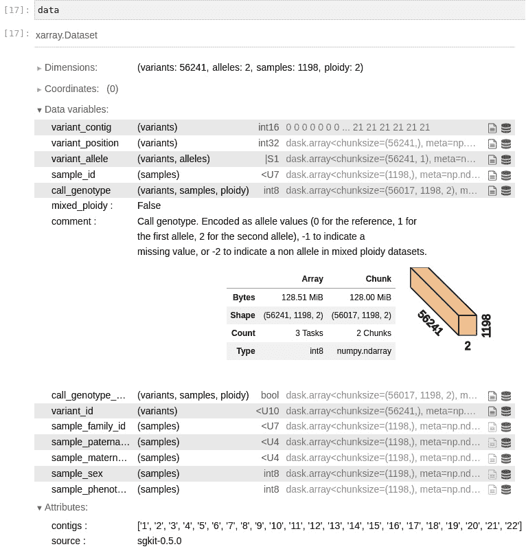
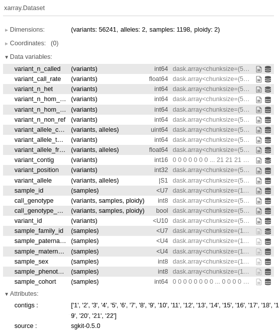
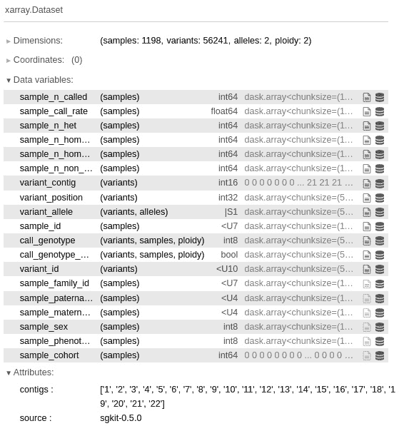
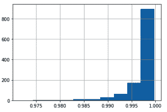
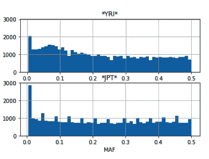
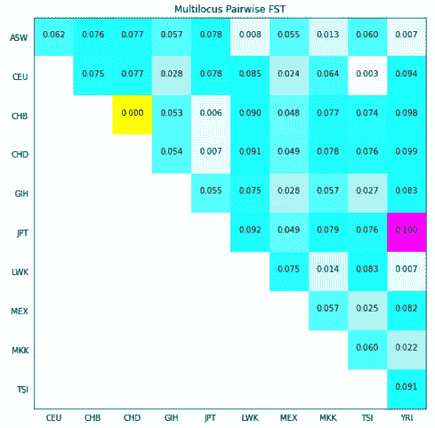
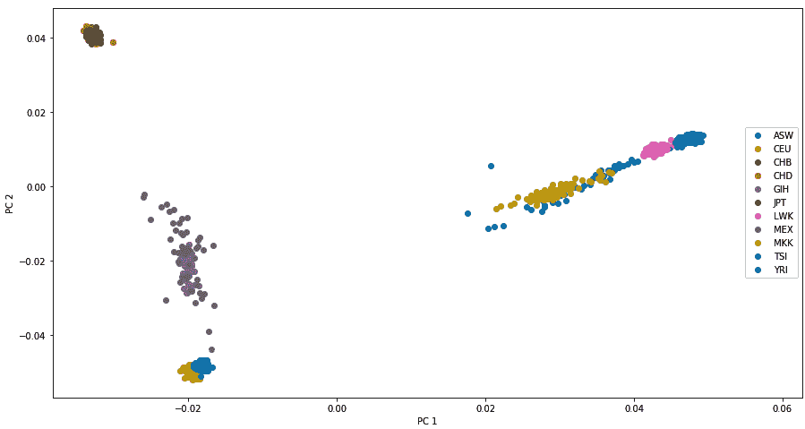
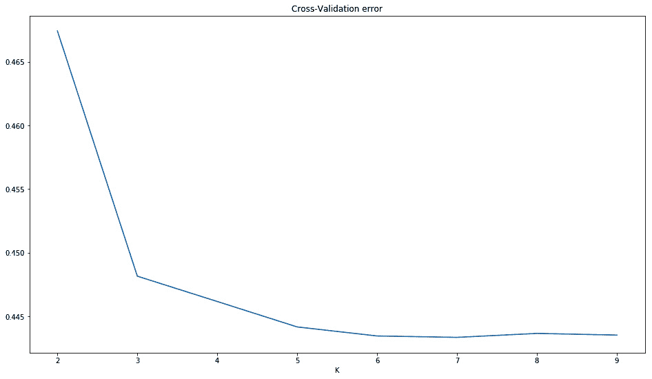
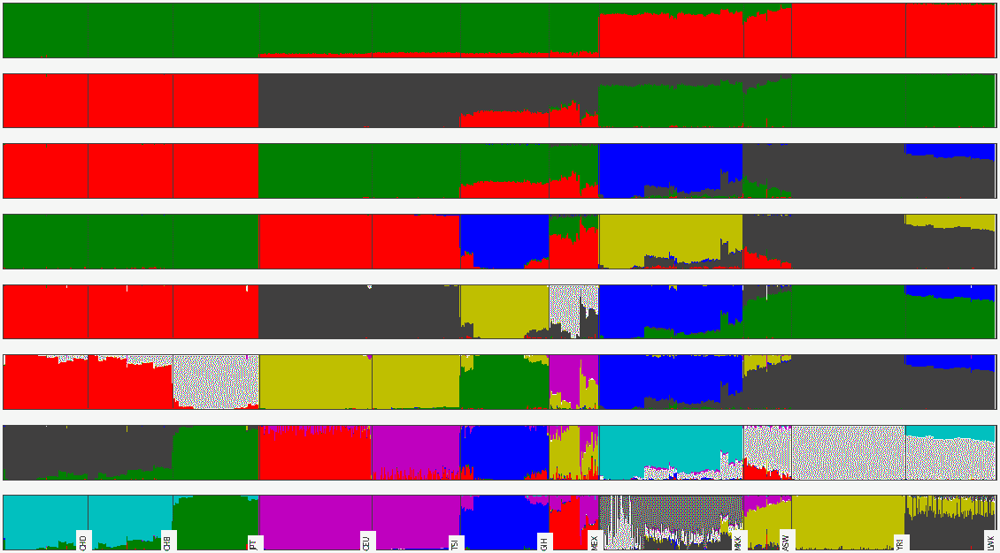

# 第七章：群体遗传学

群体遗传学是研究群体中等位基因频率变化的学科，这些变化基于选择、漂变、突变和迁徙。前几章主要集中在数据处理和清理上；这是我们第一次真正推断有趣的生物学结果。

基于序列数据的群体遗传学分析有很多有趣的内容，但由于我们已经有了不少处理序列数据的操作，我们将把注意力转向其他地方。此外，我们不会在此讨论基因组结构变异，如**拷贝数变异**（**CNVs**）或倒位。我们将集中分析 SNP 数据，这是最常见的数据类型之一。我们将使用 Python 执行许多标准的群体遗传学分析，例如使用**固定指数**（**FST**）计算 F 统计量、**主成分分析**（**PCA**），并研究群体结构。

我们将主要使用 Python 作为脚本语言，来将执行必要计算的应用程序连接在一起，这是一种传统的做法。话虽如此，由于 Python 软件生态系统仍在不断发展，你至少可以使用 scikit-learn 在 Python 中执行 PCA，如我们在*第十一章*中将看到的那样。

在群体遗传学数据中并没有所谓的默认文件格式。这个领域的严峻现实是，存在大量的文件格式，其中大多数是为特定应用而开发的；因此，没有任何一种是通用的。尽管有一些尝试创建更通用的格式（或者只是开发一个支持多种格式的文件转换器），但这些努力的成功是有限的。更重要的是，随着我们对基因组学理解的不断深入，我们将无论如何需要新的格式（例如，支持某种之前未知的基因组结构变异）。在这里，我们将使用 PLINK（[`www.cog-genomics.org/plink/2.0/`](https://www.cog-genomics.org/plink/2.0/)），该工具最初是为在人类数据上执行**全基因组关联研究**（**GWAS**）而开发的，但它有更多的应用。如果你有**下一代测序**（**NGS**）数据，可能会问，为什么不使用**变异调用格式**（**VCF**）？嗯，VCF 文件通常会进行注释，以帮助测序分析，而在这个阶段你并不需要这些（此时你应该已经拥有一个经过过滤的数据集）。如果你将**单核苷酸多态性**（**SNP**）的调用从 VCF 转换为 PLINK，你会大约节省 95%的存储空间（这是与压缩后的 VCF 相比的结果）。更重要的是，处理 VCF 文件的计算成本要远高于其他两种格式的处理成本（想象一下处理所有这些高度结构化的文本）。如果你使用 Docker，请使用镜像 tiagoantao/bioinformatics_popgen。

本章我们将覆盖以下内容：

+   使用 PLINK 管理数据集

+   使用 sgkit 和 xarray 进行群体遗传学分析

+   使用 sgkit 探索数据集

+   分析人口结构

+   执行 PCA 分析

+   通过混合分析调查人口结构

首先，让我们从文件格式问题的讨论开始，然后继续讨论有趣的数据分析。

# 使用 PLINK 管理数据集

在这里，我们将使用 PLINK 来管理我们的数据集。我们将从 HapMap 项目中的主数据集中创建适合以下食谱分析的子集。

警告

请注意，PLINK 及其他类似程序并不是为了他们的文件格式而开发的。创建人口遗传学数据的默认文件标准可能并不是一个目标。在这个领域，你需要做好格式转换的准备（为此，Python 非常适合），因为你将使用的每个应用程序可能都有自己的独特需求。从这个食谱中你要学到的最重要的一点是，使用的不是文件格式（尽管这些是相关的），而是一种“文件转换思维”。除此之外，本食谱中的一些步骤还传达了你可能希望使用的真正的分析技巧，例如，子抽样或**连锁不平衡**（**LD-**）修剪。

## 准备工作

在本章中，我们将使用国际 HapMap 项目的数据。你可能记得我们在*第三章*中使用了 1,000 基因组项目的数据，*下一代测序*，而 HapMap 项目在许多方面是 1,000 基因组项目的前身；它使用的是基因分型，而非全基因组测序。HapMap 项目的大多数样本都用于 1,000 基因组项目，因此如果你已经阅读了*第三章*中的内容，*下一代测序*，你就已经对该数据集（包括可用的人群）有所了解。我不会再对数据集做更多介绍，但你可以参考*第三章*中的内容，*下一代测序*，以及 HapMap 官网([`www.genome.gov/10001688/international-hapmap-project`](https://www.genome.gov/10001688/international-hapmap-project))获取更多信息。请记住，我们有来自世界各地不同人群的基因分型数据。我们将按人群的缩写来引用这些人群。以下是从[`www.sanger.ac.uk/resources/downloads/human/hapmap3.xhtml`](http://www.sanger.ac.uk/resources/downloads/human/hapmap3.xhtml)获取的列表：

| **缩写** | **人群** |
| --- | --- |
| ASW | 美国西南部的非洲血统人群 |
| CEU | 来自 CEPH 收藏的北欧和西欧血统的犹他州居民 |
| CHB | 中国北京的汉族人 |
| CHD | 科罗拉多州丹佛市的华裔居民 |
| GIH | 德克萨斯州休斯顿的古吉拉特印度人 |
| JPT | 日本东京的日本人 |
| LWK | 肯尼亚韦布耶的卢希亚人 |
| MXL | 加利福尼亚州洛杉矶的墨西哥裔人 |
| MKK | 肯尼亚金亚瓦的马赛人 |
| TSI | 意大利托斯卡纳地区的人 |
| YRI | 尼日利亚伊巴丹的约鲁巴人 |

表 6.1 - 基因组计划中的群体

注意

我们将使用 HapMap 项目的数据，该项目实际上已被 1,000 基因组计划所取代。为了教学目的，教授 Python 中的群体遗传学编程技术，HapMap 项目的数据比 1,000 基因组项目更易于处理，因为数据要小得多。HapMap 样本是 1,000 基因组样本的子集。如果你从事人类群体遗传学研究，强烈建议使用 1,000 基因组计划作为基础数据集。

这将需要一个相当大的下载（大约 1GB），并且需要解压。确保你有大约 20GB 的磁盘空间用于本章。文件可以在[`ftp.ncbi.nlm.nih.gov/hapmap/genotypes/hapmap3_r3/plink_format/`](https://ftp.ncbi.nlm.nih.gov/hapmap/genotypes/hapmap3_r3/plink_format/)找到。

使用以下命令解压 PLINK 文件：

```py
bunzip2 hapmap3_r3_b36_fwd.consensus.qc.poly.map.gz
bunzip2 hapmap3_r3_b36_fwd.consensus.qc.poly.ped.gz
```

现在，我们有了 PLINK 文件；MAP 文件包含了整个基因组中标记的位置，而 PED 文件包含了每个个体的实际标记，以及一些家谱信息。我们还下载了一个元数据文件，其中包含了每个个体的信息。查看这些文件并熟悉它们。像往常一样，这些内容也可以在`Chapter06/Data_Formats.py` Notebook 文件中找到，所有内容都已处理好。

最终，这个教程的大部分内容将会大量使用 PLINK（[`www.cog-genomics.org/plink/2.0/`](https://www.cog-genomics.org/plink/2.0/)）。Python 主要作为连接语言来调用 PLINK。

## 如何操作...

请查看以下步骤：

1.  让我们获取我们样本的元数据。我们将加载每个样本的人口信息，并记录数据集中所有其他个体的后代：

    ```py
    from collections import defaultdict
    f = open('relationships_w_pops_041510.txt')
    pop_ind = defaultdict(list)
    f.readline() # header
    offspring = []
    for l in f:
        toks = l.rstrip().split('\t')
        fam_id = toks[0]
        ind_id = toks[1]
        mom = toks[2]
        dad = toks[3]
        if mom != '0' or dad != '0':
            offspring.append((fam_id, ind_id))
        pop = toks[-1]
    pop_ind[pop].append((fam_id, ind_id))
    f.close()
    ```

这将加载一个字典，其中人口是键（`CEU`，`YRI`等），而其值是该人口中个体的列表。该字典还将存储个体是否为其他人的后代信息。每个个体通过家族和个体 ID 进行标识（这些信息可以在 PLINK 文件中找到）。HapMap 项目提供的文件是一个简单的制表符分隔文件，不难处理。虽然我们使用标准的 Python 文本处理读取文件，但这是一个典型的例子，pandas 会有所帮助。

这里有一个重要的点：之所以将此信息提供在一个单独的临时文件中，是因为 PLINK 格式没有考虑到种群结构（该格式仅为 PLINK 设计时所用的病例与对照信息提供了支持）。这并不是格式的缺陷，因为它从未被设计用来支持标准的种群遗传学研究（它是一个 GWAS 工具）。然而，这是种群遗传学中数据格式的普遍特征：无论你最终使用什么格式，都会有所缺失。

我们将在本章的其他例子中使用这些元数据。我们还将进行元数据与 PLINK 文件之间的一致性分析，但我们将把这部分推迟到下一个例子。

1.  现在，让我们以 10% 和 1% 的标记数对数据集进行子抽样，具体如下：

    ```py
    import os
    os.system('plink2 --pedmap hapmap3_r3_b36_fwd.consensus.qc.poly --out hapmap10 --thin 0.1 --geno 0.1 --export ped')
    os.system('plink2 --pedmap hapmap3_r3_b36_fwd.consensus.qc.poly --out hapmap1 --thin 0.01 --geno 0.1 --export ped')
    ```

在 Jupyter Notebook 中，你只需要这样做：

```py
!plink2 --pedmap hapmap3_r3_b36_fwd.consensus.qc.poly --out hapmap10 --thin 0.1 --geno 0.1 --export ped
!plink2 --pedmap hapmap3_r3_b36_fwd.consensus.qc.poly --out hapmap1 --thin 0.01 --geno 0.1 --export ped
```

注意微妙之处，你实际上并不会得到 1% 或 10% 的数据；每个标记有 1% 或 10% 的机会被选中，因此你将得到大约 1% 或 10% 的标记。

显然，由于过程是随机的，不同的运行会产生不同的标记子集。这将在后续的分析中产生重要的影响。如果你想复现完全相同的结果，你仍然可以使用 `--seed` 选项。

我们还将去除所有基因型率低于 90% 的 SNP（使用 `--geno 0.1` 参数）。

注意

这段代码与 Python 本身没有什么特殊之处，但你可能有两个原因希望对数据进行子抽样。首先，如果你正在对自己的数据集进行探索性分析，你可能希望从一个较小的版本开始，因为这样更易处理。而且，你将能更全面地查看你的数据。第二，一些分析方法可能不需要全部数据（实际上，一些方法甚至可能无法使用全部数据）。不过，对于最后一点要非常小心；也就是说，对于每种分析方法，确保你理解要回答的科学问题对数据的要求。通常提供过多的数据是可以的（即便你需要支付时间和内存的代价），但提供过少的数据将导致不可靠的结果。

1.  现在，让我们只使用常染色体生成子集（也就是说，我们将去除性染色体和线粒体），具体如下：

    ```py
    def get_non_auto_SNPs(map_file, exclude_file):
        f = open(map_file)
        w = open(exclude_file, 'w')
        for l in f:
            toks = l.rstrip().split('\t')
            try:
                chrom = int(toks[0])
            except ValueError:
                rs = toks[1]
                w.write('%s\n' % rs)
        w.close()
    get_non_auto_SNPs('hapmap1.map', 'exclude1.txt')
    get_non_auto_SNPs('hapmap10.map', 'exclude10.txt')
    os.system('plink2 –-pedmap hapmap1 --out hapmap1_auto --exclude exclude1.txt --export ped')
    os.system('plink2 --pedmap hapmap10 --out hapmap10_auto --exclude exclude10.txt --export ped')
    ```

1.  让我们创建一个函数，生成一个包含所有不属于常染色体的 SNP 列表。对于人类数据，这意味着所有非数字染色体。如果你使用的是其他物种，要小心染色体编码，因为 PLINK 是面向人类数据的。如果你的物种是二倍体，具有少于 23 条常染色体，并且有性别决定系统，即 X/Y，这将很简单；如果不是，请参考 [`www.cog-genomics.org/plink2/input#allow_extra_chr`](https://www.cog-genomics.org/plink2/input#allow_extra_chr) 以获取一些替代方案（例如 `--allow-extra-chr` 标志）。

1.  然后，我们为 10%和 1%的子样本数据集创建仅包含常染色体的 PLINK 文件（分别以`hapmap10_auto`和`hapmap1_auto`为前缀）。

1.  让我们创建一些没有后代的数据集。这些数据集将用于大多数种群遗传学分析，这些分析要求个体之间在一定程度上没有亲缘关系：

    ```py
    os.system('plink2 --pedmap hapmap10_auto --filter-founders --out hapmap10_auto_noofs --export ped')
    ```

注意

这一步代表了大多数种群遗传学分析的事实，即这些分析要求样本之间有一定程度的非亲缘关系。显然，由于我们知道一些后代存在于 HapMap 中，因此我们需要将其去除。

然而，请注意，使用你的数据集时，你需要比这更加精细。例如，运行`plink --genome`或者使用其他程序来检测相关个体。这里的关键是，你必须花费一些精力去检测样本中的相关个体；这并不是一项微不足道的任务。

1.  我们还将生成一个 LD 修剪后的数据集，这是许多 PCA 和混合分析算法所要求的，具体如下：

    ```py
    os.system('plink2 --pedmap hapmap10_auto_noofs --indep-pairwise 50 10 0.1 --out keep --export ped')
    os.system('plink2 --pedmap hapmap10_auto_noofs --extract keep.prune.in --recode --out hapmap10_auto_noofs_ld --export ped')
    ```

第一步生成一个标记列表，供数据集进行 LD 修剪时使用。这使用一个`50`个 SNP 的滑动窗口，每次推进`10`个 SNP，切割值为`0.1`。第二步从之前生成的列表中提取 SNP。

1.  让我们将几个案例以不同格式重新编码：

    ```py
    os.system('plink2 --file hapmap10_auto_noofs_ld --recode12 tab --out hapmap10_auto_noofs_ld_12 --export ped 12')
    os.system('plink2 --make-bed --file hapmap10_auto_noofs_ld --out hapmap10_auto_noofs_ld')
    ```

第一个操作将把一个使用 ACTG 核苷酸字母的 PLINK 格式转换为另一种格式，这种格式将等位基因重新编码为`1`和`2`。我们将在*执行 PCA*的配方中稍后使用这个。

第二个操作将文件重新编码为二进制格式。如果你在 PLINK 中工作（使用 PLINK 提供的许多有用操作），二进制格式可能是最合适的格式（例如，提供更小的文件大小）。我们将在混合分析配方中使用此格式。

1.  我们还将提取单一的染色体（`2`）进行分析。我们将从 10%子样本的常染色体数据集开始：

    ```py
    os.system('plink2 --pedmap hapmap10_auto_noofs --chr 2 --out hapmap10_auto_noofs_2 --export ped')
    ```

## 还有更多……

你可能有许多理由想要创建不同的数据集进行分析。你可能想对数据进行一些快速的初步探索——例如，如果你计划使用的分析算法对数据格式有要求，或对输入有某些约束，例如标记数量或个体之间的关系。很可能你会有许多子集需要分析（除非你的数据集本身就非常小，例如微卫星数据集）。

这可能看起来是一个小细节，但实际上并非如此：在命名文件时要非常小心（请注意，我在生成文件名时遵循了一些简单的约定）。确保文件名能提供有关子集选项的一些信息。在进行后续分析时，你需要确保选择正确的数据集；你希望你的数据集管理是灵活且可靠的，最重要的是。最糟糕的情况是，你创建了一个包含错误数据集的分析，而这个数据集不符合软件要求的约束条件。

我们使用的 LD 剪枝对于人类分析来说是标准的，但如果你使用非人类数据，请务必检查参数。

我们下载的 HapMap 文件是基于旧版参考基因组（构建 36）。如前一章 *第五章* 所述，*与基因组合作*，如果你计划使用此文件进行更多分析，请确保使用构建 36 的注释。

本示例为接下来的示例做了准备，其结果将被广泛使用。

## 另请参见

+   维基百科关于 LD 的页面 [`en.wikipedia.org/wiki/Linkage_disequilibrium`](http://en.wikipedia.org/wiki/Linkage_disequilibrium) 是一个很好的起点。

+   PLINK 网站 [`www.cog-genomics.org/plink/2.0/`](https://www.cog-genomics.org/plink/2.0/) 有非常详细的文档，这是许多遗传学软件所缺乏的。

# 使用 sgkit 进行群体遗传学分析与 xarray

Sgkit 是进行群体遗传学分析的最先进的 Python 库。它是一个现代实现，利用了几乎所有 Python 中的基础数据科学库。当我说几乎所有时，我并没有夸张；它使用了 NumPy、pandas、xarray、Zarr 和 Dask。NumPy 和 pandas 在 *第二章* 中已介绍。在这里，我们将介绍 xarray 作为 sgkit 的主要数据容器。因为我觉得不能要求你对数据工程库有极为深入的了解，所以我会略过 Dask 部分（主要是将 Dask 结构当作等价的 NumPy 结构来处理）。你可以在 *第十一章* 中找到有关超大内存 Dask 数据结构的更详细信息。

## 准备工作

你需要运行之前的示例，因为它的输出是本示例所需的：我们将使用其中一个 PLINK 数据集。你需要安装 sgkit。

与往常一样，这可以在 `Chapter06/Sgkit.py` 笔记本文件中找到，但你仍然需要运行之前的笔记本文件以生成所需的文件。

## 如何操作...

看一下以下步骤：

1.  让我们加载在之前的示例中生成的 `hapmap10_auto_noofs_ld` 数据集：

    ```py
    import numpy as np
    from sgkit.io import plink
    data = plink.read_plink(path='hapmap10_auto_noofs_ld', fam_sep='\t')
    ```

记住我们正在加载一组 PLINK 文件。事实证明，sgkit 为该数据创建了非常丰富且结构化的表示。这种表示基于 xarray 数据集。

1.  让我们检查一下数据的结构 —— 如果你在笔记本中，只需输入以下内容：

    ```py
    data
    ```

`sgkit` – 如果在笔记本中 – 将生成以下表示：



图 6.1 - sgkit 加载的 xarray 数据概览，适用于我们的 PLINK 文件

`data` 是一个 xarray 数据集。xarray 数据集本质上是一个字典，其中每个值都是一个 Dask 数组。就我们而言，可以假设它是一个 NumPy 数组。在这种情况下，我们可以看到我们有 **56241** 个变异，涵盖了 **1198** 个样本。每个变异有 **2** 个等位基因，且倍性为 **2**。

在笔记本中，我们可以展开每一项。在我们的案例中，我们展开了 `call_genotype`。这是一个三维数组，包含 `variants`、`samples` 和 `ploidy` 维度。该数组的类型是 `int8`。接下来，我们可以找到一些与条目相关的元数据，如 `mixed_ploidy` 和注释。最后，你将看到 Dask 实现的摘要。**Array** 列展示了数组的大小和形状的详细信息。对于 **Chunk** 列，请参阅 *第十一章*——但现在可以安全忽略它。

1.  获取摘要信息的另一种方法，尤其在你没有使用笔记本时，便是检查 `dims` 字段：

    ```py
    print(data.dims)
    ```

输出应该不言自明：

```py
Frozen({'variants': 56241, 'alleles': 2, 'samples': 1198, 'ploidy': 2})
```

1.  让我们提取一些关于样本的信息：

    ```py
    print(len(data.sample_id.values))
    print(data.sample_id.values)
    print(data.sample_family_id.values)
    print(data.sample_sex.values)
    ```

输出如下：

```py
1198
['NA19916' 'NA19835' 'NA20282' ... 'NA18915' 'NA19250' 'NA19124']
['2431' '2424' '2469' ... 'Y029' 'Y113' 'Y076']
[1 2 2 ... 1 2 1]
```

我们有 `1198` 个样本。第一个样本的样本 ID 是 `NA19916`，家庭 ID 是 `2431`，性别为 `1`（男性）。请记住，考虑到 PLINK 作为数据源，样本 ID 并不足以作为主键（你可能会有多个样本具有相同的样本 ID）。主键是样本 ID 和样本家庭 ID 的复合键。

提示

你可能已经注意到我们在所有数据字段后加了 `.values`：这实际上是将一个懒加载的 Dask 数组渲染成一个具象的 NumPy 数组。现在，我建议你忽略它，但如果你在阅读完 *第十一章* 后重新回到这一章，`.values` 类似于 Dask 中的 `compute` 方法。

`.values` 调用并不麻烦——我们的代码之所以能工作，是因为我们的数据集足够小，可以适应内存，这对于我们的教学示例来说非常好。但如果你有一个非常大的数据集，前面的代码就过于简单了。再次强调， *第十一章* 会帮助你解决这个问题。现在，简单性是为了教学目的。

1.  在查看变异数据之前，我们必须了解 sgkit 如何存储 `contigs`：

    ```py
    print(data.contigs)
    ```

输出如下：

```py
['1', '2', '3', '4', '5', '6', '7', '8', '9', '10', '11', '12', '13', '14', '15', '16', '17', '18', '19', '20', '21', '22']
```

这里的 `contigs` 是人类的常染色体（如果你的数据来自于大多数其他物种，可能就不那么幸运了——你可能会看到一些丑陋的标识符）。

1.  现在，让我们来看看变异数据：

    ```py
    print(len(data.variant_contig.values))
    print(data.variant_contig.values)
    print(data.variant_position.values)
    print(data.variant_allele.values)
    print(data.variant_id.values)
    ```

这是输出的简化版本：

```py
56241
[ 0  0  0 ... 21 21 21]
[  557616   782343   908247 ... 49528105 49531259 49559741]
[[b'G' b'A']
 ...
 [b'C' b'A']]
['rs11510103' 'rs2905036' 'rs13303118' ... 'rs11705587' 'rs7284680'
 'rs2238837']
```

我们有 `56241` 个变异。`contig` 索引是 `0`，如果你查看前一步的步骤，它代表染色体 `1`。变异位于位置 `557616`（参照人类基因组版本 36），可能的等位基因是 `G` 和 `A`。它有一个 SNP ID，`rs11510103`。

1.  最后，让我们看看 `genotype` 数据：

    ```py
    call_genotype = data.call_genotype.values
    print(call_genotype.shape)
    first_individual = call_genotype[:,0,:]
    first_variant = call_genotype[0,:,:]
    first_variant_of_first_individual = call_genotype[0,0,:]
    print(first_variant_of_first_individual)
    print(data.sample_family_id.values[0], data.sample_id.values[0])
    print(data.variant_allele.values[0])
    ```

`call_genotype` 的形状为 56,241 x 1,1198,2，这是它的变异、样本和倍性维度。

要获取第一个个体的所有变异数据，你需要固定第二个维度。要获取第一个变异的所有样本数据，你需要固定第一个维度。

如果你打印出第一个个体的详细信息（样本和家庭 ID），你会得到 `2431` 和 `NA19916` ——如预期的那样，正如在上一个样本探索中的第一个案例。

## 还有更多内容...

这个食谱主要是对 xarray 的介绍，伪装成 sgkit 教程。关于 xarray 还有很多内容要说——一定要查看 [`docs.xarray.dev/`](https://docs.xarray.dev/)。值得重申的是，xarray 依赖于大量的 Python 数据科学库，而我们现在暂时忽略了 Dask。

# 使用 sgkit 探索数据集

在这个食谱中，我们将对其中一个生成的数据集进行初步的探索性分析。现在我们对 xarray 有了一些基本了解，可以实际尝试进行一些数据分析。在这个食谱中，我们将忽略群体结构问题，这一问题将在下一个食谱中回到。

## 准备工作

你需要先运行第一个食谱，并确保你有 `hapmap10_auto_noofs_ld` 文件。此食谱中有一个 Notebook 文件，名为 `Chapter06/Exploratory_Analysis.py`。你还需要为上一个食谱安装的软件。

## 如何操作...

看一下以下步骤：

1.  我们首先使用 sgkit 加载 PLINK 数据，方法与上一个食谱完全相同：

    ```py
    import numpy as np
    import xarray as xr
    import sgkit as sg
    from sgkit.io import plink

    data = plink.read_plink(path='hapmap10_auto_noofs_ld', fam_sep='\t')
    ```

1.  让我们请求 sgkit 提供 `variant_stats`：

    ```py
    variant_stats = sg.variant_stats(data)
    variant_stats
    ```

输出结果如下：



图 6.2 - sgkit 提供的变异统计数据

1.  现在我们来看一下统计数据，`variant_call_rate`：

    ```py
    variant_stats.variant_call_rate.to_series().describe()
    ```

这里有更多需要解释的内容，可能看起来不太明显。关键部分是 `to_series()` 调用。Sgkit 返回给你的是一个 Pandas 序列——记住，sgkit 与 Python 数据科学库高度集成。获得 Series 对象后，你可以调用 Pandas 的 `describe` 函数并得到以下结果：

```py
count    56241.000000
mean         0.997198
std          0.003922
min          0.964107
25%          0.996661
50%          0.998331
75%          1.000000
max          1.000000
Name: variant_call_rate, dtype: float64
```

我们的变异呼叫率相当不错，这并不令人惊讶，因为我们在查看的是阵列数据——如果你有一个基于 NGS 的数据集，数据质量可能会更差。

1.  现在让我们来看一下样本统计数据：

    ```py
    sample_stats = sg.sample_stats(data)
    sample_stats
    ```

同样，sgkit 提供了许多现成的样本统计数据：



图 6.3 - 通过调用 sample_stats 获得的样本统计数据

1.  现在我们来看一下样本的呼叫率：

    ```py
    sample_stats.sample_call_rate.to_series().hist()
    ```

这次，我们绘制了样本呼叫率的直方图。同样，sgkit 通过利用 Pandas 自动实现这一功能：



图 6.4 - 样本呼叫率的直方图

## 还有更多内容...

事实上，对于人口遗传学分析，R 是无可比拟的；我们强烈建议你查看现有的 R 人口遗传学库。不要忘记，Python 和 R 之间有一个桥接，在 *第一章*《Python 和周边软件生态》一章中已作讨论。

如果在更大的数据集上执行，大多数在此展示的分析将会消耗大量计算资源。实际上，sgkit 已经准备好应对这个问题，因为它利用了 Dask。虽然在这个阶段介绍 Dask 过于复杂，但对于大数据集，*第十一章* 会讨论如何解决这些问题。

## 另见

+   统计遗传学的 R 包列表可以在 [`cran.r-project.org/web/views/Genetics.xhtml`](http://cran.r-project.org/web/views/Genetics.xhtml) 找到。

+   如果你需要了解更多人口遗传学的内容，我推荐阅读 *Daniel L. Hartl 和 Andrew G. Clark* 合著的《*人口遗传学原理*》一书，出版商是 *Sinauer Associates*。

# 分析人群结构

之前，我们介绍了不考虑人群结构的 sgkit 数据分析。事实上，大多数数据集，包括我们正在使用的这个数据集，都有一定的人群结构。sgkit 提供了分析具有群体结构的基因组数据集的功能，我们将在这里进行探讨。

## 准备工作

你需要先运行第一个配方，并且应该已经下载了我们生成的 `hapmap10_auto_noofs_ld` 数据和原始的人群元数据 `relationships_w_pops_041510.txt` 文件。配方文件中有一个 Notebook 文件，包含了 `06_PopGen/Pop_Stats.py`。

## 如何操作...

请看以下步骤：

1.  首先，让我们用 sgkit 加载 PLINK 数据：

    ```py
    from collections import defaultdict
    from pprint import pprint
    import numpy as np
    import matplotlib.pyplot as plt
    import seaborn as sns
    import pandas as pd
    import xarray as xr
    import sgkit as sg
    from sgkit.io import plink

    data = plink.read_plink(path='hapmap10_auto_noofs_ld', fam_sep='\t')
    ```

1.  现在，让我们加载数据并将个体分配到各个群体：

    ```py
    f = open('relationships_w_pops_041510.txt')
    pop_ind = defaultdict(list)
    f.readline()  # header
    for line in f:
        toks = line.rstrip().split('\t')
        fam_id = toks[0]
        ind_id = toks[1]
        pop = toks[-1]
        pop_ind[pop].append((fam_id, ind_id))
    pops = list(pop_ind.keys())
    ```

我们最终得到一个字典 `pop_ind`，其中键是人群代码，值是样本列表。请记住，样本的主键是家庭 ID 和样本 ID。

我们还在 `pops` 变量中列出了人群列表。

1.  我们现在需要告知 sgkit 每个样本属于哪个人群或队列：

    ```py
    def assign_cohort(pops, pop_ind, sample_family_id, sample_id):
        cohort = []
        for fid, sid in zip(sample_family_id, sample_id):
            processed = False
            for i, pop in enumerate(pops):
                if (fid, sid) in pop_ind[pop]:
                    processed = True
                    cohort.append(i)
                    break
            if not processed:
                raise Exception(f'Not processed {fid}, {sid}')
        return cohort
    cohort = assign_cohort(pops, pop_ind, data.sample_family_id.values, data.sample_id.values)
    data['sample_cohort'] = xr.DataArray(
        cohort, dims='samples')
    ```

请记住，sgkit 中的每个样本都有一个在数组中的位置。因此，我们需要创建一个数组，其中每个元素都指向样本内的特定人群或队列。`assign_cohort` 函数正是做了这件事：它获取我们从 `relationships` 文件加载的元数据和来自 sgkit 文件的样本列表，并为每个样本获取人群索引。

1.  现在我们已经将人群信息结构加载到 sgkit 数据集中，接下来可以开始在人口或队列层级计算统计数据。首先，让我们计算每个人群的单一等位基因位点数量：

    ```py
    cohort_allele_frequency = sg.cohort_allele_frequencies(data)['cohort_allele_frequency'].values
    monom = {}
    for i, pop in enumerate(pops):
        monom[pop] = len(list(filter(lambda x: x, np.isin(cohort_allele_frequency[:, i, 0], [0, 1]))))
    pprint(monom)
    ```

我们首先请求 sgkit 计算每个队列或人群的等位基因频率。然后，我们筛选每个人群中的所有位点，其中第一个等位基因的频率为`0`或`1`（即其中一个等位基因已经固定）。最后，我们打印出来。顺便提一下，我们使用`pprint.pprint`函数让输出看起来更清晰（如果你希望以可读的方式渲染输出，且结构较复杂时，这个函数非常有用）：

```py
{'ASW': 3332,
 'CEU': 8910,
 'CHB': 11130,
 'CHD': 12321,
 'GIH': 8960,
 'JPT': 13043,
 'LWK': 3979,
 'MEX': 6502,
 'MKK': 3490,
 'TSI': 8601,
 'YRI': 5172}
```

1.  让我们获取每个人群所有位点的最小等位基因频率。这仍然是基于`cohort_allele_frequency`——因此不需要再次调用 sgkit：

    ```py
    mafs = {}
    for i, pop in enumerate(pops):
        min_freqs = map(
            lambda x: x if x < 0.5 else 1 - x,
            filter(
                lambda x: x not in [0, 1],
                cohort_allele_frequency[:, i, 0]))
        mafs[pop] = pd.Series(min_freqs)
    ```

我们为每个人群创建 Pandas `Series`对象，因为这样可以使用许多有用的功能，例如绘图。

1.  现在，我们将打印`YRI`和`JPT`人群的 MAF 直方图。我们将利用 Pandas 和 Matplotlib 来完成此操作：

    ```py
    maf_plot, maf_ax = plt.subplots(nrows=2, sharey=True)
    mafs['YRI'].hist(ax=maf_ax[0], bins=50)
    maf_ax[0].set_title('*YRI*')
    mafs['JPT'].hist(ax=maf_ax[1], bins=50)
    maf_ax[1].set_title('*JPT*')
    maf_ax[1].set_xlabel('MAF')
    ```

我们让 Pandas 生成直方图，并将结果放入 Matplotlib 图中。结果如下所示：



图 6.5 - YRI 和 JPT 人群的 MAF 直方图

1.  现在我们将集中计算 FST。FST 是一个广泛使用的统计量，旨在表示由人群结构产生的遗传变异。让我们使用 sgkit 来计算它：

    ```py
    fst = sg.Fst(data)
    fst = fst.assign_coords({"cohorts_0": pops, "cohorts_1": pops})
    ```

第一行计算`fst`，在这种情况下，它将是队列或人群之间的配对`fst`。第二行通过使用 xarray 坐标功能为每个队列分配名称。这使得代码更简洁，更具声明性。

1.  让我们比较`CEU`和`CHB`人群与`CHB`和`CHD`人群之间的`fst`：

    ```py
    remove_nan = lambda data: filter(lambda x: not np.isnan(x), data)
    ceu_chb = pd.Series(remove_nan(fst.stat_Fst.sel(cohorts_0='CEU', cohorts_1='CHB').values))
    chb_chd = pd.Series(remove_nan(fst.stat_Fst.sel(cohorts_0='CHB', cohorts_1='CHD').values))
    ceu_chb.describe()
    chb_chd.describe()
    ```

我们将`stat_FST`中`sel`函数返回的配对结果用于比较，并创建一个 Pandas `Series`。请注意，我们可以按名称引用人群，因为我们已经在前一步中准备好了坐标。

1.  让我们基于多位点配对 FST 绘制人群间的距离矩阵。在此之前，我们将准备计算：

    ```py
    mean_fst = {}
    for i, pop_i in enumerate(pops):
        for j, pop_j in enumerate(pops):
            if j <= i:
                continue
            pair_fst = pd.Series(remove_nan(fst.stat_Fst.sel(cohorts_0=pop_i, cohorts_1=pop_j).values))
            mean = pair_fst.mean()
            mean_fst[(pop_i, pop_j)] = mean
    min_pair = min(mean_fst.values())
    max_pair = max(mean_fst.values())
    ```

我们计算所有人群对之间的 FST 值。执行这段代码时将消耗大量时间和内存，因为我们实际上要求 Dask 进行大量计算，以呈现我们的 NumPy 数组。

1.  现在我们可以对所有人群的平均 FST 进行配对绘图：

    ```py
    sns.set_style("white")
    num_pops = len(pops)
    arr = np.ones((num_pops - 1, num_pops - 1, 3), dtype=float)
    fig = plt.figure(figsize=(16, 9))
    ax = fig.add_subplot(111)
    for row in range(num_pops - 1):
        pop_i = pops[row]
        for col in range(row + 1, num_pops):
            pop_j = pops[col]
            val = mean_fst[(pop_i, pop_j)]
            norm_val = (val - min_pair) / (max_pair - min_pair)
            ax.text(col - 1, row, '%.3f' % val, ha='center')
            if norm_val == 0.0:
                arr[row, col - 1, 0] = 1
                arr[row, col - 1, 1] = 1
                arr[row, col - 1, 2] = 0
            elif norm_val == 1.0:
                arr[row, col - 1, 0] = 1
                arr[row, col - 1, 1] = 0
                arr[row, col - 1, 2] = 1
            else:
                arr[row, col - 1, 0] = 1 - norm_val
                arr[row, col - 1, 1] = 1
                arr[row, col - 1, 2] = 1
    ax.imshow(arr, interpolation='none')
    ax.set_title('Multilocus Pairwise FST')
    ax.set_xticks(range(num_pops - 1))
    ax.set_xticklabels(pops[1:])
    ax.set_yticks(range(num_pops - 1))
    ax.set_yticklabels(pops[:-1])
    ```

在下面的图表中，我们将绘制一个上三角矩阵，其中单元格的背景颜色表示分化的度量；白色表示差异较小（较低的 FST），蓝色表示差异较大（较高的 FST）。**CHB**和**CHD**之间的最小值用黄色表示，而**JPT**和**YRI**之间的最大值用洋红色表示。每个单元格中的值是这两个人群之间的平均配对 FST：



图 6.6 - HapMap 项目中 11 个人群所有常染色体的平均配对 FST

## 另见

+   F 统计量是一个非常复杂的话题，所以我首先将引导你到维基百科页面：[`en.wikipedia.org/wiki/F-statistics`](http://en.wikipedia.org/wiki/F-statistics)。

+   Holsinger 和 Weir 的论文中提供了一个很好的解释，论文标题为《*Genetics in geographically structured populations: defining, estimating, and interpreting FST*》，刊登在《*Nature Reviews Genetics*》杂志上，链接：[`www.nature.com/nrg/journal/v10/n9/abs/nrg2611.xhtml`](http://www.nature.com/nrg/journal/v10/n9/abs/nrg2611.xhtml)。

# 执行 PCA

PCA 是一种统计方法，用于将多个变量的维度降低到一个较小的子集，这些子集是线性无关的。它在群体遗传学中的实际应用是帮助可视化被研究个体之间的关系。

本章中的大多数食谱都使用 Python 作为*粘合语言*（Python 调用外部应用程序来完成大部分工作），而在 PCA 中，我们有一个选择：我们可以使用外部应用程序（例如，EIGENSOFT SmartPCA），也可以使用 scikit-learn 并在 Python 中执行所有操作。在本食谱中，我们将使用 SmartPCA——如果你想体验使用 scikit-learn 的原生机器学习方法，可以参考*第十章*。

提示

事实上，你还有第三个选择：使用 sgkit。然而，我想向你展示如何执行计算的替代方案。这样做有两个很好的理由。首先，你可能不想使用 sgkit——尽管我推荐它，但我不想强迫你；其次，你可能需要使用一个在 sgkit 中没有实现的替代方法。PCA 实际上就是一个很好的例子：论文的审稿人可能要求你运行一个已发布且广泛使用的方法，例如 EIGENSOFT SmartPCA。

## 准备工作

你需要先运行第一个食谱，才能使用`hapmap10_auto_noofs_ld_12` PLINK 文件（其中等位基因已重新编码为`1`和`2`）。PCA 需要 LD 修剪后的标记；我们不会在这里使用后代数据，因为这可能会偏向结果。我们将使用重新编码后的 PLINK 文件，其中等位基因为`1`和`2`，因为这样可以使 SmartPCA 和 scikit-learn 的处理更加方便。

我有一个简单的库来帮助进行一些基因组处理。你可以在[`github.com/tiagoantao/pygenomics`](https://github.com/tiagoantao/pygenomics)找到这个代码。你可以使用以下命令进行安装：

```py
pip install pygenomics
```

对于本食谱，你需要下载 EIGENSOFT（[`www.hsph.harvard.edu/alkes-price/software/`](http://www.hsph.harvard.edu/alkes-price/software/)），其中包含我们将使用的 SmartPCA 应用程序。

在`Chapter06/PCA.py`食谱中有一个 Notebook 文件，但你仍然需要先运行第一个食谱。

## 如何做...

请查看以下步骤：

1.  让我们加载元数据，步骤如下：

    ```py
    f = open('relationships_w_pops_041510.txt')
    ind_pop = {}
    f.readline() # header
    for l in f:
        toks = l.rstrip().split('\t')
        fam_id = toks[0]
        ind_id = toks[1]
        pop = toks[-1]
        ind_pop['/'.join([fam_id, ind_id])] = pop
    f.close()
    ind_pop['2469/NA20281'] = ind_pop['2805/NA20281']
    ```

在这种情况下，我们将添加一个与 PLINK 文件中已有内容一致的条目。

1.  让我们将 PLINK 文件转换为 EIGENSOFT 格式：

    ```py
    from genomics.popgen.plink.convert import to_eigen
    to_eigen('hapmap10_auto_noofs_ld_12', 'hapmap10_auto_noofs_ld_12')
    ```

这使用了我编写的一个函数，将 PLINK 数据转换为 EIGENSOFT 格式。这主要是文本处理——并不是最激动人心的代码。

1.  现在，我们将运行 `SmartPCA` 并解析其结果，如下所示：

    ```py
    from genomics.popgen.pca import smart
    ctrl = smart.SmartPCAController('hapmap10_auto_noofs_ld_12')
    ctrl.run()
    wei, wei_perc, ind_comp = smart.parse_evec('hapmap10_auto_noofs_ld_12.evec', 'hapmap10_auto_noofs_ld_12.eval')
    ```

同样，这将使用 `pygenomics` 中的几个函数来控制 `SmartPCA`，然后解析输出。代码是此类操作的典型代码，尽管你可以查看它，但实际上它非常直接。

`parse` 函数将返回 PCA 权重（我们不会使用这些权重，但你应该检查一下）、归一化权重，以及每个个体的主成分（通常最多到 PC `10`）。

1.  然后，我们绘制 PC `1` 和 PC `2`，如下所示的代码：

    ```py
    from genomics.popgen.pca import plot
    plot.render_pca(ind_comp, 1, 2, cluster=ind_pop)
    ```

这将生成以下图示。我们将提供绘图函数和从元数据中检索的种群信息，这样可以用不同的颜色绘制每个种群。结果与已发布的结果非常相似；我们将找到四个群体。大多数亚洲种群位于顶部，非洲种群位于右侧，欧洲种群位于底部。还有两个混合种群（**GIH** 和 **MEX**）位于中间：



图 6.7 - 由 SmartPCA 生成的 HapMap 数据的 PC 1 和 PC 2

注意

请注意，PCA 图可以在任何轴上对称，因为信号并不重要。重要的是簇应该相同，并且个体之间（以及这些簇之间）的距离应该相似。

## 还有更多...

这里有一个有趣的问题，你应该使用哪种方法——SmartPCA 还是 scikit-learn？我们将在*第十章*中使用 scikit-learn。结果是相似的，所以如果你正在进行自己的分析，可以自由选择。然而，如果你将结果发表在科学期刊上，SmartPCA 可能是更安全的选择，因为它基于遗传学领域已发布的软件；审稿人可能更倾向于选择这一方法。

## 另见

+   可能最先普及 PCA 在遗传学中应用的论文是 Novembre 等人的 *Genes mirror geography within Europe*，发表在 *Nature* 上，文中通过 PCA 映射欧洲人的数据，几乎完美地与欧洲地图对齐。你可以在 [`www.nature.com/nature/journal/v456/n7218/abs/nature07331.xhtml`](http://www.nature.com/nature/journal/v456/n7218/abs/nature07331.xhtml) 找到这篇文章。请注意，PCA 本身并不保证它会映射到地理特征（只需检查我们之前的 PCA）。

+   SmartPCA 在 Patterson 等人的 *Population Structure and Eigenanalysis* 中有描述，发表在 *PLoS Genetics*，网址为 [`journals.plos.org/plosgenetics/article?id=10.1371/journal.pgen.0020190`](http://journals.plos.org/plosgenetics/article?id=10.1371/journal.pgen.0020190)。

+   PCA 的含义讨论可以在 McVean 的论文《*A Genealogical Interpretation of Principal Components Analysis*》，*PLoS Genetics*中找到，链接为[`journals.plos.org/plosgenetics/article?id=10.1371/journal.pgen.1000686`](http://journals.plos.org/plosgenetics/article?id=10.1371/journal.pgen.1000686)。

# 使用混合分析研究种群结构

在种群遗传学中，一个典型的分析是由结构程序（[`web.stanford.edu/group/pritchardlab/structure.xhtml`](https://web.stanford.edu/group/pritchardlab/structure.xhtml)）推广的，这个程序用于研究种群结构。此类软件用于推断存在多少个种群（或有多少个祖先种群生成了当前的种群），并识别潜在的迁徙者和混合个体。结构程序是在很久以前开发的，当时基因型标记数量较少（当时主要是少量微卫星标记），之后开发出了更快的版本，包括同一实验室开发的`fastStructure`（[`rajanil.github.io/fastStructure/`](http://rajanil.github.io/fastStructure/)）。在这里，我们将使用 Python 与在 UCLA 开发的同类程序——admixture（[`dalexander.github.io/admixture/download.xhtml`](https://dalexander.github.io/admixture/download.xhtml)）进行接口。

## 准备工作

你需要运行第一个步骤才能使用`hapmap10_auto_noofs_ld`二进制 PLINK 文件。同样，我们将使用经过 LD 修剪且没有后代的 10%自动体样本。

如同前面的步骤，你将使用`pygenomics`库来协助；你可以在[`github.com/tiagoantao/pygenomics`](https://github.com/tiagoantao/pygenomics)找到这些代码文件。你可以使用以下命令安装它：

```py
pip install pygenomics
```

理论上，对于本步骤，你需要下载 admixture（[`www.genetics.ucla.edu/software/admixture/`](https://www.genetics.ucla.edu/software/admixture/)）。然而，在本案例中，我将提供我们将使用的 HapMap 数据上运行 admixture 的输出，因为运行 admixture 需要很长时间。你可以使用已提供的结果，或者自己运行 admixture。此过程的 Notebook 文件位于`Chapter06/Admixture.py`中，但你仍然需要先运行该步骤。

## 如何做到这一点...

看一下以下步骤：

1.  首先，让我们定义我们感兴趣的`k`（祖先种群的数量）范围，如下所示：

    ```py
    k_range = range(2, 10)  # 2..9
    ```

1.  让我们对所有的`k`进行 admixture 分析（或者，你也可以跳过此步骤，使用提供的示例数据）：

    ```py
    for k in k_range:
        os.system('admixture --cv=10 hapmap10_auto_noofs_ld.bed %d > admix.%d' % (k, k))
    ```

注意

这是进行混合分析的最糟糕方式，如果你按这种方式进行，可能需要超过 3 小时。这是因为它会按顺序运行所有的`k`值，从`2`到`9`。有两种方法可以加速这一过程：使用混合工具提供的多线程选项（`-j`），或者并行运行多个应用程序。在这里，我假设最坏的情况，你只有一个核心和线程可用，但你应该能通过并行化更高效地运行。我们将在*第十一章*中详细讨论这个问题。

1.  我们将需要 PLINK 文件中个体的顺序，因为混合工具以此顺序输出个体结果：

    ```py
    f = open('hapmap10_auto_noofs_ld.fam')
    ind_order = []
    for l in f:
        toks = l.rstrip().replace(' ', '\t').split('\t')
        fam_id = toks[0]
        ind_id = toks[1]
        ind_order.append((fam_id, ind_id))
    f.close()
    ```

1.  交叉验证误差给出了“最佳”`k`的衡量标准，如下所示：

    ```py
    import matplotlib.pyplot as plt
    CVs = []
    for k in k_range:
        f = open('admix.%d' % k)
        for l in f:
            if l.find('CV error') > -1:
                CVs.append(float(l.rstrip().split(' ')[-1]))
                break
        f.close()
    fig = plt.figure(figsize=(16, 9))
    ax = fig.add_subplot(111)
    ax.set_title('Cross-Validation error')
    ax.set_xlabel('K')
    ax.plot(k_range, CVs)
    ```

以下图表绘制了`K`值从`2`到`9`之间的交叉验证误差，越低越好。从这个图表中应该可以看出，我们可能需要运行更多的`K`值（事实上，我们有 11 个种群；如果不是更多的话，至少应该运行到 11），但由于计算成本问题，我们停在了`9`。

关于是否存在“最佳”`K`，这将是一个非常技术性的讨论。现代科学文献表明，可能没有“最佳”`K`；这些结果值得一些解释。我认为在解释`K`结果之前，你应该意识到这一点：



图 6.8 - K 的误差

1.  我们需要人口信息的元数据：

    ```py
    f = open('relationships_w_pops_041510.txt')
    pop_ind = defaultdict(list)
    f.readline() # header
    for l in f:
       toks = l.rstrip().split('\t')
       fam_id = toks[0]
       ind_id = toks[1]
       if (fam_id, ind_id) not in ind_order:
          continue
       mom = toks[2]
       dad = toks[3]
       if mom != '0' or dad != '0':
          continue
     pop = toks[-1]
     pop_ind[pop].append((fam_id, ind_id))
    f.close()
    ```

我们将忽略 PLINK 文件中没有的个体。

1.  让我们加载个体组成部分，如下所示：

    ```py
    def load_Q(fname, ind_order):
        ind_comps = {}
        f = open(fname)
        for i, l in enumerate(f):
            comps = [float(x) for x in l.rstrip().split(' ')]
            ind_comps[ind_order[i]] = comps
        f.close()
        return ind_comps
    comps = {}
    for k in k_range:
        comps[k] = load_Q('hapmap10_auto_noofs_ld.%d.Q' % k, ind_order)
    ```

混合工具会生成一个文件，包含每个个体的祖先组成部分（例如，查看任何生成的`Q`文件）；将会有与您选择研究的`k`值相等的组成部分数量。在这里，我们将加载我们研究的所有`k`的`Q`文件，并将其存储在一个字典中，个体 ID 作为键。

1.  然后，我们将对个体进行聚类，如下所示：

    ```py
    from genomics.popgen.admix import cluster
    ordering = {}
    for k in k_range:
        ordering[k] = cluster(comps[k], pop_ind)
    ```

请记住，个体是通过混合获得祖先种群的组成部分；我们希望根据它们在祖先组成部分上的相似性对它们进行排序（而不是按 PLINK 文件中的顺序）。这并不是一项简单的任务，需要使用聚类算法。

此外，我们并不希望对所有个体进行排序；我们希望按每个种群排序，然后再对每个种群进行排序。

为此，我在[`github.com/tiagoantao/pygenomics/blob/master/genomics/popgen/admix/__init__.py`](https://github.com/tiagoantao/pygenomics/blob/master/genomics/popgen/admix/__init__.py)提供了一些聚类代码。这并不完美，但允许你执行一些看起来合理的绘图。我的代码使用了 SciPy 的聚类代码。我建议你看看（顺便说一句，改进它并不难）。

1.  在合理的个体顺序下，我们现在可以绘制混合图：

    ```py
    from genomics.popgen.admix import plot
    plot.single(comps[4], ordering[4])
    fig = plt.figure(figsize=(16, 9))
    plot.stacked(comps, ordering[7], fig)
    ```

这将产生两个图表；第二个图表显示在下图中（第一个图表实际上是从顶部的第三个混合图的变体）。

第一个图 `K` = `4` 需要每个个体的组分及其顺序。它将按种群排序并分割所有个体。

第二个图将绘制从 `K` = `2` 到 `9` 的一组堆叠混合图。它需要一个 `figure` 对象（由于堆叠混合物的数量可能很多，图的尺寸会有所不同）。个体的顺序通常会遵循其中一个 `K`（这里我们选择了 `K` = `7`）。

请注意，所有的 `K` 都值得一些解释（例如，`K` = `2` 将非洲人口与其他人群分离开来，而 `K` = `3` 则将欧洲人口分离，并展示了 **GIH** 和 **MEX** 的混合）：



图 6.9 - HapMap 示例的堆叠混合图（K 值介于 2 和 9 之间）

## 还有更多内容...

不幸的是，你不能仅运行单个混合实例来获得结果。最佳做法实际上是运行 100 个实例，并获得具有最佳对数似然的结果（这在混合输出中报告）。显然，我无法要求你为此配方的每个 7 个不同的 `K` 运行 100 个实例（我们在谈论两周的计算时间），但如果你想要有可发布的结果，你可能必须执行这些步骤。需要集群（或至少非常好的机器）来运行这个。你可以使用 Python 处理输出并选择最佳对数似然的结果。选择每个 `K` 的最佳结果后，你可以轻松应用此配方来绘制输出。
