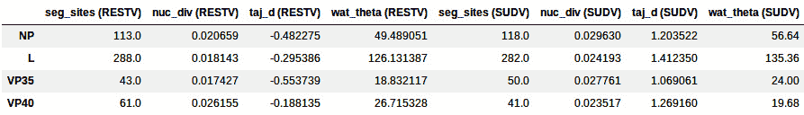
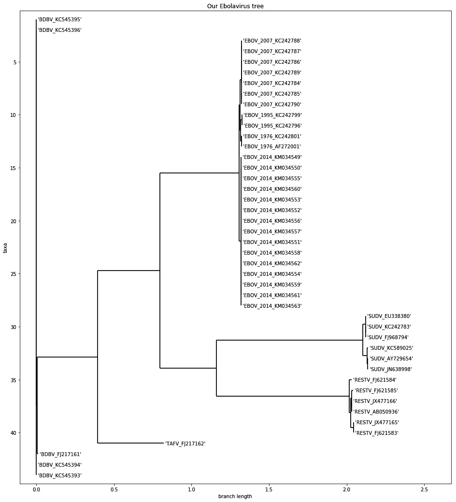
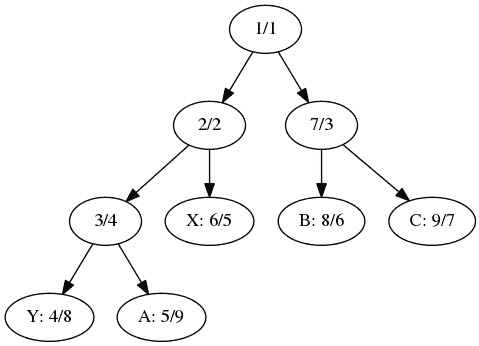
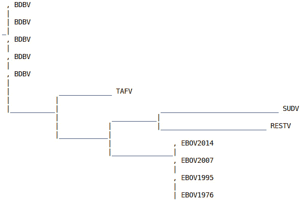
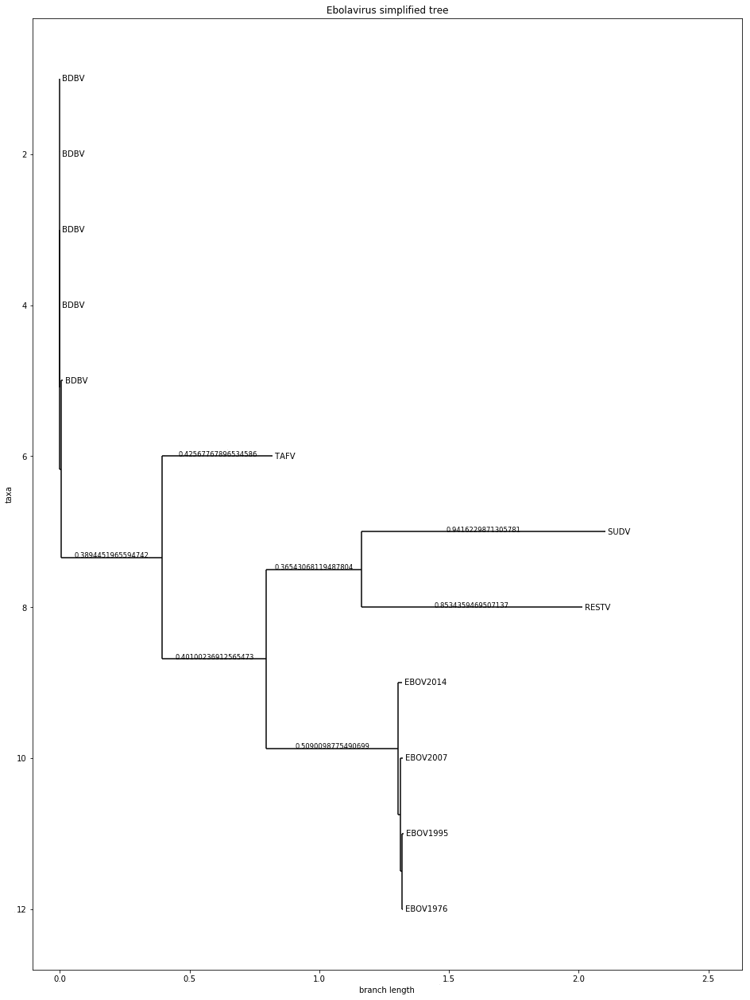
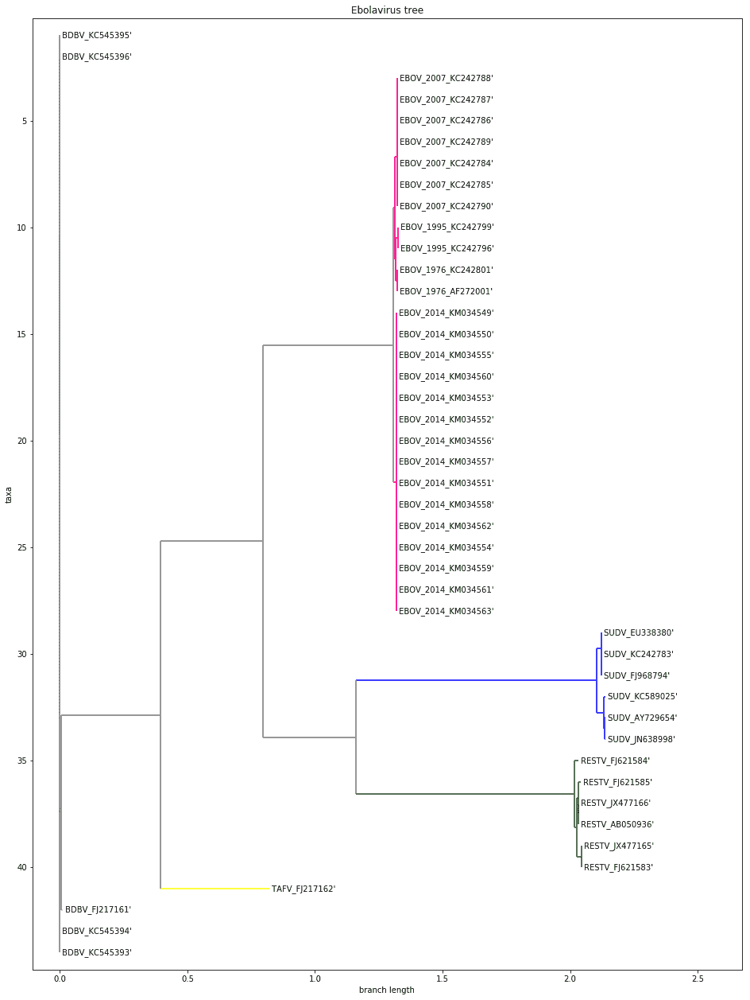

# 第八章：系统发育学

系统发育学是应用分子测序技术来研究生物之间的进化关系。通常用系统发育树来表示这一过程。从基因组数据中计算这些树是一个活跃的研究领域，并具有许多现实世界中的应用。

本书将把之前提到的实际操作方法推向一个新高度：这里的大部分内容都受到了关于埃博拉病毒的最新研究的启发，研究了最近在非洲爆发的埃博拉疫情。该研究名为*Genomic surveillance elucidates Ebola virus origin and transmission during the 2014 outbreak*，由*Gire et al.*完成，发表于*Science*期刊。你可以在[`pubmed.ncbi.nlm.nih.gov/25214632/`](https://pubmed.ncbi.nlm.nih.gov/25214632/)阅读到这篇文章。在这里，我们将尝试采用类似的方法，以便得出与该论文相似的结果。

本章我们将使用 DendroPy（一个系统发育学库）和 Biopython。`bioinformatics_phylo` Docker 镜像包含了所有必需的软件。

本章我们将涵盖以下内容：

+   为系统发育分析准备数据集

+   对齐遗传和基因组数据

+   比较序列

+   重建系统发育树

+   递归地玩转树状图

+   可视化系统发育数据

# 为系统发育分析准备数据集

在这个步骤中，我们将下载并准备用于分析的数据集。该数据集包含了埃博拉病毒的完整基因组。我们将使用 DendroPy 来下载和准备数据。

## 准备就绪

我们将从 GenBank 下载完整的基因组，这些基因组来自多个埃博拉疫情爆发，其中包括 2014 年疫情中的多个样本。请注意，导致埃博拉病毒病的病毒种类有很多；2014 年疫情中的主要病毒是 EBOV（即正式命名为扎伊尔埃博拉病毒），这是最常见的一种，但此病还由更多的埃博拉病毒属物种引起；另外四种物种的基因组序列也已被测序。你可以在[`en.wikipedia.org/wiki/Ebolavirus`](https://en.wikipedia.org/wiki/Ebolavirus)阅读更多信息。

如果你已经完成了前几章的内容，看到这里可能会对涉及的数据量感到担忧；但这完全不成问题，因为这些是大约 19 kbp 大小的病毒基因组。因此，我们的约 100 个基因组实际上相当小巧。

为了进行这个分析，我们需要安装 `dendropy`。如果你使用的是 Anaconda，请执行以下操作：

```py
conda install –c bioconda dendropy
```

像往常一样，这些信息可以在相应的 Jupyter Notebook 文件中找到，文件位于`Chapter07/Exploration.py`。

## 如何操作...

请查看以下步骤：

1.  首先，让我们使用 DendroPy 指定我们的数据源，如下所示：

    ```py
    import dendropy
    from dendropy.interop import genbank
    def get_ebov_2014_sources():
        #EBOV_2014
        #yield 'EBOV_2014', genbank.GenBankDna(id_range=(233036, 233118), prefix='KM')
        yield 'EBOV_2014', genbank.GenBankDna(id_range=(34549, 34563), prefix='KM0')
    def get_other_ebov_sources():
        #EBOV other
        yield 'EBOV_1976', genbank.GenBankDna(ids=['AF272001', 'KC242801'])
        yield 'EBOV_1995', genbank.GenBankDna(ids=['KC242796', 'KC242799'])
        yield 'EBOV_2007', genbank.GenBankDna(id_range=(84, 90), prefix='KC2427')
    def get_other_ebolavirus_sources():
        #BDBV
        yield 'BDBV', genbank.GenBankDna(id_range=(3, 6), prefix='KC54539')
        yield 'BDBV', genbank.GenBankDna(ids=['FJ217161']) #RESTV
        yield 'RESTV', genbank.GenBankDna(ids=['AB050936', 'JX477165', 'JX477166',  'FJ621583', 'FJ621584', 'FJ621585'])
        #SUDV
        yield 'SUDV', genbank.GenBankDna(ids=['KC242783', 'AY729654', 'EU338380', 'JN638998', 'FJ968794', 'KC589025', 'JN638998'])
        #yield 'SUDV', genbank.GenBankDna(id_range=(89, 92), prefix='KC5453')
        #TAFV
        yield 'TAFV', genbank.GenBankDna(ids=['FJ217162'])
    ```

在这里，我们有三个函数：一个用于检索最新 EBOV 爆发的数据，另一个用于检索以前 EBOV 爆发的数据，第三个用于检索其他物种爆发的数据。

请注意，DendroPy 的 GenBank 接口提供了几种不同的方式来指定要检索的记录列表或范围。一些行已被注释掉，包括下载更多基因组的代码。对于我们的目的，我们将下载的子集已足够。

1.  现在，我们将创建一组 FASTA 文件；我们将在这里以及未来的食谱中使用这些文件：

    ```py
    other = open('other.fasta', 'w')
    sampled = open('sample.fasta', 'w')
    for species, recs in get_other_ebolavirus_sources():
        tn = dendropy.TaxonNamespace()
        char_mat = recs.generate_char_matrix(taxon_namespace=tn,
            gb_to_taxon_fn=lambda gb: tn.require_taxon(label='%s_%s' % (species, gb.accession)))
        char_mat.write_to_stream(other, 'fasta')
        char_mat.write_to_stream(sampled, 'fasta')
    other.close()
    ebov_2014 = open('ebov_2014.fasta', 'w')
    ebov = open('ebov.fasta', 'w')
    for species, recs in get_ebov_2014_sources():
        tn = dendropy.TaxonNamespace()
        char_mat = recs.generate_char_matrix(taxon_namespace=tn,
            gb_to_taxon_fn=lambda gb: tn.require_taxon(label='EBOV_2014_%s' % gb.accession))
        char_mat.write_to_stream(ebov_2014, 'fasta')
        char_mat.write_to_stream(sampled, 'fasta')
        char_mat.write_to_stream(ebov, 'fasta')
    ebov_2014.close()
    ebov_2007 = open('ebov_2007.fasta', 'w')
    for species, recs in get_other_ebov_sources():
        tn = dendropy.TaxonNamespace()
        char_mat = recs.generate_char_matrix(taxon_namespace=tn,
            gb_to_taxon_fn=lambda gb: tn.require_taxon(label='%s_%s' % (species, gb.accession)))
        char_mat.write_to_stream(ebov, 'fasta')
        char_mat.write_to_stream(sampled, 'fasta')
        if species == 'EBOV_2007':
            char_mat.write_to_stream(ebov_2007, 'fasta')
    ebov.close()
    ebov_2007.close()
    sampled.close()
    ```

我们将生成几个不同的 FASTA 文件，包含所有基因组、仅 EBOV 基因组或仅包含 2014 年爆发的 EBOV 样本的文件。在本章中，我们将主要使用包含所有基因组的`sample.fasta`文件。

请注意使用`dendropy`函数创建 FASTA 文件，这些文件是通过转换从 GenBank 记录中提取的。FASTA 文件中每个序列的 ID 是通过一个 lambda 函数生成的，该函数使用物种和年份，以及 GenBank 的登录号。

1.  让我们提取病毒中的四个基因（总共七个），如下所示：

    ```py
    my_genes = ['NP', 'L', 'VP35', 'VP40']
    def dump_genes(species, recs, g_dls, p_hdls):
        for rec in recs:
            for feature in rec.feature_table:
                if feature.key == 'CDS':
                    gene_name = None
                    for qual in feature.qualifiers:
                        if qual.name == 'gene':
                            if qual.value in my_genes:
                                gene_name = qual.value
                        elif qual.name == 'translation':
                            protein_translation = qual.value
                    if gene_name is not None:
                        locs = feature.location.split('.')
                        start, end = int(locs[0]), int(locs[-1])
                        g_hdls[gene_name].write('>%s_%s\n' % (species, rec.accession))
                        p_hdls[gene_name].write('>%s_%s\n' % (species, rec.accession))
                        g_hdls[gene_name].write('%s\n' % rec.sequence_text[start - 1 : end])
                        p_hdls[gene_name].write('%s\n' % protein_translation)
    g_hdls = {}
    p_hdls = {}
    for gene in my_genes:
        g_hdls[gene] = open('%s.fasta' % gene, 'w')
        p_hdls[gene] = open('%s_P.fasta' % gene, 'w')
    for species, recs in get_other_ebolavirus_sources():
        if species in ['RESTV', 'SUDV']:
            dump_genes(species, recs, g_hdls, p_hdls)
    for gene in my_genes:
        g_hdls[gene].close()
        p_hdls[gene].close()
    ```

我们首先搜索第一个 GenBank 记录中的所有基因特征（请参阅*第三章*，*下一代测序*，或**国家生物技术信息中心**（**NCBI**）文档获取更多细节；虽然我们将在这里使用 DendroPy 而不是 Biopython，但概念是相似的），并将数据写入 FASTA 文件，以提取基因。我们将每个基因放入不同的文件中，只取两个病毒物种。我们还获取了转译的蛋白质，这些蛋白质在每个基因的记录中都有提供。

1.  让我们创建一个函数，从比对中获取基本统计信息，如下所示：

    ```py
    def describe_seqs(seqs):
        print('Number of sequences: %d' % len(seqs.taxon_namespace))
        print('First 10 taxon sets: %s' % ' '.join([taxon.label for taxon in seqs.taxon_namespace[:10]]))
        lens = []
        for tax, seq in seqs.items():
            lens.append(len([x for x in seq.symbols_as_list() if x != '-']))
        print('Genome length: min %d, mean %.1f, max %d' % (min(lens), sum(lens) / len(lens), max(lens)))
    ```

我们的函数采用`DnaCharacterMatrix` DendroPy 类，并统计分类单元的数量。然后，我们提取每个序列中的所有氨基酸（排除由`-`表示的缺失）来计算长度，并报告最小、平均和最大大小。有关 API 的更多细节，请查看 DendroPy 文档。

1.  让我们检查一下 EBOV 基因组的序列并计算基本统计数据，如前所示：

    ```py
    ebov_seqs = dendropy.DnaCharacterMatrix.get_from_path('ebov.fasta', schema='fasta', data_type='dna')
    print('EBOV')
    describe_seqs(ebov_seqs)
    del ebov_seqs
    ```

然后我们调用一个函数，得到 25 个序列，最小大小为 18,700，平均大小为 18,925.2，最大大小为 18,959。与真核生物相比，这是一个较小的基因组。

请注意，在最后，内存结构已被删除。这是因为内存占用仍然相当大（DendroPy 是一个纯 Python 库，在速度和内存方面有一些开销）。在加载完整基因组时，要小心内存使用。

1.  现在，让我们检查另一个埃博拉病毒基因组文件，并统计不同物种的数量：

    ```py
    print('ebolavirus sequences')
    ebolav_seqs = dendropy.DnaCharacterMatrix.get_from_path('other.fasta', schema='fasta', data_type='dna')
    describe_seqs(ebolav_seqs)
    from collections import defaultdict
    species = defaultdict(int)
    for taxon in ebolav_seqs.taxon_namespace:
        toks = taxon.label.split('_')
        my_species = toks[0]
        if my_species == 'EBOV':
            ident = '%s (%s)' % (my_species, toks[1])
        else:
            ident = my_species
        species[ident] += 1
    for my_species, cnt in species.items():
        print("%20s: %d" % (my_species, cnt))
    del ebolav_seqs
    ```

每个分类单元的名称前缀表明了物种，我们利用这一点来填充一个计数字典。

接下来详细介绍物种和 EBOV 的分类（图例中 Bundibugyo 病毒=BDBV，Tai Forest 病毒=TAFV，Sudan 病毒=SUDV，Reston 病毒=RESTV；我们有 1 个 TAFV，6 个 SUDV，6 个 RESTV 和 5 个 BDBV）。

1.  让我们提取病毒中基因的基本统计信息：

    ```py
    gene_length = {}
    my_genes = ['NP', 'L', 'VP35', 'VP40']
    for name in my_genes:
        gene_name = name.split('.')[0]
        seqs =    
    dendropy.DnaCharacterMatrix.get_from_path('%s.fasta' % name, schema='fasta', data_type='dna')
        gene_length[gene_name] = []
        for tax, seq in seqs.items():
            gene_length[gene_name].append(len([x for x in  seq.symbols_as_list() if x != '-'])
    for gene, lens in gene_length.items():
        print ('%6s: %d' % (gene, sum(lens) / len(lens)))
    ```

这允许你概览基本的基因信息（即名称和平均大小），如下所示：

```py
NP: 2218
L: 6636
VP35: 990
VP40: 988
```

## 还有更多...

这里的大部分工作可能可以通过 Biopython 完成，但 DendroPy 具有更多额外的功能，将在后续的步骤中进行探索。此外，正如你将发现的，它在某些任务（如文件解析）上更为强大。更重要的是，还有另一个 Python 库用于执行系统发育学分析，你应该考虑一下。它叫做 ETE，可以在[`etetoolkit.org/`](http://etetoolkit.org/)找到。

## 另见

+   美国**疾病控制中心**（**CDC**）在[`www.cdc.gov/vhf/ebola/history/summaries.xhtml`](https://www.cdc.gov/vhf/ebola/history/summaries.xhtml)上有一个关于埃博拉病毒病的很好的简介页面。

+   系统发育学中的参考应用是 Joe Felsenstein 的*Phylip*，可以在[`evolution.genetics.washington.edu/phylip.xhtml`](http://evolution.genetics.washington.edu/phylip.xhtml)找到。

+   我们将在未来的步骤中使用 Nexus 和 Newick 格式（[`evolution.genetics.washington.edu/phylip/newicktree.xhtml`](http://evolution.genetics.washington.edu/phylip/newicktree.xhtml)），但也可以查看 PhyloXML 格式（[`en.wikipedia.org/wiki/PhyloXML`](http://en.wikipedia.org/wiki/PhyloXML)）。

# 对齐基因和基因组数据

在进行任何系统发育分析之前，我们需要对基因和基因组数据进行对齐。在这里，我们将使用 MAFFT（[`mafft.cbrc.jp/alignment/software/`](http://mafft.cbrc.jp/alignment/software/)）进行基因组分析。基因分析将使用 MUSCLE（[`www.drive5.com/muscle/`](http://www.drive5.com/muscle/)）进行。

## 准备就绪

要执行基因组对齐，你需要安装 MAFFT。此外，为了进行基因对齐，将使用 MUSCLE。我们还将使用 trimAl（[`trimal.cgenomics.org/`](http://trimal.cgenomics.org/)）以自动化方式去除虚假序列和对齐不良的区域。所有包都可以从 Bioconda 获取：

```py
conda install –c bioconda mafft trimal muscle=3.8
```

如常，这些信息可以在相应的 Jupyter Notebook 文件`Chapter07/Alignment.py`中找到。你需要先运行之前的 Notebook，因为它会生成这里所需的文件。在本章中，我们将使用 Biopython。

## 如何操作...

查看以下步骤：

1.  现在，我们将运行 MAFFT 来对齐基因组，如下面的代码所示。这个任务是 CPU 密集型和内存密集型的，且将花费相当长的时间：

    ```py
    from Bio.Align.Applications import MafftCommandline
    mafft_cline = MafftCommandline(input='sample.fasta', ep=0.123, reorder=True, maxiterate=1000, localpair=True)
    print(mafft_cline)
    stdout, stderr = mafft_cline()
    with open('align.fasta', 'w') as w:
        w.write(stdout)
    ```

之前的参数与论文附录中指定的参数相同。我们将使用 Biopython 接口调用 MAFFT。

1.  让我们使用 trimAl 来修剪序列，如下所示：

    ```py
    os.system('trimal -automated1 -in align.fasta -out trim.fasta -fasta')
    ```

在这里，我们只是通过`os.system`调用应用程序。`-automated1`参数来自补充材料。

1.  此外，我们可以运行`MUSCLE`来对蛋白质进行比对：

    ```py
    from Bio.Align.Applications import MuscleCommandline
    my_genes = ['NP', 'L', 'VP35', 'VP40']
    for gene in my_genes:
        muscle_cline = MuscleCommandline(input='%s_P.fasta' % gene)
        print(muscle_cline)
        stdout, stderr = muscle_cline()
        with open('%s_P_align.fasta' % gene, 'w') as w:
        w.write(stdout)
    ```

我们使用 Biopython 来调用外部应用程序。在这里，我们将对一组蛋白质进行比对。

请注意，为了进行分子进化分析，我们必须比较对齐后的基因，而不是蛋白质（例如，比较同义突变和非同义突变）。然而，我们只对齐了蛋白质。因此，我们必须将对齐数据转换为基因序列形式。

1.  让我们通过找到三个对应于每个氨基酸的核苷酸来对基因进行比对：

    ```py
    from Bio import SeqIO
    from Bio.Seq import Seq
    from Bio.SeqRecord import SeqRecord
    for gene in my_genes:
        gene_seqs = {}
        unal_gene = SeqIO.parse('%s.fasta' % gene, 'fasta')
        for rec in unal_gene:
            gene_seqs[rec.id] = rec.seq
        al_prot = SeqIO.parse('%s_P_align.fasta' % gene, 'fasta')
        al_genes = []
        for protein in al_prot:
            my_id = protein.id
            seq = ''
            pos = 0
            for c in protein.seq:
                if c == '-':
                    seq += '---'
                else:
                    seq += str(gene_seqs[my_id][pos:pos + 3])
                    pos += 3
            al_genes.append(SeqRecord(Seq(seq), id=my_id))
        SeqIO.write(al_genes, '%s_align.fasta' % gene, 'fasta')
    ```

该代码获取蛋白质和基因编码。如果在蛋白质中发现空缺，则写入三个空缺；如果发现氨基酸，则写入相应的基因核苷酸。

# 比较序列

在这里，我们将比较在上一配方中比对的序列。我们将进行基因范围和基因组范围的比较。

## 准备开始

我们将使用 DendroPy，并且需要前两个配方的结果。像往常一样，这些信息可以在对应的笔记本`Chapter07/Comparison.py`中找到。

## 如何操作……

看一下接下来的步骤：

1.  让我们开始分析基因数据。为简便起见，我们将仅使用来自伊波拉病毒属的另外两种物种的数据，这些数据已包含在扩展数据集中，即雷斯顿病毒（`RESTV`）和苏丹病毒（`SUDV`）：

    ```py
    import os
    from collections import OrderedDict
    import dendropy
    from dendropy.calculate import popgenstat
    genes_species = OrderedDict()
    my_species = ['RESTV', 'SUDV']
    my_genes = ['NP', 'L', 'VP35', 'VP40']
    for name in my_genes:
        gene_name = name.split('.')[0]
        char_mat = dendropy.DnaCharacterMatrix.get_from_path('%s_align.fasta' % name, 'fasta')
        genes_species[gene_name] = {}

        for species in my_species:
            genes_species[gene_name][species] = dendropy.DnaCharacterMatrix()
        for taxon, char_map in char_mat.items():
            species = taxon.label.split('_')[0]
            if species in my_species:
                genes_species[gene_name][species].taxon_namespace.add_taxon(taxon)
                genes_species[gene_name][species][taxon] = char_map
    ```

我们得到在第一步中存储的四个基因，并在第二步中对其进行了比对。

我们加载所有文件（格式为 FASTA），并创建一个包含所有基因的字典。每个条目本身也是一个字典，包含 RESTV 或 SUDV 物种，及所有读取的数据。这些数据量不大，只有少量基因。

1.  让我们打印所有四个基因的一些基本信息，如分离位点数（`seg_sites`）、核苷酸多样性（`nuc_div`）、Tajima’s D（`taj_d`）和 Waterson’s theta（`wat_theta`）（请查看本配方中*更多...*部分的链接，了解这些统计数据的相关信息）：

    ```py
    import numpy as np
    import pandas as pd
    summary = np.ndarray(shape=(len(genes_species), 4 * len(my_species)))
    stats = ['seg_sites', 'nuc_div', 'taj_d', 'wat_theta']
    for row, (gene, species_data) in enumerate(genes_species.items()):
        for col_base, species in enumerate(my_species):
            summary[row, col_base * 4] = popgenstat.num_segregating_sites(species_data[species])
            summary[row, col_base * 4 + 1] = popgenstat.nucleotide_diversity(species_data[species])
            summary[row, col_base * 4 + 2] = popgenstat.tajimas_d(species_data[species])
            summary[row, col_base * 4 + 3] = popgenstat.wattersons_theta(species_data[species])
    columns = []
    for species in my_species:
        columns.extend(['%s (%s)' % (stat, species) for stat in stats])
    df = pd.DataFrame(summary, index=genes_species.keys(), columns=columns)
    df # vs print(df)
    ```

1.  首先，我们来看一下输出，然后再解释如何构建它：



图 7.1 – 病毒数据集的数据框

我使用`pandas`数据框打印结果，因为它非常适合处理这样的操作。我们将用一个 NumPy 多维数组初始化数据框，数组包含四行（基因）和四个统计数据乘以两个物种。

这些统计数据，如分离位点数、核苷酸多样性、Tajima’s D 和 Watterson’s theta，都是通过 DendroPy 计算的。请注意单个数据点在数组中的位置（坐标计算）。

看看最后一行：如果你在 Jupyter 中，只需要将 `df` 放在末尾，它会渲染出 DataFrame 和单元格输出。如果你不在笔记本中，使用 `print(df)`（你也可以在笔记本中执行这个操作，但显示效果可能不如直接在 Jupyter 中漂亮）。

1.  现在，让我们提取类似的信息，但这次是基因组范围的数据，而不仅仅是基因范围。在这种情况下，我们将使用两个埃博拉爆发（2007 年和 2014 年）的子样本。我们将执行一个函数来显示基本统计信息，如下所示：

    ```py
    def do_basic_popgen(seqs):
        num_seg_sites = popgenstat.num_segregating_sites(seqs)
        avg_pair = popgenstat.average_number_of_pairwise_differences(seqs)
        nuc_div = popgenstat.nucleotide_diversity(seqs)
        print('Segregating sites: %d, Avg pairwise diffs: %.2f, Nucleotide diversity %.6f' % (num_seg_sites, avg_pair, nuc_div))
        print("Watterson's theta: %s" % popgenstat.wattersons_theta(seqs))
        print("Tajima's D: %s" % popgenstat.tajimas_d(seqs))
    ```

到现在为止，鉴于之前的例子，这个函数应该很容易理解。

1.  现在，让我们正确地提取数据的子样本，并输出统计信息：

    ```py
    ebov_seqs = dendropy.DnaCharacterMatrix.get_from_path(
        'trim.fasta', schema='fasta', data_type='dna')
    sl_2014 = []
    drc_2007 = []
    ebov2007_set = dendropy.DnaCharacterMatrix()
    ebov2014_set = dendropy.DnaCharacterMatrix()
    for taxon, char_map in ebov_seqs.items():
        print(taxon.label)
        if taxon.label.startswith('EBOV_2014') and len(sl_2014) < 8:
            sl_2014.append(char_map)
            ebov2014_set.taxon_namespace.add_taxon(taxon)
            ebov2014_set[taxon] = char_map
        elif taxon.label.startswith('EBOV_2007'):
            drc_2007.append(char_map)
            ebov2007_set.taxon_namespace.add_taxon(taxon)
            ebov2007_set[taxon] = char_map
            #ebov2007_set.extend_map({taxon: char_map})
    del ebov_seqs
    print('2007 outbreak:')
    print('Number of individuals: %s' % len(ebov2007_set.taxon_set))
    do_basic_popgen(ebov2007_set)
    print('\n2014 outbreak:')
    print('Number of individuals: %s' % len(ebov2014_set.taxon_set))
    do_basic_popgen(ebov2014_set)
    ```

在这里，我们将构建两个数据集的两个版本：2014 年爆发和 2007 年爆发。我们将生成一个版本作为 `DnaCharacterMatrix`，另一个作为列表。我们将在这个食谱的最后使用这个列表版本。

由于 2014 年埃博拉爆发的数据集很大，我们仅用 8 个个体进行子样本抽取，这与 2007 年爆发的数据集的样本大小相当。

再次，我们删除 `ebov_seqs` 数据结构以节省内存（这些是基因组，而不仅仅是基因）。

如果你对 GenBank 上可用的 2014 年爆发的完整数据集（99 个样本）执行此分析，请准备好等待相当长的时间。

输出如下所示：

```py
2007 outbreak:
Number of individuals: 7
Segregating sites: 25, Avg pairwise diffs: 7.71, Nucleotide diversity 0.000412
Watterson's theta: 10.204081632653063
Tajima's D: -1.383114157484101
2014 outbreak:
Number of individuals: 8
Segregating sites: 6, Avg pairwise diffs: 2.79, Nucleotide diversity 0.000149
Watterson's theta: 2.31404958677686
Tajima's D: 0.9501208027581887
```

1.  最后，我们对 2007 年和 2014 年的两个子集进行一些统计分析，如下所示：

    ```py
    pair_stats = popgenstat.PopulationPairSummaryStatistics(sl_2014, drc_2007)
    print('Average number of pairwise differences irrespective of population: %.2f' % pair_stats.average_number_of_pairwise_differences)
    print('Average number of pairwise differences between populations: %.2f' % pair_stats.average_number_of_pairwise_differences_between)
    print('Average number of pairwise differences within populations: %.2f' % pair_stats.average_number_of_pairwise_differences_within)
    print('Average number of net pairwise differences : %.2f' % pair_stats.average_number_of_pairwise_differences_net)
    print('Number of segregating sites: %d' % pair_stats.num_segregating_sites)
    print("Watterson's theta: %.2f" % pair_stats.wattersons_theta)
    print("Wakeley's Psi: %.3f" % pair_stats.wakeleys_psi)
    print("Tajima's D: %.2f" % pair_stats.tajimas_d)
    ```

请注意，我们这里执行的操作稍有不同；我们将要求 DendroPy（`popgenstat.PopulationPairSummaryStatistics`）直接比较两个种群，以便获得以下结果：

```py
Average number of pairwise differences irrespective of population: 284.46
Average number of pairwise differences between populations: 535.82
Average number of pairwise differences within populations: 10.50
Average number of net pairwise differences : 525.32
Number of segregating sites: 549
Watterson's theta: 168.84
Wakeley's Psi: 0.308
Tajima's D: 3.05
```

现在，分化位点的数量要大得多，因为我们正在处理来自两个合理分化的不同种群的数据。种群间的平均成对差异数值非常大。如预期的那样，这个数值远大于种群内部的平均数值，无论是否有种群信息。

## 还有更多……

如果你想获取更多的系统发育学和群体遗传学公式，包括这里使用的那些，我强烈推荐你获取 Arlequin 软件套件的手册（[`cmpg.unibe.ch/software/arlequin35/`](http://cmpg.unibe.ch/software/arlequin35/)）。如果你不使用 Arlequin 进行数据分析，那么它的手册可能是实现公式的最佳参考。这本免费的文档可能包含比任何我能记得的书籍更相关的公式实现细节。

# 重建系统发育树

在这里，我们将为所有埃博拉物种的对齐数据集构建系统发育树。我们将遵循与论文中使用的过程非常相似的步骤。

## 准备工作

这个食谱需要 RAxML，这是一个用于最大似然推断大型系统发育树的程序，你可以在 [`sco.h-its.org/exelixis/software.xhtml`](http://sco.h-its.org/exelixis/software.xhtml) 上查看它。Bioconda 也包含它，但它的名称是 `raxml`。请注意，二进制文件叫做 `raxmlHPC`。你可以执行以下命令来安装它：

```py
conda install –c bioconda raxml
```

上面的代码很简单，但执行起来需要时间，因为它会调用 RAxML（这是一个计算密集型过程）。如果你选择使用 DendroPy 接口，它也可能会变得内存密集。我们将与 RAxML、DendroPy 和 Biopython 进行交互，给你选择使用哪个接口的自由；DendroPy 给你提供了一个简单的方式来访问结果，而 Biopython 则是内存占用较少的选择。尽管本章后面有一个可视化的食谱，但我们仍然会在这里绘制我们生成的树。

和往常一样，这些信息可以在相应的笔记本 `Chapter07/Reconstruction.py` 中找到。你需要前一个食谱的输出才能完成这个食谱。

## 如何操作…

看一下以下步骤：

1.  对于 DendroPy，我们将首先加载数据，然后重建属数据集，如下所示：

    ```py
    import os
    import shutil
    import dendropy
    from dendropy.interop import raxml
    ebola_data = dendropy.DnaCharacterMatrix.get_from_path('trim.fasta', 'fasta')
    rx = raxml.RaxmlRunner()
    ebola_tree = rx.estimate_tree(ebola_data, ['-m', 'GTRGAMMA', '-N', '10'])
    print('RAxML temporary directory %s:' % rx.working_dir_path)
    del ebola_data
    ```

请记住，这个数据结构的大小相当大；因此，确保你有足够的内存来加载它（至少 10 GB）。

要准备好等待一段时间。根据你的计算机，这可能需要超过一个小时。如果时间过长，考虑重新启动进程，因为有时 RAxML 可能会出现 bug。

我们将使用 GTRΓ 核苷酸替代模型运行 RAxML，如论文中所述。我们只进行 10 次重复以加快结果速度，但你可能应该做更多的重复，比如 100 次。在过程结束时，我们将从内存中删除基因组数据，因为它占用了大量内存。

`ebola_data` 变量将包含最佳的 RAxML 树，并且包括距离信息。`RaxmlRunner` 对象将可以访问 RAxML 生成的其他信息。让我们打印出 DendroPy 将执行 RAxML 的目录。如果你检查这个目录，你会发现很多文件。由于 RAxML 返回的是最佳树，你可能会忽略所有这些文件，但我们将在替代的 Biopython 步骤中稍作讨论。

1.  我们将保存树用于未来的分析；在我们的案例中，它将是一个可视化，如下代码所示：

    ```py
    ebola_tree.write_to_path('my_ebola.nex', 'nexus')
    ```

我们将把序列写入 NEXUS 文件，因为我们需要存储拓扑信息。FASTA 在这里不够用。

1.  让我们可视化我们的属树，如下所示：

    ```py
    import matplotlib.pyplot as plt
    from Bio import Phylo
    my_ebola_tree = Phylo.read('my_ebola.nex', 'nexus')
    my_ebola_tree.name = 'Our Ebolavirus tree'
    fig = plt.figure(figsize=(16, 18))
    ax = fig.add_subplot(1, 1, 1)
    Phylo.draw(my_ebola_tree, axes=ax)
    ```

我们将在稍后介绍合适的步骤时再解释这段代码，但如果你查看下图并将其与论文中的结果进行比较，你会清楚地看到它像是朝着正确方向迈进的一步。例如，所有同一物种的个体被聚集在一起。

你会注意到，trimAl 改变了其序列的名称，例如，通过添加它们的大小。这很容易解决；我们将在*可视化系统发育数据*这一部分中处理这个问题：



图 7.2 – 我们使用 RAxML 生成的所有埃博拉病毒的系统发育树

1.  让我们通过 Biopython 使用 RAxML 重建系统发育树。Biopython 的接口比 DendroPy 更少声明式，但在内存效率上要高得多。因此，在运行完后，你需要负责处理输出，而 DendroPy 会自动返回最优的树，如下代码所示：

    ```py
    import random
    import shutil
    from Bio.Phylo.Applications import RaxmlCommandline
    raxml_cline = RaxmlCommandline(sequences='trim.fasta', model='GTRGAMMA', name='biopython', num_replicates='10', parsimony_seed=random.randint(0, sys.maxsize), working_dir=os.getcwd() + os.sep + 'bp_rx')
    print(raxml_cline)
    try:
        os.mkdir('bp_rx')
    except OSError:
        shutil.rmtree('bp_rx')
        os.mkdir('bp_rx')
    out, err = raxml_cline()
    ```

DendroPy 比 Biopython 具有更具声明性的接口，因此你可以处理一些额外的事项。你应该指定种子（如果不指定，Biopython 会自动使用 10,000 作为默认值）以及工作目录。使用 RAxML 时，工作目录的指定要求使用绝对路径。

1.  让我们检查一下 Biopython 运行的结果。虽然 RAxML 的输出（除了随机性）对于 DendroPy 和 Biopython 是相同的，但 DendroPy 隐藏了几个细节。使用 Biopython，你需要自己处理结果。你也可以使用 DendroPy 来执行这个操作；不过在这种情况下，它是可选的：

    ```py
    from Bio import Phylo
    biopython_tree = Phylo.read('bp_rx/RAxML_bestTree.biopython', 'newick')
    ```

上面的代码将读取 RAxML 运行中最优的树。文件名后附加了你在前一步中指定的项目名称（在本例中为`biopython`）。

看看`bp_rx`目录的内容；在这里，你将找到来自 RAxML 的所有输出，包括所有 10 个备选树。

## 还有更多……

尽管本书的目的是不教授系统发育分析，但了解为什么我们不检查树拓扑中的共识和支持信息还是很重要的。你应该在自己的数据集里研究这一点。更多信息，请参考[`www.geol.umd.edu/~tholtz/G331/lectures/cladistics5.pdf`](http://www.geol.umd.edu/~tholtz/G331/lectures/cladistics5.pdf)。

# 递归操作树

这不是一本关于 Python 编程的书，因为这个话题非常广泛。话虽如此，入门级 Python 书籍通常不会详细讨论递归编程。通常，递归编程技术非常适合处理树结构。而且，它还是功能性编程方言中的一种必要编程策略，这在进行并发处理时非常有用。这在处理非常大的数据集时是常见的。

系统发育树的概念与计算机科学中的树有所不同。系统发育树可以是有根的（如果是，它们就是普通的树数据结构），也可以是无根的，使其成为无向非循环图。此外，系统发育树的边上可以有权重。因此，在阅读文档时要注意这一点；如果文献是由系统发育学家编写的，你可以期待该树是有根或无根的，而大多数其他文档则会使用无向非循环图来表示无根树。在这个配方中，我们假设所有树都是有根的。

最后，请注意，虽然本配方主要旨在帮助你理解递归算法和树形结构，但最后一部分实际上非常实用，并且对下一个配方的实现至关重要。

## 准备工作

你需要准备好前一配方中的文件。像往常一样，你可以在 `Chapter07/Trees.py` 笔记本文件中找到这些内容。在这里，我们将使用 DendroPy 的树表示。请注意，比较其他树表示和库（无论是系统发育的还是非系统发育的）而言，大部分代码都是易于通用的。

## 如何操作...

看一下以下步骤：

1.  首先，让我们加载由 RAxML 生成的所有埃博拉病毒树，如下所示：

    ```py
    import dendropy
    ebola_raxml = dendropy.Tree.get_from_path('my_ebola.nex', 'nexus')
    ```

1.  接着，我们需要计算每个节点的层级（到根节点的距离）：

    ```py
    def compute_level(node, level=0):
        for child in node.child_nodes():
            compute_level(child, level + 1)
        if node.taxon is not None:
            print("%s: %d %d" % (node.taxon, node.level(), level))
    compute_level(ebola_raxml.seed_node)
    ```

DendroPy 的节点表示有一个层级方法（用于比较），但这里的重点是介绍递归算法，所以我们还是会实现它。

注意这个函数的工作原理；它是用 `seed_node` 调用的（这是根节点，因为代码假设我们处理的是有根树）。根节点的默认层级是 `0`。然后，该函数会递归调用所有子节点，将层级加一。对于每个非叶子节点（即，它是树的内部节点），这个调用会被重复，直到我们到达叶子节点。

对于叶子节点，我们接着打印出层级（我们也可以对内部节点执行相同的操作），并展示由 DendroPy 内部函数计算出的相同信息。

1.  现在，让我们计算每个节点的高度。节点的高度是从该节点开始的最大向下路径（通向叶子）的边数，如下所示：

    ```py
    def compute_height(node):
        children = node.child_nodes()
        if len(children) == 0:
            height = 0
        else:
        height = 1 + max(map(lambda x: compute_height(x), children))
        desc = node.taxon or 'Internal'
        print("%s: %d %d" % (desc, height, node.level()))
        return height
    compute_height(ebola_raxml.seed_node)
    ```

在这里，我们将使用相同的递归策略，但每个节点将把它的高度返回给其父节点。如果该节点是叶子节点，则高度为 `0`；如果不是，则高度为 `1` 加上其所有后代的最大高度。

请注意，我们使用 `map` 配合 lambda 函数来获取当前节点所有子节点的高度。然后，我们选择最大值（`max` 函数在这里执行一个 `reduce` 操作，因为它总结了所有报告的值）。如果你将其与 MapReduce 框架联系起来，你是正确的；它们的灵感来自于像这样的函数式编程方言。

1.  现在，让我们计算每个节点的子孙数量。到现在为止，这应该很容易理解：

    ```py
    def compute_nofs(node):
        children = node.child_nodes()
        nofs = len(children)
        map(lambda x: compute_nofs(x), children)
        desc = node.taxon or 'Internal'
        print("%s: %d %d" % (desc, nofs, node.level()))
    compute_nofs(ebola_raxml.seed_node)
    ```

1.  现在，我们将打印所有叶节点（显然，这是微不足道的）：

    ```py
    def print_nodes(node):
        for child in node.child_nodes():
            print_nodes(child)
        if node.taxon is not None:
            print('%s (%d)' % (node.taxon, node.level()))
    print_nodes(ebola_raxml.seed_node)
    ```

请注意，到目前为止，我们开发的所有函数都对树施加了非常明确的遍历模式。它首先调用它的第一个子节点，然后该子节点会调用它的子节点，依此类推；只有这样，函数才能按深度优先的模式调用下一个子节点。然而，我们也可以采取不同的方式。

1.  现在，让我们以广度优先的方式打印叶节点，也就是说，我们会首先打印离根节点最近的叶节点，按如下方式：

    ```py
    from collections import deque
    def print_breadth(tree):
        queue = deque()
        queue.append(tree.seed_node)
        while len(queue) > 0:
            process_node = queue.popleft()
            if process_node.taxon is not None:
                print('%s (%d)' % (process_node.taxon, process_node.level()))
            else:
                for child in process_node.child_nodes():
                    queue.append(child)
    print_breadth(ebola_raxml)
    ```

在我们解释这个算法之前，先看看这个运行的结果与上一次运行的结果有何不同。首先，看看下面的图示。如果你按深度优先顺序打印节点，你会得到 Y、A、X、B 和 C。但是如果你执行广度优先遍历，你会得到 X、B、C、Y 和 A。树的遍历会影响节点的访问顺序；这一点往往非常重要。

关于前面的代码，在这里我们将采用完全不同的方法，因为我们将执行一个迭代算法。我们将使用**先进先出**（**FIFO**）队列来帮助我们排序节点。请注意，Python 的 deque 可以像 FIFO 一样高效地使用，也可以用于**后进先出**（**LIFO**）。这是因为它在两端操作时实现了高效的数据结构。

算法从将根节点放入队列开始。当队列不为空时，我们将取出队列中的第一个节点。如果是内部节点，我们将把它的所有子节点放入队列。

我们将继续执行前一步骤，直到队列为空。我鼓励你拿起笔和纸，通过执行下图所示的示例来看看这个过程是如何运作的。代码虽小，但并不简单：



图 7.3 – 遍历树；第一个数字表示在深度优先遍历中访问该节点的顺序，第二个数字则表示广度优先遍历的顺序

1.  让我们回到实际的数据集。由于我们有太多数据无法完全可视化，我们将生成一个精简版，去除包含单一物种的子树（以 EBOV 为例，它们有相同的爆发）。我们还将进行树的阶梯化，即按子节点的数量对子节点进行排序：

    ```py
    from copy import deepcopy
    simple_ebola = deepcopy(ebola_raxml)
    def simplify_tree(node):
        prefs = set()
        for leaf in node.leaf_nodes():
            my_toks = leaf.taxon.label.split(' ')
            if my_toks[0] == 'EBOV':
                prefs.add('EBOV' + my_toks[1])
            else:
                prefs.add(my_toks[0])
        if len(prefs) == 1:
            print(prefs, len(node.leaf_nodes()))
            node.taxon = dendropy.Taxon(label=list(prefs)[0])
            node.set_child_nodes([])
        else:
            for child in node.child_nodes():
                simplify_tree(child)
    simplify_tree(simple_ebola.seed_node)
    simple_ebola.ladderize()
    simple_ebola.write_to_path('ebola_simple.nex', 'nexus')
    ```

我们将对树结构进行深拷贝。由于我们的函数和阶梯化过程是破坏性的（它们会改变树结构），我们需要保持原始树结构不变。

DendroPy 能够列举出所有叶节点（在这个阶段，一个好的练习是编写一个函数来执行这个操作）。通过这个功能，我们可以获取某个节点的所有叶子。如果它们与 EBOV 的情况一样，具有相同的物种和爆发年份，我们将移除所有子节点、叶节点和内部子树节点。

如果它们不属于相同物种，我们将递归下去，直到满足条件。最坏的情况是当你已经处于叶节点时，算法会简单地解析为当前节点的物种。

## 还有更多...

关于树和数据结构的话题，有大量的计算机科学文献；如果你想阅读更多内容，维基百科提供了一个很好的介绍，网址是[`en.wikipedia.org/wiki/Tree_%28data_structure%29`](http://en.wikipedia.org/wiki/Tree_%28data_structure%29)。

请注意，`lambda`函数和`map`的使用并不被推荐作为 Python 方言；你可以阅读 Guido van Rossum 关于这个主题的一些（较旧的）观点，网址是[`www.artima.com/weblogs/viewpost.jsp?thread=98196`](http://www.artima.com/weblogs/viewpost.jsp?thread=98196)。我在这里呈现它是因为它是函数式和递归编程中的一种非常常见的方言。更常见的方言将基于列表推导式。

无论如何，基于使用`map`和`reduce`操作的函数式方言是 MapReduce 框架的概念基础，你可以使用像 Hadoop、Disco 或 Spark 这样的框架来执行高性能的生物信息学计算。

# 可视化系统发育数据

在这个配方中，我们将讨论如何可视化系统发育树。DendroPy 仅具有基于绘制文本 ASCII 树的简单可视化机制，但 Biopython 拥有非常丰富的基础设施，我们将在这里利用它。

## 准备工作

这将要求你完成所有前面的配方。记住，我们拥有完整的埃博拉病毒属的文件，包括 RAxML 树。此外，简化版属版本将在前面的配方中生成。如常，你可以在`Chapter07/Visualization.py`笔记本文件中找到这些内容。

## 如何实现...

请看下面的步骤：

1.  让我们加载所有系统发育数据：

    ```py
    from copy import deepcopy
    from Bio import Phylo
    ebola_tree = Phylo.read('my_ebola.nex', 'nexus')
    ebola_tree.name = 'Ebolavirus tree'
    ebola_simple_tree = Phylo.read('ebola_simple.nex', 'nexus')
    ebola_simple_tree.name = 'Ebolavirus simplified tree'
    ```

对于我们读取的所有树，我们将更改树的名称，因为稍后会打印出该名称。

1.  现在，我们可以绘制树的 ASCII 表示：

    ```py
    Phylo.draw_ascii(ebola_simple_tree)
    Phylo.draw_ascii(ebola_tree)
    ```

简化版属树的 ASCII 表示如下所示。在这里，我们不会打印完整版本，因为它将占用好几页。但如果你运行前面的代码，你将能够看到它实际上是非常易于阅读的：



图 7.4 – 简化版埃博拉病毒数据集的 ASCII 表示

1.  `Bio.Phylo`通过使用`matplotlib`作为后端来实现树的图形表示：

    ```py
    import matplotlib.pyplot as plt
    fig = plt.figure(figsize=(16, 22))
    ax = fig.add_subplot(111)
    Phylo.draw(ebola_simple_tree, branch_labels=lambda c: c.branch_length if c.branch_length > 0.02 else None, axes=ax)
    ```

在这种情况下，我们将在边缘处打印分支长度，但会去除所有小于 0.02 的长度，以避免杂乱。这样做的结果如下图所示：



图 7.5 – 一个基于 matplotlib 的简化数据集版本，并添加了分支长度

1.  现在我们将绘制完整的数据集，但每个树的部分将使用不同的颜色。如果一个子树只有单一的病毒种类，它将拥有自己独特的颜色。埃博拉病毒（EBOV）将有两种颜色，也就是说，一种用于 2014 年的疫情，另一种用于其他年份，如下所示：

    ```py
    fig = plt.figure(figsize=(16, 22))
    ax = fig.add_subplot(111)
    from collections import OrderedDict
    my_colors = OrderedDict({
    'EBOV_2014': 'red',
    'EBOV': 'magenta',
    'BDBV': 'cyan',
    'SUDV': 'blue',
    'RESTV' : 'green',
    'TAFV' : 'yellow'
    })
    def get_color(name):
        for pref, color in my_colors.items():
            if name.find(pref) > -1:
                return color
        return 'grey'
    def color_tree(node, fun_color=get_color):
        if node.is_terminal():
            node.color = fun_color(node.name)
        else:
            my_children = set()
            for child in node.clades:
                color_tree(child, fun_color)
                my_children.add(child.color.to_hex())
            if len(my_children) == 1:
                node.color = child.color
            else:
                node.color = 'grey'
    ebola_color_tree = deepcopy(ebola_tree)
    color_tree(ebola_color_tree.root)
    Phylo.draw(ebola_color_tree, axes=ax, label_func=lambda x: x.name.split(' ')[0][1:] if x.name is not None else None)
    ```

这是一个树遍历算法，类似于前面例子中呈现的算法。作为一个递归算法，它的工作方式如下。如果节点是叶子，它将根据其种类（或 EBOV 疫情年份）来着色。如果它是一个内部节点，并且所有下面的后代节点都是同一物种，它将采用该物种的颜色；如果后代节点包含多个物种，它将被着色为灰色。实际上，颜色函数可以更改，并且稍后会进行更改。只有边缘颜色会被使用（标签会以黑色打印）。

注意，阶梯化（在前面的例子中使用 DendroPy 完成）对于清晰的视觉效果帮助很大。

我们还会对属树进行深拷贝，以便对副本进行着色；请记住，在前面的例子中提到的某些树遍历函数可能会改变状态，而在这种情况下，我们希望保留一个没有任何着色的版本。

注意使用了 lambda 函数来清理由 trimAl 修改的名称，如下图所示：



图 7.6 – 一个带有完整埃博拉病毒数据集的阶梯化和着色的系统发育树

## 还有更多...

树和图的可视化是一个复杂的话题；可以说，这里的树可视化是严谨的，但远不漂亮。DendroPy 的一个替代方案是 ETE（[`etetoolkit.org/`](http://etetoolkit.org/)），它具有更多的可视化功能。绘制树和图的常见替代方案包括 Cytoscape（[`cytoscape.org/`](https://cytoscape.org/)）和 Gephi（[`gephi.github.io/`](http://gephi.github.io/)）。如果你想了解更多关于渲染树和图的算法，可以查看 Wikipedia 页面：[`en.wikipedia.org/wiki/Graph_drawing`](http://en.wikipedia.org/wiki/Graph_drawing)，了解这个迷人的话题。

不过，要小心不要以牺牲实质内容为代价追求风格。例如，本书的上一版使用图形渲染库绘制了一个美观的系统发育树。虽然它显然是该章节中最漂亮的图像，但在分支长度上却具有误导性。
