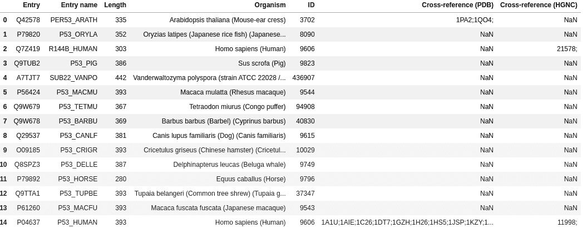
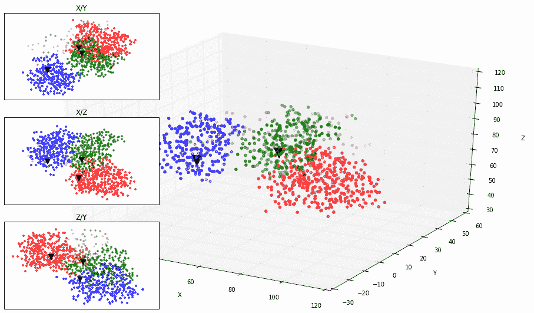
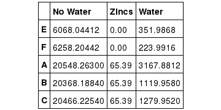
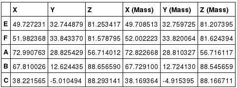
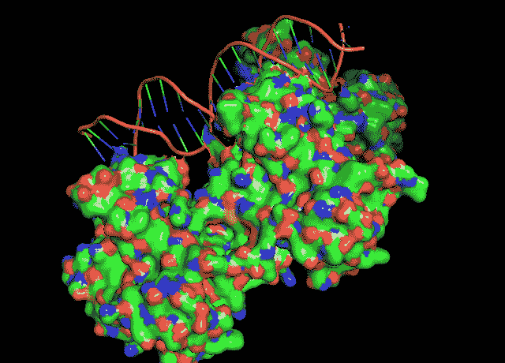
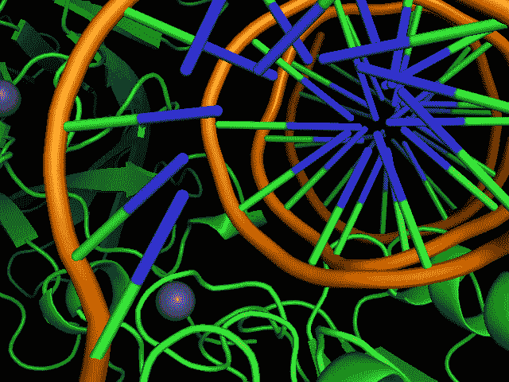
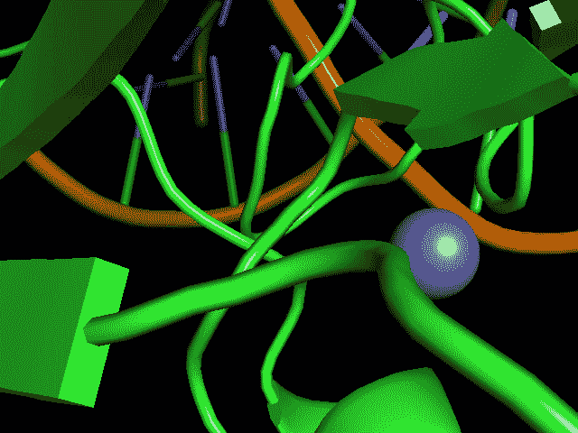
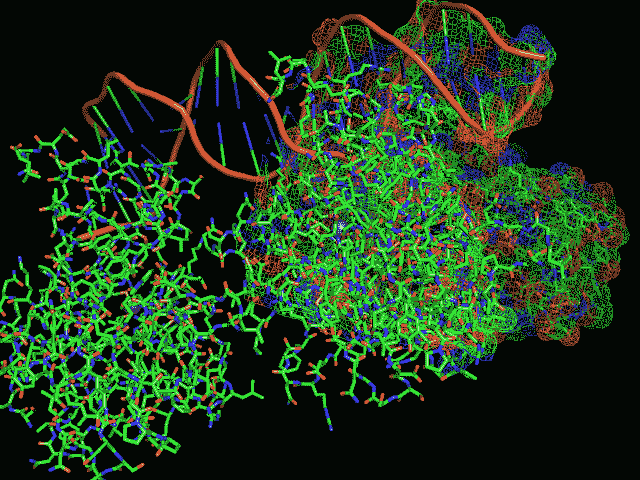

# 第九章：使用蛋白质数据银行

蛋白质组学是研究蛋白质的学科，包括蛋白质的功能和结构。该领域的主要目标之一是表征蛋白质的三维结构。在蛋白质组学领域，最广为人知的计算资源之一是**蛋白质数据银行**（**PDB**），这是一个包含大分子生物体结构数据的数据库。当然，也有许多数据库专注于蛋白质的初级结构；这些数据库与我们在*第二章*中看到的基因组数据库有些相似，*了解 NumPy、pandas、Arrow 和 Matplotlib*。

在本章中，我们将主要关注如何处理来自 PDB 的数据。我们将学习如何解析 PDB 文件，执行一些几何计算，并可视化分子。我们将使用旧的 PDB 文件格式，因为从概念上讲，它允许你在一个稳定的环境中执行大多数必要的操作。话虽如此，新的 mmCIF 格式计划取代 PDB 格式，在*使用 Biopython 解析 mmCIF 文件*的食谱中也会介绍它。我们将使用 Biopython 并介绍 PyMOL 用于可视化。我们不会在这里讨论分子对接，因为那更适合一本关于化学信息学的书。

在本章中，我们将使用一个经典的蛋白质例子：肿瘤蛋白 p53，它参与细胞周期的调节（例如，凋亡）。该蛋白质与癌症关系密切。网上有大量关于该蛋白质的信息。

让我们从你现在应该更熟悉的内容开始：访问数据库，特别是获取蛋白质的初级结构（即氨基酸序列）。

在本章中，我们将介绍以下内容：

+   在多个数据库中查找蛋白质

+   介绍 Bio.PDB

+   从 PDB 文件中提取更多信息

+   在 PDB 文件中计算分子距离

+   执行几何操作

+   使用 PyMOL 进行动画制作

+   使用 Biopython 解析 mmCIF 文件

# 在多个数据库中查找蛋白质

在我们开始进行更多的结构生物学工作之前，我们将看看如何访问现有的蛋白质组学数据库，比如 UniProt。我们将查询 UniProt 以查找我们感兴趣的基因，*TP53*，并从那里开始。

## 做好准备

为了访问数据，我们将使用 Biopython 和 REST API（我们在*第五章*中使用了类似的方法，*基因组学工作*）以及`requests`库来访问 Web API。`requests` API 是一个易于使用的 Web 请求封装库，可以通过标准的 Python 机制（例如，`pip`和`conda`）安装。你可以在`Chapter08/Intro.py`笔记本文件中找到这部分内容。

## 如何实现...

请查看以下步骤：

1.  首先，我们来定义一个函数来执行对 UniProt 的 REST 查询，代码如下：

    ```py
    import requests
    server = 'http://www.uniprot.org/uniprot'
    def do_request(server, ID='', **kwargs):
        params = ''
        req = requests.get('%s/%s%s' % (server, ID, params), params=kwargs)
        if not req.ok:
            req.raise_for_status()
        return req
    ```

1.  现在，我们可以查询所有已审阅的`p53`基因：

    ```py
    req = do_request(server, query='gene:p53 AND reviewed:yes', format='tab',
     columns='id,entry name,length,organism,organism-id,database(PDB),database(HGNC)',
     limit='50')
    ```

我们将查询`p53`基因，并请求查看所有已审核的条目（即，手动校对过的）。输出将以表格格式显示。我们将请求最多 50 个结果，并指定所需的列。

我们本可以将输出限制为仅包含人类数据，但为了这个示例，我们将包括所有可用的物种。

1.  让我们查看结果，内容如下：

    ```py
    import pandas as pd
    import io
    uniprot_list = pd.read_table(io.StringIO(req.text))
    uniprot_list.rename(columns={'Organism ID': 'ID'}, inplace=True)
    print(uniprot_list)
    ```

我们使用`pandas`来轻松处理制表符分隔的列表并进行美观打印。笔记本的简化输出如下：



图 8.1 - 一个简化的 TP53 蛋白物种列表

1.  现在，我们可以获取人类`p53`基因 ID，并使用 Biopython 检索并解析`SwissProt`记录：

    ```py
    from Bio import ExPASy, SwissProt
    p53_human = uniprot_list[
        (uniprot_list.ID == 9606) &
        (uniprot_list['Entry name'].str.contains('P53'))]['Entry'].iloc[0] 
    handle = ExPASy.get_sprot_raw(p53_human)
    sp_rec = SwissProt.read(handle)
    ```

然后，我们使用 Biopython 的`SwissProt`模块来解析记录。`9606`是人类的 NCBI 分类代码。

和往常一样，如果网络服务出现错误，可能是网络或服务器问题。如果是这样，请稍后再试。

1.  让我们来看一下`p53`记录，内容如下：

    ```py
    print(sp_rec.entry_name, sp_rec.sequence_length, sp_rec.gene_name)
    print(sp_rec.description)
    print(sp_rec.organism, sp_rec.seqinfo)
    print(sp_rec.sequence)
    print(sp_rec.comments)
    print(sp_rec.keywords)
    ```

输出如下：

```py
P53_HUMAN 393 Name=TP53; Synonyms=P53;
 RecName: Full=Cellular tumor antigen p53; AltName: Full=Antigen NY-CO-13; AltName: Full=Phosphoprotein p53; AltName: Full=Tumor suppressor p53;
 Homo sapiens (Human). (393, 43653, 'AD5C149FD8106131')
 MEEPQSDPSVEPPLSQETFSDLWKLLPENNVLSPLPSQAMDDLMLSPDDIEQWFTED PGPDEAPRMPEAAPPVAPAPAAPTPAAPAPAPSWPLSSSVPSQKTYQGSYGFRLGF LHSGTAKSVTCTYSPALNKMFCQLAKTCPVQLWVDSTPPPGTRVRAMAIYKQSQHM TEVVRRCPHHERCSDSDGLAPPQHLIRVEGNLRVEYLDDRNTFRHSVVVPYEPPEVG SDCTTIHYNYMCNSSCMGGMNRRPILTIITLEDSSGNLLGRNSFEVRVCACPGRDRR TEEENLRKKGEPHHELPPGSTKRALPNNTSSSPQPKKKPLDGEYFTLQIRGRERFEM FRELNEALELKDAQAGKEPGGSRAHSSHLKSKKGQSTSRHKKLMFKTEGPDSD
```

1.  更深入地查看前面的记录会发现许多非常有趣的信息，特别是在特征、`cross_references`方面：

    ```py
    from collections import defaultdict
    done_features = set()
    print(len(sp_rec.features))
    for feature in sp_rec.features:
        if feature[0] in done_features:
            continue
        else:
            done_features.add(feature[0])
            print(feature)
    print(len(sp_rec.cross_references))
    per_source = defaultdict(list)
    for xref in sp_rec.cross_references:
        source = xref[0]
        per_source[source].append(xref[1:])
    print(per_source.keys())
    done_GOs = set()
    print(len(per_source['GO']))
    for annot in per_source['GO']:
        if annot[1][0] in done_GOs:
            continue
        else:
            done_GOs.add(annot[1][0])
            print(annot)
    ```

请注意，我们这里并没有打印所有的信息，仅仅是一个摘要。我们打印了序列的多个特征，每种类型展示一个例子，还有一些外部数据库的引用，以及提到的数据库，还有一些 GO 条目，并附上了三个例子。目前，仅这个蛋白质就有 1,509 个特征、923 个外部引用和 173 个 GO 术语。以下是输出的高度简化版本：

```py
Total features: 1509
type: CHAIN
location: [0:393]
id: PRO_0000185703
qualifiers:
    Key: note, Value: Cellular tumor antigen p53
type: DNA_BIND
location: [101:292]
qualifiers:
type: REGION
location: [0:320]
qualifiers:
    Key: evidence, Value: ECO:0000269|PubMed:25732823
    Key: note, Value: Interaction with CCAR2
[...]
Cross references:  923
dict_keys(['EMBL', 'CCDS', 'PIR', 'RefSeq', 'PDB', 'PDBsum', 'BMRB', 'SMR', 'BioGRID', 'ComplexPortal', 'CORUM', 'DIP', 'ELM', 'IntAct', 'MINT', 'STRING', 'BindingDB', 'ChEMBL', 'DrugBank', 'MoonDB', 'TCDB', 'GlyGen', 'iPTMnet', 'MetOSite', 'PhosphoSitePlus', 'BioMuta', 'DMDM', 'SWISS-2DPAGE', 'CPTAC', 'EPD', 'jPOST', 'MassIVE', 'MaxQB', 'PaxDb', 'PeptideAtlas', 'PRIDE', 'ProteomicsDB', 'ABCD', 'Antibodypedia', 'CPTC', 'DNASU', 'Ensembl', 'GeneID', 'KEGG', 'MANE-Select', 'UCSC', 'CTD', 'DisGeNET', 'GeneCards', 'GeneReviews', 'HGNC', 'HPA', 'MalaCards', 'MIM', 'neXtProt', 'OpenTargets', 'Orphanet', 'PharmGKB', 'VEuPathDB', 'eggNOG', 'GeneTree', 'InParanoid', 'OMA', 'OrthoDB', 'PhylomeDB', 'TreeFam', 'PathwayCommons', 'Reactome', 'SABIO-RK', 'SignaLink', 'SIGNOR', 'BioGRID-ORCS', 'ChiTaRS', 'EvolutionaryTrace', 'GeneWiki', 'GenomeRNAi', 'Pharos', 'PRO', 'Proteomes', 'RNAct', 'Bgee', 'ExpressionAtlas', 'Genevisible', 'GO', 'CDD', 'DisProt', 'Gene3D', 'IDEAL', 'InterPro', 'PANTHER', 'Pfam', 'PRINTS', 'SUPFAM', 'PROSITE'])
Annotation SOURCES: 173
('GO:0005813', 'C:centrosome', 'IDA:UniProtKB')
('GO:0036310', 'F:ATP-dependent DNA/DNA annealing activity', 'IDA:UniProtKB')
('GO:0006914', 'P:autophagy', 'IMP:CAFA')
```

## 更多内容

还有更多关于蛋白质的信息数据库——其中一些在前面的记录中已有提到。你可以探索其结果，尝试在其他地方查找数据。有关 UniProt REST 接口的详细信息，请参考[`www.uniprot.org/help/programmatic_access`](http://www.uniprot.org/help/programmatic_access)。

# 介绍 Bio.PDB

在这里，我们将介绍 Biopython 的`PDB`模块，用于处理 PDB 文件。我们将使用三个模型，这些模型代表`p53`蛋白的部分结构。你可以在[`www.rcsb.org/pdb/101/motm.do?momID=31`](http://www.rcsb.org/pdb/101/motm.do?momID=31)了解更多关于这些文件和`p53`的信息。

## 准备工作

你应该已经了解了基本的`PDB`数据模型，包括模型、链、残基和原子对象。关于*Biopython 的结构生物信息学 FAQ*的详细解释可以在[`biopython.org/wiki/The_Biopython_Structural_Bioinformatics_FAQ`](http://biopython.org/wiki/The_Biopython_Structural_Bioinformatics_FAQ)找到。

你可以在`Chapter08/PDB.py`笔记本文件中找到这些内容。

在我们将要下载的三个模型中，`1TUP`模型将用于接下来的所有示例。花点时间研究这个模型，它将在后续帮助你。

## 如何操作……

请看以下步骤：

1.  首先，让我们检索我们感兴趣的模型，如下所示：

    ```py
    from Bio import PDB
    repository = PDB.PDBList()
    repository.retrieve_pdb_file('1TUP', pdir='.', file_format='pdb')
    repository.retrieve_pdb_file('1OLG', pdir='.', file_format='pdb')
    repository.retrieve_pdb_file('1YCQ', pdir='.', file_format='pdb')
    ```

请注意，`Bio.PDB`会为您下载文件。此外，只有在没有本地副本的情况下才会进行这些下载。

1.  让我们解析我们的记录，如下所示的代码：

    ```py
    parser = PDB.PDBParser()
    p53_1tup = parser.get_structure('P 53 - DNA Binding', 'pdb1tup.ent')
    p53_1olg = parser.get_structure('P 53 - Tetramerization', 'pdb1olg.ent')
    p53_1ycq = parser.get_structure('P 53 - Transactivation', 'pdb1ycq.ent')
    ```

您可能会收到有关文件内容的一些警告。这些通常不会有问题。

1.  让我们检查我们的头文件，如下所示：

    ```py
    def print_pdb_headers(headers, indent=0):
       ind_text = ' ' * indent
       for header, content in headers.items():
           if type(content) == dict:
              print('\n%s%20s:' % (ind_text, header))
              print_pdb_headers(content, indent + 4)
              print()
           elif type(content) == list:
              print('%s%20s:' % (ind_text, header))
              for elem in content:
                  print('%s%21s %s' % (ind_text, '->', elem))
          else:
              print('%s%20s: %s' % (ind_text, header, content))
    print_pdb_headers(p53_1tup.header)
    ```

头文件被解析为字典的字典。因此，我们将使用递归函数来解析它们。此函数将增加缩进以便于阅读，并使用`->`前缀注释元素列表。有关递归函数的示例，请参见前一章，*第七章*，*系统发生学*。有关 Python 中递归的高级讨论，请转到最后一章，*第十二章*，*生物信息学的函数式编程*。简化后的输出如下所示：

```py
                name: tumor suppressor p53 complexed with dna
                head: antitumor protein/dna
              idcode: 1TUP
     deposition_date: 1995-07-11
        release_date: 1995-07-11
    structure_method: x-ray diffraction
          resolution: 2.2
 structure_reference:
-> n.p.pavletich,k.a.chambers,c.o.pabo the dna-binding domain of p53 contains the four conserved regions and the major mutation hot spots genes dev. v. 7 2556 1993 issn 0890-9369 
              author: Y.Cho,S.Gorina,P.D.Jeffrey,N.P.Pavletich
            compound:
                       2:
misc: 
molecule: dna (5'-d(*ap*tp*ap*ap*tp*tp*gp*gp*gp*cp*ap*ap*gp*tp*cp*tp*a p*gp*gp*ap*a)-3') 
                       chain: f
                  engineered: yes
has_missing_residues: True
    missing_residues:
                   -> {'model': None, 'res_name': 'ARG', 'chain': 'A', 'ssseq': 290, 'insertion': None}
keywords: antigen p53, antitumor protein/dna complex
             journal: AUTH   Y.CHO,S.GORINA,P.D.JEFFREY,N.P.PAVLETICHTITL   CRYSTAL STRUCTURE OF A P53 TUMOR SUPPRESSOR-DNATITL 2 COMPLEX: UNDERSTANDING TUMORIGENIC MUTATIONS.REF    SCIENCE57
```

1.  我们想要知道这些文件中每条链的内容；为此，让我们看一下`COMPND`记录：

    ```py
    print(p53_1tup.header['compound'])
    print(p53_1olg.header['compound'])
    print(p53_1ycq.header['compound'])
    ```

这将打印出在前面的代码中列出的所有化合物头文件。不幸的是，这不是获取链信息的最佳方式。另一种方法是获取`DBREF`记录，但 Biopython 的解析器目前无法访问这些记录。话虽如此，使用诸如`grep`之类的工具将轻松提取这些信息。

注意，对于`1TUP`模型，链`A`、`B`和`C`来自蛋白质，而链`E`和`F`来自 DNA。这些信息将在未来很有用。

1.  让我们对每个`PDB`文件进行自上而下的分析。现在，让我们只获取所有的链、残基数和每条链中的原子数，如下所示：

    ```py
    def describe_model(name, pdb):
    print()
    for model in pdb:
        for chain in model:
            print('%s - Chain: %s. Number of residues: %d. Number of atoms: %d.' %
                  (name, chain.id, len(chain), len(list(chain.get_atoms()))))
    describe_model('1TUP', p53_1tup)
    describe_model('1OLG', p53_1olg)
    describe_model('1YCQ', p53_1ycq)
    ```

在稍后的配方中，我们将采用自下而上的方法。以下是`1TUP`的输出：

```py
1TUP - Chain: E. Number of residues: 43\. Number of atoms: 442.
1TUP - Chain: F. Number of residues: 35\. Number of atoms: 449.
1TUP - Chain: A. Number of residues: 395\. Number of atoms: 1734.
1TUP - Chain: B. Number of residues: 265\. Number of atoms: 1593.
1TUP - Chain: C. Number of residues: 276\. Number of atoms: 1610.

1OLG - Chain: A. Number of residues: 42\. Number of atoms: 698.
1OLG - Chain: B. Number of residues: 42\. Number of atoms: 698.
1OLG - Chain: C. Number of residues: 42\. Number of atoms: 698.
1OLG - Chain: D. Number of residues: 42\. Number of atoms: 698.

1YCQ - Chain: A. Number of residues: 123\. Number of atoms: 741.
1YCQ - Chain: B. Number of residues: 16\. Number of atoms: 100.
```

1.  让我们获取所有非标准残基（`HETATM`），除了水，在`1TUP`模型中，如下所示的代码：

    ```py
    for residue in p53_1tup.get_residues():
        if residue.id[0] in [' ', 'W']:
            continue
    print(residue.id)
    ```

我们有三个锌原子，每个蛋白链一个。

1.  让我们来看一个残基：

    ```py
    res = next(p53_1tup[0]['A'].get_residues())
    print(res)
    for atom in res:
        print(atom, atom.serial_number, atom.element)
    p53_1tup[0]['A'][94]['CA']
    ```

这将打印出某个残基中的所有原子：

```py
<Residue SER het=  resseq=94 icode= >
 <Atom N> 858 N
 <Atom CA> 859 C
 <Atom C> 860 C
 <Atom O> 861 O
 <Atom CB> 862 C
 <Atom OG> 863 O
 <Atom CA>
```

注意最后一句话。它只是为了向您展示，您可以通过解析模型、链、残基和最终原子来直接访问一个原子。

1.  最后，让我们将蛋白质片段导出到一个 FASTA 文件中，如下所示：

    ```py
    from Bio.SeqIO import PdbIO, FastaIO
    def get_fasta(pdb_file, fasta_file, transfer_ids=None):
        fasta_writer = FastaIO.FastaWriter(fasta_file)
        fasta_writer.write_header()
        for rec in PdbIO.PdbSeqresIterator(pdb_file):
            if len(rec.seq) == 0:
                continue
            if transfer_ids is not None and rec.id not in transfer_ids:
                continue
            print(rec.id, rec.seq, len(rec.seq))
            fasta_writer.write_record(rec)

    get_fasta(open('pdb1tup.ent'), open('1tup.fasta', 'w'), transfer_ids=['1TUP:B'])
    get_fasta(open('pdb1olg.ent'), open('1olg.fasta', 'w'), transfer_ids=['1OLG:B'])
    get_fasta(open('pdb1ycq.ent'), open('1ycq.fasta', 'w'), transfer_ids=['1YCQ:B'])
    ```

如果您检查蛋白质链，您会发现它们在每个模型中都是相等的，因此我们导出一个单独的链。在`1YCQ`的情况下，我们导出最小的一个，因为最大的一个与`p53`无关。正如您在这里看到的，我们使用的是`Bio.SeqIO`，而不是`Bio.PDB`。

## 还有更多

PDB 解析器不完整。很可能不会很快见到完整的解析器，因为社区正在迁移到 mmCIF 格式。

尽管未来是 mmCIF 格式（[`mmcif.wwpdb.org/`](http://mmcif.wwpdb.org/)），PDB 文件仍然存在。从概念上讲，文件解析后的许多操作是类似的。

# 从 PDB 文件中提取更多信息

在这里，我们将继续探索`Bio.PDB`从 PDB 文件生成的记录结构。

## 准备工作

有关我们正在使用的 PDB 模型的详细信息，请参见前面的章节。

你可以在`Chapter08/Stats.py` Notebook 文件中找到这些内容。

## 如何操作…

我们将通过以下步骤开始：

1.  首先，让我们提取`1TUP`，如下所示：

    ```py
    from Bio import PDB
    repository = PDB.PDBList()
    parser = PDB.PDBParser()
    repository.retrieve_pdb_file('1TUP', pdir='.', file_format='pdb') p53_1tup = parser.get_structure('P 53', 'pdb1tup.ent')
    ```

1.  然后，提取一些与原子相关的统计信息：

    ```py
    from collections import defaultdict
    atom_cnt = defaultdict(int)
    atom_chain = defaultdict(int)
    atom_res_types = defaultdict(int)
    for atom in p53_1tup.get_atoms():
        my_residue = atom.parent
        my_chain = my_residue.parent
        atom_chain[my_chain.id] += 1
        if my_residue.resname != 'HOH':
            atom_cnt[atom.element] += 1
        atom_res_types[my_residue.resname] += 1
    print(dict(atom_res_types))
    print(dict(atom_chain))
    print(dict(atom_cnt))
    ```

这将打印出原子残基类型、每条链的原子数量和每种元素的数量，如下所示：

```py
{' DT': 257, ' DC': 152, ' DA': 270, ' DG': 176, 'HOH': 384, 'SER': 323, 'VAL': 315, 'PRO': 294, 'GLN': 189, 'LYS': 135, 'THR': 294, 'TYR': 288, 'GLY': 156, 'PHE': 165, 'ARG': 561, 'LEU': 336, 'HIS': 210, 'ALA': 105, 'CYS': 180, 'ASN': 216, 'MET': 144, 'TRP': 42, 'ASP': 192, 'ILE': 144, 'GLU': 297, ' ZN': 3}
 {'E': 442, 'F': 449, 'A': 1734, 'B': 1593, 'C': 1610}
 {'O': 1114, 'C': 3238, 'N': 1001, 'P': 40, 'S': 48, 'ZN': 3}
```

请注意，前面提到的残基数不是正确的残基数，而是某个残基类型被引用的次数（它加起来等于原子数，而不是残基数）。

注意水（`W`）、核苷酸（`DA`，`DC`，`DG`，`DT`）和锌（`ZN`）残基，它们与氨基酸残基一起出现。

1.  现在，让我们统计每个残基的实例数量和每条链的残基数量：

    ```py
    res_types = defaultdict(int)
    res_per_chain = defaultdict(int)
    for residue in p53_1tup.get_residues():
    res_types[residue.resname] += 1
    res_per_chain[residue.parent.id] +=1
    print(dict(res_types))
    print(dict(res_per_chain))
    ```

以下是输出结果：

```py
{' DT': 13, ' DC': 8, ' DA': 13, ' DG': 8, 'HOH': 384, 'SER': 54, 'VAL': 45, 'PRO': 42, 'GLN': 21, 'LYS': 15, 'THR': 42, 'TYR': 24, 'GLY': 39, 'PHE': 15, 'ARG': 51, 'LEU': 42, 'HIS': 21, 'ALA': 21, 'CYS': 30, 'ASN': 27, 'MET': 18, 'TRP': 3, 'ASP': 24, 'ILE': 18, 'GLU': 33, ' ZN': 3}
 {'E': 43, 'F': 35, 'A': 395, 'B': 265, 'C': 276}
```

1.  我们还可以获取一组原子的边界：

    ```py
    import sys
    def get_bounds(my_atoms):
        my_min = [sys.maxsize] * 3
        my_max = [-sys.maxsize] * 3
        for atom in my_atoms:
            for i, coord in enumerate(atom.coord):
                if coord < my_min[i]:
                    my_min[i] = coord
                if coord > my_max[i]:
                    my_max[i] = coord
        return my_min, my_max
    chain_bounds = {}
    for chain in p53_1tup.get_chains():
        print(chain.id, get_bounds(chain.get_atoms()))
        chain_bounds[chain.id] = get_bounds(chain.get_atoms())
    print(get_bounds(p53_1tup.get_atoms()))
    ```

一组原子可以是整个模型、一条链、一种残基或任何你感兴趣的子集。在这种情况下，我们将打印所有链条和整个模型的边界。数字表达不太直观，因此我们将采用更具图形化的方式。

1.  为了了解每条链的大小，绘图可能比前面代码中的数字更具信息量：

    ```py
    import matplotlib.pyplot as plt
    from mpl_toolkits.mplot3d import Axes3D
    fig = plt.figure(figsize=(16, 9))
    ax3d = fig.add_subplot(111, projection='3d')
    ax_xy = fig.add_subplot(331)
    ax_xy.set_title('X/Y')
    ax_xz = fig.add_subplot(334)
    ax_xz.set_title('X/Z')
    ax_zy = fig.add_subplot(337)
    ax_zy.set_title('Z/Y')
    color = {'A': 'r', 'B': 'g', 'C': 'b', 'E': '0.5', 'F': '0.75'}
    zx, zy, zz = [], [], []
    for chain in p53_1tup.get_chains():
        xs, ys, zs = [], [], []
        for residue in chain.get_residues():
            ref_atom = next(residue.get_iterator())
            x, y, z = ref_atom.coord
            if ref_atom.element == 'ZN':
                zx.append(x)
                zy.append(y)
                zz.append(z)
                continue
            xs.append(x)
            ys.append(y)
            zs.append(z)
        ax3d.scatter(xs, ys, zs, color=color[chain.id])
        ax_xy.scatter(xs, ys, marker='.', color=color[chain.id])
        ax_xz.scatter(xs, zs, marker='.', color=color[chain.id])
        ax_zy.scatter(zs, ys, marker='.', color=color[chain.id])
    ax3d.set_xlabel('X')
    ax3d.set_ylabel('Y')
    ax3d.set_zlabel('Z')
    ax3d.scatter(zx, zy, zz, color='k', marker='v', s=300)
    ax_xy.scatter(zx, zy, color='k', marker='v', s=80)
    ax_xz.scatter(zx, zz, color='k', marker='v', s=80)
    ax_zy.scatter(zz, zy, color='k', marker='v', s=80)
    for ax in [ax_xy, ax_xz, ax_zy]:
        ax.get_yaxis().set_visible(False)
        ax.get_xaxis().set_visible(False)
    ```

目前有很多分子可视化工具。实际上，我们稍后会讨论 PyMOL。不过，`matplotlib`对于简单的可视化已经足够了。关于`matplotlib`最重要的一点是它非常稳定，且容易集成到可靠的生产代码中。

在下图中，我们对链条进行了三维绘制，DNA 部分为灰色，蛋白质链条用不同颜色表示。我们还在下图的左侧绘制了平面投影（**X/Y**，**X/Z**，和**Z/Y**）：



图 8.2 - 蛋白质链的空间分布——主图是一个 3D 图，左侧子图是平面视图（X/Y，X/Z，和 Z/Y）

# 计算 PDB 文件中的分子距离

在这里，我们将找到与`1TUP`模型中三个锌原子接近的原子。我们将考虑这些锌原子之间的几种距离，并借此机会讨论算法的性能。

## 准备工作

你可以在`Chapter08/Distance.py` Notebook 文件中找到这些内容。

## 如何操作…

请查看以下步骤：

1.  让我们加载我们的模型，如下所示：

    ```py
    from Bio import PDB
    repository = PDB.PDBList()
    parser = PDB.PDBParser()
    repository.retrieve_pdb_file('1TUP', pdir='.', file_format='pdb')
    p53_1tup = parser.get_structure('P 53', 'pdb1tup.ent')
    ```

1.  现在，我们来提取锌原子，后续我们将以这些原子为基准进行比较：

    ```py
    zns = []for atom in p53_1tup.get_atoms():
    if atom.element == 'ZN':
    zns.append(atom)
    for zn in zns:
        print(zn, zn.coord)
    ```

你应该能看到三个锌原子。

1.  现在，让我们定义一个函数来获取一个原子与一组其他原子之间的距离，如下所示：

    ```py
    import math
    def get_closest_atoms(pdb_struct, ref_atom, distance):
        atoms = {}
        rx, ry, rz = ref_atom.coord
        for atom in pdb_struct.get_atoms():
            if atom == ref_atom:
                continue
            x, y, z = atom.coord
            my_dist = math.sqrt((x - rx)**2 + (y - ry)**2 + (z - rz)**2)
            if my_dist < distance:
                atoms[atom] = my_dist
        return atoms
    ```

我们获取参考原子的坐标，然后遍历我们希望比较的原子列表。如果某个原子足够接近，它会被添加到`return`列表中。

1.  现在我们计算接近锌原子的原子，距离在我们的模型中可以达到 4 埃（Å）：

    ```py
    for zn in zns:
        print()
        print(zn.coord)
        atoms = get_closest_atoms(p53_1tup, zn, 4)
        for atom, distance in atoms.items():
            print(atom.element, distance, atom.coord)
    ```

这里，我们展示了第一个锌原子的结果，包括元素、距离和坐标：

```py
[58.108 23.242 57.424]
 C 3.4080117696286854 [57.77  21.214 60.142]
 S 2.3262243799594877 [57.065 21.452 58.482]
 C 3.4566537492335123 [58.886 20.867 55.036]
 C 3.064120559761192 [58.047 22.038 54.607]
 N 1.9918273537290707 [57.755 23.073 55.471]
 C 2.9243719601324525 [56.993 23.943 54.813]
 C 3.857729198122736 [61.148 25.061 55.897]
 C 3.62725094648044 [61.61  24.087 57.001]
 S 2.2789209624943494 [60.317 23.318 57.979]
 C 3.087214470667822 [57.205 25.099 59.719]
 S 2.2253158446520818 [56.914 25.054 57.917]
```

我们只有三个锌原子，因此计算量大大减少。然而，假设我们有更多原子，或者我们在整个原子集之间进行成对比较（记住，在成对比较的情况下，比较次数是随着原子数量的平方增长的）。虽然我们的案例较小，但预测使用案例并不难，更多的比较会消耗大量时间。我们很快会回到这个问题。

1.  让我们看看随着距离增加，我们会得到多少原子：

    ```py
    for distance in [1, 2, 4, 8, 16, 32, 64, 128]:
        my_atoms = []
        for zn in zns:
            atoms = get_closest_atoms(p53_1tup, zn, distance)
            my_atoms.append(len(atoms))
        print(distance, my_atoms)
    ```

结果如下：

```py
1 [0, 0, 0]
2 [1, 0, 0]
4 [11, 11, 12]
8 [109, 113, 106]
16 [523, 721, 487]
32 [2381, 3493, 2053]
64 [5800, 5827, 5501]
128 [5827, 5827, 5827]
```

1.  如我们之前所见，这个特定的情况并不太昂贵，但我们还是计时看看：

    ```py
    import timeit
    nexecs = 10
    print(timeit.timeit('get_closest_atoms(p53_1tup, zns[0], 4.0)',
          'from __main__ import get_closest_atoms, p53_1tup, zns',
          number=nexecs) / nexecs * 1000)
    ```

在这里，我们将使用`timeit`模块执行这个函数 10 次，然后以毫秒为单位打印结果。我们将函数作为字符串传递，并传递另一个包含必要导入的字符串以使函数正常工作。在 Notebook 中，你可能知道`%timeit`魔法命令，它能让你的生活变得更加轻松。在测试代码的机器上，这大约需要 40 毫秒。显然，在你的电脑上，你会得到稍有不同的结果。

1.  我们能做得更好吗？让我们考虑一个不同的`distance`函数，如下面的代码所示：

    ```py
    def get_closest_alternative(pdb_struct, ref_atom, distance):
        atoms = {}
        rx, ry, rz = ref_atom.coord
        for atom in pdb_struct.get_atoms():
            if atom == ref_atom:
                continue
            x, y, z = atom.coord
            if abs(x - rx) > distance or abs(y - ry) > distance or abs(z - rz) > distance:
                continue
            my_dist = math.sqrt((x - rx)**2 + (y - ry)**2 + (z - rz)**2)
            if my_dist < distance:
                atoms[atom] = my_dist
        return atoms
    ```

所以，我们对原始函数进行修改，加入一个非常简单的`if`条件来处理距离。这样做的理由是，平方根计算和可能的浮点幂运算非常昂贵，因此我们将尽量避免它。然而，对于任何维度中距离小于目标距离的原子，这个函数会变得更加昂贵。

1.  现在，让我们来计时：

    ```py
    print(timeit.timeit('get_closest_alternative(p53_1tup, zns[0], 4.0)',
          'from __main__ import get_closest_alternative, p53_1tup, zns',
          number=nexecs) / nexecs * 1000)
    ```

在我们之前使用的同一台机器上，它需要 16 毫秒，这意味着它大约快了三倍。

1.  然而，这总是更好吗？让我们比较不同距离下的成本，如下所示：

    ```py
    print('Standard')
    for distance in [1, 4, 16, 64, 128]:
        print(timeit.timeit('get_closest_atoms(p53_1tup, zns[0], distance)',
              'from __main__ import get_closest_atoms, p53_1tup, zns, distance',
              number=nexecs) / nexecs * 1000)
    print('Optimized')
    for distance in [1, 4, 16, 64, 128]:
        print(timeit.timeit('get_closest_alternative(p53_1tup, zns[0], distance)',
              'from __main__ import get_closest_alternative, p53_1tup, zns, distance',
              number=nexecs) / nexecs * 1000)
    ```

结果显示在以下输出中：

```py
Standard
 85.08649739999328
 86.50681579999855
 86.79630599999655
 96.95437099999253
 96.21982420001132
 Optimized
 30.253444099980698
 32.69531210000878
 52.965772600009586
 142.53310030001103
 141.26269519999823
```

请注意，标准版本的成本大致是恒定的，而优化版本的成本则取决于最近原子的距离；距离越大，使用额外`if`和平方根进行计算的情况就越多，从而使得函数变得更昂贵。

这里的关键点是，你可能可以通过聪明的计算捷径编写更高效的函数，但复杂度成本可能会发生质的变化。在前面的例子中，我建议第二个函数在所有现实且有趣的情况下更高效，特别是在你尝试找到最接近的原子时。然而，在设计你自己的优化算法时，你必须小心。

# 执行几何操作

现在我们将使用几何信息进行计算，包括计算链条和整个模型的质心。

## 准备工作

你可以在 `Chapter08/Mass.py` 笔记本文件中找到这些内容。

## 如何操作...

让我们看一下以下步骤：

1.  首先，让我们获取数据：

    ```py
    from Bio import PDB
    repository = PDB.PDBList()
    parser = PDB.PDBParser()
    repository.retrieve_pdb_file('1TUP', pdir='.', file_format='pdb')
    p53_1tup = parser.get_structure('P 53', 'pdb1tup.ent')
    ```

1.  然后，使用以下代码回顾我们拥有的残基类型：

    ```py
    my_residues = set()
    for residue in p53_1tup.get_residues():
        my_residues.add(residue.id[0])
    print(my_residues)
    ```

所以，我们有 `H_ ZN`（锌）和 `W`（水），它们是 `HETATM` 类型；绝大多数是标准 PDB 原子。

1.  使用以下代码计算所有链条、锌和水的质量：

    ```py
    def get_mass(atoms, accept_fun=lambda atom: atom.parent.id[0] != 'W'):
        return sum([atom.mass for atom in atoms if accept_fun(atom)])
    chain_names = [chain.id for chain in p53_1tup.get_chains()]
    my_mass = np.ndarray((len(chain_names), 3))
    for i, chain in enumerate(p53_1tup.get_chains()):
        my_mass[i, 0] = get_mass(chain.get_atoms())
        my_mass[i, 1] = get_mass(chain.get_atoms(),
            accept_fun=lambda atom: atom.parent.id[0] not in [' ', 'W'])
        my_mass[i, 2] = get_mass(chain.get_atoms(),
            accept_fun=lambda atom: atom.parent.id[0] == 'W')
    masses = pd.DataFrame(my_mass, index=chain_names, columns=['No Water','Zincs', 'Water'])
    print(masses)
    ```

`get_mass` 函数返回通过接收标准函数筛选的列表中所有原子的质量。这里，默认的接收标准是排除水分子残基。

然后，我们计算所有链条的质量。我们有三个版本：只有氨基酸、锌和水。锌仅在此模型中检测每条链中的单个原子。输出结果如下：



图 8.3 - 所有蛋白质链的质量

1.  让我们计算模型的几何中心和质心，如下所示：

    ```py
    def get_center(atoms,
        weight_fun=lambda atom: 1 if atom.parent.id[0] != 'W' else 0):
        xsum = ysum = zsum = 0.0
        acum = 0.0
        for atom in atoms:
            x, y, z = atom.coord
            weight = weight_fun(atom)
            acum += weight
            xsum += weight * x
            ysum += weight * y
            zsum += weight * z
        return xsum / acum, ysum / acum, zsum / acum
    print(get_center(p53_1tup.get_atoms()))
    print(get_center(p53_1tup.get_atoms(),
        weight_fun=lambda atom: atom.mass if atom.parent.id[0] != 'W' else 0))
    ```

首先，我们定义一个加权函数来获取质心的坐标。默认的函数会将所有原子视为相等，只要它们不是水分子残基。

然后，我们通过重新定义 `weight` 函数，将每个原子的值设置为其质量，来计算几何中心和质心。几何中心的计算不考虑分子量。

例如，你可能想要计算没有 DNA 链的蛋白质的质心。

1.  让我们计算每个链条的质心和几何中心，如下所示：

    ```py
    my_center = np.ndarray((len(chain_names), 6))
    for i, chain in enumerate(p53_1tup.get_chains()):
        x, y, z = get_center(chain.get_atoms())
        my_center[i, 0] = x
        my_center[i, 1] = y
        my_center[i, 2] = z
        x, y, z = get_center(chain.get_atoms(),
            weight_fun=lambda atom: atom.mass if atom.parent.id[0] != 'W' else 0)
        my_center[i, 3] = x
        my_center[i, 4] = y
        my_center[i, 5] = z
    weights = pd.DataFrame(my_center, index=chain_names,
        columns=['X', 'Y', 'Z', 'X (Mass)', 'Y (Mass)', 'Z (Mass)'])
    print(weights)
    ```

结果如图所示：



图 8.4 - 每个蛋白质链的质心和几何中心

## 还有更多

虽然这本书不是基于蛋白质结构解析技术的，但需要记住的是，X 射线晶体学方法无法检测氢原子，因此残基的质量计算可能基于非常不准确的模型；有关更多信息，请参阅 [`www.umass.edu/microbio/chime/pe_beta/pe/protexpl/help_hyd.htm`](http://www.umass.edu/microbio/chime/pe_beta/pe/protexpl/help_hyd.htm)。

# 使用 PyMOL 动画

在这里，我们将创建一个关于 p53 `1TUP` 模型的视频。为此，我们将使用 PyMOL 可视化库。我们将通过移动 p53 `1TUP` 模型开始动画，然后进行缩放；随着缩放，我们改变渲染策略，以便可以更深入地观察模型。你可以在 [`odysee.com/@Python:8/protein_video:8`](https://odysee.com/@Python:8/protein_video:8%20) 找到你将生成的视频版本。

## 准备工作

这个配方将以 Python 脚本的形式呈现，而不是以 Notebook 的形式。这主要是因为输出不是交互式的，而是一组需要进一步后期处理的图像文件。

你需要安装 PyMOL（[`www.pymol.org`](http://www.pymol.org)）。在 Debian、Ubuntu 或 Linux 系统中，你可以使用`apt-get install pymol`命令。如果你使用的是 Conda，我建议不要使用它，因为依赖项会很容易解决——而且你将安装一个仅限 30 天试用的版本，需要许可证，而上述版本是完全开源的。如果你不是使用 Debian 或 Linux，我建议你安装适用于你操作系统的开源版本。

PyMOL 更多是一个交互式程序，而非 Python 库，因此我强烈建议你在继续操作前先进行一些探索。这可以是很有趣的！这个配方的代码可以在 GitHub 仓库中找到，作为脚本文件以及本章的 Notebook 文件，位于`Chapter08`。我们将在这个配方中使用`PyMol_Movie.py`文件。

## 如何操作...

请查看以下步骤：

1.  让我们初始化并获取我们的 PDB 模型，并准备渲染，如下所示：

    ```py
    import pymol
    from pymol import cmd
    #pymol.pymol_argv = ['pymol', '-qc'] # Quiet / no GUI
    pymol.finish_launching()
    cmd.fetch('1TUP', async=False)
    cmd.disable('all')
    cmd.enable('1TUP')
    cmd.hide('all')
    cmd.show('sphere', 'name zn')
    ```

请注意，`pymol_argv`这一行会使代码保持静默。在第一次执行时，你可能想要注释掉这行代码，看看用户界面。

对于电影渲染，这将非常有用（如我们将很快看到的）。作为一个库，PyMOL 的使用相当复杂。例如，导入后，你需要调用`finish_launching`。接着，我们获取我们的 PDB 文件。

接下来是一些 PyMOL 命令。许多关于交互式使用的网页指南对于理解发生的事情非常有帮助。在这里，我们将启用所有模型以供查看，隐藏所有模型（因为默认视图是线条表示，这样不够好），然后将锌渲染为球体。

在这个阶段，除锌外，其他都不可见。

1.  为了渲染我们的模型，我们将使用以下三个场景：

    ```py
    cmd.show('surface', 'chain A+B+C')
    cmd.show('cartoon', 'chain E+F')
    cmd.scene('S0', action='store', view=0, frame=0, animate=-1)
    cmd.show('cartoon')
    cmd.hide('surface')
    cmd.scene('S1', action='store', view=0, frame=0, animate=-1)
    cmd.hide('cartoon', 'chain A+B+C')
    cmd.show('mesh', 'chain A')
    cmd.show('sticks', 'chain A+B+C')
    cmd.scene('S2', action='store', view=0, frame=0, animate=-1)
    ```

我们需要定义两个场景。一个场景对应于我们围绕蛋白质移动（基于表面，因此是透明的），另一个场景则对应于我们深入观察（基于卡通式）。DNA 始终以卡通形式渲染。

我们还定义了第三个场景，当我们在最后进行缩小时使用。蛋白质将被渲染为棒状，并且我们将给 A 链添加一个网格，以便更清楚地展示它与 DNA 的关系。

1.  让我们定义视频的基本参数，如下所示：

    ```py
    cmd.set('ray_trace_frames', 0)
    cmd.mset(1, 500)
    ```

我们定义了默认的光线追踪算法。这一行并非必需，但请尝试将数字增加到`1`、`2`或`3`，并准备好等待很长时间。

如果你打开了 OpenGL 接口（即图形界面），那么只能使用`0`，因此对于这个快速版本，你需要打开 GUI（`pymol_argv`应该保持注释状态）。

然后，我们通知 PyMOL 我们将使用 500 帧。

1.  在前 150 帧中，我们使用初始场景围绕蛋白质移动。我们稍微环绕模型，然后使用以下代码接近 DNA。

    ```py
    cmd.frame(0)
    cmd.scene('S0')
    cmd.mview()
    cmd.frame(60)
    cmd.set_view((-0.175534308,   -0.331560850,   -0.926960170,
                 0.541812420,     0.753615797,   -0.372158051,
                 0.821965039,    -0.567564785,    0.047358301,
                 0.000000000,     0.000000000, -249.619018555,
                 58.625568390,   15.602619171,   77.781631470,
                 196.801528931, 302.436492920,  -20.000000000))
    cmd.mview()
    cmd.frame(90)
    cmd.set_view((-0.175534308,   -0.331560850,   -0.926960170,
                  0.541812420,    0.753615797,   -0.372158051,
                  0.821965039,   -0.567564785,    0.047358301,
                  -0.000067875,    0.000017881, -249.615447998,
                  54.029174805,   26.956727982,   77.124832153,
                 196.801528931,  302.436492920,  -20.000000000))
    cmd.mview()
    cmd.frame(150)
    cmd.set_view((-0.175534308,   -0.331560850,   -0.926960170,
                  0.541812420,    0.753615797,   -0.372158051,
                  0.821965039,   -0.567564785,    0.047358301,
                  -0.000067875,    0.000017881,  -55.406421661,
                  54.029174805,   26.956727982,   77.124832153,
                  2.592475891,  108.227416992,  -20.000000000))
    cmd.mview()
    ```

我们定义了三个点；前两个点与 DNA 对齐，最后一个点进入其中。我们通过在交互模式下使用 PyMOL，使用鼠标和键盘导航，并使用 `get_view` 命令来获取坐标（所有这些数字），然后可以剪切并粘贴。

第一个帧如下所示：



图 8.5 - 第 0 帧和场景 DS0

1.  我们现在更改场景，为进入蛋白质内部做准备：

    ```py
    cmd.frame(200)
    cmd.scene('S1')
    cmd.mview()
    ```

以下截图显示了当前的位置：



图 8.6 - DNA 分子附近的第 200 帧和场景 S1

1.  我们进入蛋白质内部，并在结束时使用以下代码更改场景：

    ```py
    cmd.frame(350)
    cmd.scene('S1')
    cmd.set_view((0.395763457,   -0.173441306,    0.901825786,
                  0.915456235,    0.152441502,   -0.372427106,
                 -0.072881661,    0.972972929,    0.219108686,
                  0.000070953,    0.000013039,  -37.689743042,
                 57.748500824,   14.325904846,   77.241867065,
                 -15.123448372,   90.511535645,  -20.000000000))
    cmd.mview()
    cmd.frame(351)
    cmd.scene('S2')
    cmd.mview()
    ```

我们现在完全进入其中，如以下截图所示：



图 8.7 - 第 350 帧 - 场景 S1 即将更改为 S2

1.  最后，我们让 PyMOL 返回到原始位置，然后播放、保存并退出：

    ```py
    cmd.frame(500)
    cmd.scene('S2')
    cmd.mview()
    cmd.mplay()
    cmd.mpng('p53_1tup')
    cmd.quit()
    ```

这将生成 500 个以 `p53_1tup` 为前缀的 PNG 文件。

这是一个接近结束的帧（450）：



图 8.8 - 第 450 帧和场景 S2

## 还有更多

该 YouTube 视频是在 Linux 上使用 `ffmpeg` 以每秒 `15` 帧的速度生成的，如下所示：

```py
ffmpeg -r 15 -f image2 -start_number 1 -i "p53_1tup%04d.png" example.mp4
```

有很多应用程序可以用来从图像生成视频。PyMOL 可以生成 MPEG 格式的视频，但需要安装额外的库。

PyMOL 是为从其控制台交互式使用而创建的（可以在 Python 中扩展）。反向使用（从 Python 导入且没有图形界面）可能会变得复杂且令人沮丧。PyMOL 启动一个单独的线程来渲染图像，这些图像异步工作。

例如，这意味着你的代码可能与渲染器的位置不同。我已经在 GitHub 仓库中放了另一个名为 `PyMol_Intro.py` 的脚本；你会看到第二个 PNG 调用将在第一个还没有完成之前就开始。试试这个脚本代码，看看它应该如何运行，以及它实际是如何运行的。

从 GUI 角度来看，PyMOL 有很多优秀的文档，访问 [`www.pymolwiki.org/index.php/MovieSchool`](http://www.pymolwiki.org/index.php/MovieSchool) 可以获得。 如果你想制作电影，这是一个很好的起点，[`www.pymolwiki.org`](http://www.pymolwiki.org) 是一个信息的宝库。

# 使用 Biopython 解析 mmCIF 文件

mmCIF 文件格式可能是未来的趋势。Biopython 目前还没有完全支持它的功能，但我们将看看当前有哪些功能。

## 正在准备

由于`Bio.PDB`不能自动下载 mmCIF 文件，你需要获取你的蛋白质文件并将其重命名为`1tup.cif`。它可以在[`github.com/PacktPublishing/Bioinformatics-with-Python-Cookbook-third-Edition/blob/master/Datasets.py`](https://github.com/PacktPublishing/Bioinformatics-with-Python-Cookbook-third-Edition/blob/master/Datasets.py)中的`1TUP.cif`找到。

你可以在`Chapter08/mmCIF.py`笔记本文件中找到这些内容。

## 如何操作...

看一下以下步骤：

1.  让我们解析文件。我们只需使用 MMCIF 解析器，而不是 PDB 解析器：

    ```py
    from Bio import PDB
    parser = PDB.MMCIFParser()
    p53_1tup = parser.get_structure('P53', '1tup.cif')
    ```

1.  让我们检查以下链条：

    ```py
    def describe_model(name, pdb):
        print()
        for model in p53_1tup:
            for chain in model:
                print('%s - Chain: %s. Number of residues: %d. Number of atoms: %d.' %
                      (name, chain.id, len(chain), len(list(chain.get_atoms()))))
    describe_model('1TUP', p53_1tup)
    ```

输出将如下所示：

```py
1TUP - Chain: E. Number of residues: 43\. Number of atoms: 442.
1TUP - Chain: F. Number of residues: 35\. Number of atoms: 449.
1TUP - Chain: A. Number of residues: 395\. Number of atoms: 1734.
1TUP - Chain: B. Number of residues: 265\. Number of atoms: 1593.
1TUP - Chain: C. Number of residues: 276\. Number of atoms: 1610.
```

1.  许多字段在解析的结构中不可用，但可以通过使用更低级别的字典来检索这些字段，如下所示：

    ```py
    mmcif_dict = PDB.MMCIF2Dict.MMCIF2Dict('1tup.cif')
    for k, v in mmcif_dict.items():
        print(k, v)
        print()
    ```

不幸的是，这个列表很大，需要一些后处理才能理解它，但它是可以获得的。

## 还有更多内容

你仍然可以获取来自 Biopython 提供的 mmCIF 文件的所有模型信息，因此解析器仍然非常有用。我们可以预期`mmCIF`解析器会有更多的开发，而不是`PDB`解析器。

这有一个 Python 库，由 PDB 的开发者提供，网址为[`mmcif.wwpdb.org/docs/sw-examples/python/html/index.xhtml`](http://mmcif.wwpdb.org/docs/sw-examples/python/html/index.xhtml)。
