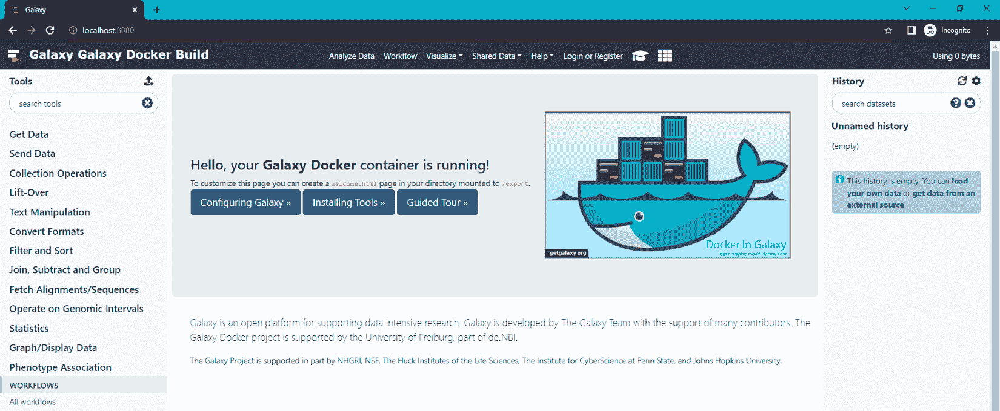
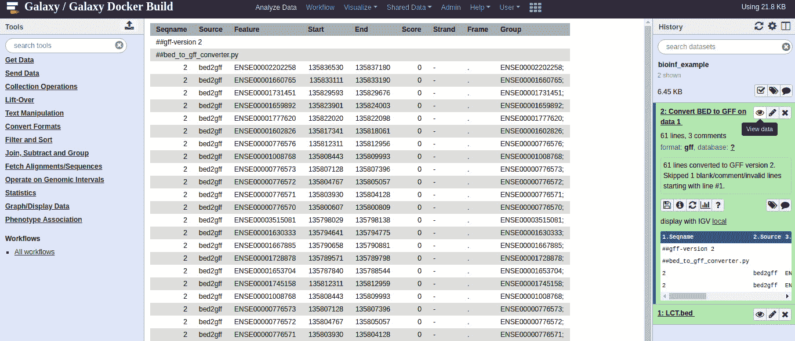
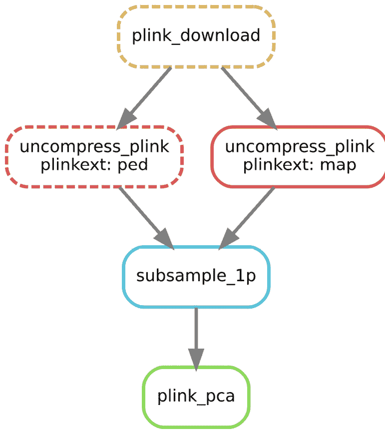
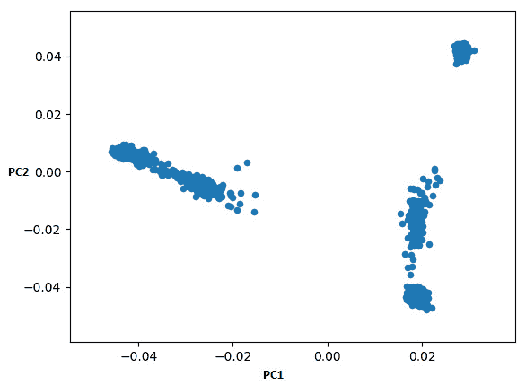

# 第十章：生物信息学管道

管道在任何数据科学环境中都至关重要。数据处理从来不是一项单一的任务。许多管道是通过临时脚本实现的。虽然这种方式可以有效使用，但在许多情况下，它们未能满足几个基本视角，主要是可重复性、可维护性和可扩展性。

在生物信息学中，您可以找到三种主要类型的管道系统：

+   像 Galaxy ([`usegalaxy.org`](https://usegalaxy.org)) 这样的框架，专为用户设计，即它们提供了易于使用的用户界面，并隐藏了大部分底层机制。

+   编程工作流 — 针对代码接口的工作流，虽然是通用的，但来源于生物信息学领域。两个例子是 Snakemake ([`snakemake.readthedocs.io/`](https://snakemake.readthedocs.io/)) 和 Nextflow ([`www.nextflow.io/`](https://www.nextflow.io/))。

+   完全通用的工作流系统，例如 Apache Airflow ([`airflow.incubator.apache.org/`](https://airflow.incubator.apache.org/))，它采用一种不太以数据为中心的工作流管理方式。

在本章中，我们将讨论 Galaxy，尤其是对于那些支持不太倾向于编写代码解决方案的用户的生物信息学专家而言，Galaxy 尤为重要。虽然您可能不是这些管道系统的典型用户，但您仍然可能需要为它们提供支持。幸运的是，Galaxy 提供了 API，这是我们主要关注的内容。

我们还将讨论 Snakemake 和 Nextflow 作为通用工作流工具，这些工具有编程接口，最初来源于生物信息学领域。我们将涵盖这两种工具，因为它们是该领域中最常见的工具。我们将用 Snakemake 和 Nextflow 解决一个类似的生物信息学问题。我们将体验这两个框架，并希望能够决定哪个是我们的最爱。

这些配方的代码不是以笔记本的形式呈现，而是作为 Python 脚本，存放在本书仓库的`Chapter09`目录下。

本章中，您将找到以下配方：

+   介绍 Galaxy 服务器

+   使用 API 访问 Galaxy

+   使用 Snakemake 开发变异分析管道

+   使用 Nextflow 开发变异分析管道

# 介绍 Galaxy 服务器

Galaxy ([`galaxyproject.org/tutorials/g101/`](https://galaxyproject.org/tutorials/g101/)) 是一个开源系统，旨在帮助非计算用户进行计算生物学研究。它是目前最广泛使用且用户友好的管道系统。任何用户都可以在服务器上安装 Galaxy，但网络上也有许多公开访问的其他服务器，其中最著名的是 [`usegalaxy.org`](http://usegalaxy.org)。

接下来食谱的重点将是 Galaxy 的编程方面：使用 Galaxy API 进行接口连接，以及开发 Galaxy 工具以扩展其功能。在开始之前，强烈建议你先作为用户使用 Galaxy。你可以通过在[`usegalaxy.org`](http://usegalaxy.org)创建一个免费账户并稍作体验来实现这一点。建议你了解工作流的基本知识。

## 准备就绪

在此食谱中，我们将使用 Docker 在本地安装 Galaxy 服务器。因此，需要一个本地 Docker 安装。不同操作系统的复杂度不同：在 Linux 上容易，在 macOS 上中等，在 Windows 上中到难。

此安装推荐用于接下来的两个食谱，但你也可以使用现有的公共服务器。请注意，公共服务器的接口可能会随时间变化，因此今天有效的内容明天可能会失效。如何使用公共服务器来执行接下来的两个食谱的说明，详见*更多信息...*部分。

## 如何操作…

看一下以下步骤。这些步骤假设你已经启用了 Docker 命令行：

1.  首先，我们使用以下命令拉取 Galaxy Docker 镜像：

    ```py
    docker pull bgruening/galaxy-stable:20.09
    ```

这将拉取 Björn Grüning 的精彩 Docker Galaxy 镜像。请使用`20.09`标签，如前面命令所示；任何更新的版本可能会破坏此食谱和下一个食谱。

1.  在系统上创建一个目录。此目录将保存 Docker 容器在多次运行中的持久输出。

注意

Docker 容器对于磁盘空间是临时的。这意味着当你停止容器时，所有磁盘上的更改都会丢失。可以通过在 Docker 中挂载来自主机的卷来解决此问题，如下一个步骤所示。挂载卷中的所有内容将会持久化。

1.  现在我们可以通过以下命令运行镜像：

    ```py
    docker run -d -v YOUR_DIRECTORY:/export -p 8080:80 -p 8021:21 bgruening/galaxy-stable:20.09
    ```

将`YOUR_DIRECTORY`替换为你在*步骤 2*中创建的目录的完整路径。如果前面的命令失败，请确保你有权限运行 Docker。不同操作系统的权限设置可能不同。

1.  检查`YOUR_DIRECTORY`中的内容。第一次运行镜像时，它会创建所有需要的文件，以便在 Docker 运行之间持久化执行。这意味着会保持用户数据库、数据集和工作流。

将浏览器指向`http://localhost:8080`。如果遇到任何错误，稍等几秒钟。你应该能看到如下屏幕：



图 9.1 - Galaxy Docker 首页

1.  现在使用默认的用户名和密码组合：`admin`和`password`，登录（参见顶部栏）。

1.  从顶部菜单中选择**用户**，然后选择**首选项**。

1.  现在，选择**管理 API 密钥**。

不要更改 API 密钥。前面的练习目的是让你知道 API 密钥的位置。在实际场景中，你需要进入这个页面获取你的密钥。请记下 API 密钥：`fakekey`。顺便说一句，正常情况下，这将是一个 MD5 哈希。

到目前为止，我们已经在服务器上安装了以下（默认）凭据：用户为`admin`，密码为`password`，API 密钥为`fakekey`。访问点是`localhost:8080`。

## 还有更多内容

Björn Grüning 的镜像将在本章中使用的方式相当简单；毕竟，这不是一本关于系统管理或 DevOps 的书，而是一本关于编程的书。如果你访问[`github.com/bgruening/docker-galaxy-stable`](https://github.com/bgruening/docker-galaxy-stable)，你会看到有无数种配置镜像的方式，而且都有详细的文档。在这里，我们简单的方法足够满足我们的开发需求。

如果你不想在本地计算机上安装 Galaxy，可以使用公共服务器，例如[`usegalaxy.org`](https://usegalaxy.org)来进行下一步操作。这个方法不是 100%万无一失的，因为服务会随时间变化，但它可能会非常接近。请按以下步骤进行：

1.  在公共服务器上创建一个帐户（[`usegalaxy.org`](https://usegalaxy.org)或其他服务器）。

1.  请按照之前的说明获取你的 API 密钥。

1.  在下一个步骤中，你需要替换主机、用户、密码和 API 密钥。

# 使用 API 访问 Galaxy

虽然 Galaxy 的主要用法是通过易于使用的 Web 界面，但它也提供了一个 REST API 供程序化访问。它提供了多种语言的接口，例如，Python 支持可以通过 BioBlend 获得([`bioblend.readthedocs.io`](https://bioblend.readthedocs.io))。

在这里，我们将开发一个脚本，加载一个 BED 文件到 Galaxy，并调用一个工具将其转换为 GFF 格式。我们将通过 Galaxy 的 FTP 服务器加载文件。

## 准备工作

如果你没有完成前面的步骤，请阅读相应的*更多内容...*部分。代码已在前面步骤中准备的本地服务器上进行了测试，因此如果你在公共服务器上运行，可能需要进行一些调整。

我们的代码将需要在 Galaxy 服务器上进行身份验证，以执行必要的操作。由于安全性是一个重要问题，本教程在这方面不会完全天真。我们的脚本将通过 YAML 文件进行配置，例如：

```py
rest_protocol: http
server: localhost
rest_port: 8080
sftp_port: 8022
user: admin
password: password
api_key: fakekey
```

我们的脚本不会接受这个文件作为纯文本，而是要求它被加密。也就是说，我们的安全计划中存在一个大漏洞：我们将使用 HTTP（而不是 HTTPS），这意味着密码将在网络上传输时以明文形式发送。显然，这不是一个好的解决方案，但考虑到空间的限制，我们只能做到这一点（特别是在前面的步骤中）。真正安全的解决方案需要使用 HTTPS。

我们将需要一个脚本，该脚本接受一个 YAML 文件并生成加密版本：

```py
import base64
import getpass
from io import StringIO
import os
from ruamel.yaml import YAML
from cryptography.fernet import Fernet
from cryptography.hazmat.backends import default_backend
from cryptography.hazmat.primitives import hashes
from cryptography.hazmat.primitives.kdf.pbkdf2 import PBKDF2HMAC
password = getpass.getpass('Please enter the password:').encode()
salt = os.urandom(16)
kdf = PBKDF2HMAC(algorithm=hashes.SHA256(), length=32, salt=salt,
                 iterations=100000, backend=default_backend())
key = base64.urlsafe_b64encode(kdf.derive(password))
fernet = Fernet(key)
with open('salt', 'wb') as w:
    w.write(salt)
yaml = YAML()
content = yaml.load(open('galaxy.yaml', 'rt', encoding='utf-8'))
print(type(content), content)
output = StringIO()
yaml.dump(content, output)
print ('Encrypting:\n%s' % output.getvalue())
enc_output = fernet.encrypt(output.getvalue().encode())
with open('galaxy.yaml.enc', 'wb') as w:
    w.write(enc_output) 
```

前面的文件可以在 GitHub 仓库中的`Chapter09/pipelines/galaxy/encrypt.py`找到。

你将需要输入一个密码来进行加密。

前面的代码与 Galaxy 无关：它读取一个`YAML`文件，并使用用户提供的密码进行加密。它使用`cryptography`模块进行加密，并用`ruaml.yaml`处理`YAML`文件。输出两个文件：加密后的`YAML`文件和加密用的`salt`文件。出于安全考虑，`salt`文件不应公开。

这种保护凭证的方法远非复杂；它主要是为了说明在处理认证令牌时，你必须小心代码中硬编码的安全凭证。在网络上有很多硬编码安全凭证的实例。

## 如何操作…

请查看以下步骤，它们可以在`Chapter09/pipelines/galaxy/api.py`中找到：

1.  我们从解密我们的配置文件开始。我们需要提供一个密码：

    ```py
    import base64
    from collections import defaultdict
    import getpass
    import pprint
    import warnings
    from ruamel.yaml import YAML
    from cryptography.fernet import Fernet
    from cryptography.hazmat.backends import default_backend
    from cryptography.hazmat.primitives import hashes
    from cryptography.hazmat.primitives.kdf.pbkdf2 import PBKDF2HMAC
    import pandas as pd
    Import paramiko
    from bioblend.galaxy import GalaxyInstance
    pp = pprint.PrettyPrinter()
    warnings.filterwarnings('ignore')
    # explain above, and warn
    with open('galaxy.yaml.enc', 'rb') as f:
        enc_conf = f.read()
    password = getpass.getpass('Please enter the password:').encode()
    with open('salt', 'rb') as f:
        salt = f.read()
    kdf = PBKDF2HMAC(algorithm=hashes.SHA256(), length=32, salt=salt,
                     iterations=100000, backend=default_backend())
    key = base64.urlsafe_b64encode(kdf.derive(password))
    fernet = Fernet(key)
    yaml = YAML()
    conf = yaml.load(fernet.decrypt(enc_conf).decode())
    ```

最后一行总结了所有内容：`YAML`模块将从解密后的文件中加载配置。请注意，我们还读取了`salt`，以便能够解密文件。

1.  现在我们将获取所有配置变量，准备服务器 URL，并指定我们将要创建的 Galaxy 历史记录的名称（`bioinf_example`）：

    ```py
    server = conf['server']
    rest_protocol = conf['rest_protocol']
    rest_port = conf['rest_port']
    user = conf['user']
    password = conf['password']
    ftp_port = int(conf['ftp_port'])
    api_key = conf['api_key']
    rest_url = '%s://%s:%d' % (rest_protocol, server, rest_port)
    history_name = 'bioinf_example'
    ```

1.  最后，我们能够连接到 Galaxy 服务器：

    ```py
    gi = GalaxyInstance(url=rest_url, key=api_key)
    gi.verify = False
    ```

1.  我们将列出所有可用的`历史记录`：

    ```py
    histories = gi.histories
    print('Existing histories:')
    for history in histories.get_histories():
        if history['name'] == history_name:
            histories.delete_history(history['id'])
        print('  - ' + history['name'])
    print()
    ```

在第一次执行时，你将获得一个未命名的历史记录，但在之后的执行中，你还将获得`bioinf_example`，我们将在此阶段删除它，以便从干净的状态开始。

1.  之后，我们创建了`bioinf_example`历史记录：

    ```py
    ds_history = histories.create_history(history_name)
    ```

如果你愿意，你可以在 Web 界面上检查，你会在那里看到新的历史记录。

1.  现在我们将上传文件；这需要一个 SFTP 连接。文件通过以下代码提供：

    ```py
    print('Uploading file')
    transport = paramiko.Transport((server, sftp_port))
    transport.connect(None, user, password)
    sftp = paramiko.SFTPClient.from_transport(transport)
    sftp.put('LCT.bed', 'LCT.bed')
    sftp.close()
    transport.close()
    ```

1.  现在我们将告诉 Galaxy 将 FTP 服务器上的文件加载到其内部数据库中：

    ```py
    gi.tools.upload_from_ftp('LCT.bed', ds_history['id'])
    ```

1.  让我们总结一下我们历史记录的内容：

    ```py
    def summarize_contents(contents):
     summary = defaultdict(list)
     for item in contents:
     summary['íd'].append(item['id'])
     summary['híd'].append(item['hid'])
     summary['name'].append(item['name'])
     summary['type'].append(item['type'])
     summary['extension'].append(item['extension'])
     return pd.DataFrame.from_dict(summary)
    print('History contents:')
    pd_contents = summarize_contents(contents)
    print(pd_contents)
    print()
    ```

我们只有一个条目：

```py
                 íd  híd     name  type extension
0  f2db41e1fa331b3e    1  LCT.bed  file      auto
```

1.  让我们检查一下`BED`文件的元数据：

    ```py
    print('Metadata for LCT.bed')
    bed_ds = contents[0]
    pp.pprint(bed_ds)
    print()
    ```

结果包括以下内容：

```py
{'create_time': '2018-11-28T21:27:28.952118',
 'dataset_id': 'f2db41e1fa331b3e',
 'deleted': False,
 'extension': 'auto',
 'hid': 1,
 'history_content_type': 'dataset',
 'history_id': 'f2db41e1fa331b3e',
 'id': 'f2db41e1fa331b3e',
 'name': 'LCT.bed',
 'purged': False,
 'state': 'queued',
 'tags': [],
 'type': 'file',
 'type_id': 'dataset-f2db41e1fa331b3e',
 'update_time': '2018-11-28T21:27:29.149933',
 'url': '/api/histories/f2db41e1fa331b3e/contents/f2db41e1fa331b3e',
 'visible': True}
```

1.  让我们将注意力转向服务器上现有的工具，并获取有关它们的元数据：

    ```py
    print('Metadata about all tools')
    all_tools = gi.tools.get_tools()
    pp.pprint(all_tools)
    print()
    ```

这将打印出一个长长的工具列表。

1.  现在让我们获取一些关于我们工具的信息：

    ```py
    bed2gff = gi.tools.get_tools(name='Convert BED to GFF')[0]
    print("Converter metadata:")
    pp.pprint(gi.tools.show_tool(bed2gff['id'], io_details=True, link_details=True))
    print()
    ```

工具的名称在前面的步骤中可用。请注意，我们获取的是列表中的第一个元素，因为理论上可能安装了多个版本的工具。简化后的输出如下：

```py
{'config_file': '/galaxy-central/lib/galaxy/datatypes/converters/bed_to_gff_converter.xml',
 'id': 'CONVERTER_bed_to_gff_0',
 'inputs': [{'argument': None,
             'edam': {'edam_data': ['data_3002'],
                      'edam_formats': ['format_3003']},
             'extensions': ['bed'],
             'label': 'Choose BED file',
             'multiple': False,
             'name': 'input1',
             'optional': False,
             'type': 'data',
             'value': None}],
 'labels': [],
 'link': '/tool_runner?tool_id=CONVERTER_bed_to_gff_0',
 'min_width': -1,
 'model_class': 'Tool',
 'name': 'Convert BED to GFF',
 'outputs': [{'edam_data': 'data_1255',
              'edam_format': 'format_2305',
              'format': 'gff',
              'hidden': False,
              'model_class': 'ToolOutput',
              'name': 'output1'}],
 'panel_section_id': None,
 'panel_section_name': None,
 'target': 'galaxy_main',
 'version': '2.0.0'}
```

1.  最后，让我们运行一个工具，将我们的`BED`文件转换为`GFF`：

    ```py
    def dataset_to_param(dataset):
        return dict(src='hda', id=dataset['id'])
    tool_inputs = {
        'input1': dataset_to_param(bed_ds)
        }
    gi.tools.run_tool(ds_history['id'], bed2gff['id'], tool_inputs=tool_inputs)
    ```

可以在前面的步骤中检查工具的参数。如果你进入 Web 界面，你会看到类似以下的内容：



图 9.2 - 通过 Galaxy 的 Web 界面检查我们脚本的结果

因此，我们通过其 REST API 访问了 Galaxy。

# 使用 Snakemake 部署变异分析管道

Galaxy 主要面向那些不太倾向于编程的用户。即使你更喜欢编程友好的环境，了解如何使用 Galaxy 仍然很重要，因为它的广泛应用。幸运的是，Galaxy 提供了一个 API 可以进行交互。不过，如果你需要一个更适合编程的流程，也有很多替代方案。在本章中，我们将探讨两个广泛使用的编程友好型流程：`snakemake` 和 Nextflow。在本配方中，我们考虑使用 `snakemake`。

Snakemake 是用 Python 实现的，并且与 Python 共享许多特性。话虽如此，它的基本灵感来源于 Makefile，这是久负盛名的 `make` 构建系统所使用的框架。

在这里，我们将使用 `snakemake` 开发一个迷你变异分析流程。这里的目标不是做出正确的科学部分—我们在其他章节中会讨论这个—而是展示如何使用 `snakemake` 创建流程。我们的迷你流程将下载 HapMap 数据，对其进行 1% 的子采样，做一个简单的 PCA，并绘制图形。

## 准备工作

你需要在安装了 `snakemake` 的同时安装 Plink 2。为了展示执行策略，你还需要 Graphviz 来绘制执行过程。我们将定义以下任务：

1.  下载数据

1.  解压它

1.  对其进行 1% 的子采样

1.  在 1% 子样本上计算 PCA

1.  绘制 PCA 图

我们的流程配方将包含两个部分：用 `snakemake` 编写的实际流程和一个 Python 支持脚本。

这段 `snakemake` 代码可以在 `Chapter09/snakemake/Snakefile` 中找到，而 Python 支持脚本则在 `Chapter09/snakemake/plot_pca.py` 中。

## 如何执行……

1.  第一个任务是下载数据：

    ```py
    from snakemake.remote.HTTP import RemoteProvider as HTTPRemoteProvider 
    HTTP = HTTPRemoteProvider()
    download_root = "https://ftp.ncbi.nlm.nih.gov/hapmap/genotypes/hapmap3_r3"
    remote_hapmap_map = f"{download_root}/plink_format/hapmap3_r3_b36_fwd.consensus.qc.poly.map.gz"
    remote_hapmap_ped = f"{download_root}/plink_format/hapmap3_r3_b36_fwd.consensus.qc.poly.ped.gz"
    remote_hapmap_rel = f"{download_root}/relationships_w_pops_041510.txt"

    rule plink_download:
        input:
            map=HTTP.remote(remote_hapmap_map, keep_local=True),
            ped=HTTP.remote(remote_hapmap_ped, keep_local=True),
            rel=HTTP.remote(remote_hapmap_rel, keep_local=True)

        output:
            map="scratch/hapmap.map.gz",
            ped="scratch/hapmap.ped.gz",
            rel="data/relationships.txt"

        shell:
            "mv {input.map} {output.map};"
            "mv {input.ped} {output.ped};"
            "mv {input.rel} {output.rel}"
    ```

Snakemake 的语言依赖于 Python，正如你从最前面的几行代码可以看到的那样，这些代码从 Python 的角度来看应该非常容易理解。核心部分是规则。它有一组输入流，在我们的案例中通过 `HTTP.remote` 进行渲染，因为我们处理的是远程文件，接着是输出。我们将两个文件放在 `scratch` 目录（那些尚未解压的文件）中，另一个文件放在 `data` 目录。最后，我们的流程代码是一个简单的 shell 脚本，它将下载的 HTTP 文件移到最终位置。注意 shell 脚本如何引用输入和输出。

1.  使用这个脚本，下载文件变得非常简单。只需在命令行中运行以下命令：

    ```py
    snakemake -c1 data/relationships.txt
    ```

这告诉 `snakemake` 你希望生成 `data/relationships.txt` 文件。我们将使用单核 `-c1`。由于这是 `plink_download` 规则的输出，规则将会被执行（除非该文件已经存在—如果是这样，`snakemake` 就什么都不做）。以下是简化版的输出：

```py
Building DAG of jobs...
Using shell: /usr/bin/bash
Provided cores: 1 (use --cores to define parallelism)
Rules claiming more threads will be scaled down.
Job stats:
job               count    min threads    max threads
--------------  -------  -------------  -------------
plink_download        1              1              1
total                 1              1              1

Select jobs to execute...

[Mon Jun 13 18:54:26 2022]
rule plink_download:
    input: ftp.ncbi.nlm.nih.gov/hapmap/ge [...]
    output: [..], data/relationships.txt
    jobid: 0
    reason: Missing output files: data/relationships.txt
    resources: tmpdir=/tmp

Downloading from remote: [...]relationships_w_pops_041510.txt
Finished download.
[...]
Finished job 0.
1 of 1 steps (100%) done
```

Snakemake 会给你一些关于将要执行的任务的信息，并开始运行这些任务。

1.  现在我们有了数据，接下来看看解压文件的规则：

    ```py
    PLINKEXTS = ['ped', 'map']
    rule uncompress_plink:
        input:
            "scratch/hapmap.{plinkext}.gz"
        output:
            "data/hapmap.{plinkext}"
        shell:
            "gzip -dc {input} > {output}"
    ```

这里最有趣的特点是我们可以指定多个文件进行下载。注意`PLINKEXTS`列表是如何在代码中转换成离散的`plinkext`元素的。你可以通过请求规则的输出执行它。

1.  现在，让我们将数据下采样到 1%：

    ```py
    rule subsample_1p:
        input:
            "data/hapmap.ped",
            "data/hapmap.map"

        output:
            "data/hapmap1.ped",
            "data/hapmap1.map"

        run:
            shell(f"plink2 --pedmap {input[0][:-4]} --out {output[0][:-4]} --thin 0.01 --geno 0.1 --export ped")
    ```

新的内容在最后两行：我们没有使用`script`，而是使用`run`。这告诉`snakemake`执行是基于 Python 的，并且有一些额外的功能可用。在这里，我们看到的是 shell 函数，它执行一个 shell 脚本。这个字符串是一个 Python 的`f`-字符串——注意字符串中对`snakemake`的`input`和`output`变量的引用。你可以在这里放入更复杂的 Python 代码——例如，你可以遍历输入数据。

提示

在这里，我们假设 Plink 是可用的，因为我们已经预安装了它，但`snakemake`确实提供了一些功能来处理依赖关系。更具体地说，`snakemake`规则可以通过一个指向`conda`依赖的`YAML`文件进行注释。

1.  现在我们已经对数据进行了下采样，让我们计算 PCA。在这种情况下，我们将使用 Plink 的内部 PCA 框架来进行计算：

    ```py
    rule plink_pca:
        input:
            "data/hapmap1.ped",
            "data/hapmap1.map"
        output:
            "data/hapmap1.eigenvec",
            "data/hapmap1.eigenval"
        shell:
            "plink2 --pca --file data/hapmap1 -out data/hapmap1"
    ```

1.  和大多数管道系统一样，`snakemake`构建了一个`snakemake`来为你展示执行的 DAG，以生成你的请求。例如，为了生成 PCA，使用以下命令：

    ```py
    snakemake --dag data/hapmap1.eigenvec | dot -Tsvg > bio.svg
    ```

这将生成以下图像：



图 9.3 - 计算 PCA 的 DAG

1.  最后，让我们为 PCA 生成`plot`规则：

    ```py
    rule plot_pca:
        input:
            "data/hapmap1.eigenvec",
            "data/hapmap1.eigenval"

        output:
            "pca.png"

        script:
            "./plot_pca.py"
    ```

`plot`规则引入了一种新的执行类型，`script`。在这种情况下，调用了一个外部的 Python 脚本来处理规则。

1.  我们用来生成图表的 Python 脚本如下：

    ```py
    import pandas as pd

    eigen_fname = snakemake.input[0] if snakemake.input[0].endswith('eigenvec') else snakemake.input[1]
    pca_df = pd.read_csv(eigen_fname, sep='\t') 
    ax = pca_df.plot.scatter(x=2, y=3, figsize=(16, 9))
    ax.figure.savefig(snakemake.output[0])
    ```

Python 脚本可以访问`snakemake`对象。这个对象暴露了规则的内容：注意我们如何使用`input`来获取 PCA 数据，使用`output`来生成图像。

1.  最后，生成粗略图表的代码如下：



图 9.4 - Snakemake 管道生成的非常粗略的 PCA

## 还有更多

上面的食谱是为了在简单配置的`snakemake`上运行制作的。`snakemake`中还有许多其他构建规则的方式。

我们没有讨论的最重要问题是，`snakemake`可以在多种不同环境中执行代码，从本地计算机（如我们的案例）、本地集群，到云端。要求除了使用本地计算机运行`snakemake`外更多的功能是不合理的，但不要忘了`snakemake`可以管理复杂的计算环境。

记住，虽然`snakemake`是用 Python 实现的，但其概念上基于`make`。是否喜欢这种（蛇形）设计是一个主观的分析。如果想了解一种替代的设计方法，查看下一个食谱，它使用 Nextflow。

# 使用 Nextflow 部署变异分析管道

在生物信息学的管道框架领域，有两个主要的参与者：`snakemake`和 Nextflow。它们提供管道功能，但设计方法不同。Snakemake 基于 Python，但它的语言和理念来源于用于编译有依赖关系的复杂程序的`make`工具。Nextflow 是基于 Java 的（更准确地说，它是用 Groovy 实现的——一种运行在 Java 虚拟机上的语言），并且有自己的`snakemake`，可以选择适合你需求的那个。

提示

评估管道系统有许多视角。这里，我们呈现了一个基于用来指定管道的语言的视角。然而，选择管道系统时，你还应该考虑其他方面。例如，它是否能很好地支持你的执行环境（如本地集群或云环境），是否支持你的工具（或者是否允许轻松开发扩展以应对新工具），以及它是否提供良好的恢复和监控功能？

在这里，我们将开发一个 Nextflow 管道，提供与我们使用`snakemake`实现的相同功能，从而允许从管道设计角度进行公平比较。这里的目标不是搞清楚科学部分——我们将在其他章节中讨论这个——而是展示如何使用`snakemake`创建管道。我们的迷你管道将下载 HapMap 数据，进行 1%的子抽样，做一个简单的 PCA，并绘制出来。

## 做好准备

你需要安装 Plink 2 以及 Nextflow。Nextflow 本身需要一些来自 Java 领域的软件：特别是 Java 运行时环境和 Groovy。

我们将定义以下任务：

1.  下载数据

1.  解压它

1.  对其进行 1%的子抽样

1.  对 1%子抽样数据进行 PCA 计算

1.  绘制 PCA 图

相关的 Nextflow 代码可以在`Chapter09/nextflow/pipeline.nf`找到。

## 如何做到这一点…

1.  第一个任务是下载数据：

    ```py
    nextflow.enable.dsl=2
    download_root = "https://ftp.ncbi.nlm.nih.gov/hapmap/genotypes/hapmap3_r3"
     process plink_download {
      output:
      path 'hapmap.map.gz'
      path 'hapmap.ped.gz'
      script:
      """
      wget $download_root/plink_format/hapmap3_r3_b36_fwd.consensus.qc.poly.map.gz -O hapmap.map.gz
      wget $download_root/plink_format/hapmap3_r3_b36_fwd.consensus.qc.poly.ped.gz -O hapmap.ped.gz
       """
    }
    ```

请记住，管道的基础语言不是 Python，而是 Groovy，因此语法会有些不同，比如使用大括号表示代码块或忽略缩进。

我们创建了一个名为`plink_download`的过程（Nextflow 中的管道构建块），用于下载 Plink 文件。它只指定了输出。第一个输出将是`hapmap.map.gz`文件，第二个输出将是`hapmap.ped.gz`。该过程将有两个输出通道（Nextflow 中的另一个概念，类似于流），可以被另一个过程消费。

该过程的代码默认是一个 bash 脚本。值得注意的是，脚本输出的文件名与输出部分是同步的。同时，也要注意我们是如何引用管道中定义的变量的（例如我们的例子中的`download_root`）。

1.  现在我们来定义一个过程，使用 HapMap 文件并解压它们：

    ```py
    process uncompress_plink {
      publishDir 'data', glob: '*', mode: 'copy'

      input:
      path mapgz
      path pedgz

      output:
      path 'hapmap.map'
      path 'hapmap.ped'

      script:
      """
      gzip -dc $mapgz > hapmap.map
      gzip -dc $pedgz > hapmap.ped
      """
    }
    ```

在这个过程中有三个需要注意的问题：我们现在有了一些输入（记住我们从上一个过程中得到了一些输出）。我们的脚本现在也引用了输入变量（`$mapgz`和`$pedgz`）。最后，我们通过使用`publishDir`发布输出。因此，任何未发布的文件将只会被暂时存储。

1.  让我们指定一个下载并解压文件的工作流的第一个版本：

    ```py
    workflow {
        plink_download | uncompress_plink
    }
    ```

1.  我们可以通过在命令行中运行以下命令来执行工作流：

    ```py
    nextflow run pipeline.nf -resume
    ```

最后的`resume`标志将确保管道从已完成的步骤继续执行。步骤会在本地执行时存储在`work`目录中。

1.  如果我们删除`work`目录，我们不希望下载 HapMap 文件，如果它们已经被发布。由于这些文件不在`work`目录中，因此不直接跟踪，我们需要修改工作流，以便在已发布的目录中跟踪数据：

    ```py
    workflow {
        ped_file = file('data/hapmap.ped')
        map_file = file('data/hapmap.map')
        if (!ped_file.exists() | !map_file.exists()) {
            plink_download | uncompress_plink
        }
    }
    ```

还有其他方法可以做到这一点，但我想介绍一些 Groovy 代码，因为你可能有时需要在 Groovy 中编写代码。正如你很快会看到的，也有方法可以使用 Python 代码。

1.  现在，我们需要对数据进行亚采样：

    ```py
    process subsample_1p {
      input:
      path 'hapmap.map'
      path 'hapmap.ped'

      output:
      path 'hapmap1.map'
      path 'hapmap1.ped'

      script:
      """
      plink2 --pedmap hapmap --out hapmap1 --thin 0.01 --geno 0.1 --export ped
      """
    }
    ```

1.  现在，让我们使用 Plink 计算 PCA：

    ```py
    process plink_pca {
      input:
      path 'hapmap.map'
      path 'hapmap.ped'
      output:
      path 'hapmap.eigenvec'
      path 'hapmap.eigenval'
       script:
      """
      plink2 --pca --pedmap hapmap -out hapmap
      """
    }
    ```

1.  最后，让我们绘制 PCA 图：

    ```py
    process plot_pca {
      publishDir '.', glob: '*', mode: 'copy'

      input:
      path 'hapmap.eigenvec'
      path 'hapmap.eigenval'

      output:
      path 'pca.png'

      script:
      """
      #!/usr/bin/env python
      import pandas as pd

      pca_df = pd.read_csv('hapmap.eigenvec', sep='\t') 
      ax = pca_df.plot.scatter(x=2, y=3, figsize=(16, 9))
      ax.figure.savefig('pca.png')
      """
    }
    ```

该代码的新特性是我们使用 shebang（`#!`）操作符指定了 bash 脚本，这使我们能够调用外部脚本语言来处理数据。

这是我们的最终工作流：

```py
workflow {
    ped_file = file('data/hapmap.ped')
    map_file = file('data/hapmap.map')
    if (!ped_file.exists() | !map_file.exists()) {
        plink_download | uncompress_plink | subsample_1p | plink_pca | plot_pca
    }
    else {
        subsample_1p(
            Channel.fromPath('data/hapmap.map'),
            Channel.fromPath('data/hapmap.ped')) | plink_pca | plot_pca
    }
}
```

我们要么下载数据，要么使用已经下载的数据。

虽然有其他方言用于设计完整的工作流，但我想让你注意我们如何在文件可用时使用`subsample_1p`；我们可以显式地将两个通道传递给一个过程。

1.  我们可以运行管道并请求执行 HTML 报告：

    ```py
    nextflow run pipeline.nf -with-report report/report.xhtml
    ```

报告非常详细，能够帮助你从不同角度了解管道中哪些部分是开销较大的，无论是与时间、内存、CPU 消耗还是 I/O 相关。

## 还有更多内容

这是一个简单的 Nextflow 入门示例，希望能让你对这个框架有所了解，尤其是让你能够与`snakemake`进行比较。Nextflow 有更多的功能，建议你查看它的网站。

与`snakemake`一样，我们没有讨论的最重要问题是 Nextflow 可以在许多不同的环境中执行代码，从本地计算机、现场集群到云。请查阅 Nextflow 的文档，了解当前支持哪些计算环境。

无论底层语言多么重要，Groovy 与 Nextflow，Python 与`snakemake`一样，都必须比较其他因素。这不仅包括两个管道可以在哪些地方执行（本地、集群或云），还包括框架的设计，因为它们使用的是截然不同的范式。
