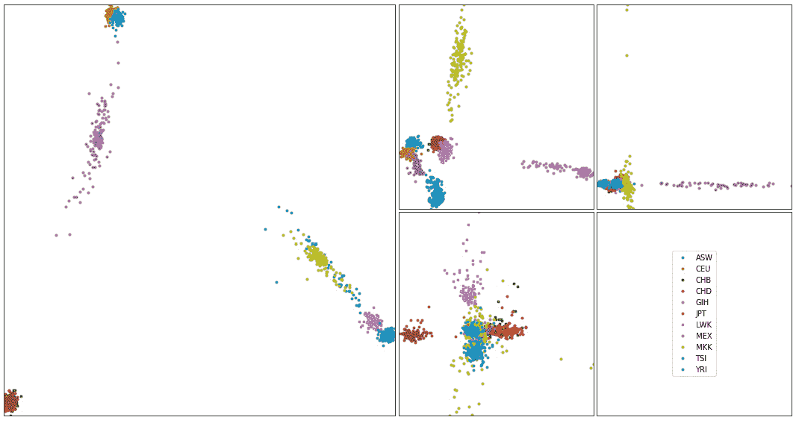
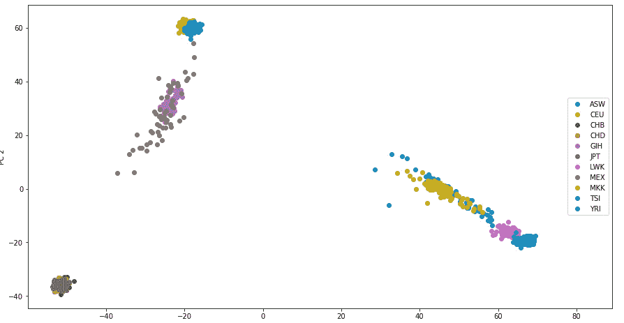
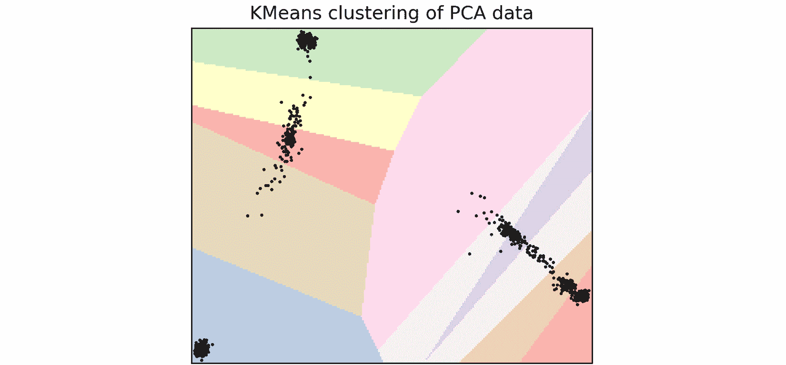
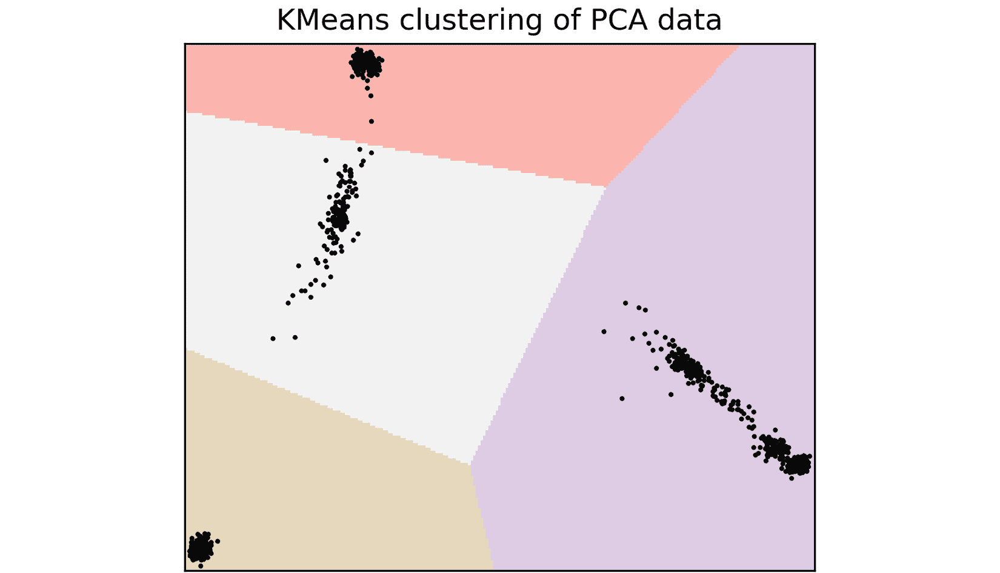
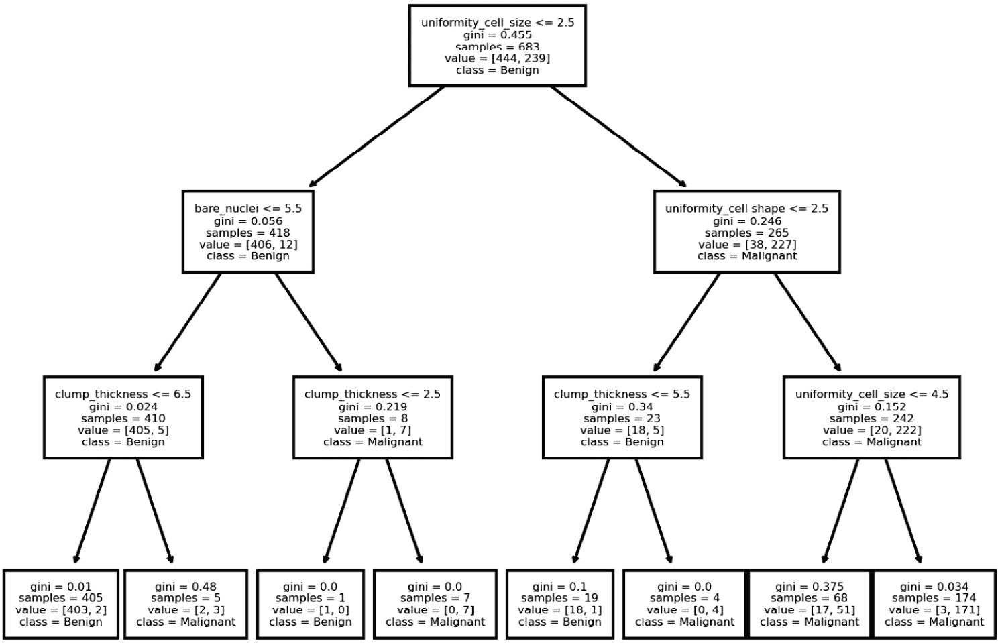

# 第十一章：生物信息学中的机器学习

机器学习在许多不同的领域中都有应用，计算生物学也不例外。机器学习在该领域有着无数的应用，最古老且最为人熟知的应用之一就是使用**主成分分析**（**PCA**）通过基因组学研究种群结构。随着该领域的蓬勃发展，还有许多其他潜在的应用。在本章中，我们将从生物信息学的角度介绍机器学习的概念。

鉴于机器学习是一个非常复杂的主题，足以填满一本书，在这里我们打算采用直观的方法，让你大致了解一些机器学习技术如何帮助解决生物学问题。如果你发现这些技术有用，你将理解基本概念，并可以进一步阅读更详细的文献。

如果你使用的是 Docker，由于本章中的所有库对于数据分析都是基础库，它们都可以在 Docker 镜像`tiagoantao/bioinformatics_ml`中找到。

在本章中，我们将覆盖以下配方：

+   用 PCA 示例介绍 scikit-learn

+   使用 PCA 聚类来分类样本

+   使用决策树探索乳腺癌特征

+   使用随机森林预测乳腺癌结果

# 用 PCA 示例介绍 scikit-learn

PCA 是一种统计方法，用于将多个变量的维度降低到一个较小的、线性无关的子集。在*第六章*中，我们已经看过基于使用外部应用程序的 PCA 实现。在这个配方中，我们将为种群遗传学实现相同的 PCA，但将使用`scikit-learn`库。Scikit-learn 是 Python 中用于机器学习的基础库之一，本配方是对该库的介绍。PCA 是一种无监督的机器学习方法——我们不提供样本的类别信息。我们将在本章的其他配方中讨论有监督的技术。

提醒一下，我们将计算来自 HapMap 项目的 11 个人类种群的 PCA。

## 准备工作

你需要运行*第六章*中的第一个配方，以生成`hapmap10_auto_noofs_ld_12` PLINK 文件（等位基因记录为 1 和 2）。从种群遗传学的角度来看，我们需要 LD 修剪标记来生成可靠的 PCA。我们这里不使用后代样本，因为它可能会导致结果偏差。我们的配方将需要`pygenomics`库，可以使用以下命令进行安装：

```py
pip install pygenomics
```

代码位于`Chapter10/PCA.py`笔记本中。

## 如何实现...

看一下以下步骤：

1.  我们首先加载样本的元数据。在我们的案例中，我们将加载每个样本所属的人类种群：

    ```py
    import os
    from sklearn.decomposition import PCA
    import numpy as np
    from genomics.popgen.pca import plot
    f = open('../Chapter06/relationships_w_pops_041510.txt')
    ind_pop = {}
    f.readline()  # header
    for l in f:
        toks = l.rstrip().split('\t')
        fam_id = toks[0]
        ind_id = toks[1]
        pop = toks[-1]
        ind_pop['/'.join([fam_id, ind_id])] = pop
    f.close()
    ```

1.  我们现在获得了个体的顺序以及我们将要处理的 SNP 数量：

    ```py
    f = open('../Chapter06/hapmap10_auto_noofs_ld_12.ped')
    ninds = 0
    ind_order = []
    for line in f:
        ninds += 1
        toks = line[:100].replace(' ', '\t').split('\t')
        fam_id = toks[0]
        ind_id = toks[1]
        ind_order.append('%s/%s' % (fam_id, ind_id))
    nsnps = (len(line.replace(' ', '\t').split('\t')) - 6) // 2
    f.close()
    ```

1.  我们创建将要输入 PCA 的数组：

    ```py
    pca_array = np.empty((ninds, nsnps), dtype=int)
    print(pca_array.shape)
    f = open('../Chapter06/hapmap10_auto_noofs_ld_12.ped')
    for ind, line in enumerate(f):
        snps = line.replace(' ', '\t').split('\t')[6:]
        for pos in range(len(snps) // 2):
            a1 = int(snps[2 * pos])
            a2 = int(snps[2 * pos])
            my_code = a1 + a2 - 2
            pca_array[ind, pos] = my_code
    f.close()
    ```

1.  最后，我们计算包含最多八个成分的 PCA。然后，使用`transform`方法获取所有样本的 8 维坐标。

    ```py
    my_pca = PCA(n_components=8)
    my_pca.fit(pca_array)
    trans = my_pca.transform(pca_array)
    ```

1.  最后，我们绘制 PCA 图：

    ```py
    sc_ind_comp = {}
    for i, ind_pca in enumerate(trans):
        sc_ind_comp[ind_order[i]] = ind_pca
    plot.render_pca_eight(sc_ind_comp, cluster=ind_pop)
    ```



图 10.1 - 由 scikit-learn 生成的我们数据集的 PC1 到 PC8

## 还有更多...

对于科学期刊中的发布，我建议使用*第六章*中的食谱，因为它基于一个已发布的、广受好评的方法。也就是说，这段代码的结果在定性上是相似的，并且以非常类似的方式对数据进行了聚类（如果你与*第六章*中的图进行比较，垂直轴方向的反转对于解读 PCA 图表而言是无关紧要的）。

# 使用 PCA 进行聚类来对样本进行分类

基因组学中的 PCA 可以让我们看到样本如何聚类。在许多情况下，同一群体的个体会聚集在图表的同一区域。但我们希望进一步预测新个体在群体中的位置。为此，我们将从 PCA 数据开始，因为它进行了降维处理—使得处理数据更为简便—然后应用 K-Means 聚类算法来预测新样本的位置。我们将使用与上述食谱相同的数据集。我们将使用除了一个样本外的所有样本来训练算法，然后预测剩下的样本位置。

K-Means 聚类可以是监督算法的一个例子。在这类算法中，我们需要一个训练数据集，以便算法能够学习。训练算法之后，它将能够对新样本预测某个结果。在我们的案例中，我们希望能够预测群体。

警告

当前的食谱旨在作为对监督算法及其背后概念的温和介绍。我们训练算法的方式远非最佳。关于如何正确训练一个监督算法的问题将在本章最后一个食谱中提到。

## 准备工作

我们将使用与之前食谱中相同的数据。此食谱的代码可以在`Chapter10/Clustering.py`中找到。

## 如何操作...

让我们来看一下：

1.  我们首先加载群体信息——这与我们在之前的食谱中所做的相似：

    ```py
    import os
    import matplotlib.pyplot as plt
    from sklearn.cluster import KMeans
    from sklearn.decomposition import PCA
    import numpy as np
    from genomics.popgen.pca import plot
    f = open('../Chapter06/relationships_w_pops_041510.txt')
    ind_pop = {}
    f.readline()  # header
    for l in f:
        toks = l.rstrip().split('\t')
        fam_id = toks[0]
        ind_id = toks[1]
        pop = toks[-1]
        ind_pop['/'.join([fam_id, ind_id])] = pop
    f.close()

    f = open('../Chapter06/hapmap10_auto_noofs_ld_12.ped')
    ninds = 0
    ind_order = []
    for line in f:
        ninds += 1
        toks = line[:100].replace(' ', '\t').split('\t') #  for speed
        fam_id = toks[0]
        ind_id = toks[1]
        ind_order.append('%s/%s' % (fam_id, ind_id))
    nsnps = (len(line.replace(' ', '\t').split('\t')) - 6) // 2
    print (nsnps)
    f.close()
    ```

1.  现在，我们将所有样本数据（SNPs）加载到一个 NumPy 数组中：

    ```py
    all_array = np.empty((ninds, nsnps), dtype=int)
    f = open('../Chapter06/hapmap10_auto_noofs_ld_12.ped')
    for ind, line in enumerate(f):
        snps = line.replace(' ', '\t').split('\t')[6:]
        for pos in range(len(snps) // 2):
            a1 = int(snps[2 * pos])
            a2 = int(snps[2 * pos])
            my_code = a1 + a2 - 2
            all_array[ind, pos] = my_code
    f.close()
    ```

1.  我们将数组分成两个数据集，即包含所有个体（除一个外）作为训练集，和单个个体用于测试的案例：

    ```py
    predict_case = all_array[-1, :]
    pca_array = all_array[:-1,:]

    last_ind = ind_order[-1]
    last_ind, ind_pop[last_ind]
    ```

我们的测试案例是个体 Y076/NA19124，我们知道他属于约鲁巴族群体。

1.  现在，我们计算用于 K-Means 聚类的训练集的 PCA：

    ```py
    my_pca = PCA(n_components=2)
    my_pca.fit(pca_array)
    trans = my_pca.transform(pca_array)

    sc_ind_comp = {}
    for i, ind_pca in enumerate(trans):
        sc_ind_comp[ind_order[i]] = ind_pca
    plot.render_pca(sc_ind_comp, cluster=ind_pop)
    ```

这是输出结果，将有助于检查聚类结果：



图 10.2 - PC1 和 PC2 与按种群编码的颜色

1.  在我们开始计算 K 均值聚类之前，先写一个函数来绘制运行算法后的聚类面：

    ```py
    def plot_kmeans_pca(trans, kmeans):
        x_min, x_max = trans[:, 0].min() - 1, trans[:, 0].max() + 1
        y_min, y_max = trans[:, 1].min() - 1, trans[:, 1].max() + 1
        mesh_x, mesh_y = np.meshgrid(np.arange(x_min, x_max, 0.5), np.arange(y_min, y_max, 0.5))

        k_surface = kmeans.predict(np.c_[mesh_x.ravel(), mesh_y.ravel()]).reshape(mesh_x.shape)
        fig, ax = plt.subplots(1,1, dpi=300)
        ax.imshow(
            k_surface, origin="lower", cmap=plt.cm.Pastel1,
            extent=(mesh_x.min(), mesh_x.max(), mesh_y.min(), mesh_y.max()),
        )
        ax.plot(trans[:, 0], trans[:, 1], "k.", markersize=2)
        ax.set_title("KMeans clustering of PCA data")
        ax.set_xlim(x_min, x_max)
        ax.set_ylim(y_min, y_max)
        ax.set_xticks(())
        ax.set_yticks(())
        return ax
    ```

1.  现在让我们用我们的样本来拟合算法。因为我们有 11 个人群，我们将训练 11 个簇：

    ```py
    kmeans11 = KMeans(n_clusters=11).fit(trans)
    plot_kmeans_pca(trans, kmeans11)
    ```

这里是输出结果：



图 10.3 - 11 个簇的簇面

如果你与这里的图进行比较，你会直观地看到这个聚类没有多大意义：它并没有很好地映射到已知的人群上。有人可能会认为，使用 11 个簇的聚类算法并不是很有用。

提示

scikit-learn 中实现了许多其他聚类算法，在多种情况下，它们的表现可能优于 K 均值聚类。你可以在[`scikit-learn.org/stable/modules/clustering.xhtml`](https://scikit-learn.org/stable/modules/clustering.xhtml)找到它们。值得怀疑的是，在这个特定的案例中，任何替代方法都不太可能在 11 个簇的情况下表现得更好。

1.  尽管看起来 K 均值聚类无法解决 11 个人群的划分，但如果我们使用不同数量的簇，或许它仍然可以提供一些预测。仅通过查看图表，我们可以看到四个独立的块。如果我们使用四个簇，会得到什么结果呢？

    ```py
    kmeans4 = KMeans(n_clusters=4).fit(trans)
    plot_kmeans_pca(trans, kmeans4)
    ```

这里是输出结果：



图 10.4 - 四个簇的簇面

四个群体现在大致清晰了。但它们直观上有意义吗？如果有，那么我们可以利用这种聚类方法。事实上，它们确实有意义。左侧的簇由非洲人口组成，顶部的簇由欧洲人组成，底部的簇由东亚人组成。中间的簇最为难以理解，因为它包含了古吉拉特人和墨西哥后裔，但这种混合最初来自于主成分分析（PCA），而非聚类本身所致。

1.  让我们看看我们漏掉的那个单独个案的预测结果：

    ```py
    pca_predict = my_pca.transform([predict_case])
    kmeans4.predict(pca_predict)
    ```

我们的样本被预测为属于簇 1。现在我们需要进一步挖掘一下。

1.  让我们来看看簇 1 代表什么。我们取训练集中的最后一个个体，他也是一名约鲁巴人，看看他被分配到了哪个簇：

    ```py
    last_train = ind_order[-2]
    last_train, ind_pop[last_train]
    kmeans4.predict(trans)[0]
    ```

确实是簇 1，因此预测是正确的。

## 还有更多...

值得重申的是，我们正在努力实现对机器学习的直观理解。在这个阶段，你应该对监督学习能够带来什么有所了解，并且已经掌握了一个聚类算法的使用示例。关于训练机器学习算法的过程，还有很多内容值得探讨，我们将在最后的食谱中部分揭示。

# 使用决策树探索乳腺癌特征

当我们接收到一个数据集时，第一个问题之一就是决定从哪里开始分析。一开始，往往会有一种迷茫的感觉，不知道该先做什么。这里，我们将展示基于决策树的探索性方法。决策树的最大优点是，它们会给我们提供构建决策树的规则，让我们初步了解数据的情况。

在这个示例中，我们将使用一个包含乳腺癌患者特征观察的数据集。该数据集包含 699 条数据，包含如肿块厚度、细胞大小的均匀性或染色质类型等信息。结果是良性或恶性肿瘤。特征值被编码为 0 到 10 之间的值。关于该项目的更多信息可以在[`archive.ics.uci.edu/ml/datasets/breast+cancer+wisconsin+%28diagnostic%29`](http://archive.ics.uci.edu/ml/datasets/breast+cancer+wisconsin+%28diagnostic%29)中找到。

## 准备工作

我们将下载数据及其文档：

```py
wget http://archive.ics.uci.edu/ml/machine-learning-databases/breast-cancer-wisconsin/breast-cancer-wisconsin.data
wget http://archive.ics.uci.edu/ml/machine-learning-databases/breast-cancer-wisconsin/breast-cancer-wisconsin.names
```

数据文件的格式为 CSV 文件。关于内容的信息可以在第二个下载的文件中找到。

这个代码可以在`Chapter10/Decision_Tree.py`中找到。

## 如何操作...

按照以下步骤操作：

1.  我们做的第一件事是移除一小部分数据不完整的个体：

    ```py
    import numpy as np
    import matplotlib.pyplot as plt
    import pandas as pd
    from sklearn import tree
    f = open('breast-cancer-wisconsin.data')
    w = open('clean.data', 'w')
    for line in f:
        if line.find('?') > -1:
            continue
        w.write(line)
    f.close()
    w.close()
    ```

提示

移除数据不完整的个体在这种情况下是合适的，因为它们只是数据集的一小部分，而且我们只是进行探索性分析。如果数据缺失很多，或者我们需要做更严格的分析，你需要使用处理缺失数据的方法，但我们这里不会进行探讨。

1.  现在我们将读取数据，为所有列命名：

    ```py
    column_names = [
        'sample_id', 'clump_thickness', 'uniformity_cell_size',
        'uniformity_cell shape', 'marginal_adhesion',
        'single_epithelial_cell_size', 'bare_nuclei',
        'bland_chromatin', 'normal_nucleoli', 'mitoses',
        'class'
    ]
    samples = pd.read_csv('clean.data', header=None, names=column_names, index_col=0)
    ```

1.  现在我们将特征与结果分离，并使用 0 和 1 重新编码结果：

    ```py
    training_input = samples.iloc[:,:-1]
    target = samples.iloc[:,-1].apply(lambda x: 0 if x == 2 else 1)
    ```

1.  现在让我们基于这些数据创建一个最大深度为 3 的决策树：

    ```py
    clf = tree.DecisionTreeClassifier(max_depth=3)
    clf.fit(training_input, target)
    ```

1.  让我们先看看哪些特征最重要：

    ```py
    importances = pd.Series(
        clf.feature_importances_ * 100,
        index=training_input.columns).sort_values(ascending=False)
    importances
    ```

以下是按重要性排名的特征：

```py
uniformity_cell_size           83.972870
uniformity_cell shape           7.592903
bare_nuclei                     4.310045
clump_thickness                 4.124183
marginal_adhesion               0.000000
single_epithelial_cell_size     0.000000
bland_chromatin                 0.000000
normal_nucleoli                 0.000000
mitoses                         0.000000
```

记住，这只是探索性分析。在下一个配方中，我们将尝试生成更可靠的排名。底部特征为零的原因是我们要求最大深度为 3，在这种情况下，可能并非所有特征都会被使用。

1.  我们可以对实现的准确性进行一些原生分析：

    ```py
    100 * clf.score(training_input, target)
    ```

我们得到的性能为 96%。我们不应该用训练集测试算法，因为这会导致结果较为循环。我们将在下一个配方中重新审视这一点。

1.  最后，让我们绘制决策树：

    ```py
    fig, ax = plt.subplots(1, dpi=300)
    tree.plot_tree(clf,ax=ax, feature_names=training_input.columns, class_names=['Benign', 'Malignant'])
    ```

这会产生以下输出：



图 10.5 - 乳腺癌数据集的决策树

让我们从根节点开始看：它的标准是`uniformity_cell_size < 2.5`，分类为良性。分裂树的主要特征是细胞大小的一致性。根节点的良性分类仅仅是因为数据集中的大多数样本都是良性的。现在看一下根节点右侧的节点：它有 265 个样本，其中大部分是恶性的，并且标准为`uniformity_cell_shape < 2.5`。

这些规则帮助你初步理解可能驱动数据集的因素。决策树的精确度不是很高，所以将这些视为你的初步步骤。

# 使用随机森林预测乳腺癌结果

现在我们将使用随机森林预测一些患者的结果。随机森林是一种集成方法（它将使用多个机器学习算法的实例），通过多个决策树得出关于数据的稳健结论。我们将使用与前一个例子相同的例子：乳腺癌特征和结果。

这个例子有两个主要目标：介绍随机森林及机器学习算法训练中的问题。

## 准备开始

这个例子的代码可以在`Chapter10/Random_Forest.py`找到。

## 如何操作...

看一下代码：

1.  我们像前一个例子一样，首先去除缺失信息的样本：

    ```py
    import pandas as pd
    import numpy as np
    import pandas as pd
    from sklearn.ensemble import RandomForestClassifier
    from sklearn.model_selection import train_test_split
    from sklearn.tree import export_graphviz
    f = open('breast-cancer-wisconsin.data')
    w = open('clean.data', 'w')
    for line in f:
        if line.find('?') > -1:
            continue
        w.write(line)
    f.close()
    w.close()
    ```

1.  现在我们加载清理过的数据：

    ```py
    column_names = [
        'sample_id', 'clump_thickness', 'uniformity_cell_size',
        'uniformity_cell shape', 'marginal_adhesion',
        'single_epithelial_cell_size', 'bare_nuclei',
        'bland_chromatin', 'normal_nucleoli', 'mitoses',
        'class'
    ]
    samples = pd.read_csv('clean.data', header=None, names=column_names, index_col=0)
    samples

    ```

1.  我们将数据分为特征和结果：

    ```py
    training_input = samples.iloc[:, :-1]
    target = samples.iloc[:, -1]
    ```

1.  我们创建一个分类器并将数据拟合到它：

    ```py
    clf = RandomForestClassifier(max_depth=3, n_estimators=200)
    clf.fit(training_input, target)
    ```

这里最重要的参数是`n_estimators`：我们要求构建一个由 200 棵树组成的森林。

1.  现在我们按重要性对特征进行排序：

    ```py
    importances = pd.Series(
        clf.feature_importances_ * 100,
        index=training_input.columns).sort_values(ascending=False)
    importances
    ```

以下是输出：

```py
uniformity_cell_size           30.422515
uniformity_cell shape          21.522259
bare_nuclei                    18.410346
single_epithelial_cell_size    10.959655
bland_chromatin                 9.600714
clump_thickness                 3.619585
normal_nucleoli                 3.549669
marginal_adhesion               1.721133
mitoses                         0.194124
```

结果是非确定性的，意味着你可能会得到不同的结果。另外，请注意，随机森林与前一个例子中的决策树有很大的不同。这是预期之中的，因为决策树是一个单一的估计器，而随机森林权衡了 200 棵树，因此更加可靠。

1.  我们可以对这个案例进行评分：

    ```py
    clf.score(training_input, target)
    ```

我得到的结果是 97.95%。你可能会得到稍微不同的值，因为算法是随机的。正如我们在前一个例子中所说，从训练集获取得分是一个循环过程，远非最佳实践。

1.  为了更真实地了解算法的准确性，我们需要将数据分为两部分——训练集和测试集：

    ```py
    for test_size in [0.01, 0.1, 0.2, 0.5, 0.8, 0.9, 0.99]:
        X_train, X_test, y_train, y_test = train_test_split(
            trainning_input, target, test_size=test_size)
        tclf = RandomForestClassifier(max_depth=3)
        tclf.fit(X_train, y_train)
        score = tclf.score(X_test, y_test)
        print(f'{1 - test_size:.1%} {score:.2%}')
    ```

输出结果如下（记住你会得到不同的值）：

```py
99.0% 71.43%
90.0% 94.20%
80.0% 97.81%
50.0% 97.66%
20.0% 96.89%
10.0% 94.80%
1.0% 92.02%
```

如果你仅用 1%的数据进行训练，你的准确率只有 71%，而如果你使用更多的数据，准确率会超过 90%。注意，准确率并不随着训练集的大小单调增加。决定训练集的大小是一个复杂的问题，涉及许多因素，可能会导致意想不到的副作用。

## 还有更多...

我们仅仅触及了训练和测试机器学习算法的表面。例如，监督数据集通常会被分成 3 部分，而不是 2 部分（训练、测试和交叉验证）。在训练算法时，你需要考虑许多其他问题，还有更多种类的算法。在本章中，我们试图培养理解机器学习的基本直觉，但如果你打算继续这条路线，这只是你的起点。
