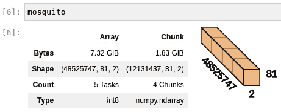
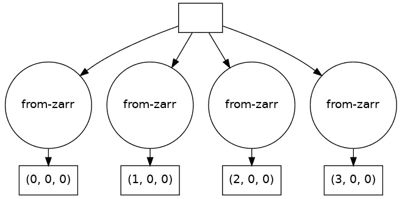
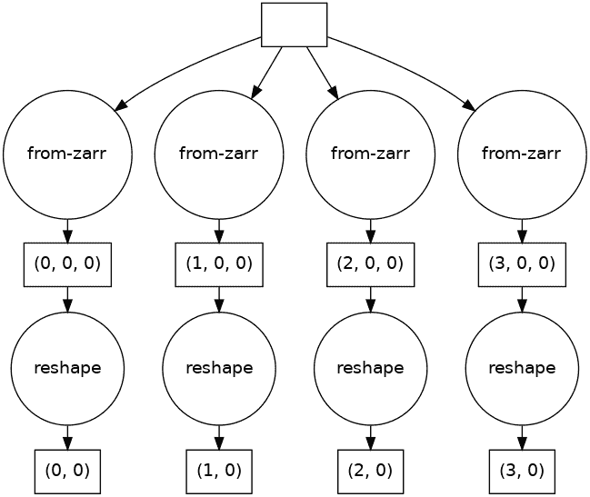
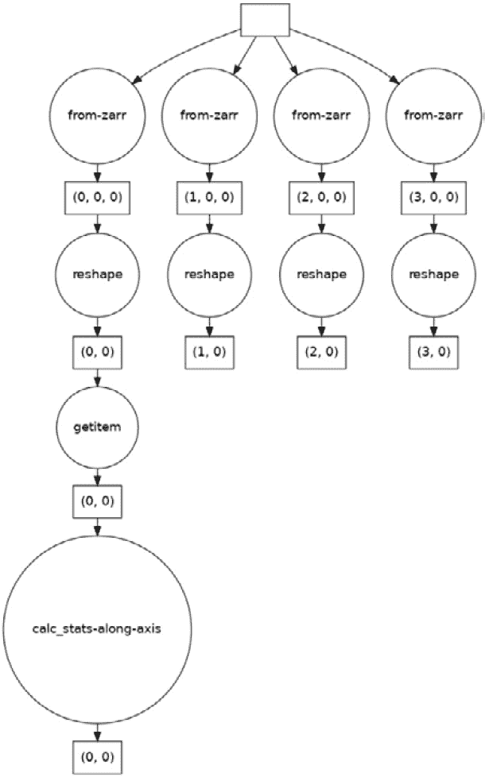
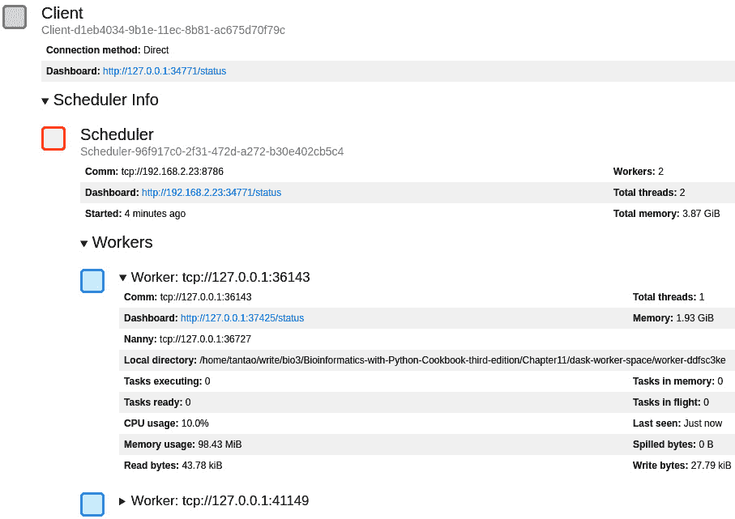
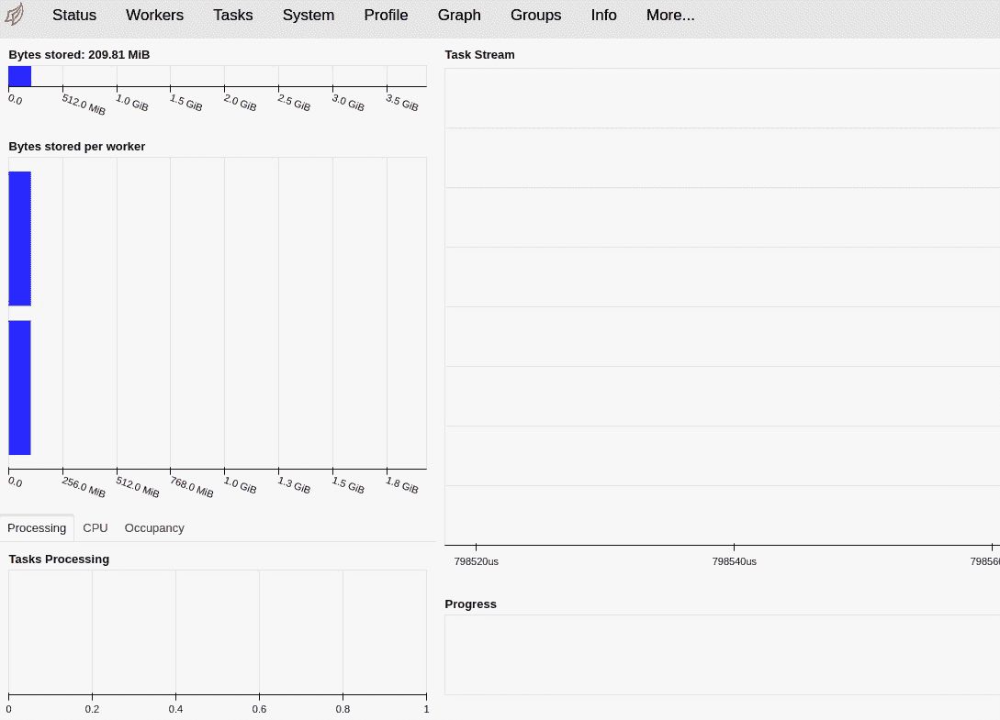
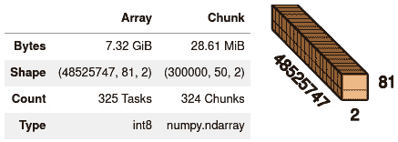
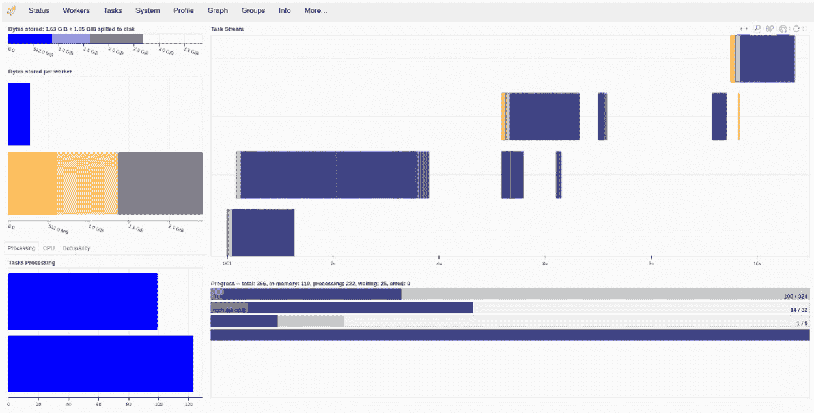

# 第十二章：使用 Dask 和 Zarr 进行并行处理

生物信息学数据集正在以指数速度增长。基于标准工具（如 Pandas）的数据分析策略假设数据集能够装入内存（尽管会有一些外部存储分析的处理），或者假设单台机器能够高效地处理所有数据。不幸的是，这对于许多现代数据集来说并不现实。

在本章中，我们将介绍两种能够处理非常大数据集和昂贵计算的库：

+   Dask 是一个支持并行计算的库，可以扩展到从单台计算机到非常大的云环境和集群环境。Dask 提供了与 Pandas 和 NumPy 类似的接口，同时允许你处理分布在多台计算机上的大数据集。

+   Zarr 是一个存储压缩和分块多维数组的库。正如我们将看到的，这些数组专为处理在大型计算机集群中处理的大数据集而设计，同时在需要时也能在单台计算机上处理数据。

我们的食谱将使用蚊子基因组学的数据介绍这些高级库。你应该将这段代码作为起点，帮助你走上处理大数据集的道路。大数据集的并行处理是一个复杂的话题，而这只是你旅程的开始——而非结束。

因为所有这些库对于数据分析都至关重要，如果你正在使用 Docker，它们都可以在 `tiagoantao/bioinformatics_dask` Docker 镜像中找到。

在本章中，我们将介绍以下食谱：

+   使用 Zarr 读取基因组学数据

+   使用 Python 多进程进行数据并行处理

+   使用 Dask 基于 NumPy 数组处理基因组数据

+   使用 `dask.distributed` 调度任务

# 使用 Zarr 读取基因组学数据

Zarr ([`zarr.readthedocs.io/en/stable/`](https://zarr.readthedocs.io/en/stable/)) 将基于数组的数据（如 NumPy）存储在磁盘和云存储的层次结构中。Zarr 用来表示数组的数据结构不仅非常紧凑，而且还支持并行读取和写入，这一点我们将在接下来的食谱中看到。在本食谱中，我们将读取并处理来自按蚊基因组 1000 基因组计划的数据（[`malariagen.github.io/vector-data/ag3/download.xhtml`](https://malariagen.github.io/vector-data/ag3/download.xhtml)）。在这里，我们将仅进行顺序处理，以便引入 Zarr；在接下来的食谱中，我们将进行并行处理。我们的项目将计算单一染色体上所有基因位置的缺失数据。

## 准备工作

按照 [`cloud.google.com/storage/docs/gsutil_install`](https://cloud.google.com/storage/docs/gsutil_install) 上提供的指导，从 `gsutil` 中获取按蚊 1000 基因组数据。在安装了 `gsutil` 后，使用以下代码行下载数据（约 2 **千兆字节** (**GB**)）：

```py
mkdir -p data/AG1000G-AO/
gsutil -m rsync -r \
         -x '.*/calldata/(AD|GQ|MQ)/.*' \
         gs://vo_agam_release/v3/snp_genotypes/all/AG1000G-AO/ \
         data/AG1000G-AO/ > /dev/null
```

我们从项目中下载了一个样本子集。下载数据后，处理它的代码可以在`Chapter11/Zarr_Intro.py`中找到。

## 如何操作...

查看以下步骤以开始：

1.  让我们首先检查一下 Zarr 文件中提供的结构：

    ```py
    import numpy as np
    import zarr 
    mosquito = zarr.open('data/AG1000G-AO')
    print(mosquito.tree())
    ```

我们从打开 Zarr 文件开始（正如我们很快会看到的，这可能实际上并不是一个文件）。之后，我们会打印出里面可用的数据树：

```py
/
├── 2L
│   └── calldata
│       └── GT (48525747, 81, 2) int8
├── 2R
│   └── calldata
│       └── GT (60132453, 81, 2) int8
├── 3L
│   └── calldata
│       └── GT (40758473, 81, 2) int8
├── 3R
│   └── calldata
│       └── GT (52226568, 81, 2) int8
├── X
│   └── calldata
│       └── GT (23385349, 81, 2) int8
└── samples (81,) |S24
```

Zarr 文件包含五个数组：四个对应蚊子的染色体——`2L`、`2R`、`3L`、`3R`和`X`（`Y`不包括在内）——另一个包含文件中包含的 81 个样本。最后一个数组包含样本名称——我们在这个文件中有 81 个样本。染色体数据由 8 位整数（`int8`）组成，样本名称则是字符串。

1.  现在，让我们探索`2L`染色体的数据。首先来看一些基本信息：

    ```py
    gt_2l = mosquito['/2L/calldata/GT']
    gt_2l
    ```

这是输出：

```py
<zarr.core.Array '/2L/calldata/GT' (48525747, 81, 2) int8>
```

我们有一个包含`4852547`个 SNP 和`81`个样本的数组。对于每个 SNP 和样本，我们有`2`个等位基因。

1.  现在我们来检查数据是如何存储的：

    ```py
    gt_2l.info
    ```

输出看起来是这样的：

```py
Name               : /2L/calldata/GT
Type               : zarr.core.Array
Data type          : int8
Shape              : (48525747, 81, 2)
Chunk shape        : (300000, 50, 2)
Order              : C
Read-only          : False
Compressor         : Blosc(cname='lz4', clevel=5, shuffle=SHUFFLE, blocksize=0)
Store type         : zarr.storage.DirectoryStore
No. bytes          : 7861171014 (7.3G)
No. bytes stored   : 446881559 (426.2M)
Storage ratio      : 17.6
Chunks initialized : 324/324
```

这里有很多内容需要解析，但现在我们将专注于存储类型、存储的字节数和存储比率。`Store type`的值是`zarr.storage.DirectoryStore`，所以数据并不在一个单独的文件中，而是存储在一个目录内。数据的原始大小是`7.3` GB！但是 Zarr 使用压缩格式，将数据的大小压缩到`426.2` `17.6`。

1.  让我们来看看数据是如何存储在目录中的。如果你列出`AG1000G-AO`目录的内容，你会发现以下结构：

    ```py
    .
    ├── 2L
    │   └── calldata
    │       └── GT
    ├── 2R
    │   └── calldata
    │       └── GT
    ├── 3L
    │   └── calldata
    │       └── GT
    ├── 3R
    │   └── calldata
    │       └── GT
    ├── samples
    └── X
        └── calldata
            └── GT
    ```

1.  如果你列出`2L/calldata/GT`目录的内容，你会发现很多文件在编码该数组：

    ```py
    0.0.0
    0.1.0
    1.0.0
    ...
    160.0.0
    160.1.0
    ```

`2L/calldata/GT`目录中有 324 个文件。记住，在前一步中我们有一个叫做`Chunk shape`的参数，它的值是`(300000, 50, 2)`。

Zarr 将数组拆分成多个块——这些块比加载整个数组更容易在内存中处理。每个块包含 30000x50x2 个元素。考虑到我们有 48525747 个 SNP，我们需要 162 个块来表示这些 SNP 的数量（48525747/300000 = 161.75），然后乘以 2 以表示样本的数量（81 个样本/每块 50 个 = 1.62）。因此，我们最终会得到 162*2 个块/文件。

提示

分块是一个广泛应用的技术，用于处理不能完全一次性加载到内存中的数据。这包括许多其他库，如 Pandas 或 Zarr。稍后我们将看到一个 Zarr 的例子。更大的观点是，你应该意识到分块的概念，因为它在许多需要大数据的场景中都有应用。

1.  在我们加载 Zarr 数据进行处理之前，先创建一个函数来计算一个块的基本基因组统计信息。我们将计算缺失值、祖先纯合子数量和异合子数量：

    ```py
    def calc_stats(my_chunk):
        num_miss = np.sum(np.equal(my_chunk[:,:,0], -1), axis=1)
        num_anc_hom = np.sum(
            np.all([
                np.equal(my_chunk[:,:,0], 0),
                np.equal(my_chunk[:,:,0], my_chunk[:,:,1])], axis=0), axis=1)
        num_het = np.sum(
            np.not_equal(
                my_chunk[:,:,0],
                my_chunk[:,:,1]), axis=1)
        return num_miss, num_anc_hom, num_het
    ```

如果你查看前面的函数，你会注意到没有任何与 Zarr 相关的内容：它只是 NumPy 代码。Zarr 有一个非常轻量的**应用程序接口**（**API**），它将 NumPy 中的大多数数据暴露出来，使得如果你熟悉 NumPy，它非常容易使用。

1.  最后，让我们遍历数据——也就是遍历我们的数据块来计算统计信息：

    ```py
    complete_data = 0
    more_anc_hom = 0
    total_pos = 0
    for chunk_pos in range(ceil(max_pos / chunk_pos_size)):
        start_pos = chunk_pos * chunk_pos_size
        end_pos = min(max_pos + 1, (chunk_pos + 1) * chunk_pos_size)
        my_chunk = gt_2l[start_pos:end_pos, :, :]
        num_samples = my_chunk.shape[1]
        num_miss, num_anc_hom, num_het = calc_stats(my_chunk)
        chunk_complete_data = np.sum(np.equal(num_miss, 0))
        chunk_more_anc_hom = np.sum(num_anc_hom > num_het)
        complete_data += chunk_complete_data
        more_anc_hom += chunk_more_anc_hom
        total_pos += (end_pos - start_pos)
    print(complete_data, more_anc_hom, total_pos)
    ```

大多数代码负责管理数据块，并涉及算术运算来决定访问数组的哪部分。就准备好的 Zarr 数据而言，重要的部分是`my_chunk = gt_2l[start_pos:end_pos, :, :]`这一行。当你切片 Zarr 数组时，它会自动返回一个 NumPy 数组。

提示

在将数据加载到内存时要非常小心。记住，大多数 Zarr 数组的大小将远大于你可用的内存，因此如果尝试加载，可能会导致应用程序甚至计算机崩溃。例如，如果你执行`all_data = gt_2l[:, :, :]`，你将需要大约 8 GB 的空闲内存来加载它——正如我们之前看到的，数据大小为 7.3 GB。

## 还有更多...

Zarr 具有比这里展示的更多功能，虽然我们将在接下来的示例中探索一些其他功能，但仍有一些可能性是你应该了解的。例如，Zarr 是少数几个允许并发写入数据的库之一。你还可以更改 Zarr 表示的内部格式。

正如我们在这里看到的，Zarr 能够以非常高效的方式压缩数据——这是通过使用 Blosc 库实现的（[`www.blosc.org/`](https://www.blosc.org/)）。由于 Blosc 的灵活性，你可以更改 Zarr 数据的内部压缩算法。

## 另见

Zarr 有替代格式——例如，**分层数据格式 5**（**HDF5**）（[`en.wikipedia.org/wiki/Hierarchical_Data_Format`](https://en.wikipedia.org/wiki/Hierarchical_Data_Format)）和**网络公共数据格式**（**NetCDF**）（[`en.wikipedia.org/wiki/NetCDF`](https://en.wikipedia.org/wiki/NetCDF)）。虽然这些格式在生物信息学领域之外更为常见，但它们功能较少——例如，缺乏并发写入功能。

# 使用 Python 多处理进行数据并行处理

处理大量数据时，一种策略是并行处理，以便利用所有可用的**中央处理单元**（**CPU**）的计算能力，因为现代计算机通常有多个核心。在理论上的最佳情况下，如果你的计算机有八个核心，你可以通过并行处理获得八倍的性能提升。

不幸的是，典型的 Python 代码只能使用一个核心。话虽如此，Python 具有内置功能来利用所有可用的 CPU 资源；事实上，Python 提供了几种方法来实现这一点。在本配方中，我们将使用内置的`multiprocessing`模块。这里提供的解决方案在单台计算机上运行良好，并且如果数据集能适应内存的话也没有问题，但如果你想要在集群或云端扩展，应该考虑使用 Dask，我们将在接下来的两篇配方中介绍它。

我们在这里的目标仍然是计算与缺失值和杂合度相关的统计信息。

## 准备工作

我们将使用与之前的配方相同的数据。该配方的代码可以在`Chapter11/MP_Intro.py`中找到。

## 如何做...

请按照以下步骤开始：

1.  我们将使用与之前的配方完全相同的函数来计算统计信息——这是一个高度依赖 NumPy 的函数：

    ```py
    import numpy as np
    import zarr
    def calc_stats(my_chunk):
        num_miss = np.sum(np.equal(my_chunk[:,:,0], -1), axis=1)
        num_anc_hom = np.sum(
            np.all([
                np.equal(my_chunk[:,:,0], 0),
                np.equal(my_chunk[:,:,0], my_chunk[:,:,1])], axis=0), axis=1)
        num_het = np.sum(
            np.not_equal(
                my_chunk[:,:,0],
                my_chunk[:,:,1]), axis=1)
        return num_miss, num_anc_hom, num_het
    ```

1.  让我们访问我们的蚊子数据：

    ```py
    mosquito = zarr.open('data/AG1000G-AO')
    gt_2l = mosquito['/2L/calldata/GT']
    ```

1.  尽管我们使用相同的函数来计算统计信息，但我们对整个数据集的处理方式将有所不同。首先，我们计算所有将调用`calc_stats`的区间。这些区间将被设计成与变异体的块划分完美匹配：

    ```py
    chunk_pos_size = gt_2l.chunks[0]
    max_pos = gt_2l.shape[0]
    intervals = []
    for chunk_pos in range(ceil(max_pos / chunk_pos_size)):
        start_pos = chunk_pos * chunk_pos_size
        end_pos = min(max_pos + 1, (chunk_pos + 1) * chunk_pos_size)
        intervals.append((start_pos, end_pos))
    ```

我们的区间列表必须与磁盘上的块划分相关。这项计算会很高效，只要这个映射尽可能接近。

1.  现在，我们将把计算每个区间的代码分离到一个函数中。这一点很重要，因为`multiprocessing`模块将在它创建的每个进程中多次执行这个函数：

    ```py
    def compute_interval(interval):
        start_pos, end_pos = interval
        my_chunk = gt_2l[start_pos:end_pos, :, :]
        num_samples = my_chunk.shape[1]
        num_miss, num_anc_hom, num_het = calc_stats(my_chunk)
        chunk_complete_data = np.sum(np.equal(num_miss, 0))
        chunk_more_anc_hom = np.sum(num_anc_hom > num_het)
        return chunk_complete_data, chunk_more_anc_hom
    ```

1.  我们现在终于将让代码在多个核心上执行：

    ```py
    with Pool() as p:
        print(p)
        chunk_returns = p.map(compute_interval, intervals)
        complete_data = sum(map(lambda x: x[0], chunk_returns))
        more_anc_hom = sum(map(lambda x: x[1], chunk_returns))
        print(complete_data, more_anc_hom)
    ```

第一行使用`multiprocessing.Pool`对象创建一个上下文管理器。`Pool`对象默认会创建多个编号为`os.cpu_count()`的进程。池提供了一个`map`函数，能够在所有创建的进程中调用我们的`compute_interval`函数。每次调用将处理一个区间。

## 还有更多...

本配方简要介绍了如何在 Python 中进行并行处理，而无需使用外部库。话虽如此，它展示了并发并行处理的最重要构建块。

由于 Python 中的线程管理方式，线程并不是实现真正并行处理的可行替代方案。纯 Python 代码无法通过多线程并行执行。

一些你可能使用的库——通常 NumPy 就是这样的——能够在执行顺序代码时利用所有底层处理器。确保在使用外部库时，不要过度占用处理器资源：当你有多个进程时，底层库也会使用多个核心。

## 另见

+   有关 `multiprocessing` 模块的讨论还有很多。你可以从标准文档开始了解：[`docs.python.org/3/library/multiprocessing.xhtml`](https://docs.python.org/3/library/multiprocessing.xhtml)

+   要理解为什么基于 Python 的多线程不能充分利用所有 CPU 资源，请阅读有关 **全局解释器锁** (**GIL**) 的内容：[`realpython.com/python-gil/.`](https://realpython.com/python-gil/.%0D)

# 使用 Dask 处理基于 NumPy 数组的基因组数据

Dask 是一个提供高级并行处理的库，可以从单个计算机扩展到非常大的集群或云操作。它还提供了处理比内存更大的数据集的能力。它能够提供与常见 Python 库如 NumPy、Pandas 或 scikit-learn 相似的接口。

我们将重复之前配方中的一个子集——即计算数据集中 SNP 的缺失情况。我们将使用 Dask 提供的类似于 NumPy 的接口。

在我们开始之前，请注意 Dask 的语义与 NumPy 或 Pandas 等库有很大不同：它是一个懒加载库。例如，当你指定一个等效于 `np.sum` 的调用时，你实际上并没有计算和求和，而是在未来会计算它的任务。让我们进入配方来进一步澄清这一点。

## 准备就绪

我们将以一种完全不同的方式重新分块 Zarr 数据。我们这么做的原因是为了在准备算法时能够可视化任务图。包含五个操作的任务图比包含数百个节点的任务图更容易可视化。为了实际目的，你不应该像我们这里做的那样将数据重新分块为如此小的块。实际上，如果你根本不重新分块这个数据集，也是完全可以的。我们这么做只是为了可视化的目的：

```py
import zarr
mosquito = zarr.open('data/AG1000G-AO/2L/calldata/GT')
zarr.array(
    mosquito,
    chunks=(1 + 48525747 // 4, 81, 2),
    store='data/rechunk')
```

我们最终会得到非常大的块，虽然这对我们的可视化目的很有用，但它们可能太大而无法放入内存中。

此配方的代码可以在 `Chapter11/Dask_Intro.py` 中找到。

## 如何实现...

1.  让我们首先加载数据并检查 DataFrame 的大小：

    ```py
    import numpy as np
    import dask.array as da

    mosquito = da.from_zarr('data/rechunk')
    mosquito
    ```

如果你在 Jupyter 中执行，这将是输出结果：



图 11.1 - Dask 数组的 Jupyter 输出，汇总我们的数据

完整的数组占用 `7.32` GB。最重要的数字是块的大小：`1.83` GB。每个工作节点需要有足够的内存来处理一个块。记住，我们这里只是使用了较少的块数，以便能够在这里绘制任务。

由于大块数据的大小，我们最终只得到了四个块。

我们尚未将任何内容加载到内存中：我们只是指定了最终想要执行的操作。我们正在创建一个任务图来执行，而不是立即执行——至少目前如此。

1.  让我们来看看我们需要执行哪些任务来加载数据：

    ```py
    mosquito.visualize()
    ```

这是输出结果：



图 11.2 - 加载我们的 Zarr 数组所需执行的任务

因此，我们有四个任务要执行，每个块对应一个任务。

1.  现在，让我们看看计算每个块缺失值的函数：

    ```py
    def calc_stats(variant):
        variant = variant.reshape(variant.shape[0] // 2, 2)
        misses = np.equal(variant, -1)
        return misses
    ```

每个块的函数将在 NumPy 数组上操作。请注意区别：我们在主循环中使用的代码是针对 Dask 数组的，但在块级别，数据以 NumPy 数组的形式呈现。因此，这些块必须适配内存，因为 NumPy 需要如此。

1.  后面，当我们实际使用这个函数时，我们需要一个**二维**（**2D**）数组。由于数组是**三维**（**3D**）的，我们需要对数组进行重塑：

    ```py
    mosquito_2d = mosquito.reshape(
        mosquito.shape[0],
        mosquito.shape[1] * mosquito.shape[2])
    mosquito_2d.visualize()
    ```

这是当前的任务图：



图 11.3 - 加载基因组数据并重塑的任务图

`reshape` 操作发生在 `dask.array` 层，而不是 NumPy 层，因此它仅向任务图中添加了节点。仍然没有执行。

1.  现在，让我们准备执行这个函数——意味着在整个数据集上向我们的任务图中添加任务。有很多种执行方式；在这里，我们将使用 `dask.array` 提供的 `apply_along_axis` 函数，它基于 NumPy 中同名的函数：

    ```py
    max_pos = 10000000
    stats = da.apply_along_axis(
        calc_stats, 1, mosquito_2d[:max_pos,:],
        shape=(max_pos,), dtype=np.int64)
    stats.visualize()
    ```

目前，我们只打算研究前百万个位置。正如你在任务图中看到的，Dask 足够智能，只会对参与计算的块添加操作：



图 11.4 - 包括统计计算在内的完整任务图

1.  记住，在此之前我们还没有进行任何计算。现在是时候真正执行任务图了：

    ```py
    stats = stats.compute() 
    ```

这将启动计算。计算的具体方式是我们将在下一个配方中讨论的内容。

警告

由于块大小的问题，这段代码可能会导致你的计算机崩溃。至少需要 16 GB 内存才能保证安全。记住，你可以使用更小的块大小——而且你*应该使用*更小的块大小。我们之所以使用这样的块大小，是为了能够生成前面展示的任务图（否则，它们可能会有数百个节点，无法打印出来）。

## 还有更多内容...

我们没有在这里讨论如何优化 Dask 代码的策略——那将是另一本书的内容。对于非常复杂的算法，你需要进一步研究最佳实践。

Dask 提供的接口类似于其他常见的 Python 库，如 Pandas 或 scikit-learn，可以用于并行处理。你也可以将它用于不依赖现有库的通用算法。

## 参见

+   对于 Dask 的最佳实践，最好的起点是 Dask 文档本身，尤其是 [`docs.dask.org/en/latest/best-practices.xhtml`](https://docs.dask.org/en/latest/best-practices.xhtml)。

# 使用 dask.distributed 调度任务

Dask 在执行方面非常灵活：我们可以在本地执行、在科学集群上执行，或者在云上执行。这种灵活性是有代价的：它需要被参数化。有多种配置 Dask 调度和执行的方式，但最通用的是 `dask.distributed`，因为它能够管理不同种类的基础设施。因为我不能假设你能够访问像 `dask.distributed` 这样存在于不同平台上的集群或云服务。

在这里，我们将再次计算 Anopheles 1000 基因组项目的不同变体的简单统计数据。

## 准备工作

在开始使用`dask.distributed`之前，我们需要注意，Dask 有一个默认的调度器，这个调度器实际上会根据你所使用的库而有所变化。例如，以下是我们 NumPy 示例的调度器：

```py
import dask
from dask.base import get_scheduler
import dask.array as da
mosquito = da.from_zarr('data/AG1000G-AO/2L/calldata/GT')
print(get_scheduler(collections=[mosquito]).__module__)
```

输出将如下所示：

```py
dask.threaded
```

Dask 在这里使用了一个线程调度器。对于 NumPy 数组来说，这样做是有道理的：NumPy 实现本身是多线程的（真正的多线程，带有并行性）。当底层库并行运行时，我们不希望有大量进程在后台运行。如果你使用的是 Pandas DataFrame，Dask 可能会选择一个多进程调度器。因为 Pandas 本身不支持并行，所以让 Dask 自己并行运行是有意义的。

好的——既然我们已经解决了这个重要细节，现在让我们回到环境准备工作。

`dask.distributed` 有一个集中式调度器和一组工作节点，我们需要启动它们。可以在命令行中运行以下代码来启动调度器：

```py
dask-scheduler --port 8786 --dashboard-address 8787
```

我们可以在与调度器相同的机器上启动工作节点，方法如下：

```py
dask-worker --nprocs 2 –nthreads 1 127.0.0.1:8786
```

我指定了每个进程使用一个线程。对于 NumPy 代码来说，这个配置是合理的，但实际配置将取决于你的工作负载（如果你在集群或云上，配置可能完全不同）。

小贴士

你实际上不需要像我这里所做的那样手动启动整个进程。`dask.distributed` 会为你启动一些东西——虽然它不会完全优化你的工作负载——如果你没有自己准备好系统（详情请见下一部分）。但我想给你一个概念，因为在很多情况下，你必须自己设置基础设施。

同样，我们将使用第一部分食谱中的数据。请确保按照*准备工作*部分的说明下载并准备好数据。我们不会使用重新分块的部分——我们将在下一部分的 Dask 代码中进行处理。我们的代码可以在`Chapter11/Dask_distributed.py`中找到。

## 如何做到这一点...

按照以下步骤开始：

1.  让我们从连接到之前创建的调度器开始：

    ```py
    import numpy as np
    import zarr
    import dask.array as da
    from dask.distributed import Client

    client = Client('127.0.0.1:8786')
    client
    ```

如果你使用的是 Jupyter，你将看到一个很好的输出，汇总了你在此食谱的*准备工作*部分所创建的配置：



图 11.5 - 使用 dask.distributed 时的执行环境摘要

你会注意到这里提到了一个仪表板。`dask.distributed` 提供了一个实时仪表板，允许你跟踪计算的状态。你可以在浏览器中输入 http://127.0.0.1:8787/ 来访问它，或者直接点击 *图 11.5* 中提供的链接。

由于我们还没有进行任何计算，仪表板大部分是空的。一定要探索顶部的许多标签：



图 11.6 - dask.distributed 仪表板的初始状态

1.  让我们加载数据。更严格地说，让我们准备任务图以加载数据：

    ```py
    mosquito = da.from_zarr('data/AG1000G-AO/2L/calldata/GT')
    mosquito
    ```

以下是在 Jupyter 上的输出：



图 11.7 - 原始 Zarr 数组（2L 染色体）的汇总

1.  为了方便可视化，让我们再次进行分块。我们还将为第二个维度——样本——创建一个单一的块。这是因为我们缺失值的计算需要所有样本，而在我们的特定情况下，为每个样本创建两个块是没有意义的：

    ```py
    mosquito = mosquito.rechunk((mosquito.shape[0]//8, 81, 2))
    ```

提醒一下，我们有非常大的块，你可能会遇到内存问题。如果是这样，你可以使用原始的块进行运行。只是可视化效果将无法读取。

1.  在继续之前，让我们要求 Dask 不仅执行重新分块操作，还要确保结果已经准备好并存储在工作节点中：

    ```py
    mosquito = mosquito.persist()
    ```

`persist` 调用确保数据在工作节点中可用。在以下截图中，你可以看到计算过程中的仪表板。你可以查看每个节点上正在执行的任务、已完成和待完成的任务摘要，以及每个工作节点上存储的字节数。需要注意的是 **溢写到磁盘** 的概念（见屏幕左上角）。如果内存不足以容纳所有块，它们会暂时写入磁盘：



图 11.8 - 执行持久化函数以重新分块数组时的仪表板状态

1.  现在，让我们计算统计信息。对于最后一个配方，我们将使用不同的方法——我们将请求 Dask 对每个块应用一个函数：

    ```py
    def calc_stats(my_chunk):
        num_miss = np.sum(
            np.equal(my_chunk[0][0][:,:,0], -1),
            axis=1)
        return num_miss
    stats = da.blockwise(
        calc_stats, 'i', mosquito, 'ijk',
        dtype=np.uint8)
    stats.visualize()
    ```

请记住，每个块不是 `dask.array` 实例，而是一个 NumPy 数组，因此代码是在 NumPy 数组上运行的。以下是当前的任务图。没有加载数据的操作，因为之前执行的函数已经完成了所有这些操作：


图 11.9 - 从持久化数据开始的每个块对 `calc_stats` 函数的调用

1.  最后，我们可以得到我们的结果：

    ```py
    stat_results = stats.compute()
    ```

## 还有更多...

关于 `dask.distributed` 接口，还有很多内容可以进一步讲解。在这里，我们介绍了其架构的基本概念和仪表盘。

`dask.distributed` 提供了基于 Python 标准 `async` 模块的异步接口。由于本章内容的介绍性性质，我们不会详细讨论它，但建议你查看相关内容。

## 另见

+   你可以从 `dask.distributed` 的文档开始，访问 [`distributed.dask.org/en/stable/`](https://distributed.dask.org/en/stable/)。

+   在许多情况下，你需要将代码部署到集群或云端。请查看部署文档，了解不同平台的资源：[`docs.dask.org/en/latest/deploying.xhtml`](https://docs.dask.org/en/latest/deploying.xhtml)。

+   在掌握本章内容后，下一步可以学习 Python 中的异步计算。请查看 [`docs.python.org/3/library/asyncio-task.xhtml`](https://docs.python.org/3/library/asyncio-task.xhtml)。
