# 第一章. 统计学

|   | *“投票的人决定不了什么，计算票数的人决定了一切。”* |   |
| --- | --- | --- |
|   | --*约瑟夫·斯大林* |

在接下来的十章中，我们将尝试在*数据科学的 Clojure*中探索一条大体线性的路径。事实上，我们会发现这条路径并不是那么线性，细心的读者应当注意到沿途会有许多反复出现的主题。

描述性统计学关注的是总结数字序列，它们将在本书的每一章中以某种程度出现。在本章中，我们将通过实现函数来计算数字序列的均值、中位数、方差和标准差，为后续内容奠定基础。在此过程中，我们将尽力消除对数学公式解释的恐惧。

一旦我们有多个数字需要分析，询问这些数字是如何分布的就变得有意义了。你可能已经听过像“长尾效应”和“80/20 法则”这样的表达。它们关注的是数字在一个范围内的分布情况。本章中，我们将展示分布的价值，并介绍最有用的分布：正态分布。

分布的研究得到了可视化的大力帮助，为此我们将使用 Clojure 库 Incanter。我们将展示如何使用 Incanter 加载、转换和可视化真实数据。我们将比较两次国家选举的结果——2010 年英国大选和 2011 年俄罗斯总统选举——并看看即使是基础分析也能提供潜在欺诈行为的证据。

# 下载示例代码

本书的所有示例代码都可以在 Packt 出版公司的官方网站[`www.packtpub.com/support`](http://www.packtpub.com/support)或 GitHub 上[`github.com/clojuredatascience`](http://github.com/clojuredatascience)找到。每章的示例代码都有自己的仓库。

### 注意

第一章的示例代码，*统计学*可以从[`github.com/clojuredatascience/ch1-statistics`](https://github.com/clojuredatascience/ch1-statistics)下载。

可执行示例会定期出现在所有章节中，要么演示刚刚解释的代码效果，要么演示已引入的统计原理。所有示例函数的名称都以`ex-`开头，并且在每章中按顺序编号。所以，第一章的第一个可运行示例*统计学*名为`ex-1-1`，第二个名为`ex-1-2`，依此类推。

# 运行示例

每个示例是`cljds.ch1.examples`命名空间中的一个函数，可以通过两种方式运行——要么从**REPL**，要么通过**Leiningen**在命令行运行。如果你想在 REPL 中运行示例，可以执行：

```py
lein repl

```

在命令行中，默认情况下，REPL 将在 `examples` 命名空间中打开。或者，如果你想运行某个特定的示例，可以执行：

```py
lein run –-example 1.1

```

或者使用单个字母的等效命令：

```py
lein run –e 1.1

```

本书假设你对基本的命令行操作有一定了解。只需能够运行 Leiningen 和 Shell 脚本即可。

### 提示

如果你在任何阶段遇到困难，请参考本书的维基：[`wiki.clojuredatascience.com`](http://wiki.clojuredatascience.com)。维基将提供已知问题的故障排除提示，包括在不同平台上运行示例的建议。

事实上，Shell 脚本仅用于自动从远程位置获取数据。本书的维基也会为不愿意或无法执行 Shell 脚本的读者提供替代的说明。

# 下载数据

本章的数据集由维也纳医科大学的复杂系统研究小组提供。我们将进行的分析与他们的研究紧密相连，旨在确定全球各国全国选举中系统性选举舞弊的信号。

### 注意

如需了解更多关于研究的信息，以及下载其他数据集的链接，请访问本书的维基或研究小组的网站：[`www.complex-systems.meduniwien.ac.at/elections/election.html`](http://www.complex-systems.meduniwien.ac.at/elections/election.html)。

在本书中，我们将使用大量数据集。在可能的情况下，我们已将数据与示例代码一起提供。如果由于数据量太大或许可限制无法提供数据，我们则提供了下载数据的脚本。

第一章，*统计学*就是这样的一章。如果你已经克隆了该章节的代码，并打算跟随示例进行操作，请通过在项目目录中的命令行执行以下命令来下载数据：

```py
script/download-data.sh

```

脚本将会下载并解压样本数据到项目的数据目录中。

### 提示

如果你在运行下载脚本时遇到困难，或者希望按照手动说明进行操作，请访问本书的维基：[`wiki.clojuredatascience.com`](http://wiki.clojuredatascience.com)获取帮助。

我们将在下一节开始调查数据。

# 检查数据

在本章以及本书的许多其他章节中，我们将使用 Incanter 库（[`incanter.org/`](http://incanter.org/)）来加载、处理和显示数据。

Incanter 是一套模块化的 Clojure 库，提供统计计算和可视化功能。它模仿了广受欢迎的数据分析环境 R，将 Clojure 的强大功能、交互式 REPL 和处理数据的强大抽象结合在一起。

Incanter 的每个模块专注于特定的功能领域。例如，`incanter-stats`包含一套相关函数，用于分析数据并生成摘要统计信息，而`incanter-charts`提供大量的可视化功能。`incanter-core`提供了最基本且通常有用的用于数据转换的函数。

每个模块可以单独包含在你的代码中。如果需要访问统计、图表和 Excel 功能，你可以在`project.clj`中包含以下内容：

```py
  :dependencies [[incanter/incanter-core "1.5.5"]
                 [incanter/incanter-stats "1.5.5"]
                 [incanter/incanter-charts "1.5.5"]
                 [incanter/incanter-excel "1.5.5"]
                 ...]
```

如果你不介意包含比所需更多的库，你也可以直接包含完整的 Incanter 分发包：

```py
:dependencies [[incanter/incanter "1.5.5"]
               ...]
```

Incanter 的核心概念是数据集——一个包含行和列的结构。如果你有关系型数据库的经验，可以将数据集视为一个表格。数据集中的每一列都有名称，数据集中的每一行都有与其他行相同数量的列。有几种方式可以将数据加载到 Incanter 数据集中，具体使用哪种方式取决于我们的数据存储方式：

+   如果我们的数据是文本文件（CSV 或制表符分隔文件），我们可以使用`incanter-io`中的`read-dataset`函数。

+   如果我们的数据是 Excel 文件（例如，`.xls`或`.xlsx`文件），我们可以使用`incanter-excel`中的`read-xls`函数。

+   对于任何其他数据源（外部数据库、网站等），只要我们能将数据转换成 Clojure 数据结构，就可以使用`incanter-core`中的`dataset`函数来创建数据集。

本章使用了 Excel 数据源，因此我们将使用`read-xls`函数。该函数需要一个必需的参数——要加载的文件——以及一个可选的关键字参数，用于指定工作表的编号或名称。我们所有的示例只有一个工作表，因此我们只需提供文件参数作为字符串：

```py
(ns cljds.ch1.data
  (:require [clojure.java.io :as io]
            [incanter.core :as i]
            [incanter.excel :as xls]))
```

通常情况下，我们不会在示例代码中重复命名空间声明。这是为了简洁，并且因为所需的命名空间通常可以通过引用它们的符号推断出来。例如，在本书中，我们将始终把`clojure.java.io`称为`io`，将`incanter.core`称为`I`，将`incanter.excel`称为`xls`，无论何时使用它们。

在本章中，我们将加载多个数据源，因此我们在`cljds.ch1.data`命名空间中创建了一个名为`load-data`的多方法：

```py
(defmulti load-data identity)

(defmethod load-data :uk [_]
  (-> (io/resource "UK2010.xls")
      (str)
      (xls/read-xls)))
```

在上面的代码中，我们定义了`load-data`多方法，它根据第一个参数的`identity`进行分派。我们还定义了当第一个参数为`:uk`时被调用的实现。因此，调用`(load-data :uk)`将返回一个包含英国数据的 Incanter 数据集。在本章后面，我们将为其他数据集定义额外的`load-data`实现。

`UK2010.xls` 电子表格的第一行包含列名。Incanter 的 `read-xls` 函数会将这些列名作为返回数据集的列名。让我们现在通过检查它们来开始探索数据——`incanter.core` 中的 `col-names` 函数将列名作为向量返回。在接下来的代码中（以及本书中，我们使用来自 `incanter.core` 命名空间的函数时），我们将其命名为 `i`：

```py
(defn ex-1-1 []
  (i/col-names (load-data :uk)))
```

如前所述，在运行示例时，前缀为`ex-`的函数可以像下面这样通过 Leiningen 在命令行上运行：

```py
lein run –e 1.1

```

前述命令的输出应该是以下 Clojure 向量：

```py
["Press Association Reference" "Constituency Name" "Region" "Election Year" "Electorate" "Votes" "AC" "AD" "AGS" "APNI" "APP" "AWL" "AWP" "BB" "BCP" "Bean" "Best" "BGPV" "BIB" "BIC" "Blue" "BNP" "BP Elvis" "C28" "Cam Soc" "CG" "Ch M" "Ch P" "CIP" "CITY" "CNPG" "Comm" "Comm L" "Con" "Cor D" "CPA" "CSP" "CTDP" "CURE" "D Lab" "D Nat" "DDP" "DUP" "ED" "EIP" "EPA" "FAWG" "FDP" "FFR" "Grn" "GSOT" "Hum" "ICHC" "IEAC" "IFED" "ILEU" "Impact" "Ind1" "Ind2" "Ind3" "Ind4" "Ind5" "IPT" "ISGB" "ISQM" "IUK" "IVH" "IZB" "JAC" "Joy" "JP" "Lab" "Land" "LD" "Lib" "Libert" "LIND" "LLPB" "LTT" "MACI" "MCP" "MEDI" "MEP" "MIF" "MK" "MPEA" "MRLP" "MRP" "Nat Lib" "NCDV" "ND" "New" "NF" "NFP" "NICF" "Nobody" "NSPS" "PBP" "PC" "Pirate" "PNDP" "Poet" "PPBF" "PPE" "PPNV" "Reform" "Respect" "Rest" "RRG" "RTBP" "SACL" "Sci" "SDLP" "SEP" "SF" "SIG" "SJP" "SKGP" "SMA" "SMRA" "SNP" "Soc" "Soc Alt" "Soc Dem" "Soc Lab" "South" "Speaker" "SSP" "TF" "TOC" "Trust" "TUSC" "TUV" "UCUNF" "UKIP" "UPS" "UV" "VCCA" "Vote" "Wessex Reg" "WRP" "You" "Youth" "YRDPL"]
```

这是一个非常宽的数据集。数据文件中的前六列描述如下；后续列按党派细分投票数：

+   **新闻社参考**：这是一个识别选区（投票区，由一名议员代表）的数字

+   **选区名称**：这是给投票区（选区）起的常用名称

+   **区域**：这是选区所在的英国地理区域

+   **选举年份**：这是选举举行的年份

+   **选民**：这是选区内有资格投票的总人数

+   **投票数**：这是总投票数

每当我们面对新数据时，理解数据是非常重要的。如果没有详细的数据定义，我们可以通过验证自己对数据的假设来开始理解它。例如，我们预期这个数据集包含关于 2010 年选举的信息，那么让我们先回顾一下 `选举年份` 列的内容。

Incanter 提供了 `i/$` 函数（`i`，如前所述，表示 `incanter.core` 命名空间）用于从数据集中选择列。我们将在本章中经常遇到这个函数——它是 Incanter 从各种数据表示中选择列的主要方式，并且提供了多个不同的重载。目前，我们只需要提供我们想提取的列名和要提取的 dataset：

```py
(defn ex-1-2 []
  (i/$ "Election Year" (load-data :uk)))

;; (2010.0 2010.0 2010.0 2010.0 2010.0 ... 2010.0 2010.0 nil)
```

这些年份作为一个单一的值序列返回。由于数据集包含很多行，输出可能难以理解。为了知道列中包含哪些唯一值，我们可以使用 Clojure 的核心函数 `distinct`。使用 Incanter 的一个优点是它的有用数据操作函数增强了 Clojure 已经提供的函数，正如下面的示例所示：

```py
(defn ex-1-3 []
  (->> (load-data :uk)
       (i/$ "Election Year")
       (distinct)))

;; (2010 nil)
```

`2010` 年份在很大程度上确认了我们的预期——这些数据来自 `2010`。然而，`nil` 值则出乎意料，可能表明数据存在问题。

我们目前还不知道数据集中有多少个 nil 值，确定这一点可能帮助我们决定接下来该做什么。计数这类值的一个简单方法是使用核心库函数 `frequencies`，它返回一个值与计数的映射：

```py
(defn ex-1-4 [ ]
  (->> (load-data :uk)
       (i/$ "Election Year")
       (frequencies)))

;; {2010.0 650 nil 1}
```

在前面的示例中，我们使用了 Clojure 的线程最后宏 `->>` 来将多个函数连接在一起，提升可读性。

### 提示

除了 Clojure 大量的核心数据处理函数外，像前面讨论的宏——包括线程最后宏 `->>`——也是使用 Clojure 进行数据分析的另一个重要原因。在本书中，我们将看到 Clojure 如何使即使是复杂的分析也能简洁且易于理解。

我们很快就能确认，2010 年英国有 650 个选区，称为选区。像这样的领域知识在对新数据进行合理性检查时非常宝贵。因此，`nil` 值很可能是多余的，可以删除。我们将在下一节看到如何做这件事。

# 数据清洗

有一个常见的统计数据表明，数据科学家至少 80% 的工作是数据清洗。这是检测潜在的损坏或错误数据，并进行修正或过滤的过程。

### 注意

数据清洗是处理数据时最重要（也是最耗时）的步骤之一。它是确保后续分析基于有效、准确且一致的数据进行的关键步骤。

选举年列末尾的 `nil` 值可能表示需要清除的脏数据。我们已经看到，通过 Incanter 的 `i/$` 函数可以过滤 *列* 数据。要过滤 *行* 数据，我们可以使用 Incanter 的 `i/query-dataset` 函数。

我们通过传递一个包含列名和谓词的 Clojure 映射，让 Incanter 知道我们希望过滤哪些行。只有所有谓词返回 true 的行才会被保留。例如，要从数据集中仅选择 `nil` 值：

```py
(-> (load-data :uk)
    (i/query-dataset {"Election Year" {:$eq nil}}))
```

如果你了解 SQL，你会发现这与 `WHERE` 子句非常相似。事实上，Incanter 还提供了 `i/$where` 函数，这是 `i/query-dataset` 的别名，反转了参数的顺序。

查询是一个将列名映射到谓词的映射，每个谓词本身是一个操作符到操作数的映射。可以通过指定多个列和多个操作符来构建复杂的查询。查询操作符包括：

+   `:$gt` 大于

+   `:$lt` 小于

+   `:$gte` 大于或等于

+   `:$lte` 小于或等于

+   `:$eq` 等于

+   `:$ne` 不等于

+   `:$in` 用于测试是否为某集合的成员

+   `:$nin` 用于测试是否不为某集合的成员

+   `:$fn` 一个谓词函数，应该返回 true 以保留该行

如果内置操作符不足以满足需求，最后一个操作符提供了传递自定义函数的能力。

我们将继续使用 Clojure 的线程最后宏（thread-last macro）来使代码的意图更清晰，并使用 `i/to-map` 函数将行返回为键值对映射：

```py
(defn ex-1-5 []
  (->> (load-data :uk)
       (i/$where {"Election Year" {:$eq nil}})
       (i/to-map)))

;; {:ILEU nil, :TUSC nil, :Vote nil ... :IVH nil, :FFR nil}
```

仔细查看结果，很明显这一行中所有（除了一个）列的值都是`nil`。事实上，经过进一步的探索，确认非`nil`行是一个汇总总数，应该从数据中删除。我们可以通过更新谓词映射，使用`:$ne`操作符来删除有问题的行，只返回选举年份不等于`nil`的行：

```py
(->> (load-data :uk)
      (i/$where {"Election Year" {:$ne nil}}))
```

上述函数是我们几乎总是希望在使用数据之前调用的。实现这一点的一种方式是添加另一个`load-data`多方法的实现，其中也包括此过滤步骤：

```py
(defmethod load-data :uk-scrubbed [_]
  (->> (load-data :uk)
       (i/$where {"Election Year" {:$ne nil}})))
```

现在，无论我们写什么代码，都可以选择引用`:uk`或`:uk-scrubbed`数据集。

通过始终加载源文件并在其上执行数据清洗，我们保留了我们所做转换的审计记录。这使我们——以及未来的代码读者——能够清楚地了解对源数据做了哪些调整。它还意味着，如果我们需要使用新的源数据重新运行分析，我们可能只需将新文件加载到现有文件的位置。

# 描述性统计

描述性统计是用来总结和描述数据的数字。在下一章，我们将关注更复杂的分析方法——所谓的**推论统计**，但现在我们只限于简单地描述文件中数据的观察内容。

为了演示我们的意思，我们来看一下数据中的`Electorate`列。该列列出了每个选区注册选民的总数：

```py
(defn ex-1-6 []
  (->> (load-data :uk-scrubbed)
       (i/$ "Electorate")
       (count)))

;; 650
```

我们已经从数据集中过滤掉了`nil`字段；上述代码应该返回一个包含`650`个数字的列表，代表每个英国选区的选民。

描述性统计，也叫做**汇总统计**，是衡量数值序列特征的方式。它们有助于表征序列，并可以作为进一步分析的指导。让我们从计算数值序列中最基本的两个统计量开始——均值和方差。

## 均值

测量数据集平均值最常见的方法是均值。它实际上是衡量数据**集中趋势**的几种方法之一。均值，或者更准确地说，是算术均值，是一种直接的计算方法——简单地将数值加起来并除以数量——但尽管如此，它的数学符号看起来还是让人有些畏惧：

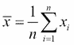

其中被读作*x-bar*，是常用于表示均值的数学符号。

对于从数学或科学以外领域进入数据科学的程序员来说，这种符号可能会让人感到困惑和陌生。其他人可能对这种符号完全熟悉，他们可以放心跳过下一节。

## 解释数学符号

尽管数学符号看起来可能晦涩难懂，实际上只有少数几个符号会在本书的公式中频繁出现。

*Σ* 读作 *sigma*，意思是 *和*。当你看到它出现在数学符号中时，意味着一个序列正在被求和。位于 *sigma* 上下的符号表示我们将要进行求和的范围。它们类似于 C 风格的 `for` 循环，在之前的公式中，表示我们会从 *i=1* 到 *i=n* 进行求和。按照惯例，*n* 是序列的长度，且数学符号中的序列是从 1 开始索引的，而不是从 0 开始，因此从 *1* 到 *n* 求和意味着我们在求整个序列的和。

紧跟着 sigma 的表达式是要被求和的序列。在我们之前的平均数公式中，*x*[i] 紧跟在 sigma 后面。由于 *i* 将表示从 *1* 到 *n* 的每个索引，*x*[i] 代表 *xs* 序列中的每个元素。

最后，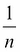 出现在 sigma 之前，表示整个表达式应乘以 *1* 除以 *n*（也称为 **n 的倒数**）。这可以简化为只除以 *n*。

| 名称 | 数学符号 | Clojure 对应 |
| --- | --- | --- |
|   | *n* | `(count xs)` |
| Sigma 符号 | 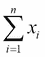 | `(reduce + xs)` |
| Pi 符号 | 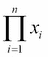 | `(reduce * xs)` |

将这一切结合起来，我们得出“将序列中的元素从第一个加到最后一个，然后除以元素的数量”。在 Clojure 中，这可以写成：

```py
(defn mean [xs]
  (/ (reduce + xs)
     (count xs)))
```

其中，`xs` 代表“*xs* 序列”。我们可以使用新的 `mean` 函数来计算英国选民的平均数：

```py
(defn ex-1-7 []
  (->> (load-data :uk-scrubbed)
       (i/$ "Electorate")
       (mean)))

;; 70149.94
```

实际上，Incanter 已经在 `incanter.stats` 命名空间中包含了一个非常高效的计算序列平均数的函数 `mean`。在本章（以及全书）中，任何使用 `incanter.stats` 命名空间的地方都会用 `s` 作为简写。

## 中位数

中位数是另一种常见的描述性统计量，用于衡量序列的集中趋势。如果将所有数据从低到高排序，中位数就是中间的值。如果序列中的数据点数量是偶数，中位数通常定义为中间两个值的平均数。

中位数通常用 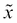 表示，发音为 *x-tilde*。这是数学符号中的一个不足之处，因为没有特别标准的方式来表示中位数公式，但在 Clojure 中仍然相当直接：

```py
(defn median [xs]
  (let [n   (count xs)
        mid (int (/ n 2))]
    (if (odd? n)
      (nth (sort xs) mid)
      (->> (sort xs)
           (drop (dec mid))
           (take 2)
           (mean)))))
```

英国选民的中位数是：

```py
(defn ex-1-8 []
  (->> (load-data :uk-scrubbed)
       (i/$ "Electorate")
       (median)))

;; 70813.5
```

Incanter 也提供了一个用于计算中位数的函数 `s/median`。

# 方差

均值和中位数是描述序列中间值的两种替代方法，但单独使用它们几乎无法告诉我们序列中包含的值。例如，如果我们知道一个包含 99 个值的序列的均值是 50，我们也无法仅凭此判断序列包含哪些值。

它可能包含从 1 到 99 的所有整数，或者 49 个零和 50 个 99。也许它包含了负一的值 98 次，且有一个 5000 和 48。或者，可能所有的值都是恰好 50。

序列的方差是其关于均值的“分散度”，前面每个例子的方差都会不同。在数学符号中，方差表示为：

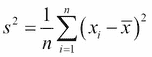

其中，*s*²是通常用于表示方差的数学符号。

这个方程与之前计算均值的方程有许多相似之处。不同的是，我们不是求单一值*x*[i]的总和，而是求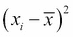函数的总和。回忆一下，符号表示均值，因此这个函数计算了*xi*相对于所有*xs*均值的平方偏差。

我们可以将表达式转化为一个函数`square-deviation`，然后应用于`xs`序列。我们还可以利用已经创建的`mean`函数，计算序列中的值的总和，并除以计数。

```py
(defn variance [xs]
  (let [x-bar (mean xs)
        n     (count xs)
        square-deviation (fn [x]
                           (i/sq (- x x-bar)))]
    (mean (map square-deviation xs))))
```

我们使用 Incanter 的`i/sq`函数来计算表达式的平方。

由于我们在取均值之前已经对偏差进行了平方，因此方差的单位也会被平方，所以英国选民的方差单位是“人平方”。这种单位有些不太自然。我们可以通过取方差的平方根，使得单位再次变为“人”，结果称为**标准差**：

```py
(defn standard-deviation [xs]
  (i/sqrt (variance xs)))

(defn ex-1-9 []
  (->> (load-data :uk-scrubbed)
       (i/$ "Electorate")
       (standard-deviation)))

;; 7672.77
```

Incanter 实现了分别计算方差和标准差的函数，分别为`s/variance`和`s/sd`。

# 分位数

中位数是计算列表中*中间*值的一种方法，方差则提供了一种衡量数据相对于该中点的分布情况的方式。如果整个数据的分布在零到一的尺度上表示，中位数将是位于 0.5 处的值。

例如，考虑以下数字序列：

```py
[10 11 15 21 22.5 28 30]
```

序列中有七个数字，因此中位数是第四个，或者是 21。这个值也称为 0.5 分位数。我们可以通过查看 0、0.25、0.5、0.7 和 1.0 分位数，获得序列数字的更丰富画面。将这些数字放在一起，它们不仅显示了中位数，还总结了数据的范围和数字在其中的分布情况。它们有时被称为*五数概括*。

计算英国选民数据的五数概括的一种方法如下所示：

```py
(defn quantile [q xs]
  (let [n (dec (count xs))
        i (-> (* n q)
              (+ 1/2)
              (int))]
    (nth (sort xs) i)))

(defn ex-1-10 []
  (let [xs (->> (load-data :uk-scrubbed)
                (i/$ "Electorate"))
        f (fn [q]
            (quantile q xs))]
    (map f [0 1/4 1/2 3/4 1])))

;; (21780.0 66219.0 70991.0 75115.0 109922.0)
```

也可以直接使用 Incanter 的`s/quantile`函数计算分位数。所需的分位数序列作为关键字参数`:probs`传入。

### 注意

Incanter 的`quantile`函数使用一种称为**phi-quantile**的算法变体，在某些情况下，它会在连续数字之间进行线性插值。计算分位数的方式有很多种——请参阅[`en.wikipedia.org/wiki/Quantile`](https://en.wikipedia.org/wiki/Quantile)了解不同算法之间的差异。

当分位数将范围分为四个相等的范围时，它们被称为**四分位数**。下四分位数和上四分位数之间的差异称为**四分位距**，通常简写为**IQR**。像均值的方差一样，IQR 提供了关于中位数数据分布的度量。

# 分箱数据

为了理解这些方差计算所衡量的内容，我们可以使用一种称为**分箱**的技术。对于连续数据，使用`frequencies`（正如我们在选举数据中用来计算零值一样）并不实用，因为两个值可能不完全相同。然而，通过将数据分为离散的区间，我们可以大致了解数据的结构。

分箱过程是将数值范围划分为若干个连续、等大小的较小箱子。原始数据中的每个值都会落入其中的一个箱子。通过统计每个箱子中的点数，我们可以大致了解数据的分布情况：

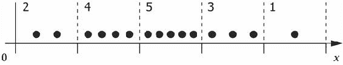

上述示例展示了将十五个*x*值分为五个相等大小的箱子。通过统计每个箱子内的点数，我们可以清楚地看到，大多数点落在中间的箱子中，而靠近边缘的箱子内的点数较少。我们可以使用以下`bin`函数在 Clojure 中实现相同的功能：

```py
(defn bin [n-bins xs]
  (let [min-x    (apply min xs)
        max-x    (apply max xs)
        range-x  (- max-x min-x)
        bin-fn   (fn [x]
                   (-> x
                       (- min-x)
                       (/ range-x)
                       (* n-bins)
                       (int)
                       (min (dec n-bins))))]
    (map bin-fn xs)))
```

例如，我们可以将范围 0-14 分成`5`个箱子，如下所示：

```py
(bin 5 (range 15))

;; (0 0 0 1 1 1 2 2 2 3 3 3 4 4 4)
```

一旦我们将值分箱，我们可以再次使用`frequencies`函数统计每个箱子中的点数。在以下代码中，我们使用该函数将英国选民数据分为五个箱子：

```py
(defn ex-1-11 []
  (->> (load-data :uk-scrubbed)
       (i/$ "Electorate")
       (bin 10)
       (frequencies)))

;; {1 26, 2 450, 3 171, 4 1, 0 2}
```

极端箱子（0 和 4）的点数远低于中间的箱子——这些点数似乎向中位数处上升，然后又下降。在接下来的部分，我们将可视化这些点数的分布形态。

# 直方图

直方图是一种可视化单一数据序列分布的方法。直方图通过将连续分布进行分箱，并绘制每个箱子中点数的频率来呈现数据。直方图中每个条形的高度表示数据中有多少点落在该箱子内。

我们已经看过如何自己进行数据分箱，但`incanter.charts`包含一个`histogram`函数，可以通过两个步骤对数据进行分箱并可视化为直方图。在本章（以及全书）中，我们需要将`incanter.charts`作为`c`。

```py
(defn ex-1-12 []
  (-> (load-data :uk-scrubbed)
      (i/$ "Electorate")
      (c/histogram)
      (i/view)))
```

前面的代码生成了以下图表：

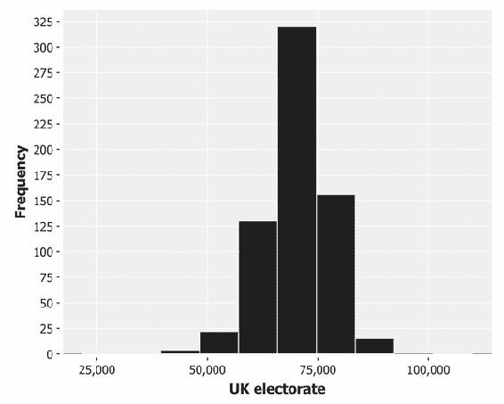

我们可以通过将关键字参数`:nbins`作为第二个参数传递给`histogram`函数，来配置数据被分为多少个箱：

```py
(defn ex-1-13 []
  (-> (uk-electorate)
      (c/histogram :nbins 200)
      (i/view)))
```

前面的图表显示了一个单一的高峰，但相对粗略地表达了数据的形状。下面的图表显示了更精细的细节，但柱状图的体积遮蔽了分布的形状，特别是在尾部：

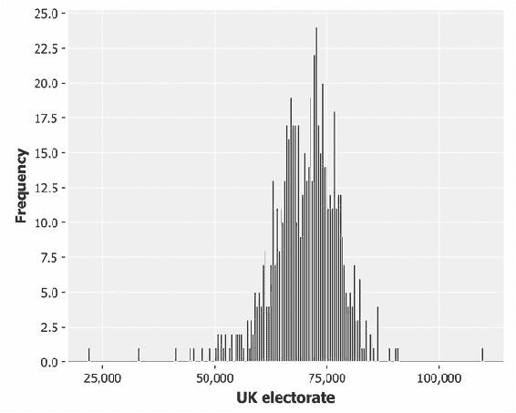

选择表示数据的箱数是一个精细的平衡——箱数太少，数据的形状将只会被粗略表示；箱数太多，噪声特征可能会遮蔽底层结构。

```py
(defn ex-1-14 []
  (-> (i/$ "Electorate" (load-data :uk-scrubbed))
      (c/histogram :x-label "UK electorate"
                   :nbins 20)
      (i/view)))
```

下面显示的是`20`个柱状条的直方图：

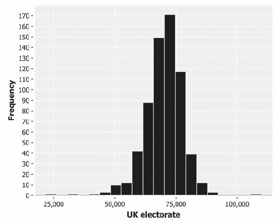

这个包含`20`个箱的最终图表似乎是目前为止最好的数据表示。

除了均值和中位数，*众数*是另一种衡量序列平均值的方式——它被定义为序列中最常出现的值。众数严格来说仅定义在至少有一个重复值的序列中；对于许多分布，情况并非如此，因此众数是未定义的。然而，直方图的峰值通常被称为众数，因为它对应于最流行的箱。

我们可以清晰地看到，分布在众数附近非常对称，值在两侧急剧下降，尾部较浅。这是数据遵循大致正态分布的表现。

# 正态分布

直方图将告诉你数据如何大致分布在其范围内，并提供一种将数据分类为几种常见分布之一的可视化手段。在数据分析中，许多分布经常出现，但没有比正态分布更为常见的，正态分布也叫做**高斯分布**。

### 注意

该分布被称为正态分布，是因为它在自然界中出现的频率非常高。伽利略注意到，他的天文测量误差遵循一个分布，即从均值的偏差较小的出现频率比偏差较大的频率更高。正是伟大的数学家高斯对这些误差的数学形状的描述，使得该分布也被称为高斯分布，以此纪念他。

分布就像是一种压缩算法：它允许将大量数据非常高效地进行总结。正态分布只需要两个参数，其他数据可以从这两个参数中进行近似——均值和标准差。

## 中心极限定理

正态分布的普遍性部分可以通过中心极限定理来解释。来自不同分布的数值在特定条件下会趋向于收敛到正态分布，接下来我们将展示这一点。

在编程中，一种常见的分布是*均匀*分布。这是由 Clojure 的`rand`函数生成的数字分布：对于一个公平的随机数生成器，所有数字生成的机会是相等的。我们可以通过多次生成一个 0 到 1 之间的随机数并绘制结果，来在直方图中可视化这一点。

```py
(defn ex-1-15 []
  (let [xs (->> (repeatedly rand)
                (take 10000))]
    (-> (c/histogram xs
                     :x-label "Uniform distribution"
                     :nbins 20)
        (i/view))))
```

前面的代码将生成以下直方图：

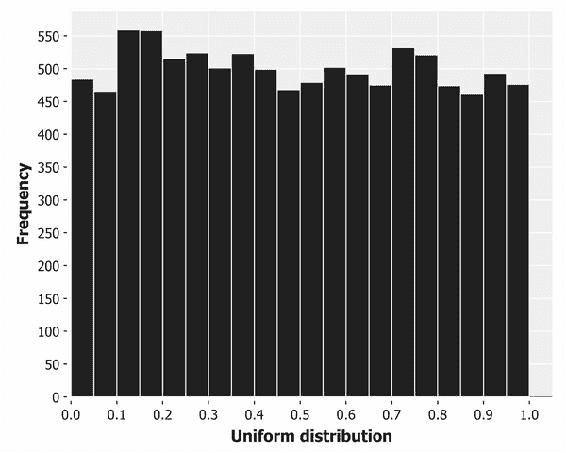

每个直方图的条形高度大致相同，对应于生成落入每个区间的数字的均等概率。条形的高度并不完全相同，因为均匀分布描述的是我们的随机抽样无法精确反映的理论输出。在接下来的几章中，我们将学习如何精确量化理论与实践之间的差异，以确定这些差异是否足够大，值得关注。在这个案例中，它们并不大。

如果我们生成的是数列均值的直方图，结果会呈现出与之前截然不同的分布。

```py
(defn ex-1-16 []
  (let [xs (->> (repeatedly rand)
                (partition 10)
                (map mean)
                (take 10000))]
    (-> (c/histogram xs
                     :x-label "Distribution of means"
                     :nbins 20)
        (i/view))))
```

前面的代码将生成类似于以下直方图的输出：

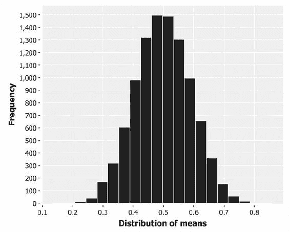

虽然均值接近零或一并非不可能，但这种情况极为不可能，而且随着平均数的数量和抽样平均值的数量增加，这种不可能性会变得越来越大。事实上，输出值极其接近正态分布。

这个结果——即许多小的随机波动的平均效应导致正态分布——被称为**中心极限定理**，有时简称为**CLT**，它在很大程度上解释了为什么正态分布在自然现象中如此频繁地出现。

中心极限定理直到 20 世纪才得以命名，尽管这一效应早在 1733 年就被法国数学家阿布拉罕·德·莫伊夫（Abraham de Moivre）记录下来，他用正态分布来近似公平投掷硬币时的正面出现次数。硬币投掷的结果最适合用二项分布来建模，我们将在第四章 *分类*中介绍二项分布。虽然中心极限定理提供了一种从近似正态分布中生成样本的方法，但 Incanter 的`distributions`命名空间提供了从多种分布中高效生成样本的函数，包括正态分布：

```py
(defn ex-1-17 []
  (let [distribution (d/normal-distribution)
        xs (->> (repeatedly #(d/draw distribution))
                (take 10000))]
    (-> (c/histogram xs
                     :x-label "Normal distribution"
                     :nbins 20)
        (i/view))))
```

前面的代码生成了以下直方图：

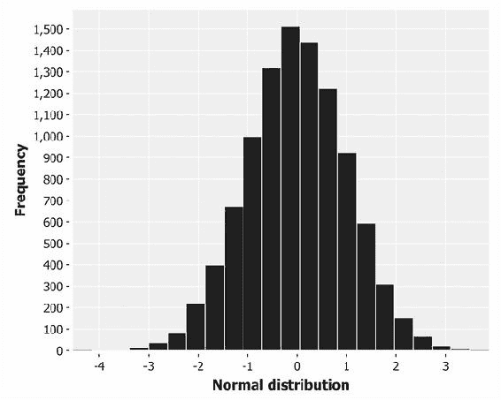

`d/draw`函数将从提供的分布返回一个样本。`d/normal-distribution`的默认均值和标准差分别为零和一。

# 庞加莱的面包师

有一个故事说，虽然几乎可以确定是虚构的，但它使我们更详细地了解中心极限定理如何帮助我们推断分布的形成方式。这个故事涉及到著名的十九世纪法国多面手亨利·庞加莱，据说他一年中每天称量自己的面包。

烘焙是一个受监管的行业，庞加莱发现，虽然面包的重量符合正态分布，但峰值在 950 克，而不是宣传的 1 公斤。他再次向当局举报面包师，于是面包师被罚款。

第二年，庞加莱继续从同一位面包师那里购买面包并称重。他发现均值现在是 1 公斤，但围绕均值的分布不再对称。分布向右偏，与面包师只给庞加莱最重的面包相符。庞加莱再次向当局举报面包师，面包师第二次被罚款。

现在不必关心这个故事是否真实；这个故事仅用来说明一个关键点——一系列数字的分布可以告诉我们生成它的过程中的一些重要信息。

## 生成分布

为了发展我们对正态分布和方差的直觉，让我们使用 Incanter 的分布函数来模拟一个诚实和不诚实的面包师。我们可以将诚实的面包师建模为均值为 1000 的正态分布，对应于 1 公斤的公平面包。我们假设在烘焙过程中存在方差，导致标准差为 30 克。

```py
(defn honest-baker [mean sd]
  (let [distribution (d/normal-distribution mean sd)]
    (repeatedly #(d/draw distribution))))

(defn ex-1-18 []
  (-> (take 10000 (honest-baker 1000 30))
      (c/histogram :x-label "Honest baker"
                   :nbins 25)
      (i/view)))
```

上述代码将生成类似以下直方图的输出：

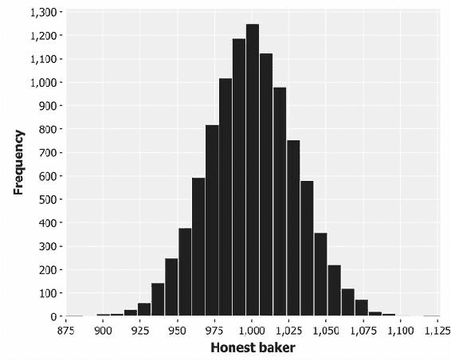

现在，让我们模拟一个只卖最重的面包的面包师。我们将序列分成 13 个一组（“面包师的一打”），然后选择最大值：

```py
(defn dishonest-baker [mean sd]
  (let [distribution (d/normal-distribution mean sd)]
    (->> (repeatedly #(d/draw distribution))
         (partition 13)
         (map (partial apply max)))))

(defn ex-1-19 []
  (-> (take 10000 (dishonest-baker 950 30))
      (c/histogram :x-label "Dishonest baker"
                   :nbins 25)
      (i/view)))
```

上述代码将生成类似以下直方图的输出：

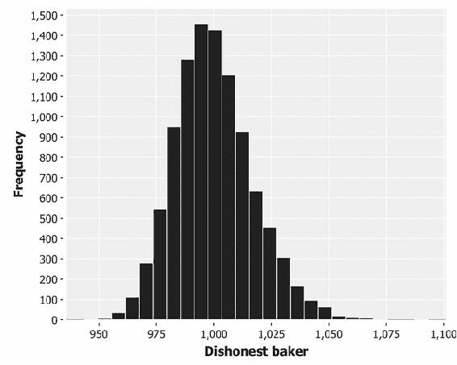

显而易见，这个直方图看起来与我们之前看到的不太一样。均值仍然是 1 公斤，但围绕均值的数值分布不再对称。我们称这个直方图显示出一个**偏态正态分布**。

# 偏度

偏度是分布围绕其众数的不对称性的名称。**负偏态**或**左偏态**表明图形下众数左侧的面积较大。**正偏态**或**右偏态**表明图形下众数右侧的面积较大。

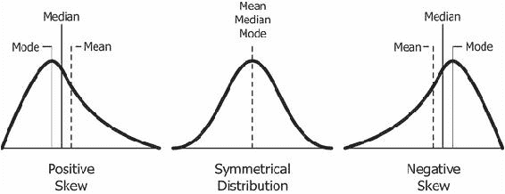

Incanter 在`stats`命名空间中有一个内置函数用于测量偏度：

```py
(defn ex-1-20 []
  (let [weights (take 10000 (dishonest-baker 950 30))]
    {:mean (mean weights)
     :median (median weights)
     :skewness (s/skewness weights)}))
```

上面的示例显示，不诚实面包师输出的偏度约为 0.4，量化了在直方图中显示的偏斜。

## 分位数-分位数图

我们在本章前面已经遇到过分位数，作为描述数据分布的一种方式。回想一下，`quantile` 函数接受介于零和一之间的数字，并返回该点的序列值。0.5 对应于中位数值。

将数据的分位数与正态分布的分位数进行绘制，可以让我们看到测量数据与理论分布的比较。这种图形被称为**Q-Q 图**，它提供了一种快速且直观的方式来判断正态性。对于接近正态分布的数据，Q-Q 图呈现直线。偏离直线的部分表明数据偏离理想化的正态分布的方式。

让我们并排绘制诚实和不诚实面包师的 Q-Q 图。Incanter 的 `c/qq-plot` 函数接受数据点列表，并生成一个样本分位数与理论正态分布的分位数绘制的散点图：

```py
(defn ex-1-21 []
  (->> (honest-baker 1000 30)
       (take 10000)
       (c/qq-plot)
       (i/view))
  (->> (dishonest-baker 950 30)
       (take 10000)
       (c/qq-plot)
       (i/view)))
```

上述代码将生成以下图表：

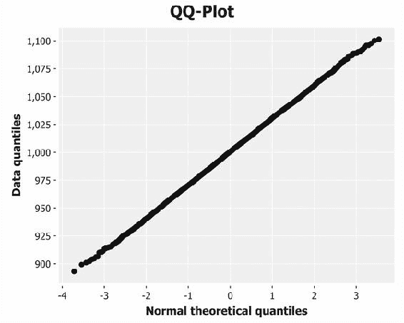

诚实面包师的 Q-Q 图在前面已经展示。下面是指不诚实面包师的图：

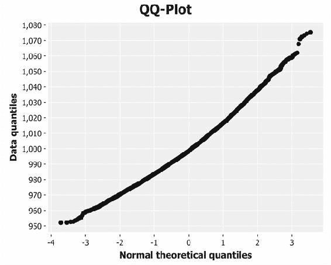

线条弯曲表明数据是正偏的；反向弯曲则表明数据是负偏的。实际上，Q-Q 图使得我们更容易识别各种偏离标准正态分布的情况，如下图所示：

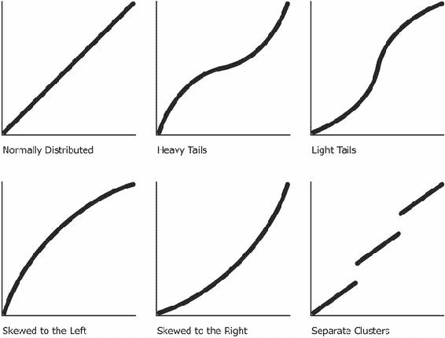

Q-Q 图比较了诚实与不诚实面包师的分布与理论正态分布的对比。在接下来的部分，我们将比较几种不同的方式来直观地比较两个（或更多）测量值序列。

# 比较可视化

Q-Q 图提供了一种极好的方式，用来将测量得到的经验分布与理论正态分布进行比较。如果我们想要比较两个或多个经验分布之间的关系，我们不能使用 Incanter 的 Q-Q 图表。不过，我们有其他多种选择，如接下来的两部分所示。

## 箱形图

箱形图，或称为**箱线图**，是一种可视化描述统计中的中位数和方差的方式。我们可以使用以下代码生成它们：

```py
(defn ex-1-22 []
  (-> (c/box-plot (->> (honest-baker 1000 30)
                       (take 10000))
                  :legend true
                  :y-label "Loaf weight (g)"
                  :series-label "Honest baker")
      (c/add-box-plot (->> (dishonest-baker 950 30)
                           (take 10000))
                      :series-label "Dishonest baker")
      (i/view)))
```

这将生成以下图表：

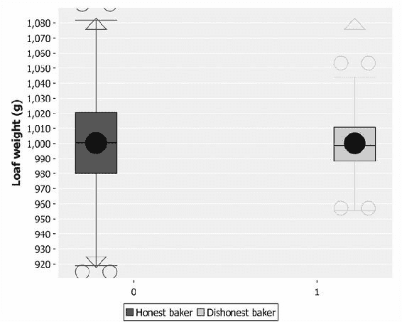

图中间的框表示**四分位数范围**。中位数是通过盒子中间的线，而均值则是大的黑点。对于诚实的面包师，中位数穿过圆形的中心，表明均值和中位数差不多。而对于不诚实的面包师，均值偏离中位数，表明存在偏斜。

须根表示数据的范围，异常值用空心圆表示。在一个图表中，我们比在单独的直方图或 Q-Q 图上更清楚地看到了两个分布之间的差异。

## 累积分布函数

累积分布函数，也称为 **CDF**，描述了从一个分布中抽取的值小于 *x* 的概率。像所有概率分布一样，它们的值在 *0* 和 *1* 之间，*0* 代表不可能，*1* 代表确定性。例如，假设我即将掷一个六面骰子。掷出小于六的概率是多少？

对于一颗公平的骰子，掷出 5 或更小的概率是 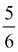。相反，掷出 1 的概率只有 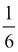。掷出 3 或更小的结果对应着平等的几率——50% 的概率。

骰子掷出的 CDF 遵循与所有 CDF 相同的模式——对于数值范围较低的部分，CDF 接近零，表示选择该范围或以下的数字的概率较低。对于范围的高端，CDF 接近一，因为大多数从序列中抽取的值会较小。

### 注意

CDF 和分位数密切相关——CDF 是分位数函数的逆函数。如果 0.5 分位数对应的值是 1,000，那么 1,000 的 CDF 就是 0.5。

就像 Incanter 的 `s/quantile` 函数允许我们在特定点从分布中采样值一样，`s/cdf-empirical` 函数允许我们输入一个来自序列的值，并返回一个介于零和一之间的值。它是一个高阶函数——接受值（在此情况下是一个值的序列）并返回一个函数。然后可以多次调用返回的函数，传入不同的输入值，从而返回它们各自的 CDF。

### 注意

高阶函数是接受或返回函数的函数。

让我们并排绘制诚实和不诚实面包师的 CDF。我们可以使用 Incanter 的 `c/xy-plot` 来通过绘制源数据——来自诚实和不诚实面包师的样本——与针对经验 CDF 计算出的概率，来可视化 CDF。`c/xy-plot` 函数期望 *x* 值和 *y* 值作为两个单独的值序列提供。

为了在同一个图表上绘制这两个分布，我们需要能够为我们的 `xy-plot` 提供多个系列。Incanter 为其许多图表提供了添加附加系列的功能。对于 `xy-plot`，我们可以使用函数 `c/add-lines`，它的第一个参数是图表，接下来的两个参数分别是 *x* 系列和 *y* 系列的数据。你还可以传递一个可选的系列标签。我们在以下代码中这么做，以便在最终的图表上区分这两个系列：

```py
(defn ex-1-23 []
  (let [sample-honest    (->> (honest-baker 1000 30)
                              (take 1000))
        sample-dishonest (->> (dishonest-baker 950 30)
                              (take 1000))
        ecdf-honest    (s/cdf-empirical sample-honest)
        ecdf-dishonest (s/cdf-empirical sample-dishonest)]
    (-> (c/xy-plot sample-honest (map ecdf-honest sample-honest)
                   :x-label "Loaf Weight"
                   :y-label "Probability"
                   :legend true
                   :series-label "Honest baker")
        (c/add-lines sample-dishonest
                     (map ecdf-dishonest sample-dishonest)
                     :series-label "Dishonest baker")
        (i/view))))
```

上面的代码生成了如下图表：

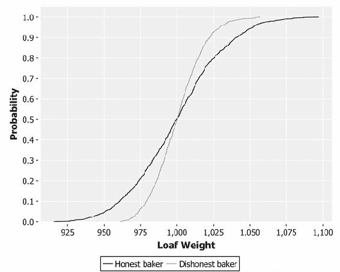

尽管看起来很不一样，这个图表实际上展示了与箱线图相同的信息。我们可以看到，两条线大约在 0.5 的中位数处交叉，对应于 1,000 克。那个不诚实的线在下尾处被截断，上尾则更长，表明其分布是偏斜的。

# 可视化的重要性

像前面那样的简单可视化是传达大量信息的简洁方式。它们补充了我们在本章前面计算的摘要统计量，使用它们非常重要。像均值和标准差这样的统计量不可避免地会隐藏大量信息，因为它们将一系列数据压缩为一个单一的数字。

统计学家弗朗西斯·安斯科姆（Francis Anscombe）设计了一组四个散点图，称为**安斯科姆四重奏**，它们具有几乎相同的统计特性（包括均值、方差和标准差）。尽管如此，*xs*和*ys*的分布在视觉上是截然不同的：

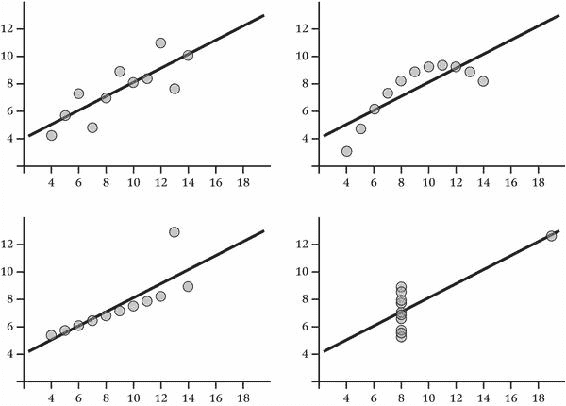

数据集在绘制图表时不必经过人为设计就能揭示有价值的见解。以 2013 年波兰全国马图拉考试成绩的直方图为例：

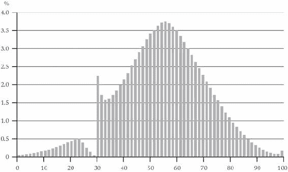

我们可能期望学生的能力呈正态分布，实际上——除了大约 30%的急剧峰值——它确实是正态分布的。我们可以清楚地看到，考官人为地把学生的成绩推高，使其超过及格线。

实际上，从大样本中提取的序列的分布可以如此可靠，以至于任何偏离它们的情况都可能是非法活动的证据。本福德定律，也叫做首位数字定律，是一种关于大范围随机数的奇特特性。数字 1 大约有 30%的时间作为首位数字出现，而较大的数字则越来越少。比如，数字 9 作为首位数字的概率不到 5%。

### 注意

本福德定律以物理学家弗兰克·本福德（Frank Benford）的名字命名，他于 1938 年提出该定律，并展示了它在各种数据源中的一致性。早在 50 多年前，西蒙·纽科姆（Simon Newcomb）就曾注意到，本福德定律曾被他发现过，纽科姆观察到，他的对数表书页在数字以 1 开头的地方更为磨损。

本福德展示了该定律适用于各种各样的数据，例如电费账单、街道地址、股价、人口数据、死亡率以及河流的长度。这一定律在涵盖大范围数值的数据集中的一致性如此之高，以至于其偏离被接受作为金融欺诈审判中的证据。

## 可视化选民数据

让我们回到选举数据，并将我们之前创建的选民序列与理论正态分布的 CDF 进行比较。我们可以使用 Incanter 的`s/cdf-normal`函数根据值序列生成正态分布的 CDF。默认均值为 0，标准差为 1，因此我们需要提供选民数据的测量均值和标准差。对于我们的选民数据，这些值分别为 70,150 和 7,679。

在本章前面，我们生成了一个经验性的 CDF。以下示例仅生成了两个 CDF，并将它们绘制在单个`c/xy-plot`上：

```py
(defn ex-1-24 []
  (let [electorate (->> (load-data :uk-scrubbed)
                        (i/$ "Electorate"))
        ecdf   (s/cdf-empirical electorate)
        fitted (s/cdf-normal electorate
                             :mean (s/mean electorate)
                             :sd   (s/sd electorate))]
    (-> (c/xy-plot electorate fitted
                   :x-label "Electorate"
                   :y-label "Probability"
                   :series-label "Fitted"
                   :legend true)
        (c/add-lines electorate (map ecdf electorate)
                     :series-label "Empirical")
        (i/view))))
```

前面的示例生成了以下绘图：

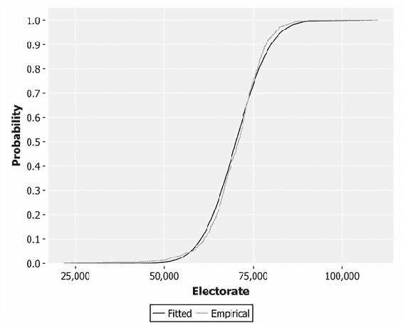

通过两条线的接近程度，您可以看出数据多么接近正态分布，尽管稍有偏斜。偏斜方向与我们之前绘制的不诚实面包师的 CDF 相反，因此我们的选民数据略微向左倾斜。

因为我们正在将我们的分布与理论正态分布进行比较，让我们使用 Q-Q 图，默认情况下将执行此操作：

```py
(defn ex-1-25 []
  (->> (load-data :uk-scrubbed)
       (i/$ "Electorate")
       (c/qq-plot)
       (i/view)))
```

下面的 Q-Q 图更好地突显了数据中明显的左偏态：

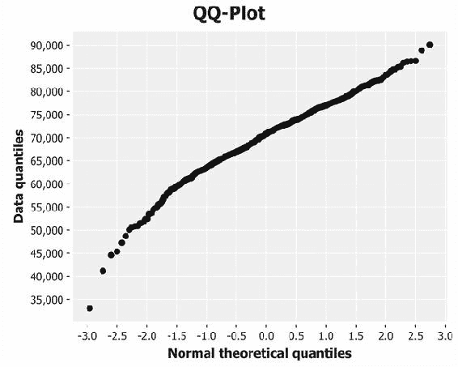

正如我们预期的那样，曲线与本章早期不诚实的面包师 Q-Q 图相反。这表明，如果数据更接近正态分布，比我们预期的小选区数目更多。

# 添加列

到目前为止，本章中我们通过过滤行和列来减少数据集的大小。通常，我们会希望向数据集添加行，Incanter 支持几种方式来实现这一点。

首先，我们可以选择是替换数据集中的现有列还是追加附加列到数据集。其次，我们可以选择是直接提供新列值以替换现有列值，还是通过对数据的每一行应用函数来计算新值。

下图列出了我们的选项及相应的 Incanter 函数使用方法：

|   | 替换数据 | 追加数据 |
| --- | --- | --- |
| 通过提供序列 | `i/replace-column` | `i/add-column` |
| 通过应用函数 | `i/transform-column` | `i/add-derived-column` |

当基于函数转换或派生列时，我们将传递新列的名称以创建，应用于每行的函数，以及现有列名称的序列。每个现有列中包含的值将构成函数的参数。

让我们通过一个实际示例来展示如何使用 `i/add-derived-column` 函数。2010 年的英国大选结果是悬浮议会，没有任何政党获得绝对多数席位。保守党和自由民主党之间形成了联合政府。在下一节中，我们将找出每个党派的支持人数，并计算其在总投票中的比例。

## 添加衍生列

要找出选民中投票支持保守党或自由民主党的比例，我们需要计算每个政党的得票总和。由于我们是基于现有数据创建一个新的数据字段，因此我们需要使用 `i/add-derived-column` 函数。

```py
(defn ex-1-26 []
  (->> (load-data :uk-scrubbed)
       (i/add-derived-column :victors [:Con :LD] +)))
```

然而，如果我们现在运行这个操作，将会生成一个异常：

```py
ClassCastException java.lang.String cannot be cast to java.lang.Number  clojure.lang.Numbers.add (Numbers.java:126)
```

不幸的是，Clojure 报告错误，指出我们试图添加一个 `java.lang.String` 类型的值。显然，`Con` 或 `LD` 列中某个（或两个）包含了字符串值，但到底是哪个呢？我们可以再次使用频率统计来查看问题的范围：

```py
(->> (load-data :uk-scrubbed)
     ($ "Con")
     (map type)
     (frequencies))

;; {java.lang.Double 631, java.lang.String 19}

(->> (load-data :uk-scrubbed)
     ($ "LD")
     (map type)
     (frequencies))

;; {java.lang.Double 631, java.lang.String 19}
```

让我们使用本章早些时候提到的 `i/$where` 函数，仅查看这些数据行：

```py
(defn ex-1-27 []
  (->> (load-data :uk-scrubbed)
       (i/$where #(not-any? number? [(% "Con") (% "LD")]))
       (i/$ [:Region :Electorate :Con :LD])))

;; |           Region | Electorate | Con | LD |
;; |------------------+------------+-----+----|
;; | Northern Ireland |    60204.0 |     |    |
;; | Northern Ireland |    73338.0 |     |    |
;; | Northern Ireland |    63054.0 |     |    |
;; ...
```

这一部分的探索应该足以让我们确信，这些字段为空的原因是没有在相应选区推出候选人。我们应该过滤掉这些数据，还是认为它们的值为零呢？这是一个有趣的问题。我们选择过滤掉这些数据，因为在这些选区内，选民根本无法选择自由民主党或保守党候选人。如果我们假定为零，将人为地降低那些本可以选择其中一个政党投票的选民的平均数。

现在我们知道如何过滤掉有问题的行，接下来添加胜选者及其投票份额、选民投票率的衍生列。我们过滤数据行，仅显示那些有保守党和自由民主党候选人的行：

```py
(defmethod load-data :uk-victors [_]
  (->> (load-data :uk-scrubbed)
       (i/$where {:Con {:$fn number?} :LD {:$fn number?}})
       (i/add-derived-column :victors [:Con :LD] +)
       (i/add-derived-column :victors-share [:victors :Votes] /)
       (i/add-derived-column :turnout [:Votes :Electorate] /)))
```

结果是，我们的数据集中新增了三列：`:victors`、`:victors-share` 和 `:turnout`。接下来，让我们通过 Q-Q 图展示胜选者的投票份额，看看它与理论上的正态分布有何不同：

```py
(defn ex-1-28 []
  (->> (load-data :uk-victors)
       (i/$ :victors-share)
       (c/qq-plot)
       (i/view)))
```

上述代码生成了以下图表：

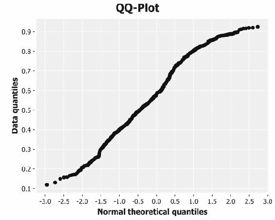

回顾本章前面提到的各种 Q-Q 图形，结果显示胜选者的投票份额相比正态分布具有“轻尾”特性。这意味着更多的数据点集中在均值附近，超出了我们对真正正态分布数据的预期。

# 选民数据的对比可视化

现在我们来看另一个大选的数据集，这次是 2011 年的俄罗斯大选。俄罗斯是一个更大的国家，其选举数据也要大得多。我们将加载两个较大的 Excel 文件到内存中，这可能会超过默认的 JVM 堆大小。

为了扩展 Incanter 可用的内存，我们可以调整项目中`profile.clj`的 JVM 设置。可以通过`：jvm-opts`键提供一个 JVM 的配置标志向量。这里我们使用 Java 的`Xmx`标志将堆内存大小增加到 1GB，这应该足够用了。

```py
  :jvm-opts ["-Xmx1G"]
```

俄罗斯的数据存储在两个数据文件中。幸运的是，每个文件中的列名相同，因此它们可以按顺序连接在一起。Incanter 的`i/conj-rows`函数正是为了这个目的而存在：

```py
(defmethod load-data :ru [_]
  (i/conj-rows (-> (io/resource "Russia2011_1of2.xls")
                   (str)
                   (xls/read-xls))
               (-> (io/resource "Russia2011_2of2.xls")
                   (str)
                   (xls/read-xls))))
```

在前面的代码中，我们定义了`load-data`多重方法的第三个实现来加载并合并这两个俄罗斯文件。

### 注意

除了`conj-rows`，Incanter-core 还定义了`conj-columns`，它将合并具有相同行数的数据集的列。

让我们看看俄罗斯数据的列名是什么：

```py
(defn ex-1-29 []
  (-> (load-data :ru)
      (i/col-names)))

;; ["Code for district"
;; "Number of the polling district (unique to state, not overall)"
;; "Name of district" "Number of voters included in voters list"
;; "The number of ballots received by the precinct election
;; commission" ...]
```

俄罗斯数据集中的列名非常具有描述性，但可能比我们想要输入的更长。而且，如果与我们之前看到的英国选举数据中表示相同属性的列（例如，获胜者的份额和投票率）在两者中有相同的标签，那将更加方便。让我们相应地重命名它们。

与数据集一起，`i/rename-cols`函数期望接收一个映射，其中键是当前的列名，值对应所需的新列名。如果我们将其与之前看到的`i/add-derived-column`数据结合起来，我们得到如下结果：

```py
(defmethod load-data :ru-victors [_]
  (->> (load-data :ru)
       (i/rename-cols
        {"Number of voters included in voters list" :electorate
         "Number of valid ballots" :valid-ballots
         "United Russia" :victors})
       (i/add-derived-column :victors-share
                             [:victors :valid-ballots] i/safe-div)
       (i/add-derived-column :turnout
                             [:valid-ballots :electorate] /)))
```

`i/safe-div`函数与`/`相同，但它能够防止除以零的情况。它不会抛出异常，而是返回`Infinity`，该值将在 Incanter 的统计和图表功能中被忽略。

# 可视化俄罗斯选举数据

我们之前看到，英国选举投票率的直方图大致呈正态分布（尽管尾部较轻）。现在我们已经加载并转换了俄罗斯选举数据，让我们看看它的对比情况：

```py
(defn ex-1-30 []
  (-> (i/$ :turnout (load-data :ru-victors))
      (c/histogram :x-label "Russia turnout"
                   :nbins 20)
      (i/view)))
```

上面的例子生成了以下的直方图：

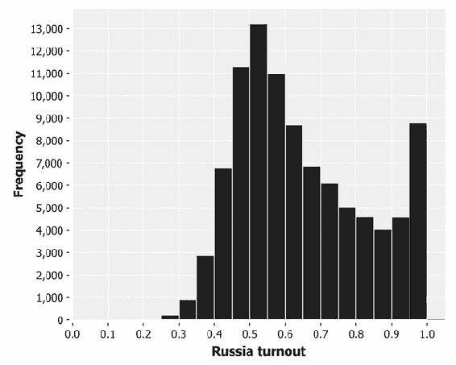

这个直方图看起来根本不像我们之前看到的经典钟形曲线。它有明显的正偏态，选民的投票率实际上从 80%增加到 100%——这与我们对正态分布数据的预期正好相反。

根据英国数据和中心极限定理所设定的预期，这是一个有趣的结果。让我们改用 Q-Q 图来可视化数据：

```py
(defn ex-1-31 []
  (->> (load-data :ru-victors)
       (i/$ :turnout)
       (c/qq-plot)
       (i/view)))
```

这将返回以下图表：

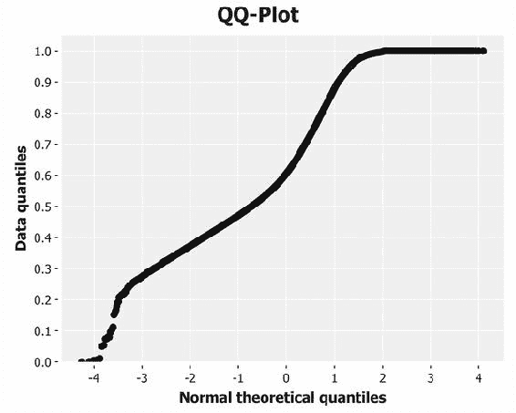

这个 Q-Q 图既不是一条直线，也不是特别 S 形的曲线。实际上，Q-Q 图暗示了分布的上端有轻微的尾部，而下端则有较重的尾部。这几乎与我们在直方图中看到的情况相反，后者明显表明右尾极重。

实际上，正是因为尾部如此沉重，Q-Q 图才会产生误导：直方图上 0.5 到 1.0 之间的点密度暗示峰值应在 0.7 左右，右尾则延续到 1.0 以外。显然，百分比超过 100%是没有逻辑的，但 Q-Q 图没有考虑到这一点（它并不知道我们在绘制百分比），因此 1.0 以上数据的突然缺失被解释为被截断的右尾。

鉴于中心极限定理以及我们在英国选举数据中观察到的情况，100%的选民投票率这一趋势颇为引人注目。让我们将英国和俄罗斯的数据集并排比较。

# 比较可视化

假设我们想比较英国和俄罗斯选民数据的分布。我们已经在本章中学习了如何使用 CDF 和箱线图，所以让我们来研究一种类似于直方图的替代方法。

我们可以尝试在直方图上绘制这两个数据集，但这不是一个好主意。我们无法解释结果，原因有二：

+   投票区的大小，以及因此而导致的分布均值，差异非常大。

+   投票区的数量差异如此之大，因此直方图的条形高度会不同

解决上述问题的一个替代方法是**概率质量函数**（**PMF**）。

## 概率质量函数

概率质量函数（PMF）与直方图有很多相似之处。不过，它不是绘制落入区间的数值计数，而是绘制从分布中抽取的数字恰好等于某一给定值的概率。由于该函数为分布中所有可能返回的值分配了概率，而且概率是在零到一的范围内度量的（其中一对应确定性），因此概率质量函数下的面积等于一。

因此，PMF 确保了我们绘制的图形下的面积在不同数据集之间是可比较的。然而，我们仍然面临投票区大小——因此分布的均值——无法直接比较的问题。这可以通过一个独立的技术——规范化来解决。

### 注意

数据规范化与正态分布无关。它是一个通用任务，用来将一个或多个数值序列对齐。根据具体情况，它可以仅仅意味着调整值使其落在相同的范围内，或者采取更复杂的程序来确保数据分布一致。通常，规范化的目的是为了便于比较两组或更多组数据。

规范化数据的方法有无数种，但最基本的一种是确保每个系列的数值都在零到一之间。我们所有的值都不会低于零，因此我们可以通过简单地除以最大值来实现这种规范化：

```py
(defn as-pmf [bins]
  (let [histogram (frequencies bins)
        total     (reduce + (vals histogram))]
    (->> histogram
         (map (fn [[k v]]
                [k (/ v total)]))
         (into {}))))
```

使用上述函数，我们可以将英国和俄罗斯的数据进行归一化，并将它们并排绘制在相同的坐标轴上：

```py
(defn ex-1-32 []
  (let [n-bins 40
        uk (->> (load-data :uk-victors)
                (i/$ :turnout)
                (bin n-bins)
                (as-pmf))
        ru (->> (load-data :ru-victors)
                (i/$ :turnout)
                (bin n-bins)
                (as-pmf))]
    (-> (c/xy-plot (keys uk) (vals uk)
                   :series-label "UK"
                   :legend true
                   :x-label "Turnout Bins"
                   :y-label "Probability")
        (c/add-lines (keys ru) (vals ru)
                     :series-label "Russia")
        (i/view))))
```

上述例子生成了以下图表：

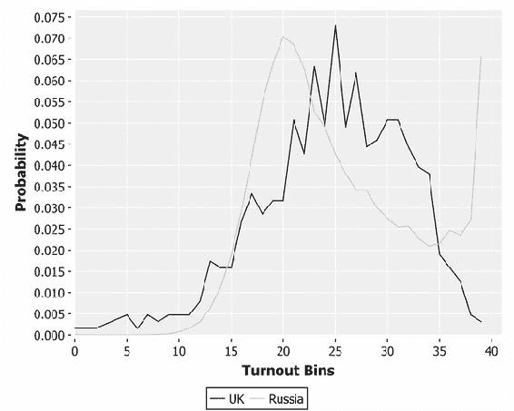

经过归一化处理后，这两个分布可以更方便地进行比较。显然，尽管俄罗斯的投票率均值低于英国，但俄罗斯选举的投票率在接近 100%的地方出现了大幅跃升。由于选举结果代表了许多独立选择的综合效应，我们预计选举结果会符合中心极限定理，呈大致正态分布。实际上，全球范围内的选举结果通常都符合这一预期。

尽管并不像分布中心的模态峰值那样高——对应大约 50%的投票率——但俄罗斯选举数据呈现出一个非常反常的结果。维也纳医科大学的研究员彼得·克里梅克及其同事甚至建议这明显是选票操控的标志。

## 散点图

我们已经观察到俄罗斯选举投票率的奇异结果，并且确认它与英国选举的签名不同。接下来，让我们看看获胜候选人的选票比例与投票率之间的关系。毕竟，如果出乎意料的高投票率真的是现任政府操纵选举的信号，那么我们预计他们会为自己投票，而不是为其他候选人投票。因此，我们预计大多数（如果不是全部的话）额外的选票将投给最终的选举获胜者。

第三章，*相关性*，将更详细地讨论相关两个变量的统计学原理，但现在，仅仅可视化投票率与获胜党派选票比例之间的关系就已经很有趣了。

本章我们将介绍的最后一个可视化图表是散点图。散点图非常适合用来可视化两个变量之间的相关性：如果存在线性相关性，它将在散点图中表现为对角线趋势。Incanter 包含了`c/scatter-plot`函数用于这种类型的图表，参数与`c/xy-plot`函数相同。

```py
(defn ex-1-33 []
  (let [data (load-data :uk-victors)]
    (-> (c/scatter-plot (i/$ :turnout data)
                        (i/$ :victors-share data)
                        :x-label "Turnout"
                        :y-label "Victor's Share")
        (i/view))))
```

上述代码生成了以下图表：

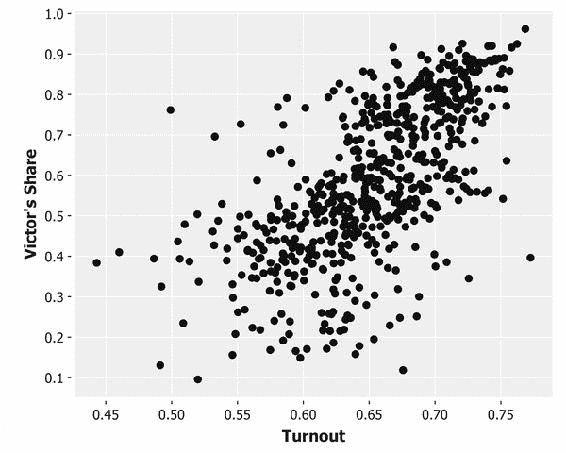

尽管这些点大致呈现为一个模糊的椭圆形，但在散点图中，明显存在向右上方的对角线趋势。这表明了一个有趣的结果——投票率与最终选举获胜者的选票比例之间存在关联。我们本可能预期到相反的结果：选民自满导致投票率降低，而在有明确胜者的情况下尤为如此。

### 注意

如前所述，2010 年英国大选远非普通选举，结果是悬浮议会和联合政府。事实上，所谓的“赢家”是指两党，这两党直到选举日之前一直是对手。选任何一方的票都算作是投给赢家的票。

接下来，我们将为俄罗斯选举创建相同的散点图：

```py
(defn ex-1-34 []
  (let [data (load-data :ru-victors)]
    (-> (c/scatter-plot (i/$ :turnout data)
                        (i/$ :victors-share data)
                        :x-label "Turnout"
                        :y-label "Victor's Share")
        (i/view))))
```

这将生成以下图表：

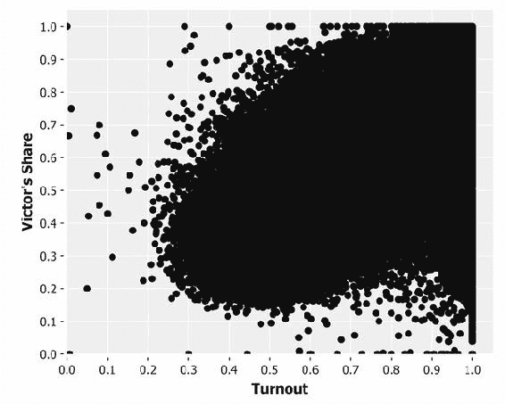

尽管俄罗斯数据中的对角趋势从点的轮廓中清晰可见，但大量数据掩盖了其内部结构。在本章的最后一部分，我们将展示一种简单的技术，利用透明度从这样的图表中提取结构。

## 散点透明度

在前面的情境中，当散点图被大量数据点淹没时，透明度可以帮助更好地可视化数据的结构。由于重叠的半透明点会变得更不透明，而点较少的区域会更透明，使用半透明点的散点图比使用实心点更能有效显示数据的密度。

我们可以使用`c/set-alpha`函数设置 Incanter 图表上绘制点的 alpha 透明度。它接受两个参数：一个图表和一个介于零到一之间的数字。1 表示完全不透明，0 表示完全透明。

```py
(defn ex-1-35 []
  (let [data (-> (load-data :ru-victors)
                 (s/sample :size 10000))]
    (-> (c/scatter-plot (i/$ :turnout data)
                        (i/$ :victors-share data)
                        :x-label "Turnout"
                        :y-label "Victor Share")
        (c/set-alpha 0.05)
        (i/view))))
```

前面的例子生成了以下图表：

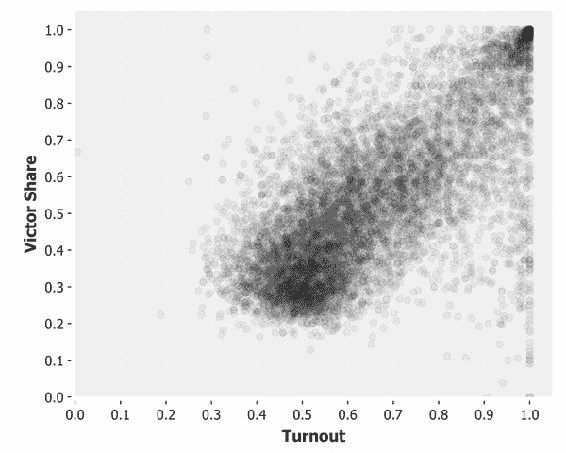

前面的散点图展示了胜者的份额与选民投票率之间通常同时变化的趋势。我们可以看到这两个值之间存在一定的相关性，并且在图表的右上角有一个“热点”，它对应着接近 100%的选民投票率和赢得选举的党派几乎拿到 100%的选票。特别是，这正是维也纳医科大学的研究人员所指出的选举舞弊的标志。这一点在世界其他地方的有争议选举结果中也十分明显，比如 2011 年乌干达总统选举的结果。

### 提示

世界其他地方许多选举的地区级结果可以在[`www.complex-systems.meduniwien.ac.at/elections/election.html`](http://www.complex-systems.meduniwien.ac.at/elections/election.html)上查看。访问该网站可以获取研究论文的链接，并下载其他数据集，帮助你实践本章关于清理和转换真实数据的知识。

我们将在第三章中更详细地讲解相关性，*相关性*，届时我们将学习如何量化两个值之间关系的强度，并基于此建立预测模型。我们还将在第十章，*可视化*中回顾这些数据，当时我们将实现一个自定义的二维直方图，以更清晰地可视化选民投票率与获胜党派选票比例之间的关系。

# 总结

在本章中，我们学习了总结性统计和分布的价值。我们已经看到，即使是简单的分析，也能提供潜在欺诈活动的证据。

尤其是，我们遇到了中心极限定理，并理解了它为何如此有助于解释正态分布在数据科学中的普遍性。一个合适的分布可以用少数几个统计量来代表一大串数字的本质，我们在本章中已经使用纯 Clojure 函数实现了其中的几个。我们还介绍了 Incanter 库，并用它加载、转换和可视化地比较了几个数据集。然而，我们并未做更多的工作，只能注意到两个分布之间一个有趣的差异。

在下一章中，我们将扩展关于描述性统计的知识，涵盖推断统计。这将使我们能够量化两个或更多分布之间的测量差异，并判断这种差异是否具有统计显著性。我们还将学习假设检验——一种进行稳健实验的框架，使我们能够从数据中得出结论。
