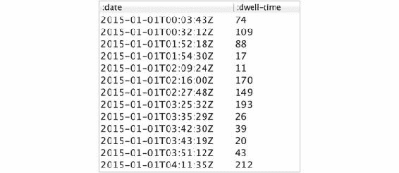
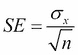
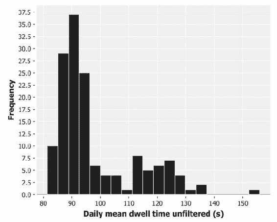
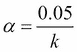
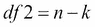

# 第二章 推断

|   | *“我什么也看不见，”我说着，把它递还给我的朋友。**“相反，沃森，你什么都看得见。你只是没有从你所见的事物中推理出来。然而，你在得出结论时过于胆怯。”* |   |
| --- | --- | --- |
|   | --*阿瑟·柯南·道尔，《蓝宝石冒险》* |

在上一章中，我们介绍了多种数值和视觉方法来理解正态分布。我们讨论了描述性统计量，例如均值和标准差，以及它们如何用于简洁地总结大量数据。

数据集通常是某个更大总体的样本。有时，这个总体过于庞大，无法完全测量。有时，它本质上是无法测量的，可能是因为它的大小是无限的，或因为其他原因无法直接访问。无论是哪种情况，我们都不得不从已有的数据中进行概括。

在本章中，我们将讨论统计推断：如何超越仅仅描述数据样本，而是描述它们来自的总体。我们将详细探讨我们对从数据样本中得出的推断的置信度。我们还将讨论假设检验：一种强健的数据分析方法，它将科学带入数据科学。我们还将使用 ClojureScript 实现一个交互式网页，以模拟样本与它们所来自总体之间的关系。

为了帮助说明这些原理，我们将虚构一个公司——AcmeContent，假设它最近聘请我们作为数据科学家。

# 介绍 AcmeContent

为了帮助说明本章的概念，假设我们最近被聘为 AcmeContent 公司的数据科学家。该公司运营着一个网站，让访问者分享他们在网上喜欢的视频片段。

AcmeContent 通过其网站分析跟踪的一个指标是**停留时间**。这是衡量访问者在网站上停留多久的指标。显然，花费较长时间在网站上的访问者通常是在享受网站的内容，AcmeContent 希望访问者尽可能长时间停留。如果平均停留时间增加，我们的首席执行官将非常高兴。

### 注意

停留时间是指访问者第一次到达网站和他们做出最后一次请求之间的时间长度。

**跳出率**是指只做出一次请求的访问者——他们的停留时间为零。

作为公司的新数据科学家，我们的任务是分析网站分析报告中的停留时间，并衡量 AcmeContent 网站的成功程度。

# 下载示例代码

本章的代码可以在[`github.com/clojuredatascience/ch2-inference`](https://github.com/clojuredatascience/ch2-inference)上找到，也可以从 Packt Publishing 的网站获取。

这个示例数据是专门为本章生成的。它足够小，因此已与书中的示例代码一起包含在数据目录中。请查阅本书的 wiki：[`wiki.clojuredatascience.com`](http://wiki.clojuredatascience.com)以获取关于停留时间分析的进一步阅读链接。

# 加载并检查数据

在上一章中，我们使用 Incanter 的`incanter.excel/load-xls`函数加载了 Excel 电子表格。在本章中，我们将从一个以制表符分隔的文本文件中加载数据集。为此，我们将使用`incanter.io/read-dataset`，它期望接收一个 URL 对象或一个表示文件路径的字符串。

该文件已由 AcmeContent 的网页团队进行了有益的重新格式化，包含了两列——请求日期和停留时间（单位：秒）。第一行是列标题，因此我们向`read-dataset`传递`:header true`：

```py
(defn load-data [file]
  (-> (io/resource file)
      (iio/read-dataset :header true :delim \tab)))

(defn ex-2-1 []
  (-> (load-data "dwell-times.tsv")
      (i/view)))
```

如果你运行这段代码（无论是在 REPL 中还是通过命令行使用`lein run –e 2.1`），你应该会看到类似如下的输出：



让我们看看停留时间以直方图的形式呈现出来是什么样的。

# 可视化停留时间

我们可以通过简单地使用`i/$`提取`:dwell-time`列来绘制停留时间的直方图：

```py
(defn ex-2-2 []
  (-> (i/$ :dwell-time (load-data "dwell-times.tsv"))
      (c/histogram :x-label "Dwell time (s)"
                   :nbins 50)
      (i/view)))
```

之前的代码生成了以下的直方图：


显然，这不是一个正态分布的数据，甚至也不是一个非常偏斜的正态分布。峰值左侧没有尾部（访客显然不可能在我们的网站停留不到零秒）。虽然数据开始时右侧急剧下降，但它沿着*x*轴延伸得比我们从正态分布数据中预期的要远得多。

当遇到像这样的分布时，其中大部分值都很小，但偶尔出现极端值，使用**对数尺度**绘制*y*轴可能会很有用。对数尺度用于表示覆盖非常大范围的事件。通常，图表的坐标轴是线性的，它们将一个范围分割成相等大小的步骤，就像我们在学校学过的“数字线”。对数尺度则将范围分割成随着离原点越来越远而逐渐增大的步骤。

一些测量自然现象的系统，涵盖了非常大的范围，通常会使用对数尺度表示。例如，地震的里氏震级就是一个以 10 为底的对数尺度，这意味着震级为 5 的地震是震级为 4 的地震的 10 倍。分贝尺度也是一个对数尺度，但它有不同的底数——30 分贝的声波的强度是 20 分贝声波的 10 倍。在每种情况下，原理都是一样的——使用对数尺度可以将一个非常大的值范围压缩到一个更小的范围内。

在 Incanter 中，通过`c/set-axis`将我们的*y*轴绘制为`log-axis`非常简单：

```py
(defn ex-2-3 []
  (-> (i/$ :dwell-time (load-data "dwell-times.tsv"))
      (c/histogram :x-label "Dwell time (s)"
                   :nbins 20)
      (c/set-axis :y (c/log-axis :label "Log Frequency"))
      (i/view)))
```

默认情况下，Incanter 将使用以 10 为底的对数尺度，这意味着轴上的每一个刻度代表的范围是前一步的 10 倍。像这样的图表——只有一个轴是对数尺度——称为**对数-线性**图。毫不奇怪，显示两个对数轴的图表称为**对数-对数图**。


在对数-线性图上绘制停留时间能够显示数据中的隐藏一致性——停留时间与频率的对数之间存在线性关系。除了图表右侧（那里的访问者少于 10 个）出现关系不再清晰外，其他部分该关系非常一致。

在对数-线性图上，直线是指数分布的明显指示。

# 指数分布

指数分布通常出现在考虑有许多小的正量和较少的较大量的情况时。根据我们对里氏震级的了解，地震的震级遵循指数分布这一点应该不会令人惊讶。

该分布也经常出现在等待时间中——直到下一次任何震级的地震发生的时间大致也遵循指数分布。该分布常用于建模故障率，本质上是指机器故障的等待时间。我们的指数分布模型类似于故障过程——即访问者厌倦并离开我们网站的等待时间。

指数分布具有许多有趣的性质。其中之一与均值和标准差有关：

```py
(defn ex-2-4 []
  (let [dwell-times (->> (load-data "dwell-times.tsv")
                         (i/$ :dwell-time))]
    (println "Mean:  " (s/mean dwell-times))
    (println "Median:" (s/median dwell-times))
    (println "SD:    " (s/sd dwell-times))))

Mean:   93.2014074074074
Median: 64.0
SD:     93.96972402519796
```

均值和标准差非常相似。实际上，对于理想的指数分布，它们是完全相同的。这个特性适用于所有的指数分布——均值越大，标准差也越大。

### 注意

对于指数分布，均值和标准差相等。

指数分布的第二个特性是它是**无记忆**的。这是一个与直觉相反的特性，最好的说明方法是通过一个例子来展示。我们通常认为，随着访问者继续浏览我们的网站，他们厌倦并离开的概率会增加。由于平均停留时间为 93 秒，因此可能会出现这样的想法：超过 93 秒后，他们继续浏览的可能性会越来越小。

指数分布的无记忆特性告诉我们，访问者在我们的网站上停留额外 93 秒的概率，与他们已经浏览了 93 秒、5 分钟、1 小时，还是刚刚到达网站时的浏览时间无关。

### 注意

对于无记忆分布，继续再等额外的*x*分钟的概率与已经经过的时间无关。

指数分布的记忆无关特性在一定程度上解释了为何如此难以预测地震何时发生。我们必须依赖其他证据（例如地磁扰动），而非时间的流逝。

由于中位数停留时间为 64 秒，大约一半的访客只在网站停留约一分钟。平均值 93 秒表明，有些访客停留的时间要长得多。这些统计数据是基于过去 6 个月所有访客计算的。可能有趣的是，看看这些统计数据在每天的变化。让我们现在计算一下。

## 日均值分布

网络团队提供的文件包含了访问的时间戳。为了按天汇总数据，我们需要从日期中移除时间部分。虽然我们可以通过字符串操作来完成这一任务，但更灵活的方法是使用日期和时间库，如`clj-time`（[`github.com/clj-time/clj-time`](https://github.com/clj-time/clj-time)）来解析字符串。这将不仅使我们能够移除时间，还能执行任意复杂的过滤操作（例如，筛选特定的星期几，或每月的第一天或最后一天）。

`clj-time.predicates` 命名空间包含了多种有用的谓词，而 `clj-time.format` 命名空间包含了尝试使用预定义的标准格式将字符串转换为日期时间对象的解析函数。如果我们的时间戳不是标准格式，我们可以使用相同的命名空间构建自定义格式化器。更多信息和使用示例，请参考 `clj-time` 文档：

```py
(defn with-parsed-date [data]
  (i/transform-col data :date (comp tc/to-local-date f/parse)))

(defn filter-weekdays [data]
  (i/$where {:date {:$fn p/weekday?}} data))

(defn mean-dwell-times-by-date [data]
  (i/$rollup :mean :dwell-time :date data))

(defn daily-mean-dwell-times [data]
  (->> (with-parsed-date data)
       (filter-weekdays)
       (mean-dwell-times-by-date)))
```

将前面的函数结合起来，我们可以计算日均停留时间的平均值、中位数和标准差：

```py
(defn ex-2-5 []
  (let [means (->> (load-data "dwell-times.tsv")
                   (daily-mean-dwell-times)
                   (i/$ :dwell-time))]
    (println "Mean:   " (s/mean means))
    (println "Median: " (s/median means))
    (println "SD:     " (s/sd means))))

;; Mean:    90.210428650562
;; Median:  90.13661202185791
;; SD:      3.722342905320035
```

我们的日均值的平均值是 90.2 秒。这个值接近我们之前计算的整个数据集（包括周末）的平均值。然而，标准差要低得多，仅为 3.7 秒。换句话说，日均值的分布比整个数据集的标准差要小得多。接下来，让我们在图表上绘制日均停留时间：

```py
(defn ex-2-6 []
  (let [means (->> (load-data "dwell-times.tsv")
                   (daily-mean-dwell-times)
                   (i/$ :dwell-time))]
    (-> (c/histogram means
                     :x-label "Daily mean dwell time (s)"
                     :nbins 20)
        (i/view))))
```

这段代码生成了以下的直方图：


样本均值的分布围绕整体总均值 90 秒对称，标准差为 3.7 秒。与这些均值抽样的分布——指数分布不同，样本均值的分布呈正态分布。

# 中心极限定理

我们在上一章中遇到了中心极限定理，当时我们从均匀分布中取样并对其求平均。实际上，中心极限定理适用于任何值的分布，只要该分布的标准差是有限的。

### 注意

中心极限定理指出，不管样本是从哪种分布中计算出来的，样本均值的分布将是正态分布。

无论基础分布是否为指数分布，都不重要——中心极限定理表明，从任何分布中随机抽取的样本的均值将接近正态分布。让我们在直方图上绘制正态曲线，看看它与实际数据的匹配程度。

为了在我们的直方图上绘制正态曲线，我们必须将直方图绘制为密度直方图。这样绘制的是每个桶中所有数据点的比例，而不是频率。然后，我们可以叠加具有相同均值和标准差的正态概率密度：

```py
(defn ex-2-7 []
  (let [means (->> (load-data "dwell-times.tsv")
                   (daily-mean-dwell-times)
                   (i/$ :dwell-time))
        mean (s/mean means)
        sd   (s/sd means)
        pdf  (fn [x]
               (s/pdf-normal x :mean mean :sd sd))]
    (-> (c/histogram means
                     :x-label "Daily mean dwell time (s)"
                     :nbins 20
                     :density true)
        (c/add-function pdf 80 100)
        (i/view))))
```

该代码生成了以下图表：


绘制在直方图上的正态曲线的标准差大约是 3.7 秒。换句话说，这量化了每天均值相对于 90 秒总体均值的变异。我们可以将每天的均值看作是来自总体的样本，而前面提到的曲线表示的是样本均值的分布。因为 3.7 秒是样本均值与总体均值的差异，所以它被称为**标准误差**。

# 标准误差

标准差衡量样本内部的变异量，而标准误差衡量从同一总体中抽取样本的均值之间的变异量。

### 注意

标准误差是样本均值分布的标准差。

我们通过查看过去 6 个月的数据经验性地计算了停留时间的标准误差。但也有一个方程式，允许我们仅通过一个样本来计算它：



这里，*σ[x]* 是标准差，*n* 是样本大小。这与我们在上一章中学习的描述性统计不同。描述性统计描述的是单个样本，而标准误差试图描述样本的一般特性——即样本均值的变异量，可以预期给定大小的样本会有变异：

```py
(defn standard-deviation [xs]
  (Math/sqrt (variance xs)))

(defn standard-error [xs]
  (/ (standard-deviation xs)
     (Math/sqrt (count xs))))
```

均值的标准误差与两个因素有关：

+   样本大小

+   总体标准差

样本大小对标准误差的影响最大。由于我们需要对样本大小取平方根，因此必须将样本大小增加四倍才能使标准误差减半。

可能会让人感到奇怪的是，总体样本的比例对标准误差的大小没有影响。这其实是好事，因为某些总体的大小可能是无限的。

# 样本与总体

"样本"和"总体"这两个词对统计学家来说有着非常特殊的含义。总体是研究者希望理解或从中得出结论的所有实体的集合。例如，在 19 世纪下半叶，遗传学的奠基人格雷戈尔·约翰·孟德尔记录了豌豆植物的观察数据。尽管他是在实验室中研究特定的植物，但他的目标是理解所有可能的豌豆植物中的遗传机制。

### 注意

统计学家将从中抽取样本的实体群体称为总体，无论被研究的对象是否为人类。

由于总体可能非常大——或像孟德尔研究的豌豆植物那样是无限的——我们必须研究具有代表性的样本，并从中推断总体。为了区分样本的可测量属性和总体的不可得属性，我们使用"统计量"一词来指代*样本*属性，使用"参数"一词来指代总体属性。

### 注意

统计量是我们可以从样本中测量的属性。参数是我们试图推断的总体属性。

事实上，统计量和参数通过在数学公式中使用不同的符号来区分：

| 测量 | 样本统计量 | 总体参数 |
| --- | --- | --- |
| 项目数量 | *n* | *N* |
| 均值 |  | *µ[x]* |
| 标准差 | *S[x]* | *σ[x]* |
| 标准误差 |  |   |

这里，  发音为"x-bar"，*µ[x]* 发音为"mu x"，*σ[x]* 发音为"sigma x"。

如果你回顾标准误差的公式，你会注意到它是从总体标准差*σ[x]*而不是样本标准差*S[x]*中计算得出的。这给我们带来了一个悖论——我们无法在总体参数正是我们试图推断的值时，使用总体参数来计算样本统计量。然而，实际上，当样本量大约在 30 以上时，样本标准差和总体标准差通常假设是相同的。

让我们从某一天的均值来计算标准误差。例如，假设我们选择某一天，比如 5 月 1 日：

```py
(defn ex-2-8 []
  (let [may-1 (f/parse-local-date "2015-05-01")]
    (->> (load-data "dwell-times.tsv")
         (with-parsed-date)
         (filtered-times {:date {:$eq may-1}})
         (standard-error))))

;; 3.627
```

尽管我们只从一天的数据中抽取了一个样本，但我们计算出的标准误差与所有样本均值的标准差非常接近——3.6 与 3.7。就像一个包含 DNA 的细胞一样，每个样本都编码了关于整个总体的信息。

# 置信区间

由于我们的样本的标准误差衡量了我们预期样本均值与总体均值之间的匹配程度，我们也可以考虑其逆向——标准误差衡量了我们预期总体均值与我们测得的样本均值之间的匹配程度。换句话说，基于我们的标准误差，我们可以推断总体均值在某个预期的样本均值范围内，并且具有一定的置信度。

总的来说，“置信度”和“预期范围”共同定义了**置信区间**。在陈述置信区间时，通常会陈述 95% 置信区间——我们有 95% 的信心认为总体参数位于该区间内。当然，仍然有 5% 的可能性它不在其中。


无论标准误差是多少，95% 的总体均值将位于样本均值的 -1.96 和 1.96 个标准差之间。因此，1.96 是 95% 置信区间的*临界 z 值*。

### 注意

*z*-值这个名字来源于正态分布也被称为*z*-分布的事实。

数字 1.96 使用得非常广泛，是一个值得记住的数字，但我们也可以使用 `s/quantile-normal` 函数来计算临界值。我们接下来的 `confidence-interval` 函数期望输入一个在零到一之间的 `p` 值。对于我们的 95% 置信区间，这个值为 0.95。我们需要从 1 中减去它并除以 2，以计算两个尾部的大小（95% 置信区间的 2.5%）：

```py
(defn confidence-interval [p xs]
  (let [x-bar  (s/mean xs)
        se     (standard-error xs)
        z-crit (s/quantile-normal (- 1 (/ (- 1 p) 2)))]
    [(- x-bar (* se z-crit))
     (+ x-bar (* se z-crit))]))

(defn ex-2-9 []
  (let [may-1 (f/parse-local-date "2015-05-01")]
    (->> (load-data "dwell-times.tsv")
         (with-parsed-date)
         (filtered-times {:date {:$eq may-1}})
         (confidence-interval 0.95))))

;; [83.53415272762004 97.75306531749274]
```

结果告诉我们，我们可以有 95% 的信心认为总体均值位于 83.53 秒到 97.75 秒之间。事实上，我们之前计算的总体均值正好位于这个范围之内。

## 样本比较

在一次病毒式营销活动之后，AcmeContent 的网络团队从单一天的数据中为我们提供了一个停留时间的样本以供分析。他们想知道他们最新的营销活动是否吸引了更多互动的访客。置信区间为我们提供了一种直观的方式来比较这两个样本。

我们像之前一样加载来自活动的停留时间，并以相同的方式对其进行总结：

```py
(defn ex-2-10 []
  (let [times (->> (load-data "campaign-sample.tsv")
                   (i/$ :dwell-time))]
    (println "n:      " (count times))
    (println "Mean:   " (s/mean times))
    (println "Median: " (s/median times))
    (println "SD:     " (s/sd times))
    (println "SE:     " (standard-error times))))

;; n:       300
;; Mean:    130.22
;; Median:  84.0
;; SD:      136.13370714388046
;; SE:      7.846572839994115
```

这个均值似乎比我们之前看到的均值要大得多——130 秒对比 90 秒。这里可能存在显著差异，尽管标准误差是我们之前一天样本的两倍多，这是由于样本量较小且标准差较大。我们可以使用和之前相同的 `confidence-interval` 函数基于这些数据计算总体均值的 95% 置信区间：

```py
(defn ex-2-11 []
  (->> (load-data "campaign-sample.tsv")
       (i/$ :dwell-time)
       (confidence-interval 0.95)))

;; [114.84099983154137 145.59900016845864]
```

总体均值的 95%置信区间是 114.8 秒到 145.6 秒。这与我们之前计算的 90 年代的总体均值完全不重合。看起来存在一个很大的基础群体差异，单纯通过抽样误差是不太可能产生的。现在我们的任务是找出原因。

## 偏差

样本应当能够代表其所抽取的总体。换句话说，它应当避免产生偏差，使得某些种类的群体成员在系统性地被排除（或包含）时，相较于其他群体而言，受到不公正的影响。

一个著名的样本偏差例子是 1936 年《文学文摘》对美国总统选举的民调。这是历史上最大、最昂贵的民调之一，共有 240 万人通过邮件接受调查。结果非常明确——堪萨斯州的共和党州长阿尔弗雷德·兰登将击败富兰克林·D·罗斯福，获得 57%的选票。然而，最终罗斯福以 62%的选票赢得了选举。

该杂志巨大的抽样误差的主要原因是样本选择偏差。在试图收集尽可能多的选民地址时，《文学文摘》翻阅了电话簿、杂志订阅名单和俱乐部会员名单。在那个电话是奢侈品的时代，这一过程必然会偏向上层和中产阶级选民，无法代表整个选民群体。偏差的次要原因是**无应答偏差**——不到四分之一的受访者回应了调查。这是一种选择偏差，只偏向那些真正愿意参与的受访者。

避免样本选择偏差的常见方法是确保采样在某种程度上是随机的。将随机性引入过程可以减少实验因素不公平地影响样本质量的可能性。《文学文摘》民调的重点是尽可能获得最大的样本，但一个无偏的小样本比一个错误选择的大样本更有用。

如果我们打开`campaign-sample.tsv`文件，我们会发现我们的样本完全来自 2015 年 6 月 6 日。这一天是周末，我们可以通过`clj-time`轻松确认这一点：

```py
(p/weekend? (t/date-time 2015 6 6))
;; true
```

到目前为止，我们的汇总统计数据都是基于我们只筛选了工作日数据的结果。这是样本中的一种偏差，如果周末的访问者行为与工作日的行为有所不同——这是一种非常可能的情况——那么我们可以说，这些样本代表了两个不同的群体。

# 可视化不同群体

让我们去掉工作日的筛选条件，绘制工作日和周末的日均停留时间：

```py
(defn ex-2-12 []
  (let [means (->> (load-data "dwell-times.tsv")
                   (with-parsed-date)
                   (mean-dwell-times-by-date)
                   (i/$ :dwell-time))]
    (-> (c/histogram means
                     :x-label "Daily mean dwell time unfiltered (s)"
                     :nbins 20)
        (i/view))))
```

代码生成了以下直方图：



这时的分布不再是正态分布。事实上，分布是**双峰分布**——有两个峰值。第二个较小的峰值，代表新加入的周末数据，相对较低，这既是因为周末天数少于工作日，也因为分布的标准误差较大。

### 注意

通常，具有多个峰值的分布称为**多峰分布**。它们可能表示两个或更多的正态分布被合并，因此，可能表示两个或更多的人群被合并。一个经典的双峰分布的例子是人的身高分布，因为男性的常见身高大于女性的常见身高。

周末数据与工作日数据具有不同的特征。我们应确保在比较时是“对比相同的事物”。让我们将原始数据集过滤，仅保留周末数据：

```py
(defn ex-2-13 []
  (let [weekend-times (->> (load-data "dwell-times.tsv")
                           (with-parsed-date)
                           (i/$where {:date {:$fn p/weekend?}})
                           (i/$ :dwell-time))]
    (println "n:      " (count weekend-times))
    (println "Mean:   " (s/mean weekend-times))
    (println "Median: " (s/median weekend-times))
    (println "SD:     " (s/sd weekend-times))
    (println "SE:     " (standard-error weekend-times))))

;; n:       5860
;; Mean:    117.78686006825939
;; Median:  81.0
;; SD:      120.65234077179436
;; SE:      1.5759770362547665
```

周末的总体均值（基于 6 个月的数据）为 117.8 秒，落在市场样本的 95%置信区间内。换句话说，虽然 130 秒是较高的均值，甚至对于周末来说，但这一差异并不大到无法仅归因于样本内的随机波动。

我们刚才采取的建立人群差异（即周末访问者与工作日访问者之间的差异）的方法，并不是统计检验常规的做法。更常见的方法是从一个理论开始，然后用数据检验这个理论。统计方法为此定义了一种严格的流程，称为**假设检验**。

# 假设检验

假设检验是统计学家和数据科学家的正式过程。假设检验的标准方法是定义一个研究领域，决定哪些变量是必要的以测量所研究的内容，然后提出两个竞争的假设。为了避免只看符合我们偏见的数据，研究人员会事先明确陈述他们的假设。然后，统计数据可以用来根据数据确认或否定这个假设。

为了帮助留住我们的访客，设计师开始修改主页，采用所有最新的技术来吸引观众的注意力。我们希望确保我们的努力不会白费，因此我们将关注新网站上的停留时间是否有所增加。

因此，我们的研究问题是“新网站是否导致访客的停留时间增加”？我们决定用均值停留时间来进行检验。现在，我们需要列出两个假设。按惯例，数据被假设不包含研究者所寻找的内容。保守的观点是，数据不会显示任何异常。这就是**零假设**，通常用*H[0]*表示。

### 注意

假设检验假定原假设为真，直到证据的权重使得这个假设变得不太可能。这种“倒过来看”证据的方法部分是由一个简单的心理事实驱动的：当人们去寻找某样东西时，他们倾向于找到它。

研究者随后形成一个备择假设，表示为*H[1]*。这可能仅仅意味着总体均值与基准值不同。或者，它可能意味着总体均值大于或小于基准值，甚至可能大于或小于某个特定值。我们希望测试新网站是否能增加停留时间，因此这些将是我们的原假设和备择假设：

+   *H[0]*：新网站的停留时间与现有网站的停留时间没有区别。

+   *H[1]*：新网站的停留时间相比于现有网站更长。

我们的保守假设是新网站对用户停留时间没有影响。原假设不一定是“无效假设”（即没有效应），但在这种情况下，我们没有合理的理由假设它有所不同。如果样本数据不支持原假设（如果数据与其预测的差异过大，不可能仅由偶然造成），我们将拒绝原假设，并提出备择假设作为最好的替代解释。

在设定原假设和备择假设后，我们必须设定一个显著性水平，用来衡量我们是否在寻找某种效应。

## 显著性

显著性检验最初是独立于假设检验开发的，但如今这两种方法常常一起使用。显著性检验的目的是设定一个阈值，超过该阈值我们认为观察到的数据不再支持原假设。

因此，存在两个风险：

+   我们可能会接受一个差异是显著的，而实际上它可能是偶然产生的。

+   我们可能会将一个差异归因于偶然，而实际上它代表了一个真正的总体差异。

这两种可能性分别被称为第一类错误和第二类错误：

|   | *H[0]* 错误 | *H[0]* 正确 |
| --- | --- | --- |
| **拒绝 H[0]** | 真阴性 | 第一类错误 |
| **接受** *H[0]* | 第二类错误 | 真阳性 |

我们减少第一类错误的风险时，第二类错误的风险就会增加。换句话说，我们希望避免在没有真实差异时错误地认为有差异，因此我们要求样本之间有更大的差异才能宣称统计显著性。这增加了我们忽略真正差异的可能性。

统计学家常用两个显著性阈值。这些分别是 5%的显著性水平和 1%的显著性水平。5%的差异通常被称为*显著*，而 1%的差异被称为*高度显著*。阈值的选择通常用希腊字母α（*α*）在公式中表示。由于找不到效果可能被认为是失败（无论是实验失败还是新网站失败），我们可能会倾向于调整*α*，直到我们发现效果为止。因此，教科书中的显著性检验方法要求我们在查看数据之前就设定显著性水平。5%的水平通常是默认选择的，所以我们也选择这个水平。

# 测试新网站设计

AcmeContent 的网络团队一直在努力开发一个新的网站，目的是鼓励访客停留更长时间。他们采用了所有最新的技术，因此我们非常有信心这个网站能够显著提高停留时间。

AcmeContent 并不打算一次性将其推出给所有用户，而是希望先在一小部分访客中进行测试。我们已经向他们讲解了样本偏差，因此网络团队将网站流量的 5%随机导向新网站，持续一天。结果以单个文本文件的形式提供给我们，文件中包含当天所有的流量数据。每行显示的是一个访客的停留时间，并给出一个值，"0"表示他们使用了原始网站设计，"1"表示他们看到了新的（并且希望能改进的）网站。

## 进行 z 检验

在之前使用置信区间进行测试时，我们有一个单一的总体均值来进行比较。

通过*z*检验，我们可以选择比较两个样本。观看新网站的人是随机分配的，且两个组的数据是在同一天收集的，以排除其他时间相关因素的干扰。

由于我们有两个样本，因此我们也有两个标准误差。z 检验是基于合并标准误差进行的，合并标准误差只是将方差的和除以样本大小后再开方。这与我们将样本合并后的标准误差相同：


在这里，是样本*a*的方差，是样本*b*的方差。*n[a]*和*n[b]*分别是样本*a*和*b*的样本大小。合并标准误差可以像这样在 Clojure 中计算：

```py
(defn pooled-standard-error [a b]
  (i/sqrt (+ (/ (i/sq (standard-deviation a)) (count a))
             (/ (i/sq (standard-deviation b)) (count b)))))
```

为了确定我们所看到的差异是否异常大，我们可以计算观测到的均值差异与合并标准误差的比值。这个值被赋予变量名*z*：


使用我们的`pooled-standard-error`函数，可以像这样计算*z*统计量：

```py
(defn z-stat [a b]
  (-> (- (mean a)
         (mean b))
      (/ (pooled-standard-error a b))))
```

*z*比率反映了均值相差的大小，相对于标准误差的期望量。因此，*z*-统计量告诉我们均值之间相差多少个标准误差。由于标准误差服从正态分布，我们可以通过查找标准正态累积分布（CDF）来将这个差异与概率关联起来：

```py
(defn z-test [a b]
  (s/cdf-normal (z-stat a b)))
```

以下示例使用*z*-检验来比较两个网站的性能。我们通过按网站分组行，将网站索引到网站行集合的映射。我们调用`map-vals`与`(partial map :dwell-time)`一起，将行集合转换为停留时间集合。`map-vals`是 Medley（[`github.com/weavejester/medley`](https://github.com/weavejester/medley)）库中定义的一个轻量级工具函数：

```py
(defn ex-2-14 []
    (let [data (->> (load-data "new-site.tsv")
                    (:rows)
                    (group-by :site)
                    (map-vals (partial map :dwell-time)))
          a (get data 0)
          b (get data 1)]
      (println "a n:" (count a))
      (println "b n:" (count b))
      (println "z-stat: " (z-stat a b))
      (println "p-value:" (z-test a b))))

;; a n: 284
;; b n: 16
;; z-stat:  -1.6467438180091214
;; p-value: 0.049805356789022426
```

设置 5%的显著性水平就像设置 95%的置信区间本质上是一样的。实质上，我们在查看观察到的差异是否落在 95%的置信区间之外。如果是这样，我们可以声称找到了一个在 5%的显著性水平上显著的结果。

### 注意

*p*-值是指在原假设真实的情况下，错误地拒绝原假设的概率。*p*-值越小，我们越能确信原假设是错误的，并且我们发现了一个真正的效应。

这段代码返回的值为 0.0498，等于 4.98%。因为这个值略低于我们的显著性阈值 5%，所以我们可以声称我们发现了显著的结果。

让我们回顾一下原假设和备择假设：

+   *H[0]*: 新网站的停留时间与现有网站的停留时间没有差异。

+   *H[1]*: 新网站的停留时间比现有网站的停留时间更长。

我们的备择假设是新网站的停留时间更长。

我们准备声称统计显著性，并且新网站的停留时间比现有网站的停留时间更长，但我们遇到一个问题——样本量较小时，样本标准差与总体标准差匹配的不确定性增加。我们的新网站样本只有 16 位访问者，如前面例子中的输出所示。像这样的样本量会使得标准误差服从正态分布的假设无效。

幸运的是，有一种统计检验和相应的分布可以模型化样本量较小时标准误差的不确定性增大。

## 斯图登特的 t 分布

*t*-分布由威廉·西利·戈塞特（William Sealy Gossett）推广，他是爱尔兰吉尼斯啤酒厂的化学家，他将其应用于他的 Stout 分析中。

### 注意

威廉·戈塞特在 1908 年在《Biometrika》上发表了这个检验，但由于他的雇主认为他们使用统计学是商业机密，戈塞特被迫使用笔名。他选择的笔名是“学生（Student）”。

虽然正态分布完全由两个参数——均值和标准差描述，但*t*分布只由一个参数描述，即**自由度**。自由度越大，*t*分布越接近均值为零、标准差为一的正态分布。当自由度减小时，分布变得更宽，尾部比正态分布更胖。


前面的图表显示了*t*分布相对于正态分布在不同自由度下的变化。较小样本量对应着更胖的尾部，这意味着观察到大偏差的概率更高。

## 自由度

自由度，通常缩写为*df*，与样本大小密切相关。它是一个有用的统计量，也是一个直观的系列属性，可以通过简单的例子进行演示。

如果你被告知两个值的均值为 10 且其中一个值为 8，你不需要任何额外的信息就能推断出另一个值是 12。换句话说，对于样本量为 2 且均值已知的情况，一旦知道其中一个值，另一个值就有约束。

如果你被告知三个值的均值为 10 且第一个值也是 10，你就无法推断出剩余两个值是什么。因为有无限多个以 10 为起始值且均值为 10 的三个数字集合，在你能推断出第三个值之前，必须先指定第二个值。

对于任何三个数字的集合，约束是简单的：你可以自由选择前两个数字，但最后一个数字是有约束的。自由度可以通过以下方式概括：对于任何单一样本，自由度为样本大小减一。

在比较两个数据样本时，自由度是样本大小总和减去 2，即等于它们各自自由度的总和。

# t 统计量

在使用*t*分布时，我们查找*t*统计量。与*z*统计量类似，该值量化了某一特定观察偏差的不太可能性。对于双样本*t*检验，t 统计量的计算方式如下：


这里，是合并标准误差。我们可以像之前一样计算合并标准误差：


然而，该方程假设已知总体参数*σ[a]*和*σ[b]*，这些只能通过大样本来近似。*t*检验是为小样本设计的，因此不需要我们对总体方差做出假设。

因此，对于*t*检验，我们将合并的标准误差写为标准误差的平方和的平方根：


实际上，前面提到的两条关于合并标准误差的公式在给定相同输入数据的情况下会得到相同的结果。符号的不同仅仅是为了说明在*t*检验中，我们只依赖样本统计量作为输入。合并标准误差可以通过以下方式计算：

```py
(defn pooled-standard-error [a b]
  (i/sqrt (+ (i/sq (standard-error a))
             (i/sq (standard-error b)))))
```

尽管在数学符号上有所不同，但实际上，计算*t*-统计量与计算*z*-统计量是相同的：

```py
(def t-stat z-stat)

(defn ex-2-15 []
    (let [data (->> (load-data "new-site.tsv")
                    (:rows)
                    (group-by :site)
                    (map-vals (partial map :dwell-time)))
          a (get data 0)
          b (get data 1)]
      (t-stat a b)))

;; -1.647
```

这两种统计量之间的差异是概念性的，而非算法性的——*z*-统计量仅适用于样本遵循正态分布的情况。

# 执行 t 检验

*t*-检验的工作方式的不同，源自用于计算*p*值的概率分布。计算了我们的*t*-统计量后，我们需要根据数据的自由度查找*t*-分布中的值：

```py
(defn t-test [a b]
  (let [df (+ (count a) (count b) -2)]
    (- 1 (s/cdf-t (i/abs (t-stat a b)) :df df))))
```

自由度是样本总量减去二，即我们样本的自由度是 298。


回想一下，我们正在进行假设检验。因此，首先让我们陈述零假设和备择假设：

+   *H[0]*：此样本来自具有给定均值的总体

+   *H[1]*：此样本来自具有更大均值的总体

让我们运行这个示例：

```py
(defn ex-2-16 []
  (let [data (->> (load-data "new-site.tsv")
                  (:rows)
                  (group-by :site)
                  (map-vals (partial map :dwell-time)))
        a (get data 0)
        b (get data 1)]
    (t-test a b)))

;; 0.0503
```

这返回一个超过 0.05 的*p*值。由于这个值大于我们为假设检验设置的 5% *α*，我们无法拒绝零假设。我们对于均值差异的检验没有通过*t*检验发现显著差异。因此，*z*-检验所得到的微弱显著结果部分是由于样本量太小。

## 双尾检验

在我们的备择假设中，隐含假设新站点的表现会优于旧站点。假设检验的过程会尽可能避免在寻找统计显著性时暗中引入隐性假设。

只关注数量显著增加或减少的检验被称为**单尾检验**，通常是不被推荐的，除非发生相反方向的变化是不可行的。这个名字来源于单尾检验将所有的*α*分配到分布的一个尾部。通过不检验另一方向，该检验可以更有力地拒绝零假设，并在本质上降低判断结果显著性的门槛。

### 注意

统计功效是正确接受备择假设的概率。这可以被认为是检验发现效应的能力，在效应存在的情况下。

尽管更高的统计功效听起来是理想的，但它也意味着发生第一类错误的概率更大。一个更正确的方法是考虑新站点可能比现有站点差的可能性。这将我们的*α*值平分到分布的两个尾部，并确保结果的显著性不受先前假设改进的偏倚。


事实上，Incanter 已经提供了执行双样本*t*检验的函数，即`s/t-test`函数。我们将数据样本作为第一个参数传递，另一个样本则通过`:y`关键字传递给函数进行比较。Incanter 会假设我们要进行双尾检验，除非我们传递`:alternative`关键字并指定`：greater`或`：lower`，此时将进行单尾检验。

```py
(defn ex-2-17 []
  (let [data (->> (load-data "new-site.tsv")
                  (:rows)
                  (group-by :site)
                  (map-vals (partial map :dwell-time)))
        a (get data 0)
        b (get data 1)]
    (clojure.pprint/print (s/t-test a :y b))))

;; {:p-value 0.12756432502462456,
;;  :df 17.7613823496861,
;;  :n2 16,
;;  :x-mean 87.95070422535211,
;;  :y-mean 122.0,
;;  :x-var 10463.941024237305,
;;  :conf-int [-78.9894629402365 10.890871390940724],
;;  :y-var 6669.866666666667,
;;  :t-stat -1.5985205593851322,
;;  :n1 284}
```

Incanter 的*t*检验返回了大量信息，包括*p*-值。这个*p*-值大约是我们为单尾检验计算值的两倍。事实上，它不是恰好是两倍，唯一的原因是 Incanter 实现了一种稍有变异的*t*检验，叫做**Welch's t-test**，当两个样本的标准差不同时，这种检验略微更强健。由于我们知道对于指数分布，均值和方差是密切相关的，因此这个检验应用起来稍微严格一些，并返回一个更低的显著性水平。

# 单样本 t 检验

独立样本的*t*检验是最常见的统计分析方法，它提供了一种非常灵活和通用的方式，用于比较两个样本是否代表相同或不同的总体。然而，在总体均值已知的情况下，还有一种更简单的检验，即由`s/simple-t-test`表示。

我们通过`:mu`关键字传递一个样本和一个总体均值进行检验。因此，如果我们仅仅想看看我们新站点的平均停留时间是否显著不同于先前 90 秒的总体均值，我们可以进行如下测试：

```py
(defn ex-2-18 []
  (let [data (->> (load-data "new-site.tsv")
                  (:rows)
                  (group-by :site)
                  (map-vals (partial map :dwell-time)))
        b (get data 1)]
    (clojure.pprint/pprint (s/t-test b :mu 90))))

;; {:p-value 0.13789520958229406,
;;  :df 15,
;;  :n2 nil,
;;  :x-mean 122.0,
;;  :y-mean nil,
;;  :x-var 6669.866666666667,
;;  :conf-int [78.48152745280898 165.51847254719104],
;;  :y-var nil,
;;  :t-stat 1.5672973291495713,
;;  :n1 16}
```

`simple-t-test`函数不仅返回检验的*p*-值，还会返回总体均值的置信区间。它很宽，从 78.5 秒到 165.5 秒，显然与我们测试中的 90 秒有重叠。这也解释了为什么我们无法拒绝原假设。

# 重采样

为了直观地理解*t*检验如何从如此少的数据中确认和计算这些统计量，我们可以应用一种叫做**重采样**的方法。重采样的前提是每个样本只是从一个总体中可能出现的无限多个样本之一。通过从现有样本中多次重新抽取样本，我们可以更好地理解这些其他样本的性质，从而更清楚地理解底层的总体。

实际上有几种重抽样技术，我们将讨论其中一种最简单的方法——自助法（bootstrapping）。在自助法中，我们通过反复从原始样本中随机抽取值并进行有放回抽样，直到生成一个与原始样本大小相同的新样本。由于每次随机选择后都会放回原始值，因此相同的源值可能会在新样本中出现多次。就好像我们在从一副扑克牌中反复抽取随机卡片，但每次抽完都会将卡片放回。偶尔，我们会再次抽到之前选过的卡片。

我们可以在 Incanter 中轻松地对样本进行自助法重抽样，利用`bootstrap`函数生成多个重抽样。`bootstrap`函数接受两个参数——原始样本和一个汇总统计量（该统计量将在重抽样样本上计算），以及一些可选参数——`:size`（需要计算的重抽样样本数量，每个样本的大小与原始样本相同）、`:smooth`（是否对离散统计量（如中位数）的输出进行平滑处理）、`:smooth-sd`和`:replacement`，默认为`true`：

```py
(defn ex-2-19 []
  (let [data (->> (load-data "new-site.tsv")
                  (i/$where {:site {:$eq 1}})
                  (i/$ :dwell-time ))]
    (-> (s/bootstrap data s/mean :size 10000)
        (c/histogram :nbins 20
                     :x-label "Bootstrapped mean dwell times (s)")
        (i/view))))
```

让我们用直方图来可视化输出结果：


直方图显示了随着重复（重）抽样新站点停留时间值的变化，均值的变化情况。尽管输入的数据只有一个 16 位访客的样本，但自助法重抽样清晰地模拟了原始样本的标准误差，并可视化了我们之前通过单一样本 t 检验计算出的置信区间（78 秒到 165 秒）。

通过自助法重抽样，尽管我们的输入只有一个样本，我们通过多次抽样进行了模拟。这是一种广泛有用的技术，可以估计那些我们无法或者不知道如何进行解析计算的参数。

# 测试多个设计

令人失望的是，我们发现新站点设计并未显著提高用户的停留时间。不过，我们在向全球推出之前，在一小部分用户中发现了这一问题，也算是幸运的。

不灰心丧气，AcmeContent 的网页团队加班加点，设计了一套替代的站点方案。通过从其他设计中汲取最佳元素，他们提出了 19 个变体供测试。加上我们的原始站点（作为对照组），一共有 20 个不同的站点来吸引访客。

## 计算样本均值

网页团队将 19 个新设计和原始设计一起部署。正如之前所提到的，每个设计都会随机分配 5%的访客。我们让测试运行 24 小时。

第二天，我们收到了一份文件，展示了每个站点设计的访客停留时间。每个设计都有一个编号，其中`0`代表原始未更改的设计，`1`到`19`代表其他设计：

```py
(defn ex-2-20 []
  (->> (i/transform-col (load-data "multiple-sites.tsv")
                        :dwell-time float)
       (i/$rollup :mean :dwell-time :site)
       (i/$order :dwell-time :desc)
       (i/view)))
```

这段代码生成了如下表格：


我们希望测试每个站点设计，以查看是否有任何生成统计学显著结果。为此，我们可以通过以下方式将各个站点进行比较：

```py
(defn ex-2-21 []
  (let [data (->> (load-data "multiple-sites.tsv")
                  (:rows)
                  (group-by :site)
                  (map-vals (partial map :dwell-time)))
        alpha 0.05]
    (doseq [[site-a times-a] data
            [site-b times-b] data
            :when (> site-a site-b)
            :let [p-val (-> (s/t-test times-a :y times-b)
                            (:p-value))]]
      (when (< p-val alpha)
        (println site-b "and" site-a
                 "are significantly different:"
                 (format "%.3f" p-val))))))
```

然而，这并不是一个好主意。即使这些差异是偶然发生的，我们也很可能会看到在表现特别好的页面与表现特别差的页面之间存在统计学差异。如果你运行前面的示例，你会看到许多页面在统计学上彼此存在差异。

另外，我们可以将每个站点与我们当前的基准进行比较——即目前我们网站的平均停留时间为 90 秒：

```py
(defn ex-2-22 []
  (let [data (->> (load-data "multiple-sites.tsv")
                  (:rows)
                  (group-by :site)
                  (map-vals (partial map :dwell-time)))
        baseline (get data 0)
        alpha 0.05]
    (doseq [[site-a times-a] data
            :let [p-val (-> (s/t-test times-a :y baseline)
                            (:p-value))]]
      (when (< p-val alpha)
        (println site-a
                 "is significantly different from baseline:"
                 (format "%.3f" p-val))))))
```

这个测试确定了两个站点与基准值有显著差异：

```py
;; 6 is significantly different from baseline: 0.007
;; 10 is significantly different from baseline: 0.006
```

较小的*p*值（小于 1%）表示存在非常显著的统计学差异。这看起来非常有前景，但我们有一个问题。我们已经对 20 个数据样本进行了*t*检验，设定*α*为 0.05。*α*的定义是错误拒绝原假设的概率。通过进行 20 次*t*检验，实际上有可能错误地拒绝至少一个页面的原假设。

通过像这样一次性比较多个页面，我们使得*t*检验的结果失效。解决在统计检验中进行多重比较的问题，存在多种替代技术，我们将在后面的章节中介绍这些方法。

# 多重比较

事实上，随着重复试验，我们增加了发现显著效应的概率，这就是多重比较问题。通常，解决该问题的方法是，在比较多个样本时要求更显著的效应。然而，这个问题并没有简单的解决方案；即使设置*α*为 0.01，我们仍然会在平均 1%的时间内犯第一类错误。

为了帮助我们更直观地理解多重比较和统计显著性之间的关系，接下来我们将构建一个互动网页，来模拟进行多次采样的效果。使用像 Clojure 这样强大且通用的编程语言进行数据分析的优势之一就是，我们可以在多种环境中运行我们的数据处理代码。

我们目前为本章编写并运行的代码是为 Java 虚拟机编译的。但自 2013 年以来，我们的编译代码有了一个替代目标环境：网页浏览器。ClojureScript 将 Clojure 的应用范围进一步扩展到了任何具有 JavaScript 功能的网页浏览器的计算机。

## 引入模拟

为了帮助可视化与多重显著性检验相关的问题，我们将使用 ClojureScript 构建一个交互式模拟，寻找从两个指数分布中随机抽样的样本之间的统计显著差异。为了观察其他因素如何与我们的假设检验相关联，我们的模拟将允许我们改变两个分布的基础总体均值，以及设置样本大小和所需的置信水平。

如果你已下载本章的示例代码，你将在资源目录中看到一个 `index.html` 文件。如果你在浏览器中打开这个文件，你应该看到一个提示信息，提示你编译 JavaScript。我们可以使用名为 `cljsbuild` 的 Leiningen 插件来做到这一点。

## 编译模拟

`cljsbuild` 是一个将 ClojureScript 编译为 JavaScript 的 Leiningen 插件。要使用它，我们只需让编译器知道我们希望将 JavaScript 文件输出到哪里。Clojure 代码输出为 `.jar` 文件（即 Java 存档），而 ClojureScript 输出为单个 `.js` 文件。我们通过 `project.clj` 文件中的 `:cljsbuilds` 部分指定输出文件的名称和编译器设置。

该插件可以通过命令行访问，命令为 `lein cljsbuild`。在项目根目录中运行以下命令：

```py
lein cljsbuild once

```

此命令将为我们编译一个 JavaScript 文件。另一种替代命令如下：

```py
lein cljsbuild auto

```

上述内容将编译代码，但会保持活跃，监控源文件的更改。如果这些文件中的任何一个被更新，输出将会重新编译。

现在打开 `resources/index.html` 文件在浏览器中查看 JavaScript 的效果。

# 浏览器模拟

一个 HTML 页面已被提供在示例项目的资源目录中。在任何现代浏览器中打开该页面，你应该能看到类似以下的图像：


页面左侧显示了两个样本的双重直方图，这些样本都来自指数分布。样本生成的总体均值由网页右上角标记为 **参数** 的框中的滑块控制。在直方图下方是一个图表，显示基于样本的总体均值的两个概率密度。这些值是通过 *t* 分布计算的，参数是样本的自由度。在这些滑块下方，在标记为 **设置** 的框中，有另一对滑块用于设置样本大小和置信区间。调整置信区间会裁剪 *t* 分布的尾部；在 95% 置信区间下，只有概率分布的中央 95% 会被显示。最后，在标记为 **统计数据** 的框中，显示了两个样本的均值的滑块。这些值不能更改；它们是从样本中测量得出的。一个标记为 **新样本** 的按钮可以用来生成两个新的随机样本。观察每次生成新样本对样本均值的波动。不断生成样本，你偶尔会看到样本均值之间有显著差异，即使底层总体均值相同。

在我们探索不同样本大小和置信度对不同总体均值的影响时，让我们看看如何使用 `jStat`、`Reagent` 和 `B1` 库构建这个模拟。

# jStat

由于 ClojureScript 编译成 JavaScript，我们不能使用有 Java 依赖的库。Incanter 强烈依赖几个底层 Java 库，因此我们必须找到一个替代 Incanter 的浏览器端统计分析工具。

### 注意

在构建 ClojureScript 应用程序时，我们不能使用依赖于 Java 库的库，因为它们在执行我们代码的 JavaScript 引擎中不可用。

`jStat` ([`github.com/jstat/jstat`](https://github.com/jstat/jstat)) 是一个 JavaScript 统计库。它提供了根据特定分布生成序列的函数，包括指数分布和 *t* 分布。

要使用它，我们必须确保它在我们的网页上可用。我们可以通过链接到远程**内容分发网络** (**CDN**) 或者自己托管文件来实现这一点。链接到 CDN 的好处是，曾经为另一个网站下载过 `jStat` 的访客可以使用他们的缓存版本。然而，由于我们的模拟是为本地使用而设计的，我们已经将文件包含在内，以确保即使浏览器离线，页面也能正常工作。

`jstat.min.js` 文件已下载到 `resources/js/vendor` 目录中。该文件通过标准 HTML 标签加载到 `index.html` 的主体部分。

为了利用 jStat 的分布生成函数，我们必须从 ClojureScript 与 JavaScript 库进行交互。与 Java 互操作一样，Clojure 提供了务实的语法来与用主机语言编写的库进行交互。

`jStat`提供了各种分布，可以在[`jstat.github.io/distributions.html`](https://jstat.github.io/distributions.html)找到相关文档。要从指数分布生成样本，我们可以调用`jStat.exponential.sample(lambda)`函数。与 JavaScript 的互操作非常简单；我们只需在表达式前加上`js/`，以确保访问 JavaScript 的命名空间，并调整括号的位置：

```py
(defn randexp [lambda]
  (js/jStat.exponential.sample lambda))
```

一旦我们能够从指数分布中生成样本，创建一个懒加载样本序列将变得简单，只需要重复调用该函数：

```py
(defn exponential-distribution [lambda]
  (repeatedly #(randexp lambda)))
```

ClojureScript 几乎暴露了 Clojure 的所有功能，包括懒加载序列。请参考本书的 wiki [`wiki.clojuredatascience.com`](http://wiki.clojuredatascience.com)，获取关于 JavaScript 互操作的资源链接。

# B1

现在我们可以在 ClojureScript 中生成数据样本，我们希望能够将它们绘制在直方图上。我们需要一个纯 Clojure 的替代方案，用于绘制可以在网页上访问的直方图；B1 库（[`github.com/henrygarner/b1`](https://github.com/henrygarner/b1)）正提供了这样的功能。这个名字源于它是从 ClojureScript 库`C2`改编和简化而来的，而`C2`又是流行的 JavaScript 数据可视化框架`D3`的简化版。

我们将使用 B1 在`b1.charts`中的简单工具函数，将数据构建为 ClojureScript 中的直方图。B1 并不强制要求特定的显示格式；我们可以使用它在 canvas 元素上绘制，或者甚至直接从 HTML 元素中构建图表。然而，B1 确实包含将图表转换为 SVG 的函数，这些图表可以在所有现代网页浏览器中显示。

## 可伸缩矢量图形（Scalable Vector Graphics）

SVG 代表可伸缩矢量图形（Scalable Vector Graphics），定义了一组表示绘图指令的标签。SVG 的优势在于，结果可以在任何尺寸下渲染，而不会像按比例放大的光栅（基于像素的）图形那样模糊。另一个好处是现代浏览器知道如何渲染 SVG 绘图指令，并直接在网页中生成图像，还可以使用 CSS 对图像进行样式化和动画处理。

虽然对 SVG 和 CSS 的详细讨论超出了本书的范围，但 B1 确实提供了类似 Incanter 的语法，用于使用 SVG 构建简单的图表和图形。给定一组值，我们可以调用`c/histogram`函数将其转换为数据结构的内部表示。我们可以使用`c/add-histogram`函数添加额外的直方图，并调用`svg/as-svg`将图表渲染为 SVG 表示形式：

```py
(defn sample-histograms [sample-a sample-b]
  (-> (c/histogram sample-a :x-axis [0 200] :bins 20)
      (c/add-histogram sample-b)
      (svg/as-svg :width 550 :height 400)))
```

与 Incanter 不同，当我们选择渲染直方图时，我们还必须指定图表的期望宽度和高度。

# 绘制概率密度

除了使用 jStat 从指数分布中生成样本外，我们还将使用它来计算*t*分布的概率密度。我们可以构建一个简单的函数来封装`jStat.studentt.pdf(t, df)`函数，提供正确的*t*统计量和自由度来参数化分布：

```py
(defn pdf-t [t & {:keys [df]}]
  (js/jStat.studentt.pdf t df))
```

使用 ClojureScript 的一个优势是我们已经编写了计算样本*t*统计量的代码。这段代码在 Clojure 中可以正常工作，并且可以在不做任何更改的情况下编译为 ClojureScript：

```py
(defn t-statistic [test {:keys [mean n sd]}]
  (/ (- mean test)
     (/ sd (Math/sqrt n))))
```

为了渲染概率密度，我们可以使用 B1 的`c/function-area-plot`。这将根据一个由函数描述的线生成面积图。提供的函数只需要接受一个*x*并返回相应的*y*。

一个小小的复杂性是我们返回的*y*值对于不同的样本会有所不同。这是因为`t-pdf`在样本均值处（对应于*t*统计量为零）最高。因此，我们需要为每个样本生成一个不同的函数来传递给`function-area-plot`。这通过`probability-density`函数来实现，如下所示：

```py
(defn probability-density [sample alpha]
  (let [mu (mean sample)
        sd (standard-deviation sample)
        n  (count sample)]
    (fn [x]
      (let [df     (dec (count sample))
            t-crit (threshold-t 2 df alpha)
            t-stat (t-statistic x {:mean mu
                                   :sd sd
                                   :n n})]
        (if (< (Math/abs t-stat) t-crit)
          (pdf-t t-stat :df df)
          0)))))
```

在这里，我们定义了一个高阶函数`probability-density`，它接受一个单一值`sample`。我们计算一些简单的汇总统计量，然后返回一个匿名函数，该函数计算分布中给定值的概率密度。

这个匿名函数将传递给`function-area-plot`。它接受一个*x*并计算给定样本的*t*统计量。返回的*y*值是与*t*统计量相关的*t*分布的概率：

```py
(defn sample-means [sample-a sample-b alpha]
  (-> (c/function-area-plot (probability-density sample-a alpha)
                            :x-axis [0 200])
      (c/add-function (probability-density sample-b alpha))
      (svg/as-svg :width 550 :height 250)))
```

与直方图一样，生成多个图表和调用`add-function`一样简单，只需提供图表和我们想要添加的新函数。

# 状态和 Reagent

在 ClojureScript 中，状态的管理方式与 Clojure 应用程序相同——通过使用原子、引用或代理。原子提供对单一身份的非协调、同步访问，是存储应用状态的绝佳选择。使用原子确保应用始终看到数据的一致视图。

Reagent 是一个 ClojureScript 库，它提供了一种机制，用于在原子值发生变化时更新网页内容。标记和状态是绑定在一起的，因此每当应用程序状态更新时，标记将重新生成。

Reagent 还提供了语法，用于使用 Clojure 数据结构以惯用方式渲染 HTML。这意味着页面的内容和交互性可以使用一种语言来处理。

## 更新状态

数据保存在 Reagent atom 中，更新状态是通过调用`swap!`函数实现的，该函数接受两个参数——我们希望更新的 atom 和一个函数，该函数用来转换 atom 的状态。提供的函数需要接受 atom 的当前状态并返回新的状态。感叹号表示该函数具有副作用，在这里副作用是可取的；除了更新 atom 之外，Reagent 还会确保我们的 HTML 页面中的相关部分得到更新。

指数分布有一个单一的参数——速率，表示为λ（lambda）。指数分布的速率是均值的倒数，因此我们通过计算`(/ 1 mean-a)`来将其作为参数传递给指数分布函数：

```py
(defn update-sample [{:keys [mean-a mean-b sample-size]
                      :as state}]
  (let [sample-a (->> (float (/ 1 mean-a))
                      (exponential-distribution)
                      (take sample-size))
        sample-b (->> (float (/ 1 mean-b))
                      (exponential-distribution)
                      (take sample-size))]
    (-> state
        (assoc :sample-a sample-a)
        (assoc :sample-b sample-b)
        (assoc :sample-mean-a (int (mean sample-a)))
        (assoc :sample-mean-b (int (mean sample-b))))))

(defn update-sample! [state]
  (swap! state update-sample))
```

在前面的代码中，我们定义了一个`update-sample`函数，它接受一个包含`:sample-size`、`:mean-a`和`:mean-b`的映射，并返回一个包含相关新样本和样本均值的新映射。

`update-sample`函数是纯函数，意思是它没有副作用，这使得它更容易测试。`update-sample!`函数通过调用`swap!`来封装它。Reagent 确保任何依赖于该 atom 中值的代码在 atom 中的值发生变化时都会执行。这导致我们的界面在新样本的响应下重新渲染。

## 绑定界面

为了将界面绑定到状态，Reagent 定义了一个`render-component`函数。这个函数将一个特定的函数（在此为我们的`layout-interface`函数）与一个特定的 HTML 节点（页面上 ID 为`root`的元素）连接起来：

```py
(defn layout-interface []
  (let [sample-a (get @state :sample-a)
        sample-b (get @state :sample-b)
        alpha (/ (get @state :alpha) 100)]
    [:div
     [:div.row
      [:div.large-12.columns
       [:h1 "Parameters & Statistics"]]]
     [:div.row
      [:div.large-5.large-push-7.columns
       [controllers state]]
      [:div.large-7.large-pull-5.columns {:role :content}
       [sample-histograms sample-a sample-b]
       [sample-means sample-a sample-b alpha]]]]))

(defn run []
  (r/render-component
   [layout-interface]
   (.getElementById js/document "root")))
```

我们的`layout-interface`函数包含了作为嵌套 Clojure 数据结构表示的 HTML 标记。在对`:div`和`:h1`的调用之间，有两个调用我们自己的`sample-histograms`和`sample-means`函数。它们将被替换为它们的返回值——直方图的 SVG 表示以及均值的概率密度。

为了简洁起见，我们省略了`controllers`函数的实现，它处理滑块和**新建样本**按钮的渲染。请查阅示例代码中的`cljds.ch2.app`命名空间，查看这是如何实现的。

# 模拟多个测试

每次按下**新建** **样本**按钮时，都会生成一对来自指数分布的新样本，人口均值来自滑块。样本会被绘制在直方图上，并且在下面会绘制一个概率密度函数，显示样本的标准误差。当置信区间发生变化时，可以观察到标准误差的可接受偏差也会发生变化。

每次按下按钮时，我们可以将其视为一个显著性检验，alpha 设置为置信区间的补充值。换句话说，如果样本均值的概率分布在 95%的置信区间内重叠，我们就无法在 5%的显著性水平下拒绝零假设。

请观察，即使总体均值相同，均值偶尔也会发生较大的偏差。当样本差异超过我们的标准误差时，我们可以接受备择假设。在 95%的置信水平下，即使分布的总体均值相同，我们也会在 20 次试验中发现约一次显著结果。当这种情况发生时，我们正在犯第一类错误，即将抽样误差误认为是真正的总体差异。


尽管总体参数相同，但偶尔会观察到较大的样本差异。

# 邦费罗尼校正

因此，在进行多重测试时，我们需要一种替代方法，以应对通过重复试验发现显著效应的概率增加。邦费罗尼校正是一种非常简单的调整方法，确保我们不太可能犯第一类错误。它通过调整我们测试的显著性水平（alpha）来实现这一点。

该调整非常简单——邦费罗尼校正只需将我们期望的显著性水平（alpha）除以我们进行的测试数量。例如，如果我们有*k*个网站设计要测试，并且实验的显著性水平为*0.05*，则邦费罗尼校正公式为：



这是减少在多重测试中发生第一类错误概率增加的安全方法。以下示例与`ex-2-22`相同，不同之处在于显著性水平的值已被除以组的数量：

```py
(defn ex-2-23 []
  (let [data (->> (load-data "multiple-sites.tsv")
                  (:rows)
                  (group-by :site)
                  (map-vals (partial map :dwell-time)))
        alpha (/ 0.05 (count data))]
    (doseq [[site-a times-a] data
            [site-b times-b] data
            :when (> site-a site-b)
            :let [p-val (-> (s/t-test times-a :y times-b)
                            (:p-value))]]
      (when (< p-val alpha)
        (println site-b "and" site-a
                 "are significantly different:"
                 (format "%.3f" p-val))))))
```

如果你运行前面的示例，你会发现使用邦费罗尼校正后，任何页面都不再被视为统计显著。

显著性检验是一项平衡工作——我们降低第一类错误的几率时，第二类错误的风险会增大。邦费罗尼校正非常保守，因此有可能由于过于谨慎，我们错过了真正的差异。

在本章的最后部分，我们将研究一种替代的显著性检验方法，这种方法在减少第一类错误和第二类错误之间取得平衡，同时允许我们同时测试所有的 20 个页面。

# 方差分析

方差分析，通常缩写为**ANOVA**，是一系列用于衡量组间差异的统计显著性的方法。它由极具天赋的统计学家罗纳德·费舍尔（Ronald Fisher）开发，他通过在生物学实验中的应用推广了显著性检验。

我们的测试，使用*z*-统计量和*t*-统计量，主要集中在样本均值上，作为区分两个样本的主要机制。在每种情况下，我们都寻找均值的差异，除以我们合理预期的差异水平，并通过标准误差进行量化。

均值并不是唯一可能表明样本之间存在差异的统计量。事实上，样本方差也可以作为统计差异的一个指标。


为了说明这一点，考虑前面的图示。左侧的三个组中的每一个都可以代表某一特定页面的停留时间样本，每个组都有自己的均值和标准差。如果将三个组的停留时间合并成一个，则方差比单独计算每组的平均方差要大。

方差分析（ANOVA）测试的统计显著性来源于两个方差的比率——即*组间*方差和*组内*方差。如果组间存在显著差异，但组内没有反映这种差异，那么这些分组有助于解释组间的一些方差。相反，如果组内的方差与组间的方差相同，那么这些组在统计学上并没有显著差异。

# F-分布

*F*-分布由两个自由度参数化——一个是样本大小的自由度，另一个是组数的自由度。

第一个自由度是组数减一，第二个自由度是样本大小减去组数。如果*k*代表组数，*n*代表样本大小：



我们可以通过 Incanter 函数图来可视化不同的*F*分布：


前面的图示显示了不同的*F*分布，这些分布是基于将 100 个数据点拆分成 5 组、10 组和 50 组的结果。

# F-统计量

表示组内和组间方差比率的检验统计量称为*F*-统计量。*F*-统计量越接近 1，表示两者的方差越相似。*F*-统计量的计算方法非常简单，如下所示：


这里，是组间的*方差*，而是组内的*方差*。

当*F*比率增大时，组间方差与组内方差的比率也会增大。这意味着分组在解释整个样本观察到的方差方面表现得很好。当这个比率超过一个临界值时，我们可以说差异在统计学上是显著的。

### 注意

*F*检验始终是单尾检验，因为组间的任何方差都会使*F*值变大。*F*不可能小于零。

*F*检验中的*组内方差*是通过均值的平方偏差的平均值计算的。我们将其计算为从均值的平方偏差的和除以第一个自由度。例如，如果有*k*个组，每个组的均值为 ，我们可以这样计算*组内方差*：


这里，*SSW*表示*组内平方和*，*x[jk]*表示组*k*中*j^(th)*元素的值。

前面的计算*SSW*的公式看起来很复杂。但实际上，Incanter 定义了一个有用的` s/sum-of-square-devs-from-mean`函数，这使得计算组内平方和变得像这样简单：

```py
(defn ssw [groups]
  (->> (map s/sum-of-square-devs-from-mean groups)
       (reduce +)))
```

*F*检验中的*组间方差*有类似的公式：


这里，*SST*是*总平方和*，*SSW*是我们刚刚计算的值。总平方和是从“总体”均值的平方差的总和，可以这样计算：


因此，*SST*只是没有任何分组的整体平方和。我们可以在 Clojure 中像这样计算*SST*和*SSW*：

```py
(defn sst [groups]
  (->> (apply concat groups)
       (s/sum-of-square-devs-from-mean)))

(defn ssb [groups]
  (- (sst groups)
     (ssw groups)))
```

*F*统计量是通过组间方差与组内方差的比率来计算的。结合之前定义的`ssb`和`ssw`函数以及两个自由度，我们可以在 Clojure 中按如下方式计算*F*统计量。

因此，我们可以通过以下方式从我们的各组和两个自由度计算*F*统计量：

```py
(defn f-stat [groups df1 df2]
  (let [msb (/ (ssb groups) df1)
        msw (/ (ssw groups) df2)]
    (/ msbmsw)))
```

现在，我们可以从各组计算出*F*统计量，准备在*F*检验中使用它。

# *F*检验

和我们在本章中查看的所有假设检验一样，一旦我们有了统计量和分布，我们只需要选择一个*α*值，并查看我们的数据是否超出了该检验的临界值。

Incanter 提供了一个` s/f-test`函数，但它仅衡量两组间和组内的方差。为了对我们 20 个不同的组进行*F*检验，我们需要实现自己的*F*检验函数。幸运的是，我们已经通过计算合适的*F*统计量，在前面的部分做了很多繁重的工作。我们可以通过查找*F*统计量并使用带有正确自由度的*F*分布来执行*F*检验。在下面的代码中，我们将编写一个`f-test`函数，利用它对任意数量的组执行检验：

```py
(defn f-test [groups]
  (let [n (count (apply concat groups))
        m (count groups)
        df1 (- m 1)
        df2 (- n m)
        f-stat (f-stat groups df1 df2)]
    (s/cdf-f f-stat :df1 df1 :df2 df2 :lower-tail? false)))
```

在前述函数的最后一行，我们使用 Incanter 的`s/cdf-f`函数，并根据正确的自由度将*F*统计量转换为*p*值。这个*p*值是对整个模型的度量，表明不同页面如何解释总体停留时间的方差。我们需要做的就是选择一个显著性水平并运行测试。我们暂时选择 5%的显著性水平：

```py
(defn ex-2-24 []
  (let [grouped (->> (load-data "multiple-sites.tsv")
                     (:rows)
                     (group-by :site)
                     (vals)
                     (map (partial map :dwell-time)))]
    (f-test grouped)))

;; 0.014
```

该测试返回了一个*p*值为 0.014，这是一个显著的结果。不同的页面确实有不同的方差，不能仅仅通过随机抽样误差来解释。


我们可以使用箱线图将每个网站的分布一起可视化，并将它们并排进行比较：

```py
(defn ex-2-25 []
  (let [grouped (->> (load-data "multiple-sites.tsv")
                     (:rows)
                     (group-by :site)
                     (sort-by first)
                     (map second)
                     (map (partial map :dwell-time)))
        box-plot (c/box-plot (first grouped)
                             :x-label "Site number"
                             :y-label "Dwell time (s)")
        add-box (fn [chart dwell-times]
                  (c/add-box-plot chart dwell-times))]
    (-> (reduce add-box box-plot (rest grouped))
        (i/view))))
```

在前面的代码中，我们对各组进行遍历，为每个组调用`c/add-box-plot`。在绘制前，组按其网站 ID 进行排序，因此我们的原始页面 0 位于图表的最左侧。


看起来网站 ID `10`的停留时间最长，因为其四分位距在图表上延伸得最远。然而，如果仔细观察，你会发现它的均值低于网站 6，停留时间的平均值超过 144 秒：

```py
(defn ex-2-26 []
  (let [data (load-data "multiple-sites.tsv")
        site-0 (->> (i/$where {:site {:$eq 0}} data)
                    (i/$ :dwell-time))
        site-10 (->> (i/$where {:site {:$eq 10}} data)
                     (i/$ :dwell-time))]
    (s/t-test site-10 :y site-0)))

;; 0.0069
```

现在我们已经通过*F*检验确认了统计显著效应，我们有理由宣称网站 ID `6`在统计上与基准存在差异：

```py
(defn ex-2-27 []
  (let [data (load-data "multiple-sites.tsv")
        site-0 (->> (i/$where {:site {:$eq 0}} data)
                    (i/$ :dwell-time))
        site-6 (->> (i/$where {:site {:$eq 6}} data)
                    (i/$ :dwell-time))]
    (s/t-test site-6 :y site-0)))

;; 0.007
```

最终，我们有证据表明，页面 ID 6 相较于当前网站确实有所改进。根据我们的分析，AcmeContent 的 CEO 授权启动新版本的网站。网络团队感到非常高兴！

# 效应大小

在本章中，我们集中讨论了统计显著性——统计学家用来确保发现的差异不能简单地归因于随机变异的方法。我们必须始终记住，发现显著效应并不等同于发现大效应。在非常大的样本中，即使样本均值之间的差异很小，也会被视为显著。为了更好地了解我们的发现是否既显著又重要，我们还应当陈述效应大小。

## Cohen's d

Cohen's d 是一个调整指标，可以帮助我们判断我们观察到的差异不仅是统计显著的，而且实际上很大。类似于 Bonferroni 校正，这个调整非常简单：


在这里，*S[ab]*是样本的合并标准差（而非合并标准误）。它的计算方式类似于合并标准误：

```py
(defn pooled-standard-deviation [a b]
  (i/sqrt (+ (i/sq (standard-deviation a))
             (i/sq (standard-deviation b)))))
```

因此，我们可以计算页面 6 的 Cohen's d，如下所示：

```py
(defn ex-2-28 []
  (let [data (load-data "multiple-sites.tsv")
        a (->> (i/$where {:site {:$eq 0}} data)
               (i/$ :dwell-time))
        b (->> (i/$where {:site {:$eq 6}} data)
               (i/$ :dwell-time))]
    (/ (- (s/mean b)
          (s/mean a))
       (pooled-standard-deviation a b))))

;; 0.389
```

与*p*值相比，Cohen's d 没有绝对的阈值。一个效应是否可以被认为是大的，部分取决于具体背景，但它确实提供了一个有用的、标准化的效应大小度量。大于 0.5 的值通常被认为是大的，因此 0.38 是一个适度的效应。它无疑代表了我们网站停留时间的显著增加，值得为网站升级付出努力。

# 总结

在本章中，我们学习了描述性统计和推断性统计的区别。我们再次看到了正态分布和中心极限定理的重要性，并了解了如何通过*z*检验、*t*检验和*F*检验量化总体差异。

我们了解了推断统计学的技巧如何通过分析样本本身来对所抽样的总体做出推断。我们见识了各种技术——置信区间、重抽样法和显著性检验——这些都能提供有关潜在总体参数的见解。通过使用 ClojureScript 模拟重复的测试，我们还洞察了多重比较中的显著性检验困难，并看到*F*检验如何试图解决这一问题，在第一类和第二类错误之间找到平衡。

在下一章，我们将把在方差和*F*检验中学到的知识应用到单个样本中。我们将介绍回归分析技术，并使用它来寻找奥林匹克运动员样本中变量之间的相关性。
