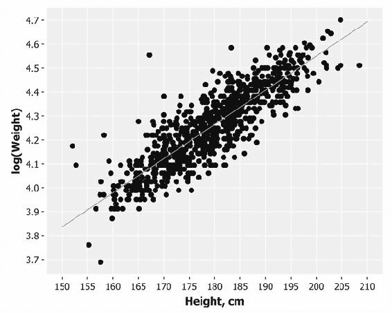
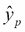

# 第三章. 相关性

|   | *“我越了解人类，就越喜欢我的狗。”* |   |
| --- | --- | --- |
|   | --*马克·吐温* |

在前面的章节中，我们已经讨论了如何通过总结统计量来描述样本，以及如何从这些统计量推断出总体参数。这种分析能告诉我们一些关于总体和样本的情况，但它并不能让我们对个别元素做出非常精确的描述。这是因为将数据简化为仅有的两个统计量：均值和标准差，导致了大量信息的丢失。

我们经常希望进一步分析，建立两个或更多变量之间的关系，或者在给定一个变量的情况下预测另一个变量。这就引出了相关性和回归的研究。相关性关注两个或更多变量之间关系的强度和方向。回归则确定这种关系的性质，并使我们能够根据它做出预测。

线性回归是我们的第一个机器学习算法。给定一组数据样本，我们的模型将学习一个线性方程，使其能够对新的、未见过的数据进行预测。为了实现这一点，我们将回到 Incanter，研究奥运运动员的身高与体重之间的关系。我们将介绍矩阵的概念，并展示如何使用 Incanter 对其进行操作。

# 关于数据

本章将使用伦敦 2012 年奥运会运动员的数据，感谢《卫报新闻与传媒有限公司》的支持。数据最初来源于《卫报》的优秀数据博客，网址是 [`www.theguardian.com/data`](http://www.theguardian.com/data)。

### 注意

从出版商网站或 [`github.com/clojuredatascience/ch3-correlation`](https://github.com/clojuredatascience/ch3-correlation) 下载本章的示例代码。

请参考本章示例代码中的`Readme`文件，或访问本书的维基 [`wiki.clojuredatascience.com`](http://wiki.clojuredatascience.com) 了解有关数据的更多信息。

# 检查数据

面对一个新的数据集时，首要任务是研究它，确保我们理解它所包含的内容。

`all-london-2012-athletes.xlsx`文件足够小，因此它与本章的示例代码一起提供。我们可以像在第一章中那样使用 Incanter 来检查数据，使用`incanter.excel/read-xls`和`incanter.core/view`函数：

```py
(ns cljds.ch3.examples
  (:require [incanter.charts :as c]
            [incanter.core :as i]
            [incanter.excel :as xls]
            [incanter.stats :as s]))

(defn athlete-data []
  (-> (io/resource "all-london-2012-athletes.xlsx")
      (str)
      (xls/read-xls)))

(defn ex-3-1 []
  (i/view (athlete-data)))
```

如果你运行这段代码（无论是在 REPL 中，还是通过命令行使用`lein run –e 3.1`），你应该会看到以下输出：


我们很幸运，数据在列中有明确的标签，包含以下信息：

+   运动员姓名

+   他们参赛的国家

+   年龄（年）

+   身高（厘米）

+   体重（千克）

+   性别（字符串“M”或“F”）

+   出生日期（字符串）

+   出生地（字符串，包含国家）

+   获得的金牌数量

+   获得的银牌数量

+   获得的铜牌数量

+   总共获得的金、银、铜奖牌数

+   他们参加的运动

+   事件作为逗号分隔的列表

即使数据已经清晰标注，身高、体重和出生地数据中仍然存在明显的空缺。我们必须小心，确保这些不会影响我们的分析。

# 数据可视化

首先，我们将考虑伦敦 2012 年奥运会运动员身高的分布。让我们将身高值绘制为直方图，看看数据是如何分布的，记得先过滤掉空值：

```py
(defn ex-3-2 []
  (-> (remove nil? (i/$ "Height, cm" (athlete-data)))
      (c/histogram :nbins 20
                   :x-label "Height, cm"
                   :y-label "Frequency")
      (i/view)))
```

这段代码生成了以下的直方图：


数据大致符合正态分布，正如我们预期的那样。我们的运动员的平均身高大约是 177 厘米。让我们看看 2012 年奥运会游泳运动员的体重分布：

```py
(defn ex-3-3 []
  (-> (remove nil? (i/$ "Weight" (athlete-data)))
      (c/histogram :nbins 20
                   :x-label "Weight"
                   :y-label "Frequency")
      (i/view)))
```

这段代码生成了以下的直方图：


这些数据呈现出明显的偏斜。尾部远长于峰值右侧，而左侧较短，因此我们说偏斜是正向的。我们可以使用 Incanter 的`incanter.stats/skewness`函数来量化数据的偏斜程度：

```py
(defn ex-3-4 []
  (->> (swimmer-data)
       (i/$ "Weight")
       (remove nil?) 
       (s/skewness)))
;; 0.238
```

幸运的是，可以通过使用 Incanter 的`incanter.core/log`函数对体重取对数，来有效减轻这种偏斜：

```py
(defn ex-3-5 []
  (-> (remove nil? (i/$ "Weight" (athlete-data)))
      (i/log)
      (c/histogram :nbins 20
                   :x-label "log(Weight)"
                   :y-label "Frequency")
      (i/view)))
```

这段代码会生成以下的直方图：


这与正态分布非常接近。这表明体重是按照**对数正态分布**分布的。

# 对数正态分布

对数正态分布就是一个值集的分布，这些值的对数是正态分布的。对数的底数可以是任何大于零的数，除了 1。与正态分布一样，对数正态分布在描述许多自然现象时非常重要。

对数表示的是一个固定数（底数）必须提高到什么幂才能得到一个给定的数。通过将对数值绘制为直方图，我们展示了这些幂值大致符合正态分布。对数通常以底数 10 或底数*e*（一个大约等于 2.718 的超越数）来计算。Incanter 的`log`函数及其逆函数`exp`都使用底数*e*。*log[e]*也叫做**自然对数**或*ln*，因为它在微积分中的特殊性质使其特别适用。

对数正态分布通常出现在增长过程当中，其中增长速率与大小无关。这被称为*吉布拉特法则*，由罗伯特·吉布拉特于 1931 年正式定义，他注意到这一定律适用于企业的增长。由于增长速率是规模的一个比例，较大的企业往往增长得比较小的企业更快。

### 注意

正态分布出现在许多小变化具有加法效应的情况，而对数正态分布出现在许多小变化具有乘法效应的情况。

吉布拉特法则（Gibrat's law）已被发现适用于许多情况，包括城市的规模，以及根据 Wolfram MathWorld，乔治·伯纳德·肖（George Bernard Shaw）句子中单词的数量。

在本章的其余部分，我们将使用体重数据的自然对数，以便使我们的数据近似正态分布。我们将选择一群大致相似体型的运动员，比如奥运游泳运动员。

## 可视化相关性

确定两个变量是否相关的最快和最简单的方法之一是将它们绘制在散点图上。我们将筛选数据，仅选择游泳运动员，然后将身高与体重进行绘制：

```py
(defn swimmer-data []
  (->> (athlete-data)
       (i/$where {"Height, cm" {:$ne nil} "Weight" {:$ne nil}
                  "Sport" {:$eq "Swimming"}})))
(defn ex-3-6 []
  (let [data (swimmer-data)
        heights (i/$ "Height, cm" data)
        weights (i/log (i/$ "Weight" data))]
    (-> (c/scatter-plot heights weights
                        :x-label "Height, cm"
                        :y-label "Weight")
        (i/view))))
```

这段代码生成了以下图表：


输出清楚地显示了两个变量之间的关系。该图表具有两个相关的、正态分布的变量围绕均值居中的典型偏斜椭圆形状。下图将散点图与身高和对数体重的概率分布进行比较：


靠近一个分布尾部的点通常也会靠近另一个分布的相同尾部，反之亦然。因此，两个分布之间存在一种关系，我们将在接下来的几节中展示如何量化这种关系。不过，如果仔细观察之前的散点图，你会发现这些点因测量值四舍五入（身高和体重分别以厘米和千克为单位）而集中排列成列和行。在这种情况下，有时最好对数据进行*抖动*，以使关系的强度更加明显。如果不进行抖动，可能看似是一个点的地方实际上是许多个共享相同数值对的点。引入一些随机噪声可以减少这种可能性。

## 抖动

由于每个值都四舍五入到最接近的厘米，捕获的值为 180 时，实际上可能在 179.5 厘米到 180.5 厘米之间。为了消除这个效应，我们可以在-0.5 到 0.5 的范围内为每个身高数据点添加随机噪声。

体重数据点是按最接近的千克捕获的，因此 80 这个值实际上可能在 79.5 千克到 80.5 千克之间。我们可以在相同范围内添加随机噪声来消除这个效应（尽管显然，这必须在我们取对数之前完成）：

```py
(defn jitter [limit]
  (fn [x]
    (let [amount (- (rand (* 2 limit)) limit)]
      (+ x amount))))

(defn ex-3-7 []
  (let [data (swimmer-data)
        heights (->> (i/$ "Height, cm" data)
                     (map (jitter 0.5)))
        weights (->> (i/$ "Weight" data)
                     (map (jitter 0.5))
                     (i/log))]
    (-> (c/scatter-plot heights weights
                        :x-label "Height, cm"
                        :y-label "Weight")
        (i/view))))
```

抖动后的图表如下所示：


就像在第一章 *统计学* 中对散点图引入透明度一样，抖动也是一种机制，确保我们不让偶然因素——例如数据量或四舍五入的伪影——掩盖我们发现数据模式的能力。

# 协方差

量化两个变量之间关系强度的一种方法是它们的协方差。协方差衡量的是两个变量一起变化的趋势。

如果我们有两个序列，*X*和*Y*，它们的偏差是：


其中*x[i]*是索引*i*处*X*的值，*y[i]*是索引*i*处*Y*的值，是*X*的均值，是*Y*的均值。如果*X*和*Y*倾向于一起变化，它们的偏差通常会有相同的符号：当它们低于均值时为负，超过均值时为正。如果我们将它们相乘，当它们具有相同符号时，积为正，当它们具有不同符号时，积为负。将这些积加起来，就得到了一个衡量两个变量在每个给定样本中倾向于朝相同方向偏离均值的程度的指标。

协方差被定义为这些积的均值：


协方差可以使用以下代码在 Clojure 中计算：

```py
(defn covariance [xs ys]
  (let [x-bar (s/mean xs)
        y-bar (s/mean xs)
        dx (map (fn [x] (- x x-bar)) xs)
        dy (map (fn [y] (- y y-bar)) ys)]
    (s/mean (map * dx dy))))
```

或者，我们可以使用`incanter.stats/covariance`函数。我们的奥运游泳运动员的身高和对数体重的协方差为`1.354`，但这是一个难以解释的数字。单位是输入单位的乘积。

因此，协方差通常不会单独作为总结性统计量报告。为了使这个数字更易于理解，可以将偏差除以标准差的乘积。这样可以将单位转换为标准分数，并将输出限制在`-1`和`+1`之间。结果被称为**皮尔逊相关性**。

# 皮尔逊相关性

皮尔逊相关性通常用变量名*r*表示，并通过以下方式计算，其中*dx[i]*和*dy[i]*的计算方法与之前相同：


由于标准差是变量*X*和*Y*的常数值，方程可以简化为以下形式，其中*σ[x]*和*σ[y]*分别是*X*和*Y*的标准差：


这有时被称为皮尔逊的乘积矩相关系数，或简称为*相关系数*，通常用字母*r*表示。

我们之前已经写过计算标准差的函数。结合我们用来计算协方差的函数，得出了以下皮尔逊相关性的实现：

```py
(defn correlation [x y]
  (/ (covariance x y)
     (* (standard-deviation x)
        (standard-deviation y))))
```

另外，我们可以使用`incanter.stats/correlation`函数。

由于标准分数是无单位的，因此*r*也是无单位的。如果*r*为-1.0 或 1.0，则表示变量之间完全负相关或完全正相关。

然而，如果*r*为零，并不意味着变量之间没有相关性。皮尔逊相关性只衡量线性关系。变量之间可能仍然存在一些非线性关系，而这些关系并未被*r*捕捉到，正如以下图示所示：


请注意，由于*y*的标准差为零，中心示例的相关性是未定义的。由于我们的*r*方程会涉及将协方差除以零，因此结果是没有意义的。在这种情况下，变量之间不能存在任何相关性；*y*的值始终是均值。通过简单检查标准差可以确认这一点。

可以为我们游泳选手的身高和对数体重数据计算相关系数：

```py
(defn ex-3-8 []
  (let [data (swimmer-data)
        heights (i/$ "Height, cm" data)
        weights (i/log (i/$ "Weight" data))]
    (correlation heights weights)))
```

这得出了答案`0.867`，它量化了我们在散点图中已经观察到的强正相关。

## 样本 r 与总体 rho

就像均值或标准差一样，相关系数是一种统计量。它描述了一个样本；在这种情况下，是一组配对值：身高和体重。虽然我们已知的样本相关系数用字母*r*表示，但未知的总体相关系数用希腊字母 rho 表示：。

正如我们在上一章中发现的，我们不应假设在样本中测得的内容适用于整个总体。在这种情况下，我们的总体可能是所有最近奥运会的游泳选手。例如，不应将结论推广到其他奥林匹克项目，如举重，或者非竞技游泳选手。

即使在一个适当的群体中——例如最近奥运会的游泳选手——我们的样本只是众多潜在样本中的一个，具有不同的相关系数。我们能多大程度上信任我们的*r*作为的估计，将取决于两个因素：

+   样本的大小

+   *r*的大小

显然，对于一个公平的样本，它越大，我们就越能信任它代表整个总体。也许你不会直观地意识到*r*的大小也会影响我们有多大信心它代表。原因是，大的相关系数较不可能是偶然或随机抽样误差造成的。

# 假设检验

在上一章中，我们介绍了假设检验作为量化给定假设（例如两个样本来自同一人群）为真的概率的方法。我们将使用相同的过程来量化基于我们样本的相关性在更广泛人群中存在的概率。

首先，我们必须提出两个假设：一个零假设和一个备择假设：


*H[0]*是假设人群相关性为零。换句话说，我们的保守观点是测得的相关性纯粹是由于随机抽样误差。

*H[1]*是备择假设，即总体相关性不为零。请注意，我们并没有指定相关性的方向，只是说明存在相关性。这意味着我们正在进行双尾检验。

样本*r*的标准误差为：


这个公式只有在接近零时才准确（记住*r*的大小会影响我们的置信度），但幸运的是，这正是我们在原假设下假设的情况。

我们再次可以利用*t*-分布并计算我们的*t*-统计量：


*df*是我们数据的自由度。对于相关性检验，自由度是*n - 2*，其中*n*是样本的大小。将该值代入公式，我们得到：


这给了我们一个*t*-值为`102.21`。要将其转换为*p*值，我们需要参考*t*-分布。Incanter 提供了*t*-分布的**累积分布函数**（**CDF**），可以通过`incanter.stats/cdf-t`函数获得。CDF 的值对应于单尾检验的*p*-值。由于我们进行的是双尾检验，因此我们将值乘以二：

```py
(defn t-statistic [x y]
  (let [r (correlation x y)
        r-square (* r r)
        df (- (count x) 2)]
    (/ (* r df)
       (i/sqrt (- 1 r-square)))))

(defn ex-3-9 []
  (let [data (swimmer-data)
        heights (i/$ "Height, cm" data)
        weights (i/log (i/$ "Weight" data))
        t-value (t-statistic heights weights)
        df (- (count heights) 2)
        p  (* 2 (s/cdf-t t-value :df df :lower-tail? false))]
    (println "t-value" t-value)
    (println "p value " p)))
```

*p*-值非常小，几乎为零，意味着原假设为真的可能性几乎不存在。我们必须接受备择假设。

# 置信区间

确定了在更广泛的人群中确实存在相关性后，我们可能希望通过计算置信区间来量化我们期望落入的值范围。就像前一章中均值的情况一样，*r*的置信区间表达了*r*在两特定值之间落入的概率（以百分比表示），即该总体参数落入这两个值之间的概率。

然而，当试图计算相关系数的标准误差时，问题出现了，这个标准误差在均值的情况下并不存在。因为*r*的绝对值不能超过**1**，所以当*r*接近其范围的极限时，*r*的可能样本分布会发生偏斜。


之前的图表展示了对于为 0.6 的*r*样本的负偏态分布。

幸运的是，一种名为**费舍尔 z 变换**的转换方法可以稳定*r*在其范围内的方差。这类似于我们在取对数后，体重数据变得呈正态分布的情况。

*z*-变换的公式为：


*z*的标准误差为：


因此，计算置信区间的过程是将*r*通过*z*-变换转换为*z*，计算以*SE[z]*为单位的置信区间，然后再将置信区间转换回*r*。

为了计算以*SE[z]*为单位的置信区间，我们可以计算从均值开始，给出所需置信度的标准差数。1.96 是常用的数值，因为它是离均值 1.96 个标准差的距离，包含了 95%的区域。换句话说，离样本*r*均值 1.96 个标准误差的范围包含了真实的总体相关性*ρ*，其置信度为 95%。


我们可以使用 Incanter 的`incanter.stats/quantile-normal`函数来验证这一点。该函数将返回与给定累积概率相关的标准分数，假设是单尾检验。

然而，正如前面的图示所示，我们希望从每一侧减去相同的值——2.5%——这样 95%的置信区间就会以零为中心。一个简单的变换是，在执行双尾检验时，将差值的一半平移到 100%的范围内。因此，95%的置信度意味着我们查找 97.5%临界值：

```py
(defn critical-value [confidence ntails]
  (let [lookup (- 1 (/ (- 1 confidence) ntails))]
    (s/quantile-normal lookup)))

(critical-value 0.95 2)
=> 1.96
```

因此，我们在*z*-空间中，95%置信区间对于为：


将我们的*z[r]*和*SE[z]*公式代入后得到：


对于`r = 0.867`和`n = 859`，这给出了下限和上限分别为`1.137`和`1.722`。要将这些从*z*-分数转换回*r*-值，我们使用以下公式，它是*z*-变换的逆运算：


可以使用以下代码计算变换和置信区间：

```py
(defn z->r [z]
  (/ (- (i/exp (* 2 z)) 1)
     (+ (i/exp (* 2 z)) 1)))

(defn r-confidence-interval [crit x y]
  (let [r   (correlation x y)
        n   (count x)
        zr  (* 0.5 (i/log (/ (+ 1 r)
                             (- 1 r))))
        sez (/ 1 (i/sqrt (- n 3)))]
    [(z->r (- zr (* crit sez)))
     (z->r (+ zr (* crit sez)))]))

(defn ex-3-10 []
  (let [data (swimmer-data)
        heights  (i/$ "Height, cm" data)
        weights  (i/log (i/$ "Weight" data))
        interval (r-confidence-interval 1.96 heights weights)]
    (println "Confidence Interval (95%): " interval)))
```

这给出了 95%置信度区间，对于，区间为`0.850`到`0.883`。我们可以非常有信心地认为，奥林匹克级游泳运动员身高与体重之间存在较强的正相关关系。

# 回归

尽管知道两个变量之间存在相关性可能是有用的，但仅凭此信息我们无法预测奥林匹克游泳选手的体重是否由身高决定，反之亦然。在建立相关性时，我们测量的是关系的强度和符号，而不是斜率。要进行预测，必须知道给定单位变化下，一个变量的预期变化率。

我们希望确定一个方程，关联一个变量的具体值，称为**自变量**，与另一个变量的期望值，称为**因变量**。例如，如果我们的线性方程根据身高预测体重，那么身高就是自变量，体重则是因变量。

### 注意

这些方程式描述的直线被称为**回归线**。这一术语由 19 世纪英国博学家弗朗西斯·高尔顿爵士提出。他和他的学生卡尔·皮尔逊（定义了相关系数）在 19 世纪发展了多种方法来研究线性关系，这些方法统称为回归技术。

请记住，相关性并不意味着因果关系，且依赖与独立这两个术语并不暗示因果关系——它们只是数学输入和输出的名称。一个经典的例子是消防车派遣数量与火灾造成损失之间的高度正相关。显然，派遣消防车本身并不会造成损失。没有人会建议减少派遣到火灾现场的消防车数量来减少损失。在这种情况下，我们应寻找一个与其他变量因果相关的额外变量，来解释它们之间的相关性。在前一个例子中，这个变量可能是*火灾的规模*。这种隐藏的原因被称为**混杂** **变量**，因为它们混淆了我们确定依赖变量之间关系的能力。

## 线性方程式

两个变量，记作 *x* 和 *y*，可能是精确或不精确地相互关联的。最简单的关系是一个独立变量 *x* 和一个依赖变量 *y* 之间的直线关系，公式如下：


在这里，参数 *a* 和 *b* 的值分别决定了直线的精确高度和陡峭度。参数 *a* 被称为截距或常数，*b* 被称为梯度或斜率。例如，在摄氏度与华氏度之间的映射中，*a = 32* 且 *b = 1.8*。将这些 *a* 和 *b* 的值代入我们的方程式中，得到：


要计算 10 摄氏度对应的华氏度，我们将 10 代入 *x*：


因此，我们的方程式告诉我们，10 摄氏度等于 50 华氏度，这确实是正确的。使用 Incanter，我们可以轻松编写一个将摄氏度转换为华氏度的函数，并使用 `incanter.charts/function-plot` 绘制其图形：

```py
(defn celsius->fahrenheit [x]
  (+ 32 (* 1.8 x)))

(defn ex-3-11 []
  (-> (c/function-plot celsius->fahrenheit -10 40
                       :x-label "Celsius"
                       :y-label "Fahrenheit")
      (i/view)))
```

这段代码生成了以下线性图：


请注意，红色线在摄氏度刻度上的零点与华氏度刻度上的 32 度交叉。截距 *a* 是 *x* 为零时 *y* 的值。

直线的斜率由 *b* 决定；在这个方程式中，斜率接近 2。可以看到，华氏度的范围几乎是摄氏度范围的两倍。换句话说，这条直线在竖直方向的变化几乎是水平方向变化的两倍。

## 残差

不幸的是，我们研究的大多数关系并不像摄氏温度与华氏温度之间的映射那样简洁。直线方程很少允许我们精确地用 *x* 来表示 *y*。通常会存在误差，因此：


这里，*ε* 是误差项，表示给定 *x* 值时，由参数 *a* 和 *b* 计算的值与实际 *y* 值之间的差异。如果我们预测的 *y* 值是 （读作“y-hat”），那么误差就是两者之间的差异：


这个误差被称为残差。残差可能是由于随机因素（如测量误差）或非随机因素（如未知的因素）造成的。例如，如果我们试图将体重作为身高的函数进行预测，未知的因素可能包括饮食、健康水平和体型（或简单地四舍五入到最近的千克）。

如果我们选择了不理想的 *a* 和 *b* 参数，那么每个 *x* 的残差将比必要的要大。因此，可以得出结论，我们希望找到的参数是那些在所有 *x* 和 *y* 值中最小化残差的参数。

# 普通最小二乘法

为了优化我们线性模型的参数，我们希望设计一个成本函数，也称为**损失函数**，来量化我们的预测与数据的契合程度。我们不能简单地将正负残差相加，因为即使是大的残差，如果它们的符号方向相反，也会互相抵消。

我们可以在计算总和之前对值进行平方，以便正负残差都能计入成本。这还具有对大误差进行更大惩罚的效果，但并不会导致最大的残差总是主导。

作为一个优化问题，我们寻求识别能够最小化残差平方和的系数。这叫做**普通最小二乘法**（**OLS**），使用 OLS 计算回归线斜率的公式是：


尽管这看起来比之前的方程复杂，但它实际上只是残差平方和除以与均值的平方差之和。它与我们之前看到的方程式有许多相同的项，并且可以简化为：


截距是允许具有这种斜率的直线通过 *X* 和 *Y* 的均值的项：


这些 *a* 和 *b* 的值是我们最小二乘估计的系数。

## 斜率和截距

我们已经编写了计算游泳身高和体重数据的斜率和截距所需的 `协方差`、`方差` 和 `均值` 函数。因此，斜率和截距的计算是简单的：

```py
(defn slope [x y]
  (/ (covariance x y)
     (variance x)))

(defn intercept [x y]
  (- (s/mean y)
     (* (s/mean x)
        (slope x y))))

(defn ex-3-12 []
  (let [data (swimmer-data)
        heights (i/$ "Height, cm" data)
        weights (i/log (i/$ "Weight" data))
        a (intercept heights weights)
        b (slope heights weights)]
    (println "Intercept: " a)
    (println "Slope: " b)))
```

输出给出的斜率大约是`0.0143`，截距大约是`1.6910`。

## 解释

**截距值**是当自变量（`height`）为零时因变量（log 体重）的值。为了知道这个值对应的公斤数，我们可以使用`incanter.core/exp`函数，它是`incanter.core/log`函数的逆运算。我们的模型似乎表明，零身高的奥运游泳运动员的体重最佳估计值为 5.42 公斤。这没有实际意义，因此在没有数据支持的情况下，外推训练数据之外的预测是不明智的。

斜率值显示了每单位*x*变化时，*y*的变化量。我们的模型表明，每增加一厘米的身高，奥运游泳运动员的体重大约增加 1.014 公斤。由于我们的模型基于所有奥运游泳运动员，这表示身高增加一个单位的平均效应，而没有考虑其他因素，如年龄、性别或体型。

## 可视化

我们可以通过`incanter.charts/function-plot`和一个简单的*x*函数来可视化我们的线性方程输出，该函数根据系数*a*和*b*计算 。

```py
(defn regression-line [a b]
  (fn [x] 
    (+ a (* b x))))

(defn ex-3-13 []
  (let [data (swimmer-data)
        heights (->> (i/$ "Height, cm" data)
                     (map (jitter 0.5)))
        weights (i/log (i/$ "Weight" data))
        a (intercept heights weights)
        b (slope heights weights)]
    (-> (c/scatter-plot heights weights
                        :x-label "Height, cm"
                        :y-label "log(Weight)")
        (c/add-function (regression-line a b) 150 210)
        (i/view))))
```

`regression-line`函数返回一个关于*x*的函数，用于计算 。



我们还可以使用`regression-line`函数来计算每个残差，展示我们估算的 与每个测量的*y*之间的偏差。

```py
(defn residuals [a b x y]
  (let [estimate (regression-line a b)
        residual (fn [x y]
                   (- y (estimate x)))]
    (map residual x y)))

(defn ex-3-14 []
  (let [data (swimmer-data)
        heights (->> (i/$ "Height, cm" data)
                     (map (jitter 0.5)))
        weights (i/log (i/$ "Weight" data))
        a (intercept heights weights)
        b (slope heights weights)]
    (-> (c/scatter-plot heights (residuals a b heights weights)
                        :x-label "Height, cm"
                        :y-label "Residuals")
        (c/add-function (constantly 0) 150 210)
        (i/view))))
```

**残差图**是一个图表，展示了*y*轴上的残差和*x*轴上的自变量。如果残差图中的点在水平轴周围随机分布，则说明线性模型对数据拟合良好：


除了图表左侧的一些离群点外，残差图似乎表明线性模型对数据拟合良好。绘制残差图对于验证线性模型是否合适非常重要。线性模型对数据有某些假设，如果这些假设被违反，所构建的模型将失效。

## 假设

显然，线性回归的主要假设是因变量和自变量之间存在线性关系。此外，残差不能相互相关，也不能与自变量相关。换句话说，我们期望误差相对于因变量和自变量的均值为零且方差恒定。残差图可以帮助我们快速判断是否符合这一假设。

我们的残差图左侧的残差大于右侧，这对应于较矮运动员的体重方差较大。当一个变量的方差随着另一个变量的变化而变化时，这些变量被称为**异方差**。在回归分析中，这是一个需要关注的问题，因为它会使得假设建模误差不相关、正态分布，并且它们的方差不随建模效应变化的假设失效。

我们的残差的异方差性相对较小，应该不会对模型的质量产生太大影响。如果图表左侧的方差更为明显，则会导致最小二乘法估计的方差不准确，进而影响我们基于标准误差所做的推断。

# 拟合优度与 R 平方

尽管我们从残差图中可以看出线性模型很好地拟合了我们的数据，但我们仍然希望量化其拟合程度。**决定系数**（也称为*R²*）的值介于零和一之间，表示线性回归模型的解释能力。它计算了因变量的变化比例，其中由自变量解释或解释的部分。

通常情况下，*R²* 越接近 1，回归线对数据点的拟合程度越好，*Y* 的变化越多地被 *X* 解释。*R²* 可以通过以下公式计算：


这里，*var(ε)* 是残差的方差，*var(Y)* 是 *Y* 的方差。为了理解这意味着什么，假设你正在尝试猜测某人的体重。如果你对他们没有任何其他了解，你最好的策略是猜测该人群体重的均值。这样，你的猜测与他们真实体重之间的均方误差将是 *var(Y)*，即该人群体重的方差。

但是，如果我告诉你他们的身高，你就可以根据回归模型猜测 。在这种情况下，你的均方误差将是 *var(ε)*，即模型残差的方差。

术语 *var(ε)/ var(Y)* 是带有和不带有解释变量的均方误差的比率，它表示模型未能解释的变异部分。补充的 *R²* 是模型解释的变异部分的比例。

### 注

与 *r* 一样，低 *R²* 并不意味着这两个变量不相关。它可能仅仅是因为它们之间的关系不是线性的。

*R²* 值描述了拟合线与数据的吻合度。*最佳拟合线*是使 *R²* 值最小化的那条线。随着系数远离最优值，*R²* 会始终增加。


左边的图表展示了一个始终猜测*y*均值的模型的方差，右边的图表显示了与模型*f*未能解释的残差相关的较小的方块。从几何上看，你可以看到模型已经解释了*y*的大部分方差。以下代码通过将残差的方差与*y*值的方差相除来计算*R²*：

```py
(defn r-squared [a b x y]
  (let [r-var (variance (residuals a b x y))
        y-var (variance y)]
    (- 1 (/ r-var y-var))))

(defn ex-3-15 []
  (let [data (swimmer-data)
        heights (i/$ "Height, cm" data)
        weights (i/log (i/$ "Weight" data))
        a (intercept heights weights)
        b (slope heights weights)]
    (r-squared a b heights weights)))
```

这给出了`0.753`的值。换句话说，2012 年奥运会游泳选手体重的超过 75%的方差可以通过身高来解释。

在简单回归模型的情况下（只有一个自变量），决定系数*R²*和相关系数*r*之间的关系是直接的：


0.5 的相关系数可能意味着*Y*的变化性有一半是由*X*解释的，但实际上，*R²*将是 0.5²，或者是 0.25。

# 多元线性回归

到目前为止，我们在本章中已经介绍了如何使用一个自变量建立回归线。然而，通常我们希望建立一个包含多个自变量的模型。这就是**多元线性回归**。

每个自变量都需要它自己的系数。为了不通过字母表来表示每一个变量，我们可以指定一个新的变量*β*，发音为“beta”，用来表示我们所有的系数：


这个模型相当于我们的**双变量线性回归**模型，只要我们确保*x[1]*始终等于 1，就可以像和那样。这确保了*β[1]*始终是一个常数因子，表示我们的截距。*x[1]*被称为**偏置** **项**。

通过用 beta 来推广线性方程，容易扩展到任意数量的系数：


*x[1]*到*x[n]*的每个值对应一个可能有助于解释*y*值的自变量。*β[1]*到*β[n]*的每个值对应一个系数，决定了这个自变量的相对贡献。

我们的简单线性回归旨在仅通过身高来解释体重，但还有许多其他因素有助于解释一个人的体重：他们的年龄、性别、饮食和体型。我们知道奥运游泳选手的年龄，所以我们也可以建立一个包含这些附加数据的模型。

我们一直提供作为一个单一序列的自变量值，但有多个参数时，我们需要为每个*x*提供多个值。我们可以使用 Incanter 的`i/$`函数来选择多个列并将每个*x*作为 Clojure 向量来处理，但有一种更好的方法：矩阵。

# 矩阵

矩阵是一个二维的数字网格。它的维度是通过矩阵中的行和列的数量来表示的。

例如，*A* 是一个有四行两列的矩阵：


在数学符号中，矩阵通常会分配给一个大写字母变量，以区分它与方程式中的其他变量。

我们可以使用 Incanter 的 `incanter.core/to-matrix` 函数从数据集构建一个矩阵：

```py
(defn ex-3-16 []
  (->> (swimmer-data)
       (i/$ ["Height, cm" "Weight"])
       (i/to-matrix)))
```

Incanter 还定义了 `incanter.core/matrix` 函数，该函数可以将一个标量值序列或一个序列的序列转换为矩阵（如果可能的话）：

```py
(defn ex-3-17 []
  (->> (swimmer-data)
       (i/$ "Height, cm")
       (i/matrix)))
```

如果在 REPL 中运行此代码，输出将是矩阵内容的摘要：

```py
  A 859x1 matrix
 ---------------
 1.66e+02
 1.92e+02
 1.73e+02
 ...
 1.88e+02
 1.87e+02
 1.83e+02
```

Incanter 返回的表示形式与前面的例子完全相同，仅展示矩阵的前三行和后三行。矩阵往往非常大，Incanter 会确保不会让 REPL 被大量信息淹没。

## 维度

*i^(th)* 行 *j^(th)* 列的元素被称为 *A[ij]*。因此，在我们之前的例子中：


矩阵的一个最基本的属性是它的大小。Incanter 提供了 `incanter.core/dim`、`ncol` 和 `nrow` 函数来查询矩阵的维度。

## 向量

向量是只有一列的特殊矩阵。向量的行数被称为它的维度：


在这里，*y* 是一个四维向量。*i^(th)* 元素被称为 *y[i]*。

数学文献中的向量通常是从 1 开始索引的，除非另有说明。所以，*y[1]* 是指第一个元素，而不是第二个。向量在方程式中通常分配给小写字母变量。Incanter 的 API 并不区分向量和单列矩阵，我们可以通过传递一个单一序列给 `incanter.core/matrix` 函数来创建一个向量。

## 构建

如我们所见，可以通过 Clojure 序列和 Incanter 数据集来构建矩阵。也可以通过更小的构建块来构建矩阵，前提是维度兼容。Incanter 提供了 `incanter.core/bind-columns` 和 `incanter.core/bind-rows` 函数，可以将矩阵堆叠在一起或并排放置。

例如，我们可以通过以下方式将一个全是 1 的列加到另一个矩阵的前面：

```py
(defn add-bias [x]
  (i/bind-columns (repeat (i/nrow x) 1) x))
```

实际上，我们会希望这样做来处理我们的偏置项。回忆一下，*β[1]* 将代表一个常数值，因此我们必须确保相应的 *x[1]* 也是常数。如果没有偏置项，当 *x* 的值为零时，*y* 也必须为零。

## 加法和标量乘法

标量是一个简单数字的名称。当我们将标量加到矩阵时，就好像我们将该数字加到矩阵的每个元素上一样，逐个元素。Incanter 提供了 `incanter.core/plus` 函数来将标量和矩阵相加。

矩阵加法是通过将每个对应位置的元素相加来实现的。只有维度相同的矩阵才能相加。如果矩阵的维度相同，则称它们是兼容的。


`plus`函数也可以相加兼容的矩阵。`minus`函数会减去标量或兼容的矩阵。将矩阵与标量相乘会导致矩阵中的每个元素都与该标量相乘。


`incanter.core/mult`执行矩阵与标量的乘法，而`incanter.core/div`执行逆运算。

我们也可以在兼容的矩阵上使用`mult`和`div`，但这种逐元素的乘法和除法并不是我们通常在谈论矩阵乘法时所指的内容。

## 矩阵-向量乘法

矩阵乘法的标准方法是通过`incanter.core/mmult`函数来处理的，该函数应用了复杂的矩阵乘法算法。例如，将一个 3 x 2 的矩阵与一个 2 x 1 的矩阵相乘，结果是一个 3 x 1 的矩阵。乘法的左边列数必须与右边的行数匹配：


为了得到*Ax*，需要将*A*的每一行与*x*的对应元素逐一相乘并求和。例如，矩阵*A*的第一行包含元素*1*和*3*，这些元素分别与向量*x*中的元素*1*和*5*相乘。然后，将这些乘积相加得到*16*。这就是**点积**，也是我们通常所说的矩阵乘法。

## 矩阵-矩阵乘法

矩阵-矩阵乘法的过程与矩阵-向量乘法非常相似。通过逐行逐列地从矩阵*A*和*B*的对应元素中求得乘积之和。


和之前一样，只有当第一个矩阵的列数等于第二个矩阵的行数时，我们才能将矩阵相乘。如果第一个矩阵*A*的维度是，而第二个矩阵*B*的维度是，则只有当*n[a]*和*m[B]*相等时，矩阵才能相乘。


在之前的视觉示例中：


幸运的是，我们不需要自己记住这个过程。Incanter 使用非常高效的算法为我们执行矩阵代数运算。

## 转置

转置一个矩阵意味着将矩阵沿从左上角到右下角的主对角线翻转。矩阵*A*的转置表示为*A^T*：


列和行已经发生了变化，因此：


因此，如果：


然后：


Incanter 提供了 `incanter.core/trans` 函数来转置矩阵。

## 单位矩阵

某些矩阵具有特殊的性质，并且在矩阵代数中经常使用。最重要的其中之一就是单位矩阵。它是一个方阵，主对角线上的元素为 1，其他位置的元素为 0：


单位矩阵是矩阵乘法的单位元。就像用数字 1 进行标量乘法一样，使用单位矩阵进行矩阵乘法没有任何影响。

Incanter 提供了 `incanter.core/identity-matrix` 函数来构造单位矩阵。由于单位矩阵总是方阵，因此我们只需要提供一个参数，它同时对应宽度和高度。

## 求逆

如果我们有一个方阵 *A*，则 *A* 的逆矩阵记作 *A^(-1)*，它将具有以下性质，其中 *I* 是单位矩阵：


单位矩阵是它自身的逆矩阵。并非所有矩阵都有可逆性，不可逆矩阵也称为**奇异矩阵**或**退化矩阵**。我们可以使用 `incanter.core/solve` 函数来计算矩阵的逆。如果传入奇异矩阵，`solve` 会引发异常。

# 正规方程

现在我们已经掌握了矩阵和向量操作的基础，可以开始研究**正规方程**。这是一个利用矩阵代数来计算 OLS 线性回归模型系数的方程：


我们读作“为了找到 *β*，将 *X* 转置的逆矩阵乘以 *X* 转置，再乘以 *y*”，其中 *X* 是包含独立变量（包括截距项）的矩阵，*y* 是包含样本依赖变量的向量。结果 *β* 包含了计算出的系数。这个正规方程相对容易从多元回归方程中推导出来，应用矩阵乘法规则，但其数学内容超出了本书的讨论范围。

我们可以使用刚才遇到的函数，在 Incanter 中实现正规方程：

```py
(defn normal-equation [x y]
  (let [xtx  (i/mmult (i/trans x) x)
        xtxi (i/solve xtx)
        xty  (i/mmult (i/trans x) y)]
    (i/mmult xtxi xty)))
```

这个正规方程以非常简洁的方式表达了最小二乘法线性回归的数学原理。我们可以如下使用它（记得添加偏置项）：

```py
(defn ex-3-18 []
  (let [data (swimmer-data)
        x (i/matrix (i/$ "Height, cm" data))
        y (i/matrix (i/log (i/$ "Weight" data)))]
    (normal-equation (add-bias x) y)))
```

这会得到以下矩阵：

```py
 A 2x1 matrix
 -------------
 1.69e+00
 1.43e-02
```

这些是 *β[1]* 和 *β[2]* 的值，分别对应截距和斜率参数。幸运的是，它们与我们之前计算出的值一致。

## 更多功能

正规方程的一个强大之处在于，我们现在已经实现了支持多元线性回归所需的所有内容。让我们写一个函数，将感兴趣的特征转换为矩阵：

```py
(defn feature-matrix [col-names dataset]
  (-> (i/$ col-names dataset)
      (i/to-matrix)))
```

这个函数将允许我们一步选择特定的列作为矩阵。

### 注意

特征是自变量的同义词，通常在机器学习中使用。其他同义词包括预测变量、回归变量、解释变量，或简称输入变量。

首先，让我们选择身高和年龄作为我们的两个特征：

```py
(defn ex-3-19 []
  (feature-matrix ["Height, cm" "Age"] (swimmer-data)))
```

这将返回以下两列矩阵：

```py
A 859x2 matrix
 ---------------
 1.66e+02  2.30e+01
 1.92e+02  2.20e+01
 1.73e+02  2.00e+01
 ...
 1.88e+02  2.40e+01
 1.87e+02  1.90e+01
 1.83e+02  2.20e+01
```

我们的普通方程函数将接受这个新的矩阵，且无需进一步修改：

```py
(defn ex-3-20 []
  (let [data (swimmer-data)
        x (->> data
                (feature-matrix ["Height, cm" "Age"])
                (add-bias))
        y (->> (i/$ "Weight" data)
                (i/log)
                (i/matrix))]
    (normal-equation x y)))
```

它将返回以下系数：

```py
 A 3x1 matrix
 -------------
 1.69e+00
 1.40e-02
 2.80e-03
```

这三个数字分别对应截距、身高的斜率和年龄的斜率。为了确定通过这些新数据我们的模型是否有显著改进，我们可以计算新模型的 *R²* 值，并与之前的模型进行比较。

# 多个 R 平方

在之前计算 *R²* 时，我们看到了它是模型解释的方差量：


由于方差即为均方误差，我们可以将 *var(ε)* 和 *var(y)* 两项分别乘以样本大小，得到 R² 的另一种计算公式：


这只是残差平方和与均值平方差之和的比值。Incanter 包含了 `incanter.core/sum-of-squares` 函数，使得这一表达变得非常简单：

```py
(defn r-squared [coefs x y]
   (let [fitted      (i/mmult x coefs)
         residuals   (i/minus y fitted)
         differences (i/minus y (s/mean y))
         rss         (i/sum-of-squares residuals)
         ess         (i/sum-of-squares differences)]
     (- 1 (/ rss ess))))
```

我们使用变量名 `rss` 表示**残差平方和**，`ess` 表示**解释平方和**。我们可以按以下方式计算新模型的矩阵 *R²*：

```py
(defn ex-3-21 []
  (let [data (swimmer-data)
        x (->> (feature-matrix ["Height, cm" "Age"] data)
               (add-bias))
        y (->> (i/$ "Weight" data)
               (i/log)
               (i/matrix))
        beta (normal-equation x y)]
    (r-squared beta x y)))
```

这得出了值 `0.757`。通过加入年龄值，我们的 *R²* 值略有增加。因为我们使用了多个自变量，所以 *R²* 现在被称为**多重决定系数**。

# 调整 R 平方

随着我们向回归模型中添加更多自变量，我们可能会受到 *R²* 值总是增加这一现象的鼓舞。添加一个新的自变量不会使得预测因变量变得更困难——如果新变量没有解释能力，那么它的系数将会是零，R² 也将保持不变。

然而，这并不能告诉我们模型是否因为添加了新变量而得到改进。如果我们想知道新变量是否真的帮助生成了更好的拟合度，我们可以使用调整后的 *R²*，通常写作 ，并读作 "R-bar 平方"。与 *R²* 不同， 只有在新自变量增加的 *R²* 超过由于偶然因素所期望的增幅时，它才会增加：

```py
(defn matrix-adj-r-squared [coefs x y]
  (let [r-squared (matrix-r-squared coefs x y)
        n (count y)
        p (count coefs)]
    (- 1
       (* (- 1 r-squared)
          (/ (dec n)
             (dec (- n p)))))))
```

调整后的 *R²* 依赖于两个附加参数，*n* 和 *p*，分别对应样本大小和模型参数的数量：

```py
(defn ex-3-22 []
  (let [data (swimmer-data)
        x (->> (feature-matrix ["Height, cm" "Age"] data)
               (add-bias))
        y (->> (i/$ "Weight" data)
               (i/log)
               (i/matrix))
        beta (normal-equation x y)]
    (adj-r-squared beta x y)))
```

这个示例返回了值 `0.756`。这仍然大于原始模型，因此年龄无疑具有一定的解释力。

## Incanter 的线性模型

尽管实现我们自己的标准方程和 *R²* 为引入矩阵代数提供了宝贵的机会，但值得注意的是，Incanter 提供了 `incanter.stats/linear-model` 函数，涵盖了我们所讲的所有内容，甚至更多。

该函数期望以 *y* 和 *x*（可以是序列，或在多元回归的情况下是矩阵）作为输入。我们还可以传入一个可选的关键字参数 `intercept`，其值为布尔型，指示是否希望 Incanter 为我们添加截距项。该函数将返回一个包含线性模型系数的映射—`:coefs` 和拟合数据—`:fitted`，以及 `:residuals`、`:r-square` 和 `:adj-r-square` 等。

它还会返回显著性测试和系数的 95% 置信区间，分别作为 `:t-probs` 和 `:coefs-ci` 键，以及 `:f-prob` 键，后者对应于整个回归模型的显著性测试。

### 模型显著性的 *F* 检验

`linear-model` 返回的 `:f-prob` 键是对整个模型进行的显著性测试，使用的是 *F* 检验。正如我们在上一章中发现的，*F* 检验适用于同时进行多个显著性检验。在多元线性回归的情况下，我们检验的是除截距项外，模型中的任何系数是否与零在统计上不可区分。

因此，我们的原假设和备择假设为：


这里，*j* 是参数向量中的某个索引，不包括截距项。我们计算的 *F* 统计量是已解释方差与未解释（残差）方差的比率。可以表示为 **模型均方** (**MSM**) 与 **均方误差** (**MSE**) 的比值：


MSM 等于 **解释平方和** (**ESS**) 除以模型的自由度，其中模型自由度是模型中参数的数量，不包括截距项。MSE 等于 **残差平方和** (**RSS**) 除以残差自由度，其中残差自由度是样本大小减去模型参数的数量。

一旦我们计算出 *F* 统计量，就可以在具有相同两个自由度的 *F* 分布中查找它：

```py
(defn f-test [y x]
  (let [coefs       (normal-equation x y)
        fitted      (i/mmult x coefs)
        difference  (i/minus fitted (s/mean y))
        residuals   (i/minus y fitted)
        ess         (i/sum-of-squares difference)
        rss         (i/sum-of-squares residuals)
        p           (i/ncol x)
        n           (i/nrow y)
        df1         (- p 1)
        df2         (- n p)
        msm         (/ ess df1)
        mse         (/ rss df2)
        f-stat      (/ msm mse)]
    (s/cdf-f f-stat :df1 df1 :df2 df2 :lower-tail? false)))

(defn ex-3-23 []
  (let [data (swimmer-data)
        x (->> (feature-matrix ["Height, cm" "Age"] data)
               (add-bias))
        y (->> (i/$ "Weight" data)
               (i/log))
        beta (:coefs (s/linear-model y x :intercept false))]
    (f-test beta x y)))
```

测试返回结果 `1.11x10e-16`。这是一个非常小的数字；因此，我们可以确信模型是显著的。

请注意，对于较小的样本数据，*F* 检验量化了线性模型是否合适的不确定性。例如，对于一个五个数据点的随机样本，数据有时几乎没有任何线性关系，*F* 检验在 50% 置信区间下甚至认为数据不显著。

## 类别变量和虚拟变量

此时，我们可能会尝试将`"Sex"`作为回归分析中的特征，但我们会遇到一个问题。输入是以`"M"`或`"F"`表示的，而不是数字。这是一个分类变量的例子：一个可以取有限集无序且通常非数字的值的变量。其他分类变量的例子包括运动员参与的体育项目或他们最擅长的具体项目。

普通最小二乘法依赖于残差距离的数值来最小化。那么，游泳和田径之间的数值距离可能是多少呢？这可能意味着无法将分类变量包含在回归方程中。

### 注意

分类变量或名义变量与连续变量不同，因为它们不在数轴上。有时类别会用数字表示，比如邮政编码，但我们不应假设数字类别一定是有序的，或者类别之间的间隔是相等的。

幸运的是，许多分类变量可以视为二分变量，实际上，我们的样本数据包含了`sex`的两个类别。只要我们将它们转化为两个数字（例如 0 和 1），这些变量就可以包含在我们的回归模型中。

当像体育项目这样的类别有多个取值时，我们可以为每种体育类型包含一个独立的变量。我们可以为游泳创建一个变量，为举重创建另一个变量，依此类推。游泳的值对游泳者为 1，其他为 0。

由于`sex`可能是我们回归模型中有用的解释变量，让我们将女性转换为`0`，男性转换为`1`。我们可以使用 Incanter 的`incanter.core/add-derived-column`函数添加一个包含虚拟变量的派生列。

让我们计算我们的的值，看看是否有所改善：

```py
(defn dummy-mf [sex]
  (if (= sex "F")
    0.0 1.0))

(defn ex-3-25 []
  (let [data (->> (swimmer-data)
                  (i/add-derived-column "Dummy MF"
                                        ["Sex"]
                                        dummy-mf))
        x (->> data
               (feature-matrix ["Height, cm"
                                "Age"
                                "Dummy MF"])
               (add-bias))
        y (->> (i/$ "Weight" data)
               (i/log)
               (i/matrix))
        beta (normal-equation x y)]
    (adj-r-squared beta x y)))
```

该代码的输出值为`0.809`。通过使用身高、年龄和性别特征，我们成功解释了奥运游泳运动员体重超过 80%的差异。

## 相对力量

此时，提出一个问题可能会很有帮助：哪个特征最能解释观测到的体重：是年龄、性别还是身高？我们可以利用调整后的*R²*来查看数值变化，但这将要求我们为每个需要测试的变量重新运行回归。

我们不能仅看回归系数的大小，因为它们适用的数据范围差异巨大：身高以厘米为单位，年龄以年为单位，性别作为虚拟变量的取值范围为 0 到 1。

为了比较回归系数的相对贡献，我们可以计算标准化回归系数或贝塔权重。


计算 beta 权重时，我们将每个系数乘以相关独立变量和模型的因变量的标准差比值。这可以通过以下 Clojure 代码实现：

```py
(defn beta-weight [coefs x y]
  (let [sdx (map s/sd (i/trans x))
        sdy (s/sd y)]
    (map #(/ (* %1 %2) sdy) sdx coefs)))

(defn ex-3-26 []
  (let [data (->> (swimmer-data)
                  (i/add-derived-column "Dummy MF"
                                        ["Sex"]
                                        dummy-mf))
        x (->> data
               (feature-matrix ["Height, cm"
                                "Age"
                                "Dummy MF"])
               (add-bias))
        y (->> (i/$ "Weight" data)
               (i/log)
               (i/matrix))
        beta (normal-equation x y)]
    (beta-weight beta x y)))
```

这输出的结果（四舍五入到三位小数）是：

```py
(0.0 0.650 0.058 0.304)
```

这表明身高是最重要的解释变量，其次是性别，再次是年龄。将其转化为标准化系数告诉我们，身高增加一个标准差时，平均体重增加`0.65`个标准差。

# 共线性

在此时，我们可能会尝试继续向模型中添加特征，试图提高其解释能力。

例如，我们还有一个“出生日期”列，可能会被诱使尝试将其也包括在内。它是一个日期，但我们可以很容易地将其转换为适合回归使用的数字。我们可以通过使用 `clj-time` 库从出生日期中提取年份来实现这一点：

```py
(defn to-year [str]
  (-> (coerce/from-date str)
      (time/year)))

(defn ex-3-27 []
  (let [data (->> (swimmer-data)
                  (i/add-derived-column "Dummy MF"
                                        ["Sex"]
                                        dummy-mf)
                  (i/add-derived-column "Year of birth"
                                        ["Date of birth"]
                                        to-year))
        x (->> data
               (feature-matrix ["Height, cm"
                                "Age"
                                "Dummy MF"
                                "Year of birth"])
               (add-bias))
        y (->> (i/$ "Weight" data)
               (i/log)
               (i/matrix))
        beta (normal-equation x y)]
    (beta-weight beta x y)))

;; (-0.0 0.650 0.096 0.304 0.038)
```

新的“出生年份”特征的 beta 权重只有 `0.038`，低于我们之前计算的年龄特征的权重。然而，年龄特征的年龄权重现在显示为 `0.096`。自从我们将“出生年份”作为特征添加进来后，它的相对重要性已增加超过 65%。新特征的加入改变了现有特征的重要性，这表明我们遇到了问题。

通过添加额外的“出生年份”参数，我们不小心打破了回归估计器的一个规则。让我们来看看为什么：

```py
(defn ex-3-28 []
  (let [data (->> (swimmer-data)
                  (i/add-derived-column "Year of birth"
                                        ["Date of birth"]
                                        to-year))
        x (->> (i/$ "Age" data)
               (map (jitter 0.5)))
        y (i/$ "Year of birth" data)]
    (-> (c/scatter-plot x y
                        :x-label "Age"
                        :y-label "Year of birth")
        (i/view))))
```

下图显示了游泳运动员的年龄（带有抖动）与他们的出生年份的散点图。正如你所预期的，这两个变量之间的相关性非常高：


这两个特征高度相关，以至于算法无法确定哪一个更能解释 *y* 的变化。这是我们处理多元线性回归时的一个不良问题，称为**共线性**。

## 多重共线性

为了使多元回归产生最佳的系数估计，数据必须符合简单回归的相同假设，再加上一个额外的假设——没有完美的**多重共线性**。这意味着独立变量之间不应存在完全线性相关性。

### 注意

实际中，独立变量常常以某种方式存在共线性。例如，考虑年龄和身高，或者性别和身高，它们之间本身就存在相关性。只有当这种情况变得极端时，才可能导致严重的系数错误。

如果自变量实际上并不独立，那么线性回归就无法确定每个自变量的相对贡献。如果两个特征强烈相关，始终一起变化，那么算法怎么区分它们的相对重要性呢？因此，回归系数的估计可能会有较大的方差，并且标准误差较高。

我们已经看到高多重共线性的一个症状：当自变量被添加或从方程中移除时，回归系数发生显著变化。另一个症状是，当一个特定的自变量在多重回归中没有显著系数时，但使用相同自变量的简单回归模型却有较大的*R²*值。

虽然这些迹象提供了多重共线性的线索，但要确认，我们必须直接查看自变量之间的相互关系。一种确定相互关系的方法是检查各自变量之间的相关性，寻找相关系数为 0.8 或以上的情况。虽然这种简单的方法通常有效，但它可能未能考虑到自变量与其他变量联合的线性关系。

评估多重共线性最可靠的方法是将每个自变量与所有其他自变量进行回归。当这些方程中的任何一个*R²*接近 1.0 时，就说明存在高多重共线性。事实上，这些*R²*中的最大值可以作为存在的多重共线性程度的指标。

一旦识别出多重共线性，有几种方法可以处理：

+   增加样本量。更多的数据可以产生更精确的参数估计，标准误差也会更小。

+   将多个特征合并为一个。如果你有多个特征测量的是基本相同的属性，找出一种方法将它们统一成一个特征。

+   舍弃有问题的变量。

+   限制预测方程。共线性会影响模型的系数，但结果仍可能对数据有良好的拟合。

由于年龄和出生年份基本包含相同的信息，我们不妨舍弃其中一个。我们可以通过计算每个特征与因变量的双变量回归，轻松看出哪个特征具有更多的解释力。

“年龄”*R²* = 0.1049，而“出生年份”*R²* = 0.1050。

正如预期的那样，这两个特征几乎没有区别，都大约解释了体重方差的 10%。由于出生年份略微解释了更多的方差，我们将保留它并舍弃年龄特征。

# 预测

最终，我们得出了线性回归的一个重要应用：预测。我们已经训练了一个能够根据奥运游泳运动员的身高、性别和出生年份数据预测体重的模型。

Mark Spitz 是九届奥运游泳冠军，他在 1972 年奥运会上获得了七枚金牌。他出生于 1950 年，根据他的维基百科页面，他身高 183 厘米，体重 73 公斤。让我们看看我们的模型预测他的体重是多少。

我们的多重回归模型要求这些值以矩阵形式呈现。每个参数需要按模型学习特征的顺序提供，以便正确地应用系数。在偏置项之后，我们的特征向量需要包含身高、性别和出生年份，并且这些单位与我们的模型训练时保持一致：


我们的*β*矩阵包含了这些特征的系数：


我们模型的预测将是每行*β*系数和特征*x*的乘积之和：


由于矩阵乘法是通过分别加总每个矩阵的行和列的乘积来生成每个元素，因此生成我们的结果和将*β*的转置与*x[spitz]*向量相乘一样简单。

请记住，结果矩阵的维度将是第一个矩阵的行数和第二个矩阵的列数：


 是一个矩阵和一个矩阵的乘积。结果是一个矩阵：


用代码计算这个非常简单：

```py
(defn predict [coefs x]
  (-> (i/trans coefs)
      (i/mmult x)
      (first)))
```

我们调用`first`来返回矩阵中的第一个（也是唯一的）元素，而不是整个矩阵：

```py
(defn ex-3-29 []
  (let [data (->> (swimmer-data)
                  (i/add-derived-column "Dummy MF"
                                        ["Sex"]
                                        dummy-mf)
                  (i/add-derived-column "Year of birth"
                                        ["Date of birth"]
                                        to-year))
        x (->> data
               (feature-matrix ["Height, cm"
                                "Dummy MF"
                                "Year of birth"])
               (add-bias))
        y (->> (i/$ "Weight" data)
               (i/log)
               (i/matrix))
        beta (normal-equation x y)
        xspitz (i/matrix [1.0 183 1 1950])]
    (i/exp (predict beta xspitz))))
```

这返回了`84.21`，对应于预期体重为 84.21 公斤。这比 Mark Spitz 报告的体重 73 公斤要重得多。我们的模型似乎表现得不太好。

## 预测的置信区间

我们之前计算了总体参数的置信区间。也可以为一个特定的预测构建置信区间，称为**预测区间**。预测区间通过提供一个最小值和最大值，量化了预测中的不确定性，表示真实值将在一定概率下落在这两个值之间。

的预测区间比总体参数如*µ*（均值）的置信区间更宽。这是因为置信区间仅需考虑我们在估计均值时的不确定性，而预测区间则必须考虑* y*的方差与均值的偏差。


上一张图片展示了外部预测区间与内部置信区间之间的关系。我们可以使用以下公式计算预测区间：


在这里，是预测值，正负区间。我们使用的是*t*-分布，其中自由度为，即样本大小减去参数数量。这与我们之前为*F*检验计算的自由度相同。尽管公式看起来可能令人生畏，但实际上它可以相对容易地转化为以下代码示例，这段代码计算了 95%的预测区间：

```py
 (defn prediction-interval [x y a]
  (let [xtx    (i/mmult (i/trans x) x)
        xtxi   (i/solve xtx)
        xty    (i/mmult (i/trans x) y)
        coefs  (i/mmult xtxi xty)
        fitted (i/mmult x coefs)
        resid  (i/minus y fitted)
        rss    (i/sum-of-squares resid)
        n      (i/nrow y)
        p      (i/ncol x)
        dfe    (- n p)
        mse    (/ ssr dfe)
        se-y   (first (i/mmult (i/trans a) xtxi a))
        t-stat (i/sqrt (* mse (+ 1 se-y)))]
    (* (s/quantile-t 0.975 :df dfe) t-stat)))
```

由于*t*-统计量是由误差的自由度来参数化的，因此它考虑了模型中的不确定性。

如果我们想计算均值的置信区间而不是预测区间，只需在计算`t-stat`时省略将 1 加到`se-y`这一操作。

上述代码可以用来生成以下图表，展示了预测区间如何随着自变量的值变化：


在前面的图表中，基于样本大小为五的模型显示了当我们离均值身高越来越远时，95%预测区间如何增大。将之前的公式应用于马克·斯皮茨，得到如下结果：

```py
(defn ex-3-30 []
  (let [data (->> (swimmer-data)
                  (i/add-derived-column "Dummy MF"
                                        ["Sex"]
                                        dummy-mf)
                  (i/add-derived-column "Year of birth"
                                        ["Date of birth"]
                                        to-year))
        x (->> data
               (feature-matrix ["Height, cm"
                                "Dummy MF"
                                "Year of birth"])
               (add-bias))
        y (->> (i/$ "Weight" data)
               (i/log)
               (i/matrix))
        xspitz (i/matrix [1.0 183 1 1950])]
    (i/exp (prediction-interval x y xspitz))))
```

这返回的体重范围是从 72.7 千克到 97.4 千克。这个范围恰好包括了马克的体重 73 千克，因此我们的预测在 95%的预测区间内。尽管如此，这个预测结果仍然非常接近区间的边界。

## 模型范围

马克·斯皮茨出生于 1950 年，比 2012 年奥运会中最年长的游泳选手还要早几十年。试图用马克的出生年份来预测他的体重，我们就是在尝试超出训练数据的范围进行外推。这超出了我们模型的范围。

还有第二个问题。我们的数据完全基于目前在国际标准比赛中竞争的游泳选手，而马克已经多年没有参加比赛。换句话说，马克现在不属于我们训练模型时的样本群体。为了解决这两个问题，我们需要查找 1979 年马克作为比赛游泳选手的详细资料。

根据[`www.topendsports.com/athletes/swimming/spitz-mark.htm`](http://www.topendsports.com/athletes/swimming/spitz-mark.htm)，1972 年，22 岁的马克·斯皮茨身高 185 厘米，体重 79 千克。

### 注意

选择正确的特征是从任何预测算法中获得良好结果的最重要前提之一。

你应该在选择特征时，不仅依据其预测能力，还要考虑它们与所建模领域的相关性。

## 最终模型

尽管它的*R²*稍低，但让我们将模型重新训练，将年龄替代出生年份作为特征。这将使我们能够轻松预测过去和未来未见数据的体重，因为它更贴近我们怀疑与体重有因果关系的变量。

这给出了大约*β*的值：


我们在 1972 年比赛中的马可特征是：


我们可以使用以下代码预测他的竞争体重：

```py
(defn ex-3-32 []
  (let [data (->> (swimmer-data)
                  (i/add-derived-column "Dummy MF"
                                        ["Sex"]
                                        dummy-mf))
        x (->> data
               (feature-matrix ["Height, cm"
                                "Dummy MF"
                                "Age"])
               (add-bias))
        y (->> (i/$ "Weight" data)
               (i/log)
               (i/matrix))
        beta (normal-equation x y)
        xspitz (i/matrix [1.0 185 1 22])]
    (i/exp (predict beta xspitz))))
```

这返回`78.47`，对应于 78.47 公斤的预测值。这个值现在非常接近马可的真实比赛体重 79 公斤。

# 总结

在本章中，我们学习了如何确定两个或多个变量是否存在线性关系。我们看到了如何用*r*来表达它们之间的相关强度，以及如何用*R²*和来衡量线性模型解释方差的效果。我们还进行了假设检验并计算了置信区间，以推断相关性的真实总体参数范围，。

在建立了变量之间的相关性后，我们使用普通最小二乘回归和简单的 Clojure 函数构建了一个预测模型。然后，我们使用 Incanter 的矩阵功能和正态方程推广了我们的方法。这个简单的模型通过确定从样本数据推断出的模型参数*β*来展示机器学习的原理，这些参数可以用来进行预测。我们的模型能够预测一个新运动员的预期体重，并且该预测值完全落在真实值的预测区间内。

在下一章中，我们将看到如何使用类似的技术将数据分类为离散类别。我们将展示多种与分类相关的不同方法，并介绍一种适用于多种机器学习模型的非常通用的参数优化技术，包括线性回归。
