# 第四章 分类

|   | *“世人皆知，一个拥有财富的单身汉，一定渴望拥有一位妻子。”* |   |
| --- | --- | --- |
|   | --*简·奥斯汀，《傲慢与偏见》* |

在上一章，我们学习了如何使用线性回归进行数值预测。我们建立的模型能够学习奥林匹克游泳运动员的特征与体重之间的关系，并且我们能够利用这个模型为新的游泳运动员预测体重。与所有回归技术一样，我们的输出是一个数值。

然而，并不是所有的预测都需要数值解答——有时我们希望预测的是项目。例如，我们可能希望预测选民在选举中支持哪位候选人。或者我们可能想知道顾客可能购买哪一款产品。在这些情况下，结果是从若干个离散的选项中做出的选择。我们称这些选项为类别，而我们将在本章构建的模型是分类器。

我们将学习几种不同类型的分类器，并比较它们在一个样本数据集上的表现——泰坦尼克号的乘客名单。预测和分类与概率论和信息理论紧密相关，因此我们也将更详细地讨论这些内容。我们将从衡量不同组之间的相对概率开始，然后转向对这些组进行统计显著性测试。

# 关于数据

本章将使用关于泰坦尼克号乘客的数据，泰坦尼克号在 1912 年首航时因撞上冰山而沉没。乘客的生还率受多种因素的强烈影响，包括舱位和性别。

该数据集来自于由 Michael A. Findlay 精心编制的一个数据集。如需了解有关数据来源的更多信息，包括原始来源的链接，请参阅本书的维基页面：[`wiki.clojuredatascience.com`](http://wiki.clojuredatascience.com)。

### 注意

本章的示例代码可以从 Packt Publishing 的网站或[`github.com/clojuredatascience/ch4-classification`](https://github.com/clojuredatascience/ch4-classification)获取。

数据量足够小，因此它与源代码一起包含在数据目录中。

# 检查数据

在上一章中，我们遇到了类别变量，例如运动员数据集中的二元变量“性别”。该数据集还包含许多其他类别变量，包括“运动”、“项目”和“国家”。

让我们来看看泰坦尼克号数据集（使用`clojure.java.io`库来访问文件资源，并使用`incanter.io`库来读取数据）：

```py
(defn load-data [file]
  (-> (io/resource file)
      (str)
      (iio/read-dataset :delim \tab :header true)))

(defn ex-4-1 []
  (i/view (load-data :titanic)))
```

上述代码生成了以下表格：

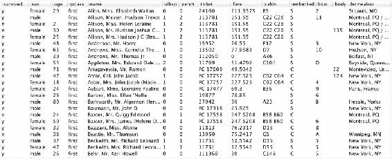

Titanic 数据集也包含类别变量。例如，**:sex**、**:pclass**（乘客等级）和**:embarked**（表示登船港口的字母）。这些都是字符串值，取值如 **female**、**first** 和 **C**，但是类别不一定总是字符串值。像 **:ticket**、**:boat** 和 **:body** 这样的列也可以视为包含类别变量。尽管它们具有数字值，但它们仅仅是被应用于事物的标签。

### 注意

类别变量是指只能取离散值的变量。这与连续变量不同，后者可以在其范围内取任何值。

其他代表计数的数字并不那么容易定义。字段 **:sibsp** 报告乘客随行的伙伴（配偶或兄弟姐妹）数量。这些是计数，单位是人。但它们也可以很容易地表示为标签，其中 **0** 代表“没有伙伴的乘客”，**1** 代表“有一个伙伴的乘客”，以此类推。标签的集合很小，因此该字段作为数字的表示主要是为了方便。换句话说，我们可以选择将 **:sibsp**（以及 **:parch** —— 计数相关父母和孩子）表示为类别特征或数值特征。

由于类别变量在数值轴上没有意义，我们无法绘制一张图表来显示这些数字之间的关系。然而，我们可以构建一个频率表，展示每个组中乘客的计数是如何分布的。由于有两组两个变量，所以总共有四个组。

数据可以使用 Incanter 核心的 `$rollup` 函数进行汇总：

```py
(defn frequency-table [sum-column group-columns dataset]
  (->> (i/$ group-columns dataset)
       (i/add-column sum-column (repeat 1))
       (i/$rollup :sum sum-column group-columns)))

(defn ex-4-2 []
  (->> (load-data "titanic.tsv")
       (frequency-table :count [:sex :survived])))
```

Incanter 的 `$rollup` 要求我们提供三个参数——一个函数用于“汇总”一组行，一个要汇总的列，以及定义感兴趣组的唯一值的列。任何将序列减少为单一值的函数都可以作为汇总函数，但有些函数非常常见，我们可以使用关键字 `:min`、`:max`、`:sum`、`:count` 和 `:mean` 来代替。

该示例生成了如下表格：

```py
| :survived |   :sex | :count |
|-----------+--------+--------|
|         n |   male |    682 |
|         n | female |    127 |
|         y |   male |    161 |
|         y | female |    339 |
```

这张图表表示了乘客在各个组别中的频率，例如“死亡男性”、“幸存女性”等。对于这样的频率计数，有几种方式可以理解；我们从最常见的一种开始。

# 与相对风险和几率的比较

上面的 Incanter 数据集是我们数据的一个易于理解的表示，但为了提取每个组的单独数据，我们需要将数据存储在更易于访问的数据结构中。让我们写一个函数，将数据集转换为一系列嵌套的映射：

```py
(defn frequency-map [sum-column group-cols dataset]
  (let [f (fn [freq-map row]
            (let [groups (map row group-cols)]
              (->> (get row sum-column)
                   (assoc-in freq-map groups))))]
    (->> (frequency-table sum-column group-cols dataset)
         (:rows)
         (reduce f {}))))
```

例如，我们可以使用 `frequency-map` 函数，如下所示，计算 `:sex` 和 `:survived` 的嵌套映射：

```py
(defn ex-4-3 []
  (->> (load-data "titanic.tsv")
       (frequency-map :count [:sex :survived])))

;; => {"female" {"y" 339, "n" 127}, "male" {"y" 161, "n" 682}}
```

更一般地，给定任何数据集和列序列，这将使我们更容易提取出我们感兴趣的计数。我们将比较男性和女性的生存率，所以我们使用 Clojure 的 `get-in` 函数来提取男性和女性的死亡人数，以及男性和女性的总人数：

```py
(defn fatalities-by-sex [dataset]
  (let [totals (frequency-map :count [:sex] dataset)
        groups (frequency-map :count [:sex :survived] dataset)]
    {:male (/ (get-in groups ["male" "n"])
              (get totals "male"))
     :female (/ (get-in groups ["female" "n"])
                (get totals "female"))}))

(defn ex-4-4 []
  (-> (load-data "titanic.tsv")
      (fatalities-by-sex)))

;; {:male 682/843, :female 127/466}
```

从这些数字中，我们可以计算简单的比率。相对风险是两组中事件发生概率的比值：

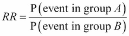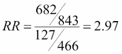

其中，*P(event)* 是事件发生的概率。作为男性，在泰坦尼克号上遇难的风险是*682*除以*843*；作为女性，在泰坦尼克号上遇难的风险是*127*除以*466*：

```py
(defn relative-risk [p1 p2]
  (float (/ p1 p2)))

(defn ex-4-5 []
  (let [proportions (-> (load-data "titanic.tsv")
                        (fatalities-by-sex))]
    (relative-risk (get proportions :male)
                   (get proportions :female))))
;; 2.9685
```

换句话说，如果你是男性，那么在泰坦尼克号上遇难的风险几乎是女性的三倍。相对风险通常用于医疗领域，用来展示某个因素如何影响一个人患病的几率。相对风险为一意味着两组之间的风险没有差异。

相比之下，赔率比可以是正数或负数，衡量的是在某一组中，某一特征的概率增加的程度。和任何相关性一样，这并不意味着存在因果关系。两个属性当然可以通过第三个因素——它们的共同原因——关联起来：

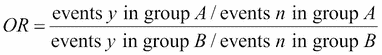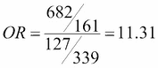

作为男性遇难的赔率是*682*:*161*，作为女性遇难的赔率是*127*:*339*。赔率比就是这两者的比值：

```py
(defn odds-ratio [p1 p2]
  (float
   (/ (* p1 (- 1 p2))
      (* p2 (- 1 p1)))))

(defn ex-4-6 []
  (let [proportions (-> (load-data "titanic.tsv")
                        (fatalities-by-sex))]
    (odds-ratio (get proportions :male)
                (get proportions :female))))
;; 11.3072
```

这个例子展示了赔率比如何对相对位置的陈述敏感，并且可能产生更大的数字。

### 提示

在面对比率时，确保你清楚它们是相对风险比（relative-risk）还是赔率比（odds ratio）。虽然这两种方法看起来相似，但它们的输出结果在不同的范围内。

比较相对风险和赔率比的两个公式。在每种情况下，分子是相同的，但对于风险而言，分母是所有女性，而对于赔率比来说，分母是幸存的女性。

# 比例的标准误差

很明显，女性在泰坦尼克号上幸存的比例远高于男性。但正如我们在第二章 *推断* 中遇到的停留时间差异一样，我们应该问自己，这些差异是否可能仅仅是由于偶然因素导致的。

我们在前几章中已经看到，如何根据样本的标准误差构建统计量的置信区间。标准误差是基于样本的方差计算的，但比例的方差是多少呢？无论我们取多少样本，生成的比例只有一个——即总体样本中的比例。

显然，比例仍然会受到某种程度的方差影响。当我们将一枚公平的硬币抛掷 10 次时，我们预期大约会得到五次正面，但并不是不可能出现连续十次正面。

## 使用引导法的估算

在第二章，*推断*中，我们学习了引导统计量，如均值，并看到了引导法如何通过模拟估算参数。让我们使用引导法来估算泰坦尼克号女性乘客幸存比例的标准误差。

我们可以将 466 名女性乘客表示为一个零和一的序列。零可以表示一位遇难的乘客，一则表示一位幸存的乘客。这是一种方便的表示方式，因为这意味着整个序列的和等于幸存乘客的总数。通过从这个由 466 个零和一组成的序列中反复随机抽取 466 个元素，并计算每次的总和，我们可以估算比例的方差：

```py
(defn ex-4-7 []
  (let [passengers (concat (repeat 127 0)
                           (repeat 339 1))
        bootstrap (s/bootstrap passengers i/sum :size 10000)]
    (-> (c/histogram bootstrap
                     :x-label "Female Survivors"
                     :nbins 20)
        (i/view))))
```

上面的代码生成了以下直方图：

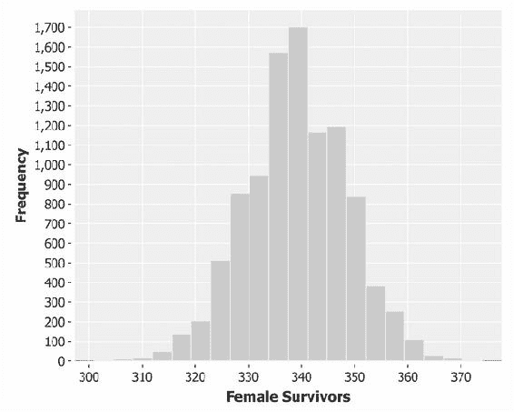

直方图似乎显示了一个均值为 339 的正态分布——即测得的女性幸存者数量。这个分布的标准差是采样幸存者的标准误差，我们可以通过简单地从引导样本中计算得出：

```py
(defn ex-4-8 []
  (-> (concat (repeat 127 0)
              (repeat 339 1))
      (s/bootstrap i/sum :size 10000)
      (s/sd)))

;; 9.57
```

你的标准差可能会略有不同，具体取决于引导样本中的偶然变化。不过，它应该非常接近。

标准差的单位是人——女性乘客——因此，为了计算比例的标准误差，我们必须将其除以样本中的总乘客人数，即 466 人。这样得到的比例标准误差是 0.021。

# 二项分布

前面的直方图看起来非常像正态分布，但实际上它是一个二项分布。这两种分布非常相似，但二项分布用于建模我们希望确定二元事件发生次数的情况。

让我们将二项分布和正态分布同时绘制在直方图上，以便比较它们的差异：

```py
(defn ex-4-9 []
  (let [passengers (concat (repeat 127 0)
                           (repeat 339 1))
        bootstrap (s/bootstrap passengers i/sum :size 10000)
        binomial (fn [x]
                   (s/pdf-binomial x :size 466 :prob (/ 339 466)))
        normal (fn [x]
                 (s/pdf-normal x :mean 339 :sd 9.57))]
    (-> (c/histogram bootstrap
                     :x-label "Female Survivors"
                     :series-label "Bootstrap"
                     :nbins 20
                     :density true
                     :legend true)
        (c/add-function binomial 300 380
                        :series-label "Biomial")
        (c/add-function normal 300 380
                        :series-label "Normal")
        (i/view))))
```

上面的代码生成了以下图表：

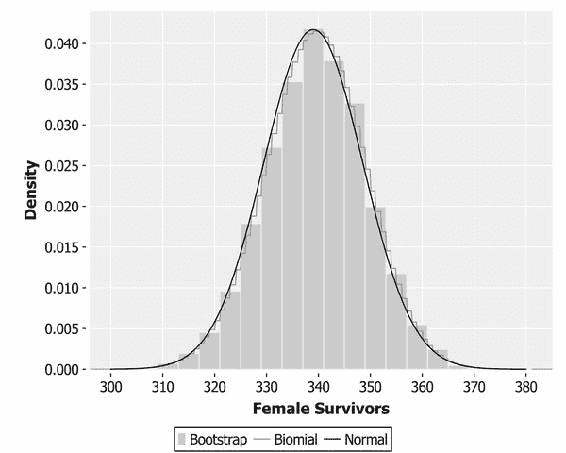

请注意，在前面的图表中，与二项分布对应的线是锯齿形的——它表示的是离散的计数，而不是像正态分布那样的连续值。

## 比例的标准误差公式

我们已经通过经验计算出了标准误差，并发现其值为 0.021，仅使用了女性幸存者的比例和女性乘客的总数。尽管看到比例的标准误差实际上测量的内容很有启发性，但有一个公式可以让我们一步到位地得到这个结果：

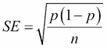

将女性幸存者的计数代入公式后，我们得到如下结果：

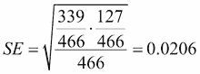

幸运的是，这个数字与我们通过自助法（bootstrapping）计算得出的标准误差非常接近。当然，这不是完全一样的，因为我们的自助法计算有自己的抽样误差。

```py
(defn standard-error-proportion [p n]
  (-> (- 1 p)
      (* p)
      (/ n)
      (i/sqrt)))

(defn ex-4-10 []
  (let [survived (->> (load-data "titanic.tsv")
                      (frequency-map :count [:sex :survived]))
        n (reduce + (vals (get survived "female")))
        p (/ (get-in survived ["female" "y"]) n)]
    (se-proportion p n)))

;; 0.0206
```

比例的标准误差公式为我们提供了一个重要的见解——当*p*接近 0.5 时，*p(1 - p)*的值最大。这意味着，当比例接近一半时，比例的标准误差最大。

如果这让你感到惊讶，可以考虑这一点——当比例为 50%时，样本中的变异性最大。就像公平的掷硬币一样，我们无法预测下一个值会是什么。当样本中的比例增大（或减小）时，数据变得越来越同质。因此，变异性减少，从而标准误差也相应减少。

# 显著性检验比例

让我们回到问题：男女死亡率的差异是否仅仅是偶然的结果。如同第二章中所述，*推断*，我们的*z*检验实际上是将比例的差异除以合并的标准误差：

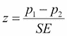

在前面的公式中，*p*[1]表示幸存女性的比例，即*p*339/466 = 0.73*。而*p*[2]表示幸存男性的比例，即*p*161/843 = 0.19*。

要计算*z*统计量，我们需要合并两个比例的标准误差。我们的比例分别衡量了男性和女性的生还率，因此合并的标准误差实际上就是男性和女性的标准误差之和，或整体的总生还率，计算公式如下：

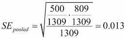

将数值代入*z*统计量的公式：

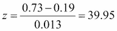

使用*z*分数意味着我们将使用正态分布查找*p*-值：

```py
(defn ex-4-11 []
  (let [dataset     (load-data "titanic.tsv")
        proportions (fatalities-by-sex dataset)
        survived    (frequency-map :count [:survived] dataset)
        total  (reduce + (vals survived))
        pooled (/ (get survived "n") total)
        p-diff (- (get proportions :male)
                  (get proportions :female))
        z-stat (/ p-diff (se-proportion pooled total))]
    (- 1 (s/cdf-normal (i/abs z-stat)))))

;; 0.0
```

由于我们进行的是单尾检验，*p*-值是*z*分数小于 39.95 的概率。答案为零，表示这是一个非常非常显著的结果。这使我们能够拒绝零假设，并得出结论：男女之间的生还率差异显然不仅仅是偶然的结果。

## 调整大样本的标准误差

你可能会好奇，为什么我们要讨论标准误差。我们关于泰坦尼克号乘客的数据并不是来自一个更大人群的样本，它就是整个样本。泰坦尼克号只有一艘，而且只有一次命运多舛的航行。

虽然从某种意义上讲这是正确的，但泰坦尼克号灾难发生的方式有很多种。如果没有遵循“妇女和儿童优先”的指示，或者更普遍地遵循了这些指示，结果可能会有所不同。如果每个人都有足够的救生艇，或者疏散过程更顺利，那么这些因素也会体现在结果中。

标准误差和显著性检验使我们能够将灾难视为无数潜在相似灾难之一，并确定观察到的差异是否可能是系统性的，还是纯粹的巧合。

话虽如此，有时我们更关心的是我们对样本是否能够代表有限的、量化的人群的信心。随着样本开始测量总体的 10%以上时，我们可以通过调整标准误差来降低不确定性：

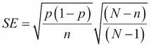

这可以用 Clojure 编写如下：

```py
(defn se-large-proportion [p n N]
  (* (se-proportion p n)
     (i/sqrt (/ (- N n)
                (- n 1)))))
```

*N* 是总体人口的大小。当样本量相对于总体人口的大小增加时，*(N - n)* 会趋近于零。如果你采样了整个总体，那么无论比例差异多么微小，都会被判断为显著的。

# 卡方检验的多重显著性检验

并非所有类别都是二元的（例如男性和女性，生还和遇难）。虽然我们期望类别变量有有限数量的类别，但对于特定属性的类别数并没有硬性上限。

我们可以使用其他类别变量来区分泰坦尼克号上的乘客，例如他们乘坐的舱位。泰坦尼克号有三个舱位等级，而我们在本章开头构建的 `frequency-table` 函数已经能够处理多个舱位。

```py
(defn ex-4-12 []
  (->> (load-data "titanic.tsv")
       (frequency-table :count [:survived :pclass])))
```

这段代码生成了以下的频率表：

```py
| :pclass | :survived | :count |
|---------+-----------+--------|
|   third |         y |    181 |
|   third |         n |    528 |
|  second |         y |    119 |
|  second |         n |    158 |
|   first |         n |    123 |
|   first |         y |    200 |
```

这三个舱位为我们提供了一个额外的方式来分析生还率数据。随着舱位数量的增加，在频率表中识别模式变得更加困难，因此我们可以将其可视化。

## 可视化类别

尽管饼图最初是为了表示比例而设计的，但通常不是表示部分与整体关系的好方式。人们很难在视觉上比较圆形切片的面积。将数量线性表示，如堆叠柱状图，几乎总是更好的方法。不仅面积更容易解释，而且它们更容易并排比较。

我们可以将数据可视化为堆叠柱状图：

```py
(defn ex-4-13 []
  (let [data (->> (load-data "titanic.tsv")
                  (frequency-table :count [:survived :pclass]))]
    (-> (c/stacked-bar-chart :pclass :count
                             :group-by :survived
                             :legend true
                             :x-label "Class"
                             :y-label "Passengers"
                             :data data)
        (i/view))))
```

上面的代码生成了以下图表：

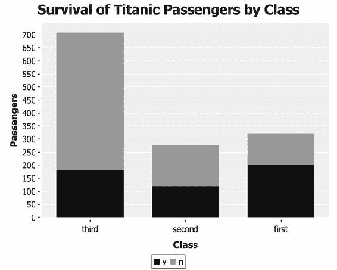

数据清楚地显示了乘客死亡人数和比例之间的差异，尤其是在头等舱和三等舱之间最为明显。我们想确定这种差异是否显著。

我们可以在每对比例之间执行*z*检验，但正如我们在第二章学到的那样，这很可能导致Ⅰ型错误，并导致我们在事实上没有显著结果时找到显著结果。

多类别显著性测试的问题似乎需要进行*F*检验，但*F*检验基于某些连续变量在组内和组间方差的比率。因此，我们需要的是一个类似的测试，它只关心组之间的相对比例。这是*X*²检验的基础。

## 卡方检验

发音为*kai square*，*X*²检验是应用于分类数据集的统计检验，用于评估观察到的不同类别比例之间差异可能是由于偶然因素引起的概率。

因此，在进行*X*²检验时，我们的零假设是组间观察到的比例差异仅仅是由于偶然变异所导致的结果。我们可以将其视为两个分类变量之间的独立性检验。如果类别*A*是乘客等级，类别*B*是是否存活，则零假设是乘客等级和生存率彼此独立。备择假设是这些类别不独立——乘客等级和生存率在某种程度上相关。

*X*²统计量是通过将样本的观察频率与根据独立性假设计算的频率表进行比较而计算的。这个频率表是估计数据如果类别独立会是什么样子的。我们可以通过以下方式计算假设独立的频率表，使用行、列和总计：

|   | 生存 | 未生存 | 总计 |
| --- | --- | --- | --- |
| 一等舱 | *323*500/1309 = 123.4* | *323*809/1309 = 199.6* | *323* |
| 二等舱 | *277*500/1309 = 105.8* | *277*809/1309 = 171.2* | *277* |
| 三等舱 | *709*500/1309 = 270.8* | *709*809/1309 = 438.2* | *709* |
| 总计 | *500* | *809* | *1,309* |

一个简单的公式仅使用每行和每列的总数计算每个单元格的值，并假设在单元格之间有均匀分布。这是我们的预期频率表。

```py
(defn expected-frequencies [data]
  (let [as (vals (frequency-map :count [:survived] data))
        bs (vals (frequency-map :count [:pclass] data))
        total (-> data :rows count)]
    (for [a as
          b bs]
      (* a (/ b total)))))

(defn ex-4-14 []
  (-> (load-data "titanic.tsv")
      (expected-frequencies)))

;; => (354500/1309 138500/1309 9500/77 573581/1309 224093/1309 15371/77)
```

为了证明不同乘客等级的生存率之间的统计显著差异，我们需要表明假设独立和观察频率之间的差异不太可能仅仅是由于偶然因素引起的。

## 卡方统计量

*X*²统计量简单地衡量了实际频率与假设独立情况下计算的频率之间的差异：

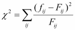

*F*[ij] 是假设类别 *i* 和 *j* 独立时的预期频率，而 *f*[ij] 是类别 *i* 和 *j* 的观察频率。因此，我们需要获取数据的观察频率。我们可以在 Clojure 中如下计算：

```py
(defn observed-frequencies [data]
  (let [as (->> (i/$rollup :sum :count :survived data)
                (summary :count [:survived]))
        bs (->> (i/$rollup :sum :count :pclass data)
                (summary :count [:pclass]))
        actual (summary :count [:survived :pclass] data)]
    (for [a (keys as)
          b (keys bs)]
      (get-in actual [a b]))))
```

与之前的 `expected-frequencies` 函数一样，`observed-frequencies` 函数返回每一对类别组合的频率计数序列。

```py
(defn ex-4-15 []
  (-> (load-data "titanic.tsv")
      (observed-frequencies)))

;; (200 119 181 123 158 528)
```

这个序列——以及前面示例中预期值的序列——为我们提供了计算 *X*² 统计量所需的所有信息：

```py
(defn chisq-stat [observed expected]
  (let [f (fn [observed expected]
            (/ (i/sq (- observed expected)) expected))]
    (reduce + (map f observed expected))))

(defn ex-4-16 []
  (let [data (load-data "titanic.tsv")
        observed (observed-frequencies data)
        expected (expected-frequencies data)]
    (float (chisq-stat observed expected))))

;; 127.86
```

现在我们有了检验统计量，我们需要查找相关的分布，以确定结果是否显著。毫不奇怪，我们参照的分布是 *X*² 分布。

## 卡方检验

*X*² 分布由一个自由度参数化：每个类别计数减去 1 的乘积：


这里，*a* 是属性 *A* 的类别数量，*b* 是属性 *B* 的类别数量。对于我们的泰坦尼克号数据，*a* 是 *3*，*b* 是 *2*，所以我们的自由度参数是 *2*。

我们的 *X*² 检验只需要将我们的 *X*² 统计量与 *X*² 累积分布函数（CDF）进行对比。我们现在来做这个：

```py
(defn ex-4-17 []
  (let [data (load-data "titanic.tsv")
        observed (observed-frequencies data)
        expected (expected-frequencies data)
        x2-stat  (chisq-stat observed expected)]
    (s/cdf-chisq x2-stat :df 2 :lower-tail? false)))

;; 1.721E-28
```

这是一个极其小的数字，接近于零，可以认为它没有差别，因此我们可以在任何显著性水平下放心地拒绝原假设。换句话说，我们可以完全确信观察到的差异不是偶然抽样误差的结果。

尽管手动进行 *X*² 检验很有用，但 Incanter stats 命名空间有一个函数 `chisq-test`，可以一步完成 *X*² 检验。使用这个函数，我们只需要将原始的观察表作为矩阵提供给它：

```py
(defn ex-4-18 []
  (let [table  (->> (load-data "titanic.tsv")
                    (frequency-table :count [:pclass :survived])
                    (i/$order [:survived :pclass] :asc))
        frequencies (i/$ :count table)
        matrix      (i/matrix frequencies 3)]
    (println "Observed:"     table)
    (println "Frequencies:"  frequencies)
    (println "Observations:" matrix)
    (println "Chi-Squared test:")
    (-> (s/chisq-test :table matrix)
        (clojure.pprint/pprint))))
```

在前面的代码中，我们从泰坦尼克号数据中计算了一个频率表，并使用 `i/$order` 对其内容进行排序，这样我们就得到了像这样的表格：

```py
| :survived | :pclass | :count |
|-----------+---------+--------|
|         n |   first |    123 |
|         n |  second |    158 |
|         n |   third |    528 |
|         y |   first |    200 |
|         y |  second |    119 |
|         y |   third |    181 |
```

我们取计数列，并使用 `(i/matrix frequencies 3)` 将其转换为一个包含三列的矩阵：

```py
A 2x3 matrix
 -------------
 1.23e+02  1.58e+02  5.28e+02
 2.00e+02  1.19e+02  1.81e+02
```

这个矩阵是 Incanter 的 `s/chisq-test` 函数所需的唯一输入。运行示例，你将看到响应是一个包含键 `:X-sq`（*X*² 统计量）和 `:p-value`（检验结果）等的映射。

我们已经确定类别 "是否幸存" 和 "性别" 之间的关系绝对不是独立的。这类似于在上一章中发现变量——身高、性别和体重——之间的相关性。

如今，接下来的步骤是利用变量之间的依赖关系进行预测。在上一章中，我们的输出是一个预测数字——权重，而在这一章中，我们的输出将是一个类别——关于乘客是否幸存的预测。根据其他属性将项目分配到其预期类别的过程就是分类。

# 使用逻辑回归进行分类

在上一章，我们看到线性回归如何从输入向量*x*和系数向量*β*中生成预测值*ŷ*：


在这里，*ŷ*可以是任何实数。逻辑回归的过程非常类似，但它调整预测值，确保结果仅在零和一之间。

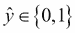

零和一代表两种不同的类别。这个变化非常简单；我们只是将预测值包装在一个函数*g*中，该函数将输出限制在零和一之间：


其中*g*被称为**Sigmoid** **函数**。这个看似微小的变化足以将线性回归转变为逻辑回归，并将实数值预测转化为类别。

## Sigmoid 函数

Sigmoid 函数也被称为*逻辑函数*，如图所示：

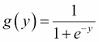

对于正输入，逻辑函数快速上升至一，而对于负输入，它会迅速下降至零。这些输出对应着预测的类别。对于接近零的值，逻辑函数返回接近**0.5**的值，这意味着对正确输出类别的判断不确定性增大。

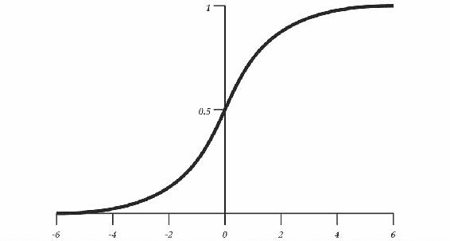

结合我们已经看到的公式，得出以下完整的逻辑假设定义：

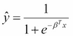

与线性回归一样，参数向量*β*包含我们要学习的系数，*x*是我们的输入特征向量。我们可以用 Clojure 表达这一点，使用以下的高阶函数。给定一个系数向量，这个函数返回一个函数，该函数将为给定的*x*计算*ŷ*：

```py
(defn sigmoid-function [coefs]
  (let [bt (i/trans coefs)
        z  (fn [x] (- (first (i/mmult bt x))))]
    (fn [x]
      (/ 1
         (+ 1
            (i/exp (z x)))))))
```

如果逻辑函数给定的*β*为`[0]`，那么该特征将被认为没有任何预测能力。对于任何输入*x*，该函数将输出`0.5`，对应完全的不确定性：

```py
(let [f (sigmoid-function [0])]
  (f [1])
  ;; => 0.5

  (f [-1])
  ;; => 0.5

  (f [42])
  ;; => 0.5
  )
```

然而，如果提供了非零的系数，Sigmoid 函数可能会返回`0.5`以外的值。正的*β*会使得给定正的*x*时，正类的概率增大，而负的*β*会使得给定正的*x*时，负类的概率增大。

```py
(let [f (sigmoid-function [0.2])
      g (sigmoid-function [-0.2])]
  (f [5])
  ;; => 0.73

  (g [5])
  ;; => 0.27
  )
```

由于大于`0.5`的值对应正类，小于`0.5`的值对应负类，Sigmoid 函数的输出可以简单地四舍五入到最接近的整数，从而获得输出类别。这样，恰好为`0.5`的值会被分类为正类。

现在我们有一个`sigmoid-function`可以返回类别预测，我们需要学习参数*β*，以产生最佳预测*ŷ*。在前一章中，我们看到了两种计算线性模型系数的方法——使用协方差计算斜率和截距，以及使用矩阵的正规方程。在这两种情况下，方程都能找到一个线性解，以最小化我们模型的最小二乘估计。

平方误差是我们线性模型适合的适当函数，但在分类问题中，类别只在零和一之间测量，它不能很好地转化为确定我们预测不正确程度的方法。我们需要一种替代方法。

## 逻辑回归成本函数

与线性回归类似，逻辑回归算法必须从数据中学习。`cost`函数是让算法知道其表现如何的一种方式，好或坏。

以下是逻辑回归的`cost`函数，它根据输出类别是否应为零或一施加不同的成本。单个训练示例的成本计算如下：

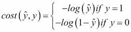

这对函数捕捉到这样的直觉，即如果*ŷ* = 0，但*y* = 1，则模型应受到非常大的惩罚成本。对称地，如果*ŷ* = 1，而*y* = 0，则模型也应受到严重惩罚。当模型与数据高度一致时，成本急剧下降至零。

这是单个训练点的成本。要结合个别成本并计算给定系数向量和一组训练数据的总体成本，我们可以简单地取所有训练示例的平均值：

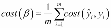

在 Clojure 中可以表示为：

```py
(defn logistic-cost [ys y-hats]
  (let [cost (fn [y y-hat]
               (if (zero? y)
                 (- (i/log (- 1 y-hat)))
                 (- (i/log y-hat))))]
    (s/mean (map cost ys y-hats))))
```

现在我们有一个`cost`函数，可以量化我们预测不正确的程度，下一步是利用这些信息来找出更好的预测。最佳分类器将是总体成本最低的分类器，因为根据定义，其预测类将最接近真实类。我们可以通过所谓的**梯度下降**方法逐步改进我们的成本。

## 使用梯度下降进行参数优化

成本函数，也称为**损失函数**，是根据我们的系数计算模型误差的函数。不同的参数将为相同的数据集生成不同的成本，我们可以在图表上可视化成本函数随参数变化的情况。

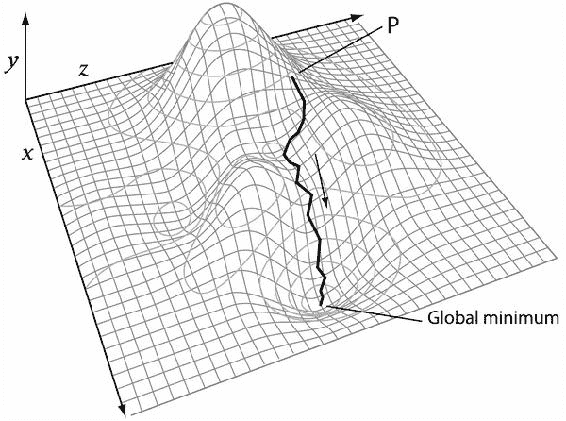

上述图表显示了两参数模型的成本函数表示。成本在*y*轴上绘制（较高的值对应较高的成本），两个参数分别在*x*轴和*z*轴上绘制。

最佳参数是那些最小化成本函数的参数，对应于被标记为“全局最小值”的点。我们无法提前知道这些参数是什么，但可以进行初步的任意猜测。这些参数对应于点“P”。

梯度下降是一种通过沿着梯度向下迭代改进初始条件的算法，直到找到最小值。当算法无法进一步下降时，最小成本就找到了。此时的参数对应于我们对于最小化成本函数的最佳估计。

## 带有 Incanter 的梯度下降

Incanter 提供了使用`incanter.optimize`命名空间中的`minimize`函数运行梯度下降的功能。数学优化是指一系列旨在找到某组约束条件下最佳解决方案的技术的总称。`incanter.optimize`命名空间包含了用于计算能最小化或最大化任意函数值的参数的函数。

例如，以下代码在给定初始位置`10`的情况下找到`f`的最小值。由于`f`是*x*²，产生最小值的输入是`0`：

```py
(defn ex-4-19 []
  (let [f (fn [[x]]
            (i/sq x))
        init [10]]
    (o/minimize f init)))
```

实际上，如果你运行这个例子，你应该得到一个非常接近零的答案。然而，由于梯度下降往往只提供近似答案，你不太可能得到准确的零—Incanter 的`minimize`函数接受一个容差参数`:tol`，默认为 0.00001。如果结果在迭代之间的差异小于这个值，则表示方程已经收敛。该函数还接受一个`:max-iter`参数，即在返回答案之前最多执行的步数，不考虑是否已收敛。

## 凸性

梯度下降并不总能确保找到所有方程的最低成本。例如，结果可能找到所谓的“局部最小值”，它表示初始猜测附近的最低成本，但并不代表问题的最佳整体解决方案。以下图示说明了这一点：

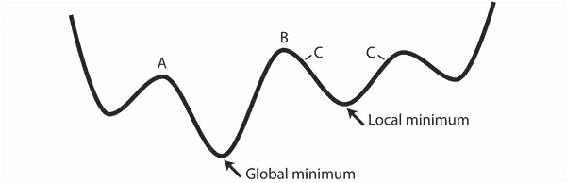

如果初始位置对应于图中标记为**C**的点，则算法将收敛到局部最小值。梯度下降会找到一个最小值，但这不是最佳的整体解决方案。只有初始猜测位于**A**到**B**的范围内，才会收敛到全局最小值。

因此，梯度下降可能会根据其初始化收敛到不同的答案。为了确保找到最优解，梯度下降要求优化的方程必须是凸的。这意味着方程只有一个全局最小值，且没有局部最小值。

例如，`sin`函数没有全局最小值。我们计算出的最小值将强烈依赖于我们的初始条件：

```py
(defn ex-4-20 []
  (let [f (fn [[x]]
            (i/sin x))]
    (println (:value (o/minimize f [1])))
    (println (:value (o/minimize f [10])))
    (println (:value (o/minimize f [100])))))

A 1x1 matrix
 -------------
-2.14e+05

 A 1x1 matrix
 -------------
 1.10e+01

 A 1x1 matrix
 -------------
 9.90e+01
```

幸运的是，逻辑回归是一个凸函数。这意味着无论我们从哪里开始，梯度下降都能确定对应全局最小值的系数值。

# 使用 Incanter 实现逻辑回归

我们可以通过以下方式使用 Incanter 的 `minimize` 函数来定义逻辑回归函数：

```py
(defn logistic-regression [ys xs]
  (let [cost-fn (fn [coefs]
                  (let [classify (sigmoid-function coefs)
                        y-hats   (map (comp classify i/trans) xs)]
                    (logistic-cost ys y-hats)))
        init-coefs (repeat (i/ncol xs) 0.0)]
    (o/minimize cost-fn init-coefs)))
```

`cost-fn` 接受一个系数矩阵。我们使用之前定义的 `sigmoid-function` 从系数创建分类器，并基于输入数据生成一系列预测值 `y-hats`。最后，我们可以基于提供的系数计算并返回 `logistic-cost` 值。

为了执行逻辑回归，我们通过选择最优参数来最小化逻辑 `cost-fn`，并传递给 `sigmoid-function`。由于我们必须从某个地方开始，我们的初始系数就是每个参数的 `0.0`。

`minimize` 函数期望接收数字形式的输入。像上一章的运动员数据一样，我们需要将 Titanic 数据转换为特征矩阵，并为类别数据创建虚拟变量。

## 创建特征矩阵

让我们定义一个函数 `add-dummy`，它将为给定的列创建一个虚拟变量。当输入列中的值等于某个特定值时，虚拟列将包含 `1`。当输入列中的值不等于该值时，虚拟列将为 `0`。

```py
(defn add-dummy [column-name from-column value dataset]
  (i/add-derived-column column-name
                        [from-column]
                        #(if (= % value) 1 0)
                        dataset))
```

这个简单的函数使得将 Titanic 数据转换为特征矩阵变得非常简单：

```py
(defn matrix-dataset []
  (->> (load-data "titanic.tsv")
       (add-dummy :dummy-survived :survived "y")
       (i/add-column :bias (repeat 1.0))
       (add-dummy :dummy-mf :sex "male")
       (add-dummy :dummy-1 :pclass "first")
       (add-dummy :dummy-2 :pclass "second")
       (add-dummy :dummy-3 :pclass "third")
       (i/$ [:dummy-survived :bias :dummy-mf
             :dummy-1 :dummy-2 :dummy-3])
       (i/to-matrix)))
```

我们的输出矩阵将完全由零和一组成。特征矩阵的第一个元素是决定生存的虚拟变量。这是我们的类标签。`0` 代表死亡，`1` 代表生存。第二个是 `bias` 项，始终包含值 `1.0`。

在定义了我们的 `matrix-dataset` 和 `logistic-regression` 函数后，运行逻辑回归就像这样简单：

```py
(defn ex-4-21 []
  (let [data (matrix-dataset)
        ys (i/$ 0 data)
        xs (i/$ [:not 0] data)]
    (logistic-regression ys xs)))
```

我们为 Incanter 的 `i/$` 函数提供 `0`，以选择矩阵的第一列（类），并使用 [`:not 0`] 来选择其他所有项（特征）：

```py
;; [0.9308681940090573 -2.5150078795265753 1.1782368822555778
;;  0.29749924127081434 -0.5448679293359383]
```

如果你运行这个例子，你会发现它返回一个数字向量。这个向量对应于逻辑回归模型系数的最佳估计值。

## 评估逻辑回归分类器

在前一部分计算的向量包含了我们逻辑回归模型的系数。我们可以通过将这些系数传递给我们的 `sigmoid-function` 来进行预测，如下所示：

```py
(defn ex-4-22 []
  (let [data (matrix-dataset)
        ys (i/$ 0 data)
        xs (i/$ [:not 0] data)
        coefs (logistic-regression ys xs)
        classifier (comp logistic-class
                      (sigmoid-function coefs)
                      i/trans)]
    (println "Observed: " (map int (take 10 ys)))
    (println "Predicted:" (map classifier (take 10 xs)))))

;; Observed:  (1 1 0 0 0 1 1 0 1 0)
;; Predicted: (1 0 1 0 1 0 1 0 1 0)
```

你会看到分类器并没有做得完美——它对一些类感到困惑。在前十个结果中，它将四个类预测错误，这只比随机猜测稍好一点。让我们看看在整个数据集中正确识别的类的比例：

```py
(defn ex-4-23 []
  (let [data (matrix-dataset)
        ys (i/$ 0 data)
        xs (i/$ [:not 0] data)
        coefs (logistic-regression ys xs)
        classifier (comp logistic-class
                      (sigmoid-function coefs)
                      i/trans)
        y-hats (map classifier xs)]
    (frequencies (map = y-hats (map int ys)))))

;; {true 1021, false 288}
```

在前面的代码中，我们像以前一样训练一个分类器，然后简单地遍历整个数据集，查找预测结果与观察到的类别是否相同。我们使用 Clojure 核心的 `frequencies` 函数来提供一个简单的计数，统计类别相等的次数。

在 1,309 次预测中，正确预测 1,021 次意味着 78%的正确率。我们的分类器显然比随机猜测要好。

## 混淆矩阵

虽然正确率是一个简单的计算和理解的度量，但它容易受到分类器系统性地低估或高估某个类别的影响。作为极端例子，考虑一个始终将乘客归类为已死亡的分类器。在我们的 Titanic 数据集中，这样的分类器会显示出 68%的正确率，但在一个大部分乘客都生还的替代数据集中，它的表现将会非常糟糕。

一个 `confusion-matrix` 函数展示了训练集中的误分类项，按照真正例、真反例、假正例和假反例进行划分。混淆矩阵的每一行代表输入类别，每一列代表模型类别。我们可以在 Clojure 中这样创建它：

```py
(defn confusion-matrix [ys y-hats]
  (let [classes   (into #{} (concat ys y-hats))
        confusion (frequencies (map vector ys y-hats))]
    (i/dataset (cons nil classes)
               (for [x classes]
                 (cons x
                       (for [y classes]
                         (get confusion [x y])))))))
```

然后，我们可以像这样在我们的逻辑回归结果上运行混淆矩阵：

```py
(defn ex-4-24 []
  (let [data (matrix-dataset)
        ys (i/$ 0 data)
        xs (i/$ [:not 0] data)
        coefs (logistic-regression ys xs)
        classifier (comp logistic-class
                      (sigmoid-function coefs)
                      i/trans)
        y-hats (map classifier xs)]
    (confusion-matrix (map int ys) y-hats)))
```

它返回以下矩阵：

```py
|   |   0 |   1 |
|---+-----+-----|
| 0 | 682 | 127 |
| 1 | 161 | 339 |
```

我们可以看到模型返回了 `682` 个真正例和 `339` 个真反例，总计 1,021 次正确预测。一个优秀模型的混淆矩阵将主要集中在对角线上，非对角线位置的数字会小得多。一个完美的分类器将在所有非对角线的单元格中显示零。

## kappa 统计量

kappa 统计量可以用来比较两组类别之间的匹配度，以查看它们的相符程度。它比仅仅查看百分比一致性更为稳健，因为该公式旨在考虑某些一致性可能仅仅是由于偶然发生的可能性。

kappa 统计量模型计算每个类别在每个序列中出现的频率，并将其纳入计算中。例如，如果我在每次抛硬币时猜中正反面各 50%的概率，但我总是猜正面，那么 kappa 统计量的值将为零。这是因为一致性并没有超出偶然可能发生的范围。

为了计算 kappa 统计量，我们需要知道两件事：

+   *p(a)*：这是实际观察到的一致性概率。

+   *p(e)*：这是预期一致性的概率。

*p(a)* 的值是我们之前计算出的 78%的百分比一致性。它是正确的正例和正确的负例的总和除以样本的大小。

为了计算 *p(e)* 的值，我们需要知道数据中负类的比例，以及我们模型预测的负类比例。数据中负类的比例是 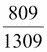，即 62%。这是泰坦尼克号灾难中的整体死亡概率。模型中的负类比例可以通过混淆矩阵计算得出，为 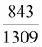，即 64%。

数据和模型可能偶然一致的概率，*p(e)*，是指模型和数据同时为负类的概率 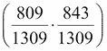 加上数据和模型同时为正类的概率 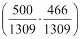。因此，随机一致的概率 *p(e)* 约为 53%。

上述信息就是我们计算 kappa 统计量所需的全部内容：

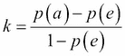

代入我们刚刚计算的值，得到：

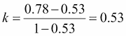

我们可以在 Clojure 中按如下方式计算：

```py
(defn kappa-statistic [ys y-hats]
  (let [n (count ys)
        pa (/ (count (filter true? (map = ys y-hats))) n)
        ey (/ (count (filter zero? ys)) n)
        eyh (/ (count (filter zero? y-hats)) n)
        pe (+ (* ey eyh)
              (* (- 1 ey)
                 (- 1 eyh)))]
    (/ (- pa pe)
       (- 1 pe))))

(defn ex-4-25 []
   (let [data (matrix-dataset)
         ys (i/$ 0 data)
         xs (i/$ [:not 0] data)
         coefs (logistic-regression ys xs)
         classifier (comp logistic-class
                       (sigmoid-function coefs)
                       i/trans)
         y-hats (map classifier xs)]
     (float (kappa-statistic (map int ys) y-hats))))

;; 0.527
```

Kappa 值的范围在 0 到 1 之间，1 表示两个输出类别完全一致。仅对一个输出类别完全一致时，kappa 值是未定义的——比如如果我每次都猜对抛硬币的结果 100%，但硬币每次都显示正面，那么我们无法知道硬币是否公正。

# 概率

到目前为止，我们在本书中以不同的方式遇到了概率：作为 *p* 值、置信区间，以及最近作为逻辑回归的输出，其中结果可以视为输出类别为正类的概率。我们为 kappa 统计量计算的概率是通过将计数加总并除以总数得到的。例如，一致的概率是通过将模型和数据一致的次数除以样本数来计算的。这种计算概率的方法被称为 **频率主义**，因为它关注的是事件发生的频率。

逻辑回归输出为 `1.0`（未四舍五入）表示输入属于正类的确定性；输出为 `0.0` 表示输入不属于正类的确定性；输出为 `0.5` 表示对输出类别完全不确定。例如，如果 *ŷ = 0.7*，则 *y = 1* 的概率为 70%。我们可以用以下方式表示：

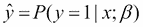

我们说 *y-hat 等于在给定 x 和由 β 参数化的情况下，y 等于 1 的概率*。这个新符号表示我们的预测 *ŷ* 是由输入 *x* 和 *β* 等信息决定的。这些向量中的值会影响我们对输出概率的计算，从而影响我们对 *y* 的预测。

频率学派的概率观念的替代方法是**贝叶斯观点**。贝叶斯的概率观念将先验信念纳入概率计算。为了说明两者的不同，我们再次来看抛硬币的例子。

假设抛硬币 14 次，其中正面朝上出现 10 次。现在要求你赌下两次抛掷是否会出现正面，你会下注吗？

对频率学派来说，硬币连续两次正面朝上的概率是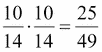。这略高于 50%，因此下注是有道理的。

贝叶斯学派会以不同的方式来框定问题。假设我们有一个认为硬币是公平的先验信念，那么数据与这一信念的契合程度如何？14 次抛掷的标准误差是 0.12。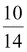与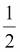之差除以标准误差约为 1.77，对应的*p*值大约是 0.08。证据不足以拒绝硬币公平的理论。如果硬币是公平的，那么连续两次出现正面的概率是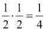，我们很可能会输掉这场赌局。

### 注意

在 18 世纪，皮埃尔-西蒙·拉普拉斯提出了“太阳明天会升起的概率是多少？”这个问题，旨在说明用概率论来评估陈述的可信度的困难。

贝叶斯的概率观念引出了一个非常有用的定理——**贝叶斯定理**。

## 贝叶斯定理

我们在上一节中介绍的逻辑回归方程就是条件概率的一个例子：


我们的预测*ŷ*的概率由* x *和* β *的值决定。条件概率是已知某个事实时，另一件事发生的可能性。例如，我们已经考虑过“假设乘客为女性时，生还的概率”这类问题。

假设我们对*x*、*y*和*z*感兴趣，概率的基本符号表示如下：

+   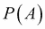：这是*A*发生的概率

+   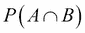：这是*A*和*B*同时发生的联合概率

+   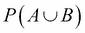：这是*A*或*B*发生的概率

+   ：这是在*B*已发生的条件下，*A*发生的概率

+   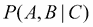：这是在*C*已发生的条件下，*A*和*B*同时发生的概率

前述变量之间的关系可以通过以下公式表示：

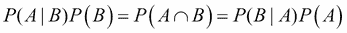

使用这个方法，我们可以通过来求解，假设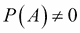，从而得到所谓的贝叶斯定理：

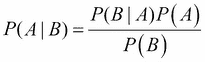

我们可以这样理解：“在给定 *B* 的情况下，*A* 的概率等于在给定 *A* 的情况下 *B* 的概率，乘以 *A* 的概率，再除以 *B* 的概率”。

 是先验概率：对 *A* 的初始信念程度。

 是条件概率——在考虑了 *B* 的情况下，对 *A* 的信念程度。

商数 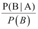 表示 *B* 对 *A* 提供的支持。

贝叶斯定理可能看起来令人生畏且抽象，因此我们来看看一个实际应用它的例子。假设我们正在检测一种已经感染了 1% 人口的疾病。我们有一种高灵敏度且高特异性的测试，虽然它不是完美的：

+   99% 的生病病人检测结果为阳性

+   99% 的健康病人测试结果为阴性

假设一位病人检测结果为阳性，那么这位病人实际上生病的概率是多少？

之前的要点似乎暗示着，阳性测试意味着有 99% 的机会患病，但这并没有考虑到这种疾病在整体人口中的稀有性。由于感染的概率（先验概率）非常小，即使你测试为阳性，你实际患病的概率也会大大降低。

让我们通过 10,000 名代表性的人群来计算这些数字。这样 100 人是生病的，9,900 人是健康的。如果我们对这 10,000 人进行测试，我们会发现 99 名生病的人检测为阳性（真正阳性），但是也有 99 名健康的人检测为阳性（假阳性）。如果你测试为阳性，那么实际上患病的概率是 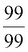，即 50%：

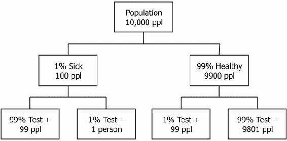

我们可以使用贝叶斯定理来计算这个例子。让 *y* 表示“生病”，*x* 表示阳性结果事件“+”：


换句话说，尽管阳性测试极大地增加了你得病的可能性（从人口中 1% 的概率增加到了 99%），但你实际上生病的机会依然只有 50%——远低于测试准确度所暗示的 99%。

之前的例子给出了清晰的数字，我们现在来运行泰坦尼克号数据的例子。

在已知你是女性的情况下生存的概率等于在你生存的前提下是女性的概率，乘以生存的概率，再除以泰坦尼克号上女性的概率：

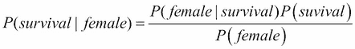

让我们回顾一下之前的列联表：

```py
| :survived |   :sex | :count |
|-----------+--------+--------|
|         n |   male |    682 |
|         n | female |    127 |
|         y |   male |    161 |
|         y | female |    339 |
```

*P(survival|female)* 是后验概率，即在已知证据的情况下对生存的信念程度。这正是我们要计算的值。

*P(female|survival)* 是在已知生存的情况下为女性的条件概率：

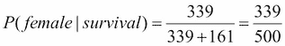

*P(survival)* 是先验概率，即对生存的初始信念程度：

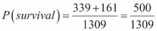

*P(female)* 是证据：

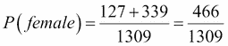

将这些比例代入贝叶斯法则：

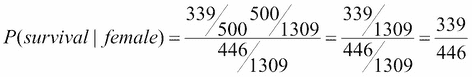

使用贝叶斯法则，我们计算出，在已知为女性的情况下，生存概率为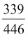，即 76%。

请注意，我们也可以通过查找总女性中的幸存者比例来计算这个值：。贝叶斯法则之所以受欢迎，是因为它提供了一种计算这种概率的方法，即使没有相应的列联表。

## 带有多个预测因子的贝叶斯定理

作为一个例子，说明如何在没有完整列联表的情况下使用贝叶斯法则，我们以第三等级男性为例。第三等级男性乘客的生存概率是多少？

让我们为这个新问题写出贝叶斯法则：


接下来，我们有两个列联表：

```py
| :survived | :pclass | :count |
|-----------+---------+--------|
|         n |   first |    123 |
|         n |  second |    158 |
|         n |   third |    528 |
|         y |   first |    200 |
|         y |  second |    119 |
|         y |   third |    181 |

| :survived |   :sex | :count |
|-----------+--------+--------|
|         n | female |    127 |
|         n |   male |    682 |
|         y | female |    339 |
|         y |   male |    161 |
```

"第三等级男性"不是我们任何列联表中的一个类别，无法简单查找。然而，通过使用贝叶斯定理，我们可以这样计算它：

我们正在寻找的后验概率是*P(幸存|男性,第三等级)*。

生存的先验概率与之前相同：，大约为 0.38。

条件概率是。这与相同。换句话说，我们可以将这两个概率相乘：


证据是既是男性又是第三等级的概率：：


将这一切综合起来：


实际上，在总共 493 名第三等级男性中，有 75 名幸存，真实的生存率为 15%。贝叶斯定理使我们能够在没有完整列联表的情况下，精确计算出真实答案。

# 朴素贝叶斯分类

我们通过贝叶斯定理得到的答案与实际结果略有不同，是因为在计算时，我们假设男性的概率和处于第三等级的概率是独立的。在下一部分，我们将使用贝叶斯定理生成一个朴素贝叶斯分类器。

### 注意

这个算法被称为朴素的原因是它假设所有变量都是独立的。我们知道，这通常并非如此，变量之间存在交互效应。例如，我们可能知道一些参数组合使得某个类别的可能性大大增加——例如，既是男性又在第三类。

让我们看看如何使用贝叶斯规则进行分类器的设计。对于第三类男性，生存与死亡这两个可能类别的贝叶斯定理如下所示：


最可能的类别是具有最大后验概率的类别。

 在两个类别中作为共同因子出现。如果我们稍微放宽贝叶斯定理的要求，使其不一定返回概率，我们就可以去掉共同因子，得到以下结果：


我们仅仅从两个方程式的右侧去除了分母。由于我们不再计算概率，因此等号变成了 ，表示“与……成比例”。

将我们之前数据表中的值代入方程中得到：


我们立刻可以看到，我们并没有计算概率，因为这两个类别的和并不等于 1。对于我们的分类器来说，这无关紧要，因为我们本来就只会选择与最大值对应的类别。不幸的是，对于我们的第三类男性，朴素贝叶斯模型预测他将死亡。

让我们为一等舱女性做等效的计算：


幸运的是，对于我们的一等舱女性，模型预测她将会生还。

贝叶斯分类器是贝叶斯概率模型与决策规则（选择哪个类别）的结合体。前面描述的决策规则是最大后验规则，或称 MAP 规则。

## 实现朴素贝叶斯分类器

幸运的是，在代码中实现朴素贝叶斯模型要比理解其数学原理容易得多。第一步是简单地计算每个类别对应的每个特征值的示例数量。以下代码记录了每个类别标签下，每个参数出现的次数：

```py
(defn inc-class-total [model class]
  (update-in model [class :total] (fnil inc 0)))

(defn inc-predictors-count-fn [row class]
  (fn [model attr]
    (let [val (get row attr)]
      (update-in model [class attr val] (fnil inc 0)))))

(defn assoc-row-fn [class-attr predictors]
  (fn [model row]
    (let [class (get row class-attr)]
      (reduce (inc-predictors-count-fn row class)
              (inc-class-total model class)
              predictors))))

(defn bayes-classifier [data class-attr predictors]
  (reduce (assoc-row-fn class-attr predictors) {} data))
```

标签是对应类别的属性（例如，在我们的泰坦尼克数据中，“survived”是与真和假类别对应的标签），而参数是与特征（性别和舱位）对应的属性序列。

它可以像这样使用：

```py
(defn ex-4-26 []
  (->> (load-data "titanic.tsv")
       (:rows)
       (bayes-classifier :survived [:sex :pclass])
       (clojure.pprint/pprint)))
```

这个例子产生了以下的贝叶斯模型：

```py
{:classes
 {"n"
  {:predictors
   {:pclass {"third" 528, "second" 158, "first" 123},
    :sex {"male" 682, "female" 127}},
   :n 809},
  "y"
  {:predictors
   {:pclass {"third" 181, "second" 119, "first" 200},
    :sex {"male" 161, "female" 339}},
   :n 500}},
 :n 1309}
```

该模型只是一个两级层次结构，通过嵌套映射实现。在顶层是我们的两个类——`"n"`和`"y"`，分别对应“遇难”和“生还”。对于每个类，我们有一个预测变量的映射——`:pclass`和`:sex`。每个键对应一个可能值和计数的映射。除了预测变量的映射外，每个类还有一个计数`:n`。

现在我们已经计算出了贝叶斯模型，我们可以实现我们的 MAP 决策规则。以下是一个计算提供类的条件概率的函数。例如，：

```py
(defn posterior-probability [model test class-attr]
  (let [observed (get-in model [:classes class-attr])
        prior (/ (:n observed)
                 (:n model))]
    (apply * prior
           (for [[predictor value] test]
             (/ (get-in observed [:predictors predictor value])
                (:n observed))))))
```

给定一个特定的`class-attr`，上面的代码将根据观测结果计算该类的后验概率。实现了早期的代码后，分类器只需要返回具有最大后验概率的类：

```py
(defn bayes-classify [model test]
  (let [probability (partial posterior-probability model test)
        classes     (keys (:classes model))]
    (apply max-key probability classes)))
```

上面的代码计算了测试输入在每个模型类上的概率。返回的类是具有最高后验概率的那个类。

## 评估朴素贝叶斯分类器

既然我们已经编写了两个互补的函数，`bayes-classifier`和`bayes-classify`，我们可以使用我们的模型来进行预测。让我们在泰坦尼克号数据集上训练模型，并检查我们之前计算的第三等级男性和头等舱女性的预测结果：

```py
(defn ex-4-27 []
  (let [model (->> (load-data "titanic.tsv")
                   (:rows)
                   (naive-bayes :survived [:sex :pclass]))]
    (println "Third class male:"
             (bayes-classify model {:sex "male" :pclass "third"}))
    (println "First class female:"
             (bayes-classify model {:sex "female" :pclass "first"}))))

;; Third class male: n
;; First class female: y
```

这是一个很好的开始——我们的分类器与我们手动计算的结果一致。让我们来看看朴素贝叶斯分类器的正确率：

```py
(defn ex-4-28 []
   (let [data (:rows (load-data "titanic.tsv"))
         model (bayes-classifier :survived [:sex :pclass] data)
         test (fn [test]
                (= (:survived test)
                   (bayes-classify model
                            (select-keys test [:sex :class]))))
         results (frequencies (map test data))]
     (/ (get results true)
        (apply + (vals results)))))

;; 1021/1309
```

通过在整个数据集上重复我们的测试并比较输出，我们可以看到分类器正确回答的频率。78%的正确率与我们使用逻辑回归分类器得到的正确率相同。对于这么一个简单的模型，朴素贝叶斯表现得相当不错。

我们可以计算一个混淆矩阵：

```py
(defn ex-4-195 []
    (let [data (:rows (load-data "titanic.tsv"))
          model (bayes-classifier :survived [:sex :pclass] data)
          classify (fn [test]
                     (->> (select-keys test [:sex :pclass])
                          (bayes-classify model)))
          ys      (map :survived data)
          y-hats (map classify data)]
      (confusion-matrix ys y-hats)))
```

上面的代码生成了以下矩阵：

```py
|   |   n |   y |
|---+-----+-----|
| n | 682 | 127 |
| y | 161 | 339 |
```

这个混淆矩阵与我们之前从逻辑回归中获得的完全相同。尽管采用了非常不同的方法，但它们都能够以相同的准确度对数据集进行分类。

### 比较逻辑回归和朴素贝叶斯方法

尽管它们在我们的小型泰坦尼克号数据集上表现相同，但这两种分类方法通常适用于不同的任务。

尽管在概念上，朴素贝叶斯分类器比逻辑回归更简单，但在数据稀缺或参数数量非常大的情况下，朴素贝叶斯往往能超越逻辑回归。由于朴素贝叶斯能够处理非常大量的特征，它通常用于自动医疗诊断或垃圾邮件分类等问题。在垃圾邮件分类中，特征可能多达数万甚至数十万，每个单词都代表一个特征，有助于识别消息是否为垃圾邮件。

然而，朴素贝叶斯的一个缺点是它假设特征之间是独立的——在这种假设不成立的问题领域，其他分类器可能会超越朴素贝叶斯。对于大量数据，逻辑回归能够学习到更复杂的模型，并且可能比朴素贝叶斯更准确地进行分类。

还有一种方法——虽然简单且相对直观易建模——却能学习到参数之间更复杂的关系。这种方法就是决策树。

# 决策树

本章我们将探讨的第三种分类方法是决策树。决策树将分类过程建模为一系列测试，检查待分类物品某个或多个属性的值。它可以被视为类似于流程图，每个测试是流程中的一个分支。这个过程继续进行，不断测试和分支，直到到达叶节点。叶节点代表该物品最可能的分类。

决策树与逻辑回归和朴素贝叶斯有一些相似之处。尽管分类器可以支持类别变量而无需虚拟编码，但它同样能够通过反复分支来建模变量之间的复杂依赖关系。

在老式的猜谜游戏《二十个问题》中，一个人，称为“回答者”，选择一个物品，但不向其他人透露他们选择的是什么。其他所有玩家是“提问者”，轮流提出问题，目的是猜出回答者心中想到的物品。每个问题只能用简单的“是”或“否”回答。提问者的挑战是在仅有 20 个问题的情况下，猜出回答者心中所想的物品，并提出能够提供最多信息的问题。这不是一件容易的事——问得太笼统，你从答案中获得的信息就会很少；问得太具体，你将无法在 20 个问题内找到答案。

毋庸置疑，这些问题在决策树分类中也会出现。信息是可以量化的，而决策树的目标是提出那些可能带来最大信息增益的问题。

## 信息

假设我从一副 52 张扑克牌中随机抽取一张卡牌。你的挑战是猜测我抽到了哪张卡牌。但首先，我将回答一个可以用“是”或“否”回答的问题。你想问什么问题？

+   它是红色的吗？（红心或方块）

+   它是面牌吗？（杰克、皇后或国王）

我们将在接下来的页面中详细探讨这个问题。请花点时间思考你的问题。

一副扑克牌中有 26 张红色卡牌，因此随机抽到一张红色卡牌的概率是 。一副扑克牌中有 12 张面牌，因此随机抽到一张面牌的概率是 。

我与单个事件相关联的信息是：


Incanter 有一个`log2`函数，使我们能够像这样计算信息：

```py
(defn information [p]
  (- (i/log2 p)))
```

在这里，`log2`是以 2 为底的对数。因此：


由于图画牌的概率较低，它也承载了最高的信息值。如果我们知道卡片是图画牌，那么它可能是的卡片只有 12 张。如果我们知道卡片是红色的，那么仍然剩下 26 种可能性。

信息通常以比特为单位进行度量。知道一张卡片是红色的，其信息量仅为一个比特。计算机中的比特只能表示零或一。一个比特足以包含一个简单的 50/50 分割。知道卡片是图画牌则提供了两个比特的信息。这似乎表明最好的问题是“它是图画牌吗？”一个肯定的答案将包含大量的信息。

但是，如果我们发现答案是“不是图画牌”会发生什么呢？找出我选择的卡片不是图画牌的信息量是多少？


看起来我们现在可以问卡片是否是红色的，因为信息量更大。发现我们的卡片不是图画牌，仍然会剩下 36 种可能性。我们显然无法预知答案会是“是”还是“不是”，那么我们该如何选择最好的问题呢？

## 熵

熵是衡量不确定性的一个指标。通过计算熵，我们可以在所有可能的响应中取得信息内容的平衡。

### 注意

熵的概念是由鲁道夫·克劳修斯在十九世纪中期提出的，作为热力学新兴科学的一部分，用来解释燃烧引擎的一部分功能能量如何由于热量散失而丧失。在本章中，我们讨论的是香农熵，它来自克劳德·香农在二十世纪中期关于信息论的工作。这两个概念虽然来自科学的不同领域和背景，但它们是密切相关的。

熵，*H*，可以通过以下方式计算：


这里，*P(x)*是*x*发生的概率，*I(P(x))*是*x*的信息量。

例如，让我们比较一副牌的熵，其中每一类简单地分为“红色”和“非红色”。我们知道“红色”的信息量为 1，概率为。对于“非红色”也是如此，因此熵是以下和：


以这种方式分割牌组的熵为 1。那么，如果将牌组分为“图画牌”和“非图画牌”呢？“图画牌”的信息量是 2.12，概率是。“非图画牌”的信息量是 0.38，概率是：


如果我们把扑克牌的牌面看作一系列的类别（正类和负类），我们可以使用 Clojure 计算两个牌堆的熵值：

```py
(defn entropy [xs]
  (let [n (count xs)
        f (fn [x]
            (let [p (/ x n)]
              (* p (information p))))]
    (->> (frequencies xs)
         (vals)
         (map f)
         (reduce +))))

(defn ex-4-30 []
  (let [red-black (concat (repeat 26 1)
                          (repeat 26 0))]
    (entropy red-black)))

;; 1.0

(defn ex-4-202 []
  (let [picture-not-picture (concat (repeat 12 1)
                                    (repeat 40 0))]
    (entropy picture-not-picture)))

;; 0.779
```

熵是衡量不确定性的指标。通过将牌堆分成“人物卡”和“非人物卡”两组，熵值下降，说明询问卡片是否是人物卡是最好的问题。即使我们发现我的卡片不是人物卡，仍然是最好的问题，因为牌堆中的不确定性减少了。熵不仅仅适用于数字序列，也适用于任何序列。

```py
(entropy "mississippi")
;; 1.82
```

小于

```py
(entropy "yellowstone")
;; 2.91
```

尽管它们长度相等，但因为字母间有更多的一致性，熵较低。

## **信息增益**

熵告诉我们最好的问题——也就是能够最大程度减少牌堆熵值的问题——是询问卡片是否为人物卡。

一般来说，我们可以利用熵来判断某个分组是否合适，方法是使用**信息增益**的理论。为了说明这一点，回到泰坦尼克号生还者的例子。假设我随机选择了一名乘客，你需要猜测他是否生还。这次，在你回答之前，我会告诉你以下两件事之一：

+   他们的性别（男性或女性）

+   他们所坐的舱位（头等舱、二等舱或三等舱）

你更愿意知道什么？

一开始可能看起来最好的问题是问乘客是坐在哪一等舱。这样可以将乘客分成三组，正如我们在扑克牌中看到的那样，更小的组别效果更好。但不要忘记，目标是猜测乘客的生存情况。为了确定最好的问题，我们需要知道哪个问题能给我们带来最大的**信息增益**。

**信息增益**的计算方式是，学习到新信息前后的熵值之差。让我们计算一下当我们得知乘客是男性时的信息增益。首先，计算所有乘客的生存率基线熵。

我们可以使用现有的熵计算方法，并传递生存类别的序列：

```py
(defn ex-4-32 []
  (->> (load-data "titanic.tsv")
       (:rows)
       (map :survived)
       (entropy)))

;; 0.959
```

这是一个高熵值。我们已经知道，熵值为 1.0 表示 50/50 的分配，但我们也知道，泰坦尼克号的生还率大约是 38%。这种明显的差异是因为熵并不是线性变化的，而是如以下图示那样快速接近 1：


接下来，考虑按性别划分的生存熵。现在我们有两个组来计算熵：男性和女性。总熵是这两个组的加权平均值。我们可以通过使用以下函数在 Clojure 中计算任意数量组的加权平均值：

```py
(defn weighted-entropy [groups]
  (let [n (count (apply concat groups))
        e (fn [group]
            (* (entropy group)
               (/ (count group) n)))]
    (->> (map e groups)
         (reduce +))))

(defn ex-4-33 []
  (->> (load-data "titanic.tsv")
       (:rows)
       (group-by :sex)
       (vals)
       (map (partial map :survived))
       (weighted-entropy)))

;; 0.754
```

我们可以看到，按性别分组的生存类别的加权熵低于我们从所有乘客中获得的 0.96。因此，我们的信息增益为*0.96 - 0.75 = 0.21*比特。

我们可以轻松地将增益表示为一个基于我们刚刚定义的`entropy`和`weighted-entropy`函数的 Clojure 函数：

```py
(defn information-gain [groups]
  (- (entropy (apply concat groups))
     (weighted-entropy groups)))
```

让我们用这个方法来计算如果我们按乘客类别分组时的增益：

```py
(defn ex-4-205 []
  (->> (load-data "titanic.tsv")
       (:rows)
       (group-by :pclass)
       (vals)
       (map (partial map :survived))
       (information-gain)))

;; 0.07
```

乘客类别的信息增益是 0.07，性别的信息增益是 0.21。因此，在分类生存率时，知道乘客的性别比他们的旅行舱位更有用。

## 使用信息增益来识别最佳预测器

使用我们刚刚定义的函数，我们可以构建一个有效的树分类器。我们希望有一种通用的方法来计算给定输出类别的特定预测属性的信息增益。在前面的例子中，预测器是`:pclass`，类别属性是`:survived`，但是我们可以编写一个通用函数，接受这些关键词作为参数`class-attr`和`predictor`：

```py
(defn gain-for-predictor [class-attr xs predictor]
  (let [grouped-classes (->> (group-by predictor xs)
                             (vals)
                             (map (partial map class-attr)))]
    (information-gain grouped-classes)))
```

接下来，我们需要一种方法来计算给定一组行的最佳预测器。我们可以简单地将前面的函数映射到所有期望的预测器，并返回增益最高的预测器：

```py
(defn best-predictor [class-attr xs predictors]
  (let [gain (partial gain-for-predictor class-attr xs)]
    (when (seq predictors)
      (apply max-key gain predictors))))
```

让我们通过询问`:sex`和`:pclass`哪个预测器是最好的预测器来测试这个函数：

```py
(defn ex-4-35 []
  (->> (load-data "titanic.tsv")
       (:rows)
       (best-predictor :survived [:sex :pclass])))

;; :sex
```

令人放心的是，我们得到了与之前相同的答案。决策树允许我们递归地应用这种逻辑，构建一个树结构，在每个分支上基于该分支中的数据选择最好的问题。

## 递归地构建决策树

通过递归地将我们编写的函数应用于数据，我们可以构建一个数据结构，表示树中每一层的最佳类别划分。首先，让我们定义一个函数，给定一个数据序列时返回**众数**（最常见的）类别。当我们的决策树到达无法再划分数据的点时（因为熵为零或没有剩余的预测器可以划分数据），我们将返回众数类别。

```py
(defn modal-class [classes]
  (->> (frequencies classes)
       (apply max-key val)
       (key)))
```

有了这个简单的函数，我们准备构建决策树。这个过程实现为一个递归函数。给定一个类别属性、一组预测器和一组值，我们通过将`class-attr`映射到我们的`xs`上来构建可用类别的序列。如果熵为零，则所有类别相同，因此我们只返回第一个类别。

如果我们组中的类别不相同，则需要选择一个预测器来进行分支。我们使用`best-predictor`函数选择与最高信息增益相关联的预测器。我们将其从预测器列表中移除（没有必要重复使用相同的预测器），并构造一个`tree-branch`函数。这是对剩余预测器的`decision-tree`部分递归调用。

最终，我们将数据按`best-predictor`分组，并对每个组调用部分应用的`tree-branch`函数。这会导致整个过程再次重复，但这次只在`group-by`定义的数据子集上进行。返回值被封装在一个向量中，连同预测器一起：

```py
(defn decision-tree [class-attr predictors xs]
  (let [classes (map class-attr xs)]
    (if (zero? (entropy classes))
      (first classes)
      (if-let [predictor (best-predictor class-attr
                                         predictors xs)]
        (let [predictors  (remove #{predictor} predictors)
              tree-branch (partial decision-tree
                                   class-attr predictors)]
          (->> (group-by predictor xs)
               (map-vals tree-branch)
               (vector predictor)))
        (modal-class classes)))))
```

让我们可视化该函数对`:sex`和`:pclass`预测器的输出。

```py
(defn ex-4-36 []
  (->> (load-data "titanic.tsv")
       (:rows)
       (decision-tree :survived [:pclass :sex])
       (clojure.pprint/pprint)))

;; [:sex
;;  {"female" [:pclass {"first" "y", "second" "y", "third" "n"}],
;;   "male" [:pclass {"first" "n", "second" "n", "third" "n"}]}]
```

我们可以看到，决策树是如何以向量的形式表示的。向量的第一个元素是用于分支树的预测器。第二个元素是一个包含该预测器属性的映射，其键为`"male"`和`"female"`，对应的值进一步分支到`:pclass`。

为了展示如何使用此函数构建任意深度的树，让我们添加一个额外的预测器`:age`。不幸的是，我们构建的树分类器只能处理分类数据，因此我们将年龄这一连续变量分为三个简单类别：`unknown`、`child`和`adult`。

```py
(defn age-categories [age]
  (cond
   (nil? age) "unknown"
   (< age 13) "child"
   :default   "adult"))

(defn ex-4-37 []
  (let [data (load-data "titanic.tsv")]
    (->> (i/transform-col data :age age-categories)
         (:rows)
         (decision-tree :survived [:pclass :sex :age])
         (clojure.pprint/pprint))))
```

这段代码生成了如下的树：

```py
[:sex
 {"female"
  [:pclass
   {"first" [:age {"adult" "y", "child" "n", "unknown" "y"}],
    "second" [:age {"adult" "y", "child" "y", "unknown" "y"}],
    "third" [:age {"adult" "n", "child" "n", "unknown" "y"}]}],
  "male"
  [:age
   {"unknown" [:pclass {"first" "n", "second" "n", "third" "n"}],
    "adult" [:pclass {"first" "n", "second" "n", "third" "n"}],
    "child" [:pclass {"first" "y", "second" "y", "third" "n"}]}]}]
```

请注意，最优的总体预测器仍然是乘客的性别，和之前一样。然而，如果性别是男性，那么年龄是下一个最具信息量的预测器。另一方面，如果性别是女性，那么乘客等级是最具信息量的预测器。由于树的递归特性，每个分支只能为该树的特定分支中的数据确定最佳预测器。

## 使用决策树进行分类

使用从决策树函数返回的数据结构，我们拥有分类乘客到最可能类别所需的所有信息。我们的分类器也将是递归实现的。如果传入的是向量模型，我们知道它将包含两个元素——预测器和分支。我们从模型中解构出预测器和分支，然后确定我们的测试位于哪个分支上。为此，我们只需使用`(get test predictor)`从测试中获取预测器的值。我们需要的分支将是与该值对应的分支。

一旦我们有了分支，我们需要再次在该分支上调用`tree-classify`。因为我们处于尾部位置（在`if`之后没有进一步的逻辑应用），所以可以调用`recur`，允许 Clojure 编译器优化我们的递归函数调用：

```py
(defn tree-classify [model test]
  (if (vector? model)
    (let [[predictor branches] model
          branch (get branches (get test predictor))]
      (recur branch test))
    model))
```

我们继续递归调用`tree-classify`，直到`(vector? model)`返回 false 为止。此时，我们将已经遍历了决策树的全部深度并达到了叶节点。此时，`model`参数包含了预测的类别，因此我们直接返回它。

```py
(defn ex-4-38 []
  (let [data (load-data "titanic.tsv")
        tree (->> (i/transform-col data :age age-categories)
                  (:rows)
                  (decision-tree :survived [:pclass :sex :age]))
        test {:sex "male" :pclass "second" :age "child"}]
    (tree-classify tree test)))

;; "y"
```

决策树预测来自二等舱的年轻男性将会生还。

## 评估决策树分类器

和之前一样，我们可以计算我们的混淆矩阵和卡帕统计量：

```py
(defn ex-4-39 []
  (let [data (-> (load-data "titanic.tsv")
                 (i/transform-col :age age-categories)
                 (:rows))
        tree (decision-tree :survived [:pclass :sex :age] data)]
    (confusion-matrix (map :survived data)
                      (map (partial tree-classify tree) data))))
```

混淆矩阵如下所示：

```py
|   |   n |   y |
|---+-----+-----|
| n | 763 |  46 |
| y | 219 | 281 |
```

我们可以立即看到，分类器产生了大量的假阴性：`219`。让我们计算卡帕统计量：

```py
(defn ex-4-40 []
   (let [data (-> (load-data "titanic.tsv")
                  (i/transform-col :age age-categories)
                  (:rows))
         tree (decision-tree :survived [:pclass :sex :age] data)
         ys     (map :survived data)
         y-hats (map (partial tree-classify tree) data)]
     (float (kappa-statistic ys y-hats))))

;; 0.541
```

我们的树形分类器的表现远不如我们尝试过的其他分类器。我们可以尝试提高准确度的一种方法是增加我们使用的预测变量的数量。与其使用粗略的年龄分类，不如直接使用年龄的实际数据作为特征。这将使我们的分类器能够更好地区分乘客。顺便提一下，我们还可以加入票价信息：

```py
(defn ex-4-41 []
   (let [data (-> (load-data "titanic.tsv")
                  (:rows))
         tree (decision-tree :survived
                             [:pclass :sex :age :fare] data)
         ys     (map :survived data)
         y-hats (map (partial tree-classify tree) data)]
     (float (kappa-statistic ys y-hats))))

;; 0.925
```

太棒了！我们取得了令人惊叹的进展；我们的新模型是迄今为止最好的。通过增加更精细的预测变量，我们构建了一个能够以非常高的准确度进行预测的模型。

然而，在我们过于庆祝之前，我们应该仔细考虑我们的模型的通用性。构建分类器的目的是通常是对新数据进行预测。这意味着它应该能够在之前未见过的数据上表现良好。我们刚刚构建的模型存在一个显著问题。为了理解它，我们将转向 clj-ml 库，库中包含了多种用于训练和测试分类器的函数。

# 使用 clj-ml 进行分类

虽然构建我们自己的逻辑回归、朴素贝叶斯和决策树模型为我们提供了一个讨论其背后理论的宝贵机会，但 Clojure 为我们提供了几个构建分类器的库。其中支持较好的一个是 clj-ml 库。

clj-ml 库目前由 Josua Eckroth 维护，并在他的 GitHub 页面上有文档：[`github.com/joshuaeckroth/clj-ml`](https://github.com/joshuaeckroth/clj-ml)。该库为运行上一章中描述的线性回归以及使用逻辑回归、朴素贝叶斯、决策树和其他算法的分类提供了 Clojure 接口。

### 注意

clj-ml 中大多数机器学习功能的底层实现是由 Java 机器学习库`Weka`提供的。**Waikato 知识分析环境**（**Weka**）是一个开源的机器学习项目，主要由新西兰怀卡托大学的机器学习小组发布和维护（[`www.cs.waikato.ac.nz/ml/`](http://www.cs.waikato.ac.nz/ml/)）。

## 使用 clj-ml 加载数据

由于它对机器学习算法的专业支持，clj-ml 提供了用于创建数据集的函数，这些函数可以识别数据集的类和属性。`clj-ml.data/make-dataset` 函数允许我们创建一个数据集，并将其传递给 Weka 的分类器。在以下代码中，我们将 `clj-ml.data` 引入为 `mld`：

```py
(defn to-weka [dataset]
  (let [attributes [{:survived ["y" "n"]}
                    {:pclass ["first" "second" "third"]}
                    {:sex ["male" "female"]}
                    :age
                    :fare]
        vectors (->> dataset
                     (i/$ [:survived :pclass :sex :age :fare])
                     (i/to-vect))]
    (mld/make-dataset :titanic-weka attributes vectors
                      {:class :survived})))
```

`mld/make-dataset` 期望接收数据集的名称、一个属性向量、作为行向量序列的数据集，以及一个可选的设置映射。属性用于标识列名，并且在分类变量的情况下，还会列举所有可能的类别。例如，像 `:survived` 这样的分类变量将以一个映射 `{:survived ["y" "n"]}` 的形式传入，而像 `:age` 和 `:fare` 这样的连续变量将以直接的关键词传入。数据集必须作为行向量序列提供。为了构建这个，我们只是简单地使用 Incanter 的 `i/$` 函数，并对结果调用 `i/to-vect`。

### 注意

虽然 `make-dataset` 是一种灵活的方式，用于从任意数据源创建数据集，但 `clj-ml.io` 提供了一个 `load-instances` 函数，可以从各种来源加载数据，例如 CSV 文件、属性-关系文件格式（ARFF）文件和 MongoDB 数据库。

在将数据集转换为 clj-ml 能理解的格式后，是时候训练一个分类器了。

## 在 clj-ml 中构建决策树

Clj-ml 实现了多种分类器，所有这些分类器都可以通过 `cl/make-classifier` 函数访问。我们向构造函数传递两个关键词参数：分类器类型和要使用的算法。例如，看看 `:decision-tree` 和 `:c45` 算法。**C4.5 算法**是由 Ross Quinlan 提出的，它基于信息熵构建树形分类器，方式与我们在本章早些时候实现的 `tree-classifier` 函数相同。C4.5 在我们构建的分类器基础上做了几项扩展：

+   当没有任何预测变量提供信息增益时，C4.5 会在树的上方创建一个决策节点，并使用该类别的期望值。

+   如果遇到一个先前未见过的类别，C4.5 将在树的上方创建一个决策节点，并使用该类别的期望值。

我们可以用以下代码在 clj-ml 中创建一个决策树：

```py
(defn ex-4-42 []
   (let [dataset (to-weka (load-data "titanic.tsv"))
         classifier (-> (cl/make-classifier :decision-tree :c45)
                        (cl/classifier-train dataset))
         classify (partial cl/classifier-classify classifier)
         ys     (map str  (mld/dataset-class-values dataset))
         y-hats (map name (map classify dataset))]
     (println "Confusion:" (confusion-matrix ys y-hats))
     (println "Kappa:" (kappa-statistic ys y-hats))))
```

上述代码返回以下信息：

```py
;; Confusion:
;; |   |   n |   y |
;; |---+-----+-----|
;; | n | 712 |  97 |
;; | y | 153 | 347 |
;;
;; Kappa: 0.587
```

请注意，在训练我们的分类器或使用它进行预测时，我们无需显式提供类别和预测属性。Weka 数据集已经包含了每个实例的类别属性信息，分类器将使用它能够获取的所有属性来做出预测。尽管如此，结果仍然不如我们之前得到的那么好。原因在于，Weka 的决策树实现拒绝对数据过度拟合。

# 偏差与方差

过拟合是机器学习算法中常见的问题，虽然算法能够在训练数据集上产生非常准确的结果，但却无法很好地从所学知识中推广到新的数据。我们说，过拟合数据的模型具有非常高的方差。当我们在包含乘客年龄这一数值数据的情况下训练我们的决策树时，我们就出现了过拟合。

相反，某些模型可能会有非常高的偏差。这是一种模型强烈倾向于某一特定结果的情况，无论训练示例如何与之相反。回想一下我们的例子——一个总是预测幸存者会死亡的分类器。这个分类器在幸存者比例较低的数据集上表现良好，但在其他数据集上表现则很差。

在高偏差的情况下，模型在训练阶段很可能无法在多样化的输入上表现良好；在高方差的情况下，模型在与训练数据不同的数据上也很可能表现不佳。

### 注意

就像在假设检验中需要平衡第一类错误和第二类错误一样，在机器学习中平衡偏差和方差对于获得良好的结果至关重要。

如果我们有太多的特征，学习到的假设可能会非常好地拟合训练集，但却无法很好地推广到新的样本。

## 过拟合

因此，识别过拟合的关键在于对分类器进行未见过的样本测试。如果分类器在这些示例上表现不佳，则可能存在过拟合的情况。

通常的做法是将数据集分为两组：训练集和测试集。训练集用于训练分类器，而测试集用于判断分类器是否能够很好地从已学的知识中进行推广。

测试集应该足够大，以确保它能够代表数据集中的样本，但仍然应保留大部分记录用于训练。测试集通常占整个数据集的 10%到 30%。让我们使用`clj-ml.data/do-split-dataset`返回两个实例集。较小的将是我们的测试集，较大的将是我们的训练集：

```py
(defn ex-4-43 []
  (let [[test-set train-set] (-> (load-data "titanic.tsv")
                                 (to-weka)
                                 (mld/do-split-dataset :percentage
                                                       30))
        classifier (-> (cl/make-classifier :decision-tree :c45)
                       (cl/classifier-train train-set))
        classify (partial cl/classifier-classify classifier)
        ys     (map str  (mld/dataset-class-values test-set))
        y-hats (map name (map classify test-set))]
    (println "Confusion:" (confusion-matrix ys y-hats))
    (println "Kappa:" (kappa-statistic ys y-hats))))

;; Confusion:
;; |   |   n |   y |
;; |---+-----+-----|
;; | n | 152 |   9 |
;; | y |  65 | 167 |
;;
;; Kappa: 0.630
```

如果你将这个 Kappa 统计量与之前的进行比较，你会看到其实我们的准确率在未见过的数据上有所提高。虽然这看起来表明我们的分类器没有过拟合训练集，但它似乎并不现实，因为我们的分类器竟然能对新数据做出比我们提供给它的训练数据更准确的预测。

这表明我们可能在测试集中运气很好。也许测试集恰好包含了一些相对容易分类的乘客，而这些乘客在训练集中并不常见。让我们看看如果我们从最后的 30%数据中取测试集会发生什么：

```py
(defn ex-4-44 []
  (let [[train-set test-set] (-> (load-data "titanic.tsv")
                                 (to-weka)
                                 (mld/do-split-dataset :percentage
                                                       70))
        classifier (-> (cl/make-classifier :decision-tree :c45)
                       (cl/classifier-train train-set))
        classify (partial cl/classifier-classify classifier)
        ys     (map str  (mld/dataset-class-values test-set))
        y-hats (map name (map classify test-set))]
    (println "Kappa:" (kappa-statistic ys y-hats))))

;; Kappa: 0.092
```

分类器在数据集最后 30%的测试数据上表现不佳。因此，为了公平地反映分类器的整体实际表现，我们需要确保在数据的多个随机子集上进行测试，以平衡分类器的表现。

## 交叉验证

将数据集划分为互补的训练数据和测试数据的过程称为交叉验证。为了减少我们刚才看到的输出中的波动——即在测试集上比在训练集上的误差率更低——通常会在数据的不同划分上运行多轮交叉验证。通过对所有运行结果进行平均，我们能够更准确地了解模型的真实准确性。这是一个如此常见的做法，以至于 clj-ml 包含了一个专门用于此目的的函数：

```py
(defn ex-4-45 []
  (let [dataset (-> (load-data "titanic.tsv")
                    (to-weka))
         classifier (-> (cl/make-classifier :decision-tree :c45)
                        (cl/classifier-train dataset))
         evaluation (cl/classifier-evaluate classifier
                                            :cross-validation
                                            dataset 10)]
     (println (:confusion-matrix evaluation))
     (println (:summary evaluation))))
```

在前面的代码中，我们使用`cl/classifier-evaluate`对我们的数据集进行 10 次交叉验证。结果会以一个映射的形式返回，包含有关模型性能的有用信息——例如，混淆矩阵和一系列总结统计数据——包括我们一直在追踪的 kappa 统计值。我们打印出 clj-ml 提供的混淆矩阵和总结字符串，如下所示：

```py
;; === Confusion Matrix ===
;;
;;    a   b   <-- classified as
;;  338 162 |   a = y
;;   99 710 |   b = n
;;
;;
;; Correctly Classified Instances        1048            80.0611 %
;; Incorrectly Classified Instances       261            19.9389 %
;; Kappa statistic                          0.5673
;; Mean absolute error                      0.284
;; Root mean squared error                  0.3798
;; Relative absolute error                 60.1444 %
;; Root relative squared error             78.171  %
;; Coverage of cases (0.95 level)          99.3888 %
;; Mean rel. region size (0.95 level)      94.2704 %
;; Total Number of Instances             1309    
```

经过 10 次交叉验证后的 kappa 值为 0.56，仅比我们在训练数据上验证的模型稍低。这似乎是我们能达到的最高水平。

## 解决高偏差

过拟合可能是由于在模型中包含了过多特征造成的——例如，当我们在决策树中将年龄作为分类变量时——而高偏差则可能由其他因素引起，包括数据量不足。

提高模型准确性的一个简单方法是确保训练集中的缺失值被处理掉。模型会丢弃缺失的值，这限制了模型可以学习的训练样本数量。像这样的相对较小的数据集中的每一个样本都可能对结果产生实质性的影响，并且数据集中有多个年龄值和一个票价值缺失。

我们可以简单地用数值列中的均值替代缺失值。这是一个合理的默认值，且是一种公平的折衷——通过略微降低字段的方差，我们有可能获得更多的训练样本。

clj-ml 在`clj-ml.filters`命名空间中包含了众多能够以某种方式修改数据集的过滤器。一个有用的过滤器是`:replace-missing-values`，它会将任何缺失的数值替换为数据集中的均值。对于分类数据，则会替换为众数类别。

```py
(defn ex-4-46 []
  (let [dataset (->> (load-data "titanic.tsv")
                     (to-weka)
                     (mlf/make-apply-filter
                      :replace-missing-values {}))
        classifier (-> (cl/make-classifier :decision-tree :c45)
                       (cl/classifier-train dataset))
        evaluation (cl/classifier-evaluate classifier
                                           :cross-validation
                                           dataset 10)]
    (println (:kappa evaluation))))

;; 0.576
```

仅仅通过填补年龄列中的缺失值，就能使我们的 kappa 统计量有所提高。我们的模型目前在区分具有不同生存结果的乘客时遇到困难，更多的信息可能有助于算法确定正确的类别。虽然我们可以回到数据中并补充所有剩余字段，但也可以通过现有特征构造新特征。

### 注意

对于数值型特征，增加参数的另一种方式是将这些数值的多项式版本作为特征。例如，我们可以通过对现有的年龄值进行平方或立方，来创建年龄²和年龄³的特征。尽管这些可能看起来不会为模型提供新信息，但多项式的缩放方式不同，能够为模型提供不同的特征供其学习。

我们用来平衡偏差和方差的最终方法是将多个模型的输出结合起来。

# 集成学习与随机森林

集成学习将多个模型的输出结合起来，从而获得比任何单一模型更好的预测结果。其原理是，许多弱学习者的组合准确率大于任何单个弱学习者的准确率。

随机森林是由 Leo Breiman 和 Adele Cutler 设计并注册商标的集成学习算法。它将多个决策树组合成一个大型森林学习器。每棵树使用可用特征的子集来训练数据，这意味着每棵树对数据的理解略有不同，且能生成与同伴不同的预测。

在 clj-ml 中创建一个随机森林只需要改变`cl/make-classifier`的参数，将其设置为`:decision-tree`和`:random-forest`。

## 装袋与提升

装袋和提升是两种相对的集成模型创建技术。提升是通过训练每个新模型来强调正确分类那些之前模型未能正确分类的训练样本，从而构建集成的通用技术。它是一种**元算法**。

### 注意

最流行的提升算法之一是**AdaBoost**，它是“自适应提升”的缩写。只要每个模型的表现略好于随机猜测，组合后的输出就能证明收敛到一个强学习者。

Bagging 是“自助聚合”（bootstrap aggregating）的缩写，是一种常用于决策树学习器的元算法，但也可以应用于其他学习器。在单棵树可能会过拟合训练数据的情况下，bagging 有助于减少组合模型的方差。它通过带替代地抽样训练数据来实现这一点，就像我们在本章开头使用的自助标准误一样。因此，集成中的每个模型对世界的理解都是不完全的，这使得组合模型更不容易在训练数据上学习到过于具体的假设。随机森林就是一种 bagging 算法的例子。

```py
(defn ex-4-47 []
  (let [dataset (->> (load-data "titanic.tsv")
                     (to-weka)
                     (mlf/make-apply-filter
                      :replace-missing-values {}))
        classifier (cl/make-classifier :decision-tree
                                       :random-forest)
        evaluation (cl/classifier-evaluate classifier
                                           :cross-validation
                                           dataset 10)]
    (println (:confusion-matrix evaluation))
    (println (:summary evaluation))))
```

使用随机森林分类器时，你应该观察到一个大约为 0.55 的卡帕值，略低于我们一直在优化的决策树。随机森林的实现牺牲了一些模型的方差。

尽管这可能看起来令人失望，但实际上这正是随机森林受欢迎的原因之一。它们在偏差和方差之间取得平衡的能力，使它们成为灵活且通用的分类器，适用于各种问题。

# 保存分类器到文件

最后，我们可以使用`clj-ml.utils/serialize-to-file`将分类器写入文件：

```py
(defn ex-4-48 []
  (let [dataset (->> (load-data "titanic.tsv")
                     (to-weka)
                     (mlf/make-apply-filter
                      :replace-missing-values {}))
        classifier (cl/make-classifier :decision-tree
                                       :random-forest)
        file (io/file (io/resource "classifier.bin"))]
    (clu/serialize-to-file classifier file)))
```

在稍后的某个时刻，我们可以使用`clj-ml.utils/deserialize-from-file`加载已训练的分类器，并立即开始对新数据进行分类。

# 总结

在本章中，我们学习了如何利用分类变量将数据分组为类别。

我们已经学习了如何使用赔率比和相对风险量化组间差异，并且如何使用*X*²检验对组进行统计显著性检验。我们了解了如何构建适合分类任务的机器学习模型，使用了多种技术：逻辑回归、朴素贝叶斯、决策树和随机森林，并学习了几种评估方法；混淆矩阵和卡帕统计量。我们还了解了机器学习中高偏差和过拟合的相对风险，以及如何通过交叉验证来确保你的模型没有过拟合。最后，我们看到了 clj-ml 库如何帮助准备数据、构建多种类型的分类器，并将它们保存以备将来使用。

在下一章，我们将学习如何将目前为止学到的一些技术应用于处理超出任何单一计算机存储和处理能力的大型数据集——所谓的**大数据**。我们将看到，本章中我们遇到的技术之一——梯度下降——特别适用于大规模参数优化。
