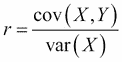
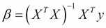

# 第五章 大数据

|   | *"更多即不同。"* |   |
| --- | --- | --- |
|   | --*Philip Warren Anderson* |

在前几章中，我们使用回归技术将模型拟合到数据中。例如，在第三章，*相关性*中，我们构建了一个线性模型，利用普通最小二乘法和正态方程，通过运动员的身高和对数体重拟合了一条直线。在第四章，*分类*中，我们使用 Incanter 的优化命名空间，最小化逻辑代价函数，并构建了一个泰坦尼克号乘客的分类器。在本章中，我们将以适合更大数据量的方式应用类似的分析。

我们将使用一个相对简单的数据集，只有 100,000 条记录。这不是大数据（数据大小为 100 MB，足以在一台机器的内存中舒适地存储），但它足够大，可以展示大规模数据处理的常用技术。本章将以 Hadoop（分布式计算的流行框架）为案例，重点讨论如何通过并行化将算法扩展到非常大的数据量。我们将介绍 Clojure 提供的两个与 Hadoop 一起使用的库——**Tesser**和**Parkour**。

然而，在深入讨论 Hadoop 和分布式数据处理之前，我们将首先看看一些相同的原则，这些原则使得 Hadoop 在大规模上有效，并且这些原则也可以应用于单机的数据处理，借助现代计算机的并行能力。

# 下载代码和数据

本章使用的数据来自美国国税局（IRS）按邮政编码划分的个人收入数据。数据包含按州、邮政编码和收入等级分类的收入和税务项目。

文件大小为 100 MB，可以从[`www.irs.gov/pub/irs-soi/12zpallagi.csv`](http://www.irs.gov/pub/irs-soi/12zpallagi.csv)下载到示例代码的数据目录中。由于该文件包含美国国税局的所得税统计（SoI），我们已将文件重命名为`soi.csv`以供示例使用。

### 注意

本章的示例代码可以从 Packt Publishing 的网站或[`github.com/clojuredatascience/ch5-big-data`](https://github.com/clojuredatascience/ch5-big-data)获取。

和往常一样，提供了一个脚本，可以为你下载并重命名数据。可以在项目目录内的命令行中运行：

```py
script/download-data.sh

```

如果你运行此操作，文件将自动下载并重命名。

## 检查数据

下载数据后，查看文件第一行的列标题。访问文件第一行的一种方法是将文件加载到内存中，按换行符分割，并取第一个结果。Clojure 核心库中的函数`slurp`将返回整个文件作为字符串：

```py
(defn ex-5-1 []
  (-> (slurp "data/soi.csv")
      (str/split #"\n")
      (first)))
```

该文件大约 100 MB 大小。当加载到内存并转换为对象表示时，数据在内存中将占用更多空间。当我们只对第一行感兴趣时，这样的做法尤其浪费。

幸运的是，如果我们利用 Clojure 的懒序列，我们不必将整个文件加载到内存中。我们可以返回文件的引用，然后逐行读取：

```py
(defn ex-5-2 []
  (-> (io/reader "data/soi.csv")
      (line-seq)
      (first)))
```

在前面的代码中，我们使用 `clojure.java.io/reader` 返回文件的引用。同时，我们使用 `clojure.core` 函数 `line-seq` 返回文件的懒序列。通过这种方式，我们可以读取比可用内存更大的文件。

上一个函数的结果如下：

```py
"STATEFIPS,STATE,zipcode,AGI_STUB,N1,MARS1,MARS2,MARS4,PREP,N2,NUMDEP,A00100,N00200,A00200,N00300,A00300,N00600,A00600,N00650,A00650,N00900,A00900,SCHF,N01000,A01000,N01400,A01400,N01700,A01700,N02300,A02300,N02500,A02500,N03300,A03300,N00101,A00101,N04470,A04470,N18425,A18425,N18450,A18450,N18500,A18500,N18300,A18300,N19300,A19300,N19700,A19700,N04800,A04800,N07100,A07100,N07220,A07220,N07180,A07180,N07260,A07260,N59660,A59660,N59720,A59720,N11070,A11070,N09600,A09600,N06500,A06500,N10300,A10300,N11901,A11901,N11902,A11902"
```

文件中有 77 个字段，因此我们不会全部列出。前四个字段是：

+   `STATEFIPS`：这是联邦信息处理系统（FIPS）代码。

+   `STATE`：这是州的两字母代码。

+   `zipcode`：这是 5 位数的邮政编码。

+   `AGI_STUB`：这是调整后总收入的一部分，按以下方式分箱：

    1.  $1 至 $25,000

    1.  $25,000 至 $50,000

    1.  $50,000 至 $75,000

    1.  $75,000 至 $100,000

    1.  $100,000 至 $200,000

    1.  $200,000 或更多

我们感兴趣的其他字段如下：

+   `N1`：提交的报税表数量

+   `MARS2`：提交的联合报税表数量

+   `NUMDEP`：受抚养人数量

+   `N00200`：包含薪水和工资的报税表数量

+   `N02300`：包含失业补偿的报税表数量

如果你感兴趣，可以在 [`www.irs.gov/pub/irs-soi/12zpdoc.doc`](http://www.irs.gov/pub/irs-soi/12zpdoc.doc) 查阅完整的列定义列表。

## 计数记录

我们的文件当然很宽，但它高吗？我们想要确定文件中的总行数。创建了懒序列后，这只是计算序列长度的问题：

```py
(defn ex-5-3 []
  (-> (io/reader "data/soi.csv")
      (line-seq)
      (count)))
```

上述示例返回 166,905 行，包括标题行，因此我们知道文件中实际上有 166,904 行。

`count` 函数是计算序列中元素数量的最简单方法。对于向量（以及实现计数接口的其他类型），这是最有效的方法，因为集合已经知道包含多少个元素，因此无需重新计算。然而，对于懒序列，唯一确定序列中包含多少元素的方法是从头到尾逐步遍历它。

Clojure 中的 `count` 实现是用 Java 编写的，但等效的 Clojure 版本是对序列进行 reduce 操作，如下所示：

```py
(defn ex-5-4 []
  (->> (io/reader "data/soi.csv")
       (line-seq)
       (reduce (fn [i x]
                 (inc i)) 0)))
```

我们传递给`reduce`的前一个函数接受一个计数器`i`和来自序列的下一个元素`x`。对于每个`x`，我们简单地增加计数器`i`。`reduce`函数接受一个初始值零，代表“无”的概念。如果没有要合并的行，则会返回零。

从版本 1.5 开始，Clojure 提供了`reducers`库（[`clojure.org/reducers`](http://clojure.org/reducers)），它提供了一种通过牺牲内存效率来换取速度的替代方式来执行合并操作。

# reducers 库

我们之前实现的`count`操作是一个顺序算法。每一行按顺序处理，直到序列耗尽。但是，这个操作并没有要求它必须按这种方式进行。

我们可以将行数分成两个序列（理想情况下长度大致相等），然后独立地对每个序列进行合并操作。当我们完成时，只需将每个序列的总行数相加，即可得到文件中的总行数：


如果每个**Reduce**在自己的处理单元上运行，那么这两个计数操作将会并行执行。其他条件相同的情况下，算法将运行得更快，是原来的两倍。这就是`clojure.core.reducers`库的目标之一——通过利用多核处理器，让算法能够在单台机器上实现并行化。

## 使用 Reducers 的并行折叠

由 reducers 库实现的`reduce`的并行版本称为**fold**。为了使用`fold`，我们必须提供一个合并函数，它将接收我们减少过的序列结果（部分行计数）并返回最终结果。由于我们的行计数是数字，所以合并函数就是`+`。

### 注意

Reducers 是 Clojure 标准库的一部分，无需作为外部依赖添加。

调整后的示例，使用`clojure.core.reducers`作为`r`，如下所示：

```py
(defn ex-5-5 []
  (->> (io/reader "data/soi.csv")
       (line-seq)
       (r/fold + (fn [i x]
                   (inc i)))))
```

合并函数`+`已作为第一个参数传递给`fold`，我们未更改的`reduce`函数则作为第二个参数传入。我们不再需要传递初始值零——`fold`会通过调用没有参数的合并函数来获取初始值。我们之前的示例之所以有效，是因为`+`在没有参数的情况下已经返回零：

```py
(defn ex-5-6 []
  (+))

;; 0
```

因此，要参与折叠，合并函数必须有两个实现：一个没有参数，返回标识值，另一个有两个参数，用于*合并*这两个参数。当然，不同的折叠操作将需要不同的合并函数和标识值。例如，乘法的标识值是`1`。

我们可以将用标识值初始化计算的过程，迭代地在`xs`序列上执行合并，并将所有合并结果作为一棵树的输出值：


当然，可能有超过两个的归约需要合并。`fold` 的默认实现会将输入集合拆分成 512 个元素的块。我们的 166,000 元素的序列因此会生成 325 次归约以供合并。由于树形表示图占用的空间较大，我们将很快用尽页面的可用空间，因此让我们改为以更简洁的方式来可视化这个过程——作为一个两步的归约和合并过程。

第一步在集合中的所有块上执行并行归约。第二步则对中间结果执行串行归约，以得到最终结果：


上述表示展示了如何对多个 `xs` 序列进行归约，这里以圆圈表示，最终输出以方块表示。这些方块将串行合并，以产生最终结果，用星形表示。

## 使用 iota 加载大文件

在懒序列上调用 `fold` 需要 Clojure 将序列加载到内存中，然后将序列分块以进行并行执行。对于每行计算较小的情况，协调开销会超过并行化带来的好处。我们可以通过使用一个名为 `iota` 的库来稍微改善这种情况 ([`github.com/thebusby/iota`](https://github.com/thebusby/iota))。

### 注意

`iota` 库通过使用内存映射文件将文件直接加载到适合使用 reducers 进行折叠的数据结构中，可以处理比可用内存更大的文件。

将 `iota` 代替我们的 `line-seq` 函数后，我们的行数统计变成了：

```py
(defn ex-5-7 []
  (->> (iota/seq "data/soi.csv")
       (r/fold + (fn [i x]
                   (inc i)))))
```

到目前为止，我们只处理了未格式化的行序列，但如果我们要做的不仅仅是计算行数，我们希望将其解析为更有用的数据结构。这是 Clojure 的 reducers 可以帮助我们提高代码效率的另一个领域。

## 创建一个 reducers 处理管道

我们已经知道文件是以逗号分隔的，因此让我们首先创建一个函数，将每行转换为一个字段向量。除了前两个字段，其他字段都包含数值数据，因此我们在此过程中将其解析为 double 类型：

```py
(defn parse-double [x]
  (Double/parseDouble x))

(defn parse-line [line]
  (let [[text-fields double-fields] (->> (str/split line #",")
                                         (split-at 2))]
    (concat text-fields
            (map parse-double double-fields))))
```

我们使用 `map` 的 reducers 版本，将我们的 `parse-line` 函数依次应用到文件中的每一行：

```py
(defn ex-5-8 []
   (->> (iota/seq "data/soi.csv")
        (r/drop 1)
        (r/map parse-line)
        (r/take 1)
        (into [])))

;; [("01" "AL" 0.0 1.0 889920.0 490850.0 ...)]
```

最终的 `into` 函数调用将 reducers 的内部表示（一个可归约的集合）转换为一个 Clojure 向量。上面的示例应该返回一个包含 77 个字段的序列，表示文件中第一行（头部后）的内容。

目前我们只是去掉了列名，但如果我们能利用这些列名返回每条记录的映射表示，将列名与字段值关联起来，那就太好了。映射的键将是列名，值将是解析后的字段。`clojure.core` 函数 `zipmap` 将从两个序列（一个用于键，一个用于值）创建一个映射：

```py
(defn parse-columns [line]
  (->> (str/split line #",")
       (map keyword)))

(defn ex-5-9 []
  (let [data (iota/seq "data/soi.csv")
        column-names (parse-columns (first data))]
    (->> (r/drop 1 data)
         (r/map parse-line)
         (r/map (fn [fields]
                  (zipmap column-names fields)))
         (r/take 1)
         (into []))))
```

此函数返回每行的映射表示，这是一种更加用户友好的数据结构：

```py
[{:N2 1505430.0, :A19300 181519.0, :MARS4 256900.0 ...}]
```

Clojure 的 reducers 的一个很棒的功能是，在上述计算中， `r/map`, `r/drop` 和 `r/take` 的调用被组合成一个减少，将在数据上进行单次遍历。随着操作数量的增加，这变得尤为重要。

假设我们想要过滤掉零邮政编码。我们可以扩展 reducer 管道如下：

```py
(defn ex-5-10 []
  (let [data (iota/seq "data/soi.csv")
        column-names (parse-columns (first data))]
    (->> (r/drop 1 data)
         (r/map parse-line)
         (r/map (fn [fields]
                  (zipmap column-names fields)))
         (r/remove (fn [record]
                     (zero? (:zipcode record))))
         (r/take 1)
         (into []))))
```

`r/remove` 步骤现在也与 `r/map`, `r/drop` 和 `r/take` 调用一起运行。随着数据量的增加，避免不必要地多次迭代数据变得越来越重要。使用 Clojure 的 reducers 确保我们的计算编译成单次遍历。

## 使用 reducers 的柯里化减少

为了使过程更加清晰，我们可以为之前的每个步骤创建一个 **柯里化** 版本。解析行，从字段创建记录并过滤掉零邮政编码。函数的柯里化版本是一个等待集合的减少：

```py
(def line-formatter
  (r/map parse-line))

(defn record-formatter [column-names]
  (r/map (fn [fields]
           (zipmap column-names fields))))

(def remove-zero-zip
  (r/remove (fn [record]
              (zero? (:zipcode record)))))
```

在每种情况下，我们调用 reducers 的函数之一，但没有提供集合。响应是函数的柯里化版本，稍后可以应用于集合。这些柯里化函数可以使用 `comp` 组合成单个 `parse-file` 函数：

```py
(defn load-data [file]
  (let [data (iota/seq file)
        col-names  (parse-columns (first data))
        parse-file (comp remove-zero-zip
                         (record-formatter col-names)
                         line-formatter)]
    (parse-file (rest data))))
```

只有当 `parse-file` 函数与序列一起调用时，管道才会实际执行。

## 使用 reducers 进行统计折叠

数据解析完成后，是时候进行一些描述性统计了。假设我们想知道 IRS 按邮政编码提交的平均*退回数量*（列 `N1`）。有一种方法可以做到这一点——这是本书中多次尝试过的方法——通过将值加起来并除以计数来实现。我们的第一次尝试可能如下所示：

```py
(defn ex-5-11 []
  (let [data (load-data "data/soi.csv")
        xs (into [] (r/map :N1 data))]
    (/ (reduce + xs)
       (count xs))))

;; 853.37
```

虽然这样做可以工作，但速度相对较慢。我们需要对数据进行三次迭代：一次创建 `xs`，一次计算总和，一次计算数量。数据集越大，我们支付的时间成本越大。理想情况下，我们希望能够在单次数据遍历中计算均值，就像我们之前的 `parse-file` 函数一样。如果能并行执行更好。

## 结合性质

在继续之前，花点时间反思以下代码为什么不能达到我们想要的效果：

```py
(defn mean
  ([] 0)
  ([x y] (/ (+ x y) 2)))
```

我们的 `mean` 函数是两个参数的函数。没有参数时，它返回零，是 `mean` 计算的单位元。有两个参数时，它返回它们的平均值：

```py
(defn ex-5-12 []
  (->> (load-data "data/soi.csv")
       (r/map :N1)
       (r/fold mean)))

;; 930.54
```

前面的示例对 `N1` 数据使用我们的 `mean` 函数进行了折叠，并产生了与之前不同的结果。如果我们能够扩展出前三个 `xs` 的计算，我们可能会看到类似以下代码的内容：

```py
(mean (mean (mean 0 a) b) c)
```

这是一个不好的主意，因为 `mean` 函数不是关联的。对于关联函数，以下条件成立：


加法是结合律的，但乘法和除法不是。所以`mean`函数也不是结合的。将`mean`函数与以下简单加法进行对比：

```py
(+ 1 (+ 2 3))

```

这与以下结果相同：

```py
(+ (+ 1 2) 3)

```

`+`的参数如何分区并不重要。结合性是用于对数据集进行归约的函数的一个重要特性，因为根据定义，先前计算的结果会作为下一个计算的输入。

将`mean`函数转化为结合函数的最简单方法是分别计算和与计数。由于和与计数是结合的，它们可以并行地计算数据。`mean`函数可以通过将两者相除来简单计算。

## 使用 fold 计算均值

我们将使用两个自定义函数`mean-combiner`和`mean-reducer`来创建一个 fold。这需要定义三个实体：

+   fold 的身份值

+   reduce 函数

+   combine 函数

我们在前一节中发现了结合律的好处，因此我们希望只使用结合操作来更新中间的`mean`，并分别计算和与计数。表示这两个值的一种方式是一个包含`：count`和`：sum`两个键的映射。表示零的值就是和为零，计数为零，或者如下所示的映射：`{:count 0 :sum 0}`。

combine 函数`mean-combiner`在没有参数时会提供初始值。两个参数的 combiner 需要将每个参数的`:count`和`:sum`相加。我们可以通过使用`+`来合并这些映射：

```py
(defn mean-combiner
  ([] {:count 0 :sum 0})
  ([a b] (merge-with + a b)))
```

`mean-reducer`函数需要接受一个累积值（无论是身份值还是先前计算结果），并将新的`x`纳入其中。我们只需通过递增`:count`并将`x`加到累积的`:sum`中来实现：

```py
(defn mean-reducer [acc x]
  (-> acc
      (update-in [:count] inc)
      (update-in [:sum] + x)))
```

前述两个函数已经足够完全定义我们的`mean` fold：

```py
(defn ex-5-13 []
  (->> (load-data "data/soi.csv")
       (r/map :N1)
       (r/fold mean-combiner
               mean-reducer)))

;; {:count 166598, :sum 1.4216975E8}
```

结果给出了我们计算`N1`均值所需的所有信息，而这个计算只需一次遍历数据。计算的最后一步可以通过以下`mean-post-combiner`函数来执行：

```py
(defn mean-post-combiner [{:keys [count sum]}]
  (if (zero? count) 0 (/ sum count)))

(defn ex-5-14 []
  (->> (load-data "data/soi.csv")
       (r/map :N1)
       (r/fold mean-combiner
               mean-reducer)
       (mean-post-combiner)))

;; 853.37
```

幸运的是，结果与我们之前计算的均值一致。

## 使用 fold 计算方差

接下来，我们希望计算`N1`值的方差。记住，方差是均值的平方差：


为了将其实现为 fold，我们可能会编写如下代码：

```py
(defn ex-5-15 []
   (let [data (->> (load-data "data/soi.csv")
                   (r/map :N1))
         mean-x (->> data
                     (r/fold mean-combiner
                             mean-reducer)
                     (mean-post-combine))
         sq-diff (fn [x] (i/pow (- x mean-x) 2))]
     (->> data
          (r/map sq-diff)
          (r/fold mean-combiner
                  mean-reducer)
          (mean-post-combine))))

;; 3144836.86
```

首先，我们使用刚才构建的 fold 计算该系列的`mean`值。然后，我们定义一个关于`x`和`sq-diff`的函数，计算`x`与`mean`值之间的平方差。我们将其映射到平方差上，并再次调用`mean` fold，最终得到方差结果。

因此，我们对数据进行了两次完整的遍历，首先计算均值，然后计算每个 `x` 与 `mean` 值的差异。看起来计算方差必然是一个顺序算法：似乎无法进一步减少步骤，只能通过单次遍历数据来计算方差。

事实上，方差计算可以用一个折叠表达。为此，我们需要追踪三项内容：计数、（当前）均值和平方差之和：

```py
(defn variance-combiner
  ([] {:count 0 :mean 0 :sum-of-squares 0})
  ([a b]
   (let [count (+ (:count a) (:count b))]
     {:count count
      :mean (/ (+ (* (:count a) (:mean a))
                  (* (:count b) (:mean b)))
               count)
      :sum-of-squares (+ (:sum-of-squares a)
                         (:sum-of-squares b)
                         (/ (* (- (:mean b)
                                  (:mean a))
                               (- (:mean b)
                                  (:mean a))
                               (:count a)
                               (:count b))
                            count))})))
```

我们的合并函数在前面的代码中展示。单位值是一个映射，所有三项的值都设为零。零元合并器返回这个值。

二元合并器需要合并两个传入值的计数、均值和平方和。合并计数很简单——我们只需要将它们相加。均值则稍微复杂一些：我们需要计算两个均值的加权平均。如果一个均值是基于较少的记录计算的，那么它在合并均值时应该占较少的份额：


合并平方和是最复杂的计算。合并平方和时，我们还需要添加一个因子，以考虑到 `a` 和 `b` 的平方和可能是基于不同的均值计算得出的：

```py
(defn variance-reducer [{:keys [count mean sum-of-squares]} x]
  (let [count' (inc count)
        mean'  (+ mean (/ (- x mean) count'))]
    {:count count'
     :mean mean'
     :sum-of-squares (+ sum-of-squares
                        (* (- x mean') (- x mean)))}))
```

缩减器要简单得多，并解释了方差折叠如何通过一次数据扫描计算方差。对于每个新记录，`mean` 值是根据之前的 `mean` 和当前的 `count` 重新计算的。然后，我们将平方和增加为均值前后差异的乘积，考虑到这条新记录。

最终结果是一个包含 `count`、`mean` 和总 `sum-of-squares` 的映射。由于方差只是 `sum-of-squares` 除以 `count`，因此我们的 `variance-post-combiner` 函数是相对简单的：

```py
(defn variance-post-combiner [{:keys [count mean sum-of-squares]}]
   (if (zero? count) 0 (/ sum-of-squares count)))
```

将这三个函数结合起来，得到如下结果：

```py
(defn ex-5-16 []
  (->> (load-data "data/soi.csv")
       (r/map :N1)
       (r/fold variance-combiner
               variance-reducer)
       (variance-post-combiner)))

;; 3144836.86
```

由于标准差只是方差的平方根，因此我们只需要稍微修改过的 `variance-post-combiner` 函数，也可以计算标准差。

# 使用 Tesser 进行数学折叠

我们现在应该理解如何使用折叠来计算简单算法的并行实现。希望我们也能理解找到高效解决方案所需的巧思，这样能够在数据上进行最少次数的迭代。

幸运的是，Clojure 库 Tesser ([`github.com/aphyr/tesser`](https://github.com/aphyr/tesser)) 包含了常见数学折叠的实现，包括均值、标准差和协方差。为了了解如何使用 Tesser，我们考虑一下 IRS 数据集中两个字段的协方差：工资和薪金 `A00200`，以及失业补偿 `A02300`。

## 使用 Tesser 计算协方差

我们在第三章，*相关性*中遇到了协方差，它是用来衡量两组数据如何一起变化的指标。公式如下所示：


`tesser.math`中包含了协方差 fold。在下面的代码中，我们将`tesser.math`作为`m`，`tesser.core`作为`t`来引用：

```py
(defn ex-5-17 []
  (let [data (into [] (load-data "data/soi.csv"))]
    (->> (m/covariance :A02300 :A00200)
         (t/tesser (t/chunk 512 data )))))

;; 3.496E7
```

`m/covariance`函数期望接收两个参数：一个返回`x`值的函数，另一个返回`y`值的函数。由于关键字作为提取相应值的函数，我们只需将关键字作为参数传递。

Tesser 的工作方式类似于 Clojure 的 reducers，但有一些小差异。Clojure 的`fold`负责将我们的数据分割为子序列进行并行执行。而在 Tesser 中，我们必须显式地将数据分成小块。由于这是我们将要反复做的事情，让我们创建一个名为`chunks`的辅助函数：

```py
(defn chunks [coll]
  (->> (into [] coll)
       (t/chunk 1024)))
```

在本章的大部分内容中，我们将使用`chunks`函数将输入数据拆分为`1024`条记录的小组。

## 交换律

Clojure 的 reducers 与 Tesser 的 folds 之间的另一个区别是，Tesser 不保证输入顺序会被保持。除了是结合律的，如我们之前讨论的，Tesser 的函数还必须满足交换律。交换律函数是指无论其参数的顺序如何变化，结果都相同的函数：


加法和乘法是交换律的，但减法和除法不是。交换律是分布式数据处理函数的一个有用属性，因为它减少了子任务之间协调的需求。当 Tesser 执行合并函数时，它可以在任何先返回结果的 reducer 函数上进行，而不需要等到第一个完成。

让我们将`load-data`函数改写为`prepare-data`函数，它将返回一个交换律的 Tesser fold。它执行与我们之前基于 reducer 的函数相同的步骤（解析文本文件中的一行，格式化记录为 map 并删除零 ZIP 代码），但它不再假设列头是文件中的第一行——*first*是一个明确要求有序数据的概念：

```py
(def column-names
  [:STATEFIPS :STATE :zipcode :AGI_STUB :N1 :MARS1 :MARS2 ...])

(defn prepare-data []
  (->> (t/remove #(.startsWith % "STATEFIPS"))
       (t/map parse-line)
       (t/map (partial format-record column-names))
       (t/remove  #(zero? (:zipcode %)))))
```

现在，所有的准备工作都已在 Tesser 中完成，我们可以直接将`iota/seq`的结果作为输入。这在本章后面我们将代码分布式运行在 Hadoop 时尤其有用：

```py
(defn ex-5-18 []
  (let [data (iota/seq "data/soi.csv")]
    (->> (prepare-data)
         (m/covariance :A02300 :A00200)
         (t/tesser (chunks data)))))

;; 3.496E7
```

在第三章，*相关性*中，我们看到在简单线性回归中，当只有一个特征和一个响应变量时，相关系数是协方差与标准差乘积的比值：


Tesser 还包括计算一对属性相关性的函数，作为一个 fold 来实现：

```py
(defn ex-5-19 []
  (let [data (iota/seq "data/soi.csv")]
    (->> (prepare-data)
         (m/correlation :A02300 :A00200)
         (t/tesser (chunks data)))))

;; 0.353
```

这两个变量之间存在适度的正相关。让我们构建一个线性模型，用工资和薪金（`A00200`）来预测失业补偿（`A02300`）的值。

## 使用 Tesser 进行简单线性回归

Tesser 当前没有提供线性回归的 fold，但它提供了我们实现线性回归所需的工具。在第三章*相关性*中，我们看到如何通过输入的方差、协方差和均值来计算简单线性回归模型的系数——斜率和截距：



斜率 *b* 是协方差除以 *X* 的方差。截距是确保回归线穿过两个序列均值的值。因此，理想情况下，我们能够在数据的单个 fold 中计算出这四个变量。Tesser 提供了两个 fold 组合器，`t/fuse` 和 `t/facet`，用于将更基本的 folds 组合成更复杂的 folds。

在我们有一个输入记录并且需要并行运行多个计算的情况下，我们应该使用 `t/fuse`。例如，在以下示例中，我们将均值和标准差的 fold 融合为一个单独的 fold，同时计算这两个值：

```py
(defn ex-5-20 []
  (let [data (iota/seq "data/soi.csv")]
    (->> (prepare-data)
         (t/map :A00200)
         (t/fuse {:A00200-mean (m/mean)
                  :A00200-sd   (m/standard-deviation)})
         (t/tesser (chunks data)))))

;; {:A00200-sd 89965.99846545042, :A00200-mean 37290.58880658831}
```

在这里，我们需要对映射中的所有字段进行相同的计算；因此，我们应该使用 `t/facet`：

```py
(defn ex-5-21 []
  (let [data (iota/seq "data/soi.csv")]
    (->> (prepare-data)
         (t/map #(select-keys % [:A00200 :A02300]))
         (t/facet)
         (m/mean)
         (t/tesser (chunks data)))))

;; {:A02300 419.67862159209596, :A00200 37290.58880658831}
```

在前面的代码中，我们只选择了记录中的两个值（`A00200` 和 `A02300`），并同时计算了它们的 `mean` 值。回到执行简单线性回归的挑战——我们有四个数值需要计算，因此我们将它们 `fuse`（结合）起来：

```py
(defn calculate-coefficients [{:keys [covariance variance-x
                                      mean-x mean-y]}]
  (let [slope     (/ covariance variance-x)
        intercept (- mean-y (* mean-x slope))]
    [intercept slope]))

(defn ex-5-22 []
  (let [data (iota/seq "data/soi.csv")
        fx :A00200
        fy :A02300]
    (->> (prepare-data)
         (t/fuse {:covariance (m/covariance fx fy)
                  :variance-x (m/variance (t/map fx))
                  :mean-x (m/mean (t/map fx))
                  :mean-y (m/mean (t/map fx))})
         (t/post-combine calculate-coefficients)
         (t/tesser (chunks data)))))

;; [37129.529236553506 0.0043190406799462925]
```

`fuse` 非常简洁地将我们想要执行的计算结合在一起。此外，它允许我们指定一个 `post-combine` 步骤，作为 fuse 的一部分。我们可以直接将其作为 fold 的一个整体来指定，而不是将结果交给另一个函数来完成输出。`post-combine` 步骤接收四个结果，并从中计算出斜率和截距，返回两个系数作为一个向量。

## 计算相关性矩阵

我们只比较了两个特征，看看它们之间的相关性，但 Tesser 使得查看多个目标特征之间的相互关联变得非常简单。我们将目标特征提供为一个映射，其中特征名称对应于输入记录中某个函数，这个函数返回所需的特征。例如，在第三章*相关性*中，我们本来会取身高的对数。在这里，我们将简单地提取每个特征，并为它们提供易于理解的名称：

```py
(defn ex-5-23 []
  (let [data (iota/seq "data/soi.csv")
        attributes {:unemployment-compensation :A02300
                    :salary-amount             :A00200
                    :gross-income              :AGI_STUB
                    :joint-submissions         :MARS2
                    :dependents                :NUMDEP}]
    (->> (prepare-data)
         (m/correlation-matrix attributes)
         (t/tesser (chunks data)))))
```

Tesser 将计算每对特征之间的相关性，并将结果以映射的形式返回。映射以包含每对特征名称的元组（两个元素的向量）为键，相关值为它们之间的相关性。

如果你现在运行前面的示例，你会发现某些变量之间有较高的相关性。例如，`:dependents`和`:unemployment-compensation`之间的相关性为`0.821`。让我们建立一个线性回归模型，将所有这些变量作为输入。

# 梯度下降的多元回归

当我们在第三章，*相关性*中运行多元线性回归时，我们使用了正规方程和矩阵来快速得出多元线性回归模型的系数。正规方程如下重复：



正规方程使用矩阵代数来非常快速且高效地得出最小二乘估计。当所有数据都能装入内存时，这是一个非常方便且简洁的方程。然而，当数据超出单台机器可用的内存时，计算变得笨重。原因在于矩阵求逆。计算并不是可以在数据上折叠一次完成的——输出矩阵中的每个单元格都依赖于输入矩阵中的许多其他单元格。这些复杂的关系要求矩阵必须以非顺序的方式处理。

解决线性回归问题以及许多其他相关机器学习问题的另一种方法是**梯度下降**技术。梯度下降将问题重新构造为一个迭代算法的解决方案——这个算法并不是在一个计算量极大的步骤中计算答案，而是通过一系列更小的步骤逐渐接近正确答案。

在上一章中，我们遇到了梯度下降，当时我们使用了 Incanter 的`minimize`函数来计算出使我们逻辑回归分类器成本最低的参数。随着数据量的增加，Incanter 不再是执行梯度下降的可行方案。在下一节中，我们将看到如何使用 Tesser 自行运行梯度下降。

## 梯度下降更新规则

梯度下降通过反复应用一个函数来工作，这个函数将参数朝着其最优值的方向移动。为了应用这个函数，我们需要知道当前参数下的成本函数的梯度。

计算梯度公式涉及微积分内容，超出了本书的范围。幸运的是，最终的公式并不难理解：


是我们代价函数*J(β)*相对于索引*j*的参数的偏导数或梯度。因此，我们可以看到，代价函数相对于索引*j*的参数的梯度等于我们预测值与真实值*y*之间的差乘以索引*j*的特征值*x*。

因为我们希望沿着梯度下降，所以我们希望从当前的参数值中减去梯度的某个比例。因此，在每一步梯度下降中，我们会执行以下更新：


这里，`:=`是赋值操作符，*α*是一个叫做**学习率**的因子。学习率控制我们希望在每次迭代中根据梯度对参数进行调整的大小。如果我们的预测*ŷ*几乎与实际值*y*相符，那么对参数的调整就不大。相反，较大的误差会导致对参数进行更大的调整。这个规则被称为**Widrow-Hoff 学习规则**或**Delta 规则**。

## 梯度下降学习率

正如我们所见，梯度下降是一个迭代算法。学习率，通常用*α*表示，决定了梯度下降收敛到最终答案的速度。如果学习率太小，收敛过程会非常缓慢。如果学习率过大，梯度下降就无法找到接近最优值的结果，甚至可能会从正确答案发散出去：


在前面的图表中，一个较小的学习率会导致算法在多次迭代中收敛得非常慢。虽然算法最终能够达到最小值，但它需要经过比理想情况更多的步骤，因此可能会花费相当长的时间。相反，在下图中，我们可以看到一个过大学习率的效果。参数估计在每次迭代之间变化如此剧烈，以至于它们实际上超出了最优值，并且从最小值开始发散：


梯度下降算法要求我们在数据集上反复迭代。在选择正确的α值后，每次迭代应该会逐步提供更接近理想参数的估计值。当迭代之间的变化非常小，或者达到了预定的迭代次数时，我们可以选择终止算法。

## 特征缩放

随着更多特征被添加到线性模型中，适当缩放特征变得非常重要。如果特征的尺度差异非常大，梯度下降的表现会很差，因为无法为所有特征选择一个合适的学习率。

我们可以执行的简单缩放是从每个值中减去均值并除以标准差。这将使得值趋于零均值，通常在`-3`和`3`之间波动：

```py
(defn feature-scales [features]
  (->> (prepare-data)
       (t/map #(select-keys % features))
       (t/facet)
       (t/fuse {:mean (m/mean)
                :sd   (m/standard-deviation)})))
```

上述代码中的`feature-factors`函数使用`t/facet`来计算所有输入特征的`mean`值和标准差：

```py
(defn ex-5-24 []
  (let [data (iota/seq "data/soi.csv")
        features [:A02300 :A00200 :AGI_STUB :NUMDEP :MARS2]]
    (->> (feature-scales features)
         (t/tesser (chunks data)))))

;; {:MARS2 {:sd 533.4496892658647, :mean 317.0412009748016}...}
```

如果你运行上述示例，你会看到`feature-scales`函数返回的不同均值和标准差。由于我们的特征缩放和输入记录表示为 maps，我们可以使用 Clojure 的`merge-with`函数一次性对所有特征进行缩放：

```py
(defn scale-features [factors]
  (let [f (fn [x {:keys [mean sd]}]
            (/ (- x mean) sd))]
    (fn [x]
      (merge-with f x factors))))
```

同样，我们可以使用`unscale-features`进行至关重要的反转操作：

```py
(defn unscale-features [factors]
  (let [f (fn [x {:keys [mean sd]}]
            (+ (* x sd) mean))]
    (fn [x]
      (merge-with f x factors))))
```

让我们对特征进行缩放并查看第一个特征。Tesser 不允许我们在没有 reducer 的情况下执行折叠操作，因此我们将暂时恢复使用 Clojure 的 reducers：

```py
(defn ex-5-25 []
  (let [data     (iota/seq "data/soi.csv")
        features [:A02300 :A00200 :AGI_STUB :NUMDEP :MARS2]
        factors (->> (feature-scales features)
                     (t/tesser (chunks data)))]
    (->> (load-data "data/soi.csv")
         (r/map #(select-keys % features ))
         (r/map (scale-features factors))
         (into [])
         (first))))

;; {:MARS2 -0.14837567114357617, :NUMDEP 0.30617757526890155,
;;  :AGI_STUB -0.714280814223704, :A00200 -0.5894942801950217,
;;  :A02300 0.031741856083514465}
```

这一步骤将帮助梯度下降在我们的数据上进行优化。

## 特征提取

尽管我们在本章中使用 maps 来表示输入数据，但在运行梯度下降时，将特征表示为矩阵会更加方便。让我们编写一个函数，将输入数据转换为一个包含`xs`和`y`的 map。`y`轴将是标量响应值，`xs`将是缩放后的特征值矩阵。

如前几章所示，我们将偏置项添加到返回的特征矩阵中：

```py
(defn feature-matrix [record features]
  (let [xs (map #(% record) features)]
    (i/matrix (cons 1 xs))))

(defn extract-features [fy features]
  (fn [record]
    {:y  (fy record)
     :xs (feature-matrix record features)}))
```

我们的`feature-matrix`函数仅接受一个记录输入和要转换为矩阵的特征。我们在`extract-features`中调用此函数，该函数返回一个可以应用于每个输入记录的函数：

```py
(defn ex-5-26 []
  (let [data     (iota/seq "data/soi.csv")
        features [:A02300 :A00200 :AGI_STUB :NUMDEP :MARS2]
        factors (->> (feature-scales features)
                     (t/tesser (chunks data)))]
    (->> (load-data "data/soi.csv")
         (r/map (scale-features factors))
         (r/map (extract-features :A02300 features))
         (into [])
         (first))))

;; {:y 433.0, :xs  A 5x1 matrix
;;  -------------
;;  1.00e+00
;; -5.89e-01
;; -7.14e-01
;;  3.06e-01
;; -1.48e-01
;; }
```

上述示例展示了数据被转换为适合进行梯度下降的格式：一个包含`y`响应变量的 map 和包含偏置项的值矩阵。

## 创建自定义 Tesser 折叠

梯度下降的每次迭代都会根据成本函数确定的值调整系数。成本函数是通过对数据集中每个参数的误差求和计算得出的，因此，拥有一个对矩阵元素进行逐项求和的折叠函数将非常有用。

而 Clojure 通过 reducer、combiner 以及从 combiner 获得的身份值来表示折叠，Tesser 的折叠则通过六个协作函数来表达。Tesser 的`m/mean`折叠的实现如下：

```py
{:reducer-identity  (constantly [0 0])
 :reducer           (fn reducer [[s c] x]
                     [(+ s x) (inc c)])
 :post-reducer      identity
 :combiner-identity (constantly [0 0])
 :combiner          (fn combiner [x y] (map + x y))
 :post-combiner     (fn post-combiner [x]
                      (double (/ (first x)
                                 (max 1 (last x)))))}
```

Tesser 选择将`reducer`身份与`combiner`函数分开表示，并且还包含另外三个函数：`combiner-identity`、`post-reducer`和`post-combiner`函数。Tesser 的`mean`折叠将一对数字（计数和累积和）表示为两个数字的向量，但在其他方面，它与我们自己的折叠类似。


我们已经看到如何使用`post-combiner`函数，与我们在本章前面提到的`mean-post-combiner`和`variance-post-combiner`函数配合使用。

### 创建一个矩阵求和折叠

要创建一个自定义的`matrix-sum`折叠，我们需要一个单位值。我们在第三章《相关性》中遇到过单位矩阵，但这是矩阵乘法的单位矩阵，而不是加法的单位矩阵。如果`+`的单位值是零（因为将零加到一个数字上不会改变它），那么矩阵加法的单位矩阵就是一个全零矩阵。

我们必须确保矩阵的大小与我们想要相加的矩阵相同。所以，让我们使用矩阵的行数和列数来参数化我们的`matrix-sum`折叠。我们无法提前知道需要多大，因为单位函数会在折叠中的任何操作之前被调用：

```py
(defn matrix-sum [nrows ncols]
  (let [zeros-matrix (i/matrix 0 nrows ncols)]
    {:reducer-identity (constantly zeros-matrix)
     :reducer i/plus
     :combiner-identity (constantly zeros-matrix)
     :combiner i/plus}))
```

上面的示例是完整的`matrix-sum`折叠定义。我们没有提供`post-combiner`和`post-reducer`函数；因为如果省略这些，默认它们是单位函数，这正是我们想要的。我们可以使用新的折叠来计算输入中所有特征的总和，如下所示：

```py
(defn ex-5-27 []
   (let [columns [:A02300 :A00200 :AGI_STUB :NUMDEP :MARS2]
         data    (iota/seq "data/soi.csv")]
     (->> (prepare-data)
          (t/map (extract-features :A02300 columns))
          (t/map :xs)
          (t/fold (matrix-sum (inc (count columns)) 1))
          (t/tesser (chunks data)))))

;; A 6x1 matrix
;; -------------
;; 1.67e+05
;; 6.99e+07
;; 6.21e+09
;; ...
;; 5.83e+05
;; 9.69e+07
;; 5.28e+07
```

计算矩阵的总和让我们更接近执行梯度下降的目标。让我们使用新的折叠计算总模型误差，前提是我们有一些初始系数。

## 计算总模型误差

让我们再看一看梯度下降的 delta 规则：


对于每个参数* j *，我们根据总体预测误差* ŷ - y *的某个比例来调整该参数，并乘以特征。因此，较大的特征比较小的特征承担更多的成本，并相应地调整更大的量。为了在代码中实现这一点，我们需要计算：


这是所有输入记录中特征与预测误差乘积的总和。正如我们之前所做的那样，我们的预测值* y *将使用以下公式为每个输入记录* x *计算：


系数*β*在所有输入记录中都是相同的，因此让我们创建一个`calculate-error`函数。给定转置的系数*β*^T，我们返回一个函数来计算！计算总模型误差。由于* x *是一个矩阵，* ŷ - y *是一个标量，结果将是一个矩阵：

```py
(defn calculate-error [coefs-t]
  (fn [{:keys [y xs]}]
    (let [y-hat (first (i/mmult coefs-t xs))
          error (- y-hat y)]
      (i/mult xs error))))
```

为了计算整个数据集的误差总和，我们可以简单地在`calculate-error`步骤后连接我们之前定义的`matrix-sum`函数：

```py
(defn ex-5-28 []
  (let [columns [:A02300 :A00200 :AGI_STUB :NUMDEP :MARS2]
        fcount  (inc (count columns))
        coefs   (vec (replicate fcount 0))
        data    (iota/seq "data/soi.csv")]
    (->> (prepare-data)
         (t/map (extract-features :A02300 columns))
         (t/map (calculate-error (i/trans coefs)))
         (t/fold (matrix-sum fcount 1))
         (t/tesser (chunks data)))))

;; A 6x1 matrix
;;  -------------
;; -6.99e+07
;; -2.30e+11
;; -8.43e+12
;;  ...
;; -1.59e+08
;; -2.37e+11
;; -8.10e+10
```

请注意，所有特征的梯度都是负的。这意味着，为了下降梯度并生成更好的模型系数估计，必须增加参数。

### 创建一个矩阵均值折叠

前面的代码中定义的更新规则实际上要求将代价的平均值分配给每一个特征。这意味着我们需要计算`sum`和`count`。我们不想对数据执行两次单独的遍历。因此，正如我们之前做的那样，我们将这两个折叠合并成一个：

```py
(defn ex-5-29 []
  (let [columns [:A02300 :A00200 :AGI_STUB :NUMDEP :MARS2]
        fcount  (inc (count columns))
        coefs   (vec (replicate fcount 0))
        data    (iota/seq "data/soi.csv")]
    (->> (prepare-data)
         (t/map (extract-features :A02300 columns))
         (t/map (calculate-error (i/trans coefs)))
         (t/fuse {:sum   (t/fold (matrix-sum fcount 1))
                  :count (t/count)})
         (t/post-combine (fn [{:keys [sum count]}]
                           (i/div sum count)))
         (t/tesser (chunks data)))))
```

`fuse`函数将返回`：sum`和`：count`的映射，因此我们将在结果上调用`post-combine`。`post-combine`函数指定了一个在折叠结束时运行的函数，该函数简单地将总和除以计数。

另外，我们可以创建另一个自定义折叠，返回一个矩阵序列的均值，而不是总和。它与之前定义的`matrix-sum`折叠有很多相似之处，但与我们在本章前面计算的`mean`折叠一样，我们还需要跟踪处理过的记录数：

```py
(defn matrix-mean [nrows ncols]
  (let [zeros-matrix (i/matrix 0 nrows ncols)]
    {:reducer-identity  (constantly [zeros-matrix 0])
     :reducer           (fn [[sum counter] x]
                          [(i/plus sum x) (inc counter)])
     :combiner-identity (constantly [zeros-matrix 0])
     :combiner          (fn [[sum-a count-a] [sum-b count-b]]
                          [(i/plus sum-a sum-b)
                           (+ count-a count-b)])
     :post-combiner     (fn [[sum count]]
                          (i/div sum count))}))
```

减少器的恒等式是一个包含`[zeros-matrix 0]`的向量。每次减少都会将值添加到矩阵总和中，并将计数器加一。每个合并步骤都会将两个矩阵以及它们的计数相加，以得出所有分区的总和和总计数。最后，在`post-combiner`步骤中，均值被计算为`sum`与`count`的比值。

尽管自定义折叠的代码比我们合并的`sum`和`count`解决方案要更长，但我们现在有了一种计算矩阵均值的一般方法。这使得示例更加简洁易读，而且我们可以像这样在误差计算代码中使用它：

```py
(defn ex-5-30 []
  (let [features [:A02300 :A00200 :AGI_STUB :NUMDEP :MARS2]
        fcount   (inc (count features))
        coefs    (vec (replicate fcount 0))
        data     (iota/seq "data/soi.csv")]
    (->> (prepare-data)
         (t/map (extract-features :A02300 features))
         (t/map (calculate-error (i/trans coefs)))
         (t/fold (matrix-mean fcount 1))
         (t/tesser (chunks data)))))

;;  A 5x1 matrix
;;  -------------
;;  4.20e+01
;;  3.89e+01
;;  -3.02e+01
;;  9.02e+01
;;  6.62e+01
```

创建自定义折叠的小额额外努力，使得调用代码的意图变得更容易理解。

## 应用梯度下降的单步

计算代价的目标是确定调整每个系数的幅度。一旦我们计算出平均代价，正如我们之前所做的那样，我们需要更新对系数*β*的估计。这些步骤合起来代表梯度下降的单次迭代：


我们可以在`post-combiner`步骤中返回更新后的系数，该步骤利用平均代价、alpha 的值和之前的系数。我们来创建一个实用函数`update-coefficients`，它将接收系数和 alpha，并返回一个函数，该函数将在给定总模型代价的情况下计算新的系数：

```py
(defn update-coefficients [coefs alpha]
  (fn [cost]
    (->> (i/mult cost alpha)
         (i/minus coefs))))
```

在前面的函数到位后，我们就有了将批量梯度下降更新规则打包的所有必要工具：

```py
(defn gradient-descent-fold [{:keys [fy features factors
                                     coefs alpha]}]
  (let [zeros-matrix (i/matrix 0 (count features) 1)]
    (->> (prepare-data)
         (t/map (scale-features factors))
         (t/map (extract-features fy features))
         (t/map (calculate-error (i/trans coefs)))
         (t/fold (matrix-mean (inc (count features)) 1))
         (t/post-combine (update-coefficients coefs alpha)))))

(defn ex-5-31 []
  (let [features [:A00200 :AGI_STUB :NUMDEP :MARS2]
        fcount   (inc (count features))
        coefs    (vec (replicate fcount 0))
        data     (chunks (iota/seq "data/soi.csv"))
        factors  (->> (feature-scales features)
                      (t/tesser data))
        options {:fy :A02300 :features features
                 :factors factors :coefs coefs :alpha 0.1}]
    (->> (gradient-descent-fold options)
         (t/tesser data))))

;; A 6x1 matrix
;; -------------
;; -4.20e+02
;; -1.38e+06
;; -5.06e+07
;; -9.53e+02
;; -1.42e+06
;; -4.86e+05
```

结果矩阵表示梯度下降第一次迭代后的系数值。

## 运行迭代梯度下降

梯度下降是一个迭代算法，通常需要运行多次才能收敛。对于一个大型数据集，这可能非常耗时。

为了节省时间，我们在数据目录中包含了一个名为`soi-sample.csv`的`soi.csv`随机样本。较小的文件大小使得我们能够在合理的时间尺度内运行迭代梯度下降。以下代码执行 100 次梯度下降迭代，并绘制每次迭代之间的参数值在`xy-plot`上的变化：

```py
(defn descend [options data]
  (fn [coefs]
    (->> (gradient-descent-fold (assoc options :coefs coefs))
         (t/tesser data))))

(defn ex-5-32 []
  (let [features [:A00200 :AGI_STUB :NUMDEP :MARS2]
        fcount   (inc (count features))
        coefs    (vec (replicate fcount 0))
        data     (chunks (iota/seq "data/soi-sample.csv"))
        factors  (->> (feature-scales features)
                      (t/tesser data))
        options  {:fy :A02300 :features features
                  :factors factors :coefs coefs :alpha 0.1}
        iterations 100
        xs (range iterations)
        ys (->> (iterate (descend options data) coefs)
                (take iterations))]
    (-> (c/xy-plot xs (map first ys)
                   :x-label "Iterations"
                   :y-label "Coefficient")
        (c/add-lines xs (map second ys))
        (c/add-lines xs (map #(nth % 2) ys))
        (c/add-lines xs (map #(nth % 3) ys))
        (c/add-lines xs (map #(nth % 4) ys))
        (i/view))))
```

如果你运行这个示例，你应该会看到一个类似于下图的图表：


在上面的图表中，你可以看到在 100 次迭代过程中，参数是如何趋向相对稳定的值的。

# 使用 Hadoop 扩展梯度下降

批量梯度下降每次迭代运行所需的时间由数据大小和计算机的处理器数量决定。尽管多个数据块是并行处理的，但数据集很大，且处理器是有限的。通过并行计算，我们已经实现了速度提升，但如果我们将数据集的大小翻倍，运行时间也会翻倍。

Hadoop 是过去十年中出现的多个系统之一，旨在并行化超出单台机器能力的工作。Hadoop 并不是将代码分发到多个处理器上执行，而是负责在多个服务器上运行计算。实际上，Hadoop 集群可以，也确实有很多，包含成千上万的服务器。

Hadoop 由两个主要子系统组成——**Hadoop 分布式文件系统**（**HDFS**）——和作业处理系统**MapReduce**。HDFS 将文件存储为块。一个文件可能由许多块组成，且这些块通常会在多个服务器之间进行复制。通过这种方式，Hadoop 能够存储任何单一服务器无法处理的庞大数据量，并且通过复制确保数据在硬件故障时能够可靠存储。正如其名所示，MapReduce 编程模型围绕 map 和 reduce 步骤构建。每个作业至少包含一个 map 步骤，并可以选择性地指定一个 reduce 步骤。一个完整的作业可能由多个 map 和 reduce 步骤串联而成。


在 reduce 步骤是可选的这一点上，Hadoop 相比 Tesser 在分布式计算方面有一个稍微更灵活的方法。在本章以及未来章节中，我们将进一步探讨 Hadoop 提供的更多功能。Tesser 确实使我们能够将折叠转换为 Hadoop 作业，接下来我们就来做这个。

## 使用 Tesser 和 Parkour 在 Hadoop 上运行梯度下降

Tesser 的 Hadoop 功能可以在`tesser.hadoop`命名空间中找到，我们将其包含为`h`。Hadoop 命名空间中的主要公共 API 函数是`h/fold`。

`fold` 函数期望接收至少四个参数，分别代表 Hadoop 作业的配置、我们想要处理的输入文件、Hadoop 用于存储临时文件的工作目录，以及我们希望执行的 `fold`，它被引用为 Clojure `var`。任何额外的参数将在执行时作为参数传递给 `fold`。

使用 `var` 来表示我们的 `fold` 的原因是，启动 `fold` 的函数调用可能发生在与实际执行它的计算机完全不同的计算机上。在分布式环境中，`var` 和参数必须完全指定函数的行为。我们通常不能依赖其他可变的局部状态（例如，一个原子变量的值，或闭包内的变量值）来提供任何额外的上下文。

### Parkour 分布式源和接收器

我们希望 Hadoop 作业处理的数据可能也存在于多台机器上，并且在 HDFS 上分块分布。Tesser 使用一个名为 **Parkour** 的库（[`github.com/damballa/parkour/`](https://github.com/damballa/parkour/)）来处理访问可能分布式的数据源。我们将在本章和下一章更详细地学习 Parkour，但目前，我们只会使用 `parkour.io.text` 命名空间来引用输入和输出文本文件。

虽然 Hadoop 设计为在多个服务器上运行和分布式执行，但它也可以在 *本地模式* 下运行。本地模式适用于测试，并使我们能够像操作 HDFS 一样与本地文件系统交互。我们将从 Parkour 中使用的另一个命名空间是 `parkour.conf`。这将允许我们创建一个默认的 Hadoop 配置，并在本地模式下运行它：

```py
(defn ex-5-33 []
  (->> (text/dseq "data/soi.csv")
       (r/take 2)
       (into [])))
```

在前面的示例中，我们使用 Parkour 的 `text/dseq` 函数创建了一个 IRS 输入数据的表示。返回值实现了 Clojure 的 reducers 协议，因此我们可以对结果使用 `r/take`。

### 使用 Hadoop 运行功能规模的 `fold`

Hadoop 在执行任务时需要一个位置来写入其临时文件，如果我们尝试覆盖现有目录，它会发出警告。由于在接下来的几个示例中我们将执行多个作业，让我们创建一个小的工具函数，返回一个带有随机生成名称的新文件。

```py
(defn rand-file [path]
  (io/file path (str (long (rand 0x100000000)))))

(defn ex-5-34 []
  (let [conf     (conf/ig)
        input    (text/dseq "data/soi.csv")
        workdir  (rand-file "tmp")
        features [:A00200 :AGI_STUB :NUMDEP :MARS2]]
    (h/fold conf input workdir #'feature-scales features)))
```

Parkour 提供了一个默认的 Hadoop 配置对象，使用简写（`conf/ig`）。它将返回一个空的配置。默认值已经足够，我们不需要提供任何自定义配置。

### 注意

我们的所有 Hadoop 作业将把临时文件写入项目 `tmp` 目录中的一个随机目录。如果你担心磁盘空间，可以稍后删除这个文件夹。

如果你现在运行前面的示例，你应该会得到类似以下的输出：

```py
;; {:MARS2 317.0412009748016, :NUMDEP 581.8504423822615,
;; :AGI_STUB 3.499939975269811, :A00200 37290.58880658831}
```

尽管返回值与我们之前获得的值相同，但我们现在在幕后使用 Hadoop 来处理我们的数据。尽管如此，注意 Tesser 将从我们的折叠操作返回一个单一的 Clojure 数据结构作为响应。

### 使用 Hadoop 运行梯度下降

由于`tesser.hadoop`折叠返回的 Clojure 数据结构与`tesser.core`折叠类似，定义一个利用我们缩放后的特征的梯度下降函数非常简单：

```py
(defn hadoop-gradient-descent [conf input-file workdir]
  (let [features [:A00200 :AGI_STUB :NUMDEP :MARS2]
        fcount  (inc (count features))
        coefs   (vec (replicate fcount 0))
        input   (text/dseq input-file)
        options {:column-names column-names
                 :features features
                 :coefs coefs
                 :fy :A02300
                 :alpha 1e-3}
        factors (h/fold conf input (rand-file workdir)
                        #'feature-scales
                        features)
        descend (fn [coefs]
                  (h/fold conf input (rand-file workdir)
                          #'gradient-descent-fold
                          (merge options {:coefs coefs
                                          :factors factors})))]
    (take 5 (iterate descend coefs))))
```

上述代码定义了一个`hadoop-gradient-descent`函数，该函数迭代执行`descend`函数`5`次。每次`descend`迭代都会基于`gradient-descent-fold`函数计算改进后的系数。最终返回值是梯度下降`5`次后的系数向量。

我们在以下示例中运行整个 IRS 数据的作业：

```py
(defn ex-5-35 []
  (let [workdir  "tmp"
        out-file (rand-file workdir)]
    (hadoop-gradient-descent (conf/ig) "data/soi.csv" workdir)))
```

在经过几次迭代后，你应该看到类似以下的输出：

```py
;; ([0 0 0 0 0]
;; (20.9839310796048 46.87214911003046 -7.363493937722712
;;  101.46736841329326 55.67860863427868)
;; (40.918665605227744 56.55169901254631 -13.771345753228694
;;  162.1908841131747 81.23969785586247)
;; (59.85666340457121 50.559130068258995 -19.463888245285332
;;  202.32407094149158 92.77424653758085)
;; (77.8477613139478 38.67088624825574 -24.585818946408523
;;  231.42399118694212 97.75201693843269))
```

我们已经看到如何使用本地的分布式技术计算梯度下降。现在，让我们看看如何在我们自己的集群上运行这个过程。

### 为 Hadoop 集群准备我们的代码

Hadoop 的 Java API 定义了`Tool`和相关的`ToolRunner`类，用于帮助在 Hadoop 集群上执行任务。`Tool`类是 Hadoop 为通用命令行应用程序定义的名称，它与 Hadoop 框架进行交互。通过创建我们自己的工具，我们就创建了一个可以提交到 Hadoop 集群的命令行应用程序。

由于这是一个 Java 框架，Hadoop 期望与我们代码的类表示进行交互。因此，定义我们工具的命名空间需要包含`:gen-class`声明，指示 Clojure 编译器从我们的命名空间创建一个类：

```py
(ns cljds.ch5.hadoop
  (:gen-class)
  ...)
```

默认情况下，`:gen-class`将期望命名空间定义一个名为`-main`的主函数。这将是 Hadoop 用我们的参数调用的函数，因此我们可以简单地将调用委托给一个实际执行我们任务的函数：

```py
(defn -main [& args]
  (tool/run hadoop-gradient-descent args))
```

Parkour 提供了一个 Clojure 接口，用于与 Hadoop 的许多类进行交互。在这种情况下，`parkour.tool/run`包含了我们在 Hadoop 上运行分布式梯度下降函数所需的一切。通过上述示例，我们需要指示 Clojure 编译器提前（AOT）编译我们的命名空间，并指定我们希望将项目的主类定义为哪个类。我们可以通过将`:aot`和`:main`声明添加到`project.clj`函数中来实现：

```py
{:main cljds.ch5.hadoop
 :aot [cljds.ch5.hadoop]}
```

在示例代码中，我们将这些设置为`：uberjar`配置的一部分，因为在将作业发送到集群之前，我们的最后一步是将其打包为 uberjar 文件。

### 构建 uberjar

JAR 文件包含可执行的 Java 代码。一个 uberjar 文件包含可执行的 Java 代码，以及运行所需的所有依赖项。uberjar 提供了一种方便的方式来打包代码，以便在分布式环境中运行，因为作业可以在机器之间传递，同时携带它的依赖项。虽然这会导致较大的作业负载，但它避免了确保所有集群中的机器预先安装特定作业依赖项的需要。要使用**Leiningen**创建 uberjar 文件，在项目目录下执行以下命令行：

```py
lein uberjar

```

完成此操作后，目标目录中将创建两个文件。一个文件`ch5-0.1.0.jar`包含项目的编译代码。这与使用`lein jar`生成的文件相同。此外，uberjar 会生成`ch5-0.1.0-standalone.jar`文件。这个文件包含了项目代码的 AOT 编译版本以及项目的依赖项。生成的文件虽然较大，但它包含了 Hadoop 作业运行所需的所有内容。

### 将 uberjar 提交到 Hadoop

一旦我们创建了一个 uberjar 文件，就可以将其提交给 Hadoop。拥有一个本地的 Hadoop 安装并不是跟随本章示例的前提条件，我们也不会在此描述安装步骤。

### 注意

Hadoop 安装指南的链接已提供在本书的 wiki 页面：[`wiki.clojuredatascience.com`](http://wiki.clojuredatascience.com)。

然而，如果你已经在本地模式下安装并配置了 Hadoop，现在就可以在命令行上运行示例作业。由于主类指定的工具也接受两个参数——工作目录和输入文件——因此这些参数也需要提供：

```py
hadoop jar target/ch5-0.1.0-standalone.jar data/soi.csv tmp

```

如果命令成功运行，你可能会看到 Hadoop 进程输出的日志信息。经过一段时间，你应该能看到作业输出的最终系数。

尽管目前执行需要更多时间，但我们的 Hadoop 作业有一个优势，那就是它可以分布在一个可以随着数据量不断扩展的集群上。

# 随机梯度下降

我们刚才看到的梯度下降计算方法通常被称为**批量梯度下降**，因为每次对系数的更新都是在对所有数据进行*单次批量*迭代的过程中完成的。对于大量数据来说，每次迭代可能会非常耗时，等待收敛可能需要很长时间。

梯度下降的另一种方法叫做**随机梯度下降**或**SGD**。在这种方法中，系数的估算会随着输入数据的处理不断更新。随机梯度下降的更新方法如下：


实际上，这与批量梯度下降是完全相同的。应用的不同之处纯粹在于表达式  是在 *小批次*——即数据的随机子集——上计算的。小批次的大小应该足够大，以便代表输入记录的公平样本——对于我们的数据，一个合理的小批次大小可能是 250。

随机梯度下降通过将整个数据集分成小批次并逐个处理它们来获得最佳估计。由于每个小批次的输出就是我们希望用于下一个小批次的系数（以便逐步改进估计），因此该算法本质上是顺序的。

随机梯度下降相较于批量梯度下降的优势在于，它可以在对数据集进行一次迭代后就获得良好的估计。对于非常大的数据集，甚至可能不需要处理所有小批次，就能达到良好的收敛效果。


我们可以通过利用组合器串行应用的事实，使用 Tesser 实现 SGD，并将每个块视为一个小批次，从中可以计算出系数。这意味着我们的归约步骤就是恒等函数——我们不需要进行任何归约操作。

相反，让我们利用这个机会来学习如何在 Parkour 中构建一个 Hadoop 作业。在深入了解 Parkour 之前，让我们先看看如何使用我们已经掌握的知识实现随机梯度下降：

```py
(defn stochastic-gradient-descent [options data]
  (let [batches (->> (into [] data)
                     (shuffle)
                     (partition 250))
        descend (fn [coefs batch]
                  (->> (gradient-descent-fold
                        (assoc options :coefs coefs))
                       (t/tesser (chunks batch))))]
    (reductions descend (:coefs options) batches)))
```

上述代码将输入集合分成较小的 250 元素组。对每个小批次运行梯度下降并更新系数。梯度下降的下一次迭代将在下一个批次上使用新的系数，并且对于适当的 alpha 值，生成改进的推荐结果。

以下代码将在数百个批次中绘制输出：

```py
(defn ex-5-36 []
  (let [features [:A00200 :AGI_STUB :NUMDEP :MARS2]
        fcount   (inc (count features))
        coefs    (vec (replicate fcount 0))
        data     (chunks (iota/seq "data/soi.csv"))
        factors  (->> (feature-scales features)
                      (t/tesser data))
        options  {:fy :A02300 :features features
                  :factors factors :coefs coefs :alpha 1e-3}
        ys       (stochastic-gradient-descent options data)
        xs       (range (count ys))]
    (-> (c/xy-plot xs (map first ys)
                   :x-label "Iterations"
                   :y-label "Coefficient")
        (c/add-lines xs (map #(nth % 1) ys))
        (c/add-lines xs (map #(nth % 2) ys))
        (c/add-lines xs (map #(nth % 3) ys))
        (c/add-lines xs (map #(nth % 4) ys))
        (i/view))))
```

我们提供的学习率比批量梯度下降的值小 100 倍。这有助于确保包含离群点的小批次不会使参数偏离其最优值。由于每个小批次固有的方差，随机梯度下降的输出将不会完全收敛到最优参数，而是会围绕最小值波动。


上面的图片展示了随机梯度下降更为随机的效果；特别是小批次之间方差对参数估计的影响。尽管学习率大大降低，我们仍能看到与包含离群点的数据批次相对应的尖峰。

## 使用 Parkour 的随机梯度下降

在本章的其余部分，我们将直接使用 Parkour 构建 Hadoop 作业。Parkour 比 Tesser 更加暴露 Hadoop 的底层能力，这既是优点也是缺点。尽管 Tesser 使得在 Hadoop 中编写 fold 操作并应用于大型数据集变得非常容易，但 Parkour 需要我们更多地理解 Hadoop 的计算模型。

尽管 Hadoop 的 MapReduce 方法体现了我们在本章中遇到的许多原则，但它与 Tesser 的抽象在几个关键方面有所不同：

+   Hadoop 假定待处理的数据是键/值对

+   Hadoop 不要求在 map 之后进行 reduce 阶段

+   Tesser 在整个输入序列上进行折叠，Hadoop 在各组数据上进行归约

+   Hadoop 的值组由分区器定义

+   Tesser 的 combine 阶段发生在 *reduce* 之后，Hadoop 的 combine 阶段发生在 *reduce* 之前

最后一项特别令人遗憾。我们为 Clojure reducer 和 Tesser 学到的术语，在 Hadoop 中被反转了：在 Hadoop 中，combiner 会在数据被发送到 reducer 之前聚合 mapper 的输出。

我们可以在以下图示中看到广泛的流程，其中 mapper 的输出被合并成中间表示并在发送到 reducers 之前进行排序。每个 reducer 对整个数据的子集进行归约。combine 步骤是可选的，事实上，在我们的随机梯度下降作业中我们不需要一个：


无论是否有 combine 步骤，数据都会在发送到 reducers 之前按组进行排序，分组策略由分区器定义。默认的分区方案是按键/值对的键进行分区（不同的键在前面的图示中由不同的灰度表示）。事实上，也可以使用任何自定义的分区方案。

如你所见，Parkour 和 Hadoop 都不假定输出是单一结果。由于 Hadoop 的 reduce 操作默认通过分组键定义的组进行，reduce 的结果可以是一个包含多个记录的数据集。在前面的图示中，我们为数据中的每个键展示了三个不同结果的情况。

### 定义 mapper

我们将定义的 Hadoop 作业的第一个组件是 **mapper**。mapper 的角色通常是接受一块输入记录并以某种方式转换它们。可以指定一个没有 reducer 的 Hadoop 作业；在这种情况下，mapper 的输出就是整个作业的输出。

Parkour 允许我们将映射器的操作定义为 Clojure 函数。该函数的唯一要求是，它需要将输入数据（无论是来自源文件，还是来自前一个 MapReduce 步骤的输出）作为最后一个参数传入。如果需要，还可以提供额外的参数，只要输入数据是最后一个参数：

```py
(defn parse-m
  {::mr/source-as :vals
   ::mr/sink-as   :vals}
  [fy features factors lines]
  (->> (skip-header lines)
       (r/map parse-line)
       (r/map (partial format-record column-names))
       (r/map (scale-features factors))
       (r/map (extract-features fy features))
       (into [])
       (shuffle)
       (partition 250)))
```

前面的例子中，`map` 函数中的 `parse-m`（按照惯例，Parkour 映射器的后缀是 `-m`）负责将输入的单行数据转换成特征表示。我们重新使用了本章前面定义的许多函数：`parse-line`、`format-record`、`scale-features` 和 `extract-features`。Parkour 将以可简化集合的形式向映射器函数提供输入数据，因此我们将函数通过 `r/map` 进行链式调用。

随机梯度下降需要按小批量处理数据，因此我们的映射器负责将数据划分为 250 行的小组。在调用 `partition` 之前，我们进行 `shuffle`，以确保数据的顺序是随机的。

### Parkour 造型函数

我们还向 `parse-m` 函数提供了元数据，形式为 `{::mr/source-as :vals ::mr/sink-as :vals}` 的映射。这两个命名空间关键字分别引用 `parkour.mapreduce/source-as` 和 `parkour.mapreduce/sink-as`，它们是指示 Parkour 在将数据提供给函数之前应该如何构造数据以及它可以期望返回的数据的结构。


Parkour 映射器的有效选项有 `:keyvals`、`:keys` 和 `:vals`。前面的图示展示了三个键/值对的短序列的效果。通过请求将数据源作为 `:vals`，我们得到一个仅包含键/值对中值部分的序列。

### 定义一个归约器

在 Parkour 中定义一个归约器与定义映射器相同。最后一个参数必须是输入（现在是来自先前映射步骤的输入），但可以提供额外的参数。我们的随机梯度下降的 Parkour 归约器如下所示：

```py
(defn sum-r
  {::mr/source-as :vals
   ::mr/sink-as   :vals}
  [fcount alpha batches]
  (let [initial-coefs (vec (replicate fcount 0))
        descend-batch (fn [coefs batch]
                        (->> (t/map (calculate-error
                                     (i/trans coefs)))
                             (t/fold (matrix-mean fcount 1))
                             (t/post-combine
                              (update-coefficients coefs alpha))
                             (t/tesser (chunks batch))))]
    (r/reduce descend-batch initial-coefs batches)))
```

我们的输入数据与之前一样作为可简化集合提供，因此我们使用 Clojure 的 reducers 库来进行迭代。我们使用 `r/reduce` 而不是 `r/fold`，因为我们不想对数据进行并行的归约处理。实际上，使用 Hadoop 的原因是我们可以独立控制映射阶段和归约阶段的并行度。现在，我们已经定义了映射和归约步骤，可以通过使用 `parkour.graph` 命名空间中的函数将它们组合成一个作业。

### 使用 Parkour 图定义 Hadoop 作业

`graph` 命名空间是 Parkour 用来定义 Hadoop 作业的主要 API。每个作业至少需要一个输入、一个映射器和一个输出，我们可以通过 Clojure 的 `->` 宏将这些规格链式连接。首先定义一个非常简单的作业，它从我们的映射器获取输出并立即写入磁盘：

```py
(defn hadoop-extract-features [conf workdir input output]
  (let [fy       :A02300
        features [:A00200 :AGI_STUB :NUMDEP :MARS2]
        fcount   (inc (count features))
        input   (text/dseq input)
        factors (h/fold conf input (rand-file workdir)
                        #'feature-scales
                        features)
        conf (conf/ig)]
    (-> (pg/input input)
        (pg/map #'parse-m fy features factors)
        (pg/output (text/dsink output))
        (pg/execute conf "extract-features-job"))))

(defn ex-5-37 []
  (let [workdir  "tmp"
        out-file (rand-file workdir)]
    (hadoop-extract-features (conf/ig) "tmp"
                             "data/soi.csv" out-file)
    (str out-file)))

;; "tmp/1935333306"
```

前面的示例返回的响应应该是项目 `tmp` 目录中的一个子目录，Hadoop 会将文件写入该目录。如果你进入该目录，你应该会看到几个文件。在我的电脑上，我看到了四个文件——`_SUCCESS`、`part-m-00000`、`part-m-00001` 和 `part-m-00002`。`_SUCCESS` 文件的存在表示我们的作业已成功完成。`part-m-xxxxx` 文件是输入文件的块。

文件数量为三，说明 Hadoop 创建了三个映射器来处理我们的输入数据。如果我们以分布式模式运行，可能会并行创建这些文件。如果你打开其中一个文件，你应该看到一长串 `clojure.lang.LazySeq@657d118e`。由于我们写入的是文本文件，所以这是我们映射器输出的文本表示。

### 使用 Parkour 图链式连接映射器和 reducers

我们真正想做的是将映射和减少步骤链式连接，使它们一个接一个地执行。为此，我们必须插入一个中间步骤，**分区器**，并告诉分区器如何序列化我们的 `clojure.lang.LazySeqs`。

后者可以通过借用 Tesser 来实现，Tesser 实现了使用 **Fressian** 对任意 Clojure 数据结构进行序列化和反序列化的功能。在下一章中，我们将更深入地了解 Parkour 如何提供支持，帮助我们为分区数据创建良定义的架构，但现在仅仅让分区器通过编码后的数据就足够了。

### 注意

Fressian 是一种可扩展的二进制数据格式。你可以通过 [`github.com/clojure/data.fressian`](https://github.com/clojure/data.fressian) 的文档了解更多信息。

我们的键将编码为 `FressianWritable`，而我们的键没有明确指定（我们像处理 `vals` 一样处理我们的映射数据）。Hadoop 对 `nil` 的表示是 `NullWritable` 类型。我们通过以下方式将两者导入到我们的命名空间中：

```py
(:import [org.apache.hadoop.io NullWritable]
         [tesser.hadoop_support FressianWritable])
```

在导入完成后，我们可以完全指定我们的作业：

```py
(defn hadoop-sgd [conf workdir input-file output]
  (let [kv-classes [NullWritable FressianWritable]
        fy       :A02300
        features [:A00200 :AGI_STUB :NUMDEP :MARS2]
        fcount   (inc (count features))
        input   (text/dseq input-file)
        factors (h/fold conf input (rand-file workdir)
                        #'feature-scales
                        features)
        conf (conf/assoc! conf "mapred.reduce.tasks" 1)]
    (-> (pg/input input)
        (pg/map #'parse-m fy features factors)
        (pg/partition kv-classes)
        (pg/reduce #'sum-r fcount 1e-8)
        (pg/output (text/dsink output))
        (pg/execute conf "sgd-job"))))
```

我们需要确保只有一个 reducer 来处理我们的迷你批次（尽管 SGD 有一些变种允许我们平均多个随机梯度下降的结果，但我们希望得到一组接近最优的系数）。我们将使用 Parkour 的 `conf` 命名空间，通过 `assoc! mapred.reduce.tasks` 设置为 `1`。

在映射和减少步骤之间，我们指定分区器并传递在函数顶部定义的 `kv-classes` 函数。最后的示例仅仅运行这个作业：

```py
(defn ex-5-38 []
  (let [workdir  "tmp"
        out-file (rand-file workdir)]
    (hadoop-sgd (conf/ig) "tmp" "data/soi.csv" out-file)
    (str out-file)))

;; "tmp/4046267961"
```

如果你进入作业返回的目录，你应该现在看到一个只包含两个文件的目录——`_SUCCESS` 和 `part-r-00000`。每个文件是一个 reducer 的输出，因此在只有一个 reducer 的情况下，我们最终得到了一个 `part-r-xxxxx` 文件。这个文件内部包含了使用随机梯度下降计算的线性模型系数。

# 总结

在本章中，我们学习了一些分布式数据处理的基本技术，并了解了本地用于数据处理的函数——映射（map）和归约（reduce），它们是处理即使是非常大量数据的强大方法。我们了解了 Hadoop 如何通过在数据的较小子集上运行函数，来扩展超越任何单一服务器的能力，这些子集的输出最终会组合起来生成结果。一旦你理解了其中的权衡，这种“分而治之”的数据处理方法，就是一种简单且非常通用的大规模数据分析方式。

我们看到了简单折叠操作在使用 Clojure 的 reducers 和 Tesser 时处理数据的强大功能和局限性。我们还开始探索 Parkour 如何暴露 Hadoop 更深层的能力。

在下一章，我们将看到如何使用 Hadoop 和 Parkour 来解决一个特定的机器学习挑战——对大量文本文档进行聚类。
