# 第六章 聚类

|   | *具有共同特质的事物总会很快地寻找到它们自己的同类。* |   |
| --- | --- | --- |
|   | --*马库斯·奥勒留* |

在前几章中，我们涵盖了多个学习算法：线性回归和逻辑回归，C4.5，朴素贝叶斯和随机森林。在每种情况下，我们需要通过提供特征和期望输出来训练算法。例如，在线性回归中，期望输出是奥运游泳选手的体重，而对于其他算法，我们提供了一个类别：乘客是否生还。这些是**监督学习算法**的示例：我们告诉算法期望的输出，它将尝试学习生成相似的模型。

还有一类学习算法称为**无监督学习**。无监督算法能够在没有参考答案集的情况下操作数据。我们甚至可能不知道数据内部的结构；算法将尝试自行确定这种结构。

聚类是无监督学习算法的一个例子。聚类分析的结果是输入数据的分组，这些数据在某种方式上更相似于彼此。该技术是通用的：任何具有概念上相似性或距离的实体都可以进行聚类。例如，我们可以通过共享粉丝的相似性来聚类社交媒体账户组，或者通过测量受访者问卷答案的相似性来聚类市场调研的结果。

聚类的一个常见应用是识别具有相似主题的文档。这为我们提供了一个理想的机会来讨论文本处理，本章将介绍一系列处理文本的特定技术。

# 下载数据

本章使用**Reuters-21578**数据集：这是一组在 1987 年通过路透社新闻线发布的文章。它是最广泛用于测试文本分类和分类的数据集之一。文章文本和 Reuters-21578 集合中的注释版权归 Reuters Ltd.所有。Reuters Ltd.和 Carnegie Group, Inc.已同意仅为研究目的免费分发这些数据。

### 注意

您可以从 Packt Publishing 的网站或[`github.com/clojuredatascience/ch6-clustering`](https://github.com/clojuredatascience/ch6-clustering)下载本章的示例代码。

如往常一样，在示例代码中有一个脚本用于下载并解压文件到数据目录。您可以在项目目录中使用以下命令运行它：

```py
script/download-data.sh

```

另外，在写作时，Reuters 数据集可以从[`kdd.ics.uci.edu/databases/reuters21578/reuters21578.tar.gz`](http://kdd.ics.uci.edu/databases/reuters21578/reuters21578.tar.gz)下载。本章的其余部分将假设文件已被下载并安装到项目的`data`目录中。

# 提取数据

运行前面的脚本后，文章将被解压到目录`data/reuters-sgml`中。每个`.sgm`文件包含大约 1,000 篇短文章，这些文章使用标准通用标记语言（SGML）被包装在 XML 样式的标签中。我们不需要自己编写解析器，而是可以利用已经在 Lucene 文本索引器中写好的解析器。

```py
(:import [org.apache.lucene.benchmark.utils ExtractReuters])

(defn sgml->txt [in-path out-path]
  (let [in-file  (clojure.java.io/file in-path)
        out-file (clojure.java.io/file out-path)]
    (.extract (ExtractReuters. in-file out-file))))
```

在这里，我们利用 Clojure 的 Java 互操作性，简单地调用 Lucene 的`ExtractReuters`类中的提取方法。每篇文章都被提取为一个独立的文本文件。

可以通过执行以下代码运行：

```py
lein extract-reuters

```

在项目目录内的命令行中运行。输出将是一个新目录`data/reuters-text`，其中包含超过 20,000 个独立的文本文件。每个文件包含一篇单独的路透社新闻文章。

如果磁盘空间不足，现在可以删除`reuters-sgml`和`reuters21578.tar.gz`文件：`reuters-text`目录中的内容是本章中我们唯一会使用的文件。现在让我们看看其中的几个文件。

# 检查数据

1987 年是“黑色星期一”那一年。10 月 19 日，全球股市暴跌，道琼斯工业平均指数下降了 508 点，降至 1738.74。像`reut2-020.sgm-962.txt`中包含的文章描述了这一事件：

```py
19-OCT-1987 16:14:37.57

WALL STREET SUFFERS WORST EVER SELLOFF

Wall Street tumbled to its worst point loss ever and the worst percentage decline since the First World War as a frenzy of stock selling stunned even the most bearish market participants. "Everyone is in awe and the word 'crash' is on everyone's mind," one trader said.     The Dow Jones industrial average fell 508 points to 1738, a level it has not been at since the Autumn of 1986\.     Volume soared to 603 mln shares, almost doubling the previous record of 338 mln traded just last Friday. Reuter &#3;
```

这篇文章的结构代表了语料库中大多数文章的结构。第一行是时间戳，表示文章的发布时间，后面是一个空行。文章有一个标题，通常——但并非总是——是大写字母，然后是另一个空行。最后是文章正文文本。与处理此类半结构化文本时常见的情况一样，文章中存在多个空格、奇怪的字符和缩写。

其他文章只是标题，例如在`reut2-020.sgm-761.txt`中：

```py
20-OCT-1987 17:09:34.49
REAGAN SAYS HE SEES NO RECESSION
```

这些文件是我们将进行聚类分析的对象。

# 聚类文本

聚类是找到彼此相似的对象组的过程。目标是，簇内的对象应该比簇外的对象更加相似。与分类一样，聚类并不是一个特定的算法，而是解决一般问题的算法类别。

尽管有多种聚类算法，但它们都在某种程度上依赖于距离度量。为了让算法判断两个对象是否属于同一簇或不同簇，它必须能够确定它们之间的距离（或者，如果你愿意，可以认为是相似度）的定量度量。这就需要一个数字化的距离度量：距离越小，两个对象之间的相似度就越大。

由于聚类是一种可以应用于多种数据类型的通用技术，因此有大量可能的距离度量方法。尽管如此，大多数数据都可以通过一些常见的抽象表示：集合、空间中的点或向量。对于这些，每种情况都有一种常用的度量方法。

## 单词集合与 Jaccard 指数

如果你的数据可以表示为事物的集合，则可以使用 Jaccard 指数，也称为**Jaccard 相似度**。它在概念上是最简单的度量之一：它是集合交集除以集合并集，或者是集合中共同元素的数量占总独特元素数量的比例：

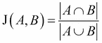

许多事物可以表示为集合。社交网络上的账户可以表示为朋友或关注者的集合，顾客可以表示为购买或查看过的商品集合。对于我们的文本文件，集合表示可以简单地是使用的唯一单词的集合。


Jaccard 指数在 Clojure 中非常简单计算：

```py
(:require [clojure.set :as set])

(defn jaccard-similarity [a b]
  (let [a (set a)
        b (set b)]
    (/ (count (set/intersection a b))
       (count (set/union a b)))))

(defn ex-6-1 []
  (let [a [1 2 3]
        b [2 3 4]]
    (jaccard a b)))

;; => 1/2
```

它的优点是，即使集合的基数不同，距离度量依然有意义。在前面的图示中，**A**“比”**B**要“大”，但交集除以并集仍然能公平地反映它们的相似度。要将 Jaccard 指数应用于文本文件，我们需要将它们转化为单词集合。这就是**词元化**的过程。

## 词元化 Reuters 文件

词元化是将一串文本拆分成更小的单元以便进行分析的技术名称。常见的方法是将文本字符串拆分成单个单词。一个明显的分隔符是空格，因此 `"tokens like these"` 会变成 `["tokens" "like" "these"]`。

```py
(defn tokenize [s]
  (str/split s #"\W+"))
```

这既方便又简单，但不幸的是，语言是微妙的，很少有简单的规则可以普遍适用。例如，我们的词元化器将撇号视为空格：

```py
(tokenize "doesn't handle apostrophes")
;; ["doesn" "t" "handle" "apostrophes"]
```

连字符也被视为空格：

```py
(tokenize "good-looking user-generated content")
;; ["good" "looking" "user" "generated" "content"]
```

而删除它们则会改变句子的含义。然而，并非所有的连字符都应该被保留：

```py
(tokenize "New York-based")
;; ["New" "York" "based"]
```

`"New"`、`"York"` 和 `"based"` 正确地表示了短语的主体，但最好将 `"New York"` 归为一个词，因为它代表了一个特定的名称，应该完整保留。另一方面，`York-based` 单独作为词元没有意义。

简而言之，文本是杂乱的，从自由文本中可靠地解析出意义是一个极其丰富和活跃的研究领域。特别是，对于从文本中提取名称（例如，“纽约”），我们需要考虑术语使用的上下文。通过其语法功能标注句子中词汇的技术被称为**词性标注器**。

### 注意

如需了解更多关于高级分词和词性标注的信息，请参见`clojure-opennlp`库：[`github.com/dakrone/clojure-opennlp`](https://github.com/dakrone/clojure-opennlp)。

在本章中，我们有足够多的文档可以使用，因此我们将继续使用我们的简单分词器。我们会发现，尽管它存在一些缺点，它仍然能够足够好地从文档中提取意义。

让我们编写一个函数，根据文档的文件名返回文档的标记：

```py
(defn tokenize-reuters [content]
  (-> (str/replace content  #"^.*\n\n" "")
      (str/lower-case)
      (tokenize)))

(defn reuters-terms [file]
  (-> (io/resource file)
      (slurp)
      (tokenize-reuters)))
```

我们正在去除文件顶部的时间戳，并在分词之前将文本转换为小写。在下一部分，我们将看到如何衡量分词后的文档相似性。

### 应用 Jaccard 指数到文档上

在对输入文档进行分词之后，我们可以将结果的标记序列简单地传递给我们之前定义的`jaccard-similarity`函数。让我们比较一下来自路透社语料库的几篇文档相似性：

```py
(defn ex-6-2 []
  (let [a (set (reuters-terms "reut2-020.sgm-761.txt"))
        b (set (reuters-terms "reut2-007.sgm-750.txt"))
        s (jaccard a b)]
    (println "A:" a)
    (println "B:" b)
    (println "Similarity:" s)))

A: #{recession says reagan sees no he}
B: #{bill transit says highway reagan and will veto he}
Similarity: 1/4
```

Jaccard 指数输出一个介于零和一之间的数字，因此它认为这两篇文档在标题中的词汇相似度为 25%。注意我们丢失了标题中词汇的顺序。没有我们稍后会讲到的其他技巧，Jaccard 指数只关注两个集合中共同的项目。我们丢失的另一个方面是一个词在文档中出现的次数。重复出现同一个词的文档，可能会在某种意义上视该词为更重要。例如，`reut2-020.sgm-932.txt`的标题如下：

```py
19-OCT-1987 16:41:40.58
NYSE CHAIRMAN JOHN PHELAN SAYS NYSE WILL OPEN TOMORROW ON TIME
```

NYSE 在标题中出现了两次。我们可以推测这个标题特别关注纽约证券交易所，可能比只提到一次 NYSE 的标题更为重要。

### 词袋模型和欧几里得距离

一种可能优于词集方法的改进是**词袋模型方法**。这种方法保留了文档中各个词汇的词频。通过距离度量可以将词频纳入考虑，从而可能得到更准确的结果。

最常见的距离概念之一是欧几里得距离度量。在几何学中，欧几里得度量是我们计算空间中两点之间距离的方式。在二维空间中，欧几里得距离由**毕达哥拉斯公式**给出：

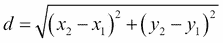

这表示两个点之间的差异是它们之间直线距离的长度。

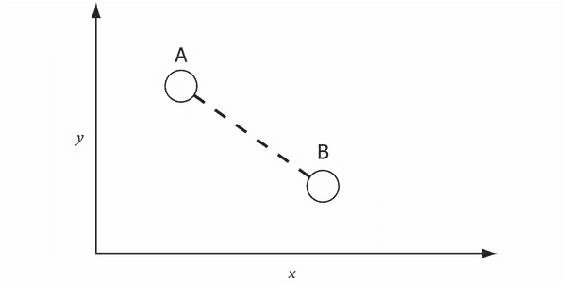

这可以扩展到三维：

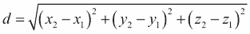

并且推广到 *n* 维度：

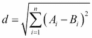

其中 *A*[i] 和 *B*[i] 是在维度 *i* 上 *A* 或 *B* 的值。因此，距离度量就是两个文档之间的整体相似性，考虑了每个单词出现的频率。

```py
(defn euclidean-distance [a b]
  (->> (map (comp i/sq -) a b)
       (apply +)
       (i/sqrt)))
```

由于每个单词现在代表空间中的一个维度，我们需要确保在计算欧几里得距离时，我们是在比较每个文档中同一维度上的大小。否则，我们可能会字面意义上比较“苹果”和“橙子”。

## 将文本表示为向量

与 Jaccard 指数不同，欧几里得距离依赖于将单词一致地排序为各个维度。词频（term frequency）表示文档在一个大型多维空间中的位置，我们需要确保在比较值时，比较的是正确维度中的值。我们将文档表示为术语**频率向量**。

想象一下，文档中可能出现的所有单词都被赋予一个唯一的编号。例如，单词“apple”可以被赋值为 53，单词“orange”可以被赋值为 21,597。如果所有数字都是唯一的，它们可以对应于单词在术语向量中出现的索引。

这些向量的维度可能非常大。最大维度数是向量的基数。对应于单词的索引位置的元素值通常是该单词在文档中出现的次数。这被称为**术语频率**（**tf**）加权。

为了能够比较文本向量，重要的是相同的单词始终出现在向量中的相同索引位置。这意味着我们必须为每个创建的向量使用相同的单词/索引映射。这个单词/索引映射就是我们的词典。

## 创建词典

为了创建一个有效的词典，我们需要确保两个单词的索引不会冲突。做到这一点的一种方法是使用一个单调递增的计数器，每添加一个单词到词典中，计数器就增加一次。单词被添加时的计数值将成为该单词的索引。为了线程安全地同时将单词添加到词典并递增计数器，我们可以使用原子操作：

```py
(def dictionary
  (atom {:count 0
         :words {}}))

(defn add-term-to-dict [dict word]
  (if (contains? (:terms dict) word)
    dict
    (-> dict
        (update-in [:terms] assoc word (get dict :count))
        (update-in [:count] inc))))

(defn add-term-to-dict! [dict term]
  (doto dict
    (swap! add-term-to-dict term)))
```

为了对原子进行更新，我们必须在`swap!`函数中执行我们的代码。

```py
(add-term-to-dict! dictionary "love")

;; #<Atom@261d1f0a: {:count 1, :terms {"love" 0}}>
```

添加另一个单词将导致计数增加：

```py
(add-term-to-dict! dictionary "music")

;; #<Atom@261d1f0a: {:count 2, :terms {"music" 1, "love" 0}}>
```

并且重复添加相同单词不会产生任何效果：

```py
(add-term-to-dict! dictionary "love")

;; #<Atom@261d1f0a: {:count 2, :terms {"music" 1, "love" 0}}>
```

在原子操作中执行此更新可以确保即使在多个线程同时更新词典时，每个单词也能获得自己的索引。

```py
(defn build-dictionary! [dict terms]
  (reduce add-term-to-dict! dict terms))
```

构建整个词典就像在提供的词典原子上使用`add-term-to-dict!`函数并对一组术语进行简化操作一样简单。

# 创建术语频率向量

为了计算欧几里得距离，首先让我们从字典和文档中创建一个向量。这将使我们能够轻松地比较文档之间的术语频率，因为它们将占据向量的相同索引。

```py
(defn term-id [dict term]
  (get-in @dict [:terms term]))

(defn term-frequencies [dict terms]
  (->> (map #(term-id dict %) terms)
       (remove nil?)
       (frequencies)))

(defn map->vector [dictionary id-counts]
  (let [zeros (vec (replicate (:count @dictionary) 0))]
    (-> (reduce #(apply assoc! %1 %2) (transient zeros) id-counts)
        (persistent!))))

(defn tf-vector [dict document]
  (map->vector dict (term-frequencies dict document)))
```

`term-frequencies` 函数为文档中的每个术语创建一个术语 ID 到频率计数的映射。`map->vector` 函数简单地接受此映射，并在由术语 ID 给出的向量索引位置关联频率计数。由于可能有许多术语，且向量可能非常长，因此我们使用 Clojure 的 `transient!` 和 `persistent!` 函数暂时创建一个可变向量以提高效率。

让我们打印 `reut2-020.sgm-742.txt` 的文档、字典和生成的向量：

```py
(defn ex-6-3 []
  (let [doc  (reuters-terms "reut2-020.sgm-742.txt")
        dict (build-dictionary! dictionary doc)]
    (println "Document:" doc)
    (println "Dictionary:" dict)
    (println "Vector:" (tf-vector dict doc))))
```

输出结果如下所示（格式已调整以提高可读性）：

```py
;; Document: [nyse s phelan says nyse will continue program
;;            trading curb until volume slows]
;; Dictionary: #<Atom@bb156ec: {:count 12, :terms {s 1, curb 8,
;;             phelan 2, says 3, trading 7, nyse 0, until 9,
;;             continue 5, volume 10, will 4, slows 11,
;;             program 6}}>
;; Vector: [2 1 1 1 1 1 1 1 1 1 1 1]
```

输入中有 12 个术语，字典中有 12 个术语，并返回了一个包含 12 个元素的向量。

```py
(defn print-distance [doc-a doc-b measure]
  (let [a-terms (reuters-terms doc-a)
        b-terms (reuters-terms doc-b)
        dict (-> dictionary
                 (build-dictionary! a-terms)
                 (build-dictionary! b-terms))
        a (tf-vector dict a-terms)
        b (tf-vector dict b-terms)]
    (println "A:" a)
    (println "B:" b)
    (println "Distance:" (measure a b))))

(defn ex-6-4 []
  (print-distance "reut2-020.sgm-742.txt"
                  "reut2-020.sgm-932.txt"
                  euclidean-distance))

;; A: [2 1 1 1 1 1 1 1 1 1 1 1 0 0 0 0 0 0]
;; B: [2 0 1 1 1 0 0 0 0 0 0 0 1 1 1 1 1 1]
;; Distance: 3.7416573867739413
```

与 Jaccard 指数类似，欧几里得距离不能低于零。然而，不同于 Jaccard 指数，欧几里得距离的值可以无限增长。

## 向量空间模型与余弦距离

向量空间模型可以视为词集（set-of-words）和词袋（bag-of-words）模型的推广。与词袋模型类似，向量空间模型将每个文档表示为一个向量，每个元素表示一个术语。每个索引位置的值是该词的重要性度量，可能是也可能不是术语频率。

如果你的数据从概念上表示一个向量（也就是说，一个特定方向上的大小），那么余弦距离可能是最合适的选择。余弦距离度量通过计算两个元素的向量表示之间夹角的余弦值来确定它们的相似度。

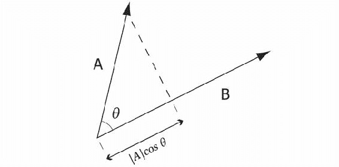

如果两个向量指向相同的方向，那么它们之间的夹角为零，而零的余弦值为 1。余弦相似度可以通过以下方式定义：

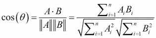

这是一个比我们之前讨论的方程更为复杂的方程。它依赖于计算两个向量的点积及其大小。

```py
(defn cosine-similarity [a b]
  (let [dot-product (->> (map * a b)
                         (apply +))
        magnitude (fn [d]
                    (->> (map i/sq d)
                         (apply +)
                         (i/sqrt)))]
    (/ dot-product (* (magnitude a) (magnitude b)))))
```

余弦相似度的例子如下所示：

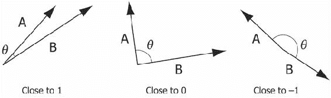

余弦相似度通常作为高维空间中的相似度度量使用，其中每个向量包含很多零，因为它计算起来非常高效：只需要考虑非零维度。由于大多数文本文档只使用了所有单词中的一小部分（因此在大多数维度上是零），余弦度量通常用于文本聚类。

在向量空间模型中，我们需要一个一致的策略来衡量每个词项的重要性。在词集合模型中，所有词项被平等对待。这相当于将该点的向量值设置为 1。在词袋模型中，计算了词项的频率。我们目前将继续使用词频，但很快我们将看到如何使用一种更复杂的重要性度量，称为**词频-逆文档频率**（**TF-IDF**）。

```py
(defn ex-6-5 []
  (print-distance "reut2-020.sgm-742.txt"
                  "reut2-020.sgm-932.txt"
                  cosine-similarity))

;; A: [2 1 1 1 1 1 1 1 1 1 1 1 0 0 0 0 0 0]
;; B: [2 0 1 1 1 0 0 0 0 0 0 0 1 1 1 1 1 1]
;; Distance: 0.5012804118276031
```

余弦值越接近`1`，这两个实体越相似。为了将`余弦相似度`转化为距离度量，我们可以简单地将`余弦相似度`从`1`中减去。

尽管前面提到的所有度量方法对相同输入产生不同的度量值，但它们都满足一个约束，即* A *和* B *之间的距离应该与* B *和* A *之间的差异相同。通常，相同的底层数据可以被转换为表示集合（Jaccard）、空间中的一个点（欧几里得）或一个向量（余弦）。有时，唯一的方法是尝试并查看结果如何，才能知道哪个是正确的。

出现在一个文档中的唯一单词数量通常比处理中的文档集合中任何文档中出现的唯一单词数量要少。因此，这些高维文档向量通常是非常稀疏的。

## 去除停用词

许多头条新闻之间的相似性是由一些经常出现的词汇所产生的，这些词汇对内容的意义贡献不大。例如，“a”，“says”和“and”。我们应该过滤掉这些词，以避免产生虚假的相似性。

考虑以下两个习语：

+   `"音乐是爱的食粮"`

+   `"战争是历史的动力"`

我们可以使用以下 Clojure 代码来计算它们之间的余弦相似度：

```py
(defn ex-6-6 []
  (let [a (tokenize "music is the food of love")
        b (tokenize "war is the locomotive of history")]
    (add-documents-to-dictionary! dictionary [a b])
    (cosine-similarity (tf-vector dictionary a)
                       (tf-vector dictionary b))))

;; 0.5
```

尽管这两个文档之间唯一的共同单词是`is`、`the`和`of`，它们的相似度为`0.5`。理想情况下，我们希望移除这些词。

## 词干提取

现在让我们考虑一个替代表达：

+   `"音乐是爱的食粮"`

+   `"你很有音乐天赋，真好"`

让我们也来比较它们的余弦相似度：

```py
(defn ex-6-7 []
  (let [a (tokenize "music is the food of love")
        b (tokenize "it's lovely that you're musical")]
    (add-documents-to-dictionary! dictionary [a b])
    (cosine-similarity (tf-vector dictionary a)
                       (tf-vector dictionary b))))

;; 0.0
```

尽管这两个句子都提到音乐和积极情感，但这两个短语的余弦相似度为零：两个短语之间没有共同的单词。这是有道理的，但并没有表达我们通常想要的行为，即捕捉“概念”之间的相似性，而不是精确使用的词汇。

解决这个问题的一种方法是**词干提取**，它将单词简化为其词根。具有共同意义的单词更可能提取到相同的词根。Clojure 库的词干提取器（[`github.com/mattdw/stemmers`](https://github.com/mattdw/stemmers)）可以为我们完成这项工作，幸运的是，它们也会去除停用词。

```py
(defn ex-6-8 []
  (let [a (stemmer/stems "music is the food of love")
        b (stemmer/stems "it's lovely that you're musical")]
    (add-documents-to-dictionary! dictionary [a b])
    (cosine-similarity (tf-vector dictionary a)
                       (tf-vector dictionary b))))

;; 0.8164965809277259
```

好得多了。经过词干提取和去除停用词后，短语之间的相似度从 0.0 降低到 0.82。这是一个很好的结果，因为尽管句子使用了不同的词汇，它们表达的情感是相关的。

# 使用 k-means 和 Incanter 进行聚类

最终，在对输入文档进行标记化、词干提取和向量化处理，并且选择了不同的距离度量方式后，我们可以开始对数据进行聚类。我们将首先探讨的聚类算法是 *k-means 聚类*。

*k*-means 是一个迭代算法，步骤如下：

1.  随机选择 *k* 个聚类中心点。

1.  将每个数据点分配到与其最近的聚类中心点所属的聚类中。

1.  调整每个聚类中心点的位置，使其位于其分配数据点的均值位置。

1.  重复进行，直到收敛或达到最大迭代次数。

该过程在以下图示中展示，适用于 *k=3* 个聚类：

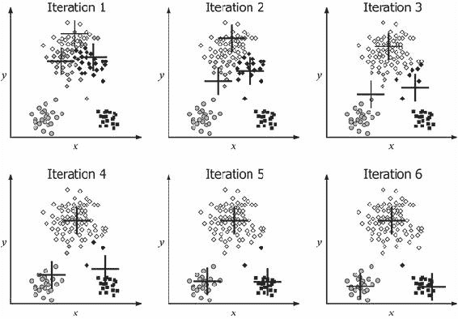

在上图中，我们可以看到，在第一次迭代时，初始的聚类中心点并没有很好地代表数据的结构。尽管这些点显然被分成了三组，但初始的聚类中心点（以十字标记表示）都分布在图形的上方区域。这些点的颜色表示它们与最近的聚类中心的关系。随着迭代的进行，我们可以看到聚类中心点如何逐步靠近每个点组的“自然”位置，即组中心。

在定义主要的 *k*-means 函数之前，先定义几个实用的辅助函数是有用的：一个用于计算聚类中心点的函数，另一个则是将数据分组到各自聚类的函数。

```py
(defn centroid [xs]
  (let [m (i/trans (i/matrix xs))]
    (if (> (i/ncol m) 1)
      (i/matrix (map s/mean m))
     m)))

(defn ex-6-9 []
  (let [m (i/matrix [[1 2 3]
                     [2 2 5]])]
    (centroid m)))

;; A 3x1 matrix
;;  -------------
;; 1.50e+00
;; 2.00e+00
;; 4.00e+00
```

`centroid` 函数简单地计算输入矩阵每列的均值。

```py
(defn clusters [cluster-ids data]
  (->> (map vector cluster-ids data)
       (conj-into {})
       (vals)
       (map i/matrix))) 

(defn ex-6-10 []
  (let [m (i/matrix [[1 2 3]
                     [4 5 6]
                     [7 8 9]])]
    (clusters [0 1 0] m)))

;; A 1x3 matrix
;; -------------
;; 4.00e+00  5.00e+00  6.00e+00 
;;  A 2x3 matrix
;; -------------
;; 7.00e+00  8.00e+00  9.00e+00 
;; 1.00e+00  2.00e+00  3.00e+00
```

`clusters` 函数根据提供的聚类 ID 将较大的矩阵拆分为一系列较小的矩阵。聚类 ID 被提供为与聚类点长度相同的元素序列，列出该序列中每个点对应的聚类 ID。共享相同聚类 ID 的项目将被分到一起。通过这两个函数，我们得到了完整的 `k-means` 函数：

```py
(defn k-means [data k]
  (loop [centroids (s/sample data :size k)
         previous-cluster-ids nil]
    (let [cluster-id (fn [x]
                       (let [distance  #(s/euclidean-distance x %)
                             distances (map distance centroids)]
                         (->> (apply min distances)
                              (index-of distances))))
          cluster-ids (map cluster-id data)]
      (if (not= cluster-ids previous-cluster-ids)
        (recur (map centroid (clusters cluster-ids data))
               cluster-ids)
        clusters))))
```

我们首先通过抽样输入数据随机选择 `k` 个聚类中心点。接着，使用循环/递归不断更新聚类中心点，直到 `previous-cluster-ids` 和 `cluster-ids` 相同。此时，所有文档都没有移动到其他聚类，因此聚类过程已收敛。

## 对路透社文档进行聚类

现在让我们使用 `k-means` 函数对路透社文档进行聚类。我们先让算法简单一些，选取一些较大的文档样本。较大的文档更容易让算法识别它们之间的相似性。我们将最低字符数设定为 500 字符。这意味着我们的输入文档至少有一个标题和几句正文内容。

```py
(defn ex-6-11 []
  (let [documents (fs/glob "data/reuters-text/*.txt")
        doc-count 100
        k 5
        tokenized (->> (map slurp documents)
                       (remove too-short?)
                       (take doc-count)
                       (map stem-reuters))]
    (add-documents-to-dictionary! dictionary tokenized)
    (-> (map #(tf-vector dictionary %) tokenized)
        (k-means k))))
```

我们使用`fs`库（[`github.com/Raynes/fs`](https://github.com/Raynes/fs)）通过调用`fs/glob`，并使用匹配所有文本文件的模式，来创建文件列表进行聚类。我们删除那些太短的文件，标记前 100 个，并将它们添加到字典中。我们为输入创建`tf`向量，然后对它们调用`k-means`。

如果你运行前面的示例，你将得到一组聚类文档向量，但这些并不太有用。让我们创建一个`summary`函数，利用字典报告每个聚类中最常见的术语。

```py
(defn cluster-summary [dict clusters top-term-count]
  (for [cluster clusters]
    (let [sum-terms (if (= (i/nrow cluster) 1)
                      cluster
                      (->> (i/trans cluster)
                           (map i/sum)
                           (i/trans)))
          popular-term-ids (->> (map-indexed vector sum-terms)
                                (sort-by second >)
                                (take top-term-count)
                                (map first))
          top-terms (map #(id->term dict %) popular-term-ids)]
      (println "N:" (i/nrow cluster))
      (println "Terms:" top-terms))))

(defn ex-6-12 []
  (cluster-summary dictionary (ex-6-11) 5))
```

*k*-均值算法本质上是一个随机算法，对质心的初始位置敏感。我得到了以下输出，但你的结果几乎肯定会不同：

```py
;; N: 2
;; Terms: (rocket launch delta satellit first off weather space)
;;  N: 4
;; Terms: (said will for system 000 bank debt from bond farm)
;; N: 12
;; Terms: (said reuter for iranian it iraq had new on major)
;; N: 62
;; Terms: (said pct dlr for year mln from reuter with will)
;; N: 20
;; Terms: (said for year it with but dlr mln bank week)
```

不幸的是，我们似乎没有得到很好的结果。第一个聚类包含两篇关于火箭和太空的文章，第三个聚类似乎由关于伊朗的文章组成。大多数文章中最常见的词汇是“said”。

# 使用 TF-IDF 进行更好的聚类

**词汇** **频率-逆文档频率**（**TF-IDF**）是一种通用方法，用于在文档向量中加权术语，以便在整个数据集中流行的术语不会像那些较不常见的术语那样被高估。这捕捉了直观的信念——也是我们之前观察到的——即“said”这样的词汇并不是构建聚类的强有力基础。

## Zipf 定律

Zipf 定律指出，任何词汇的频率与其在频率表中的排名成反比。因此，最频繁的词汇出现的频率大约是第二常见词汇的两倍，第三常见词汇的三倍，依此类推。让我们看看这一规律是否适用于我们的路透社语料库：

```py
(defn ex-6-13 []
  (let [documents (fs/glob "data/reuters-text/*.txt")
        doc-count 1000
        top-terms 25
        term-frequencies (->> (map slurp documents)
                              (remove too-short?)
                              (take doc-count)
                              (mapcat tokenize-reuters)
                              (frequencies)
                              (vals)
                              (sort >)
                              (take top-terms))]
    (-> (c/xy-plot (range (inc top-terms)) term-frequencies
                   :x-label "Terms"
                   :y-label "Term Frequency")
        (i/view))))
```

使用前述代码，我们可以计算出前 1,000 篇路透社文档中前 25 个最流行词汇的频率图。

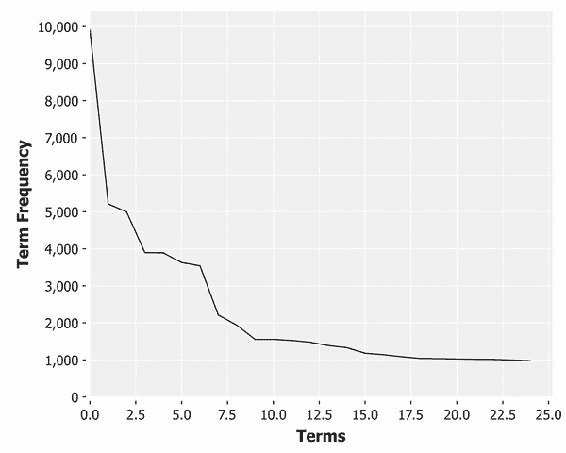

在前 1,000 篇文档中，最流行的词汇出现了将近 10,000 次。第 25^(th)个最流行的词汇总共出现了大约 1,000 次。实际上，数据显示，词汇在路透社语料库中的出现频率比频率表中的位置所暗示的要高。这很可能是由于路透社语料库的公告性质，导致相同的短词被反复使用。

## 计算 TF-IDF 权重

计算 TF-IDF 只需要对我们已经创建的代码进行两个修改。首先，我们必须追踪给定术语出现在哪些文档中。其次，在构建文档向量时，我们必须适当地加权该术语。

既然我们已经创建了一个术语字典，我们不妨将每个术语的文档频率存储在其中。

```py
(defn inc-df! [dictionary term-id]
  (doto dictionary
    (swap! update-in [:df term-id] (fnil inc 0))))

(defn build-df-dictionary! [dictionary document]
  (let [terms    (distinct document)
        dict     (build-dictionary! dictionary document)
        term-ids (map #(term-id dictionary %) document)]
    (doseq [term-id term-ids]
      (inc-df! dictionary term-id))
    dict))
```

`build-df-dictionary` 函数之前接受一个字典和一个术语序列。我们从不同的术语中构建字典，并查找每个术语的 `term-id`。最后，我们遍历术语 ID 并为每个 ID 增加 `:df`。

如果一个文档包含词语 *w*[1]、…、*w*[n]，那么词语 *w*[i] 的逆文档频率定义为：

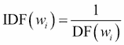

即，词语出现在文档中的倒数。如果一个词语在一组文档中频繁出现，它的 *DF* 值较大，而 *IDF* 值较小。在文档数量很大的情况下，通常通过乘以一个常数（通常是文档总数 *N*）来对 *IDF* 值进行归一化，因此 *IDF* 公式看起来像这样：

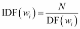

词语 *w*[i] 的 TF-IDF 权重 *W*[i] 由词频和逆文档频率的乘积给出：

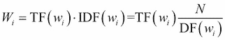

然而，前述公式中的 *IDF* 值仍然不理想，因为对于大型语料库，*IDF* 项的范围通常远大于 *TF*，并且可能会压倒 *TF* 的效果。为了减少这个问题并平衡 *TF* 和 *IDF* 项的权重，通常的做法是使用 *IDF* 值的对数：

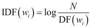

因此，词语 *w*[i] 的 TF-IDF 权重 *w*[i] 变为：

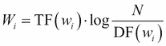

这是经典的 TF-IDF 权重：常见词语的权重较小，而不常见的词语的权重较大。确定文档主题的重要词语通常具有较高的 *TF* 和适中的 *IDF*，因此二者的乘积成为一个较大的值，从而在结果向量中赋予这些词语更多的权重。

```py
(defn document-frequencies [dict terms]
  (->> (map (partial term-id dict) terms)
       (select-keys (:df @dict))))

(defn tfidf-vector [dict doc-count terms]
  (let [tf (term-frequencies dict terms)
        df (document-frequencies dict (distinct terms))
        idf   (fn [df] (i/log (/ doc-count df)))
        tfidf (fn [tf df] (* tf (idf df)))]
    (map->vector dict (merge-with tfidf tf df))))
```

前述代码计算了先前定义的 `term-frequencies` 和从字典中提取的 `document-frequencies` 的 TF-IDF 值。

## 使用 TF-IDF 的 k-means 聚类

在进行前述调整后，我们可以计算路透社文档的 TF-IDF 向量。以下示例是基于新的 `tfidf-vector` 函数修改的 `ex-6-12`：

```py
(defn ex-6-14 []
  (let [documents (fs/glob "data/reuters-text/*.txt")
        doc-count 100
        k 5
        tokenized (->> (map slurp documents)
                       (remove too-short?)
                       (take doc-count)
                       (map stem-reuters))]
    (reduce build-df-dictionary! dictionary tokenized)
    (-> (map #(tfidf-vector dictionary doc-count %) tokenized)
        (k-means k)
        (cluster-summary dictionary 10))))
```

前述代码与之前的示例非常相似，但我们已经替换了新的 `build-df-dictionary` 和 `tfidf-vector` 函数。如果你运行该示例，应该会看到比之前稍微改进的输出：

```py
N: 5
Terms: (unquot unadjust year-on-year novemb grew sundai labour m-3 ahead 120)
N: 15
Terms: (rumor venezuela azpurua pai fca keat ongpin boren gdp moder)
N: 16
Terms: (regan drug lng soviet bureau deleg gao dean fdic algerian)
N: 46
Terms: (form complet huski nrc rocket north underwrit card oat circuit)
N: 18
Terms: (freez cocoa dec brown bean sept seixa telex argentin brown-forman)
```

尽管由于词语已被词干化，顶级词语可能难以解释，但这些词语代表了每个聚类中最为不寻常的常见词。注意，“said”不再是所有聚类中评分最高的词语。

## 更好的 n-gram 聚类

从前面列出的词汇表来看，应该清楚地意识到，通过将文档简化为无序的词汇序列，我们丧失了多少信息。如果没有句子的上下文，我们很难准确把握每个聚类的含义。

然而，向量空间模型本身并没有什么内在的限制，阻止我们保持输入词语的顺序。我们可以简单地创建一个新的术语来表示多个词的组合。这个组合词，可能表示多个连续的输入词，被称为 ***n*-gram**。

一个 *n*-gram 的例子可能是“new york”（纽约）或“stock market”（股市）。事实上，因为它们包含两个词，所以这些被称为 **bigrams**（二元组）。*n*-grams 可以是任意长度的。*n*-gram 越长，携带的上下文信息越多，但它的出现也就越为罕见。

*n*-grams 与 **瓦片法（shingling）**的概念密切相关。当我们对 *n*-grams 进行瓦片化处理时，我们是在创建重叠的词组序列。瓦片化（shingling）一词来源于这些词语像屋顶瓦片一样重叠的方式。

```py
(defn n-grams [n words]
  (->> (partition n 1 words)
       (map (partial str/join " ")))) 

(defn ex-6-15 []
  (let [terms (reuters-terms "reut2-020.sgm-761.txt")]
    (n-grams 2 terms)))

;; ("reagan says" "says he" "he sees" "sees no" "no recession")
```

目前，使用 2-grams 就能让我们（例如）区分数据集中“coconut”一词的不同用法：“coconut oil”（椰子油）、“coconut planters”（椰子种植者）、“coconut plantations”（椰子种植园）、“coconut farmers”（椰子农民）、“coconut association”（椰子协会）、“coconut authority”（椰子管理机构）、“coconut products”（椰子产品）、“coconut exports”（椰子出口）、“coconut industry”（椰子产业）和相当吸引人的“coconut chief”（椰子首领）。这些词对定义了不同的概念——有时是微妙的不同——我们可以在不同的文档中捕捉并进行比较。

我们可以通过结合不同长度的 *n*-gram 的结果，来实现 *n*-gram 和瓦片化的双重优势：

```py
(defn multi-grams [n words]
  (->> (range 1 (inc n))
       (mapcat #(n-grams % words))))

(defn ex-6-16 []
  (let [terms (reuters-terms "reut2-020.sgm-761.txt")]
    (multi-grams 4 terms)))

;; ("reagan" "says" "he" "sees" "no" "recession" "reagan says" 
;; "says he" "he sees" "sees no" "no recession" "reagan says he" 
;; "says he sees" "he sees no" "sees no recession" "reagan says he 
;; sees" "says he sees no" "he sees no recession")
```

虽然词干提取（stemming）和停用词移除（stop word removal）起到了缩减字典规模的作用，而使用 TF-IDF 则提高了每个词在文档中的权重效用，但生成 *n*-grams 的效果是大大增加了我们需要处理的词汇数量。

特征的爆炸性增长将立刻使我们在 Incanter 中实现 *k*-means 的效果超出负荷。幸运的是，有一个叫做 **Mahout** 的机器学习库，专门设计用于在海量数据上运行像 *k*-means 这样的算法。

# 使用 Mahout 进行大规模聚类

Mahout ([`mahout.apache.org/`](http://mahout.apache.org/)) 是一个机器学习库，旨在分布式计算环境中使用。该库的 0.9 版本支持 Hadoop，并且是我们将在此使用的版本。

### 注意

在本文撰写时，Mahout 0.10 刚刚发布，并且同样支持 Spark。Spark 是一个替代性的分布式计算框架，我们将在下一章介绍。

我们在上一章看到，Hadoop 的一个抽象概念是序列文件：Java 键和值的二进制表示。许多 Mahout 的算法期望在序列文件上操作，我们需要创建一个序列文件作为 Mahout 的 *k*-means 算法的输入。Mahout 的 *k*-means 算法也期望将其输入作为向量，表示为 Mahout 的向量类型之一。

尽管 Mahout 包含提取向量的类和实用程序，我们将借此机会演示如何将 Parkour 和 Mahout 一起使用。这样不仅能让我们对创建的向量有更细粒度的控制，还可以展示更多 Parkour 在指定 Hadoop 作业时的能力。

## 将文本文件转换为序列文件

然而，我们不会定义自定义作业来将文本文档转换为序列文件表示：Mahout 已经定义了一个有用的 `SequenceFilesFromDirectory` 类，用来转换文本文件目录。我们将使用这个工具来创建一个代表整个 `reuters-txt` 目录内容的单一文件。

尽管序列文件可能物理上分布在不同的块中（例如在 HDFS 上），但它在逻辑上是一个文件，表示所有输入文档作为键/值对。键是文件名，值是文件的文本内容。

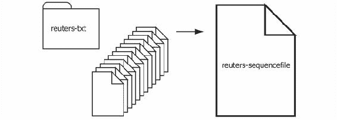

以下代码将处理转换：

```py
(:import [org.apache.mahout.text
           SequenceFilesFromDirectory])

(defn text->sequencefile [in-path out-path]
  (SequenceFilesFromDirectory/main
   (into-array String (vector "-i" in-path
                              "-o" out-path
                              "-xm" "sequential"
                              "-ow"))))

(defn ex-6-17 []
  (text->sequencefile "data/reuters-text"
                      "data/reuters-sequencefile"))
```

`SequenceFilesFromDirectory` 是 Mahout 的一个实用类，是一套可以在命令行调用的类之一。

### 提示

由于运行前面的示例是后续示例的先决条件，它也可以在命令行上运行：

```py
lein create-sequencefile

```

我们直接调用 `main` 函数，传递我们通常在命令行上传递的参数，作为字符串数组。

## 使用 Parkour 创建 Mahout 向量

现在我们已经有了 Reuters 语料库的序列文件表示，我们需要将每个文档（现在表示为一个单一的键/值对）转换为向量。我们之前已经看到如何使用共享字典（被建模为 Clojure 原子）来实现这一点。原子确保即使在多线程环境中，每个不同的术语也会得到自己的 ID。

我们将使用 Parkour 和 Hadoop 来生成向量，但这带来了一个挑战。由于 MapReduce 编程的特点是映射器并行工作且不共享状态，我们如何为每个单词分配一个唯一的 ID 呢？Hadoop 并未提供类似于 Clojure 原子的机制来在集群中的节点之间共享可变状态，实际上，最小化共享状态是扩展分布式应用程序的关键。

因此，创建一个共享的唯一 ID 集合对我们的 Parkour 作业来说是一个有趣的挑战：让我们看看如何以分布式方式为我们的字典生成唯一的 ID。

## 创建分布式唯一 ID

在我们查看 Hadoop 特定的解决方案之前，值得注意的是，创建一个集群范围内唯一标识符的一个简单方法是创建一个通用唯一标识符，或 UUID。

```py
(defn uuid []
  (str (java.util.UUID/randomUUID)))
```

这会创建一个形式为 `3a65c7db-6f41-4087-a2ec-8fe763b5f185` 的长字节字符串，这几乎可以保证不会与世界上任何地方生成的其他 UUID 冲突。

虽然这对于生成唯一 ID 有效，但可能的 ID 数量是天文数字，而 Mahout 的稀疏向量表示需要以整数的形式初始化向量的基数。使用 `uuid` 生成的 ID 太大了。此外，这并不能帮助我们协调 ID 的创建：集群中的每台机器都会生成不同的 UUID 来表示相同的术语。

解决这个问题的一种方法是使用术语本身来生成唯一 ID。如果我们使用一致性哈希函数从每个输入术语创建一个整数，集群中的所有机器都会生成相同的 ID。由于良好的哈希函数可能会为唯一的输入术语产生唯一的输出，这个技巧可能会很好地工作。虽然会有一些哈希冲突（即两个词哈希到相同的 ID），但这应该只是整体中的一个小比例。

### 注意

哈希特征本身以创建唯一 ID 的方法通常被称为“哈希技巧”。尽管它通常用于文本向量化，但它可以应用于任何涉及大量特征的问题。

然而，生成跨整个集群唯一的区分 ID 的挑战，给了我们一个讨论 Hadoop 中 Parkour 所揭示的一个有用功能的机会：分布式缓存。

## 使用 Hadoop 分布式唯一 ID

如果我们要计算唯一的集群范围 ID，考虑一下我们的 Parkour 映射器和化简器可能是什么样子。映射器很简单：我们希望计算每个遇到的术语的文档频率，因此以下映射器简单地为每个唯一术语返回一个向量：向量的第一个元素（键）是术语本身，第二个元素（值）是 `1`。

```py
(defn document-count-m
  {::mr/source-as :vals}
  [documents]
  (->> documents
       (r/mapcat (comp distinct stemmer/stems))
       (r/map #(vector % 1))))
```

化简器的任务是将这些术语的键/值对（术语与文档计数）进行归约，以确保每个唯一术语都有一个唯一的 ID。做这件事的一个简单方法是确保集群上只有一个化简器。由于所有术语都会传递给这个单一的进程，化简器可以简单地保持一个内部计数器，并像我们之前用 Clojure 原子做的那样为每个术语分配一个 ID。然而，这并没有利用 Hadoop 的分布式能力。

我们尚未介绍 Parkour 的一个特点，即每个映射器（mapper）和归约器（reducer）内部可以访问的运行时上下文。Parkour 将 `parkour.mapreduce/*context*` 动态变量绑定到执行我们映射器和归约器的 Hadoop 任务的任务上下文中。任务上下文包含以下属性（其中之一）：

| 属性 | 类型 | 描述 |
| --- | --- | --- |
| `mapred.job.id` | 字符串 | 作业的 ID |
| `mapred.task.id` | int | 任务尝试的 ID |
| `mapred.task.partition` | int | 任务在作业中的 ID |

其中最后一个属性 `mapred.task.partition`，是 Hadoop 分配的任务编号，保证是一个单调递增的唯一整数，且在整个集群中唯一。这个数字就是我们任务的全局偏移量。在每个任务内部，我们还可以保持一个本地偏移量，并在处理每个单词时输出全局和本地偏移量。全局偏移量和本地偏移量一起为集群中的每个术语提供了一个唯一的标识符。

以下图表展示了在三个独立的映射器上处理的八个术语的过程：

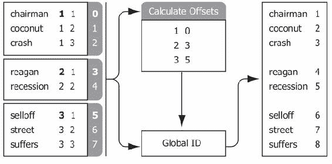

每个映射器只知道它自己的分区号和术语的本地偏移量。然而，这两个数字就是计算唯一全局 ID 所需的全部信息。前面提到的 **计算偏移量** 盒子确定了每个任务分区的全局偏移量是什么。分区 **1** 的全局偏移量为 **0**。分区 **2** 的全局偏移量为 **3**，因为分区 **1** 处理了 **3** 个单词。分区 **3** 的偏移量为 **5**，因为分区 **1** 和 **2** 处理了总共 **5** 个单词，依此类推。

要使上述方法工作，我们需要知道三件事：映射器的全局偏移量、术语的本地偏移量，以及每个映射器处理的术语总数。这三组数字可以用来为每个术语定义一个全局唯一的集群 ID。生成这三组数字的归约器定义如下。它引入了一些新概念，稍后我们将详细讨论。

```py
(defn unique-index-r
  {::mr/source-as :keyvalgroups,
   ::mr/sink-as dux/named-keyvals}
  [coll]
  (let [global-offset (conf/get-long mr/*context*
                                     "mapred.task.partition" -1)]
    (tr/mapcat-state
     (fn [local-offset [word doc-counts]]
       [(inc local-offset)
        (if (identical? ::finished word)
          [[:counts [global-offset local-offset]]]
          [[:data [word [[global-offset local-offset]
                         (apply + doc-counts)]]]])])
     0 (r/mapcat identity [coll [[::finished nil]]]))))
```

归约器执行的第一步是获取 `global-offset`，即此归约器对应的任务分区。我们使用 `mapcat-state`，这是在 transduce 库中定义的一个函数（[`github.com/brandonbloom/transduce`](https://github.com/brandonbloom/transduce)），来构建一系列元组，格式为 `[[:data ["apple" [1 4]] [:data ["orange" [1 5]] ...]`，其中数字向量 `[1 4]` 分别表示全局和本地偏移量。最后，当我们到达此归约任务的末尾时，我们会将一个元组以 `[:counts [1 5]]` 的格式添加到序列中。这代表了该特定归约器分区 `1` 的最终本地计数 `5`。因此，单个归约器计算了我们计算所有术语 ID 所需的三项元素。

提供给`::mr/source-as`的关键字是我们之前没有遇到过的。在上一章中，我们看到了如何通过`：keyvals`、`:keys`和`:vals`等塑形选项，让 Parkour 知道我们希望如何提供数据，以及我们将返回的数据结构。对于聚合器，Parkour 描述了一个更全面的塑形函数集，考虑到输入可能是分组的。下图展示了可用的选项：

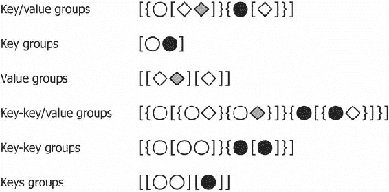

提供给`::mr/sink-as`的选项我们也没有遇到过。`parkour.io.dux`命名空间提供了输出去多路复用的选项。实际上，这意味着通过将 sink 指定为`dux/named-keyvals`，单个聚合器可以写入多个不同的输出。换句话说，我们在数据管道中引入了一个分支：部分数据写入一个分支，其余数据写入另一个分支。

设置了`dux/named-keyvals`的 sink 规范后，我们元组的第一个元素将被解释为写入的目标；元组的第二个元素将被视为要写入的键值对。因此，我们可以将`:data`（本地和全局偏移量）写入一个目标，将`:counts`（每个映射器处理的术语数量）写入另一个目标。

接下来展示的是使用我们定义的映射器和聚合器的作业。与上一章中指定的 Parkour 作业类似，我们将输入、映射、分区、归约和输出步骤串联起来。

```py
(defn df-j [dseq]
  (-> (pg/input dseq)
      (pg/map #'document-count-m)
      (pg/partition (mra/shuffle [:string :long]))
      (pg/reduce #'unique-index-r)
      (pg/output :data (mra/dsink [:string index-value])
                 :counts (mra/dsink [:long :long]))))
```

前面的代码和我们之前看到的作业规范之间有两个主要区别。首先，我们的输出指定了两个命名的 sink：每个聚合器的输出各一个。其次，我们使用`parkour.io.avro`命名空间作为`mra`来为我们的数据指定模式，使用`(mra/dsink [:string long-pair])`。

在上一章中，我们使用了 Tesser 的`FressianWritable`将任意 Clojure 数据结构序列化到磁盘。这是因为`FressianWritable`的内容不需要 Hadoop 解析：该值是完全不透明的。使用 Parkour 时，我们可以定义自定义的键/值对类型。由于 Hadoop 需要将键和值作为独立实体进行解析（用于读取、分区和写入序列文件），Parkour 允许我们使用`parkour.io.avro`命名空间定义“元组模式”，该模式明确地定义了键和值的类型。`long-pair`是一个自定义模式，用于将本地和全局偏移量存储在单个元组中。

```py
(def long-pair (avro/tuple-schema [:long :long]))
```

由于模式是可组合的，我们可以在定义输出模式时引用`long-pair`模式：`(mra/dsink [:string long-pair])`。

### 注意

Parkour 使用`Acbracad`库来通过 Avro 序列化 Clojure 数据结构。有关序列化选项的更多信息，请参考 Abracad 文档，网址：[`github.com/damballa/abracad`](https://github.com/damballa/abracad)。

让我们来看看 Parkour 暴露的 Hadoop 的另一个功能，它使得我们的术语 ID 任务比其他方式更高效：分布式缓存。

## 使用分布式缓存共享数据

如我们在上一节中讨论的那样，如果我们知道每个映射器中每个单词的本地偏移量，并且我们知道每个映射器处理了多少记录，那么我们就能计算出每个单词的唯一连续 ID。

几页前展示的图示包含了两个中央框，每个框上标有**计算偏移量**和**全局 ID**。这些框直接对应于我们接下来要展示的函数：

```py
(defn global-id [offsets [global-offset local-offset]]
  (+ local-offset (get offsets global-offset)))

(defn calculate-offsets [dseq]
  (->> (into [] dseq)
       (sort-by first)
       (reductions (fn [[_ t] [i n]]
                     [(inc i) (+ t n)])
                   [0 0])
       (into {})))
```

一旦我们计算出了用于生成唯一 ID 的偏移量映射，我们希望这些映射能够作为共享资源对所有的映射任务和归约任务可用。既然我们已经以分布式的方式生成了偏移量，我们也希望以分布式的方式进行使用。

分布式缓存是 Hadoop 让任务能够访问公共数据的一种方式。这比通过可能昂贵的数据连接共享少量数据（足够小可以存储在内存中的数据）要高效得多。

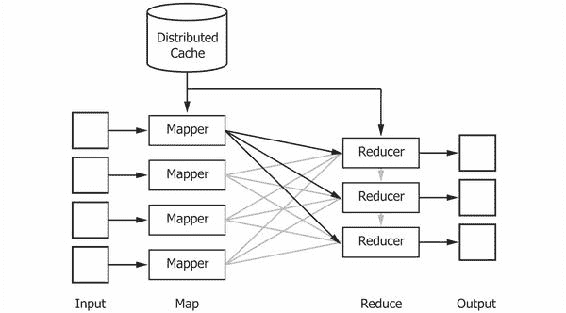

在从分布式缓存读取数据之前，我们需要向它写入一些数据。这可以通过 Parkour 的`parkour.io.dval`命名空间来实现：

```py
(defn unique-word-ids [conf df-data df-counts]
  (let [offsets-dval (-> (calculate-offsets df-counts)
                         (dval/edn-dval))]
    (-> (pg/input df-data)
        (pg/map #'word-id-m offsets-dval)
        (pg/output (mra/dsink [word-id]))
        (pg/fexecute conf `word-id)
        (->> (r/map parse-idf)
             (into {}))
        (dval/edn-dval))))
```

在这里，我们使用`dval/edn-dval`函数将两组数据写入分布式缓存。第一组数据是刚刚定义的`calculate-offsets`函数的结果，它将传递给`word-id-m`映射器使用。写入分布式缓存的第二组数据是它们的输出。我们将看到如何在`word-id-m`函数中生成这些数据，如下所示：

```py
(defn word-id-m
  {::mr/sink-as :keys}
  [offsets-dval coll]
  (let [offsets @offsets-dval]
    (r/map
     (fn [[word word-offset]]
       [word (global-id offsets word-offset)])
     coll)))
```

`dval/edn-dval`返回的值实现了`IDRef`接口。这意味着我们可以使用 Clojure 的`deref`函数（或者`@`反引用宏）来获取它所包装的值，就像我们操作 Clojure 的原子值一样。第一次对分布式值进行反引用时，会从分布式缓存中下载数据到本地映射器缓存中。一旦数据在本地可用，Parkour 会负责重新构建我们以 EDN 格式写入的数据结构（偏移量的映射）。

## 从输入文档构建 Mahout 向量

在前面的章节中，我们绕了一些路介绍了几个新的 Parkour 和 Hadoop 概念，但现在我们终于可以为 Mahout 构建文本向量，并为每个术语使用唯一的 ID。为了简洁起见，部分代码被省略，但整个任务可以在`cljds.ch6.vectorizer`示例代码命名空间中查看。

如前所述，Mahout 的*k*-means 实现要求我们使用其向量类之一提供输入的向量表示。由于我们的字典很大，并且大多数文档只使用其中少数术语，因此我们将使用稀疏向量表示。以下代码利用了一个`dictionary`分布式值，为每个输入文档创建一个`org.apache.mahout.math.RandomAccessSparseVector`：

```py
(defn create-sparse-tfidf-vector [dictionary [id doc]]
  (let [vector (RandomAccessSparseVector. (count dictionary))]
    (doseq [[term tf] (-> doc stemmer/stems frequencies)]
      (let [term-info (get dictionary term)
            id  (:id term-info)
            idf (:idf term-info)]
        (.setQuick vector id (* tf idf))))
    [id vector]))

(defn create-tfidf-vectors-m [dictionary coll]
  (let [dictionary @dictionary]
    (r/map #(create-sparse-tfidf-vector dictionary %) coll)))
```

最后，我们利用`create-tfidf-vectors-m`函数，它将我们所学的内容汇聚成一个单一的 Hadoop 作业：

```py
(defn tfidf [conf dseq dictionary-path vector-path]
  (let [doc-count (->> dseq (into []) count)
        [df-data df-counts] (pg/execute (df-j dseq) conf df)
        dictionary-dval (make-dictionary conf df-data
                                         df-counts doc-count)]
    (write-dictionary dictionary-path dictionary-dval)
    (-> (pg/input dseq)
        (pg/map #'create-tfidf-vectors-m dictionary-dval)
        (pg/output (seqf/dsink [Text VectorWritable] vector-path))
        (pg/fexecute conf `vectorize))))
```

这个任务处理字典的创建，将字典写入分布式缓存，然后使用我们刚定义的映射器，将每个输入文档转换为 Mahout 向量。为了确保与 Mahout 的序列文件兼容，我们将最终输出的键/值类设置为`Text`和`VectorWritable`，其中键是文档的原始文件名，值是文档内容的 Mahout 向量表示。

我们可以通过运行以下命令来调用此作业：

```py
(defn ex-6-18 []
  (let [input-path  "data/reuters-sequencefile" 
        output-path "data/reuters-vectors"]
    (vectorizer/tfidf-job (conf/ig) input-path output-path)))
```

该作业将字典写入`dictionary-path`（我们稍后还需要它），并将向量写入`vector-path`。

### 提示

由于运行前面的例子是后续示例的先决条件，它也可以通过命令行访问：

```py
lein create-vectors

```

接下来，我们将学习如何使用这些向量来实际执行 Mahout 的聚类。

# 使用 Mahout 运行 k-means 聚类

现在，我们已经有了一个适合 Mahout 使用的向量序列文件，接下来就该在整个数据集上实际运行*k*-means 聚类了。与我们本地的 Incanter 版本不同，Mahout 在处理完整的 Reuters 语料库时不会遇到任何问题。

与`SequenceFilesFromDirectory`类一样，我们已经为 Mahout 的另一个命令行程序`KMeansDriver`创建了一个封装器。Clojure 变量名使得我们更容易理解每个命令行参数的作用。

```py
(defn run-kmeans [in-path clusters-path out-path k]
  (let [distance-measure  "org.apache.mahout.common.distance.CosineDistanceMeasure"
        max-iterations    100
        convergence-delta 0.001]
    (KMeansDriver/main
     (->> (vector "-i"  in-path
                  "-c"  clusters-path
                  "-o"  out-path
                  "-dm" distance-measure
                  "-x"  max-iterations
                  "-k"  k
                  "-cd" convergence-delta
                  "-ow"
                  "-cl")
          (map str)
          (into-array String)))))
```

我们提供字符串`org.apache.mahout.common.distance.CosineDistanceMeasure`，以指示驱动程序我们希望使用 Mahout 的余弦距离度量实现。Mahout 还包括`EuclideanDistanceMeasure`和`TanimotoDistanceMeasure`（类似于 Jaccard 距离，是 Jaccard 指数的补集，但将作用于向量而非集合）。还有几种其他的距离度量可以选择；请参考 Mahout 文档以了解所有可用选项。

有了前面的`run-kmeans`函数后，我们只需要告诉 Mahout 在哪里访问我们的文件。与上一章一样，我们假设 Hadoop 在本地模式下运行，所有文件路径都相对于项目根目录：

```py
(defn ex-6-19 []
  (run-kmeans "data/reuters-vectors/vectors"
              "data/kmeans-clusters/clusters"
              "data/kmeans-clusters"
              10))
```

这个例子可能会运行一段时间，因为 Mahout 需要对我们的大数据集进行迭代。

## 查看 k-means 聚类结果

完成后，我们希望能看到每个聚类的聚类总结，就像我们在 Incanter 实现中所做的那样。幸运的是，Mahout 定义了一个`ClusterDumper`类，正是用来做这个事情的。我们需要提供聚类的位置，当然，还需要提供字典的位置。提供字典意味着输出将返回每个聚类的顶部术语。

```py
(defn run-cluster-dump [in-path dict-path points-dir out-path]
  (let [distance-measure
        "org.apache.mahout.common.distance.CosineDistanceMeasure"]
    (ClusterDumper/main
     (->> (vector "-i" in-path
                  "-o" out-path
                  "-d" dict-path
                  "--pointsDir" points-dir
                  "-dm" distance-measure
                  "-dt" "sequencefile"
                  "-b" "100"
                  "-n" "20"
                  "-sp" "0"
                  "--evaluate")
          (map str)
          (into-array String)))))
```

接下来，我们定义实际调用`run-cluster-dump`函数的代码：

```py
(defn path-for [path]
  (-> (fs/glob path)
      (first)
      (.getAbsolutePath)))

(defn ex-6-20 []
  (run-cluster-dump
   (path-for "data/kmeans-clusters/clusters-*-final")
   "data/reuters-vectors/dictionary/part-r-00000"
   "data/kmeans-clusters/clusteredPoints"
   "data/kmeans-clusterdump"))
```

我们再次使用`me.raynes.fs`库来确定最终聚类所在的目录。Mahout 会在包含最终聚类的目录名后附加`-final`，但我们事先并不知道哪个目录会是这个最终目录。`fs/glob`函数会查找与`clusters-*-final`模式匹配的目录，并将`*`替换为实际目录名称中包含的迭代编号。

## 解释聚类输出

如果你在任何文本编辑器中打开之前示例创建的文件`data/kmeans-clusterdump`，你将看到表示 Mahout 聚类的顶部术语的输出。该文件可能很大，但下面提供了一个摘录：

```py
:VL-11417{n=312 c=0.01:0.039, 0.02:0.030, 0.07:0.047, 0.1:0.037, 0.10:0.078, 0.11:0.152, 0.12:0.069,
  Top Terms:
    tonnes              =>   2.357810452962533
    department          =>   1.873890568048526
    wheat               =>  1.7797807546762319
    87                  =>  1.6685682321206117
    u.s                 =>   1.634764205186795
    mln                 =>  1.5050923755535712
    agriculture         =>  1.4595903158187866
    ccc                 =>  1.4314624499051998
    usda                =>  1.4069041441648433
    dlrs                =>  1.2770121846443567
```

第一行包含关于聚类的信息：ID（在本例中为`VL-11417`），后面跟着包含聚类大小和聚类质心位置的大括号。由于文本已转换为权重和数字 ID，单独解读质心是不可行的。不过，质心描述下方的顶部术语暗示了聚类的内容；它们是聚类汇聚的核心术语。

```py
VL-12535{n=514 c=[0:0.292, 0.25:0.015, 0.5:0.012, 00:0.137, 00.46:0.018, 00.50:0.036, 00.91:0.018, 0
  Top Terms:
    president           =>   3.330068911559851
    reagan              =>   2.485271333256584
    chief               =>  2.1148699971952327
    senate              =>   1.876725117983985
    officer             =>  1.8531712558019022
    executive           =>  1.7373591731030653
    bill                =>  1.6326750159727461
    chairman            =>  1.6280977206471365
    said                =>  1.6279512813119108
    house               =>  1.5771017798189988
```

前面提到的两个聚类暗示了数据集中存在的两个明确主题，尽管由于*k*-means 算法的随机性，你的聚类可能会有所不同。

根据初始质心和算法运行的迭代次数，你可能会看到某些聚类在某些方面看起来“更好”或“更差”。这将基于对聚类词汇如何组合在一起的直觉反应。但通常，仅通过查看顶部术语并不能清楚地判断聚类的效果如何。无论如何，直觉并不是判断无监督学习算法质量的可靠方法。我们理想的情况是有一个定量指标来衡量聚类的效果。

# 聚类评估指标

在我们上一节查看的文件底部，你会看到一些统计信息，表明数据的聚类效果如何：

```py
Inter-Cluster Density: 0.6135607681542804
Intra-Cluster Density: 0.6957348405534836
```

这两个数字可以看作是我们在[第二章，*推理*和第三章，*相关性*中看到的组内方差和组间方差的等价物。理想情况下，我们希望聚类内的方差较低（或密度较高），而聚类间的密度较低。

## 聚类间密度

聚类间密度是聚类质心之间的平均距离。好的聚类通常不会有太靠近的质心。如果它们太近，那就意味着聚类正在创建具有相似特征的组，并可能在区分聚类成员方面存在难以支持的情况。

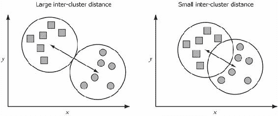

因此，理想情况下，我们的聚类应产生具有**大聚类间距离**的聚类。

## 聚类内部密度

相反，聚类内密度是衡量聚类紧凑性的指标。理想情况下，聚类会识别出彼此相似的项目组。紧凑的聚类表示聚类中的所有项目彼此高度相似。

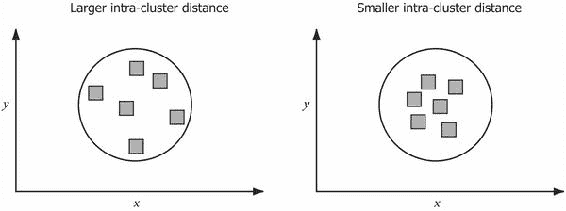

因此，最佳的聚类结果会产生紧凑、独特的聚类，具有**高聚类内密度**和**低聚类间密度**。

然而，数据到底应该有多少个聚类并不总是清楚。考虑以下示例，它展示了同一数据集以不同聚类数分组的情况。很难有足够的信心判断理想的聚类数是多少。

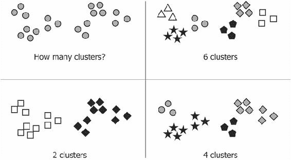

尽管前面的示意图是人为构造的，但它展示了聚类数据时的一个普遍问题。通常没有一个明确的“最佳”聚类数。最有效的聚类将很大程度上取决于数据的最终用途。

然而，我们可以通过确定某些质量评分如何随着聚类数量的变化来推断可能的较优 *k* 值。质量评分可以是像聚类间密度或聚类内密度这样的统计数据。当聚类数接近理想值时，我们期望该质量评分的值会提高。相反，当聚类数偏离理想值时，我们期望质量评分会下降。因此，为了合理地估算数据集中多少个聚类是合理的，我们应该为不同的 *k* 值多次运行算法。

## 使用 Parkour 计算均方根误差

最常见的聚类质量度量之一是**平方误差和**（**SSE**）。对于每个点，误差是测量到最近聚类质心的距离。因此，总的聚类 SSE 是聚类点到其相应质心的所有聚类的和：

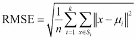

其中 *µ*[i] 是聚类 *S*[i] 中点的质心，*k* 是聚类的总数，*n* 是点的总数。

因此，在 Clojure 中计算 *RMSE* 时，我们需要能够将聚类中的每个点与其对应的聚类质心关联起来。Mahout 将聚类质心和聚类点保存在两个不同的文件中，因此在下一节中我们将把它们合并。

### 加载聚类点和质心

给定一个父目录（例如 `data/reuters-kmeans/kmeans-10`），以下函数将使用 Parkour 的 `seqf/dseq` 函数从序列文件加载键/值对，并将点加载到按聚类 ID 索引的向量映射中。在这种情况下，键是聚类 ID（整数），值是 TF-IDF 向量。

```py
(defn load-cluster-points [dir]
  (->> (points-path dir)
       (seqf/dseq)
       (r/reduce
        (fn [accum [k v]]
          (update-in accum [k] conj v)) {})))
```

上述函数的输出是一个按聚类 ID 索引的映射，其值是聚类点的序列。同样，以下函数将把每个聚类转换为一个按聚类 ID 索引的映射，其值是包含 `:id` 和 `:centroid` 键的映射。

```py
(defn load-cluster-centroids [dir]
  (let [to-tuple (fn [^Cluster kluster]
                   (let [id (.getId kluster)]
                     [id  {:id id
                           :centroid (.getCenter kluster)}]))]
    (->> (centroids-path dir)
         (seqf/dseq)
         (r/map (comp to-tuple last))
         (into {}))))
```

拥有两个按聚类 ID 索引的映射意味着将聚类的点与聚类中心结合起来，只需对映射调用 `merge-with` 并提供一个自定义的合并函数即可。在以下代码中，我们将聚类的点合并到包含聚类 `:id` 和 `:centroid` 的映射中。

```py
(defn assoc-points [cluster points]
  (assoc cluster :points points))

(defn load-clusters [dir]
  (->> (load-cluster-points dir)
       (merge-with assoc-points
                   (load-cluster-centroids dir))
       (vals)))
```

最终输出是一个单一的映射，按聚类 ID 索引，其中每个值都是一个包含 `:id`、`:centroid` 和 `:points` 的映射。我们将在下一节中使用这个映射来计算聚类的 RMSE。

## 计算聚类 RMSE

为了计算 RMSE，我们需要能够确定每个点与其关联的聚类中心之间的距离。由于我们使用了 Mahout 的 `CosineDistanceMeasure` 来执行初始聚类，因此我们也应该使用余弦距离来评估聚类。事实上，我们可以直接利用 Mahout 的实现。

```py
(def measure
  (CosineDistanceMeasure.))

(defn distance [^DistanceMeasure measure a b]
  (.distance measure a b))

(defn centroid-distances [cluster]
  (let [centroid (:centroid cluster)]
    (->> (:points cluster)
         (map #(distance measure centroid %)))))

(defn squared-errors [cluster]
  (->> (centroid-distances cluster)
       (map i/sq)))

(defn root-mean-square-error [clusters]
  (->> (mapcat squared-errors clusters)
       (s/mean)
       (i/sqrt)))
```

如果将 RMSE 与聚类数绘制成图，你会发现随着聚类数的增加，RMSE 会逐渐下降。单一聚类将具有最高的 RMSE 错误（原始数据集与均值的方差），而最低的 RMSE 将是每个点都在自己的聚类中的退化情况（RMSE 为零）。显然，这两个极端都无法很好地解释数据的结构。然而，RMSE 不是线性下降的。当聚类数从 1 增加时，它会急剧下降，但一旦超过“自然”聚类数后，下降的速度就会变慢。

因此，判断理想聚类数的一种方法是绘制 RMSE 随聚类数变化的图表。这就是所谓的 **肘部法**。

## 使用肘部法确定最佳的 k 值

为了使用肘部法确定 *k* 的值，我们需要多次重新运行 *k*-均值聚类。以下代码实现了对 `2` 到 `21` 之间的所有 *k* 值进行聚类。

```py
(defn ex-6-21 []
  (doseq [k (range 2 21)
          :let [dir (str "data/kmeans-clusters-" k)]]
    (println dir)
    (run-kmeans "data/reuters-vectors/vectors"
                (str dir "/clusters")
                dir k)))
```

这可能需要一些时间，所以不妨去泡杯热饮：`println` 语句会记录每次聚类的运行情况，让你知道进展如何。在我的笔记本电脑上，整个过程大约需要 15 分钟。

完成后，你应该能够运行示例，生成每个聚类值的 RMSE 散点图：

```py
(defn ex-6-22 []
  (let [ks (range 2 21)
        ys (for [k ks
                 :let [dir (str "data/kmeans-clusters-" k)
                       clusters (load-clusters dir)]]
             (root-mean-square-error clusters))]
    (-> (c/scatter-plot ks ys
                        :x-label "k"
                        :y-label "RMSE")
        (i/view))))
```

这应该返回一个类似于以下的图表：

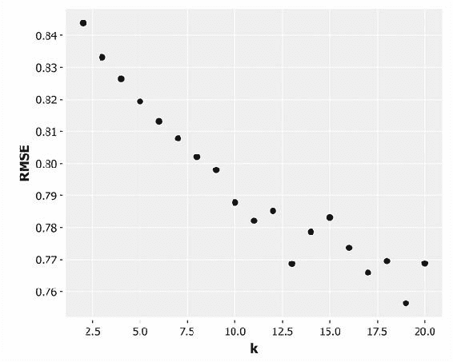

上面的散点图展示了 RMSE 与簇数之间的关系。应该能看出，当*k*超过大约 13 个簇时，RMSE 的变化速率放慢，进一步增加簇数会带来递减的收益。因此，上图表明对于我们的路透社数据，约 13 个簇是一个不错的选择。

肘部法则提供了一种直观的方式来确定理想的簇数，但在实践中有时难以应用。这是因为我们必须解释每个*k*对应的 RMSE 曲线的形状。如果*k*很小，或者 RMSE 包含较多噪声，可能不容易看出肘部在哪里，甚至是否存在肘部。

### 注意

由于聚类是一种无监督学习算法，我们在此假设簇的内部结构是验证聚类质量的唯一手段。如果已知真实的簇标签，则可以使用外部验证度量（例如熵）来验证模型的成功，这在第四章，*分类*中我们曾遇到过。

其他聚类评估方案旨在提供更清晰的方式来确定精确的簇数。我们将讨论的两种方法是邓恩指数和戴维斯-鲍尔丁指数。它们都是内部评估方案，意味着它们只关注聚类数据的结构。每种方法都旨在以不同的方式识别产生最紧凑、最分离的簇的聚类。

## 使用邓恩指数确定最优 k

邓恩指数提供了另一种选择最优*k*的方式。邓恩指数不考虑聚类数据中的平均误差，而是考虑两种“最坏情况”的比率：两个簇中心之间的最小距离，除以最大簇直径。因此，较高的邓恩指数表示更好的聚类，因为通常我们希望簇间距离较大，而簇内距离较小。

对于*k*个簇，我们可以通过以下方式表达邓恩指数：

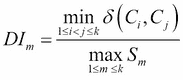

其中，*δ(C[i],C[j])*是两个簇*C*[i]和*C*[j]之间的距离，而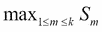表示最大簇的大小（或散布）。

计算一个簇的散布有几种可能的方法。我们可以计算簇内最远两个点之间的距离，或者计算簇内所有数据点之间成对距离的平均值，或者计算每个数据点到簇中心的距离的平均值。在以下代码中，我们通过计算从簇中心到各点的中位距离来确定大小。

```py
(defn cluster-size [cluster]
  (-> cluster
      centroid-distances
      s/median))

(defn dunn-index [clusters]
  (let [min-separation (->> (combinations clusters 2)
                            (map #(apply separation %))
                            (apply min))
        max-cluster-size (->> (map cluster-size clusters)
                              (apply max))]
    (/ min-separation max-cluster-size)))
```

上面的代码使用了 `clojure.math.combinatorics` 中的 `combinations` 函数（[`github.com/clojure/math.combinatorics/`](https://github.com/clojure/math.combinatorics/)）来生成所有聚类的懒序列对。

```py
(defn ex-6-23 []
  (let [ks (range 2 21)
        ys (for [k ks
                 :let [dir (str "data/kmeans-clusters-" k)
                       clusters (load-clusters dir)]]
             (dunn-index clusters))]
    (-> (c/scatter-plot ks ys
                        :x-label "k"
                        :y-label "Dunn Index")
        (i/view))))
```

我们在上面的代码中使用了 `dunn-index` 函数来为 *k=2* 到 *k=20* 的聚类生成散点图：

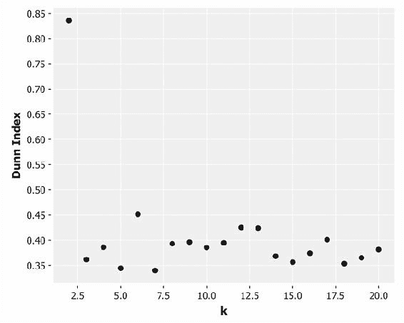

更高的 Dunn 指数表示更好的聚类效果。因此，最佳聚类似乎是 *k=2*，接下来是 *k=6*，然后是 *k=12* 和 *k=13*，它们紧随其后。我们来尝试一种替代的聚类评估方案，并比较结果。

## 使用 Davies-Bouldin 指数确定最优的 k 值

Davies-Bouldin 指数是一种替代的评估方案，用于衡量聚类中所有值的大小和分离度的平均比率。对于每个聚类，找到一个替代聚类，使得聚类大小之和与聚类间距离的比率最大化。Davies-Bouldin 指数被定义为所有聚类的此值的平均值：

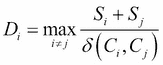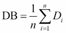

其中 *δ(C[i],C[j])* 是两个聚类中心 *C*[i] 和 *C*[j]* 之间的距离，*S*[i] 和 *S*[j]* 是散布度。我们可以使用以下代码计算 Davies-Bouldin 指数：

```py
(defn scatter [cluster]
  (-> (centroid-distances cluster)
      (s/mean)))

(defn assoc-scatter [cluster]
  (assoc cluster :scatter (scatter cluster)))

(defn separation [a b]
  (distance measure (:centroid a) (:centroid b)))

(defn davies-bouldin-ratio [a b]
  (/ (+ (:scatter a)
        (:scatter b))
     (separation a b)))

(defn max-davies-bouldin-ratio [[cluster & clusters]]
  (->> (map #(davies-bouldin-ratio cluster %) clusters)
       (apply max)))

(defn rotations [xs]
  (take (count xs)
        (partition (count xs) 1 (cycle xs))))

(defn davies-bouldin-index [clusters]
  (let [ds (->> (map assoc-scatter clusters)
                (rotations)
                (map max-davies-bouldin-ratio))]
    (s/mean ds)))
```

现在，让我们在散点图中绘制 *k=2* 到 *k=20* 的 Davies-Bouldin 指数：

```py
(defn ex-6-24 []
  (let [ks (range 2 21)
        ys (for [k ks
                 :let [dir (str "data/kmeans-clusters-" k)
                       clusters (load-clusters dir)]]
             (davies-bouldin-index clusters))]
    (-> (c/scatter-plot ks ys
                        :x-label "k"
                        :y-label "Davies-Bouldin Index")
        (i/view))))
```

这将生成以下图表：

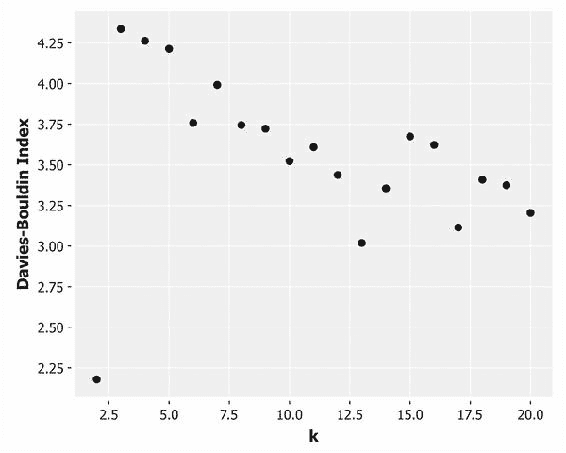

与 Dunn 指数不同，Davies-Bouldin 指数对于良好的聚类方案是最小化的，因为一般来说，我们寻找的是紧凑的聚类，并且聚类间的距离较大。前面的图表表明，*k=2* 是理想的聚类大小，其次是 *k=13*。

# *k*-均值算法的缺点

*k*-均值算法是最流行的聚类算法之一，因为它相对易于实现，并且可以很好地扩展到非常大的数据集。尽管它很受欢迎，但也有一些缺点。

*k*-均值算法是随机的，并不能保证找到全局最优的聚类解。事实上，该算法对离群点和噪声数据非常敏感：最终聚类的质量可能高度依赖于初始聚类中心的位置。换句话说，*k*-均值算法通常会发现局部最优解，而非全局最优解。

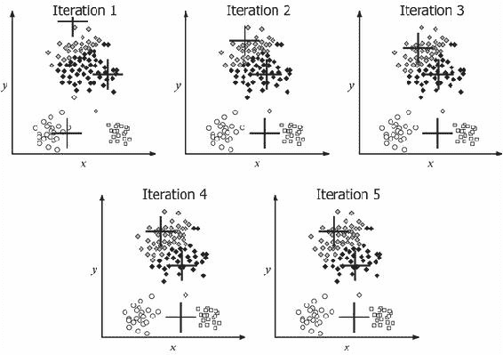

上图说明了如何根据不良的初始聚类质心，*k*均值可能会收敛到局部最小值。如果初始聚类质心的位置合适，非最优聚类仍然可能发生，因为 *k* 均值倾向于选择具有相似大小和密度的聚类。在聚类大小和密度不大致相等时，*k* 均值可能无法收敛到最自然的聚类：

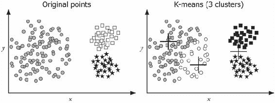

此外，*k* 均值算法强烈倾向于选择“球形”的聚类。形状较为复杂的聚类往往不能被 *k* 均值算法很好地识别。

在下一章，我们将看到各种降维技术如何帮助解决这些问题。但在那之前，我们先来培养一种直觉，理解另一种定义距离的方式：作为衡量某个元素距离一“组”物体的远近。

## 马哈拉诺比斯距离度量

在本章开始时，我们通过展示 Jaccard、欧几里得和余弦距离如何与数据表示相关，看到了一些距离度量在特定数据下可能比其他度量更合适。选择距离度量和聚类算法时需要考虑的另一个因素是数据的内部结构。请考虑以下散点图：

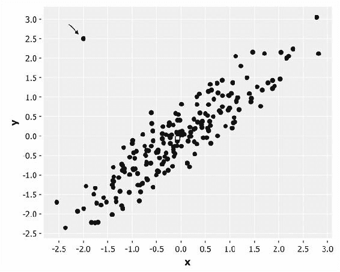

很“显然”，箭头所指的点与其他点不同。我们可以清楚地看到它远离其他点的分布，因此代表了一个异常点。然而，如果我们计算所有点到均值（“质心”）的欧几里得距离，这个点将被其他距离相等或更远的点所掩盖：

```py
(defn ex-6-25 []
  (let [data (dataset-with-outlier)
        centroid  (i/matrix [[0 0]])
        distances (map #(s/euclidean-distance centroid %) data)]
    (-> (c/bar-chart (range 202) distances
                     :x-label "Points"
                     :y-label "Euclidean Distance") 
        (i/view))))
```

上述代码生成了以下图表：

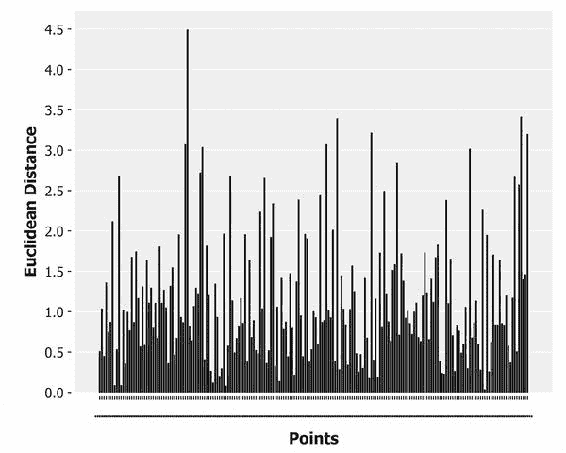

马哈拉诺比斯距离在计算距离时考虑了变量之间的协方差。在二维空间中，我们可以将欧几里得距离想象成一个从质心发出的圆：圆上所有的点与质心的距离相等。马哈拉诺比斯距离将这个圆拉伸并扭曲，以纠正不同变量的尺度差异，并考虑它们之间的相关性。我们可以在以下示例中看到这种效果：

```py
(defn ex-6-26 []
  (let [data (dataset-with-outlier)
        distances    (map first (s/mahalanobis-distance data))]
    (-> (c/bar-chart (range 202) distances
                     :x-label "Points"
                     :y-label "Mahalanobis Distance")
        (i/view))))
```

上述代码使用了 `incanter.stats` 提供的函数来绘制相同数据点的马哈拉诺比斯距离。结果显示在下图中：

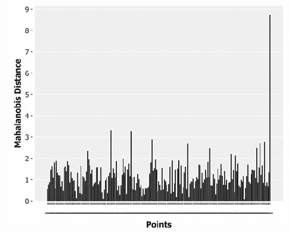

该图清晰地标识出一个点与其他点相比，距离要远得多。这与我们对这个点应该被认为比其他点更远的看法一致。

# 维度灾难

然而，马哈拉诺比斯距离度量无法克服一个事实，这就是所谓的维度灾难。随着数据集中的维度数量增加，每个点都趋向于和其他点一样远。我们可以通过下面的代码简单地演示这一点：

```py
(defn ex-6-27 []
  (let [distances (for [d (range 2 100)
                        :let [data (->> (dataset-of-dimension d)
                                        (s/mahalanobis-distance)
                                        (map first))]]
                    [(apply min data) (apply max data)])]
    (-> (c/xy-plot (range 2 101) (map first distances)
                   :x-label "Number of Dimensions"
                   :y-label "Distance Between Points"
                   :series-label "Minimum Distance"
                   :legend true)
        (c/add-lines (range 2 101) (map second distances)
                     :series-label "Maximum Distance")
        (i/view))))
```

上面的代码找出了在一个合成生成的 100 个点的数据集中，任意两个点对之间的最小距离和最大距离。随着维度数接近数据集中的元素数量，我们可以看到每对元素之间的最小距离和最大距离逐渐接近：

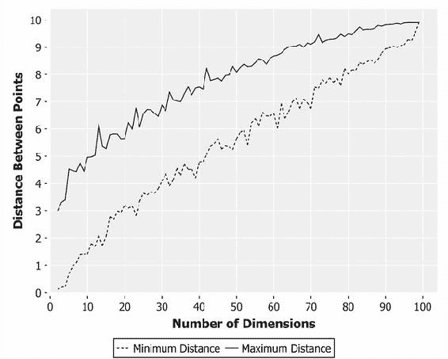

这一效果非常显著：随着维度数量的增加，最接近的两个点之间的距离也在增加。最远的两个点之间的距离也增加，但增长速度较慢。最后，当维度为 100，数据点为 100 时，每个点似乎与其他每个点的距离都相等。

当然，这是合成的随机生成数据。如果我们尝试对数据进行聚类，我们隐含地希望数据中会有一个可识别的内部结构，我们可以将其提取出来。然而，随着维度数量的增加，这种结构会变得越来越难以识别。

# 总结

在本章中，我们学习了聚类的过程，并介绍了流行的*k*-均值聚类算法，用于聚类大量的文本文件。

这为我们提供了一个机会，探讨文本处理所带来的具体挑战，其中数据通常是杂乱的、模糊的，并且是高维的。我们看到停用词和词干提取如何帮助减少维度的数量，以及 TF-IDF 如何帮助识别最重要的维度。我们还看到如何通过*n*-gram 和 shingling 技术提取每个词的上下文，代价是大量的术语扩展。

我们已经更详细地探讨了 Parkour，并且看到了它如何用来编写复杂的、可扩展的 Hadoop 作业。特别是，我们看到了如何利用分布式缓存和自定义元组模式来编写处理 Clojure 数据结构表示的数据的 Hadoop 作业。我们用这两者实现了生成唯一的、跨集群的术语 ID 的方法。

最后，我们见证了高维空间带来的挑战：所谓的“维度灾难”。在下一章，我们将更详细地探讨这个话题，并描述一系列应对技术。我们将继续探索“相似性”和“差异性”的概念，同时考虑推荐问题：我们如何将用户与物品匹配起来。
