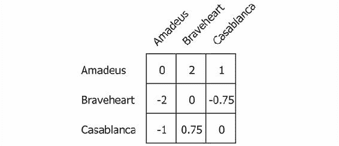
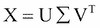
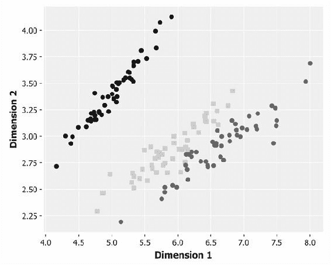
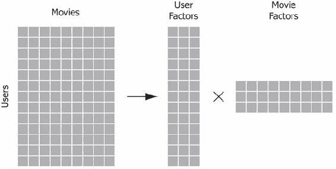

# 第七章 推荐系统

|   | *"喜欢这种东西的人会发现这正是他们喜欢的东西。"* |   |
| --- | --- | --- |
|   | —*归功于亚伯拉罕·林肯* |

在前一章中，我们使用 k-means 算法对文本数据进行了聚类。这要求我们必须有一种衡量文本文件相似度的方式。在本章中，我们将研究推荐系统，并利用这种相似度的概念来推荐我们认为用户可能喜欢的物品。

我们还看到了高维数据所带来的挑战——即所谓的**维度灾难**。尽管这不是推荐系统特有的问题，但本章将展示多种技术来应对其影响。特别地，我们将通过主成分分析和奇异值分解来确定最重要的维度，并通过布隆过滤器和 MinHash 来使用概率方法压缩非常高维的数据集。此外——由于确定物品之间的相似度涉及大量的成对比较——我们将学习如何使用局部敏感哈希高效地预计算最可能的相似性分组。

最后，我们将介绍 Spark，一个分布式计算框架，以及一个相关的 Clojure 库，名为 Sparkling。我们将展示如何结合 Spark 的机器学习库 MLlib 使用 Sparkling 构建分布式推荐系统。

但首先，我们将从讨论推荐系统的基本类型开始，并在 Clojure 中实现其中一个最简单的推荐系统。接下来，我们将演示如何使用前一章中介绍的 Mahout 来创建多种不同类型的推荐系统。

# 下载代码和数据

在本章中，我们将使用来自[`movielens.org/`](https://movielens.org/)的电影推荐数据。该网站由 GroupLens 运营，GroupLens 是明尼苏达大学双城校区计算机科学与工程系的一个研究实验室。

数据集已通过[`grouplens.org/datasets/movielens/`](https://grouplens.org/datasets/movielens/)提供了不同大小的版本。在本章中，我们将使用"MovieLens 100k"——一个包含来自 1,000 名用户对 1,700 部电影的 100,000 条评分的集合。由于数据发布于 1998 年，它开始显得有些陈旧，但它提供了一个适中的数据集，供我们展示推荐系统的原理。本章将为你提供处理最新发布的"MovieLens 20M"数据所需的工具：1.38 万用户对 27,000 部电影的 2,000 万条评分。

### 注意

本章的代码可以从 Packt Publishing 网站或[`github.com/clojuredatascience/ch7-recommender-systems`](https://github.com/clojuredatascience/ch7-recommender-systems)获取。

像往常一样，提供了一个 shell 脚本，它将下载并解压数据到本章的 `data` 目录。你可以在相同的代码目录中运行它：

```py
script/download-data.sh

```

在你运行脚本或手动下载解压数据后，你应该能看到以字母 "u" 开头的各种文件。在本章中，我们主要使用的评分数据位于 `ua.base` 文件中。`ua.base`、`ua.test`、`ub.base` 和 `ub.test` 文件包含用于交叉验证的数据子集。我们还将使用 `u.item` 文件，它包含关于电影本身的信息。

# 检查数据

评分文件是制表符分隔的，包含用户 ID、物品 ID、评分和时间戳字段。用户 ID 与 `u.user` 文件中的一行数据相对应，该文件提供了用户的基本人口统计信息，如年龄、性别和职业：

```py
(defn ex-7-1 []
  (->> (io/resource "ua.base")
       (io/reader)
       (line-seq)
       (first)))

;; "1\t1\t5\t874965758"
```

字符串显示的是文件中的一行——一行以制表符分隔，包含用户 ID、物品 ID、评分（1-5）以及显示评分时间的时间戳。评分是一个从 1 到 5 的整数，时间戳表示自 1970 年 1 月 1 日以来的秒数。物品 ID 与 `u.item` 文件中的一行数据相对应。

我们还需要加载 `u.item` 文件，这样我们就可以确定正在评分的物品（以及返回预测的物品）的名称。以下示例展示了 `u.item` 文件中数据的存储方式：

```py
(defn ex-7-2 []
  (->> (io/resource "u.item")
       (io/reader)
       (line-seq)
       (first)))

;; "1|Toy Story (1995)|01-Jan-1995||http://us.imdb.com/M/title-exact?Toy%20Story%20(1995)|0|0|0|1|1|1|0|0|0|0|0|0|0|0|0|0|0|0|0"
```

前两个字段分别是物品 ID 和名称。之后的字段，在本章中没有使用，分别是发行日期、电影在 IMDB 上的 URL，以及一系列标志，指示电影的类型。

# 解析数据

由于数据将全部加载到主内存中以便于操作，我们将定义几个函数，将评分数据加载到 Clojure 数据结构中。`line->rating` 函数接收一行数据，将其按制表符分割成各个字段，将每个字段转换为 `long` 数据类型，然后使用 `zipmap` 将序列转换为一个包含提供键的映射：

```py
(defn to-long [s]
  (Long/parseLong s))

(defn line->rating [line]
  (->> (s/split line #"\t")
       (map to-long)
       (zipmap [:user :item :rating])))

(defn load-ratings [file]
  (with-open [rdr (io/reader (io/resource file))]
    (->> (line-seq rdr)
         (map line->rating)
         (into []))))

(defn ex-7-3 []
  (->> (load-ratings "ua.base")
       (first)))

;; {:rating 5, :item 1, :user 1}
```

让我们写一个函数来解析 `u.items` 文件，这样我们就能知道电影名称是什么：

```py
(defn line->item-tuple [line]
  (let [[id name] (s/split line #"\|")]
    (vector (to-long id) name)))

(defn load-items [path]
  (with-open [rdr (io/reader (io/resource path))]
    (->> (line-seq rdr)
         (map line->item-tuple)
         (into {}))))
```

`load-items` 函数返回一个从物品 ID 到电影名称的映射，以便我们可以根据物品 ID 查找电影名称。

```py
(defn ex-7-4 []
  (-> (load-items "u.item")
      (get 1)))

;; "Toy Story (1995)"
```

在这些简单的函数就绪后，是时候了解不同类型的推荐系统了。

# 推荐系统的类型

推荐问题通常有两种处理方法。这两种方法都利用了我们在上一章中遇到的事物相似度的概念。

一种方法是从我们知道用户喜欢的项目开始，并推荐其他具有相似属性的项目。例如，如果用户对动作冒险电影感兴趣，我们可能会给他们展示我们能够提供的所有动作冒险电影的列表。或者，如果我们拥有比单纯的电影类型更多的数据——例如标签列表——那么我们就可以推荐具有最多共同标签的电影。这个方法叫做**基于内容**的过滤，因为我们利用项目本身的属性来生成相似项目的推荐。

另一种推荐方法是将用户的偏好作为输入。这可以是电影的数字评分，或者是购买过或曾观看过的电影。我们一旦获得这些数据，就可以识别出其他有相似评分（或购买历史、观看习惯等）的用户偏好的电影，而这些电影是该用户尚未明确表示偏好的。这种方法考虑了其他用户的行为，因此通常被称为**协同过滤**。协同过滤是一种强大的推荐手段，因为它利用了所谓的“群体智慧”。

在本章中，我们将主要研究协同过滤方法。然而，通过利用相似度的概念，我们也会为你提供实施基于内容的推荐所需的概念。

## 协同过滤

通过仅考虑用户与项目的关系，这些技术不需要了解项目本身的属性。这使得协同过滤成为一种非常通用的技术——相关的项目可以是任何可以被评分的东西。我们可以将协同过滤视为尝试填充一个稀疏矩阵，其中包含用户的已知评分。我们希望能够用预测的评分来替代未知值，并推荐评分最高的预测项。


请注意，每个问号位于行和列的交叉处。行包含特定用户对他们评分的所有电影的偏好。列包含所有评分过某部电影的用户的评分。要仅使用该矩阵中的其他数字来替代该矩阵中的问号，是协同过滤的核心挑战。

# 基于项目和基于用户的推荐

在协同过滤领域内，我们可以有区分地讲两种过滤类型——基于项目的推荐和基于用户的推荐。对于基于项目的推荐，我们从用户已经高度评分的一组项目出发，寻找其他相似的项目。这个过程可以通过下图来展示：


基于图表中提供的信息，推荐器可能会推荐项目 **B**，因为它与两部已被高度评价的项目相似。

我们可以将这种方法与下面图示的基于用户的推荐过程进行对比。基于用户的推荐旨在识别与目标用户口味相似的其他用户，以推荐他们高评分的项目，但这些项目目标用户尚未评分。


基于用户的推荐器很可能会推荐项目 **B**，因为它已经被两位口味相似的用户高评分过。我们将在本章实现两种推荐器。让我们从最简单的方法之一——**Slope One** 项目推荐预测器开始。

# Slope One 推荐器

Slope One 推荐器是由 Daniel Lemire 和 Anna Maclachlan 在 2005 年的论文中提出的一系列算法的一部分。在本章中，我们将介绍加权 Slope One 推荐器。

### 注意

你可以在 [`lemire.me/fr/abstracts/SDM2005.html`](http://lemire.me/fr/abstracts/SDM2005.html) 阅读介绍 Slope One 推荐器的论文。

为了说明加权 Slope One 推荐的工作原理，让我们考虑一个简单的例子，四个用户，分别标记为 **W**、**X**、**Y** 和 **Z**，他们对三部电影——《阿马迪乌斯》、《勇敢的心》和《卡萨布兰卡》进行了评分。每个用户提供的评分在下图中有所示：


和任何推荐问题一样，我们的目标是用某种估算来替代问号，估算用户对电影的评分：最高预测评分可以用来向用户推荐新电影。

加权 Slope One 是一个分两步进行的算法。首先，我们必须计算每对项目之间的评分差异。其次，我们将使用这些差异集合来进行预测。

## 计算项目差异

Slope One 算法的第一步是计算每对项目之间的平均评分差异。以下公式看起来可能有点吓人，但实际上它很简单：


公式计算了，这是项目 *i* 和 *j* 评分之间的平均差异。它通过对所有从 *S*[i],[j]*(R)* 中提取的 *u* 求和来实现，*S*[i],[j]*(R)* 是所有对两个项目都打过分的用户集合。求和的量是 *u*[i] - *u*[j]，即用户对项目 *i* 和 *j* 评分之间的差异，除以，即集合 *S*[i],[j]*(R)* 的基数，或已对两个项目都打过分的人的数量。

让我们通过将算法应用到之前图表中的评分来使这一点更加具体。让我们计算《阿马迪乌斯》和《勇敢的心》之间的评分差异。

有两个用户都对这两部电影进行了评分，因此  是 2。对于这两个用户，我们计算他们对每部电影的评分差异并将它们加起来。


结果是 *2*，这意味着平均来说，用户对《莫扎特传》评分比对《勇敢的心》高 2 分。如你所料，如果我们反过来计算差异，即从《勇敢的心》到《莫扎特传》，得到的结果是 *-2*：


我们可以把结果看作所有评分过这两部电影的用户所评定的两部电影之间的平均评分差异。如果我们再多做几次计算，最终可以得到下图中的矩阵，显示了三部电影之间的每对评分差异的平均值：



根据定义，主对角线上的值为零。我们可以通过以下 Clojure 代码来表达计算，而不是继续手动计算，这段代码将计算出每个用户评价过的项目对之间的差异序列：

```py
(defn conj-item-difference [dict [i j]]
  (let [difference (-  (:rating j) (:rating i))]
    (update-in dict [(:item i) (:item j)] conj difference)))

(defn collect-item-differences [dict items]
  (reduce conj-item-difference dict
          (for [i items
                j items
                :when (not= i j)]
            [i j])))

(defn item-differences [user-ratings]
  (reduce collect-item-differences {} user-ratings))
```

以下示例使用本章开头定义的函数将 `ua.base` 文件加载为评分序列。`collect-item-differences` 函数接收每个用户的评分列表，并计算每对评分项目之间的差异。`item-differences` 函数会对所有用户进行汇总，构建出所有评分过这两项的用户之间的评分差异序列：

```py
(defn ex-7-5 []
  (->> (load-ratings "ua.base")
       (group-by :user)
       (vals)
       (item-differences)
       (first)))

;; [893 {558 (-2 4), 453 (-1), 637 (-1), 343 (-2 -2 3 2) ...]
```

我们将这两个方向的列表存储为嵌套映射中的值，因此我们可以使用 `get-in` 获取任何两个项目之间的差异：

```py
(defn ex-7-6 []
  (let [diffs (->> (load-ratings "ua.base")
                   (group-by :user)
                   (vals)
                   (item-differences))]
    (println "893:343" (get-in diffs [893 343]))
    (println "343:893" (get-in diffs [343 893]))))

;; 893:343 (-2 -2 3 2)
;; 343:893 (2 2 -3 -2)
```

为了使用这些差异进行预测，我们需要将它们汇总为均值，并记录基于该均值的评分次数：

```py
(defn summarize-item-differences [related-items]
  (let [f (fn [differences]
            {:mean  (s/mean differences)
             :count (count  differences)})]
    (map-vals f related-items)))

(defn slope-one-recommender [ratings]
  (->> (item-differences ratings)
       (map-vals summarize-item-differences)))

(defn ex-7-7 []
  (let [recommender (->> (load-ratings "ua.base")
                         (group-by :user)
                         (vals)
                         (slope-one-recommender))]
    (get-in recommender [893 343])))

;; {:mean 0.25, :count 4}
```

该方法的一个实际好处是，我们只需执行之前的步骤一次。从这时起，我们可以通过调整均值差异和评分次数，来结合用户未来的评分，仅对用户已评分的项目进行更新。例如，如果某个用户已经评分了 10 个项目并被包含在早期的数据结构中，那么第 11 个评分只需要重新计算这 11 个项目的差异。而不必重新执行计算量较大的差异化过程来纳入新信息。

## 制定推荐

现在我们已经计算出了每对项目的平均差异，接下来我们可以利用这些差异向用户推荐新项目。为了了解如何操作，我们回到之前的一个例子。

用户**X**已经为**阿马迪乌斯**和**勇敢的心**提供了评分。我们希望推测他们会如何评分电影**卡萨布兰卡**，以便决定是否推荐给他们。


为了对用户进行预测，我们需要两样东西——刚刚计算出的差异矩阵和用户自己以前的评分。给定这两样东西，我们可以使用以下公式，计算用户*u*对项目*j*的预测评分！推荐生成：


如之前所示，这个方程看起来比实际要复杂，所以我们从分子开始一步步解析。

 这个表达式意味着我们正在对用户*u*评分过的所有*i*项进行求和（显然不包括*j*，即我们试图预测评分的项目）。我们计算的总和是用户对*i*和*j*的评分差值，再加上用户*u*对*i*的评分。我们将该值乘以*C*[j],[i]——即评分过这两个项目的用户数量。

 分母是所有评分过*j*以及用户*u*评分过的任何电影的用户数量之和。它是一个常数因子，用来调整分子的大小，以确保输出能够被解释为评分。

让我们通过计算用户 X 对《卡萨布兰卡》的预测评分来说明之前的公式，使用之前提供的差异表和评分：


因此，基于之前的评分，我们预测用户 X 会给《卡萨布兰卡》评分**3.375**。通过对所有其他用户评分的项目执行相同的过程，我们可以为用户 X 得出一组推荐项。

下面的 Clojure 代码计算了所有候选项的加权评分：

```py
(defn candidates [recommender {:keys [rating item]}]
  (->> (get recommender item)
       (map (fn [[id {:keys [mean count]}]]
              {:item id
               :rating (+ rating mean)
               :count count}))))

(defn weighted-rating [[id candidates]]
  (let [ratings-count (reduce + (map :count candidates))
        sum-rating (map #(* (:rating %) (:count %)) candidates)
        weighted-rating (/ (reduce + sum-rating) ratings-count)]
    {:item id
     :rating weighted-rating
     :count  ratings-count}))
```

接下来，我们计算加权评分，即每个候选项的加权平均评分。加权平均确保由大量用户生成的差异比仅由少量用户生成的差异更为重要：

```py
(defn slope-one-recommend [recommender rated top-n]
  (let [already-rated  (set (map :item rated))
        already-rated? (fn [{:keys [id]}]
                         (contains? already-rated id))
        recommendations (->> (mapcat #(candidates recommender %)
                                     rated)
                             (group-by :item)
                             (map weighted-rating)
                             (remove already-rated?)
                             (sort-by :rating >))]
    (take top-n recommendations)))
```

最后，我们从候选池中移除任何已经评分过的项目，并按评分降序排列剩余的项目：我们可以选择最高评分的结果，将其作为我们的顶级推荐。以下示例计算了用户 ID 为 1 的用户的最高评分：

```py
(defn ex-7-8 []
  (let [user-ratings (->> (load-ratings "ua.base")
                          (group-by :user)
                          (vals))
        user-1       (first user-ratings)
        recommender  (->> (rest user-ratings)
                          (slope-one-recommender))
        items     (load-items "u.item")
        item-name (fn [item]
                    (get items (:item item)))]
    (->> (slope-one-recommend recommender user-1 10)
         (map item-name))))
```

之前的示例会花一些时间来构建 Slope One 推荐器并输出差异。它需要几分钟，但完成后，您应该能看到如下内容：

```py
;; ("Someone Else's America (1995)" "Aiqing wansui (1994)"
;;  "Great Day in Harlem, A (1994)" "Pather Panchali (1955)"
;;  "Boys, Les (1997)" "Saint of Fort Washington, The (1993)"
;;  "Marlene Dietrich: Shadow and Light (1996) " "Anna (1996)"
;;  "Star Kid (1997)" "Santa with Muscles (1996)")
```

尝试在 REPL 中运行`slope-one-recommender`，并为多个用户预测推荐。你会发现，一旦差异矩阵构建完成，生成推荐的速度非常快。

## 用户和物品推荐系统的实际考虑

正如我们在前一节中看到的，编译所有物品的成对差异是一个耗时的工作。基于物品的推荐系统的一个优点是，物品之间的成对差异通常会随着时间的推移保持相对稳定。因此，差异矩阵只需定期计算。正如我们所看到的，也可以非常容易地增量更新；对于已经评价过 10 个物品的用户，如果他们再评价一个新物品，我们只需要调整这 11 个物品的差异，而不需要每次更新矩阵时都从头计算差异。

基于物品的推荐系统的运行时随着它们存储的物品数量增加而扩展。然而，在用户数量相比物品数量较少的情况下，实施基于用户的推荐系统可能更加高效。例如，对于内容聚合类网站，物品的数量可能远远超过用户数量，这类网站非常适合使用基于用户的推荐系统。

在上一章中，我们接触到的`Mahout`库包含了创建各种推荐系统的工具，包括基于用户的推荐系统。接下来我们将介绍这些工具。

# 使用 Mahout 构建基于用户的推荐系统

Mahout 库包含许多内置类，这些类设计用于协同工作，以帮助构建定制的推荐引擎。Mahout 用于构建推荐系统的功能位于`org.apache.mahout.cf.taste`命名空间中。

### 注意

Mahout 的推荐引擎能力来自于 Taste 开源项目，该项目与 Mahout 于 2008 年合并。

在上一章中，我们学习了如何利用 Mahout 和 Clojure 的 Java 互操作性进行聚类。在本章中，我们将使用 Mahout 的推荐系统，具体使用`GenericUserBasedRecommender`，它位于`org.apache.mahout.cf.taste.impl.recommender`包中。

与许多基于用户的推荐系统一样，我们也需要定义一个相似度度量来量化两个用户之间的相似度。我们还需要定义一个用户邻域，作为每个用户的 10 个最相似用户的集合。

首先，我们必须加载数据。Mahout 包含一个工具类`FileDataModel`，用于加载 MovieLens 数据，它位于`org.apache.mahout.cf.taste.impl.model.file`包中，我们接下来将使用这个类。

```py
 (defn load-model [path]
  (-> (io/resource path)
      (io/file)
      (FileDataModel.)))
```

加载数据后，我们可以使用以下代码生成推荐：

```py
(defn ex-7-9 []
  (let [model        (load-model "ua.base")
        similarity   (EuclideanDistanceSimilarity. model)
        neighborhood (NearestNUserNeighborhood. 10 similarity
                                                model)
        recommender  (GenericUserBasedRecommender. model
                                                   neighborhood
                                                   similarity)
        items     (load-items "u.item")
        item-name (fn [id] (get items id))]
    (->> (.recommend recommender 1 5)
         (map #(item-name (.getItemID %))))))

;; ("Big Lebowski, The (1998)" "Peacemaker, The (1997)"
;;  "Rainmaker, The (1997)" "Game, The (1997)"
;;  "Cool Hand Luke (1967)")
```

我们在前面的示例中使用的距离度量是欧氏距离。这将每个用户放置在一个由他们评价过的电影评分定义的高维空间中。


早期的图表根据用户 **X**，**Y** 和 **Z** 对电影 **A** 和 **B** 的评分将它们放置在二维图表上。我们可以看到用户 **Y** 和 **Z** 在这两部电影上更相似，而不是与用户 **X** 更相似。

如果我们试图为用户 **Y** 生成推荐，我们可能会推断用户 **X** 给出高评分的其他项目可能是不错的候选项。

# k 最近邻

我们的 Mahout 基于用户的推荐器通过查看最相似用户的邻域进行推荐。这通常被称为 ***k*-最近邻** 或 ***k*-NN**。

看起来用户邻域与前一章中遇到的 *k*-均值聚类很相似，但实际上并非如此。这是因为每个用户位于其自己邻域的中心。在聚类中，我们的目标是建立少量的分组，但是在 *k*-NN 中，有多少用户就有多少邻域；每个用户都是其自己邻域的中心。

### 注意

Mahout 还定义了 `ThresholdUserNeighbourhood`，我们可以用它来构建一个只包含彼此之间相似度在一定阈值内的用户邻域。

*k*-NN 算法意味着我们仅基于最相似用户的口味生成推荐。这是直觉上的合理选择；与您自己口味最相似的用户最有可能提供有意义的推荐。

自然会出现两个问题——最佳邻域大小是多少？我们应该使用哪种相似度度量？为了回答这些问题，我们可以借助 Mahout 的推荐器评估能力，查看我们的推荐器在各种不同配置下针对我们的数据的表现。

# 使用 Mahout 进行推荐器评估

Mahout 提供了一组类来帮助评估我们的推荐器。就像我们在第四章中使用 `clj-ml` 库进行交叉验证时的分类一样，Mahout 的评估通过将我们的评分分为两组：测试集和训练集来进行。

通过在训练集上训练我们的推荐器，然后评估其在测试集上的性能，我们可以了解我们的算法在真实数据上表现如何。为了处理在 Mahout 评估器提供的训练数据上训练模型的任务，我们必须提供一个符合 `RecommenderBuilder` 接口的对象。该接口只定义了一个方法：`buildRecommender`。我们可以使用 `reify` 创建一个匿名的 `RecommenderBuilder` 类型：

```py
(defn recommender-builder [sim n]
  (reify RecommenderBuilder
    (buildRecommender [this model]
      (let [nhood (NearestNUserNeighborhood. n sim model)]
        (GenericUserBasedRecommender. model nhood sim)))))
```

Mahout 在 `org.apache.mahout.cf.taste.impl.eval` 命名空间中提供了多种评估器。在下面的代码中，我们使用 `RMSRecommenderEvaluator` 类构建一个均方根误差评估器，通过传入我们加载的推荐器构建器和数据模型：

```py
(defn evaluate-rmse [builder model]
  (-> (RMSRecommenderEvaluator.)
      (.evaluate builder nil model 0.7 1.0)))
```

我们在前面的代码中传递给 `evaluate` 的 `nil` 值表示我们没有提供自定义模型构建器，这意味着 `evaluate` 函数将使用基于我们提供的模型的默认模型构建器。数字 `0.7` 和 `1.0` 分别表示用于训练的数据比例和用于评估的测试数据比例。在之前的代码中，我们使用了 70% 的数据进行训练，并对剩余的 100% 数据进行评估。**均方根误差**（**RMSE**）评估器将计算预测评分与实际评分之间的均方误差的平方根。

我们可以使用前面提到的两个函数，通过欧几里得距离和 10 的邻域来评估基于用户的推荐系统的性能，方法如下：

```py
(defn ex-7-10 []
  (let [model   (load-model "ua.base")
        builder (recommender-builder 10
                 (EuclideanDistanceSimilarity. model))]
    (evaluate-rmse builder model)))

;; 0.352
```

当然，您的结果可能会有所不同，因为评估是基于数据的随机子集进行的。

在上一章中，我们定义了欧几里得距离 *d* 为一个正值，其中零表示完全相似。这可以通过以下方式转换为相似度度量 *s*：


不幸的是，之前的度量方法会对那些有更多共同评分项目的用户产生偏差，因为每个维度都会提供进一步分开的机会。为了解决这个问题，Mahout 计算欧几里得相似度如下：


这里，*n* 是维度的数量。由于该公式可能导致相似度超过 1，Mahout 会将相似度裁剪为 1。

## 评估距离度量

在上一章中，我们遇到了各种不同的距离和相似度度量；特别地，我们使用了 Jaccard、欧几里得和余弦距离。Mahout 在 `org.apache.mahout.cf.taste.impl.similarity` 包中提供了这些度量的实现，分别为 `TanimotoCoefficientSimilarity`、`EuclideanDistanceSimilarity` 和 `UncenteredCosineSimilarity`。

我们刚刚评估了基于欧几里得相似度的推荐系统在评分数据上的表现，那么让我们看看其他的评估结果如何。在此过程中，我们还可以尝试 Mahout 提供的另外两种相似度度量——`PearsonCorrelationSimilarity` 和 `SpearmanCorrelationSimilarity`。

### Pearson 相关性相似度

Pearson 相关性相似度是一种基于用户品味相关性的相似度度量。下图展示了两个用户对三部电影 **A**、**B** 和 **C** 的评分。


欧几里得距离的一个潜在缺点是，它没有考虑到一种情况，即两个用户在电影的相对评分上完全一致，但其中一个用户可能评分更为慷慨。考虑之前例子中的两位用户。它们在电影**A**、**B**和**C**上的评分完全相关，但用户**Y**给这些电影的评分高于用户**X**。这两位用户之间的欧几里得距离可以通过以下公式计算：


然而，从某种意义上来说，它们是完全一致的。在第三章中，我们计算了两组数据的皮尔逊相关系数，如下所示：


在这里， 和 。前面的例子得出的皮尔逊相关系数为 1。

让我们尝试使用皮尔逊相关相似度进行预测。Mahout 通过`PearsonCorrelationSimilarity`类实现了皮尔逊相关：

```py
(defn ex-7-11 []
  (let [model   (load-model "ua.base")
        builder (recommender-builder
                 10 (PearsonCorrelationSimilarity. model))]
    (evaluate-rmse builder model)))

;; 0.796
```

事实上，使用皮尔逊相关计算电影数据时，RMSE（均方根误差）已经增加。

皮尔逊相关相似度在数学上等同于针对已经中心化的数据（均值为零的数据）计算的余弦相似度。在之前所举的两位用户**X**和**Y**的例子中，它们的均值并不相同，因此余弦相似度的结果将与皮尔逊相关相似度不同。Mahout 实现了余弦相似度作为`UncenteredCosineSimilarity`。

尽管皮尔逊方法直观易懂，但在推荐引擎的背景下，它存在一些缺点。它没有考虑到两个用户共同评分的项目数量。如果他们只共享一个项目，则无法计算相似度。而且，如果一个用户总是给所有项目相同的评分，那么无法计算该用户与任何其他用户之间的相关性，即使另一个用户的评分也完全相同。也许数据中评分的多样性不足，导致皮尔逊相关相似度无法很好地工作。

### 斯皮尔曼等级相似度

用户相似的另一种方式是，尽管排名之间没有特别紧密的相关性，但他们的排名顺序在用户之间保持一致。考虑下面的图示，显示了两位用户对五部不同电影的评分：


我们可以看到，用户评分之间的线性相关性并不完美，因为他们的评分没有落在一条直线上。这会导致一个适中的皮尔逊相关相似度，并且余弦相似度会更低。然而，他们的偏好排序是相同的。如果我们比较用户的排名列表，它们会完全一致。

斯皮尔曼等级相关系数使用此度量来计算用户之间的差异。它被定义为排好序的项目之间的皮尔逊相关系数：


这里，*n*是评分的数量，而是项目*i*的排名差异。Mahout 实现了斯皮尔曼等级相关性，通过`SpearmanCorrelationSimilarity`类，我们将在下一段代码中使用它。由于算法需要做更多的工作，因此我们只对一个较小的子集进行评估，测试数据的 10%：

```py
(defn ex-7-12 []
  (let [model   (load-model "ua.base")
        builder (recommender-builder
                 10 (SpearmanCorrelationSimilarity. model))]
    (-> (RMSRecommenderEvaluator.)
        (.evaluate builder nil model 0.9 0.1))))

;; 0.907
```

RMSE 评估得分甚至比皮尔逊相关性相似度还要高。目前，对于 MovieLens 数据，最好的相似度度量是欧几里得相似度。

## 确定最优邻域大小

我们在之前的比较中没有改变的一个方面是推荐所基于的用户邻域大小。我们来看一下邻域大小如何影响 RMSE：

```py
(defn ex-7-13 []
  (let [model (load-model "ua.base")
        sim   (EuclideanDistanceSimilarity. model)
        ns    (range 1 10)
        stats (for [n ns]
                (let [builder (recommender-builder n sim)]
                  (do (println n)
                      (evaluate-rmse builder model))))]
    (-> (c/scatter-plot ns stats
                        :x-label "Neighborhood size"
                        :y-label "RMSE")
        (i/view))))
```

之前的代码绘制了一个散点图，展示了随着邻域从 1 增加到 10，欧几里得相似度的 RMSE 变化。


可能令人惊讶的是，随着邻域的增大，预测评分的 RMSE 也上升。最准确的预测评分基于只有两个人的邻域。但是，也许这并不令人意外：对于欧几里得相似度，最相似的用户是那些与目标用户评分最一致的用户。邻域越大，我们会观察到的相同项目的评分就越多样化。

之前的 RMSE 在**0.25**到**0.38**之间。仅凭这一点，很难判断推荐系统的表现好坏。比如，评分误差为**0.38**，在实际应用中会不会有很大影响呢？例如，如果我们总是猜测一个比实际高（或低）**0.38**的评分，那么我们的推荐值与用户自己的相对价值将会完全一致。幸运的是，Mahout 提供了一个替代的评估器，返回来自信息检索领域的多种统计数据。我们接下来将研究这些数据。

## 信息检索统计

我们可以通过使用一个提供更多细节的评估器来更好地了解如何改进我们的推荐系统，该评估器可以展示评估器在多个不同方面的表现。`GenericRecommenderIRStatsEvaluator`函数包括了几个信息检索统计数据，提供了这些细节。

在许多情况下，我们并不需要猜测用户对电影的确切评分；呈现从最好到最差的排序列表就足够了。实际上，甚至精确的顺序可能也不是特别重要。

### 注意

信息检索系统是指那些根据用户查询返回结果的系统。推荐系统可以被视为信息检索系统的一个子集，其中查询是与用户相关联的先前评分集。

**信息检索统计**（**IR 统计**）评估器将推荐评估处理得有点像搜索引擎评估。搜索引擎应该尽量返回用户需要的结果，同时避免返回大量不相关的信息。这些比例通过统计中的精度和召回率来量化。

### 精度

信息检索系统的精度是返回的相关项所占的百分比。如果正确的推荐是**真正的正例**，而错误的推荐是**假正例**，那么精度可以通过返回的**真正的正例**的总数来衡量：


由于我们返回的是定义数量的推荐项，例如前 10 项，我们通常会谈论精度为 10。例如，如果模型返回了 10 个推荐项，其中 8 个是用户真实的前 10 项之一，那么模型在 10 上的精度为 80%。

### 召回率

召回率与精度互为补充，二者通常一起引用。召回率衡量的是返回的相关推荐项占所有相关推荐项的比例：


我们可以将其视为推荐系统实际推荐的潜在好推荐项的比例。例如，如果系统仅推荐了用户前 10 项中的 5 部电影，那么我们可以说召回率在 10 上为 50%。

## Mahout 的信息检索评估器

信息检索的统计数据可以将推荐问题重新构造为逐用户的搜索问题。`GenericRecommenderIRStatsEvaluator`通过移除用户一些评分最高的项目（比如前五个）来评估每个用户的推荐器性能。评估器接着会查看系统实际推荐了多少个用户的真实前五个评分项目。

我们的实现方式如下：

```py
(defn evaluate-ir [builder model]
  (-> (GenericRecommenderIRStatsEvaluator.)
      (.evaluate builder nil model nil 5
         GenericRecommenderIRStatsEvaluator/CHOOSE_THRESHOLD
         1.0)
      (bean)))

(defn ex-7-14 []
  (let [model   (load-model "ua.base")
        builder (recommender-builder
                 10 (EuclideanDistanceSimilarity. model))]
    (evaluate-ir builder model)))
```

前面代码中的“at”值为`5`，我们将其传递到紧接着的`GenericRecommenderIRStatsEvaluator/CHOOSE_THRESHOLD`，该代码使 Mahout 计算出一个合理的相关性阈值。前面的代码返回以下输出：

```py
;; {:recall 0.002538071065989847, :reach 1.0,
;;  :precision 0.002538071065989847,
;;  :normalizedDiscountedCumulativeGain 0.0019637198336778725,
;;  :fallOut 0.0011874376015289575,
;;  :f1Measure 0.002538071065989847,
;;  :class org.apache.mahout.cf.taste.impl.eval.IRStatisticsImpl}
```

评估器返回一个`org.apache.mahout.cf.taste.eval.IRStatistics`实例，我们可以通过 Clojure 的`bean`函数将其转换为一个映射。该映射包含评估器计算的所有信息检索统计数据。它们的含义将在下一节解释。

### F-measure 和调和平均数

F-measure 也叫**F1 度量**或**平衡 F 得分**，它是精度和召回率的加权调和平均数：


调和均值与更常见的算术均值有关，实际上，它是三种毕达哥拉斯均值之一。它的定义是倒数的算术均值的倒数，在涉及速率和比率的情况中特别有用。

例如，考虑一辆车以速度*x*行驶距离*d*，然后以速度*y*再次行驶距离*d*。速度是通过行驶的距离与所用时间的比值来衡量的，因此平均速度是*x*和*y*的调和均值。如果*x*是 60 英里/小时，而*y*是 40 英里/小时，则平均速度为 48 英里/小时，计算方式如下：


注意，这比算术均值要低，算术均值会是 50 英里/小时。如果* d*代表的是一段时间而不是距离，比如车辆在一定时间内以速度*x*行驶，然后在相同时间内以速度*y*行驶，那么它的平均速度就是*x*和*y*的算术均值，即 50 英里/小时。

F-度量可以推广为*F*[β]-度量，允许独立调整与精确度或召回率相关的权重：


常见的度量有*F*[2]，它将召回率的权重设为精确度的两倍，和*F*[0.5]，它将精确度的权重设为召回率的两倍。

### 落选率

也叫做**假阳性**率，指从所有非相关推荐中检索到的非相关推荐的比例：


与我们迄今看到的其他信息检索统计量不同，落选率越低，我们的推荐系统表现越好。

### 归一化折扣累计增益

**折扣累计增益**（**DCG**）是基于推荐实体的分级相关性来衡量推荐系统性能的指标。其值范围从零到一，值为一表示完美的排名。

折扣累计增益的前提是，高相关性结果在搜索结果列表中排名较低时，应该根据它们的相关性和在结果列表中出现的距离进行惩罚。其计算公式如下：


这里，*rel*[i]表示位置*i*处结果的相关性，*p*是排名中的位置。前面展示的版本是一种常见的公式，强调检索相关结果。

由于搜索结果列表的长度取决于查询，我们不能仅使用 DCG 来一致地比较结果。相反，我们可以按相关性对结果进行排序，再次计算 DCG。由于这样可以为结果（按相关性排序）提供最佳的累计折扣增益，因此该结果被称为**理想折扣累计增益**（**IDCG**）。

将 DCG 与 IDCG 的比值取出，即为归一化折扣累计增益：


在完美的排名算法中，*DCG*将等于*IDCG*，从而导致*nDCG*为 1.0。由于*nDCG*的结果范围是从零到一，它提供了一种比较不同查询引擎相对表现的方式，每个引擎返回的结果数量不同。

### 绘制信息检索结果

我们可以使用以下代码绘制信息检索评估结果：

```py
(defn plot-ir [xs stats]
  (-> (c/xy-plot xs (map :recall stats)
                 :x-label "Neighbourhood Size"
                 :y-label "IR Statistic"
                 :series-label "Recall"
                 :legend true)
      (c/add-lines xs (map :precision stats)
                   :series-label "Precision")
      (c/add-lines xs
                   (map :normalizedDiscountedCumulativeGain stats)
                   :series-label "NDCG")
      (i/view)))

(defn ex-7-15 []
  (let [model   (load-model "ua.base")
        sim     (EuclideanDistanceSimilarity. model)
        xs      (range 1 10)
        stats   (for [n xs]
                  (let [builder (recommender-builder n sim)]
                    (do (println n)
                        (evaluate-ir builder model))))]
    (plot-ir xs stats)))
```

这将生成以下图表：


在前面的图表中，我们可以看到，最高的精度对应于邻域大小为 2；咨询最相似的用户能产生最少的假阳性。然而，您可能已经注意到，报告的精度和召回率值相当低。随着邻域增大，推荐系统将有更多候选推荐可以做。但请记住，信息检索统计是以 5 为基准计算的，意味着只有前五条推荐会被计入。

在推荐系统中，这些度量方法有一个微妙的问题——精度完全依赖于*我们预测用户已评分其他项目的能力*。即使推荐的是用户非常喜爱的稀有项目，推荐系统仍然会因为推荐了用户未评分的稀有项目而受到惩罚。

## 布尔偏好的推荐

在本章中，一直假设用户对某个项目的评分是一个重要的事实。我们迄今为止所探讨的距离度量方法都试图以不同的方式预测用户未来评分的数值。

另一种距离度量方法认为，用户为某个项目指定的评分远不如他们是否对该项目进行评分重要。换句话说，所有评分，无论好坏，都可以被视为相同。考虑到每当用户对一部电影评分较低时，往往还有更多电影用户甚至懒得观看——更别提评分了。还有许多其他情况，其中布尔偏好是推荐的主要依据，例如，用户在社交媒体上的喜欢或收藏。

为了使用布尔相似度度量，我们首先需要将我们的模型转换为布尔偏好模型，下面的代码可以实现这一点：

```py
(defn to-boolean-preferences [model]
  (-> (GenericBooleanPrefDataModel/toDataMap model)
      (GenericBooleanPrefDataModel.)))

(defn boolean-recommender-builder [sim n]
  (reify RecommenderBuilder
    (buildRecommender [this model]
      (let [nhood (NearestNUserNeighborhood. n sim model)]
        (GenericBooleanPrefUserBasedRecommender.
         model nhood sim)))))
```

将用户的评分视为布尔值可以将用户的电影评分列表简化为集合表示，正如我们在上一章中看到的，Jaccard 指数可用于确定集合相似度。Mahout 实现了一种与 Jaccard 指数密切相关的相似度度量，称为**Tanimoto 系数**。

### 注意

Tanimoto 系数适用于每个索引代表一个可以是零或一的特征的向量，而 Jaccard 指数适用于可能包含或不包含某个元素的集合。使用哪种度量仅取决于你的数据表示——这两种度量是等价的。

让我们使用 Mahout 的 IR 统计评估器绘制不同邻域大小的 IR 统计图：

```py
(defn ex-7-16 []
  (let [model   (to-boolean-preferences (load-model "ua.base"))
        sim     (TanimotoCoefficientSimilarity. model)
        xs      (range 1 10)
        stats   (for [n xs]
                  (let [builder
                        (boolean-recommender-builder n sim)]
                    (do (println n)
                        (evaluate-ir builder model))))]
    (plot-ir xs stats)))
```

之前的代码生成了以下图表：


对于布尔推荐系统，更大的邻域可以提高精确度评分。考虑到我们在欧几里得相似度中观察到的结果，这一发现颇为引人注目。然而，值得记住的是，对于布尔偏好，没有相对项目偏好的概念，它们要么被评分，要么没有评分。最相似的用户，因此组成邻域的群体，将是那些简单地评分了相同项目的用户。这个群体越大，我们越有可能预测出用户评分的项目。

此外，由于布尔偏好没有相对评分，早期图表中缺少归一化折扣累积增益。缺乏顺序可能会使布尔偏好看起来不如其他数据那样有吸引力，但它们仍然非常有用，正如我们接下来所看到的那样。

### 隐式反馈与显式反馈

实际上，与其尝试从用户那里获得他们喜欢和不喜欢的明确评分，不如采用一种常见的技术——直接观察用户活动。例如，在电子商务网站上，浏览过的商品集可以提供用户感兴趣的商品种类的指示。同样，用户在网站上浏览的页面列表也是他们感兴趣的内容类型的强烈指示。

使用点击和页面浏览等隐式来源可以大大增加用于预测的信息量。它还避免了所谓的“冷启动”问题，即用户必须在你提供任何推荐之前提供明确的评分；用户只要进入你的网站，就会开始生成数据。

在这些情况下，每次页面浏览都可以被视为一个元素，代表用户偏好的一个大型页面集，并且可以使用布尔相似度度量来推荐相关内容。对于一个热门网站，这样的集合显然会很快变得非常庞大。不幸的是，Mahout 0.9 的推荐引擎设计用于在单个服务器内存上运行，因此它们对我们可以处理的数据量施加了限制。

在我们查看设计用于在集群机器上运行并随着数据量的增长而扩展的替代推荐系统之前，让我们先绕道看看执行降维的方法。我们将从概率性减少非常大数据集大小的方法开始。

# 大规模数据集的概率方法

大集合在数据科学的许多场景中都有出现。我们很可能会在处理用户的隐式反馈时遇到它们，如前所述，但接下来的方法可以应用于任何可以表示为集合的数据。

## 使用布隆过滤器测试集合成员资格

布隆过滤器是数据结构，它通过压缩集合的大小来保留我们判断某个项目是否属于该集合的能力。压缩的代价是一些不确定性。布隆过滤器告诉我们某个项目可能在集合中，但如果它不在集合中，它会告诉我们确切的答案。在需要节省磁盘空间而小幅牺牲确定性的场合，它们是集合压缩的热门选择。

布隆过滤器的基础数据结构是一个位向量——一系列可以包含 1 或 0（或 true 或 false）的单元格。压缩级别（及对应的不确定性增加）可以通过两个参数配置——**k 个哈希函数**和**m 位**。


之前的图示说明了如何对输入项（顶部方框）进行多次哈希。每个哈希函数输出一个整数，作为位向量的索引。匹配哈希索引的元素被设置为 1。下图展示了另一个元素如何被哈希到不同的位向量中，生成一组不同的索引，这些索引将被赋值为 1：


我们可以使用以下 Clojure 实现布隆过滤器。我们使用谷歌的 MurmurHash 实现，并使用不同的种子来提供*k*个不同的哈希函数：

```py
(defn hash-function [m seed]
  (fn [x]
    (-> (Hashing/murmur3_32 seed)
        (.hashUnencodedChars x)
        (.asInt)
        (mod m))))

(defn hash-functions [m k]
  (map (partial hash-function m) (range k)))

(defn indices-fn [m k]
  (let [f (apply juxt (hash-functions m k))]
    (fn [x]
      (f x))))

(defn bloom-filter [m k]
  {:filter     (vec (repeat m false))
   :indices-fn (indices-fn m k)})
```

之前的代码将布隆过滤器定义为一个包含`:filter`（位向量）和`:indices`函数的映射。`indices`函数负责应用*k*个哈希函数来生成*k*个索引。我们将 0 表示为`false`，1 表示为`true`，但效果是相同的。我们使用代码创建一个长度为`8`、具有`5`个哈希函数的布隆过滤器，示例如下：

```py
(defn ex-7-17 []
  (bloom-filter 8 5))

;; {:filter [false false false false false false false false],
;;  :indices-fn #<Bloom_filter$indices_fn$fn__43538 
;;  cljds.ch7.Bloom_filter$indices_fn$fn__43538@3da200c>}
```

响应是一个包含两个键的映射——过滤器本身（一个布尔值向量，初始全为 false），以及由五个哈希函数生成的`indices`函数。我们可以将之前的代码与一个简单的`Bloom-assoc`函数结合使用：

```py
(defn set-bit [seq index]
  (assoc seq index true))

(defn set-bits [seq indices]
  (reduce set-bit seq indices))

(defn bloom-assoc [{:keys [indices-fn] :as bloom} element]
  (update-in bloom [:filter] set-bits (indices-fn element)))
```

给定一个布隆过滤器，我们只需调用`indices-fn`函数来获取我们需要设置的布隆过滤器的索引：

```py
(defn ex-7-18 []
  (-> (bloom-filter 8 5)
      (bloom-assoc "Indiana Jones")
      (:filter)))

;; [true true false true false false false true]
```

要判断布隆过滤器是否包含某个项目，我们只需要查询是否所有应该为 true 的索引实际上都是 true。如果是这样，我们就可以推测该项目已被添加到过滤器中：

```py
(defn bloom-contains? [{:keys [filter indices-fn]} element]
  (->> (indices-fn element)
       (map filter)
       (every? true?)))

(defn ex-7-19 []
  (-> (bloom-filter 8 5)
      (bloom-assoc "Indiana Jones")
      (bloom-contains? "Indiana Jones")))

;; true
```

我们将`"Indiana Jones"`添加到布隆过滤器中，并发现它包含`"Indiana Jones"`。现在我们改为搜索哈里森·福特的另一部电影“逃亡者”：

```py
(defn ex-7-20 []
  (-> (bloom-filter 8 5)
      (bloom-assoc "Indiana Jones")
      (bloom-contains? "The Fugitive")))

;; false
```

到目前为止，一切顺利。但我们为了这种巨大的压缩，牺牲了一些准确性。让我们搜索一个不应出现在布隆过滤器中的电影。也许是 1996 年的电影`Bogus`：

```py
(defn ex-7-21 []
  (-> (bloom-filter 8 5)
      (bloom-assoc "Indiana Jones")
      (bloom-contains? "Bogus (1996)")))

;; true
```

这不是我们想要的结果。即使我们还没有将“`Bogus (1996)`”添加到过滤器中，过滤器却声称它包含该项。这是布隆过滤器的折中；虽然过滤器永远不会声称某个项目没有被添加到集合中，但它可能错误地声称某个项目已经被添加，即使它没有。

### 注意

在我们之前章节中遇到的信息检索术语中，布隆过滤器具有 100%的召回率，但其精确度低于 100%。这种差距可以通过我们为*m*和*k*选择的值来配置。

总的来说，在 MovieLens 数据集中 1,682 个电影标题中，有 56 个电影标题被布隆过滤器错误地报告为“印第安纳·琼斯”已添加—假阳性率为 3.3%。考虑到我们只使用了五个哈希函数和一个八元素过滤器，你可能预期它的假阳性率会更高。当然，我们的布隆过滤器只包含一个元素，随着更多元素的添加，发生碰撞的概率会急剧上升。事实上，假阳性的概率大约是：


在这里，*k*和*m*分别是哈希函数的数量和过滤器的长度，就像之前一样，*n*是添加到集合中的项目数。对于我们之前提到的单一布隆过滤器，这给出了：


所以，实际上，理论上的假阳性率甚至比我们观察到的还要低。

布隆过滤器是一种非常通用的算法，当我们想要测试集合成员关系而又没有资源显式存储集合中的所有项时，它非常有用。由于精确度可以通过选择*m*和*k*的值进行配置，因此可以选择你愿意容忍的假阳性率。因此，它们被广泛应用于各种数据密集型系统中。

布隆过滤器的一个缺点是无法检索你已添加到过滤器中的值；虽然我们可以使用过滤器来测试集合成员关系，但如果没有进行详尽的检查，我们无法知道该集合包含什么。对于推荐系统（实际上对于其他一些系统，如聚类），我们主要关注的是两个集合之间的相似性，而不是它们的精确内容。但是在这里，布隆过滤器未能满足我们的需求；我们无法可靠地使用压缩后的过滤器来衡量两个集合之间的相似性。

接下来，我们将介绍一种算法，它可以保留通过 Jaccard 相似度衡量的集合相似性。它在保留布隆过滤器提供的可配置压缩的同时，也保留了集合的相似性。

# 使用 MinHash 计算大型集合的 Jaccard 相似度

Bloom filter 是一种概率数据结构，用于确定一个项目是否是集合的成员。在比较用户或项目相似度时，我们通常关心的是集合之间的交集，而不是它们的精确内容。MinHash 是一种技术，它可以将一个大集合压缩成一个较小的集合，同时我们仍然能够在压缩后的表示上执行 Jaccard 相似度计算。

让我们看看它是如何工作的，参考 MovieLens 数据集中两个最 prolific 的评分用户。用户 405 和 655 分别评分了 727 和 675 部电影。在下面的代码中，我们提取他们的评分并将其转换为集合，再传递给 Incanter 的 `jaccard-index` 函数。回顾一下，这个函数返回他们共同评分的电影占所有他们评分的电影的比例：

```py
(defn rated-items [user-ratings id]
  (->> (get user-ratings id)
       (map :item)))

(defn ex-7-22 []
  (let [ratings      (load-ratings "ua.base")
        user-ratings (group-by :user ratings)
        user-a       (rated-items user-ratings 405)
        user-b       (rated-items user-ratings 655)]
    (println "User 405:" (count user-a))
    (println "User 655:" (count user-b))
    (s/jaccard-index (set user-a) (set user-b))))

;; User 405: 727
;; User 655: 675
;; 158/543
```

两个大的评分集合之间的近似相似度为 29%。让我们看看如何在使用 MinHash 的同时减少这些集合的大小，同时保持它们之间的相似性。

MinHash 算法与 Bloom filter 有很多相似之处。我们的第一个任务是选择 *k* 个哈希函数。不同于直接对集合表示进行哈希，这些 *k* 个哈希函数用于对集合中的每个元素进行哈希。对于每个 *k* 个哈希函数，MinHash 算法存储由任何集合元素生成的最小值。因此，输出是一个包含 *k* 个数字的集合；每个数字都等于该哈希函数的最小哈希值。输出被称为 MinHash 签名。

下图展示了将两个包含三个元素的集合转换为 *k* 为 2 的 MinHash 签名的过程：


输入集合中有两个元素与四个唯一元素中的总数相比，这相当于 Jaccard 指数为 0.5。两个集合的 MinHash 签名分别是 `#{3, 0}` 和 `#{3, 55}`，这相当于 Jaccard 指数为 0.33。因此，MinHash 在保持它们之间近似相似性的同时，缩小了输入集合的大小（在此情况下减少了一个元素）。

与 Bloom filter 类似，合适的 *k* 选择允许你指定可以容忍的精度损失。我们可以使用以下 Clojure 代码实现 MinHash 算法：

```py
(defn hash-function [seed]
  (let [f (Hashing/murmur3_32 seed)]
    (fn [x]
      (-> (.hashUnencodedChars f (str x))
          (.asInt)))))

(defn hash-functions [k]
  (map hash-function (range k)))

(defn pairwise-min [a b]
  (map min a b))

(defn minhasher [k]
  (let [f (apply juxt (hash-functions k))]
    (fn [coll]
      (->> (map f coll)
           (reduce pairwise-min)))))
```

在下面的代码中，我们定义了一个 *k* 为 10 的 `minhasher` 函数，并使用它对用户 405 和 655 的压缩评分进行集合测试，计算 Jaccard 指数：

```py
 (defn ex-7-23 []
  (let [ratings      (load-ratings "ua.base")
        user-ratings (group-by :user ratings)
        minhash (minhasher 10)
        user-a  (minhash (rated-items user-ratings 405))
        user-b  (minhash (rated-items user-ratings 655))]
    (println "User 405:" user-a)
    (println "User 655:" user-b)
    (s/jaccard-index (set user-a) (set user-b))))

;; User 405: #{-2147145175 -2141119028 -2143110220 -2143703868 –
;; 2144897714 -2145866799 -2139426844 -2140441272 -2146421577 –
;; 2146662900}
;; User 655: #{-2144975311 -2140926583 -2141119028 -2141275395 –
;; 2145738774 -2143703868 -2147345319 -2147134300 -2146421577 –
;; 2146662900}
;; 1/4
```

基于我们的 MinHash 签名计算的 Jaccard 指数与原始集合的 Jaccard 指数非常接近——25% 对比 29%——尽管我们将集合压缩到了只有 10 个元素。

更小集合的好处是双重的：显然，存储空间大大减少，但检查两个集合之间相似度所需的计算复杂度也大大降低。检查只包含 10 个元素的集合相似度，比检查包含数百个元素的集合要轻松得多。因此，MinHash 不仅是一个节省空间的算法，还是一个节省时间的算法，特别是在我们需要进行大量集合相似度测试的情况下；例如，在推荐系统中就经常会遇到这种情况。

如果我们试图为推荐项目建立用户邻域，我们仍然需要执行大量的集合测试，以确定哪些用户最相似。事实上，对于大量用户来说，即使我们已经计算了 MinHash 签名，逐一检查每个其他用户仍可能耗费大量时间。因此，最终的概率技术将着眼于解决这个具体问题：如何在寻找相似项时减少必须比较的候选数量。

## 通过局部敏感哈希减少配对比较

在上一章中，我们计算了大量文档的相似度矩阵。对于路透社语料库中的 20,000 个文档来说，这已经是一个耗时的过程。随着数据集大小的翻倍，检查每对项目所需的时间将增加四倍。因此，在大规模进行这种分析时，可能会变得耗时且不可行。

例如，假设我们有一百万个文档，并且我们为每个文档计算了长度为 250 的 MinHash 签名。这意味着我们使用 1,000 字节来存储每个文档。由于所有签名可以存储在 1GB 的内存中，它们都可以存储在主系统内存中以提高速度。然而，存在的文档对，或者需要检查 499,999,500,000 对组合。即使比较两个签名只需微秒级的时间，计算所有相似度的过程仍然需要将近 6 天。

**局部敏感哈希**（**LSH**）通过显著减少必须进行的配对比较次数来解决这个问题。它通过将可能具有最小相似度阈值的集合分到同一个桶中来实现；只有分到同一桶中的集合才需要进行相似度检查。

### 签名分桶

我们认为任何哈希到同一桶的项对都是候选对，并且仅检查候选对的相似度。目标是让只有相似的项成为候选对。哈希到同一桶的不同项将是误报，我们力求将这些误报最小化。哈希到不同桶的相似项将是漏报，我们同样力求将这些漏报最小化。

如果我们已经为项计算了 MinHash 签名，那么一种有效的分桶方法是将签名矩阵划分为由*r*个元素组成的*b*个带。下图说明了这一点：


在前一部分中，我们已经编写了生成 MinHash 签名的代码，在 Clojure 中执行 LSH 只是将签名分成一定数量的带，每个带的长度为*r*。每个带都会被哈希（为简单起见，我们对每个带使用相同的哈希函数），并且哈希到特定的桶中：

```py
(def lsh-hasher (hash-function 0))

(defn locality-sensitive-hash [r]
  {:r r :bands {}})

(defn buckets-for [r signature]
  (->> (partition-all r signature)
       (map lsh-hasher)
       (map-indexed vector)))

(defn lsh-assoc [{:keys [r] :as lsh} {:keys [id signature]}]
  (let [f (fn [lsh [band bucket]]
            (update-in lsh [:bands band bucket] conj id))]
    (->> (buckets-for r signature)
         (reduce f lsh))))
```

早期的例子将局部敏感哈希定义为一个简单的映射，包含空的带和一些值*r*。当我们通过`lsh-assoc`将一项与 LSH 关联时，我们根据*r*的值将签名拆分为带，并确定每个带的桶。该项的 ID 会被添加到每个桶中。桶按带 ID 分组，以便在不同带中共享同一个桶的项不会被一起分桶：

```py
(defn ex-7-24 []
  (let [ratings (load-ratings "ua.base")
        user-ratings (group-by :user ratings)
        minhash (minhasher 27)
        user-a  (minhash (rated-items user-ratings 13))
        lsh     (locality-sensitive-hash 3)]
    (lsh-assoc lsh {:id 13 :signature user-a})))

;; {:r 3, :bands {8 {220825369 (13)}, 7 {-2054093854 (13)},
;; 6 {1177598806 (13)}, 5 {-1809511158 (13)}, 4 {-143738650 (13)},
;; 3 {-704443054 (13)}, 2 {-1217282814 (13)},
;; 1 {-100016681 (13)}, 0 {1353249231 (13)}}}
```

前面的例子展示了对用户 13 的签名执行 LSH 的结果，*k=27*且*r=3*。返回了 9 个带的桶。接下来，我们向局部敏感哈希中添加更多的项：

```py
(defn ex-7-25 []
  (let [ratings (load-ratings "ua.base")
        user-ratings (group-by :user ratings)
        minhash (minhasher 27)
        user-a  (minhash (rated-items user-ratings 13))
        user-b  (minhash (rated-items user-ratings 655))]
    (-> (locality-sensitive-hash 3)
        (lsh-assoc {:id 13  :signature user-a})
        (lsh-assoc {:id 655 :signature user-b}))))

;; {:r 3, :bands {8 {220825369 (655 13)}, 7 {1126350710 (655),
;; -2054093854 (13)}, 6 {872296818 (655), 1177598806 (13)},
;; 5 {-1272446116 (655), -1809511158 (13)}, 4 {-154360221 (655),
;; -143738650 (13)}, 3 {123070264 (655), -704443054 (13)},
;; 2 {-1911274538 (655), -1217282814 (13)}, 1 {-115792260 (655),
;; -100016681 (13)}, 0 {-780811496 (655), 1353249231 (13)}}}
```

在前面的例子中，我们可以看到用户 ID`655`和`13`在带`8`中被放置在同一个桶中，尽管它们在其他所有带中都在不同的桶中。

一个特定带上签名一致的概率是*s*^r，其中*s*是集合的真实相似度，*r*是每个带的长度。因此，至少在一个特定带上签名不一致的概率是，因此，所有带上签名不一致的概率是。因此，我们可以说，两项成为候选对的概率是。

无论*b*和*r*的具体值是多少，这个方程描述了一个 S 曲线。阈值（即相似度值，使得成为候选项的概率为 0.5）是*b*和*r*的函数。在阈值附近，S 曲线急剧上升。因此，相似度超过阈值的对非常可能成为候选项，而低于阈值的对则相应不太可能成为候选项。


要搜索候选对，我们现在只需对目标签名执行相同的过程，并查看哪些其他项哈希到相同的桶中，在相同的带内：

```py
(defn lsh-candidates [{:keys [bands r]} signature]
  (->> (buckets-for r signature)
       (mapcat (fn [[band bucket]]
                 (get-in bands [band bucket])))
       (distinct)))
```

前面的代码返回了与目标签名至少在一个带内共享一个桶的不同项列表：

```py
(defn ex-7-26 []
  (let [ratings (load-ratings "ua.base")
        user-ratings (group-by :user ratings)
        minhash   (minhasher 27)
        user-b    (minhash (rated-items user-ratings 655))
        user-c    (minhash (rated-items user-ratings 405))
        user-a    (minhash (rated-items user-ratings 13))]
    (-> (locality-sensitive-hash 3)
        (lsh-assoc {:id 655 :signature user-b})
        (lsh-assoc {:id 405 :signature user-c})
        (lsh-candidates user-a))))

;; (655)
```

在前面的例子中，我们将用户`655`和`405`的签名关联到局部敏感哈希中。然后，我们查询用户 ID 为`13`的候选者。结果是一个包含单一 ID `655`的序列。因此，`655`和`13`是候选对，需要检查它们的相似性。算法已判断用户`405`的相似度不足，因此我们不再检查它们的相似性。

### 注意

欲了解有关局部敏感哈希、MinHash 及其他用于处理大量数据的有用算法的更多信息，请参考免费的在线书籍《*Mining of Massive Datasets*》，网址为[`www.mmds.org/`](http://www.mmds.org/)。

局部敏感哈希是一种显著减少在比较集合相似性时需要进行的成对比较的空间的方法。因此，通过为*b*和*r*设置适当的值，局部敏感哈希允许我们预先计算用户邻域。给定目标用户，找到相似用户的任务变得简单：只需找到在任何带子中共享相同桶的其他用户；这个任务的时间复杂度与带子数量相关，而不是与用户数量相关。

# 降维

像 MinHash 和 LSH 这样的算法旨在减少必须存储的数据量，而不损害原始数据的本质。它们是一种压缩形式，定义了有助于保持我们进行有用工作的表示。特别是，MinHash 和 LSH 旨在处理可以表示为集合的数据。

实际上，有一类降维算法可以处理那些不容易作为集合表示的数据。我们在前一章的 k-means 聚类中看到，某些数据最有效的表示方式是加权向量。常见的降维方法包括主成分分析和奇异值分解。为了演示这些方法，我们将返回 Incanter，并利用其中的一个内置数据集：鸢尾花数据集：

```py
(defn ex-7-27 []
  (i/view (d/get-dataset :iris)))
```

前面的代码应该返回以下表格：


鸢尾花数据集的前四列包含鸢尾花植物的萼片长度、萼片宽度、花瓣长度和花瓣宽度的测量值。数据集按植物的物种排序。第 0 到 49 行代表鸢尾花 Setosa，第 50 到 99 行代表鸢尾花 Virsicolor，100 行以上包含鸢尾花 Virginica。具体物种不重要；我们只关心它们之间的差异。

## 绘制鸢尾花数据集

让我们在散点图上可视化鸢尾花数据集的一些属性。我们将使用以下辅助函数，将每个物种作为不同颜色绘制：

```py
(defn plot-iris-columns [a b]
  (let [data (->> (d/get-dataset :iris)
                  (i/$ [a b])
                  (i/to-matrix))]
    (-> (c/scatter-plot (i/$ (range 50) 0 data)
                        (i/$ (range 50) 1 data)
                        :x-label (name a)
                        :y-label (name b))
        (c/add-points (i/$ (range 50 100) 0 data)
                      (i/$ (range 50 100) 1 data))
        (c/add-points (i/$ [:not (range 100)] 0 data)
                      (i/$ [:not (range 100)] 1 data))
        (i/view))))
```

定义了这个函数后，让我们看看三个物种的萼片宽度和长度之间的比较：

```py
(defn ex-7-28 []
  (plot-iris-columns :Sepal.Width
                     :Sepal.Length))
```

前面的例子应该生成如下图表：


在比较这两个属性时，我们可以看到其中一个物种与另外两个物种有很大不同，但两个物种几乎无法区分：几个点的宽度和高度几乎重叠。

让我们改为绘制花瓣的宽度和高度，看看它们的比较情况：

```py
(defn ex-7-29 []
  (plot-iris-columns :Petal.Width
                     :Petal.Length))
```

这应该生成以下图表：


这样做可以更好地区分不同的物种。这部分是因为花瓣的宽度和长度的方差更大——例如，长度在*y*轴上延伸了 6 个单位。这个更大范围的一个有用副作用是，它让我们能更清晰地分辨鸢尾花的物种之间的差异。

## 主成分分析

在主成分分析（Principle Component Analysis，简称 PCA）中，我们的目标是找到一个旋转数据的方法，以最大化方差。在之前的散点图中，我们找到了一个观察数据的方式，它在*y*轴上提供了较高的方差，但*x*轴的方差并不大。

在鸢尾花数据集中，我们有四个维度可用，每个维度表示花瓣或萼片的长度和宽度。主成分分析可以帮助我们确定是否存在一个新的基，它是所有可用维度的线性组合，能最好地重新表达我们的数据，以最大化方差。

我们可以通过 Incanter.stats 的`principle-components`函数应用主成分分析。在以下代码中，我们传递给它一个数据矩阵，并绘制返回的前两个旋转：

```py
(defn ex-7-30 []
  (let [data (->> (d/get-dataset :iris)
                  (i/$ (range 4))
                  (i/to-matrix))
        components (s/principal-components data)
        pc1 (i/$ 0 (:rotation components))
        pc2 (i/$ 1 (:rotation components))
        xs (i/mmult data pc1)
        ys (i/mmult data pc2)]
    (-> (c/scatter-plot (i/$ (range 50) 0 xs)
                        (i/$ (range 50) 0 ys)
                        :x-label "Principle Component 1"
                        :y-label "Principle Component 2")
        (c/add-points (i/$ (range 50 100) 0 xs)
                      (i/$ (range 50 100) 0 ys))
        (c/add-points (i/$ [:not (range 100)] 0 xs)
                      (i/$ [:not (range 100)] 0 ys))
        (i/view))))
```

上述例子生成了以下图表：


请注意，轴不再能被标识为萼片或花瓣——这些成分已经通过所有维度的值的线性组合来推导出来，并定义了一个新的基，用来查看数据，从而在每个成分中最大化方差。事实上，`principle-component`函数返回了每个维度的`:std-dev`以及`:rotation`。

### 注意

若要查看演示主成分分析的互动示例，请访问 [`setosa.io/ev/principal-component-analysis/`](http://setosa.io/ev/principal-component-analysis/)。

通过对数据进行主成分分析，*x*轴和*y*轴的方差比之前显示花瓣宽度和长度的散点图还要大。因此，对应于不同鸢尾花物种的点分布尽可能地展开，这样物种之间的相对差异就清晰可见。

## 奇异值分解

与 PCA 密切相关的一个技术是**奇异值分解**（**SVD**）。事实上，SVD 比 PCA 更通用，它也旨在改变矩阵的基。

### 注意

PCA 及其与 SVD 的关系有一个很好的数学描述，可以参考[`arxiv.org/pdf/1404.1100.pdf`](http://arxiv.org/pdf/1404.1100.pdf)。

顾名思义，SVD 将一个矩阵分解为三个相关的矩阵，通常称为*U*、*Σ*（或*S*）和*V*矩阵，满足以下条件：



如果*X*是一个 m x n 矩阵，*U*是一个 m x m 矩阵，*Σ*是一个 m x n 矩阵，*V*是一个 n x n 矩阵。*Σ*实际上是一个对角矩阵，意味着除了主对角线（从左上角到右下角）上的元素外，所有单元格都是零。显然，它不一定是方阵。SVD 返回的矩阵的列是按奇异值排序的，最重要的维度排在最前面。因此，SVD 使我们能够通过丢弃最不重要的维度来更近似地表示矩阵*X*。

例如，我们 150 x 4 的鸢尾花矩阵的分解会得到一个 150 x 150 的*U*，一个 150 x 4 的*Σ*和一个 4 x 4 的*V*。将这些矩阵相乘将得到原始的鸢尾花矩阵。

然而，我们也可以选择只取前两个奇异值，并调整矩阵，使得*U*是 150 x 2，*Σ*是 2 x 2，*V*是 2 x 4。让我们构建一个函数，该函数接受一个矩阵，并通过从每个*U*、*Σ*和*V*矩阵中取出指定数量的列，将其投影到指定的维度中：

```py
(defn project-into [matrix d]
  (let [svd (i/decomp-svd matrix)]
    {:U (i/$ (range d) (:U svd))
     :S (i/diag (take d (:S svd)))
     :V (i/trans
         (i/$ (range d) (:V svd)))}))
```

这里，*d*是我们想要保留的维度数量。我们通过一个简单的示例来演示这一点，假设我们用 Incanter 生成一个多变量正态分布（使用`s/sample-mvn`），并将其减少到仅一维：

```py
(defn ex-7-31 []
  (let [matrix (s/sample-mvn 100
                             :sigma (i/matrix [[1 0.8]
                                               [0.8 1]]))]
    (println "Original" matrix)
    (project-into matrix 1)))

;; Original  A 100x2 matrix
;; :U  A 100x1 matrix
;; :S  A 1x1 matrix
;; :V  A 1x2 matrix
```

上一个示例的输出包含了数据中最重要的方面，这些方面被减少到只有一维。为了在二维中重新创建原始数据集的近似值，我们可以简单地将三个矩阵相乘。在下面的代码中，我们将分布的一维近似值投影回二维：

```py
(defn ex-7-32 []
  (let [matrix (s/sample-mvn 100
                             :sigma (i/matrix [[1 0.8]
                                               [0.8 1]]))
        svd (project-into matrix 1)
        projection (i/mmult (:U svd)
                            (:S svd)
                            (:V svd))]
    (-> (c/scatter-plot (i/$ 0 matrix) (i/$ 1 matrix)
                        :x-label "x"
                        :y-label "y"
                        :series-label "Original"
                        :legend true)
        (c/add-points (i/$ 0 projection) (i/$ 1 projection)
                      :series-label "Projection")
        (i/view))))
```

这会生成以下图表：


注意，SVD 保留了多变量分布的主要特征，即强对角线，但将非对角点的方差压缩了。通过这种方式，SVD 保留了数据中最重要的结构，同时丢弃了不太重要的信息。希望前面的示例比 PCA 示例更清楚地说明，保留的特征不一定在原始数据中显式存在。在这个示例中，强对角线是数据的*潜在*特征。

### 注意

潜在特征是那些不能直接观察到的特征，但可以通过其他特征推断出来。有时，潜在特征指的是那些可以直接测量的方面，比如前面示例中的相关性，或者在推荐系统的背景下，它们可以代表潜在的偏好或态度。

在之前观察到的合成数据上已经看到了 SVD 的原理，现在让我们看看它在 Iris 数据集上的表现：

```py
(defn ex-7-33 []
  (let [svd (->> (d/get-dataset :iris)
                 (i/$ (range 4))
                 (i/to-matrix)
                 (i/decomp-svd))
        dims 2
        u (i/$     (range dims) (:U svd))
        s (i/diag  (take dims   (:S svd)))
        v (i/trans (i/$ (range dims) (:V svd)))
        projection (i/mmult u s v)]
    (-> (c/scatter-plot (i/$ (range 50) 0 projection)
                        (i/$ (range 50) 1 projection)
                        :x-label "Dimension 1"
                        :y-label "Dimension 2")
        (c/add-points (i/$ (range 50 100) 0 projection)
                      (i/$ (range 50 100) 1 projection))
        (c/add-points (i/$ [:not (range 100)] 0 projection)
                      (i/$ [:not (range 100)] 1 projection))
        (i/view))))
```

这段代码生成了以下图表：



在比较了 PCA 和 SVD 的 Iris 图后，应该清楚这两种方法是密切相关的。这个散点图看起来非常像我们之前看到的 PCA 图的倒转版本。

让我们回到电影推荐的问题，看看降维如何提供帮助。在下一节中，我们将利用 Apache Spark 分布式计算框架和相关的机器学习库 MLlib，在降维后的数据上进行电影推荐。

# 使用 Apache Spark 和 MLlib 进行大规模机器学习

Spark 项目（[`spark.apache.org/`](https://spark.apache.org/)）是一个集群计算框架，强调低延迟作业执行。它是一个相对较新的项目，起源于 2009 年 UC 伯克利的 AMP 实验室。

尽管 Spark 可以与 Hadoop 共存（例如，通过连接存储在 **Hadoop 分布式文件系统** (**HDFS**) 上的文件），但它通过将大部分计算保存在内存中，目标是实现更快的作业执行时间。与 Hadoop 的两阶段 MapReduce 模式不同，后者在每次迭代之间将文件存储在磁盘上，Spark 的内存模型在某些应用中，特别是那些对数据执行多次迭代的应用中，可以提高数十倍甚至数百倍的速度。

在第五章，*大数据*中，我们发现迭代算法在大数据量的优化技术实现中的价值。这使得 Spark 成为大规模机器学习的优秀选择。实际上，MLlib 库（[`spark.apache.org/mllib/`](https://spark.apache.org/mllib/)）就是建立在 Spark 之上的，内置了多种机器学习算法。

我们在这里不会对 Spark 进行深入讲解，只会解释运行 Spark 作业所需的关键概念，使用的是 Clojure 库 Sparkling（[`github.com/gorillalabs/sparkling`](https://github.com/gorillalabs/sparkling)）。Sparkling 将 Spark 的大部分功能封装在一个友好的 Clojure 接口背后。特别是，使用 `->>` 线程最后宏来将 Spark 操作链式组合，使得使用 Sparkling 编写的 Spark 作业看起来更像我们用 Clojure 自身的序列抽象处理数据时写的代码。

### 注意

还要确保查看 Flambo，它利用线程优先宏来链式组合任务：[`github.com/yieldbot/flambo`](https://github.com/yieldbot/flambo)。

我们将基于 MovieLens 的评分数据生成推荐，所以第一步是用 Sparkling 加载这些数据。

## 使用 Sparkling 加载数据

Spark 可以从 Hadoop 支持的任何存储源加载数据，包括本地文件系统和 HDFS，以及其他数据源，如 Cassandra、HBase 和 Amazon S3。让我们从基础开始，编写一个作业来简单地统计评分数量。

MovieLens 的评分存储为文本文件，可以通过`sparkling.core`命名空间中的`text-file`函数在 Sparkling 中加载（在代码中称为`spark`）。为了告诉 Spark 文件的位置，我们传递一个 URI，指向一个远程源，如`hdfs://...`、`s3n://...`。由于我们在本地模式下运行 Spark，它也可以是一个本地文件路径。一旦我们获得文本文件，就会调用`spark/count`来获取行数：

```py
(defn count-ratings [sc]
  (-> (spark/text-file sc "data/ml-100k/ua.base")
      (spark/count)))

(defn ex-7-34 []
  (spark/with-context sc (-> (conf/spark-conf)
                             (conf/master "local")
                             (conf/app-name "ch7"))
    (count-ratings sc)))

;; 90570
```

如果你运行前面的示例，可能会看到很多来自 Spark 的日志打印到控制台。最后几行中会显示已计算的计数。

请注意，我们必须将 Spark 上下文作为第一个参数传递给`text-file`函数。Spark 上下文告诉 Spark 如何访问你的集群。最基本的配置指定了 Spark 主节点的位置和 Spark 应该为此作业使用的应用程序名称。对于本地运行，Spark 主节点为`"local"`，这对于基于 REPL 的交互式开发非常有用。

## 映射数据

Sparkling 提供了许多 Clojure 核心序列函数的类比，如 map、reduce 和 filter。在本章开始时，我们将评分存储为一个包含`:item`、`:user`和`:rating`键的映射。虽然我们可以再次将数据解析为映射，但让我们改为将每个评分解析为`Rating`对象。这将使我们更容易在本章后面与 MLlib 进行交互。

`Rating`类定义在`org.apache.spark.mllib.recommendation`包中。构造函数接受三个数字参数：用户、项目的表示，以及用户对该项目的评分。除了创建一个`Rating`对象外，我们还计算了时间模`10`，返回一个介于 0 和 9 之间的数字，并创建一个包含这两个值的`tuple`：

```py
(defn parse-rating [line]
  (let [[user item rating time] (->> (str/split line #"\t")
                                     (map parse-long))]
    (spark/tuple (mod time 10)
                 (Rating. user item rating))))

(defn parse-ratings [sc]
  (->> (spark/text-file sc "data/ml-100k/ua.base")
       (spark/map-to-pair parse-rating)))

(defn ex-7-35 []
  (spark/with-context sc (-> (conf/spark-conf)
                             (conf/master "local")
                             (conf/app-name "ch7"))
    (->> (parse-ratings sc)
         (spark/collect)
         (first))))

;; #sparkling/tuple [8 #<Rating Rating(1,1,5.0)>]
```

返回的值是一个元组，包含一个整数键（定义为时间模`10`）和一个评分作为值。拥有一个将数据分为十个组的键，在我们将数据拆分为测试集和训练集时将会非常有用。

## 分布式数据集和元组

Spark 广泛使用元组来表示键值对。在前面的示例中，键是一个整数，但这不是必须的——键和值可以是任何 Spark 可序列化的类型。

在 Spark 中，数据集被表示为 **弹性分布式数据集**（**RDDs**）。事实上，RDD 是 Spark 提供的核心抽象——它是一个容错的记录集合，分布在集群中的所有节点上，可以并行操作。RDD 有两种基本类型：一种表示任意对象的序列（例如 `text-file` 返回的那种——一系列行），另一种表示键/值对的序列。

我们可以简单地在普通 RDD 和配对 RDD 之间进行转换，这在前面的示例中通过 `map-to-pair` 函数实现。我们 `parse-rating` 函数返回的元组指定了每对序列中的键和值。与 Hadoop 一样，键在数据集中不要求是唯一的。实际上，正如我们将看到的，键通常是将相似记录分组在一起的有用手段。

## 过滤数据

现在我们根据键的值来过滤数据，并创建一个可以用于训练的子集。与同名的 Clojure 核心函数类似，Sparkling 提供了一个`filter`函数，它只保留那些谓词返回逻辑真值的行。

给定我们评分的配对 RDD，我们可以仅过滤出那些键值小于 8 的评分。由于这些键大致是均匀分布在 0 到 9 之间的整数，这样会保留大约 80% 的数据集：

```py
(defn training-ratings [ratings]
  (->> ratings
       (spark/filter (fn [tuple]
                       (< (s-de/key tuple) 8)))
       (spark/values)))
```

我们的评分存储在一个配对 RDD 中，因此 `filter` 的结果也是一个配对 RDD。我们在结果上调用 `values`，以便得到一个只包含 `Rating` 对象的普通 RDD。这将是我们传递给机器学习算法的 RDD。我们进行完全相同的过程，但对于键值大于或等于 8 的情况，得到我们将用作测试数据的数据集。

## 持久化与缓存

Spark 的操作是惰性执行的，只有在需要时才会计算。同样，一旦数据被计算，Spark 不会显式地缓存这些数据。不过，有时我们希望保留数据，特别是当我们运行一个迭代算法时，我们不希望每次执行迭代时都从源头重新计算数据集。在需要保存转换后的数据集结果以便在作业中后续使用的情况下，Spark 提供了持久化 RDD 的能力。与 RDD 本身一样，持久化是容错的，这意味着如果任何分区丢失，它将使用最初创建它的转换重新计算。

我们可以使用` spark/persist`函数持久化一个 RDD，该函数要求我们传递 RDD 并配置最适合我们应用的存储级别。在大多数情况下，这将是内存存储。但在需要重新计算数据会非常耗费计算资源的情况下，我们可以将数据溢出到磁盘，甚至在多个磁盘之间复制缓存以实现快速的故障恢复。内存存储是最常见的，因此 Sparkling 提供了`spark/cache`函数简写，可以在 RDD 上设置该存储级别：

```py
(defn ex-7-36 []
  (spark/with-context sc (-> (conf/spark-conf)
                             (conf/master "local")
                             (conf/app-name "ch7"))
    (let [ratings (spark/cache (parse-ratings sc))
          train (training-ratings ratings)
          test  (test-ratings ratings)]
      (println "Training:" (spark/count train))
      (println "Test:"     (spark/count test)))))

;; Training: 72806
;; Test: 8778
```

在前面的示例中，我们缓存了对`parse-ratings`函数的调用结果。这意味着加载和解析评分的操作只执行一次，训练和测试评分函数都使用缓存的数据来筛选和执行计数。调用`cache`优化了作业的性能，并允许 Spark 避免不必要的重复计算。

# Spark 上的机器学习与 MLlib

我们现在已经掌握了 Spark 的基础知识，可以使用我们的 RDD 进行机器学习。虽然 Spark 处理基础设施，但执行机器学习的实际工作由一个名为 MLlib 的 Apache Spark 子项目来完成。

### 注意

MLlib 库的所有功能概览可以参考[`spark.apache.org/docs/latest/mllib-guide.html`](https://spark.apache.org/docs/latest/mllib-guide.html)。

MLlib 提供了丰富的机器学习算法供 Spark 使用，包括回归、分类和聚类算法，这些算法在本书其他部分中都有介绍。在本章中，我们将使用 MLlib 提供的算法来执行协同过滤：交替最小二乘法。

## 使用交替最小二乘法进行电影推荐

在第五章，*大数据*中，我们发现如何使用梯度下降法来识别最小化成本函数的大量数据的参数。在本章中，我们看到如何使用 SVD 通过分解来计算数据矩阵中的潜在因子。

**交替最小二乘法**（**ALS**）算法可以看作是这两种方法的结合。它是一个迭代算法，使用最小二乘法估计来将用户-电影评分矩阵分解成两个潜在因子矩阵：用户因子和电影因子。



交替最小二乘法基于假设，用户的评分是基于某种电影的潜在属性，而这种属性无法直接衡量，但可以从评分矩阵中推断出来。前面的图表显示了如何将用户-电影评分的稀疏矩阵分解成包含用户因子和电影因子的两个矩阵。该图表为每个用户和电影关联了三个因子，但我们可以通过使用两个因子来简化这个过程。

我们可以假设所有电影存在于一个二维空间中，由它们的动作水平、浪漫元素以及它们的现实主义程度（或非现实主义程度）来标定。我们可以将这种空间可视化如下：


我们同样可以将所有用户想象成一个等效的二维空间，在这个空间中，他们的口味仅仅通过他们对**浪漫**/**动作**和**现实主义**/**逃避现实**的相对偏好来表达。

一旦我们将所有电影和用户降维为它们的因子表示，预测问题就简化为一个简单的矩阵乘法——给定一部电影和一个用户，我们的预测评分就是它们因子的乘积。对于 ALS 来说，挑战就在于计算这两个因子矩阵。

## 使用 Spark 和 MLlib 进行 ALS

在撰写本文时，MLlib 库没有 Clojure 包装器，因此我们将使用 Clojure 的互操作能力直接访问它。MLlib 中交替最小二乘法的实现由`org.apache.spark.mllib.recommendation`包中的 ALS 类提供。训练 ALS 几乎就像调用该类的`train`静态方法，传入我们的 RDD 和提供的参数一样简单：

```py
(defn alternating-least-squares [data {:keys [rank num-iter
                                              lambda]}]
  (ALS/train (to-mllib-rdd data) rank num-iter lambda 10))
```

一点复杂性在于，我们之前 Sparkling 任务返回的训练数据 RDD 是以`JavaRDD`类型表示的。由于 MLlib 没有 Java API，它期望接收标准的 Spark `RDD`类型。将两者之间进行转换是一个相对简单的过程，尽管稍微有点繁琐。以下函数可以在 RDD 类型之间来回转换；将数据转换成 MLlib 可以使用的`RDDs`，然后再转换回`JavaRDDs`以供 Sparkling 使用：

```py
(defn to-mlib-rdd [rdd]
  (.rdd rdd))

(defn from-mlib-rdd [rdd]
  (JavaRDD/fromRDD rdd scala/OBJECT-CLASS-TAG))
```

`from-mllib-rdd`中的第二个参数是一个在`scalaInterop`命名空间中定义的值。这是与 Scala 函数定义生成的 JVM 字节码交互所必需的。

### 注意

如需了解更多关于 Clojure/Scala 互操作的信息，请查阅 Tobias Kortkamp 提供的出色资料，来源于`scala`库：[`t6.github.io/from-scala/`](http://t6.github.io/from-scala/)。

在完成前面的模板代码之后，我们终于可以在训练评分上执行 ALS 了。我们在以下示例中进行此操作：

```py
(defn ex-7-37 []
  (spark/with-context sc (-> (conf/spark-conf)
                             (conf/master "local")
                             (conf/app-name "ch7"))
    (-> (parse-ratings sc)
        (training-ratings)
        (alternating-least-squares {:rank 10
                                    :num-iter 10
                                    :lambda 1.0}))))
```

该函数接受几个参数—`rank`、`num-iter`和`lambda`，并返回一个 MLlib 的`MatrixFactorisationModel`函数。rank 是用于因子矩阵的特征数量。

## 使用 ALS 进行预测

一旦我们计算了`MatrixFactorisationModel`，就可以使用它通过`recommendProducts`方法进行预测。该方法期望接收推荐目标用户的 ID 以及要返回的推荐数量：

```py
(defn ex-7-38 []
  (spark/with-context sc (-> (conf/spark-conf)
                             (conf/master "local")
                             (conf/app-name "ch7"))
    (let [options {:rank 10
                   :num-iter 10
                   :lambda 1.0}
          model (-> (parse-ratings sc)
                    (training-ratings )
                    (alternating-least-squares options))]
      (into [] (.recommendProducts model 1 3)))))

;; [#<Rating Rating(1,1463,3.869355232995907)>
;; #<Rating Rating(1,1536,3.7939806028920993)>
;; #<Rating Rating(1,1500,3.7130689437266646)>]
```

你可以看到，模型的输出像输入一样，是`Rating`对象。它们包含用户 ID、项目 ID 和预测评分，该评分是因子矩阵的乘积。我们可以利用在本章开始时定义的函数，为这些评分命名：

```py
(defn ex-7-39 []
  (spark/with-context sc (-> (conf/spark-conf)
                             (conf/master "local")
                             (conf/app-name "ch7"))
    (let [items   (load-items "u.item")
          id->name (fn [id] (get items id))
          options {:rank 10
                   :num-iter 10
                   :lambda 1.0}
          model (-> (parse-ratings sc)
                    (training-ratings )
                    (alternating-least-squares options))]
      (->> (.recommendProducts model 1 3)
           (map (comp id->name #(.product %)))))))

;; ("Boys, Les (1997)" "Aiqing wansui (1994)"
;; "Santa with Muscles (1996)")
```

然而，这些推荐看起来并不特别好。为此，我们需要评估 ALS 模型的性能。

## 评估 ALS

与 Mahout 不同，Spark 没有内置的模型评估器，因此我们需要自己编写一个。最简单的评估器之一，也是我们在本章中已经使用过的，就是均方根误差（RMSE）评估器。

我们评估的第一步是使用模型预测我们所有训练集的评分。Spark 的 ALS 实现包括一个`predict`函数，我们可以使用它，该函数接受一个包含所有用户 ID 和商品 ID 的 RDD，并返回预测值：

```py
(defn user-product [rating]
  (spark/tuple (.user rating)
               (.product rating)))

(defn user-product-rating [rating]
  (spark/tuple (user-product rating)
               (.rating rating))) 

(defn predict [model data]
  (->> (spark/map-to-pair user-product data)
       (to-mlib-rdd data)
       (.predict model)
       (from-mlib-rdd)
       (spark/map-to-pair user-product-rating)))
```

我们之前调用的`.recommendProducts`方法使用模型为特定用户返回产品推荐。相比之下，`.predict`方法将同时预测多个用户和商品的评分。


我们调用`.predict`函数的结果是一个键值对 RDD，其中键本身是一个包含用户和产品的元组。该对 RDD 的值是预测评分。

## 计算平方误差之和

为了计算预测评分与用户给出的实际评分之间的差异，我们需要根据匹配的用户/商品元组将`predictions`和`actuals`连接起来。由于这两个 RDD 的键是相同的，我们可以直接将它们传递给 Sparkling 的`join`函数：

```py
(defn squared-error [y-hat y]
  (Math/pow (- y-hat y) 2))

(defn sum-squared-errors [predictions actuals]
  (->> (spark/join predictions actuals)
       (spark/values)
       (spark/map (s-de/val-val-fn squared-error))
       (spark/reduce +)))
```

我们可以将整个`sum-squared-errors`函数可视化为以下流程，比较预测评分和实际评分：


一旦我们计算了`sum-squared-errors`，计算均方根误差就只是将其除以计数并取平方根的过程：

```py
(defn rmse [model data]
  (let [predictions  (spark/cache (predict model data))
        actuals (->> (spark/map-to-pair user-product-rating
                                        data)
                     (spark/cache))]
    (-> (sum-squared-errors predictions actuals)
        (/ (spark/count data))
        (Math/sqrt))))
```

`rmse`函数将接受一个模型和一些数据，并计算预测值与实际评分之间的 RMSE。在本章之前，我们绘制了随着用户推荐器邻域大小变化，RMSE 的不同值。现在让我们使用相同的技巧，但改变因子矩阵的秩：

```py
(defn ex-7-40 []
  (spark/with-context sc (-> (conf/spark-conf)
                             (conf/master "local")
                             (conf/app-name "ch7"))
    (let [options {:num-iter 10 :lambda 0.1}
          training (-> (parse-ratings sc)
                       (training-ratings)
                       (spark/cache))
          ranks    (range 2 50 2)
          errors   (for [rank ranks]
                     (doto (-> (als training
                                    (assoc options :rank rank))
                               (rmse training))
                       (println "RMSE for rank" rank)))]
      (-> (c/scatter-plot ranks errors
                          :x-label "Rank"
                          :y-label "RMSE")
          (i/view)))))
```

之前的代码生成了如下图表：


注意，随着因子矩阵的秩增加，我们模型返回的评分越来越接近于模型训练时使用的评分。随着因子矩阵维度的增长，它可以捕捉到更多个体用户评分中的变异。

然而，我们真正想做的是看看推荐系统在测试集上的表现——即它之前没有见过的数据。本章的最后一个示例`ex-7-41`再次执行前面的分析，但测试的是模型在测试集上的 RMSE，而不是训练集上的 RMSE。该示例生成了如下图表：


正如我们所期望的那样，随着因子矩阵的秩增加，预测的 RMSE 逐渐下降。较大的因子矩阵能够捕捉到评分中的更多潜在特征，从而更准确地预测用户给电影的评分。

# 概述

本章我们讨论了很多内容。尽管主题主要是推荐系统，我们也涉及了降维技术，并介绍了 Spark 分布式计算框架。

我们首先讨论了基于内容过滤和协同过滤两种推荐方法的区别。在协同过滤的背景下，我们讨论了物品-物品推荐器，并构建了一个 Slope One 推荐器。我们还讨论了用户-用户推荐器，并使用 Mahout 的各种相似度度量和评估器的实现来实现并测试了几种基于用户的推荐器。评估的挑战为我们提供了一个引入信息检索统计学的机会。

本章我们花了很多时间讨论不同类型的降维方法。例如，我们学习了 Bloom 过滤器和 MinHash 提供的概率方法，以及主成分分析和奇异值分解提供的分析方法。虽然这些方法并非专门针对推荐系统，但我们看到这些技术如何帮助实现更高效的相似度比较。

最后，我们介绍了分布式计算框架 Spark，并学习了交替最小二乘算法如何利用降维技术在评分矩阵中发现潜在因子。我们使用 Spark、MLlib 和 Clojure 库 Sparkling 实现了 ALS 和 RMSE 评估器。

本章所学的许多技术非常通用，下一章也不会例外。我们将继续探索 Spark 和 Sparkling 库，学习网络分析：即连接和关系的研究。
