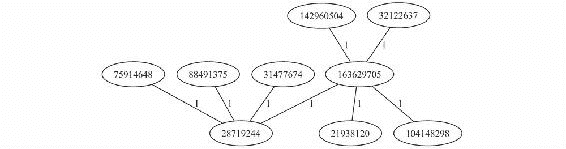
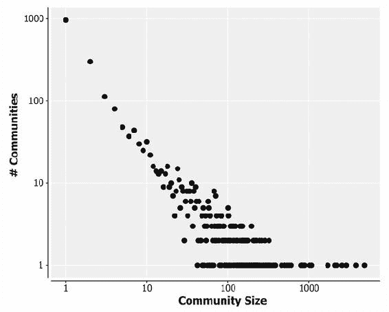

# 第八章 网络分析

|   | *"敌人的敌人就是我的朋友。"* |   |
| --- | --- | --- |
|   | --*古老的谚语* |

本章关注的是数学意义上的图，而非视觉意义上的图。图只是由顶点和边连接组成的集合，这种抽象的简洁性使得图无处不在。它们是各种结构的有效模型，包括网页的超链接结构、互联网的物理结构，以及各种网络：道路、通信、社交网络等。

因此，网络分析并不是什么新鲜事，但随着社交网络分析的兴起，它变得尤为流行。网络上最大的站点之一就是社交网络，Google、Facebook、Twitter 和 LinkedIn 都利用大规模图处理来挖掘用户数据。针对网站变现的精准广告需求使得公司在有效推断互联网用户兴趣方面获得了巨大的财务回报。

在本章中，我们将使用公开的 Twitter 数据来演示网络分析的原理。我们将应用如三角计数这样的模式匹配技术，在图中寻找结构，并应用如标签传播和 PageRank 这样的整体图处理算法，以揭示图的网络结构。最终，我们将使用这些技术从 Twitter 社区中最具影响力的成员识别出它们的兴趣。我们将使用 Spark 和一个名为 GraphX 的库来完成这些操作，GraphX 利用 Spark 分布式计算模型来处理非常大的图。

但在我们扩展规模之前，我们将通过考虑一种不同类型的问题来开始对图的探索：图遍历问题。为此，我们将使用 Clojure 库 Loom。

# 下载数据

本章使用来自 Twitter 社交网络的关注者数据。这些数据是作为斯坦福大规模网络数据集的一部分提供的。你可以从[`snap.stanford.edu/data/egonets-Twitter.html`](https://snap.stanford.edu/data/egonets-Twitter.html)下载 Twitter 数据。

我们将使用`twitter.tar.gz`文件和`twitter_combined.txt.gz`文件。这两个文件应该被下载并解压到示例代码的 data 目录中。

### 注意

本章的示例代码可在[`github.com/clojuredatascience/ch8-network-analysis`](https://github.com/clojuredatascience/ch8-network-analysis)找到。

如常所示，我们提供了一个脚本，可以为你完成这项工作。你可以通过在项目目录中执行以下命令来运行它：

```py
script/download-data.sh

```

如果你想运行本章的示例，请确保在继续之前下载数据。

## 检查数据

让我们来看一下 Twitter 目录中的一个文件，特别是`twitter/98801140.edges`文件。如果你在文本编辑器中打开它，你会看到文件的每一行都是由一对整数组成，并且它们之间用空格分隔。这些数据采用的是所谓的边列表格式。这是存储图的两种主要方式之一（另一种是邻接表格式，我们稍后会讲到）。下面的代码使用 Clojure 的`line-seq`函数逐行读取文件，并将其转换为元组：

```py
(defn to-long [l]
  (Long/parseLong l))

(defn line->edge [line]
  (->> (str/split line #" ")
       (mapv to-long)))

(defn load-edges [file]
  (->> (io/resource file)
       (io/reader)
       (line-seq)
       (map line->edge)))

(defn ex-8-1 []
  (load-edges "twitter/98801140.edges"))
```

如果你在 REPL 中执行`(ex-8-1)`，或在命令行中运行以下命令，你应该看到以下序列：

```py
lein run –e 8.1
;;([100873813 3829151] [35432131 3829151] [100742942 35432131]
;;  [35432131 27475761] [27475761 35432131])

```

这组简单的数字对，每个都表示一条边，已经足够表示图的本质。虽然不直观地看到边与边之间的关系，但我们可以通过可视化来帮助理解。

## 使用 Loom 可视化图形

在本章的前半部分，我们将使用 Loom（[`github.com/aysylu/loom`](https://github.com/aysylu/loom)）来处理我们的图形。Loom 定义了一个 API，用于创建和操作图形。它还包含许多内建的图遍历算法。我们很快会介绍这些。

首先，我们要可视化我们的图。为此，Loom 依赖于一个名为 GraphViz 的系统级库。如果你想复制本章中的许多图像，你需要先安装 GraphViz。如果你不确定是否已经安装，可以尝试在命令行中运行以下命令：

```py
dot –V

```

### 注意

GraphViz 可以从[`graphviz.org/`](http://graphviz.org/)下载，并且提供了适用于 Linux、MacOS 和 Windows 的安装程序。GraphViz 不是运行本章所有示例的必需工具，只是那些需要可视化图形的示例。

Loom 能够从一系列边创建图，就像我们在将`loom/graph`函数应用于该序列时所做的那样。接下来，我们将需要将`loom.graph`引用为`loom`，并将`loom.io`引用为`lio`。如果你安装了 GraphViz，可以运行以下示例：

```py
(defn ex-8-2 []
  (->> (load-edges "twitter/98801140.edges")
       (apply loom/graph)
       (lio/view)))
```

你应该看到类似以下示意图的结果：


根据你安装的 GraphViz 版本，你可能无法获得与之前版本完全相同的布局，但这没关系。图中节点和边的相对位置并不重要。图的唯一重要事实是哪些节点连接到哪些其他节点。

作为一个 Clojure 程序员，你熟悉树结构作为 S 表达式的嵌套结构，你可能已经注意到这个图看起来像一棵树。事实上，树只是图的一种特殊形式：它不包含环。我们称这样的图为**无环图**。

在这个图中，只有四条边，而在我们在第一个例子中看到的边列表中有五条边。这是因为边可以是有向的。它们从一个节点指向另一个节点。我们可以使用`loom/digraph`函数加载有向图：

```py
(defn ex-8-3 []
  (->> (load-edges "twitter/98801140.edges")
       (apply loom/digraph)
       (lio/view)))
```

这段代码生成了以下图像：


注意到为我们的边添加方向的行为已经从根本上改变了我们阅读图形的方式。特别是，图形显然不再是树形结构。有向图在我们希望表示某种操作由某个事物对另一个事物执行的情况下非常重要。

例如，在 Twitter 的社交图中，一个账户可以关注另一个账户，但这一行为不一定是互惠的。使用 Twitter 的术语，我们可以指一个账户的粉丝或朋友。关注表示出边，而朋友表示入边。例如，在之前的图中，账户 **382951** 有两个粉丝：账户 **35432131** 和 **100873813**。

现在节点 **27475761** 和 **35432131** 之间有两条边。这意味着可以从一个节点回到另一个节点。我们称之为一个环。像之前的图这样的图的技术术语是有向**环形**图。

### 注意

图中的一个环表示可以仅通过沿边的方向移动而返回到某个节点。如果图中没有这样的环路，那么图就被称为无环图。**有向无环图**（**DAG**）是许多层次结构或有序现象的模型，例如依赖关系图、家谱树和文件系统层次结构。

我们已经看到，图形可以是有向的或无向的。图形的第三种主要类型是**加权图**。可以将权重有用地关联到边上，以表示两个节点之间连接的强度。例如，如果图形表示社交网络，则两个账户之间的权重可能表示它们的连接强度（例如，它们的沟通频率）。

我们可以使用 `loom` 中的 `loom/weighted-graph` 或 `loom/weighted-digraph` 函数加载加权图：

```py
(defn ex-8-4 []
  (->> (load-edges "twitter/98801140.edges")
       (apply loom/weighted-digraph)
       (lio/view)))
```

我们的输入图形实际上并没有指定边的权重。Loom 的所有边的默认权重是**1**。


图形的另一个区别在于其顶点和边是否有类型，表示它们之间不同的实体或连接。例如，Facebook 图形包含多种类型的实体：特别是“页面”和“人”。人可以“点赞”页面，但不能“点赞”其他人。在异构图中，当类型为“A”的节点总是连接到类型为“B”的节点，而类型“A”的节点从不与其他类型的“A”节点连接时，这种图被称为**二分图**。二分图可以表示为两个不相交的集合，其中一个集合中的节点仅与另一个集合中的节点链接。

# 使用 Loom 进行图遍历

遍历算法关注的是以系统化的方式探索图形的方法。鉴于图形能够建模的现象种类繁多，这些算法可能有多种不同的用途。

我们将在接下来的几个章节中讨论一些最常见的任务，例如：

+   确定是否存在一条恰好经过每条边一次的路径

+   确定两个顶点之间的最短路径

+   确定连接所有顶点的最短树

如果所讨论的图表示的是一个快递员的送货路线，那么顶点可以代表交叉口。找到一条恰好经过每条边一次的路径，就是快递员在不返回或重复经过相同地址的情况下，走遍所有道路的方式。两个顶点之间的最短路径将是从一个地址到下一个送货地址的最有效路线。最终，连接所有顶点的最短树将是连接所有顶点的最有效方式：例如，可能是为每个交叉口铺设路边电力线。

## 昆士堡的七座桥

普鲁士的昆士堡（现在的俄罗斯加尔东格勒）坐落在普雷格尔河的两岸，包含两座大岛，这两座岛通过七座桥与彼此和大陆相连。昆士堡的七座桥是一个历史上著名的数学问题，它为图论奠定了基础，并预示了拓扑学的思想。普雷格尔这个名字稍后将在本章中再次出现。


这个问题是要找到一条穿越城市的路线，这条路线每座桥只经过一次且仅经过一次。岛屿不能通过除桥梁之外的任何路线到达，而且每座桥都必须完全经过；不能走到桥的一半然后转身，再从另一侧走过另一半（虽然这条路线不必从同一个地方开始和结束）。

欧拉意识到这个问题没有解：通过这些桥梁无法找到一条不重复的路线，这一难题促使了一个技术的发展，该技术通过数学严格性建立了这一断言。问题中唯一重要的结构是桥梁和陆地之间的连接。这个问题的本质可以通过将桥梁表示为图中的边来保留。


欧拉观察到（除了行走的起点和终点），一个人通过一条边进入一个顶点，并通过另一条边离开该顶点。如果每条边都恰好经过一次，那么每个节点的连接边数必须是偶数（其中一半是“向内”经过，另一半是“向外”经过）。

因此，要在图中存在欧拉巡回，所有节点（除了起始和结束节点外）必须有偶数条连接边。我们将连接边的数量称为节点的度数。确定图中是否存在欧拉巡回，实际上就是计算奇数度节点的数量。如果存在零个或两个奇数度的节点，则可以从图中构建欧拉巡回。以下函数利用了 Loom 提供的两个实用函数`out-degree`和`nodes`，来检查图中是否存在欧拉巡回：

```py
(defneuler-tour? [graph]
  (let [degree (partial loom/out-degree graph)]
    (->> (loom/nodes graph)
         (filter (comp odd? degree))
         (count)
         (contains? #{0 2}))))
```

在这段代码中，我们使用了 Loom 的`out-degree`函数来计算图中每个节点的度数。我们仅筛选出`奇数`度数的节点，并验证计数是否为`0`或`2`。如果是，则图中存在欧拉巡回。

# 广度优先和深度优先搜索

上面的示例在历史上很有意义，但在图遍历中更常见的需求是从图中的某个节点开始，查找图内的另一个节点。有几种方法可以解决这个问题。对于像我们的 Twitter 关注图这样的无权图，最常见的方法是广度优先搜索和深度优先搜索。

广度优先搜索从一个特定的顶点开始，然后搜索其每个邻居以查找目标顶点。如果没有找到该顶点，它会依次搜索每个邻居的邻居，直到找到顶点或整个图遍历完成为止。

下图展示了顶点被遍历的顺序，从上到下按层次从左到右进行：


Loom 包含了`loom.alg`命名空间中的多种遍历算法。我们将对之前一直在研究的 Twitter 关注者图执行广度优先搜索，为了方便起见，图再次被重复展示：


广度优先遍历作为`bf-traverse`函数提供。该函数将返回一个顶点序列，按照访问的顺序排列，这将帮助我们查看广度优先搜索是如何遍历图的：

```py
(defn ex-8-5 []
  (let [graph (->> (load-edges "twitter/98801140.edges")
                   (apply loom/digraph))]
    (alg/bf-traverse graph 100742942)))

;;(100742942 35432131 27475761 3829151)
```

我们正在使用`bf-traverse`函数执行图的遍历，起始节点为`100742942`。注意，响应中没有包含节点`100873813`。沿着边的方向无法遍历到此顶点。要到达顶点`100742942`，必须从该点开始。

另外，注意到`35432131`只列出了一次，尽管它与`27475761`和`3829151`都相连。Loom 实现的广度优先搜索在内存中维护了一个已访问节点的集合。一旦一个节点被访问，就不需要再访问它。

广度优先搜索的另一种替代方法是深度优先搜索。该算法立即向树的底部推进，并按照下图所示的顺序访问节点：


Loom 包括一个深度优先搜索，作为 `pre-traverse`：

```py
(defn ex-8-6 []
  (let [graph (->> (load-edges "twitter/98801140.edges")
                   (apply loom/digraph))]
    (alg/pre-traverse graph 100742942)))

;;(100742942 35432131 3829151 27475761)
```

深度优先搜索的优点在于它的内存需求远低于广度优先搜索，因为它不需要在每一层存储所有节点。这可能使得它在处理大型图时，内存消耗更少。

然而，根据具体情况，深度优先搜索或广度优先搜索可能更方便。例如，如果我们在遍历家谱，寻找一位在世的亲戚，我们可以假设那个人会在家谱的底部，那么深度优先搜索可能会更快找到目标。如果我们在寻找一位古老的祖先，那么深度优先搜索可能会浪费时间检查许多较近的亲戚，花费更长时间才能到达目标。

# 查找最短路径

前面介绍的算法逐个遍历图的每个节点，并返回一个懒加载的节点序列。它们适合用来演示两种主要的图结构导航方式。然而，常见的任务是寻找从一个顶点到另一个顶点的最短路径。这意味着我们只关心那些位于这两个节点之间的路径。

如果我们有一个无权图，比如前面提到的图，我们通常将距离计算为“跳数”：一跳是两个邻接节点之间的步长。最短路径将有最少的跳数。一般来说，广度优先搜索在这种情况下是一个更高效的算法。

Loom 实现了广度优先最短路径算法，作为 `bf-path` 函数。为了演示这一点，让我们加载一个更复杂的 Twitter 图：

```py
(defn ex-8-7 []
  (->> (load-edges "twitter/396721965.edges")
       (apply loom/digraph)
       (lio/view)))
```

这段代码生成了以下图：


让我们看看能否找出顶端和底端节点之间的最短路径：**75914648** 和 **32122637**。算法可能返回许多路径，但我们想找到通过 **28719244** 和 **163629705** 两个点的路径。这是经过的跳数最少的路径。

```py
(defn ex-8-8 []
  (let [graph (->> (load-edges "twitter/396721965.edges")
                   (apply loom/digraph))]
    (alg/bf-path graph 75914648 32122637)))

;;(75914648 28719244 163629705 32122637)
```

确实是这样。

### 注

Loom 还实现了一个双向广度优先最短路径算法，作为 `bf-path-bi`。它从源点和目的地同时开始搜索，在某些类型的图上，这种方法可以更快地找到最短路径。

如果图是加权图怎么办？在这种情况下，最少的跳数可能并不等于最短路径，因为该路径可能与较大的权重相关联。在这种情况下，Dijkstra 算法是一种用于查找两个节点之间最短代价路径的方法。该路径可能需要更多的跳数，但所经过的边的权重总和会是最低的：

```py
(defn ex-8-9 []
  (let [graph (->> (load-edges "twitter/396721965.edges")
                   (apply loom/weighted-digraph))]
    (-> (loom/add-edges graph [28719244 163629705 100])
        (alg/dijkstra-path 75914648 32122637))))

;;(75914648 28719244 31477674 163629705 32122637)
```

在这段代码中，我们将图加载为一个加权有向图，并将节点 `28719244` 和 `163629705` 之间的边的权重更新为 `100`。所有其他边的默认权重为 1。这会导致为最直接的路径分配一个非常高的成本，因此找到了一条替代路径。

Dijkstra 算法在路线寻找中尤为有价值。例如，如果图表示的是道路网络，最佳路线可能是通过主要道路，而不是走步数最少的路线。或者，根据一天中的时间和道路上的交通量，特定路线的成本可能会发生变化。在这种情况下，Dijkstra 算法可以随时确定最佳路线。

### 注意

一种名为**A\***（读作 A-star）的算法通过允许启发式函数优化了 Dijkstra 算法。它在 Loom 中实现为 `alg/astar-path`。启发式函数返回预期的目标成本。任何函数都可以作为启发式函数，只要它不会高估真实的成本。使用此启发式函数可以使 A\* 算法避免对图进行穷尽性搜索，从而大大加快速度。有关 A\* 算法的更多信息，请参考 [`en.wikipedia.org/wiki/A*_search_algorithm`](https://en.wikipedia.org/wiki/A*_search_algorithm)。

让我们继续考虑带权图，并探讨如何构建一棵树，以最短成本连接所有节点。这样的树被称为最小生成树。

## 最小生成树

借助前面提到的算法，我们考虑了如何在两点之间遍历图。然而，如果我们想发现一条连接图中所有节点的路径呢？在这种情况下，我们可以使用最小生成树。我们可以将最小生成树视为我们之前考虑的完全图遍历算法和最近看到的最短路径算法的结合体。

最小生成树特别适用于带权图。如果权重表示连接两个顶点的成本，最小生成树则找到连接整个图的最小成本。它们在诸如网络设计等问题中很有用。例如，如果节点表示办公室，而边的权重表示办公室之间电话线的费用，那么最小生成树将提供一组电话线路，以最低的总成本连接所有办公室。

Loom 实现的最小生成树使用了普里姆算法，并作为 `prim-mst` 函数提供：

```py
(defn ex-8-10 []
  (let [graph (->> (load-edges "twitter/396721965.edges")
                   (apply loom/weighted-graph))]
    (-> (alg/prim-mst graph)
        (lio/view))))
```

这将返回以下图表：



如果我们再次将顶点 **28719244** 和 **163629705** 之间的边更新为 100，我们将能够观察到它对最小生成树的影响：

```py
(defn ex-8-11 []
  (let [graph (->> (load-edges "twitter/396721965.edges")
                   (apply loom/weighted-graph))]
    (-> (loom/add-edges graph [28719244 163629705 100])
        (alg/prim-mst)
        (lio/view))))
```

这段代码返回以下图表：


该树已被重新配置，以绕过具有最高成本的边缘。

## 子图和连通分量

最小生成树只能为*连通*图指定，其中所有节点通过至少一条路径连接到其他所有节点。在图形不连通的情况下，显然无法构建最小生成树（尽管我们可以构建最小生成森林）。


如果一个图包含一组内部相连但彼此之间没有连接的子图，那么这些子图被称为连通分量。我们可以通过加载一个更复杂的网络来观察连通分量：

```py
(defn ex-8-12 []
  (->> (load-edges "twitter/15053535.edges")
       (apply loom/graph)
       (lio/view)))
```

这个示例生成了以下图像：


由于图形的布局，我们可以轻松看到存在三个连通分量，Loom 将通过 `connected-components` 函数为我们计算这些分量。我们将在本章稍后看到如何实现一个算法来为我们自己计算这个：

```py
(defn ex-8-13 []
  (->> (load-edges "twitter/15053535.edges")
       (apply loom/graph)
       (alg/connected-components)))

;;[[30705196 58166411] [25521487 34173635 14230524 52831025 30973
;; 55137311 50201146 19039286 20978103 19562228 46186400
;;14838506 14596164 14927205] [270535212 334927007]]
```

如果一个有向图从每个节点到每个其他节点都有路径，那么它是强连通的。如果一个有向图仅将所有边视为无向边时，从每个节点到每个其他节点有路径，则它是弱连通的。


让我们将相同的图加载为有向图，以查看是否存在任何强连通分量：

```py
(defn ex-8-14 []
  (->> (load-edges "twitter/15053535.edges")
       (apply loom/digraph)
       (lio/view)))
```

这个示例生成了以下图像：


如前所述，存在三个弱连通分量。仅通过观察图形，确定有多少个强连通分量是相当困难的。Kosaraju 算法将计算图中强连通分量的数量。它由 Loom 实现为 `alg/scc` 函数：

```py
(defn ex-8-15 []
  (->> (load-edges "twitter/15053535.edges")
       (apply loom/digraph)
       (alg/scc)
       (count)))

;; 13
```

Kosaraju 算法利用了一个有趣的性质，即转置图——即所有边都被反转的图——与输入图具有完全相同数量的连通分量。响应包含所有强连通分量（即使是仅包含一个节点的退化情况），作为序列向量。如果按长度降序排序，第一个分量将是最大的：

```py
(defn ex-8-16 []
  (->> (load-edges "twitter/15053535.edges")
       (apply loom/digraph)
       (alg/scc)
       (sort-by count >)
       (first)))

;;[14927205 14596164 14838506]
```

最大的强连通分量仅包含三个节点。

## SCC 和网页的蝴蝶结结构

弱连通和强连通分量提供了一种了解有向图结构的有益方式。例如，关于互联网链接结构的研究表明，强连通分量可以非常大。

### 注意

以下数字引用的论文可以在线访问 [`www9.org/w9cdrom/160/160.html`](http://www9.org/w9cdrom/160/160.html)。

尽管以下数字来源于 1999 年进行的一项研究，因此已经非常过时，但我们可以看到，在网络的中心有一个大型的强连通分量，由 5600 万页面组成。这意味着从强连通分量中的任何页面出发，只能通过跟随外向超链接来访问强连通分量中的任何其他页面。


4400 万页面链接到强连通分量（SCC）中，但没有从中链接出去，另外 4400 万页面从 SCC 中链接出去，但没有再链接回去。只有极少数链接完全绕过了 SCC（前面插图中的“管道”）。

# 整体图分析

让我们把注意力从之前处理的较小图转向更大的图，即由`twitter_combined.txt`文件提供的关注者图。该文件包含超过 240 万个边，并将提供一个更有趣的样本来处理。

衡量一个图的最简单指标之一是它的密度。对于有向图，密度定义为边数 *|E|* 除以顶点数 *|V|* 乘以比自身少 1 的数。


对于一个连通图（每个顶点通过边与其他每个顶点相连），其密度为 1。相比之下，一个断开图（没有边的图）密度为 0。Loom 实现了图的密度计算函数 `alg/density`。我们来计算一下更大 Twitter 图的密度：

```py
(defn ex-8-17 []
  (->> (load-edges "twitter_combined.txt")
       (apply loom/digraph)
       (alg/density)
       (double)))

;; 2.675E-4
```

这看起来很稀疏，但请记住，值为 1 意味着每个账户都关注每个其他账户，而这显然不是社交网络的情况。一些账户可能有很多连接，而另一些账户则可能完全没有连接。

让我们看看边如何在节点之间分布。我们可以重用 Loom 的`out-degree`函数来统计每个节点的外向边数，并使用以下代码绘制分布的直方图：

```py
(defn ex-8-18 []
  (let [graph (->> (load-edges "twitter_combined.txt")
                   (apply loom/digraph))
        out-degrees (map #(loom/out-degree graph %)
                         (loom/nodes graph))]
    (-> (c/histogram out-degrees :nbins 50
                     :x-label "Twitter Out Degrees")
        (i/view))))
```

这将生成以下直方图：


出度分布看起来很像我们在第二章中首次遇到的*指数分布*。请注意，大多数账户的出度非常少，但有少数账户的出度超过了一千。

让我们也绘制一下入度的直方图。在 Twitter 中，入度对应于一个账户拥有的粉丝数量。


入度的分布更为极端：尾部延伸得比之前的直方图更远，第一根柱状比之前还要高。这对应于大多数账户粉丝非常少，但少数账户粉丝超过几千。

将之前的直方图与生成的随机图的度数分布进行对比。接下来，我们使用 Loom 的`gen-rand`函数生成一个包含 10,000 个节点和 1,000,000 条边的随机图：

```py
(defn ex-8-20 []
  (let [graph (generate/gen-rand (loom/graph) 10000 1000000)
        out-degrees (map #(loom/out-degree graph %)
                         (loom/nodes graph))]
    (-> (c/histogram out-degrees :nbins 50
                     :x-label "Random out degrees")
        (i/view))))
```

这段代码生成以下直方图：


随机图显示，连接一万个顶点和一百万条边的图的平均外度数大约为 200。度数的分布大致符合正态分布。显然，Twitter 图并不是通过随机过程生成的。

# 无标度网络

Twitter 的度数直方图呈现出幂律度分布的特点。与常规分布的随机生成图不同，Twitter 的直方图显示出少数顶点连接到大量的边。

### 注意

“无标度网络”这一术语是由圣母大学的研究人员在 1999 年提出，用以描述他们在万维网中观察到的结构。

在模拟人类互动的图中，我们经常会观察到一种连接的幂律现象。这也被称为**Zipf**定律，它揭示了所谓的“优先连接法则”，即受欢迎的顶点更容易发展出更多的连接。社交媒体网站是这一过程的典型例子，新的用户往往会关注已经受欢迎的用户。

在第二章中，*推断*部分，我们通过在对数-线性坐标轴上绘制数据并寻找直线来识别指数分布。我们可以通过在对数-对数坐标轴上寻找直线，最容易地确定幂律关系：

```py
(defn ex-8-21 []
  (let [graph (->> (load-edges "twitter_combined.txt")
                   (apply loom/digraph))
        out-degrees (map #(loom/out-degree graph %)
                         (loom/nodes graph))
        points (frequencies out-degrees)]
    (-> (c/scatter-plot (keys points) (vals points))
        (c/set-axis :x (c/log-axis :label "log(out-degree)"))
        (c/set-axis :y (c/log-axis :label "log(frequency)"))
        (i/view))))
```

这段代码返回以下图形：


尽管并非完全线性，但前面的图表足以表明 Twitter 图中存在幂律分布。如果我们可视化图中的节点与边之间的连接，无标度网络将因其典型的“聚集”形状而显现出来。受欢迎的顶点通常会围绕着一圈其他顶点。


将计算扩展到完整的 Twitter 合并数据集导致之前的示例运行速度显著变慢，尽管与许多社交网络相比，这个图形非常小。本章的其余部分将介绍一个基于 Spark 框架的图形库，叫做**GraphX**。GraphX 表达了本章已介绍的许多算法，但能够利用 Spark 的分布式计算模型来处理更大规模的图形。

# 使用 GraphX 进行分布式图计算

GraphX ([`spark.apache.org/graphx/`](https://spark.apache.org/graphx/)) 是一个为与 Spark 配合使用而设计的分布式图处理库。像我们在前一章中使用的 MLlib 库一样，GraphX 提供了一组基于 Spark RDD 的抽象。通过将图的顶点和边表示为 RDD，GraphX 能够以可扩展的方式处理非常大的图。 

在前面的章节中，我们已经了解了如何使用 MapReduce 和 Hadoop 处理大规模数据集。Hadoop 是一种数据并行系统：数据集被分成若干组并行处理。Spark 同样是一个数据并行系统：RDD 被分布在集群中并行处理。


数据并行系统适合在数据呈现表格形式时进行数据处理扩展。图形可能具有复杂的内部结构，不适合作为表格来表示。虽然图形可以表示为边列表，但正如我们所见，以这种方式存储的图形在处理时可能涉及复杂的连接操作和过度的数据传输，因数据之间的紧密联系。

图数据的规模和重要性的增长推动了众多新的图并行系统的发展。通过限制可表达的计算类型并引入图的分区和分布技术，这些系统能够比一般的数据并行系统更高效地执行复杂的图算法，速度提高了几个数量级。

### 注意

有几个库将图并行计算引入 Hadoop，包括 Hama ([`hama.apache.org/`](https://hama.apache.org/)) 和 Giraph ([`giraph.apache.org/`](http://giraph.apache.org/))。

GraphX 库将图并行计算引入 Spark。使用 Spark 作为图处理引擎的一个优点是，其内存计算模型非常适合许多图算法的迭代特性。


该图展示了在节点可能相互连接的情况下并行处理图形的挑战。通过在图拓扑结构内处理数据，GraphX 避免了过多的数据移动和冗余。GraphX 通过引入弹性分布式图（Resilient Distributed Graph，简称 RDG）扩展了 Spark 的 RDD 抽象，并提供了一组用于查询和转换图形的函数，这些函数能够以结构化感知的方式处理图形。

## 使用 Glittering 创建 RDG

Spark 和 GraphX 是主要用 Scala 编写的库。在本章中，我们将使用 Clojure 库 Glittering ([`github.com/henrygarner/glittering`](https://github.com/henrygarner/glittering)) 来与 GraphX 交互。就像 Sparkling 为 Spark 提供了一个简洁的 Clojure 包装器一样，Glittering 也为 GraphX 提供了一个简洁的 Clojure 包装器。

我们的第一个任务是创建一个图。图可以通过两种方式实例化：一种是提供两个 RDD 表示（一个包含边，另一个包含顶点），另一种是仅提供一个边的 RDD。如果仅提供边，则需要为每个节点提供一个默认值。接下来我们将看到如何实现这一点。

由于 GraphX 利用 Spark，每个作业都需要一个关联的 Spark 上下文。在上一章中，我们使用了 Sparkling 的`spakling.conf/conf`默认配置。然而，在本章中，我们将使用 Glittering 提供的默认配置。Glittering 在 Sparkling 的默认设置基础上，添加了序列化和反序列化 GraphX 类型所需的配置。在以下代码中，我们将包含`glittering.core`作为`g`，并使用 Glittering 的图构造函数创建一个只有三条边的小图：

```py
 (defn ex-8-22 []
  (spark/with-context sc (-> (g/conf)
                             (conf/master "local")
                             (conf/app-name "ch8"))
    (let [vertices [[1 "A"] [2 "B"] [3 "C"]]
          edges [(g/edge 1 2 0.5)
                 (g/edge 2 1 0.5)
                 (g/edge 3 1 1.0)]]
      (g/graph (spark/parallelize sc vertices)
               (spark/parallelize sc edges)))))

;; #<GraphImpl org.apache.spark.graphx.impl.GraphImpl@adb2324>
```

结果是一个 GraphX 图对象。请注意，边是通过`g/edges`的 RDD 提供的：`g/edge`函数将根据源 ID、目标 ID 和可选的边属性创建一个边类型。边的属性可以是 Spark 可以序列化的任何对象。注意，顶点也可以有属性（例如前面示例中的"A"、"B"和"C"）。

构造图的另一种方法是使用`g/graph-from-edges`构造函数。这将仅根据边的 RDD 返回一个图。Twitter 数据以边列表格式提供，因此我们将使用此函数加载它。在接下来的代码中，我们将加载完整的`twitter_combined.txt`文本文件，并通过映射文件中的每一行来创建一个边列表。从每一行，我们将创建一个权重为 1.0 的边：

```py
(defn line->edge [line]
  (let [[from to] (map to-long (str/split line #" "))]
    (g/edge from to 1.0)))

(defn load-edgelist [sc path]
  (let [edges (->> (spark/text-file sc path)
                   (spark/map line->edge))]
    (g/graph-from-edges edges 1.0)))

(defn ex-8-23 []
  (spark/with-context sc (-> (g/conf)
                             (conf/master "local")
                             (conf/app-name "ch8"))
    (load-edgelist sc "data/twitter_combined.txt")))

;;#<GraphImpl org.apache.spark.graphx.impl.GraphImpl@c63044d>
```

`graph-from-edges`函数的第二个参数是每个顶点属性的默认值：在边列表中无法提供顶点属性。

## 使用三角计数衡量图的密度

GraphX 自带了一些内置的图算法，Glittering 将其提供在`glittering.algorithms`命名空间中。在详细介绍 Glittering 的 API 之前，让我们在 Twitter 关注图上运行其中一个算法。我们将展示如何使用 Glittering 创建一个简单的图处理作业，然后展示如何使用更多 Glittering 的 API，结合 GraphX 的图并行原语，自己实现算法。

三角计数是一种算法，用来衡量图中每个节点附近的密度。它在原理上类似于计算度数，但还考虑了邻居之间的连接情况。我们可以用这个非常简单的图来形象化这个过程：


在这个例子中，我们可以看到顶点 A、B 和 C 都参与了一个三角形，而顶点 D 则没有参与。B 和 C 都跟随 A，但 C 也跟随 B。在社交网络分析的背景下，三角形计数是衡量朋友的朋友是否相互认识的指标。在紧密的社区中，我们预计三角形的数量会很高。

三角形计数已经在 GraphX 中实现，并可以作为 `glittering.algorithms` 命名空间中的 `triangle-count` 函数访问。在使用这个特定的算法之前，GraphX 要求我们做两件事：

1.  将边指向“标准”方向。

1.  确保图被划分。

这两个步骤都是 GraphX 中三角形计数实现的副产品。GraphX 允许两个顶点之间有多个边，但三角形计数只计算不同的边。前两个步骤确保 GraphX 能够在执行算法之前高效地计算出不同的边。

边的标准方向始终是从较小的节点 ID 指向较大的节点 ID。我们可以通过确保在首次构建边 RDD 时所有边都按照这个方向创建来实现这一点：

```py
(defn line->canonical-edge [line]
  (let [[from to] (sort (map to-long (str/split line #" ")))]
    (glitter/edge from to 1.0)))

(defn load-canonical-edgelist [sc path]
  (let [edges (->> (spark/text-file sc path)
                   (spark/map line->canonical-edge))]
    (glitter/graph-from-edges edges 1.0)))
```

通过在创建边之前先对 `from` 和 `to` ID 进行排序，我们确保 `from` ID 总是小于 `to` ID。这是使去重更高效的第一步。第二步是为图选择一个划分策略。下一节将描述我们的选择。

### GraphX 划分策略

GraphX 是为分布式计算而构建的，因此必须将图划分到多个机器上。通常，在划分图时，您可以采取两种方法：'边切割'和'顶点切割'方法。每种方法都有不同的权衡。


边切割策略可能看起来是划分图的最“自然”方式。通过沿着边划分图，它确保每个顶点都被分配到一个分区，并通过灰色阴影表示出来。然而，这对于表示跨分区的边会产生问题。任何沿边进行的计算都必然需要从一个分区发送到另一个分区，而最小化网络通信是实现高效图算法的关键。

GraphX 实现了“顶点切割”方法，确保边被分配到分区，并且顶点可以跨分区共享。这似乎只是将网络通信转移到图的另一个部分——从边转移到顶点——但是 GraphX 提供了多种策略，允许我们确保顶点以最适合我们想要应用的算法的方式进行划分。

Glittering 提供了`partition-by`函数，该函数接受一个表示划分图策略的关键字。接受的值有`:edge-partition-1d`、`:edge-partition-2d`、`:canonical-random-vertex-cut`和`:random-vertex-cut`。

你选择使用哪个划分策略取决于图的结构和你将应用的算法。`:edge-partition-1d`策略确保所有具有相同源的边被划分到一起。这意味着按源节点聚合边的操作（例如，计数出边）将所有所需的数据都集中在单台机器上。虽然这样可以最小化网络流量，但也意味着在幂律图中，少数几个分区可能会收到整体边数的相当大一部分。

`:random-vertex-cut`划分策略根据源节点和目标节点将图形划分为边。这有助于创建更平衡的分区，但以运行时性能为代价，因为单一的源或目标节点可能会分布到集群中的多个机器上。即使是连接相同节点对的边，也可能根据边的方向分布在两台机器上。为了忽略方向而对边进行分组，我们可以使用`:canonical-random-vertex-cut`。

最后，`:edge-partition-2d`通过源节点和目标节点使用更复杂的划分策略来划分边。与`:canonical-random-vertex-cut`一样，共享源节点和目标节点的节点将被一起划分。此外，该策略对每个节点可能分布的分区数量设置了上限。当一个算法汇总共享源节点和目标节点的边的信息，以及源或目标节点的独立信息时，这可能是最有效的策略。

## 运行内建的三角形计数算法

我们已经看过如何以标准方向加载边。下一步是选择一个划分策略，我们将选择`:random-vertex-cut`。以下示例展示了加载和划分图形的完整过程，执行三角形计数并使用 Incanter 可视化结果：

```py
(defn ex-8-24 []
  (spark/with-context sc (-> (g/conf)
                             (conf/master "local")
                             (conf/app-name "ch8"))
    (let [triangles (->> (load-canonical-edgelist
                          sc "data/twitter_combined.txt")
                         (g/partition-by :random-vertex-cut)
                         (ga/triangle-count)
                         (g/vertices)
                         (to-java-pair-rdd)
                         (spark/values)
                         (spark/collect)
                         (into []))
          data (frequencies triangles)]
      (-> (c/scatter-plot (keys data) (vals data))
          (c/set-axis :x (c/log-axis :label "# Triangles"))
          (c/set-axis :y (c/log-axis :label "# Vertices"))
          (i/view)))))
```

`triangle-count`的输出是一个新图，其中每个顶点的属性是该顶点参与的三角形数量。顶点的 ID 保持不变。我们只关心三角形计数本身——返回图的顶点属性——因此我们从顶点中提取`values`。`spark/collect`函数将所有值收集到一个 Clojure 序列中，因此我们不希望在非常大的图上执行此操作。

在收集到三角形计数后，我们计算每个计数的频率，并使用 Incanter 在对数-对数散点图上可视化结果。输出如下所示：


我们再次看到了幂律分布的影响。少数节点连接了大量的三角形。

运行内置算法让我们了解了如何创建和操作图，但 GraphX 的真正力量在于它如何让我们以高效的方式自己表达这种计算。在下一部分，我们将看到如何使用底层函数实现三角形计数。

## 用 Glittering 实现三角形计数

计数图中三角形的方式有很多种，但 GraphX 以以下方式实现算法：

1.  计算每个顶点的邻居集合。

1.  对于每条边，计算两端顶点的交点。

1.  将交集的计数发送到两个顶点。

1.  计算每个顶点的计数总和。

1.  除以二，因为每个三角形被计算了两次。

以下图示展示了我们简单图中只包含一个三角形的步骤：


算法忽略边的方向，正如前面提到的，它要求任意两个节点之间的边是唯一的。因此，我们将继续在上一部分定义的规范边的分区图上工作。

执行三角形计数的完整代码并不长，所以下文将完整展示。它代表了我们在本章其余部分将要介绍的大多数算法，因此，在展示代码之后，我们将逐步讲解每一个步骤：

```py
(defn triangle-m [{:keys [src-id src-attr dst-id dst-attr]}]
  (let [c (count (set/intersection src-attr dst-attr))]
    {:src c :dst c}))

(defn triangle-count [graph]
  (let [graph (->> (g/partition-by :random-vertex-cut graph)
                   (g/group-edges (fn [a b] a)))
        adjacent (->> (g/collect-neighbor-ids :either graph)
                      (to-java-pair-rdd)
                      (spark/map-values set))
        graph (g/outer-join-vertices
               (fn [vid attr adj] adj) adjacent graph)
        counters (g/aggregate-messages triangle-m + graph)]
    (->> (g/outer-join-vertices (fn  [vid vattr counter]
                                  (/ counter 2))
                                counters graph)
         (g/vertices))))
```

为了使算法正常工作，输入图必须具有不同的边。一旦规范图被划分，我们通过在图上调用`(g/group-edges (fn [a b] a) graph)`来确保边是唯一的。`group-edges`函数类似于`reduce`，它对共享相同起始节点和结束节点的边集合进行归约。我们仅选择保留第一条边。边的属性在三角形计数中并不起作用，重要的是存在一条边。

### 步骤一——收集邻居 ID

在步骤一，我们想要收集每个顶点的邻居 ID。Glittering 提供了作为`g/collect-neighbor-ids`函数的这个操作。我们可以选择只收集传入或传出的边，分别使用`:in`或`:out`，或者收集任一方向的边，使用`:either`。

`g/collect-neighbor-ids`函数返回一个对 RDD，键是相关的顶点 ID，值是邻居 ID 的序列。像上一章的 MLlib 一样，RDD 不是 Sparkling 所期望的 `JavaRDD` 类，因此我们必须进行相应的转换。完成转换后，将邻居 ID 序列转换为集合就像在对 RDD 中的每个值调用`set`一样简单。步骤一的结果是一个包含节点 ID 和邻居 ID 集合的 PairRDD，因此我们已经将图转换为一系列以 `adjacent` 为值存储的集合。

### 注意

这种图表示方式作为一组连接顶点的集合，通常称为邻接列表。与边列表一起，它是表示图的两种主要方式之一。

第二步要求我们给图的边分配值，因此我们需要保留图的结构。我们使用 `g/outer-join-vertices` 函数将 `adjacent` 和原始图合并。给定一个图和一个按顶点 ID 索引的对 RDD，`outer-join-vertices` 允许我们提供一个函数，其返回值将被分配为图中每个顶点的属性。该函数接收三个参数：顶点 ID、当前顶点属性和与顶点 ID 在被外连接到图的对 RDD 中关联的值。在之前的代码中，我们返回了邻接顶点集作为新的顶点属性。

### 第二、三、四步 – 聚合消息

接下来的几个步骤由一个函数`g/aggregate-messages`处理，这是 GraphX 图并行实现的核心函数。它需要两个参数：一个消息发送函数和一个消息合并函数。通过它们的协同工作，这两个函数类似于为图并行计算中的顶点中心视图适配的 map 和 reduce。


发送消息函数负责沿边发送消息。该函数每次为每条边调用一次，但可以向源顶点或目标顶点发送多个消息。该函数的输入是一个三元组（包含两个连接顶点的边），并返回一组消息。消息是一个键值对，其中键是 `:src` 或 `:dst` 之一，值是要发送的消息。在前面的示例中，这是通过使用 `:src` 和 `:dst` 键实现的映射。

合并消息函数负责合并特定顶点的所有消息。在之前的代码中，每条消息是一个数字，因此合并函数有一组数字需要合并。我们可以简单地通过将 `+` 作为合并函数来实现这一点。

### 第五步 – 除以计数

三角形计数的最终步骤是将我们为每个顶点 ID 计算出的计数除以二，因为每个三角形被计算了两次。在之前的代码中，我们在更新顶点属性时，同时使用 `outer-join-vertices` 来执行此操作，更新的顶点属性为三角形计数。

## 运行自定义三角形计数算法

在前面所有步骤都完成后，我们可以使用 Glittering 运行自定义的三角形计数算法。我们先在章节开头的一个 Twitter 关注图上运行它，看看我们得到的结果：

```py
(defn ex-8-25 []
  (spark/with-context sc (-> (g/conf)
                             (conf/master "local")
                             (conf/app-name "triangle-count"))
    (->> (load-canonical-edgelist
          sc "data/twitter/396721965.edges")
         (triangle-count)
         (spark/collect)
         (into []))))

;; #sparkling/tuple [21938120 1] #sparkling/tuple [31477674 3]
;; #sparkling/tuple [32122637 0] ...]
```

结果是一个元组序列，顶点 ID 作为键，连接的三角形数量作为值。

如果我们想知道整个 Twitter 数据集中有多少个三角形，我们可以从结果图中提取值（这些值），将它们加起来，然后除以三。我们现在就来做这个：

```py
(defn ex-8-26 []
  (spark/with-context sc (-> (g/conf)
                             (conf/master "local")
                             (conf/app-name "triangle-count"))
    (let [triangles (->> (load-canonical-edgelist
                          sc "data/twitter_combined.txt")
                         (triangle-count)
                         (to-java-pair-rdd)
                         (spark/values)
                         (spark/reduce +))]
      (/ triangles 3))))
```

该算法运行不应该太长时间。我们自定义的三角形计数代码足够高效，可以在整个合并的 Twitter 数据集上运行。

如果 `aggregate-messages` 类似于 MapReduce 编程的单步操作，我们通常会反复执行它。许多图算法会希望运行到收敛。实际上，GraphX 提供了一种替代函数，我们在这种情况下可以使用它，叫做 **Pregel API**。我们将在下一节中详细讨论它。

## Pregel API

Pregel API 是 GraphX 表达自定义、迭代、图并行计算的主要抽象。它以谷歌内部运行大规模图处理的系统命名，谷歌在 2010 年发布了关于该系统的论文。你可能还记得，这也是建设在 Königsberg 镇上的那条河流。

谷歌的 Pregel 论文推广了“像顶点一样思考”的图并行计算方法。Pregel 的模型本质上使用了图中顶点之间的消息传递，组织成一系列称为 **超级步骤** 的步骤。在每个超级步骤开始时，Pregel 在每个顶点上运行用户指定的函数，传递在前一个超级步骤中发送给它的所有消息。顶点函数有机会处理每一条消息，并将消息发送到其他顶点。顶点还可以“投票终止”计算，当所有顶点都投票终止时，计算将结束。

Glittering 实现的 `pregel` 函数采用了与图处理非常相似的方法。主要的区别是顶点不会投票终止：计算将在没有消息发送或超过指定迭代次数时终止。

虽然上一节中介绍的 aggregate-messages 函数使用了两个互补的函数来表达其意图，但 `pregel` 函数使用了三个相关的函数，迭代地应用于图算法。前两个是我们之前遇到的消息函数和消息合并器，第三个是“顶点程序”：一个处理每个顶点接收消息的函数。该函数的返回值将作为下一个超级步骤的顶点属性。

让我们通过实现本章已讲解的一个算法：**连通组件**，来实际看看`pregel`函数是如何工作的。

## 使用 Pregel API 处理连通组件

连通组件可以用以下方式表示为迭代算法：

1.  初始化所有顶点属性为顶点 ID。

1.  对于每条边，确定源顶点或目标顶点属性中的最小值。

1.  沿着每条边，将两个属性中较小的一个发送到对面的顶点。

1.  对于每个顶点，将其属性更新为传入消息中的最小值。

1.  重复直到节点属性不再变化。

如之前所示，我们可以在一个简单的四节点图上可视化这个过程。


我们可以看到，经过六个步骤，图已收敛到一个状态，其中所有节点的属性都为最低的连通顶点 ID。由于消息仅沿着边传递，任何没有共享边的节点将会收敛到不同的值。因此，算法收敛后，所有共享相同属性的顶点将属于同一连通分量。首先让我们看看完成的代码，然后我们会立即按步骤讲解代码：

```py
(defn connected-component-m [{:keys [src-attr dst-attr]}]
  (cond
    (< src-attr dst-attr) {:dst src-attr}
    (> src-attr dst-attr) {:src dst-attr}))

(defn connected-components [graph]
  (->> (glitter/map-vertices (fn [id attr] id) graph)
       (p/pregel {:vertex-fn (fn [id attr msg]
                               (min attr msg))
                  :message-fn connected-component-m
                  :combiner min})))
```

使用`g/pregel`函数是实现迭代连通分量算法所需要的全部。

### 第一步 – 映射顶点

初始化所有顶点属性为顶点 ID 的操作是由`g/map-vertices`函数在`pregel`函数之外处理的。我们传递给它一个包含两个参数的函数，分别是顶点 ID 和顶点属性，它返回需要分配为顶点属性的顶点 ID。

### 第二步和第三步 – 消息函数

Glittering 的`pregel`函数期望接收一个至少指定了三个函数的映射：消息函数、合并器函数和顶点函数。我们稍后将更详细地讨论最后一个函数。然而，第一个函数负责第二步和第三步：对于每条边，确定哪个连接节点具有较低的属性，并将此值发送到对方节点。

我们在本章早些时候介绍了消息函数以及自定义的三角形计数函数。此函数接收边作为映射，并返回描述将要发送的消息的映射。这一次，仅发送一条消息：如果源属性较低，则将`src-attr`属性发送到目标节点；如果目标属性较低，则将`dst-attr`属性发送到源节点。

合并器函数聚合所有传入顶点的消息。对于连通分量的合并器函数，简单地使用`min`函数：我们只关心发送给每个顶点的最小值。

### 第四步 – 更新属性

在第四步中，每个顶点将其属性更新为当前属性和所有接收到的消息中的最小值。如果任何传入消息低于当前属性，它将更新其属性为最小值。此步骤由顶点程序处理，这是 Pregel 的三个共生函数中的第三个。

连通分量的顶点函数也很简单：对于每个顶点，我们希望返回当前顶点属性和所有接收到的消息中的最低值（由上一步骤的合并器函数确定）。返回值将作为下一次超级步骤中的顶点属性使用。

### 第五步 – 迭代直到收敛

第五步是通过 `pregel` 函数免费获得的。我们没有指定最大迭代次数，因此刚才描述的三个函数将会重复运行，直到没有更多消息需要发送。因此，（出于效率考虑）重要的是我们的消息函数只在必要时发送消息。这就是为什么我们之前消息函数中的 `cond` 值确保如果源和目标属性已经相等，我们就不会发送消息。

## 运行连接组件

在实现了之前的连接组件函数后，我们将在以下示例中使用它：

```py
 (defn ex-8-27 []
  (spark/with-context sc (-> (g/conf)
                             (conf/master "local")
                             (conf/app-name "cljds.ch8"))
    (->> (load-edgelist sc "data/twitter/396721965.edges")
         (connected-components)
         (g/vertices)
         (spark/collect)
         (into []))))

;; [#sparkling/tuple [163629705 21938120] #sparkling/tuple
;; [88491375 21938120] #sparkling/tuple [142960504 21938120] ...
```

通过将图转换回 RDD，我们可以以数据并行的方式进行分析。例如，我们可以通过计算共享相同属性的节点数来确定所有连接组件的大小。

## 计算最大连接组件的大小

在下一个示例中，我们将使用相同的连接组件函数，但计算每个连接组件的大小。我们将通过 Sparkling 的 `count-by-value` 函数来实现：

```py
(defn ex-8-28 []
  (spark/with-context sc (-> (g/conf)
                             (conf/master "local")
                             (conf/app-name "ch8"))
    (->> (load-canonical-edgelist
          sc "data/twitter_combined.txt")
         (connected-components)
         (g/vertices)
         (to-java-pair-rdd)
         (spark/values)
         (spark/count-by-value)
         (into []))))

;; [[12 81306]]
```

像前面示例中那样的代码是使用 GraphX 和 Glittering 的巨大好处之一。我们可以将表示为边列表的平面数据转换成图结构，以执行迭代图算法，然后将结果转换回平面结构以计算聚合：所有操作都在一个管道中完成。

示例的响应表明，所有的顶点——81,306 个——都在一个大的连接组件中。这表明图中的每个人都与其他人相连，无论是朋友还是关注者。

虽然知道没有孤立的用户群体很有用，但理解用户在连接组件中的组织方式会更有趣。如果某些用户群体之间的连接更加密集，那么我们可以认为这些用户形成了一个社区。

## 使用标签传播检测社区

社区可以非正式地定义为一组顶点，这些顶点之间的连接比与社区外部顶点的连接要强得多。

### 注意

如果每个顶点都与社区中的其他每个顶点相连，那么我们将称这个社区为团体（clique）。

因此，社区对应于图中的密度增加。我们可以将 Twitter 网络中的社区视为关注者群体，这些群体也倾向于关注彼此的关注者。较小的社区可能对应于友谊小组，而较大的社区更可能对应于共享兴趣小组。

社区检测是一种通用技术，有许多算法能够识别社区。根据算法的不同，社区可能会重叠，这样一个用户可能会关联到多个社区。我们接下来要看的算法叫做**标签传播**，它将每个用户分配到最多一个社区。

标签传播可以通过以下步骤进行迭代实现：

1.  将所有顶点属性初始化为顶点 ID。

1.  对于每条边，发送源顶点和目标顶点的属性到对方节点。

1.  对于每个顶点，计算每个传入属性的频率。

1.  对于每个顶点，更新属性为传入属性中最频繁的那个。

1.  重复进行，直到收敛或达到最大迭代次数。

算法的步骤接下来展示在一个包含两个社区的图中。每个社区也是一个团体，但这并不是标签传播有效的必要条件。


使用`pregel`函数进行标签传播的代码如下：

```py
(defn label-propagation-v [id attr msg]
  (key (apply max-key val msg)))

(defn label-propagation-m [{:keys [src-attr dst-attr]}]
  {:src {dst-attr 1}
   :dst {src-attr 1}})

(defn label-propagation [graph]
  (->> (glitter/map-vertices (fn [vid attr] vid) graph)
       (p/pregel {:message-fn label-propagation-m
                  :combiner (partial merge-with +)
                  :vertex-fn label-propagation-v
                  :max-iterations 10})))
```

如前所述，让我们一步步解析代码。

### 第一步 – 映射顶点

标签传播的第一步与我们之前定义的连通组件算法的第一步相同。我们使用`g/map-vertices`函数来更新每个顶点的属性，使其等于顶点 ID。

### 第二步 – 发送顶点属性

在第二步中，我们沿每条边发送对方顶点的属性。第三步将要求我们统计所有传入属性中最频繁的那个，因此每条消息都是一个将属性映射到值“1”的映射。

### 第三步 – 聚合值

合并函数接收顶点的所有消息，并生成一个聚合值。由于消息是属性值到数字“1”的映射，我们可以使用 Clojure 的`merge-with`函数将消息合并，并使用`+`运算符。结果将是一个属性到频率的映射。

### 第四步 – 顶点函数

第四步由顶点函数处理。给定所有传入属性的频率计数，我们需要选择最频繁的一个。`(apply max-key val msg)`表达式返回与最大值（即最高频率）关联的键/值对。我们将此值传递给`key`，以返回与该值关联的属性。

### 第五步 – 设置最大迭代次数

与连通组件算法一样，当还有消息需要发送时，`pregel`函数的默认行为是迭代。不同于连通组件算法的是，在之前的`message`函数中我们没有条件语句。为了避免无限循环，我们在`pregel`的选项映射中传递了`:max-iterations`的值为 10。

## 运行标签传播

以下示例利用之前的代码在完整的 Twitter 数据集上执行标签传播。我们使用 Sparkling 的`count-by-value`函数计算每个社区的大小，并计算计数的频率。然后，使用 Incanter 将结果的直方图可视化在对数-对数散点图上，以显示社区大小的分布：

```py
 (defn ex-8-29 []
  (spark/with-context sc (-> (g/conf)
                             (conf/master "local")
                             (conf/app-name "ch8"))
    (let [xs (->> (load-canonical-edgelist
                   sc "data/twitter_combined.txt")
                  (label-propagation)
                  (g/vertices)
                  (to-java-pair-rdd)
                  (spark/values)
                  (spark/count-by-value)
                  (vals)
                  (frequencies))]
      (-> (c/scatter-plot (keys xs) (vals xs))
          (c/set-axis :x (c/log-axis :label "Community Size"))
          (c/set-axis :y (c/log-axis :label "# Communities"))
          (i/view)))))
```

此代码生成以下图表：



正如我们所预期的那样，社区规模的分布也是一个幂律分布：小型社区远比大型社区更为常见。最大型的社区大约有 10,000 名成员，而最小型的社区仅包含一个成员。我们开始逐步揭示 Twitter 图的结构：我们可以感知用户是如何分组的，并假设较大的社区可能代表那些由共同兴趣联系在一起的群体。

在本章的最后几页，让我们看看是否能够确定这些最大社区的共同点。有许多方法可以实现这一目标。如果我们可以访问推文本身，我们可以进行文本分析，就像我们在第六章中进行的*聚类*分析那样，看看这些群体中是否有特定的词汇或语言更常使用。

本章主要讲解网络分析，因此我们只需使用图的结构来识别每个社区中最具影响力的账户。最具影响力的十大账户列表可能会为我们提供一些关于哪些内容在粉丝中产生共鸣的线索。

## 使用 PageRank 测量社区影响力

测量社区内影响力的一种简单方法是计算特定顶点的入边数量。在 Twitter 上，这相当于一个拥有大量粉丝的账户。这些账户代表了网络中最“受欢迎”的用户。

仅计算入边数量是一种简单的影响力衡量方法，因为它将所有入边视为平等的。在社交图中，情况通常并非如此，因为某些粉丝本身就是受欢迎的账户，因此他们的关注比那些没有粉丝的用户更为重要。

### 注意

PageRank 由拉里·佩奇（Larry Page）和谢尔盖·布林（Sergey Brin）于 1996 年在斯坦福大学开发，作为最终形成 Google 的研究项目的一部分。PageRank 通过计算指向页面的链接数量和质量来估算该网站的重要性。

因此，账户的重要性基于两个因素：粉丝的数量以及每个粉丝的重要性。每个粉丝的重要性按相同方式计算。PageRank 因此具有递归定义：看起来我们必须先计算粉丝的重要性，才能计算账户的重要性，以此类推。

## 流量公式

幸运的是，PageRank 可以通过迭代的方式计算。首先，我们初始化所有顶点的权重相同。可以设置权重为 1；这种情况下，所有权重的总和等于顶点数 *N*。或者，也可以将权重设置为 ；在这种情况下，所有权重的总和等于 1。虽然这不改变基本的算法，但后者通常更受欢迎，因为它意味着 PageRank 的结果可以被解释为概率。我们将实现前者。

这个初始权重是每个账户在算法开始时的 PageRank *r*。在第一次迭代中，每个账户将自己排名的一部分平均分配给它所关注的每个页面。经过这一步，账户 *j* 和 *r*j 的排名被定义为所有传入排名的总和。我们可以通过以下方程表达这一点：


这里，*r*[i] 是关注者的排名，*ni* 是他们关注的账户数。账户 *j* 会从所有粉丝那里接收到一个比例的排名，。

如果 PageRank 就只有这些内容，那么没有粉丝的账户将会直接拥有零排名，并且在每次迭代中，最受欢迎的页面将会变得越来越受欢迎。因此，PageRank 还包括一个阻尼因子。这个因子确保即使是最不受欢迎的账户也能保留一定的权重，从而使得算法能够收敛到稳定值。这个可以通过修改前面的方程来表示：


这里，*d* 是阻尼因子。一个常用的阻尼因子是 85%。

以下图展示了阻尼因子对一组十一个账户的影响：


如果没有阻尼因子，所有的权重最终都会积累到账户 **A**、**B** 和 **C** 上。加入阻尼因子后，即使是没有关注任何人的小账户也会继续收到整体权重的一个小比例。尽管账户 **E** 的粉丝更多，账户 **C** 的排名却更高，因为它被高排名账户所关注。

### 使用 Glittering 实现 PageRank

我们通过以下示例代码使用 `pregel` 函数实现 PageRank。代码的结构你应该已经很熟悉了，尽管我们将使用一些新的 Glittering 函数：

```py
(def damping-factor 0.85)

(defn page-rank-v [id prev msgsum]
  (let [[rank delta] prev
        new-rank (+ rank (* damping-factor msgsum))]
    [new-rank (- new-rank rank)]))

(defn page-rank-m [{:keys [src-attr attr]}]
  (let [delta (second src-attr)]
    (when (> delta 0.1)
      {:dst (* delta attr)})))

(defn page-rank [graph]
  (->> (glitter/outer-join-vertices (fn [id attr deg] (or deg 0))
                                    (glitter/out-degrees graph)
                                    graph)
       (glitter/map-triplets (fn [edge]
                               (/ 1.0 (glitter/src-attr edge))))
       (glitter/map-vertices (fn [id attr] (vector 0 0)))
       (p/pregel {:initial-message (/ (- 1 damping-factor)
                                      damping-factor)
                  :direction :out
                  :vertex-fn page-rank-v
                  :message-fn page-rank-m
                  :combiner +
                  :max-iterations 20})
       (glitter/map-vertices (fn [id attr] (first attr)))))
```

我们以通常的方式开始，使用 `outer-join-vertices` 将每个节点的 `out-degrees` 与其自身连接。经过这一步，所有节点的属性都等于其出链数。然后，我们使用 `map-triplets` 将所有的 `edge` 属性设置为其源顶点属性的倒数。最终效果是每个顶点的排名在它的所有出边之间平均分配。

在此初始化步骤之后，我们使用 `map-edges` 将每个节点的属性设置为默认值：一个包含两个零的向量。这个向量包含当前的 PageRank 和该迭代的排名与前一迭代排名之间的差异。根据差异的大小，我们的 `message` 函数可以决定是否继续迭代。

### 按最高影响力排序

在对标签传播确定的社区运行 PageRank 之前，我们将实现一个实用功能，列出排名前 10 的账户，并按排名降序排列。`top-n-by-pagerank` 函数将允许我们仅显示排名最高的账户：

```py
(defn top-n-by-pagerank [n graph]
  (->> (page-rank graph)
       (g/vertices)
       (to-java-pair-rdd)
       (spark/map-to-pair
        (s-de/key-value-fn
         (fn [k v]
           (spark/tuple v k))))
       (spark/sort-by-key false)
       (spark/take n)
       (into [])))
```

再次强调，我们可以轻松地在图和表格表示之间转换，从而实现这种数据操作，这正是使用 Glittering 和 Sparkling 进行图分析的主要优势之一。

最后，最好有一个返回出现在第一行中最频繁出现的节点属性的函数：

```py
(defn most-frequent-attributes [graph]
  (->> (g/vertices graph)
       (to-java-pair-rdd)
       (spark/values)
       (spark/count-by-value)
       (sort-by second >)
       (map first)))
```

根据标签传播的输出，这个函数将按大小递减的顺序返回社区 ID 的序列。

## 运行 PageRank 确定社区影响者

最后，我们可以将之前的所有代码整合起来，以识别通过标签传播算法确定的社区的最具共鸣的兴趣。与我们迄今为止在 Glittering 中实现的其他算法不同，我们在这里发送消息的方向是跟随方向，而不是标准方向。因此，在下一个示例中，我们将使用 `load-edgelist` 加载图，它保留了跟随方向：

```py
 (defn ex-8-30 []
  (spark/with-context sc (-> (g/conf)
                             (conf/master "local")
                             (conf/app-name "ch8"))
    (let [communities (->> (load-edgelist
                            sc "data/twitter_combined.txt")
                           (label-propagation))
          by-popularity (most-frequent-attributes 2 communities)]
      (doseq [community (take 10 by-popularity)]
        (println
         (pagerank-for-community community communities))))))
```

这段代码运行会花费一些时间，但最终会返回一个序列，列出每个十个最受欢迎社区图中的最重要节点，如下例所示：

```py
;;[#sparkling/tuple [132.8254006818738 115485051]
;;#sparkling/tuple [62.13049747055527 62581962]
;;#sparkling/tuple [49.80716333905785 65357070]
;;#sparkling/tuple [46.248688749879875 90420314] ...]
```

每个元组的第一个元素是我们为该顶点计算的 PageRank，第二个元素是节点 ID。Twitter 的顶点 ID 对应于 Twitter 自己的 ID。由于账户未经过匿名化处理，我们可以查找它们对应的 Twitter 账户。

### 注意

在写作时，我们可以通过 Twitter 的 Intent API 查找 Twitter 账户 ID，API 地址为 `https://twitter.com/intent/user?user_id={$USER_ID}`。用 Twitter 的数字 ID 替换 `{$USER_ID}`，将返回基本的个人资料信息。

社区一中排名最高的 PageRank 账户包括美国漫画家和脱口秀主持人 Conan O'Brien、巴拉克·奥巴马、Felicia Day 和 Neil Patrick Harris。我们可以大致将这些人归类为美国名人。不可否认的是，在 Twitter 上，最大的社区聚集了那些拥有最大账户和最广泛影响力的人。

接着向下看，第二大社区的顶级影响者包括乐队 Paramore、成员 Hayley 和 Taylor，以及 Lady Gaga。显然，这个社区有一套非常特定的音乐兴趣。

第三和第四个社区似乎都具有较强的游戏偏好，主要特点是 X-Box、PlayStation、Steam，以及 Minecraft 的创始人 Markus Persson，都是它们的主要影响力人物。

请记住，我们已经确定整个图是一个连通分量的一部分，因此我们并没有查看断开的用户集合。通过结合标签传播和 PageRank，我们能够确定具有相关兴趣的 Twitter 用户群体。

# 总结

在这一章中，我们学习了图形：一种用于建模各种现象的有用抽象。我们首先使用 Clojure 库 Loom 来可视化和遍历 Twitter 粉丝的一个小图形。我们了解了两种不同的图遍历方法，深度优先搜索和广度优先搜索，并研究了改变边权重对 Dijkstra 算法和 Prim 算法发现路径的影响。我们还观察了整个图的密度，并绘制了度分布，以观察随机图和无尺度图之间的差异。

我们介绍了 GraphX 和 Clojure 库 Glittering，作为一种使用 Spark 以可扩展的方式处理大规模图形的方法。除了提供几个内置的图算法外，Glittering 还暴露了 GraphX 的 Pregel API：一组三种共生函数，用于以顶点为中心的方式表达图算法。我们展示了这种计算模型如何用于表示三角形计数、连通分量、标签传播，最后是 PageRank 算法，并将标签传播和 PageRank 步骤链在一起，以确定一组 Twitter 社区的顶级影响力人物。

这是我们使用并行计算技术的最后一章。在下一章中，我们将重点讨论本地数据处理，但我们仍然会延续递归分析的主题。我们将介绍处理时间序列数据的方法——按时间顺序排列的观察序列——并展示如何利用递归函数来生成预测。
