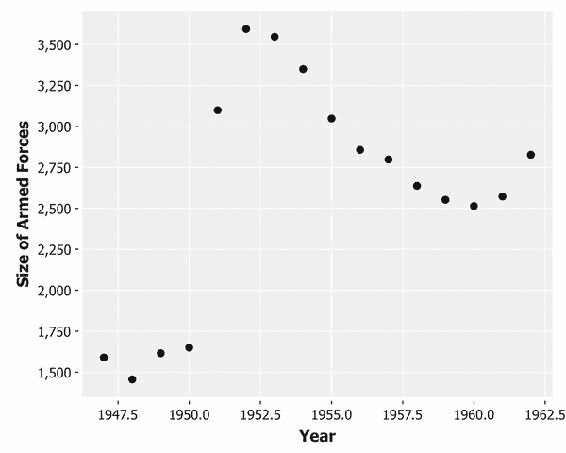

# 第九章 时间序列

|   | *“再次经过的时间。”* |   |
| --- | --- | --- |
|   | --*卡罗琳·基恩，《老钟的秘密》* |   |

在之前的几章中，我们看到如何应用迭代算法来解决复杂方程。我们首先在梯度下降法中遇到这一点——包括批量和随机梯度下降——但最近我们在使用图并行计算模型进行图社区检测时也看到了这一点。

本章讨论的是时间序列数据。时间序列是指按测量时间排列的某一数量的定期观测数据系列。为了使本章中的许多技术能够工作，我们要求连续观测之间的间隔是相等的。测量间隔可以是销售数据的月度、降雨量或股市波动的日度，或者高流量网站的访问量以分钟为单位。

为了能够预测时间序列的未来值，我们需要未来的值在某种程度上依赖于之前的值。因此，本章也涉及到递归：我们如何构建一个序列，其中每个新值都是前一个值的函数。通过将实际时间序列建模为一个新值以这种方式生成的过程，我们希望能够将序列向前推演，并做出预测。

不过，在我们开始讨论递归之前，我们将学习如何利用已经接触过的一种技术——线性回归——来拟合时间序列数据的曲线。

# 关于数据

本章将使用两个 Incanter 预装的数据集：**Longley 数据集**，包含了 1947 年到 1962 年间美国七个经济变量的数据，以及**Airline 数据集**，包含了 1949 年 1 月到 1960 年 12 月的每月航空乘客总数数据。

### 注意

你可以从[`github.com/clojuredatascience/ch9-time-series`](https://github.com/clojuredatascience/ch9-time-series)下载本章的源代码。

Airline 数据集是我们在本章中将花费大部分时间的部分，但首先让我们看看 Longley 数据集。它包含的列包括国内生产总值（GDP）、就业与失业人口数量、人口和军队规模。由于许多预测变量本身是相关的，这使得它成为分析多重共线性的经典数据集。幸运的是，这不会影响我们的分析，因为我们一次只使用一个预测变量。

## 加载 Longley 数据

由于 Incanter 将 Longley 数据集作为其示例数据集库的一部分，因此加载数据只需调用`incanter.datasets/get-dataset`并将`:longley`作为唯一参数。一旦加载完毕，我们可以通过`incanter.core/view`来查看数据集：

```py
(defn ex-9-1 []
  (-> (d/get-dataset :longley)
      (i/view)))
```

数据应大致如下所示：


这些数据最初由国家标准与技术研究院（NIST）发布，作为统计参考数据集，列的描述可以在他们的网站上找到：[`www.itl.nist.gov/div898/strd/lls/data/LINKS/i-Longley.shtml`](http://www.itl.nist.gov/div898/strd/lls/data/LINKS/i-Longley.shtml)。我们将考虑最后三列：**x4**：武装部队的规模，**x5**：14 岁及以上的“非机构”人口，以及**x6**：年份。

首先，让我们看看人口随时间的变化：

```py
(defn ex-9-2 []
  (let [data (d/get-dataset :longley)]
    (-> (c/scatter-plot (i/$ :x6 data)
                        (i/$ :x5 data)
                        :x-label "Year"
                        :y-label "Population")
        (i/view))))
```

前面的代码生成了以下图表：


年份与人口的图表显示出一种非常明显的近似线性关系。轻微的曲线表明，随着人口增加，人口增长率也在上升。

### 注意

回想一下第三章中的吉布拉特法则，*相关性*，公司增长率与其规模成正比。在分析适用吉布拉特法则的人口时，常常会看到类似前面图表的增长曲线：增长率会随着时间的推移而增加。

我们已经看到如何使用 Incanter 的线性模型拟合直线。或许令人惊讶的是，`linear-model`函数同样可以用来拟合曲线。

# 使用线性模型拟合曲线

首先，让我们回顾一下如何使用 Incanter 的`linear-model`函数拟合直线。我们要从数据集中提取`x5`和`x6`列，并将它们（按顺序：`x6`，年份，是我们的预测变量）应用于`incanter.stats/linear-model`函数。

```py
(defn ex-9-3 []
  (let [data  (d/get-dataset :longley)
        model (s/linear-model (i/$ :x5 data)
                              (i/$ :x6 data))]
    (println "R-square" (:r-square model))
    (-> (c/scatter-plot (i/$ :x6 data)
                        (i/$ :x5 data)
                        :x-label "Year"
                        :y-label "Population")
        (c/add-lines (i/$ :x6 data)
                     (:fitted model))
        (i/view))))

;; R-square 0.9879
```

前面的代码生成了以下图表：


尽管直线拟合数据的效果相当好，*R*²值超过 0.98，但它并未捕捉到线的曲线。特别是，我们可以看到图表两端以及中间的点偏离了直线。我们简单的模型有很高的偏差，且根据年份的不同，系统性地低估和高估了人口。残差的图表清楚地显示，误差并不是均匀分布的。

`linear-model`函数之所以被称为线性模型，是因为它生成的模型与其参数之间存在线性关系。然而，或许出乎意料的是，只要我们提供非线性特征，它也能够生成非线性预测。例如，我们可以在年份之外，添加年份的平方作为一个参数。在以下代码中，我们使用 Incanter 的`bind-columns`函数将这两个特征结合起来，形成一个矩阵：

```py
(defn ex-9-4 []
  (let [data  (d/get-dataset :longley)
        x     (i/$ :x6 data)
        xs    (i/bind-columns x (i/sq x))
        model (s/linear-model (i/$ :x5 data) xs)]
    (println "R-square" (:r-square model))
    (-> (c/scatter-plot (i/$ :x6 data)
                        (i/$ :x5 data)
                        :x-label "Year"
                        :y-label "Population")
        (c/add-lines (i/$ :x6 data)
                     (:fitted model))
        (i/view))))

;; 0.9983
```

我们的*R*²值有所提高，得到以下图表：


这显然更适合数据。我们可以通过创建一个 `forecast` 函数来使用我们的模型进行预测，该函数接受模型的系数并返回一个关于 `x`（年份）的函数，将系数乘以我们定义的特征：

```py
(defn forecast [coefs]
  (fn [x]
    (first
     (i/mmult (i/trans coefs)
              (i/matrix [1.0 x (i/sq x)])))))
```

系数包括了一个偏置项参数，因此我们将系数乘以 *1.0*、*x* 和 *x*²。

```py
(defn ex-9-5 []
  (let [data  (d/get-dataset :longley)
        x     (i/$ :x6 data)
        xs    (i/bind-columns x (i/sq x))
        model (s/linear-model (i/$ :x5 data) xs)]
    (-> (c/scatter-plot (i/$ :x6 data)
                        (i/$ :x5 data)
                        :x-label "Year"
                        :y-label "Population")
        (c/add-function (forecast (:coefs model))
                        1947 1970)
        (i/view))))
```

接下来，我们将函数图扩展到 1970 年，以更清晰地看到拟合模型的曲线，如下所示：


当然，我们正在进行超出数据范围的外推。如同在第三章《相关性》中讨论的那样，外推太远通常是不明智的。为了更清楚地说明这一点，让我们关注一下 Longley 数据集中的另一个列，即武装力量的规模：`x6`。

我们可以像之前一样绘制它：

```py
(defn ex-9-6 []
  (let [data (d/get-dataset :longley)]
    (-> (c/scatter-plot (i/$ :x6 data)
                        (i/$ :x4 data)
                        :x-label "Year"
                        :y-label "Size of Armed Forces")
        (i/view))))
```

这生成了以下图表：



这显然是一个更复杂的序列。我们可以看到，在 1950 年到 1952 年间，武装力量的规模急剧增加，随后出现了缓慢下降。在 1950 年 6 月 27 日，杜鲁门总统命令空军和海军支援韩国，这成为了后来所称的朝鲜战争。

要拟合这些数据的曲线，我们需要生成高阶多项式。首先，让我们构建一个 `polynomial-forecast` 函数，它将基于单一的 `x` 和要创建的最高次多项式自动生成更高阶的特征：

```py
(defn polynomial-forecast [coefs degree]
  (fn [x]
    (first
     (i/mmult (i/trans coefs)
              (for [i (range (inc degree))]
                (i/pow x i))))))
```

例如，我们可以使用以下代码训练一个模型，直到 *x*11：

```py
(defn ex-9-7 []
  (let [data (d/get-dataset :longley)
        degree 11
        x  (s/sweep (i/$ :x6 data))
        xs (reduce i/bind-columns
                   (for [i (range (inc degree))]
                     (i/pow x i)))
        model (s/linear-model (i/$ :x4 data) xs
                              :intercept false)]
    (println "R-square" (:r-square model))
    (-> (c/scatter-plot (i/$ 1 xs) (i/$ :x4 data)
                        :x-label "Distance from Mean (Years)"
                        :y-label "Size of Armed Forces")
        (c/add-function (polynomial-forecast (:coefs model)
                                             degree)
                        -7.5 7.5)
        (i/view))))

;; R-square 0.9755
```

上述代码生成了以下图表：


曲线拟合数据相当好，*R*²超过 0.97。然而，现在你应该不感到惊讶，我们实际上是在过拟合数据。我们构建的模型可能没有太多的预测能力。事实上，如果我们像在 `ex-9-8` 中那样将图表的范围向右延伸，展示未来的预测，我们将得到以下结果：


在最后一次测量数据点后的两年半，我们的模型预测军事人数将增长超过 500%，达到超过 175,000 人。

# 时间序列分解

我们在建模军事时间序列时面临的一个问题是，数据量不足以生成一个能够代表产生该系列过程的通用模型。建模时间序列的常见方法是将序列分解为若干个独立的组件：

+   **趋势**：序列是否随时间总体上升或下降？这种趋势是否像我们在观察人口时看到的那样是指数曲线？

+   **季节性**：序列是否表现出周期性的涨跌，且周期数目固定？对于月度数据，通常可以观察到 12 个月的周期性循环。

+   **周期**：数据集中是否存在跨越多个季节的长期周期？例如，在金融数据中，我们可能会观察到与扩张和衰退周期相对应的多年度周期。

另一个指定军事数据问题的方式是，由于没有足够的信息，我们无法确定是否存在趋势，或者观察到的峰值是否属于季节性或周期性模式的一部分。尽管数据似乎有上升的趋势，但也有可能我们正在密切观察一个最终会回落的周期。

本章我们将研究的一个数据集是经典的时间序列数据，观察的是 1949 到 1960 年间的月度航空公司乘客人数。该数据集较大，并且明显展示了趋势和季节性成分。

## 检查航空公司数据

与 Longley 数据集类似，航空公司数据集也是 Incanter 数据集库的一部分。我们加载`incanter.datasets`库为`d`，并将`incanter.code`库加载为`i`。

```py
(defn ex-9-9 []
  (-> (d/get-dataset :airline-passengers)
      (i/view)))
```

前几行数据应如下所示：


在分析时间序列时，确保数据按时间顺序排列是非常重要的。该数据按年份和月份排序。所有一月的数据都排在所有二月数据之前，以此类推。为了进一步处理，我们需要将年份和月份列转换为一个可以排序的单一列。为此，我们将再次使用`clj-time`库（[`github.com/clj-time/clj-time`](https://github.com/clj-time/clj-time)）。

### 可视化航空公司数据

在第三章*相关性*中解析时间时，我们能够利用时间的字符串表示是 clj-time 默认理解的格式。自然，clj-time 并不能自动推断所有时间表示的格式。特别是，美国格式的*mm/dd/yyyy*与世界大多数地方偏好的*dd/mm/yyyy*格式之间的差异尤为问题。在`clj-time.format`命名空间中提供了一个`parse`函数，允许我们传递一个格式字符串，指示库如何解释该字符串。在以下代码中，我们将`format`命名空间作为`tf`引入，并指定我们的时间将采用`"MMM YYYY"`格式。

### 注意

一个由 clj-time 使用的格式化字符串列表可以在[`www.joda.org/joda-time/key_format.html`](http://www.joda.org/joda-time/key_format.html)找到。

换句话说，是三个字符表示“月”，后面跟着四个字符表示“年”。

```py
(def time-format
  (tf/formatter "MMM YYYY"))

(defn to-time [month year]
  (tf/parse time-format (str month " " year)))
```

有了之前的函数，我们可以将年份和月份列解析成一个单一的时间，按顺序排列它们，并提取乘客人数：

```py
(defn airline-passengers []
  (->> (d/get-dataset :airline-passengers)
       (i/add-derived-column :time [:month :year] to-time)
       (i/$order :time :asc)
       (i/$ :passengers)))
```

结果是一组按时间顺序排列的乘客人数数据。现在让我们将其作为折线图来可视化：

```py
(defn timeseries-plot [series]
  (-> (c/xy-plot (range (count series)) series
               :x-label "Time"
               :y-label "Value")
      (i/view)))

(defn ex-9-10 []
  (-> (airline-passengers)
      (timeseries-plot)))
```

上述代码生成了以下图表：


你可以看到数据呈现出明显的季节性模式（每 12 个月重复一次）、上升趋势和缓慢增长曲线。

图表右侧的方差大于左侧的方差，因此我们说数据表现出一定的**异方差性**。我们需要去除数据集中的方差增加和上升趋势。这样会得到一个**平稳**的时间序列。

## 平稳性

一个平稳的时间序列是指其统计特性随时间保持不变的序列。大多数统计预测方法假设序列已经被转换为平稳序列。对于平稳的时间序列，预测变得更加容易：我们假设该序列的统计特性在未来与过去相同。为了去除航空公司数据中的方差增长和增长曲线，我们可以简单地对乘客数量取对数：

```py
(defn ex-9-11 []
  (-> (airline-passengers)
      (i/log)
      (timeseries-plot)))
```

这生成了以下图表：


取对数的效果是双重的。首先，初始图表中显现的异方差性被去除了。其次，指数增长曲线被转化为一条直线。

这使得数据变得更容易处理，但我们仍然在序列中看到趋势，也称为**漂移**。为了获得真正平稳的时间序列，我们还需要使均值稳定。实现这一点有几种方法。

## 去趋势和差分

第一种方法是去趋势处理序列。在取对数后，航空公司数据集包含了一个非常强的线性趋势。我们可以为这些数据拟合一个线性模型，然后绘制残差图：

```py
(defn ex-9-12 []
  (let [data (i/log (airline-passengers))
        xs   (range (count data))
        model (s/linear-model data xs)]
    (-> (c/xy-plot xs (:residuals model)
                   :x-label "Time"
                   :y-label "Residual")
        (i/view))))
```

这生成了以下图表：


残差图显示了一个均值比原始序列更稳定的序列，并且上升趋势已被完全去除。然而，不幸的是，残差似乎并未围绕新均值呈现正态分布。特别是图表中间似乎出现了一个“驼峰”。这表明我们的线性模型在航空公司数据上表现不佳。我们可以像本章开始时那样拟合一条曲线，但让我们改为查看另一种使时间序列平稳的方法。

第二种方法是差分。如果我们从时间序列中的每个点中减去其直接前一个点的值，我们将得到一个新的时间序列（少一个数据点），其中只包含相邻点之间的差异。

```py
(defn difference [series]
  (map - (drop 1 series) series))

(defn ex-9-13 []
  (-> (airline-passengers)
      (i/log)
      (difference)
      (timeseries-plot)))
```

我们可以在以下图表中看到这一效果：


注意，上升趋势已经被替换为围绕常数均值波动的序列。均值略高于零，这对应于差异更可能为正，并导致我们观察到的上升趋势。

这两种技术的目标都是使序列的均值保持恒定。在某些情况下，可能需要对序列进行多次差分，或者在去趋势之后应用差分，以获得一个真正均值稳定的序列。例如，在去趋势之后，序列中仍然可以看到一些漂移，因此在本章的其余部分，我们将使用差分后的数据。

在继续讨论如何为预测建模这样的时间序列之前，让我们绕个弯，思考一下什么是时间序列，以及我们如何将时间序列建模为一个递归过程。

# 离散时间模型

离散时间模型，如我们迄今为止所看的那些，将时间划分为定期的时间片。为了使我们能够预测未来时间片的值，我们假设它们依赖于过去的时间片。

### 注意

时间序列也可以根据频率而不是时间进行分析。我们在本章中不讨论频域分析，但书籍的维基页面[`wiki.clojuredatascience.com`](http://wiki.clojuredatascience.com)包含了更多资源的链接。

在以下内容中，令*y*[t]表示时间*t*时刻观察值的值。最简单的时间序列是每个时间片的值与前一个时间片的值相同。此类序列的预测器为：


这就是说，在时间*t + 1*的预测值给定时间*t*时等于时间*t*的观察值。请注意，这个定义是递归的：时间*t*的值依赖于时间*t - 1*的值。时间*t - 1*的值依赖于时间*t - 2*的值，依此类推。

我们可以将这个“常数”时间序列建模为 Clojure 中的惰性序列，其中序列中的每个值都是常数值：

```py
(defn constant-series [y]
  (cons y (lazy-seq (constant-series y))))

(defn ex-9-14 []
  (take 5 (constant-series 42)))

;; (42 42 42 42 42)
```

注意`constant-series`的定义中包含了对其自身的引用。这是一个递归函数定义，它创建了一个无限的惰性序列，我们可以从中获取值。

下一时刻，即时间*t + 1*，实际观察到的值为*y*[t+1]。如果此值与我们的预测值不同，则我们可以将这个差异计算为预测的误差：


通过结合前两个方程，我们得到了时间序列的随机模型。


换句话说，当前时间片的值等于前一个时间片的值加上一些误差。

## 随机漫步

最简单的随机过程之一是随机漫步。让我们将`constant-series`扩展为一个`random-walk`过程。我们希望我们的误差服从均值为零且方差恒定的正态分布。我们将通过调用 Incanter 的`stats/sample-normal`函数来模拟随机噪声。

```py
(defn random-walk [y]
  (let [e (s/sample-normal 1)
        y (+ y e)]
    (cons y (lazy-seq (random-walk y)))))

(defn ex-9-15 []
  (->> (random-walk 0)
       (take 50)
       (timeseries-plot)))
```

当然，您会得到不同的结果，但它应该类似于以下图表：


随机游走模型在金融学和计量经济学中非常常见。

### 注意

*随机游走*这一术语最早由卡尔·皮尔逊在 1905 年提出。许多过程——从波动的股价到分子在气体中运动时所描绘的路径——都可以被建模为简单的随机游走。1973 年，普林斯顿经济学家伯顿·戈登·马基尔在他的著作《华尔街随机漫步》中提出，股价也遵循随机游走的规律。

随机游走并非完全无法预测。虽然每个点与下一个点之间的差异由随机过程决定，但该差异的方差是恒定的。这意味着我们可以估计每一步的置信区间。然而，由于均值为零，我们无法有任何信心地判断差异相对于当前值是正的还是负的。

## 自回归模型

我们在本章中已经看到如何使用线性模型基于预测变量的线性组合做出预测。在自回归模型中，我们通过使用该变量过去的值的线性组合来预测感兴趣的变量。

自回归模型将预测变量与其自身回归。为了实际观察这一过程，让我们看一下以下代码：

```py
(defn ar [ys coefs sigma]
  (let [e (s/sample-normal 1 :sd sigma)
        y (apply + e (map * ys coefs))]
    (cons y (lazy-seq
             (ar (cons y ys) coefs sigma)))))
```

这与我们在几页前遇到的随机游走递归定义有很多相似之处。然而，这次我们通过将之前的`ys`与`coefs`相乘，生成每一个新的`y`。

我们可以通过调用我们新的`ar`函数，传入之前的`ys`和自回归模型的系数，来生成一个自回归序列：

```py
(defn ex-9-16 []
  (->> (ar [1] [2] 0)
       (take 10)
       (timeseries-plot)))
```

这将生成以下图表：


通过取初始值 1.0 和系数 2.0，且无噪声，我们正在创建一个指数增长曲线。序列中的每一个时间步都是二的幂。

自回归序列被称为*自相关*的。换句话说，每个点与其前面的点是线性相关的。在之前的例子中，这只是前一个值的两倍。系数的数量被称为自相关模型的阶数，通常用字母*p*表示。因此，前面的例子是一个*p=1*的自回归过程，或者是*AR(1)*过程。

通过增加*p*，可以生成更复杂的自回归序列。

```py
(defn ex-9-17 []
  (let [init (s/sample-normal 5)]
    (->> (ar init [0 0 0 0 1] 0)
         (take 30)
         (timeseries-plot))))
```

例如，前面的代码生成了一个 5 阶自回归时间序列，或*AR(5)*序列。效果在序列中表现为一个周期为 5 个点的规律性循环。


我们可以将自回归模型与一些噪声结合起来，引入我们之前看到的随机游走组件。让我们将 sigma 增加到 0.2：

```py
(defn ex-9-18 []
  (let [init (s/sample-normal 5)]
    (->> (ar init [0 0 0 0 1] 0.2)
         (take 30)
         (timeseries-plot))))
```

这将生成以下图表：


请注意，每五个点的典型“季节性”周期是如何被保留下来的，但也与一些噪声元素结合在一起。虽然这是模拟数据，但这个简单的模型已经开始接近在时间序列分析中经常出现的系列类型。

一阶滞后 AR 模型的一般方程如下：


其中*c*是某个常数，*ε*[t]是误差，*y*[t-1]是序列在上一个时间步的值，*φ*[1]是由希腊字母*phi*表示的系数。更一般地，自回归模型在*p*个滞后下的方程为：


由于我们的序列是平稳的，因此我们在代码中省略了常数项*c*。

## 在 AR 模型中确定自相关

就像线性回归可以建立多个自变量之间的（线性）相关性一样，自回归可以建立一个变量与自身在不同时间点之间的相关性。

就像在线性回归中，我们试图建立预测变量与响应变量之间的相关性一样，在时间序列分析中，我们试图建立时间序列与自身在一定数量滞后下的自相关。知道存在自相关的滞后数量可以让我们计算出自回归模型的阶数。

由此可得，我们想要研究序列在不同滞后下的自相关。例如，零滞后意味着我们将每个点与其本身进行比较（自相关为 1.0）。滞后 1 意味着我们将每个点与直接前面的点进行比较。**自相关函数**（**ACF**）是一个数据集与自身在给定滞后下的线性依赖关系。因此，ACF 由滞后*k*参数化。


Incanter 包含一个`auto-correlation`函数，可以返回给定序列和滞后的自相关。然而，我们定义了自己的`autocorrelation`函数，它将返回一系列滞后的`autocorrelation`：

```py
(defn autocorrelation* [series variance n k]
  (let [lag-product (->> (drop k series)
                         (map * series)
                         (i/sum))]
    (cons (/ lag-product variance n)
          (lazy-seq
           (autocorrelation* series variance n (inc k))))))

(defn autocorrelation [series]
  (autocorrelation* (s/sweep series)
                    (s/variance series)
                    (dec (count series)) 0))
```

在计算自相关之前，我们使用`incanter.stats`的`sweep`函数来从序列中去除均值。这意味着我们可以简单地将序列中的值与滞后* k *的值相乘，以确定它们是否有一起变化的趋势。如果有，它们的乘积将是正的；如果没有，它们的乘积将是负的。

该函数返回一个无限懒加载的自相关值序列，对应于滞后*0...k*的自相关。我们来定义一个函数，将这些值绘制成条形图。与`timeseries-plot`一样，该函数将接受一个有序的值序列：

```py
(defn bar-plot [ys]
  (let [xs (range (count ys))]
    (-> (c/bar-chart xs ys
                     :x-label "Lag"
                     :y-label "Value")
        (i/view))))

(defn ex-9-19 []
  (let [init (s/sample-normal 5)
        coefs [0 0 0 0 1]]
    (->> (ar init coefs 0.2)
         (take 100)
         (autocorrelation)
         (take 15)
         (bar-plot))))
```

这生成了以下图表：


每隔 5 个滞后的峰值与我们的*AR(5)*系列生成器一致。随着噪声对信号的干扰，峰值逐渐减弱，测得的自相关也随之下降。

## 移动平均模型

AR 模型的一个假设是噪声是随机的，且均值和方差恒定。我们的递归 AR 函数从正态分布中抽取值来生成满足这些假设的噪声。因此，在 AR 过程中，噪声项是相互*不相关*的。

然而，在某些过程中，噪声项本身并不是不相关的。以一个示例来说明，假设有一个时间序列记录了每天的烧烤销售数量。我们可能会观察到每隔 7 天就有一个峰值，代表着顾客在周末更倾向于购买烧烤。偶尔，我们可能会观察到几周的销售总量下降，另外几周销售则会相应上升。我们可能推测这是由天气造成的，差的销售额对应于寒冷或雨天的时期，而好的销售额则对应于有利天气的时期。无论是什么原因，这种现象都会以均值明显变化的形式出现在我们的数据中。展现此行为的系列被称为**移动平均**（**MA**）模型。

一阶移动平均模型，记作*MA(1)*，为：


其中，*μ* 是系列的均值，*ε[t]* 是噪声值，*θ[1]* 是模型的参数。更一般地，对于*q*项，MA 模型可表示为：


因此，MA 模型本质上是当前系列值与当前及前一时刻（未观测到的）白噪声误差项或随机冲击的线性回归。假设每个点的误差项是相互独立的，并且来自同一（通常为正态）分布，具有零均值和恒定方差。

在 MA 模型中，我们假设噪声值本身是自相关的。我们可以这样建模：

```py
(defn ma [es coefs sigma]
  (let [e (s/sample-normal 1 :sd sigma)
        y (apply + e (map * es coefs))]
    (cons y (lazy-seq
             (ma (cons e es) coefs sigma)))))
```

这里，`es` 是前一时刻的误差，`coefs` 是 MA 模型的参数，`sigma` 是误差的标准差。

注意该函数与之前定义的`ar`函数的不同。我们不再保留前一系列的*ys*，而是保留前一系列的*es*。接下来，让我们看看 MA 模型生成的系列：

```py
(defn ex-9-20 []
  (let [init (s/sample-normal 5)
        coefs [0 0 0 0 1]]
    (->> (ma init coefs 0.5)
         (take 100)
         (timeseries-plot))))
```

这会生成类似于以下的图形：


你可以看到，MA 模型的图表没有 AR 模型那样明显的重复。如果从更长的时间序列来看，你可以看到它如何重新引入*漂移*，因为一个随机冲击的反响在新的临时均值中得以延续。

## 确定 MA 模型中的自相关

你可能会想，是否可以通过自相关图来帮助识别 MA 过程。我们现在就来绘制一下。MA 模型可能更难识别，因此我们将在绘制自相关之前生成更多数据点。

```py
(defn ex-9-21 []
  (let [init (s/sample-normal 5)
        coefs [0 0 0 0 1]]
    (->> (ma init coefs 0.2)
         (take 5000)
         (autocorrelation)
         (take 15)
         (bar-plot))))
```

这将生成以下图表：


你可以在前面的图表中看到，MA 过程的阶数被清晰地显示出来，在滞后 5 的位置有一个明显的峰值。请注意，然而，与自回归过程不同，这里没有每 5 个滞后就出现一个周期性的峰值。这是 MA 过程的一个特征，因为该过程引入了漂移至均值，自相关在其他滞后下大幅减弱。

## 结合 AR 和 MA 模型

到目前为止，我们所考虑的 AR 和 MA 模型是生成自相关时间序列的两种不同但紧密相关的方法。它们并不是互相排斥的，实际上在建模实际时间序列时，你经常会遇到序列看起来是两者的混合情况。


我们可以将 AR 和 MA 过程结合成一个单一的 ARMA 模型，包含两组系数：自回归模型的系数和移动平均模型的系数。每个模型的系数数量不必相同，按照惯例，AR 模型的阶数用*p*表示，而 MA 模型的阶数用*q*表示。

```py
(defn arma [ys es ps qs sigma]
  (let [e  (s/sample-normal 1 :sd sigma)
        ar (apply + (map * ys ps))
        ma (apply + (map * es qs))
        y  (+ ar ma e)]
    (cons y (lazy-seq
                (arma (cons y ys)
                      (cons e es)
                      ps qs sigma)))))
```

让我们绘制一个更长的数据点序列，看看会出现什么样的结构：

```py
(defn ex-9-22 []
  (let [ys (s/sample-normal 10 :sd 1.0)
        es (s/sample-normal 10 :sd 0.2)
        ps [0 0 0 0.3 0.5]
        qs [0.2 0.8]]
    (->> (arma ys es ps qs 0.2)
         (take 500)
         (timeseries-plot))))
```

注意我们如何为模型的 AR 部分和 MA 部分指定不同数量的参数：AR 部分为 5 个参数，MA 模型为 2 个参数。这被称为*ARMA(5,2)*模型。


之前的 ARMA 模型在更长的点序列上绘制，可以让 MA 项的效果变得明显。在这个尺度下，我们看不到 AR 成分的效果，因此让我们像之前一样通过自相关图来运行这个序列：

```py
(defn ex-9-23 []
  (let [ys (s/sample-normal 10 :sd 1.0)
        es (s/sample-normal 10 :sd 0.2)
        ps [0 0 0 0.3 0.5]
        qs [0.2 0.8]]
    (->> (arma ys es ps qs 0.2)
         (take 500)
         (autocorrelation)
         (take 15)
         (bar-plot))))
```

你应该看到一个类似以下的图表：


事实上，随着更多数据和 AR 与 MA 成分的加入，ACF 图并没有让序列的阶数变得更加清晰，相反，它不像我们之前看到的那些自相关图那么明确和清晰。自相关缓慢衰减至零，这使得我们即使提供了大量数据，也无法确定 AR 和 MA 过程的阶数。

这样做的原因是 MA 部分的影响压倒了 AR 部分。我们无法在数据中识别出周期性模式，因为它被一个移动平均所掩盖，这使得所有相邻的点看起来都存在相关性。解决这个问题的最佳方法是绘制偏自相关。

## 计算偏自相关

**部分自相关函数**（**PACF**）旨在解决在混合 ARMA 模型中识别周期性成分的问题。它被定义为给定所有中间观测值时，*y*[t] 和 *y*[t+k] 之间的相关系数。换句话说，它是在滞后 *k* 下的自相关，且该自相关并未被滞后 1 到滞后 *k-1* 的自相关所涵盖。

一阶滞后 1 的部分自相关被定义为等于一阶自相关。二阶滞后 2 的部分自相关等于：


这是两个时间周期间隔的值之间的相关性，*y*[t] 和 *y*[t-2]，条件是已知 *y*[t-1]。在平稳时间序列中，分母中的两个方差将是相等的。

三阶滞后 3 的部分自相关等于：


以此类推，适用于任何滞后。

### 自协方差

部分自相关的公式要求我们计算数据在某个滞后下的自协方差。这称为**自协方差**。我们在前几章已经学习了如何测量两组数据之间的协方差，也就是两项或多项属性一起变化的趋势。这个函数与我们之前在本章定义的自相关函数非常相似，计算从零开始的一系列滞后的自协方差：

```py
(defn autocovariance* [series n k]
  (let [lag-product (->> (drop k series)
                         (map * series)
                         (i/sum))]
    (cons (/ lag-product n)
          (lazy-seq
           (autocovariance* series n (inc k))))))

(defn autocovariance [series]
  (autocovariance* (s/sweep series) (count series) 0))
```

如前所述，返回值将是一个懒序列（lazy sequence）滞后值，所以我们只需要取我们所需的值。

### 使用 Durbin-Levinson 递推法的 PACF

由于需要考虑先前已解释的变化，计算部分自相关比计算自相关要复杂得多。Durbin-Levinson 算法提供了一种递归计算的方法。

### 注意

Durbin-Levinson 递推法，简称 Levinson 递推法，是一种计算涉及对角线元素为常数的矩阵（称为**托普利茨矩阵**）方程解的方法。更多信息请参考 [`en.wikipedia.org/wiki/Levinson_recursion`](https://en.wikipedia.org/wiki/Levinson_recursion)。

Levinson 递推法的实现如下所示。数学推导超出了本书的范围，但递推函数的一般形状你现在应该已经熟悉了。在每次迭代中，我们通过上一轮部分自相关和自协方差的函数来计算部分自相关。

```py
(defn pac* [pacs sigma prev next]
  (let [acv (first next)
        sum (i/sum (i/mult pacs (reverse prev)))
        pac (/ (- acv sum) sigma)]
    (cons pac
          (lazy-seq
           (pac* (->> (i/mult pacs pac)
                      (reverse)
                      (i/minus pacs)
                      (cons pac))
                 (* (- 1 (i/pow pac 2)) sigma)
                 (cons acv prev)
                 (rest next))))))

(defn partial-autocorrelation [series]
  (let [acvs (autocovariance series)
        acv1 (first  acvs)
        acv2 (second acvs)
        pac  (/ acv2 acv1)]
    (concat [1.0 pac]
            (pac* (vector pac)
                  (- acv1 (* pac acv2))
                  (vector acv2)
                  (drop 2 acvs)))))
```

如前所述，这个函数将创建一个无限的懒序列部分自相关，所以我们只能从中取出我们实际需要的数字。

### 绘制部分自相关

现在我们已经实现了一个计算时间序列部分自相关的函数，接下来就来绘制它们。我们将使用与之前相同的 ARMA 系数，以便进行差异比较。

```py
(defn ex-9-24 []
  (let [ys (s/sample-normal 10 :sd 1.0)
        es (s/sample-normal 10 :sd 0.2)
        ps   [0 0 0 0.3 0.5]
        qs   [0.2 0.8]]
    (->> (arma ys es ps qs 0.2)
         (take 500)
         (partial-autocorrelation)
         (take 15)
         (bar-plot))))
```

这应该生成一个类似于以下的条形图：


幸运的是，这与我们之前绘制的 ACF 图有所不同。在滞后 1 和滞后 2 处有很高的部分自相关。这表明正在进行一个*MA(2)*过程。然后，滞后 5 之前部分自相关较低，这表明也存在一个*AR(5)*模型。

### 使用 ACF 和 PACF 确定 ARMA 模型阶数

ACF 和 PACF 图之间的差异有助于选择最合适的时间序列模型。下表描述了理想化 AR 和 MA 序列的 ACF 和 PACF 图的特征。

| 模型 | ACF | PACF |
| --- | --- | --- |
| *AR(p)* | 渐渐衰减 | 在*p*滞后之后截断 |
| *MA(q)* | 在* q *滞后之后截断 | 渐渐衰减 |
| *ARMA(p,q)* | 渐渐衰减 | 渐渐衰减 |

然而，我们常常面对的数据并不符合这些理想情况。给定一个实际的时间序列，尤其是没有足够多数据点的序列，通常不容易明确哪个模型最为合适。最好的做法通常是选择最简单的模型（即最低阶的模型），它能有效描述你的数据。


上面的插图展示了理想化*AR(1)*序列的 ACF 和 PACF 示例图。接下来是理想化*MA(1)*序列的 ACF 和 PACF 示例图。


图中的虚线表示显著性阈值。一般来说，我们无法创建一个完美捕捉时间序列中所有自相关的模型，显著性阈值帮助我们优先考虑最重要的部分。使用 5%显著性水平的显著性阈值的简单公式是：


在这里，*n*是时间序列中的数据点数量。如果 ACF 和 PACF 中的所有点都接近零，则数据基本上是随机的。

## 航空数据的 ACF 和 PACF

让我们回到之前开始考虑的航空数据，并绘制数据的前 25 个滞后的 ACF。

```py
(defn ex-9-25 []
  (->> (airline-passengers)
       (difference)
       (autocorrelation)
       (take 25)
       (bar-plot)))
```

这段代码生成了以下图表：


可以看到数据中有规律的峰值和谷值。第一个峰值出现在滞后 12；第二个出现在滞后 24。由于数据是按月记录的，这些峰值对应着年度季节性循环。因为我们的时间序列有 144 个数据点，显著性阈值大约为 或 0.17。

接下来，让我们看一下航空数据的部分自相关图：

```py
(defn ex-9-26 []
  (->> (airline-passengers)
       (difference)
       (partial-autocorrelation)
       (take 25)
       (bar-plot)))
```

这段代码生成了以下图表：


部分自相关图在滞后 12 处也有一个峰值。与自相关图不同，它在滞后 24 处没有峰值，因为周期性自相关已在滞后 12 时被考虑在内。

尽管这看起来表明 AR(12)模型会合适，但这会创建大量的系数需要学习，特别是在数据量相对较少的情况下。由于周期性循环是季节性的，我们应该通过第二次差分来去除它。

## 通过差分去除季节性

我们已经对数据进行了第一次差分，这意味着我们的模型被称为**自回归积分滑动平均**（**ARIMA**）模型。差分的级别由参数*d*给出，因此完整的模型阶数可以指定为*ARIMA(p,d,q)*。

我们可以对数据进行第二次差分，以去除数据中的强季节性。接下来我们来做这个：

```py
(defn ex-9-27 []
  (->> (airline-passengers)
       (difference)
       (difference 12)
       (autocorrelation)
       (take 15)
       (bar-plot)))
```

首先，我们绘制自相关图：


接下来，部分自相关：

```py
(defn ex-9-28 []
  (->> (airline-passengers)
       (difference)
       (difference 12)
       (partial-autocorrelation)
       (take 15)
       (bar-plot)))
```

这会生成以下图表：


强季节性周期解释了图表中大部分的显著性。在两个图表中，我们剩下了滞后 1 的负自相关，以及在 ACF 中滞后 9 的微弱显著自相关。一个一般的经验法则是，正自相关最好通过在模型中添加*AR*项来处理，而负自相关通常最好通过添加*MA*项来处理。

从之前的图表来看，似乎一个合理的模型是*MA(1)*模型。这可能是一个足够好的模型，但我们可以借此机会演示如何通过尝试捕捉*AR(9)*自相关来拟合大量的参数。

我们将考虑成本函数的替代方案——似然度，它衡量给定模型与数据的拟合程度。模型拟合得越好，似然度越大。因此，我们希望最大化似然度，这个目标也称为**最大似然估计**。

# 最大似然估计

在本书的多次场合，我们已经将优化问题表示为需要最小化的成本函数。例如，在第四章，*分类*中，我们使用 Incanter 最小化逻辑回归成本函数，同时建立一个逻辑回归分类器；在第五章，*大数据*中，我们在执行批量和随机梯度下降时使用梯度下降法最小化最小二乘成本函数。

优化也可以表示为要最大化的效益，有时用这种方式思考会更自然。最大似然估计的目标是通过最大化似然函数来找到模型的最佳参数。

假设给定模型参数*β*时，观测值*x*的概率表示为：


然后，似然度可以表示为：


似然是给定数据下*参数的概率*的度量。最大似然估计的目标是找到使观察到的数据最有可能的参数值。

## 计算似然

在计算时间序列的似然之前，我们将通过一个简单的例子来说明这一过程。假设我们投掷硬币 100 次，观察到 56 次正面，*h*，44 次反面，*t*。我们不假设硬币是公平的，*P(h)=0.5*（因此，稍微不平等的总数是由于偶然变动的结果），而是可以问观察到的值是否与 0.5 有显著差异。我们可以通过询问什么值的*P(h)*使得观察到的数据最有可能来做到这一点。

```py
(defn ex-9-29 []
  (let [data 56
        f (fn [p]
            (s/pdf-binomial data :size 100 :prob p))]
    (-> (c/function-plot f 0.3 0.8
                         :x-label "P"
                         :y-label "Likelihood")
        (i/view))))
```

在上面的代码中，我们使用二项分布来模拟投掷硬币的序列（回想一下在第四章中提到的*分类*，二项分布用于模拟二元结果发生的次数）。关键点是数据是固定的，我们在绘制给定不同参数下，观察到该数据的变化概率。以下图表展示了似然面：


正如我们可能预期的，二项分布中最可能的参数是*p=0.56*。这个人工设定的例子本可以通过手工计算更简单地得出，但最大似然估计的原理能够应对更为复杂的模型。

事实上，我们的 ARMA 模型就是一个复杂的模型。计算时间序列参数似然的数学超出了本书的范围。我们将使用 Clojure 库 Succession（[`github.com/henrygarner/succession`](https://github.com/henrygarner/succession)）来计算时间序列的似然。

我们通常使用对数似然而不是似然。这仅仅是出于数学上的方便，因为对数似然：


可以重写为：


在这里，*k*是模型的参数个数。求多个参数的和比求其积更方便进行计算，因此第二个公式通常更受青睐。让我们通过绘制不同参数下的对数似然与简单的*AR(2)*时间序列的关系，来感受一下似然函数在一些测试数据上的表现。

```py
(defn ex-9-30 []
  (let [init  (s/sample-normal 2)
        coefs [0 0.5]
        data  (take 100 (ar init coefs 0.2))
        f     (fn [coef]
                (log-likelihood [0 coef] 2 0 data))]
    (-> (c/function-plot f -1 1
                         :x-label "Coefficient"
                         :y-label "Log-Likelihood")
        (i/view))))
```

上面的代码生成了以下图表：


曲线的峰值对应于根据数据得到的参数最佳估计值。注意，前面图表中的峰值略高于 0.5：我们为模型添加的噪声使得最佳估计并非恰好为 0.5\。

## 估计最大似然

我们的 ARMA 模型的参数数量很大，因此为了确定最大似然，我们将使用一种在高维空间中表现良好的优化方法。该方法叫做 **Nelder-Mead** 方法，或称为 **simplex** 方法。在 *n* 维空间中，简单形体是一个具有 *n+1* 个顶点的 *多面体*。

### 注意

多面体是一个具有平面边的几何对象，可以存在于任意维度中。二维多边形是 2-多面体，三维多面体是 3-多面体。

简单形体优化的优势在于，它不需要在每个点计算梯度来下降（或上升）到更优位置。Nelder-Mead 方法通过推测在每个测试点测量的目标函数行为来进行优化。最差的点将被一个通过剩余点的质心反射创建的新点所替代。如果新点比当前最优点更好，我们将沿此线指数地拉伸简单形体。如果新点和之前的点没有显著改善，我们可能是跨越了一个低谷，因此我们会将简单形体收缩向可能更优的点。

以下图示展示了简单形体（作为三角形表示）如何反射和收缩以找到最优参数的示例。


简单形体总是表示为一个形状，其顶点数量比维度数多一个。对于二维优化，如前面的图所示，简单形体表示为三角形。对于任意 *n* 维空间，简单形体将表示为一个 *n+1* 个顶点的多边形。

### 注意

简单形体方法也被称为 **变形虫方法**，因为它看起来像是在朝着更优位置爬行。

简单形体优化方法没有在 Incanter 中实现，但可以在 Apache Commons Math 库中使用（[`commons.apache.org/proper/commons-math/`](http://commons.apache.org/proper/commons-math/)）。要使用它，我们需要将我们的目标函数——对数似然——包装成库能够理解的表示方式。

### 使用 Apache Commons Math 进行 Nelder-Mead 优化

Apache Commons Math 是一个庞大且复杂的库。我们无法在这里覆盖太多细节。下一个示例仅用于展示如何将 Clojure 代码与该库提供的 Java 接口集成。

### 注意

有关 Apache Commons Math 库广泛优化功能的概述，可以参考 [`commons.apache.org/proper/commons-math/userguide/optimization.html`](http://commons.apache.org/proper/commons-math/userguide/optimization.html)。

Apache Commons Math 库期望我们提供一个要优化的 `ObjectiveFunction`。接下来，我们通过实现一个 `MultivariateFunction` 来创建它，因为我们的目标函数需要多个参数。我们的响应将是一个单一值：对数似然。

```py
(defn objective-function [f]
  (ObjectiveFunction. (reify MultivariateFunction
                        (value [_ v]
                          (f (vec v))))))
```

上述代码将返回一个`ObjectiveFunction`表示的任意函数`f`。`MultivariateFunction`期望接收一个参数向量`v`，我们将其直接传递给`f`。

在此基础上，我们使用一些 Java 互操作性调用`optimize`，在`SimplexOptimizer`上使用一些合理的默认值。我们对参数的`InitialGuess`只是一个零数组。`NelderMeadSimplex`必须使用每个维度的默认步长进行初始化，该步长可以是任何非零值。我们选择每个参数的步长为 0.2。

```py
(defn arma-model [p q ys]
  (let [m (+ p q)
        f (fn [params]
            (sc/log-likelihood params p q ys))
        optimal (.optimize (SimplexOptimizer. 1e-10 1e-10)
                           (into-array
                            OptimizationData
                            [(MaxEval. 100000)
                             (objective-function f)
                             GoalType/MAXIMIZE
                             (->> (repeat 0.0)
                                  (take m)
                                  (double-array)
                                  (InitialGuess.))
                             (->> (repeat 0.1)
                                  (take m)
                                  (double-array)
                                  (NelderMeadSimplex.))]))
        point (-> optimal .getPoint vec)
        value (-> optimal .getValue)]
    {:ar (take p point)
     :ma (drop p point)
     :ll value}))

(defn ex-9-31 []
  (->> (airline-passengers)
       (i/log)
       (difference)
       (difference 12)
       (arma-model 9 1)))
```

我们的模型是一个大模型，拥有许多参数，因此优化过程会花费一段时间才能收敛。如果你运行上面的示例，你最终会看到类似下面的返回参数：

```py
;; {:ar (-0.23769808471685377 -0.012617164166298971 ...),
;;  :ma (-0.14754455658280236),
;;  :ll 232.97813750669314}
```

这些是我们模型的最大似然估计。此外，响应中还包含了使用最大似然参数的模型的对数似然值。

## 使用赤池信息量准则识别更好的模型

在评估多个模型时，可能会出现最佳模型是最大似然估计值最大的那个模型的情况。毕竟，最大似然估计表明该模型是生成观测数据的最佳候选者。然而，最大似然估计没有考虑模型的复杂性，通常来说，简单的模型更受青睐。回想一下章节开始时我们的高阶多项式模型，它虽然有很高的*R*²，但却没有提供任何预测能力。

**赤池信息量准则**（**AIC**）是一种用于比较模型的方法，它奖励拟合优度（通过似然函数评估），但同时也包括了与参数数量相关的惩罚项。这种惩罚项能有效避免过拟合，因为增加模型的参数数量几乎总是会提高拟合优度。

AIC 可以通过以下公式计算：


在这里，*k*是模型的参数数量，*L*是似然函数。我们可以在 Clojure 中通过以下方式使用参数计数*p*和*q*来计算 AIC。

```py
(defn aic [coefs p q ys]
  (- (* 2 (+ p q 1))
     (* 2 (log-likelihood coefs p q ys))))
```

如果我们要生成多个模型并选择最佳的，我们会选择具有最低 AIC 的那个模型。

# 时间序列预测

在参数估计已被定义后，我们终于可以使用我们的模型进行预测了。实际上，我们已经编写了大部分需要的代码：我们有一个`arma`函数，能够根据一些种子数据和模型参数*p*和*q*生成自回归滑动平均序列。种子数据将是我们从航空公司数据中测量到的*y*值，*p*和*q*的值是我们使用 Nelder-Mead 方法计算出来的参数。

让我们将这些数字代入我们的 ARMA 模型，并生成*y*的预测序列：

```py
(defn ex-9-32 []
  (let [data (i/log (airline-passengers))
        diff-1  (difference 1 data)
        diff-12 (difference 12 diff-1)
        forecast (->> (arma (take 9 (reverse diff-12))
                       []
                       (:ar params)
                       (:ma params) 0)
                      (take 100)
                      (undifference 12 diff-1)
                      (undifference 1 data))]
    (->> (concat data forecast)
         (i/exp)
         (timeseries-plot))))
```

上述代码生成了以下图表：


到时间切片 144 为止的线条是原始序列。从此点之后的线条是我们的预测序列。预测看起来与我们预期的差不多：指数增长趋势持续下去，季节性波动的峰值和谷值模式也在继续。

实际上，预测几乎太规则了。与第 1 到 144 点的系列不同，我们的预测没有噪声。让我们加入一些噪声，使我们的预测更具现实性。为了确定噪声的合理性，我们可以查看过去预测中的误差。为了避免错误的积累，我们应该每次预测一个时间步长，并观察预测值与实际值之间的差异。

让我们用 0.02 的 sigma 值运行我们的 ARMA 函数：

```py
(defn ex-9-33 []
  (let [data (i/log (airline-passengers))
        diff-1  (difference 1 data)
        diff-12 (difference 12 diff-1)
        forecast (->> (arma (take 9 (reverse diff-12))
                       []
                       (:ar params)
                       (:ma params) 0.02)
                      (take 10)
                      (undifference 12 diff-1)
                      (undifference 1 data))]
    (->> (concat data forecast)
         (i/exp)
         (timeseries-plot))))
```

上面的代码可能会生成如下图表：


现在我们可以感知到预测的波动性了。通过多次运行模拟，我们可以了解不同可能结果的多样性。如果我们能够确定预测的置信区间，包括噪声的上下期望值，这将非常有用。

## 蒙特卡洛模拟预测

尽管确实存在用于计算时间序列预期未来值的方法，并且可以得到置信区间，我们将在本节通过模拟来获得这些值。通过研究多个预测之间的变异性，我们可以为模型预测得出置信区间。

例如，如果我们运行大量的模拟，我们可以计算基于 95%时间内值范围的未来预测的 95%置信区间。这正是蒙特卡洛模拟的核心，它是一个常用于解决分析上难以处理问题的统计工具。

### 注意

蒙特卡洛方法是在曼哈顿计划期间开发并系统地使用的，这是美国在二战期间开发核武器的努力。约翰·冯·诺依曼和斯坦尼斯瓦夫·乌拉姆建议将其作为研究中子穿越辐射屏蔽的性质的一种手段，并以摩纳哥蒙特卡洛赌场命名该方法。

我们已经为时间序列预测的蒙特卡洛模拟奠定了所有基础。我们只需要多次运行模拟并收集结果。在以下代码中，我们运行 1,000 次模拟，并收集每个未来时间切片下所有预测的均值和标准差。通过创建两个新序列（一个上界，通过将标准差乘以 1.96 并加上标准差，另一个下界，通过将标准差乘以 1.96 并减去标准差），我们能够可视化系列未来值的 95%置信区间。

```py
(defn ex-9-34 []
  (let [data (difference (i/log (airline-passengers)))
        init (take 12 (reverse data))
        forecasts (for [n (range 1000)]
                    (take 20
                          (arma init [0.0028 0.0028]
                                (:ar params1)
                                (:ma params1)
                                0.0449)))
        forecast-mean (map s/mean (i/trans forecasts))
        forecast-sd (-> (map s/sd (i/trans forecasts))
                        (i/div 2)
                        (i/mult 1.96))
        upper (->> (map + forecast-mean forecast-sd)
                   (concat data)
                   (undifference 0)
                   (i/exp))
        lower (->> (map - forecast-mean forecast-sd)
                   (concat data)
                   (undifference 0)
                   (i/exp))
        n (count upper)]
    (-> (c/xy-plot   (range n) upper
                     :x-label "Time"
                     :y-label "Value"
                     :series-label "Upper Bound"
                     :legend true)
        (c/add-lines (range n) lower
                     :series-label "Lower Bound")
        (i/view))))
```

这生成了以下图表：


上限和下限为我们对未来时间序列预测提供了置信区间。

# 总结

在本章中，我们考虑了分析离散时间序列的任务：在固定时间间隔内进行的顺序观察。我们看到，通过将序列分解为一组组件：趋势成分、季节性成分和周期性成分，可以使建模这种序列的挑战变得更加容易。

我们看到了 ARMA 模型如何将一个序列进一步分解为自回归（AR）和滑动平均（MA）组件，每个组件都以某种方式由序列的过去值决定。这种对序列的理解本质上是递归的，我们也看到了 Clojure 自然支持定义递归函数和懒序列的能力，如何有助于算法生成此类序列。通过将序列的每个值确定为前一个值的函数，我们实现了一个递归的 ARMA 生成器，它能够模拟一个已测量的序列并进行未来的预测。

我们还学习了期望最大化：一种将优化问题的解重新表述为根据数据生成最大可能性的解的方法。我们还看到了如何使用 Apache Commons Math 库，通过 Nelder-Mead 方法估计最大似然参数。最后，我们了解了如何通过将序列向前推进来进行预测，以及如何使用蒙特卡洛模拟来估计序列的未来误差。

在最后一章，我们将注意力从数据分析转向数据可视化。从某种程度上说，数据科学家的最重要挑战是沟通，我们将看到 Clojure 如何帮助我们以最有效的方式展示数据。
