# 第十章. 可视化

|   | *“数字有一个重要的故事要告诉我们。它们依赖于你，给它们一个清晰且有说服力的声音。”* |   |
| --- | --- | --- |
|   | --*Stephen Few* |

本书中的每一章都以某种方式使用了可视化，主要使用 Incanter。Incanter 是一个有效的工具，可以在工作中制作各种各样的图表，这些图表通常是我们在试图理解数据集时首先会使用的。这个初步阶段通常被称为**探索性数据分析**，在这个阶段，我们感兴趣的是总结数据的统计信息，例如数值数据的分布、类别数据的计数，以及数据中属性之间的相关性。

在找到一种有意义的方式来解读数据后，我们通常会希望将其传达给他人。最重要的沟通工具之一就是可视化，我们可能需要向没有强大分析背景的人传达细微或复杂的概念。在本章中，我们将使用 Quil 库——这是为视觉艺术家开发的软件的延伸——来制作吸引人的图形，帮助使数据生动起来。可视化和沟通设计是广泛而丰富的领域，我们在这里无法详细覆盖。相反，本章将提供两个案例研究，展示如何将 Clojure 的数据抽象和 Quil 的绘图 API 结合起来，产生良好的效果。

本章的开始，我们将回到第一章，*统计学*中使用的数据。我们将通过演示如何从俄罗斯选举数据构建一个简单的二维直方图来介绍 Quil。在掌握了 Quil 绘图的基本知识后，我们将展示如何通过一些基本的绘图指令，结合起来，呈现美国财富分配的引人注目的图示。

# 下载代码和数据

在本章中，我们将回到本书第一章中使用的数据：2011 年俄罗斯选举的数据。在第一章，*统计学*中，我们使用了带透明度的散点图来可视化选民投票率与胜选者选票百分比之间的关系。在本章中，我们将编写代码，将数据渲染为二维直方图。

我们还将使用有关美国财富分配的数据。这个数据非常小，以至于我们不需要下载任何东西：我们将直接在源代码中输入这些数据。

### 注意

本章的源代码可以在[`github.com/clojuredatascience/ch10-visualization`](https://github.com/clojuredatascience/ch10-visualization)找到。

本章的示例代码包含一个脚本，用于下载我们在第一章，*统计学*中使用的选举数据。一旦下载了源代码，你可以通过在项目根目录内运行以下命令来执行脚本：

```py
script/download-data.sh

```

如果你之前下载了第一章的*统计学*数据，你可以将数据文件直接移动到本章的数据目录中（如果你愿意的话）。

# 探索性数据可视化

在任何数据科学项目的初期，通常会有一个迭代数据探索的阶段，你可以在这个阶段获得对数据的洞察。在本书中，Incanter 一直是我们的主要可视化工具。尽管它包含了大量的图表，但也会有一些场合，它不包含你想要表示的数据的理想图表。

### 注意

其他 Clojure 库正在提供探索性数据可视化功能。例如，查看**clojurewerkz/envision** [`github.com/clojurewerkz/envision`](https://github.com/clojurewerkz/envision)和 Karsten Schmidt 的**thi-ng/geom**，地址为[`github.com/thi-ng/geom/tree/master/geom-viz`](https://github.com/thi-ng/geom/tree/master/geom-viz)。

例如，在第一章的*统计学*中，我们使用了带有透明度的散点图来可视化选民投票率与赢家得票比例之间的关系。这不是理想的图表，因为我们主要关注的是某个特定区域内点的密度。透明度有助于揭示数据的结构，但它不是一种明确的表示。一些点仍然太微弱，无法看清，或者数量太多，以至于它们看起来像一个点：

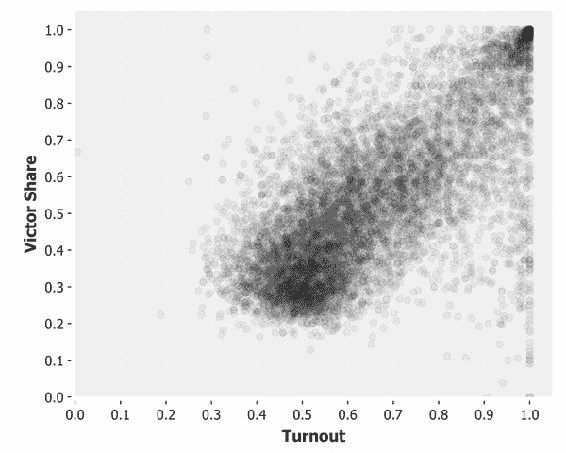

我们本可以通过二维直方图解决这些问题。这种类型的图表使用颜色来传达二维空间中高低密度的区域。图表被划分为一个网格，网格中的每个单元格表示两个维度的一个范围。点越多地落入网格的单元格中，该范围内的密度就越大。

## 表示二维直方图

直方图只是将连续分布表示为一系列箱子的方式。直方图在第一章的*统计学*中已经介绍，当时我们编写了一个分箱函数，将连续数据分为离散的箱子：

```py
(defn bin [n-bins xs]
  (let [min-x    (apply min xs)
        range-x  (- (apply max xs) min-x)
        max-bin  (dec n-bins)
        bin-fn   (fn [x]
                   (-> (- x min-x)
                       (/ range-x)
                       (* n-bins)
                       (int)
                       (min max-bin)))]
    (map bin-fn xs)))
```

这段代码将对连续的`xs`范围进行分箱，并根据`n-bins`参数将其分成不同的组。例如，将 0 到 19 的范围分为 5 个箱子，结果如下：

```py
(defn ex-1-1 []
  (bin 5 (range 20)))

;;(0 0 0 0 1 1 1 1 2 2 2 2 3 3 3 3 4 4 4 4)
```

`bin`函数返回每个数据点的箱子索引，而不是计数，因此我们使用 Clojure 的`frequencies`函数来确定落入该箱子的点的数量：

```py
(defn ex-1-2 []
  (frequencies (bin 5 (range 20))))

;;{0 4, 1 4, 2 4, 3 4, 4 4}
```

这是一个合理的一维直方图表示：它将计数的箱子映射出来。要表示二维直方图，我们只需要对*xs*和*ys*执行相同的计算。我们将向量函数映射到箱子的索引上，以便将每个点转换为`[x-bin y-bin]`的表示：

```py
(defn histogram-2d [xsys n-bins]
  (-> (map vector
           (bin n-bins xs)
           (bin n-bins ys))
      (frequencies)))
```

这个函数返回一个以两个值的向量为键的映射。`frequencies` 函数现在将计数所有在 *x* 和 *y* 轴上都共享同一个区间的点：

```py
(defn ex-10-3 []
  (histogram-2d (range 20)
                (reverse (range 20)) 5))

;;{[0 4] 4, [1 3] 4, [2 2] 4, [3 1] 4, [4 0] 4}
```

我们希望在直方图中绘制实际数据，因此让我们从 第一章加载俄罗斯数据，*统计学*。如果你已经将数据下载到示例代码的 `data` 目录中，可以运行以下代码：

```py
(defn ex-10-4 []
  (let [data (load-data :ru-victors)]
    (histogram-2d (i/$ :turnout data)
                  (i/$ :victors-share data) 5)))

;; {[4 3] 6782, [2 2] 14680, [0 0] 3, [1 0] 61, [2 3] 2593,
;;  [3 3] 8171, [1 1] 2689, [3 4] 1188, [4 2] 3084, [3 0] 64,
;;  [4 1] 1131, [1 4] 13, [1 3] 105, [0 3] 6, [2 4] 193, [0 2] 10,
;;  [2 0] 496, [0 4] 1, [3 1] 3890, [2 1] 24302, [4 4] 10771,
;;  [1 2] 1170, [3 2] 13384, [0 1] 4, [4 0] 264}
```

我们可以看到直方图区间中的值范围巨大：从区间 `[0 4]` 中的 1 到区间 `[2 1]` 中的 24,302。这些计数值将是我们在直方图上绘制的密度值。

# 使用 Quil 进行可视化

Quil ([`github.com/quil/quil`](https://github.com/quil/quil)) 是一个 Clojure 库，提供了大量的灵活性来生成自定义的可视化效果。它封装了 Processing ([`processing.org/`](https://processing.org/))，这是一个 Java 框架，已被视觉艺术家和设计师积极开发多年，旨在促进“视觉艺术中的软件素养和技术中的视觉素养”。

使用 Quil 进行的任何可视化都涉及创建一个 *sketch*。sketch 是处理程序的术语，指的是运行一个由绘图指令组成的程序。大多数 API 函数都可以从 `quil.core` 命名空间中调用。我们将其作为 `q` 包含在代码中。调用 `q/sketch` 并不传递任何参数时，将会弹出一个空窗口（尽管它可能会被其他窗口遮挡）。

## 绘制到 sketch 窗口

默认的窗口大小是 500px x 300px。我们希望我们的二维直方图是正方形的，因此将窗口的宽高都设置为 250px：

```py
(q/sketch :size [250 250])
```

由于我们每个轴都有 5 个区间，因此每个区间将由一个 50px 宽和 50px 高的正方形表示。

Quil 提供了标准的二维形状原语用于绘制：点、线、弧、三角形、四边形、矩形和椭圆。要绘制一个矩形，我们调用 `q/rect` 函数，并指定 *x* 和 *y* 坐标，以及宽度和高度。

让我们在原点绘制一个宽度为 50px 的正方形。有几种方式可以向 Quil 提供绘图指令，但在本章中，我们将传递一个被称为 `setup` 的函数。这是一个没有参数的函数，我们将其传递给 sketch。我们的零参数函数仅仅是调用 `rect`，并传入位置 [0, 0] 和宽高为 50：

```py
(defn ex-10-5 []
  (let [setup #(q/rect 0 0 50 50)]
    (q/sketch :setup setup
              :size [250 250])))
```

该代码生成了以下图像：

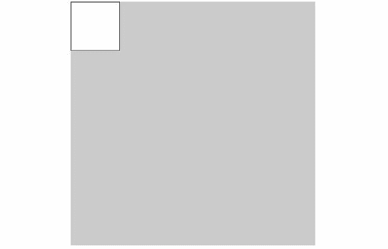

根据你对计算机图形学的熟悉程度，矩形的位置可能与预期不同。

### 注意

通过传递半径作为第五个参数，也可以绘制带有圆角的矩形。通过传递第五到第八个参数的值，可以为每个角使用不同的半径。

在继续之前，我们需要理解 Quil 的坐标系统。

## Quil 的坐标系统

Quil 使用的坐标系统与 Processing 和大多数其他计算机图形程序相同。如果你不熟悉绘图，可能会觉得起点位于显示屏左上角是直觉上不对的。*y* 轴向下延伸，*x* 轴向右延伸。

很明显，这不是大多数图表中 *y* 轴的方向，这意味着在绘图时，*y* 坐标通常需要被翻转。

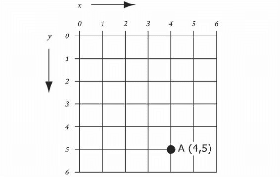

一种常见的方法是从草图底部测量的 *y* 值中减去所需的值，这样的转换使得 *y* 为零时对应草图的底部。较大的 *y* 值则对应草图中更高的位置。

## 绘制网格

让我们通过一个简单的网格来实践这个。以下函数接受一个箱子的数量 `n-bins` 和一个 `size` 参数，`size` 表示为 `[width height]` 的向量：

```py
defn draw-grid [{:keys [n-bins size]}]
  (let [[width height] size
        x-scale (/ width n-bins)
        y-scale (/ height n-bins)
        setup (fn []
                (doseq [x (range n-bins)
                        y (range n-bins)
                        :let [x-pos (* x x-scale)
                              y-pos (- height
                                       (* (inc y) y-scale))]]
                  (q/rect x-pos y-pos x-scale y-scale)))]
    (q/sketch :setup setup :size size)))
```

从中，我们可以计算出 `x-scale` 和 `y-scale`，这是一个因子，使我们能够将箱子索引转换为 *x* 和 *y* 维度中的像素偏移。这些值被我们的 `setup` 函数使用，`setup` 函数遍历 *x* 和 *y* 箱子，为每个箱子放置一个矩形。

### 注意

请注意，我们在 `doseq` 内部执行了循环。我们的绘图指令作为副作用执行。如果我们不这样做，Clojure 的惰性求值将导致没有任何绘制操作。

之前的代码生成了以下图形：

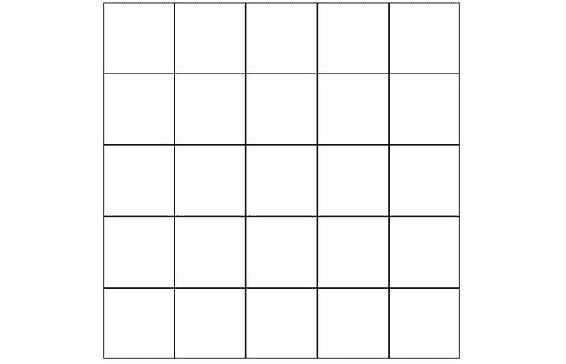

在定义了前面的函数后，我们几乎已经创建了一个直方图。我们只需要为网格中的每个方格着色，颜色代表每个箱子的适当值。为了实现这一点，我们需要两个额外的函数：一个从数据中获取与箱子对应的值，另一个将这些值解释为颜色。

## 指定填充颜色

在 Quil 中填充颜色是通过 `q/fill` 函数实现的。我们指定的任何填充将在我们指定新的填充之前一直使用。

### 注意

Quil 中的许多函数会影响当前的绘图上下文，并且是 *有状态的*。例如，当我们指定一个填充值时，它将在后续的所有绘图指令中使用，直到填充值被更改。其他例子包括填充、笔触、缩放和字体。

以下代码是我们 `draw-grid` 函数的一个改编版本。`draw-filled-grid` 的新增部分是 `fill-fn`：用于给网格中的点着色的方式。`fill-fn` 函数应该是一个接受 *x* 和 *y* 箱子索引作为参数的函数，它应返回 Quil 可以用作填充的表示：

```py
(defn draw-filled-grid [{:keys [n-bins size fill-fn]}]
  (let [[width height] size
        x-scale (/ width n-bins)
        y-scale (/ height n-bins)
        setup (fn []
                (doseq [x (range n-bins)
                        y (range n-bins)
                        :let [x-pos (* x x-scale)
                              y-pos (- height
                                       (* (inc y) y-scale))]]
                  (q/fill (fill-fn x y))
                  (q/rect x-pos y-pos x-scale y-scale)))]
    (q/sketch :setup setup :size size)))
```

Quil 的填充函数接受多个参数：

+   **一个参数**：RGB 值（可以是一个数字或 `q/color` 表示法）

+   **两个参数**：与单个参数的情况一样，除了加上一个 alpha 透明度值

+   **三个参数**：颜色的红、绿、蓝分量，作为 0 到 255 之间的数字（包括 0 和 255）

+   **四个参数**：红色、绿色、蓝色和透明度的数值

我们很快就会看到如何使用 `color` 表示法，但现在，我们将使用一个简单的数字表示法来表示颜色：介于 0 和 255 之间的数字。当红色、绿色和蓝色的数值相同时（或者当调用 `fill` 函数时传递一个或两个参数），我们得到一种灰色。0 对应黑色，255 对应白色。

如果我们将每个柱状图中值的频率除以最大值，我们将得到一个介于 0 和 1.0 之间的数字。将其乘以 255 将得到一个 Quil 会转换为灰色的值。我们在以下 `fill-fn` 实现中做了这个，并将其传递给我们之前定义的 `draw-filled-grid` 函数：

```py
(defn ex-10-6 []
  (let [data (load-data :ru-victors)
        n-bins 5
        hist (histogram-2d (i/$ :turnout data)
                           (i/$ :victors-share data)
                           n-bins)
        max-val (apply max (vals hist))
        fill-fn (fn [x y]
                  (-> (get hist [x y] 0)
                      (/ max-val)
                      (* 255)))]
    (draw-filled-grid {:n-bins n-bins
                       :size [250 250]
                       :fill-fn fill-fn})))
```

前面的代码生成了以下图形：

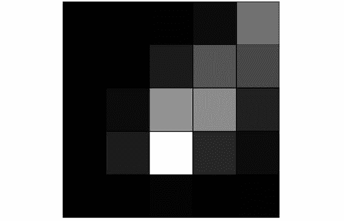

图表完成了我们想要的功能，但它是我们数据的非常粗略的表示。让我们增加箱子的数量来提高柱状图的分辨率：

```py
(defn ex-10-7 []
  (let [data (load-data :ru-victors)
        n-bins 25
        hist (histogram-2d (i/$ :turnout data)
                           (i/$ :victors-share data)
                           n-bins)
        max-val (apply max (vals hist))
        fill-fn (fn [x y]
                  (-> (get hist [x y] 0)
                      (/ max-val)
                      (* 255)))]
    (draw-filled-grid {:n-bins n-bins
                       :size [250 250]
                       :fill-fn fill-fn})))
```

这段代码生成了以下图形：

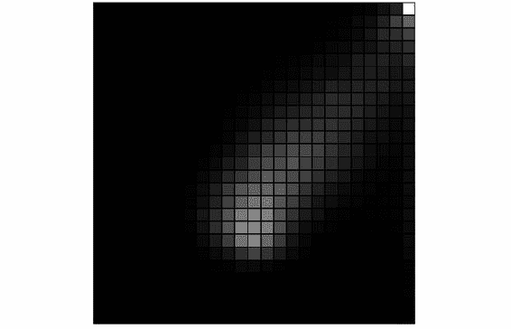

在 *x* 和 *y* 轴上各有 25 个矩形，我们就能获得数据结构的更细粒度的图像。然而，副作用是由于大多数单元格的色调较暗，柱状图的细节变得难以辨认。部分问题在于右上角的值如此之高，以至于即便是中央区域（之前最亮的部分）现在也不过是一个灰色的模糊斑点。

这个问题有两个解决方案：

+   通过绘制 *z*-分数而不是实际值来减轻离群值的影响

+   通过使用更广泛的颜色范围来多样化视觉线索

我们将在下一节中学习如何将值转换为完整的颜色谱，但首先，让我们将柱状图的值转换为 *z*-分数。绘制 *z*-分数是以分布为意识的方式着色图表，这将大大减小右上角极端离群值的影响。使用 *z*-分数，我们将绘制每个单元格与均值之间的标准差数量。

为了实现这一点，我们需要知道两件事：柱状图中频率的均值和标准差：

```py
(defn ex-10-8 []
  (let [data (load-data :ru-victors)
        n-bins 25
        hist (histogram-2d (i/$ :turnout data)
                           (i/$ :victors-share data)
                           n-bins)
        mean (s/mean (vals hist))
        sd   (s/sd   (vals hist))
        fill-fn (fn [x y]
                  (-> (get hist [x y] 0)
                      (- mean)
                      (/ sd)
                      (q/map-range -1 3 0 255)))]
    (draw-filled-grid {:n-bins n-bins
                       :size [250 250]
                       :fill-fn fill-fn})))
```

前面的代码从柱状图中的每个值中减去均值，然后除以均值。这样会得到一个均值为零的值。`1` 将代表离均值一个标准差，`2` 将代表离均值两个标准差，依此类推。

Quil 暴露了一个有用的`map-range`函数，它可以将一个值范围映射到另一个值范围。例如，我们可以将所需的标准差范围（在前面的例子中是-1 到 3）映射到 0 到 255 的范围。这样，分布的四个标准差将对应于从黑到白的完整灰度范围。任何超过此范围的数据将被裁剪。

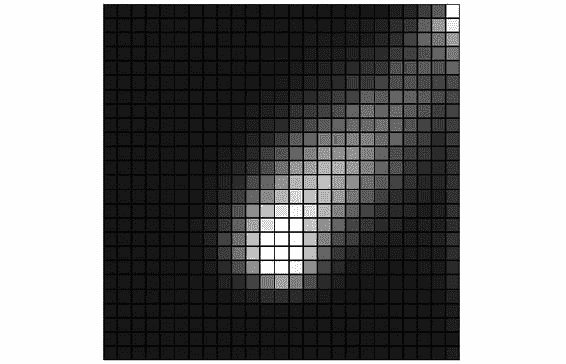

结果是一个更引人注目的灰度数据表示方式。使用*z*分数使得直方图的主体部分呈现出更多细节，我们现在能够察觉到尾部的更多变化。

然而，尽管如此，直方图仍然没有达到理想的清晰度，因为区分不同的灰度色调可能会很有挑战性。在某些不相邻的单元格之间，可能很难判断它们是否共享相同的值。

我们可以通过利用颜色来表示每个单元格，从而扩展可用的范围。这使得直方图更像热力图：“较冷”的颜色，如蓝色和绿色，代表低值，而“较热”的颜色，如橙色和红色，则代表热力图中最密集的区域。

## 颜色与填充

为了创建我们二维直方图的热力图版本，我们需要将* z *分数与颜色值进行映射。与显示离散的颜色调色板（例如 5 种颜色）不同，我们的热力图应该有一个平滑的调色板，包含光谱中的所有颜色。

### 注意

对于那些阅读印刷版书籍或黑白版本的读者，你可以从 Packt 出版社的网站下载彩色图像：[`www.packtpub.com/sites/default/files/downloads/Clojure_for_Data_Science_ColorImages.pdf`](https://www.packtpub.com/sites/default/files/downloads/Clojure_for_Data_Science_ColorImages.pdf)。

这正是 Quil 函数`q/lerp-color`所做的。给定两种颜色和介于 0 与 1 之间的比例，`lerp-color`将返回两者之间插值的新颜色。0 的比例返回第一个颜色，1 的比例返回第二个颜色，而 0.5 的比例则返回两者之间的颜色：

```py
(defn z-score->heat [z-score]
  (let [colors [(q/color 0 0 255)   ;; Blue
                (q/color 0 255 255) ;; Turquoise
                (q/color 0 255 0)   ;; Green
                (q/color 255 255 0) ;; Yellow
                (q/color 255 0 0)]  ;; Red
        offset  (-> (q/map-range z-score -1 3 0 3.999)
                    (max 0)
                    (min 3.999))]
    (q/lerp-color (nth colors offset)
                  (nth colors (inc offset))
                  (rem offset 1))))
```

这段代码使用了按光谱顺序排列的颜色数组。我们用`q/map-range`来确定我们将要插值的两个颜色，并使用`q/lerp-color`与范围的小数部分进行插值。

我们已经实现了一个`draw-filled-grid`函数，它接受`fill-fn`来决定使用哪种颜色填充网格。现在，让我们将`z-score->heat`函数传递给它：

```py
(defn ex-10-9 []
  (let [data (load-data :ru-victors)
        n-bins 25
        hist (histogram-2d (i/$ :turnout data)
                           (i/$ :victors-share data)
                           n-bins)
        mean (s/mean (vals hist))
        sd   (s/sd   (vals hist))
        fill-fn (fn [x y]
                  (-> (get hist [x y] 0)
                      (- mean)
                      (/ sd)
                      (z-score->heat)))]
    (draw-filled-grid {:n-bins n-bins
                       :size [250 250]
                       :fill-fn fill-fn})))
```

这段代码生成了以下图形：

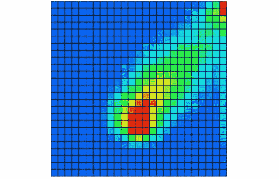

热力图展示了数据的更多内部结构。尤其是，虽然数据的强烈对角形状依然显现，但我们现在可以看到更多的变化。先前难以确定的细节（无论是因为区域过于密集还是过于稀疏）变得更加明显。

## 输出图像文件

现在我们对直方图感到满意，接下来我们希望输出高质量的版本。通过在设置函数中加入`q/save`命令，并传入文件名，Quil 将同时将图表输出到文件和屏幕上。图像创建的格式将取决于文件名的后缀：`.tif`为 TIFF 文件，`.jpg`为 JPEG 文件，`.png`为 PNG 文件，`.tga`为 TARGA 文件：

```py
(defn draw-filled-grid [{:keys [n-bins size fill-fn]}]
  (let [[width height] size
        x-scale (/ width n-bins)
        y-scale (/ height n-bins)
        setup (fn []
                (doseq [x (range n-bins)
                        y (range n-bins)
                        :let [x-pos (* x x-scale)
                              y-pos (- height
                                       (* (inc y) y-scale))]]
                  (q/fill (fill-fn x y))
                  (q/rect x-pos y-pos x-scale y-scale))
                  (q/save "heatmap.png"))]
    (q/sketch :setup setup :size size)))
```

我们还可以将输出结果保存为 PDF 格式，正如接下来的可视化展示。

# 用于沟通的可视化

作为数据科学家，在工作中我们可能需要与各种各样的人沟通。我们身边的同事和经理可能能够阅读并解读我们的 Incanter 图表，但这不会给 CEO 留下深刻印象。我们可能还需要与公众沟通。

无论是哪种情况，我们都应该专注于制作简单且有力的可视化图表，同时又不牺牲数据的完整性。缺乏统计学训练并不妨碍我们理解那些微妙而复杂的论点，我们应该尊重观众的智慧。作为数据科学家，我们面临的挑战是找到一种有效地传达信息的表现形式。

在本章的剩余部分，我们将制作一个可视化图表，旨在以简洁而真实的方式传达更复杂的数据集。

### 注意

我们将创建的可视化图表是来自于**美国财富不平等**视频中的一个图表版本，视频可以在[`www.youtube.com/watch?v=QPKKQnijnsM`](https://www.youtube.com/watch?v=QPKKQnijnsM)观看。该视频由匿名电影制作人 Politizane 制作，强有力的视觉冲击使其在 YouTube 上获得了超过 1600 万次点击。

像这样的图形展示常常有一个问题，我们的数据将来自多个不同的来源。

## 可视化财富分布

我们将使用的第一个数据集来自加利福尼亚大学圣克鲁兹分校的心理学与社会学研究教授 G. William Domhoff 的一篇文章。我们接下来引用的数字来自一篇名为**财富、收入与权力**的文章，地址为[`www2.ucsc.edu/whorulesamerica/power/wealth.html`](http://www2.ucsc.edu/whorulesamerica/power/wealth.html)。

虽然整篇文章都值得阅读，但其中一张特别引人注目的图表是一张饼图，展示了 2010 年美国人财务净资产的分布：

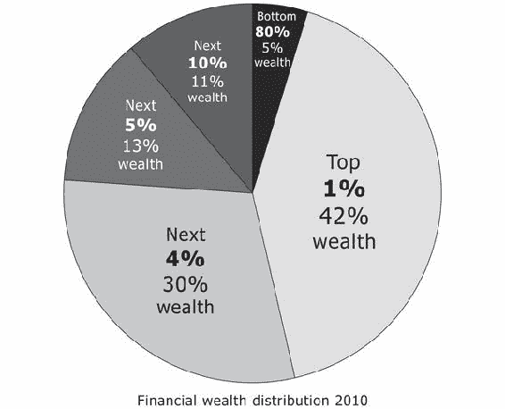

这张饼图之所以引人注目，有几个原因。首先，40%以上的财富掌握在如此小的群体手中，这一概念令人难以理解。其次，饼图的每一块不仅代表着截然不同的财富数量，还代表着截然不同的人群数量：从占人口 1%的群体到占人口 80%的群体。饼图本就因阅读困难而著名，因此这张图表的挑战性更大。

### 注意

饼图通常不是表示数据的好方式，即使总数在概念上代表整体的一部分。作者兼程序员 Steve Fenton 已经记录了许多原因，并提供了适当的替代方法，详见[`www.stevefenton.co.uk/2009/04/pie-charts-are-bad/`](https://www.stevefenton.co.uk/2009/04/pie-charts-are-bad/)。

让我们看看如何重新解读这些数据，让它更易于理解。首先，提取出以下表格中所列的数字：

| 百分位 | 总金融财富，2010 |
| --- | --- |
| 0-79 | 5% |
| 80-89 | 11% |
| 90-95 | 13% |
| 96-99 | 30% |
| 100 | 42% |

相较于饼图，改进的小方法是将相同的数据表示为条形图。虽然人们通常很难成功地解读饼图中各个扇形的相对大小，条形图则不会遇到此类问题。下一个示例将简单地将之前的数据转换为条形图：

```py
(defn ex-10-10 []
  (let [categories ["0-79" "80-89" "90-95" "96-99" "100"]
        percentage [5      11      13      30      42   ]]
    (-> (c/bar-chart categories percentage
                     :x-label "Category"
                     :y-label "% Financial Wealth")
        (i/view))))
```

这将返回以下图表：

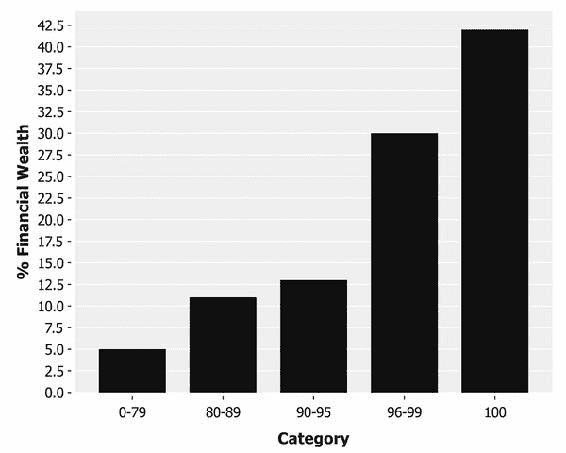

这是对饼图的一种改进，因为它更容易比较各类别的相对大小。然而，仍然存在一个显著的问题：每个类别所代表的人数差异巨大。左侧的条形代表了 80%的人口，而右侧的条形则代表了 1%的人口。

如果我们想让这些数据更加易于理解，我们可以将总量划分为 100 个相等的单位，每个单位代表人口的一个百分位。每个条形的宽度可以根据其所代表的百分位数进行调整，同时保持其面积不变。由于每个百分位单位代表相同数量的人口，因此生成的图表可以让我们更容易地进行不同群体间的比较。

我们可以通过返回一个包含 100 个元素的序列来实现这一目标，每个元素代表一个人口百分位。序列中每个元素的值将是该百分位所占的财富比例。我们已经知道，前 1%的人口拥有 42%的财富，但其他群体将根据它们所代表的百分位数调整其值：

```py
(def wealth-distribution
  (concat (repeat 80 (/ 5  80))
          (repeat 10 (/ 11 10))
          (repeat 5  (/ 13 5))
          (repeat 4  (/ 30 4))
          (repeat 1  (/ 42 1))))

(defn ex-10-11 []
  (let [categories (range (count wealth-distribution))]
    (-> (c/bar-chart categories wealth-distribution
                     :x-label "Percentile"
                     :y-label "% Financial Wealth")
        (i/view))))
```

这个示例生成了以下的条形图：

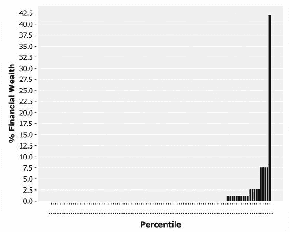

通过应用一个简单的转换，我们能够更好地理解真正的分布情况。每个条形现在代表着相同比例的人口，条形的面积代表该百分位所拥有的财富比例。

## 使用 Quil 使数据更生动

前一部分的变换结果是一个几乎过于直观显示极端值差异的图表：除了最大条形外，几乎无法解读任何内容。一种解决方案是使用对数刻度或对数-对数刻度来显示数字，正如我们在本书的其他地方所做的那样。如果这个图表的观众是统计学上有素养的人，那么这样做可能是最合适的，但我们假设我们的可视化面向的目标观众是普通大众。

之前展示的图表的问题是最右侧的条形图过大，压倒了其他所有条形。80%的面积仅由几个像素表示。在下一部分中，我们将利用 Quil 制作一个更好地利用空间，同时又能保持图表完整性的可视化。

## 绘制不同宽度的条形图

在接下来的几个部分中，我们将分阶段构建一个可视化。由于我们将绘制一个 Quil 草图，我们首先会定义一些常数，以便相对于草图的尺寸生成绘图指令。为了简洁起见，下一段代码省略了一些常数：

```py
(def plot-x 56)
(def plot-y 60)
(def plot-width 757)
(def plot-height 400)
(def bar-width 7)
```

在这些完成后，我们可以开始以更易于理解的方式呈现条形图。以下代码采用财富分布并将除了最后一条条形以外的所有条形绘制为一系列矩形。*y*轴的刻度被计算出来，以便我们绘制的最大条形图填满整个绘图的高度：

```py
(defn draw-bars []
  (let [pc99    (vec (butlast wealth-distribution))
        pc1     (last wealth-distribution)
        y-max   (apply max pc99)
        y-scale (fn [x] (* (/ x y-max) plot-height))
        offset  (fn [i] (* (quot i 10) 7))]
    (dotimes [i 99] ;; Draw the 99%
      (let [bar-height (y-scale (nth pc99 i))]
        (q/rect (+ plot-x (* i bar-width) (offset i))
                (+ plot-y (- plot-height bar-height))
                bar-width bar-height)))
    (let [n-bars 5  ;; Draw the 1%
          bar-height (y-scale (/ pc1 n-bars))]
      (q/rect (+ plot-x (* 100 bar-width) (offset 100))
              (+ plot-y (- plot-height bar-height))
              (* bar-width n-bars) bar-height))))
```

到目前为止，我们绘制的条形图代表了 99%的比例。最后一条条形将代表人口的最后 1%。为了使其适应我们设计的垂直刻度，且不至于从草图的顶部消失，我们将相应地加宽该条形，同时保持其面积。因此，这条条形比其他条形短 5 倍——但也宽 5 倍：

```py
(defn ex-10-12 []
  (let [size [960 540]]
    (q/sketch :size size
              :setup draw-bars)))
```

示例输出如下图：

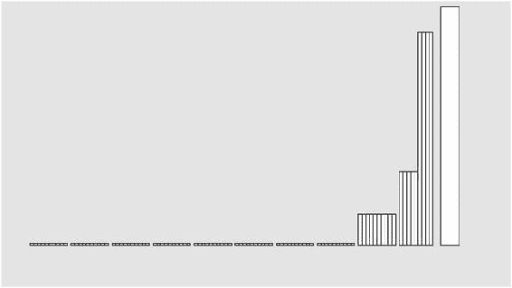

到目前为止，我们已经能够更清晰地看到最大条形之间的关系，但还不明显能看出这是一个图表。在接下来的部分中，我们将添加文本，以标明图表的主题和坐标轴的范围。

## 添加标题和坐标轴标签

专用可视化工具（如 Incanter）的一大便利之处是，坐标轴可以自动生成。Quil 在这里没有提供帮助，但由于条形宽度已知，因此我们并不难实现。在下面的代码中，我们将使用`text`、`text-align`、`text-size`等函数将文本写入我们的可视化中：

```py
(defn group-offset [i]
  (* (quot i 10) 7))

(defn draw-axis-labels []
  (q/fill 0)
  (q/text-align :left)
  (q/text-size 12)
  (doseq [pc (range 0 (inc 100) 10)
          :let [offset (group-offset pc)
                x      (* pc bar-width)]]
    (q/text (str pc "%") (+ plot-x x offset) label-y))
    (q/text "\"The 1%\"" pc1-label-x  pc1-label-y))
```

使用非专业图表库所失去的，我们在灵活性上得到了补偿。接下来，我们将编写一个函数，在文本上制作凸印风格的压印效果：

```py
(defn emboss-text [text x y]
  (q/fill 255)
  (q/text text x y)
  (q/fill 100)
  (q/text text x (- y 2)))

(defn draw-title []
  (q/text-size 35)
  (q/text-leading 35)
  (q/text-align :center :top)
  (emboss-text "ACTUAL DISTRIBUTION\nOF WEALTH IN THE US"
               title-x title-y))
```

我们使用`emboss-text`函数在图表的中心绘制一个大标题。注意，我们还指定了文本的对齐方式，可以选择从文本的顶部、底部、中心、左侧或右侧来测量位置：

```py
(defn ex-10-13 []
  (let [size [960 540]]
    (q/sketch :size size
              :setup #((draw-bars)
                       (draw-axis-labels)
     (draw-title)))))
```

之前的例子生成了以下图形：

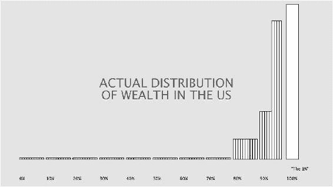

这个图表结合了条形图高度、面积和自定义文本可视化，使用标准图表应用程序很难实现。使用 Quil，我们有一个工具箱，可以轻松地将图形和数据自由混合。

## 通过插图提高清晰度

我们的图表已经有了一些进展，但目前看起来非常简洁。为了增加更多的视觉吸引力，可以使用图像。在示例项目的资源目录中，有两个 SVG 图像文件，一个是人形图标，另一个是来自维基百科的美国地图。

### 注意

维基百科提供了各种各样的 SVG 地图，这些地图都可以在灵活的创作共享许可证下使用。例如，[`commons.wikimedia.org/wiki/Category:SVG_maps_of_the_United_States`](https://commons.wikimedia.org/wiki/Category:SVG_maps_of_the_United_States) 上的美国地图。

我们在本章使用的地图可以在[`commons.wikimedia.org/wiki/File:Blank_US_Map,_Mainland_with_no_States.svg`](https://commons.wikimedia.org/wiki/File:Blank_US_Map,_Mainland_with_no_States.svg)找到，由 Lokal_Profil 在 CC-BY-SA-2.5 许可证下提供。

在 Quil 中使用 SVG 图像是一个两步过程。首先，我们需要使用`q/load-shape`将图像加载到内存中。此函数接受一个参数：要加载的 SVG 文件的路径。接下来，我们需要将图像实际绘制到屏幕上。这是通过使用`q/shape`函数来完成的，该函数需要一个* x *，* y *位置以及可选的宽度和高度。如果我们使用的是基于像素的图像（如 JPEG 或 PNG），我们将使用相应的`q/load-image`和`q/image`函数：

```py
(defn draw-shapes []
  (let [usa    (q/load-shape "resources/us-mainland.svg")
        person (q/load-shape "resources/person.svg")
        colors [(q/color 243 195 73)
                (q/color 231 119 46)
                (q/color 77  180 180)
                (q/color 231 74  69)
                (q/color 61  76  83)]]
    (.disableStyle usa)
    (.disableStyle person)
    (q/stroke 0 50)
    (q/fill 200)
    (q/shape usa 0 0)
    (dotimes [n 99]
      (let [quintile (quot n 20)
            x (-> (* n bar-width)
                  (+ plot-x)
                  (+ (group-offset n)))]
        (q/fill (nth colors quintile))
        (q/shape person x icons-y icon-width icon-height)))
        (q/shape person
             (+ plot-x (* 100 bar-width) (group-offset 100))
             icons-y icon-width icon-height)))
```

在这段代码中，我们对`usa`和`person`形状都调用了`.disableStyle`。这是因为 SVG 文件可能包含嵌入的样式信息，比如填充颜色、描边颜色或边框宽度，这些都会影响 Quil 绘制形状的方式。为了完全控制我们的表现形式，我们选择禁用所有样式。

此外，请注意，我们只加载一次 person 形状，并通过`dotimes`绘制多次。我们根据用户所处的`quintile`设置颜色：

```py
(defn ex-10-14 []
  (let [size [960 540]]
    (q/sketch :size size
              :setup #((draw-shapes)
                       (draw-bars)
                       (draw-axis-labels)
                       (draw-title)))))
```

结果如下一张图所示：

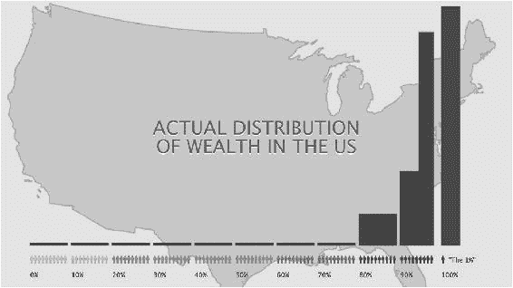

这张图已经开始看起来像我们可以展示给人们而不感到羞愧的那种。人物图标帮助传达了每个条形代表一个人口百分位的概念。条形图现在看起来还不太吸引人。由于每个条形代表每个人的财富，所以我们把每个条形画成一叠钞票。虽然这可能看起来是一个过于字面化的解释，但实际上会更清晰地传达出 1%的条形实际上是其他所有条形的 5 倍宽。

## 向条形图中添加文字

到现在为止，我们已经可以将钞票画成一系列矩形了：

```py
(defn banknotes [x y width height]
  (q/no-stroke)
  (q/fill 80 127 64)
  (doseq [y (range (* 3 (quot y 3)) (+ y height) 3)
          x (range x (+ x width) 7)]
    (q/rect x y 6 2)))
```

上述代码的唯一复杂之处在于需要将起始的*y*位置调整为`3`的偶数倍。这将确保所有的钞票在*y*轴上的高度如何，最终都能与*x*轴对齐。这是从上到下绘制条形的副作用，而不是反向绘制。

我们将在以下示例中将之前的函数添加到我们的草图中：

```py
(defn ex-10-15 []
  (let [size [960 540]]
    (q/sketch :size size
              :setup #((draw-shapes)
                       (draw-banknotes)
                       (draw-axis-labels)
                       (draw-title)))))
```

这将生成以下图表：

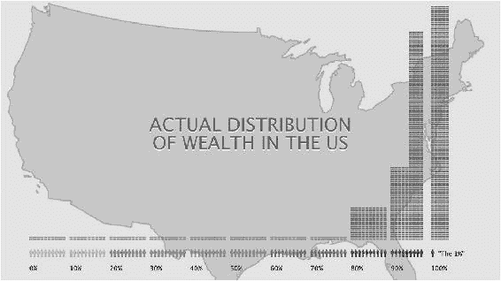

现在这已经是一个相对完整的图表，代表了美国实际的财富分布。之前提供的 YouTube 视频链接的一个优点是，它将实际分布与几种其他分布进行了对比：人们预期的财富分布和他们理想的财富分布。

## 融入额外数据

哈佛商学院教授迈克尔·诺顿和行为经济学家丹·阿里利对 5000 多名美国人进行了研究，评估他们对财富分配的看法。当他们展示了各种财富分配的例子，并让他们判断哪个例子来自美国时，大多数人选择了一个比实际情况更加平衡的分布。当被问及理想的财富分配时，92%的人选择了一个更加公平的分配方式。

以下图形展示了本研究的结果：

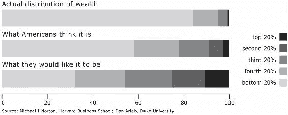

前面的图形由 Mother Jones 发布，来源为[`www.motherjones.com/politics/2011/02/income-inequality-in-america-chart-graph`](http://www.motherjones.com/politics/2011/02/income-inequality-in-america-chart-graph)，数据来源于[`www.people.hbs.edu/mnorton/norton%20ariely%20in%20press.pdf`](http://www.people.hbs.edu/mnorton/norton%20ariely%20in%20press.pdf)。

之前的图表很好地展示了人们对每个五分位的财富分布的感知与现实之间的相对差异。我们将把这些数据转化为一种替代表示方式，就像之前一样，我们可以将这些数据转化为表格表示。

从之前的图表和参考链接的论文中，我得到了以下按五分位划分的大致数据：

| 五分位 | 理想百分比 | 预期百分比 | 实际百分比 |
| --- | --- | --- | --- |
| 100th | 32.0% | 58.5% | 84.5% |
| 80th | 22.0% | 20.0% | 11.5% |
| 60th | 21.5% | 12.0% | 3.7% |
| 40th | 14.0% | 6.5% | 0.2% |
| 20th | 10.5% | 3.0% | 0.1% |

让我们取*理想*和*预期*的分布，并找到一种方法将它们绘制在我们现有的财富分布图上。我们的柱状图已经表示了不同百分位的相对财富，作为面积的大小。为了使两个数据集可比，我们也应该对这些数据做相同的处理。之前的表格通过已经将数据表示为五个大小相等的组，帮助我们简化了处理，因此我们无需像处理饼图数据时那样应用转换。

然而，让我们利用这个机会，进一步了解在 Quil 中绘制复杂形状，看看能否得到如下所示的数据展示：

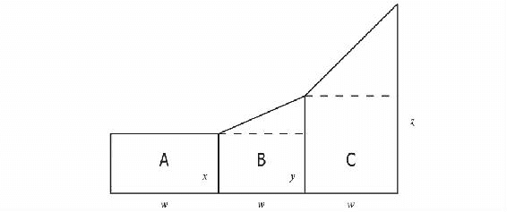

该表格提供了我们要通过标签为**A**、**B**和**C**的形状表示的相对面积。为了绘制先前的形状，我们必须计算出高度*x*、*y*和*z*。这些将为我们提供可在图表上绘制的坐标。

区域**A**、**B**和**C**的宽度是**w**。因此，**x**和**w**的乘积将等于**A**的面积：

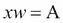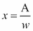

由此可得，*x*的高度仅为*A*的面积除以*w*。*Y*则稍微复杂一点，但也不算太复杂。*B*的三角形部分的面积等于：

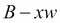

因此：

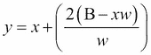

我们可以通过相同的方式计算*z*：

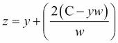

扩展我们的定义，得到以下*z*的方程：

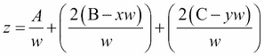

如果我们假设*w*为 1（所有我们的五分位宽度相等），那么我们可以得到以下方程，适用于任意数量的区间：

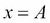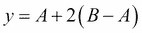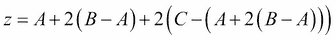

这可以通过一个简单的递归函数来表示。我们的第一个比例将被赋值为*x*。随后可以通过以下方式计算其他值：

```py
(defn area-points [proportions]
  (let [f (fn [prev area]
            (-> (- area prev)
                (* 2)
                (+ prev)))
        sum (reduce + proportions)]
    (->> (reductions f (first proportions) proportions)
         (map #(/ % sum)))))
```

`reductions`函数的行为与`reduce`完全相同，但会保留我们计算的中间步骤。我们不会只得到一个值，而是会得到一个值序列，对应于我们*y*-坐标的（比例）高度。

## 绘制复杂形状

前面定义的`area-points`函数将为我们提供一系列点以便绘制。然而，我们还没有涉及 Quil 中的函数，这些函数将允许我们绘制它们。要绘制直线，我们可以使用`q/line`函数。线函数将接受起点和终点坐标，并在它们之间绘制一条直线。我们可以通过这种方式构建一个面积图，但它没有填充。线条仅描述轮廓，我们不能像使用`q/rect`绘制直方图时那样构建带有填充色的形状。为了给形状填充颜色，我们需要一个一个顶点地构建它们。

要用 Quil 构建任意复杂的形状，首先调用`q/begin-shape`。这是一个有状态的函数，它让 Quil 知道我们想开始构建一系列顶点。随后调用的`q/vertex`将与我们正在构建的形状关联。最后，调用`q/end-shape`将完成形状的构建。我们将根据当前绘图上下文中指定的描边和填充样式来绘制它。

让我们通过绘制一些使用上一节定义的`area-points`函数的测试形状，看看它是如何工作的：

```py
(defn plot-area [proportions px py width height]
  (let [ys      (area-points proportions)
        points  (map vector (range) ys)
        x-scale (/ width (dec (count ys)))
        y-scale (/ height (apply max ys))]
    (q/stroke 0)
    (q/fill 200)
    (q/begin-shape)
    (doseq [[x y] points]
      (q/vertex (+ px (* x x-scale))
                (- py (* y y-scale))))
      (q/end-shape)))

(defn ex-10-16 []
  (let [expected [3 6.5 12 20 58.5]
        width  640
        height 480
        setup (fn []
                (q/background 255)
                (plot-area expected 0 height width height))]
    (q/sketch :setup setup :size [width height])))
```

这个示例使用之前定义的`area-points`函数绘制了`[3 6.5 12 20 58.5]`序列。这是美国“预期”财富分布数据表中列出的百分比值序列。`plot-area`函数会调用`begin-shape`，遍历由`area-points`返回的`*ys*`序列，并调用`end-shape`。结果如下：

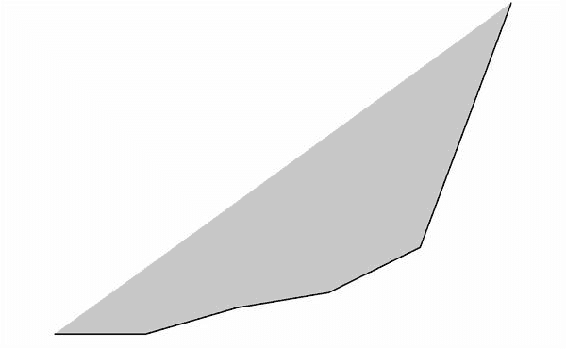

这还不是我们想要的效果。虽然我们要求填充形状，但我们并没有描述完整的待填充形状。Quil 不知道我们想如何封闭形状，因此它只是从最后一个点画到第一个点，横跨了我们图表的对角线。幸运的是，这个问题可以通过确保图表的底部两个角都有点来轻松解决：

```py
(defn plot-full-area [proportions px py width height]
  (let [ys      (area-points proportions)
        points  (map vector (range) ys)
        x-scale (/ width (dec (count ys)))
        y-scale (/ height (apply max ys))]
    (q/stroke 0)
    (q/fill 200)
    (q/begin-shape)
    (q/vertex 0 height)
    (doseq [[x y] points]
      (q/vertex (+ px (* x x-scale))
                (- py (* y y-scale))))
    (q/vertex width height)
    (q/end-shape)))

(defn ex-10-17 []
  (let [expected [3 6.5 12 20 58.5]
        width  640
        height 480
        setup (fn []
                (q/background 255)
                (plot-full-area expected 0 height width height))]
    (q/sketch :setup setup :size [width height])))
```

`plot-full-area`函数在遍历`*ys*`序列之前和之后都会多次调用`vertex`。这些指定的点确保在调用`end-shape`之前，形状已完全描述。结果如下图所示：

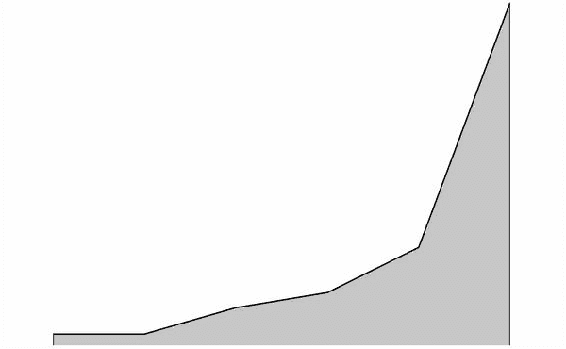

这已经好多了，开始看起来像一个面积图了。在下一节中，我们将讨论如何使用曲线来描述更复杂的形状。虽然曲线不是我们面积图的必需元素，但它会让结果看起来更有吸引力。

## 绘制曲线

面积图看起来不错，但我们可以通过使用 Quil 的样条曲线来去除那些尖锐的角。与其通过添加顶点来构建形状，我们可以调用`q/curve-vertex`来平滑边缘之间的连接。

`q/curve-vertex`函数实现了一种已知的曲线绘制方法，叫做 Catmull-Rom 样条曲线。要绘制一条曲线，我们必须至少指定四个顶点：第一个和最后一个顶点将作为控制点，曲线将在中间的两个顶点之间绘制。

我们通过下面的图示来可视化 Catmull-Rom 样条曲线的工作原理，该图显示了由点*a*、*b*、*c*和*d*指定的路径：

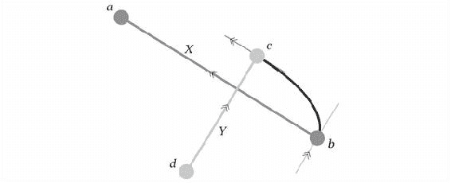

在**c**点处的曲线切线与**X**平行：由**a**和**b**两点所描述的直线；在**b**点处的曲线切线与**Y**平行：由**c**和**d**两点所描述的直线。因此，要绘制一条曲线，我们需要确保在曲线的起点和终点添加这些额外的控制点。每个控制点都通过`curve-vertex`添加，我们会在迭代点之前先调用一次，然后在结束时再调用一次：

```py
(defn smooth-curve [xs ys]
  (let [points (map vector xs ys)]
    (apply q/curve-vertex (first points))
    (doseq [point points]
      (apply q/curve-vertex point))
    (apply q/curve-vertex (last points))))
```

现在我们已经定义了一个`smooth-curve`函数，我们将在接下来的两个函数中使用它，分别是`smooth-stroke`和`smooth-area`：

```py
(defn smooth-stroke [xs ys]
  (q/begin-shape)
  (q/vertex (first xs) (first ys))
  (smooth-curve (rest xs) (rest ys))
  (q/end-shape))

(defn smooth-area [xs ys]
  (q/begin-shape)
  (q/vertex (first xs) (first ys))
  (smooth-curve (rest xs) (rest ys))
  (q/vertex (last xs) (first ys))
  (q/end-shape))
```

`smooth-stroke`函数将通过为每个*xs*和*ys*创建顶点来绘制定义的形状。`smooth-area`函数通过闭合形状并避免之前看到的填充与形状对角线交叉的情况，扩展了这一点。将这两个函数结合起来的是`plot-curve`，该函数接受要绘制的*xs*和*ys*，以及用于绘制的填充颜色、边框颜色和边框粗细：

```py
(defn plot-curve [xs ys fill-color
                  stroke-color stroke-weight]
  (let [points (map vector xs ys)]
    (q/no-stroke)
    (q/fill fill-color)
    (smooth-area xs ys)
    (q/no-fill)
    (q/stroke stroke-color)
    (q/stroke-weight stroke-weight)
    (smooth-stroke xs ys)))
```

让我们在之前绘制的相同预期值序列上调用`plot-curve`函数，并比较差异：

```py
(defn plot-smooth-area [proportions px py width height]
  (let [ys      (cons 0 (area-points proportions))
        points  (map vector (range) ys)
        x-scale (/ width (dec (count ys)))
        y-scale (/ height (apply max ys) -1)]
    (plot-curve (map (point->px px x-scale) (range (count ys)))
                (map (point->px py y-scale) ys)
                (q/color 200)
                (q/color 0) 2)))

(defn ex-10-18 []
  (let [expected [3 6.5 12 20 58.5]
        width  640
        height 480
        setup (fn []
                (q/background 255)
                (plot-smooth-area expected 0 height
                                  width height))]
    (q/sketch :setup setup :size [width height])))
```

这个示例生成了如下图像：

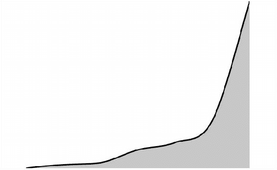

曲线的效果微妙，但它为我们的图表提供了润色，否则图表会显得不完整。前面的图表展示了 Norton 和 Ariely 研究中*预期*的财富分布。在将其与之前创建的*实际*财富分布图结合之前，让我们看看它如何与同一研究中的*理想*财富分布结合。

## 绘制复合图表

之前的描述展示了如何创建一个适应区域的单一曲线图。正如我们定义的那样，`plot-smooth-area`函数将在我们绘制的每个区域中填充指定的高度。从绘图的角度看，这样做是合理的，但在尝试绘制两个可比较图表时，这就不太合适了：我们需要确保它们使用相同的缩放比例。

在接下来的代码块中，我们将根据两个图形中较大的一个来计算缩放比例，然后使用该比例绘制两个图形。这样可以确保我们绘制的所有系列彼此之间可以进行比较。组合图表将填满我们分配给它的宽度和高度：

```py
(defn plot-areas [series px py width height]
  (let [series-ys (map area-points series)
        n-points  (count (first series-ys))
        x-scale   (point->px px (/ width (dec n-points)))
        xs        (map x-scale (range n-points))
        y-max     (apply max (apply concat series-ys))
        y-scale   (point->px py (/ height y-max -1))]
    (doseq [ys series-ys]
      (plot-curve (cons (first xs) xs)
                  (map y-scale (cons 0 ys))
                  (q/color 255 100)
                  (q/color 255 200) 3))))

(defn ex-10-19 []
  (let [expected [3 6.5 12 20 58.5]
        ideal    [10.5 14 21.5 22 32]
        width  640
        height 480
        setup (fn []
                (q/background 100)
                (plot-areas [expected ideal] 0 height
                            width height))]
    (q/sketch :setup setup :size [width height])))
```

我们使用 `plot-areas` 函数绘制了 `expected` 和 `ideal` 两个系列，且通过 `background` 函数将背景设为更深的颜色。在调用 `plot-curve` 时，我们指定使用半透明的白色作为填充颜色。下图展示了结果：

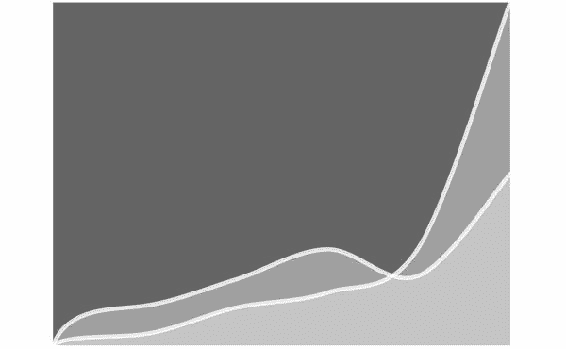

为了将这个图表与之前创建的实际数据图表结合，我们只需要调整它的尺度以便匹配。此图表右上角的最高点对应于 5% 的概率密度。我们实际图表上的 96-99^(th) 百分位代表总量的 7.5%，各自对应其图表。这意味着我们需要将之前的图表绘制为现有图表的 2/3 高度，才能使坐标轴可比。现在我们来做这个，并在此过程中为两个新系列添加标签：

```py
(defn draw-expected-ideal []
  (let [expected [3 6.5 12 20 58.5]
        ideal    [10.5 14 21.5 22 32]]
    (plot-areas [expected ideal]
                plot-x
                (+ plot-y plot-height)
                plot-width
                (* (/ plot-height 0.075) 0.05))
    (q/text-size 20)
    (emboss-text "EXPECTED" 400 430)
    (emboss-text "IDEAL" 250 430)))
```

最后，我们调用草图中的 `draw-expected-ideal` 函数以及之前定义的其他函数：

```py
(defn ex-10-20 []
  (let [size [960 540]]
    (q/sketch :size size
              :setup #((draw-shapes)
                       (draw-expected-ideal)
                       (draw-banknotes)
                       (draw-axis-labels)
                       (draw-title)))))
```

完成的结果在下图中展示：

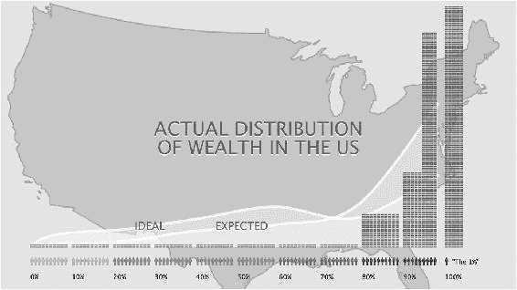

希望你会同意，最终的图表既美观又富有信息性。最重要的是，我们是通过实际数据的绘图指令来生成这张图表。如果这张图表是手工制作的，其完整性将难以建立。

## 输出为 PDF

所有元素组合在一起，最终形成了可能被打印出来的图形。我们提供的绘图指令是基于矢量的——而非基于像素的——因此它将按需要的任何分辨率进行缩放而不失真。

与我们用 `save` 方法将直方图输出为基于像素的格式不同，我们将输出为 PDF 格式。PDF 格式能够保持我们的艺术作品的可扩展性，并且允许我们在任何所需的分辨率下输出。为此，我们通过传递 `:pdf` 关键字以及 `:output-file` 路径来配置草图以使用 PDF 渲染器。

```py
(defn ex-10-21 []
  (let [size [960 540]]
    (q/sketch :size size
              :setup #((draw-shapes)
                       (draw-expected-ideal)
                       (draw-banknotes)
                       (draw-axis-labels)
                       (draw-title))
              :renderer :pdf
              :output-file "wealth-distribution.pdf")))
```

最终的示例将把完成的 PDF 文件输出到项目目录的根目录。

# 总结

在本章中，我们看到通过使用简单的可视化—仅使用彩色矩形—如何从数据中获得有价值的洞察，并且如何结合 Clojure 核心函数与 Quil 的绘图 API，使我们能够生成传递信息的强大图形。

我们通过 Quil 库实现了这一切。Quil 的功能远不止我们在此展示的内容：它支持交互式动画，支持 ClojureScript 输出到网页，并且还可以进行 3D 渲染。可视化是一个庞大的主题，我们在本章中只能通过一些示例来激发你对它的兴趣。通过展示即使是使用矩形、曲线和 SVG 的基础绘图指令如何组合成强大的图形，我们希望能激发你创造自定义可视化的可能性。

这是《*Clojure 数据科学*》的最后一章。请务必访问本书的网站 [`clojuredatascience.com`](http://clojuredatascience.com)，获取更多关于所涵盖主题的信息和进一步阅读的链接。我们打算为数据科学家，尤其是 Clojure 程序员，提供一个持续更新的资源。

使用一种库也在迅速发展的编程语言，来传达数据科学这个多样且迅速发展的领域的广度和深度，确实是一个雄心勃勃的任务。尽管如此，我们希望《*Clojure 数据科学*》能让你对统计学、机器学习和大数据处理的一些基本概念有所了解。这些概念基础应该能为你提供帮助，即使技术选项——甚至可能是你的编程语言选择——未来还会继续演变。
