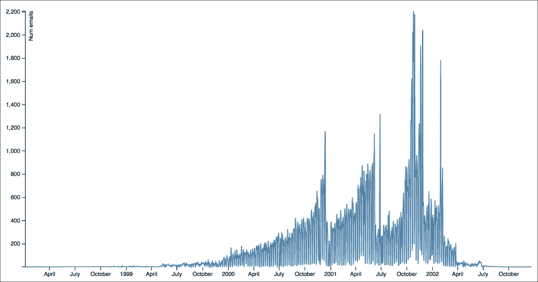

# 第一章 为什么需要清洁数据？

大数据、数据挖掘、机器学习和可视化——看起来数据是最近计算领域中一切伟大事件的中心。从统计学家到软件开发人员再到图形设计师，每个人都突然对数据科学感兴趣。便宜的硬件、更好的处理和可视化工具以及大量免费可用的数据的结合意味着我们现在可以比以往更准确更轻松地发现趋势和进行预测。

但你可能*没有*听说过的是，所有这些数据科学的希望和梦想都基于数据是混乱的事实。通常情况下，数据需要被移动、压缩、清洗、切割、切片、切块，并经历任何其他变换，然后才能准备好用于我们认为是数据科学核心的算法或可视化。

在本章中，我们将涵盖：

+   一个简单的包括数据清洁在内的数据科学六步骤流程

+   有助于传达如何清洁数据的有用指南

+   一些你可能会发现对数据清洁有帮助的工具

+   一个简单的例子，展示数据清洁如何融入整体数据科学过程中

# 一种新鲜的视角

我们最近读到《纽约时报》称数据清洁为**清洁工作**，并称数据科学家 80%的时间将花在这种清洁工作上。正如我们在下图中看到的那样，尽管其重要性，数据清洁并没有像大数据、数据挖掘或机器学习那样真正吸引公众的想象力：


谁能责怪我们不想成群结队地讨论清洁工作有多有趣和超级酷呢？不幸的是——这对于实际的家务活也是如此——如果我们只是完成工作而不是忽视它、抱怨它并给它各种贬低的名字，我们所有人都会更好。

还不信？考虑一个不同的隐喻，你不是数据清洁工；你是数据大厨。想象一下，你被交给了一篮子盛满了你曾经见过的最美味的传统蔬菜，每一种都在新鲜和有机农场上经过精心挑选并且可持续生产。番茄是完美多汁的，生菜是脆的，辣椒是明亮而坚固的。你兴奋地开始烹饪，但四周都是脏乱的厨房，锅碗瓢盆上堆积着不知道是什么的脏污，而且，对于工具，你只有一把生锈的刀和一块潮湿的毛巾。水槽坏了，你刚刚看到一只甲虫从那些曾经美丽的生菜下爬出来。

即便是初学者厨师也知道，你不应该在这样的地方做饭。至少，你会毁掉那一篮子原本美味的食材。而最糟糕的是，你会让人们生病。而且像这样做饭根本不有趣，用一把生锈的刀切菜整天都切不完。

就像在厨房里一样，提前花时间清理和准备你的数据科学工作空间、工具和原材料是绝对值得的。1960 年代的老计算机编程格言“垃圾进，垃圾出”在数据科学中同样适用。

# 数据科学流程

清理数据如何融入数据科学的其余工作中呢？简而言之，它是一个关键环节，并且直接影响到前后的各个过程。

更长的答案依赖于通过六个步骤来描述数据科学过程，如下所示。数据清理正处于中间阶段，位于步骤 3。与其将这些步骤视为一个线性的、从开始到结束的框架，我们将根据需要在项目过程中多次回顾这些步骤，采用更迭代的方式进行处理。还值得指出的是，并非每个项目都会包含所有步骤；例如，有时我们没有收集步骤或可视化步骤。这完全取决于项目的具体需求：

1.  第一步是提出问题陈述。明确你要解决的问题是什么。

1.  下一步是数据收集与存储。帮助你回答这个问题的数据来自哪里？你将其存储在哪里，是什么格式？

1.  接下来是数据清理。你是否对数据进行了任何更改？删除了什么吗？你是如何为接下来的分析和挖掘步骤做准备的？

1.  下一步是数据分析和机器学习。你对数据做了什么样的处理？进行了哪些转换？使用了什么算法？应用了什么公式？用了哪些机器学习算法？顺序是什么？

1.  表示与可视化是下一步。你如何展示你的工作结果？这可以是一个或多个表格、图纸、图表、图形、网络图、词云、地图等等。这是最适合表示数据的可视化方式吗？你考虑过哪些替代方案？

1.  最后一步是问题解决。你在第一步提出的问题或问题的答案是什么？你的结果有什么局限性？是否有些问题你无法通过此方法回答？你本可以做些什么不同的事情？下一步该做什么？

数据清理在进行分析/挖掘/机器学习或可视化步骤之前是有道理的。不过，记住，由于这是一个迭代过程，在项目进行过程中，我们可能需要多次回顾清理工作。此外，我们将要进行的挖掘或分析类型通常会影响我们清理数据的方式。我们认为清理包括一系列任务，这些任务可能会根据所选的分析方法而有所不同，例如，转换文件格式、改变字符编码，或者解析数据中的某些部分进行处理。

数据清理还将与数据收集和存储步骤（步骤 2）紧密相关。这意味着你可能需要先收集原始数据，存储它，清理它，然后再存储已清理的数据，接着收集一些更多的数据，清理这些数据，将其与之前的数据合并，再次清理，存储，依此类推。因此，记住你做了什么，并能够在需要时重复该过程或告诉别人你做了什么，变得非常重要。

# 数据清理的沟通

由于六步过程是围绕一个故事情节组织的，从一个问题开始，最后解决该问题，因此它非常适合作为报告框架。如果你决定将六步框架作为报告数据科学过程的一种方式，你会发现，在第三步，你将能够写出关于数据清理的内容。

但即使你没有以正式报告的形式记录你的数据科学过程，你会发现，仔细记录你对数据所做的事情及其顺序是非常有帮助的。

记住，即使是最小、风险最低的项目，你也总是为至少两个人服务：现在的你和六个月后的你。相信我，当我告诉你六个月后的你不会记得今天的你是如何清理数据的，更不用说为什么这么做或如何再次进行清理了！

最简单的解决方案就是记录一个**日志**，记录你所做的事情。日志应包括链接、截图或你运行的具体命令的复制粘贴，并附上简短的解释说明为什么这么做。以下示例展示了一个非常小的文本挖掘项目的日志，其中嵌入了每个阶段输出文件的链接，以及清理脚本的链接。如果你对日志中提到的一些技术不熟悉，请不要担心。这个例子会告诉你日志可能是什么样子的：

1.  我们写了一个 SQL 查询来检索每个项目及其描述的列表。

1.  为了在 Python 中进行词频分析，我们需要特定格式的 JSON 数据。我们构建了一个 PHP 脚本，遍历查询的结果，将其结果存放在一个 JSON 文件中（版本 1）。

1.  这个文件存在一些格式错误，比如未转义的引号和嵌入的 HTML 标签。这些错误通过第二个 PHP 脚本得到了修正，运行该脚本后，会打印出这个已清理的 JSON 文件（版本 2）。

请注意，我们的日志尝试解释我们做了什么以及为什么这么做。它简短且可以在可能的情况下包含链接。

如果你愿意使用更复杂的解决方案来进行数据清理的管理，有很多选择，例如，如果你熟悉**版本控制系统**，如**Git**或 Subversion，这些通常用于管理软件项目，那么你可能能想到如何扩展它们来跟踪数据清理的过程。无论你选择什么系统，哪怕是一个简单的日志，最重要的是实际上去使用它。因此，选择一个能鼓励你使用它而不是妨碍你进展的工具。

# 我们的数据清理环境

本书中使用的数据清理方法是一种通用且广泛适用的方法。它不要求或假设你拥有任何高端的单一供应商数据库或数据分析产品（事实上，这些供应商和产品可能有自己的清理程序或方法）。我设计了本书中的清理教程，围绕你在使用现实世界数据集时可能遇到的常见问题。我将本书设计为围绕任何人都可以访问的真实数据。我将向你展示如何使用开源的通用软件和技术来清理数据，这些工具易于获得且在职场中被广泛使用。

以下是你需要准备使用的一些工具和技术：

+   对于几乎每一章，我们将使用一个终端窗口及其命令行界面，例如 Mac OSX 上的 Terminal 程序或 Linux 系统中的 bash。在 Windows 上，某些命令可以通过 Windows 命令提示符运行，但其他命令可能需要使用更全功能的 Windows 命令行程序，如 CygWin。

+   对于几乎每一章，我们将使用文本编辑器或程序员编辑器，例如 Mac 上的 Text Wrangler，Linux 中的 vi 或 emacs，或 Windows 中的 Notepad++或 Sublime Editor。

+   对于大多数章节，我们将需要一个 Python 2.7 客户端，例如 Enthought Canopy，并且我们需要足够的权限来安装软件包。许多示例将适用于 Python 3，但有些则不适用，因此，如果你已经安装了 Python 3，可能需要创建一个备用的 2.7 安装环境。

+   对于第三章，*清洁数据的主力工具——电子表格和文本编辑器*，我们将需要一个电子表格程序（我们将专注于 Microsoft Excel 和 Google Spreadsheets）。

+   对于第七章，*RDBMS 清理技术*，我们将需要一个可用的 MySQL 安装和客户端软件来访问它。

# 一个入门示例

为了开始，让我们用一个小例子来锐化我们的厨刀，该例子结合了六步框架，并说明如何处理一些简单的数据清理问题。这个例子使用了公开的 Enron 电子邮件数据集。这个数据集非常著名，包含了已故的 Enron 公司员工之间发送和接收的电子邮件。作为美国政府对 Enron 会计欺诈的调查的一部分，这些电子邮件成为了公共记录，现在任何人都可以下载。来自多个领域的研究人员发现这些电子邮件对于研究职场沟通、社交网络等非常有帮助。

### 注意

你可以在[`en.wikipedia.org/wiki/Enron`](http://en.wikipedia.org/wiki/Enron)上阅读更多关于 Enron 及其导致公司倒闭的财务丑闻的信息，此外，你还可以在[`en.wikipedia.org/wiki/Enron_Corpus`](http://en.wikipedia.org/wiki/Enron_Corpus)上了解更多关于 Enron 电子邮件数据集的信息。

在这个例子中，我们将在一个简单的数据科学问题上实现六步框架。假设我们想揭示 Enron 公司内电子邮件使用的趋势和模式。我们将从按日期统计发送/接收的电子邮件开始。然后，我们将在图表上按时间展示这些计数。

首先，我们需要按照[`www.ahschulz.de/enron-email-data/`](http://www.ahschulz.de/enron-email-data/)上的说明下载 MySQL Enron 数据集。另一个（备用）下载源是[`www.cs.purdue.edu/homes/jpfeiff/enron.html`](https://www.cs.purdue.edu/homes/jpfeiff/enron.html)。按照这些说明，我们需要将数据导入到 MySQL 服务器上的一个新的数据库架构中，名为**Enron**。数据现在已经可以通过 MySQL 命令行界面或通过 PHPMyAdmin 等基于 Web 的工具进行查询。

我们的第一个计数查询如下所示：

```py
SELECT date(date) AS dateSent, count(mid) AS numMsg
FROM message
GROUP BY dateSent
ORDER BY dateSent;
```

立刻，我们注意到有许多电子邮件的日期不正确，例如，有一些日期似乎早于或晚于公司存在的时间（例如，1979 年），或者是一些年份显得不合逻辑（例如，0001 年或 2044 年）。电子邮件很旧，但可不是*那么*旧！

以下表格显示了部分异常行的摘录（完整的结果集大约有 1300 行）。所有这些日期格式都正确；然而，一些日期显然是错误的：

| dateSent | numMsg |
| --- | --- |
| `0002-03-05` | `1` |
| `0002-03-07` | `3` |
| `0002-03-08` | `2` |
| `0002-03-12` | `1` |
| `1979-12-31` | `6` |
| `1997-01-01` | `1` |
| `1998-01-04` | `1` |
| `1998-01-05` | `1` |
| `1998-10-30` | `3` |

这些错误的日期很可能是由于邮件客户端配置不当造成的。此时，我们有三种选择来处理：

+   **什么都不做**：也许我们可以忽略错误数据，照样制作折线图。但是，最低的错误日期来自公元 0001 年，最高的来自 2044 年，我们可以想象我们的折线图上有 1300 个时间轴刻度，每个刻度显示 1 或 2。这个图看起来既不吸引人，也不具备信息价值，因此什么都不做是不可行的。

+   **修复数据**：我们可以尝试找出每条错误消息的正确日期，并生成一个修正后的数据集，然后用来构建我们的图表。

+   **丢弃受影响的电子邮件**：我们可以做出一个明智的决定，丢弃任何日期超出预定范围的电子邮件。

为了在选项 2 和选项 3 之间做出决定，我们需要使用 1999-2002 年的窗口来统计受影响的消息数量。我们可以使用以下 SQL：

```py
SELECT count(*) FROM message
WHERE year(date) < 1998 or year(date) > 2002;
Result: 325
```

325 条带有错误日期的消息最初看起来很多，但实际上它们仅占整个数据集的 1%左右。根据我们的目标，我们可能决定手动修正这些日期，但这里假设我们不介意丢失 1%的消息。我们可以谨慎地选择第 3 个选项，丢弃受影响的电子邮件。以下是修改后的查询：

```py
SELECT date(date) AS dateSent, count(mid) AS numMsg
FROM message
WHERE year(date) BETWEEN 1998 AND 2002
GROUP BY dateSent
ORDER BY dateSent;
```

清理后的数据现在包含 1211 行，每行都有一个计数。以下是新数据集的一个片段：

| dateSent | numMsg |
| --- | --- |
| `1998-01-04` | `1` |
| `1998-01-05` | `1` |
| `1998-10-30` | `3` |
| `1998-11-02` | `1` |
| `1998-11-03` | `1` |
| `1998-11-04` | `4` |
| `1998-11-05` | `1` |
| `1998-11-13` | `2` |

在这个例子中，看起来 1998 年 1 月有两个可疑的日期，直到 10 月才开始有规律地收到消息。这有些奇怪，同时也引出了另一个问题，我们是否需要在 *x* 轴上显示每一个日期，即使那一天没有发送电子邮件？

如果我们回答“是”，即使某些日期的计数为零，也需要显示每个日期；这可能意味着需要再进行一轮数据清理，以便生成显示零值日期的行。

但也许我们可以更有策略性地考虑这个问题。是否需要在原始数据中保留零值，实际上取决于我们使用的工具和图表的类型。例如，Google 表格会构建一个折线图或条形图，自动检测 *x* 轴上缺失的日期，并且即使初始数据集中没有给出，仍会填充零值。在我们的数据中，这些零值将代表 1998 年大部分时间里缺失的日期。

接下来的三张图展示了这些工具及它们如何处理日期轴上的零值。请注意，Google 表格中数据的表示方式在开始和结束处有较长的零尾：


Google 表格会自动填充任何缺失的日期为零。

D3 JavaScript 可视化库也会执行相同的操作，默认情况下填充缺失日期的零值，如下图所示。

### 提示

对于一个简单的 D3 折线图示例，看看这个教程：[`bl.ocks.org/mbostock/3883245`](http://bl.ocks.org/mbostock/3883245)。



D3 会自动用零填充任何缺失的日期。

Excel 在其默认折线图中也有相同的日期填充行为，如下所示：


Excel 会自动用零填充任何缺失的日期。

接下来，我们需要考虑的是，允许日期的零值是否会使我们的 *x* 轴变得更长（我的计数查询返回了 1211 行，但指定的日期范围总共有 1822 天，范围是 1998-2002）。也许显示零计数的日期并不适用；如果图表太拥挤，我们反正也看不见间隙。

为了比较，我们可以快速将相同的数据导入到 Google 表格（你也可以在 Excel 或 D3 中做这件事），但这次我们只选择计数列来构建图表，从而强制 Google 表格 *不* 显示 *x* 轴上的日期。结果是只显示来自数据库计数查询的真正数据形状，未填充零计数日期。长尾消失了，但图表的关键部分（中间部分）的整体形状保持不变：


现在，图表仅显示有一条或多条消息的日期。

幸运的是，数据的形状相似，除了图表的头部和尾部较短。基于这种比较，并且基于我们计划对数据进行的操作（记住，我们的目标只是创建一个简单的折线图），我们可以放心继续推进，而不需要专门创建一个包含零计数日期的数据集。

完成所有操作后，折线图显示了安然公司在电子邮件流量方面的几次显著峰值。最大的一些峰值和最重的流量出现在 2001 年 10 月和 11 月，当时丑闻爆发。两个较小的峰值发生在 2001 年 6 月 26-27 日和 2000 年 12 月 12-13 日，那时安然发生了类似的引人注目的事件（一次是加利福尼亚能源危机，另一次是公司领导层变动）。

如果你对数据分析感到兴奋，你可能会对如何进一步处理这些数据有各种酷点子。现在，既然你已经清理了数据，分析工作应该会更轻松，希望如此！

# 总结

经过这么多的工作，看起来《纽约时报》说得对。从这个简单的例子中可以看出，数据清理确实占据了解答一个即使是微小数据相关问题的 80%的工作量（在这个案例中，关于数据清理的 rationale 和选择的讨论就占用了 900 字案例研究中的 700 字）。数据清理真的是数据科学过程中的关键部分，它不仅涉及理解技术问题，还需要我们做出一些价值判断。作为数据清理的一部分，我们甚至必须考虑到分析和可视化步骤的预期结果，尽管我们还没有真正完成这些步骤。

在考虑本章所呈现的数据清理角色后，我们会更加明显地意识到，提升数据清理效率能够迅速转化为大量的时间节省。

下一章将介绍一些基本知识，任何想要进入更大、更好的“厨房”的“数据大厨”都需要掌握这些，包括文件格式、数据类型和字符编码等内容。
