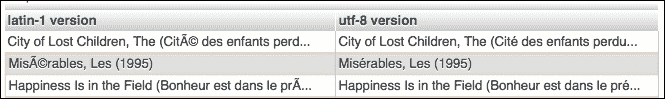

# 第二章。基础知识 - 格式、类型和编码

几年前，在我家每年一度的节日礼物交换活动中，我收到了一件非常有趣的礼物。那是一个*garde manger*厨房工具套装，包括各种不同的刀具以及削皮器、勺子和去皮器，用于准备蔬菜和水果。我学会了使用每一个工具，随着时间的推移，我对槽刀和番茄刀特别喜爱。本章就像是你的入门数据清理工具集。我们将审视：

+   文件格式，包括压缩标准

+   数据类型的基础知识（包括不同类型的缺失数据）

+   字符编码

随着我们进入后面的章节，我们将需要所有这些基础知识。我们将覆盖一些概念，它们如此基础，以至于你几乎每天都会遇到，例如压缩和文件格式。这些是如此常见，就像厨师的刀一样。但是一些概念，如字符编码，更具特殊用途和异国情调，就像番茄刀一样！

# 文件格式

本节描述了数据科学家在处理野外数据时可能遇到的不同文件格式，换句话说，那些精心构建的数据集中不会出现的数据类型。在这里，我们遇到了与最常见的文件格式交互的一些策略和限制，然后我们回顾了各种压缩和存档格式。

## 文本文件与二进制文件的区别

当从在线来源收集数据时，你可能会以以下一种方式遇到数据：

+   数据将以文件形式可供下载

+   数据将通过交互式前端提供给存储系统，例如通过带有查询接口的数据库系统

+   数据将通过连续流的形式提供

+   数据将通过**应用程序编程接口**（**API**）提供。

无论如何，你可能会发现自己需要稍后创建数据文件以便与他人分享。因此，对各种数据格式及其优缺点有坚实的基础是很重要的。

首先，我们可以将计算机文件视为属于两大类，通常称为**文本文件**和**二进制文件**。严格来说，所有文件都由一系列字节组成，依次排列，因此严格地说，所有文件都是二进制的。但是如果文件中的字节全部都是文本字符（例如字母、数字以及一些控制字符，如换行符、回车符或制表符），那么我们称该文件为文本文件。相反，二进制文件则是那些包含大多数非人类可读字符的字节的文件。

### 打开和读取文件

文本文件可以通过叫做文本编辑器的程序进行读取和写入。如果你尝试在文本编辑器中打开一个文件并成功读取（即使你不理解它），那么它可能是一个文本文件。然而，如果你在文本编辑器中打开文件，看到的只是一些杂乱无章的字符和难以辨认的符号，那么它很可能是一个二进制文件。

二进制文件是为了通过特定的应用程序打开或编辑，而不是通过文本编辑器。例如，Microsoft Excel 表格是为了在 Microsoft Excel 中打开和读取的，数字相机拍摄的照片可以通过图形程序读取，如 Photoshop 或 Preview。有时，二进制文件可以通过多个兼容的软件包读取，例如，许多不同的图形程序可以读取和编辑照片，甚至为专有格式设计的二进制文件，例如 Microsoft Excel 或 Microsoft Word 文件，也可以通过兼容的软件读取和编辑，如 Apache OpenOffice。还有一些程序叫做二进制编辑器，可以让你查看二进制文件内部并进行编辑。

有时，文本文件也旨在被应用程序读取，但你仍然可以在文本编辑器中读取它们。例如，网页和计算机源代码仅由文本字符组成，可以轻松在文本编辑器中编辑，但没有一定的格式或布局训练，很难理解。

通常，即使不在编辑器中打开文件，也可以知道你拥有的是什么类型的文件。例如，大多数人会根据文件名寻找线索。三位数和四位数的文件扩展名是指示文件类型的常见方式。许多人都知道的常见扩展名包括：

+   `.xlsx` 用于 Excel 文件，`.docx` 用于 Word 文件，`.pptx` 用于 PowerPoint 文件

+   `.png`、`.jpg` 和 `.gif` 用于图像文件

+   `.mp3`、`.ogg`、`.wmv` 和 `.mp4` 用于音乐和视频文件

+   `.txt` 用于文本文件

还有一些网站列出了文件扩展名以及与这些特定扩展名关联的程序。一个受欢迎的网站是 [fileinfo.com](http://fileinfo.com)，维基百科也提供了一个按字母顺序排列的文件扩展名列表，链接为 [`en.wikipedia.org/wiki/List_of_filename_extensions_(alphabetical)`](https://en.wikipedia.org/wiki/List_of_filename_extensions_(alphabetical))。

### 查看文件内容

如果你必须打开一个未知文件以查看其内容，有几种命令行选项可以让你查看文件的前几个字节。

#### 在 OSX 或 Linux 系统上

在 OSX Mac 或 Linux 中，打开终端窗口（在 Mac 中，你可以通过导航到 **应用程序** | **实用工具** | **终端** 来找到标准的终端应用程序），使用打印当前工作目录（`pwd`）和更改目录（`cd`）命令导航到文件所在位置，然后使用 `less` 命令逐页查看文件。以下是我执行此操作时的命令：

```py
flossmole2:~ megan$ pwd
/Users/megan
flossmole2:~ megan$ cd Downloads
flossmole2:Downloads megan$ less OlympicAthletes_0.xlsx
"OlympicAthletes_0.xlsx" may be a binary file. See it anyway?

```

如果系统提示你“仍然查看”，那么该文件是二进制文件，你应该做好看到乱码的准备。你可以输入 `y` 来查看文件，或者输入 `n` 来退出。下图展示了使用 `less` 命令查看名为 `OlympicAthletes_0.xlsx` 的文件的结果，如对话框所示。真是一团乱麻！


查看完后，你可以输入 `q` 来退出 `less` 程序。

#### 在 Windows 上

Windows 的命令提示符中也有 `more` 程序。它的功能与前面描述的 `less` 命令类似（毕竟，*less is more*）。你可以通过 **开始** 菜单中的 **cmd** 访问 Windows 命令提示符。在 Windows 8 中，导航到 **应用程序** | **Windows 系统** | **命令提示符**。你可以像前面的示例中那样使用 `cd` 和 `pwd` 来导航到你的文件。

## 常见的文本文件格式

本书中，我们主要关注的是文本文件，而不是二进制文件。（一些特殊例外包括压缩文件和归档文件，我们将在下一节讨论；Excel 和 PDF 文件，它们各自有独立的章节讨论。）

本书中我们关注的三种主要文本文件类型是：

+   分隔符格式（结构化数据）

+   JSON 格式（半结构化数据）

+   HTML 格式（非结构化数据）

这些文件在布局上有所不同（它们在我们阅读时看起来不同），在结构的可预测性方面也有所差异。换句话说，文件中有多少部分是有组织且结构化的数据？文件中的数据有多少是无规律或非结构化的？在这里，我们将逐一讨论这些文本文件格式。

## 分隔符格式

分隔符文件是非常常见的一种数据共享和传输方式。分隔符格式文件就是每个数据属性（每个 *列*）和每个数据实例（每个 *行*）通过一个一致的字符符号进行分隔的文本文件。我们称这些分隔符为 **分隔符**。最常见的两个分隔符是制表符和逗号。这两种常见选择分别反映在 **制表符分隔值**（**TSV**）和 **逗号分隔值**（**CSV**）的文件扩展名中。有时，分隔符文件也被称为 **面向记录** 文件，因为假设每一行代表一个记录。

以下是三组数据实例（三行描述人名），数据值由逗号分隔。第一行列出了列名，这一行也被称为**表头行**，它在数据中被突出显示以便更清晰地查看：

```py
First name,birth date,favorite color
Sally,1970-09-09,blue
Manu,1984-11-03,red
Martin,1978-12-10,yellow
```

注意，在这个分隔数据的例子中，*没有非数据*的信息。每一项内容都是一行或一个数据值，而且数据高度结构化。然而，仍然有一些选项可以区分不同的分隔格式。第一个区分点是数据的每一实例（每一行）是如何分隔的。通常，在行末使用换行符、回车符，或者两者结合，这取决于在创建文件时使用的操作环境。

### 查看不可见字符

在前面的例子中，换行符或回车符是不可见的。如何查看这些不可见字符呢？我们将在 Mac 上的 Text Wrangler 中读取相同的文件（类似的功能强大的编辑器如 Notepad++也适用于 Windows），在这里我们可以使用**显示不可见字符**选项（通过导航到**查看** | **文本显示**来启用）。


查看不可见字符的另一种方法是在 Linux 系统或 Mac 的终端窗口中使用`vi`（在 Windows 机器上默认不可用）。使用`vi`查看文件中不可见字符的过程如下：

1.  首先，使用以下命令：

    `vi <filename>`

1.  接着，输入`:`进入`vi`编辑模式。

1.  然后，输入`set list`并按*回车*查看不可见字符。

以下截图显示了`vi`中通过`set list`揭示的行结束符，显示了行终止符号$。


### 用符号括起来的值以防止字符错误

分隔文件的另一个重要选项是使用什么字符来括住每个被分隔的值。例如，逗号分隔值非常好，但如果你的数字值中包含逗号作为千位分隔符呢？考虑以下例子，其中薪资值的千位分隔符用了逗号，而逗号又是分隔符：

```py
First name,birth date,favorite color,salary
Sally,1971-09-16,light blue,129,000
Manu,1984-11-03,red,159,960
Martin,1978-12-10,yellow,76,888
```

如何在文件创建时修复这个问题？好吧，我们有两个选项：

+   **选项 1**：创建分隔文件的人需要在创建表格之前移除最后一列中的逗号（换句话说，薪资金额中不能有逗号）。

+   **选项 2**：创建这个文件的人需要使用额外的符号来括起数据值。

如果选择了选项 2，通常会添加双引号分隔符来括住数据值。所以，第一行的`129,000`会变成`"129,000"`。

### 转义字符

如果数据本身包含引号呢？比如 Sally 最喜欢的颜色是`light "Carolina" blue`？看看这个例子：

```py
First name,birth date,favorite color,salary
"Sally","1971-09-16","light "Carolina" blue","129,000"
"Manu","1984-11-03","red","159,960"
"Martin","1978-12-10","yellow","76,888"
```

内部引号必须通过使用另一个特殊字符——反斜杠 `\` 来转义：

```py
First name,birth date,favorite color,salary
"Sally","1971-09-16","light \"Carolina\" blue","129,000"
"Manu","1984-11-03","red","159,960"
"Martin","1978-12-10","yellow","76,888"
```

### 小贴士

或者，我们可以尝试用单引号来替代双引号进行封装，但那样我们可能会遇到拥有所有格的情况，比如“it's”或者像 O'Malley 这样的名字。总是会有些问题！

分隔文件非常方便，因为它们容易理解，并且可以在简单的文本编辑器中轻松访问。然而，正如我们所见，它们也需要提前进行一些规划，以确保数据值能够正确地分隔，并且一切格式都按照预期进行。

如果你不幸收到一个包含分隔错误的文件，就像前面那些错误一样，我们将在第三章中为你提供一些技巧和窍门，*清洁数据的工作马——电子表格和文本编辑器*，帮助你清理这些问题。

### JSON 格式

**JavaScript 对象表示法**（**JSON**），发音为 *JAY-sahn*，是用于所谓的半结构化数据的流行格式之一。与其名字中的含义相反，JSON 并不依赖于 JavaScript 才能使用。这个名字指的是它最初是为了序列化 JavaScript 对象而设计的。

当一组数据的值被标记，但其顺序不重要，甚至某些数据值可能缺失时，这组数据可以称为半结构化数据。一个 JSON 文件就是一组属性-值对，像这样：

```py
{
  "firstName": "Sally",
  "birthDate": "1971-09-16",
  "faveColor": "light\"Carolina\" blue",
  "salary":129000
}
```

属性位于冒号的左边，值位于右边。每个属性之间用逗号分隔。整个实体被大括号包围。

有一些关于 JSON 的特点与分隔文件相似，也有一些不同。首先，字符串值必须用双引号括起来，因此字符串内部的任何双引号必须用反斜杠转义。（当反斜杠作为普通字符使用时，也必须进行转义！）

在 JSON 中，数字值不能包含逗号，除非这些值被当作字符串处理并正确地用引号括起来。（不过，在将数字转换为字符串时要小心——你确定要这么做吗？那么，请参考本章的 *数据类型* 部分，它可以帮助你解决这些问题。）

```py
{
  "firstName": "Sally",
  "birthDate": "1971-09-16",
  "faveColor": "light\"Carolina\" blue",
  "salary": "129,000"
}
```

多值属性是可以接受的，层次结构值也可以使用（这些在分隔文件中很难做到）。这里有一个 JSON 文件的示例，包含一个 `pet` 的多值属性和一个 `jobTitle` 的层次数据。请注意，我们已将 `salary` 数据移入这个新的 `job` 层次结构中：

```py
{
  "firstName": "Sally",
  "birthDate": "1971-09-16",
  "faveColor": "light\"Carolina\" blue",
  "pet":
  [
    {
      "type": "dog",
      "name": "Fido"
    },
    {
      "type": "dog",
      "name": "Lucky"
    }
  ],
  "job": {
    "jobTitle": "Data Scientist",
    "company": "Data Wizards, Inc.",
    "salary":129000
  }
}
```

#### JSON 实验

JSON 是一种非常流行的数据交换格式，因其可扩展性、简洁性以及对多值属性、缺失属性和嵌套属性/层次结构属性的支持而受到青睐。API 在分发数据集方面的日益流行也推动了 JSON 的实用性。

要查看 API 如何使用搜索词生成以 JSON 编码的**数据集**示例，我们可以尝试使用 iTunes API。iTunes 是由 Apple 运营的音乐服务。任何人都可以查询 iTunes 服务，获取有关歌曲、艺术家和专辑的详细信息。搜索词可以附加到 iTunes API 的 URL 上，如下所示：

[`itunes.apple.com/search?term=the+growlers`](https://itunes.apple.com/search?term=the+growlers)

在这个 URL 中，`=`符号后面的部分是搜索词。在这种情况下，我搜索了一个我喜欢的乐队，叫做 The Growlers。请注意，`+`符号代表空格字符，因为 URL 不允许使用空格。

iTunes API 根据我的搜索关键词从其音乐数据库返回 50 个结果。整个结果集被格式化为一个 JSON 对象。与所有 JSON 对象一样，它被格式化为一组**名称-值**对。由于返回了 50 个结果，因此此示例中的 JSON 看起来非常长，但每个结果实际上非常简单——iTunes 数据中没有多值属性或任何层次结构的数据，显示在此 URL 中的数据也是如此。

### 注意

要了解更多关于如何使用 iTunes API 的信息，请访问 Apple iTunes 开发者文档：[`www.apple.com/itunes/affiliates/resources/documentation/itunes-store-web-service-search-api.html`](https://www.apple.com/itunes/affiliates/resources/documentation/itunes-store-web-service-search-api.html)。

### HTML 格式

HTML 文件，或者说网页文件，是另一种文本文件，通常包含很多有用的数据。你是否曾在网站上看到过有趣的表格或信息列表，想要保存这些数据？有时，复制和粘贴可以用来尝试从网页创建分隔文件，但大多数时候，复制和粘贴并不能有效工作。HTML 文件可能非常混乱，因此，它们可能是提取数据的痛苦方式。出于这个原因，有时我们称网页文件为非结构化数据。尽管网页可能有一些 HTML 标签，可以尝试基于模式的分隔数据组织，但它们并不总是这么做。而且这些 HTML 标签的应用也有很多出错的空间，无论是在不同的网站之间，还是在同一个网站内。

下图显示了[`weather.com`](http://weather.com)网站的一小部分。即使截图中有图片、颜色和其他非文本元素，但在其基本层面，这个网页是用 HTML 编写的，如果我们想从这个页面提取文本数据，我们是可以做到的。


如果我们查看网页的 HTML 源代码，我们可以找到包含约 1,000 行 HTML 代码的几行，这些代码包含了数据和布局指令，供浏览器显示该特定天气表格：


确实是无结构的！当然，从技术上讲，可以从这个页面提取数据值 `43`（例如华氏温度），但这将不是一个愉快的过程，而且我们无法保证明天或后天我们的方法仍然有效，因为 [`weather.com`](http://weather.com) 随时可能更改该站点的源代码。尽管如此，网上有大量的数据，因此在第五章，*收集和清理来自网络的数据*，我们讨论了几种从基于 Web 的非结构化文件中提取数据的策略。

# 归档和压缩

什么情况下文本文件也会是二进制文件？当然是在它被压缩或归档之后。什么是归档和压缩？在这一节中，我们将学习什么是文件归档和压缩文件，归档和压缩是如何工作的，以及它们各自的不同标准。

这一部分非常重要，因为在实际应用中，许多真实世界的数据（尤其是分隔符数据）都会在您找到它时被压缩。作为数据科学家，您最常遇到的压缩格式是什么？我们一定会找到这个问题的答案。您可能还想在与他人共享数据时对其进行压缩。如何确定哪种压缩方法是最适合的选择？

## 归档文件

归档文件只是一个包含多个文件的单一文件。文件内部可以是文本文件、二进制文件，或者两者的混合。归档文件是由一个特殊程序创建的，该程序会将文件列表转化为一个单一的文件。当然，归档文件的创建方式使得它们可以被展开回多个文件。

### tar

在进行数据科学工作时，您最常遇到的归档文件是所谓的**磁带归档**（**TAR**）文件，它们是通过 tar 程序创建的，通常以 `.tar` 为扩展名。它们的最初用途是创建磁带的归档。

tar 程序在类 Unix 操作系统上可用，我们也可以在 Mac OSX 终端中访问它。

要创建一个 tar 文件，您只需指示 tar 程序包含哪些文件以及输出文件的名称是什么。（程序选项`c`用于指示我们正在创建一个新的归档文件，选项`v`会在提取文件时打印文件名。`f`选项让我们指定输出文件的名称。）

```py
tar cvf fileArchive.tar reallyBigFile.csv anotherBigFile.csv

```

要“解开”一个文件（或将其扩展为所有文件的完整列表），您只需将 tar 程序指向您想要展开的文件。`x` 字母在 `xvf` 中代表 eXtract：

```py
tar xvf fileArchive.tar

```

所以，`.tar` 归档文件包含多个文件，但有多少个文件？这些文件是什么？在开始提取文件之前，您需要确保有足够的磁盘空间，并且这些文件确实是您一开始想要的。tar 命令中的 `t` 选项会显示 tar 文件中包含的文件列表：

```py
tar –tf fileArchive.tar

```

除了 tar，还有许多其他归档程序，但一些有趣的程序（例如，OSX 上内置的 ZIP 压缩工具，以及 Windows 上的各种 ZIP 和 RAR 工具）不仅可以归档文件，还能对文件进行压缩，所以我们接下来应该讨论这个概念。

## 压缩文件

压缩文件是指那些已经被压缩以减少空间占用的文件。较小的文件意味着更少的磁盘存储空间，并且如果文件需要通过网络共享，传输时间也会更快。对于数据文件而言，像我们关注的文件，假设压缩文件可以很容易地解压回原始状态。

### 如何压缩文件

创建压缩文件的方法有很多，选择哪种方法取决于你使用的操作系统以及你安装了什么压缩软件。例如，在 OSX 上，任何文件或文件夹（或组）都可以通过在 **Finder** 中选择它，右键单击并从菜单中选择 **压缩** 来轻松压缩。此操作将在与原始文件相同的目录中创建一个压缩（`.zip` 扩展名）文件。下图展示了这一过程：


### 如何解压文件

数据科学过程中的收集步骤通常会包括下载压缩文件。这些文件可能是带有分隔符的文本文件，就像我们在本章前面描述的那样，或者可能是包含多种数据文件的文件，例如电子表格或用于构建数据库的 SQL 命令。

无论如何，解压文件会将数据恢复到我们可以用来实现目标的状态。我们如何知道使用哪个程序来解压文件呢？最大的线索是文件的扩展名。这是识别压缩文件所用程序的重要提示。知道如何解压文件取决于知道它是如何被压缩的。

在 Windows 中，你可以通过右键单击文件并选择 **属性** 来查看与文件扩展名关联的已安装程序。然后，查找 **打开方式** 选项，看看 Windows 认为哪个程序可以解压该文件。

本节的其余部分将概述如何在 OSX 或 Linux 系统上使用命令行程序。

#### 使用 zip、gzip 和 bzip2 进行压缩

zip、gzip 和 bzip2 是最常见的压缩程序。它们的解压程序分别称为 Unzip、Gunzip 和 Bunzip2。

下表展示了在这些程序中压缩和解压的示例命令行。

|   | 压缩 | 解压 |
| --- | --- | --- |
| **Zip** | **zip filename.csv filename.zip** | **unzip filename.zip** |
| **gzip** | **gzip filename.csv filename.gz** | **gunzip filename.gz** |
| **bzip2** | **bzip2 filename.csv filename.bz2** | **bunzip2 filename.bz2** |

有时，你会看到一个文件同时包含`.tar`和`.gz`扩展名，或者是`.bz2`扩展名，比如：`somefile.tar.gz`。其他常见的组合包括：`.tgz`和`.tbz2`，例如`somefile.tgz`。这些是首先使用 tar 进行归档（打包）后，再用 gzip 或 bzip2 进行压缩的文件。之所以这样，是因为 gzip 和 bzip2 并不是归档程序，它们只是压缩程序。因此，它们只能压缩单个文件（或文件归档）。而 tar 的作用是将多个文件合并成一个文件，所以这两种程序通常会一起使用。

tar 程序甚至有一个内置选项，可以在归档后立即 gzip 或 bzip2 文件。要对新创建的`.tar`文件进行 gzip 压缩，我们只需在之前的 tar 命令中添加`z`选项，并修改文件名：

```py
tar cvzf fileArchive.tar.gz reallyBigFile.csv anotherBigFile.csv

```

或者，你可以分两步进行操作：

```py
tar cvf fileArchive.tar reallyBigFile.csv anotherBigFile.csv
gzip fileArchive.tar

```

以下命令序列将创建`fileArchive.tar.gz`文件：

要解压 tar.gz 文件，可以使用两步：

```py
gunzip fileArchive.tar.gz
tar xvf fileArchive.tar

```

这些步骤同样适用于 bzip2 文件：

```py
tar cvjf fileArchive.tar.bz2 reallyBigFile.csv anotherBigFile.csv

```

要解压 tar.bz2 文件，可以使用两步：

```py
bunzip2 fileArchive.tar.bz
tar xvf fileArchive.tar

```

#### 压缩选项

在压缩和解压缩时，有许多其他选项你应该考虑，以便让你的数据清理工作更轻松：

+   你想要压缩文件并保留原文件吗？默认情况下，大多数压缩和归档程序会删除原文件。如果你想保留原文件并同时创建压缩版本，通常可以指定这一点。

+   你想要向现有的压缩文件中添加新文件吗？大多数归档和压缩程序都提供了这个选项。有时，这个操作被称为**更新**或**替换**。

+   你想加密压缩文件并要求打开时输入密码吗？许多压缩程序提供了这个选项。

+   在解压时，你想要覆盖目录中同名的文件吗？可以寻找**强制**选项。

根据你使用的压缩软件以及其选项，你可以使用这些选项中的许多来简化文件处理的工作。尤其是在处理大文件时——无论是文件本身很大，还是文件数量很多！

### 我应该使用哪个压缩程序？

本节关于归档和压缩的概念在任何操作系统和任何类型的压缩数据文件中都有广泛的适用性。大多数情况下，我们将从某处下载压缩文件，我们的主要任务是高效地解压这些文件。

然而，如果你自己创建压缩文件呢？如果你需要解压一个数据文件，清理它，然后重新压缩并发送给同事呢？或者如果你需要从多个压缩格式的文件中选择下载：zip、bz2 或者 gz 格式？你该选择哪个格式？

假设我们处在一个允许使用多种压缩类型的操作环境中，那么对于不同压缩类型的优缺点，有一些通用的经验法则。

在做压缩决策时，我们使用的一些因素有：

+   压缩和解压缩的速度

+   压缩比率（文件缩小了多少？）

+   压缩解决方案的互操作性（我的受众能轻松解压这个文件吗？）

#### 经验法则

Gzip 在压缩和解压缩速度上更快，并且在每台 OSX 和 Linux 机器上都可以轻松使用。然而，一些 Windows 用户可能没有准备好使用 gunzip 程序。

Bzip2 压缩出的文件比 gzip 和 zip 小，但需要更长时间。它在 OSX 和 Linux 上使用广泛。如果 Windows 用户没有安装特殊软件，可能会遇到处理 bzip2 文件的困难。

Zip 在 Linux、OSX 和 Windows 上都很常见，压缩和解压缩的速度也不差。然而，它的压缩比率并不理想（其他压缩工具能压缩出更小的文件）。不过，Zip 的普及度和相对较快的速度（与 bzip2 相比）是它的优势所在。

RAR 是一种广泛可用的 Windows 压缩和归档解决方案；然而，在 OSX 和 Linux 上使用时需要特殊软件，并且其压缩速度不如其他一些解决方案。

最终，你将不得不根据你正在从事的特定项目和受众或用户的需求来决定采用哪种压缩标准，无论这个用户是你自己、客户还是委托人。

# 数据类型、空值和编码

本节概述了数据科学家日常需要处理的最常见的数据类型，以及这些类型之间的一些差异。我们还讨论了数据类型之间的转换，以及如何安全地进行转换而不丢失信息（或至少提前了解风险）。

本节还涵盖了空值、空对象和空白的神秘世界。我们探讨了缺失数据的各种类型，并描述了缺失数据如何负面影响数据分析结果。我们将比较处理缺失数据的不同选择和权衡，以及每种方法的优缺点。

由于我们的大部分数据将以字符串形式存储，我们将学习如何识别不同的字符编码及一些你在实际数据中常遇到的格式。我们将学习如何识别字符编码问题，以及如何确定适合特定数据集的字符编码类型。我们还将编写一些 Python 代码，将一种编码方案转换为另一种编码方案。我们还将讨论这种策略的局限性。

## 数据类型

无论我们是在清理存储在文本文件、数据库系统还是其他格式中的数据，我们将开始识别出反复出现的相同类型的数据：各种各样的数字、日期、时间、字符、字符字符串等等。接下来的章节将描述一些最常见的数据类型，并给出每种类型的示例。

### 数值数据

在本节中，我们将发现存储数字的方式有很多种，其中一些比其他方式更容易清理和管理。不过，相较于字符串和日期，数字的处理相对简单，因此我们将在处理更复杂的数据类型之前，先从数字开始。

#### 整数

整数，或称为自然数，可以是正数或负数，正如名称所示，它们没有小数点或分数。根据整数存储的系统不同，例如在**数据库管理系统**（**DBMS**）中，我们还可能获得有关整数可以存储的最大大小，以及是否允许存储有符号（正负值）或仅无符号（全正值）的额外信息。

#### 带小数的数字

在我们的数据清理工作中，带有小数部分的数字——例如价格、平均值、测量值等——通常使用小数点表示（而不是分子/分母）。有时，所使用的存储系统也会规定小数点后允许的位数（**小数位数**）以及数字总位数的限制（**精度**）。例如，我们说数字 34.984 的精度为 3，小数位数为 5。

不同的数据存储系统也允许不同类型的小数。例如，数据库管理系统（DBMS）可能允许我们在设置数据库时声明是否存储浮动点数字、小数数字以及货币/金额数字。每种类型的处理方式可能略有不同——例如在数学问题中。我们需要阅读 DBMS 为每种数据类型提供的指导，并密切关注变化。许多时候，DBMS 提供商会因为内存问题或其他原因而改变特定数据类型的规格。

另一方面，与 DBMS 应用程序不同，电子表格应用程序除了存储数据外，还设计用于显示数据。因此，我们可能会在一种格式下存储数字并以另一种格式显示它。如果在电子表格中的数据单元格应用了格式，这可能会引起一些困惑。以下图例显示了为某个单元格设置小数显示属性的示例。公式栏显示了完整的数字 34.984，但单元格显示该数字似乎已被四舍五入。


### 提示

在世界许多地方，逗号字符用于将数字的小数部分与非小数部分分开，而不是使用点或句点字符。这提醒我们，始终检查你所在系统的本地化设置，并确保它们符合你正在处理的数据的预期。例如，在 OSX 中，有一个**语言与地区**对话框，位于**系统偏好设置**菜单中。从这里，你可以根据需要更改本地化设置。

与 DBMS 不同，原始文本文件没有选项来指定数字字段的大小或期望，且与电子表格不同，文本文件对给定数据值也没有显示选项。如果一个文本文件显示了值 34.98，那么这可能是我们对该数字的全部了解。

#### 当数字不是数字时

数字数据首先由 0-9 的数字序列以及有时的十进制点组成。但关于真正的数字数据的一个关键点是，它主要是为了执行计算而设计的。当我们期望能够对数据值进行*数学运算*，期望对一个值与另一个值进行数值比较，或者当我们希望按数字顺序排序项目时，我们应选择数字存储方式。在这些情况下，数据值需要存储为数字。考虑以下按数值大小排序的数字列表，从小到大：

+   1

+   10

+   11

+   123

+   245

+   1016

现在，考虑将相同的列表按文本值排序，就像它们在地址字段中的表现一样：

+   1 Elm Lane

+   10 Pine Cir.

+   1016 Pine Cir.

+   11 Front St.

+   123 Main St.

+   245 Oak Ave.

电话号码和邮政编码（以及街道地址中的房号，如前面的例子所示）通常由数字组成，但当我们将它们视为数据值时，它们更像是文本数据还是数字数据？我们计划对它们进行加法、减法，还是计算它们的平均数或标准差？如果没有，它们可能更适合存储为文本值。

### 日期和时间

你可能熟悉许多不同的日期书写方式，并且可能有一些你偏好的方式。例如，以下是几种常见的写法：

+   11-23-14

+   11-23-2014

+   23-11-2014

+   2014-11-23

+   23-Nov-14

+   2014 年 11 月 23 日

+   2014 年 11 月 23 日

+   2014 年 11 月 23 日

无论我们如何偏好书写日期，完整的日期由三部分组成：月份、日期和年份。任何日期都应该能够解析为这些组成部分。日期中的困惑通常集中在两个方面：关于月份符号的模糊性，和对于 12 以下日期数字的日子符号不明确，以及关于年份指定的困惑。例如，如果我们只看到“11-23”，我们可以假设这是 11 月 23 日，因为没有“23”这个月份的缩写，但它是哪一年呢？如果我们看到一个“11-12”的日期，那是 11 月 12 日还是 12 月 11 日？而是哪一年呢？38 年是指 1938 年还是 2038 年？

大多数数据库管理系统（DBMS）都有特定的方式来导入日期数据，如果你将其指定为日期格式，当你导出数据时，也会以这种日期格式返回数据。然而，这些系统还提供了许多可以用来重新格式化日期或提取你需要的部分的功能。例如，MySQL 有许多有趣的日期函数，可以让我们仅提取月份或日期，以及更复杂的函数，帮助我们找出某个特定日期是年份中的第几周，或者它是星期几。例如，以下 SQL 语句统计了在第一章，*为什么你需要清洁数据？* 中， 每年 5 月 12 日发送的 Enron 数据集中的消息，并且还打印了该日期的星期几：

```py
SELECT YEAR(date) AS yr, DAYOFWEEK(date) AS day, COUNT(mid) FROM message WHERE MONTHNAME(date) = "May" AND DAY(date) = 12
GROUP BY yr, day
ORDER BY yr ASC;

```

一些电子表格程序，如 Excel，内部将日期存储为数字，但允许用户使用内置格式或自定义格式将其显示为任何喜欢的形式。Excel 将给定日期的值存储为自 1899 年 12 月 31 日以来的日期的分数。你可以通过输入日期并选择**常规**格式，查看 Excel 中日期的内部表示，如下图所示。Excel 将 1986 年 5 月 21 日存储为**31553**。


所以，当你在不同格式之间来回转换时，切换斜杠为破折号，或者交换月份和日期的顺序，Excel 实际上只是改变了你看到的日期“外观”，但在其内部，日期值的表示方式并没有改变。

为什么 Excel 需要使用分数形式来存储自 1899 年以来的日期？难道日期的天数不应该是整数吗？原来，小数部分是 Excel 存储时间的方式。


在前面的图中，我们可以看到一个内部日期值 31553 是如何映射到午夜的，但 31553.5（一天的中间）是中午，31553.75 是晚上 6 点。我们在小数点后添加的精度越高，内部表示的时间细节就越具体。

但并不是所有的数据存储系统都将日期和时间存储为小数形式，而且它们的起始时间也不相同。有些系统将日期和时间存储为自 Unix 纪元（1970 年 1 月 1 日 00:00:00，协调世界时）以来的秒数，而负数则用于存储纪元之前的时间。

数据库管理系统和电子表格应用程序都允许进行类似于数字的日期计算。在这两种系统中，都有函数可以让日期相减以找到差异，或进行其他计算，比如将若干周添加到某个日期上并得到一个新的日期值。

### 字符串

字符串表示任何字符数据的序列，包括字母、数字、空格和标点符号、数百种语言的字符以及各种特殊符号。字符串非常灵活，这使得它们成为最常见的数据存储方式。此外，字符串可以存储几乎所有其他类型的数据（不一定高效），因此它们成为传输数据或将数据从一个系统移到另一个系统的最低公分母。

与数字数据一样，我们目前使用的存储机制可能有一些我们需要遵循的字符串使用指南。例如，一个数据库管理系统（DBMS）或电子表格可能要求我们提前声明字符串的预期大小或我们预期的字符类型。字符编码是一个非常有趣且重要的领域，因此我们在本章稍后有一节专门讨论它。

或者，可能会有关于我们在特定环境中可以处理的数据大小的指南。在数据库的世界里，有定长和变长字符列，这些列设计用于存储较短的字符串，一些数据库管理系统（DBMS）厂商还设计了一种文本类型，用于存储更长的字符串。

### 注意

通常，许多数据科学家会扩展这一术语。当字符串数据变得更大、更难以处理时，它通常被称为文本数据，其分析就成为了文本分析或文本挖掘。

字符串（或文本）数据可以出现在我们在本章前面讨论的任何文件格式中（如分隔符文件、JSON 或网页），并且可以存储在或通过我们讨论的许多存储解决方案访问（如 API、DBMS、电子表格和文本文件）。但无论存储和传输机制如何，似乎字符串总是与“大型、杂乱、无结构数据”一起讨论。一个 Excel 专家在被要求解析几百个街道地址或将几千本书名分类时毫不犹豫。如果被要求计算一个单词列表中的字符频率，统计学家或程序员也不会感到惊讶。但当字符串操作变成“提取嵌入在 9000 万封用俄语写的电子邮件消息中的源代码”或“计算整个 Stack Overflow 网站内容的词汇多样性”时，事情就变得更加有趣了。

### 其他数据类型

数字、日期/时间和字符串是*三大*数据类型，但根据我们所处的环境，还有许多其他类型的特殊数据。在这里，我们简单列出一些更有趣的类型：

+   **集合/枚举**：如果你的数据似乎只有几个可能的值，那么你可能正面对一个集合或枚举（enum）类型。枚举数据的一个例子可能是大学课程的可能最终成绩集合：{A, A-, B+, B, B-, C+, C, C-, D+, D, D-, F, W}。

+   **布尔值**：如果你的数据仅限于两个选项之一，并且它们的值为 0/1 或真/假，那么你可能正在处理布尔数据。一个名为`package_shipped`的数据库列可能只有“是”或“否”的值，用来表示包裹是否已经发出。

+   **BLOBs（二进制大对象）**：如果你的数据是二进制数据，例如，你存储的是图片文件的实际字节（而不仅仅是文件的链接）或者是 MP3 音乐文件的实际字节，那么你可能正在处理 BLOB 数据。

## 数据类型转换

数据类型之间的转换是数据清理工作中不可避免的一部分。你可能会得到字符串数据，但你知道你需要对其进行数学运算，因此希望将其存储为数字。你可能会得到一种日期字符串，格式为某种形式，但你希望它以不同的日期格式显示。不过，在继续之前，我们需要讨论转换过程中的潜在问题。

### 数据丢失

在从一种数据类型转换到另一种数据类型时，可能会丢失数据。通常，这发生在目标数据类型无法存储与原始数据类型一样多的详细信息时。有时，我们并不会因为数据丢失而感到不安（事实上，有时清理过程中可能故意丢失一些数据），但如果我们没有预料到数据丢失，它可能会带来灾难性的后果。风险因素包括：

+   **同一数据类型之间的不同大小转换**：假设你有一个 200 个字符的字符串列，你决定将数据移到一个只有 100 个字符长的列中。那么，超过 100 个字符的任何数据可能会被截断或削减。这种情况也可能发生在数字列大小转换时，比如从大整数转换为普通整数，或者从普通整数转换为小整数时。

+   **在不同精度级别之间的转换**：假设你有一个精确到四位数字的十进制数字列表，然后你将它们转换为精度为两位的数字，或者更糟的是，转换为整数。每个数字都会被四舍五入或截断，从而失去原有的精度。

## 转换策略

处理数据类型转换有许多策略，具体使用哪种方法取决于数据当前存储的位置。我们将讨论两种在数据科学清理过程中最常见的数据类型转换方法。

第一种策略，基于 SQL 的操作，适用于当我们有数据库中的数据时。我们可以使用几乎所有数据库系统中的数据库函数，将数据切割并转换成不同的格式，以便导出为查询结果或存储在另一列中。

第二种策略是基于文件的操作，适用于我们已经获得了一个平面数据文件——例如，一个电子表格或 JSON 文件——并且在从文件中读取数据后，需要以某种方式操作数据类型。

### SQL 层级的数据类型转换

在这里，我们将介绍几个常见的案例，展示如何使用 SQL 来操作数据类型。

#### 示例一 - 解析 MySQL 日期并转换为格式化字符串

在这个例子中，我们将回到我们在第一章中使用的 Enron 电子邮件数据集，*为什么需要清理数据？*。和之前的例子一样，我们将查看消息表，其中包含我们之前使用过的日期列，这些日期列存储为`datetime` MySQL 数据类型。假设我们想打印一个完整的日期，包括拼写出来的月份（而非数字），甚至是星期几和一天中的时间。我们应该如何做到这一点？

对于消息 ID（mid）为 52 的记录，我们得到：

```py
2000-01-21 04:51:00
```

我们想要的是这样：

```py
4:51am, Friday, January 21, 2000
```

+   选项 1：使用`concat()`和单独的日期与时间函数，如下所示的代码示例。这个选项的弱点是无法轻松打印出上午/下午（a.m./p.m.）：

    ```py
    SELECT concat(hour(date),
    ':',
    minute(date),
    ', ',
    dayname(date),
    ', ',
    monthname(date),
    ' ',
    day(date),
    ', ',
    year(date))
    FROM message WHERE mid=52;

    ```

    结果：

    ```py
    4:51, Friday, January 21, 2000

    ```

    如果我们决定真的需要上午/下午（a.m./p.m.），我们可以使用一个 if 语句，测试小时数，并在小时小于 12 时打印"a.m."，否则打印"pm"：

    ```py
    SELECT concat(
     concat(hour(date),
     ':',
     minute(date)),
     if(hour(date)<12,'am','pm'),
     concat(
     ', ',
     dayname(date),
     ', ',
     monthname(date),
     ' ',
     day(date),
     ', ',
     year(date)
     )
    )
    FROM message
    WHERE mid=52;

    ```

    结果：

    ```py
    4:51am Friday, January 21, 2000

    ```

    ### 小贴士

    MySQL 的日期和时间函数，如`day()`和`year()`，在它们的文档中有详细描述：[`dev.mysql.com/doc/refman/5.7/en/date-and-time-functions.html`](http://dev.mysql.com/doc/refman/5.7/en/date-and-time-functions.html)，它们的字符串函数，如`concat()`，可以在这里找到：[`dev.mysql.com/doc/refman/5.7/en/string-functions.html`](http://dev.mysql.com/doc/refman/5.7/en/string-functions.html)。其他数据库管理系统也会有类似的函数版本。

+   选项 2：使用更复杂的`date_format()` MySQL 函数。该函数接受一系列字符串说明符，用于指定日期格式化方式。在 MySQL 文档中有一个非常长的说明符列表。为了将日期转换为我们需要的格式，下面是一个完成的示例代码：

    ```py
    SELECT date_format(date, '%l:%i%p, %W, %M %e, %Y')
    FROM message
    WHERE mid=52;

    ```

    结果：

    ```py
    4:51AM, Friday, January 21, 2000

    ```

    这已经很接近我们想要的结果，而且比选项 1 更简短。唯一的区别是上午/下午（a.m./p.m.）是大写的。如果我们真的希望它是小写的，可以这样做：

    ```py
    SELECT concat(
     date_format(date, '%l:%i'),
     lower(date_format(date,'%p ')),
     date_format(date,'%W, %M %e, %Y')
    )
    FROM message
    WHERE mid=52;

    ```

    结果：

    ```py
    4:51am, Friday, January 21, 2000

    ```

#### 示例二 - 将字符串转换为 MySQL 的日期类型

在这个例子中，让我们看看 Enron 模式中的一个新表：名为`referenceinfo`的表。这个表展示了其他消息所引用的消息。例如，表中的第一个条目，`rfid`为`2`，包含了消息 79 所引用的电子邮件的文本。该列是一个字符串，数据部分如下所示（部分内容）：

```py
> From: Le Vine, Debi> Sent: Thursday, August 17, 2000 6:29 PM> To: ISO Market Participants> Subject: Request for Bids - Contract for Generation Under Gas> Curtailment Conditions>> Attached is a Request for Bids to supply the California ISO with> Generation
```

这是一串非常混乱的字符串！让我们来处理一下，提取出第一行显示的日期，并将其转换为 MySQL 日期类型，适合插入到另一个表中，或者进行日期计算。

为此，我们将使用内置的 `str_to_date()` MySQL 函数。这个函数有点像我们之前看到的 `date_format()`，不过它是反向的。下面是一个工作示例，它会查找单词 `Sent:` 并提取紧跟其后的字符，直到 `>` 符号，然后将这些字符转换为真实的 MySQL 日期时间数据类型：

```py
SELECT
str_to_date(
 substring_index(
 substring_index(reference,'>',3),
 'Sent: ',
 -1
 ),
 '%W,%M %e, %Y %h:%i %p'
)
FROM referenceinfo
WHERE mid=79;

```

结果：

```py
2000-08-17 18:29:00

```

现在我们有一个准备好插入到新的 MySQL 列中或进行更多日期函数或计算的日期时间值。

#### 示例三 – 将 MySQL 字符串数据转换为十进制数字

在这个示例中，我们将讨论如何将隐藏在文本列中的数字转换为适合计算的格式。

假设我们有兴趣从 Enron 接收到的某些邮件中提取油桶的价格（简称 *bbl*）。我们可以编写一个查询，每当我们在某个发件人的邮件中看到 `/bbl` 字符串时，查找前面的美元符号并提取后面的数字值，将其转换为十进制数字。

以下是来自 Enron 消息表中一条电子邮件消息的示例片段，消息 ID（`mid`）为 270516，展示了数字在字符串中的样子：

```py
March had slipped by 51 cts at the same time to trade at $18.47/bbl.
```

执行此字符串提取并转换为十进制的 MySQL 命令如下：

```py
SELECT convert(
 substring_index(
 substring(
 body,
 locate('$',body)+1
 ),
 '/bbl',
 1
 ),
 decimal(4,2)
 ) as price
FROM message
WHERE body LIKE "%$%" AND body LIKE "%/bbl%" AND sender = 'energybulletin@platts.com';

```

添加了 `WHERE` 子句的限制，以确保我们只获取包含 bbl 油价的消息。

`convert()` 函数类似于 MySQL 中的 `cast()`。大多数现代数据库系统都有类似的方式将数据类型转换为数字。

### 文件级别的类型转换

在本节中，我们将展示一些常见的情况，当数据类型需要在文件级别进行处理时。

### 提示

这些内容实际上只适用于具有隐式类型结构的文件类型，例如电子表格和类似 JSON 的半结构化数据。我们这里没有使用分隔符（仅文本）平面文件的示例，因为在文本文件中，所有数据都是文本数据！

#### 示例一 – Excel 中的类型检测和转换

你可能熟悉在 Excel 和类似的电子表格应用程序中通过单元格格式化菜单选项进行类型转换。典型的操作流程包括选择你想要更改的单元格，并使用位于功能区的下拉菜单。


或者，如果这些选项不够，可以使用 **格式单元格** 对话框，该对话框位于格式菜单中，提供了对转换过程输出的更细粒度的控制。


较不为人知的 `istext()` 和 `isnumber()` 函数在 Excel 中也可能在格式化数据时非常有用。


这些函数可以应用于任何单元格，返回 **TRUE** 或 **FALSE**，取决于数据是否为文本，或者在 `isnumber()` 的情况下，数字是否真的为数字。结合条件格式等功能，这两个公式可以帮助你在少量数据中定位错误值或输入错误的值。

Excel 也有一些简单的函数可以将字符串转换为其他数据类型，除了使用菜单。下图展示了 `TEXT()` 函数用于将数字日期转换为 yyyy-mm-dd 格式的字符串版本。在公式栏中，我们输入 `=TEXT(A4,"yyyy-mm-dd")`，`36528` 这个数字被转换为 `2000-01-03`。日期字符串现在以我们指定的格式显示。


#### 示例二——JSON 中的类型转换

JSON 作为一种半结构化的文本格式，并未提供很多关于格式化和数据类型的选项。回顾本章前面对 JSON 的描述，JSON 对象是由名称-值对构建的。构成名称-值对的值部分格式化选项仅限于文本字符串、数字或列表。虽然可以手动构建 JSON 对象——例如，通过在文本编辑器中输入——通常我们是通过编程的方式来构建 JSON 对象，无论是从数据库导出 JSON，还是通过编写一个小程序将一个平面文本文件转换为 JSON。

如果我们设计用于生成 JSON 的程序出现缺陷，会发生什么呢？假设程序给我们的是字符串而不是数字。这种情况偶尔会发生，并且可能对任何设计来消费 JSON 的程序产生意想不到的后果。以下是一个例子，展示了一些简单的 PHP 代码，旨在生成 JSON，之后将其读取到 D3 中构建图表。

用于从数据库生成数据集的 JSON 表示的 PHP 代码是直接的。如下所示的示例代码连接到 Enron 数据库，构建查询，执行查询，将查询结果的每个部分放入数组中，然后将数组值编码为 JSON 名称-值对。以下是构建日期和计数列表的代码，和我们在 第一章 中使用的日期和计数一样，*为什么你需要干净的数据？*：

```py
<?php
// connect to db
$dbc = mysqli_connect('localhost','username','password','enron')
       or die('Error connecting to database!' . mysqli_error());

// the same sample count-by-date query from chapter 1
$select_query = "SELECT date(date) AS dateSent, count(mid) AS numMsg FROM message GROUP BY 1 ORDER BY 1";
$select_result = mysqli_query($dbc, $select_query);
// die if the query failed
if (!$select_result)
       die ("SELECT failed! [$select_query]" .  mysqli_error());
// build a new array, suitable for json printing
$counts = array();
while($row = mysqli_fetch_array($select_result))
{
     array_push($counts, array('dateSent' => $row['dateSent'], 'numMsg'   => $row['numMsg']));
}
echo json_encode($counts);
?>
```

### 提示

请注意，`json_encode()` 函数要求 PHP 版本为 5.3 或更高，本示例依赖于我们在 第一章 中构建的相同的 Enron 数据库，*为什么你需要干净的数据？*。

这里的问题是，结果被转换成了字符串——PHP 已将 `numMsg` 的数字值放在了引号中，这在 JSON 中表示字符串值：

```py
[
  {"dateSent":"0001-05-30","numMsg":"2"},
  {"dateSent":"0001-06-18","numMsg":"1"}
]
```

为了让 PHP 函数更加小心地处理数字值，而不是单纯地假设所有内容都是字符串，我们需要在将它们打印到屏幕之前，专门将这些值转换为数字。只需要改变我们调用`json_encode()`的方式，让它看起来像这样：

```py
echo json_encode($counts, JSON_NUMERIC_CHECK);
```

现在，JSON 结果中已经包含了`numMsg`的实际数字：

```py
[
  {"dateSent":"0001-05-30","numMsg":2},
  {"dateSent":"0001-06-18","numMsg":1}
]
```

PHP 还包括类似的函数，用于将大整数转换为字符串。当你有极其大的数字，但出于某种原因需要将其存储为字符串数据时，这个功能很有用，例如，在存储会话值或 Facebook、Twitter 用户 ID 值时。

如果我们无法控制生成 JSON 输出的 PHP 代码——例如，如果我们通过 API 访问 JSON 而无法控制它的生成——那么我们就需要在 JSON 已经构建完成后进行转换。在这种情况下，我们需要请求我们的 D3 JavaScript 代码使用`+`操作符将字符串强制转换为数字。 在这个例子中，我们已经读取了 JSON 输出，并准备构建图表。`numMsg`值已经从字符串强制转换为数字：

```py
d3.json("counts.json", function(d) {
  return {
    dateSent: d.dateSent,
    numMsg: +d.numMsg
  };
}, function(error, rows) {
  console.log(rows);
});
```

## 如果一个 null 掉进了森林……

在这一部分，我们将把厨师的勺子伸进充满零、空值和 null 的神秘炖菜中。

这些有什么区别呢？好吧，既然我提到了炖菜，先看这个例子。假设你有一台顶级炉灶，位于你豪华的厨师厨房里，在那台炉子上，你要准备一锅浓厚、丰富的炖菜。你的副厨师问你：“锅里有多少炖菜？”看看这些选项：

1.  一天开始时，你发现炉子上没有锅。问题“锅里有多少炖菜？”是无法回答的。没有锅！答案既不是正值，也不是零值，甚至不为空。值是**NULL**。

1.  几个小时后，在经过大规模的清洗和切割之后，你看着锅里，发现有三升美味的炖菜。太棒了；你现在有了问题的答案。在这种情况下，我们的答案是**数据值为 3**。

1.  午餐高峰过后，你再次查看锅，发现炖菜已经没有了。每一滴都已经卖完了。你看了，看了量，发现“锅里有多少炖菜？”的答案是**零**。你把锅送去水槽清洗。

1.  在晚餐前，你从水槽拿起干净的锅。走过厨房时，副厨师问：“锅里有什么？”目前，锅是**空的**。锅里什么都没有。注意，这个答案不是零，因为他问的问题并不是数字问题。答案也不是 NULL，因为我们*确实*有锅，我们*确实*看过锅，但只是没有找到答案。

不同的数据和编程环境（如数据库管理系统、存储系统和编程语言）对这些零、空值和 NULL 的处理略有不同。并非所有系统都会清晰地区分这四种情况。因此，本章内容写得比较通用，给出示例时，我们尽量指出这些示例应用于哪些环境。了解在每个环境中当你说某样东西是 NULL、空值或零时的具体含义非常重要。当你在实际数据集中看到这些值时，明确你可以（或不能）对每个值做出什么假设也非常重要。

### 小贴士

处理 Oracle 数据库时有一个特别的注意事项：空值、空白和 NULL 在 Oracle 中与许多其他系统不同。在此部分处理时请小心，并查阅 Oracle 的数据库文档，以了解特定的细节。

### 零

首先，最重要的一点。在零、空值和 NULL 值中，最容易处理的是零值。零是一个可测量的量，并且在数字系统中有意义。我们可以对零进行排序（它排在 1, 2, 3…之前），也可以使用方便的数轴（-2, -1, 0, 1, 2, 3…）来与其他数字进行比较。我们还可以对零进行数学运算（除零以外，除零运算总是很麻烦）。

作为一个合法的值，零作为数字数据最为合适。零的字符串值意义不大，因为它最终只会被解读为 0，或者是字符 0，这可能并不是我们最初的意图。

### 空值

空值比零稍微难处理一些，但在某些情况下它们很有意义，特别是处理字符串时。例如，假设我们有一个名为“中间名”的属性。嗯，我没有中间名，因此我总是希望将此字段留空。（有趣的事实：我母亲至今还讲述我幼儿园毕业证书上有一个临时编造的中间名的故事，因为我太害羞，不敢告诉老师我没有中间名。）对一个真正为空的值填充空格或连字符（或编造一些内容）是没有意义的。空格不同于空值。在空字符串的情况下，正确的值可能实际上是“空”。

在一个 CSV 或分隔符文件中，空值可能看起来像这样——在这里，我们已经将第二和第三条记录的最爱颜色值清空：

```py
First name,birth date,favorite color,salary
"Sally","1971-09-16","light blue",129000
"Manu","1984-11-03","",159960
"Martin","1978-12-10","",76888
```

例如，在`INSERT`数据库中，要将`Manu`记录插入 MySQL 系统，我们可以使用如下代码：

```py
INSERT INTO people (firstName, birthdate, faveoriteColor, salary) VALUES ("Manu","1984-11-03","",159960);

```

有时，半结构化数据格式（如 JSON）会允许空对象和空字符串。请看这个例子：

```py
{
  "firstName": "Sally",
  "birthDate": "1971-09-16",
  "faveColor": "",
  "pet": [],
  "job": {
    "jobTitle": "Data Scientist",
    "company": "Data Wizards, Inc.",
    "salary":129000
  }
}
```

在这里，我们已经去掉了 Sally 的宠物，并将她的最爱颜色设置为空字符串。

#### 空白

请注意，`" "`（两个双引号之间有一个空格，有时称为空白，但更恰当地称为空格）不一定等同于""（两个紧挨在一起的双引号，有时也称为空白，但更恰当地称为空）。考虑这两个 MySQL INSERT 语句之间的区别：

```py
-- this SQL has an empty for Sally's favoriteColor and a space for Frank's
INSERT INTO people (firstName, birthdate, faveoriteColor, salary)
VALUES ("Sally","1971-09-16","",129000),
 ("Frank","1975-10-23"," ",76000);

```

除了空格外，有时还会误将其他不可见字符（如制表符和换行符）误解为空或空白。要小心这些情况，当有疑问时，可以使用本章前面介绍的一些技巧来查找不可见字符。

### 空值

我知道，如果你在字典中查找**null**，可能会说它的意思是零。但不要被愚弄了。在计算机中，我们对 NULL 有一整套特殊的定义。对我们来说，NULL 不是什么都没有；事实上，它甚至不是空的缺席。

这与空有什么不同呢？首先，空可以等于空，因为空字符串的长度为 0。因此，我们可以想象一个存在的值，可以进行比较。然而，NULL 不能等于 NULL，NOT NULL 也不会等于 NOT NULL。我听说过有人建议我们应该把“NULL 不等于任何东西，甚至不等于自己”作为口头禅。

当我们确实希望某个数据值不要有任何输入时，我们使用 NULL。我们甚至不想把锅放在火上！

#### 为什么中间名示例是“empty”，而不是 NULL？

好问题。回想一下从炖锅类比中，如果我们问了问题而答案是空的，这与永远得不到答案（NULL）是不同的。如果你问我我的中间名是什么，而我告诉你我没有中间名，那么数据值就是空的。但是如果你只是不知道我是否有中间名，那么数据值就是 NULL。

#### 使用零而不是空或 null 来清理数据有时是有用的吗？

或许吧。还记得在第一章中的电子邮件示例中，*为什么需要清理数据？*，我们讨论了如何在我们的折线图中添加缺失的日期，并且各种电子表格程序在创建具有缺失日期的折线图时自动填充了零的计数吗？即使我们没有在这些日期计算电子邮件，我们的图表也会插值出缺失值，就好像它们是零一样。我们对此满意吗？嗯，这取决于情况。如果我们可以确认电子邮件系统在这些日期上是活动的，并且我们确信我们收集了所有发送的电子邮件，那么这些日期的计数确实可以推断为零。然而，在我们在第一章中使用的安然电子邮件中，我们相当确定这种情况是*不*对的。

另一个情况可能有用的地方是在存储零类型数据而不是空数据时，例如，如果您知道月份和年份，但不知道日期，而且必须将数据插入到完整的日期列中。在这种情况下，填入 2014-11-00 可能是一个不错的选择。但当然，您应该记录此操作（参见 第一章 中关于 *数据清理沟通* 的部分，*为什么需要清洁数据？*），因为您六个月后再查看这些数据时，您所做的和原因可能并不明显！

## 字符编码

在计算机的早期，每个字符串值都必须由仅有的 128 个不同符号构成。这种早期的编码系统被称为**美国信息交换标准代码**（**ASCII**），主要基于英文字母，并且一成不变。这 128 个字符包括 a-z、A-Z、0-9、一些标点符号和空格，以及现在无用的电传代码。在我们的数据科学厨房里，今天使用这种编码系统就像是做冷冻晚餐。是的，它便宜，但也缺乏多样性和营养，你真的不能指望招待客人。

20 世纪 90 年代初，提出并标准化了一种可变长度编码系统，现在称为**UTF-8**。这种可变长度方案允许更多的自然语言符号以及所有数学符号得到适当编码，并提供了丰富的未来扩展空间。（所有这些符号的列表称为**Unicode**。Unicode 符号的编码称为 UTF-8。）现在还有 UTF-16 编码，其中每个字符至少需要两个字节来编码。在撰写本文时，UTF-8 是 Web 的主要编码方式。

对于本书的目的，在大多数情况下，我们主要关注的是如何处理存在一种编码的数据，必须通过转换为另一种编码来进行清洁。一些可能相关的示例情景包括：

+   您有一个 MySQL 数据库，使用简单的编码（如 MySQL 默认的一种 256 位 Latin-1 字符集）创建，并且将 UTF-8 数据存储为 Latin-1，但现在您希望将整个表转换为 UTF-8。

+   您有一个使用 ASCII 设计的 Python 2.7 程序，但现在必须处理 UTF-8 文件或字符串。

在本节中，我们将根据这些场景的几个基本示例进行工作。有许多同样可能的情况会导致您遇到字符编码问题，但这将是一个起点。

### 示例一 - 在 MySQL 数据中查找多字节字符

假设我们有一个数据列，并且我们想知道该列中有多少值实际上使用了多字节编码。通过将字符的字节长度（使用 `length()` 函数）与字符的字符长度（使用 `char_length()` 函数）进行比较，我们可以发现那些看似只有一个字符但实际上需要多个字节来编码的字符。

### 提示

以下示例使用的是 MyISAM 版本的 MySQL 世界数据库，该数据库作为 MySQL 文档的一部分可以在[`dev.mysql.com/doc/index-other.html`](http://dev.mysql.com/doc/index-other.html)找到。

默认情况下，MyISAM 版本的 MySQL 世界测试数据库使用 `latin1_swedish_ci` 字符编码。因此，如果我们查询一个国家名称中包含特殊字符的记录，我们可能会看到类似科特迪瓦（Côte d'Ivoire）这样的编码问题：

```py
SELECT Name, length(Name)
FROM Country
WHERE Code='CIV';

```

这个示例显示了国家名称的长度为 15，而科特迪瓦（Côte d'Ivoire）的名称被编码为 CÙte díIvoire。还有一些其他列中的条目也被奇怪地编码。为了修复这个问题，我们可以使用以下 SQL 命令将名称列的默认排序规则更改为 `utf8`：

```py
ALTER TABLE  Country CHANGE Name `Name` CHAR(52) CHARACTER SET utf8 COLLATE utf8_general_ci
 NOT NULL DEFAULT  '';

```

现在我们可以清空表格并再次插入 239 行国家数据：

```py
TRUNCATE Country;

```

现在我们有了使用 UTF-8 编码的 `Country` 名称。我们可以通过运行以下 SQL 来测试是否有任何国家名称使用了多字节字符表示：

```py
SELECT *  FROM Country WHERE length(Name) != char_length(Name);

```

它显示科特迪瓦（Côte d'Ivoire）和法国岛屿留尼汪（Réunion）都有多字节字符表示。

这里有另一个示例，假设你没有世界数据集，或者实际上没有任何数据集。你可以运行一个 MySQL 查询命令来比较多字节字符：

```py
SELECT length('私は、データを愛し'), char_length('私は、データを愛し');
```

在这个示例中，日语字符的长度为 27，但字符长度为 9。

这个技巧用于测试我们数据的字符集—也许你有太多的行无法逐一查看，你只想要一个 SQL 语句来一次性显示所有多字节条目，以便你能够规划如何清理它们。这个命令会显示当前具有多字节格式的数据。

### 示例二——查找 MySQL 中存储的 Unicode 字符的 UTF-8 和 Latin-1 等效字符

以下代码将使用 `convert()` 函数和 `RLIKE` 运算符，打印出使用 Latin-1 保存到 MySQL 中的 Unicode 字符的 UTF-8 等效字符。这对于你有多字节数据且该数据已存储在 MySQL 中使用 Latin-1 编码的文本列中时非常有用，这是一个不幸的常见情况，因为 Latin-1 仍然是默认字符集（截至 MySQL 5）。

这段代码使用了公开且广泛使用的 Movielens 数据库，包括电影及其评论。整个 Movielens 数据集在许多网站上都有广泛提供，包括原始项目网站：[`grouplens.org/datasets/movielens/`](http://grouplens.org/datasets/movielens/)。另一个 SQL 友好的链接是：[`github.com/ankane/movielens.sql`](https://github.com/ankane/movielens.sql)。为了方便您进行示例操作，作者在本书的 GitHub 网站上提供了只包含相关行子集的 `CREATE` 和 `INSERT` 语句：[`github.com/megansquire/datacleaning/blob/master/ch2movies.sql`](https://github.com/megansquire/datacleaning/blob/master/ch2movies.sql)。这样，如果您愿意，您可以直接使用该代码创建这一张表并进行后续的示例操作。

```py
SELECT convert(
 convert(title USING BINARY) USING latin1 ) AS 'latin1 version', 
convert(
 convert(title USING BINARY) USING utf8
) AS 'utf8 version'
FROM movies WHERE convert(title USING BINARY)
 RLIKE concat(
 '[', unhex('80'), '-', unhex('FF'), ']'
 );

```

以下截图显示了在 Movielens 数据库的电影表中的 Latin-1 编码标题列上运行此命令后，前 3 部电影的结果：



### 注意

有关将现有数据库转换为 UTF-8 的建议吗？

由于 UTF-8 在网页上的普及以及它在准确传达全球各地自然语言书写的信息中的重要性，我们强烈建议您使用 UTF-8 编码方案创建新的数据库。从一开始就使用 UTF-8 编码要比以后再做转换容易得多。

然而，如果您已经创建了非 UTF-8 编码的表格，但它们尚未填充数据，您需要将表格更改为 UTF-8 编码，并将每一列的字符集更改为 UTF-8 编码。然后，您就可以准备插入 UTF-8 数据了。

最困难的情况是，当您已有大量数据采用非 UTF-8 编码，并且希望在数据库中就地转换时。在这种情况下，您需要进行一些规划。根据您是否能够仅在少量表格和/或列上运行命令，或者是否需要调整非常长的列和表格列表，您将采取不同的方法。在规划此转换时，您应参考与您的数据库系统相关的文档。例如，在执行 MySQL 转换时，有些解决方案使用 `mysqldump` 工具，或者结合使用 `SELECT`、`convert()` 和 `INSERT`。您需要确定这些方法中的哪一种最适合您的数据库系统。

### 示例三 – 处理文件级别的 UTF-8 编码

有时，你需要调整代码以便在文件层面处理 UTF-8 数据。假设有一个简单的程序用于收集并打印网页内容。如果大部分网页内容现在是 UTF-8 编码的，那么我们的程序内部就需要准备好处理这些内容。不幸的是，许多编程语言仍然需要一些调整才能干净地处理 UTF-8 编码的数据。考虑以下这个 Python 2.7 程序的示例，它旨在通过 API 连接 Twitter 并将 10 条推文写入文件：

```py
import twitter
import sys

####################
def oauth_login():
    CONSUMER_KEY = ''
    CONSUMER_SECRET = ''
    OAUTH_TOKEN = ''
    OAUTH_TOKEN_SECRET = ''
    auth = twitter.oauth.OAuth(OAUTH_TOKEN, OAUTH_TOKEN_SECRET,
                               CONSUMER_KEY, CONSUMER_SECRET)
    twitter_api = twitter.Twitter(auth=auth)
    return twitter_api
###################

twitter_api = oauth_login()
codeword = 'DataCleaning'
twitter_stream = twitter.TwitterStream(auth=twitter_api.auth)
stream = twitter_stream.statuses.filter(track=codeword) 

f = open('outfile.txt','wb')
counter = 0
max_tweets = 10
for tweet in stream:
    print counter, "-", tweet['text'][0:10]
    f.write(tweet['text'])
    f.write('\n')
    counter += 1
    if counter >= max_tweets:
        f.close()
        sys.exit()
```

### 提示

如果你担心设置 Twitter 认证以获取脚本中使用的密钥和令牌，请不要担心。你可以通过[`dev.twitter.com/apps/new`](https://dev.twitter.com/apps/new)上的简单设置流程，或者我们在第十章中提供了一个更长、更深入的 Twitter 数据挖掘示例，*Twitter 项目*。在那一章中，我们详细介绍了 Twitter 开发者账户的整个设置过程，并且更深入地讲解了推文收集的过程。

这个小程序查找使用**DataCleaning**关键词的 10 条最近推文。（我选择这个关键词是因为我最近发布了几条包含表情符号和 UTF-8 字符的推文，使用了这个标签，我确信它会在前 10 条推文中快速生成一些不错的结果字符。）然而，当请求 Python 将这些推文保存到文件时，代码会抛出如下错误信息：

```py
UnicodeEncodeError: 'ascii' codec can't encode character u'\u00c9' in position 72: ordinal not in range(128)
```

问题在于`open()`函数没有准备好处理 UTF-8 字符。我们有两种解决方法：去除 UTF-8 字符或改变写入文件的方式。

#### 选项一 – 去除 UTF-8 字符

如果我们选择这种方法，我们需要理解，通过去除字符，我们失去了可能有意义的数据。正如我们在本章早些时候讨论的那样，数据丢失通常是不希望发生的事情。然而，如果我们确实希望去除这些字符，我们可以对原始的`for`循环进行如下更改：

```py
for tweet in stream:
    encoded_tweet = tweet['text'].encode('ascii','ignore')
    print counter, "-", encoded_tweet[0:10]
    f.write(encoded_tweet)
```

这段新代码将一条原本是冰岛语的推文更改为：

```py
Ég elska gögn
```

对此：

```py
g elska ggn
```

对于文本分析而言，这句话已经没有任何意义，因为 g 和 ggn 不是词汇。这可能不是清理这些推文字符编码的最佳选择。

#### 选项二 – 以能够处理 UTF-8 字符的方式写入文件

另一种选择是使用`codecs`或`io`库，这些库允许在打开文件时指定 UTF-8 编码。在文件顶部添加`import codec`行，然后像这样更改打开文件的行：

```py
f = codecs.open('outfile.txt', 'a+', 'utf-8')
```

`a+`参数表示如果文件已经存在，我们希望将数据附加到文件中。

另一种选择是在程序顶部包含`io`库，然后使用它的`open()`版本，可以传递特定的编码，如下所示：

```py
f= io.open('outfile.txt', 'a+', encoding='utf8')
```

### 注

我们能直接使用 Python 3 吗？为什么你还在使用 2.7？

确实，Python 3 比 Python 2.7 更容易处理 UTF-8 编码。如果你的开发环境能够支持，尽管使用 Python 3。在我的工作中，我更倾向于使用 Enthought Canopy 进行数据分析和数据挖掘，并且用它来教学。许多 Python 的发行版——包括 Enthought——仍然是为 2.7 版本编写的，并且在相当长的一段时间内不会迁移到 Python 3。原因在于，Python 3 对语言的内部机制做了一些重大改动（例如，如我们刚刚讨论的那样，自然支持 UTF-8 编码），这意味着很多重要且有用的包仍然需要重写才能兼容。这一重写过程需要很长时间。想了解更多关于此问题的信息，请访问[`wiki.python.org/moin/Python2orPython3`](https://wiki.python.org/moin/Python2orPython3)。

# 概述

本章涵盖了许多我们在本书后续章节中清理数据时需要用到的基本主题。我们在这里学到的技术中，有些简单，有些则比较复杂。我们学习了文件格式、压缩、数据类型和字符编码，这些都涉及到文件层级和数据库层级。在下一章，我们将讨论清理数据的另两个重要工具：电子表格和文本编辑器。
