# 第三章 清理数据的工作马 – 电子表格和文本编辑器

在设计家庭厨房时，典型的布局通常会涉及经典的工作三角形，其中的三点是冰箱、水槽和炉子。在我们的清理数据厨房中，也有一些必不可少的工具，其中两个就是朴素的**电子表格**和**文本编辑器**。尽管这些简洁的工具往往被忽视，但充分了解它们的功能可以使许多清理任务变得更加快速和轻松。在第二章，*基础 – 格式、类型和编码*，我们简要介绍了这两种工具，重点讨论了数据类型和文件类型，但在本章中，我们将深入探讨：

+   Excel 和 Google 电子表格中有用的函数，这些函数可以帮助我们处理数据，包括文本转列、分割和合并字符串、搜索和格式化以查找异常值、排序、将电子表格数据导入 MySQL，甚至使用电子表格生成 SQL 语句。

+   文本编辑器的典型功能，包括使用正则表达式进行搜索和替换、修改行首和行尾以及基于列的编辑，以便自动提取和处理数据，使其变得更有用。

+   一个小项目，使用这两种工具的功能清理一些实际数据

# 电子表格数据清理

电子表格在数据清理中的实用性源于两点：它能够将数据组织成列和行，并且具有一整套内置函数。在本节中，我们将学习如何充分利用电子表格，以帮助我们实现清理数据的目标。

## Excel 中的文本转列

由于电子表格是设计用来存储数据在列和行中的，因此我们可能需要做的第一项清理任务就是根据需要整理数据。例如，如果你将大量数据粘贴到 Excel 或 Google 电子表格中，软件会首先尝试寻找分隔符（如逗号或制表符），并通过这种方式将数据分割成列。（有关分隔数据的更多信息，请参见第二章，*基础 – 格式、类型和编码*。）有时，电子表格软件可能无法找到分隔符，这时我们需要为它提供更多指导，告诉它如何将数据划分为列。考虑以下来自 Freenode 上的数千个 Internet Relay Chat 频道主题列表的文本片段：

```py
[2014-09-19 14:10:47] === #eurovision   4   Congratulations to Austria, winner of the Eurovision Song Contest 2014!
[2014-09-19 14:10:47] === #tinkerforge   3
[2014-09-19 14:10:47] === ##new   3   Welcome to ##NEW
```

### 注意

要在 IRC 聊天服务器中生成频道及其主题的列表，可以使用`alis`命令，该命令可以通过`/query`或`/msg`发送，具体取决于服务器的设置。在 Freenode 上，`/msg alis *`命令将生成一个频道列表。关于 IRC 聊天的更多信息，可以参考：[`freenode.net/services.shtml`](https://freenode.net/services.shtml)

我们通过肉眼可以看到，数据的第一部分是时间戳，接着是`===`、`#`和频道名称、一个数字（即构建列表时频道上的用户数量）以及频道描述。然而，如果将这些行粘贴到 Excel 或 Google 电子表格中，它无法自动识别哪些应该是列。电子表格能够正确检测行，但由于分隔不一致，无法自动检测出列。当将数据粘贴到 Google 电子表格中时，数据的显示如下图所示。通过高亮显示单元格 A1，我们可以看到整个行都显示在公式栏中，表示整个行已经粘贴到了 A1 单元格中：

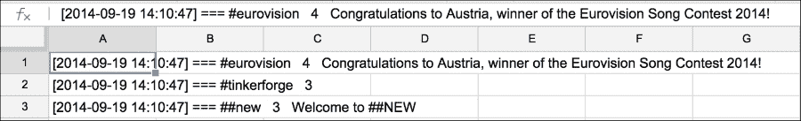

我们如何在电子表格中轻松地从这些数据创建列？我们希望每个单独的数据项都位于自己的列中。通过这种方式，我们可以例如对频道的用户数量进行平均值计算，或根据频道名称对数据进行排序。目前，由于所有数据都在一个巨大的文本字符串中，我们无法轻松地对其进行排序或使用公式。

一种策略是使用 Excel 的文本到列向导将数据拆分成可识别的部分；然后，我们可以重新组合它们，并在需要时去除多余的字符。以下是相关步骤：

1.  高亮显示列`A`，并启动文本到列向导（位于数据菜单中）。在第一步中，选择固定宽度，在第二步中，双击所有绘制的线条以分隔描述字段。下图展示了拆分前几列并移除所有多余行后数据的样子：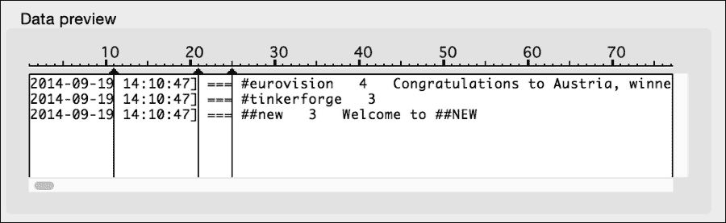

    Excel 中的固定宽度拆分。

    结果数据如下图所示。前三列没有问题，但固定宽度拆分未能成功分开列 D 中的用户计数和频道名称。这是因为频道名称的长度不像前几列那样具有可预测性。

    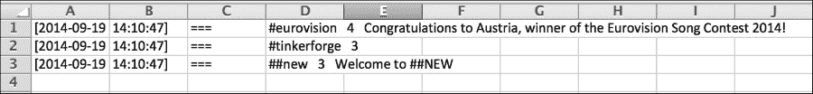

    这是第一次文本到列拆分后的结果。

1.  我们需要再次运行文本到列向导，但这次只针对列 D，并且使用分隔符方式而非固定宽度方式。首先，注意频道名称**#eurovision**与用户数量（**4**）之间有两个空格，**4**与频道描述之间也有两个空格。尽管文本到列向导不允许我们使用两个空格作为分隔符（它只允许单个字符），我们可以使用**查找-替换**对话框将所有两个空格的情况替换为一个在文本中未使用的符号。（首先执行**查找**操作以确保。）我选择了`^`符号。

    这一特定步骤看起来有点草率，所以如果你有兴趣尝试另一种方法，我一点也不怪你。与其他工具相比，Excel 在查找和替换坏文本方面的功能较为有限。我们将在本章后面的*文本编辑器数据清理*部分学习如何使用正则表达式。

    

    添加一个不常见的分隔符可以让我们将剩余的列分开。

1.  现在，使用**查找替换**从 A 列和 B 列中移除`[`和`]`字符，并将它们替换为空。 （在开始查找替换之前，高亮显示这些列，以免不小心在整个工作表中删除符号。）

    不幸的是，Excel 为了帮助我们，将这些转换为我们可能不喜欢的日期格式：9/19/2014。如果你想将它们恢复到原来的格式（2014-09-19），请选择整列，并使用自定义格式对话框指定日期格式为 yyyy-mm-dd。

1.  **F**列中的字符串仍然在前面有多余的空格。我们可以使用`trim()`函数去除每个字符串值前面的额外空格。插入一个新列到**F**列的左侧，并应用`trim()`函数，如下所示：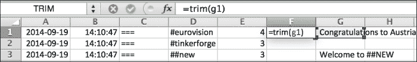

    这是应用`trim()`函数以去除前导或尾随空格后的结果。

1.  我们还可以对修剪后的文本应用`clean()`函数。这个函数将删除前 32 个 ASCII 字符：所有可能进入这些频道描述中的不可打印控制字符。你可以在`trim()`函数外部应用`clean()`，如下所示：`clean(trim(g1))`。

1.  将 F1 框的角拖动到底部，以将`clean(trim())`应用到**F**列的其余单元格。

1.  选择**F**列，复制它，并在**F**列中使用**仅粘贴值**，这样我们就可以删除**G**列。

1.  删除**G**列。瞧，现在你有了完美清理的数据。

## 拆分字符串

Google 表格中有一个轻量级版本的“文本到列”功能，但 Excel 中没有，那就是`split()`函数。这个函数只是接受一个字符串值，并将其拆分成组成部分。请注意，你需要提供足够的新的列来容纳拆分后的数据。在下面的例子中，我们使用了与之前示例相同的数据，但创建了三个新列来容纳**D**列的拆分值。

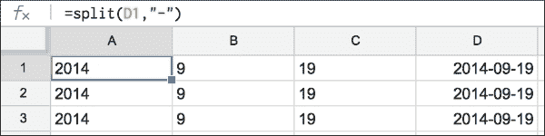

## 连接字符串

`concatenate()`函数接受多个字符串，无论是作为单元格引用还是作为带引号的字符串，并将它们连接到一个新单元格中。在下面的例子中，我们使用`concatenate()`函数将日期和时间字符串连接为一个。这个函数在 Excel 和 Google 表格中都有，如下图所示：

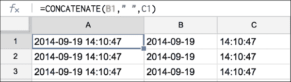

### 条件格式化以查找异常值

Excel 和 Google 电子表格都有**条件格式**功能。条件格式使用一组规则，根据是否满足某些条件（条件）来更改单元格或单元格的外观（格式）。我们可以使用此功能来查找过高、过低、缺失或其他异常的数据显示。一旦我们识别出这些数据，就可以清理它们。

这是一个如何在 Google 电子表格中使用条件格式查找样本数据中不包含`#`的频道名称且聊天室参与者人数为空的行的示例：

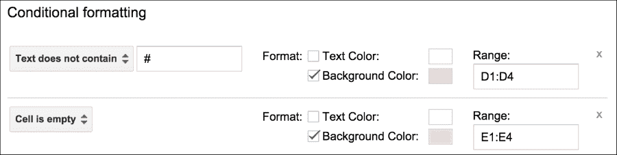

这是背景单元格颜色已更改后的结果，定位了**D**列中不以`#`开头的单元格，以及**E**列中为空的单元格。现在，这些问题值可以通过视觉检查轻松找到。

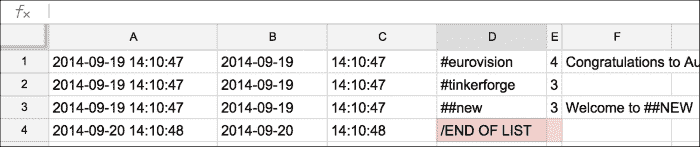

### 排序以查找异常值

如果数据量太大，无法进行视觉检查，那么我们可以尝试使用排序来查找问题数据。在 Google 电子表格或 Excel 中，选择你想要排序的列，这可以是整个表格，然后使用**数据**菜单中的**排序**选项。这对于大多数列来说非常简单，尤其是当你在查找像 D4 单元格这样的数据时。

那么，如果你尝试按**E**列排序以查找丢失的值会发生什么呢？也许我们希望将所有缺失的数据放在一起，以便删除这些数据行。E4 的值是空的。记住在第二章中提到的，*基础知识 – 格式、类型和编码*，NULL（在 Google 电子表格中为空）不能与任何其他值进行比较，因此无论你是按从低到高还是从高到低排序**E**列的值，它都会保持在排序列表的底部。

### 将电子表格数据导入 MySQL

现在你已经有了一个满是清洁数据的漂亮电子表格，你可能希望将其存储到数据库中以便长期使用。

#### 从电子表格创建 CSV

许多数据库系统会通过围绕 CSV 文件构建的导入程序来接收数据。如果你使用的是 MySQL，可以使用`LOAD DATA IN FILE`命令将数据直接从分隔文件导入数据库，甚至可以设置自己的分隔符。首先，让我们看看这个命令的示例，然后我们可以根据需要的参数在 Excel 中创建文件。

从 MySQL 命令行，我们可以运行：

```py
load data local infile 'myFile.csv' 
 into table freenode_topics
 fields terminated by ','
 (dateOfTopic, channel, numUsers, message);

```

当然，这假设已经创建了一个表格。在这个例子中，它叫做`freenode_topics`，并且它有四列，这些列出现在此 SQL 查询的最后一行。

因此，这个查询中引用的 CSV 文件`myFile.csv`需要按照此顺序排列列，并用逗号分隔。

在 Excel 中，可以通过导航到 **文件** | **另存为**，然后从格式选项列表中选择 **CSV (MS-DOS)** 来从当前工作簿的工作表创建 CSV 文件。在 Google 电子表格中，您可以通过导航到 **文件** | **下载** | **CSV** 来实现相同的操作。在这两种情况下，保存文件到本地系统，然后启动 MySQL 客户端，并按照之前显示的命令行操作。

### 提示

如果您不喜欢使用 MySQL 命令行客户端，还可以通过 MySQL 自带的 Workbench 图形客户端或类似 PhpMyAdmin 的工具将 CSV 文件上传到服务器。PhpMyAdmin 对上传的文件大小有一个限制（目前为 2MB）。

#### 使用电子表格生成 SQL

另一种将数据导入数据库的方法一开始看起来很奇怪，但如果您由于某些原因（可能是权限问题或文件大小限制）无法通过前面讨论的 CSV 文件加载数据，这个方法可能会节省很多时间。在这种方法中，我们将在电子表格中构建 `INSERT` 语句，然后在数据库中运行这些命令。

如果电子表格中的每一列都代表数据库中的一列，那么我们可以简单地将 SQL `INSERT` 命令的结构组件（带引号的字符串、括号、命令和行结束分号）添加到电子表格中的各列周围，并将结果拼接成一个巨大的 `INSERT` 命令字符串。

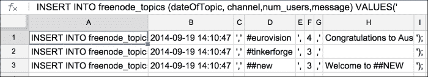

使用 `concatenate(A1:I1)` 函数将 A:I 列中的所有字符串连接后，我们得到的 `INSERT` 语句如下所示：

```py
INSERT INTO freenode_topics (dateOfTopic, channel, num_users, message) VALUES('2014-09-19 14:10:47', '#eurovision',4, 'Congratulations to Austria, winner of the Eurovision Song Contest 2014!');

```

这些可以粘贴到用户友好的前端界面中，例如 PhpMyAdmin 或 MySQL Workbench。或者，您可以将其保存为文本文件（使用文本编辑器），每个 `INSERT` 语句之间用换行分隔。我把我的文件命名为 `inserts.sql`。现在，可以通过命令行和 MySQL 客户端将此文件导入数据库，方法如下：

```py
$mysql -uusername -p -hhostname databasename < inserts.sql

```

或者，它也可以通过在 MySQL 命令行客户端中使用 `source` 命令来导入，命令如下：

```py
$mysql -uusername -p -hhostname
[enter your password]
> use databasename;
> source inserts.sql

```

任何一种方法都可以将数据导入 MySQL。如果脚本足够小，您还可以使用图形客户端，如 MySQL Workbench。不过要小心，将非常大的脚本加载到图形客户端中，因为客户端机器的内存可能不足以加载数百 GB 的 SQL。我更喜欢第二种方法（`source`），因为它会在每个成功插入后打印出成功消息，这样我就知道我的命令是正确的。

如果您不太清楚如何创建名为 `inserts.sql` 的文本文件，那么下一节将为您详细讲解。我们将介绍比您想象的更多文本编辑器相关的内容！

# 文本编辑器数据清理

我们在第二章，*基础 – 格式、类型和编码*中学习到，文本编辑器是读取和创建文本文件的首选方式。这听起来很合理，也完全能理解。我们当时没有真正解释的是，文本编辑器有时也被称为程序员的编辑器，因为它具有许多有用的功能，帮助像程序员以及数据清理人员这样的工作者，他们整天都在处理文本文件。我们现在将参观一些最有用的功能。

### 提示

每个操作系统都有数十款文本编辑器可供选择。有些需要付费，但许多都是免费的。在本章中，我将使用 Text Wrangler，它是一个免费的编辑器，适用于 OSX（可以在此获取：[`www.barebones.com/products/textwrangler`](http://www.barebones.com/products/textwrangler)）。本章展示的功能在大多数其他编辑器中也广泛可用，如 Sublime Editor，但如果某个特定功能或工具的位置不明显，你应该查看你所选择的编辑器的文档。

## 文本调整

我们选择的文本编辑器内置了许多用于文本处理的有用功能。这里列出的功能是数据清理任务中最常用的一些。请记住，在清理过程中，你可能会对单个文本文件执行几十个清理程序，所以我们在第一章，*为什么需要干净的数据？*中提供的关于如何清晰地传达你所做更改的提示在这里会非常有用。

**更改大小写**是数据清理中非常常见的请求。很多时候，我们会继承完全小写或完全大写的数据。下图展示了 Text Wrangler 中一个用于对选中文本进行大小写更改的对话框。每个选项旁边显示了键盘快捷键。


大小写更改的选项包括大写、小写以及将每个单词、每行的第一个字母或句子中的第一个单词大写。

在选择中的每一行添加或删除前缀或后缀是另一个常见的任务。前几天，当我在构建文本分类器时，我需要处理大量的文本行。需要在每一行的末尾加上一个逗号，并标明该行所代表的类别（正面或负面）。以下是 Text Wrangler 中的前缀和后缀对话框。注意，你可以选择插入或删除，但不能在同一操作中同时进行。如果你需要执行这两个任务，先执行一个，然后再执行另一个。


**删除小怪物**是另一个非常适合您使用文本编辑器的任务。TextWrangler 和适用于 Windows 的 Sublime 编辑器都有这个功能。在删除小怪物时，编辑器可以查找任何不在您希望的字符集中的字符，例如控制字符、NULL 字符和非 ASCII 字符。它可以删除它们，或者将它们替换为它们的字符代码。它还可以将这些小怪物替换为您指定的任何字符。这样可以在之后更容易找到它们。

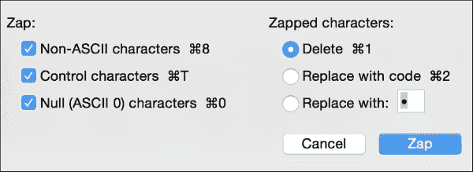

## 列模式

当文本编辑器处于**列模式**时，意味着您可以按列选择文本，而不仅仅是按行选择。这里是正常（非列）模式下的选择示例：

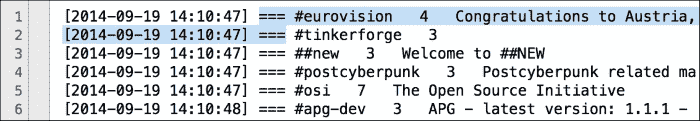

这是列模式下选择的示例。按住**Option**键并选择列中的文本。一旦文本被选中，您可以像处理任何已选文本一样处理它：您可以删除它、剪切它或将其复制到剪贴板，或者使用我们在前一部分中讨论的任何文本调整，只要它们适用于选中的文本。

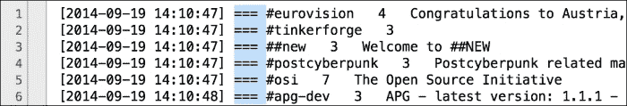

这个功能的一些限制包括：

+   每个字符占用一列，因此字符应以不带比例的打字机风格字体显示。

+   在 Text Wrangler 中，列模式仅在关闭换行时有效。关闭软换行意味着您的行将延伸到右边，不会被换行。

+   在 Text Wrangler 中，您绘制的列的垂直高度必须能够手动绘制，因此这是一个用于小规模数据（几百行或几千行，但可能不是几百万行）的技巧。

## 强力查找与替换

文本编辑器在处理文本方面非常出色。使用文本编辑器在列模式下工作可能会让人觉得奇怪，因为这看起来更像是电子表格中的任务。类似地，在您看到文本编辑器能做的事情后，使用电子表格进行**查找-替换**可能会显得有些笨拙。

Text Wrangler 中**查找**对话框的主要部分如下所示。提供的功能包括大小写敏感的搜索、循环搜索、在文本的子选择中进行搜索以及在单词或单词的一部分中查找给定的文本模式。您还可以将特殊字符、空白（包括制表符和行终止符）、表情符号等粘贴到文本框中。**查找**框右侧的小下拉框提供了额外的功能。带有时钟图标的顶部框包含最近的搜索和替换列表。带有字母**g**的底部框包含一组可能有用的内置搜索模式，在此菜单的底部，还有一个选项可以将您自己的模式添加到列表中。

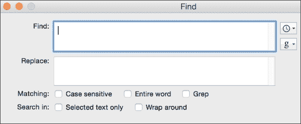

其中一个最强大的查找替换功能是通过选中 **Grep** 复选框来启用的。选中此框后，我们可以使用正则表达式模式进行搜索。简而言之，**正则表达式**（**regex**）是一种用特殊语言编写的模式，由符号组成，旨在与某些字符串文本匹配。正则表达式的详细解释超出了本书的范围，但可以说它们非常有用，我们会在需要清理数据时定期使用它们。

### 提示

Text Wrangler 界面中的复选框标示为 Grep——而不是 RegEx 或 Match——是因为正则表达式模式匹配语言存在一些微小的差异。Text Wrangler 在提醒我们，它使用的是 Grep 版本，Grep 是最常见的变种，最初是为 Unix 系统编写的程序。

在这里，我们将概述一些我们在清理数据时会反复使用的必备正则表达式符号。对于更复杂的模式，值得参考一本专门的书籍或多个展示各种正则表达式语法的网页：

| 符号 | 功能 |
| --- | --- |
| `$` | 匹配行尾 |
| `^` | 匹配行首 |
| `+` | 匹配一个或多个指定字符 |
| `*` | 匹配零个或多个指定字符 |
| `\w` | 匹配任意单词字符（0-9，A-z）。要匹配非单词字符，请使用 `\W` |
| `\s` | 匹配任意空白字符（制表符、换行符或回车符）。要匹配非空白字符，请使用 `\S` |
| `\t` | 匹配制表符 |
| `\r` | 匹配回车符。使用 `\n` 来匹配换行符。 |
| `\` | 这是转义字符。它匹配紧随其后的确切字符，而不是正则表达式模式字符。 |

以下是一些查找替换组合的示例，帮助我们学习如何在 Text Wrangler 中使用正则表达式。确保选中 Grep 框。如果替换列为空，则意味着替换字段应该保持为空。

| 查找 | 替换 | 功能 |
| --- | --- | --- |
| `\r` |   | 查找换行符（行终止符），并将其替换为空。换句话说，就是“将多行合并为一行”。 |
| `^\w+` | `-` | 匹配行首，后跟至少一个单词字符，并在行前加上一个 `-` 字符。 |
| `\\r$` | `\[end\]` | 查找所有以实际的 `\r` 字符（反斜杠后跟 r）结尾的行，并将其替换为实际字符 `[end]`。请注意，`[` 和 `]` 也是正则表达式中的特殊字符，因此在将其作为普通字符使用时需要进行转义。 |

如果正则表达式让你感到畏惧，请放心。首先，回想一下本章早些时候提到的 *文本调整* 部分，大多数文本编辑器，包括 Text Wrangler，都有许多内置的搜索和替换功能，这些功能是基于最常用的正则表达式构建的。因此，你可能会发现自己并不常常需要编写很多正则表达式。其次，正则表达式如此强大和实用，因此有许多在线资源可以供你参考，帮助你学习如何构建复杂的正则表达式，如果你需要的话。

我的两个最喜欢的正则表达式资源是 Stack Overflow（[`stackoverflow.com`](http://stackoverflow.com)）和 regular-expressions.info（[`regular-expressions.info`](http://regular-expressions.info)）。此外，通过快速的网页搜索，你还可以找到许多正则表达式测试网站。这些网站让你编写并测试正则表达式，应用于样本文本。

### 提醒一下

然而，在使用在线正则表达式测试工具时要小心，因为它们通常是为教授特定类型的正则表达式而设计的，比如 JavaScript、PHP 或 Python 中的正则表达式解析器。你想做的一些操作，可能在你的文本编辑器中的正则表达式语法与这些语言中的相同，也可能不同。根据你尝试做的事情的复杂程度，最好的方法可能是创建一个文本数据的备份副本（或者将问题文本的一个小样本提取到一个新文件中），然后使用你自己的文本编辑器并根据其正则表达式语法进行实验。

## 文本排序与重复处理

一旦我们稍微实验了一下正则表达式，我们会注意到我们的文本编辑器偶尔会在其他菜单选项中提供这些模式匹配技术，例如在排序和重复处理中。考虑以下排序对话框，看看如何将正则表达式应用于排序多行：

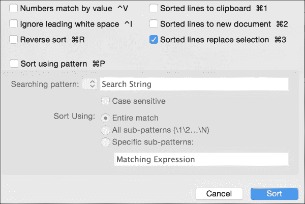

在这种情况下，我们可以使用 **按模式排序** 复选框来输入一个正则表达式模式进行排序。重复处理对话框类似。你可以告诉编辑器是否保留原始行或删除它。有趣的是，如果你需要将它们用于其他用途，比如保持已删除行的日志，你还可以将重复项移到另一个文件或剪贴板。

### 小贴士

在数据清理中，至少考虑将移除的行保存到单独的文件中，以备将来需要时使用，这是一个好主意。

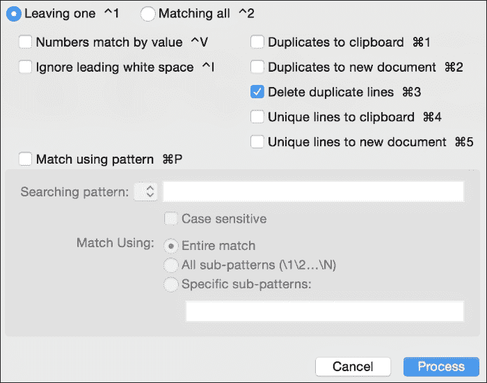

## 包含处理行

Text Wrangler 中有一个很实用的功能，叫做 **包含处理行**。它将搜索（包括使用正则表达式的可能性）与逐行处理结合起来，例如将受影响的行移到另一个文件或剪贴板，或者删除匹配的行。

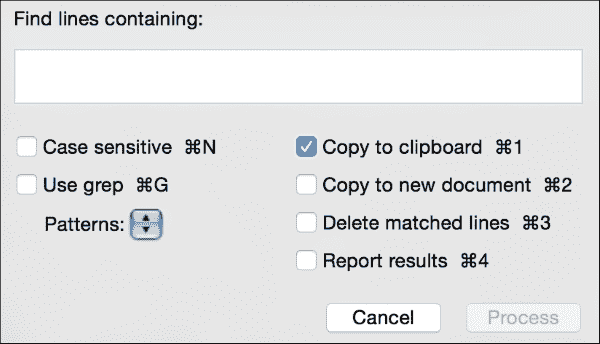

# 一个示例项目

在这个示例项目中，我们将下载一个电子表格，使用 Excel 或文本编辑器清理它，然后对其进行一些简单的分析。

## 第一步 – 陈述问题

本项目的灵感来源于《高等教育纪事》提供的一些数据，这是一份关于大学和高等院校新闻及事件的出版物。在 2012 年，他们创建了一个名为“你的大学认为它的同行是谁？”的互动功能。在这个功能中，用户可以输入任何美国大学的名称，并看到一个互动可视化，显示其他哪些大学称目标大学为**同行**。（同行是指在某些方面相似的大学。）原始数据来自美国政府报告，但《高等教育纪事》已将这些数据免费提供给任何人使用。

在这个示例中，我们关心的是一个补充性问题：当大学 X 出现在一个列表中时，哪些其他大学也在这些列表中？为了解答这个问题，我们需要找到所有与大学 X 一起列出的其他大学，然后统计它们的名字出现了多少次。

## 第二步 – 数据收集

在这一步中，我们将看到收集数据的过程，并逐步清理它。接下来的部分将讨论我们需要采取的行动，以便为我们的项目收集适当的数据。

### 下载数据

本项目的数据可以通过原文中的[链接](http://chronicle.com/article/Who-Does-Your-College-Think/134222/)下载，或者通过[直接链接到电子表格](https://s3.amazonaws.com/03peers/selected_peers.csv.zip)下载。

文件已被压缩，请使用你喜欢的解压软件解压文件。

### 熟悉数据

ZIP 文件中的文件具有 `.csv` 扩展名，确实是一个以逗号分隔的 CSV 文件，包含 1686 行，其中包括一行标题。逗号分隔了两列：第一列是相关大学的名称，第二列是该大学列出的所有同行大学。同行大学之间由管道符号 (`|`) 分隔。以下是一个示例行：

```py
Harvard University,Yale University|Princeton University|Stanford University
```

在这种情况下，第一列表示哈佛大学是目标大学，第二列显示哈佛将耶鲁、普林斯顿和斯坦福列为其同行。

## 第三步 – 数据清理

由于本示例的目标是查看某所大学以及它在其他大学的同行名单中的所有出现情况，我们的第一步是清除任何*不*包含目标大学的行。然后，我们将把文件转化为一个包含所有大学的长列表。到那时，我们的数据将已经清理干净，准备好进入分析和可视化步骤。

### 提取相关行

我们来比较两种提取相关行的方法：一种是使用电子表格，另一种是使用文本编辑器，并应用本章中概述的技术。

#### 使用电子表格

打开电子表格程序中的文件，使用条件格式突出显示包含**哈佛大学**（或你选择的目标大学）的任何行，然后删除其余的行。

#### 使用文本编辑器

打开文件并使用**包含的行处理**来查找所有包含**哈佛大学**短语（或你选择的大学）的行，然后将它们复制到一个新文件中。

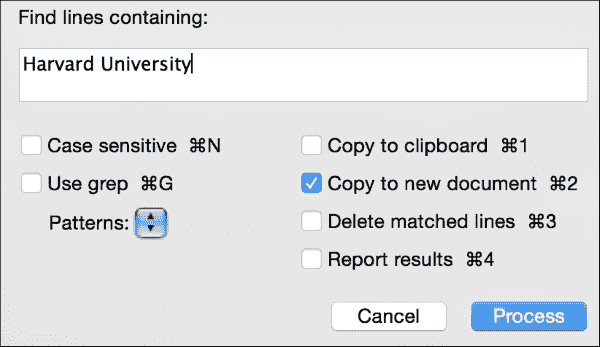

无论使用哪种选项，结果是一个新文件，包含 26 行，每行都包含**哈佛大学**。

### 转换行

现在我们有一个包含 26 行的文件，每行包含多个大学（宽数据）。我们预计将来某个时候会将文件读入 Python，以进行简单的大学频率统计。因此，我们决定将其转换为长数据，每行一个大学。

为了将文件转换成每行一个大学，我们将使用文本编辑器和三次查找与替换操作。首先，我们将查找逗号并将其替换为`/r`（回车符）。

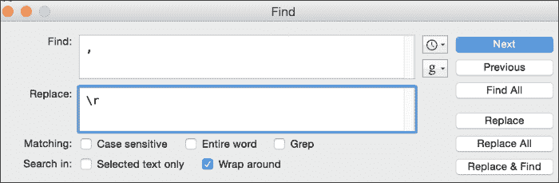

接下来，查找管道字符（`|`）并将其替换为`\r`。此时，文本文件有 749 行。

最后，我们需要删除所有**哈佛大学**的实例。（记住，我们只关心与哈佛大学一起提到的同行，所以我们不需要计入哈佛大学本身。）在 Text Wrangler 中，我们可以在**查找**框中输入**Harvard University\r**，将**替换**框留空。这样会删除 26 行，文件中的总行数为 723 行。

## 第四步 - 数据分析

由于我们的主要关注点是数据清理，因此我们不会花太多时间在分析或可视化上，但这里有一个简短的 Python 脚本，用于统计每个同行与哈佛大学一同被提到的次数：

```py
from collections import Counter
with open('universities.txt') as infile:
    counted = Counter(filter(None,[line.strip() for line in infile]))
    sorted = counted.most_common()
    for key,value in sorted:
      print key, ",", value
```

结果显示 232 所独特的大学，以及每所大学被提到的次数。以下是前几项结果。我们可以这样解读这些结果：

*当哈佛大学作为同行被提到时，耶鲁大学也被提到 26 次*：

```py
Yale University , 26
Princeton University , 25
Cornell University , 24
Stanford University , 23
Columbia University in the City of New York , 22
Brown University , 21
University of Pennsylvania , 21

```

到此为止，你可以将这个列表（或较长列表的一部分）输入到条形图、词云或任何你认为有说服力或有趣的可视化工具中。由于数据是以逗号分隔的，你甚至可以轻松地将其粘贴到电子表格程序中进行进一步分析。但到目前为止，我们已经回答了初步问题：给定一个目标大学，哪些同行被提到最多。

# 摘要

在本章中，我们学习了一些非常实用的数据清理技巧，使用了两个易于获取的工具：文本编辑器和电子表格。我们概述了电子表格中可用的函数，用于拆分数据、移动数据、查找和替换部分内容、格式化数据以及将数据重新组合。接着，我们学习了如何最大限度地发挥简单文本编辑器的作用，包括一些内置功能，以及如何最有效地使用查找和替换及正则表达式。

在下一章中，我们将把目前为止学到的各种技巧结合起来，进行一些重要的文件转换。我们将使用的许多技巧将基于我们在过去两章中学到的文本编辑、正则表达式、数据类型和文件格式的知识，因此，准备好解决一些真实世界的数据清理问题吧。
