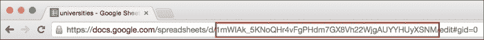
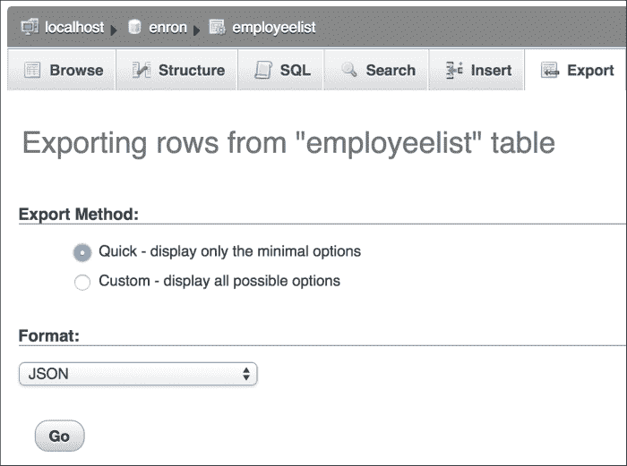
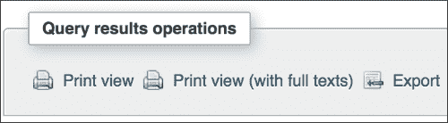
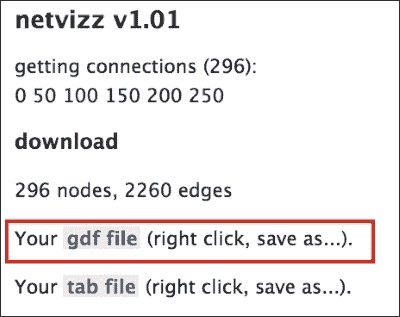
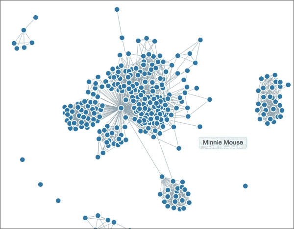

# 第四章：说通用语——数据转换

去年夏天，我在当地的烹饪学校参加了一门奶酪制作课程。我们做的第一件事就是制作里科塔奶酪。我兴奋地得知，里科塔奶酪可以在大约一个小时内，只用牛奶和酪乳就能做成，而且酪乳本身可以通过牛奶和柠檬汁制作。在厨房中，食材不断地转化为其他食材，进而变成美味的菜肴。在我们的数据科学厨房中，我们也将定期进行数据格式之间的转换。我们可能需要这样做来执行各种分析，当我们想要合并数据集，或者如果我们需要以新的方式存储数据集时。

**通用语** 是一种在不同语言使用者之间进行交流时被采纳为共同标准的语言。在数据转换中，有几种数据格式可以作为共同标准。我们在第二章，*基础 – 格式、类型和编码*中讨论过其中的一些。JSON 和 CSV 是最常见的两种格式。在本章中，我们将花一些时间学习：

+   如何从软件工具和语言（Excel、Google Spreadsheets 和 phpMyAdmin）中快速转换为 JSON 和 CSV 格式。

+   如何编写 Python 和 PHP 程序生成不同的文本格式并在它们之间进行转换。

+   如何实现数据转换以完成一个实际的`-`世界任务。在这个项目中，我们将使用 netvizz 软件从 Facebook 下载朋友网络数据，然后清理数据并将其转换为构建社交网络可视化所需的 JSON 格式。接着，我们将以不同的方式清理数据，并将其转换为 **networkx** 社交网络包所需的 Pajek 格式。

# 快速的工具基础转换

转换少量到中等量数据的最快、最简单方法之一就是直接让你使用的任何软件工具为你执行转换。有时，你使用的应用程序已经具备将数据转换为你需要的格式的选项。就像在第三章，*清洁数据的得力工具 – 电子表格和文本编辑器*中提到的技巧一样，我们希望尽可能地利用工具中的这些隐藏功能。如果你要处理的数据量太大，无法通过应用程序转换，或者你需要的特定转换功能不可用，我们将在接下来的部分中介绍编程解决方案，即*使用 PHP 转换*和*使用 Python 转换*。

## 电子表格转 CSV

将电子表格保存为分隔符文件非常简单。Excel 和 Google 电子表格的 **文件** 菜单中都有 **另存为** 选项；在该选项中，选择 **CSV (MS DOS)**。此外，Google 电子表格还提供将文件保存为 Excel 文件和制表符分隔文件的选项。将文件保存为 CSV 也有一些限制：

+   在 Excel 和 Google 电子表格中，当你使用 **另存为** 功能时，只会保存当前工作表。这是因为 CSV 文件本身仅描述一组数据，因此它不能包含多个工作表。如果你有一个多工作表的电子表格，你需要将每个工作表保存为单独的 CSV 文件。

+   在这两个工具中，定制 CSV 文件的选项相对较少，例如，Excel 保存数据时使用逗号作为分隔符（因为它是一个 CSV 文件，这样做很合理），并且没有选项将数据值用引号括起来或设置不同的行结束符。

## 电子表格转 JSON

与 CSV 相比，JSON 要稍微难处理一些。虽然 Excel 没有简单的 JSON 转换器，但有一些在线转换工具声称能够将 CSV 文件转换为 JSON。

然而，Google 电子表格提供了一个通过 URL 访问的 JSON 转换器。使用这种方法有一些缺点，首先是你必须将文档发布到 Web 上（至少是暂时的），才能访问它的 JSON 版本。你还需要用一些非常长的数字来定制 URL，这些数字用来标识你的电子表格。它还会在 JSON 输出中生成大量信息——可能比你需要的还要多。尽管如此，以下是将 Google 电子表格转换为 JSON 表示的逐步说明。

### 第一步 – 将 Google 电子表格发布到 Web 上

在你的 Google 电子表格创建并保存后，从 **文件** 菜单中选择 **发布到 Web**。点击接下来的对话框（我选择了所有默认选项）。此时，你就可以通过 URL 访问该文件的 JSON 版本。

### 第二步 – 创建正确的 URL

从发布的 Google 电子表格中创建 JSON 的 URL 模式如下：

[`spreadsheets.google.com/feeds/list/key/sheet/public/basic?alt=json`](http://spreadsheets.google.com/feeds/list/key/sheet/public/basic?alt=json)

这个 URL 中有三个部分需要修改，以匹配你的特定电子表格文件：

+   **list**: （可选）你可以将 `list` 更改为比如 `cells`，如果你希望在 JSON 文件中查看每个单元格的参考（如 A1, A2 等），而每个单元格单独列出。如果你希望每一行作为一个实体，保持 `list` 在 URL 中即可。

+   **密钥**：将此 URL 中的`key`更改为与 Google 内部用于表示您的文件的长且唯一的编号匹配。在电子表格的 URL 中，您在浏览器中查看时，密钥显示为两个斜杠之间的长标识符，位于**/spreadsheets/d**部分之后，如下所示：

+   **表格**：将示例网址中的“sheet”更改为`od6`，以表示您希望转换第一个工作表。

    ### 注意

    `od6`是什么意思？Google 使用代码来表示每个工作表。然而，这些代码并非严格按数字顺序排列。在 Stack Overflow 上的一个问题及其回答中有关于编号方案的详细讨论：[`stackoverflow.com/questions/11290337/`](http://stackoverflow.com/questions/11290337/)

为了测试这个过程，我们可以创建一个 Google 电子表格，包含我们从示例项目第三章最后的练习中生成的大学名称和计数数据，*数据清理的工作马——电子表格和文本编辑器*。这个电子表格的前三行如下所示：

| 耶鲁大学 | 26 |
| --- | --- |
| 普林斯顿大学 | 25 |
| 康奈尔大学 | 24 |

我用来通过 JSON 访问此文件的 URL 如下所示：

[`spreadsheets.google.com/feeds/list/1mWIAk_5KNoQHr4vFgPHdm7GX8Vh22WjgAUYYHUyXSNM/od6/public/basic?alt=json`](http://spreadsheets.google.com/feeds/list/1mWIAk_5KNoQHr4vFgPHdm7GX8Vh22WjgAUYYHUyXSNM/od6/public/basic?alt=json)

将这个 URL 粘贴到浏览器中会返回数据的 JSON 表示。它包含 231 个条目，每个条目如下所示。我已经为更易阅读对该条目进行了格式化，添加了换行符：

```py
{
  "id":{
    "$t":"https://spreadsheets.google.com/feeds/list/1mWIAk_5KN oQHr4vFgPHdm7GX8Vh22WjgAUYYHUyXSNM/od6/public/basic/cokwr"
  },
  "updated":{"$t":"2014-12-17T20:02:57.196Z"},
  "category":[{
    "scheme":"http://schemas.google.com/spreadsheets/2006",
    "term"  :"http://schemas.google.com/spreadsheets/2006#list"
  }],
  "title":{
    "type":"text",
    "$t"  :"Yale University "
  },
  "content":{
    "type":"text",
    "$t"  :"_cokwr: 26"
  },
  "link": [{
    "rel" :"self",
    "type":"application/atom+xml",
    "href":"https://spreadsheets.google.com/feeds/list/1mWIAk_5KN oQHr4vFgPHdm7GX8Vh22WjgAUYYHUyXSNM/od6/public/basic/cokwr"
  }]
}
```

即使我进行了重新格式化，这个 JSON 看起来也不太美观，而且其中许多名称-值对对我们来说并不有趣。尽管如此，我们已经成功生成了一个可用的 JSON。如果我们使用程序来处理这个 JSON，我们会忽略关于电子表格本身的所有冗余信息，只关注标题和内容实体以及`$t`值（在此案例中是`Yale University`和`_cokwr: 26`）。这些值在前面示例中的 JSON 中已被突出显示。如果你在想是否有办法从电子表格到 CSV 再到 JSON，答案是肯定的。我们将在本章后面的*使用 PHP 转换*和*使用 Python 转换*部分详细介绍如何做到这一点。

## 使用 phpMyAdmin 将 SQL 导出为 CSV 或 JSON

在本节中，我们将讨论两种直接从数据库（我们这里使用的是 MySQL）写入 JSON 和 CSV 的选项，而无需使用任何编程。

首先，phpMyAdmin 是一个非常常见的基于 Web 的 MySQL 数据库前端。如果你使用的是该工具的现代版本，你将能够将整个表格或查询结果导出为 CSV 或 JSON 文件。使用我们在第一章中首次访问的相同 enron 数据库，*为什么你需要干净的数据？*，请看以下的 **导出** 标签截图，其中 **JSON** 被选为整个 **employeelist** 表的目标格式（此选择框中也可以选择 CSV）：



PhpMyAdmin 导出整个表格的 JSON

导出查询结果的过程非常类似，唯一的不同是，在页面顶部使用 **导出** 标签，而是运行 SQL 查询后，使用页面底部 **查询结果操作** 下的 **导出** 选项，如下所示：



PhpMyAdmin 也可以导出查询结果

这里有一个简单的查询，我们可以在 `employeelist` 表上运行来测试这个过程：

```py
SELECT concat(firstName,  " ", lastName) as name, email_id
FROM employeelist
ORDER BY lastName;
```

当我们将结果导出为 JSON 时，phpMyAdmin 会显示我们 151 个按以下格式整理的值：

```py
{
  "name": "Lysa Akin",
  "email_id": "lysa.akin@enron.com"
}
```

phpMyAdmin 工具是一个不错的工具，对于将中等量的数据从 MySQL 转换出来非常有效，尤其是作为查询结果。如果你使用的是不同的关系数据库管理系统（RDBMS），你的 SQL 界面可能也有一些你应该探索的格式化选项。

另一种策略是完全绕过 phpMyAdmin，直接使用 MySQL 命令行来写出你想要格式化的 CSV 文件：

```py
SELECT concat(firstName,  " ", lastName) as name, email_id
INTO OUTFILE 'enronEmployees.csv'
FIELDS TERMINATED BY ',' OPTIONALLY ENCLOSED BY '"'
LINES TERMINATED BY '\n'
FROM employeelist;
```

这将写入一个以逗号分隔的文件，文件名为指定的 (`employees.csv`)。它将被写入当前目录。

那么 JSON 呢？使用这种策略没有非常简洁的方式来输出 JSON，因此你应该使用之前展示的 phpMyAdmin 解决方案，或者使用 PHP 或 Python 编写的更强大的解决方案。这些编程解决方案将在后面的章节中详细介绍，因此请继续阅读。

# 使用 PHP 转换

在我们的第二章中，*基础知识 – 格式、类型和编码*，我们在讨论 JSON 数值格式化时，简要展示了如何使用 PHP 连接到数据库、运行查询、从结果中构建 PHP 数组，然后将 JSON 结果打印到屏幕上。在这里，我们将首先扩展这个示例，将结果写入文件而不是打印到屏幕，并且还会写入 CSV 文件。接下来，我们将展示如何使用 PHP 读取 JSON 文件并转换为 CSV 文件，反之亦然。

## 使用 PHP 将 SQL 转换为 JSON

在本节中，我们将编写一个 PHP 脚本，连接到 `enron` 数据库，运行 SQL 查询，并将其导出为 JSON 格式的文件。为什么要写 PHP 脚本而不是使用 phpMyAdmin 呢？这个方法在我们需要在导出数据之前对其进行额外处理，或者怀疑数据量大于基于 Web 的应用（如 phpMyAdmin）能够处理的情况下会很有用：

```py
<?php
// connect to db, set up query, run the query
$dbc = mysqli_connect('localhost','username','password','enron')
or die('Error connecting to database!' . mysqli_error());

$select_query = "SELECT concat(firstName,  \" \", lastName) as name, email_id FROM  employeelist ORDER BY lastName";

$select_result = mysqli_query($dbc, $select_query);

if (!$select_result)
    die ("SELECT failed! [$select_query]" .  mysqli_error());

// ----JSON output----
// build a new array, suitable for json
$counts = array();
while($row = mysqli_fetch_array($select_result))
{
// add onto the json array
    array_push($counts, array('name'     => $row['name'],
    'email_id' => $row['email_id']));
}
// encode query results array as json
$json_formatted = json_encode($counts);

// write out the json file
file_put_contents("enronEmail.json", $json_formatted);
?>
```

这段代码将 JSON 格式的输出文件写入你在 `file_put_contents()` 行中指定的位置。

## 使用 PHP 将 SQL 转换为 CSV

以下代码片段展示了如何使用 PHP 文件输出流创建一个包含 SQL 查询结果的 CSV 格式文件。将此代码保存为 `.php` 文件到你网站服务器的脚本目录中，然后在浏览器中请求该文件。它将自动下载一个包含正确值的 CSV 文件：

```py
<?php
// connect to db, set up query, run the query
  $dbc = mysqli_connect('localhost','username','password','enron')
  or die('Error connecting to database!' . mysqli_error());

$select_query = "SELECT concat(firstName,  \" \", lastName) as name, email_id FROM  employeelist ORDER BY lastName";

$select_result = mysqli_query($dbc, $select_query);

if (!$select_result)
    die ("SELECT failed! [$select_query]" .  mysqli_error());

// ----CSV output----
// set up a file stream
$file = fopen('php://output', 'w');
if ($file && $select_result)
{
    header('Content-Type: text/csv');
    header('Content-Disposition: attachment;
    filename="enronEmail.csv"');
    // write each result row to the file in csv format
    while($row = mysqli_fetch_assoc($select_result))
    {
      fputcsv($file, array_values($row));
    }
}
?>
```

结果的格式如下（仅展示前三行）：

```py
"Lysa Akin",lysa.akin@enron.com
"Phillip Allen",k..allen@enron.com
"Harry Arora",harry.arora@enron.com
```

如果你在想是否 Phillip 的电子邮件真的是应该有两个点，我们可以运行一个快速查询来查找有多少 Enron 的电子邮件是这样格式的：

```py
SELECT CONCAT(firstName,  " ", lastName) AS name, email_id
FROM employeelist
WHERE email_id LIKE "%..%"
ORDER BY name ASC;
```

结果显示有 24 个电子邮件地址含有双点。

## 使用 PHP 将 JSON 转换为 CSV

在这里，我们将使用 PHP 读取 JSON 文件并将其转换为 CSV，并输出一个文件：

```py
<?php
// read in the file
$json = file_get_contents("outfile.json");
// convert JSON to an associative array
$array = json_decode ($json, true);
// open the file stream
$file = fopen('php://output', 'w');
header('Content-Type: text/csv');
header('Content-Disposition: attachment;
filename="enronEmail.csv"');
// loop through the array and write each item to the file
foreach ($array as $line)
{
    fputcsv($file, $line);
}
?>
```

这段代码将创建一个包含每行数据的 CSV 文件，类似于前面的示例。我们应该注意，`file_get_contents()` 函数将文件读取到内存中作为字符串，因此对于极大的文件，你可能需要使用 `fread()`、`fgets()` 和 `fclose()` 等 PHP 函数的组合来处理。

## 使用 PHP 将 CSV 转换为 JSON

另一个常见任务是读取 CSV 文件并将其写入为 JSON 文件。通常情况下，我们有一个 CSV 文件，其中第一行是表头行。表头行列出了文件中每一列的列名，我们希望将表头行中的每一项作为 JSON 格式文件的键：

```py
<?php
$file = fopen('enronEmail.csv', 'r');
$headers = fgetcsv($file, 0, ',');
$complete = array();

while ($row = fgetcsv($file, 0, ','))
{
    $complete[] = array_combine($headers, $row);
}
fclose($file);
$json_formatted = json_encode($complete);
file_put_contents('enronEmail.json',$json_formatted);
?>
```

这段代码对之前创建的 `enronEmail.csv` 文件（包含一个表头行）的结果如下：

```py
[{"name":"Lysa Akin","email_id":"lysa.akin@enron.com"},
{"name":"Phillip Allen","email_id":"k..allen@enron.com"},
{"name":"Harry Arora","email_id":"harry.arora@enron.com"}…]
```

在这个示例中，实际 CSV 文件中的 151 条结果中，只显示了前三行。

# 使用 Python 转换

在本节中，我们描述了多种使用 Python 操作 CSV 转换为 JSON，以及反向操作的方法。在这些示例中，我们将探索实现这一目标的不同方式，既包括使用特别安装的库，也包括使用更基础的 Python 代码。

## 使用 Python 将 CSV 转换为 JSON

我们已经找到几种使用 Python 将 CSV 文件转换为 JSON 的方法。其中一种方法使用了内置的 `csv` 和 `json` 库。假设我们有一个 CSV 文件，其中的行如下（仅展示前三行）：

```py
name,email_id
"Lysa Akin",lysa.akin@enron.com
"Phillip Allen",k..allen@enron.com
"Harry Arora",harry.arora@enron.com
```

我们可以编写一个 Python 程序来读取这些行并将其转换为 JSON：

```py
import json
import csv

# read in the CSV file
with open('enronEmail.csv') as file:
    file_csv = csv.DictReader(file)
    output = '['
    # process each dictionary row
    for row in file_csv:
      # put a comma between the entities
      output += json.dumps(row) + ','
    output = output.rstrip(',') + ']'
# write out a new file to disk
f = open('enronEmailPy.json','w')
f.write(output)
f.close()
```

结果的 JSON 将如下所示（仅展示前两行）：

```py
[{"email_id": "lysa.akin@enron.com", "name": "Lysa Akin"},
{"email_id": "k..allen@enron.com", "name": "Phillip Allen"},…]
```

使用这种方法的一个优点是，它不需要任何特殊的库安装或命令行访问，除了获取和放置你正在读取（CSV）和写入（JSON）文件之外。

## 使用 csvkit 将 CSV 转换为 JSON

改变 CSV 为 JSON 的第二种方法依赖于一个非常有趣的 Python 工具包 **csvkit**。要通过 Canopy 安装 csvkit，只需启动 Canopy 终端窗口（你可以在 Canopy 中通过导航至 **工具** | **Canopy 终端** 找到它），然后运行 `pip install csvkit` 命令。所有使用 csvkit 所需的依赖将自动为你安装。此时，你可以选择通过 Python 程序作为库使用 `import csvkit` 来访问 csvkit，或通过命令行访问，正如我们将在接下来的代码段中所做的那样：

```py
csvjson enronEmail.csv > enronEmail.json

```

该命令将 `enronEmail.csv` 文件转换为 JSON 格式的 `enronEmail.csvkit.json` 文件，过程快速而简便。

csvkit 包含多个其他非常有用的命令行程序，其中包括 `csvcut`，它可以从 CSV 文件中提取任意列列表，以及 `csvformat`，它可以执行 CSV 文件的分隔符交换，或修改行结束符等清理操作。如果你只想提取少数几列进行处理，`csvcut` 程序特别有用。对于这些命令行工具中的任何一个，你都可以将其输出重定向到一个新文件。以下命令行处理一个名为 `bigFile.csv` 的文件，剪切出第一列和第三列，并将结果保存为一个新的 CSV 文件：

```py
csvcut bigFile.csv –c 1,3 > firstThirdCols.csv

```

### 提示

关于 csvkit 的更多信息，包括完整的文档、下载和示例，见 [`csvkit.rtfd.org/`](http://csvkit.rtfd.org/)。

## Python JSON 转 CSV

使用 Python 读取 JSON 文件并将其转换为 CSV 进行处理是非常简单的：

```py
import json
import csv

with open('enronEmailPy.json', 'r') as f:
    dicts = json.load(f)
out = open('enronEmailPy.csv', 'w')
writer = csv.DictWriter(out, dicts[0].keys())
writer.writeheader()
writer.writerows(dicts)
out.close()
```

该程序接收一个名为 `enronEmailPy.json` 的 JSON 文件，并使用 JSON 的键作为头行，将该文件导出为 CSV 格式的新文件，名为 `enronEmailPy.csv`。

# 示例项目

在本章中，我们重点介绍了将数据从一种格式转换为另一种格式，这是一个常见的数据清理任务，在数据分析项目的其余部分完成之前需要多次执行。我们聚焦于一些非常常见的文本格式（CSV 和 JSON）和常见的数据存储位置（文件和 SQL 数据库）。现在，我们准备通过一个示例项目扩展我们对数据转换的基本知识，该项目将要求我们在一些不那么标准化但仍然是文本格式的数据格式之间进行转换。

在这个项目中，我们将研究我们的 Facebook 社交网络。我们将：

1.  使用 netvizz 下载我们的 Facebook 社交网络（朋友及其之间的关系），并保存为一种名为 **图描述格式**（**GDF**）的文本格式。

1.  生成 Facebook 社交网络的图形表示，将我们网络中的人物显示为节点，并将他们的友谊作为连接线（称为*边*）连接到这些节点之间。为此，我们将使用 D3 JavaScript 图形库。此库期望以 JSON 格式呈现网络数据。

1.  计算社交网络的一些指标，如网络的大小（称为*度*）和网络中两个人之间的最短路径。为此，我们将使用 Python 中的`networkx`包。此包期望以文本格式呈现数据，称为**Pajek**格式。

该项目的主要目标将是展示如何调和所有这些不同的期望格式（GDF、Pajek 和 JSON），并执行从一种格式到另一种格式的转换。我们的次要目标将是确实提供足够的示例代码和指导，以执行对我们社交网络的小规模分析。

## 步骤一 - 下载 Facebook 数据为 GDF

在此步骤中，您需要登录您的 Facebook 账户。使用 Facebook 的搜索框找到 netvizz 应用程序，或使用此 URL 直接链接到 netvizz 应用程序：[`apps.facebook.com/netvizz/`](https://apps.facebook.com/netvizz/)。

一旦进入 netvizz 页面，请点击**个人网络**。随后的页面将解释，点击**开始**按钮将提供一个可下载的文件，其中包含两个项目：列出所有您的朋友及其之间连接的 GDF 格式文件，以及一个制表符分隔值（TSV）统计文件。对于本项目，我们主要感兴趣的是 GDF 文件。点击**开始**按钮，并在随后的页面上右键单击 GDF 文件以将其保存到您的本地磁盘，如下截图所示：



使用 netvizz Facebook 应用程序可以将我们的社交网络下载为 GDF 文件。

此时给文件起一个更短的名字可能会有帮助。（我称我的文件为`personal.gdf`，并将其保存在专门为此项目创建的目录中。）

## 步骤二 - 查看文本编辑器中的 GDF 文件格式

在你的文本编辑器中打开文件（我在这里使用 Text Wrangler），并注意该文件的格式的几个要点：

1.  文件分为两部分：节点和边。

1.  节点位于文件的第一部分，以`nodedef`一词为前缀。节点列表是关于我所有朋友及其一些基本信息的列表（它们的性别和其内部 Facebook 标识号）。节点按照人们加入 Facebook 的日期顺序列出。

1.  文件的第二部分显示了我的朋友之间的边或连接。有时，这些也称为链接。文件的这一部分以`edgedef`一词为前缀。边描述了哪些我的朋友与其他朋友相连。

这是节点部分的摘录示例：

```py
nodedef>name VARCHAR,label VARCHAR,sex VARCHAR,locale VARCHAR,agerank INT
  1234,Bugs Bunny,male,en_US,296
  2345,Daffy Duck,male,en_US,295
  3456,Minnie Mouse,female,en_US,294
```

以下是边部分的摘录。它显示了 `Bugs`（`1234`）和 `Daffy`（`2345`）是朋友，而 `Bugs` 也与 `Minnie`（`3456`）是朋友：

```py
edgedef>node1 VARCHAR,node2 VARCHAR 
1234,2345
1234,3456
3456,9876
```

## 第三步 - 将 GDF 文件转换为 JSON

我们要执行的任务是使用 D3 构建该数据的社交网络表示。首先，我们需要查看 D3 中用于构建社交网络的几十个现有示例，例如 D3 示例库中的示例：[`github.com/mbostock/d3/wiki/Gallery`](https://github.com/mbostock/d3/wiki/Gallery) 和 [`christopheviau.com/d3list/`](http://christopheviau.com/d3list/)。

这些社交网络图的示例依赖于 JSON 文件。每个 JSON 文件展示了节点以及它们之间的边。以下是这些 JSON 文件的一个示例：

```py
{"nodes": [
  {"name":"Bugs Bunny"},
  {"name":"Daffy Duck"},
  {"name":"Minnie Mouse"}],
  "edges": [
  {"source": 0,"target": 2},
  {"source": 1,"target": 3},
  {"source": 2,"target": 3}]}
```

这段 JSON 代码最重要的一点是，它具有与 GDF 文件相同的两个主要部分：节点和边。节点仅仅是人的名字。边是一个数字对列表，表示友谊关系。不过，这些对并没有使用 Facebook 的标识号，而是使用了节点列表中每个项的索引，从 `0` 开始。

此时我们还没有 JSON 文件，只有一个 GDF 文件。那么我们如何构建这个 JSON 文件呢？当我们仔细查看 GDF 文件时，会发现它看起来像是两个 CSV 文件叠在一起。正如本章早些时候提到的，我们有几种不同的策略可以将 CSV 转换为 JSON。

因此，我们决定将 GDF 转换为 CSV，再将 CSV 转换为 JSON。

### 注意

等等，如果那个 JSON 示例看起来和我在网上找到的用于在 D3 中绘制社交网络图的 JSON 文件不一样怎么办？

你在网上找到的 D3 社交网络可视化示例可能会展示每个节点或连接的许多附加值，例如，它们可能包括额外的属性，用于表示大小差异、悬停功能或颜色变化，如这个示例所示：[`bl.ocks.org/christophermanning/1625629`](http://bl.ocks.org/christophermanning/1625629)。该可视化展示了芝加哥的付费政治游说者之间的关系。在这个示例中，代码会根据 JSON 文件中的信息来决定节点的圆圈大小以及当你将鼠标悬停在节点上时显示的文本。它制作了一个非常漂亮的图表，但它比较复杂。由于我们的主要目标是学习如何清理数据，我们将在这里处理一个简化的示例，不包含许多这些额外功能。不过不用担心，我们的示例仍然会构建出一个漂亮的 D3 图表！

要将 GDF 文件转换为我们需要的 JSON 格式，可以按照以下步骤进行：

1.  使用文本编辑器将 `personal.gdf` 文件拆分为两个文件，`nodes.gdf` 和 `links.gdf`。

1.  修改每个文件中的标题行，以匹配最终希望在 JSON 文件中出现的列名：

    ```py
    id,name,gender,lang,num
    1234,Bugs Bunny,male,en_US,296
    2345,Daffy Duck,male,en_US,295
    9876,Minnie Mouse,female,en_US,294

    source,target
    1234,2345
    1234,9876
    2345,9876
    ```

1.  使用`csvcut`工具（前面讨论的 csvkit 的一部分）从`nodes.gdf`文件中提取第一列和第二列，并将输出重定向到一个名为`nodesCut.gdf`的新文件：

    ```py
    csvcut -c 1,2 nodes.gdf > nodesCut.gdf

    ```

1.  现在，我们需要给每个边对分配一个索引值，而不是使用完整的 Facebook ID 值。这个索引仅通过节点在节点列表中的位置来标识该节点。我们需要执行这个转换，以便数据能够尽可能少地重构地输入到我们的 D3 力导向网络代码示例中。我们需要将其转换为：

    ```py
    source,target
    1234,2345
    1234,9876
    2345,9876
    ```

    变成这样：

    ```py
    source,target
    0,1
    0,2
    1,2
    ```

    这是一个小的 Python 脚本，它将自动创建这些索引值：

    ```py
    import csv

    # read in the nodes
    with open('nodesCut.gdf', 'r') as nodefile:
        nodereader = csv.reader(nodefile)
        nodeid, name = zip(*nodereader)

    # read in the source and target of the edges
    with open('edges.gdf', 'r') as edgefile:
        edgereader = csv.reader(edgefile)
        sourcearray, targetarray = zip(*edgereader)
    slist = list(sourcearray)
    tlist = list(targetarray)

    # find the node index value for each source and target
    for n,i in enumerate(nodeid):
        for j,s in enumerate(slist):
            if s == i:
                slist[j]=n-1
        for k,t in enumerate(tlist):
            if t == i: 
                tlist[k]=n-1
    # write out the new edge list with index values
    with open('edgelistIndex.csv', 'wb') as indexfile:
        iwriter = csv.writer(indexfile)
        for c in range(len(slist)):
            iwriter.writerow([ slist[c], tlist[c]])
    ```

1.  现在，返回到`nodesCut.csv`文件，并删除`id`列：

    ```py
    csvcut -c 2 nodesCut.gdf > nodesCutName.gdf

    ```

1.  构建一个小的 Python 脚本，将这些文件逐一处理，并将它们写入一个完整的 JSON 文件，准备好进行 D3 处理：

    ```py
    import csv
    import json

    # read in the nodes file
    with open('nodesCutName.gdf') as nodefile:
        nodefile_csv = csv.DictReader(nodefile)
        noutput = '['
        ncounter = 0;

        # process each dictionary row
        for nrow in nodefile_csv:
            # look for ' in node names, like O'Connor
            nrow["name"] = \
            str(nrow["name"]).replace("'","")
            # put a comma between the entities
            if ncounter > 0:
                noutput += ','
            noutput += json.dumps(nrow)
            ncounter += 1
        noutput += ']'
        # write out a new file to disk
        f = open('complete.json','w')
        f.write('{')
        f.write('\"nodes\":' )
        f.write(noutput)

    # read in the edge file
    with open('edgelistIndex.csv') as edgefile:
        edgefile_csv = csv.DictReader(edgefile)
        eoutput = '['
        ecounter = 0;
        # process each dictionary row
        for erow in edgefile_csv:
            # make sure numeric data is coded as number not # string
            for ekey in erow:
                try:
                    erow[ekey] = int(erow[ekey])
                except ValueError:
                    # not an int
                    pass
            # put a comma between the entities
            if ecounter > 0:
                eoutput += ','
            eoutput += json.dumps(erow)
            ecounter += 1
        eoutput += ']'

        # write out a new file to disk
        f.write(',')
        f.write('\"links\":')
        f.write(eoutput)
        f.write('}')
        f.close()
    ```

## 第四步 – 构建 D3 图表

这一部分展示了如何将我们的节点和链接的 JSON 文件输入到一个构建力导向图的 D3 基础示例中。这个代码示例来自 D3 网站，使用提供的 JSON 文件构建一个简单的图表。每个节点都显示为一个圆圈，当你将鼠标悬停在节点上时，节点的名称会以工具提示的形式显示出来：

```py
<!DOCTYPE html>
<!-- this code is based on the force-directed graph D3 example given at : https://gist.github.com/mbostock/4062045 -->

<meta charset="utf-8">
<style>

.node {
  stroke: #fff;
  stroke-width: 1.5px;
}

.link {
  stroke: #999;
  stroke-opacity: .6;
}

</style>
<body>
<!-- make sure you have downloaded the D3 libraries and stored them locally -->
<script src="img/d3.min.js"></script>
<script>

var width = 960, height = 500;
var color = d3.scale.category20();
var force = d3.layout.force()
    .charge(-25)
    .linkDistance(30)
    .size([width, height]);

var svg = d3.select("body").append("svg")
    .attr("width", width)
    .attr("height", height);

d3.json("complete.json", function(error, graph) {
  force
      .nodes(graph.nodes)
      .links(graph.links)
      .start();

  var link = svg.selectAll(".link")
      .data(graph.links)
    .enter().append("line")
      .attr("class", "link")
      .style("stroke-width", function(d) { return Math.sqrt(d.value); });

  var node = svg.selectAll(".node")
      .data(graph.nodes)
    .enter().append("circle")
      .attr("class", "node")
      .attr("r", 5)
      .style("fill", function(d) { return color(d.group); })
      .call(force.drag);

  node.append("title")
      .text(function(d) { return d.name; });

  force.on("tick", function() {
    link.attr("x1", function(d) { return d.source.x; })
      .attr("y1", function(d) { return d.source.y; })
      .attr("x2", function(d) { return d.target.x; })
      .attr("y2", function(d) { return d.target.y; });

    node.attr("cx", function(d) { return d.x; })
      .attr("cy", function(d) { return d.y; });
  });
});
</script>
```

以下截图显示了这个社交网络的示例。一个节点已经被悬停，显示了该节点的工具提示（名称）。



使用 D3 构建的社交网络

## 第五步 – 将数据转换为 Pajek 文件格式

到目前为止，我们已经将 GDF 文件转换为 CSV 文件，然后转换为 JSON 文件，并构建了一个 D3 图表。在接下来的两步中，我们将继续实现目标，把数据转换成可以用来计算社交网络指标的格式。

在这一步中，我们将原始的 GDF 文件稍作调整，使其成为一个有效的`Pajek`文件，这是社交网络工具 networkx 所需要的格式。

### 注意

单词*pajek*在斯洛文尼亚语中意味着*蜘蛛*。社交网络可以被看作是由节点及其之间的链接组成的网络。

我们的 Facebook GDF 文件转换为 Pajek 文件后的格式如下：

```py
*vertices 296
1234 Bugs_Bunny male en_US 296
2456 Daffy_Duck male en_US 295
9876 Minnie_Mouse female en_US 294
*edges
1234 2456
2456 9876
2456 3456
```

下面是关于这个 Pajek 文件格式需要注意的几件重要事情：

+   它是以空格分隔的，而不是以逗号分隔的。

+   就像在 GDF 文件中一样，数据分为两个主要部分，并且这些部分有标签，标签以星号`*`开头。这两个部分分别是顶点（另一个单词是节点）和边。

+   文件中有一个计数，显示总共有多少个顶点（节点），这个计数会显示在顶部一行的“vertices”旁边。

+   每个人的姓名去掉了空格并用下划线替换。

+   在节点部分，其他列是可选的。

为了将我们的 GDF 文件转换为 Pajek 格式，让我们使用文本编辑器，因为这些更改相当简单，而且我们的文件也不大。我们将执行以下数据清理任务：

1.  将你的 GDF 文件保存为一个新的文件，并将其命名为类似 `fbPajek.net`（`.net` 扩展名通常用于 Pajek 网络文件）。

1.  替换文件中的顶部行。当前它看起来像这样：

    ```py
    nodedef>name VARCHAR,label VARCHAR,sex VARCHAR,locale VARCHAR,agerank INT
    ```

    你需要将其更改为类似以下的形式：

    ```py
    *vertices 296
    ```

    确保顶点的数量与实际文件中对应的数量相匹配。这是节点的数量。每行应当有一个节点，出现在你的 GDF 文件中。

1.  替换文件中的边缘行。当前它看起来像这样：

    ```py
    edgedef>node1 VARCHAR,node2 VARCHAR
    ```

    你需要将其更改为如下形式：

    ```py
    *edges
    ```

1.  从第二行开始，替换文件中每个空格为下划线。这是可行的，因为此文件中唯一的空格出现在名字中。看一下这个：

    ```py
    1234,Bugs Bunny,male,en_US,296
    2456,Daffy Duck,male,en_US,295
    3456,Minnie Mouse,female,en_US,294
    ```

    这个操作将把前面的内容变成这样：

    ```py
    1234,Bugs_Bunny,male,en_US,296
    2456,Daffy_Duck,male,en_US,295
    3456,Minnie_Mouse,female,en_US,294
    ```

1.  现在，使用查找和替换将所有逗号替换为空格。节点部分的结果将是：

    ```py
    *vertices 296
    1234 Bugs_Bunny male en_US 296
    2456 Daffy_Duck male en_US 295
    3456 Minnie_Mouse female en_US 294
    ```

    边缘部分的结果将是：

    ```py
    *edges
    1234 2456
    2456 9876
    2456 3456
    ```

1.  最后一步；使用文本编辑器的查找功能，定位所有在名字中有撇号的 Facebook 朋友。将这些撇号替换为空字符。因此，`Cap'n_Crunch` 变为：

    ```py
    1998988 Capn_Crunch male en_US 137
    ```

    现在这是一个完全清理过的、Pajek 格式化的文件。

## 第六步——计算简单的网络指标

到此为止，我们已经准备好使用 Python 包如 networkx 来运行一些简单的社交网络指标。尽管**社交网络分析**（**SNA**）超出了本书的范围，但我们仍然可以轻松地进行一些计算，而无需深入探索 SNA 的奥秘。

首先，我们应该确保已安装 `networkx` 包。我正在使用 Canopy 作为我的 Python 编辑器，所以我将使用包管理器搜索并安装 networkx。

然后，一旦安装了 networkx，我们可以编写一些简单的 Python 代码来读取我们的 Pajek 文件，并输出一些关于我的 Facebook 网络结构的有趣信息：

```py
import networkx as net

# read in the file
g = net.read_pajek('fb_pajek.net')

# how many nodes are in the graph?
# print len(g)

# create a degree map: a set of name-value pairs linking nodes
# to the number of edges in my network
deg = net.degree(g)
# sort the degree map and print the top ten nodes with the
# highest degree (highest number of edges in the network)
print sorted(deg.iteritems(), key=lambda(k,v): (-v,k))[0:9]
```

我的网络的结果如下所示。列出了前十个节点，以及这些节点分别连接到我其他节点的数量：

```py
[(u'Bambi', 134), (u'Cinderella', 56), (u'Capn_Crunch', 50), (u'Bugs_Bunny', 47), (u'Minnie_Mouse', 47), (u'Cruella_Deville', 46), (u'Alice_Wonderland', 44), (u'Prince_Charming', 42), (u'Daffy_Duck', 42)]
```

这表明 `Bambi` 与我的 134 个其他朋友连接，而 `Prince_Charming` 只与我的 42 个其他朋友连接。

### 提示

如果你遇到任何关于缺少引号的 Python 错误，请仔细检查你的 Pajek 格式文件，确保所有节点标签中没有空格或其他特殊字符。在前面示例中的清理过程中，我们去除了空格和引号字符，但你的朋友可能在名字中使用了更多特殊字符！

当然，你可以使用 networkx 和 D3 可视化做更多有趣的事情，但这个示例项目的目的是让我们理解数据清洗过程对任何大规模分析成功结果的重要性。

# 总结

在本章中，我们学习了许多不同的数据格式转换方法。其中一些技巧很简单，比如直接将文件保存为你想要的格式，或者寻找菜单选项来输出正确的格式。其他时候，我们需要编写自己的程序化解决方案。

很多项目，比如我们在本章实现的示例项目，都需要进行多个不同的清理步骤，我们必须仔细规划清理步骤并记录下我们所做的事情。networkx 和 D3 都是非常棒的工具，但在使用它们之前，数据必须是特定格式的。同样，通过 netvizz 可以轻松获取 Facebook 数据，但它也有自己的数据格式。在不同文件格式之间找到简单的转换方法是数据科学中的一项关键技能。

在本章中，我们进行了很多结构化数据和半结构化数据之间的转换。但清理混乱数据呢，比如非结构化文本？

在第五章，*从网页收集和清理数据*中，我们将继续充实我们的数据科学清理工具箱，学习一些清理我们在网页上找到的页面的方法。
