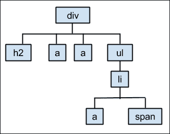
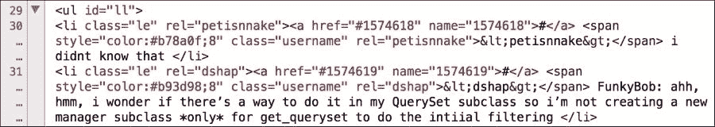
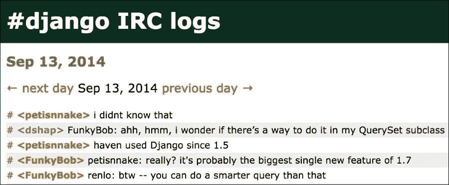
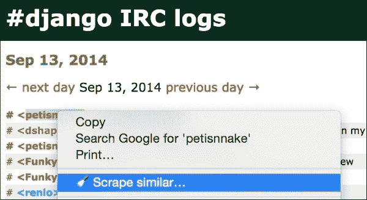
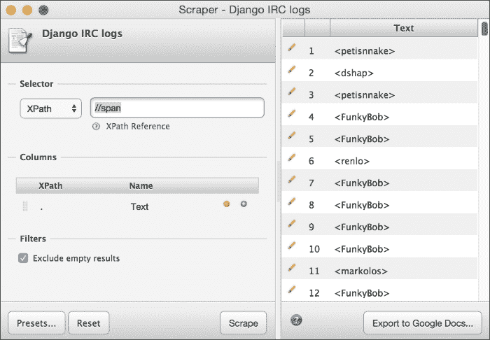
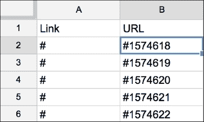
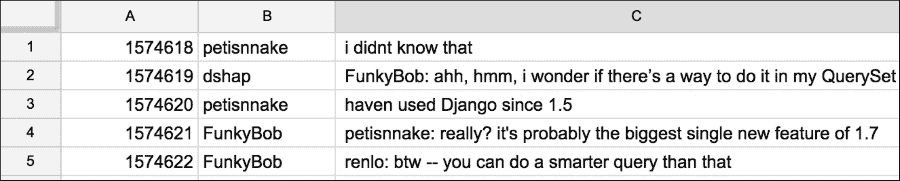
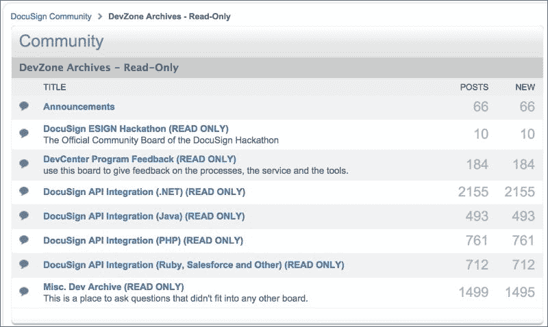
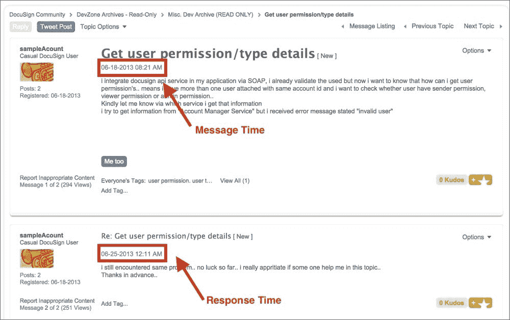

# 第五章：从网页收集和清理数据

最常见和有用的厨房工具之一是滤网，也叫筛子、漏网或中式过滤器，其目的是在烹饪过程中将固体与液体分开。在本章中，我们将为我们在网页上找到的数据构建滤网。我们将学习如何创建几种类型的程序，帮助我们找到并保留我们想要的数据，同时丢弃不需要的部分。

在本章中，我们将：

+   理解两种想象 HTML 页面结构的方式，第一种是（a）作为我们可以查找模式的行集合，第二种是（b）作为包含节点的树形结构，我们可以识别并收集这些节点的值。

+   尝试三种解析网页的方法，一种是使用逐行方法（基于正则表达式的 HTML 解析），另外两种使用树形结构方法（Python 的 BeautifulSoup 库和名为 Scraper 的 Chrome 浏览器工具）。

+   在一些现实世界的数据上实现这三种技术；我们将练习从网页论坛中抓取日期和时间。

# 理解 HTML 页面结构

网页只是一个包含一些特殊标记**元素**（有时称为 HTML**标签**）的文本文件，目的是告诉网页浏览器页面应该如何在用户端显示。例如，如果我们想让某个特定的词语以强调的方式显示，我们可以将其用`<em>`标签包围，如下所示：

`<em>非常重要</em>`的是你必须遵循这些指令。

所有网页都有这些相同的特征；它们由文本组成，文本中可能包含标签。我们可以使用两种主要的思维模型从网页中提取数据。两种模型各有其有用的方面。在这一节中，我们将描述这两种结构模型，然后在下一节中，我们将使用三种不同的工具来提取数据。

## 逐行分隔符模型

在思考网页的最简单方式时，我们集中于这样一个事实：有很多 HTML 元素/标签被用来组织和显示网页内容。如果我们想从网页中提取有趣的数据，在这个简单的模型中，我们可以使用页面文本和嵌入的 HTML 元素本身作为**分隔符**。例如，在前面的例子中，我们可能决定收集所有`<em>`标签中的内容，或者我们可能想收集在`<em>`标签之前或`</em>`标签之后的所有内容。

在这个模型中，我们将网页视为一个大致无结构的文本集合，而 HTML 标签（或文本中的其他特征，如重复的词语）帮助提供结构，我们可以利用这些结构来界定我们想要的部分。一旦我们有了分隔符，就能从杂乱无章的内容中筛选出有趣的数据。

例如，下面是来自现实世界 HTML 页面的一段摘录，来自 Django IRC 频道的聊天日志。让我们考虑如何使用其 HTML 元素作为分隔符，提取有用的数据：

```py
<div id="content">
<h2>Sep 13, 2014</h2>

<a href="/2014/sep/14/">← next day</a> Sep 13, 2014  <a href="/2014/sep/12/">previous day →</a>

<ul id="ll">
<li class="le" rel="petisnnake"><a href="#1574618" name="1574618">#</a> <span style="color:#b78a0f;8" class="username" rel="petisnnake">&lt;petisnnake&gt;</span> i didnt know that </li>
...
</ul>
...
</div>
```

以这个示例文本为例，我们可以使用`<h2></h2>`标签作为分隔符，提取出这个聊天记录的日期。我们可以使用`<li></li>`标签作为分隔符提取文本行，在该行内，我们可以看到`rel=""`可用于提取聊天者的用户名。最后，似乎从`</span>`结束到`</li>`开始的所有文本就是用户发送到聊天频道的实际消息行。

### 注意

这些聊天日志可以在线访问，网址是 Django IRC 日志网站，[`django-irc-logs.com`](http://django-irc-logs.com)。该网站还提供了一个关键词搜索接口，供用户查询日志。前述代码中的省略号（`…`）表示示例中已删除的部分文本。

从这段杂乱的文本中，我们可以使用分隔符的概念提取出三部分干净的数据（日志日期、用户和消息行）。

## 树形结构模型

另一种想象网页文本的方式是将其视为由 HTML 元素/标签组成的树形结构，每个元素与页面上的其他标签相互关联。每个标签都显示为一个**节点**，树形结构由页面中所有不同的节点组成。出现在另一个标签内的标签被视为**子节点**，而包围它的标签则是**父节点**。在之前的 IRC 聊天示例中，HTML 代码可以通过树形图表示，如下所示：



如果我们能够将 HTML 文本想象成树形结构，我们可以使用编程语言为我们构建树形结构。这使我们能够根据元素名称或元素在列表中的位置提取所需的文本值。例如：

+   我们可能需要按名称获取标签的值（给我`<h2>`节点中的文本）

+   我们可能需要某种特定类型的所有节点（给我所有在`<div>`中的`<ul>`里的`<li>`节点）

+   我们可能需要某个元素的所有属性（给我所有`<li>`元素中的`rel`属性列表）

在本章的其余部分，我们将结合这两种思维模型——逐行处理和树形结构——并通过一些示例进行实践。我们将演示三种不同的方法，来提取和清理 HTML 页面中的数据。

# 方法一 – Python 和正则表达式

在本节中，我们将使用一种简单的方法，从 HTML 页面中提取我们想要的数据。这种方法基于识别页面中的分隔符，并通过正则表达式进行模式匹配来提取数据。

你可能还记得我们在第三章，*清理数据的得力助手——电子表格和文本编辑器*中，曾经尝试过一些正则表达式（regex），当时我们学习如何使用文本编辑器。在这一章中，某些概念将类似，不过这次我们将编写一个 Python 程序来找到匹配的文本并提取出来，而不是像在那一章中那样使用文本编辑器进行替换。

在我们开始示例之前，最后需要注意的是，虽然这种正则表达式（regex）方法相对容易理解，但根据你特定的项目，它也有一些限制，可能会影响效果。我们将在本节的最后详细描述这种方法的局限性。

## 第一步 —— 找到并保存一个用于实验的网页文件

在这个示例中，我们将从之前提到的 Django 项目中获取一个 IRC 聊天记录。这些文件是公开的，具有相当规则的结构，因此非常适合用于这个项目。前往 Django IRC 日志档案，[`django-irc-logs.com/`](http://django-irc-logs.com/)，找到一个你感兴趣的日期。进入目标日期的页面并将其保存到你的工作目录。当你完成时，应该会得到一个 `.html` 文件。

## 第二步 —— 查看文件并决定值得提取的内容

由于我们在第二章，*基础知识——格式、类型和编码*中学到过，`.html` 文件实际上就是文本，而第三章，*清理数据的得力助手——电子表格和文本编辑器*，让我们非常熟悉如何在文本编辑器中查看文本文件，因此这一步应该很容易。只需在文本编辑器中打开 HTML 文件，查看它。有什么内容看起来适合提取？

当我查看文件时，我看到有几个我想要提取的内容。立刻我就看到，对于每条聊天评论，有行号、用户名和评论本身。我们计划从每一行聊天记录中提取这三个项目。

下图显示了我的文本编辑器中打开的 HTML 文件。由于某些行非常长，我已经启用了软换行（在 TextWrangler 中此选项位于菜单下的 **查看** | **文本显示** | **软换行文本**）。大约在第 **29** 行，我们看到了聊天记录列表的开始，每一行都包含我们感兴趣的三个项目：



我们的任务是找出每一行看起来相同的特征，以便我们可以预测性地从每一行聊天记录中提取出相同的三个项目。查看文本后，以下是我们可以遵循的一些可能规则，以准确地提取每个数据项并尽量减少调整：

+   看起来我们要找的三个项目都位于`<li>`标签中，而这些`<li>`标签本身位于`<ul id="ll">`标签内。每个`<li>`表示一条聊天消息。

+   在该消息中，行号出现在两个位置：它跟在字符串`<a href="#`后面，并且出现在`name`属性后的引号内。在示例文本中，第一个行号是`1574618`。

+   `username`属性出现在三个位置，首先是`li class="le"`的`rel`属性值。在`span`标签内，`username`属性再次作为`rel`属性的值出现，且它也出现在`&lt`;和`&gt`;符号之间。在示例文本中，第一个`username`是`petisnnake`。

+   行消息出现在`</span>`标签后和`</li>`标签前。在示例中，第一个行消息是`i didnt know that`。

现在我们已经知道了如何找到数据项的规则，可以开始编写我们的程序了。

## 第三步——编写一个 Python 程序，提取有用的信息并将其保存到 CSV 文件中

下面是一个简短的代码，用于打开先前显示格式的 IRC 日志文件，解析出我们感兴趣的三个部分，并将它们打印到一个新的 CSV 文件中：

```py
import re
import io

row = []

infile  = io.open('django13-sept-2014.html', 'r', encoding='utf8')
outfile = io.open('django13-sept-2014.csv', 'a+', encoding='utf8')
for line in infile:
    pattern = re.compile(ur'<li class=\"le\" rel=\"(.+?)\"><a href=\"#(.+?)\" name=\"(.+?)<\/span> (.+?)</li>', re.UNICODE)
    if pattern.search(line):
        username = pattern.search(line).group(1)
        linenum = pattern.search(line).group(2)
        message = pattern.search(line).group(4)
        row.append(linenum)
        row.append(username)
        row.append(message)
        outfile.write(', '.join(row))
        outfile.write(u'\n')
        row = []
infile.close()
```

这段代码中最棘手的部分是`pattern`这一行。该行构建了模式匹配，文件中的每一行都将与之进行比较。

### 提示

保持警惕。每当网站开发者更改页面中的 HTML 时，我们就有可能面临构造的正则表达式模式失效的风险。事实上，在编写这本书的几个月里，页面的 HTML 至少更改过一次！

每个匹配的目标组看起来像这样：`.+?`。总共有五个匹配组。其中三个是我们感兴趣的项目（`username`、`linenum`和`message`），而其他两个组只是无关的内容，我们可以丢弃。我们还会丢弃网页中其他部分的内容，因为它们根本不符合我们的模式。我们的程序就像一个筛子，只有三个有效的孔。好东西会通过这些孔流出，而无关的内容则被留下。

## 第四步——查看文件并确保其内容干净

当我们在文本编辑器中打开新的 CSV 文件时，可以看到前几行现在像这样：

```py
1574618, petisnnake, i didnt know that 
1574619, dshap, FunkyBob: ahh, hmm, i wonder if there's a way to do it in my QuerySet subclass so i'm not creating a new manager subclass *only* for get_queryset to do the intiial filtering 
1574620, petisnnake, haven used Django since 1.5
```

这看起来是一个很好的结果。你可能注意到，第三列的文本没有被包围在任何分隔符中。这可能会成为一个问题，因为我们已经使用逗号作为分隔符。如果第三列中有逗号怎么办？如果你担心这个问题，可以为第三列添加引号，或者使用制表符（tab）作为列的分隔符。为此，将第一行`outfile.write()`中的连接字符从逗号改为`\t`（制表符）。你也可以通过`ltrim()`函数修剪消息中的空格，去除任何多余的字符。

## 使用正则表达式解析 HTML 的局限性

这个正则表达式方法一开始看起来很简单，但它也有一些局限性。首先，对于新的数据清理者来说，设计和完善正则表达式可能会非常麻烦。你肯定需要计划花费大量时间进行调试，并且写下大量文档。为了帮助生成正则表达式，我强烈建议使用正则表达式测试工具，如 [`Pythex.org`](http://Pythex.org)，或者直接使用你喜欢的搜索引擎找到一个。如果你使用的是 Python 语言，请确保你选择的是 Python 正则表达式测试工具。

接下来，你应该提前知道，正则表达式完全依赖于网页结构在未来保持不变。因此，如果你计划定期从一个网站收集数据，你今天写的正则表达式可能明天就不管用了。只有在网页布局没有变化的情况下，它们才会有效。即使在两个标签之间添加一个空格，也会导致整个正则表达式失败，而且调试起来非常困难。还要记住，大多数时候你无法控制网站的变化，因为你通常不是自己的网站在收集数据！

最后，有许多情况几乎不可能准确地编写正则表达式来匹配给定的 HTML 结构。正则表达式很强大，但并不完美或无懈可击。对于这个问题的幽默解读，我推荐你去看那个在 Stack Overflow 上被点赞超过 4000 次的著名回答：[`stackoverflow.com/questions/1732348/`](http://stackoverflow.com/questions/1732348/)。在这个回答中，作者幽默地表达了许多程序员的挫败感，他们一遍又一遍地尝试解释为什么正则表达式并不是解析不规则且不断变化的 HTML 的完美解决方案。

# 方法二 - Python 和 BeautifulSoup

由于正则表达式存在一些局限性，我们在数据清理工具包中肯定还需要更多工具。这里，我们介绍如何使用基于解析树的 Python 库 **BeautifulSoup** 从 HTML 页面中提取数据。

## 第一步 - 找到并保存一个用于实验的文件

对于这一步，我们将使用与方法 1 相同的文件：来自 Django IRC 频道的文件。我们将搜索相同的三个项目。这样做将使得这两种方法之间的比较更加容易。

## 第二步 - 安装 BeautifulSoup

BeautifulSoup 目前是 4 版本。这个版本可以在 Python 2.7 和 Python 3 中使用。

### 注意

如果你使用的是 Enthought Canopy Python 环境，只需在 Canopy 终端中运行 `pip install beautifulsoup4`。

## 第三步 - 编写一个 Python 程序来提取数据

我们感兴趣的三个项位于一组 `li` 标签中，具体来说是那些 `class="le"` 的标签。在这个特定文件中没有其他 `li` 标签，但为了以防万一，我们还是要具体说明。以下是我们需要的项及其在解析树中的位置：

+   我们可以从 `li` 标签下的 `rel` 属性中提取用户名。

+   我们可以从 `a` 标签的 `name` 属性中获取 `linenum` 值。`a` 标签也是 `li` 标签内容中的第一个项。

    ### 注意

    请记住，数组是从零开始的，所以我们需要请求项 0。

    在 BeautifulSoup 中，**标签的内容**是该标签在解析树中的下级项。一些其他包会将这些称为 **子项**。

+   我们可以从 `li` 标签的第四个内容项中提取消息（引用为数组项 [3]）。我们还注意到每条消息前面都有一个空格，因此我们需要在保存数据之前去除它。

这里是与我们在解析树中想要的内容相对应的 Python 代码：

```py
from bs4 import BeautifulSoup
import io

infile  = io.open('django13-sept-2014.html', 'r', encoding='utf8')
outfile = io.open('django13-sept-2014.csv', 'a+', encoding='utf8')
soup = BeautifulSoup(infile)

row = []
allLines = soup.findAll("li","le")
for line in allLines:
    username = line['rel']
    linenum = line.contents[0]['name']
    message = line.contents[3].lstrip()
    row.append(linenum)
    row.append(username)
    row.append(message)
    outfile.write(', '.join(row))
    outfile.write(u'\n')
    row = []
infile.close()
```

## 第四步 – 查看文件并确保其清洁

当我们在文本编辑器中打开新的 CSV 文件时，可以看到前几行现在与方法 1 中的内容完全相同：

```py
1574618, petisnnake, i didnt know that 
1574619, dshap, FunkyBob: ahh, hmm, i wonder if there's a way to do it in my QuerySet subclass so i'm not creating a new manager subclass *only* for get_queryset to do the intiial filtering 
1574620, petisnnake, haven used Django since 1.5
```

就像使用正则表达式方法一样，如果你担心最后一列中嵌入的逗号，你可以将该列的文本用引号括起来，或者直接使用制表符来分隔列。

# 方法三 – Chrome Scraper

如果你真的不想编写程序来解析数据，也有几个基于浏览器的工具使用树形结构来帮助你识别和提取感兴趣的数据。我认为使用起来最简单、工作量最少的工具是一个名为 **Scraper** 的 Chrome 扩展，由名为 **mnmldave**（真名：**Dave Heaton**）的开发者创建。

## 第一步 – 安装 Scraper Chrome 扩展

如果你还没有安装 Chrome 浏览器，请下载并安装。确保你获得正确的 Scraper 扩展；有几个扩展的名字非常相似。我建议使用开发者自己提供的 GitHub 网站来下载该产品，网址是 [`mnmldave.github.io/scraper/`](http://mnmldave.github.io/scraper/)。这样你可以确保使用正确的抓取工具，而不是通过 Chrome 商店搜索。从 [`mmldave.github.io/scraper`](http://mmldave.github.io/scraper) 网站，点击链接从 Google 商店安装扩展并重启浏览器。

## 第二步 – 从网站收集数据

将浏览器指向我们之前用来获取其他两个网页数据提取实验数据的相同网页 URL，其中一个是 Django IRC 日志。我在这里使用的是 2014 年 9 月 13 日的日志作为示例和截图，所以我将访问 [`django-irc-logs.com/2014/sep/13/`](http://django-irc-logs.com/2014/sep/13/)。

在我编写本文时，浏览器中的该页面显示如下：



我们对这份 IRC 日志中的三个项目感兴趣：

+   行号（我们从前两个实验中知道，这部分链接位于**#**符号下方）

+   用户名（位于**<**和**>**符号之间）

+   实际的行信息

Scraper 允许我们依次高亮显示这三项内容，并将其值导出到 Google 电子表格中，之后我们可以将它们重新组合成一个单一的表格，并导出为 CSV 格式（或根据需要进行其他操作）。以下是操作步骤：

1.  使用鼠标高亮你想要抓取的项目。

1.  右键点击并从菜单中选择**抓取相似项…**。在以下示例中，我选择了用户名**petisnnake**作为我要让 Scraper 使用的目标：

1.  在选择**抓取相似项**后，工具会显示一个新窗口，列出页面上所有相似项目。以下截图显示了 Scraper 找到的所有用户名列表：

    Scraper 根据一个示例用户名找到所有相似的项目。

1.  窗口底部有一个标有**导出到 Google 文档…**的按钮。请注意，根据您的设置，您可能需要点击同意以允许 Scraper 访问 Google 文档。

## 步骤三 – 数据列的最终清理

一旦我们从页面上提取了所有数据元素并将它们存储在独立的 Google 文档中，我们将需要将它们合并为一个文件，并进行最后的清理。以下是提取后的行号示例，但在清理之前的样子：



我们对列**A**完全不感兴趣，也不关心前导的**#**符号。用户名和行信息数据类似——我们需要大部分内容，但我们想要去除一些符号，并将所有内容合并到一个 Google 电子表格中。

使用我们在第三章中介绍的查找和替换技巧，*清理数据的得力工具 – 电子表格和文本编辑器*（即去除**#**、**<**和**>**符号，并将行粘贴到单一表格中），我们最终得到一个干净的单一数据集，如下所示：



Scraper 是一个从网页中提取少量数据的好工具。它有一个方便的 Google 电子表格界面，如果你不想写程序来完成这个工作，它可以是一个快捷的解决方案。在下一部分，我们将处理一个更大的项目。这个项目可能足够复杂，需要我们将本章的一些概念融入到一个综合解决方案中。

# 示例项目 – 从电子邮件和网络论坛中提取数据

Django IRC 日志项目相当简单。它的设计目的是向你展示三种常用于从 HTML 页面中提取干净数据的技术之间的差异。我们提取的数据包括行号、用户名和 IRC 聊天消息，所有这些都很容易找到，几乎不需要额外的清理。在这个新的示例项目中，我们将考虑一个概念上类似的案例，但这将要求我们将数据提取的概念从 HTML 扩展到 Web 上的另外两种半结构化文本：托管在 Web 上的电子邮件消息和基于 Web 的讨论论坛。

## 项目的背景

最近，我在进行一项关于社交媒体如何用于提供软件技术支持的研究。具体来说，我在尝试发现，某些开发 API 和框架的软件开发组织是否应该将开发者的技术支持转移到 Stack Overflow，还是应该继续使用旧的媒体，如电子邮件和网络论坛。为了完成这项研究，我比较了（其中之一）开发者通过 Stack Overflow 获得 API 问题答案的时间与通过旧社交媒体（如网络论坛和电子邮件组）获得答案的时间。

在这个项目中，我们将处理这个问题的一个小部分。我们将下载两种表示旧社交媒体的原始数据：来自网络论坛的 HTML 文件和来自 Google Groups 的电子邮件消息。我们将编写 Python 代码来提取这些两个支持论坛中发送消息的日期和时间。然后我们将找出哪些消息是对其他消息的回复，并计算一些关于每条消息收到回复所花时间的基本统计数据。

### 提示

如果你想知道为什么我们在这个示例项目中没有提取 Stack Overflow 部分的数据，稍等一下，直到第九章，*Stack Overflow 项目*。整章内容将致力于创建和清理一个 Stack Overflow 数据库。

这个项目将分为两部分。在第一部分，我们将从 Google Groups 上托管的项目的电子邮件存档中提取数据；在第二部分，我们将从另一个项目的 HTML 文件中提取数据。

## 第一部分 – 清理 Google Groups 电子邮件中的数据

许多软件公司传统上使用电子邮件邮件列表或混合的电子邮件-网络论坛来为其产品提供技术支持。Google Groups 是这种服务的一个流行选择。用户可以通过电子邮件发送消息到小组，或者在 Web 浏览器中阅读和搜索消息。然而，一些公司已经不再通过 Google Groups 为开发者提供技术支持（包括 Google 自己的产品），而是转而使用 Stack Overflow。Google BigQuery 这样的数据库产品就是现在使用 Stack Overflow 的一个例子。

### 第一步 – 收集 Google Groups 消息

为了研究 BigQuery Google Group 中问题的响应时间，我首先创建了该组中所有帖子 URL 的列表。你可以在我的 GitHub 网站上找到我的完整 URL 列表：[`github.com/megansquire/stackpaper2015/blob/master/BigQueryGGurls.txt`](https://github.com/megansquire/stackpaper2015/blob/master/BigQueryGGurls.txt)。

一旦我们有了目标 URL 列表，就可以编写一个 Python 程序下载所有存储在这些 URL 中的电子邮件，并将它们保存到磁盘。在下面的程序中，我的 URL 列表已保存为名为 `GGurls.txt` 的文件。`time` 库已经包含，所以我们可以在请求 Google Groups 服务器之间使用短暂的 `sleep()` 方法：

```py
import urllib2
import time

with open('GGurls.txt', 'r') as f:
    urls = []
    for url in f:
        urls.append(url.strip())

currentFileNum = 1
for url in urls:
    print("Downloading: {0} Number: {1}".format(url, currentFileNum))
    time.sleep(2)
    htmlFile = urllib2.urlopen(url)
    urlFile = open("msg%d.txt" %currentFileNum,'wb')
    urlFile.write(htmlFile.read())
    urlFile.close()
    currentFileNum = currentFileNum +1
```

该程序最终将 667 个文件写入磁盘。

### 第二步 - 从 Google Groups 消息中提取数据

现在我们有 667 封电子邮件消息存储在不同的文件中。我们的任务是编写一个程序，一次读取这些文件并使用本章中的某种技术提取我们需要的信息。如果我们查看其中一封电子邮件消息，我们会看到许多 **头部**，它们存储关于电子邮件的信息，或者说是其 **元数据**。我们可以迅速看到标识我们需要的元数据元素的三个头部：

```py
In-Reply-To: <ab71b72a-ef9b-4484-b0cc-a72ecb2a3b85@r9g2000yqd.googlegroups.com>
Date: Mon, 30 Apr 2012 10:33:18 -0700
Message-ID: <CA+qSDkQ4JB+Cn7HNjmtLOqqkbJnyBu=Z1Ocs5-dTe5cN9UEPyA@mail.gmail.com>
```

所有消息都有 `Message-ID` 和 `Date`，但是 `In-Reply-To` 头部只有在消息是对另一条消息的回复时才会出现。`In-Reply-To` 的值必须是另一条消息的 `Message-ID` 值。

以下代码展示了基于正则表达式的解决方案，用于提取 `Date`、`Message-ID` 和 `In-Reply-To`（如果有）值，并创建一些原始消息和回复消息的列表。然后，代码尝试计算消息与其回复之间的时间差：

```py
import os
import re
import email.utils
import time
import datetime
import numpy

originals = {}
replies = {}
timelist = []

for filename in os.listdir(os.getcwd()):
    if filename.endswith(".txt"):
        f=open(filename, 'r')
        i=''
        m=''
        d=''
        for line in f:
            irt = re.search('(In\-Reply\-To: <)(.+?)@', line)    
            mid = re.search('(Message\-ID: <)(.+?)@', line)
            dt = re.search('(Date: )(.+?)\r', line)
            if irt: 
                i= irt.group(2) 
            if mid:
                m= mid.group(2)
            if dt:
                d= dt.group(2)
        f.close()
        if i and d:
            replies[i] = d
        if m and d:
            originals[m] = d

for (messageid, origdate) in originals.items():
    try:
        if replies[messageid]:
            replydate = replies[messageid]                
            try:
                parseddate = email.utils.parsedate(origdate)
                parsedreply = email.utils.parsedate(replydate)
            except:
                pass
            try:
                # this still creates some malformed (error) times
                timeddate = time.mktime(parseddate)
                timedreply = time.mktime(parsedreply)
            except:
                pass
            try:
                dtdate = datetime.datetime.fromtimestamp(timeddate)
                dtreply = datetime.datetime.fromtimestamp(timedreply)
            except:
                pass
            try:
                difference = dtreply - dtdate
                totalseconds = difference.total_seconds()
                timeinhours =  (difference.days*86400+difference.seconds)/3600
                # this is a hack to take care of negative times
                # I should probably handle this with timezones but alas
                if timeinhours > 1:
                    #print timeinhours
                    timelist.append(timeinhours)
            except:
                pass
    except:
        pass

print numpy.mean(timelist)
print numpy.std(timelist)
print numpy.median(timelist)
```

在这段代码中，初始的 `for` 循环遍历每一条消息并提取我们感兴趣的三项数据。（该程序不会将这些数据存储到单独的文件或磁盘上，但如果你需要，可以添加这个功能。）这部分代码还创建了两个重要的列表：

+   `originals[]` 是原始消息的列表。我们假设这些主要是成员提问的问题。

+   `replies[]` 是回复消息的列表。我们假设这些主要是回答其他消息中问题的回复。

第二个 `for` 循环处理原始消息列表中的每一条消息，执行以下操作：如果原始消息有回复，尝试计算该回复发送所花费的时间。然后我们会记录下回复时间的列表。

#### 提取代码

对于本章，我们主要关注代码中的清理和提取部分，因此让我们仔细看看这些代码行。在这里，我们处理每一行电子邮件文件，寻找三个电子邮件头部：`In-Reply-To`、`Message-ID` 和 `Date`。我们使用正则表达式搜索和分组，就像我们在本章第一部分的方法中做的那样，来限定这些头部并轻松提取其后的值：

```py
for line in f:
    irt = re.search('(In\-Reply\-To: <)(.+?)@', line) 
    mid = re.search('(Message\-ID: <)(.+?)@', line)
    dt = re.search('(Date: )(.+?)\r', line)
    if irt: 
        i = irt.group(2) 
    if mid:
        m = mid.group(2)
    if dt:
        d = dt.group(2)
```

为什么我们决定在这里使用正则表达式而不是基于树的解析器？主要有两个原因：

1.  由于我们下载的电子邮件不是 HTML 格式，因此它们不能轻松地描述为具有父节点和子节点的树状结构。因此，基于解析树的解决方案（如 BeautifulSoup）不是最好的选择。

1.  由于电子邮件头部是结构化且非常可预测的（尤其是我们在这里寻找的三个头部），因此使用正则表达式解决方案是可以接受的。

#### 程序输出

该程序的输出是打印出三个数字，估算该 Google Group 上消息的回复时间的均值、标准差和中位数（单位：小时）。当我运行此代码时，我得到的结果如下：

```py
178.911877395
876.102630872
18.0
```

这意味着，发布到 BigQuery Google Group 上的消息的中位响应时间大约为 18 小时。现在，让我们考虑如何从另一种来源提取类似的数据：网络论坛。你认为在网络论坛上回答问题的速度会更快、更慢，还是与 Google Group 相当？

## 第二部分 – 清理来自网络论坛的数据

我们将在这个项目中研究的网络论坛来自一家名为**DocuSign**的公司。他们也将开发者支持转移到了 Stack Overflow，但他们仍然保留着一个旧版的基于网页的开发者论坛存档。我在他们的网站上四处寻找，直到发现了如何下载那些旧论坛中的一些消息。这里展示的过程比 Google Groups 示例要复杂一些，但你将学到很多关于如何自动收集数据的知识。

### 步骤一 – 收集一些指向 HTML 文件的 RSS

DocuSign 开发者论坛上有成千上万的消息。我们希望能够获得所有这些消息或讨论帖子的 URL 列表，以便我们编写代码自动下载它们，并高效提取回复时间。

为此，首先我们需要获取所有讨论的 URL 列表。我发现 DocuSign 旧版 Dev-Zone 开发者网站的存档位于[`community.docusign.com/t5/DevZone-Archives-Read-Only/ct-p/dev_zone`](https://community.docusign.com/t5/DevZone-Archives-Read-Only/ct-p/dev_zone)。

该网站在浏览器中的显示如下：



我们绝对不希望点击进入每一个论坛，再进入每条消息并手动保存。这会花费很长时间，而且极其无聊。有没有更好的方法？

**DocuSign**网站的**帮助**页面表明，可以下载一个**真正简单的聚合**（**RSS**）文件，显示每个论坛中最新的讨论和消息。我们可以使用这些 RSS 文件自动收集网站上许多讨论的 URL。我们感兴趣的 RSS 文件仅与开发者支持论坛相关（而不是公告或销售论坛）。这些 RSS 文件可以通过以下网址获得：

+   [`community.docusign.com/docusign/rss/board?board.id=upcoming_releases`](https://community.docusign.com/docusign/rss/board?board.id=upcoming_releases)

+   [`community.docusign.com/docusign/rss/board?board.id=DocuSign_Developer_Connection`](https://community.docusign.com/docusign/rss/board?board.id=DocuSign_Developer_Connection)

+   [`community.docusign.com/docusign/rss/board?board.id=Electronic_Signature_API`](https://community.docusign.com/docusign/rss/board?board.id=Electronic_Signature_API)

+   [`community.docusign.com/docusign/rss/board?board.id=Java`](https://community.docusign.com/docusign/rss/board?board.id=Java)

+   [`community.docusign.com/docusign/rss/board?board.id=php_api`](https://community.docusign.com/docusign/rss/board?board.id=php_api)

+   [`community.docusign.com/docusign/rss/board?board.id=dev_other`](https://community.docusign.com/docusign/rss/board?board.id=dev_other)

+   [`community.docusign.com/docusign/rss/board?board.id=Ask_A_Development_Question_Board`](https://community.docusign.com/docusign/rss/board?board.id=Ask_A_Development_Question_Board)

在您的浏览器中访问列表中的每个 URL（如果时间紧迫，可以只访问一个）。该文件是 RSS 格式，类似于带标签的半结构化文本，类似 HTML。将 RSS 保存为本地系统中的文件，并给每个文件加上`.rss`扩展名。完成此过程后，您最多应拥有七个 RSS 文件，每个文件对应前面展示的一个 URL。

每个 RSS 文件中都有描述论坛中所有讨论主题的元数据，其中包括我们在此阶段真正需要的数据：每个特定讨论主题的 URL。用文本编辑器打开其中一个 RSS 文件，您将能够看到我们感兴趣的 URL 示例。它看起来像这样，并且在文件中，您会看到每个讨论主题都有一个这样的 URL：

```py
<guid>http://community.docusign.com/t5/Misc-Dev-Archive-READ-ONLY/Re-Custom-CheckBox-Tabs-not-marked-when-setting-value-to-quot-X/m-p/28884#M1674</guid>
```

现在，我们可以编写一个程序，循环遍历每个 RSS 文件，查找这些 URL，访问它们，然后提取我们感兴趣的回复时间。接下来的部分将这些步骤拆解成一系列更小的步骤，并展示一个完成整个任务的程序。

### 第二步 – 从 RSS 中提取 URL；收集并解析 HTML

在这一步，我们将编写一个程序，执行以下操作：

1.  打开我们在第 1 步中保存的每个 RSS 文件。

1.  每次看到`<guid>`和`</guid>`标签对时，提取其中的 URL 并将其添加到列表中。

1.  对列表中的每个 URL，下载该位置上的 HTML 文件。

1.  阅读该 HTML 文件，提取每条消息的原始发帖时间和回复时间。

1.  计算发送回复所需的时间，并计算平均值、中位数和标准差，就像我们在第一部分做的那样。

以下是一些 Python 代码，用于处理所有这些步骤。我们将在代码列出的末尾详细介绍提取部分：

```py
import os
import re
import urllib2
import datetime
import numpy

alllinks = []
timelist = []
for filename in os.listdir(os.getcwd()):
    if filename.endswith('.rss'):
        f = open(filename, 'r')
        linktext = ''
        linkurl = ''
        for line in f:
            # find the URLs for discussion threads
            linktext = re.search('(<guid>)(.+?)(<\/guid>)', line)    

            if linktext:
                linkurl= linktext.group(2)
                alllinks.append(linkurl)
        f.close()

mainmessage = ''
reply = ''
maindateobj = datetime.datetime.today()
replydateobj = datetime.datetime.today()
for item in alllinks:
    print "==="
    print "working on thread\n" + item
    response = urllib2.urlopen(item)
    html = response.read() 
    # this is the regex needed to match the timestamp 
    tuples = re.findall('lia-message-posted-on\">\s+<span class=\"local-date\">\\xe2\\x80\\x8e(.*?)<\/span>\s+<span class=\"local-time\">([\w:\sAM|PM]+)<\/span>', html)	
    mainmessage = tuples[0]
    if len(tuples) > 1:
        reply = tuples[1]
    if mainmessage:
        print "main: "
        maindateasstr = mainmessage[0] + " " + mainmessage[1]
        print maindateasstr
        maindateobj = datetime.datetime.strptime(maindateasstr, '%m-%d-%Y %I:%M %p')
    if reply:
        print "reply: "
        replydateasstr = reply[0] + " " + reply[1]
        print replydateasstr
        replydateobj = datetime.datetime.strptime(replydateasstr, '%m-%d-%Y %I:%M %p')

        # only calculate difference if there was a reply 
        difference = replydateobj - maindateobj
        totalseconds = difference.total_seconds()
        timeinhours =  (difference.days*86400+difference.seconds)/3600
        if timeinhours > 1:
            print timeinhours
            timelist.append(timeinhours)

print "when all is said and done, in hours:"
print numpy.mean(timelist)
print numpy.std(timelist)
print numpy.median(timelist)
```

#### 程序状态

程序运行时，会打印出状态消息，以便我们知道它正在处理什么。每找到一个 RSS 源中的 URL，就会有一个这样的状态消息，内容如下：

```py
===
working on thread
http://community.docusign.com/t5/Misc-Dev-Archive-READ-ONLY/Can-you-disable-the-Echosign-notification-in-Adobe-Reader/m-p/21473#M1156
main: 
06-21-2013 08:09 AM
reply: 
06-24-2013 10:34 AM
74
```

在此展示中，74 表示从线程中第一条消息的发布时间到第一条回复之间的小时数（大约三天，再加上两小时）。

#### 程序输出

在程序结束时，它会打印出平均值、标准差和中位数回复时间（以小时为单位），就像第一部分程序为 Google Groups 所做的那样：

```py
when all is said and done, in hours:
695.009009009
2506.66701108
20.0
```

看起来 DocuSign 论坛的回复时间比 Google Groups 略慢。它报告了 20 小时，而 Google Groups 是 18 小时，但至少两个数字在同一大致范围内。你的结果可能会有所不同，因为新消息一直在添加。

#### 提取代码

由于我们主要关注数据提取，让我们仔细看看代码中发生这一过程的部分。以下是最相关的一行代码：

```py
tuples = re.findall('lia-message-posted-on\">\s+<span class=\"local-date\">\\xe2\\x80\\x8e(.*?)<\/span>\s+<span class=\"local-time\">([\w:\sAM|PM]+)<\/span>', html)
```

就像我们之前的一些示例一样，这段代码也依赖于正则表达式来完成工作。然而，这个正则表达式相当混乱。也许我们应该用 BeautifulSoup 来写？让我们看一下我们试图匹配的原始 HTML，以便更好地理解这段代码的目的，以及是否应该采取不同的方式。以下是页面在浏览器中的截图，感兴趣的时间已在截图上做了标注：



那么底层 HTML 是什么样的呢？这正是我们程序需要能够解析的部分。原始消息的日期在 HTML 页面中打印了多个地方，但日期和时间组合只打印了一次，原始消息和回复各一次。以下是 HTML 的展示，显示了这些内容是如何呈现的（HTML 已被压缩并去除换行，以便更易查看）：

```py
<p class="lia-message-dates lia-message-post-date lia-component-post-date-last-edited" class="lia-message-dates lia-message-post-date">
<span class="DateTime lia-message-posted-on lia-component-common-widget-date" class="DateTime lia-message-posted-on">
<span class="local-date">‎06-18-2013</span>
<span class="local-time">08:21 AM</span>

<p class="lia-message-dates lia-message-post-date lia-component-post-date-last-edited" class="lia-message-dates lia-message-post-date">
<span class="DateTime lia-message-posted-on lia-component-common-widget-date" class="DateTime lia-message-posted-on">
<span class="local-date">‎06-25-2013</span>
<span class="local-time">12:11 AM</span>
```

这实际上是一个正则表达式可以轻松解决的问题，因为我们可以编写一个正则表达式，找到两种类型的消息中的所有实例。在代码中，我们声明第一个找到的实例是原始消息，下一个实例是回复，代码如下：

```py
mainmessage = tuples[0]
if len(tuples) > 1:
    reply = tuples[1]
```

我们本可以使用基于解析树的解决方案，如 BeautifulSoup，但我们需要处理这样一个事实：`span`类的值在两组日期中是相同的，甚至父元素（`<p>`标签）也有相同的类。因此，这个解析树比章节中第二种方法所展示的要复杂得多。

如果你真的想尝试使用 BeautifulSoup 进行这种提取，我的建议是首先使用浏览器的开发者工具查看页面结构。例如，在 Chrome 浏览器中，你可以选择你感兴趣的元素——在这个案例中是日期和时间——右键点击它，然后选择**检查元素**。这将打开一个开发者工具面板，显示该数据在整个文档树中的位置。在每个 HTML 元素左侧的小箭头指示是否存在子节点。然后，你可以决定如何通过程序化地定位目标元素在解析树中的位置，并制定区分它与其他节点的计划。由于这个任务超出了本书的范围，我将留给读者作为练习。

# 总结

在本章中，我们发现了几种经过验证的技术，用于将有趣的数据与不需要的数据分离。当我们在厨师的厨房里做高汤时，我们使用筛子来过滤掉我们不需要的骨头和蔬菜残渣，同时让我们*想要*的美味液体通过筛网的孔流入容器中。当我们在数据科学的厨房里从网页中提取数据时，采用的也是同样的思路。我们需要设计一个清理计划，使我们能够提取所需的数据，同时把剩下的 HTML 丢弃。

在过程中，我们回顾了提取 HTML 数据时使用的两种主要思维模型，即逐行分隔符方法和解析树/节点模型。接着，我们探讨了三种可靠且经过验证的 HTML 解析方法，用于提取我们想要的数据：正则表达式、BeautifulSoup 和基于 Chrome 的点击式网页抓取工具。最后，我们完成了一个项目，收集并提取了来自现实世界电子邮件和 HTML 页面的有用数据。

诸如电子邮件和 HTML 之类的文本数据证明并不难清理，但那二进制文件呢？在下一章中，我们将探讨如何从一个更加复杂的目标——PDF 文件中提取干净的数据。
