# 第六章：清理 PDF 文件中的数据

在上一章中，我们发现了从我们想要的数据中分离不需要的数据的不同方法。我们将数据清理过程想象成做鸡汤，我们的目标是保留汤底，去掉骨头。但是，如果我们想要的数据和不需要的数据难以区分，应该怎么办呢？

想象一瓶陈年好酒，酒中有大量沉淀物。乍一看，我们可能看不见悬浮在液体中的沉淀物。但当酒液在醒酒器中放置一段时间后，沉淀物会沉到底部，我们就能倒出更加清澈、更具香气的酒液。在这种情况下，普通的过滤器无法将酒与沉淀物分开——需要一个专用工具。

在本章中，我们将尝试使用几种数据醒酒器来提取隐藏在难以理解的 PDF 文件中的所有有用内容。我们将探索以下主题：

+   PDF 文件的用途是什么，为什么从中提取数据很困难

+   如何从 PDF 文件中复制和粘贴内容，以及当这不起作用时该怎么办

+   如何通过只保存我们需要的页面来缩小 PDF 文件的大小

+   如何使用名为**pdfMiner**的 Python 包中的工具从 PDF 文件中提取文本和数字

+   如何使用一种名为**Tabula**的基于浏览器的 Java 应用程序从 PDF 文件中提取表格数据

+   如何使用完整的、付费版的 Adobe Acrobat 提取数据表格

# 为什么清理 PDF 文件很困难？

**便携式文档格式**（**PDF**）文件比我们之前在本书中查看的文本文件要复杂一些。PDF 是一种二进制格式，由 Adobe Systems 发明，后来发展成开放标准，以便多个应用程序能够创建文档的 PDF 版本。PDF 文件的目的是提供一种查看文档中文本和图形的方式，而不依赖于进行原始排版的软件。

在 1990 年代初期，桌面出版的全盛时期，每个图形设计软件包都有不同的专有格式，并且这些软件包非常昂贵。在那个时候，为了查看一个用 Word、Pagemaker 或 Quark 创建的文档，你必须使用创建该文档的相同软件打开它。这在 Web 初期尤为成问题，因为 HTML 中并没有很多技术可以创建复杂的布局，但人们还是想要相互分享文件。PDF 的设计目的是作为一种供应商中立的布局格式。Adobe 免费提供其 Acrobat Reader 软件，供任何人下载，随后 PDF 格式得到了广泛应用。

### 注意

这是关于 Acrobat Reader 早期的一些有趣事实。当你在 Google 搜索引擎中输入“`click here`”时，仍然会将*Adobe 的 Acrobat PDF Reader 下载网站*作为第一个结果，并且已经维持了多年。这是因为许多网站分发 PDF 文件时会附带类似“要查看此文件，您必须安装 Acrobat Reader。点击此处下载。”的信息。由于 Google 的搜索算法会利用链接文本来判断哪些网站与哪些关键词相关联，因此`click here`这一关键词现在与 Adobe Acrobat 的下载站点紧密相关。

PDF 仍然被用来制作供应商和应用程序中立的文件版本，这些文件的布局比纯文本能够实现的更为复杂。例如，在不同版本的 Microsoft Word 中查看同一文档时，包含大量嵌入表格、样式、图像、表单和字体的文档仍然可能会表现出不同的效果。这可能是由多个因素引起的，例如操作系统的差异或安装的 Word 软件版本不同。即使是旨在跨软件包或版本之间兼容的应用程序，细微的差异也可能导致不兼容问题。PDF 就是为了解决其中的一些问题而创建的。

我们可以立即看出，处理 PDF 文件要比文本文件更困难，因为它是二进制格式，而且还嵌入了字体、图像等。因此，我们可靠的数据清理工具箱中的大部分工具，比如文本编辑器和命令行工具（`less`），在处理 PDF 文件时基本无用。幸运的是，仍然有一些技巧可以帮助我们从 PDF 文件中提取数据。

# 首先尝试简单的解决方案——复制

假设在你准备倒出瓶中的美味红酒时，不小心把瓶子打翻了。你可能会认为这是一次彻底的灾难，认为需要更换整个地毯。但在你开始撕掉整个地板之前，或许值得尝试一个老酒吧招数：苏打水和湿布。在这一部分，我们概述了一些可以首先尝试的步骤，而不是直接投入昂贵的文件翻新项目。它们可能不起作用，但值得一试。

## 我们的实验文件

让我们通过使用一个实际的 PDF 文件来练习清理 PDF 数据。我们也不希望这个实验太简单，因此我们选择了一个非常复杂的文件。假设我们有兴趣从一个在 Pew Research Center 网站上找到的文件中提取数据，文件名为《Is College Worth It?》。这份 2011 年发布的 PDF 文件共有 159 页，包含了大量数据表格，展示了衡量美国大学教育是否值得投资的各种方法。我们希望找到一种方法，能够快速提取这些表格中的数据，以便进行进一步的统计分析。例如，下面是报告中某个表格的样子：

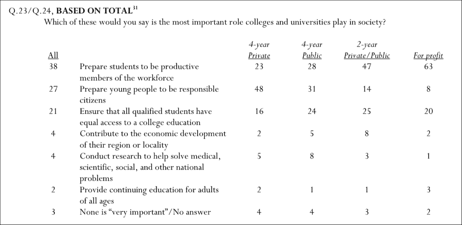

这个表格相当复杂。它只有六列和八行，但有几行占用了两行，并且标题行的文本仅在五列中显示。

### 提示

完整报告可以在 PewResearch 网站找到：[`www.pewsocialtrends.org/2011/05/15/is-college-worth-it/`](http://www.pewsocialtrends.org/2011/05/15/is-college-worth-it/)，我们使用的特定文件标注为《完整报告》：[`www.pewsocialtrends.org/files/2011/05/higher-ed-report.pdf`](http://www.pewsocialtrends.org/files/2011/05/higher-ed-report.pdf)。

## 第一步——尝试复制我们需要的数据

我们将在这个示例中使用的数据位于 PDF 文件的第 149 页（在他们的文档中标记为第 143 页）。如果我们在 PDF 查看器中打开文件，例如 Mac OSX 上的预览，并尝试仅选择表格中的数据，我们已经看到一些奇怪的事情发生了。例如，即使我们不打算选择页面编号（143），它仍然被选中了。这对我们的实验来说不是个好兆头，但我们还是继续吧。使用 Command-C 复制数据，或者选择**编辑** | **复制**。

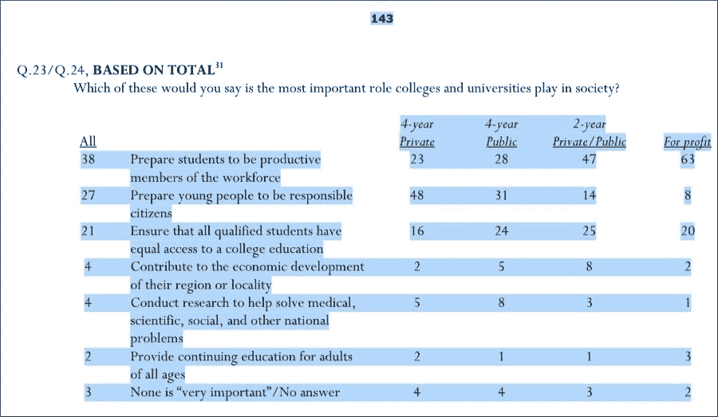

在预览中选择这个 PDF 中的文本时的显示效果

## 第二步——尝试将复制的数据粘贴到文本编辑器中

以下截图展示了复制的文本粘贴到我们的文本编辑器 Text Wrangler 中后的样子：

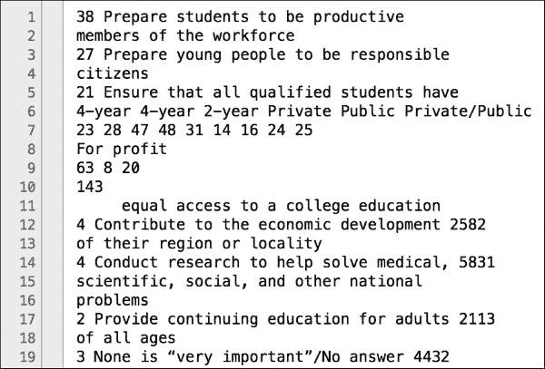

很明显，在复制并粘贴数据后，这些数据的顺序完全混乱。页面编号被包含在内，数字是横向排列的而非纵向，列标题也排列错乱。甚至有些数字被合并了；例如，最后一行包含了 4、4、3、2 这四个数字，但在粘贴后的版本中，这些数字变成了一个单一的数字**4432**。此时，手动清理这些数据可能需要比重新输入原始表格更长的时间。我们可以得出结论，在处理这个特定的 PDF 文件时，我们需要采取更强的措施来清理它。

### 提示

我们应当注意，此时 PDF 文件的其他部分*清理得很好*。例如，位于文件第 3 页的前言（纯文本部分），使用前述技巧复制出来也很顺利。在这个文件中，唯一的问题是实际的表格数据。你应该在决定提取技巧之前，先对 PDF 文件的所有部分——包括文本和表格数据——进行实验。

## 第三步——制作文件的简化版本

我们的复制粘贴操作没有成功，因此我们已经接受了需要采取更具侵入性措施的事实。也许如果我们不打算提取这个 PDF 文件的所有 159 页数据，我们可以仅识别出我们想要操作的 PDF 区域，并将该部分保存为一个单独的文件。

在 MacOSX 的 **预览** 中执行此操作，启动 **文件** | **打印…** 对话框。在 **页面** 区域，我们将输入实际想要复制的页面范围。为了进行这个实验，我们只对第 149 页感兴趣；因此，在 **从：** 和 **到：** 框中都输入 `149`，如以下截图所示。

然后在底部的 **PDF** 下拉框中，选择 **在预览中打开 PDF**。您将看到您的单页 PDF 出现在新窗口中。从这里，我们可以将其保存为新文件并给它一个新名称，如 `report149.pdf` 或类似名称。

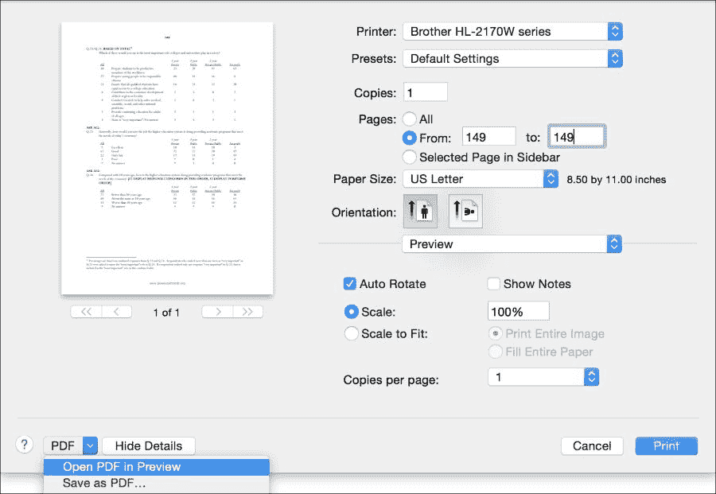

# 另一种可尝试的技术 – pdfMiner

现在我们有了一个较小的文件来进行实验，让我们尝试一些编程解决方案来提取文本，看看是否能有所改善。pdfMiner 是一个 Python 包，包含两个嵌入式工具，用于处理 PDF 文件。我们特别感兴趣的是尝试其中一个工具，一个名为 `pdf2txt` 的命令行程序，旨在从 PDF 文档中提取文本。也许它能够帮助我们正确提取文件中的数字表格。

## 第一步 – 安装 pdfMiner

启动 Canopy Python 环境。从 Canopy 终端窗口中，运行以下命令：

```py
pip install pdfminer

```

这将安装整个 pdfMiner 包及其所有相关的命令行工具。

### 提示

pdfMiner 及其随附的两个工具 `pdf2txt` 和 `dumpPDF` 的文档可以在 [`www.unixuser.org/~euske/python/pdfminer/`](http://www.unixuser.org/~euske/python/pdfminer/) 查阅。

## 第二步 – 从 PDF 文件中提取文本

我们可以使用名为 `pdf2txt.py` 的命令行工具从 PDF 文件中提取所有文本。为此，请使用 Canopy 终端并导航到文件所在目录。命令的基本格式是 `pdf2txt.py <filename>`。如果您的文件较大并包含多页（或者如果您尚未将 PDF 拆分成较小的文件），您还可以运行 `pdf2txt.py –p149 <filename>` 来指定只提取第 149 页。

与前面的复制粘贴实验一样，我们不仅会尝试在第 149 页的表格上使用此技术，还会尝试在第 3 页的序言上。为了仅提取第 3 页的文本，我们运行以下命令：

```py
pdf2txt.py –p3 pewReport.pdf

```

运行此命令后，Pew Research 报告的提取序言将出现在我们的命令行窗口中：

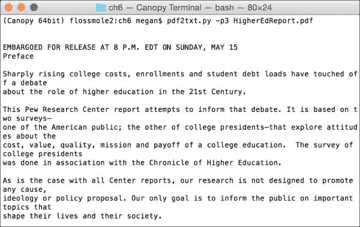

要将此文本保存为名为 `pewPreface.txt` 的文件，我们只需在命令行中添加重定向，如下所示：

```py
pdf2txt.py –p3 pewReport.pdf > pewPreface.txt

```

那么位于第 149 页的那些棘手的数据表格呢？当我们对它们使用`pdf2txt`时会发生什么呢？我们可以运行以下命令：

```py
pdf2txt.py pewReport149.pdf

```

结果比复制粘贴稍微好一些，但差别不大。实际的数据输出部分如下截图所示。列头和数据混在一起，来自不同列的数据顺序错乱。

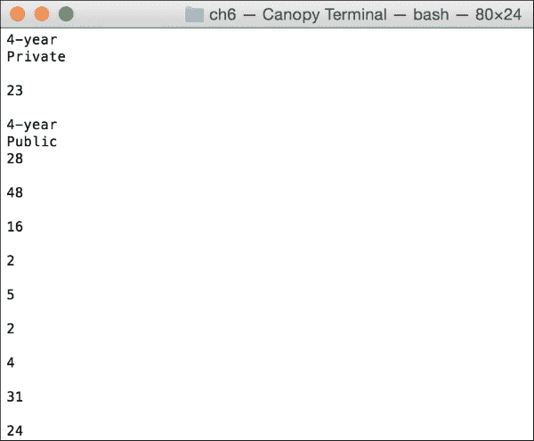

我们必须宣告此次表格数据提取实验失败，尽管 pdfMiner 在逐行文本提取方面表现得相当不错。

### 注意

请记住，使用这些工具的成功率可能因人而异，很多时候取决于原始 PDF 文件的特定特性。

看起来我们为这个示例选择了一个非常棘手的 PDF 文件，但我们不必灰心丧气。相反，我们将转向另一个工具，看看它的表现如何。

# 第三种选择——Tabula

**Tabula**是一个基于 Java 的程序，用于提取 PDF 文件中表格内的数据。我们将下载 Tabula 软件，并让它在我们第 149 页的棘手表格上发挥作用。

## 步骤一——下载 Tabula

Tabula 可以从其官方网站下载：[`tabula.technology/`](http://tabula.technology/)。该网站提供了一些简单的下载说明。

### 提示

在 Mac OSX 10.10.1 版本上，我必须先下载旧版的 Java 6 应用程序，才能运行 Tabula。整个过程非常简单，只需按照屏幕上的说明操作即可。

## 步骤二——运行 Tabula

从下载的`.zip`压缩文件中启动 Tabula。在 Mac 系统上，Tabula 应用程序文件简单地被称为`Tabula.app`。如果你愿意，可以将其复制到`Applications`文件夹中。

当 Tabula 启动时，它会在默认的网页浏览器中打开一个标签页或窗口，地址是`http://127.0.0.1:8080/`。屏幕上的初始操作部分如下所示：

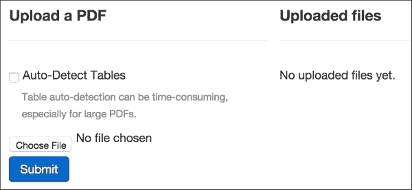

自动检测表格需要较长时间，这个警告是对的。对于包含三个表格的单页`perResearch149.pdf`文件，表格自动检测花费了整整两分钟，并且出现了一个关于 PDF 文件格式不正确的错误信息。

## 步骤三——指示 Tabula 提取数据

一旦 Tabula 读取了文件，就该指示它所在的位置在哪里了。使用鼠标光标，选择你感兴趣的表格。我在第一个表格的四周画了一个框。

Tabula 花了大约 30 秒钟读取表格，结果如下所示：

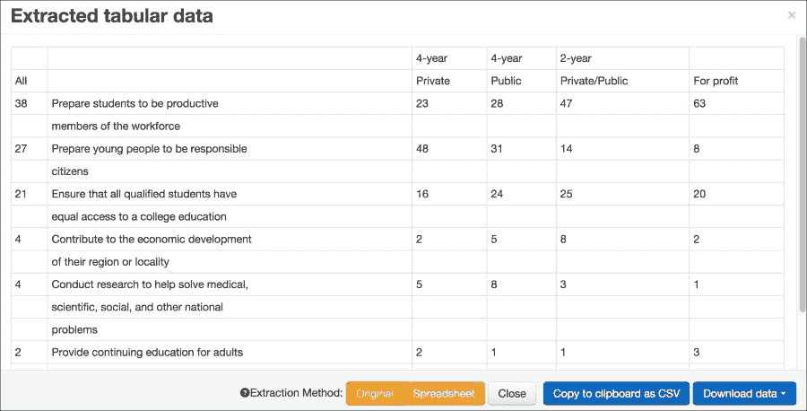

与通过复制粘贴和`pdf2txt`读取数据的方式相比，这些数据看起来非常不错。但是，如果你对 Tabula 读取表格的方式不满意，你可以通过清除选择并重新绘制矩形来重复此过程。

## 步骤四——提取数据

我们可以使用 Tabula 中的**下载数据**按钮将数据保存为更友好的文件格式，如 CSV 或 TSV。正如我们在前几章所学，这些格式如果需要，可以在电子表格或文本编辑器中清理。恰到好处，我们准备进行下一步了。

## 第五步——更多清理

在 Excel 或文本编辑器中打开 CSV 文件并查看它。在这个阶段，我们在提取 PDF 数据时已经遇到了很多失败，所以现在很容易就想放弃。然而，如果你已经读到数据清理的书籍中的这一部分，你可能会猜到这些数据还能进一步清理。这里有一些我们从前几章学到的简单数据清理任务：

1.  我们可以将所有两行文本单元格合并成一个单元格。例如，在**B**列，许多短语占据了不止一行。**让学生具备高效工作能力**和**成为劳动力成员**应该放在一个单元格中，作为一个完整的短语。**1**行和**2**行的表头也是如此（**4-year**和**Private**应该放在一个单元格中）。要在 Excel 中清理这些内容，可以在**B**列和**C**列之间创建一个新列。使用`concatenate()`函数将 B3:B4、B5:B6 等进行合并。使用**粘贴特殊**将新合并的值添加到新列中。然后删除不再需要的两列。对**1**行和**2**行也执行相同的操作。

1.  删除行之间的空白行。

    当这些操作完成后，数据看起来是这样的：

    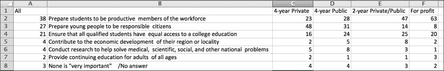

### 提示

与直接剪切粘贴数据或运行简单命令行工具相比，Tabula 可能看起来要花费更多精力。这是真的，除非你的 PDF 文件像这个一样挑剔。记住，专业工具之所以存在是有原因的——但除非真的需要，否则不要使用它们。首先使用简单的解决方案，只有在真正需要时才使用更复杂的工具。

# 当一切都失败时——第四种技术

Adobe Systems 销售的付费商业版 Acrobat 软件比起仅仅允许你阅读 PDF 文件，还具有一些附加功能。使用完整版的 Acrobat，你可以创建复杂的 PDF 文件，并以各种方式操作现有文件。与此相关的一个功能是 Acrobat 中的**导出选定内容为...**选项。

要开始使用此功能，请启动 Acrobat，并使用**文件打开**对话框打开 PDF 文件。在文件内，导航到包含要导出的数据的表格。以下截图展示了如何选择我们操作过的 149 页 PDF 中的数据。使用鼠标选择数据，然后右键点击并选择**导出选定内容为...**

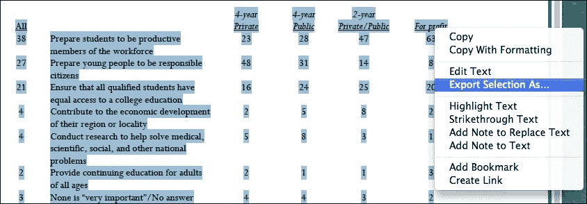

到此为止，Acrobat 会询问你想如何导出数据。CSV 是其中的一个选择。如果你确定不想在文本编辑器中编辑文件，Excel 工作簿（`.xlsx`）也是一个不错的选择。由于我知道 Excel 也能打开 CSV 文件，我决定将文件保存为这种格式，以便在 Excel 和文本编辑器之间具有更大的灵活性。

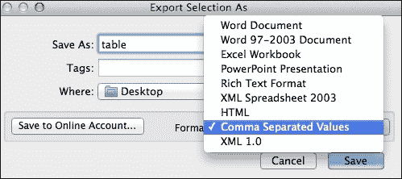

在选择文件格式后，我们会被提示输入文件名和保存位置。当我们在文本编辑器或 Excel 中打开生成的文件时，会发现它看起来和我们在前一节看到的 Tabula 版本很像。以下是 CSV 文件在 Excel 中打开后的样子：

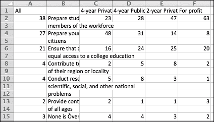

到这个阶段，我们可以使用与 Tabula 数据清洗时相同的清理程序，合并 B2:B3 单元格到一个单元格中，然后删除空行。

# 摘要

本章的目标是学习如何从 PDF 文件中导出数据。就像美酒中的沉淀物，PDF 文件中的数据起初看起来非常难以分离。然而，与倒酒这一非常被动的过程不同，分离 PDF 数据需要大量的反复试探。我们学会了四种处理 PDF 文件清洗数据的方法：复制粘贴、pdfMiner、Tabula 和 Acrobat 导出。每种工具都有其优缺点：

+   复制粘贴不需要任何成本，且几乎不需要工作，但对于复杂的表格来说，效果并不理想。

+   pdfMiner/Pdf2txt 也是免费的，作为一个命令行工具，它可以被自动化处理，且能处理大量数据。但和复制粘贴一样，它也容易被某些类型的表格所混淆。

+   Tabula 的设置工作量较大，而且由于它是一个正在开发中的产品，有时会出现奇怪的警告。它的处理速度也比其他选项慢一些。然而，它的输出非常干净，即便是复杂的表格。

+   Acrobat 的输出与 Tabula 类似，但几乎不需要设置，也几乎不费力气。它是一个付费产品。

到最后，我们得到了一个干净的数据集，准备进行分析或长期存储。

在下一章，我们将重点讨论已存储在**关系型数据库管理系统**（**RDBMS**）中的数据。我们将学习如何清洗这种方式存储的数据，了解一些常见的数据异常以及如何修复它们。
