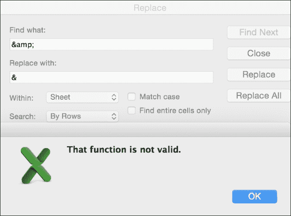
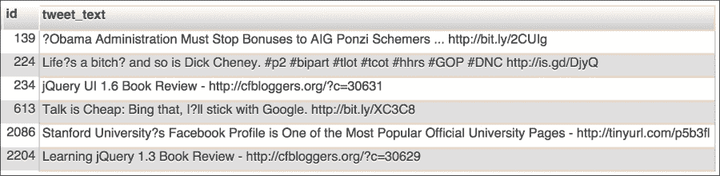

# 第七章：RDBMS 清理技术

家用冰箱通常配备架子，大多数还配有一两个蔬菜抽屉。但是，如果你曾经参观过家居整理商店或与专业的整理师交流过，你会发现还有许多额外的储存选项，包括蛋托、奶酪盒、饮料罐分配器、酒瓶架、剩菜标签系统以及各种尺寸的堆叠式、彩色编码的收纳盒。但我们真的需要这些额外的东西吗？要回答这个问题，你可以问自己以下几个问题：我常用的食物是否容易找到？食物是否占用了不应有的空间？剩菜是否清楚标注了内容和制作时间？如果我们的答案是*否*，整理专家表示，容器和标签可以帮助我们优化存储、减少浪费，并让生活更轻松。

这与我们的**关系型数据库管理系统**（**RDBMS**）是一样的。作为经典的长期数据存储解决方案，RDBMS 是现代数据科学工具包的标准部分。然而，我们常常犯的一个错误是，仅仅将数据存入数据库，却很少考虑细节。在本章中，我们将学习如何设计一个超越*两层架子和一个抽屉*的 RDBMS。我们将学习一些技术，确保我们的 RDBMS 能够优化存储、减少浪费，并使我们的生活更轻松。具体来说，我们将：

+   学习如何发现我们 RDBMS 数据中的异常

+   学习几种策略来清理不同类型的问题数据

+   学习何时以及如何为清理过的数据创建新表，包括创建子表和查找表

+   学习如何记录你所做更改的规则

# 准备工作

在本章的示例中，我们将使用一个流行的数据集——**Sentiment140**。该数据集的创建旨在帮助学习 Twitter 消息中的正面和负面情绪。我们在本书中并不专注于情感分析，但我们将使用这个数据集来练习在数据已导入关系型数据库后进行数据清理。

要开始使用 Sentiment140 数据集，你需要设置好 MySQL 服务器，和之前的 Enron 示例一样。

# 第一步——下载并检查 Sentiment140 数据集

我们想使用的 Sentiment140 数据版本是来自 Sentiment140 项目的原始文件集，直接可以从[`help.sentiment140.com/for-students`](http://help.sentiment140.com/for-students)获取。这份包含推文及其积极与消极情感（或情绪，评分为 0、2 或 4）的 ZIP 文件由斯坦福大学的研究生创建。自从这份文件公开发布后，其他网站也将原始的 Sentiment140 文件添加到其平台，并将其作为更大推文集合的一部分公开。对于本章内容，我们将使用原始的 Sentiment140 文本文件，可以通过前面提到的链接或直接访问[`cs.stanford.edu/people/alecmgo/trainingandtestdata.zip`](http://cs.stanford.edu/people/alecmgo/trainingandtestdata.zip)来获取。

下载 ZIP 文件，解压缩并使用文本编辑器查看其中的两个 CSV 文件。你会立刻注意到，一个文件比另一个文件的行数多得多，但这两个文件的列数是相同的。数据是逗号分隔的，并且每一列都被双引号括起来。每一列的描述可以在前一部分链接的`for-students`页面中找到。

# 第二步 – 清理以便数据库导入

对于我们的目的——学习如何清理数据——将这些文件中较小的一个加载到单个 MySQL 数据库表中就足够了。我们所需要做的所有学习，都可以通过较小的文件来完成，这个文件叫做`testdata.manual.2009.06.14.csv`。

在查看数据时，我们可能会注意到一些地方，如果我们直接将此文件导入 MySQL，可能会出现问题。其中一个问题出现在文件的第 28 行：

```py
"4","46","Thu May 14 02:58:07 UTC 2009","""booz allen""", 
```

你看到在`booz`关键字前和`allen`一词后有三重引号`"""`吗？同样的问题出现在第 41 行，在歌曲标题`P.Y.T`周围有双引号：

```py
"4","131","Sun May 17 15:05:03 UTC 2009","Danny Gokey","VickyTigger","I'm listening to ""P.Y.T"" by Danny Gokey…"
```

这些额外的引号问题在于 MySQL 导入程序会使用引号来分隔列文本。这将导致错误，因为 MySQL 会认为这一行的列数比实际的多。

为了解决这个问题，在文本编辑器中，我们可以使用**查找和替换**功能，将所有的`"""`替换为`"`（双引号），并将所有的`""`替换为`'`（单引号）。

### 提示

这些`""`可能也可以完全移除，对这个清理工作几乎没有负面影响。为此，我们只需要搜索`""`并将其替换为空。但如果你希望尽量接近推文的原始意图，使用单引号（甚至像这样转义的双引号`\"`）作为替代字符是一个安全的选择。

将这个清理过的文件保存为新文件名，比如`cleanedTestData.csv`。现在我们准备将它导入到 MySQL 中。

# 第三步 – 将数据导入到 MySQL 的单一表中

为了将我们稍微清理过的数据文件加载到 MySQL 中，我们需要回顾一下第三章中*导入电子表格数据到 MySQL*部分的 CSV 到 SQL 技术：

1.  从命令行，导航到保存你在第二步中创建的文件的目录。这就是我们将要导入到 MySQL 中的文件。

1.  然后，启动你的 MySQL 客户端，并连接到你的数据库服务器：

    ```py
    user@machine:~/sentiment140$ mysql -hlocalhost -umsquire -p
    Enter password:
    ```

1.  输入你的密码，登录后，在 MySQL 中创建一个数据库来存储表格，方法如下：

    ```py
    mysql> CREATE DATABASE sentiment140;
    mysql> USE sentiment140;
    ```

1.  接下来，我们需要创建一个表格来存储数据。每一列的数据类型和长度应该尽可能匹配我们所拥有的数据。某些列将是 varchar 类型的，每列都需要指定长度。由于我们可能不知道这些长度应该是多少，我们可以使用清理工具来确定一个合适的范围。

1.  如果我们在 Excel 中打开 CSV 文件（Google 电子表格同样可以很好地完成这项工作），我们可以运行一些简单的函数来找到某些文本字段的最大长度。例如，`len()`函数可以给出文本字符串的字符长度，`max()`函数则能告诉我们某个范围中的最大值。打开 CSV 文件后，我们可以应用这些函数来查看 MySQL 中 varchar 列的长度应是多少。

    以下截图展示了一种使用函数来解决这个问题的方法。它展示了`length()`函数应用于列**G**，并且`max()`函数应用于列**H**，但作用于列**G**。

    

    列**G**和**H**展示了如何在 Excel 中获取文本列的长度，然后获取最大值。

1.  为了更快速地计算这些最大长度，我们还可以使用 Excel 的快捷方式。以下数组公式可以快速将文本列的最大值和长度合并到一个单元格中——只需确保在输入此嵌套函数后按*Ctrl* + *Shift* + *Enter*，而不是仅按*Enter*：

    ```py
    =max(len(f1:f498))
    ```

    这个嵌套函数可以应用于任何文本列，以获取该列中文本的最大长度，它只使用一个单元格来完成这一操作，而不需要任何中间的长度计算。

在我们运行这些函数之后，结果显示我们任何一个推文的最大长度是 144 个字符。

## 检测和清理异常

你可能会好奇，为什么这个数据集中一条推文的长度会是 144 个字符，而 Twitter 限制所有推文的最大长度为 140 个字符。结果发现，在 sentiment140 数据集中，**&**字符有时被翻译成 HTML 等效代码`&amp`，但并不是每次都这样。有时也使用了其他 HTML 代码，例如，**<**字符变成了`&lt;`，**>**变成了`&gt;`。所以，对于一些非常长的推文，增加的几个字符很容易使这条推文超过 140 个字符的长度限制。我们知道，这些 HTML 编码的字符并不是原始用户推文的内容，而且我们发现这些情况并不是每次都会发生，因此我们称之为**数据异常**。

要清理这些数据，我们有两种选择。我们可以选择直接将脏数据导入数据库并尝试在那里清理，或者先在 Excel 或文本编辑器中清理。为了展示这两种方法的不同，我们在这里会同时演示这两种做法。首先，我们将在电子表格或文本编辑器中使用查找和替换功能，尝试将下表中显示的字符转换。我们可以将 CSV 文件导入 Excel，看看能在 Excel 中清理多少：

| HTML 代码 | 替换为 | 实例计数 | 用来查找计数的 Excel 函数 |
| --- | --- | --- | --- |
| `&lt;` | `<` | 6 | `=COUNTIF(F1:F498,"*&lt*")` |
| `&gt;` | `>` | 5 | `=COUNTIF(F1:F498,"*&gt*")` |
| `&amp;` | `&` | 24 | `=COUNTIF(F1:F498,"*&amp*")` |

前两个字符替换在 Excel 中的**查找和替换**功能中运行正常。`&lt;`和`&gt;`这些 HTML 编码字符已被替换。看看文本像这样：

```py
I'm listening to 'P.Y.T' by Danny Gokey &lt;3 &lt;3 &lt;3 Aww, he's so amazing. I &lt;3 him so much :)
```

上述内容会变成如下文本：

```py
I'm listening to 'P.Y.T' by Danny Gokey <3 <3 <3 Aww, he's so amazing. I <3 him so much :)
```

然而，当我们尝试在 Excel 中查找`&amp;`并将其替换为`&`时，可能会遇到一个错误，如下所示：



一些操作系统和 Excel 版本存在我们选择**&**字符作为替代符时的一个问题。如果遇到这个错误，我们可以采取几种不同的方法：

+   我们可以使用自己喜欢的搜索引擎，尝试找到一个 Excel 解决方案来修复这个错误。

+   我们可以将 CSV 文本数据移到文本编辑器中，并在那里执行查找和替换功能。

+   我们也可以继续将数据导入数据库，即使其中包含了奇怪的`&amp;`字符，然后再尝试在数据库中清理这些数据。

通常，我会倾向于不将脏数据导入数据库，除非可以在数据库外清理干净。然而，既然这章是关于在数据库内清理数据的，那我们就将半清理的数据导入数据库，等数据进入表格后，再清理`&amp;`问题。

## 创建我们的表格

为了将我们半清理的数据导入数据库，我们首先需要编写`CREATE`语句，然后在 MySQL 数据库中运行它。`CREATE`语句如下所示：

```py
mysql> CREATE TABLE sentiment140 (
    ->   polarity enum('0','2','4') DEFAULT NULL,
    ->   id int(11) PRIMARY KEY,
    ->   date_of_tweet varchar(28) DEFAULT NULL,
    ->   query_phrase varchar(10) DEFAULT NULL,
    ->   user varchar(10) DEFAULT NULL,
    ->   tweet_text varchar(144) DEFAULT NULL
    -> ) ENGINE=MyISAM DEFAULT CHARSET=utf8;
```

### 注意

该语句使用简单快速的 MyISAM 引擎，因为我们预计不会需要任何 InnoDB 功能，例如行级锁定或事务处理。关于 MyISAM 与 InnoDB 的区别，这里有一个关于何时使用每种存储引擎的讨论：[`stackoverflow.com/questions/20148/myisam-versus-innodb`](http://stackoverflow.com/questions/20148/myisam-versus-innodb)。

你可能会注意到，代码仍然要求`tweet_text`列的长度为 144。这是因为我们无法清理包含`&amp;`代码的这些列。然而，这对我影响不大，因为我知道 varchar 列不会使用额外的空间，除非它们需要。毕竟，这就是它们被称为 varchar（可变字符）列的原因。但是，如果这个额外的长度真的让你困扰，你可以稍后修改表格，只保留该列的 140 个字符。

接下来，我们将使用 MySQL 命令行从以下位置运行导入语句：

```py
mysql> LOAD DATA LOCAL INFILE 'cleanedTestData.csv'
    ->   INTO TABLE sentiment140
    ->   FIELDS TERMINATED BY ',' ENCLOSED BY '"' ESCAPED BY '\'
    ->   (polarity, id, date_of_tweet, query_phrase, user, tweet_text);
```

该命令将从我们清理过的 CSV 文件中加载数据到我们创建的新表中。成功消息将显示如下，表明所有 498 行数据已经成功加载到表中：

```py
Query OK, 498 rows affected (0.00 sec)
Records: 498  Deleted: 0  Skipped: 0  Warnings: 0
```

### 提示

如果你可以访问浏览器界面的工具，如 phpMyAdmin（或者桌面应用程序如 MySQL Workbench 或 Toad for MySQL），所有这些 SQL 命令都可以在这些工具中轻松完成，而无需在命令行中输入。例如，在 phpMyAdmin 中，你可以使用导入标签并在那里上传 CSV 文件。只要确保数据文件按照*第二步 – 为数据库导入清理*中的步骤进行清理，否则你可能会遇到文件中列数过多的错误。这个错误是由于引号问题导致的。

# 第四步 – 清理`&amp;`字符

在最后一步，我们决定暂时不清理`&amp;`字符，因为 Excel 在处理时给出了一个奇怪的错误。现在我们已经完成了*第三步 – 将数据导入到 MySQL 的单一表格*，并且数据已经导入到 MySQL 中，我们可以非常轻松地使用`UPDATE`语句和`replace()`字符串函数来清理数据。以下是需要的 SQL 查询，用来将所有出现的`&amp;`替换为`&`：

```py
UPDATE sentiment140 SET tweet_text = replace(tweet_text,'&amp;', '&');
```

`replace()`函数的工作方式就像在 Excel 或文本编辑器中的查找和替换一样。我们可以看到，推文 ID 594 曾经显示为`#at&amp;t is complete fail`，现在变成了`#at&t is complete fail`。

# 第五步 – 清理其他神秘字符

当我们浏览`tweet_text`列时，可能会注意到一些奇怪的推文，例如推文 ID 613 和 2086：

```py
613, Talk is Cheap: Bing that, I?ll stick with Google
2086, Stanford University?s Facebook Profile
```

`?`字符是我们应该关注的重点。和我们之前看到的 HTML 编码字符一样，这个字符问题也很可能是字符集转换中的一个副作用。在这种情况下，原始推文中可能有某种高 ASCII 或 Unicode 的撇号（有时称为**智能引号**），但当数据转换为低级字符集，如纯 ASCII 时，那个特定的撇号就被简单地更改为`?`。

根据我们打算如何处理这些数据，我们可能不希望省略`?`字符。例如，如果我们进行词频统计或文本挖掘，可能非常重要的是将`I?ll`转换为`I'll`，并将`University?s`转换为`University's`。如果我们决定这很重要，那么我们的任务就是检测到发生错误的推文，然后制定策略将问号转换回单引号。当然，诀窍在于，我们不能仅仅把`tweet_text`列中的每个问号都替换成单引号，因为有些推文中的问号是应该保留的。

为了定位问题字符，我们可以运行一些 SQL 查询，尝试使用正则表达式来查找问题。我们关注的是出现在奇怪位置的问号，例如紧跟其后的是字母字符。以下是使用 MySQL `REGEXP` 功能的初步正则表达式。运行此查询将大致告诉我们问题问号可能所在的位置：

```py
SELECT id, tweet_text
FROM sentiment140
WHERE tweet_text
REGEXP '\\?[[:alpha:]]+';
```

这个 SQL 正则表达式查找紧跟一个或多个字母字符的问号字符。SQL 查询返回了六行结果，其中四行结果的问号是异常的，另外两行是**假阳性**。假阳性是指匹配了我们模式但实际上不应更改的推文。两个假阳性是推文 ID 为**234**和**2204**的推文，它们包含的问号是合法的 URL 的一部分。推文**139**、**224**、**613**和**2086**是**真阳性**，也就是说，这些推文被正确地检测为异常，需要进行修改。所有结果如下图所示，来自 phpMyAdmin 的截图：



不过，**139**号推文有点奇怪。它在**Obama**这个词前面有一个问号，就像是在引用某篇新闻文章的标题，但在字符串末尾没有匹配的引号（或者是丢失的引号）。这应该是某个其他字符吗？这实际上也可能是一个假阳性，或者至少它的阳性不足以让我们真正去修复它。在仔细检查推文时，**224**号推文也在一个看起来不该出现问号的地方多了一个奇怪的问号。

如果我们要编写一个`replace()`函数，将问题问号替换为单引号，我们将需要编写一个正则表达式，仅匹配真正的问题，并且不匹配任何误报。然而，由于这个数据集很小，且只有四个真正的问题——如果我们认为**139**不需要清理的话，就是三个——那么我们完全可以手动清理这些问题。特别是因为我们对于其他可能存在的问题（例如推文**224**中的额外问号）还有一些疑问。

在这种情况下，由于我们只有三行问题数据，直接对数据运行三个小的`UPDATE`命令会比尝试构建完美的正则表达式更快捷。以下是处理推文**224**（仅第一个问题）、**613**和**2086**的 SQL 查询：

```py
UPDATE sentiment140 SET tweet_text = 'Life''s a bitch? and so is Dick Cheney. #p2 #bipart #tlot #tcot #hhrs #GOP #DNC http://is.gd/DjyQ' WHERE id = 224;

UPDATE sentiment140 SET tweet_text = 'Talk is Cheap: Bing that, I''ll stick with Google. http://bit.ly/XC3C8' WHERE id = 613;

UPDATE sentiment140 SET tweet_text = 'Stanford University''s Facebook Profile is One of the Most Popular Official University Pages - http://tinyurl.com/p5b3fl' WHERE id = 2086;
```

### 注意

请注意，在这些更新语句中，我们必须对单引号进行转义。在 MySQL 中，转义字符可以是反斜杠或单引号本身。这些示例中使用了单引号作为转义字符。

## 第六步——清理日期

如果我们查看`date_of_tweet`列，会发现我们将其创建为一个简单的可变字符字段，`varchar(30)`。那有什么问题呢？好吧，假设我们想按时间顺序排列这些推文。现在，我们不能使用简单的 SQL `ORDER BY`语句来获取正确的日期顺序，因为我们得到的将是字母顺序。所有星期五都会排在任何星期一之前，五月总是在六月之后。我们可以用以下 SQL 查询来测试这一点：

```py
SELECT id, date_of_tweet
FROM sentiment140
ORDER BY date_of_tweet;
```

最初的几行是按顺序排列的，但在第 28 行附近，我们开始看到问题：

```py
2018  Fri May 15 06:45:54 UTC 2009
2544  Mon Jun 08 00:01:27 UTC 2009
…
3  Mon May 11 03:17:40 UTC 2009
```

`5 月 11 日`并不在`5 月 15 日`或`6 月 8 日`之后。为了解决这个问题，我们需要创建一个新列，清理这些日期字符串，并将它们转换为合适的 MySQL 日期时间数据类型。我们在第二章的*数据类型转换*部分中学到，MySQL 在日期和时间作为原生**date**、**time**或**datetime**类型存储时效果最好。插入 datetime 类型的格式如下：`YYYY-MM-DD HH:MM:SS`。但我们在`date_of_tweet`列中的数据并不是这种格式。

MySQL 有许多内置函数可以帮助我们将杂乱的日期字符串格式化为首选格式。通过这样做，我们可以利用 MySQL 在日期和时间上的数学运算能力，例如，找出两个日期或时间之间的差异，或者按日期或时间正确地排序项目。

为了将我们的字符串转换为 MySQL 友好的日期时间类型，我们将执行以下操作：

1.  修改表格，增加一个新列，用于存储新的日期时间信息。我们可以将这个新列命名为`date_of_tweet_new`、`date_clean`，或者其他一个清晰区分于原`date_of_tweet`列的名称。执行此任务的 SQL 查询如下：

    ```py
    ALTER TABLE sentiment140
    ADD date_clean DATETIME NULL
    AFTER date_of_tweet;
    ```

1.  对每一行执行更新操作，将旧的日期字符串格式化为正确格式的日期时间类型，而不是字符串，并将新值添加到新创建的`date_clean`列中。执行此任务的 SQL 语句如下：

    ```py
    UPDATE sentiment140
    SET date_clean = str_to_date(date_of_tweet, '%a %b %d %H:%i:%s UTC %Y');
    ```

此时，我们已经有了一个新列，里面填充了清理后的日期时间。回想一下，原来的`date_of_tweet`列有问题，因为它没有正确地对日期进行排序。为了测试日期是否现在已经正确排序，我们可以按新列的顺序选择数据：

```py
SELECT id, date_of_tweet 
FROM sentiment140
ORDER BY date_clean;
```

我们看到现在的行已经完美排序，5 月 11 日的日期排在最前面，且没有日期错乱。

我们是否应该删除旧的`date`列？这由你决定。如果你担心可能犯了错误，或者因为某些原因你可能需要原始数据，那么就保留它。但如果你觉得可以删除，直接删除该列，如下所示：

```py
ALTER TABLE sentiment140 
DROP date_of_tweet;
```

你也可以创建一个 Sentiment140 表的副本，里面包含原始列作为备份。

# 第七步 – 分离用户提及、话题标签和 URL

目前这个数据的另一个问题是，`tweet_text`列中隐藏了很多有趣的信息，例如，考虑一个人使用`@`符号将推文指向另一个人的情况。这叫做 Twitter 上的**提及**。统计一个人被提及的次数，或者统计他们与特定关键词一起被提及的次数，可能会很有趣。另一个隐藏在部分推文中的有趣数据是**话题标签**；例如，ID 为 2165 的推文使用了`#jobs`和`#sittercity`话题标签讨论工作和保姆的概念。

这条推文还包含了一个外部的非 Twitter**URL**。我们可以提取每个提及、话题标签和 URL，并将它们单独保存到数据库中。

这个任务与我们清理日期时的操作类似，但有一个重要的区别。在日期的情况下，我们只有一个可能的修正版本，因此只需添加一个新列来存储清理后的日期版本。然而，对于提及、话题标签和 URL，我们在单个`tweet_text`值中可能会有零个或多个，例如我们之前查看的推文（ID 2165）包含了两个话题标签，这条推文（ID 2223）也是如此：

```py
HTML 5 Demos! Lots of great stuff to come! Yes, I'm excited. :) http://htmlfive.appspot.com #io2009 #googleio
```

这条推文没有提及、一个 URL 和两个话题标签。推文 ID 为 13078 的推文包含了三个提及，但没有话题标签或 URL：

```py
Monday already. Iran may implode. Kitchen is a disaster. @annagoss seems happy. @sebulous had a nice weekend and @goldpanda is great. whoop.
```

我们需要更改数据库结构，以便存储这些新的信息——话题标签、URLs 和用户提及——同时要记住，一条推文中可能包含许多这样的内容。

## 创建一些新表

根据关系数据库理论，我们应避免创建用于存储多值属性的列。例如，如果一条推文有三个话题标签，我们不应该将这三个话题标签都存入同一列。对我们来说，这条规则意味着我们不能直接复制用于日期清理问题的`ALTER`过程。

相反，我们需要创建三个新表：`sentiment140_mentions`、`sentiment140_urls` 和 `sentiment140_hashtags`。每个新表的主键将是一个合成 ID 列，每个表将包括另外两个列：`tweet_id`，它将该新表与原始`sentiment140`表联系起来，以及实际提取的标签、提及或 URL 文本。以下是创建这些表的三个`CREATE`语句：

```py
CREATE TABLE IF NOT EXISTS sentiment140_mentions (
  id int(11) NOT NULL AUTO_INCREMENT,
  tweet_id int(11) NOT NULL,
  mention varchar(144) NOT NULL,
  PRIMARY KEY (id)
) ENGINE=MyISAM DEFAULT CHARSET=utf8;

CREATE TABLE IF NOT EXISTS sentiment140_hashtags (
  id int(11) NOT NULL AUTO_INCREMENT,
  tweet_id int(11) NOT NULL,
  hashtag varchar(144) NOT NULL,
  PRIMARY KEY (id)
) ENGINE=MyISAM DEFAULT CHARSET=utf8;

CREATE TABLE IF NOT EXISTS sentiment140_urls (
  id int(11) NOT NULL AUTO_INCREMENT,
  tweet_id int(11) NOT NULL,
  url varchar(144) NOT NULL,
  PRIMARY KEY (id)
) ENGINE=MyISAM DEFAULT CHARSET=utf8;
```

### 注意

这些表不使用外键回到原始的`sentiment140`推文表。如果您想添加这些外键，这是完全可能的。但为了学习如何清理这个数据集，我们在此并不需要外键。

现在我们已经创建了表格，是时候将我们从`tweet_text column`中仔细提取的数据填充到这些表格中了。我们将分别处理每个提取的案例，从用户提及开始。

## 提取用户提及

为了设计一个能处理用户提及提取的程序，我们首先回顾一下我们已知的推文中关于提及的内容：

+   用户提及总是以**@**符号开始

+   用户提及是紧跟在**@**符号后的单词

+   如果**@**后面有空格，则不是用户提及

+   用户提及本身内部没有空格

+   由于电子邮件地址也使用**@**符号，我们应该注意这一点

使用这些规则，我们可以构造一些有效的用户提及：

+   @foo

+   @foobar1

+   @_1foobar_

我们可以构造一些无效的用户提及示例：

+   @ foo（@后面的空格使其无效）

+   foo@bar.com（bar.com 未被识别）

+   @foo bar（只会识别@foo）

+   @foo.bar（只会识别@foo）

### 注意

在这个例子中，我们假设我们不关心常规的`@mention`和`.`@mention`（有时称为点提及）之间的区别。这些是推文中在`@`符号前有一个句点的推文，目的是将推文推送到所有用户的粉丝。

由于这个规则集比我们能在 SQL 中高效执行的要复杂，因此更倾向于编写一个简单的小脚本，利用正则表达式来清理这些推文。我们可以用任何能连接到数据库的语言来编写这种类型的脚本，比如 Python 或 PHP。由于我们在第二章中使用了 PHP 连接数据库，*基础知识 - 格式、类型和编码*，我们在这里也使用一个简单的 PHP 脚本。这个脚本连接到数据库，搜索 `tweet_text` 列中的用户提及，并将找到的提及移动到新的 `sentiment140_mentions` 表中：

```py
<?php
// connect to db
$dbc = mysqli_connect('localhost', 'username', 'password', 'sentiment140')
    or die('Error connecting to database!' . mysqli_error());
$dbc->set_charset("utf8");

// pull out the tweets
$select_query = "SELECT id, tweet_text FROM sentiment140";
$select_result = mysqli_query($dbc, $select_query);

// die if the query failed
if (!$select_result)
    die ("SELECT failed! [$select_query]" .  mysqli_error());

// pull out the mentions, if any
$mentions = array();
while($row = mysqli_fetch_array($select_result))
{
    if (preg_match_all(
        "/(?<!\pL)@(\pL+)/iu",
        $row["tweet_text"],
        $mentions
    ))
    { 
        foreach ($mentions[0] as $name)
        {
            $insert_query = "INSERT into sentiment140_mentions (id, tweet_id, mention) VALUES (NULL," . $row["id"] . ",'$name')";
            echo "<br />$insert_query";
            $insert_result = mysqli_query($dbc, $insert_query);
            // die if the query failed
            if (!$insert_result)
                die ("INSERT failed! [$insert_query]" .  mysqli_error());
        }
    }
}
?>
```

在对 `sentiment140` 表运行这个小脚本之后，我们发现从原始的 498 条推文中提取了 124 个独特的用户提及。这个脚本的几个有趣之处包括，它可以处理用户名中的 Unicode 字符，即使这个数据集中没有这些字符。我们可以通过快速插入一行测试数据到 `sentiment140` 表的末尾来进行测试，例如：

```py
INSERT INTO sentiment140 (id, tweet_text) VALUES(99999, "This is a @тест");
```

然后，再次运行脚本；你会看到在 `sentiment140_mentions` 表中添加了一行，并成功提取了 `@тест` 的 Unicode 用户提及。在下一节中，我们将构建一个类似的脚本来提取标签。

## 提取标签

标签有其自身的规则，这些规则与用户提及略有不同。以下是一些我们可以用来判断是否为标签的规则：

+   标签以 `#` 符号开头

+   标签是紧跟在 `#` 符号后面的单词

+   标签可以包含下划线，但不能有空格和其他标点符号

用于提取标签的 PHP 代码与用户提及的代码几乎完全相同，唯一不同的是代码中间的正则表达式。我们只需将 `$mentions` 变量改为 `$hashtags`，然后调整正则表达式如下：

```py
if (preg_match_all(
        "/(#\pL+)/iu",
        $row["tweet_text"],
        $hashtags
    ))
```

这个正则表达式表示我们对匹配大小写不敏感的 Unicode 字母字符感兴趣。然后，我们需要将 `INSERT` 行改为使用正确的表和列名，如下所示：

```py
$insert_query = "INSERT INTO sentiment140_hashtags (id, tweet_id, hashtag) VALUES (NULL," . $row["id"] . ",'$name')";
```

当我们成功运行这个脚本时，我们看到 54 个标签已被添加到 `sentiment140_hashtags` 表中。更多的推文中包含了多个标签，甚至比包含多个用户提及的推文还多。例如，我们可以立即看到推文 174 和 224 都包含了多个嵌入的标签。

接下来，我们将使用这个相同的骨架脚本，并再次修改它来提取 URLs。

## 提取 URLs

从文本中提取 URL 可以像寻找任何以*http://*或*https://*开头的字符串一样简单，或者根据文本中包含的 URL 类型的不同，可能会变得更为复杂。例如，有些字符串可能包括*file://* URL 或者磁力链接（如磁力链接），或者其他类型的特殊链接。在我们的 Twitter 数据中，情况相对简单，因为数据集中包含的所有 URL 都以 HTTP 开头。所以，我们可以偷懒，设计一个简单的正则表达式来提取任何以 http:// 或 https:// 开头的字符串。这个正则表达式看起来就是这样：

```py
if (preg_match_all(
        "!https?://\S+!",
        $row["tweet_text"],
        $urls
    ))
```

然而，如果我们在喜欢的搜索引擎上稍作搜索，实际上我们可以轻松找到一些相当印象深刻且实用的通用 URL 匹配模式，这些模式可以处理更复杂的链接格式。这样做的好处在于，如果我们编写的 URL 提取程序能够处理这些更复杂的情况，那么即使未来我们的数据发生变化，它依然能够正常工作。

一个非常详细的 URL 匹配模式文档给出了[`daringfireball.net/2010/07/improved_regex_for_matching_urls`](http://daringfireball.net/2010/07/improved_regex_for_matching_urls)网站。以下代码展示了如何修改我们的 PHP 代码，以便在 Sentiment140 数据集中使用该模式进行 URL 提取：

```py
<?php
// connect to db
$dbc = mysqli_connect('localhost', 'username', 'password', 'sentiment140')
    or die('Error connecting to database!' . mysqli_error());
$dbc->set_charset("utf8");

// pull out the tweets
$select_query = "SELECT id, tweet_text FROM sentiment140";
$select_result = mysqli_query($dbc, $select_query);

// die if the query failed
if (!$select_result)
    die ("SELECT failed! [$select_query]" .  mysqli_error());

// pull out the URLS, if any
$urls = array();
$pattern  = '#\b(([\w-]+://?|www[.])[^\s()<>]+(?:\([\w\d]+\)|([^[:punct:]\s]|/)))#';

while($row = mysqli_fetch_array($select_result))
{
    echo "<br/>working on tweet id: " . $row["id"];
    if (preg_match_all(
        $pattern,
        $row["tweet_text"],
        $urls
    ))
    {
        foreach ($urls[0] as $name)
        {
            echo "<br/>----url: ".$name;
            $insert_query = "INSERT into sentiment140_urls (id, tweet_id, url)
                VALUES (NULL," . $row["id"] . ",'$name')";
            echo "<br />$insert_query";
            $insert_result = mysqli_query($dbc, $insert_query);
            // die if the query failed
            if (!$insert_result)
                die ("INSERT failed! [$insert_query]" .mysqli_error());
        }
    }
}
?>
```

这个程序几乎与我们之前编写的提及提取程序相同，只有两个不同点。首先，我们将正则表达式模式存储在一个名为 `$pattern` 的变量中，因为它较长且复杂。其次，我们对数据库的 `INSERT` 命令做了小的修改，就像我们在话题标签提取时做的那样。

正则表达式模式的逐行解释可以在原始网站上找到，但简短的解释是，所示的模式将匹配任何 URL 协议，如 http:// 或 file://，它还尝试匹配有效的域名模式以及几级深度的目录/文件模式。如果你想查看它匹配的多种模式以及一些肯定*不会*匹配的已知模式，源网站也提供了自己的测试数据集。

# 第八步——清理查找表

在*第七步——分离用户提及、话题标签和 URL*部分，我们创建了新的表格来存储提取的标签、用户提及和 URL，然后提供了一种方法，通过`id`列将每一行与原始表格关联起来。我们按照数据库规范化的规则，通过创建新的表格来表示推文与用户提及、推文与话题标签、推文与 URL 之间的多对一关系。在这一步中，我们将继续优化此表格的性能和效率。

我们现在关心的列是`query_phrase`列。查看该列数据，我们可以看到同样的短语反复出现。这些显然是最初用于定位和选择现在存在于数据集中的推文的搜索短语。在`sentiment140`表中的 498 条推文中，查询短语有多少次被反复使用？我们可以通过以下 SQL 来检测这一点：

```py
SELECT count(DISTINCT query_phrase)
FROM sentiment140;
```

查询结果显示，只有 80 个不同的查询短语，但它们在 498 行数据中反复出现。

这在 498 行数据的表中可能看起来不算问题，但如果我们有一个非常大的表，比如包含数亿行的表，我们就需要关注这个列的两个问题。首先，重复这些字符串占用了数据库中不必要的空间；其次，查找不同的字符串值会非常慢。

为了解决这个问题，我们将创建一个**查找表**来存储查询值。每个查询字符串只会在这个新表中出现一次，我们还会为每个查询字符串创建一个 ID 号。接下来，我们将修改原始表，使用这些新的数字值，而不是目前使用的字符串值。我们的操作流程如下：

1.  创建一个新的查找表：

    ```py
    CREATE TABLE sentiment140_queries (
      query_id int(11) NOT NULL AUTO_INCREMENT,
      query_phrase varchar(25) NOT NULL,
      PRIMARY KEY (query_id)
    ) ENGINE=MyISAM DEFAULT CHARSET=utf8 AUTO_INCREMENT=1;
    ```

1.  用不同的查询短语填充查找表，并自动为每个短语分配一个`query_id`编号：

    ```py
    INSERT INTO sentiment140_queries (query_phrase)
    SELECT DISTINCT query_phrase FROM sentiment140;
    ```

1.  在原始表中创建一个新列，用于存储查询短语编号：

    ```py
    ALTER TABLE sentiment140
    ADD query_id INT NOT NULL AFTER query_phrase;
    ```

1.  在下一步操作出错的情况下，备份`sentiment140`表。每次对表执行`UPDATE`操作时，最好先进行备份。我们可以使用像 phpMyAdmin 这样的工具轻松复制表（使用**操作**标签）。或者，我们可以重新创建一份表的副本，并将原始表中的行导入到副本中，如下所示的 SQL：

    ```py
    CREATE TABLE sentiment140_backup(
      polarity int(1) DEFAULT NULL,
      id int(5)NOT NULL,
      date_of_tweet varchar(30) CHARACTER SET utf8 DEFAULT NULL ,
      date_clean datetime DEFAULT NULL COMMENT 'holds clean, formatted date_of_tweet',
      query_id int(11) NOT  NULL,
      user varchar(25) CHARACTER SET utf8 DEFAULT NULL,
      tweet_text varchar(144) CHARACTER SET utf8 DEFAULT NULL ,
      PRIMARY KEY (id)) ENGINE=MyISAM DEFAULT CHARSET=utf8;

    SET SQL_MODE='NO_AUTO_VALUE_ON_ZERO';
    INSERT INTO sentiment140_backup SELECT * FROM sentiment140;
    ```

1.  用正确的数字填充新列。为此，我们通过它们的文本列将两个表连接起来，然后从查找表中查找正确的数字值，并将其插入到`sentiment140`表中。在以下查询中，每个表都被赋予了别名`s`和`sq`：

    ```py
    UPDATE sentiment140 s
    INNER JOIN sentiment140_queries sq
    ON s.query_phrase = sq.query_phrase
    SET s.query_id = sq.query_id;
    ```

1.  删除`sentiment140`表中的旧`query_phrase`列：

    ```py
    ALTER TABLE sentiment140
    DROP query_phrase;
    ```

到目前为止，我们已经找到了一种有效的方法来创建短语列表，具体如下。这些短语按字母顺序排列：

```py
SELECT query_phrase
FROM sentiment140_queries
ORDER BY 1;
```

我们还可以通过对这两个表进行连接，查找包含给定短语（如`baseball`）的推文：

```py
SELECT s.id, s.tweet_text, sq.query_phrase
FROM sentiment140 s
INNER JOIN sentiment140_queries sq
  ON s.query_id = sq.query_id
WHERE sq.query_phrase = 'baseball';
```

到此为止，我们已经清理了`sentiment140`表，并创建了四个新表来存储各种提取和清理后的值，包括话题标签、用户提及、网址和查询短语。我们的`tweet_text`和`date_clean`列已经清理干净，并且我们已经有了一个查询短语的查找表。

## 第九步 – 记录你所做的工作

由于有九个清理步骤，并且使用了多种语言和工具，毫无疑问我们在某个环节会犯错并需要重复某个步骤。如果我们需要向别人描述我们做了什么，我们几乎肯定会记不清楚确切的步骤以及每个步骤背后的原因。

为了避免过程中出现错误，我们必须保持清理步骤的日志记录。至少，日志应按照执行顺序包含以下内容：

+   每个 SQL 语句

+   每个 Excel 函数或文本编辑器的操作流程，包括必要时的截图

+   每个脚本

+   每一步的备注和评论，解释为什么做每一件事

另一个优秀的建议是，在每个阶段都创建表的备份，例如，我们在对`sentiment140`表执行`UPDATE`操作之前就创建了备份，我们还讨论了在创建新的`date_clean`列之后进行备份。备份操作很简单，如果以后决定不需要备份表，可以随时删除它。

# 总结

在这一章中，我们使用了一个示例数据集——一个名为 Sentiment140 的推文集合，学习如何在关系数据库管理系统中清理和处理数据。我们在 Excel 中进行了几项基础清理操作，然后我们回顾了如何将数据从 CSV 文件导入到数据库中。在此之后，剩余的清理操作是在 RDBMS 内部进行的。我们学习了如何将字符串转换为正确的日期格式，然后我们提取了推文文本中的三种数据，并最终将这些提取的值移至新的干净表格中。接下来，我们学习了如何创建一个查找表，存储当前效率低下的数值，这样我们就能用高效的数字查找值更新原表。最后，由于我们执行了很多步骤，并且总有可能出现错误或关于我们所做操作的沟通不清晰，我们回顾了一些记录清理过程的策略。

在下一章中，我们将改变视角，专注于为他人准备已清理的数据，而不是清理我们已经得到的数据。我们将学习一些最佳实践，创建需要他人最少清理的 数据集。
