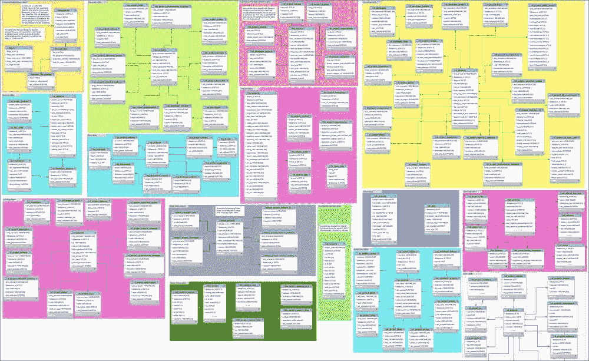

# 第八章 最佳实践：共享你的清洗数据

到目前为止，在本书中，我们已经学习了许多不同的方法来清洗和组织数据集。也许现在是时候考虑让别人使用我们清洗过的数据了。本章的目标是提供一些最佳实践，以便邀请朋友进入你的数据科学厨房。共享数据可能意味着将其提供给其他人、其他团队，甚至是你未来的某个版本。那么，如何将数据包装好，以供他人使用？你应该如何告诉别人你已经清洗好的数据？如何确保你所有的辛勤工作都归功于你？

在本章中，我们将学习：

+   如何展示和包装你的清洗数据

+   如何为你的数据提供清晰的文档说明

+   如何通过授权你的清洗数据来保护并扩展你的辛勤工作

+   如何找到并评估公开清洗数据的选项

在开始本章之前，我们应该明确指出，我们只能清洗并共享我们有权共享的数据。也许这听起来很显而易见，但值得重复一遍。本章假设你所清洗并随后共享的数据，实际上是你有权以这种方式处理的数据。如果你对此有疑问，请阅读本章中的*设置数据的条款和许可*部分，确保你遵循你希望你的用户遵循的相同准则。

# 准备一个清晰的数据包

在本节中，我们深入探讨了在发布数据包供大众使用之前需要回答的许多重要问题。

你希望人们如何访问你的数据？如果数据在数据库中，你希望用户能够登录并执行 SQL 命令吗？还是希望创建可以下载的纯文本文件供他们使用？你是否需要为数据创建 API？反正你到底有多少数据，是否希望对数据的不同部分设置不同的访问权限？

如何分享清洗后的数据的技术方面非常重要。一般来说，最好从简单的方式开始，必要时再采用更复杂的分发计划。以下是一些数据分发选项，按从最简单到最复杂的顺序排列。当然，随着复杂度的增加，也会带来更大的好处：

+   **压缩纯文本** – 这是一种非常低风险的分发方式。正如我们在第二章中学到的，*基础知识 - 格式、类型和编码*，纯文本可以被压缩成非常小的文件大小。一个简单的 CSV 或 JSON 文件是通用的，可以轻松转换为许多其他格式。需要考虑的事项包括：

    +   你将如何让用户下载文件？在网页上提供开放链接非常简单且方便，但它不允许你要求凭证（如用户名和密码）来访问文件。如果这对你很重要，那么你需要考虑其他分发文件的方法；例如，通过使用带有用户名和密码的 FTP 服务器，或通过使用你 web 服务器的访问控制。

    +   你的文件有多大？你预期的流量有多少？你的托管服务商允许多少流量，超出部分会开始收费？

+   **压缩 SQL 文件** — 分发 SQL 文件可以让你的用户在自己的系统上重建你的数据库结构和数据。需要考虑的一些因素包括：

    +   你的用户可能使用的数据库系统与你不同，因此他们无论如何都需要清理数据。直接给他们纯文本可能更高效。

    +   你的数据库系统可能与他们的服务器设置不同，因此你需要提前澄清这些自定义设置。

    +   你还需要提前规划是否你的数据集设计为随着时间增长，例如，决定你是否只提供 `UPDATE` 语句，还是始终提供足够的 `CREATE` 和 `INSERT` 语句来重新创建整个数据库。

+   **实时数据库访问** — 提供实时访问你的数据库是一种很好的方式，可以让用户在较低层次上与数据互动。需要考虑的一些因素包括：

    +   提供实时访问要求你为每个用户设置单独的用户名和密码，这意味着需要跟踪用户。

    +   因为你有可识别的用户，你需要提供一种方式来与他们沟通支持问题，包括丢失凭证以及如何使用系统。

    +   除非你已经为数据库构建了一个安全的前端，并采取了基本的预防措施，比如限制用户执行查询的次数和查询执行的时间，否则允许通用用户名和密码可能不是一个好主意。一个不当的 `OUTER JOIN` 查询，尤其是对一个有几千 TB 数据的表，可能会使你的数据库崩溃，影响其他用户。

    +   你是否希望用户能够构建访问你数据的程序，例如，通过 ODBC 或 JDBC 中间件层？如果是这样，你需要在规划访问权限和配置服务器时考虑到这一点。

+   **API** — 设计一个**应用程序编程接口**（**API**）来访问你的数据，将允许你的最终用户编写自己的程序，能够以可预测的方式访问数据并获取结果集。API 的优点是，它将在互联网上提供以已知的、受限的方式访问数据的途径，并且用户无需解析数据文件或处理将数据从一种格式转换到另一种格式的任务。需要考虑的一些因素包括：

    +   构建一个良好的 API 在前期投入上比其他选项更昂贵；然而，如果你有很多需要支持的用户且支持人员有限，那么从长远来看，构建 API 可能会帮你节省资金。

    +   使用 API 要求用户具备比其他方法更高的技术知识。你应该准备好详细的文档，并附带示例。

    +   你需要有一个认证和安全计划来追踪谁被允许访问你的数据以及他们可以对数据进行哪些操作。如果你计划设立多个访问层级，例如，将数据的不同层次进行货币化，那么诸如用户从一个层次转到另一个层次等问题需要提前进行清晰的规划。

    +   就像常规的数据库访问一样，用户滥用或误用 API 是始终可能发生的情况。你需要提前规划并采取预防措施，发现并移除那些可能通过故意或无意的误用，使得服务无法访问的恶意或不小心的用户。

选择分发方法会受到你的预算（包括资金和时间）以及用户期望的影响。我能给出的最好建议是：我在遵循开源软件座右铭“*尽早发布，经常发布*”时，取得了不错的成果。这对我有用，因为我有一个小的用户群，有限的预算，并且没有太多闲暇时间来应对那些可能有效也可能无效的复杂打包计划。

## 提醒一句——使用 GitHub 分发数据

GitHub 是一个基于云的文件存储库，旨在帮助软件开发人员协作开发软件并托管他们的代码以供他人下载。它的受欢迎程度急剧上升，目前托管了超过 1600 万个项目仓库。正因为如此，我与许多数据科学家交流时，他们都建议将数据存储在 GitHub 上。

不幸的是，GitHub 在存储非代码数据方面存在一些局限性，尽管它在技术人员中非常流行且易于使用，但你仍应注意其一些政策，这些政策可能会影响你的数据。相关政策已在帮助指南中列出，链接为[`help.github.com/articles/what-is-my-disk-quota`](https://help.github.com/articles/what-is-my-disk-quota)，但我们已在这里总结了其中的重要内容：

+   首先，GitHub 是对源代码控制系统 Git 的封装，而该系统并不适合存储 SQL。帮助指南中写道，“大型 SQL 文件与 Git 等版本控制系统兼容性差。”我不确定“兼容性差”具体指什么，但我确信在用户体验至关重要的情况下，我一定要避免遇到这种问题。

+   其次，GitHub 对文件大小有一些严格的限制。每个项目（仓库）限制为 1GB，每个文件限制为 100MB。我发布的大多数数据文件作为个人文件时都小于这个限制，但由于我每年多次发布许多时间序列文件，我不得不为它们创建多个仓库。在这种方案下，每次我发布新文件时，都需要评估是否会超出文件大小限制。这很快就变成了一个大麻烦。

简而言之，GitHub 本身推荐使用一种网络托管解决方案来分发文件，特别是当文件较大或面向数据库时。如果你决定在 GitHub 上托管，务必小心发布包含用户凭据的文件。这包括发布你数据库系统的用户名和密码、Twitter 的认证密钥和秘密，或其他任何个人信息。由于 GitHub 本质上是一个 Git 仓库，这些错误将永远存在，除非整个仓库被删除。如果你发现自己犯了错误，将个人信息发布到了 GitHub，必须立即取消当前账户的认证，并重新创建所有密钥和密码。

# 文档化你的数据

一旦人们获得了数据，理想情况下，即使是在之前，他们也需要了解自己所得到的是什么。文档化数据可能对你来说只是事后想起来的事情，但对于你的用户来说极其重要，因为他们对数据和你做的所有处理并不熟悉。在本节中，我们将回顾一些可以添加到数据包中的内容，以帮助理解数据。

## README 文件

简单的 `README` 文件在计算机领域有着悠久的历史。它只是一个与软件包一起分发的文本文件，或者位于包含其他文件的目录中，目的是让用户在开始使用其余的软件包或文件之前，先阅读 `README` 文件。`README` 文件会告诉用户有关软件包的重要信息，如作者和创作原因、安装说明、已知的错误和使用文件的其他基本说明。

如果你正在构建数据包，例如，包含文本或 SQL 文件的压缩文件，快速且简单的方法是在压缩前为文件包添加一个 `README` 文件。如果你正在为文件创建一个网站或在线目录，在显眼的位置添加一个 `README` 文件会非常有帮助。以下截图展示了我用来分发我参与的项目 **FLOSSmole** 文件的一个网站目录。我添加了一个 `README` 目录，以便将所有需要用户首先阅读的文件放入其中。我将该目录名以一个下划线开头，这样它将始终按字母顺序排在列表的顶部：


网站上显示 README 文件的文件目录，README 文件位于顶部。

在`README.txt`文件中，我给用户提供了关于文件的通用和具体说明。以下是我为这个目录中的数据提供的`README`文件示例：

```py
README for http://flossdata.syr.edu/data directory 

What is this place?
This is a repository of flat files or data "dumps", from the FLOSSmole project.

What is FLOSSmole? 
Since 2004, FLOSSmole aims to:
    --freely provide data about free, libre, and open source software (FLOSS) projects in multiple formats for anyone to download;
    --integrate donated data & scripts from other research teams;
    --provide a community for researchers to discuss public data about FLOSS development.

FLOSSmole contains: Several terabytes (TB) of data covering the period 2004-now, and growing with data sets from nearly 10,000 web-based collection operations, and growing each month. This includes data for millions of open source projects and their developers.

If you use FLOSSmole data, please cite it accordingly:
Howison, J., Conklin, M., & Crowston, K. (2006). FLOSSmole: A collaborative repository for FLOSS research data and analyses. International Journal of Information Technology and Web Engineering, 1(3), 17–26.

What is included on this site? 
Flat files, date and time-stamped, from various software forges & projects. We have a lot of other data in our database that is not available here in flat files. For example, IRC logs and email from various projects. For those, see the following:

1\. Direct database access. Please use this link for direct access to our MySQL database: http://flossmole.org/content/direct-db-access-flossmole-collection-available

2\. FLOSSmole web site. Includes updates, visualizations, and examples. http://flossmole.org/
```

这个示例`README`文件适用于整个目录的文件，但你也可以为每个文件或不同的目录准备一个`README`文件。这完全取决于你。

## 文件头部

另一种有效的向用户传达信息的方式，特别是当你创建的是平面文本文件或 SQL 命令时，是在每个文件的顶部放置一个头部，解释其格式和使用方式。一种常见做法是为每一行头部加上某种类似注释的字符，如`#`或`//`。

文件头部中常包含的一些内容有：

+   文件名和文件所在的包的名称

+   参与创建此文件的人员姓名、他们的组织和所在地

+   文件发布的日期

+   文件的版本号，或者在哪里可以找到该文件的早期版本

+   文件的目的

+   数据的来源地，以及数据自那时以来所做的任何更改

+   文件的格式及其组织方式，例如，列出字段及其含义

+   文件的使用条款或许可

以下示例显示了我某个数据项目中分发的 TSV 文件的头部示例。在其中，我解释了数据的内容以及如何解释文件中的每一列。我还解释了如何引用数据以及如何分享数据的政策。我们将在本章后面讨论授权和分享的选项：

```py
# Author: Squire, M. & Gazda, R.
# License: Open Database License 1.0
# This data 2012LTinsultsLKML.tsv.txt is made available under the 
# Open Database License: http://opendatacommons.org/licenses/ 
# odbl/1.0/. 
#
# filename: 2012LTinsultsLKML.tsv.txt
# explanation: This data set is part of a larger group of data 
# sets described in the paper below, and hosted on the 
# FLOSSmole.org site. Contains insults gleaned from messages sent 
# to the LKML mailing list by Linus Torvalds during the year 2012
#
# explanation of fields:
# date: this is the date the original email was sent
# markmail permalink: this is a permalink to the email on markmail 
# (for easy reading)
# type: this is our code for what type of insult this is
# mail excerpt: this is the fragment of the email containing the 
# insult(s). Ellipses (...) have been added where necessary.
#
# Please cite the paper and FLOSSmole as follows:
#
# Squire, M. & Gazda, R. (2015). FLOSS as a source for profanity 
# and insults: Collecting the data. In Proceedings of 48th 
# Hawai'i International Conference on System Sciences (HICSS-48).
# IEEE. Hawaii, USA. 5290-5298
#
# Howison, J., Conklin, M., & Crowston, K. (2006). FLOSSmole: A 
# collaborative repository for FLOSS research data and analyses. 
# International Journal of Information Technology and Web 
# Engineering, 1(3), 17–26.
```

如果你预期用户将定期收集你的数据文件，你应该在文件头部使用一致的注释字符。在前面的示例中，我使用了`#`字符。这样做的原因是，用户可能会编写程序来自动下载和解析你的数据，或许将其加载到数据库中，或在程序中使用。你一致使用注释字符将使用户能够跳过头部内容，不进行处理。

## 数据模型和图表

如果你分发的是用于构建数据库的 SQL 文件，或者你提供了用于查询的数据库的实时访问，可能会发现一个可视化图表，如**实体-关系图**（**ERD**），将极大地帮助用户。

在我的一些项目中，我喜欢同时提供表格的文字描述，例如前面描述的头部和`README`文件，同时也提供表格及其之间关系的可视化图表。因为我分发的数据库非常庞大，我还会对我的图表进行着色，并注释图表的每个部分，以指示该部分数据库中的内容。

以下截图展示了我的一个大型图表的高层次概览。它被缩小，以显示实体-关系图（ERD）的大小：



由于这个 ERD（实体关系图）有点复杂且难以阅读，即使是在大屏幕上，我已将数据库的每个独立部分进行了着色，并在需要的地方提供了注释。下面是从大图的左上角放大后的橙色部分截图：


数据库某一部分的特写图，包括描述表格目的的注释。

通过查看这个图表，用户能够清晰地了解数据库不同部分是如何组合在一起的。重要的是，高层次的注释直接显示在图表上，当用户需要关于某个特定字段的详细信息时，他们可以参考 README 文件或该文件中的头部部分。

要创建 ERD，你可以使用任何数据库管理系统（RDBMS）工具，包括 MySQL Workbench（这是我用来创建你所看到的着色版本的工具）。其他流行的工具包括 Microsoft Visio、Sparx Enterprise Architect 和 draw.io。许多这些工具允许你连接到 RDBMS 并从现有数据库逆向生成图表，或者从图纸中正向生成 SQL 语句。在任何一种情况下，ERD 都能帮助你的用户更好地理解数据模型。

## 文档维基或内容管理系统（CMS）

另一种组织项目文档的方法是将其发布到维基或**内容管理系统**（**CMS**）中。有数百种 CMS 和维基软件可供选择，常见的选项包括 MediaWiki、WordPress、Joomla!和 Drupal。GitHub 也为托管在其上的项目提供了维基服务，其他一些软件托管服务，如 Sourceforge 和 Bitbucket，也提供类似的服务。

你可以使用 CMS 或维基提供文件的下载链接，并可以通过 CMS 发布文档和解释。我在自己的工作中也使用了 CMS 来托管更新日志、展示示例图表的可视化内容、使用数据构建的图表，以及一个供用户使用的脚本库。

以下是大多数面向数据的项目在文档 CMS 或维基中包括的一些常见部分：

+   **关于项目** — 这一部分告诉用户数据项目的目的以及如何联系项目负责人。此部分还可能包括如何参与、如何加入邮件列表或讨论区，或如何联系项目负责人等信息。

+   **获取数据** — 这一部分解释了访问数据的不同方式。常见的选择包括直接数据库访问、文件下载或 API。这一部分还解释了任何特殊的注册或登录程序。

+   **使用数据** — 这包括启动查询、使用示例、基于数据构建的图形、图表和实体关系图（ERD）。它提供了其他人使用这些数据所做的事情的链接。本节还会再次说明，如果有必要的话，您对数据引用的期望和任何许可政策。

在本节中，我们讨论了记录数据的各种方式，包括 README 文件、文件头、实体关系图（ERD）和基于 Web 的解决方案。在这个讨论中，我们提到了许可数据的概念，并说明了您对数据引用和共享的期望。在下一节中，我们将深入探讨许可数据集的具体内容。

# 设置数据的条款和许可

数据分发计划的重要组成部分是确定您希望用户如何引用、共享或重混您的数据的期望。您希望用户使用数据的期望清单被称为数据的**使用条款**（**ToU**）。使用条款还可能赋予用户某些特定权利，例如修改或再分发数据的能力。您授予用户的这些权利集合被称为**数据许可**。用户可以根据是否同意遵守使用条款来选择是否使用您的数据。用户也可以根据他们想要对数据进行的操作是否被许可来决定是否使用数据。

在本节中，我们将概述一些您可以做出的选择，以设定用户与您的数据互动的期望。我们还将回顾一些您可能希望在使用条款中包含的常见事项，以及一些可以应用于您的数据集的常见预设许可。

## 常见的使用条款

不是每个人在共享数据时都有相同的目标。例如，我参与的一个项目的具体目标是为科学界收集、清理并重新分发数据。因为我是大学教授，我的部分工作责任是发表对他人有用的学术研究论文、软件和数据集。因此，对我来说，确保人们在使用我的论文和发布的数据集时引用它们非常重要。然而，我的另一位朋友并非学术界人士，他经常匿名发布数据集，并且不要求在使用这些数据时进行引用或通知。

下面是设置数据使用期望时的一些常见考虑事项：

+   **引用** — 您是否希望基于您的数据发布内容的人明确说明他们获得数据的来源？如果是，应该使用什么网址或引用？

+   **隐私**——你是否有关于保护用户或其信息隐私的规则？你是否希望用户遵守任何特定的隐私指南或研究指南？例如，有些人要求用户遵循类似于他们自己所遵循的**机构研究委员会**（**IRB**）或其他研究伦理团体（例如，**互联网研究者协会**（**AOIR**））的程序。

+   **数据的适当使用**——你是否怀疑你的数据集可能以某种方式被滥用？数据是否可能被断章取义？它的内容是否可能与其他数据集结合，从而造成伤害？对于某些项目，设定用户如何使用你提供的数据的期望将是一个非常好的主意。

+   **联系方式**——你是否有特定的方式希望数据用户在使用数据时通知你？他们是否需要通知你？如果你预期用户可能对数据有疑问或关切，提供关于如何以及为什么联系你（作为数据集提供者）的指南会很有帮助。

正如我们在本章的*文档化数据*部分讨论的那样，数据集的使用条款（ToU）可以通过 README 文件、文件头或网站提供给潜在用户。如果你提供实时数据库访问，你也可以通知潜在用户，在接受数据库系统的用户名和密码时，他们即表示同意遵守你的条款。对于 API 访问，也可以使用类似的结构，用户通过主动使用身份验证令牌或访问凭证来表示同意你的 ToU。

当然，所有这些最佳实践都受到各个国际国家和组织的法律和政策的约束。如果没有一点帮助，尝试做到这一点可能非常复杂。为了帮助数据提供者设定用户期望，随着时间的推移，已经出现了一些通用的许可方案。我们现在将讨论其中的两种：

### 创意共享

**创意共享**（**CC**）许可证是预先打包的通用规则集，版权或可版权材料的提供者可以将其应用于他们的作品。这些许可证规定了作品使用者可以做什么。通过提前声明许可证，作品所有者可以避免需要单独授予每个希望修改或重新分发特定作品的人的许可证。

关于 CC 许可证的问题——这可能对你来说不是问题，取决于你打算如何使用它——是 CC 许可证旨在应用于具有版权的作品。你的数据库或数据集可否享有版权？你是否打算授权数据库的内容，还是整个数据库？为了帮助你回答这个问题，我们将引导你访问 Creative Commons 的 Wiki，这里比我们在此能做的更详细地解答了这个问题。该页面甚至有一个专门关于数据和数据库的常见问题部分：[`wiki.creativecommons.org/Data`](https://wiki.creativecommons.org/Data)。

### ODbL 和开放数据共同体

另一个不错的数据授权选择是**开放数据库许可证**（**ODbL**）。这是专为数据库设计的许可证。**开放知识基金会**（**OKF**）创建了一个两分钟的指南，帮助你决定如何开放数据，你可以在这里找到：[`OpenDataCommons.org/guide/`](http://OpenDataCommons.org/guide/)。

如果你需要更多的选择，[`OpenDefinition.org`](http://OpenDefinition.org) 网站，作为 OKF 的一部分，提供了更多预打包许可证，你可以将它们应用于你的数据集。这些许可证涵盖从非常开放的公共领域式许可证，到要求署名和共享衍生作品的许可证。此外，他们还提供了一本《开放数据手册》，这本手册在帮助你理清数据库或数据集中的知识产权问题，以及你希望如何处理这些数据方面非常有帮助。你可以在这里下载或在线浏览《开放数据手册》：[`OpenDataHandbook.org`](http://OpenDataHandbook.org)。

# 宣传你的数据

一旦你拥有了完整的数据包，就该向全世界展示它了。宣传你的数据将确保尽可能多的人使用它。如果你已经有了特定的用户群体，宣传它可能只需要在邮件列表或特定的研究小组中发送一个 URL。但有时候，我们会创建一个数据集，认为它可能对更大、更不明确的群体感兴趣。

## 数据集列表

网络上有许多数据集列表，大多数是围绕某种主题组织的。这些元集合（集合的集合）的发布者通常非常乐意列出适合其细分领域的新数据来源。元集合的主题可以包括：

+   与相同主题相关的数据集，例如，音乐数据、生物数据或关于新闻报道的文章集合

+   解决同一类问题相关的数据集，例如，能够用于开发推荐系统或训练机器学习分类器的数据集

+   与特定技术问题相关的数据集，例如，旨在基准测试或测试特定软件或硬件设计的数据集

+   针对特定系统使用而设计的数据集，例如，针对学习编程语言（如 R）、数据可视化服务（如 Tableau）或基于云的平台（如 Amazon Web Services）优化的数据集。

+   所有数据集都拥有相同类型的许可证，例如，仅列出公共领域数据集或仅列出已批准用于学术研究的数据集。

如果你发现你的数据集在这些列表中没有得到很好的展示，或者不符合现有的元集合要求，另一个选择是创建你自己的数据仓库。

## Stack Exchange 上的开放数据

Stack Exchange 上的开放数据区，网址是[`opendata.stackexchange.com`](http://opendata.stackexchange.com)，是一个与开放数据集相关的问答集合。我曾在这里找到过许多有趣的数据集，有时候我也能向其他人展示如何使用我自己的数据集回答问题。这个问答网站也是一个很好的方式，帮助你了解人们有什么样的问题，以及他们希望使用的数据格式。

在 Stack Exchange 上将你的数据宣传为解决某个问题的方案之前，请确保你的访问方法、文档和许可证符合标准，参考我们在本章之前讨论的指南。这在 Stack Exchange 上尤其重要，因为无论是问题还是答案都可能被用户投下反对票。你最不想做的事情，就是用一堆断开的链接和混乱的文档来宣传你的数据。

## 黑客马拉松

让人们参与到你的数据中来，另一个有趣的方式是将其作为一个可用的数据集来宣传，适用于黑客马拉松。数据黑客马拉松通常是一天或多天的活动，程序员和数据科学家汇聚一堂，实践不同的技术，或者利用数据解决某类特定的问题。

一个简单的搜索引擎查询“数据黑客马拉松”可以帮助你了解当前黑客马拉松的关注重点。部分黑客马拉松由公司赞助，另一些则是为回应社会问题而举办的。大多数黑客马拉松都有维基或其他方法，允许你将你的网址和数据集的简要描述添加到可以在活动当天使用的数据集列表中。我不太推荐某一个具体的黑客马拉松，因为黑客马拉松本质上是一次性举办的活动，之后它们会发生变化，转变成其他形式。它们通常在不规则的时间举办，并由临时组织的团队进行安排。

如果你的数据集是为学术目的设计的，例如，如果它是一个研究数据集，你可以考虑在学术会议的工作坊或海报展示环节举办自己的黑客马拉松。这是让人们参与到数据操作中的一个绝佳方式，至少，你可以从会议上的人们那里获得一些有价值的反馈，了解如何改进你的数据，或者他们认为你应该下一个构建什么样的数据集。

# 总结

在本章中，我们探讨了多种分享我们清洗后数据的可能性。我们讨论了不同数据包装和分发方式的各种解决方案和权衡。我们还回顾了提供文档的基础知识，包括用户需要知道的最重要内容以及如何在文档文件中传达这些内容。我们注意到，许可证和使用条款几乎总是在文档中出现，但它们是什么意思，您应该如何为您的数据选择一个合适的许可证？我们回顾了一些数据项目的常见使用条款，以及最常见的许可方案：创作共用（Creative Commons）和开放数据库许可证（ODbL）。最后，我们集思广益，提出了几种宣传您数据的方式，包括数据元集合、开放数据堆栈交换网站和以数据为中心的黑客马拉松。

在本书的这一部分，您已经看到了数据清洗的完整的从头到尾的概述。接下来的两章将包含更长、更详细的项目，带给您更多关于数据清洗任务的实际体验，使用我们在本书前面部分学到的技能。
