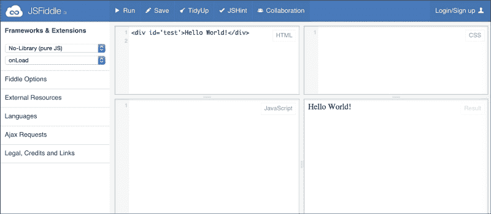
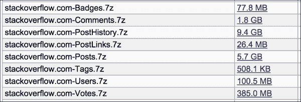
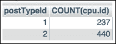
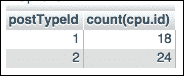
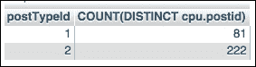
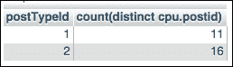
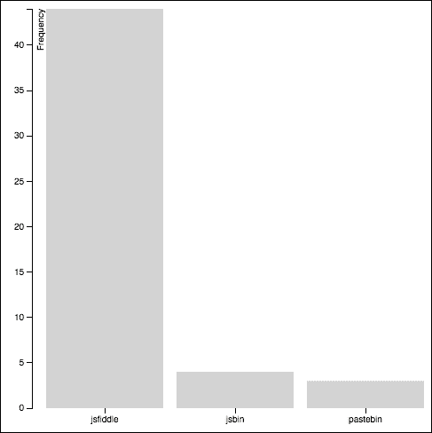

# 第九章 Stack Overflow 项目

这是两个完整的、章节级的项目中的第一个，我们将在其中实践所有关于数据清理的知识。我们可以把每个项目看作是一场晚宴，在这场晚宴上，我们展示自己在数据科学厨房中的最佳技能。要举办一场成功的晚宴，当然需要提前规划好菜单和嘉宾名单。然而，真正的专家标志是我们如何应对那些事情不完全按照计划进行的时刻。我们每个人都曾经历过这样的时刻：尽管我们精心准备了食谱和购物清单，但还是忘记购买一个重要的食材。我们能否调整计划，面对途中遇到的新挑战？

在本章中，我们将使用公开发布的 Stack Overflow 数据库转储进行一些数据清理。Stack Overflow 是 Stack Exchange 问答网站家族的一部分。在这些网站上，编写优秀的问题和答案可以为用户赢得积分和徽章，这些积分和徽章会随着时间积累。为了练习我们的数据清理技能，我们将使用我们在第一章中介绍的相同的六步方法，*为什么你需要清洁数据？*。

+   决定我们要解决的是什么问题——我们为什么要看这些数据？

+   收集和存储我们的数据，包括下载并提取由 Stack Overflow 提供的数据转储，创建一个 MySQL 数据库来存储数据，并编写脚本将数据导入 MySQL 数据库。由于 Stack Overflow 数据集庞大，我们还将创建一些较小的测试表，填充随机选择的行。

+   在尝试清理整个数据集之前，先对测试表执行一些试验性的清理任务。

+   分析数据。我们是否需要进行计算？我们是否应该编写一些聚合函数来计数或求和数据？我们是否需要以某种方式转换数据？

+   如果可能的话，提供数据的可视化。

+   解决我们最初要调查的问题。我们的过程是否有效？我们成功了吗？

这需要大量的工作，但我们提前准备得越充分，开始得越早，我们就越有可能将我们的数据科学晚宴称为成功。

# 第一步——提出关于 Stack Overflow 的问题

为了开始我们的项目，我们需要提出一个合理有趣的问题，需要一些简单的数据分析来回答。我们该从哪里开始？首先，让我们回顾一下我们对 Stack Overflow 的了解。我们知道它是一个程序员的问答网站，我们可以假设程序员在提问和回答时可能会使用大量的源代码、错误日志和配置文件。此外，我们知道，有时在像 Stack Overflow 这样的基于 Web 的平台上发布这些长文本转储会因为行长、格式和其他可读性问题而显得很尴尬。

看到那么多包含大量文本的提问和回答让我不禁想知道，Stack Overflow 上的程序员是否会通过外部**粘贴站点**（例如 [`www.Pastebin.com`](http://www.Pastebin.com)）链接到他们的代码或日志文件。Pastebin 是一个可以粘贴大量文本的网站，如源代码或日志文件，网站会返回一个短链接，供你与他人分享。大多数粘贴站点也支持源代码语法高亮，而 Stack Overflow 默认不支持这一功能。

粘贴站点在 IRC 和电子邮件中非常常见，但在 Stack Overflow 上呢？一方面，就像在 IRC 或电子邮件中一样，提供一个链接可以使问题或回答更简洁，从而使其余的内容更容易阅读。但另一方面，根据使用的粘贴站点，URL 不一定能永远有效。这意味着，随着时间的推移，问题或回答可能会因为**链接腐烂**而失去价值。

像 JSFiddle 这样的工具在某些方面使这个问题变得更加复杂。在一个**互动粘贴**站点（如 JSFiddle）上，你不仅可以粘贴源代码并获得一个 URL，还可以允许他人在浏览器中编辑并运行代码。这在 Stack Overflow 的问答场景中非常有帮助，尤其是在像 JavaScript 这样的基于浏览器的语言中。然而，链接腐烂的问题依然存在。此外，对于初学者来说，JSFiddle 比像 Pastebin 这样简单的代码粘贴站点要稍微复杂一些。



JSFiddle 有四个窗口，分别用于 HTML、CSS、JavaScript 和结果展示。

### 注意

在 Stack Overflow 的社区讨论区里，关于是否应该使用粘贴站点，尤其是对于只包含粘贴站点链接而没有实际代码的提问或回答，展开了相当多的争论。总的来说，尽管人们普遍认为粘贴站点很有用，但他们也认识到保护 Stack Overflow 自身的长期性和实用性至关重要。社区决定避免发布仅包含链接而没有代码的提问或回答。如果你想回顾这场讨论，好的起点是这个链接：[`meta.stackexchange.com/questions/149890/`](http://meta.stackexchange.com/questions/149890/)。

对于我们在这里的讨论，我们不需要站队。在这个辩论中，我们可以提出一些简单的基于数据的问题，例如：

1.  人们在 Stack Overflow 上使用像 Pastebin 和 JSFiddle（以及其他类似的粘贴站点）的频率有多高？

1.  他们在提问中还是回答中更常使用粘贴站点？

1.  引用粘贴站点 URL 的帖子通常会包含源代码吗？如果包含，通常是多少？

我们可以将这些问题作为动机，收集、存储和清理我们的 Stack Overflow 数据。即使结果是其中的一些问题太难或无法回答，记住我们的总体目标将有助于指导我们需要进行的清理类型。将问题牢记在心可以防止我们偏离轨道，避免执行最终会变得毫无意义或浪费时间的任务。

# 第二步——收集和存储 Stack Overflow 数据

写作时，Stack Exchange 提供了他们所有网站（包括 Stack Overflow）的数据——以 XML 文件的形式，任何人都可以免费下载。在本节中，我们将下载 Stack Overflow 文件，并将数据导入到我们 MySQL 服务器的数据库中。最后，我们将创建这些表的几个小版本进行测试。

## 下载 Stack Overflow 数据转储

Stack Exchange 上的所有数据可以从互联网档案馆下载。2014 年 9 月的转储是写作时最新的版本。每个 Stack Exchange 网站都有一个或多个与之相关的文件，每个文件都链接到该详细信息页面：[`archive.org/details/stackexchange`](https://archive.org/details/stackexchange)。

我们只关心按字母顺序排列的八个 Stack Overflow 文件，具体如下所示：



Archive.org 列出显示我们感兴趣的八个 Stack Overflow 文件。

对于列表中的每个文件，右键点击链接，并指示你的浏览器将文件保存到磁盘。

## 解压文件

请注意，每个文件都具有 `.7z` 扩展名。这是一种压缩归档格式。可以使用匹配的 7-Zip 软件或其他兼容的软件包进行解压缩和解档。7-Zip 不是我们在第二章中讨论的最常见的文件归档工具，*基础 - 格式、类型与编码*，而且你可能电脑上还没有安装兼容的解压软件，因此我们可以把它当作第一个小问题，需要绕过。尝试双击文件以打开它，但如果你没有安装与 `.7z` 扩展名相关联的软件，你将需要安装一个适当的 7-Zip 解压工具。

+   对于 Windows，你可以从他们的网站下载 7-Zip 软件：[`www.7-zip.org`](http://www.7-zip.org)

+   对于 Mac OS X，你可以下载并安装 The Unarchiver，这是一款免费的实用工具，下载地址：[`unarchiver.c3.cx`](http://unarchiver.c3.cx)

一旦安装了软件，逐个解压每个文件。解压后的文件相当大，所以请确保你有足够的磁盘空间来存放它们。

### 提示

在我目前的系统上，比较压缩和未压缩文件的大小显示，未压缩版本大约是压缩版本的十倍。这些文件解压时也需要几分钟时间，具体取决于你正在使用的系统规格，因此请为此步骤预留时间。

## 创建 MySQL 表并加载数据

我们现在有八个 `.xml` 文件，每个文件将映射到我们即将构建的数据库中的一个表。为了创建数据库和表，我们可以使用 phpMyAdmin 或其他图形工具通过点击的方式完成，或者我们可以运行 Georgios Gousios 编写并可在 [`gist.github.com/gousiosg/7600626`](https://gist.github.com/gousiosg/7600626) 获得的以下简单 SQL 代码。此代码包含前六个表的 `CREATE` 和 `LOAD INFILE` 语句，但自从编写此脚本以来，数据库转储已经添加了两个额外的表。

为了构建新的表结构，我们可以在终端窗口或 shell 中运行 `head` 命令，以检查文件的前几行。在终端中，运行该命令在最小的 XML 文件 `PostLinks.xml` 上，方法如下：

```py
head PostLinks.xml

```

结果中的前四行如下所示：

```py
<?xml version="1.0" encoding="utf-8"?>
<postlinks>
 <row Id="19" CreationDate="2010-04-26T02:59:48.130" PostId="109" RelatedPostId="32412" LinkTypeId="1" />
 <row Id="37" CreationDate="2010-04-26T02:59:48.600" PostId="1970" RelatedPostId="617600" LinkTypeId="1" />

```

我们新数据库表中的每一行应对应 XML `<row>` 行中的一行，行中显示的每个属性表示数据库表中的一个列。我们可以对 `Tags.xml` 文件执行相同的 `head` 命令，查看它的列应该是什么。以下 SQL 代码将处理两个额外表的 `CREATE` 语句和 `LOAD` 语句：

```py
CREATE TABLE post_links (
  Id INT NOT NULL PRIMARY KEY,
  CreationDate DATETIME DEFAULT NULL,
  PostId INT NOT NULL,
  RelatedPostId INT NOT NULL,
  LinkTypeId INT DEFAULT NULL
);

CREATE TABLE tags (
  Id INT NOT NULL PRIMARY KEY,
  TagName VARCHAR(50) DEFAULT NULL,
  Count INT DEFAULT NULL,
  ExcerptPostId INT DEFAULT NULL,
  WikiPostId INT DEFAULT NULL
);

LOAD XML LOCAL INFILE 'PostLinks.xml'
INTO TABLE post_links
ROWS IDENTIFIED BY '<row>';

LOAD XML LOCAL INFILE 'Tags.xml'
INTO TABLE tags
ROWS IDENTIFIED BY '<row>';
```

### 注意

注意，`LOAD XML` 语法略有变化，因此我们可以将文件保存在本地。如果你的`.xml`文件存储在本地计算机上而不是数据库服务器上，只需在`LOAD XML`语句中添加`LOCAL`字样，如前面的代码所示，然后可以引用文件的完整路径。

关于 MySQL `LOAD XML` 语法的更多信息，请参阅 MySQL 文档：[`dev.mysql.com/doc/refman/5.5/en/load-xml.html`](http://dev.mysql.com/doc/refman/5.5/en/load-xml.html)。

到此为止，我们已经拥有一个功能完整的 MySQL 数据库，包含八个表，每个表都填充了数据。然而，这些表非常大，只有八个表就有超过一亿九千万行。当我们开始清理数据并为分析做准备时，我们会注意到，如果在像`posts`、`comments`、`votes`或`post_history`这样的超大表上犯错，重建该表将需要很长时间。在下一步中，我们将学习如何创建测试表，以便如果程序或查询出现问题，我们能将损失控制在最小范围。

## 构建测试表

在本节中，我们将构建八个较小版本的原始表，每个表都随机填充来自原始表的数据。

我们的第一步是重新运行`CREATE`语句，但这次在每个表名之前加上`test_`前缀，如下所示：

```py
DROP TABLE IF EXISTS test_post_links;
CREATE TABLE test_post_links (
  Id INT NOT NULL PRIMARY KEY,
  CreationDate INT,
  PostId INT,
  RelatedPostId INT,
  LinkTypeId INT
);
```

除了在表名之前添加`test_`外，这八个测试表将与我们之前创建的其他表完全相同。

接下来，我们需要向新的测试表中填充数据。我们可以简单地从每个表中选择前 1,000 行并加载到测试表中。然而，做这样做的缺点是这些行是根据它们插入 Stack Overflow 数据库的顺序排列的，因此如果我们仅请求前 1,000 行，我们的子集就不会有来自不同日期和时间的良好样本。我们希望选择的行有较为随机的分布。我们如何随机选择一组行？在本书中，我们之前并没有处理过这个问题，因此这是另一个需要我们准备尝试新方法的情况，以确保我们的数据科学晚宴顺利进行。

有几种选择随机行的方式，其中一些比其他方式更高效。效率对于我们这个项目来说非常重要，因为我们正在处理的表非常大。让我们随机选择行的一个小难点是，虽然我们的表有一个数字类型的主键作为`Id`列，但这些`Id`号码并不是连续的。例如，在`post_links`表中，`Id`列的前几个值分别是 19、37、42 和 48。

数据中的空缺是一个问题，因为简单的随机生成器是这样操作的：

1.  构建一个 PHP 脚本，要求提供表中最低和最高的`Id`值，如下所示：

    ```py
    SELECT min(Id) FROM post_links;
    SELECT max(Id) FROM post_links;
    ```

1.  然后，仍然在脚本中，生成一个介于`min`和`max`值之间的随机数，并请求该随机值对应的行：

    ```py
    SELECT * FROM post_links WHERE Id = [random value];
    ```

1.  根据需要重复步骤 2，直到获取所需的行数。

不幸的是，举个例子，在 Stack Overflow 数据库表中执行此操作，例如在我们的`post_links`表上，将导致许多查询失败，因为我们的数据在`Id`列中有很多空缺。例如，如果前面的示例中的步骤 2 生成了数字 38，怎么办？我们的`post_links`表中没有`Id`为 38 的记录。这意味着我们需要检测到这个错误，并尝试用一个新的随机值重新执行。

### 注意

到这一步，一个懂一些 SQL 的人 — 但不多 — 通常会建议我们只需让 MySQL 在包含`Id`的列上执行`ORDER BY rand()`，然后执行`LIMIT`命令来挑选我们想要的记录数。这个想法的问题是，即使我们排序的列是索引列，`ORDER BY rand()`仍然必须读取每一行来分配一个新的随机数。因此，在像 Stack Overflow 数据库中那样的大表上，这种方法完全不适用。我们将不得不等待`ORDER BY rand()`查询完成，等待时间会太长。`ORDER BY rand()`对于小表是可以接受的解决方案，但对于我们在这里处理的大表大小则不适用。

以下 PHP 脚本展示了我们的最终随机行选择过程是如何工作的，它将构建八个测试表，每个表恰好包含 1,000 行。每个表将通过尽可能随机地选择行值，并尽量减少努力，且不对这个简单问题进行过度设计来填充：

```py
<?php //randomizer.php
// how many rows should be in each of the test tables?
$table_target_size = 1000;

// connect to db, set up query, run the query
$dbc = mysqli_connect('localhost','username','password','stackoverflow')
       or die('Error connecting to database!' . mysqli_error());
$dbc->set_charset("utf8");

$tables = array("badges",
    "comments",
    "posts",
    "post_history",
    "post_links",
    "tags",
    "users",
    "votes");

foreach ($tables as $table)
{
  echo "\n=== Now working on $table ===\n";
    $select_table_info = "SELECT count(Id) as c, min(Id) as mn, max(Id) as mx FROM $table";
    $table_info = mysqli_query($dbc, $select_table_info);
    $table_stuff = mysqli_fetch_object($table_info);
    $table_count = $table_stuff->c;
    $table_min = $table_stuff->mn;
    $table_max = $table_stuff->mx;

    // set up loop to grab a random row and insert into new table
    $i=0;
    while($i < $table_target_size)
    {
        $r = rand($table_min, $table_max);
        echo "\nIteration $i: $r";
        $insert_rowx = "INSERT IGNORE INTO test_$table (SELECT * FROM $table WHERE Id = $r)";
        $current_row = mysqli_query($dbc, $insert_rowx);

        $select_current_count = "SELECT count(*) as rc FROM test_$table";
        $current_count= mysqli_query($dbc, $select_current_count);
        $row_count = mysqli_fetch_object($current_count)->rc;
        $i = $row_count;
    }
}
?>
```

运行该代码后，我们可以看到如果需要的话，我们有一组八个测试表可以使用。使用这些较小的表进行测试能确保我们的清理工作顺利进行，且错误能够被控制。如果我们发现需要更多的行数在我们的随机表中，我们可以简单地提高`$table_target_size`命令并重新运行。

构建测试表是一个很好的习惯，一旦你知道如何以简单和有用的方式创建它们。

# 第三步 – 清理数据

记住我们的目标是开始分析在问题、回答和评论中某些 URL 被引用的频率，因此从 Stack Overflow 的`posts`和`comments`表中的文本开始是合乎逻辑的。然而，由于这些表非常大，我们将使用我们刚刚创建的`test_posts`和`test_comments`表来代替。然后，一旦我们确信查询完美无缺，我们可以在更大的表上重新运行它们。

这个清理任务与我们在第七章中提取推文中的 URL 存储方式非常相似，*RDBMS 清理技术*。然而，这个项目有自己的一套具体规则：

+   由于帖子和评论本身就是不同的实体，我们应该为来自帖子（包括问题和回答）和来自评论的 URL 分别创建不同的表。

+   每个问题、回答或评论可以包含多个 URL。我们应该存储所有的 URL，同时也应该追踪这些 URL 来自于哪个帖子或评论的唯一标识符。

+   每个问题和回答也可以包含格式化的源代码。`<code>`标签用于在 Stack Overflow 的帖子中界定源代码。将代码与帖子分开将帮助我们回答有关粘贴站点 URL 和源代码共存的问题。通常有多少代码会与这样的链接一起出现，如果有的话？

    ### 注意

    从技术上讲，帖子*可以*在没有`<code>`标签的情况下创建，但通常会有人很快编辑这些不规范的帖子，加入这些有用的标签，并因此获得 Stack Overflow 的积分。为了简洁起见，在本项目中，我们假设代码会被包含在`<code>`标签中。

+   根据 Stack Overflow 数据库转储文档（可以在[`meta.stackexchange.com/questions/2677/`](http://meta.stackexchange.com/questions/2677/)查看），实际上有八种帖子类型，其中问题和答案只是两种类型。因此，我们需要将查询限制为`postTypeId=1`表示问题，`postTypeId=2`表示答案。

+   为了确保我们只从评论中提取指向问题或答案的 URL，而不是其他类型的帖子，我们需要将查询连接回帖子表，并将结果限制为`postTypeId=1`或`postTypeId=2`。

## 创建新表

创建我们需要的数据库表来存储这些 URL 的 SQL 查询如下：

```py
CREATE TABLE clean_comments_urls (
  id INT NOT NULL AUTO_INCREMENT PRIMARY KEY,
  commentId INT NOT NULL,
  url VARCHAR(255) NOT NULL
) ENGINE=MyISAM  DEFAULT CHARSET=utf8;

CREATE TABLE IF NOT EXISTS clean_posts_urls (
  id INT NOT NULL AUTO_INCREMENT PRIMARY KEY,
  postId INT NOT NULL,
  url VARCHAR(255) NOT NULL
) ENGINE=MyISAM  DEFAULT CHARSET=utf8;
```

我们还需要创建一个表来存储我们从帖子中剥离出的代码：

```py
CREATE TABLE clean_posts_code (
  id INT NOT NULL AUTO_INCREMENT PRIMARY KEY,
  postId INT NOT NULL,
  code TEXT NOT NULL
) ENGINE=MyISAM DEFAULT CHARSET=utf8;
```

到目前为止，我们有了三个新表，这些表将存储我们的清理后的 URL 和清理后的源代码。在接下来的部分中，我们将提取 URL 和代码，并填充这些新表。

## 提取 URL 并填充新表

我们可以修改我们之前在第七章中编写的脚本，*RDBMS 清理技术*，以在这个新的 Stack Overflow 环境中提取 URL，具体如下：

```py
<?php // urlExtractor.php
// connect to db
$dbc = mysqli_connect('localhost', 'username', 'password', 'stackoverflow')
    or die('Error connecting to database!' . mysqli_error());
$dbc->set_charset("utf8");

// pull out the text for posts with
// postTypeId=1 (questions)
// or postTypeId=2 (answers)
$post_query = "SELECT Id, Body
    FROM test_posts
    WHERE postTypeId=1 OR postTypeId=2";

$comment_query = "SELECT tc.Id, tc.Text
    FROM test_comments tc
    INNER JOIN posts p ON tc.postId = p.Id
    WHERE p.postTypeId=1 OR p.postTypeId=2";

$post_result = mysqli_query($dbc, $post_query);
// die if the query failed
if (!$post_result)
    die ("post SELECT failed! [$post_query]" .  mysqli_error());

// pull out the URLS, if any
$urls = array();
$pattern  = '#\b(([\w]+://?|www[.])[^\s()<>]+(?:\([\w\d]+\)|([^[:punct:]\s]|/)))#';

while($row = mysqli_fetch_array($post_result))
{
    echo "\nworking on post: " . $row["id"];
    if (preg_match_all(
        $pattern,
        $row["Body"],
        $urls
    ))
    {
        foreach ($urls[0] as $url)
        {
          $url = mysqli_escape_string($dbc, $url);
            echo "\n----url: ".$url;
            $post_insert = "INSERT INTO clean_posts_urls (id, postid, url)
                VALUES (NULL," . $row["Id"] . ",'$url')";
            echo "\n$post_insert";
            $post_insert_result = mysqli_query($dbc, $post_insert);
        }
    }
}

$comment_result = mysqli_query($dbc, $comment_query);
// die if the query failed
if (!$comment_result)
    die ("comment SELECT failed! [$comment_query]" .  mysqli_error());

while($row = mysqli_fetch_array($comment_result))
{
    echo "\nworking on comment: " . $row["id"];
    if (preg_match_all(
        $pattern,
        $row["Text"],
        $urls
    ))
    {
        foreach ($urls[0] as $url)
        {
            echo "\n----url: ".$url;
            $comment_insert = "INSERT INTO clean_comments_urls (id, commentid, url)
                VALUES (NULL," . $row["Id"] . ",'$url')";
            echo "\n$comment_insert";
            $comment_insert_result = mysqli_query($dbc, $comment_insert);
        }
    }
}
?>
```

我们现在已经完全填充了`clean_post_urls`和`clean_comment_urls`表。对于我随机填充的测试表，运行这个脚本只会得到大约 100 个评论 URL 和 700 个帖子 URL。不过，这些数据足以在我们对整个数据集运行脚本之前，先测试一下我们的思路。

## 提取代码并填充新表

为了提取`<code>`标签中嵌入的文本并填充我们的新`clean_posts_code`表，我们可以运行以下脚本。这个过程类似于 URL 提取器，唯一不同的是它不需要搜索评论，因为评论中没有用`<code>`标签界定的代码。

在我随机选择的测试表中，初始的`SELECT`查询从`test_post`表中提取了约 800 行，表中总共有 1000 行。然而，每个帖子可能包含多个代码片段，因此最终的表格有超过 2000 行。以下 PHP 代码提取了`<code>`标签中嵌入的文本：

```py
<?php // codeExtractor.php
// connect to db
$dbc = mysqli_connect('localhost', 'username, 'password', 'stackoverflow')
    or die('Error connecting to database!' . mysqli_error());
$dbc->set_charset("utf8");

// pull out the text for posts with
// postTypeId=1 (questions)
// or postTypeId=2 (answers)
$code_query = "SELECT Id, Body
    FROM test_posts
    WHERE postTypeId=1 OR postTypeId=2
    AND Body LIKE '%<code>%'";

$code_result = mysqli_query($dbc, $code_query);
// die if the query failed
if (!$code_result)
    die ("SELECT failed! [$code_query]" .  mysqli_error());

// pull out the code snippets from each post
$codesnippets = array();
$pattern  = '/<code>(.*?)<\/code>/';

while($row = mysqli_fetch_array($code_result))
{
    echo "\nworking on post: " . $row["Id"];
    if (preg_match_all(
        $pattern,
        $row["Body"],
        $codesnippets
    ))
    {
      $i=0;
        foreach ($codesnippets[0] as $code)
        {
          $code = mysqli_escape_string($dbc, $code);
            $code_insert = "INSERT INTO clean_posts_code (id, postid, code)
                VALUES (NULL," . $row["Id"] . ",'$code')";
            $code_insert_result = mysqli_query($dbc, $code_insert);
            if (!$code_insert_result)
                die ("INSERT failed! [$code_insert]" .  mysqli_error());
            $i++;
        }
        if($i>0)
        {
          echo "\n   Found $i snippets";
        }
    }
}
?>
```

我们现在有了一个包含每个帖子中打印出的所有代码的列表，并已将其存储在`clean_post_code`表中。

# 第四步 – 分析数据

在这一部分，我们编写一些代码来回答本章开始时的三个问题。我们感兴趣的是寻找：

+   帖子和评论中提到的不同粘贴网站的 URL 数量

+   比较问题和答案中粘贴网站 URL 的数量

+   统计带有粘贴网站 URL 的帖子中`<code>`标签的普及率

## 哪些粘贴网站最受欢迎？

为了回答这个问题，我们将生成一个 JSON 表示，包含 paste 站点 URL 和计数，使用`clean_posts_urls`和`clean_comments_urls`表格。这项简单的分析将帮助我们找出哪些 pastebin 网站在这个 Stack Overflow 数据集中特别受欢迎。以下 PHP 查询从数据库中查询我们预先列出的`$pastebins`数组中的 paste 站点，并执行从帖子和评论中匹配 URL 的计数。它使用的是测试表格，因此这些数字要比实际表格中的数字小得多：

```py
<?php // q1.php
// connect to db
$dbc = mysqli_connect('localhost', 'username', 'password', 'stackoverflow')
    or die('Error connecting to database!' . mysqli_error());
$dbc->set_charset("utf8");

// these are the web urls we want to look for and count
$pastebins = array("pastebin",
    "jsfiddle",
    "gists",
    "jsbin",
    "dpaste",
    "pastie");
$pastebin_counts = array();

foreach ($pastebins as $pastebin)
{
    $url_query = "SELECT count(id) AS cp,
          (SELECT count(id)
          FROM clean_comments_urls
          WHERE url LIKE '%$pastebin%') AS cc
        FROM clean_posts_urls
        WHERE url LIKE '%$pastebin%'";
    $query = mysqli_query($dbc, $url_query);
    if (!$query)
        die ("SELECT failed! [$url_query]" .  mysqli_error());
    $result = mysqli_fetch_object($query);
    $countp = $result->cp;
    $countc = $result->cc;
    $sum = $countp + $countc;

    array_push($pastebin_counts, array('bin' => $pastebin,
                                        'count' => $sum));
}
// sort the final list before json encoding it
// put them in order by count, high to low
foreach ($pastebin_counts as $key => $row)
{
    $first[$key]  = $row['bin'];
    $second[$key] = $row['count'];
}

array_multisort($second, SORT_DESC, $pastebin_counts);
echo json_encode($pastebin_counts);
?>
```

我们可以查看运行该脚本时从测试表格中得到的 JSON 输出，通过查看脚本的输出。我的随机行产生了以下计数：

```py
[{"bin":"jsfiddle","count":44},{"bin":"jsbin","count":4},{"bin":"pastebin","count":3},{"bin":"dpaste","count":0},{"bin":"gists","count":0},{"bin":"pastie","count":0}]
```

### 注意

记住，由于你选择的随机 URL 集合不同，你的值可能会有所不同。

当我们进入本章的*步骤 5 – 数据可视化*部分时，我们将使用这个 JSON 代码来构建一个条形图。但首先，让我们先回答之前提出的另外两个问题。

## 哪些 paste 站点在问题中流行，哪些在回答中流行？

我们的第二个问题是，pastebin URL 在问题帖子中更常见，还是在回答帖子中更常见。为了开始解决这个问题，我们将运行一系列 SQL 查询。第一个查询仅仅是询问`clean_posts_urls`表中每种类型的帖子数，问题和回答：

```py
SELECT tp.postTypeId, COUNT(cpu.id)
FROM test_posts tp
INNER JOIN clean_posts_urls cpu ON tp.Id = cpu.postid
GROUP BY 1;
```

结果显示，在我随机选择的测试集中，我有 237 个问题和 440 个回答：



phpMyAdmin 显示问题 URL 和回答 URL 的计数。

现在，我们想要知道这个问题的答案：在这 677 个 URL 中，按问题和回答分类，有多少个专门引用了六个 pastebin 网站中的某一个？我们可以运行以下 SQL 代码来找出答案：

```py
SELECT  tp.postTypeId, count(cpu.id)
FROM test_posts tp
INNER JOIN clean_posts_urls cpu ON tp.Id = cpu.postId
WHERE cpu.url LIKE '%jsfiddle%'
OR cpu.url LIKE '%jsbin%'
OR cpu.url LIKE '%pastebin%'
OR cpu.url LIKE '%dpaste%'
OR cpu.url LIKE '%gist%'
OR cpu.url LIKE '%pastie%'
GROUP BY 1;
```

结果如下表所示。共有 18 个问题引用了某个 paste 站点，而 24 个回答引用了某个 paste 站点。



phpMyAdmin 显示了引用 pastebin 的问答 URL 的计数。

需要注意的一点是，这些查询统计的是每个 URL 的出现次数。所以，如果某个`postId`引用了五个 URL，那么它们会被计数五次。如果我关心的是有多少帖子使用了某个 paste 站点 URL 一次或更多次，我需要修改两个查询的第一行，如下所示。这个查询统计了 URLs 表格中不同的帖子：

```py
SELECT tp.postTypeId, COUNT(DISTINCT cpu.postId)
FROM test_posts tp
INNER JOIN clean_posts_urls cpu ON tp.Id = cpu.postId
GROUP BY 1;
```

以下截图显示了有多少问题和回答包含了一个 URL：



phpMyAdmin 显示了有多少问题和回答包含了任何 URL。

这个查询统计了在 URLs 表格中提到 paste 站点的特定帖子：

```py
SELECT  tp.postTypeId, count(DISTINCT cpu.postId)
FROM test_posts tp
INNER JOIN clean_posts_urls cpu ON tp.Id = cpu.postId
WHERE cpu.url LIKE '%jsfiddle%'
OR cpu.url LIKE '%jsbin%'
OR cpu.url LIKE '%pastebin%'
OR cpu.url LIKE '%dpaste%'
OR cpu.url LIKE '%gist%'
OR cpu.url LIKE '%pastie%'
GROUP BY 1;
```

这个粘贴网站查询的结果如下，正如预期的那样，数字较小。在我们的测试集里，**11** 个问题使用了至少一个粘贴站 URL，**16** 个答案也如此。合计，37 个帖子至少引用了一个粘贴站 URL。



PhpMyAdmin 显示了包含任何粘贴网站 URL 的问题和答案的数量。

尽管这些结果似乎显示人们在答案中引用粘贴网站 URL 的频率高于问题中，但我们需要从问题和答案的总体数量来进行比较。我们应该将结果值报告为该帖子类型（问题或答案）的总数的百分比。考虑到总数，我们现在可以说类似这样的话：“只考虑那些至少一次使用了某种 URL 的问题和答案，81 个问题中有 11 个使用了至少一个粘贴网站 URL（13.6%），222 个答案中有 16 个使用了至少一个粘贴网站 URL（7.2%）。” 综上所述，实际上问题在引用粘贴网站方面超过了答案，几乎是两倍。

在任何数据分析项目的这个阶段，你一定会有一大堆问题，比如：

+   粘贴网站 URL 在问题和答案中的使用随时间发生了什么变化？

+   带有粘贴网站 URL 的问题在投票和收藏中表现如何？

+   发布带有粘贴网站 URL 的问题的用户有什么特点？

但由于这是一本关于数据清洗的书，而且我们仍然没有可视化这些数据，我会克制自己，暂时不回答这些问题。我们还有一个原始的三个问题没有回答，然后我们将继续可视化我们的一些结果。

## 帖子中是否同时包含粘贴站的 URL 和源代码？

回答我们第三个问题需要将 Stack Overflow 问题中的代码量与答案中的代码量进行比较，特别关注那些包含某种源代码（由 `<code>` 标签分隔）的帖子。在 *第三步 - 清洗数据* 部分中，我们从测试表中的帖子中提取了所有代码，并创建了一个新表来存放这些代码片段。现在，一个简单的查询来找出包含代码的帖子数量如下：

```py
SELECT count(DISTINCT postid)
FROM clean_posts_code;
```

在我的样本集中，这产生了 664 个包含代码的帖子，来自 1,000 个测试帖子。换句话说：1,000 个帖子中有 664 个包含至少一个 `<code>` 标签。

要找出这些包含代码的帖子中有多少也包含了任何 URL，我们可以运行以下 SQL 查询：

```py
SELECT count(DISTINCT cpc.postid)
FROM clean_posts_code cpc
INNER JOIN clean_posts_urls cpu
ON cpu.postId = cpc.postId;
```

我的样本集返回了 175 行数据。我们可以这样解释：原始测试集 1,000 个帖子中，17.5% 包含了代码和 URL。

现在，为了找出有多少包含代码的帖子也包含了粘贴站 URL，我们将进一步缩小 SQL 查询的范围：

```py
SELECT count(DISTINCT cpc.postid)
FROM clean_posts_code cpc
INNER JOIN clean_posts_urls cpu
ON cpu.postId = cpc.postId
WHERE cpu.url LIKE '%jsfiddle%'
OR cpu.url LIKE '%jsbin%'
OR cpu.url LIKE '%pastebin%'
OR cpu.url LIKE '%dpaste%'
OR cpu.url LIKE '%gist%'
OR cpu.url LIKE '%pastie%';
```

从这些结果中，我们可以看到，只有 25 篇帖子同时包含源代码和粘贴站点 URL。从第二个问题中，我们知道 37 篇不同的帖子（包括问题和答案）至少使用过一次某种粘贴站点 URL。因此，25 比 37 大约是 68%。在更大的数据集上运行这些查询，看看这些值如何变化，将会很有趣。

与此同时，我们将对至少一个问题进行简单的可视化，以便完成数据科学六步法的一个完整回合。

# 第五步 – 可视化数据

可视化步骤有点像我们晚宴中的甜点环节。每个人都喜欢丰富的图形，它们看起来非常漂亮。然而，由于本书的重点在于数据清理而非分析与可视化，我们这里的图形将非常简单。在接下来的代码中，我们将使用 JavaScript D3 可视化库，以图形方式展示第一个问题的结果。这次可视化比我们在第四章中做的 D3 可视化要简单得多。你会记得，在那一章中，我们构建了一个相当复杂的网络图，但在这里，简单的条形图就足够了，因为我们只需要展示一些标签和计数。

以下是 HTML 和 JavaScript/D3 代码。该代码扩展了 Mike Bostock 的*让我们制作一个条形图*教程，教程地址为[`bl.ocks.org/mbostock/3885304`](http://bl.ocks.org/mbostock/3885304)。我扩展这段代码的方式之一是让它读取我们之前在`q1.php`脚本中生成的 JSON 文件。我们的 JSON 文件格式很漂亮，并且已经按从高到低排序，因此从中构建一个小条形图非常容易：

```py
<!DOCTYPE html>
<meta charset="utf-8">
<!--
this code is modeled on mbostock's
"Let's Make a Bar Chart" D3 tutorial
available at http://bl.ocks.org/mbostock/3885304
My modifications:
* formatting for space
* colors
* y axis labels
* changed variable names to match our data
* loads data via JSON rather than .tsv file
-->

<style>
.bar {fill: lightgrey;}
.bar:hover {fill: lightblue;}
.axis {font: 10px sans-serif;}
.axis path, .axis line {
  fill: none;
  stroke: #000;
  shape-rendering: crispEdges;
}
.x.axis path {display: none;}
</style>
<body>
<script src="img/d3.min.js"></script>
<script>

var margin = {top: 20, right: 20, bottom: 30, left: 40},
    width = 960 - margin.left - margin.right,
    height = 500 - margin.top - margin.bottom;

var x = d3.scale.ordinal()
    .rangeRoundBands([0, width], .1);

var y = d3.scale.linear()
    .range([height, 0]);

var xAxis = d3.svg.axis()
    .scale(x)
    .orient("bottom");

var yAxis = d3.svg.axis()
    .scale(y)
    .orient("left");

var svg = d3.select("body").append("svg")
    .attr("width", width + margin.left + margin.right)
    .attr("height", height + margin.top + margin.bottom)
  .append("g")
    .attr("transform", "translate(" + margin.left + "," + margin.top + ")");

d3.json("bincounter.php", function(error, json)
{
    data = json;
    draw(data);
});

function draw(data)
{
  x.domain(data.map(function(d) { return d.bin; }));
  y.domain([0, d3.max(data, function(d) { return d.count; })]);

  svg.append("g")
      .attr("class", "x axis")
      .attr("transform", "translate(0," + height + ")")
      .call(xAxis);

  svg.append("g")
      .attr("class", "y axis")
      .call(yAxis)
    .append("text")
      .attr("transform", "rotate(-90)")
      .attr("y", 6)
      .attr("dy", ".71em")
      .style("text-anchor", "end")
      .text("Frequency");

  svg.selectAll(".bar")
      .data(data)
    .enter().append("rect")
      .attr("class", "bar")
      .attr("x", function(d) { return x(d.bin) ; })
      .attr("width", x.rangeBand())
      .attr("y", function(d) { return y(d.count); })
      .attr("height", function(d) { return height - y(d.count); });
}

</script>
</body>
</html>
```

我们可以将其保存为`q1chart.html`，并在浏览器中查看。该代码调用了我们的`q1.php`脚本，后者生成 JSON 文件，D3 则用它来构建这个图表，左侧部分如下所示：



D3 可视化展示从三个 URL 计数生成的 JSON 数据。

条形图显示指向 JSFiddle 的 URL 似乎是最常见的，至少在我版本的随机选择测试数据集中是这样。我们仅通过查看`q1.php`的 JSON 输出就知道了这一点，但看到图形化的展示仍然让人感觉很直观。接下来的部分，我们将总结结果和过程，并讨论下一步该如何推进这个项目。

# 第六步 – 问题解决

从我们在*第四步 – 分析数据*和*第五步 – 可视化数据*部分开发的查询和可视化中，我们现在可以尝试回答当初促使这个项目的三个问题。

在第一个问题中，我们希望查找在帖子和评论中按 URL 提到的不同粘贴站点的数量。我们创建的`q1.php`脚本和条形图可视化数据显示，至少在测试数据中，JSFiddle 是我们查看的六个粘贴站点 URL 中最常被提及的。

第二个问题是关于粘贴站点 URL 在问题和答案中是否更为普遍。我们的查询显示，粘贴站点 URL 出现在问题中的几率是出现在答案中的大约两倍，但无论是问题还是答案中的数量都很少，至少在我们的测试集中是这样。

对于第三个问题，我们希望查看人们是否真的听从了 Stack Overflow 的建议，在发布粘贴站点 URL 的同时也附上了源代码。在我们的测试集中，查询结果显示，37 条记录中有 25 条同时包含了粘贴站点 URL 和推荐的源代码。这意味着大约有 68%的合规率。

此时，我们可以提出并回答许多其他问题，也有很多激动人心的方法，可以将这个简单的研究扩展成更有趣的内容。但现在，我们将专注于存储和清理程序，以便将这个项目扩展到使用完整的数据集。

# 从测试表迁移到完整表

在这个项目的开始阶段，我们创建了一组测试表，以便在一个无压力的环境中开发项目，每个表只有 1,000 行数据。使用行数可控的小型表格非常重要，尤其是在我们不确定查询是否按预期工作的情况下，或者当我们需要尝试一些复杂的连接、子查询、奇怪的正则表达式等。此时，如果我们对已经编写的查询和脚本感到满意，就可以开始重写过程，使用完整大小的表格。

以下是我们将采取的步骤，将项目迁移到完整表：

1.  `DROP`测试表：

    ```py
    DROP TABLE IF EXISTS test_badges;
    DROP TABLE IF EXISTS test_comments;
    DROP TABLE IF EXISTS test_posts;
    DROP TABLE IF EXISTS test_post_history;
    DROP TABLE IF EXISTS test_post_links;
    DROP TABLE IF EXISTS test_tags;
    DROP TABLE IF EXISTS test_users;
    DROP TABLE IF EXISTS test_votes;
    ```

1.  如下所示，清空`cleaned_posts_code`、`cleaned_posts_urls`和`cleaned_comments_urls`表：

    ```py
    TRUNCATE TABLE cleaned_posts_code;
    TRUNCATE TABLE cleaned_posts_urls;
    TRUNCATE TABLE cleaned_comments_urls;
    ```

1.  编辑`urlExtractor.php`和`codeExtractor.php`脚本，使其从`posts`表中`SELECT`而不是从`test_posts`表中选择。可以按如下方式编辑这些查询：

    ```py
    SELECT Id, Body FROM posts
    ```

1.  重新运行`urlExtractor.php`和`codeExtractor.php`脚本，以便它们重新填充之前清空（截断）的干净代码和 URL 表。

此时，我们已经准备好清理后的代码和 URL 表进行分析和可视化。在执行这些步骤时请耐心，了解许多查询和脚本可能需要很长时间才能完成。`posts`表非常大，且我们编写的许多查询都是针对使用通配符的文本列进行选择的。

# 摘要

在这个项目中，我们提出了几个关于 Stack Overflow 上 URL 普及的问题，特别是那些与粘贴网站相关的链接，如[`www.Pastebin.com`](http://www.Pastebin.com)和[`www.JSFiddle.net`](http://www.JSFiddle.net)。为了开始回答这些问题，我们从 Stack Exchange 的公开文件发布中下载了 Stack Overflow 帖子（以及其他 Stack Overflow 数据）。我们建立了一个 MySQL 数据库，并创建了八个表来存储这些数据。然后，我们为测试目的创建了每个表的 1,000 行小版本，这些版本填充了随机选择的数据样本。通过这些测试表，我们提取了每个问题、答案和评论中提到的 URL，并将它们保存到一个新的干净表格中。我们还提取了问题和答案中的源代码，并将这些代码片段保存到一个新的表格中。最后，我们能够构建一些简单的查询和可视化工具，帮助我们回答最初提出的问题。

尽管结果相对简单，从数据清理的角度来看，我们的“晚宴”还是成功的。我们能够制定一个连贯的计划，并采取系统的步骤来执行计划，并在必要时调整。现在我们已经准备好迎接我们的最终项目，以及一个完全不同的晚宴菜单。

在下一章，我们将收集并清理我们自己版本的著名 Twitter 数据集。
