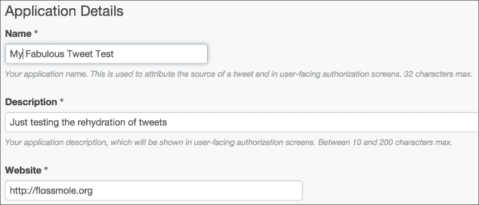
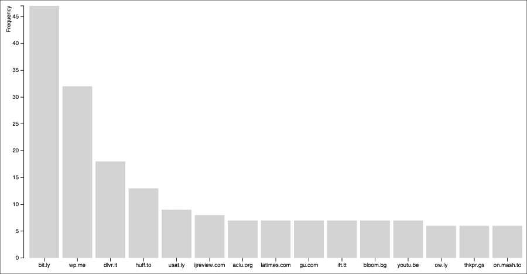

# 第十章. Twitter 项目

与我们在第九章完成的*Stack Overflow 项目*一样，我们下一个完整章节的晚宴派对旨在特别展示我们的数据清理技能，同时仍完成整个数据科学过程的每个阶段。我们之前的项目使用了 Stack Overflow 数据，结合 MySQL 和 PHP 进行清理，并使用 JavaScript D3 进行可视化。在本章中，我们将使用 Twitter 数据，MySQL 和 Python 收集和清理数据，并使用 JavaScript 和 D3 进行可视化。与我们之前的项目一样，本项目中的数据科学过程仍然是相同的：

1.  确定我们要解决的问题类型——我们为什么需要检查这些数据？

1.  收集和存储数据，包括下载和提取一组公开的推文识别号码，然后使用程序重新下载原始推文。此步骤还包括为测试目的创建较小的数据集。

1.  清理数据，通过提取和存储我们需要的部分来完成。在这一步中，我们编写一个快速的 Python 程序来加载数据，提取我们想要的字段，并将它们写入一小组数据库表中。

1.  分析数据。我们是否需要对数据进行任何计算？我们是否需要编写一些聚合函数来计数或求和数据？我们是否需要以某种方式转换数据？

1.  如果可能，提供数据的可视化。

1.  解决我们要调查的问题。我们的过程是否有效？我们是否成功了？

与我们之前的项目一样，工作的大部分内容将集中在数据的收集、存储和清理任务上。在本项目中，我们会注意到我们将数据存储为不同的版本几次，首先是文本文件，然后是已填充的 JSON 文件，接着是 MySQL 数据库。这些不同的格式是通过不同的收集或清理过程产生的，并将数据传递到下一个步骤。通过这种方式，我们开始看到收集、存储和清理步骤是如何**迭代**的——彼此反馈，而不仅仅是线性的。

# 第一步——提出一个关于推文档案的问题

Twitter 是一个受欢迎的**微博**平台，全球数百万人使用它分享想法或讨论时事。由于 Twitter 在发布和阅读方面相对易于访问，尤其是通过移动设备，它已成为在公共事件（如政治危机和抗议）期间分享信息的重要平台，或用来追踪一个问题在公众意识中的出现。保存的推文成为一种时间胶囊，为我们提供了关于事件发生时公共情绪的丰富见解。定格在时间中的推文不会受到记忆丧失或公众舆论后续反转的影响。学者和媒体专家可以收集并研究这些专题**推文档案**，以试图了解当时的公众舆论，或者了解信息是如何传播的，甚至了解某个事件发生时发生了什么，何时发生，为什么发生。

现在许多人已经开始公开他们的推文集合。一些现在可以公开下载的推文档案包括：

+   2014 年 8 月 10 日至 8 月 27 日期间，关于美国密苏里州费格森发生抗议和骚乱的推文。这些推文可以在[`archive.org/details/ferguson-tweet-ids`](https://archive.org/details/ferguson-tweet-ids)下载。

+   2011 年阿拉伯之春期间来自多个国家的推文，包括利比亚、巴林、埃及等。这些推文可以在[`dfreelon.org/2012/02/11/arab-spring-twitter-data-now-available-sort-of/`](http://dfreelon.org/2012/02/11/arab-spring-twitter-data-now-available-sort-of/)下载。

+   提到**#YesAllWomen**标签和相关标签**#NotAllMen**的推文，时间为 2014 年 5 月至 6 月。这些推文可以在[`digital.library.unt.edu/ark:/67531/metadc304853/`](http://digital.library.unt.edu/ark:/67531/metadc304853/)下载。

在接下来的步骤中，我们需要从这些数据集中选择一个进行下载并开始使用。由于费格森推文是这三个示例数据集中最新且最完整的，因此我设计了本章的其余内容围绕它进行。不过，无论你使用哪个数据集，这里的概念和基本流程都适用。

我们在本章中要提出的基本问题非常简单：当人们关于费格森发表推文时，他们最常提到的是哪些互联网域名？与我们在第九章中的问题集相比，*Stack Overflow 项目*，这是一个非常简单的问题，但数据收集过程在这里略有不同，因此一个简单的问题足以激励我们的数据科学晚宴。

# 第二步 – 收集数据

与我们在第七章中研究的小型情感推文档案不同，*RDBMS 清理技术*，更新的推文档案，如上文提到的，已不再包含推文的实际文本。Twitter 的**服务条款**（**ToS**）自 2014 年起发生了变化，分发他人的推文现在违反了这些条款。相反，在较新的推文档案中，你将找到的仅仅是推文的标识符（ID）号码。使用这些号码，我们必须单独收集实际的推文。到那时，我们可以自行存储和分析这些推文。请注意，在此过程的任何时刻或之后，我们不能重新分发推文的文本或其元数据，只能分发推文的标识符。

### 注意

尽管对于想要收集推文的研究人员来说，这样做不太方便，但 Twitter 更改其服务条款（ToS）的原因是为了尊重最初发布推文的人的版权观念。尤其是在删除推文时非常重要。如果一条推文已经被复制并在网络上广泛传播，并且被第三方存储在数据文件中，那么推文实际上是无法被删除的。通过要求研究人员仅复制推文 ID，Twitter 试图保护用户删除自己内容的能力。如果请求已删除的推文 ID，将不会返回任何结果。

## 下载并提取费格森文件

与费格森相关的推文可以在互联网档案馆找到，作为一组归档的压缩文本文件。请将浏览器指向[`archive.org/details/ferguson-tweet-ids`](https://archive.org/details/ferguson-tweet-ids)并下载 147 MB 的 ZIP 文件。

我们可以按以下方式提取文件：

```py
unzip ferguson-tweet-ids.zip

```

`ls`命令显示创建了一个名为`ferguson-tweet-ids`的目录，并且该目录内也有两个压缩文件：`ferguson-indictment-tweet-ids.zip`和`ferguson-tweet-ids.zip`。我们实际上只需要解压其中一个文件来执行这个项目，因此我选择了这个：

```py
unzip ferguson-tweet-ids.zip

```

解压此文件后，可以看到多个清单文本文件以及一个数据文件夹。`data`文件夹中包含一个 gzipped 文件。按以下方式解压：

```py
gunzip ids.txt.gz

```

这会产生一个名为`ids.txt`的文件。这个文件就是我们实际需要的文件。让我们来探索一下这个文件。

要查看文件的大小，我们可以运行`wc`命令。从命令提示符运行时，如这里所示，`wc`命令会显示文件中的行数、单词数和字符数，顺序如下：

```py
megan$ wc ids.txt
 13238863 13238863 251538397 ids.txt

```

第一个数字表示`ids.txt`文件中的行数，总共有 1300 多万行。接下来，我们可以使用`head`命令查看文件内容：

```py
megan$ head ids.txt
501064188211765249
501064196642340864
501064197632167936
501064196931330049
501064198005481472
501064198009655296
501064198059597824
501064198513000450
501064180468682752
501064199142117378

```

`head`命令显示文件的前十行，我们可以看到每行由一个 18 位的推文 ID 组成。

## 创建文件的测试版本

在这一阶段，我们将创建一个小的测试文件，供本项目其余部分使用。我们想这么做的原因与我们在第九章中处理测试表格的原因相同，*Stack Overflow 项目*。因为原始文件非常大，我们希望在出错时能够处理数据的一个子集。我们还希望在测试代码时，每一步不会花费太长时间。

与之前的练习不同，在这种情况下，我们选择测试数据行的顺序可能并不重要。仅通过查看我们之前运行的 `head` 命令的结果，我们可以看到这些行并不完全是按低到高的顺序排列。事实上，我们对原始数据行的顺序一无所知。因此，我们只需抓取前 1,000 个推文 ID 并将其保存到一个文件中。这个文件将成为我们的测试集：

```py
head -1000 ids.txt > ids_1000.txt

```

## 填充推文 ID

我们现在将使用这组 1,000 个推文 ID 来测试我们基于推文 ID 收集原始推文的流程。这个过程称为**填充**推文。为此，我们将使用一个非常方便的 Python 工具，叫做**twarc**，它是由 Ed Summers 编写的，Ed 同时也是存档了所有 Ferguson 推文的人。它的工作原理是通过获取推文 ID 列表，逐个从 Twitter API 获取原始推文。要使用 Twitter API，必须先设置好 Twitter 开发者帐户。我们先创建一个 Twitter 账户，然后再安装 twarc 并使用它。

### 设置 Twitter 开发者账户

要设置 Twitter 开发者账户，请访问 [`apps.twitter.com`](https://apps.twitter.com)，并使用你的 Twitter 账户登录。如果你还没有 Twitter 账户，你需要先创建一个，才能完成后续步骤。

一旦你用 Twitter 账户登录，从 [`apps.twitter.com`](http://apps.twitter.com) 页面，点击**创建新应用**。填写必要的详细信息来创建你的应用（为它命名，可以是类似 `My Tweet Test` 的名字；提供简短的描述；以及 URL，URL 不必是永久性的）。我的应用创建表单已填写如下，供你参考：



填写示例数据的 Twitter 创建新应用表单

点击表示同意开发者协议的复选框，然后你将返回到显示所有 Twitter 应用的屏幕，新的应用会显示在列表的最上方。

接下来，要使用这个应用程序，我们需要获取一些必要的关键信息。点击你刚创建的应用，你将看到下一屏幕顶部有四个标签。我们感兴趣的是标有**密钥和访问令牌**的那个。它看起来是这样的：


你新创建的 Twitter 应用中的标签界面。

在这个页面上有很多数字和密钥，但有四个项目我们需要特别关注：

+   **CONSUMER_KEY**

+   **CONSUMER_SECRET**

+   **ACCESS_TOKEN**

+   **ACCESS_TOKEN_SECRET**

无论你在进行哪种类型的 Twitter API 编程，至少目前为止，你总是需要这四项凭证。无论你使用的是 twarc 还是其他工具，这些凭证都是 Twitter 用来验证你并确保你有权限查看你请求的内容的方式。

### 注意

这些 API 凭证也是 Twitter 限制你可以发送多少请求以及请求速度的依据。twarc 工具会代我们处理这些问题，所以我们不需要过多担心超过请求频率限制。欲了解更多关于 Twitter 限制的信息，请查看他们的开发者文档，[`dev.twitter.com/rest/public/rate-limiting`](https://dev.twitter.com/rest/public/rate-limiting)。

### 安装 twarc

现在我们有了 Twitter 凭证，就可以安装 twarc 了。

twarc 下载页面可以在 GitHub 上找到，[`github.com/edsu/twarc`](https://github.com/edsu/twarc)。在该页面上，有关于如何使用这个工具以及可用选项的文档。

要在你的 Canopy Python 环境中安装 twarc，启动 Canopy 后从**工具**菜单中选择**Canopy 命令提示符**。

在命令提示符中输入：

```py
pip install twarc

```

这条命令将安装 twarc 并使其可以作为命令行程序调用，或者在你的 Python 程序中使用。

### 运行 twarc

现在我们可以使用命令行通过 twarc 工具来获取我们之前创建的`ids_1000.txt`文件。由于我们需要输入之前在 Twitter 网站上创建的四个长的密钥令牌，命令行非常长。为了避免出错，我先使用文本编辑器 Text Wrangler 创建了命令行，然后将其粘贴到命令提示符中。你最终的命令行会像下面这样，但每当出现`abcd`时，你应该用你对应的密钥令牌或密钥来替代：

```py
twarc.py --consumer_key abcd --consumer_secret abcd --access_token abcd --access_token_secret abcd --hydrate ids_1000.txt > tweets_1000.json

```

请注意，这条命令行将把输出重定向到一个名为`tweets_1000.json`的 JSON 文件。该文件中包含了我们之前只有 ID 的每条推文的 JSON 表示。让我们检查一下新文件的长度：

```py
wc tweets_1000.json

```

`wc` 工具显示我的文件长达 894 行，这表示一些推文无法找到（因为我原本的数据集中有 1,000 条推文）。如果这些推文在我编写本文后被删除，你的文件可能会更小。

接下来，我们还可以打开文件查看它的内容：

```py
less tweets_1000.json

```

我们也可以在文本编辑器中打开它查看。

JSON 文件中的每一行代表一条推文，每条推文的结构类似于以下示例。然而，这个示例推文并不来自 Ferguson 数据集，因为我没有权利分发这些推文。相反，我使用了我在第二章中创建的推文，*基础知识 – 格式、类型和编码*，用于讨论 UTF-8 编码。由于这条推文是专门为本书创建的，而且我拥有内容的所有权，因此我可以在不违反 Twitter 使用条款的情况下展示其 JSON 格式。以下是我的推文在 Twitter 网页界面上的显示方式：


一个推文的示例，如 Twitter 网页界面所示。

以下是推文在经过 twarc 水合后的 JSON 表示形式。我在每个 JSON 元素之间添加了换行符，这样我们可以更容易地看到每个推文中可用的属性：

```py
{"contributors": null, 
"truncated": false, 
"text": "Another test. \u00c9g elska g\u00f6gn. #datacleaning", 
"in_reply_to_status_id": null, 
"id": 542486101047275520, 
"favorite_count": 0, 
"source": "<a href=\"http://twitter.com\" rel=\"nofollow\">Twitter Web Client</a>", 
"retweeted": false, 
"coordinates": null, 
"entities": 
{"symbols": [], 
"user_mentions": [], 
"hashtags": 
[{"indices": [29, 42], 
"text": "datacleaning"}], 
"urls": []}, 
"in_reply_to_screen_name": null, 
"id_str": "542486101047275520", 
"retweet_count": 0, 
"in_reply_to_user_id": null, 
"favorited": false, 
"user": 
{"follow_request_sent": false, 
"profile_use_background_image": false, 
"profile_text_color": "333333", 
"default_profile_image": false, 
"id": 986601, 
"profile_background_image_url_https": "https://pbs.twimg.com/profile_background_images/772436819/b7f7b083e42c9150529fb13971a52528.png", 
"verified": false, 
"profile_location": null, 
"profile_image_url_https": "https://pbs.twimg.com/profile_images/3677035734/d8853be8c304729610991194846c49ba_normal.jpeg", 
"profile_sidebar_fill_color": "F6F6F6", 
"entities": 
{"url": 
{"urls": 
[{"url": "http://t.co/dBQNKhR6jY", 
"indices": [0, 22], 
"expanded_url": "http://about.me/megansquire", 
"display_url": "about.me/megansquire"}]},
"description": {"urls": []}}, 
"followers_count": 138, 
"profile_sidebar_border_color": "FFFFFF", 
"id_str": "986601", 
"profile_background_color": "000000", 
"listed_count": 6, 
"is_translation_enabled": false, 
"utc_offset": -14400, 
"statuses_count": 376, 
"description": "Open source data hound. Leader of the FLOSSmole project. Professor of Computing Sciences at Elon University.", 
"friends_count": 82, 
"location": "Elon, NC", 
"profile_link_color": "038543", 
"profile_image_url": "http://pbs.twimg.com/profile_images/3677035734/d8853be8c304729610991194846c49ba_normal.jpeg", 
"following": false, 
"geo_enabled": false, 
"profile_banner_url": "https://pbs.twimg.com/profile_banners/986601/1368894408", 
"profile_background_image_url": "http://pbs.twimg.com/profile_background_images/772436819/b7f7b083e42c9150529fb13971a52528.png", 
"name": "megan squire", 
"lang": "en", 
"profile_background_tile": false, 
"favourites_count": 64, 
"screen_name": "MeganSquire0", 
"notifications": false, 
"url": "http://t.co/dBQNKhR6jY", 
"created_at": "Mon Mar 12 05:01:55 +0000 2007", 
"contributors_enabled": false, 
"time_zone": "Eastern Time (US & Canada)", 
"protected": false, 
"default_profile": false, 
"is_translator": false}, 
"geo": null, 
"in_reply_to_user_id_str": null, 
"lang": "is", 
"created_at": "Wed Dec 10 01:09:00 +0000 2014", 
"in_reply_to_status_id_str": null, 
"place": null}
```

每个 JSON 对象不仅包括关于推文本身的事实，例如文本、日期和发送时间，它还包括关于发布推文的人的大量信息。

### 小贴士

水合过程会生成关于单条推文的*大量*信息——而且这是一个包含 1300 万条推文的数据集。在你准备在本章末尾水合整个 Ferguson 数据集时，请记住这一点。

# 第三步 – 数据清洗

目前，我们已经准备好开始清理 JSON 文件，提取我们希望保存在长期存储中的每条推文的详细信息。

## 创建数据库表

由于我们的问题只关心 URL，因此我们实际上只需要提取这些 URL 和推文 ID。然而，为了练习数据清洗，并且为了能够将此练习与我们在第七章中使用 `sentiment140` 数据集时做的工作进行对比，*RDBMS 清洗技术*，我们设计了一组小型数据库表，如下所示：

+   一个 `tweet` 表，专门存储推文的信息

+   一个 `hashtag` 表，存储哪些推文引用了哪些话题标签的信息

+   一个 `URL` 表，存储哪些推文引用了哪些 URL 的信息

+   一个 `mentions` 表，包含有关哪些推文提到了哪些用户的信息

这与我们在第七章中设计的结构类似，*RDBMS 清洗技术*，不同的是，在那个例子中我们必须从推文文本中解析出自己的话题标签、URL 和用户提及。使用 twarc 工具无疑为我们完成本章的工作节省了很多精力。

创建这四个表的 `CREATE` 语句如下：

```py
CREATE TABLE IF NOT EXISTS ferguson_tweets (
  tid bigint(20) NOT NULL,
  ttext varchar(200) DEFAULT NULL,
  tcreated_at varchar(50) DEFAULT NULL,
  tuser bigint(20) DEFAULT NULL,
  PRIMARY KEY (tid)
) ENGINE=MyISAM DEFAULT CHARSET=utf8mb4;

CREATE TABLE IF NOT EXISTS ferguson_tweets_hashtags (
  tid bigint(20) NOT NULL,
  ttag varchar(200) NOT NULL,
  PRIMARY KEY (tid, ttag)
) ENGINE=MyISAM DEFAULT CHARSET=utf8;

CREATE TABLE IF NOT EXISTS ferguson_tweets_mentions (
  tid bigint(20) NOT NULL,
  tuserid bigint(20) NOT NULL,
  tscreen varchar(100) DEFAULT NULL,
  tname varchar(100) DEFAULT NULL,
  PRIMARY KEY (tid,tuserid)
) ENGINE=MyISAM DEFAULT CHARSET=utf8;

CREATE TABLE IF NOT EXISTS ferguson_tweets_urls (
  tid bigint(20) NOT NULL,
  turl varchar(200) NOT NULL,
  texpanded varchar(255) DEFAULT NULL,
  tdisplay varchar(200) DEFAULT NULL,
  PRIMARY KEY (tid,turl)
) ENGINE=MyISAM DEFAULT CHARSET=utf8;
```

有一点需要注意，推文表是使用**utf8mb4**字符集创建的。这是因为推文中可能包含 UTF-8 范围内非常高的字符。实际上，这些推文中的某些字符将需要比 MySQL 原生 UTF-8 字符集所能容纳的 3 字节限制更多的空间。因此，我们设计了主要的推文表，使其能够使用 MySQL 的 utf8mb4 字符集，该字符集在 MySQL 5.5 或更高版本中可用。如果你正在使用比这个版本更旧的 MySQL，或者由于其他原因无法访问 utf8mb4 字符集，你可以使用 MySQL 较旧的 UTF-8-general 字符集，但需要注意，某些表情符号可能会导致编码错误。如果确实遇到此错误，MySQL 可能会显示关于错误 1366 和*不正确的字符串值*的消息，当你尝试`INSERT`记录时。

现在每个表格都已创建，我们可以开始选择并加载数据了。

## 在 Python 中填充新表格

以下 Python 脚本将加载 JSON 文件，提取我们感兴趣的字段的值，并填充之前描述的四个表格。关于此脚本，还有一些额外的重要事项，我将一一讲解。

这个脚本确实需要安装`MySQLdb` Python 模块。作为 Canopy Python 用户，这些模块可以通过包管理器轻松安装。只需在**包管理器**中搜索`MySQLdb`，然后点击安装：

```py
#jsonTweetCleaner.py
import json
import MySQLdb

# Open database connection
db = MySQLdb.connect(host="localhost",\
    user="username", \
    passwd="password", \
    db="ferguson", \
    use_unicode=True, \
    charset="utf8")
cursor = db.cursor()
cursor.execute('SET NAMES utf8mb4')
cursor.execute('SET CHARACTER SET utf8mb4')
cursor.execute('SET character_set_connection=utf8mb4')

# open the file full of json-encoded tweets
with open('tweets_1000.json') as f:
    for line in f:
        # read each tweet into a dictionary
        tweetdict = json.loads(line)

        # access each tweet and write it to our db table
        tid    = int(tweetdict['id'])
        ttext  = tweetdict['text']
        uttext = ttext.encode('utf8')
        tcreated_at = tweetdict['created_at']
        tuser  = int(tweetdict['user']['id'])

        try:
            cursor.execute(u"INSERT INTO ferguson_tweets(tid, 
ttext, tcreated_at, tuser) VALUES (%s, %s, %s, %s)", \
(tid,uttext,tcreated_at,tuser))
            db.commit() # with MySQLdb you must commit each change
        except MySQLdb.Error as error:
            print(error)
            db.rollback()

        # access each hashtag mentioned in tweet
        hashdict = tweetdict['entities']['hashtags']
        for hash in hashdict:
            ttag = hash['text']
            try:
                cursor.execute(u"INSERT IGNORE INTO 
ferguson_tweets_hashtags(tid, ttag) VALUES (%s, %s)",(tid,ttag))
                db.commit()
            except MySQLdb.Error as error:
                print(error)
                db.rollback()

        # access each URL mentioned in tweet
        urldict = tweetdict['entities']['urls']
        for url in urldict:
            turl      = url['url']
            texpanded = url['expanded_url']
            tdisplay  = url['display_url']

            try:
                cursor.execute(u"INSERT IGNORE INTO  ferguson_tweets_urls(tid, turl, texpanded, tdisplay) 
VALUES (%s, %s, %s, %s)", (tid,turl,texpanded,tdisplay))
                db.commit()
            except MySQLdb.Error as error:
                print(error)
                db.rollback()

        # access each user mentioned in tweet
        userdict = tweetdict['entities']['user_mentions']
        for mention in userdict:
            tuserid = mention['id']
            tscreen = mention['screen_name']
            tname   = mention['name']

            try:
                cursor.execute(u"INSERT IGNORE INTO 
ferguson_tweets_mentions(tid, tuserid, tscreen, tname) 
VALUES (%s, %s, %s, %s)", (tid,tuserid,tscreen,tname))
                db.commit()
            except MySQLdb.Error as error:
                print(error)
# disconnect from server
db.close()
```

### 提示

关于 JSON 表示的推文中每个字段的更多信息，Twitter API 文档非常有帮助。有关用户、实体以及推文中的实体部分的内容，尤其是在规划从 JSON 推文中提取哪些字段时，文档中的这些部分特别有指导意义。你可以通过[`dev.twitter.com/overview/api/`](https://dev.twitter.com/overview/api/)开始查阅文档。

一旦运行此脚本，四个表格将填充数据。在我的 MySQL 实例中，运行上述脚本并对`ids_1000.txt`文件进行操作后，我在推文表中得到了 893 行数据；在标签表中得到了 1,048 行数据；在用户提及表中得到了 896 行数据；在 URL 表中得到了 371 行数据。如果你的某些表格行数较少，检查是否是因为某些推文被删除了。

# 第四步 —— 简单的数据分析

假设我们想要了解在 Ferguson 数据集中，哪些网页域名被链接得最多。我们可以通过提取存储在`ferguson_tweets_urls`表中`tdisplay`列的 URL 域名部分来回答这个问题。对于我们的目的，我们将 URL 中第一个斜杠(`/`)之前的部分视为感兴趣的部分。

以下 SQL 查询为我们提供了域名和引用该域名的帖子数：

```py
SELECT left(tdisplay,locate('/',tdisplay)-1) as url, 
  count(tid) as num
FROM ferguson_tweets_urls
GROUP BY 1 ORDER BY 2 DESC;
```

这个查询的结果是一个数据集，看起来大致如下（在 1,000 行样本数据上运行）：

| url | num |
| --- | --- |
| bit.ly | 47 |
| wp.me | 32 |
| dlvr.it | 18 |
| huff.to | 13 |
| usat.ly | 9 |
| ijreview.com | 8 |
| latimes.com | 7 |
| gu.com | 7 |
| ift.tt | 7 |

这段数据集片段仅展示了前几行，但我们已经可以看到一些更受欢迎的结果是 URL 缩短服务，比如`bit.ly`。我们还可以看到，我们可以通过使用显示列而不是主 URL 列，轻松去除所有由 Twitter 自有的短链接服务`t.co`创建的缩短 URL。

在接下来的章节中，我们可以使用这些计数来构建一个条形图，方式与我们在第九章中构建简单图表的方式类似，*Stack Overflow 项目*。

# 第五步 - 可视化数据

要构建一个小的 D3 启用图表，我们可以遵循与第九章中*Stack Overflow 项目*类似的流程，在那个章节里我们制作了一个 PHP 脚本来查询数据库，然后我们的 JavaScript 使用结果作为条形图的实时输入。或者，我们可以使用 Python 生成 CSV 文件，让 D3 从这些结果中生成图表。由于我们在上一章已经使用过 PHP 方法，这里就用 CSV 文件方法，换个口味。这也是一个继续使用 Python 的好理由，因为我们已经在本章中使用了这个语言。

以下脚本连接到数据库，选择出使用最多的前 15 个 URL 及其计数，并将整个内容写入 CSV 文件：

```py
import csv
import MySQLdb

# Open database connection
db = MySQLdb.connect(host="localhost",
    user="username", 
    passwd="password", 
    db="ferguson", 
    use_unicode=True, 
    charset="utf8")
cursor = db.cursor()

cursor.execute('SELECT left(tdisplay, LOCATE(\'/\', 
    tdisplay)-1) as url, COUNT(tid) as num 
    FROM ferguson_tweets_urls 
    GROUP BY 1 ORDER BY 2 DESC LIMIT 15')

with open('fergusonURLcounts.tsv', 'wb') as fout:
    writer = csv.writer(fout)
    writer.writerow([ i[0] for i in cursor.description ])
    writer.writerows(cursor.fetchall())
```

一旦我们拥有了这个 CSV 文件，我们就可以将它输入到一个标准的 D3 条形图模板中，看看它的效果。以下内容可以命名为`buildBarGraph.html`之类的：

### 注意

确保你的本地文件夹中有 D3 库，就像在前几章中一样，另外还要有你刚刚创建的 CSV 文件。

```py
<!DOCTYPE html>
<meta charset="utf-8">
<!-- 
this code is modeled on mbostock's 
"Let's Make a Bar Chart" D3 tutorial 
available at http://bl.ocks.org/mbostock/3885304
My modifications:
* formatting for space
* colors
* y axis label moved
* changed variable names to match our data
* loads data via CSV rather than TSV file
-->

<style>
.bar {fill: lightgrey;}
.bar:hover {fill: lightblue;}
.axis {font: 10px sans-serif;}
.axis path, .axis line {
  fill: none;
  stroke: #000;
  shape-rendering: crispEdges;
}
.x.axis path {display: none;}
</style>
<body>
<script src="img/d3.min.js"></script>
<script>

var margin = {top: 20, right: 20, bottom: 30, left: 40},
    width = 960 - margin.left - margin.right,
    height = 500 - margin.top - margin.bottom;

var x = d3.scale.ordinal()
    .rangeRoundBands([0, width], .1);

var y = d3.scale.linear()
    .range([height, 0]);

var xAxis = d3.svg.axis()
    .scale(x)
    .orient("bottom");

var yAxis = d3.svg.axis()
    .scale(y)
    .orient("left");

var svg = d3.select("body").append("svg")
    .attr("width", width + margin.left + margin.right)
    .attr("height", height + margin.top + margin.bottom)
  .append("g")
    .attr("transform", "translate(" + margin.left + "," + margin.top + ")");

d3.csv("fergusonURLcounts.csv", type, function(error, data) {
  x.domain(data.map(function(d) { return d.url; }));
  y.domain([0, d3.max(data, function(d) { return d.num; })]);

  svg.append("g")
      .attr("class", "x axis")
      .attr("transform", "translate(0," + height + ")")
      .call(xAxis);

  svg.append("g")
      .attr("class", "y axis")
      .call(yAxis)
    .append("text")
      .attr("transform", "rotate(-90)")
      .attr("y", 6)
      .attr("dy", "-3em")
      .style("text-anchor", "end")
      .text("Frequency");

  svg.selectAll(".bar")
      .data(data)
    .enter().append("rect")
      .attr("class", "bar")
      .attr("x", function(d) { return x(d.url) ; })
      .attr("width", x.rangeBand())
      .attr("y", function(d) { return y(d.num); })
      .attr("height", function(d) { return height - y(d.num); });
});

function type(d) {
  d.num = +d.num;
  return d;
}

</script>
</body>
</html>
```

结果的条形图看起来就像这里展示的那样。再强调一次，记得我们使用的是测试数据集，因此这些数字非常小：



使用我们的 CSV 文件在 D3 中绘制的简单条形图。

# 第六步 - 问题解决

由于数据可视化不是本书的主要目的，我们并不太关注这一部分的图表有多复杂，简单来说，费格森数据集里还有很多有趣的模式等着我们去发现，不仅仅是哪些 URL 被点击得最多。既然你已经知道如何轻松地下载和清理这个庞大的数据集，也许你可以发挥想象力，去揭示这些模式。当你向公众发布你的发现时，记得不要发布推文本身或其元数据。但如果你的问题需要，你可以发布推文的 ID，或者它们的一个子集。

# 将此过程转移到完整（非测试）表格中

就像在第九章中提到的*堆栈溢出项目*一样，我们制作了测试表，以便在一个无压力的环境中开发我们的项目，并收集可管理数量的推文。当你准备好收集完整的推文列表时，做好花费一些时间的准备。Twitter 的速率限制将会生效，twarc 也会运行很长时间。Ed Summers 在这篇博客文章中指出，运行 Ferguson 推文大约需要一周的时间：[`inkdroid.org/journal/2014/11/18/on-forgetting/`](http://inkdroid.org/journal/2014/11/18/on-forgetting/)。当然，如果你小心操作，你只需要运行一次。

你可以做的另一件事来加速推文 ID 的水合作用时间是与其他人合作。你可以将推文 ID 文件分成两半，各自处理自己部分的推文。在数据清理过程中，确保你将两者都`INSERT`到同一个最终数据库表中。

以下是我们将遵循的步骤，以便将我们的项目从收集 1,000 条推文样本更改为收集完整的推文集合：

1.  按照以下方式清空`ferguson_tweets`、`ferguson_tweets_hashtags`、`ferguson_tweets_mentions`和`ferguson_tweets_urls`表：

    ```py
    TRUNCATE TABLE ferguson_tweets;
    TRUNCATE TABLE ferguson_tweets_hashtags;
    TRUNCATE TABLE ferguson_tweets_mentions;
    TRUNCATE TABLE ferguson_tweets_urls;
    ```

1.  按照以下方式在完整的`ids.txt`文件上运行 twarc，而不是在`ids_1000.txt`文件上运行：

    ```py
    twarc.py --consumer_key abcd --consumer_secret abcd --access_token abcd --access_token_secret abcd --hydrate ids.txt > tweets.json

    ```

1.  重新运行`jsonTweetCleaner.py` Python 脚本。

到这时，你将拥有一个已清理的数据库，里面充满了推文、标签、提及和网址，准备进行分析和可视化。由于现在每个表中有更多的行，请注意，每个可视化步骤的运行时间可能会更长，这取决于你执行的查询类型。

# 总结

在这个项目中，我们学会了如何根据推文的 ID 重建推文列表。首先，我们找到符合 Twitter 最新服务条款的高质量存档推文数据。我们学会了如何将其拆分成一个足够小的集合，适用于测试目的。接着，我们学会了如何使用 Twitter API 和 twarc 命令行工具将每条推文水合成其完整的 JSON 表示。然后，我们学会了如何在 Python 中提取 JSON 实体的部分内容，并将字段保存到 MySQL 数据库中的新表中。最后，我们运行了一些简单的查询来计算最常见的网址，并使用 D3 绘制了一个条形图。

在本书中，我们已经学习了如何执行各种数据清理任务，包括简单的和复杂的。我们使用了多种语言、工具和技术来完成任务，在这个过程中，我希望你能够完善现有技能，并学到许多新技能。

此时，我们的最终晚宴已圆满结束，你现在准备好在你充实而又非常干净的数据科学厨房中开始自己的清理项目了。你应该从哪里开始？

+   你喜欢比赛和奖品吗？Kaggle 在他们的网站上举办频繁的数据分析比赛，[`kaggle.com`](http://kaggle.com)。你可以单独工作，也可以作为团队的一部分。许多团队需要干净的数据，这也是你贡献力量的绝佳方式。

+   如果你是一个更偏向于公共服务的人，我建议你去看看数据学院（School of Data）？他们的网址是 [`schoolofdata.org`](http://schoolofdata.org)，他们提供课程和*数据探险*活动，来自世界各地的专家和业余爱好者共同解决使用数据的现实问题。

+   为了进一步扩展你的数据清洗实践，我强烈推荐你亲自去摸索一些公共可用的数据集。KDnuggets 提供了一个很好的数据集列表，包含一些列表中的列表，网址是：[`www.kdnuggets.com/datasets/`](http://www.kdnuggets.com/datasets/)。

+   你喜欢第九章，*Stack Overflow 项目*中的 Stack Overflow 示例吗？*Meta* Stack Exchange 是一个专门讨论 StackExchange 网站工作方式的网站，网址是 [`meta.stackexchange.com`](http://meta.stackexchange.com)。用户们讨论了数百个关于如何查询 Stack Overflow 数据以及如何处理这些数据的精彩想法。或者，你也可以贡献自己的一份力量，参与 Stack Overflow 上与数据清洗相关的大量问题讨论。最后，还有一些与数据清洗相关的其他 Stack Exchange 网站，其中一个有用的网站是 Open Data Stack Exchange，网址是 [`opendata.stackexchange.com`](http://opendata.stackexchange.com)。

+   Twitter 数据目前非常受欢迎。如果你喜欢处理 Twitter 数据，可以考虑将我们的第十章，*Twitter 项目*，提升到一个新的层次，通过提出和回答你自己的问题，分析那些公开可用的推文集合。或者，你也可以收集和整理一组属于你自己的推文 ID。如果你在某个感兴趣的话题上建立干净的推文 ID 集合，你可以将其分发给研究人员和其他数据科学家，他们会非常感激。

祝你在数据清洗的冒险中好运，*祝好胃口！*
