# 第三章。CQL 数据类型

在本章中，我们将概述 Cassandra 查询语言，并详细探讨 Cassandra 支持的丰富数据类型集。我们将遍历数据类型，研究它们的内部存储结构。如果您想了解 Cassandra 在幕后如何实现它们，可以参考 Cassandra 的 Java 源代码。对于那些尚未安装和设置 Cassandra 的读者，您可以参考 第五章，*初步设计和实现*，以获取快速流程。

# CQL 简介

Cassandra 在 0.8 版本中引入了 Cassandra 查询语言（CQL），作为传统 Thrift RPC API 的 SQL 类似替代品。截至本文撰写时，最新的 CQL 版本是 3.1.7。我不想带你们回顾所有旧版本，因此，我将只关注 3.1.7 版本。需要注意的是，CQL 版本 3 与 CQL 版本 2 不兼容，并且在许多方面有所不同。

## CQL 语句

CQL 版本 3 提供了一个与 SQL 非常相似的模式。从概念上讲，它使用表格以列的行来存储数据。它由三种主要类型的语句组成：

+   **数据定义语句**：这些语句用于设置和更改数据在 Cassandra 中的存储方式

+   **数据操作语句**：这些语句用于创建、删除和修改数据

+   **查询语句**：这些语句用于查找数据

CQL 不区分大小写，除非单词被双引号包围。它定义了一系列具有固定语言意义的保留词。它区分了保留词和非保留词。**保留**词不能用作标识符。它们确实是保留给语言的。**非保留**词仅在特定上下文中具有特定意义，但可以用作标识符。CQL 关键词列表可以在 DataStax 的文档中找到，网址为 [`www.datastax.com/documentation/cql/3.1/cql/cql_reference/keywords_r.html`](http://www.datastax.com/documentation/cql/3.1/cql/cql_reference/keywords_r.html)。

## CQL 命令行客户端 – cqlsh

Cassandra 包含了一个支持 CQL 的交互式终端，称为 `cqlsh`。它是一个基于 Python 的命令行客户端，用于运行 CQL 命令。要启动 `cqlsh`，请导航到 Cassandra 的 `bin` 目录并输入以下命令：

+   在 Linux 上，输入 `./cqlsh`

+   在 Windows 上，输入 `cqlsh.bat` 或 `python cqlsh`

如以下图所示，`cqlsh` 在启动时显示集群名称、Cassandra、CQL 和 Thrift 协议版本：

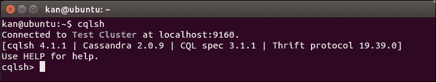

cqlsh 连接到本地节点上运行的 Cassandra 实例

我们可以使用 `cqlsh` 通过附加主机（无论是主机名还是 IP 地址）和端口号作为命令行参数来连接到其他节点。

如果我们想使用 `SimpleStrategy`（将在第六章“增强版本”中解释）作为其复制策略，并设置单个节点 Cassandra 集群的复制因子为 1 来创建一个名为 `packt` 的 keyspace，我们可以在 `cqlsh` 中输入以下截图所示的 CQL 语句。

本书将广泛使用此实用程序来演示如何使用 CQL 定义 Cassandra 数据模型：

在 cqlsh 中创建 keyspace packt

### 提示

**下载示例代码**

您可以从您在 [`www.packtpub.com`](http://www.packtpub.com) 的账户下载您购买的所有 Packt 书籍的示例代码文件。如果您在其他地方购买了这本书，您可以访问 [`www.packtpub.com/support`](http://www.packtpub.com/support) 并注册，以便将文件直接通过电子邮件发送给您。

## 原生数据类型

CQL 版本 3 支持许多基本的列数据类型。它还支持集合类型和 Cassandra 可用的所有数据类型。以下表格列出了支持的基本数据类型及其对应含义：

| 类型 | 描述 |
| --- | --- |
| ascii | ASCII 字符串 |
| bigint | 64 位有符号长整型 |
| blob | 随意字节（无验证） |
| Boolean | `True` 或 `False` |
| counter | 计数列（64 位有符号值） |
| decimal | 可变精度十进制数 |
| double | 64 位 IEEE 754 浮点数 |
| float | 32 位 IEEE 754 浮点数 |
| inet | 可以是 4 字节长（IPv4）或 16 字节长（IPv6）的 IP 地址，应作为字符串输入 |
| int | 32 位有符号整数 |
| text | UTF8 编码的字符串 |
| timestamp | 允许输入日期的字符串常量时间戳 |
| timeuuid | 通常用作“无冲突”时间戳的类型 1 UUID |
| uuid | 类型 1 或类型 4 UUID |
| varchar | UTF8 编码的字符串 |
| varint | 可变精度整型 |

> 表 1. CQL 版本 3 基本数据类型

## Cassandra 实现

如果我们查看 Cassandra 的 Java 源代码，CQL 版本 3 的原生数据类型在 `org.apache.cassandra.cql3.CQL3Type` 接口中的 `Native` `enum` 中声明，如下截图所示：

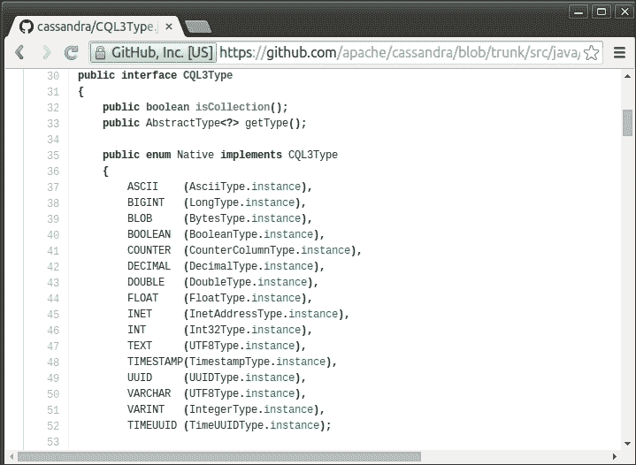

声明 CQL 版本 3 原生数据类型的 Cassandra 源代码

有趣的是，`TEXT` 和 `VARCHAR` 确实都是 `UTF8Type`。`AsciiType`、`LongType`、`BytesType`、`DecimalType` 等类的 Java 类在 `org.apache.cassandra.db.marshal` 包中声明。

### 注意

Cassandra 源代码可在 GitHub 上找到，网址为 [`github.com/apache/cassandra`](https://github.com/apache/cassandra)。

了解原生数据类型的 Java 实现，使我们能够更深入地理解 Cassandra 如何处理它们。例如，Cassandra 使用`org.apache.cassandra.serializers.InetAddressSerializer`类和`java.net.InetAddress`类来处理`INET`数据类型的序列化和反序列化。

## 一个不太长的例子

这些原生数据类型用于 CQL 语句中，以指定要存储在表列中的数据类型。现在让我们创建一个实验性表，其中包含每种原生数据类型的列（除了计数器类型，因为它需要一个单独的表），然后向其中插入一些数据。在创建名为`table01`的表之前，我们需要指定键空间，在这个例子中是`packt`，如下截图所示：

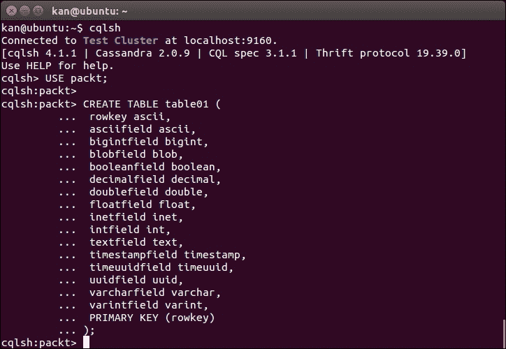

创建`table01`以说明每种原生数据类型

我们使用默认值创建表，但还有其他选项可以配置新表以进行优化，包括压缩、压缩、故障处理等。只有一个列的`PRIMARY KEY`子句也可以指定，即`rowkey ascii PRIMARY KEY`。然后向`table01`插入一个样本记录。我们使用`INSERT`语句来完成，如下截图所示：

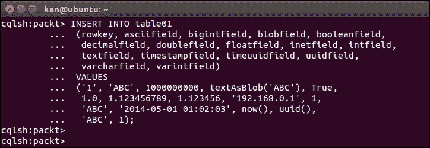

向`table01`插入一个样本记录

我们现在在`table01`中有数据。我们使用`cqlsh`来查询表。为了比较，我们还使用另一个名为 Cassandra CLI 的 Cassandra 命令行工具，以获得对行的底层视图。让我们在终端上打开 Cassandra CLI。

### 注意

**Cassandra CLI 实用工具**

Cassandra CLI 用于在单个键空间或单个表的基础上设置存储配置属性。要启动它，您需要导航到 Cassandra bin 目录并输入以下命令：

+   在 Linux 上，`./cassandra-cli`

+   在 Windows 上，`cassandra.bat`

注意，它在 Cassandra 3.0 中被宣布为已弃用，应使用`cqlsh`代替。

以下截图显示了`cqlsh`中的`SELECT`语句和 Cassandra CLI 中的`list`命令的结果。然后我们将逐列进行说明：

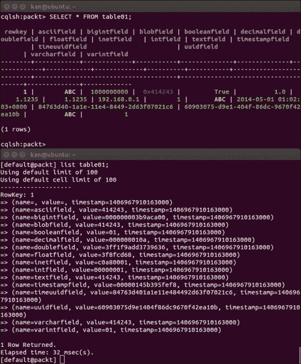

cqlsh 和 Cassandra CLI 中样本行的比较

## ASCII

在内部，数据值`'ABC'`被存储为每个单独字符的十六进制表示的字节值，`'A'`、`'B'`和`'C'`分别表示为`0x41`、`0x42`和`0x43`。

## Bigint

这个很简单；数字`1000000000`的十六进制表示为`0x000000003b9aca00`，长度为 64 位，内部存储。

## BLOB

`BLOB`数据类型用于存储大型二进制对象。在我们之前的例子中，我们将文本`'ABC'`作为`BLOB`插入到`blobfield`中。其内部表示为`414243`，这只是一个十六进制表示的字节流。

显然，`BLOB` 字段可以接受各种数据，正因为这种灵活性，它不能对其数据值进行验证。例如，数据值 `2` 可以解释为整数 `2` 或文本 `'2'`。如果不了解我们想要的解释，`BLOB` 字段可以对数据值进行检查。

`BLOB` 字段的另一个有趣之处在于，如前一个截图中的 `cqlsh` 中的 `SELECT` 语句所示，返回的 `blobfield` 数据值对于 `'ABC'` 文本来说是 `0x414243`。我们知道从上一个部分，`0x41`、`0x42`、`0x43` 分别是 `'A'`、`'B'` 和 `'C'` 的字节值。然而，对于 `BLOB` 字段，`cqlsh` 在其数据值前加上 `'0x'`，使其成为一个所谓的 BLOB 常量。BLOB 常量是一系列字节，它们的十六进制值以 `0xX+` 开头，其中 `hex` 是一个十六进制字符，例如 `[0-9a-fA-F]`。

CQL 还提供了一些 `BLOB` 转换函数，用于将原生数据类型转换为 `BLOB`，反之亦然。对于 CQL 支持的每个 `<native-type>`（除了 `BLOB`，原因很明显），`<native-type>AsBlob` 函数接受一个 `<native-type>` 类型的参数，并将其作为 `BLOB` 返回。相反，`blobAs<Native-type>` 函数将 `BLOB` 转换回 `<native-type>`。如前一个截图中的 `INSERT` 语句所示，我们使用了 `textAsBlob()` 将 `text` 数据类型转换为 `BLOB`。

### 注意

**BLOB 常量**

BLOB 常量是在 CQL 版本 3.0.2 中引入的，以便用户输入 `BLOB` 值。在 CQL 的旧版本中，为了方便起见，支持将 `BLOB` 作为字符串输入。现在这已被弃用，并将在未来版本中删除。它仍然被支持，只是为了允许更平滑地过渡到 `BLOB` 常量。尽快更新客户端代码以切换到 `BLOB` 常量是必要的。

## 布尔值

`boolean` 数据类型也非常直观。它仅仅是内部存储中的一个字节，可以是 `0x00`，表示 `False`，或者 `0x01`，表示 `True`。

## 十进制

`decimal` 数据类型可以存储可变精度的十进制数，基本上是 Java 中的 `BigDecimal` 数据类型。

## 双精度

`double` 数据类型在其内部存储中是一个双精度 64 位 IEEE 754 浮点数。

## 浮点数

`float` 数据类型在其内部存储中是一个单精度 32 位 IEEE 754 浮点数。

### 注意

**BigDecimal、double 或 float？**

`double` 和 `float` 之间的区别显然是浮点数值的精度长度。`double` 和 `float` 都使用十进制数的二进制表示，其基数在很多情况下是一个近似值，而不是一个绝对值。`double` 是一个 64 位值，而 `float` 是一个更短的 32 位值。因此，我们可以说 `double` 比浮点数更精确。然而，在这两种情况下，仍然存在精度损失的可能性，这在处理非常大的数字或非常小的数字时可能会非常明显。

相反，`BigDecimal`是为了克服这种精度差异的损失而设计的。它是一种精确表示数字的方式。它的缺点是运行时性能较慢。

无论何时你处理金钱或精度是必须的，`BigDecimal`是最好的选择（或在 CQL 原生数据类型中为`decimal`），否则`double`或`float`应该足够好。

## Inet

`inet`数据类型是为了存储**IP 版本 4**（**IPv4**）和**IP 版本 6**（**IPv6**）格式的 IP 地址值而设计的。示例记录中的 IP 地址`192.168.0.1`在内部存储时被表示为四个字节；`192`被存储为`0xc0`，`168`为`0xa8`，`0`为`0x00`，`1`为`0x01`，分别。需要注意的是，无论存储的 IP 地址是 IPv4 还是 IPv6，端口号都没有存储。如果需要，我们需要另一个列来存储它。

我们也可以存储 IPv6 地址值。以下`UPDATE`语句将`inetfield`更改为 IPv6 地址`2001:0db8:85a3:0042:1000:8a2e:0370:7334`，如下面的截图所示：

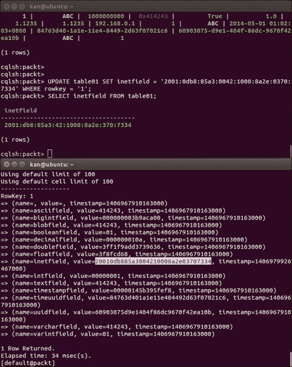

cqlsh 和 Cassandra CLI 中 inetfield 样本行的比较

### Note

**互联网协议版本 6**

互联网协议版本 6（IPv6）是**互联网协议**（**IP**）的最新版本。它是由 IETF 开发的，以解决 IPv4 地址耗尽这一长期预期的难题。

IPv6 使用 128 位地址，而 IPv4 使用 32 位地址。这两个协议不是为互操作性设计的，这使得向 IPv6 的过渡变得复杂。

IPv6 地址通常表示为用冒号分隔的八组每组四个十六进制数字，例如`2001:0db8:85a3:0042:1000:8a2e:0370:7334`。

在`cqlsh`中，每组四个十六进制数字的前导零被移除。在 Cassandra 的内部存储中，IPv6 地址值占用 16 字节。

## Int

`int`数据类型是一个原始的 32 位有符号整数。

## Text

`text`数据类型是一个 UTF-8 编码的字符串，接受 Unicode 字符。如前所述，"`ABC`"的字节值`0x41`、`0x42`和`0x43`被内部存储。我们可以通过更新`textfield`来测试`text`字段中的非 ASCII 字符，如下面的截图所示：

`text`数据类型是由非 ASCII 和 ASCII 字符组合而成的。四个非 ASCII 字符被表示为它们的 3 字节 UTF-8 值，分别是`0xe8b584`、`0xe6ba90`、`0xe68f90`和`0xe4be9b`。

然而，ASCII 字符仍然以字节值存储，如截图所示：

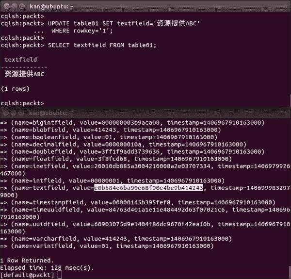

textfield 数据类型的实验

## 时间戳

`timestampfield`的值编码为一个 64 位有符号整数，表示自称为“纪元”的标准基准时间以来的毫秒数：1970 年 1 月 1 日 00:00:00 GMT。`timestamp`数据类型可以作为整数用于 CQL 输入，或作为 ISO 8601 格式的字符串字面量。如下面的屏幕截图所示，2014 年 5 月 1 日 16:02:03 在+08:00 时区内的内部值为`0x00000145b6cdf878`或自纪元以来的 1,398,931,323,000 毫秒：

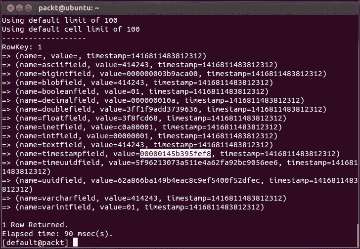

时间戳数据类型的实验

`timestamp`数据类型包含一个日期部分和一个时间部分，如果只需要日期值，则可以省略一天中的时间。Cassandra 将使用 00:00:00 作为省略时间部分的默认值。

### 注意

**ISO 8601**

ISO 8601 是表示日期和时间的国际标准。其完整的参考编号是 ISO 8601:1988（E），其标题为“数据元素和交换格式 – 信息交换 – 日期和时间的表示。”

ISO 8601 根据所需的粒度级别描述了大量的日期/时间格式。格式如下。请注意，“T”在字符串中字面表示时间元素的开始。

+   年份：YYYY（例如，1997）

+   年和月：YYYY-MM（例如，1997-07）

+   日期：YYYY-MM-DD（例如，1997-07-16）

+   日期加上小时和分钟：YYYY-MM-DDThh:mmTZD（例如，1997-07-16T19:20+01:00）

+   日期加上小时、分钟和秒：YYYY-MM-DDThh:mm:ssTZD（例如，1997-07-16T19:20:30+01:00）

+   日期加上小时、分钟、秒和秒的十进制分数：YYYY-MM-DDThh:mm:ss.sTZD（例如，1997-07-16T19:20:30.45+01:00）

其中：

+   YYYY = 四位年份

+   MM = 月份的两位数字（01=一月，等等）

+   DD = 月份的两位数字（01 至 31）

+   hh = 小时的两位数字（00 至 23）（不允许 am/pm）

+   mm = 分钟的两位数字（00 至 59）

+   ss = 秒的两位数字（00 至 59）

+   s = 表示秒的十进制分数的一个或多个数字

+   TZD = 时区标识符（Z 或+hh:mm 或-hh:mm）

时间可以表示为**协调世界时**（**UTC**）与特殊的 UTC 标识符“Z”或与小时和分钟的时区偏移量一起表示的本地时间。偏移量“+/-hh:mm”表示使用一个本地时区，该时区比 UTC 快“hh”小时和“mm”分钟或慢“hh”小时和“mm”分钟。

如果未指定时区，则使用处理写请求的 Cassandra 协调节点所在的时区。因此，最佳实践是使用时间戳指定时区，而不是依赖于 Cassandra 节点上配置的时区，以避免任何歧义。

## Timeuuid

`timeuuid` 数据类型的值是一个包含其生成时间的 Type 1 UUID，并按时间戳排序。因此，它非常适合需要无冲突时间戳的应用程序。一个有效的 `timeuuid` 使用自 00:00:00.00 UTC 以来 100 个时间间隔的时间（60 位），用于防止重复的时钟序列号（14 位），以及 IEEE 801 MAC 地址（48 位）来生成一个唯一的标识符，例如，`74754ac0-e13f-11e3-a8a3-a92bc9056ee6`。

CQL v3 提供了多个函数，使 `timeuuid` 的操作变得方便：

+   **dateOf()**：在 `SELECT` 语句中使用，用于提取 `timeuuid` 列的时间戳部分

+   **now()**：用于生成一个新的唯一 `timeuuid`

+   **minTimeuuid() 和 maxTimeuuid()**：这些用于根据条件时间组件作为其参数返回类似于 UUID 的结果

+   **unixTimestampOf()**：在 `SELECT` 语句中使用，用于提取 `timeuuid` 列的时间戳部分作为原始的 64 位整数时间戳

下图使用 `table01` 的 `timeuuidfield` 来演示这些 `timeuuid` 函数的使用：

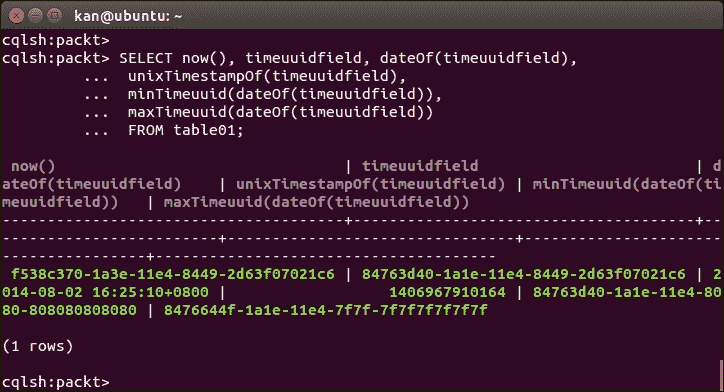

时间 UUID 函数的演示

### 注意

**Timestamp 或 Timeuuid？**

时间戳适合存储日期和时间值。然而，在需要无冲突的唯一时间戳的情况下，时间 UUID 更为合适。

## UUID

`UUID` 数据类型通常用于避免值冲突。它是一个 16 字节的值，接受类型 1 或类型 4 UUID。CQL v3.1.6 或更高版本提供了一个名为 `uuid()` 的函数，可以轻松生成随机的类型 4 UUID 值。

### 注意

**Type 1 或 type 4 UUID？**

Type 1 使用生成 `UUID` 数据类型的计算机的 MAC 地址和自公历采用以来 100 纳秒间隔的数量来生成 UUID。如果 MAC 地址没有重复，则保证跨计算机的唯一性；然而，考虑到现代处理器的速度，同一机器上对类型 1 生成器的简单实现进行连续调用可能会产生相同的 `UUID`，从而否定唯一性的属性。

Type 4 使用随机数或伪随机数。因此，它是推荐的 `UUID` 类型。

## Varchar

基本上，`varchar` 与 `text` 相同，这在源代码中相同的 `UTF8Type` 中可以明显看出。

## Varint

使用 `varint` 数据类型来存储任意精度的整数。

## Counter

`counter` 数据类型是一种特殊的列，其用户可见的值是一个 64 位有符号整数（尽管在内部更为复杂），用于存储一个递增计数特定事件的数值。当向给定的计数器列写入新值时，它会被添加到计数器的上一个值。

计数器非常适合在分布式环境中快速计数，这使得它在实时分析任务中非常有价值。`counter`数据类型是在 Cassandra 0.8 版本中引入的。计数器列表必须使用`counter`数据类型。计数器只能存储在专用表中，并且不能在计数器列上创建索引。

### 小贴士

**计数器类型禁忌**

+   不要将`counter`数据类型分配给作为主键的列

+   不要在包含除`counter`数据类型和主键之外任何内容的表中使用`counter`数据类型

+   不要使用`counter`数据类型为代理键生成顺序号；请使用`timeuuid`数据类型

我们使用`CREATE TABLE`语句创建计数器表。然而，不允许在计数器表上使用`INSERT`语句，因此我们必须使用`UPDATE`语句来更新计数器列，如下面的截图所示。

Cassandra 使用`counter`而不是`name`来表示该列是计数器数据类型。计数器的值存储在该列的值中。

这是一篇非常好的文章，解释了在分布式环境中计数器是如何工作的内部机制。[`www.datastax.com/dev/blog/whats-new-in-cassandra-2-1-a-better-implementation-of-counters`](http://www.datastax.com/dev/blog/whats-new-in-cassandra-2-1-a-better-implementation-of-counters)。

以下截图显示计数器的值存储在列的值中：

计数器数据类型的实验

# 集合

Cassandra 在其数据模型中也支持集合来存储少量数据。集合是一种复杂类型，可以提供极大的灵活性。支持三种集合：Set、List 和 Map。每个集合中存储的数据类型需要定义，例如，时间戳集合定义为`set<timestamp>`，文本列表定义为`list<text>`，包含文本键和文本值的映射定义为`map<text, text>`，等等。此外，集合中只能使用原生数据类型。

Cassandra 读取整个集合，并且集合在内部不进行分页。集合的最大项数是 64K，最大项大小也是 64K。

为了更好地展示这些集合上的 CQL 支持，让我们在`packt`键空间中创建一个表，其中包含每个集合的列，并向其中插入一些数据，如下面的截图所示：

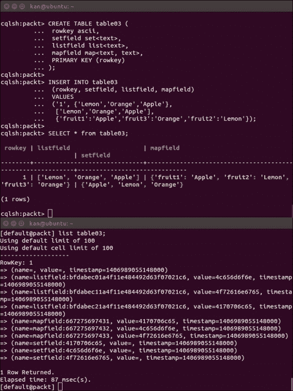

在集合上进行实验

### 注意

**如何更新或删除一个集合？**

CQL 也支持更新和删除集合中的元素。您可以参考 DataStax 文档中的相关信息，网址为[`www.datastax.com/documentation/cql/3.1/cql/cql_using/use_collections_c.html`](http://www.datastax.com/documentation/cql/3.1/cql/cql_using/use_collections_c.html)。

正如原生数据类型的情况一样，让我们逐一介绍以下每个集合。

## 设置

CQL 使用集合来保持唯一元素集合。集合的好处是 Cassandra 会自动跟踪元素的唯一性，我们作为应用程序开发者，无需为此烦恼。

CQL 使用花括号（`{}`）来表示由逗号分隔的值集合。一个空集合简单地表示为`{}`。在先前的例子中，尽管我们以`{'Lemon', 'Orange', 'Apple'}`的形式插入集合，但输入顺序并未保留。为什么？

原因在于 Cassandra 存储集合的机制。内部，Cassandra 将集合的每个元素存储为一个单独的列，其列名是原始列名后跟冒号和元素值。如前所述，`'Apple'`、`'Lemon'`和`'Orange'`的 ASCII 值分别是`0x4170706c65`、`0x4c656d6f6e`和`0x4f72616e6765`。因此，它们被存储在三个列中，列名为`setfield:4170706c65`、`setfield:4c656d6f6e`和`setfield:4f72616e6765`。由于 Cassandra 内置的列名排序特性，集合的元素会自动排序。

## 列表

列表按照所选类型的自然顺序排序。因此，当不需要唯一性且需要保持顺序时，它非常适用。

CQL 使用方括号（`[]`）来表示由逗号分隔的值列表。一个空列表表示为`[]`。与集合不同，Cassandra 会保留列表的输入顺序。Cassandra 也会将列表的每个元素存储为一个列。但这次，列具有相同的名称，由原始列名（在我们的例子中为`listfield`），一个冒号和一个在更新时生成的 UUID 组成。列表的元素值存储在列的值中。

## 映射

Cassandra 中的映射是一个类似于字典的数据结构，具有键和值。当您想在单个 Cassandra 行中存储类似表的数据时，它非常有用。

CQL 也使用花括号（`{}`）来表示由逗号分隔的键值映射。每个键值对由冒号分隔。一个空映射简单地表示为`{}`。可以想象，每个键/值对存储在一个列中，其列名由原始映射列名后跟冒号和该对的键组成。对的值存储在列的值中。类似于集合，映射会自动对其项目进行排序。因此，可以将映射想象为集合和列表的混合体。

# 用户定义类型和元组类型

Cassandra 2.1 引入了对**用户定义类型**（**UDT**）和元组类型的支持。

用户定义的类型在键空间级别声明。用户定义的类型简化了处理一组相关属性。我们可以将一组相关属性定义为一种类型，并单独或作为一个单一实体访问它们。我们可以将我们的 UDTs 映射到应用程序实体。Cassandra 2.1 引入的另一种新类型是元组类型。元组是一个没有标签的、固定长度的类型化位置字段集合。

我们可以在表中使用用户定义和元组类型。然而，为了支持未来的功能，用户定义或元组类型的列定义需要使用`frozen`关键字。Cassandra 将具有多个组件的冻结值序列化为一个单一值。这意味着我们无法更新 UDT 值的部分。整个值必须被覆盖。Cassandra 将冻结 UDT 的值视为一个`BLOB`。

我们在`packt`键空间中创建了一个名为`contact`的 UDT（用户定义类型），并使用它来定义`table04`中的`contactfield`。此外，我们还有一个名为`tuplefield`的列，用于在行中存储一个元组。请注意 UDT 和元组的`INSERT`语句的语法。对于 UDT，我们可能使用点符号来检索 UDT 列的组件，例如在我们下面的例子中的`contactfield.facebook`。如图所示在`cassandra-cli`中，`contactfield`被存储为一个单一值，`00000001620000000163000000076440642e636f6d`。

值按照顺序将每个 UDT 组件以格式连接，格式为一个 4 字节的长度指示组件值的长度，以及组件值本身。因此，对于`contactfield.facebook`，`0x00000001`是长度，`0x62`是字符`'a'`的字节值。Cassandra 对元组也应用相同的处理：

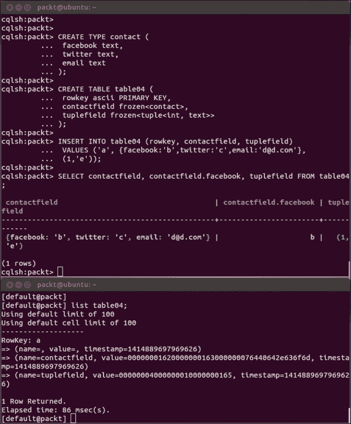

用户定义和元组类型的实验

### 注意

更多信息可以在 DataStax 的文档中找到，文档可通过以下链接获取：[`www.datastax.com/documentation/cql/3.1/cql/cql_using/cqlUseUDT.html`](http://www.datastax.com/documentation/cql/3.1/cql/cql_using/cqlUseUDT.html)

+   [`www.datastax.com/documentation/developer/python-driver/2.1/python-driver/reference/tupleTypes.html`](http://www.datastax.com/documentation/developer/python-driver/2.1/python-driver/reference/tupleTypes.html)

# 摘要

本章是 Cassandra 数据模型的第二部分。我们已经学习了 Cassandra 查询语言（CQL）的基础，它提供了一个类似 SQL 的语言来实现 Cassandra 数据模型并在其中操作数据。然后提供了一个非常详细的说明，包括大量原生数据类型、更高级的集合以及新的用户定义和元组类型的示例，以帮助您了解如何为您的数据模型选择合适的数据类型。还解释了每种数据类型的内部存储，以便您了解 Cassandra 如何实现其数据类型。

在下一章中，我们将学习 Cassandra 查询的另一个重要元素——索引。
