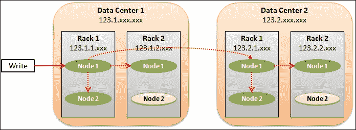
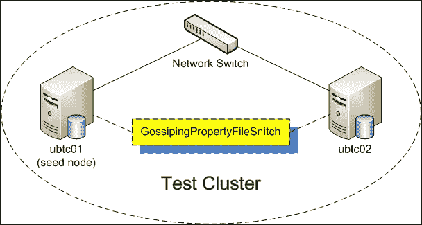
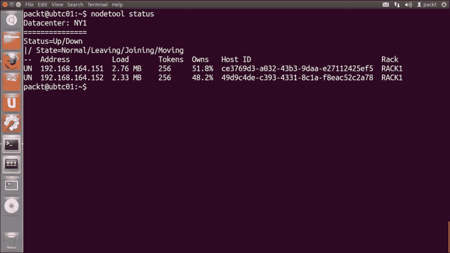
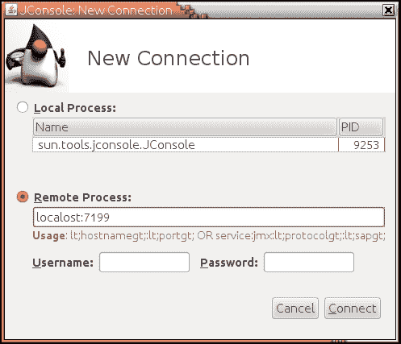
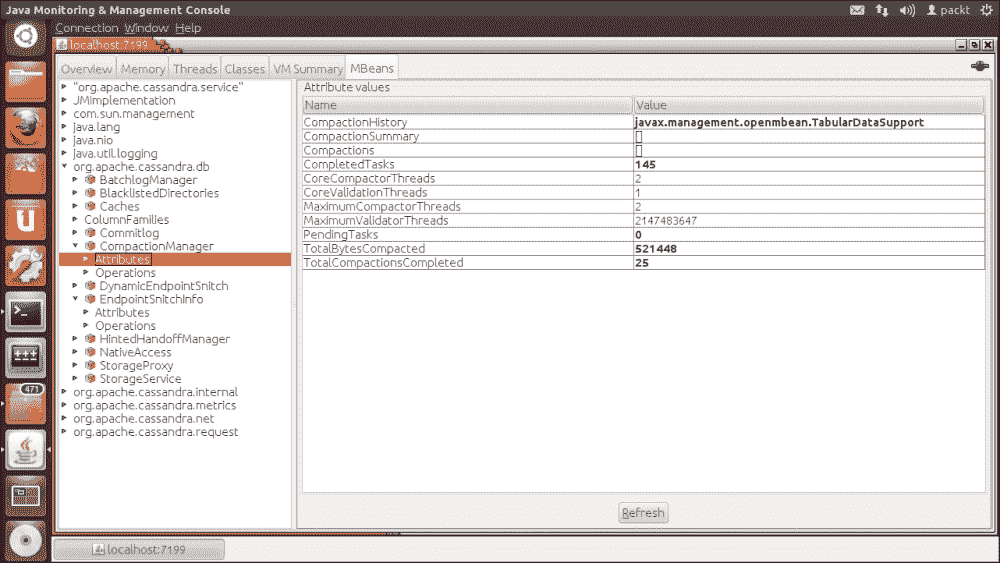
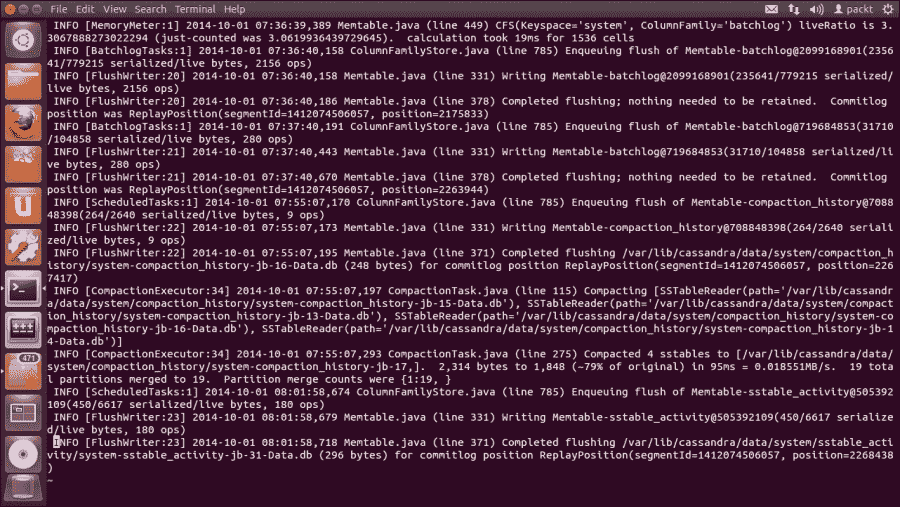
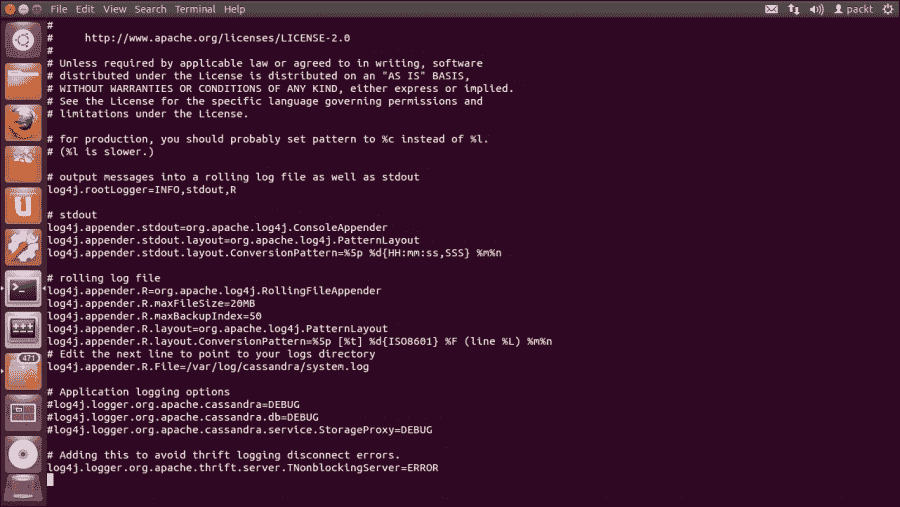
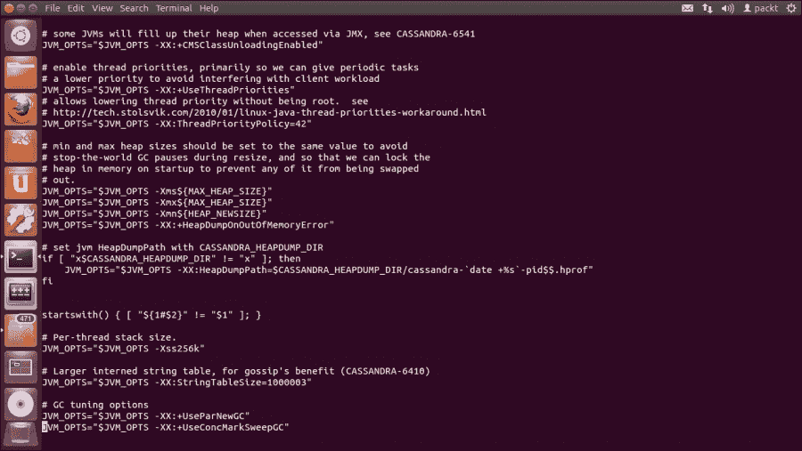
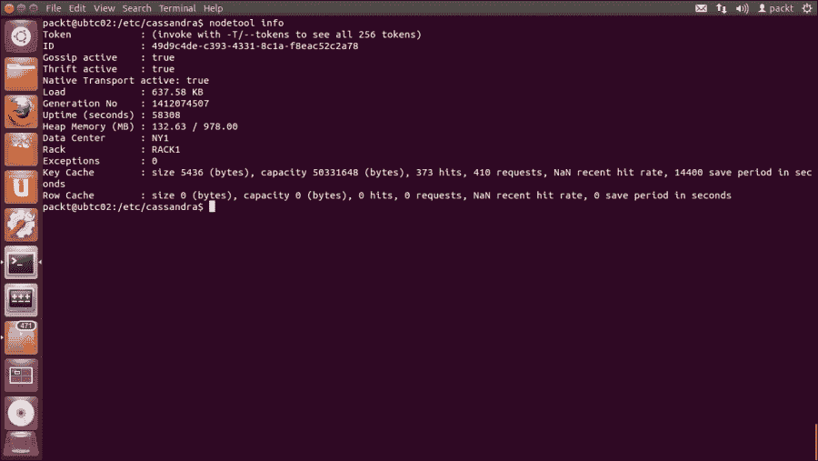

# 第七章：部署和监控

我们在之前的章节中探讨了 Stock Screener 应用程序的开发；现在是时候考虑如何在生产环境中部署它了。在本章中，我们将讨论在生产环境中部署 Cassandra 数据库最重要的方面。这些方面包括选择合适的复制策略、snitch 和复制因子的组合，以形成一个容错性高、高可用的集群。然后我们将演示将 Stock Screener 应用程序的 Cassandra 开发数据库迁移到生产数据库的过程。然而，集群维护超出了本书的范围。

此外，一个持续运行的实时生产系统当然需要对其健康状况进行监控。我们将介绍监控 Cassandra 集群的基本工具和技术，包括 nodetool 实用程序、JMX 和 MBeans 以及系统日志。

最后，我们将探讨除了使用默认设置之外提高 Cassandra 性能的方法。实际上，性能调整可以在多个级别进行，从最低的硬件和系统配置到最高的应用程序编码技术。我们将重点关注**Java 虚拟机**（**JVM**）级别，因为 Cassandra 高度依赖于其底层性能。此外，我们还将涉及如何调整表的缓存。

# 复制策略

本节将介绍 Cassandra 集群的数据复制配置。它将涵盖复制策略、snitch 以及为 Stock Screener 应用程序配置集群。

## 数据复制

Cassandra，按照设计，可以在全球多个数据中心的大型集群中运行。在这样的分布式环境中，网络带宽和延迟必须在架构中给予关键性的考虑，并且需要提前进行仔细规划，否则可能会导致灾难性的后果。最明显的问题就是时钟同步——这是解决可能威胁整个集群数据完整性的交易冲突的真正手段。Cassandra 依赖于底层操作系统平台来提供时钟同步服务。此外，节点在某个时间点高度可能发生故障，集群必须能够抵御这种典型的节点故障。这些问题必须在架构层面进行彻底的考虑。

Cassandra 采用数据复制来应对这些问题，基于使用空间来交换时间的理念。它简单地消耗更多的存储空间来制作数据副本，以最小化在集群中解决之前提到的问题的复杂性。

数据复制是通过所谓的复制因子在 **键空间** 中配置的。复制因子指的是集群中每行数据的总副本数。因此，复制因子为 `1`（如前几章中的示例所示）表示每行数据只有一个副本在单个节点上。对于复制因子为 `2`，每行数据有两个副本在不同的节点上。通常，大多数生产场景中复制因子为 `3` 就足够了。

所有数据副本同等重要。没有主副本或从副本。因此，数据复制没有可扩展性问题。随着更多节点的添加，可以增加复制因子。然而，复制因子不应设置超过集群中的节点数。

Cassandra 的另一个独特特性是它了解集群中节点的物理位置以及它们之间的邻近性。Cassandra 可以通过正确的 IP 地址分配方案配置来了解数据中心和机架的布局。这个设置被称为复制策略，Cassandra 为我们提供了两个选择：`SimpleStrategy` 和 `NetworkTopologyStrategy`。

## SimpleStrategy

`SimpleStrategy` 在单台机器或单个数据中心内的集群中使用。它将第一个副本放置在分区器确定的节点上，然后以顺时针方向将额外的副本放置在下一个节点上，不考虑数据中心和机架的位置。尽管这是创建键空间时的默认复制策略，但如果我们打算拥有多个数据中心，我们应该使用 `NetworkTopologyStrategy`。

## NetworkTopologyStrategy

`NetworkTopologyStrategy` 通过了解集群中节点的 IP 地址来了解数据中心和机架的位置。它通过顺时针机制将副本放置在相同的数据中心，直到达到另一个机架的第一个节点。它试图在不同的机架上放置副本，因为同一机架的节点往往由于电源、网络问题、空调等原因同时失败。

如前所述，Cassandra 通过节点的 IP 地址了解其物理位置。IP 地址到数据中心和机架的映射称为 **snitch**。简单来说，snitch 确定节点属于哪些数据中心和机架。它通过向 Cassandra 提供有关网络拓扑的信息来优化读取操作，以便读取请求可以有效地路由。它还影响副本在考虑数据中心和机架的物理位置时的分布。

根据不同的场景，有各种类型的 snitch 可用，每种都有其优缺点。以下简要描述如下：

+   `SimpleSnitch`: 这仅用于单个数据中心的部署

+   `DynamicSnitch`: 这监控来自不同副本的读操作性能，并根据历史性能选择最佳副本

+   `RackInferringSnitch`: 这通过数据中心和与 IP 地址对应的机架来确定节点的位置

+   `PropertyFileSnitch`: 这通过数据中心和机架确定节点的位置

+   `GossipingPropertyFileSnitch`: 这在添加新节点时使用 gossip 自动更新所有节点

+   `EC2Snitch`: 这与单个区域的 Amazon EC2 一起使用

+   `EC2MultiRegionSnitch`: 这用于跨多个区域的 Amazon EC2

+   `GoogleCloudSnitch`: 这用于跨一个或多个区域的 Google Cloud Platform

+   `CloudstackSnitch`: 这用于 Apache Cloudstack 环境

### 注意

**Snitch 架构**

对于更详细的信息，请参阅 DataStax 制作的文档，[`www.datastax.com/documentation/cassandra/2.1/cassandra/architecture/architectureSnitchesAbout_c.html`](http://www.datastax.com/documentation/cassandra/2.1/cassandra/architecture/architectureSnitchesAbout_c.html)。

以下图展示了使用`RackInferringSnitch`和每个数据中心三个副本因子的四个机架中八个节点的集群示例：



### 提示

集群中的所有节点必须使用相同的 snitch 设置。

让我们先看看**数据中心 1**中的 IP 地址分配。IP 地址是分组并自上而下分配的。**数据中心 1**中的所有节点都在同一个**123.1.0.0**子网中。对于**机架 1**中的节点，它们都在同一个**123.1.1.0**子网中。因此，**机架 1**中的**节点 1**被分配了 IP 地址**123.1.1.1**，而**机架 1**中的**节点 2**是**123.1.1.2**。同样的规则适用于**机架 2**，因此**机架 2**中**节点 1**和**节点 2**的 IP 地址分别是**123.1.2.1**和**123.1.2.2**。对于**数据中心 2**，我们只需将数据中心的子网更改为**123.2.0.0**，然后**数据中心 2**中的机架和节点相应地改变。

`RackInferringSnitch`值得更详细的解释。它假设网络拓扑是通过以下规则正确分配的 IP 地址而知的：

*IP 地址 = <任意八位字节>.<数据中心八位字节>.<机架八位字节>.<节点八位字节>*

IP 地址分配的公式在上一段中显示。有了这种非常结构化的 IP 地址分配，Cassandra 可以理解集群中所有节点的物理位置。

我们还需要了解的是，如图中所示的前三个副本的复制因子。对于具有`NetworkToplogyStrategy`的集群，复制因子是在每个数据中心的基础上设置的。因此，在我们的例子中，三个副本放置在**数据中心 1**，如图中虚线箭头所示。**数据中心 2**是另一个必须有三个副本的数据中心。因此，整个集群中共有六个副本。

我们不会在这里详细说明复制因子、snitch 和复制策略的每一种组合，但我们应该现在理解 Cassandra 如何利用它们来灵活地处理实际生产中的不同集群场景的基础。

## 为股票筛选器应用程序设置集群

让我们回到股票筛选器应用程序。它在第六章，*增强版本*中运行的集群是一个单节点集群。在本节中，我们将设置一个可以用于小规模生产的两个节点集群。我们还将把开发数据库中的现有数据迁移到新的生产集群。需要注意的是，对于仲裁读取/写入，通常最好使用奇数个节点。

### 系统和网络配置

假设操作系统和网络配置的安装和设置步骤已经完成。此外，两个节点都应该安装了新的 Cassandra。两个节点的系统配置相同，如下所示：

+   操作系统：Ubuntu 12.04 LTS 64 位

+   处理器：Intel Core i7-4771 CPU @3.50GHz x 2

+   内存：2 GB

+   硬盘：20 GB

### 全局设置

集群被命名为**Test Cluster**，其中**ubtc01**和**ubtc02**节点位于同一个机架`RACK1`，并且位于同一个数据中心`NY1`。将要设置的集群的逻辑架构如下所示：



为了配置一个 Cassandra 集群，我们需要修改 Cassandra 的主配置文件`cassandra.yaml`中的几个属性。根据 Cassandra 的安装方式，`cassandra.yaml`位于不同的目录中：

+   软件包安装：`/etc/cassandra/`

+   打包安装：`<install_location>/conf/`

首先要做的是为每个节点设置`cassandra.yaml`中的属性。由于两个节点的系统配置相同，以下对`cassandra.yaml`设置的修改与它们相同：

```py
-seeds: ubtc01
listen_address:
rpc_address: 0.0.0.0
endpoint_snitch: GossipingPropertyFileSnitch
auto_bootstrap: false
```

使用`GossipingPropertyFileSnitch`的原因是我们希望 Cassandra 集群在添加新节点时能够自动通过 gossip 协议更新所有节点。

除了`cassandra.yaml`之外，我们还需要修改与`cassandra.yaml`相同位置的`cassandra-rackdc.properties`中的数据中心和机架属性。在我们的例子中，数据中心是`NY1`，机架是`RACK1`，如下所示：

```py
dc=NY1
rack=RACK1
```

### 配置过程

集群的配置流程（参考以下 bash 脚本：`setup_ubtc01.sh` 和 `setup_ubtc02.sh`）如下列举：

1.  停止 Cassandra 服务：

    ```py
    ubtc01:~$ sudo service cassandra stop
    ubtc02:~$ sudo service cassandra stop

    ```

1.  删除系统键空间：

    ```py
    ubtc01:~$ sudo rm -rf /var/lib/cassandra/data/system/*
    ubtc02:~$ sudo rm -rf /var/lib/cassandra/data/system/*

    ```

1.  根据前一小节中指定的全局设置，在两个节点上修改 `cassandra.yaml` 和 `cassandra-rackdc.properties`：

1.  首先启动种子节点 `ubtc01`：

    ```py
    ubtc01:~$ sudo service cassandra start

    ```

1.  然后启动 `ubtc02`：

    ```py
    ubtc02:~$ sudo service cassandra start

    ```

1.  等待一分钟，检查 `ubtc01` 和 `ubtc02` 是否都处于运行状态：

    ```py
    ubtc01:~$ nodetool status

    ```

集群设置成功的结果应类似于以下截图，显示两个节点都处于运行状态：



### 旧数据迁移流程

我们现在有了准备好的集群，但它仍然是空的。我们可以简单地重新运行股票筛选器应用程序来重新下载并填充生产数据库。或者，我们可以将开发单节点集群中收集的历史价格迁移到这个生产集群。在后一种方法中，以下流程可以帮助我们简化数据迁移任务：

1.  在开发数据库中对 `packcdma` 键空间进行快照（ubuntu 是开发机器的主机名）：

    ```py
    ubuntu:~$ nodetool snapshot packtcdma

    ```

1.  记录快照目录，在此示例中，**1412082842986**

1.  为了安全起见，将快照目录下的所有 SSTables 复制到临时位置，例如 `~/temp/`：

    ```py
    ubuntu:~$ mkdir ~/temp/
    ubuntu:~$ mkdir ~/temp/packtcdma/
    ubuntu:~$ mkdir ~/temp/packtcdma/alert_by_date/
    ubuntu:~$ mkdir ~/temp/packtcdma/alertlist/
    ubuntu:~$ mkdir ~/temp/packtcdma/quote/
    ubuntu:~$ mkdir ~/temp/packtcdma/watchlist/
    ubuntu:~$ sudo cp -p /var/lib/cassandra/data/packtcdma/alert_by_date/snapshots/1412082842986/* ~/temp/packtcdma/alert_by_date/
    ubuntu:~$ sudo cp -p /var/lib/cassandra/data/packtcdma/alertlist/snapshots/1412082842986/* ~/temp/packtcdma/alertlist/
    ubuntu:~$ sudo cp -p /var/lib/cassandra/data/packtcdma/quote/snapshots/1412082842986/* ~/temp/packtcdma/quote/
    ubuntu:~$ sudo cp -p /var/lib/cassandra/data/packtcdma/watchlist/snapshots/1412082842986/* ~/temp/packtcdma/watchlist/

    ```

1.  打开 cqlsh 连接到 `ubtc01` 并在 production 集群中创建具有适当复制策略的键空间：

    ```py
    ubuntu:~$ cqlsh ubtc01
    cqlsh> CREATE KEYSPACE packtcdma WITH replication = {'class': 'NetworkTopologyStrategy',  'NY1': '2'};

    ```

1.  创建 `alert_by_date`、`alertlist`、`quote` 和 `watchlist` 表：

    ```py
    cqlsh> CREATE TABLE packtcdma.alert_by_date (
     price_time timestamp,
     symbol varchar,
     signal_price float,
     stock_name varchar,
     PRIMARY KEY (price_time, symbol));
    cqlsh> CREATE TABLE packtcdma.alertlist (
     symbol varchar,
     price_time timestamp,
     signal_price float,
     stock_name varchar,
     PRIMARY KEY (symbol, price_time));
    cqlsh> CREATE TABLE packtcdma.quote (
     symbol varchar,
     price_time timestamp,
     close_price float,
     high_price float,
     low_price float,
     open_price float,
     stock_name varchar,
     volume double,
     PRIMARY KEY (symbol, price_time));
    cqlsh> CREATE TABLE packtcdma.watchlist (
     watch_list_code varchar,
     symbol varchar,
     PRIMARY KEY (watch_list_code, symbol));

    ```

1.  使用 `sstableloader` 工具将 SSTables 重新加载到生产集群中：

    ```py
    ubuntu:~$ cd ~/temp
    ubuntu:~/temp$ sstableloader -d ubtc01 packtcdma/alert_by_date
    ubuntu:~/temp$ sstableloader -d ubtc01 packtcdma/alertlist
    ubuntu:~/temp$ sstableloader -d ubtc01 packtcdma/quote
    ubuntu:~/temp$ sstableloader -d ubtc01 packtcdma/watchlist

    ```

1.  在 `ubtc02` 上检查生产数据库中的旧数据：

    ```py
    cqlsh> select * from packtcdma.alert_by_date;
    cqlsh> select * from packtcdma.alertlist;
    cqlsh> select * from packtcdma.quote;
    cqlsh> select * from packtcdma.watchlist;

    ```

虽然前面的步骤看起来很复杂，但理解它们想要实现的目标并不困难。需要注意的是，我们已经将每个数据中心的复制因子设置为 `2`，以在两个节点上提供数据冗余，如 `CREATE KEYSPACE` 语句所示。如果需要，复制因子可以在将来更改。

### 部署股票筛选器应用程序

由于我们已经设置了生产集群并将旧数据移动到其中，现在是时候部署股票筛选器应用程序了。唯一需要修改的是代码以建立 Cassandra 与生产集群的连接。这使用 Python 非常容易完成。`chapter06_006.py` 中的代码已修改为与生产集群一起工作，作为 `chapter07_001.py`。创建了一个名为 `testcase003()` 的新测试用例来替换 `testcase002()`。为了节省页面，这里没有显示 `chapter07_001.py` 的完整源代码；只描述了 `testcase003()` 函数如下：

```py
# -*- coding: utf-8 -*-
# program: chapter07_001.py

# other functions are not shown for brevity

def testcase003():
    ## create Cassandra instance with multiple nodes
    cluster = Cluster(['ubtc01', 'ubtc02'])

    ## establish Cassandra connection, using local default
    session = cluster.connect('packtcdma')

    start_date = datetime.datetime(2012, 6, 28)
    end_date = datetime.datetime(2013, 9, 28)

    ## load the watch list
    stocks_watched = load_watchlist(session, "WS01")

    for symbol in stocks_watched:
        ## retrieve data
        data = retrieve_data(session, symbol, start_date, end_date)

        ## compute 10-Day SMA
        data = sma(data, 10)

        ## generate the buy-and-hold signals
        alerts = signal_close_higher_than_sma10(data)

        ## save the alert list
        for index, r in alerts.iterrows():
            insert_alert(session, symbol, index, \
                         Decimal(r['close_price']), \
                         r['stock_name'])

    ## close Cassandra connection
    cluster.shutdown()

testcase003()
```

`testcase003()` 函数开头直接传递给集群连接代码的是一个要连接的节点数组（`ubtc01` 和 `ubtc02`）。在这里，我们采用了默认的 `RoundRobinPolicy` 作为连接负载均衡策略。它用于决定如何在集群中所有可能的协调节点之间分配请求。还有许多其他选项，这些选项在驱动程序 API 文档中有描述。

### 注意

**Cassandra 驱动 2.1 文档**

对于 Apache Cassandra 的 Python 驱动 2.1 的完整 API 文档，您可以参考[`datastax.github.io/python-driver/api/index.html`](http://datastax.github.io/python-driver/api/index.html)。

# 监控

随着应用程序系统的上线，我们需要每天监控其健康状况。Cassandra 提供了多种工具来完成这项任务。我们将介绍其中的一些，并附上实用的建议。值得注意的是，每个操作系统也提供了一系列用于监控的工具和实用程序，例如 Linux 上的 `top`、`df`、`du` 和 Windows 上的任务管理器。然而，这些内容超出了本书的范围。

## Nodetool

nodetool 实用工具对我们来说应该不陌生。它是一个命令行界面，用于监控 Cassandra 并执行常规数据库操作。它包括表格、服务器和压缩统计信息的最重要指标，以及其他用于管理的有用命令。

这里列出了最常用的 `nodetool` 选项：

+   `status`：这提供了关于集群的简洁摘要，例如状态、负载和 ID

+   `netstats`：这提供了关于节点的网络信息，重点关注读取修复操作

+   `info`：这提供了包括令牌、磁盘负载、运行时间、Java 堆内存使用、键缓存和行缓存在内的有价值节点信息

+   `tpstats`：这提供了关于 Cassandra 操作每个阶段的活跃、挂起和完成的任务数量的统计信息

+   `cfstats`：这获取一个或多个表的统计信息，例如读写次数和延迟，以及关于 SSTable、memtable、布隆过滤器和大小的指标。

### 注意

nodetool 的详细文档可以参考[`www.datastax.com/documentation/cassandra/2.0/cassandra/tools/toolsNodetool_r.html`](http://www.datastax.com/documentation/cassandra/2.0/cassandra/tools/toolsNodetool_r.html)。

## JMX 和 MBeans

Cassandra 是用 Java 语言编写的，因此它原生支持 **Java 管理扩展**（**JMX**）。我们可以使用符合 JMX 规范的工具 JConsole 来监控 Cassandra。

### 注意

**JConsole**

JConsole 包含在 Sun JDK 5.0 及更高版本中。然而，它消耗了大量的系统资源。建议您在远程机器上运行它，而不是在 Cassandra 节点所在的同一主机上运行。

我们可以通过在终端中输入`jconsole`来启动 JConsole。假设我们想监控本地节点，当**新连接**对话框弹出时，我们在**远程进程**文本框中输入`localhost:7199`（`7199`是 JMX 的端口号），如下面的截图所示：



连接到本地 Cassandra 实例后，我们将看到一个组织良好的 GUI，顶部水平放置了六个单独的标签页，如下面的截图所示：



GUI 标签页的解释如下：

+   **概览**：此部分显示有关 JVM 和监控值的概述信息

+   **内存**：此部分显示有关堆和非堆内存使用情况以及垃圾回收指标的信息

+   **线程**：此部分显示有关线程使用情况的信息

+   **类**：此部分显示有关类加载的信息

+   **虚拟机摘要**：此部分显示有关 JVM 的信息

+   **MBeans**：此部分显示有关特定 Cassandra 指标和操作的信息

此外，Cassandra 为 JConsole 提供了五个 MBeans。以下是它们的简要介绍：

+   `org.apache.cassandra.db`：这包括缓存、表指标和压缩

+   `org.apache.cassandra.internal`：这些是内部服务器操作，如 gossip 和 hinted handoff

+   `org.apache.cassandra.metrics`：这些是 Cassandra 实例的各种指标，如缓存和压缩

+   `org.apache.cassandra.net`：这包括节点间通信，包括 FailureDetector、MessagingService 和 StreamingService

+   `org.apache.cassandra.request`：这些包括与读取、写入和复制操作相关的任务

### 注意

**MBeans**

**托管 Bean（MBean**）是一个 Java 对象，它代表一个可管理的资源，例如在 JVM 中运行的应用程序、服务、组件或设备。它可以用来收集有关性能、资源使用或问题等问题的统计信息，用于获取和设置应用程序配置或属性，以及通知事件，如故障或状态变化。

## 系统日志

最基础但也是最强大的监控工具是 Cassandra 的系统日志。系统日志的默认位置位于`/var/log/cassandra/`下的名为`system.log`的目录中。它只是一个文本文件，可以使用任何文本编辑器查看或编辑。以下截图显示了`system.log`的摘录：



这条日志看起来很长且奇怪。然而，如果你是 Java 开发者并且熟悉标准日志库 Log4j，它就相当简单。Log4j 的美丽之处在于它为我们提供了不同的日志级别，以便我们控制记录在`system.log`中的日志语句的粒度。如图所示，每行的第一个单词是`INFO`，表示这是一条信息日志。其他日志级别选项包括`FATAL`、`ERROR`、`WARN`、`DEBUG`和`TRACE`，从最不详细到最详细。

系统日志在故障排除问题中也非常有价值。我们可能需要将日志级别提高到`DEBUG`或`TRACE`以进行故障排除。然而，在生产 Cassandra 集群中以`DEBUG`或`TRACE`模式运行将显著降低其性能。我们必须非常小心地使用它们。

我们可以通过调整 Cassandra 配置目录中的`log4j-server.properties`文件中的`log4j.rootLogger`属性来更改 Cassandra 的标准日志级别。以下截图展示了 ubtc02 上的`log4j-server.properties`的内容：



需要强调的是，`system.log`和`log4j-server.properties`仅负责单个节点。对于两个节点的集群，我们将在各自的节点上拥有两个`system.log`和两个`log4j-server.properties`。

# 性能调优

性能调优是一个庞大且复杂的话题，本身就可以成为一门完整的课程。我们只能在这简短的章节中触及表面。与上一节中的监控类似，特定于操作系统的性能调优技术超出了本书的范围。

## Java 虚拟机

基于监控工具和系统日志提供的信息，我们可以发现性能调优的机会。我们通常首先关注的是 Java 堆内存和垃圾回收。Cassandra 的环境设置文件`cassandra-env.sh`中控制了 JVM 的配置设置，该文件位于`/etc/cassandra/`目录下。以下截图展示了示例：



基本上，它已经包含了为优化主机系统计算出的样板选项。它还附带了解释，以便我们在遇到实际问题时调整特定的 JVM 参数和 Cassandra 实例的启动选项；否则，这些样板选项不应被更改。

### 注意

在[`www.datastax.com/documentation/cassandra/2.0/cassandra/operations/ops_tune_jvm_c.html`](http://www.datastax.com/documentation/cassandra/2.0/cassandra/operations/ops_tune_jvm_c.html)可以找到有关如何为 Cassandra 调整 JVM 的详细文档。

## 缓存

我们还应该注意的一个领域是缓存。Cassandra 包括集成的缓存并在集群周围分布缓存数据。对于特定于表的缓存，我们将关注分区键缓存和行缓存。

### 分区键缓存

分区键缓存，或简称键缓存，是表的分区索引缓存。使用键缓存可以节省处理器时间和内存。然而，仅启用键缓存会使磁盘活动实际上读取请求的数据行。

### 行缓存

行缓存类似于传统的缓存。当访问行时，整个行会被拉入内存，在需要时从多个 SSTables 合并，并缓存。这可以防止 Cassandra 再次使用磁盘 I/O 检索该行，从而极大地提高读取性能。

当同时配置了行缓存和分区键缓存时，行缓存尽可能返回结果。在行缓存未命中时，分区键缓存可能仍然提供命中，使磁盘查找更加高效。

然而，有一个注意事项。当读取分区时，Cassandra 会缓存该分区的所有行。因此，如果分区很大，或者每次只读取分区的一小部分，行缓存可能并不有利。它很容易被误用，从而导致 JVM 耗尽，导致 Cassandra 失败。这就是为什么行缓存默认是禁用的。

### 注意

我们通常为表启用键缓存或行缓存中的一个，而不是同时启用两者。

### 监控缓存

要么使用`nodetool info`命令，要么使用 JMX MBeans 来提供监控缓存的帮助。我们应该对缓存选项进行小范围的增量调整，然后使用 nodetool 实用程序监控每次更改的效果。以下图中的`nodetool info`命令的最后两行输出包含了`ubtc02`的`Row Cache`和`Key Cache`指标：



在内存消耗过高的情况下，我们可以考虑调整数据缓存。

### 启用/禁用缓存

我们使用 CQL 通过更改表的缓存属性来启用或禁用缓存。例如，我们使用`ALTER TABLE`语句来启用`watchlist`的行缓存：

```py
ALTER TABLE watchlist WITH caching=''ROWS_ONLY'';

```

其他可用的表缓存选项包括`ALL`、`KEYS_ONLY`和`NONE`。它们相当直观，我们在此不逐一介绍。

### 注意

关于数据缓存的更多信息，可以在[`www.datastax.com/documentation/cassandra/2.0/cassandra/operations/ops_configuring_caches_c.html`](http://www.datastax.com/documentation/cassandra/2.0/cassandra/operations/ops_configuring_caches_c.html)找到。

# 摘要

本章重点介绍了将 Cassandra 集群部署到生产环境中的最重要的方面。Cassandra 可以学习理解集群中节点的物理位置，以便智能地管理其可用性、可扩展性和性能。尽管规模较小，我们还是将股票筛选器应用程序部署到了生产环境中。学习如何从非生产环境迁移旧数据对我们来说也很有价值。

然后，我们学习了监控和性能调优的基础知识，这对于一个正在运行的系统来说是必不可少的。如果你有部署其他数据库和系统的经验，你可能会非常欣赏 Cassandra 的整洁和简单。

在下一章中，我们将探讨与应用设计和开发相关的补充信息。我们还将总结每一章的精髓。
