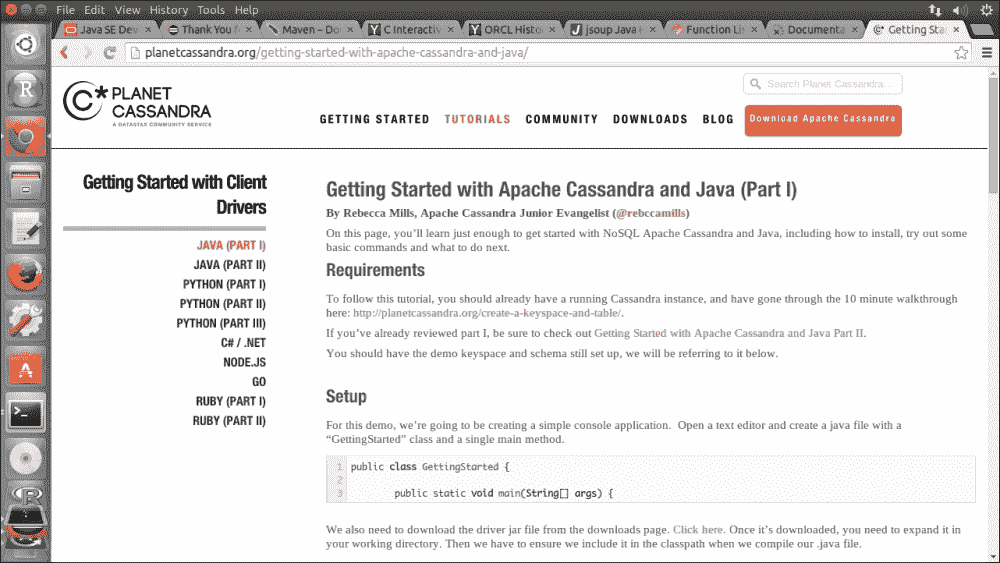
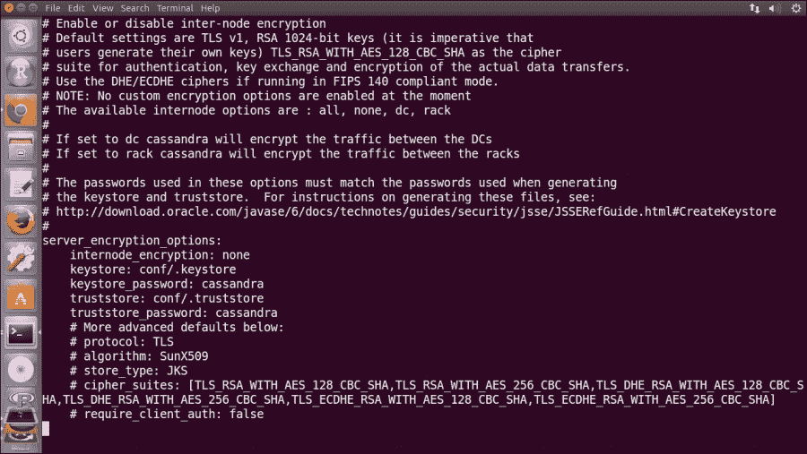
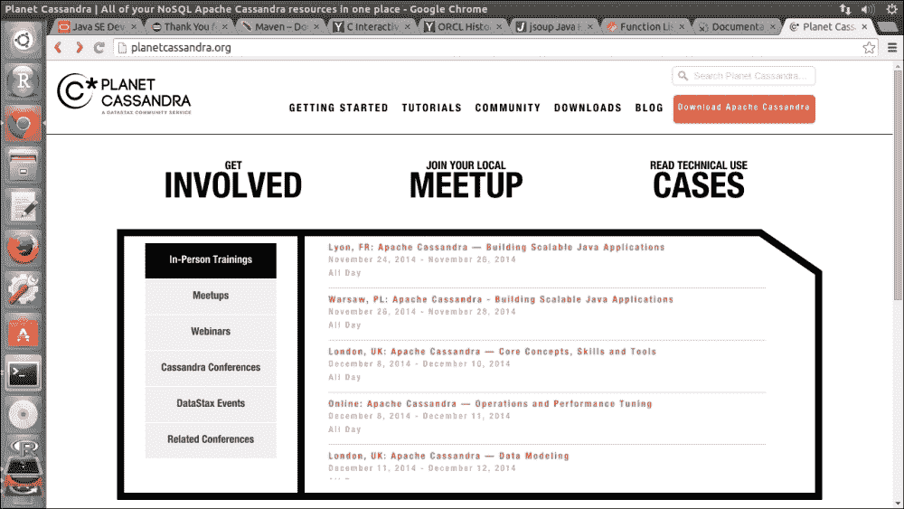
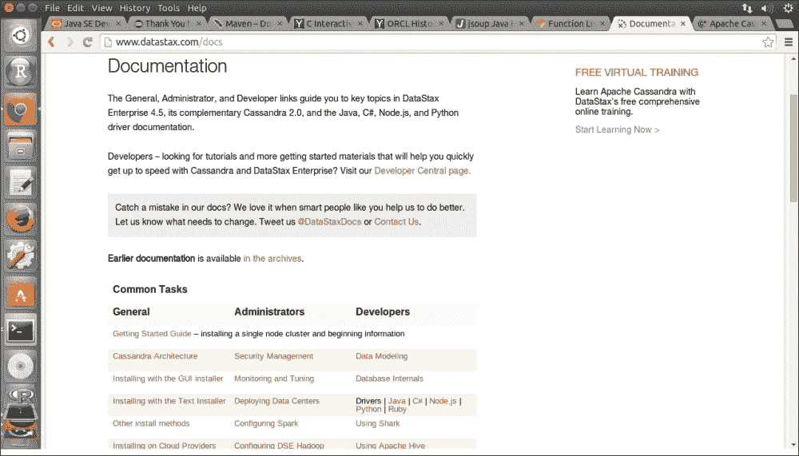

# 第八章. 最后的想法

在前面的章节中，我们快速地经历了一次使用 Python 和 Cassandra 开发技术分析应用程序的过程。我们从理论基础知识开始，逐步设计并开发了一个运行中的应用程序。即使你是计算机编程的新手，也应该能够按顺序阅读这些章节。

现在我们来到了这本书的最后一章。我们将查看与应用程序设计和开发相关的补充信息。然后，我们将快速回顾每一章的基本内容，以便结束这本书。

# 补充信息

在这里，我们将简要查看关于客户端驱动程序、安全功能、备份和恢复的补充信息。

## 客户端驱动程序

驱动程序减轻了应用程序开发者处理与底层数据库通信的重复性、低级繁琐工作的负担。这样，应用程序开发者就可以专注于编写业务逻辑。

由于 Cassandra 越来越受欢迎，因此为现代编程语言开发了驱动程序。这极大地简化了应用程序开发者的工作负担，他们习惯了笨拙的 Thrift API。

### 注意

**不同语言的驱动程序**

可以在 PlanetCassandra [`planetcassandra.org/client-drivers-tools/`](http://planetcassandra.org/client-drivers-tools/) 上看到常用 Cassandra 驱动程序及其对应的支持编程语言的列表。

现在可用的 Cassandra 驱动程序数量仍在增长，其中许多是开源的。如果你真的需要生产支持，那么 DataStax 值得你考虑。

下面提供了一些关于驱动程序选择的评论：

+   首先，要支持的编程语言是单个最重要的约束条件。然后是通信协议。Thrift API 历史悠久，但使用起来相当困难。除非你需要支持与较旧版本的 Cassandra 集群一起工作的应用程序，否则强烈建议使用提供 CQL 支持的驱动程序，这将与本书中介绍的数据建模技术保持一致。数据模型的实现也将变得更加容易。

+   另一个选择因素是驱动程序提供的附加功能，例如节点故障检测、节点故障转移、自动负载均衡和性能。

PlanetCassandra 还提供了关于如何开始使用客户端驱动程序的清晰教程，如下面的截图所示：

## 安全

安全是一个广泛且复杂的话题。从应用程序开发的角度来看，身份验证、授权和节点间加密是最基本的保障生产应用程序的安全措施。

### 身份验证

在 Cassandra 中，认证基于内部控制的登录用户名和密码。登录用户名和密码存储在`system_auth.credentials`表中。内部认证默认是禁用的。我们可以通过修改`cassandra.yaml`来配置 Cassandra 以启用它。我们还需要增加`system_auth`键空间的复制因子，因为`system_auth`键空间与其他键空间没有区别，也可能失败！

一旦启用了内部认证，我们可以使用超级用户账户和诸如`CREATE USER`、`ALTER USER`、`DROP USER`和`LIST USERS`之类的 CQL 语句来创建和管理用户认证。

### 授权

同样，Cassandra 提供了内部授权，与内部认证协同工作。它借鉴了传统数据库的`GRANT`/`REVOKE`范式来管理模式对象的权限。

默认情况下，`system`键空间中的表授予每个认证用户读取权限。对于用户创建的键空间及其内部对象，我们也可以使用 CQL 语句，即`GRANT`、`REVOKE`和`LIST PERMISSIONS`来管理对象权限。

### 节点间加密

Cassandra 提供了节点间加密功能，使用**安全套接字层**（**SSL**）保护集群中节点之间传输的数据，包括 gossip 通信。所有节点都必须在所有节点上拥有所有相关的 SSL 证书。加密可以应用于所有节点、数据中心或机架之间的流量。

我们必须在每个节点的`cassandra.yaml`文件中设置`server_encryption_options`，以启用节点间加密选项以及`keystore`和`truststore`文件的配置设置，如下面的截图所示：

## 备份和恢复

备份是在像 Cassandra 这样的大型分布式系统中一个有趣的话题。数据量可能非常庞大，节点数量也可能很大。对整个集群进行一致的备份可能非常棘手。

在我看来，与传统的数据库必须拥有的定期备份不同，Cassandra 中的备份是可选的。备份 Cassandra 集群的需求实际上取决于选择的部署策略。例如，如果集群的节点分布在像纽约、东京和伦敦这样的地理分散区域，并且复制因子设置为三或更高，那么明确地对集群中的数据进行外部备份可能是有益的。这个示例集群具有内置的弹性，每条数据都有多个副本作为其自身的备份。所有三个地理区域同时失败的可能性相当低。

当然，如果你需要遵守政策、法规等，你可能仍然需要定期备份集群。也许你希望系统有所谓的点时间恢复功能。在这些情况下，托管备份是必不可少的。然而，这肯定会复杂化整个系统架构。

总的来说，这是一个针对你实现的设计决策。

# 有用网站

这里有一些对我们获取最新 Cassandra 信息的有用网站。

## Apache Cassandra 官方站点

官方 Cassandra 网站[`cassandra.apache.org/`](http://cassandra.apache.org/)是获取任何信息的首选之地。最新的发布版本信息可以在其主页上找到。如果你想要深入了解 Cassandra 的内心，或者想要从源代码构建以重新安装 Cassandra 实例，你可能会在那里找到源代码。

就像 Apache 软件基金会下的其他项目一样，我们欢迎你为社区做出贡献。你还可以了解如何加入这个充满热情的开发者团队，以改进这样一个优秀的 NoSQL 数据库。

你还可以找到一个链接到另一个名为 PlanetCassandra 的网站，它值得单独介绍。

## PlanetCassandra

PlanetCassandra，[`planetcassandra.org/`](http://planetcassandra.org/)，是由 DataStax（一家商业公司）支持的社区服务网站，它提供生产就绪的 Apache Cassandra 产品和服务：

这个网站更多地处理 Cassandra 社区的协作方面。我们可以在那里寻找聚会、参与、网络研讨会、会议和活动，甚至还有教育培训课程。网站最有价值的部分是*Apache Cassandra 使用案例*，这是一个运行在 Apache Cassandra 上并从中获得实际益处的公司的仓库。

仓库根据多个维度进行分类，具体包括**产品目录/播放列表**、**推荐/个性化**、**欺诈检测**、**消息传递**、**物联网/传感器数据**和**未定义**。每个仓库条目都有一个名称以及使用案例的公司简介，以及它们如何使用 Cassandra 来推动业务。通过学习这些使用案例，你当然可以学习和产生一些想法。

一定要阅读的案例研究是 Netflix。用例是一个个性化系统，它理解每个人的独特习惯和偏好，并揭示用户可能不知道且不寻找的产品和项目。挑战包括获取经济实惠的容量以存储和处理大量数据，解决 Oracle 遗留的关系型架构的单点故障问题，以及实现国际扩张的业务敏捷性。Netflix 使用了 Cassandra 的商业版本，该版本在多个数据中心提供 100%的可用性和成本效益的扩展。结果是惊人的，如下所示：

+   首先，系统的吞吐量超过每秒 1000 万次交易

+   其次，跨各个区域创建和管理新的数据集群几乎不需要费力

+   最后，Cassandra 可以以最精细的细节捕捉客户查看和日志数据。

非常推荐您阅读此内容，尤其是对于那些考虑从关系型数据库迁移到 Cassandra 的您。

## DataStax

本书使用的 Cassandra 版本是一个开源版本，可以在互联网上免费获取。对于大多数系统来说已经足够好了。然而，许多公司仍在寻找基于 Cassandra 的企业级产品以及相关的支持、培训和咨询服务。DataStax（[`www.datastax.com/`](http://www.datastax.com/)）就是其中之一。

DataStax 致力于编制最全面的 Cassandra 文档，如下面的截图所示。该文档可在其网站上免费获取。它还开发和提供 Java、C#、Python 等客户端驱动程序的支持：

DataStax 提供 Apache Cassandra 的企业版本，称为 DataStax Enterprise，它具有增强的功能，如高级安全和管理工作，这些功能简化了 Cassandra 集群的日常系统管理。

DataStax Enterprise 包括一个强大的企业级系统管理工具，OpsCenter，允许管理员通过仪表板轻松掌握系统的状态和性能。它监控集群并触发集群变化的警报或通知。备份和恢复操作也得到了极大的简化。

DataStax Enterprise 还将 Cassandra 扩展到支持 Apache Hadoop 和 Solr，作为一个集成的企业平台。

## Hadoop 集成

与 Hadoop 集成的 Cassandra 可以成为大数据分析的有力平台。Cassandra 自 0.6 版本以来就能够直接与 Hadoop 集成。它始于对 MapReduce 的支持。从那时起，支持已经显著成熟，现在包括对 Pig 和 Hive 的原生支持。Cassandra 的 Hadoop 支持实现了与**Hadoop 分布式文件系统**（**HDFS**）相同的接口，以实现输入数据局部性。

Cassandra 为 MapReduce 程序提供了`ColumnFamilyInputFormat`和`ColumnFamilyOutputFormat`类，以实现与 Hadoop 的直接集成。这涉及到数据直接从 MapReduce 的 mapper 中读取 Cassandra 列族，并且包括数据移动。

设置和配置涉及在 Cassandra 节点上叠加一个 Hadoop 集群，为 Hadoop JobTracker 配置一个单独的服务器，并在每个 Cassandra 节点上安装 Hadoop TaskTracker 和 DataNode。

### 注意

**设置和配置程序**

将 Cassandra 与 Hadoop 集成的详细步骤可以在以下位置找到：

+   [`www.datastax.com/documentation/cassandra/2.1/cassandra/configuration/configHadoop.html`](http://www.datastax.com/documentation/cassandra/2.1/cassandra/configuration/configHadoop.html)

+   [`wiki.apache.org/cassandra/HadoopSupport`](http://wiki.apache.org/cassandra/HadoopSupport)

Cassandra 数据中心中的节点可以从 HDFS DataNode 以及 Cassandra 中获取数据。JobTracker 从客户端应用程序接收 MapReduce 输入。然后它将 MapReduce 作业请求发送给 TaskTrackers 和可选客户端，例如 MapReduce 和 Pig。数据被写入 Cassandra，结果被发送回客户端。

DataStax 还创建了一种简单的方法来使用 Hadoop 与 Cassandra，并将其集成到企业版本中。

# 摘要

我们从第一章，*Cassandra 概览*开始，回顾 Cassandra 的基本知识。然后我们讨论了 Cassandra 数据建模的重要方面，例如查询技术建模、丰富的数据类型集和索引。这些技术和知识被整合到一个名为 Stock Screener Application 的股票交易领域的数据分析应用示例中。我们详细解释了应用的每一个细节，尽管速度很快。我们还展示了如何通过更改数据模型和编码来增强初版，以展示 Cassandra 提供的巨大灵活性。然后我们转向计划将增强的系统迁移到具有复制策略、snitch、复制因子、基本监控和性能调整工具的生产就绪集群。

我真的很享受为你写这本书，并且真诚地希望，当你在实际项目中快速使用 Cassandra 时，它对你来说像对我一样有用。你的评论总是受欢迎的，你可以通过 Packt Publishing 联系我。

正如温斯顿·丘吉尔爵士所说：

> "现在这并不是结束。这甚至不是结束的开始。但也许，这是开始的结束。"
