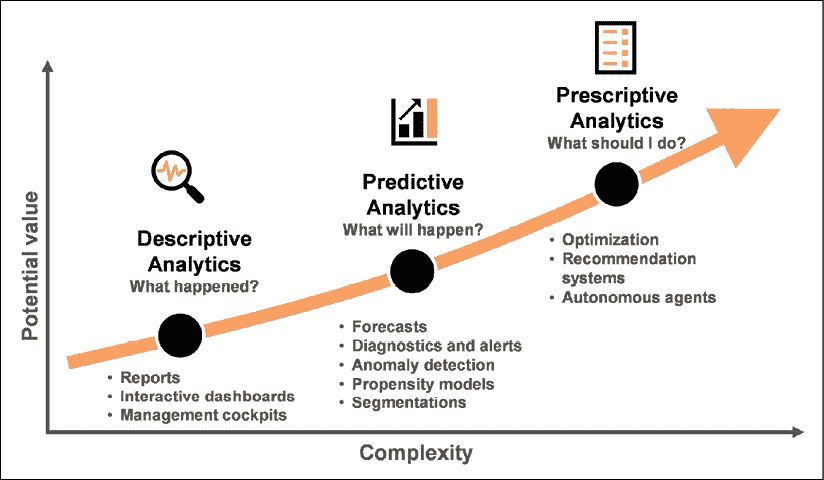
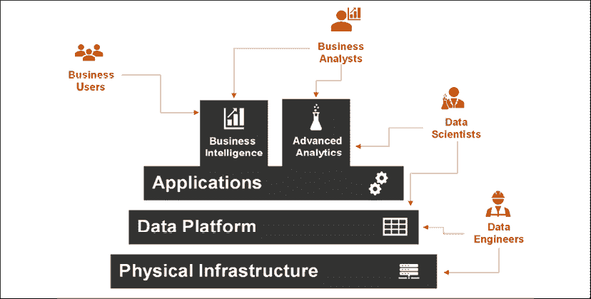
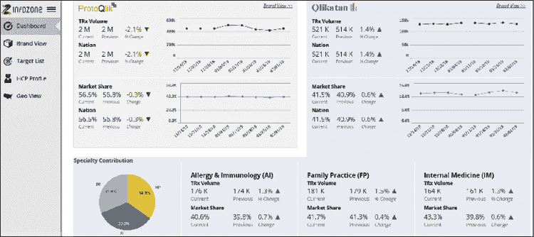
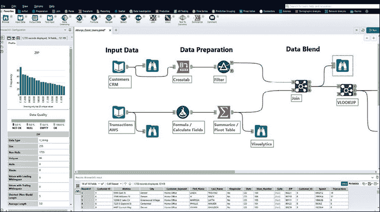
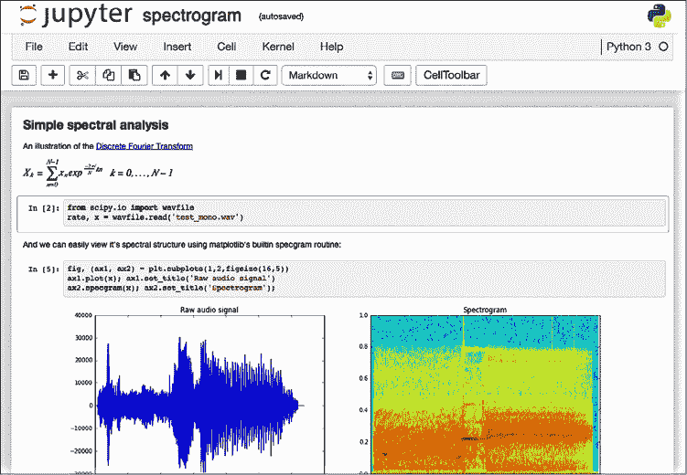
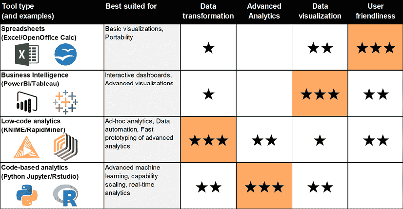
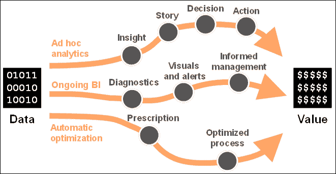

# 第一章：什么是数据分析？

在我们开始穿越这片广阔而令人兴奋的数据分析领域之前，明智的做法是准备一张最新的地图，帮助我们找到正确的道路。在本章中，你将学习所有这些基础概念，帮助你清晰地理解数据分析在公司中的作用。这将使你能够发现利用数据的机会，并决定如何从中提取商业价值。你还希望对该领域采用的命名约定充满信心，以避免任何混淆，并能果断地与他人交流。鉴于当前数据分析的快速发展，在开始深入涉及表格和算法之前，建立坚实的基础概念是一个明智的选择。

具体而言，在本章中，你将找到以下问题的答案：

+   在公司中我们可以找到哪些类型的分析？

+   谁应该设计、维护并使用它们？

+   数据分析需要什么技术才能工作？

+   数据分析工具箱是什么，它包含了什么？

+   数据如何转化为商业价值？

尽管本书的这一部分比其他部分更偏理论，但我向你保证：你遇到的所有概念都是为了帮助你更好地理解你在成为数据分析实践者的过程中将会遇到的内容。现在我们已经准备好出发了；让我们开始吧！

# 三种类型的数据分析

数据分析一词通常指用于从数据中提取某种价值的过程和技术。有时，这个词也指实际用于实现这种转化的工具。无论如何，数据分析代表了*我们如何*将原始数据转化为更具可操作性和价值的东西。我们可以识别出三种不同类型的数据分析，每种类型都有其独特的特点和可能的应用：**描述性分析**、**预测性分析**和**规范性分析**。

## 描述性分析

**描述性分析**是任何分析工作中不可或缺的“基础内容”。这些方法专注于描述过去的数据，使其易于理解并根据业务需求加以利用。它们通过利用总结性统计数据（如平均值、中位数和方差）以及简单的转换和聚合（如指数、计数和总和）来回答通用问题“发生了什么？”，最终通过表格和可视化方式展示结果。描述性分析领域中最具代表性（也是最基础）的交付物是*独立报告*：这可以是以便携格式（PDF 文档和 Excel 工作表最为常见）的文件，定期通过电子邮件分发或发布在共享库中。大多数经理都喜欢报告，因为他们可以在不费吹灰之力的情况下找到所有感兴趣的**关键绩效指标**（**KPIs**）。实际上，他们不需要“去找”任何东西：数据会自动以他们需要的格式呈现出来。描述性分析中的更复杂交付物是*互动仪表板*：在这种情况下，用户通过基于 Web 的界面访问，他们可以在界面中查看感兴趣的数据。可视化和表格将展示最相关的业务方面，而过滤器、选择器和按钮则提供了用户定制数据浏览路径的可能性，让他们深入探索最感兴趣的部分。有时，仪表板会专门设计以取悦高层管理人员，仅关注最重要的 KPIs：这种仪表板被赋予更具画面感的名称——*管理驾驶舱*。如果独立报告为你提供了预设的引导式路线，互动仪表板则让你自己掌控数据的探索过程，允许你走一些不寻常的路径。尽管后者在揭示有价值洞察方面显然具有更大的潜力，但一些不太冒险的经理仍然更喜欢直接将独立报告发送到他们的收件箱。为了同时取悦这两类需求，仪表板可以设置为提供订阅服务：在这种情况下，用户可以注册定期通过电子邮件接收来自仪表板的可视化或表格，或者在数据发生变化时立即收到更新。订阅是一项有前景的功能，因为它避免了更新仪表板和传播报告时的重复劳动。

## 预测分析

**预测性分析**的重点是回答你在了解过去发生了什么之后自然会提出的后续问题，例如：“为什么会发生这种情况？”和“接下来会发生什么？”这些方法论利用了更加复杂的技术，包括人工智能，超越了单纯描述历史事实的层面。通过使用这些方法，我们可以理解数据背后的因果关系，并对其进行外推，展示未来最有可能的样子。预测性分析的最简单示例是**诊断工具**：它们通过基于模型的推理，丰富了传统的描述性报告，揭示了我们在数据中看到现象背后的可能原因。通过使用基本的方法，如相关分析、控制图和统计显著性检验，这些工具能够突出有趣的模式，揭示出商业运行的某些方向。下一层次的复杂性由**业务警报**带来：在这种情况下，诊断检查会自动进行，当某些对业务有影响的情况（例如，某个品牌的市场份额跌破某个阈值）出现时，用户会收到通知。同样，在**异常检测**的情况下，算法会持续检查数据，寻找任何模式中的不一致之处，并将其标记出来，以便进行相应的管理：例如，生产线传感器生成的数据可以用于及早发现故障并触发所需的维护。预测性分析还包括一些方法，这些方法通过生成*预测*，例如销售额、价格、市场规模和风险水平，来预测未来的情况，所有这些都能帮助管理者做出更好的决策，为即将到来的事情做好准备。此外，像消费者和竞争对手等个体的行为也可以被预测出来，从而提供竞争优势，并提高未来活动的**投资回报率**（**ROI**）。在**倾向模型**的案例中，人工智能被用于预测客户对商业报价的喜好程度，或者他们离开我们商店或服务的可能性（流失），这使我们能够调整客户保持活动。预测性分析的另一个例子是，当我们利用数据和算法对业务进行智能*细分*时，例如将相似的客户、商店或产品分组。通过量身定制我们的管理方式，我们可以提高运营效率，让客户体验更加个性化和互动性更强。

## 处方性分析

**规范性分析**通过回答每个业务经理心中的终极问题：“应该做什么？”将数据转化为建议的行动方案。如果描述性和预测性分析为我们提供了洞察并告知我们业务的情况，那么规范性分析无疑更为果断和直接：它告诉我们该做什么。例如，它可以模拟一组大量的备选方案，并在其中实施**系统优化**：其输出将是“最佳方案”，旨在最大化利润或最小化成本，基于当前的条件。其他规范性分析的例子包括所谓的**推荐系统**：本质上，它们为用户提供产品推荐。这些算法几乎无处不在，成为我们日常数字体验的一部分。当我们在亚马逊上购物，或在 Netflix 上犹豫该追哪部电视剧时，我们将看到某些推荐系统的输出，向我们提供一系列我们可能喜欢的有限选项。规范性分析的最终高度是在于不仅仅是推荐该做什么，而且还负责执行这些操作！事实上，当这些系统实时运行时，可能没有任何人能够完全控制或明确批准机器所做出的每一个决策或推荐。在某些情况下，算法被设计成像**自主代理**一样：它们负责通过反复**试错**的过程来学习。它们会不断地在现实世界中测试自己的策略，并根据需要进行调整，其最终目标是长期内最大化回报。这在自动化交易（FinTech 中的一个新兴趋势）和程序化广告（即通过自动竞价实时购买数字媒体）中便是如此。

在你的阅读中，你会发现，作为一种命名约定，描述性分析通常与**商业智能**（Business Intelligence）这一术语相关，而预测性和规范性分析则被称为**高级分析**（Advanced Analytics）。由于这些领域之间没有明确的界限，有时可能会感到困惑——别担心，这是正常的。

在本书的过程中，你将遇到所有类型的数据分析，并将学习如何在你的业务中实现它们。*图 1.1*展示了这些不同类型分析之间潜在价值和复杂性之间的权衡：

图 1.1：数据分析类型——你希望解锁多少价值？

## 数据分析的实践

现在，我们已经掌握了描述性、预测性和规范性分析的基础知识，接下来是看看它们如何在实践中应用。Katia 是一家跨国酒店连锁的**首席数据官**（**CDO**）。让我们看看她是如何总结她们在过去几年中整理的一系列数据分析能力的：

+   董事会成员每月通过电子邮件收到一份 5 页的报告。报告包括分析师准备的简短执行摘要，突出关键要点，并附有按国家、品牌和酒店类型分类的标准表格和 KPI 趋势图表。

+   所有经理都可以访问每周更新的在线仪表板，仪表板上展示了最重要的措施，并且可以深入查看非常详细的数据，比如个别酒店的最新入住率或当前的房价。

+   区域经理订阅了一个警报工具，当某些设施未能按计划达到月度目标时，系统会通知他们。当月度预测低于预期目标的某个阈值时，会自动发送电子邮件。

+   房价由一个名为**AutoPrice**的中央系统动态管理。该系统根据季节性、趋势和网络用户的兴趣，模拟各设施的不同入住率。**AutoPrice** 可以每日调整房价，以最大化利润，前提是预计的销售和成本。

+   参加奖励计划的客户偶尔会收到房间升级或奢华酒店周末度假等特别优惠。一个倾向性模型根据客户的需求调整优惠（控制折扣力度），以最大化奖励兑换和预期利润。

+   每月新闻通讯的订阅者根据他们的社会人口特征和兴趣，被分为四个同质化的群体（商务、家庭、优惠猎人和高端用户）。每期新闻通讯的内容根据不同群体有所不同。每个新订阅者在注册时会自动分配到一个群体。

+   当 COVID-19 大流行爆发时，分析师建立了一个统计模型，以预测各国即将对销售产生的影响，并构建了不同的演变情景。基于此工作，公司制定了一个成功的应对计划，包括临时关闭和裁员、将餐厅改为外卖服务，以及与当地政府合作，将房间转为低护理感染患者使用。

+   在法国推出竞争性连锁酒店后，数字营销团队与数据科学家合作，建立了一个数据驱动的应对计划，旨在加强在风险较大地区的沟通活动，以防流失客户。此外，他们还建立了一个流失模型，向那些最可能转向新竞争对手的会员发送个性化的保留优惠。

我们现在必须停止 Katia，否则她会继续讲下去，甚至还会再写好几页！所有这些例子展示了数据分析在企业中的广泛应用和多样性。它们还给我们提供了机会，观察一些普遍模式，这些模式的价值超出了酒店连锁的案例：

+   三种数据分析类型并不一定是彼此替代的。实际上，它们通常在公司中共存——你不需要“选择”其中之一。例如，尽管你可能已经掌握了一些前瞻性的高级分析技巧，但你仍然会需要持续的描述性分析，比如管理报告或仪表盘。你不能只是“忽略”基础知识，否则你将无法获得其他方面的支持。

+   同一业务的不同方面可能会从三种不同类型的分析中获益。例如，在酒店定价的案例中，你可以报告平均房价（描述性分析），也可以基于不同价格预测情景（预测性分析），或是自动设置最佳房价（规范性分析）。每个业务方面都有机会应用不同类型的分析。

+   不同类型的分析可以部分重叠并交叉丰富。例如，在管理仪表盘（描述性分析）中，我们可能会根据酒店是否能达到年度目标的可能性（预测性分析）添加不同的颜色编码。

+   通过数据分析创造价值的一些机会是临时性的，依赖于特定的偶发情况：例如 COVID-19 模型和对竞争性举措的响应。其他则是持续性和系统性的，例如定期的报告和仪表盘更新，或实时的价格优化。数据分析既能为临时情况带来价值，也能为持续性的情况提供帮助。

借助这个例子，我们现在更加清楚地了解了三种不同级别分析的具体样貌。在继续讨论下一个话题之前，值得思考一下商业智能（描述性分析）与高级分析（预测性和规范性分析）在业务影响上的差异，如*表 1.1*所总结的：

| 方面 | 描述性分析（商业智能） | 预测性/规范性分析（高级分析） |
| --- | --- | --- |
| 用户群体 | 广泛 | 限定 |
| 实施复杂度 | 低 | 高 |
| 管理层所需信任度 | 低 | 高 |
| 潜在价值 | 低 | 高 |

表 1.1：不同分析方法的业务影响

描述性分析往往有广泛的潜在用户群体。相同的仪表板和报告可以对公司内不同级别的同事、业务部门和职能单位都有用。实际上，公司中普遍的一个感觉是“数据在那儿，但不知道在哪里”：数据可以通过强大的商业智能产品进行民主化，能够释放其更多的价值。考虑到这些能力潜在的用户群体广度，值得为“普遍”部署活动做好规划，以便每个人都有机会成为用户，并最大化该能力对业务的影响。通常，仪表板在长时间内未被充分利用，或者干脆被遗忘，因为人们不知道如何使用它们：定期培训的一个更大原因就是确保它们对每个人都能保持可访问，包括新员工。

毫无疑问，设计和实施预测性与规范性分析的复杂度高于描述性分析。你将需要熟练的业务分析师和数据科学家（我们将在接下来的几页中讨论角色），原型设计、部署和扩展所需的时间通常也更多。因此，采用敏捷和迭代的方式是值得的，这样可以逐步释放增量价值，并避免失去势头和利益相关者的热情。

高级分析在公司内部更难被接受，需要高级管理层的更有决断力的支持才能顺利进行。想想看：描述性分析通过告知人们发生了什么，帮助做出更好的决策。另一方面，规范性分析则直接告诉你可以做出的最佳决策，这可能会限制管理者凭直觉指导业务的能力。那些“掌控”决策的算法需要比普通报告更高的信任才能被接受。你越是向高级分析进展，就越需要涉及高层管理并让他们支持这一转型。这将抵消人们天生的“保护”自己角色和权力的倾向，抵御所有威胁，包括那些自信地规范决策的算法。

就像生活中的大多数事情一样，你得到的就是你付出的。高级分析更复杂，需要更多的管理关注，但它所能释放的潜在价值要高于描述性分析。我的建议是寻找机会，逐步提升分析的角色，把你的能力发展方向推向分析阶梯的高级端。同时，你也不想“忘记”赋能更多同事通过描述性分析实现更智能的业务管理，借助数据的民主化访问。

# 谁参与数据分析？

本节标题的简短回答也是最明显的：每个人在数据分析中都有一份职责——没有人被排除在外！事实上，所有的知识工作者无疑都会在工作中处理数据：他们以某种方式与数据分析互动，可能仅仅作为被动用户，也可能是参与的另一端，作为数据能力的主要创造者和拥有者。我们可以将与数据分析相关的角色分为四个类别：**业务用户**、**业务分析师**、**数据科学家**和**数据工程师**。让我们深入了解每个角色的含义以及它所需要的能力：

| 角色 | 垂直业务知识 | 数据分析与讲故事 | 机器学习算法 | 编程 | 数据架构 |
| --- | --- | --- | --- | --- | --- |
| 业务用户 | `★``★``★` | `★` | `★` |  |  |
| 业务分析师 | `★``★` | `★``★``★` | `★``★` | `★` |  |
| 数据科学家 |  | `★` | `★``★``★` | `★ ★ ★` | `★` |
| 数据工程师 |  |  | `★``★` | `★ ★` | `★``★``★` |

表 1.2：不同用户的能力

+   **业务用户**无论职能和级别如何，包括高级经理，肯定都会在某种程度上与数据分析互动。尽管他们的主要角色是作为用户，他们将极大受益于对数据分析和讲故事技巧的基本理解。这些技能将帮助业务用户最大化地利用数据，将其与自己的业务知识结合，正确解读数据，并通过有效的可视化和讲故事来传达洞察。此外，了解如何使用 Excel 中的宏或稍后我们会学习的 KNIME 中的工作流来自动化日常“数据处理”工作，也会积极影响他们的个人生产力。最后，他们应该对高级分析能为他们做什么有基本的理解，并掌握机器学习及其算法的基本概念。他们显然不需要成为专家。然而，直到他们看到“可能性”，否则他们就无法预见到如何利用数据来影响业务的机会。

+   **业务分析师**（或数据分析师）在将看似脱节的业务和数据两个领域连接起来方面发挥着根本作用。他们对业务动态（市场、客户和竞争格局）有着非常扎实的理解，因为他们与来自各个职能部门（销售、营销、财务等）的合作伙伴保持着密切联系。凭借强大的业务背景，他们能够主动捕捉分析机会，为业务带来改变，并将业务需求“转化”为下一步数据能力所需的技术要求。业务分析师精通数据分析（因为他们需要不断“剥洋葱”并从大量数据中提取业务相关的洞察）和故事讲述（因为他们希望他们的数据发现能够产生强烈的影响并推动行动）。与此同时，他们熟悉机器学习概念：他们将直接使用这些概念来解决业务需求，同时也会在将这些能力交给数据科学家进行扩展之前，进行高级分析能力的原型设计。尽管这不是他们工作中的严格要求，也不是重点，但具备基本的编程能力可以帮助他们构建数据提取查询并解开更繁琐的数据转换步骤。

+   **数据科学家**专注于设计和扩展高级分析能力。他们是公认的机器学习算法专家，能够从头开始实施预测性和指引性分析，或在现有原型基础上进行构建。他们与业务分析师紧密合作，通过业务分析师保持与“最新”业务需求的联系，并与数据工程师合作，这是确保数据能力可持续性和扩展性的主要伙伴。数据科学家精通编程，尤其擅长对数据应用高级转换，并利用最先进的机器学习库。

数据科学是一个跨学科领域，涉及数学、统计学和计算机科学，研究如何系统地从数据中提取价值。每个人——不仅仅是数据科学家——都能从使用数据科学的某些方面中受益。

+   **数据工程师**（以及相关岗位，如系统工程师和数据架构师）通过处理底层数据基础设施的技术复杂性，确保分析系统的正常运行。数据工程师的工作对构建稳定的数据管道并维护其持续可用至关重要。他们与数据科学家合作——以适当配置存储和计算资源，并设计合适的数据架构——并与其他**信息技术**（**IT**）职能部门合作，确保跨企业系统的兼容性，并确保信息安全达到可接受的标准。

这四个角色，每个都有自己特定的任务，将共同覆盖公司中与数据分析的大多数交互。无论你与哪一角色更为接近，你肯定有一个在从数据中提取价值的角色。在下一部分，你将了解一些能够帮助你发挥最佳表现的工具。

# 数据分析技术

赋能公司数据分析的技术并不是一个单一的整体。实际上，涉及了多个硬件和软件系统。为了简化，你可以将它们看作是分为三层：这些层次彼此堆叠，形成了所谓的**技术栈**。每一层都依赖于下面的层次才能正常工作。让我们从下往上以“直升机视角”了解每一层的基本特点：

+   底层是**物理基础设施**。这部分是你可以触摸到的东西。它由存储和处理数据的服务器或大型主机计算机组成。公司可以选择自己构建并维护一套物理基础设施（通常保存在企业的*数据中心*），或者依赖于*云服务提供商*，从他们那里租赁所需的资源。

+   中间层是**数据平台**。该层的技术实现了存储在基础设施中的数据（*数据架构*）和可用计算能力的逻辑组织。即使数据存储在不同的数据库中，在平台层，它会被虚拟地统一，呈现出一个更简洁、更和谐的视图。

+   最上层由**应用程序**组成。此处是数据分析方法被实现到用户界面应用中的地方。应用程序利用有序的数据和底层平台提供的计算能力，以不同方式服务用户。有些应用程序将为用户提供探索数据、理解数据和识别洞察的接口（*商业智能*）；其他应用程序将使专家用户能够将其推向更高层次，构建预测或建议（*高级分析*）。

这个三层栈模型无疑是对现实世界数据基础设施的多面性简化。然而，它给我们带来了一个好处，即能够一次性地展现数据可能具有的不同抽象层次，并引入了随之而来的若干挑战：

图 1.2：支持数据分析的技术栈。箭头说明了哪些角色与技术栈的哪些层进行交互

我们之前看到的四个角色将在技术堆栈的不同层次上“操作”。数据工程师将处理数据基础设施的复杂性及其在平台中的组织方式。数据科学家通常会利用先进分析应用来构建模型，有时会直接在平台层级访问数据，以享受最大灵活性。商业分析师将轻松使用高级分析工具和商业智能应用，这些工具也可以用来为他人设计可操作的数据探索路径。商业用户则只与易于使用的商业智能界面互动：与数据存储及其在平台中的组织相关的所有复杂性将被巧妙地远离他们的视野。

# 数据分析工具箱

在所有与数据分析相关的技术中，本书将重点关注应用层。这是“魔法”发生的地方：分析应用能够将数据转化为实际的商业价值，在接下来的章节中，你将学习如何实现这一点。

市面上有许多数据分析应用可供使用。每个应用都有其优点和特点。尽管有些应用非常多功能，但没有任何一个应用可以满足我们在工作中可能遇到的所有分析需求。因此，我们应该挑选一系列工具，它们将共同覆盖一个可接受的需求范围：这些工具构成了我们的**数据分析工具箱**。通过学习如何使用和有效结合我们放入工具箱中的少数工具，我们可以成为自主的数据分析实践者。就像管道工对使用的工具有个人偏好一样，你也会有自己的喜好，并且可以根据个人口味定制你的工具箱。你只需确保挑选出合适的工具组合，以便随时获得广泛的功能。

让我们逐一了解哪些工具符合添加到工具箱中的条件：

+   **电子表格**：尽管它们的分析能力相当有限，但由于其易用性和广泛的可移植性，电子表格应用几乎无处不在，便于与同事共享数据。几乎每个人都能够打开一个*Microsoft Excel* 文件（或其开源替代品 *OpenOffice Calc*，或基于云的服务如 *Google Sheets*），并添加简单的公式计算。它们在创建简单的、一次性的数据显示时也非常有帮助：其图形定制化的程度足够应对许多日常数据呈现需求。另一方面，电子表格软件不足以创建强大和自动化的数据工作流：即使是一个简单的 Excel 报告，刷新也需要手动步骤，并容易出现人为错误。

+   **商业智能**：这些工具最适合用于创建高级数据可视化和交互式仪表盘。像*Microsoft Power BI*、*QlikView/Qlik Sense*、*Tableau* 和 *TIBCO Spotfire* 这样的工具可以帮助你实现用户友好的数据应用，目的是让数据民主化并使其为大众所用。它们提供了丰富的可视化选项，并可以将图表关联起来，从而实现引导式的数据探索体验。尽管其中一些工具已经实现了算法，但高级分析并不是它们的强项：它们更适合用于大规模实施描述性分析:

图 1.3：使用 Qlik Sense 构建的仪表盘 – 左侧的导航窗格引导你通过不同的可视化方面

+   **低代码分析**：这些工具使你能够在不编写代码的情况下快速构建高级分析工作流。它们的“秘诀”是基于工作流的用户界面：通过构建由逐步数据转换步骤和可定制建模模块组成的流程图，你可以在创纪录的时间内构建一个完全可操作的分析应用程序。由于其直观的界面和不需要编码的特点，像*KNIME*、*RapidMiner* 和 *Alteryx Designer* 这样的工具可以被专家数据专业人士（如数据科学家和业务分析师，用于快速原型化高级功能）以及非数据专业的知识工作者（寻求自动化其繁琐、定期的数据报告活动）使用:

图 1.4：Alteryx Designer 的用户界面 – 每个图标都是数据流中的一个转换步骤

+   **基于代码的分析**：最传统的高级分析方法是使用数据科学友好的编程语言（如 Python、R 和 Scala）编写代码。考虑到这些语言中有大量的机器学习库，数据科学家可以利用它们构建高度定制化和高效的分析解决方案。这些解决方案可以嵌入实时应用中，并根据需要在公司范围内扩展。为了实现这一点，数据专业人士会使用**集成开发环境**（**IDEs**），如 R 的 RStudio 和 Python 的 Jupyter Notebook、Visual Studio 或 PyCharm:

图 1.5：Jupyter Notebook 的截图 – 你可以通过 Web 界面运行 Python 代码

你不应该把这四种类型的分析看作是互相排斥的选择。实际上，正好相反——它们各自有互补的优点和缺点，并能优雅地融合在一起。让我们来看一个例子：Laura 是一个为汽车制造商工作的供应链数据分析师。她需要迅速构建一个能够预测生产线级别零部件未来需求的能力，并将结果提供给全球的多个采购分析师和工厂经理。Laura 决定在 KNIME 中构建一个工作流，该工作流从几个企业数据库中提取历史需求数据，并将其与库存实际情况结合。在初步探索阶段之后，Laura 使用 KNIME 的本地功能构建了一个需求预测模型，随后通过向 KNIME 中直接添加一些自定义的 Python 代码来优化该模型。之后，Laura 完成了工作流的最后清理步骤，并将预测结果直接导出到 Power BI 数据集中。最后，Laura 在 Power BI 中构建了一个简单的仪表盘，里面包含几个表格和简单的折线图，使最终用户能够探索数据、根据他们的兴趣区域进行筛选，并将数据导出到一个方便的 Excel 文件中，以便进一步分析和共享。

Laura 能够迅速完成这项伟大的工作，因为她使用了整个分析工具箱，其中包括 KNIME、Power BI 和一点 Python。她通过发挥这些工具的优势，巧妙地选择了合适的工具来满足她的特定需求。如果没有一个多功能的工具箱，Laura 很难满足她业务案例所要求的严格时间要求。

Laura 的故事生动地证明了建立一个多功能数据分析工具箱的必要性：无论你的角色是什么，拥有一套互补的工具来转换、丰富、建模和可视化数据，都会在日常的数据需求中给你带来优势。

在本书的其余部分，我将为你提供一个预构建的“工具包”，其中包含一组选用的工具，它们能够很好地协同工作：KNIME 和 Power BI。这些工具有多个优点。首先，它们可以免费下载并安装到你的计算机上。虽然两者都提供付费版本，但你会发现免费版本提供的功能已足够满足大多数日常需求。另一个优点是，它们都不需要严格的编程技能。这意味着，你可以充分利用这个工具包，而不必成为熟练的 Python 或 R 程序员，这使得它成为适用于所有使用数据的专业人士的工具包，而不仅仅是专家级的数据科学家。对于那些懂得编程的人来说，可以通过集成代码片段进一步扩展这个工具包，就像 Laura 在她的项目中做的那样。最后，KNIME 和 Power BI 特别适合相互配合使用。如果你查看*图 1.6*，它们共同覆盖了你可能遇到的大部分需求，从数据自动化和高级机器学习到专业的数据可视化和仪表盘：

图 1.6：多个数据分析工具的比较——一刀切的方式并不适用

在我们开始构建数据分析工具箱之前，让我们先了解一下如何从中创造实际价值的各种方式。

# 从数据到商业价值

数据本身没有价值，除非它能够转化为价值。无论我们的模型多么复杂和准确，无论我们揭示了多少深刻的见解，数据只有在最终推动一些能够积极影响业务的行动时，才能产生真正的影响。坏消息是，推动行动可能相当复杂，往往比构建强大的数据能力更具挑战性。好消息是，我们不仅有一种，而是有多种方法可以通过分析影响业务：我们称之为**数据到价值的路径**。在我们开始处理数据之前，明确这些路径非常重要，这样我们从一开始就能最大化我们所构建的内容对业务的相关性。你在商业中最常遇到的三种数据到价值的路径是：

+   **临时分析**：在这种情况下，你利用数据来影响特定决策，或揭示一个独特的机会或威胁。这是最耗时的路径，因为它肯定需要大量的人际互动，但也可能带来极大的回报。通过数据探索，并在必要时利用一些预测算法，你的起点是从数据中发现隐藏的洞察力。为了最大化其影响机会，你会构建一个引人入胜的故事，使决策者愿意与你一起做出正确决策，进而付诸实践。只有当（如果）这个决策付诸实践并转化为行动时，你才能凭借数据分析主张经济价值。许多有价值的数据发现从未得到实现，因为沿途的一些步骤失败了。有时，故事没有准备好或没有有效传递，使得一个好的建议无人问津。其他情况下，基于数据的计划没有得到执行，因为它们没有被充分解释或跟踪。在本书的剩余部分，你将学到如何最大化你的临时分析转化为实际价值的机会。

+   **持续商业智能**：当你走这条路径时，你的目标是系统性地为管理者提供相关信息，帮助他们更好地完成工作，从而最大化他们工作的价值。通过描述性分析，并在必要时使用一些诊断算法，你通过可视化和警报使数据“清晰响亮”地表达出来。通过数据分析为他人提供帮助，你能推动更好的行动，从而为企业创造增量价值。这条数据到价值的路径可能不如其他路径复杂，但它具备巨大的价值创造潜力，因为它能够持续影响许多人的工作。书中的后续部分，你将学习如何最大化数据能力，以支持持续的商业智能。

+   **自动优化**：当你走这条路径时，你使用规范性分析来获得一项行动计划，并自动执行。此时，数据和算法并不是在为他人提供信息或推荐行动方案，而是被放在驾驶席上，能够掌控业务流程的执行。其潜在收益巨大，因为算法可以不断优化公司运营的表现，且无需人工干预，或者仅需一些适度的监督：

图 1.7：数据到价值的三条最常见路径——你将首先选择哪一条？

在每个案例中，识别我们要追求的数据到价值路径将是至关重要的。根据我们选择的路线，可能需要实施某种类型的数据分析，并从我们的工具箱中选择特定的工具。无论如何，明确我们希望如何为企业创造价值，将最大化成功的机会。

# 概述

本章为你提供了开始数据分析实践所需的所有背景知识。我们了解了三种分析类型（描述性分析、预测性分析和规范性分析）之间的差异，并认识到每种分析背后潜在的价值。我们意识到几乎公司中的每个人都能从使用数据分析中受益，并熟悉了商业用户、分析师、数据科学家和工程师所需的不同角色和技能。我们窥见了实现数据分析所需的完整技术栈的复杂性：特别是，我们了解了数据分析从业人员应该随时在工具箱中准备的工具，突出了 KNIME/Power BI 的组合价值。最后，我们区分了数据转化为实际商业价值的几种路径。

我希望最后几页的内容进一步让你相信数据中隐藏的巨大商业潜力。现在是时候亲自动手了，在下一章中，我们将遇到我们的宝贵旅行伙伴——KNIME，带你穿越分析的土地。
