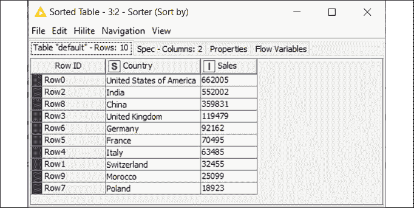

# 第二章：开始使用 KNIME

现在是时候亲自接触数据了，让我们揭开 KNIME 的面纱，这是我们数据分析工具包中的第一个工具。本章将向你介绍任何低代码分析平台的基础功能，并帮助你开始进行每个数据分析项目初期的普遍需求：加载和清洗数据。

让我们来看看本章旨在回答的问题：

+   什么是 KNIME，我在哪里可以下载它？

+   什么是节点，它们是如何工作的？

+   数据工作流是什么样的？

+   如何在 KNIME 中加载数据并清洗它？

这将是一次非常实践性的入门，帮助你了解数据分析的日常操作。由于我们会花一些时间使用 KNIME，因此首先了解一些它的基础知识是值得的。

KNIME（/na�m/）的发音类似于单词*knife*，不过结尾是*m*而不是*f*。

# KNIME 简介

**KNIME** 是一个低代码数据分析平台，以其易用性和多功能性著称。让我们一起来看看它最突出的特点：

+   KNIME 允许**可视化设计**数据分析：这意味着你可以通过简单的绘制来构建数据转换和建模步骤。就像你用铅笔和纸画出流程图来描述一个过程一样，使用 KNIME 时，你将用鼠标和键盘来描绘你想对数据做什么。这与基于代码的分析环境的做法有本质的区别：使用像 KNIME 这样的工具意味着你不需要写一行代码，除非你愿意。可视化的方法还让你清晰地看到数据在每一步操作中的变化。这使得即使是复杂的过程也变得直观易懂，并且更容易构建。对于像数据科学家这样的高级数据从业者来说，这意味着节省了大量调试原型的时间，因为他们可以轻松发现问题所在。对于需要进行数据分析的业务用户，KNIME 提供了一个非常友好的环境，适合任何想要从零开始学习的人。

+   它是**开源**的，且免费使用：你可以免费下载完整版本并安装到你的电脑上，不需要任何费用。与其他产品的试用版不同，它提供了完整的数据分析功能集，没有任何限制或时间约束。为了完整性说明：KNIME 还提供了商业产品（称为**KNIME Server**），它可以实现工作流的全面操作化，将其转化为实时应用和服务，但在我们的学习过程中不需要使用这些功能。

+   它提供了丰富的**附加包**库，用于扩展其基础功能。这些扩展包大多数情况下是免费的。某些扩展包允许你将 KNIME 与云平台（如 Amazon Web Services 或 Microsoft Azure）连接，访问其他应用（如 Twitter 或 Google Analytics 等），或者执行特定类型的高级分析（如文本挖掘或深度学习）。某些包甚至允许你在 KNIME 中添加 Python 或 R 代码，以便你可以实现它们广泛库中提供的最具体和最复杂的功能。这意味着，如果你会编程，你可以在 KNIME 中利用这项技能。好消息是——在绝大多数情况下——你根本不需要这样做！

+   最后，全球有一个广泛而**不断壮大的社区**，由 KNIME 的用户组成。这使得你更容易找到充满示例的博客和论坛（如 KNIME 官方论坛，[forum.knime.com](http://forum.knime.com)）、教程以及对你可能遇到的常见问题的答案。慷慨的 KNIME 用户还可以与其他社区成员分享一些现成的模块，以便其他人复制它们：这进一步丰富了在需要时可用的功能。

所有这些功能使得 KNIME 成为一款包罗万象的工具，以至于有些人将其称为数据分析的**瑞士军刀**。无论我们给它什么绰号，KNIME 都非常适合用于学习和实践日常分析，绝对是一款值得加入我们工具箱的工具。

现在是时候让 KNIME 在你的计算机上运行起来了：你可以从官网[www.knime.com](http://www.knime.com)下载它。只需进入**下载**页面，开始为你的操作系统安装（KNIME 支持 Windows、Unix 和 Mac）。安装完成后，打开应用程序。在首次运行时，你可能需要确认**工作区**的位置；这将是你所有项目保存的文件夹。在确认工作区文件夹后（你可以选择任何你喜欢的位置），你就可以开始使用了：KNIME 的界面将欢迎你。

# 在 KNIME 中移动

当我们进入 KNIME 的世界时，熟悉我们将最常用的两个关键词是很有意义的：**节点**和**工作流**：

+   **节点**是 KNIME 中进行任何数据操作的基本构建块。你对数据进行的每一个操作——例如加载文件、过滤行、应用公式或构建机器学习模型——在 KNIME 中都用一个方形图标表示，称为**节点**。

+   **工作流**是描述你希望对数据进行操作的完整节点序列，从开始到结束。要在 KNIME 中构建数据处理过程，你需要选择所需的节点，并按所需的顺序连接它们，设计适合你的工作流：

图 2.1：KNIME 用户界面：你构建分析的工作台

KNIME 的用户界面包含了构建你所需工作流所需的所有节点，你可以根据需要自由组合。让我们一起了解一下启动应用程序时界面中的六个基本元素：

1.  **资源管理器**。这里是你工作流的存放位置，保持它们的整洁有序。在这里你会找到：**LOCAL**工作区，包含存储在你本地计算机上的文件夹；KNIME 公共服务器，存储了许多按主题分类的**示例**，你可以用来获取灵感和复制；**My-KNIME-Hub**空间，它与你在 KNIME Hub 云上的账户相关联，你可以与他人分享私人和公共的工作流及可重用模块——这些模块在 KNIME 中称为**组件**（你可以通过在[hub.knime.com](http://hub.knime.com)注册，免费创建自己的空间）。

1.  **节点仓库**。在这个空间里，你可以找到所有可用的节点，随时准备拖放到你的工作流中。节点按照层级分类：如果你点击每个标题左侧的**>**符号，你将进入下一级。例如，第一个分类是**IO**（**输入/输出**），其中包含多个子类别，如**读取**、**写入**和**连接器**。你可以通过在右上角的文本框中输入关键词来搜索所需的节点。试着在搜索框中输入`Excel`，你会获得所有允许你导入和导出 Microsoft 电子表格格式数据的节点。就像画家在调色板中找到所有可用的颜色一样，仓库将为你提供所有可用的节点，供你在工作流中使用：

    图 2.2：节点仓库列出了所有可供你选择的节点

1.  **工作流编辑器**。这里是魔法发生的地方：在这里你将组合所需的节点，按需连接它们，并看到你的工作流开始运作。沿用我们之前提到的调色板的类比，工作流编辑器就是你用来绘制数据杰作的白色画布。

1.  **节点描述**。这是一个始终开启的参考指南，适用于每个节点。当你点击任何一个节点——无论它位于仓库中还是工作流编辑器中——这个窗口都会更新，显示你需要了解的所有关于该节点的信息。节点的典型描述包括三部分内容：它的功能和工作原理的总结、我们可以应用的各种配置步骤列表（**对话框选项**），以及节点的输入输出端口描述（**端口**）。

1.  **大纲**。你的工作流可能会变得很大，你可能无法在工作流编辑器中完全查看它：大纲提供了工作流的全貌，并显示你当前在工作流编辑器中查看的部分。如果你拖动蓝色矩形框，你可以轻松跳转到你感兴趣的工作流部分。

1.  **控制台**和**节点监控器**。在这个部分，你会找到几个有用的诊断和调试工具。**控制台**将显示最新的警告和错误的完整描述，而**节点监控器**则显示当前选中节点输出端口上的数据摘要。

你可以通过从**视图**菜单中添加和删除元素，来个性化用户界面的外观和感觉。如果你想恢复到原始设置，如上图所示，只需点击**视图 | 重置视角...**。

虽然这六个部分涵盖了所有基本需求，但 KNIME 用户界面还提供了更多可能会引起你好奇的部分。例如，在左侧，你可以看到工作流教练，它会根据其他用户的操作，建议你下一个最可能添加到工作流中的节点。最后，在节点描述的同一窗口中，你会找到一个附加面板（在顶部查找其标题），名为 KNIME Hub：在这里，你可以搜索示例、附加包和模块，这些可以直接拖放到你的工作流中，方式和从节点库中拖放一样。

## 节点

节点是 KNIME 的核心，我们需要对它们有完全的信心：让我们来了解它们是如何工作的，以及有哪些类型的节点可用：

图 2.3：KNIME 节点的构成：交通信号灯告诉我们当前的状态

正如上图所示，节点看起来像是带有一些文本和形状的方形图标。更具体地说：

+   在节点的顶部，你会看到它的**名称**，以粗体显示。该名称简要地告诉你该类型的节点执行什么操作。例如，要重命名表中的某些列，我们使用的节点叫做**列重命名**。

+   在方框的底部，你会看到一个**注释**。这是一个标签，用于说明该节点在你的工作流中的具体作用。默认情况下，KNIME 会为每个新添加到工作流中的节点应用一个计数器，如节点 1、节点 2 等。你可以通过双击注释来修改它。

我强烈建议你在工作流中的每个节点上添加简短的注释，解释该节点的作用。当工作流变得复杂时，你很快就会忘记每个节点的具体功能。相信我：这是一个值得投入时间的事情！

+   节点通过**端口**连接，这些端口位于方框的左右两侧。按照惯例，左侧的端口是输入端口，它们将数据引入节点，而右侧的端口是输出端口，承载节点执行的结果。端口的形状和颜色可能不同，这取决于它们承载的内容：大多数端口是三角形的，因为它们传递数据表，但也可能是方形（模型、连接、图像等）或圆形（变量）。

+   在每个节点的底部，您会看到一个交通信号灯，显示节点当前的**状态**。如果红灯亮起，说明节点尚未准备好执行任务：可能是某些必需的数据尚未作为输入提供，或者需要进行一些配置步骤。当信号灯呈琥珀色时，说明节点已经具备所需的一切，准备在您的命令下执行。绿灯表示好消息：意味着节点已成功执行，结果可以在输出端口获得。如果出现某些图标说明有问题：黄色三角形带感叹号表示警告，而红色圆圈带叉表示错误。在这种情况下，您可以将鼠标悬停在图标上几秒钟（会显示一个标签）或通过查看控制台来了解问题所在。

正如我们在 Node Repository 中已经看到的，KNIME 提供了几种类型的节点，每种节点都可以满足不同类别的数据分析需求。以下是最常见的几类：

+   **输入与输出**：这些节点负责将数据导入和导出 KNIME。通常，输入节点位于工作流的开始部分：它们可以打开不同格式的文件（如 CSV、Excel、图像、网页等），或连接到远程数据库并提取所需数据。正如您在*图 2.4*中看到的，输入节点仅在右侧有输出端口，左侧没有任何输入端口（除非需要与数据库建立连接）。这很有意义，因为它们的作用是通过从某处读取数据后将其导入工作流来启动工作流。相反，输出节点通常在工作流的末尾使用，因为它们可以将数据保存到文件或云端位置。它们很少有输出端口，因为它们结束了我们的操作链。

+   **数据处理**：这些节点能够处理数据表并根据我们的需求对其进行转换。它们可以应用聚合、合并、排序、筛选和重塑表格的步骤，还能处理缺失值、数据标准化以及数据类型转换。这些节点与前述节点一起，几乎在任何数据分析工作流中都是必不可少的：它们可以共同清理数据并将其准备成任何后续步骤所需的格式，例如创建模型、报告或图表。这些节点可以有一个或多个输入端口和一个或多个输出端口，因为它们能够合并和拆分表格。

+   **分析**：这些是最聪明的节点，能够构建统计模型并支持人工智能算法的实现。在专门讲解机器学习的章节中，我们将学习如何使用这些节点。现在，最重要的是要有一个安慰人心的想法，那就是即使是复杂的人工智能过程（比如创建深度神经网络）也可以通过明智地组合我们节点库中的正确建模节点来实现。正如你在*图 2.4*中看到的，某些端口是方形的，它们代表的是统计模型而非数据表。

+   **流程控制**：有时，我们的工作流需要超越简单的单分支结构，其中数据只流动一次，并遵循一条单一的节点链。这些节点可以在各个分支之间创建循环，这样我们就可以通过循环重复多个步骤，就像程序员使用流程控制语句一样（对于会编程的人来说，想想 `while` 或 `for` 语句）。我们还可以通过变量控制节点的配置，动态地改变节点的行为。这些节点更加高级，尽管我们大多数时候不需要它们，但当遇到困难时，它们是一个有用的资源。

+   **其他所有**：除了上面提到的节点外，KNIME 还提供了许多其他类型的节点，可以帮助我们满足更具体的需求。某些节点让我们通过称为**应用程序编程接口**（**APIs**）的接口与第三方应用程序系统地交互：例如，一个名为 KNIME Twitter Connectors 的扩展让你搜索推文或批量下载公开用户信息，以便进行分析。其他扩展则让你将 KNIME 与 Python 和 R 等编程语言结合使用，这样你就可以在 KNIME 中运行代码片段，或者从其他环境中执行 KNIME 工作流。你还会有运行统计测试、构建可视化或生成完整报告的节点。

当你在 KNIME 中寻找高级功能时，可以访问 KNIME Hub 或在 [nodepit.com](http://nodepit.com) 上进行搜索，这是一个用于搜索 KNIME 工作流、组件和节点的搜索引擎。

图 2.4：按类型选择的 KNIME 节点：这些是你数据分析流程的 LEGO® 积木

我希望了解可以通过节点完成的各种任务能激起你更大的兴趣。现在是时候看看节点的实际应用，并构建一个简单的 KNIME 工作流了。

# 在 KNIME 中的 Hello World

当你创建第一个工作流时，你将学习如何与 KNIME 的用户界面进行交互，连接、配置和执行节点：这就是任何 KNIME 用户的核心，你即将成为其中的一员。

本节的标题是为技术爱好者准备的：事实上，当你学习一门新的编程语言时，`"Hello, World!"` 是你编写的第一个程序。它非常简单，旨在展示一种语言的基本语法。

假设我们有一个简单且重复的数据操作需要定期执行：每天我们都会收到一个**逗号分隔值**（**CSV**）格式的文本文件，该文件报告了按国家分列的年初至今的累计销售额。原始文件有一些不必要的列，且行的顺序是随机的。我们需要执行一些基本的转换步骤，以便最终得到一个简单的表格，显示两个列：一个是国家名称，另一个是生成的销售额。我们还希望按降序对行进行排序。最后，我们需要将文件转换为 Excel 格式，因为这是一个更容易被同事读取的格式。我们可以构建一个 KNIME 工作流来完成这一任务，从而避免每天手动重复这项繁琐的工作。现在让我们打开 KNIME Analytics Platform 并构建我们的省时工作流。

为了保持工作流的整洁，我们可以将其分层组织到文件夹中：在 KNIME 中，文件夹被称为**工作流组**。因此，我们首先创建一个工作流组来存放我们的第一个工作：

1.  右键单击 KNIME Explorer 部分（左上角）的**LOCAL**条目，然后在弹出菜单中点击**新建工作流组...**。

1.  输入新文件夹的名称（您可以将其命名为`Chapter 2`），然后点击**完成**：

    图 2.5：在 KNIME 中创建工作流组：通过将工作组织到文件夹中保持工作整洁

    您会看到新文件夹已出现在本地工作区。现在我们可以在此组内创建一个新的工作流。类似于您在创建组时所做的，您只需再执行几步：

1.  右键单击新创建的工作流组，然后选择**新建 KNIME 工作流...**。

1.  输入新工作流的名称（怎么样，`Hello World`？），然后点击**完成**。您的工作流将出现在编辑器中，此时看起来像是一张方格纸。

1.  现在是时候将我们的 CSV 文件加载到 KNIME 中了，使用适当的输入节点。最快的方法是直接将文件拖放到工作流编辑器中：只需从文件所在的文件夹中获取名为`raw_sales_country.csv`的文件，然后将其拖放到编辑器的空白处。KNIME 会自动识别文件类型，并为其实现正确的读取节点：在这种情况下，是 CSV 读取器。当您拖放文件时，它的配置对话框将会弹出。如果您在任何时候需要修改配置，只需双击节点即可重新打开相同的对话框。

    就像我们在旅途中遇到每个新的 KNIME 节点时所做的那样，让我们快速了解它是如何工作的，以及如何配置它。

##  *CSV 读取器*

该节点（在**IO > Reader**路径下的库中提供）从存储在 CSV 格式的文本文件中读取数据，并将其作为表格提供给 KNIME。这个节点非常方便：它会尝试检测文件的格式，并识别每列存储的数据类型，如果需要，你可以手动更改它。它还允许你实时进行一些基本的格式调整，比如更改列名。如*图 2.6*所示，其配置窗口显示了多个标签，标签头出现在顶部。第一个标签（**设置**）让你设置基本参数：

+   在顶部的第一部分，你可以指定要读取的文件路径：只需点击**浏览...**按钮并选择文件。如果你已经将文件拖放到工作流编辑器中，字段会自动填充。该节点还允许你通过选择**文件夹中的文件**模式来读取文件夹中具有相同格式的多个文件。

+   在中间部分，你可以指定文件的格式，例如用来分隔行和列的字符，以及是否有列标题。当加载新文件时，节点会自动猜测这些参数（你可以点击**自动检测格式**来强制重新尝试）。一个有用的选项是**支持短数据行**：如果选中此框，即使某些行的数据点不完整，节点仍会继续工作。好消息是，在大多数情况下，你不需要手动更改这些参数，因为自动检测功能非常强大。

+   在标签的底部，你可以看到文件中读取表格的**预览**。这让你可以检查格式是否正确确定。

图 2.6：CSV Reader 节点的配置对话框：你可以指定要读取的文件及其读取方式

如果你切换到窗口的第二个标签页（称为**转换**），你将有机会在加载表格时应用一些简单的格式调整。例如，你可以：更改列名（只需在**新名称**列中输入新的名称）、删除不需要的列（取消勾选其名称左侧的框）、更改列的顺序（使用鼠标拖放），以及更改其数据类型（例如，从文本更改为数字）。

KNIME 表格中的每一列都有一个与之相关的**数据类型**，该类型通过列名旁边的方形字母表示。最常见的数据类型有字符串（用字母`S`表示，表示文本字符集合）、十进制数（字母`D`）、整数（`I`）、长整数（`L`，与整数类似，但可以存储更多位数的数字）和布尔值（`B`，只能是`FALSE`或`TRUE`）。

你可以在底部的预览部分检查转换结果。为了更清楚，你也可以在工作流后续步骤中进行这些转换（你有专门的 KNIME 节点来重命名列、改变列的顺序等），但直接在这里使用一个节点进行这些更改可能会更快更简便。

如果 CSV 读取器节点未能按照要求读取数据，可以尝试另一个叫做文件读取器（File Reader）的节点。尤其是对于格式不正确的文件，后者比 CSV 读取器更稳定，尽管它无法动态转换表格结构。

图 2.7：CSV 读取器节点的转换标签：动态重新格式化你的表格

1.  查看**设置**标签中的表格预览，节点似乎已经很好地解释了文件的格式。我们注意到有些列是不需要的，可以删除（具体来说是`country_CODE`和`population_2020`），另外，我们也可以通过重命名简化一些列名。要做到这一点，我们需要转到**转换**标签：只需点击窗口顶部的标签名称。

1.  首先，通过取消选中不需要的列旁边的框来删除不需要的列，如*图 2.7*所示。

1.  让我们也为另外两列指定更友好的标题，通过在**新名称**部分输入：将`country_name`重命名为`Country`，将`sales_USD`重命名为`Sales`。

1.  经过转换后的表格预览看起来正如我们所希望的那样；这意味着我们已经完成了该节点的配置，可以通过点击**确定**按钮关闭它。

1.  为了让自己和他人更清楚明了，我们希望对每个节点进行注释。我们从第一个节点开始。如果我们双击下面的标签（默认情况下会显示**Node 1**），我们可以将其更改为更有意义的内容，如`读取原始数据`。从现在起，我不会每次都提到需要注释每个节点——只需养成这个习惯即可。

1.  我们的节点显示了一个鼓舞人心的黄色交通灯：这意味着它已经具备完成任务所需的一切——我们只需要发出执行指令。要执行 KNIME 中的节点，我们可以选择该节点并按键盘上的 F7，或右键点击节点以显示弹出菜单，如*图 2.8*所示。当菜单出现时，点击**执行**：

    图 2.8：工作流编辑器中的弹出菜单：右键点击任何节点以显示菜单

1.  交通信号灯变绿是一个好兆头：我们的节点已成功执行。KNIME 的一个有用功能是，你可以轻松检查每个流程步骤中发生的情况，通过查看每个节点的输出端口上可用的数据。在右键点击节点后弹出的菜单中，你会找到一个或多个显示放大镜的图标（通常每个输出端口会有一个）。点击这些图标，你会打开一个窗口，查看你需要的数据。现在让我们这么做：右键点击弹出菜单，然后点击菜单底部的**文件表**（或者你可以查看节点监视器，或使用快捷键打开节点的第一个输出视图，快捷键是 Shift + F6）。不出所料，我们获得了在预览步骤中看到的相同表格。到目前为止，一切似乎都在正常工作。我们可以点击**确定**并继续。

1.  下一步是按销售额从高到低排序行。我们可以使用一个专门用来做这件事的节点：排序器。让我们将排序器节点添加到工作流中，从左下角的节点库中拖动它。你可以通过在搜索框中输入`Sorter`来查找它，或者通过依次点击**操作**、**行**和**转换**来在层级结构中找到它。当你看到排序器节点时，使用鼠标拖动并将其放置在 CSV 读取节点的右侧。

1.  现在你的节点孤零零地放置在工作流中，但我们希望它能与其他节点协作。事实上，我们需要它来对 CSV 读取器的表格输出进行排序，所以我们需要在两个节点之间建立连接。在 KNIME 中，我们只需用鼠标绘制连接即可。点击 CSV 读取器的输出端口（其右侧的小箭头），并保持按住鼠标按钮，拖动到排序器节点的输入端口。当你松开按钮时，你会看到节点之间出现连接。这正是我们想要的，CSV 读取器的输出表格现在成为了排序器的输入。

    我们现在已经准备好配置排序器：让我们来了解一下我们的新节点。

## ** *排序器*** 

这个节点（在**操作 > 行 > 转换**的节点库中可用）可以根据用户定义的一组标准对表格的行进行排序。它的配置非常直观：从下拉菜单中选择你希望排序的列。右侧的单选按钮让你选择排序是按**升序**（A 到 Z 或 1 到 9）还是**降序**（相反的顺序）。你还可以在其他列上添加附加规则，以便在多个行在某一列中具有相同值时，*打破平局*。只需点击**添加规则**按钮，你就会看到更多的下拉菜单出现。你可以通过使用**↑**和**↓**箭头来更改多个规则的优先顺序：

图 2.9：节点排序器的配置窗口：定义你所需的行顺序

1.  要打开排序器的配置窗口，你可以双击节点，或右键点击它然后按**配置...**。你也可以在选择节点后直接按 F6 键。

1.  根据我们的需求，节点的配置非常简单：只需在下拉菜单中选择`Sales`，然后点击第二个单选按钮以应用降序排序。按**确定**关闭窗口。

1.  排序器节点现在已经清楚了要使用的输入表格以及我们希望排序的方式：一切准备就绪。让我们执行它（按 F7 或右键点击选择**执行**），并打开显示其输出的视图（按 Shift + F6 或右键点击选择**已排序表格**，最后一个带放大镜图标）：

    图 2.10：排序器节点的输出：我们的国家现在按销售额降序排列

KNIME 表格中的每一行都与一个独特的标签相关联，称为**行 ID**。当表格创建时，行 ID 通常以计数器的形式生成（`Row0`、`Row1`、`Row2`等），并在整个工作流中保持一致。这就是为什么在排序器节点的输出中，你仍然可以通过查看左侧的行 ID 来找到原始的行位置。

看起来我们的国家已经按正确的顺序排序，现在可以进行最后一步：将表格导出为 Excel 文件。

## ** Excel 写入器**

这个节点（在库中的**IO > Write**下可用）将数据保存为 Excel 工作表。配置对话框首先让你选择要创建的文件格式（旧版 `.xls` 或最新的 `.xlsx` 格式），并选择保存路径（点击**浏览...**按钮选择路径）。通过选择**如果存在**单选按钮，你可以指定如果目标文件夹已有同名文件时该如何处理：你可以覆盖旧数据、将新数据作为附加行追加，或保留原文件。一个重要的选项是**写入列标题**：选中此项时，你的表格列名将作为标题添加到 Excel 文件的第一行。

虽然现在不需要做这个操作，但值得知道的是，一些 KNIME 节点也可以将文件保存到基于云的文件系统中，比如 Google Drive 或 Microsoft Sharepoint。这就是为什么当你点击节点左下角的三个点（**...**）时，会看到**添加端口 | 文件系统连接**选项。这个节点的另一个有用功能是，它可以管理多个输入表格并将它们作为不同的工作表保存在同一个 Excel 文件中。为此，你需要点击节点上的三个点，然后点击**添加端口 > 工作表输入端口**。你可以通过在配置窗口的**工作表**部分输入不同的名称来为各个工作表命名。

图 2.11：Excel Writer 配置窗口：选择保存输出文件的位置

1.  让我们将 Excel Writer 节点添加到工作流中，从节点库中拖动它，然后在排序器的输出端口和 Excel Writer 的输入节点之间创建连接。

1.  打开 Excel Writer 的配置窗口（双击它）。在这种情况下，我们需要添加的唯一配置是输出文件的位置和名称（点击 **浏览...** 按钮，进入所需文件夹并输入新文件的名称），由于我们可能需要定期重复此过程，所以请选择下方的 **覆盖** 选项单选按钮。

1.  是时候运行节点了（*F7* 或右键点击并选择 **执行**），然后在 Excel 中打开新文件。你会高兴地看到新文件正如我们所期望的那样。

恭喜你创建了第一个 KNIME 工作流！通过组合三个节点并适当配置它们，你实现了一个简单的数据转换流程，现在你可以在需要时只需几秒钟就重复执行。更重要的是，我们通过这个第一课熟悉了构建任何工作流所需的基本操作，例如拉取合适的节点、配置和执行它们，并检查一切是否按预期运行：

图 2.12：Hello World：你的第一个 KNIME 工作流

现在，我们拥有了构建更复杂数据操作所需的一切，接下来我们将探索其他 KNIME 节点的功能，这正是我们接下来几页要做的事情。为了不丢失我们宝贵的 Hello World 工作流，最好将其保存：只需按下键盘上的 Ctrl + S 或点击屏幕左上方的磁盘图标。如果你想与其他人分享工作流，首先需要将其导出为独立文件。为此，右键点击 KNIME Explorer 面板左侧工作流的名称，然后选择 **导出 KNIME 工作流...**：

图 2.13：如何导出 KNIME 工作流：然后你可以与任何人分享它

在弹出的窗口中，您需要通过点击 **浏览...** 按钮来指定工作流文件的位置和名称。如果勾选了 **在导出前重置工作流** 选项，KNIME 只会导出工作流的定义（节点结构及其配置），不包含任何数据。如果取消勾选，它将导出每个执行节点中存储的数据（使您的导出文件更大）。现在，您可以通过电子邮件发送生成的文件（扩展名为 `.KNWF`），或者将其保存在安全的位置。接收此文件的人可以通过点击 **文件 | 导入 KNIME 工作流...** 并选择导入文件的位置以及工作流的目标位置，将其导入到他们的 KNIME 安装中。

# 清理数据

在处理真实世界的数据分析时，我们经常会面临一个既令人恼火又普遍存在的现实：数据可能是脏的。文本和数字的格式、行和列的顺序、不需要的数据点的存在以及缺少一些预期值，都是可能的故障，它们会拖慢甚至危及从数据中创造价值的过程。实际上，输入数据的质量越低，结果输出的价值就越小。这个不便的事实通常用缩写 **GIGO** 来总结：**Garbage In, Garbage Out（垃圾进，垃圾出）**。因此，数据分析工作流的一个初步阶段是 **数据清理**，即系统地识别和修正不准确或损坏的数据点的过程。让我们通过一个实际的例子来学习如何在 KNIME 中构建完整的数据清理步骤。

在本教程中，我们将清理一个捕获电子商务网站用户信息的表格，例如姓名、年龄、电子邮件地址、可用信用等。这个表格是通过直接从 Web 服务器提取所有可用的原始数据生成的。我们的最终目标是创建一个干净的可联系用户列表，利用它作为邮件列表发送电子邮件通讯。由于用户列表不断变化（每天都有一些人订阅或注销），我们希望建立一个 KNIME 工作流，每次我们想更新邮件列表时，能够系统地清理最新数据：

图 2.14：原始数据：我们确实面临一些清理任务

正如从 *图 2.14* 中可以看到的那样，初步查看原始表格揭示了一系列需要处理的数据质量问题。例如：

1.  一些行似乎是重复的。

1.  姓名的大小写不一致，并且存在一些不必要的空白字符。此外，当前表格没有单独的姓名字段，我们希望有一个包含每个人全名的单列（目前缺失）。

1.  一些电子邮件地址格式错误（缺少 `@` 符号或完整的域名），使得相应的用户无法联系。

1.  各种值缺失，导致单元格为空。

    在 KNIME 中，缺失值通过红色问号符号 `?` 来表示。作为参考，在计算机科学中，缺失值通常用 `NULL` 来表示。

1.  一些信用值为负数。根据公司政策，我们知道这些用户应该被视为不活跃用户，因此不应与他们联系，我们可以从列表中将其删除。

1.  有些列是不需要的。在这种情况下，我们可以删除包含用户 IP 地址的列，因为它无法用于发送通讯或个性化内容。

我们有一个 Excel 文件（`DirtyData.xlsx`），其中包含原始数据的摘录，展示了上述所有问题的样本。通过使用该文件作为基础，我们可以构建一个 KNIME 工作流，清理数据并导出一个美观且可用的邮件列表。我们一步步来：

1.  首先，我们需要创建一个空白工作流（你可以按前面的示例操作，或者——也可以——转到 **文件 | 新建...**，然后选择 **新建 KNIME 工作流**）：我们可以将其命名为 `清理数据`。

1.  要加载数据，我们可以将源文件拖放到工作流编辑器中，或从仓库中抓取 Excel Reader 节点并将其放置在空白的编辑空间中。

##  *Excel Reader*

该节点（**IO > 读取**）打开 Excel 文件，读取指定工作表的内容，并将其作为表格提供给输出端口。在配置对话框的主标签页中，指明要打开的文件或文件夹（点击 **浏览...** 可以更改），然后可以指定（**工作表选择**）要考虑的工作表：默认情况下，节点会读取工作簿中的第一个工作表，但你可以指定某个特定工作表的名称或位置。如果你的工作表包含列标题，可以让 KNIME 将它们作为结果表中的列名：在 **列标题** 部分，你可以选择包含列标题的行。你还可以通过指定要读取的列和行的范围，在 **工作表区域** 部分限制读取的范围。你可以通过查看窗口底部的预览，检查节点是否已正确配置，预览中显示了 KNIME 从文件中读取的内容：

图 2.15：Excel Reader 节点的配置：选择文件、工作表和读取区域

如果你想在读取数据时应用一些转换（例如重命名列、重新排序列等），你可以使用 **转换** 标签页，这个功能与我们之前遇到的 CSV Reader 节点相同。

1.  在我们的案例中，配置这个节点会非常简单：我们只需选择要打开的文件，保持其他所有参数不变，因为默认选择对我们来说是合适的。我们可以使用**转换**选项卡做一些格式调整，但我们稍后会通过适当的节点来完成，因此现在可以先保持简单。

    要移除重复的行，我们可以使用一个新节点，它正是做这件事的：它的名称是“重复行过滤器”。

##  *重复行过滤器*

这个节点（**Manipulation > Row > Filter**）识别在选定列中具有相同值的行，并相应地进行处理。在配置窗口的第一个选项卡中，您可以选择哪些列应被考虑用于重复项搜索。

如果选择了多个列，节点将仅将完全相同的列值视为重复行。在许多 KNIME 节点的配置中，我们需要选择列的子集，因此花些时间熟悉界面是很有意义的：

+   右侧面板（有绿色边框）包含您选择的列，而左侧面板（红色边框）则显示排除的列。

+   通过双击列名或使用中间的四个箭头按钮，您可以在面板之间转移列。

+   如果您有很多列，可以使用每个面板顶部的**过滤器**文本框按名称查找它们。

+   如果您想按名称模式（例如以`A`开头的列）或按类型（整数、小数、字符串等）选择列，可以选择顶部的单选框中其他可用的选项（**通配符/正则表达式选择**或**类型选择**）。

配置窗口中的第二个选项卡（标题为**高级**）让您决定一旦识别出重复行后要如何处理（默认情况下，重复行会被移除，但您也可以选择保留它们，并添加一个额外的列来指明它们是否为重复行），以及在重复项中应保留哪些行（默认情况下，保留第一行并移除其余行，但也有其他策略可供选择）：

图 2.16：重复行过滤器的配置：选择用于检测重复行的列

1.  让我们实现重复行过滤器节点，并将其与 Excel 阅读器的输出端口连接。新节点现在将显示一个琥珀色的状态灯，表明它可以使用默认行为运行，尽管我们首先希望进行一些配置。

1.  双击节点进入其配置窗口。由于我们不希望给同一个用户发送多封邮件，我们应该保持每个邮箱地址只出现一次，删除所有重复地址的行。因此，在配置窗口中，我们将所有列移到左侧，并且只保留`__Email_Entered`在右侧。然后点击“确定”并运行节点（*F7*）。

1.  我们的好奇心让我们无法抑制查看该节点是否正常工作的冲动。因此，我们查看其输出端口的数据（右键点击，并点击最后一个带放大镜的图标或*Shift + F6*），并注意到一些重复的邮箱地址行被成功移除，正如预期。

    现在我们可以继续修正姓名和姓氏的格式了。为此，我们将开始使用一个非常多功能的节点来处理文本数据，叫做字符串操作。

##  *字符串操作*

这个节点（**操作 > 列 > 转换与替换**）应用于字符串的转换，使得能够根据需要重新格式化文本数据。该节点包括一组预先构建好的文本操作函数，例如替换、大写化和连接等：

图 2.17：字符串操作：通过选择要使用的功能和列来构建文本转换

配置窗口提供了几个面板：

1.  **表达式**框用于指定执行所需转换的整体公式。在大多数情况下，你可以通过使用鼠标来构建表达式，点击你需要使用的功能和应用的列。

1.  **功能**列表包含所有可用的转换功能。例如，`upperCase()` 函数将把字符串转换为全大写字母。当你在这里双击一个功能时，它会被添加到你的表达式中。

1.  **描述**框是一个方便的帮助来源，当你从列表中选择一个可用功能时，它会立即显示该功能的描述和一些示例。

1.  **列列表**将显示表格中所有可用的列。双击它们，你可以将它们添加到表达式中：它们会显示为带有美元符号（`$`）的列。

1.  在底部，你可以找到一个单选按钮来决定将结果存储在哪里。你可以选择将其**附加**为新列，或者**替换**现有列。

*表 2.1* 总结了此节点中最有用的功能。

| 功能 | 描述 | 示例 | 结果 |
| --- | --- | --- | --- |
| **strip**(*x*) | 删除字符串开头和结尾的任何空白字符。 | `strip(" Hi! ")` | `"Hi!"` |
| **upperCase**(*x*),**lowerCase**(*x*) | 将所有字符转换为大写或小写。 | `upperCase("Leonardo")` | `"LEONARDO"` |
| **capitalize**(*x*) | 将字符串中所有单词的首字母转换为大写。 | `capitalize("bill kiddo")` | `"Bill Kiddo"` |
| **compare**(*x*,*y*) | 比较两个字符串，如果相等返回 0，如果不同则返回-1 或 1，具体取决于它们的字母排序。 | `compare("Budd","Budd")` | `0` |
| **replace**(*x*,*y*,*z*) | 将字符串 x 中所有子串 y 替换为 z。 | `replace("cool goose","oo","u")` | `"cul guse"` |
| **removeChars**(*x*,*y*) | 从字符串 x 中删除 y 中包含的所有字符。 | `removeChars("No vowels!","aeiou")` | `"N wwls!"` |
| **join**(*x*,*y*,...) | 将多个字符串连接成一个字符串。 | `join("Hi ","the","re")` | `"Hi there"` |
| **length**(*x*) | 计算字符串中的字符数。 | `length("Analytics is for everyone!")` | `26` |

表 2.1：字符串操作中的有用函数

这个节点非常适合我们的需求，因为我们有一些字符串需要处理。我们需要修正名字和姓氏的大小写，去除那些看起来不太美观的空格，并创建一个包含全名的新列：

1.  让我们实现字符串操作节点，将其从库中拖动并连接上一个节点的输出和新节点的输入。双击节点后，配置对话框会出现。我们从`First name`列开始。我们希望每个单词的开头都是大写字母，同时要求去除字符串两端的空格。我们可以通过先双击**Function**框中的`capitalize()`和`strip()`，然后再点击**Column list**中的`First name`，来构建表达式。按照这个顺序操作，我们应该得到`capitalize(strip($First name$))`，这正是我们需要的。在这种情况下，我们希望将原始版本的名字替换为该表达式的结果，因此我们需要选择**Replace column**，然后选择`First name`。设置完成后，点击**OK**即可关闭窗口。

1.  现在我们希望对姓氏做相同的处理。我们将使用另一个字符串操作节点来实现。为了加快速度，我们还可以从工作流编辑器中复制并粘贴节点图标，使用常规的*Ctrl* + *C* 和 *Ctrl* + *V*快捷键。我们需要重复前一步骤中描述的配置：唯一的不同之处是，这次我们将其应用于`Surname`列，而不是`First name`列。只需确保这次表达式和**Replace column**设置都指向`Surname`列即可。

1.  现在名字的两个部分看起来很好，因为它们没有额外的空格，并且大小写格式也很漂亮。根据我们的业务需求，我们需要创建一个新列，包含每个用户的全名，将名字和姓氏合并在一起。我们可以再次使用字符串操作节点来实现这一点：在工作流编辑器中再添加一个该节点，建立连接并打开配置页面。这次，我们需要连接两个字符串，因此可以使用`join()`函数。首先双击**Function**框中的`join()`，然后双击**Column list**中的`First name`。因为我们希望名字和姓氏之间有一个空格，所以需要在表达式中添加这个字符，方法是在`$First name$`后输入`," ",`。最后，通过双击列`Surname`来完成表达式。整体表达式应该是：`join($First name$," ",$Surname$)`。关闭之前，我们需要决定将结果存储在哪里。这次我们希望创建一个新列，所以选择**Append**，然后输入新列的名称，例如 Full name。点击**OK**并检查结果。

    由于最终我们只会保留`Full name`列，因此可以将最后三个节点合并为一个。实际上，可以使用表达式`join(capitalize(strip($First name$))," ",capitalize(strip($Surname$)))`一次性创建`Full name`。

    我们选择了较长的路线来练习节点。决定在工作流中保留哪个版本由你决定。

    所有名字修正后，我们可以继续处理下一个问题，去除格式错误的电子邮件地址。是时候引入一个将在未来 KNIME 工作流中随处可见的新节点：行过滤器（Row Filter）。

##  *行过滤器（Row Filter）*

该节点（**Manipulation > Row > Filter**）根据你指定的条件对行进行过滤。此类条件可以基于特定列的值进行测试（例如*所有以 A 开头的字符串*或*所有大于 5.2 的数字*），也可以基于表中行的位置进行设置（例如*仅前 20 行*）。要配置此节点，你需要首先使用左侧的选择器指定希望应用的条件类型。你还需要指定那些符合条件的行是否应保留在工作流中（**Include rows...**），或者应该被丢弃，保留所有其他行（**Exclude rows...**）。你有多种方式来指定过滤背后的条件：

+   根据**属性值**过滤：在这种情况下，右侧会显示可用列的完整列表，你可以选择要用于过滤的列（**Column to test**）。选择列后，你需要在下面的框中描述选择逻辑（**Matching criteria**）。你有三个选项：

+   第一个选项（**使用模式匹配**）将检查值（视为字符串）是否符合你在文本框中指定的模式。你可以输入一个特定的值，比如`maria`：这将匹配类似于“MARIA”或“Maria”的行，除非你勾选**区分大小写匹配**选项，这样会将大小写视为不同的字符。另一个选项是使用通配符进行搜索（记得勾选**包含通配符**）：在这种情况下，星号字符`"*" `代表任意字符序列（所以`"M*"`会选择所有以`"M"`开头的名字，如“Mary”和“Mario”），而问号字符`"?"`则匹配任何单一字符（`"H?"`表示以“H”开头的两个字符的字符串，因此它会匹配“Hi”，但不包括“Hello”）。如果你需要实现更复杂的搜索，也可以使用强大的**正则表达式**（**RegEx**），它在设置条件方面提供了极大的灵活性。

+   第二个选项（**使用范围检查**）对于数字非常有用，因为它允许你设置任何类型的区间：你可以指定一个下界（包括所有大于或等于该值的数字），或者上界（小于或等于该值），或者两个（使其成为闭区间）。

记住，边界总是被视为包含在区间内。如果你想排除区间的端点，你需要反转过滤的逻辑。例如，如果你想包括所有非零正数，你需要选择**按属性值排除行**选项，并将`0`设置为上限。

+   第三个选项是仅匹配在测试列中有缺失值的行。

+   按**行号**过滤：这样你可以指定匹配的第一行和最后一行，考虑到当前表格的排序顺序。所以，如果你在**第一行号**选择器中输入`1`，然后在**最后一行号**中输入`1`，你只会匹配表格中的前 10 行。如果你只想匹配从某个特定位置开始的行，例如从第 100 行开始，你可以在第一个选择器中设置阈值（`100`），并勾选下方的复选框（**直到表格结束**）。

+   按**行 ID**过滤：你也可以使用正则表达式测试行 ID，尽管这种方法较少使用：

图 2.18：行过滤器的配置对话框：指定要保留或移除的行

如果你的过滤标准需要测试多个列，你可以在一系列中使用多个该节点实例，每次查看不同的列。另一种选择是使用一种叫做基于规则的行过滤器的不同节点，它允许你一次定义多个过滤规则。如果需要，其他节点，如**行过滤器（实验室）**和**基于规则的行过滤器（字典）**，可以进行更复杂的过滤。如果你需要，可以查看它们。

让我们立刻看到新节点的效果，过滤掉所有看起来不合法的电子邮件地址：

1.  实现 **行过滤器** 节点，将其连接到下游，并通过双击它打开配置对话框。由于我们只想保留符合某些列条件的行，所以我们选择左侧单选按钮中的第一个选项（**按属性值包含行**），然后在右侧选择包含电子邮件地址的列 `__Email_Entered`。检查电子邮件地址有效性的一个简单模式是通配符表达式 `*@*.*`。它将检查所有包含至少一个 `@` 符号并且后面跟着一个点 . 和一些文本的字符串。虽然这并不是最彻底的电子邮件地址有效性检查，但它肯定能找出明显不正常的地址，并且在这个阶段对我们来说已经足够了。记得勾选 **包含通配符** 复选框，然后点击 **确定** 继续。

1.  我们还需要进行更多的过滤。我们想删除所有显示负信用的行：这些用户处于非活跃状态，应该从我们的邮件列表中删除。让我们再添加一个行过滤器节点，将其放置在前一个节点旁边，确保正确连接各个端口。我们仍然使用 **按属性值包含行** 选项，但匹配条件将设置为范围检查（右侧第二个单选按钮）。通过将 `0` 设置为 **下限**，我们可以保证所有负值都会被过滤掉。点击 **确定** 后，我们可以继续处理下一个任务。

    此时，我们需要处理表格中时不时出现的小红色问号，标示某些值缺失。此外，在这种情况下，KNIME 提供了一个强大的节点，可以通过点击几下快速处理这种情况。

##  *缺失值*

该节点（**操作 > 列 > 转换**）处理表格中的缺失值（`NULLs`），提供多种方法来填补最佳可用的替代值。在配置窗口的第一个选项卡（**默认**）中，你可以通过在下拉菜单中选择数据类型（`字符串`、`整数`、`双精度`），为所有列定义默认处理选项。第二个选项卡（**列设置**）允许你通过双击左侧列表中的列名称并通过弹出的菜单设置每个列的特定策略。

除非你有大量的列需要使用相同的缺失值处理策略，否则最好明确指定并使用第二个选项卡。这样你只会对指定的精确列进行缺失值插补。

你有一个庞大的列表，可以选择不同的方法来处理缺失值。最常用的方法包括：

+   **删除行**：如果值缺失，则完全删除该行。

+   **固定值**：用你在下方框中输入的特定值替代 NULL。所有缺失值的行将会使用相同的固定替代值。

+   **最小值**/**最大值**/**均值**/**中位数**/**众数**：计算列中所有现有值的分布的汇总统计量，并将其作为固定的替代值。

如果你用数值列的中位数替代缺失值，那么你填充的值将会“位于”现有分布的“中间”，使得推断结果不那么具有干扰性且更具鲁棒性。当然，这取决于你的业务案例和数据的实际分布，但值得尝试这种方法。

+   **前一个/后一个**：用列中前一个或后一个非缺失值替代缺失值，使用表格中当前的行顺序。

+   **线性插值**：用列中前一个和下一个非缺失值之间的线性插值替代缺失值。如果你的列表示随时间变化的值（我们称之为时间序列），那么这种处理器可能提供一种平滑的方式来填补空缺。

+   **移动平均**：用计算自缺失值前后的若干个非缺失值的移动平均来替代缺失值（**回溯窗口**或**前瞻窗口**）。例如，如果某列有一系列值如[2, 3, 4, NULL]，并且你应用一个大小为 2 的回溯窗口，那么 NULL 值将被替代为 3.5，这是 3 和 4 的平均值。对于这一点以及前面提到的处理器，你需要确保你的表格已正确排序（比如，在时间序列中，按时间递增排序）。

图 2.19：缺失值配置：决定如何管理表格中的空白位置

回到我们的例子，我们注意到有两列显示了一些问号。让我们通过利用“缺失值”节点适当管理它们：

1.  将“缺失值”节点拖到工作流中并正确连接。我们直接跳到配置窗口的第二个标签页（**列设置**），因为我们希望控制针对每个需要处理的列采用哪种处理策略。对于列`年龄`（从左侧列表中双击它），我们可以选择**中位数**：这样，我们将为那些缺少年龄的用户分配一个年龄，这个年龄不会“偏离”大多数用户的年龄。当涉及到用户登录次数（`登录次数`列）时，我们假设缺失值意味着用户尚未登录。因此，选择的最佳策略是**固定值**，将 0 作为所有缺失值的默认值。我们可以点击“确定”并关闭此对话框。

1.  让我们检查一下目前转换链的效果。如果我们点击最后一个节点，执行它（*F7*），然后查看其输出端口视图（*Shift* + *F6*），我们可以松一口气：没有缺失值，没有负信用分，并且姓名和电子邮件地址看起来格式合理。

    接下来我们只需要进行一些美学方面的调整：我们希望删除不需要的列，排序剩余的列，并为它们命名更直观的名称，最后保存输出文件。为了完成最后这一步，我们需要一些额外的节点。

##  *列过滤*

该节点（**操作 > 列 > 过滤**）用于删除表格中不需要的列。配置此节点时唯一需要的步骤是选择在输出端口（右侧绿色框）中保留哪些列，过滤掉哪些列（左侧红色框）：

图 2.20：列过滤配置：您希望保留哪些列？

1.  将列过滤节点添加到工作流中，并通过将不再需要的列（`First Name`，`Surname`，和`IP_Address`）移到左侧面板，来排除它们。

##  *列重命名*

该节点允许您更改列的名称和数据类型。要进行配置，双击您想编辑的列（左侧会列出所有列），然后勾选**更改**框：接着您可以在旁边的框中输入新名称。若要更改列的数据类型并转换所有值，您可以使用右侧的下拉菜单。该菜单会预先填充一个每列可以安全转换为的可能数据类型列表：

图 2.21：列重命名配置：为您的列选择最佳名称

1.  现在我们可以使用列重命名节点来更改表格中的表头。需要调整的只有`__Email_Entered`，它可以简化为`Email`，以及`_Credit`，它可以重命名为`Credit`。

##  *列重排序器*

该节点（在**操作 > 列 > 转换**中可用）用于改变表格中列的顺序。在配置窗口中，您会看到左侧显示所有可用的输入端口列，右侧则是一些按钮，用来移动列的位置。选择您希望移动的列，然后点击不同的按钮以将列上移或下移，或将列放在表格的最前面或最后面，或者按字母顺序对列进行排序。如果输入端口中出现了不同的列（比如您的源文件带有一些新列），这些新列会被放置在**<任何未知新列>**占位符的位置：

图 2.22：列排序器配置：将列重新排列成所需顺序

1.  最后一个所需的转换是稍微调整表格中的列顺序。实际上，**全名**列在之前的流程中已经添加，但最终出现在了最后一列，而我们希望它排在第一列。只需选择该列并点击**移到最前**即可按需要调整。

##  *CSV Writer*

该节点 (**IO > Write**) 将输入的数据表保存为本地磁盘或远程位置的 CSV 文件。唯一需要配置的步骤是指定要创建的文件的完整路径：你可以点击**浏览...**按钮来选择所需的文件夹。其他配置步骤（非必需）允许你：更改生成的 CSV 文件的格式，例如列分隔符（**格式**部分），保留或删除作为第一行的表头（**写入列标题**），以及将新生成的文件压缩为 `.gzip` 格式以节省磁盘空间（这项设置请前往**高级设置**标签页）：

图 2.23：CSV 写入器配置：将表格保存为文本文件

1.  我们流程的最后一步是将我们漂亮的表格保存为 CSV 文件。我们实现 CSV 写入节点，连接它，并进行唯一的必要配置，即指定新文件的保存位置和命名方式。点击**确定**以关闭窗口，并执行节点，最终将文件写入磁盘。

恭喜你完成了第二个数据工作流！从杂乱的原始数据集构建一个干净的邮件列表的过程需要十几个节点和一些时间，但这个努力绝对是值得的。现在我们可以随时通过重新运行相同的工作流来清理任何数量的记录，只需确保输入文件的名称和路径保持不变。为此，你只需：重置工作流（右键点击左侧资源管理器中的工作流名称，然后点击**重置**，或者在选中第一个节点后按 *F8* 重置它），然后重新执行它（最简单的方式是按 *Shift* + *F7* 键，或者右键点击最后一个节点并选择**执行**）：

图 2.24：完整的数据清理工作流：十二个节点让我们的用户数据一尘不染

# 总结

本章介绍了 KNIME，它是我们数据分析工具箱中的新成员。我们简要了解了 KNIME 的概况，并开始使用它的用户界面，这使我们能够快速、灵活地将简单的计算单元（节点）组合成更复杂的分析流程（工作流），而无需编写大量代码。我们从任何数据工作中的常见预备步骤开始：加载和清理数据，使其可用于分析。我们熟悉了 KNIME 中的十二个基础节点，这些节点使我们能够创建可重复的工作流程，包括：以不同格式打开文件、按照某些逻辑对数据进行排序和过滤、操作字符串，以及管理缺失值和重复行。仅仅第二章就做到这些，已经相当不错了！

在基础知识已经清楚地讲解之后，我们现在可以大胆地进一步探讨 KNIME。在接下来的章节中，*第三章*，*数据转换*，我们将学习如何处理多个数据表，并构建更复杂的数据工作流，以分析实际的实时数据流。
