# 第三章：数据转换

现在我们已经掌握了 KNIME 的基础知识，可以进入下一个层次。在本章中，我们将学习如何系统地转换数据，以充分利用它。接下来的页面将展示如何处理多个表，汇总数据点，应用表达式，并通过工作流进行迭代，从而实现它们的自动执行。这些新技能将使你在处理现实世界数据时，成为 KNIME 的独立用户。

本章将回答以下问题：

+   什么是数据模型，我该如何可视化它？

+   我该如何合并多个数据表？

+   我该如何汇总数据点并计算公式？

+   如何让 KNIME 自动化生成汇总报告？

+   在 KNIME 中，变量和循环是什么样子的？

本章将以一个基于真实数据和非常实际的商业案例的完整教程作为结束：这将是一个实践你迄今为止学到的所有 KNIME 知识的机会，同时面对你工作中将遇到的数据复杂性。在深入探讨数据转换的具体方法之前，让我们先花几分钟了解关系型数据库和数据模型的基础知识。

# 数据建模

当数据表分散开时，它们几乎没有什么用处。实际上，通过将它们组织到一个数据库中，我们可以通过揭示数据点之间的模式和联系来放大它们的整体价值。这就是为什么数据通常存储在一个由多个互相连接的表组成的集合中，虚拟地形成一个叫做**数据模型**的整体。当你处理多个表时，"可视化"底层数据模型是什么样的非常有帮助：这使你能够预测如何利用数据并正确解读它。

我们将通过一个商业案例来生动地呈现数据模型的概念。假设我们拥有一家销售乐器的小商店。我们的商业模式非常简单：我们从制造商那里订购乐器并将它们存放在仓库中。顾客会来到我们的商店，并有机会在决定是否购买之前试用一些乐器。我们最忠实的顾客会注册并获得会员卡：偶尔，他们会收到一封包含新到货和特别优惠的通讯。

为了管理我们商店的活动，我们使用一个简单的信息系统，用于追踪产品、销售、库存和客户。数据被组织在一个由四个不同表组成的简单数据库中，每个表都有多个列，且列名—幸运的是—是自解释的：

+   **产品主数据**：这存储了我们买卖的产品清单。对于每个产品，我们都有一个唯一的*Product_ID*，一个*类别*（比如吉他、小提琴和钢琴），一个简短的*描述*（包括乐器的型号），*品牌*，以及*列表价格*。

+   **销售交易**：这记录所有销售情况。每一行包括*购买日期*、*收据 _ID*（统计每一天生成的收据数量）、*产品 _ID*、*数量*（购买的商品数量）、应用的*折扣率*（如果有的话）、总*金额*以及——如果顾客是我们忠诚卡计划的会员——他们的*顾客 _ID*。

+   **顾客主数据**：这包含与我们忠诚卡会员相关的偏好和联系信息。包括独特的*顾客 _ID*、*全名*、住址的*邮政编码*、*电子邮箱地址*、*电话号码*以及他们的主要*工具*。

+   **库存交易**：这记录了我们仓库中所有产品的移动情况，例如商品到货时的装载以及将其转移到店铺的过程。其列包括*日期*（记录发生时间）、*产品 _ID*和*数量*（当商品进入仓库时为正值，离开仓库时为负值）。

通过这个简单的例子，我们可以观察到一些值得进一步阐述的特性，这些特性适用于我们在工作中可能遇到的大多数数据库：

+   我们可以看到两种不同类型的表格，分别满足两种不同的需求：**主数据**表和**事务性**表。主数据表旨在描述具有业务相关性的实体，例如产品、客户、供应商、员工等。在这些表格中，每一行代表实体的一个实例（例如，特定的产品或单独的客户），而每一列描述实体的不同方面（比如名称或描述）。另一方面，事务性表记录特定时间点发生的事件（例如，货币交易、销售、订单）。每一行对应一个事件，而列描述事件的特征和参与其中的实体。主数据和事务性数据通常以不同的方式进行更新和使用：主数据表的更新频率比事务性表低。试想一下，新增一个产品到目录或雇佣一个员工的频率：这些事件发生的频率远低于常规销售或库存变动。

+   表之间显然是互相关联的。事实上，它们的许多列代表的是相同的事物。例如，已售商品的*Product_ID*与我们在产品主数据中找到的*Product_ID*相同。这两个表是相关的，实际上，这类数据库——在企业中无处不在——被称为**关系数据库**。用于连接多个表的列被称为**键**：当两个表的行在其键中具有匹配的值时，表示这些行是连接的，指代同一事件或实体。这意味着，在销售事务表中，所有*Product_ID*列具有特定值（假设为*PS012*）的行，都指代同一产品的销售。通过表之间发生的关系，您可以通过查找产品主数据中的*Product_ID*值来找到该产品的描述（在这里，您会发现*PS012*指的是——在这个案例中——一架*斯坦威钢琴*）。

描述关系数据库底层数据模型的一个简单有效的方法是通过**实体关系**（**ER**）**图**。ER 图看起来像是一系列互相连接的框：每个框代表一个表，并展示其列，而连接则显示跨键的现有关系。*图 3.1*展示了我们音乐商店数据库的简化 ER 图：键以粗体字和小图标突出显示：

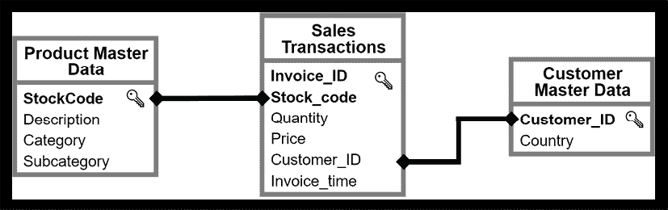

图 3.1：音乐商店数据库的实体关系图

本书中我们会遇到这种类型的图表。我建议您尽力绘制您在工作中最常使用的表的 ER 图，因为这将简化您对如何最好利用它们的思考。事实上，映射企业中各种系统中所有可用的数据是一个艰难但值得的练习。

保持这一映射的最新状态——以及通常来说——在公司中管理数据资产需要一定的纪律性和一套正式的角色、流程和标准，这些被称为**数据治理**。一个好的（而且经常被低估的）数据治理实践，实际上是创建一个**数据清单**：这是一份公司所有信息资产的系统性描述。当您建立数据清单时，您必须正确地映射主数据和事务表，发现重复项和缺失的键。

数据清单包括有关存储在表中的数据的信息，如内容、来源、所有者和许可：这些都是**元数据**的例子，这个词字面意思是“关于数据的数据”。

# 合并表

数据模型向我们展示了不同表格中的数据点如何在逻辑上相互关联。在数据分析实践中，我们经常需要通过利用数据模型描述的逻辑关系将数据合并在一起。将两张表格合并成第三张表格的最常见操作称为**连接**。通过合并两张表格，我们可以交叉丰富它们，因为我们合并了关于特定事件或实体的所有信息。连接操作将两张表格中的行进行匹配，前提是我们指定的列中有相同的值（**匹配列**）。让我们假设有以下两张表格，分别表示销售交易和产品主数据：

| 销售 |
| --- |
| 产品 | 日期 | 销售额 |
| Gibson Explorer B-2 | 12 月 21 日 | 1040 |
| Squier Affinity | 12 月 21 日 | 249 |
| Yamaha YDP-164 | 12 月 22 日 | 1499 |
| Squier Affinity | 12 月 22 日 | 249 |

表 3.1：销售表

| 产品 |
| --- |
| 产品 | 类别 |
| Gibson Explorer B-2 | 吉他 |
| Squier Affinity | 吉他 |
| Yamaha YDP-164 | 钢琴 |

表 3.2：产品表

如果我们需要计算每个产品类别的总销售额怎么办？第一张表告诉我们每笔交易的销售额，但缺少类别信息，因此我们无法相应地汇总这些销售额。第二张表有类别信息，但没有提供任何关于销售的信息。每张表都有缺失的内容，所以我们需要通过连接将它们合并起来。好消息是，这两张表共享一个列（*产品*），可以用作匹配。我们将使用*产品*作为匹配列将它们连接在一起：

| 上述两张表的连接 |
| --- |
| 产品 | 日期 | 销售额 | 类别 |
| Gibson Explorer B-2 | 12 月 21 日 | 1040 | 吉他 |
| Squier Affinity | 12 月 21 日 | 449 | 吉他 |
| Yamaha YDP-164 | 12 月 22 日 | 1499 | 钢琴 |
| Squier Affinity | 12 月 22 日 | 249 | 吉他 |

表 3.3：连接“产品”表和“销售”表

看看会发生什么？通过连接这两张表，我们得到一个第三张输出表格，其中每个交易不仅包含产品名称、日期和金额（这些信息仅出现在第一张表格中），还包括每个产品的类别（这些信息仅出现在第二张表格中）。现在，这张表格可以用来计算每个产品类别产生的销售额，只需要进行正确的聚合操作（我们将在接下来的几页中学习如何操作）。

为了完整介绍连接，我们再考虑一个最后的方面。即使两个表有一些公共列（可以用于匹配），它们也不一定每一行都有与另一表中对应行的匹配。在前面的例子中，我们可能会有一些交易，涉及到未包含在产品主数据中的乐器（可能是新到货的商品，尚未分类），或者反过来（主数据中的产品尚未售出）。如果我们在没有完美匹配行的情况下合并表格，输出可能会包含一些空白（就是我们在上一章中遇到的著名 NULL 值），因为我们没有相应的值可以使用。根据我们管理这些缺失匹配（以及输出中不完整行的结果）的策略，我们可以实现不同类型的连接。假设我们想连接以下两个表（按惯例，在连接操作中合并的两个表分别称为**左**表和**右**表，因此以下表格中的标题名称）：

| 左表：销售 |
| --- |
| 产品 | 日期 | 金额 |
| Gibson Explorer B-2 | 21-Dec | 1040 |
| Squier Affinity | 21-Dec | 249 |
| Korg B2 | 21-Dec | 499 |
| Yamaha YDP-164 | 22-Dec | 1274 |
| Squier Affinity | 22-Dec | 249 |
| Didgeridoo Black 2 | 22-Dec | 459 |

表 3.4：左表

| 右表：产品 |
| --- |
| 产品 | 类别 |
| Gibson Explorer B-2 | 吉他 |
| Squier Affinity | 吉他 |
| Yamaha YDP-164 | 钢琴 |
| Korg B2 | 钢琴 |
| Steinway B-211 | 钢琴 |
| American Jazz-5 | 贝斯 |

表 3.5：右表

请注意，某些产品在另一表中没有相应的匹配项，正如以下文氏图直观地展示的那样：

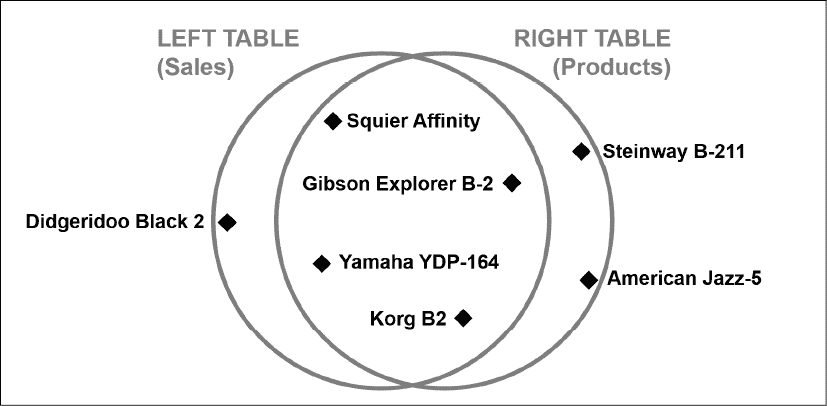

图 3.2：销售表和产品表的文氏图：并非所有乐器都出现在两个表中

根据我们希望如何管理结果输出表中“未匹配”行的方式，我们有四种不同类型的连接：

+   **内连接**：在这种情况下，我们只保留在两个表中都有匹配的行。我们关注的是两个列中键的交集。通过这样做，我们避免了由于键不匹配而生成任何 NULL 值。另一方面，我们可能会忽略一些行——即使它们不完整——也包含一些有价值的信息，例如尚未分类的产品销售。

+   **左外连接**：这种连接方式会保留左表中所有现有的行，即使它们在右表中没有匹配项。通过这种方式，我们可能会在输出中遇到一些 NULL 值，但我们“保留”了左表中的信息。

+   **右外连接**：这种连接方式与前一种相反，保留右表中所有的行，包括那些在左表中没有匹配项的行。

+   **完全外连接**：当我们不能承受丢失任何数据时，我们选择这个选项！即使没有匹配的行，两个表中的所有行也会保留下来。这是一个可能会产生最多 NULL 值的选项：这是为了保留所有数据的代价。

图 3.3：四种连接类型：决定要保留哪些行

在*表 3.6*中，您将看到应用四种连接类型的结果：NULL 值显示为问号，正如您在 KNIME 中看到的那样。内连接没有 NULL 值，正如预期的那样：

| 内连接 |
| --- |
| 产品 | 日期 | 金额 | 类别 |
| Gibson Explorer B-2 | 21-Dec | 1040 | 吉他 |
| Squier Affinity | 21-Dec | 249 | 吉他 |
| Korg B2 | 21-Dec | 499 | 钢琴 |
| Yamaha YDP-164 | 22-Dec | 1274 | 钢琴 |
| Squier Affinity | 22-Dec | 249 | 吉他 |

表 3.6：内连接

在左外连接中，即使某些产品尚未分类，我们仍然会有一行记录与迪吉里杜管的销售相关。这个特殊的土著乐器可能是因为它是一个新到的亮眼商品，吸引了顾客的注意，而我们还没来得及通过更新产品主表来添加它：

| 左外连接 |
| --- |
| 产品 | 日期 | 金额 | 类别 |
| Gibson Explorer B-2 | 21-Dec | 1040 | 吉他 |
| Squier Affinity | 21-Dec | 249 | 吉他 |
| Korg B2 | 21-Dec | 499 | 钢琴 |
| Yamaha YDP-164 | 22-Dec | 1499 | 钢琴 |
| Squier Affinity | 22-Dec | 249 | 吉他 |
| Didgeridoo Black 2 | 22-Dec | 459 | ? |

表 3.7：左外连接

在右外连接中，我们也强制为那些因为价格原因尚未销售的乐器创建一行记录。这个视图可以帮助我们发现可能需要在下一期新闻简报中做更多广告的产品：

| 右外连接 |
| --- |
| 产品 | 日期 | 金额 | 类别 |
| Gibson Explorer B-2 | 21-Dec | 1040 | 吉他 |
| Squier Affinity | 21-Dec | 249 | 吉他 |
| Korg B2 | 21-Dec | 499 | 钢琴 |
| Yamaha YDP-164 | 22-Dec | 1499 | 钢琴 |
| Squier Affinity | 22-Dec | 249 | 吉他 |
| Steinway B-211 | ? | ? | 钢琴 |
| American Jazz-5 | ? | ? | 贝斯 |

表 3.8：右外连接

完全外连接不仅会包含那些从未销售过的产品，还包括那些尚未分类的产品。创建这样的表格可以帮助我们按类别汇总销售情况，并一目了然地发现那些未分类和未售出的产品：

| 完全外连接 |
| --- |
| 产品 | 日期 | 金额 | 类别 |
| Gibson Explorer B-2 | 21-Dec | 1040 | 吉他 |
| Squier Affinity | 21-Dec | 249 | 吉他 |
| Korg B2 | 21-Dec | 499 | 钢琴 |
| Yamaha YDP-164 | 22-Dec | 1499 | 钢琴 |
| Squier Affinity | 22-Dec | 249 | 吉他 |
| Didgeridoo Black 2 | 22-Dec | 459 | ? |
| Steinway B-211 | ? | ? | 钢琴 |
| American Jazz-5 | ? | ? | 贝斯 |

表 3.9：完全外连接

正如这个简单示例所揭示的那样，任何类型的连接都有其价值。作为数据工作者，我们希望了解我们有哪些可用的选项，以便根据我们所面临的业务场景来选择使用哪一种。

在 KNIME 中执行连接操作时，我们可以利用一个非常有用的节点，这个节点被称为——我们不得不承认——**Joiner**。

##  *Joiner*

这个节点（位于 **Manipulation > Column > Split & Combine**）会根据用户提供的匹配标准将连接在其输入端口的两个表连接起来。要配置它（*图 3.4*），你首先需要通过选择两个相关并应当匹配的列，来指定连接的标准。要添加第一对列，点击标有 **Add matching criterion** 的按钮。你将看到两个下拉菜单，分别显示连接到上方和下方输入端口的表中的可用列（按照惯例，分别指代连接操作的 **左** 表和 **右** 表）。你可以通过点击右侧的 + 和 - 按钮来添加或移除要匹配的列。默认情况下，所有在此输入的列对需要具有匹配的值，才能使行匹配。它们也需要是相同的类型（例如，整数与整数匹配，字符串与字符串匹配，等等）。

为了解决不匹配的数据类型，节点允许你在评估匹配标准之前转换列的数据类型。例如，在标有 **Compare value in join columns by** 的选择器中，你可以选择 **string representation**，将所有值转换为字符串后再检查它们是否匹配。

在明确匹配标准后，你需要决定希望执行哪种类型的连接操作（**Inner**、**Left outer**、**Right outer** 或 **Full outer**）。为此，可以参考 *图 3.3* 中的维恩图。如果你想要内连接，仅需要选择 **Matching rows** 选项框。对于左外连接或右外连接，你还需要分别勾选 **Left unmatched rows** 或 **Right unmatched rows**。对于全外连接，所有框都应选中。如你从其图标中所见，节点有三个输出端口。顶部的第一个输出端口承载连接结果。你还可以选择查看那些未在另一个表中找到匹配的行，并将它们放入第二和第三个输出端口。如果你也有兴趣查看未匹配的行（有时这有助于理解为何并非所有行都能匹配），你需要勾选 **Route unmatched rows to separate ports** 选项框：这将激活第二和第三个端口，否则它们将保持不活动并标记为红叉。

最后一种在大多数情况下选择的选项是**合并连接列**：这样做，你只保留一对用于评估匹配的列“副本”。如果你不选中该选项，你将保留来自左侧和右侧输入表的两列：在大多数情况下，你不希望这样，因此此框应始终被选中。

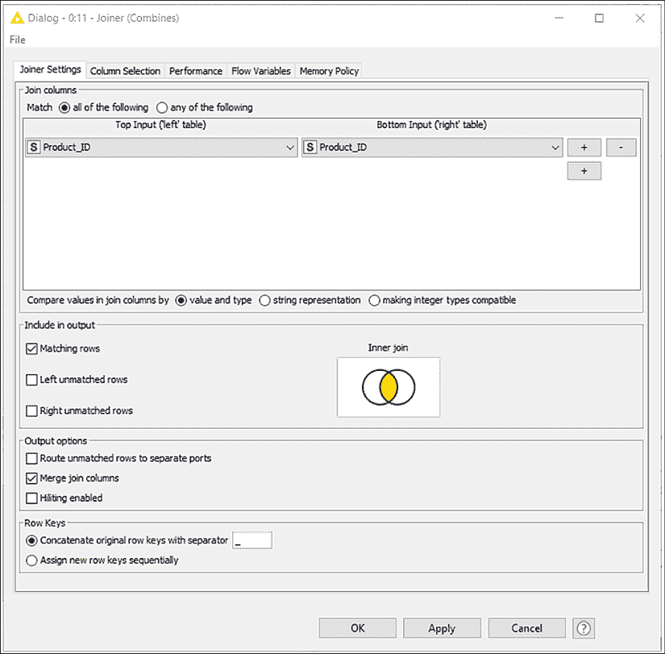

图 3.4：连接器的配置对话框：选择哪些列应匹配

在配置对话框的第二个标签页（**列选择**）中，你可以指定哪些来自连接操作的列应保留在节点的输出端口。这在你知道在后续的工作流步骤中不需要某些列时非常有用：在这种情况下，只需浏览右侧框中的列，并双击那些需要移除的列：

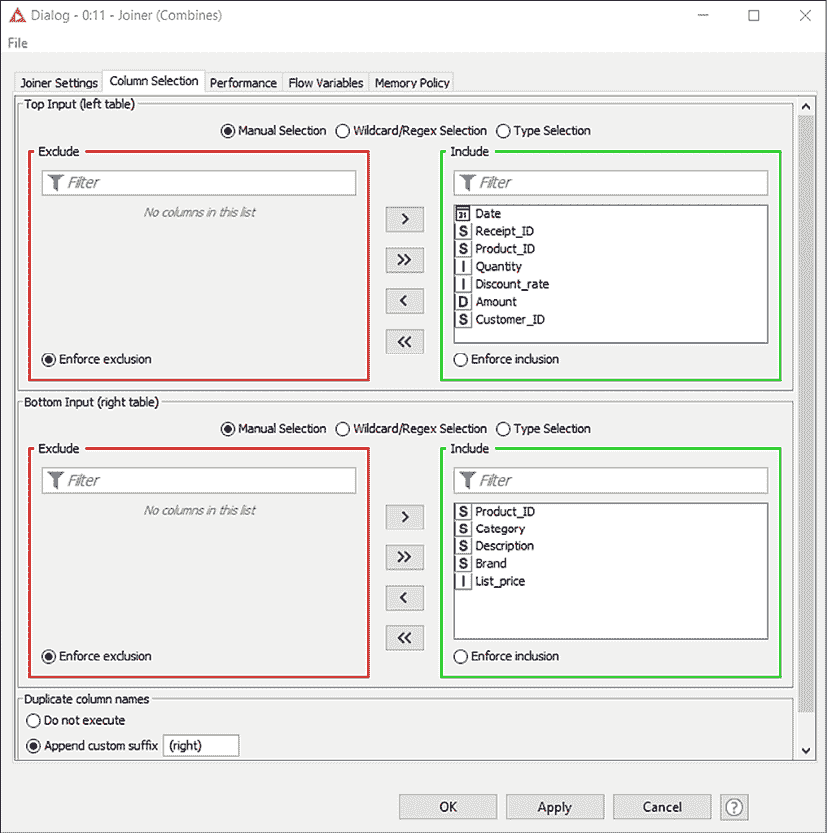

图 3.5：连接器的配置对话框：选择哪些列应匹配

对于使用 Microsoft Excel 的用户，你会注意到你可以通过 `vlookup()` 等函数在 Excel 中实现左外连接。通过使用 KNIME 代替 Excel，你可以执行所有类型的连接（不仅仅是左外连接），并且可以轻松地在多个列上定义匹配标准（在 Excel 中这需要一些变通方法）。

为了完整性，除了连接操作符之外，还有一些其他方法可以将表格合并。如果你不需要考虑任何匹配标准，并且只想将具有相同维度大小的表格“拼接在一起”，你可以：

+   将两个具有相同行数的表格的列追加在一起。你将获得第一张表的列，紧跟着第二张表的列，顺序保持原表中的排列。你可以通过使用 KNIME 中的**列追加器**节点来实现。

+   将两张具有相同列的表格的行连接起来，将第一张表的行放在第二张表的行上方。这个节点叫做**连接**。

*图 3.6* 展示了这两个节点是如何工作的：

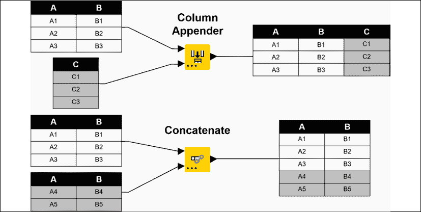

图 3.6：无匹配标准的表格合并：你可以使用这两个节点追加列或连接行

现在我们已经明确了有许多方法可以将多个表格合并为一个。接下来，我们来看看另一个无处不在的数据转换需求：聚合值以创建表格的摘要视图。

# 聚合值

原始数据表中包含的信息分散在所有行中。通常，我们需要将大表压缩为更小、更易读的表格，其中的值按照给定的逻辑进行聚合或总结。例如，如果我们有一张包含去年所有接收订单的表格，并且想要理解销售额随时间的变化，我们可能更喜欢计算一个简单的表格，显示每个月生成的订单总数，而不是长长的表格，其中的行数与订单数一样多，我们更倾向于通过聚合显示只有十二行的表格，每月一行。

汇总数据的简单方法是使用一种非常流行的数据库操作，称为**Group By**：它将各个组中的行合并并在每个组内聚合它们的值。要执行 Group By，您需要决定两件事：

+   首先，您必须声明哪些列定义了一个**组**。在定义组的列中显示相同值的所有行将在输出中合并成一行。让我们以*表 3.6*为例。如果您使用列*类别*定义我们的组，那么 Group By 的结果将只有两行：一个是吉他的总销售额，另一个是钢琴的总销售额。您可以通过多个列定义组：在这种情况下，您将为每个组列唯一值的每种组合获得一个汇总行。例如，如果您选择*日期*和*类别*作为组定义，那么每个类别将为不同销售日期的每一天获得多个输出行。

+   其次，您需要决定如何跨行汇总，即使用哪种**聚合函数**。例如，您可以简单地计算出在一组中出现的所有行数，将它们的值相加或计算它们的平均值。在销售汇总表格中，我们决定计算销售交易的数量，但我们也可以使用求和作为聚合函数来计算每个月产生的总收入。

现在是时候在我们的音乐店示例中看到 Group By 操作的实际效果了。让我们使用内连接结果作为输入，在*表 3.6*中。我们希望通过产品类别总结我们的销售，计算每个类别生成的收入以及总销售的数量：

| 按类别分组的销售 |
| --- |
| 类别 | 销售额 | 数量 |
| 吉他 | 1538 | 3 |
| 钢琴 | 1773 | 2 |

表 3.10：按类别汇总的销售摘要

正如我们所预期的那样，生成的表格只有两行，分别对应原始表格中的每个类别。让我们来看看 KNIME 中能够执行这种聚合的节点。

##  *按组*

此节点（**操作 > 行 > 转换**）按组对表格的行进行聚合，组的定义是通过一组列的子集来实现的。其基本配置需要两个步骤。在**分组**面板中，你需要选择哪些列定义了分组，并将它们移到右侧的列表中，右侧列表用绿色边框标出。你可以选择多列：输出表格将为每个指定列中不同值的唯一组合生成一行。如果你不选择任何列，则会将输入中的所有行汇总成一行总计数据输出：

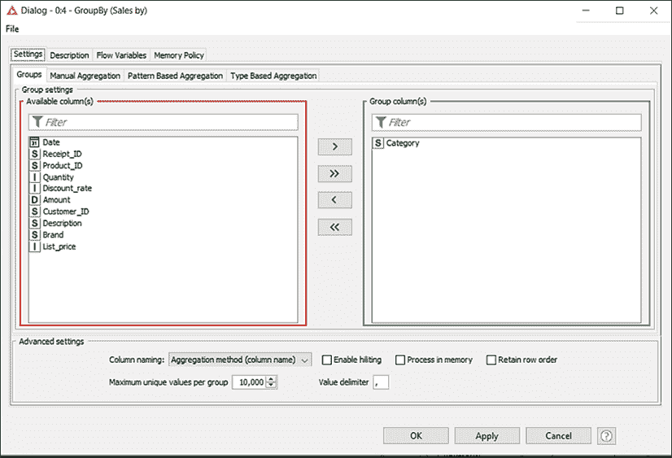

图 3.7：按组设置：决定哪些列定义一个组

第二步是声明哪些列应该被汇总，以及使用哪个聚合函数。你可以通过双击左侧列表中的列名来定义要聚合的列。然后，你可以从下拉菜单中的**聚合**选项选择聚合函数。你可以多次选择相同的列，并使用不同的函数进行聚合。在底部的下拉菜单（**列命名**）中，你可以指定用于聚合列的命名约定。默认选项是**聚合方法（列名）**，这将创建类似于*Sum(Quantity)*的列标题：

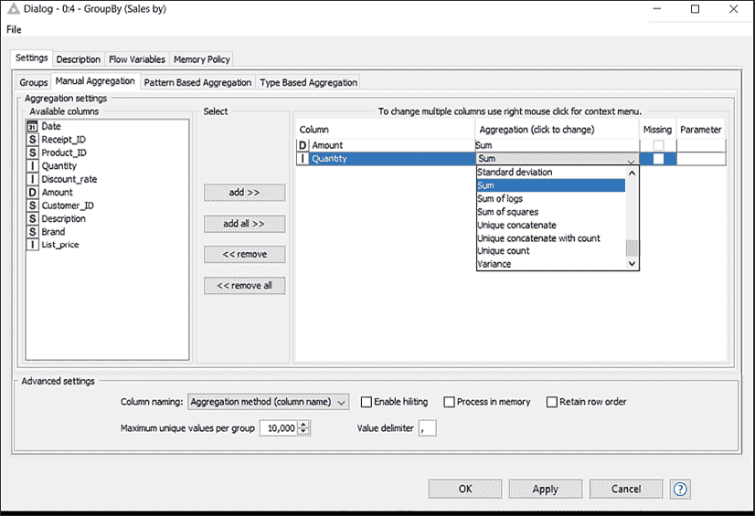

图 3.8：按组聚合设置：决定如何在每个组内汇总你的行

在*表 3.11*中，你可以找到用于汇总每组内行的最常用函数。对于这些函数中的一些，比如计数或首个，你需要决定是否将 NULL 值视为与其他值一样的值，还是忽略它们。如果你希望忽略 NULL 值（仅对实际值进行聚合），请勾选右侧的**缺失**复选框：

| 聚合函数 | 描述 |
| --- | --- |
| 求和 | 对一组中的所有值进行求和，返回总和。 |
| 计数/唯一计数 | 计算每组内的所有行。唯一计数忽略重复值，只计算不同的值。 |
| 平均值/中位数 | 计算每个组内的平均值和中位数值。 |
| 众数 | 获取每个组中出现次数最多的值。 |
| 首个/最后一个 | 获取每组中的第一个/最后一个值，取决于输入时的排序。确保在此之前先对行进行排序。 |
| 最小值/最大值 | 获取每个组内的最小值和最大值。 |
| 连接/唯一连接 | 将所有值连接成一个字符串，使用文本框底部指定的分隔符。唯一连接会忽略重复值。 |
| 相关性 | 计算与另一个列的相关性（你可以通过点击**编辑**按钮选择该列），在每个组的元素中计算。 |

表 3.11：汇总函数

聚合数据的另一种方式是使用**Pivot**操作。与“Group By”操作将数据分组为输出表格的行不同，使用该操作我们可以“旋转”一些分组（我们称之为枢轴）使其垂直显示，作为列出现在输出表格中。你可以把枢轴看作一个二维矩阵，显示跨水平分组（最终会显示为枢轴的行）和旋转的垂直分组（作为输出矩阵的列）的聚合结果。

让我们看看在音乐商店示例中如何使用 Pivot 操作。再次从内连接结果开始，我们希望通过一个单独的表格总结我们的销售数据，显示每种类别（水平分组）和日期（垂直分组或枢轴）的每个组合的总和：

| 销售额，按类别和日期旋转 |
| --- |
| 日期 | 21-Dec | 22-Dec |
| 类别 | 销售额 | 数量 | 销售额 | 数量 |
| 吉他 | 1289 | 2 | 249 | 1 |
| 钢琴 | 499 | 1 | 1274 | 1 |

表 3.12：按类别和日期的销售枢轴

生成的枢轴表格有两行，每个类别对应一行（与 Group By 类似），并且有多列，显示每个可用日期的聚合结果。在 KNIME 中，我们可以使用**Pivoting**节点来创建这样的汇总。

##  *Pivoting*

此节点（**Manipulation > Row > Transform**）通过创建枢轴表格来聚合值。它的配置对话框与**GroupBy**类似，但包含一个额外的**Pivots**面板，如下所示：

+   在**Groups**面板中，您指定定义水平分组的输入列，这些分组将在输出的枢轴表格中显示为行。

+   在**Pivots**面板中，您指定用于创建垂直分组的输入列，这些分组会作为列出现在结果表格中。

+   最后，在**Aggregation**面板中，您可以选择要汇总的输入列和使用的聚合方法。

与我们在**GroupBy**节点中看到的类似，底部的两个下拉菜单（**列名**和**聚合名**）可以用来指定生成的枢轴列的命名约定。默认情况下，您会看到列头将每个枢轴的名称与聚合方法连接在一起，比如 *21-Dec+Sum(Amount)*：

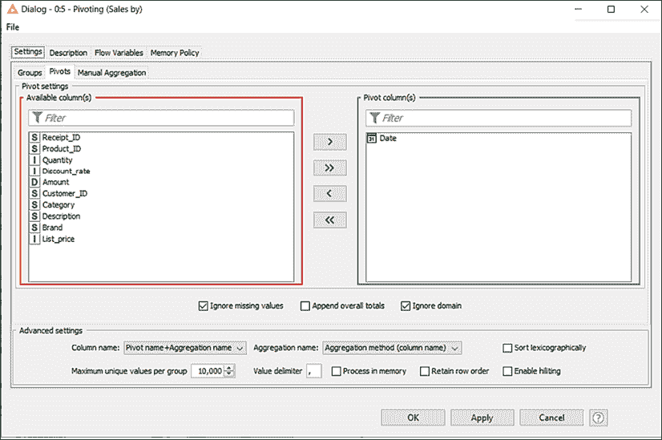

图 3.9：枢轴设置：选择用于垂直分组（枢轴）的列

**Pivoting**节点不仅有一个输出端口，而是有三个：您可以通过右键点击节点后，在弹出菜单底部选择最后三个放大镜图标之一来查看它们。第一个输出是枢轴矩阵（大多数情况下，您只需要这个），第二个输出是仅对水平分组的总聚合（忽略枢轴），第三个输出是所有枢轴行的总和（忽略分组）。

数据透视表的概念已被微软 Excel 普及。现在你已经知道如何在 KNIME 中构建数据透视表，你可以访问更广泛的聚合方法，并能够将数据透视操作纳入更广泛的自动化工作流程中，消除所有手动干预，如刷新和复制/粘贴。

在某些情况下，你可能需要进行反向操作，称为**反透视**：这将把表格中的列转换为在输出表格中显示为多行。如果你想在 KNIME 中执行这个转换，查看**反透视**节点。

在*图 3.10*中，你可以看到我们已经讨论过的三种表格聚合和拆解方法的总结：

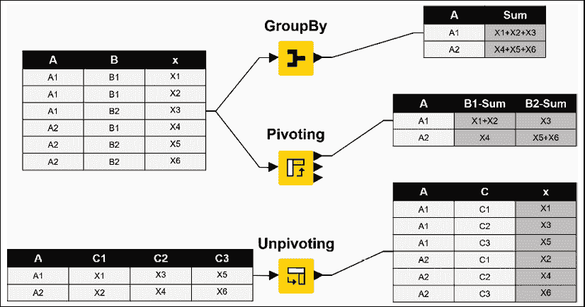

图 3.10：通过聚合和拆解转换表格：最有用操作的总结

合并表格和聚合值是你可以进行的基本数据转换。让我们在一个完整的教程中看看这些操作的实际应用，这将是学习 KNIME 更多技巧的机会，比如计算公式、可视化数据以及使用循环和变量。

# 教程：销售报告自动化

在本教程中，你将扮演一位为一家总部位于英国的在线零售商工作的商业分析师，销售各种场合的礼品。你对数据分析充满兴趣，并且正在阅读一些关于其潜力的（优秀）书籍。你为自己设定了一个目标：通过利用你的新技能，逐步增强公司内数据分析的作用。你决定从一些相对简单的事情入手：自动化并改进销售数据的报告。通过这样做，你希望能够快速且显著地产生影响，激发同事和经理们对更高级数据分析的*兴趣*，从而解锁他们的兴趣和投资。

你所在的公司发展迅速，但没有机会采用可持续的商业智能解决方案。定期报告是通过手动操作 Excel 来管理的。负责此项工作的财务分析师每周五从公司网站提取数据，并经过几个小时枯燥的手动操作后，发送带有最新状态的电子邮件。由于这项活动的手动性质，报告容易出现人为错误，几乎每周都会引发几封*来回*的电子邮件，导致没有时间识别数据中的商业模式和创造实际价值。你非常理解财务分析师的处境，决定抽出几小时，利用 KNIME 自动化整个报告过程。

首先，你成功地提取了人们关于销售演变的最重要商业问题清单。这个初步清单将成为你初步努力的良好基础：

1.  我们的产品系列中，哪些是销售量最大、最具影响力的前十个产品？

1.  每个子类别中排名前三的产品是什么？

1.  我们卖得最多的是哪个国家？

1.  截至当前日历年， 每个产品类别产生了多少收入？

1.  相较于当前年度的总产品组合，每个类别的相对占比是多少？

1.  我们应该在哪些月份预计季节性类别的销售达到峰值？

你决定，第一份自动化报告应包括一个表格视图，回答上述前五个商业问题。对于最后一个问题，由于业务的季节性行为不会在每周变化太大，构建一张展示月度销售模式的图表即可，作为一次性工作。定义了你的工作应涵盖的最小交付集后，你准备进入下一步，评估需要哪些数据来实现这些目标。

进行任何数据工作时，首先要明确你所追求的商业问题。许多分析项目失败，原因在于缺乏对最终目标的理解。确保你始终“可视化”你想从数据分析中获得的结果，以及你期望它如何实际影响你的业务。如果可能，将其写下来，就像我们刚才列出的六个问题一样。

在财务分析师（他已经为你的项目感到非常兴奋）的帮助下，你提取了定期销售报告所需的最新数据，并发现这些数据分散在三个不同的表格中。

+   **产品主数据**：包括一个唯一的字母数字代码（*StockCode*列），作为产品 ID，一个简短的*描述*，以及两个列用于定位每个商品在公司所使用的两级产品层级中的位置，即*Category*和*Subcategory*。例如，在“文具”类别下，我们有“笔记本”和“贴纸”子类别，而在“家居”类别下，我们有“时钟”和“家具”子类别。

+   **客户主数据**：对于每个已在网站上注册的客户，包括一个标识符（*Customer_ID*）和*Country*（居住国家）。

+   **销售交易**：这是最大的表格，因为它记录了所有销售。对于每个发票（通过*Invoice_ID*列标识），该表格可以包含多行，每行代表一个交易中的产品（通过其*StockCode*描述）。每一行还包括购买的商品数量（*Quantity*）、单价（*Price*）、*Customer_ID*（如果客户未注册，则可能为空）以及描述购买日期和时间的字符串（*Invoice_time*）。

产品和客户主数据表格存储在两个文本文件中（分别命名为`productMD.csv`和`customerMD.csv`），这些文件来自订单管理系统。交易数据则分别存储在两个 Excel 文件中（`TransactionL3M.xlsx`和`TransactionsHistory.xlsx`）：第一个文件仅包含最近三个月的销售记录，而第二个文件则包含其余的交易历史记录：

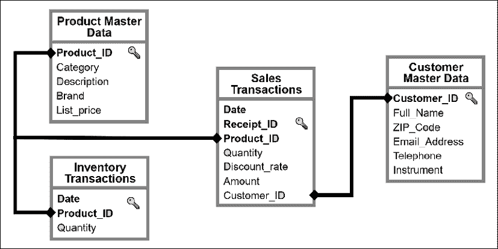

图 3.11：在线零售商数据库的实体-关系图

现在我们已经具备了足够的知识来开始：如果我们意识到需要更多关于数据和业务需求的信息，我们可以随时回去向我们的财务分析师寻求额外帮助。通过查看业务问题清单，我们注意到我们需要使用不同主数据表中的字段（例如*类别*、**国家**）对事务进行汇总，因此我们需要加载所有这些表并将它们合并。让我们打开 KNIME，创建一个新工作流（**文件** | **新建...** 和 **新建 KNIME 工作流**），并开始构建它。

1.  第一阶段，我们加载包含在两个独立 Excel 文件中的交易数据。我们从历史数据开始，拖动`TransactionsHistory.xlsx`到空白工作流，或实现**Excel Reader**节点。在配置窗口中，我们注意到预览中包括了我们预计会出现的所有列，因此我们可以关闭它，保持选项不变。我们对另一个文件（`TransactionsL3M.xlsx`）重复相同的操作，然后运行这两个节点。

    我们目前加载的两个表都涉及事务，并且共享完全相同的列。我们可以通过使用**Concatenate**节点将它们合并并将一个叠加在另一个上。

##  *Concatenate*

该节点（**操作 > 行 > 转换**）通过将第二个表的行添加到第一个表的底部来连接两个表。如果列具有相同的标题，节点将合并这些列。您可以使用其配置窗口来决定如何处理在两个输入表中未出现的列。默认情况下，所有列都会保留（**列处理**部分的**使用列的并集**选项）：这意味着如果某个列仅存在于一个表中，它将在输出中以 NULL 值显示于来自另一个表的所有行。如果选择另一个选项（**使用列的交集**），所有不匹配的列将在输出中被丢弃：

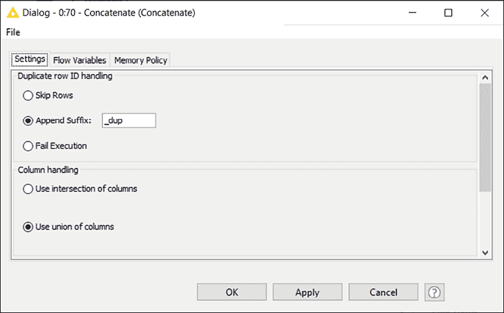

图 3.12：**连接**节点的配置窗口：选择如何处理重复和不匹配的列

1.  我们可以将两个事务表合并，并将两个**Excel Reader**节点的输出连接作为**Concatenate**节点的输入。由于这两个输入表的列完全相同（列名相同），我们不需要关注节点的配置，可以使用其默认行为。运行该节点后，输出结果将是包含超过 60 万行的完整**销售事务**表。

1.  现在让我们加载存储在`customerMD.csv`文件中的**客户主数据**表。我们可以通过将文件拖放到编辑器中，或者实现一个**CSV 读取器**节点并通过指定文件路径来配置它。请在配置窗口中仔细检查该节点是否正确识别了列分隔符（在本例中是分号）：你也可以随时点击**自动检测格式**，让 KNIME 猜测格式。

1.  现在我们可以将销售表与客户主数据表合并，以便为每个交易提供生成该交易的*国家*信息。我们将**连接**节点和**CSV 读取器**节点的输出连接到一个**连接器**节点。双击该节点后，我们可以进行配置。首先，我们需要设置匹配行的条件。我们点击**添加匹配标准**按钮，并从两个表中选择*Customer_ID*。第二步是指定连接的类型。我们希望保留所有交易（左表），即使它们在客户主数据（右表）中没有对应的匹配项，因此我们选择进行左外连接。事实上，我们的同事（他开始钦佩我们在 KNIME 中的敏捷操作）确认，尽管并非所有客户都包含在客户主数据中，但我们应该考虑所有产品销售的交易。为了获得左外连接，我们需要勾选**匹配的行**和**左侧未匹配的行**。白色和黄色的维恩图顶部的左外连接标题确认了我们的操作是正确的。最后一步是选择**合并连接列**选项，以避免携带两份*Customer_ID*列。

    当我们关闭配置窗口并运行节点时，我们注意到没有任何行被匹配：实际上，输出表中的所有行都包含了空值（'**?**'单元格）。通过重新打开**连接器**的配置窗口（*图 3.13*），我们意识到发生了什么：我们正在连接的两个表中的*Customer_ID*列指向相同的属性，但数据类型不同（交易表中是字符串，客户主数据表中是整数）。这种情况是常见的：由于承载表格的文件格式不同，数据类型可能被不同地解释。

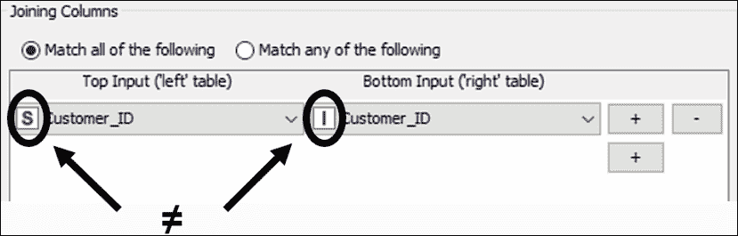

图 3.13：不匹配的连接列：相同的内容但不同的数据类型

## 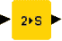 *数字转文本*

该节点（**操作 > 列 > 转换 & 替换**）将数值列（如整数和小数）转换为文本字符串。它的配置非常简单：你只需要选择哪些数值列需要被转换，方法是从右侧的选择面板中保留或移除它们：

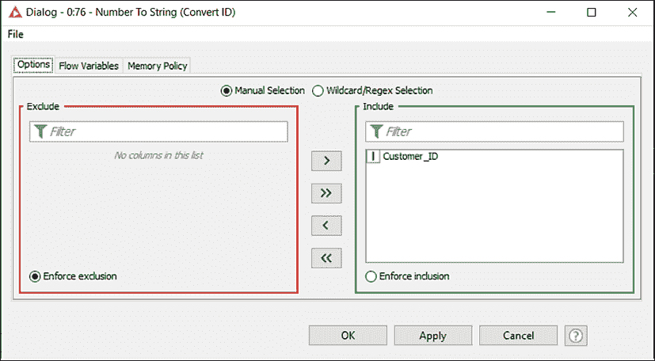

图 3.14：数字转文本配置：你希望将哪些数字转换为文本？

1.  为了将主数据中的*Customer_ID*列转换为字符串，我们在**CSV 读取器**和**连接器**之间添加了一个**数字转字符串**节点。最快的方法是将节点从资源库拖到现有连接上，然后按住鼠标按钮放开（选中时连接会变红）。现在我们可以执行**连接器**节点，并注意到在其输出端（按*Shift*+*F6*打开视图）我们不再看到任何 NULL 值。相反，我们可以看到所有交易，右侧增加了一列*国家*，这正是我们所期望的。

1.  现在是时候通过常规的 CSV 读取器节点加载**产品主数据**表格了，我们将通过加载`productMD.csv`文件来实现。

1.  我们现在可以在下游添加一个额外的**连接器**：第一个输入端口应该与前一个**连接器**节点的第一个输出端口连接，而第二个端口则应接收来自最新**CSV 读取器**的产品主数据。在其配置中，我们首先选择*StockCode*作为左表和右表的匹配列：数据类型完全匹配，因此无需转换。这次我们希望执行内连接，因为我们不希望携带不包含在产品主数据中的产品的销售记录，因为这些产品不属于任何产品类别，会使报表变得不易读。因此，在**连接器**的配置窗口中，我们只选中**匹配的行**框。最后，勾选**合并连接列**框，以避免重复显示*StockCode*列。当我们执行该节点时，得到一个表格，表明每一行所售产品的描述及其在层级中的分类。

所有数据现在已经加载并合并成一个表格：我们可以继续准备这个表格，生成所需的报表。我们注意到所有业务问题都需要按生成的收入对销售进行汇总，而我们的表格中为每个发票项显示的是*数量*和*价格*。为了计算每笔交易所产生的收入，我们需要实现一个简单的数学公式，这正是下一个节点的用途。

##  *数学公式*

这个节点（**操作 > 列 > 转换和替换**）会对每一行表格评估一个表达式，并将其结果返回到指定的列中。配置对话框看起来非常熟悉：实际上，它与我们在*第二章*《KNIME 入门》中遇到的**字符串操作**节点的结构相同。唯一的区别是，在这里，你可以使用处理数字的函数，如`ceil()`或`floor()`，将小数数值四舍五入到最接近的整数，或者使用`sqrt()`来计算平方根。所有可用的函数都列在中间，通过选择它们，你可以在右侧的文本框中查看其描述和示例。

构建表达式的最简单方法是双击右侧可用的列（只有数字列会显示），并使用中央文本框创建您的表达式。在这里，您可以添加所有需要的数学运算符，如`+`、`-`、`*`、`/`和括号。每行表达式的结果将保存在一个新列中（**Append Column**），或者将替换现有列的内容（**Replace Column**），您可以在底部的单选按钮中进行选择：

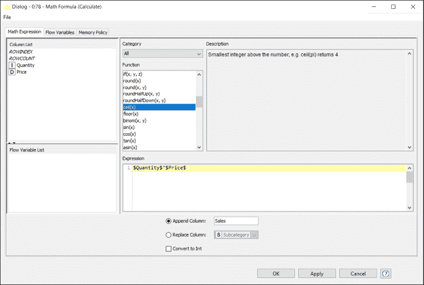

图 3.15：Math Formula 对话框：通过组合您需要的列构建数值表达式

1.  要计算每笔交易产生的收入，我们实现一个数学公式，并将其与前一个节点（**Joiner's**的上部输出端口）连接起来。在配置窗口中，我们构建表达式：`$Quantity$*$Price$`，选择**Append Column**选项并将其命名为`Sales`。

    通过查看生成的表格，我们观察到几个清理的机会。首先，我们注意到*Country*列有一些缺失值，因为一些客户在主数据中缺失。我们应该用默认值替换它，当国家缺失时我们使用的默认值是`Unspecified`字符串。其次，我们发现类别"Others"并不指代实际的产品销售，因为它描述了额外的费用（如邮费和银行佣金）以及手动调整。财务分析师确认，所有在"Others"类别下生成的销售应从任何报告中排除。

1.  要管理缺失的国家，请添加**Missing Value**节点，并使用其第二个选项卡（**Column Settings**）进行配置。双击左侧找到的*Country*列，在出现的下拉菜单中选择**Fix Value**。然后，在文本框中输入`Unspecified`，然后单击**OK**关闭窗口。

1.  要删除与"Others"类别相关的行，我们可以使用**Row Filter**节点。要配置它，请在右侧选择**Exclude rows by attribute value**，然后在**Column to test**选择器中选择*Category*，最后在**use pattern matching**下拉菜单中选择"Others":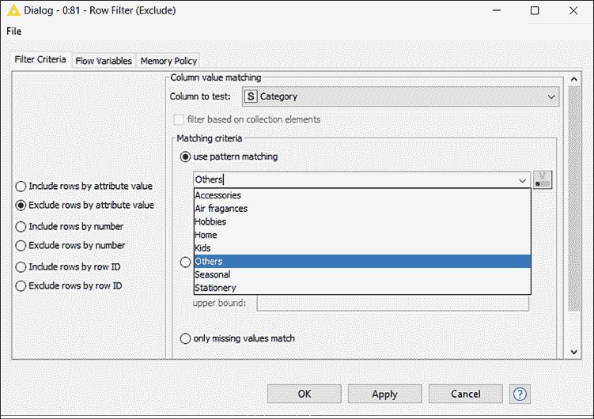

    图 3.16：Row Filter 对话框：排除具有给定列中特定值的行

    当表格清理完毕（您现在应该在最后一个节点的输出端口处有 672,104 行和 11 列），我们最终能够生成回答我们每个业务问题的表格。第一个问题要求列出产生最大销售额的产品。此时，与产品相关的销售分散在多个行中，每个包含该产品的发票都有一行。因此，我们需要按产品聚合销售额。

1.  为了获取每个产品产生的总销售额，我们实现了一个**GroupBy**节点。在配置窗口中，我们选择定义输出中唯一分组的列。由于我们希望每个产品都有一行，并且希望报告中包含描述它的列，在**Groups**标签页中，我们选择了*StockCode*、*Description*、*Category*和*Subcategory*列，并确保它们最终都出现在右侧绿色边框的列表中。**GroupBy**节点将为每组列中每个值的组合创建一行，但由于我们知道对于每个*StockCode*，都有一个唯一的*Description*、*Category*和*Subcategory*，我们可以安全地将它们都保留在分组描述中，以便将它们保留在输出表格中，这将使得结果更加信息丰富。在**Manual Aggregation**标签页中，我们双击*Sales*和*Quantity*列，并为这两列都指定**Sum**作为**Aggregation function**。为了使报告更易读并避免列名过长，我们在底部的**Column naming**下拉框中选择**Keep original name(s)**。然后，我们可以点击**OK**并进入下一步。

1.  由于我们只想显示产生最大销售额的产品，因此我们需要使用**Sorter**节点按降序排列表格中的*Sales*。在实现该节点并与前一个节点建立连接后，我们可以在下拉菜单中选择*Sales*并选择**Descending**排序。

1.  解答这个业务问题的最后一步是将我们排名前十的产品列表限制为前十项。使用**Row** **Filter**节点，我们在左侧**选择按编号包含行**，然后输入`1`作为**First** **row** **number**，并输入`10`作为**Last row number**。

执行最后一个节点并检查结果表格后，我们感到非常满意，因为屏幕上显示了销售额最高的十个产品。这个积极的中间结果鼓励我们继续推进挑战：

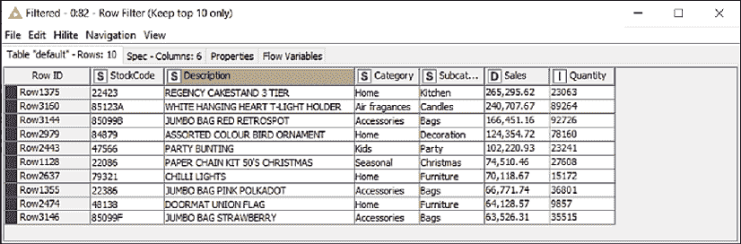

图 3.17: 按销售额排名前十的产品：谁会想到一个蛋糕架能赚这么多钱？

下一个问题要求我们报告每个子类别中最畅销的产品。类似于我们之前为前一个问题所做的，我们对产品列表应用过滤，只保留在排序列表顶部的产品。然而，这次我们需要重复过滤操作多次，每个子类别一次。

在 KNIME 中，你可以通过创建**循环**来*重复*执行工作流中的某一部分。实现循环在 KNIME 中非常简单：你有一组起始和结束循环节点（可以在**工作流控制 > 循环支持**中找到它们），你可以用这些节点来定义需要重复的工作流部分（**循环主体**）。根据你选择的**循环起始**节点的类型，你可以决定重复执行的逻辑。一旦循环执行完毕，你将在**循环结束**节点的输出端口找到拼接后的结果，并且会有一个额外的列标明每一行对应的循环编号。看起来很简单，实际上也是如此！

下面你将看到最常用的循环节点的图形总结。更具体地说：

+   **计数循环起始**：如果你希望重复执行工作流的某一部分一定次数（你可以在配置对话框中指定次数），可以使用此节点。

+   **块循环起始**：该循环会针对输入表中每一个固定大小的连续行块重复执行。你可以决定总循环次数或每次循环的块大小。如果选择块大小为 1，那么你将对输入表中的每一行分别重复执行工作流的某一部分。

+   **组循环起始**：该循环将针对每一组行重复执行，组是通过你选择的列中每个唯一值的组合来定义的。还记得**分组**节点吗？在那时，你为每个组获得了一个聚合后的行；在这里，你将针对每个组重复执行工作流的某一部分。我们很快会使用这个节点，这将使它的行为更加清晰。

还有其他一些节点用于启动和结束循环，这些节点能扩展你在工作流中重复执行某些操作集的灵活性。请查看**递归循环**节点：使用这些节点，你可以*将* **t**循环的输出带回到起始节点，从而在同一行上重复执行。

*图 3.18* 显示了你的工作流中可能的循环设置摘要。记住：在同一个循环主体上，你只能有一个**循环起始**和一个**循环结束**节点协同工作。图中的虚线展示了三种可行的**循环起始**节点选项：

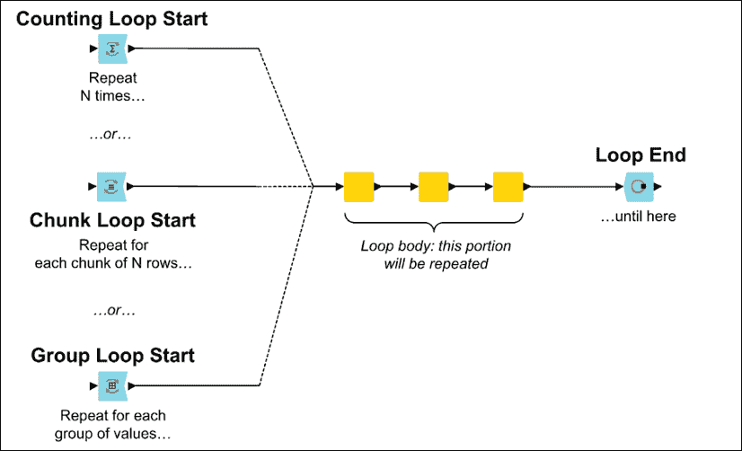

图 3.18：KNIME 中的循环节点：根据需要重复工作流的某一部分

在简短介绍了如何在 KNIME 中创建循环后，我们回到我们的业务案例。我们希望对每个子类别重复筛选出最畅销的产品，因此我们应该实现一个组循环，其中“组”由列*子类别*简单定义。下面是**组循环起始**节点的工作方式。

##  *组循环起始*

这个节点（在**工作流控制 > 循环支持**中提供）标志着每个组将要重复执行的工作流部分的起点。所有在定义组的列中具有相同值的输入行将一次性返回到下游循环进行执行。其配置要求你指定定义每个组的列。使用此节点时，需要实现**循环结束**节点，这将标志着需要重复执行的节点段的结束：

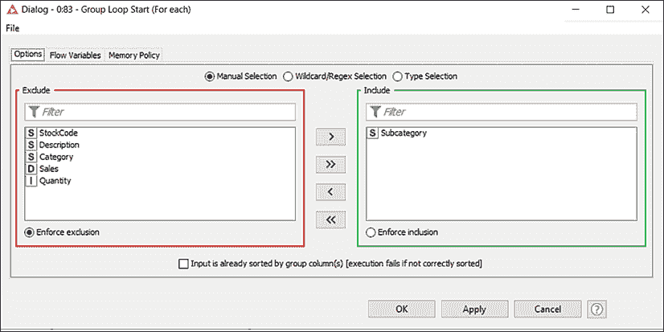

图 3.19：分组循环开始节点的配置窗口：决定定义你希望迭代的组的列

让我们在 KNIME 中创建第一个循环，以回答当前的业务问题。

1.  我们可以重用之前为上一个问题创建的排序产品列表，作为我们分组过滤的基础。拖动并连接**分组循环开始**节点，并将其下游连接到**排序器**节点。在其配置窗口中，只选择*子类别*，使其出现在右侧的**包含**面板中。

1.  循环将只需选择每组中的前三个产品。为此，我们可以复制之前为整体顶级产品列表所做的操作。让我们实现一个**行过滤器**节点，选择**按数量包含行**，然后输入`1`作为**首行号**，并在此情况下输入`3`作为**尾行号**。

    要在工作流中结束一个循环，我们需要使用适当的节点来指示其结束点。

##  *循环结束*

这个节点（**工作流控制 > 循环支持**）标志着工作流循环的结束。在每次执行循环时，它通过存储到达输入端口的行来收集中间结果。在最后一次循环执行结束时，它将返回中间结果的完整连接。在其配置窗口中，你可以决定是否添加一个额外的列来统计每个中间行生成时所处的循环次数（**添加迭代列**）。在此节点的弹出菜单中（实现节点后右键点击），你将找到执行它的其他选项。如果点击**单步执行循环**，你将要求 KNIME 仅运行循环的一次迭代，以便检查中间结果：

你们中的程序员会意识到，这一步执行充当了一个*断点*，可以用来调查和调试循环的工作方式。你还可以在循环的任何点设置单独的断点：可以查看**断点**节点来实现这一点。

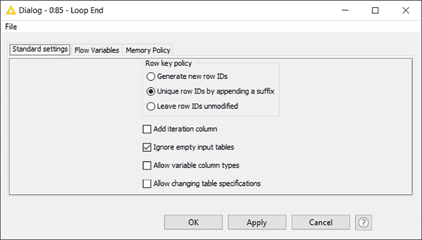

图 3.20：循环结束节点对话框：你是否要添加一个迭代列？

有时，您需要为每次循环收集多个表格（具有不同的列）。在这种情况下，您可以使用**循环结束**节点的两端版本，您可以在同一存储库文件夹中找到。

1.  让我们实现一个**循环结束**节点，在**行过滤器**后取消选中**添加迭代列**选项：我们不需要它，因为我们保持*子类别*的名称以指示我们所指的内容。节点的输出显示每个子类别三行，这正是我们需要回答业务问题的内容：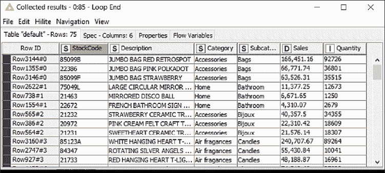

    图 3.21：每个子类别的顶级产品：每次循环返回三行，这些行已被循环结束节点拼接在同一张表中显示

    下一个问题要求我们按国家报告销售情况，识别我们发货最多的国家。我们只需再次聚合销售表，这次按国家分组，而不是按产品分组，我们可以重复使用**行过滤器**的输出（排除了“其他”类别）作为工作流程的新分支的起点。

1.  我们需要实施一个新的**分组**节点，其配置与我们早期用于按产品聚合的第一个**分组**节点类似，但组的定义不同。时间就是金钱，所以让我们复制并粘贴之前的**分组**节点，并将其连接到第一个**行过滤器**，如上所述。在其配置中，让我们只处理**组**面板：这次，我们希望*国家*是唯一定义组的列。我们可以保持**手动** **聚合**选项卡不变，因为我们仍然希望对收入和数量进行求和。

1.  为了使我们的输出更清晰，让我们使用**排序器**节点按照*销售额*降序排列行，类似于我们在早期分支中所做的操作。

    如*图 3.22*所示，我们可以确定大多数销售额来自于英国客户，考虑到我们在讨论一个英国公司，这是合理的。

    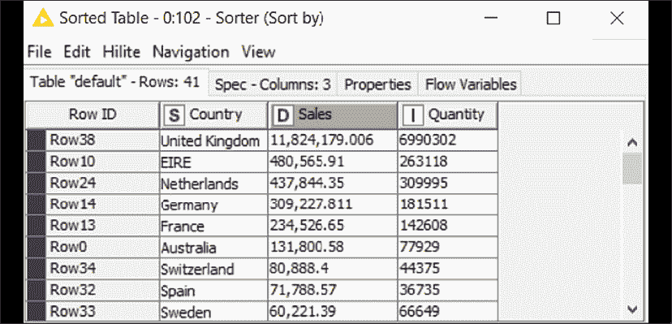

    图 3.22：每个子类别的顶级产品：每次循环返回三行，这些行已被循环结束节点拼接在同一张表中显示

当我们进入下一个业务问题时，我们注意到它们都涉及到一个我们至今忽略的维度——时间。为了继续生成我们的报告，我们需要按日期筛选（有两个问题要求我们聚焦于当前日历年的时间范围）并按月份重新聚合（以便发现季节性模式）。在 KNIME 中管理与时间相关的数据相对简单，因为有一组专门为此设计的节点。我们有可以将文本转换为 Date&Time 数据类型的节点（**String to Date&Time**），可以从 Date&Time 数据点中提取特定元素（如小时、月份或星期几）的节点（**Extract Date&Time Fields**），以及根据某些*时间*逻辑筛选行的节点（**Date&Time-based Row Filter**）。在接下来的几页中，我们将逐一学习如何使用这些便捷的节点。

## 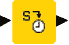 *String to Date&Time*

这个节点（**其他数据类型 > 时间序列 > 转换**）将文本列转换为 Date&Time 值，以便可以在与时间相关的节点中使用。该节点会尝试自动识别字符串中 Date&Time 字段的格式，用户也可以手动输入文本字段的预期格式。在其配置窗口中，您可以首先指定哪些字符串列应该被转换（确保右侧仅包含包含 Date&Time 的列）。

在**替换/追加选择**面板中，您可以决定是替换列为其转换后的版本，还是添加列，并在其标题中添加固定后缀。在最后一个面板中，您可以输入一个字符串来说明期望的**日期格式**：例如，字符串如 `16/02/2023` 会使用格式字符串 `dd/MM/yyyy` 正确解析。点击**猜测数据类型和格式**按钮，KNIME 会尝试通过分析第一个单元格的内容来识别格式，您可以在下面的标签中查看该内容。如果自动猜测无法工作，您可以使用像 `d`、`M`、`y`、`h`、`m` 和 `s` 这样的字符手动输入自己的字符串，这些字符分别代表天、月、年、小时、分钟和秒（查看节点描述以获取完整的格式占位符列表）。您还可以选择一个区域设置（称为**区域**，如**en-US** 或 **it-CH**），以确定预计的语言，用于像月份或星期几名称这样的字段：

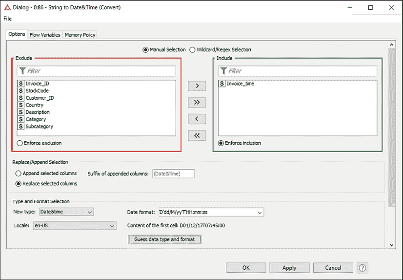

图 3.23：String to Date&Time 配置窗口：将文本字符串转换为 Date&Time 值

1.  让我们实现一个**字符串** **到** **日期和时间**的节点，并将第一个**行过滤器**的输出连接进去（我们仍然可以重用它，因为它携带了已清理版本的表格）。在右侧选择面板中仅保留*Invoice_time*列，并点击**猜测数据类型和格式**，让 KNIME 找出一种方法来解释该字符串。我们得到的格式字符串是`'D'dd/M/yy'T'HH:mm:ss`，它完美匹配我们表格中第一个值的内容（`D01/12/17T07:45:00`）。

    运行该节点后，我们注意到输出表中，*Invoice_time*列顶部的图标不再是“S”字母，而是一个日历图标：KNIME 现在将把该列视为日期和时间字段，我们可以使用所有其他与时间相关的节点对其进行处理。由于业务问题聚焦于当前的日历年份，我们需要找到一种方法根据日期过滤行，这正是我们下一个节点的专长。

##  *基于日期和时间的行过滤器*

该节点（**其他数据类型 > 时间序列 > 转换**）根据指定的时间范围应用行级过滤。要配置它，首先需要选择用于过滤的列（该列必须为日期和时间类型）。然后，你可以声明要保留的行的区间：你可以指定一个下限（包括所有晚于你在**开始**面板中声明的时间点的值），上限（保留所有在**结束**面板中声明的时间点之前发生的内容），或两者（使其成为一个闭区间）。上限可以通过输入一个特定的时间点（选项**日期和时间**），从开始时间起的复合区间（选项**持续时间**，例如`2y 1M`，表示从开始起的两年零一个月），或者从开始起的特定时间段数（选项**数字**，例如从开始起加或减 10 小时）来定义。通过选中**包含**复选框，所有等于开始（或结束）日期的值都会保留在输出中：

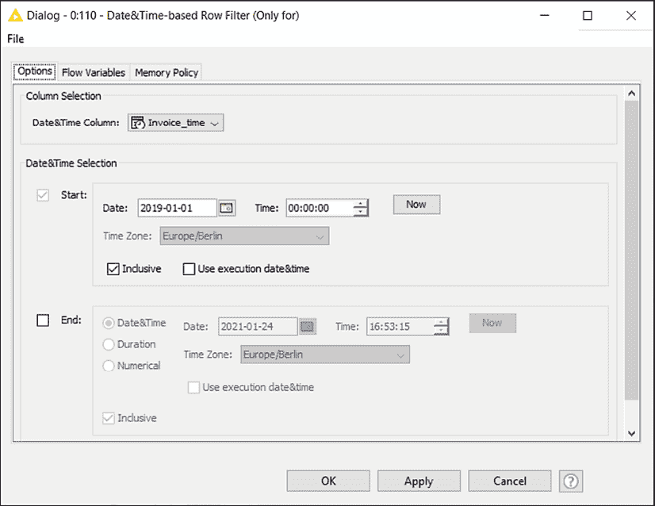

图 3.24：基于日期和时间的行过滤器节点配置：仅保留与特定时间范围相关的行

1.  由于业务问题仅涉及最新的日历年（在我们的数据集中是 2019 年），我们需要实现一个**基于日期和时间的行过滤器**节点来移除所有早期的行。在其配置中，我们可以取消选中**结束**框（我们知道日期不会超过 2019 年），并在**开始**框中输入`2019-01-01`作为**日期**，`00:00:00`作为**时间**。

1.  由于问题要求我们计算每个产品类别产生的收入，因此我们只需要按*类别*对结果行（现在仅指 2019 年的数据）进行分组。实现一个**分组**节点，在**分组**定义中仅保留*类别*，并在**手动聚合**面板中保留*销售额*和*数量*的常规求和。同时，这一次，我们希望保持命名简洁，选择**保留原始名称**在底部下拉框中：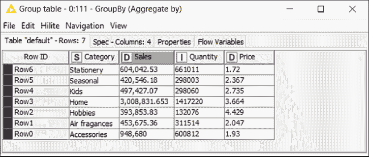

    图 3.25：2019 年按类别销售情况

又一个问题得到了解答！我们成功地将销售限制在了感兴趣的时间范围内，并按我们需要的粒度汇总了销售数据。接下来的问题稍微复杂一些：我们需要计算每个类别的相对足迹，占总收入的比例。这意味着我们应该将各个类别产生的销售额除以总销售额。我们可以使用**数学公式**节点来实现这个除法运算：除法的分子很容易获取（它是**销售额**列，这是我们之前通过**分组汇总**节点得到的结果）。然而，分母需要单独计算并以某种方式包含在公式中。这就是**变量**派上用场的地方。虽然并不是每个用户都需要在 KNIME 中使用变量，但让我们了解一下基础知识。你可以将接下来几页内容视为成为独立 KNIME 用户的可选学习内容。

KNIME 中的变量可以用来动态控制任何节点的配置。到目前为止，我们一直通过手动操作节点的配置窗口来定制节点的行为。在大多数情况下，这已经足够了。然而，有时我们希望通过一个变量来配置节点的参数，而这个变量可能是某个在另一个节点中执行的计算结果。例如，在我们的销售足迹计算中，我们希望使用总销售额的汇总作为公式中的变量。

一般来说，节点的任何配置参数都可以通过变量进行控制。如果你打开任何节点的配置窗口并进入名为**流程变量**的标签页（我们到目前为止还没有使用过），你会看到该节点所需参数的列表，并且可以选择哪些变量（如果在工作流的这一点有可用的变量）应当用于控制它们。

要使变量可用，你需要将它们注入到工作流中。最简单的方法是使用一个特殊的节点——**表格行到变量**，将数据表中的值转换为变量。

## 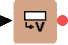 *表格行到变量*

这个节点（**工作流控制 > 变量**）将输入表格的第一行中的所有值转换为独立的变量，每个变量的名称与对应的输入列相同。它的配置窗口让你选择哪些列的第一行值应该被转换成变量：

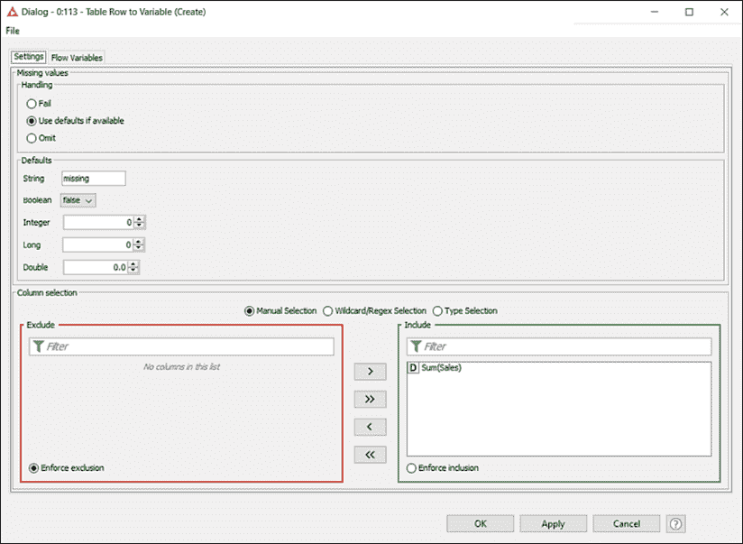

图 3.26：表行到变量节点的配置：选择要转换为变量的值

该节点的输出端口是一个红色圆圈，表示流变量。你只需将这个输出端口与接收节点的主体连接，就可以将变量注入到任何节点。

KNIME 中的每个节点都有可用的流变量端口。默认情况下，它们是隐藏的。要显示它们，只需右键点击节点，然后点击**显示流变量端口**。

需要澄清的是，这个节点仅会将表格中*第一行的值*转换为变量。如果你需要遍历不同的值，可以使用**表行到变量循环开始**节点。使用这个节点（例如，与**循环结束**节点一起使用，你已经见过它），你可以创建一个循环，在每次迭代时，变量的值会赋予每一行输入中的值。

现在我们知道如何在 KNIME 中实现变量了，我们可以创建一个包含销售总聚合的变量，然后在**数学公式**节点中使用该变量，计算销售足迹。让我们使用**分组**来聚合总销售额，然后使用**表行到变量**节点将该数字转换为变量。

1.  我们需要将 2019 年发生的所有销售合并成一行，保存生成的总收入。让我们实现**分组**并将其连接到**日期和时间基础的行筛选器**节点的输出端口。由于我们只需要一行包含总额的数据，因此可以将**分组**面板留空：这会在我们的节点上生成一个警告，但我们知道这么做的原因，因此可以忽略它。在**手动聚合**面板中，我们添加常见的*销售*列，并通过**求和**函数进行聚合。为了避免与变量名称混淆，这次我们选择**聚合方法（列名）**作为命名约定（底部菜单）。一旦我们运行节点，就会得到一个简单的输出，这正是我们想要的：一个包含 2019 年总销售额的单行单列表格。

1.  我们现在准备通过在**分组**后实现**表行到变量**节点，将这个值转换为变量。此节点无需配置，因为我们可以将所有列（在我们的案例中只有一列）转换为变量。

1.  现在终于到了进行足迹计算的时候。让我们实现一个**数学公式**节点，并建立我们需要的两个连接。首先，这个节点应该接收作为输入的表格，即我们在几步之前用来按类别计算总销售额的**分组**结果。其次，我们应该通过创建一个连接，将**表行到变量**节点的红色端口与**数学公式**节点连接，从而注入包含总销售额的变量。为此，你可以点击红色圆圈，按住按钮，并将其释放到**数学公式**节点图标上。

    虽然这不是必需的，但如果你想查看任何节点的变量端口，只需打开弹出菜单（右键点击节点），然后点击**显示流变量端口**。

    节点配置对话框现在允许我们使用刚刚注入的流变量。你会注意到该变量（名为*Sum(Sales)*)）出现在右侧的**流变量列表**中。我们可以通过使用鼠标和键盘计算足迹，并获得表达式：`$Sales$/$${DSum(Sales)}$$*100`。我们可以附加结果列，并将其命名为*Footprint*，为了简便起见，通过勾选底部的最后一个复选框将其转换为整数：

    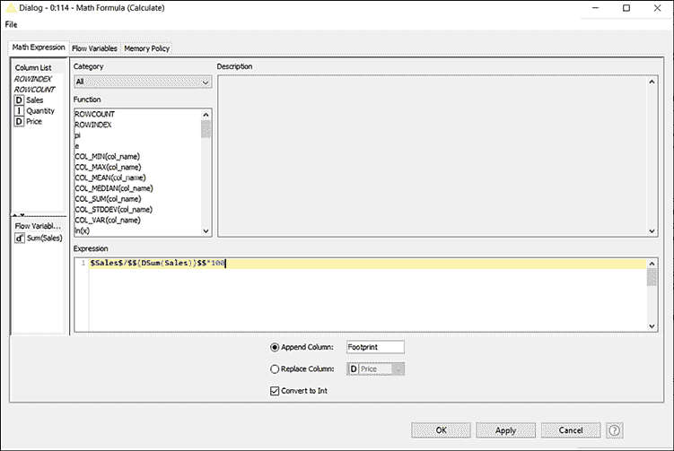

    图 3.27：足迹计算的数学公式节点配置：我们可以看到左侧的列和变量，准备在表达式中使用

此外，这个商业问题现在已经得到了适当的答案：数学公式的输出包括每个类别的足迹和其总销售额，一次性解答了两个问题。我们还剩下最后一个问题需要解决，这将需要生成一个图表。对于之前的所有问题，我们已经生成了一些表格：把所有这些表格汇总到一个包含多个标签的 Excel 文件中，以便我们能够轻松地传播报告并以紧凑的形式呈现，这将是非常不错的。

1.  让我们实现一个**Excel Writer**节点。由于这次我们需要将四个不同的表格保存到一个 Excel 文件中，我们需要为节点添加三个输入端口。为此，点击节点图标左下角出现的三个点，然后选择**添加端口** | **表单输入端口**。再重复这一操作两次，总共获得四个输入端口。将提供*回答*我们目前已处理的五个问题的节点的输出端口连接到这些输入端口（包括整体前十名产品、按子类别的前三名、按国家的销售额以及最后一个数学公式的输出，其中包含 2019 年按类别计算的足迹和销售额）。在**Excel Writer**的配置中，这次我们会看到**Sheets**面板中有四个文本框：我们可以使用它们为每个表格分配一个有意义的名称，帮助阅读报告的人理解。声明输出文件的完整路径和名称（点击**浏览...**按钮选择），然后我们就准备好关闭配置并执行该节点了：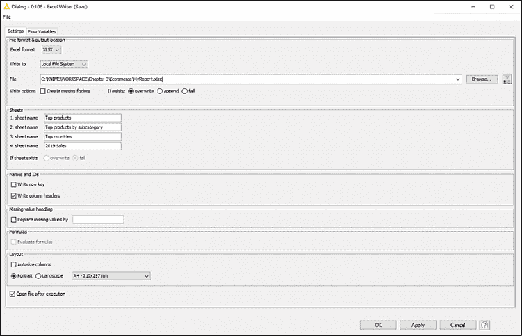

    图 3.28：Excel Writer 的配置：你可以为每个工作表命名

最终生成的 Excel 文件正如我们预期的那样：我们有四个标签，每个标签关注我们业务的不同方面，直接回答了我们曾经提出的常见问题。

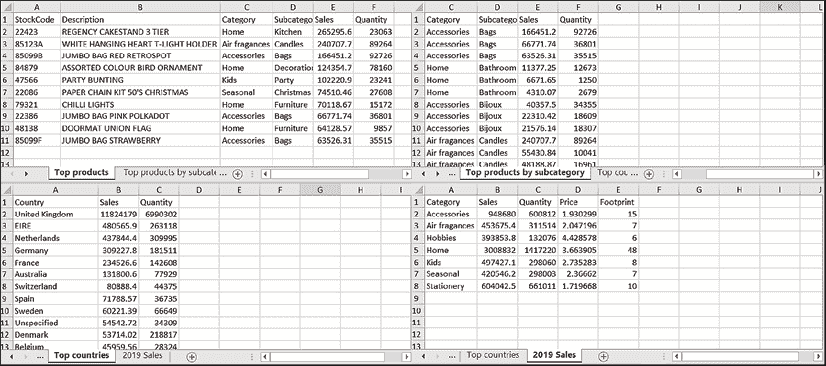

图 3.29：Excel 中的输出文件包含四个工作表，解答了五个商业问题

现在是时候进入最后一个业务问题了，那就是关于我们季节性子类别（“圣诞节”、“夏季”和“复活节”）的月度销售峰值。为了展示全年的季节性模式，我们决定按月份/子类别组合汇总销售额。透视表将实现这种二维聚合，便于在折线图上显示。唯一需要解决的复杂问题是与按月份聚合相关的问题。实际上，到目前为止，我们并没有将月份单独列出，因此无法直接进行聚合。幸运的是，有一个节点可以从日期和时间列中提取任何时间字段。

##  *提取日期和时间字段*

该节点（**其他数据类型 > 时间序列 > 转换**）会为每个日期或时间字段（如年份、月份、星期几、小时、分钟等）创建一个单独的列，从给定的日期和时间输入列中提取。其配置要求我们选择日期和时间源列，然后勾选要提取的字段。由于某些字段可能会受到地区和语言差异的影响，你可以指定你希望使用的**区域设置**。例如，如果你提取 12 月的月份名称，并使用**es-ES**区域设置（西班牙语），你将得到`diciembre`：

![图形用户界面，应用程序]

描述自动生成

图 3.30：提取日期和时间字段节点的配置：选择你希望作为单独列显示的字段

1.  现在让我们实现一个**提取日期和时间字段**节点，并将**字符串到日期和时间**的输出端口连接到它（我们希望考虑整个数据集——不仅仅是 2019 年——因此我们希望构建一个单独的分支）。配置很简单：输入表中只有一个日期和时间字段，所以它已经在顶部的下拉菜单中被选中。我们只需要提取**月份（数字）**，所以这将是唯一需要勾选的框。

1.  现在我们可以按月份和子类别总结销售情况：添加一个**透视**节点，并配置它，使得**分组**由新创建的列（*Month (number)*）定义，**透视**由列*Subcategory*定义，**手动聚合**设置为**销售额**的**总和**。为了保持标题整洁，我们可以在底部的下拉菜单中选择**透视名称**作为**列名称**，并将**保持原始名称**作为**聚合名称**。

    季节性可以通过一个漂亮的图表来更好地展示，而不是使用表格。要在 KNIME 中构建图表，你可以使用其中一个可视化节点（在**视图 > JavaScript**的库中查看），就像我们将用于折线图的节点。

##  *折线图*

此节点（**查看 > JavaScript**）根据输入端口给定的数据生成一条折线图。在配置节点时，您需要指定用于横轴（**x 轴**）的列，以及用于可视化为独立线条的列（**y 轴**）。此外，您还可以在节点的输出端口生成静态矢量图像（SVG 格式）：要启用此功能，请勾选顶部的**在输出端口创建图像**框：

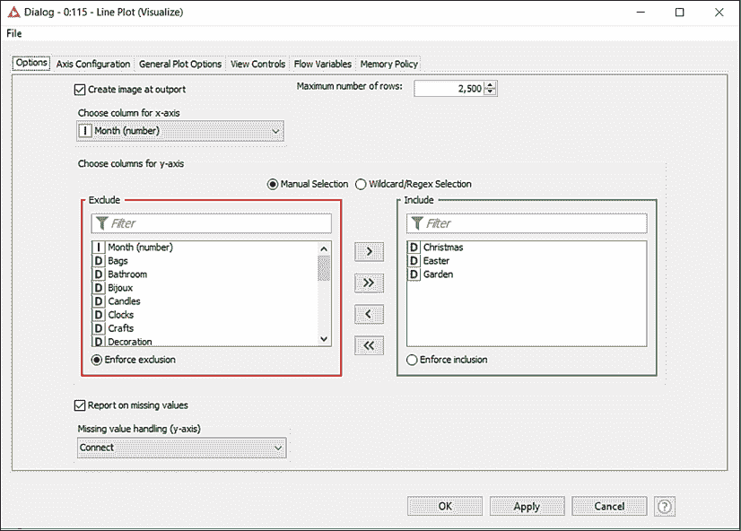

图 3.31：折线图节点配置：选择在图表的横轴和纵轴上使用哪些列

在**轴配置**面板中，您可以指定横轴和纵轴的标题，而在**常规图表选项**中，您可以设置**图表** **标题**、**图表** **副标题**以及输出图像的大小。

1.  让我们实现一个折线图（从节点库中选择 JavaScript 版本），并将**透视**节点的第一个输出连接到它。在配置时，选择*月份（数字）*作为**x 轴**，并选择与季节性子类别（*圣诞节*、*复活节*、*花园*）相关的列作为**y 轴**。我们还将勾选第一个选项框，以便在输出端口生成矢量图像。为了使图表更易读，我们还可以使用**轴配置**面板添加轴的名称（`销售`和`月份`即可）。要执行该节点并立即打开其输出，右键单击该节点，然后选择**执行并打开视图**（或*Shift* + *F10*）：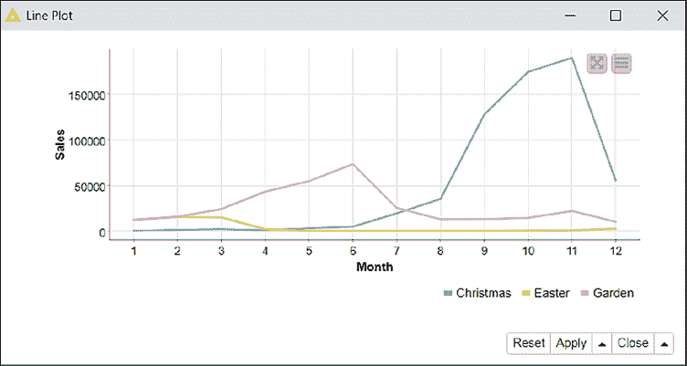

    图 3.32：折线图节点输出：我们的季节性子类别显示出不出奇的月度模式

图表的输出向我们确认了我们期望从子类别中得到的季节性模式：线条的形状可以帮助我们为未来几年可能遇到的需求做好规划。将此图表导出为矢量文件以便在精美的展示中使用会非常不错——最重要的是，正如我们将要学习的那样，利用这个图表构建一个引人入胜的故事！

##  *图像写入器（端口）*

此节点（**IO > 写入**）将图像保存为单独的文件。唯一需要配置的项是指定**输出** **位置**。您可以通过点击**浏览...**按钮在文件系统中选择它：

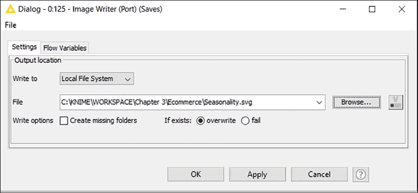

图 3.33：图像写入器（端口）节点配置：您希望将图像文件保存在哪里？

1.  让我们实现**图像** **写入器** **（端口）**节点；将**折线图**节点的输出连接到该节点（绿色方形连接器表示我们在此传输图像），并通过指定输出文件的保存位置来配置它（确保您指定完整的文件名，包括`.svg`扩展名）。

你做到了！虽然花了一些时间，但这笔投资是完全值得的：现在你的工作流可以在几秒钟内生成一个多页报告（并且在需要时，提供季节性模式的可视化证明）。每当有新数据可用时，整个工作流可以通过重置（选择初始节点并按*F8*）并只执行最终节点（或按*Shift* + *F7*一次执行所有节点）来重新运行：不再有人工错误或繁琐的 Excel 手动步骤。财务分析师非常感激，因为她现在可以将每周五用于整理报告的时间，重新投入到更具价值的工作中，例如深入分析数字，提供数据证据的相关解释，并为改善未来的业务成果提供一些建议。

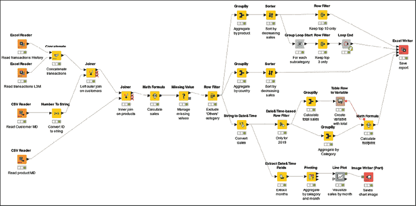

图 3.34：看起来像一条鱼，但它是一个自动化销售报告的工作流

在看到你实际操作后，她现在对 KNIME 产生了浓厚的兴趣，并希望将来能自己学习如何自动化她的数据工作。你已经成功地在工作场所种下了数据分析的热情种子，而且看起来这种热情正在有感染力地传播开来。

# 总结

完成本章后，你在成为数据分析的自信用户方面已取得决定性进展。你已经学会了通过创建简单的实体-关系模型，为数据库提供一定的逻辑结构。你还体验了转换数据资产的基本操作，如按需合并表格和聚合值。你的分析工具箱变得更加丰富：有了十四个额外的 KNIME 节点，你现在可以构建一些简单的描述性分析工作流，并通过循环和变量自动化它们的执行。完整的教程让你积累了构建一个能够为反复出现的问题提供系统性答案的机器的第一手经验，从一组业务问题出发，并交付一个可重复的流程来回答它们。

在下一章，我们将通过引入人工智能的基本概念将这一切提升到一个新的水平：我们将很快发现如何构建能够从数据中自主学习并支持我们工作的机器。
