# 第四章：什么是机器学习？

自动驾驶汽车、超精确的机器人外科医生、无可挑剔的虚拟助手、全自动化的金融交易员：一些最具前景的人工智能应用似乎更像是科幻小说中的素材，而非即将成为现实的前景。我们可以仅仅通过收集和呈现算法奇迹的轰动故事来填满整本书。如果我们能够——相反——牢牢站稳当下的基础，并认识到智能算法*已经*能够支持我们日常工作需求，那么我们就开始为我们和我们的业务解锁实际价值。这正是本章的核心内容：通过亲自了解主要的机器学习算法和技术，剥去神话，面对现实。最终目标是让我们将它们视为日常伴侣，而不是遥不可及、未来的可能性。

在本章中，我们将找到以下问题的答案：

+   什么是人工智能和机器学习？

+   什么是解决商业问题的“机器学习方法”？这种方法与传统方法有什么区别？

+   机器是如何学习的？有哪些算法可以实现这一目标？它们是如何工作的？

+   在选择适合我的商业需求的模型时，我需要考虑哪些权衡？

+   我如何评估机器学习解决方案的表现？

尽管本章是全书中最“分析性”的章节，你将只会遇到少量的数学公式。关键是帮助你直观地理解机器学习是如何工作的，而不是提供背后的完整理论背景。

想一想：你不需要成为数学家才能使用数学，也不需要成为计算机科学家或专家程序员才能使用计算机！同样，接下来的几页不会让你从零开始重建完整的建模流程：它将向你展示如何利用那些——剧透一下——已经方便地在像 KNIME 这样的软件平台中实现的流程。在本章中，我们将学习成为机器学习用户所需的基本知识，而在接下来的章节中，我们将通过完整的教程实践这些知识。你可能急于跳入实践，但我强烈建议你先完成本章，确保自己掌握了基础知识后再继续前进。系好安全带：让我们谈谈人工智能！

# 介绍人工智能和机器学习

*机器能思考吗？* 这是英国博学者、战时破译员艾伦·图灵在他 1950 年发表的开创性论文中提出的问题，这篇论文为人工智能的基础奠定了基础。虽然图灵并没有使用“人工智能”这一术语（它作为一个研究领域在六年后才被提出），但他坚信机器最终会在*所有纯粹的智力领域*与人类竞争。

使用科技设备来扩展并部分替代人类智力并不是一项新探索。早在 17 世纪，法国数学家和哲学家布莱兹·帕斯卡尔发明了**帕斯卡计算机**（*图 4.1*），这是一台完全可工作的机械计算机，能够通过旋转刻度盘进行加法和减法运算。

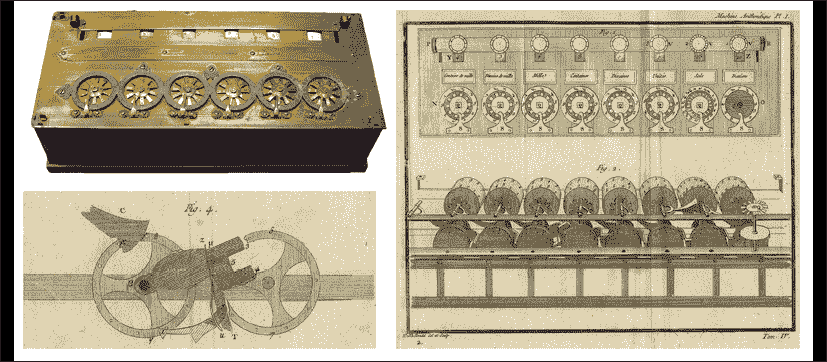

图 4.1：帕斯卡的算术机，又称帕斯卡计算机。从左上角顺时针方向：1652 年建造的原始设备；底层齿轮系统的视图；用于加法进位的巧妙机制——sautoir 的详细设计图。照片由 Rama 拍摄，来自 Wikimedia Commons，Cc-by-sa-2.0-fr。

计算数学运算是一项非常具体的智力任务。然而，帕斯卡计算机早期证明了技术可以复制并放大人类进行脑力劳动的能力，而不仅仅是物理活动。这就是人工智能的核心：**人工智能**（**AI**）被定义为机器执行显示*某种*形式的人类智能的能力，例如解决逻辑问题、使用语言进行沟通、识别视觉和听觉模式、理解环境或协调身体动作。在人工智能的更广泛领域中，**机器学习**（**ML**）专注于人工复制人类智能的*特定*方面：学习的能力。

当学习能力应用于任何业务时，具有巨大的潜在价值。如果一台机器能够自动从数据中学习，那么我们就可以利用它持续增长对客户、竞争对手和自身运营的知识。我们可以通过更好的决策减少成本、简化流程、增加收入、积极应对未来，甚至改善客户体验——进而提升客户忠诚度。机器学习算法是推动我们业务增长的 tireless 合作伙伴：它们能够扩展我们团队的整体智慧，利用数字技术的强大计算能力（这种能力随着时间的推移越来越便宜）以及本应闲置在公司数据库中的大量数据。自主学习的强大潜力解释了为什么在过去几年里，机器学习在流行度上迅速超越了它的概念母体——人工智能，成为每个人口中最流行的技术现象。如今，人工智能和机器学习常常被视为同义词，在本书的其余部分，我们将主要提到后者。为了避免你在进一步阅读时的困惑，只需记住：人工智能关注人类智能的整体范围，机器学习则专注于自动学习这一部分。

**算法**是解决问题的程序，换句话说，是一系列可以遵循的预定义步骤，用以解决特定任务。机器用来乘法两个数字，或者根据以往的数值做出预测的步骤，都是算法的例子。计算机通常能够解决复杂的问题，前提是人类为它们提供了正确的算法来执行。

关于我们可以用人工智能解决的任务性质及由此产生的分类，需要做一个重要的澄清。事实上，研究人员假设存在两种类型的人工智能：强人工智能和弱人工智能：

+   **强人工智能**（或**AGI**，**人工通用智能**）是指机器有可能理解并执行*任何*智力任务的假设能力。强人工智能会自主地“理解需要做什么”，然后“去做”，甚至表现出那些使我们成为人类的特征，比如意识、自我意识、创造力、意图性和感知能力。尽管强人工智能的概念既令人着迷又让人害怕，但今天它仍主要属于理论推测或虚构探索的领域。许多研究人员认为，AGI 还需要几十年才能实现，而有些人则认为它永远不会成为现实。无论如何，我们在本书中不会进一步探讨这一话题：相反，我们将专注于另一种类型的人工智能，它无疑更接近实现。

+   **弱人工智能**指的是机器解决*预定*和特定任务的能力，比如预测未来的销售额、预测用户在特定情况下的行为，或者揭示优化某一特定业务流程的方法。要实现弱人工智能，始终需要人为操作员在设置过程中扮演一个基础性角色：算法需要被引导到待解决的问题，并且最初需要进行调整，以便能够以最佳状态运行。在本书的下一部分，我们将学习如何做到这一点：通过正确的方式设置合适的算法，使其在我们的日常工作中驱动价值，从而使它们以最佳方式为我们带来好处。

由于强人工智能离我们还很远，而弱人工智能显然依赖于正确设置它的人类操作员，因此有一件事是明确的：人类与机器之间并不处于冲突中，不是在为工作场所的主导地位而争斗，保护自己的工作。事实上，情况恰恰相反：当人类与机器协作，通过“正确指导”它们的学习过程时，奇迹就发生了。当这种情况发生时，智能机器展现出它们的全部价值，最终使得它们的人工伙伴受益。考虑到这一点，我们开始学习如何正确地指导人工智能，识别在商业场合中，合适的算法能够带来不同的影响。

# 机器学习的方法

具有讽刺意味的是，阻碍机器学习在商业中应用的主要障碍既不是算法的实现，也不是数据的获取（*如何*）：最困难的部分是识别出正确的时机来使用它（*为什么*）！我们需要在复杂的商业流程图中（即公司的运营模式）识别出那些如果采用算法可以带来实际价值的具体步骤。如果我们培养出识别这些杠杆点的敏感度，那么我们将能够在工作中找到将机器学习付诸实践的首个机会。

有一种机器学习的方法（我们可以称之为**机器学习方式**）来运营商业流程。让我们通过三个示例场景来区分传统方式和机器学习方式在数据创造价值上的不同。

## 场景 #1：预测市场价格

你在一家专注于多品牌二手车的汽车经销商工作。你注意到一些汽车因为最初定价过高而比其他汽车更难出售，这使得它们的销售周期更长。为了改善这种情况，你希望实施一种基于数据的技术解决方案来指导定价过程：目标是预测每辆车的实际市场价格，从而保持库存控制，同时最大化收入。

这里有两种可能的解决方法：

+   传统的方法是制定一套规则，定义汽车的各项特征如何影响市场价格，并构建一个实现这些规则的“计算器”。该计算器将利用一系列可用的数据点（如不同品牌和车型的新车起始价格，或配件成本）以及一些通过常识和有经验的业内人士定义的经验法则。例如，一些规则可能是：*汽车在第一年贬值 20%，然后每过一年再贬值 15%*，或者*每年行驶超过 10,000 英里的汽车属于高里程车，其价值进一步降低 15%*，等等。为了构建这个计算器，你需要使用编程语言实现这些“如果-那么”规则，这意味着你还需要一个程序员来开发和维护代码。

+   机器学习方法是让算法分析与先前销售相关的所有数据，并自主“学习”将汽车特征（如里程、年龄、品牌、型号、配件等）与实际销售价格之间的联系。算法可以识别一些反复出现的模式，这些模式部分验证了我们已经有的规则（也许为这些大致的经验法则增加了一个更精确的层次），部分则发现了新的和意外的关联，这些是人类未能识别并总结成简单规则的（例如，*X 型号在配备这种稀有选装件时贬值速度比其他车型慢 37%*）。使用这种方法，机器可以随着时间推移不断学习：定价背后的规则将随着新的销售发生和新车型进入市场而自动更新。

主要的区别在于，传统方法中的定价预测将依赖于现有的人工知识（如果得到适当的文档化和编码化），而机器学习方法则提供了让机器从数据中自主学习这些知识（以及可能更多的知识）的可能。

## 场景 #2：客户细分

你在一家本地超市连锁的市场营销团队工作。你负责准备一份每周的电子新闻稿，发送给那些注册了忠诚计划并选择接收你邮件的客户。你不打算发送统一的新闻稿给所有人，而是希望制作合理数量的不同版本，并根据不同的群体进行分发。通过选择更贴近各个群体需求的关键信息和特别优惠，你的目标是最大化客户群体的参与度和忠诚度。

至少有两种方法可以创建这样的群体：

+   传统的方式是运用常识和你现有的知识来选择能够合理区分不同类型客户的特征，每种类型的客户有着更具体的需求。例如，你可以决定使用家庭成员的年龄和平均收入水平来定义不同的群体：你可能会得到像是*富裕家庭有孩子*（你可以向他们推荐优质的儿童产品）和*低收入的 60 岁以上空巢老人*（他们更关注高性价比的优惠）。这种传统方法假设每个群体内部的需求——在此案例中仅通过年龄和收入来定义——是同质的：我们可能会忽略其他维度上存在的一些有意义的差异。

+   机器学习（ML）方式是让算法帮助我们识别出一批在购物行为上表现出相似性的客户群体。由于不受人类认知能力的限制（人类很难同时考虑数十个变量）以及个人偏见的影响（由个体的经历驱动），算法可以识别出那些更加具体并且与每个客户实际偏好紧密相关的群体，比如*周末购物的美食爱好者*（我们可以每周六早晨向他们发送一些精美的食谱）和*高收入宠物主*（他们想要照顾自己心爱的毛茸茸伙伴）。

传统方式通常通过考虑显而易见的——有时甚至是幼稚的——差异来区分行为，而机器学习方式则直接切入核心，识别出那些最能描述我们客户群体多样性的同质群体，确保每个人都被包含并参与其中。

## 场景 #3：寻找最佳广告策略

你在一家中型公司负责数字营销工作，公司的主营业务是在线照片打印服务。你的职责是定义并执行数字广告活动，最终目标是最大化广告的回报。与你只使用同一内容进行单一广告活动不同，你希望通过测试不同的数字资产并观察哪些最有效来优化你的策略。例如，你可以制作展示不同产品的横幅（比如照片书和印有肖像的有趣杯子）、不同颜色和字体，或者广告语文本的不同版本。你可以在社交媒体和搜索引擎上发布广告，并且能够控制每次测试的预算和持续时间。

在这种情况下，我们可以识别出两种可能的方式来实现这一目标：

+   传统方式是进行所谓的 A/B/n 测试：你定义几种不同的执行方案（例如，三则相似的广告，使用相同的图形，但有三种不同的号召性用语，如*立即购买*、*查看此处*，或*点击了解更多*），然后分别执行每一个——假设我们执行每种广告 10,000 次，并通过计算每种执行带来的订单数量来评估它们的个别回报。你还需要重复进行测试，检查其是否依然有效。如果你希望优化其他维度（例如广告展示的时间，用户所在的地理位置等等），你将最终需要测试更多的组合（并且实验的成本也会增加）。

+   机器学习的方式是让算法动态决定测试和方式，逐步朝着通向最佳变量组合路径前进。一开始，算法会像 A/B/n 测试一样开始，尝试一些随机组合：这足以掌握一些最有前途的方向上的初步知识。随着时间的推移，算法将越来越多地将注意力（和预算）集中在表现最佳的少数路径上，并用越来越多的因素进行调优和丰富。最终，算法可能会做出一些非常具体的选择，比如*使用粉色字体并为通过笔记本连接的 50 多岁人群展示一张照片杯*。

在两种方法中，我们都使用了测试来了解最佳广告策略是什么。然而，在传统的 A/B/n 测试方法中，我们不得不基于先前的知识和常识来定义测试设置。在机器学习方式中，我们让机器坐在驾驶座上，并让它与环境互动，逐步学习，并动态调整测试策略，以最小化成本并获得更高的回报。

## 学习机器的业务价值

这三种情景揭示了传统方式和机器学习方式在运营业务流程中的一些重要差异。让我们来看看我们从机器学习中获得的逐步好处：

+   两种方法都依赖于技术和数据，但机器学习方式更广泛地利用它们。假设你允许算法探索大型数据库的全部信息内容。在这种情况下，您利用了数字技术的强大能力，并避免了人类认知能力的瓶颈。使用机器学习，将一次考虑更多的数据（想想要分割的客户的许多属性或区分数字广告的因素），这可能会导致更好的业务结果。换句话说，机器学习方式往往比传统方法更准确和有效，从而为依赖它的公司带来经济优势。

+   一旦正确设置，机器学习方式可以独立操作，并在其人类伴侣的最少监督下运行。这意味着驱动智力任务的自动化，从而为业务带来逐步的效率和生产力增长。由于这种自动化，机器学习算法可以始终保持运行，并在 24/7 的时间表上不断学习。这意味着随着更多数据的涌入，它们将越来越擅长于所做的工作，而不一定需要投资于进一步的升级或人类改进。想想市场上出现的新车型或数字广告服务的客户的不断变化的偏好：算法将警惕地观察现实，发现趋势突破者，并相应地做出反应以维持业务的运转。

+   传统方法依赖于*先前*的人类知识，而机器学习方法则生成*额外*的知识。这是机器学习一个具有颠覆性和吸引力的优势，叫做**知识发现**：学习算法能够提供对现实的更好甚至富有洞察力的理解（想一想解释汽车价格形成的微妙规则，或者将消费者归为同质群体的意外关联），这些是通过单纯查看数据无法察觉的。它是通过在事物运作方式中找到意外模式，从而*破解*现实的能力。如果学习算法能够将其结果呈现为人类可理解的形式（而很多算法确实如此），那么这些知识将成为组织在客户理解、市场动态、运营模式等方面的整体智慧积累：如果用得当，这些知识的价值堪比黄金！

通过提高流程的效率和效果，同时系统地获取对业务的额外理解，这些好处本身足以解释为什么机器学习目前在现代商业中爆炸式增长，并成为一种任何人都不愿冒失去风险的竞争优势。现在，让我们了解那些能够实现这一切的算法类型。

# **三种学习算法**

我们在前一部分看到的场景并不是随意选择的。它们符合机器学习（ML）算法的标准分类，主要包括三种基本类型：**监督学习**、**无监督学习**和**强化学习**。当我们想要应用机器学习方法时，我们需要选择这三条路线中的其中一条：我们的选择将取决于我们需要解决的问题的性质。现在，让我们逐一了解每个类别，以理解它们的组成以及它们所能完成的任务。

## 监督学习

在监督学习中，你的目标是通过从一些“已知”信息中学习，来预测某些“未知”的内容。理解监督学习方法的最简单方式是思考它与传统编程的不同。在*图 4.2*中，你会看到左边的设置非常熟悉。在传统计算机编程中，我们需要一些输入*数据*、一个*程序*和一个*计算机*来生成一些*结果*。程序是一系列指令——以机器可理解的语言描述，称为**编程语言**——计算机会根据这些指令对输入数据进行处理，最终返回所需的结果作为输出。在监督学习中，我们保持这四个元素（数据、程序、计算机和结果），但改变其中两个的顺序。如你所见，在*图 4.2*的右侧，在监督学习中，你将数据和结果作为输入提供给计算机，计算机则会返回一个程序作为输出，这个程序将“连接”数据和结果。

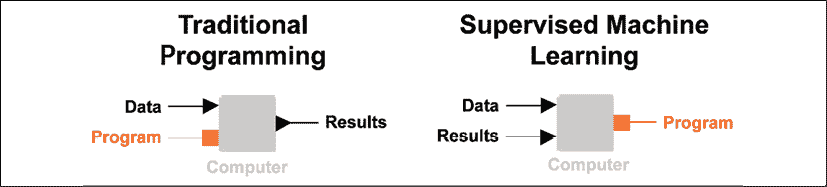

图 4.2：传统编程与监督学习方法的对比。要素相同，但顺序不同。

使计算机能够实现这种“魔法”的是监督学习算法：这是一系列步骤，可以找到一组变换（数学上称为**统计模型**），你可以将其应用于某些输入数据，从而获得接近所需结果的输出。得益于这些算法，计算机可以通过“学习”过去的数据（我们已知结果）来揭示连接输入数据与未知结果之间的大致机制。

如果将其应用于*《机器学习方法》*章节中介绍的**场景 #1**：汽车价格预测，情况会变得更加清晰。在这种情况下，我们的输入数据是已售汽车的已知特征。我们想要得到的结果是这些汽车的价格。如果我们采用监督学习方法，我们可以利用已知的*过去数据*（已售汽车的特征）和*过去的结果*（先前的销售价格），推断出这样的转化步骤（*程序*或模型），一旦应用于*未来数据*（即将售出的汽车特征），就能返回*未来结果*（预测价格）。在这种设置中（见*图 4.3*），机器学习算法被实现于**学习器**模块中。**预测器**模块则只是“执行”来自学习器模块提供的程序，处理新的数据点。

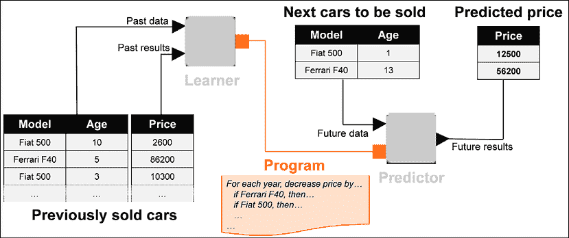

图 4.3：监督学习的实际应用：通过学习已售汽车的数据，理解汽车特征如何决定其价格的潜规则

得益于监督学习算法，它使学习者得以发现价格形成的“隐性规则”。法拉利的起始价会高得多，且随着时间的推移价格下降的趋势与菲亚特 500 完全不同：算法将发现这些规则。

需要注意的是，在监督学习中，你总是有一个特定的待预测度量：这被称为**目标**（或**因变量**）。在前面的例子中，汽车价格是我们学习的目标变量。所有其他用于预测目标值的变量被称为**特征**（或**自变量**）。*图 4.3* 中的模型和汽车的年龄是用于学习的两个特征。

当输入数据被“结果”（也称为**标签**）丰富时，称之为**有标签数据**。为了简单起见，可以这样理解：一个有标签的数据表通常会有多个包含特征的列，以及一个特定的包含目标的列。有标签数据是监督学习中不可或缺的成分。

根据目标变量的性质，可以识别出两种学习场景，这些场景需要在监督学习家族中使用不同的学习算法：

+   当目标变量是一个数值型指标（如*5.21* 或 *$23,000*）时，就需要使用**回归**算法。线性回归是最简单且最常见的能够预测数字的算法。

+   当目标变量是分类度量（如指示元素属于哪个类别或类的文本字符串）时，你需要一个**分类**算法。类别的例子有*红色*、*蓝色*和*绿色*，或者二分类类别如*真*和*假*，或者标识特定行为的标签，如*会购买此产品*和*不会购买此产品*。决策树、随机森林和支持向量机只是你想预测表中元素属于哪些类时可以使用的许多算法之一。你将在下一章学习如何使用其中的一些。

一些有监督的算法可以同时用于回归和分类。神经网络就是一个例子，它可以预测数字或类别。

逻辑回归算法（线性回归的一个变种）可以预测属于二元类别的可能性。因此，尽管它的名字容易让人混淆，逻辑回归实际上是一个分类算法。

在继续下一个类型的学习算法之前，值得思考一下为什么这个学习方法被称为有监督学习。我们可以做一个类比，想象有一个老师通过提供多个示例来讲解某个概念，老师希望学生通过注意到其中的联系来理解这个概念。在分享各种概念的例子（即标记数据）时，老师在*监督*学生的学习。如果没有那些已知结果（目标变量）的示例，老师将无法指导学生。这就是有监督学习的原因，你总是有一个目标变量，并且总是需要从一些标记数据开始。

让我们继续看下一个类型的机器学习算法，在这里，你不需要任何标记数据就可以开始学习。

## 无监督学习

在这种情况下，你的目标不是做出预测，而是揭示数据中隐藏的某些结构。无监督机器学习算法能够*探索*你的数据表，找出行和列之间关联的有趣模式。

无监督学习在许多使用场景中可以发挥巨大价值：

+   最简单的情况是**聚类**。这涉及到将数据点聚集在一起，形成同质的组，称为簇。每个组将包含“相似”的数据点。这正是我们在**场景 #2**中需要做的，在那个场景中，我们需要将类似的超市顾客分成不同的组，并向每个顾客发送有意义且个性化的新闻简报。像 K-means 和层次聚类这样的算法是无监督机器学习算法的好例子，专门用于识别簇。

在文本挖掘领域，聚类的一个有趣扩展是**主题建模**，即在文本文件中识别主题（概念相关词语的组）。一种最流行的主题建模算法是**潜在狄利克雷分配**（**LDA**）。

+   寻找**关联规则**是无监督学习覆盖的另一个常见需求。假设你有一个庞大的数据库，包含了超市中所有收据的描述。有些产品可能经常出现在同一张收据上：比如牛奶和咖啡，或者意大利面和番茄酱。像 Apriori 和 FP-Growth 这样的算法会寻找一些有意义且统计显著的规则，比如*购买意大利面的顾客很可能也会购买番茄酱*。这些规则可以为优化商店商品组合或定义哪些产品应当放在相邻的货架上（**市场篮分析**）提供有价值的信息。

+   无监督学习的另一个典型应用叫做**降维**。如果你有一个包含多个列的表格，其中某些列可能相互相关：因此，你的表格可能会出现冗余，因为某一列所包含的信息可能在其他列中已经出现。为了避免冗余带来的种种不利影响（如性能下降和准确性损失），值得在不丢失表格整体信息的前提下，减少表格中的列数。专门用于降维的算法，如**主成分分析**（**PCA**），可以探索表格的结构，并生成其“更精简”的版本（即列数更少，维度更低），但依然保留相似的信息内容。

现在让我们将这种无监督学习方法与我们之前讨论的有监督学习方法进行比较。关键的区别在于，无监督学习中，我们并不关心特征与目标之间的关系：实际上，最开始我们就没有目标列！事实上，无监督算法的输入数据是*无标签的*：不需要目标变量，也不需要标签。根据前面的类比，学生在这里不需要老师基于以前的例子进行任何“监督”。学习通过探索原始数据进行，寻找数据本身固有的模式（例如项目的聚类或元素之间的关联）。

在有监督学习中，我们可以轻松判断一个预测是否稳健（通过将其与“真实”值进行比较），而在无监督学习中，评估算法效果的难度要大得多。换句话说，无监督学习中没有明确的正确或错误答案，只有更多或更少有价值的结构被揭示。我们需要通过观察其是否契合我们最初的目标来衡量其有效性。稍后我们将更深入地探讨这一复杂性。

现在让我们继续讨论第三类也是最后一类的机器学习算法。

## 强化学习

在采用强化学习方法时，你通过反复与环境进行“试错”方式的互动来学习。与早期的学习方法的根本区别在于，在这种情况下，算法充当一个自主的*智能体*：根据当前的*状态*，它会决定采取什么*行动*，并在真实世界或模拟的*环境*中执行，然后——根据其行动的结果——更新策略，以最大化总体的*奖励*。正如你在*图 4.4*中所看到的，这些步骤通过一个不断改进策略的循环，遵循一个简单的常识性逻辑：如果我的行动所带来的状态带来了正向奖励，那么导致该行动的行为会得到正向强化（因此得名）。如果相反，这个行动带来了负向奖励，那么该行为应该受到惩罚，以防它再次发生。

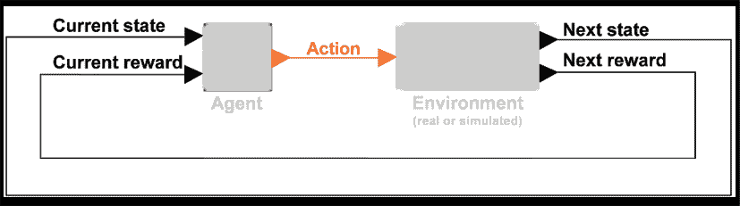

图 4.4：强化学习：一个自主智能体自由地与环境互动，并随着学习的进行不断改进。

我们可以识别出两种使用强化学习的场景：

+   你可以让智能体直接与**外部环境**互动，就像**场景 #3**中的例子，照片打印公司数字广告策略。通过一系列的迭代（测试不同类型的广告）并沿着一个逐渐增加奖励的路径（更高的媒体投资回报率）前进，最终我们将拥有一个坚实的策略，可以在我们的广告活动中采用。互动也可以发生在物理的、现实的环境中：例如，一个机器人手臂可以通过其相机传感器捕获的状态学习如何最好地移动一些包裹，并不断改进其引擎对这一目标的响应。像 Q-learning 这样的强化学习算法非常适合最大化这类系统的总奖励。

+   另一种方法是为一个或多个代理提供**模拟环境**，使它们能够虚拟地互动，并逐步从发生的事情中学习。这就是像**蒙特卡罗树搜索**（**MCTS**）及其最著名的实现——谷歌 AlphaZero——的算法的应用案例，它们证明能够从零开始学习，并通过“自我对弈”成为几乎任何游戏中的冠军。该算法开始时唯一需要的外部输入是游戏的正式规则列表：然后，它会像一个真正的自我学习者一样，只与自己对弈，并在需要时交换棋盘一方。以国际象棋为例：起初，代理将进行一些非常傻的游戏，这些游戏的动作是随机的（但形式上是正确的）。然后，逐渐地，它会学习到，通过做一些聪明的开局和防守棋盘上的一些关键位置，获胜的机会会增加。经过几个小时的学习（以及数百万局对弈），代理将微调其最有利的棋步策略，并成为任何人类国际象棋大师都无法战胜的存在。

强化学习的一个巨大优势是它不需要任何标签数据即可开始：代理会自主决定采取哪条实验路线并进行实验，在每个步骤中积累新的数据点。尽管强化学习具有很大的潜力，但由于实施中的实际挑战，例如建立与现实世界的有效“接口”或满足所有安全约束——比如确保代理在学习过程中不会造成任何“损害”——它仍然没有在商业应用中广泛使用。因此，在本书的其余部分，我们将重点介绍监督学习和无监督学习算法：它们可以帮助你在工作中快速创造价值，然后再转向更复杂的任务。

## 选择正确的学习算法

在过去的几页中，我们听到了几个不同算法的名称：这让我们对可用于“走机器学习之路”来解决问题的机器学习算法的广泛（并不断增长的）选择有了初步的了解。*图 4.5*展示了按学习类型（监督学习、无监督学习和强化学习）以及目标组织的机器学习算法目录。对于每种场景，我们都有多个可供选择的替代算法：*图 4.5*的右侧列出了最常用的算法：

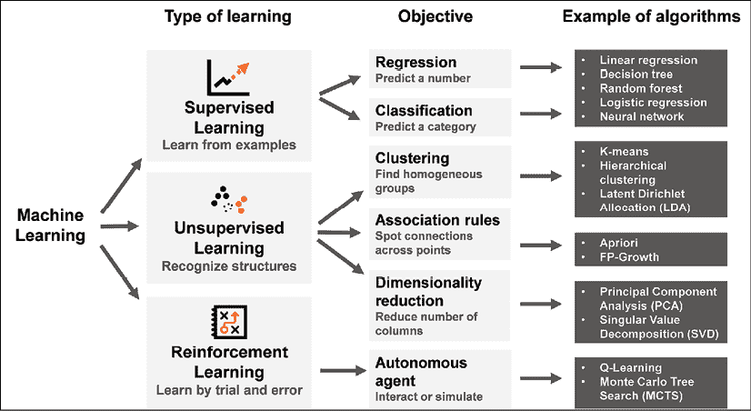

图 4.5：机器学习算法目录：根据你的需求，你可以选择不同的路线

作为机器学习的用户，你需要决定在众多备选算法中，哪些最适合你想完成的任务。每个算法都有其自身的逻辑，具备特定的优缺点：在选择它们时，你需要在它们的特性之间做出良好的权衡。例如，一个优秀的算法可能非常准确，但运行起来极其缓慢且昂贵，而另一个则正好相反：哪个最适合你呢？让我们开始熟悉定义各种算法的最基本属性：

+   **性能**。可能是最需要考虑的一个，它告诉我们“算法完成任务的表现如何”和我们期望它在未来“多么强健”。例如，在监督学习的情况下，我们会衡量我们的预测有多准确，或者换句话说，它们与现实“有多接近”。这是一个复杂的问题：稍后我们将深入探讨可以用来评估算法准确性和健壮性的多种衡量标准。

+   **速度**。根据执行完整过程所需的“迭代”次数，算法可能是慢且占用资源的，或者是快速且轻便的。

+   **可解释性**。一些算法提供人类容易理解的输出：当你想从数据中发现新知识并将其传递给他人，或者当你想给出一个充分的解释说明为何算法做出某个建议时，这是严格要求的。在其他情况下，我们不需要理解算法如何运作，且可以接受复杂（但准确）的*黑箱*输出，这些输出人类认知难以穿透。

+   **所需数据量**。一些算法只有在有大量历史数据点作为起点时才能表现良好。其他算法即使只有几十行数据也能保持健壮，并且不需要大数据就能工作。

+   **所需先验知识**。在某些情况下，算法要求你对预期的数据或所处的环境做出假设。其他方法则对其应用领域更为宽容，不要求任何先验知识。

这五个要点只是选择合适算法时可以考虑的众多属性中的一部分。好消息是，这些算法已经方便地在数据分析软件平台中实现，例如，作为 KNIME 节点或 Python 中的库。它们的现成可用让你可以“尝试一些”，然后做出相应的决策。

在某些情况下，你可以将不同的算法组合在一起，形成一个单一的学习过程。通过这种方式，你将同时利用两者的优势，集体平滑它们各自行为的边界：这被称为**堆叠**。

有一点是明确的：并没有一种“通用”的机器学习方法，你需要熟悉一系列替代的程序。这些算法就像是你背包中的工具，你可以根据需要使用它们。通过了解多种算法，你可以自由地在它们各自的特性之间做出合适的权衡，并尽力解决你在工作中遇到的大部分业务案例。

由于性能衡量是非常重要的，接下来我们将深入探讨如何评估机器学习算法的性能。

# 评估性能

衡量一个算法是否有效并不总是容易的任务。以无监督学习为例：我们期望一个优秀的无监督算法能够从数据中揭示最有趣和最有用的结构。然而，评估这些结构为何*有趣*或*有用*，将取决于你的具体目标，并且通常需要一些人工判断。在强化学习中，一个优秀的算法能够带回相当大的总奖励，解锁持续与环境互动并最大化回报的机会。在这种情况下，*奖励*的概念将依赖于具体的价值定义，这个定义由我们所解决的案例决定。

如果我们留在监督学习的领域，性能评估就更加直接了：因为我们的目标是预测某些内容（数字或类别），我们可以通过衡量预测样本和已知样本之间的差异来评估性能。这个预测与实际值之间的比较结果可以浓缩成总结性的评分。让我们了解回归和分类的这些评分。

## 回归

由于回归问题本质上是预测数值，评估其性能意味着衡量预测结果与我们试图预测的实际值之间的总体距离：距离越小，误差越小，误差越小，效果越好。在*图 4.6*所示的简单线性回归中，我们仅基于汽车的年龄（我们唯一的自变量）来预测二手车的价格（目标变量）。虚线显示了我们模型的结果，它给出了根据年龄预测价格的值：显然，随着年龄的增加，价格会下降。因此，我们的线随着向右移动而下降。圆圈表示汽车的实际价格，所以我们在预测中所犯的误差就是每个圆圈与虚线之间的距离：这个与实际情况的“差距”叫做**残差**。通过正确地聚合残差，我们可以获得任何回归模型的单一性能指标。

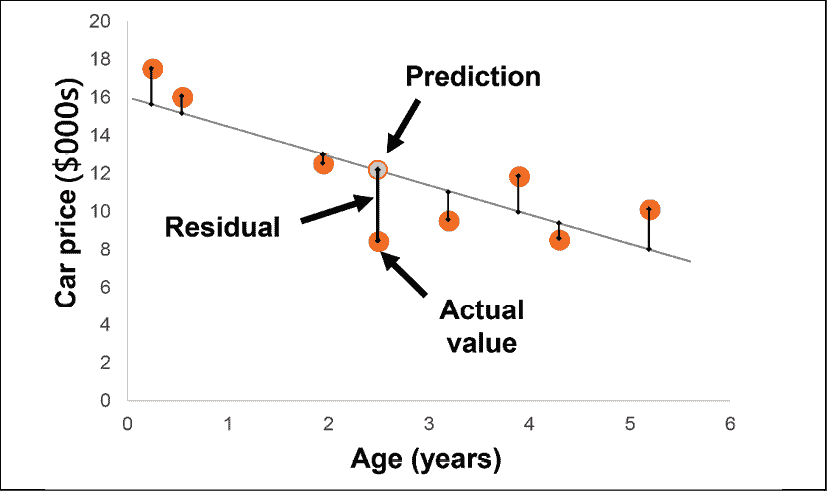

图 4.6：评估回归性能：我们在预测中犯了多少错误？

一种方法是将它们取平均值。然而，我们应当考虑到残差可能是正数或负数，这取决于预测值是否高于或低于实际值（见 *图 4.6* 中的两种情况）。为了避免负残差抵消（进而“掩盖”）正残差，我们可以计算它们的平方，取平均值，然后再对其开平方，从而将该度量转换为与预测量（如车辆价格）相同的单位。这就是我们得到回归分析中最常用的评分度量之一：它被称为 **均方根误差**，或 **RMSE**。其公式是：

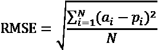

其中 *a*[i] 是第 *i*^(个) 实际值，*p*[i] 是其对应的预测值，*N* 就是——简单来说——数据集中总的数据点数量。RMSE 给我们一个直接的指示，告诉我们可以和预测值一起使用的置信区间。根据它的公式，RMSE 也是残差的标准差：因此，我们可以将其解释为在 68% 的预测中可能出现的最大误差。为了更安全起见，我们可以将 RMSE 乘以 2，得到更广泛的区间和更高的置信水平：我们可以假设我们的误差将在 95% 的情况下小于两倍的 RMSE。假设我们通过回归模型预测一辆车的价格为 $16,000，RMSE 为 $1,200：我们可以说我们有 95% 的信心，这辆车的实际价格会在 $13,600 和 $18,400 之间，即 $16,000 ± $2,400（两倍的 RMSE）。当然，RMSE 越低，模型越好，因为我们可以为预测提供更窄的置信区间。

使用 RMSE 来建立置信区间并不总是数学上正确的。实际上，这只在残差服从正态分布（典型的高斯钟形曲线）这一假设下成立，而这种情况并非总是存在。然而，它是一个方便的经验法则，我建议在评估回归模型时记住它。

评估回归模型性能的另一种总结性指标是 **决定系数**，*R*²。它可以使用以下公式计算：

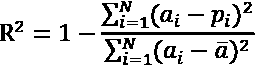

在我们上面遇到的度量基础上，我们还会看到 ，它是实际值的平均值。看看公式中的分数：我们正在比较模型的平方误差（即我们在 RMSE 中找到的数量）与 *baseline* 模型的平方误差，后者会天真地将观察值的平均数作为常量预测。如果我们的模型与这个基准模型相似，那么 *R*² 将接近于零，表示我们的模型几乎没有用。如果相反，我们的模型产生的误差比基准模型小得多，那么我们会得到接近 1 的 *R*²。在这种情况下，*R*² 越高越好。

解释决定系数的一种直观方法是将其视为目标变量中观察到的变化量的比例，而这个比例实际上是由模型解释的。如果在我们的汽车价格预测中，得到*R*²=0.75；我们可以说我们的模型仅仅基于汽车的年龄，解释了汽车价格波动的 75%，剩余的 25%没有被解释。如果我们建立一个更准确的模型，或者增加一些额外的特征，比如里程和配件，可能就能解释更大比例的价格波动，且我们的*R*²值会更接近 1。

没有特定的*R*²参考阈值能够始终告诉我们一个模型是“好”还是“坏”。试想一个看似混乱的信号，比如货币汇率的波动。如果我们建立了一个回归模型，仅解释了未来汇率变动的 25%，我们也能从中赚很多钱！最好不要固定*R*²的静态阈值。

与 RMSE 不同，*R*²是一个无量纲的指标。这意味着即使预测值位于不同的尺度上，我们也可以比较回归模型的优劣。例如，我们可以通过比较*R*²值来对比一个预测房价（范围在十几万美元）的模型和另一个预测摩托车价格（通常便宜得多）的模型：*R*²越高，模型越好。

## 分类

分类算法的任务是将数据集中的每一项分配到一个类别，预测目标变量的具体值。在所有可能的类别中，只有一个是正确的，并且与现实相符。因此，衡量分类器性能的简单方法就是“计算”算法在所有预测中正确的次数。然而，这个简单的性能评分可能并不能告诉我们全部情况。让我们通过一个例子来更好地理解这个概念。

你想评估一个图像分类模型的性能：尽管这个任务看起来可能随机（并且——公平地说——确实如此），但你的二分类器的工作是为图像内容分配一个标签，将狗和松饼区分开来。当涉及到吉娃娃和蓝莓松饼时，你的分类器有点挣扎，预测的内容如*图 4.7*所示：

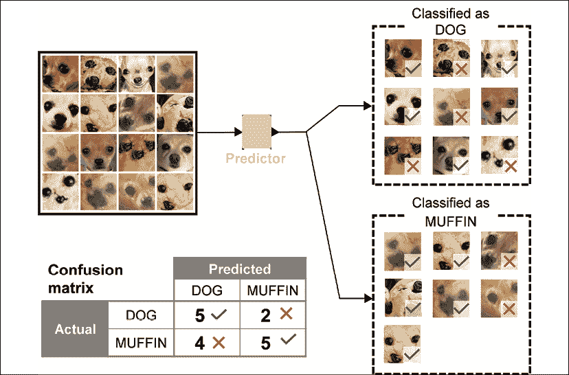

图 4.7：这是吉娃娃还是蓝莓松饼？这个分类器在 16 次预测中正确预测了 10 次。

你在*图 4.7*的左下方看到的表格叫做**混淆矩阵**：它的优点在于可以全面展示分类结果，突出显示分类器“困惑”的情况，即将错误标签分配给图片的次数。混淆矩阵统计了任何预测类别值（列）与实际类别（行）之间的所有组合。主对角线上的单元格会告诉我们分类器准确分类的次数，而其他所有单元格则计数错误。在这种情况下，看起来我们的模型表现有些“失衡”，因为它在识别狗时较为困难，而在识别松饼时稍微表现得更稳定。就奇瓦瓦犬和蓝莓松饼的情况来说，我们不太担心这种不对称；然而在其他情况下，这可能是一个大问题，导致截然不同的结果。

让我们转到一个更严重的情况：一个分类器通过分析血液检测的各项特征，预测病人是否感染了传染性病毒。在这种情况下，也有两个类别：正类和负类，我们可以犯两种不同的分类错误。一个是将一个实际上健康的病人分类为正类，这被称为**假阳性**。这种错误的后果是我们将结果告诉病人，病人会立即开始隔离，并进行一些更精确的测试以确认我们的发现。我们可能犯的另一个错误是将一个实际上感染了病毒的病人分类为负类，这被称为**假阴性**。当然，这种错误的后果比前一种更加严重：我们会让病人回家，导致病毒传播给其他人，并未开始对病人进行任何早期治疗。总结一下：在分类问题中，并非所有错误都是相同的。因此，单一的数字可能不足以全面解释整个情况。这就是为什么计算混淆矩阵并从多个指标中选择最合适的指标来满足需求是明智的。根据你解决的问题，你应该选择*图 4.8*右侧显示的总结性指标中的一个作为评估性能时最重要的指标。接下来我们将逐一介绍这些指标：

+   **准确率**是告诉你正确预测的比例与总预测数之间的关系。当错误类型不重要时，你可以使用这种“平衡”指标来解释分类器的整体表现。

+   **精确度**将告诉你当分类器将某个案例标记为正类时，它的信心有多大。你可以在需要避免所有情况下，正类被预测为正时，结果却是负类的情况。若一个非常精确的分类器告诉你某个案例是正类，那么它很可能是对的。

+   **灵敏度**告诉你分类器有多自信地排除一个正例没有被正确分类的可能性。当你想避免假阴性时，需要使用这个度量。如果一个非常灵敏的分类器告诉你某个案例是负例，那它很可能是正确的。医学中的诊断分类器通常被构建为在任何情况下都最大化灵敏度，因为你希望确保只有真正是负例的病人才会被无治愈送回家。

    类别名称正类和负类仅仅是约定俗成的。根据你的情况，你可以决定哪个类是正类，并相应地计算所有评分指标。在有多个类别的情况下，它的计算方法是：选择一个正类，然后根据将其他类别视为负类来计算指标。这仅仅是一个约定。

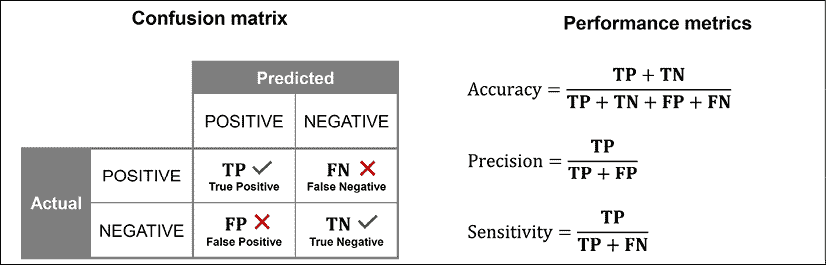

图 4.8：评估分类性能：选择最符合你情况的度量标准

通过这些方法，我们已经看到了评估监督学习预测器性能的最常用方法。在构建我们的第一个机器学习模型之前，我们需要了解一个最后的基本概念，并学习如何管理它：过拟合。

## 欠拟合与过拟合

美国数学家约翰·纳什因其在博弈论领域的开创性工作，获得了 1994 年诺贝尔经济学奖。他的“纳什均衡”已成为经济学家预测非合作战略互动结果的基础。约翰·纳什的故事通过奥斯卡获奖电影*美丽心灵*而广为人知，拉塞尔·克劳饰演纳什。在电影中，约翰·纳什被描绘为与偏执型精神分裂症斗争一生：他的病情让他相信自己在普通杂志文章的文字中找到了“隐藏的秘密信息”，这些信息据说是由苏联间谍为了进行秘密通讯而添加的。看到无关事物之间有意义的联系是早期妄想思维的典型表现，精神科医生称之为*错觉联想*。现在，想一想：当你有（大量）数据和（强大的）计算能力时，很容易陷入认为自己找到了某些普遍有效的有趣模式的陷阱。实际上，你可能只是发现了一个虚假的、随机的联系，这只是由于资源的广泛可用性而产生的结果。

通过一个例子，这一点会更加清晰：假设我们有一个大型数据库，包含全国年度彩票的所有票务信息。我们有过去两年的历史数据，并希望通过识别重复出现的特征，利用过去两位中奖者的信息来预测未来的中奖者。我们决定使用监督式机器学习算法来完成这个任务。经过一些复杂的计算，算法得出了一系列复杂的“中奖”规则，这些规则只被过去两届的幸运中奖者共享。

这些规则类似于：*他们电话号码的第 4 位数字是 7*，*他们的票号包含恰好 3 个奇数数字*，*他们出生在星期二*，以及许多其他规则。显然，这些规则无法预测任何有意义的内容：它们只是通过一系列毫无意义的因素，偶然地将两个特定点“连接”在一起，这些因素恰好是赢家之间的共同点。正如例子所示，当干草堆足够大时，很容易找到与针非常相似的东西！同样，当你拥有大量数据时，如果足够仔细地观察，你可以找到任何关联，尽管这并不意味着它有任何实际意义。这与我们在约翰·纳什的故事中遇到的“假象”情况类似。我们需要不惜一切代价避免陷入这种“分析谬误”的陷阱：这只是由于我们希望不惜一切代价找到关联的欲望，哪怕这些关联实际上并不存在，而使用了人为过于复杂的模型所造成的欺骗。这种情况叫做**过拟合**，它是尝试任何预测时可能出现的一个问题。因此，在构建生成预测的监督式机器学习模型时，我们需要系统地避免它。

让我们通过汽车价格的例子来看过拟合的实际表现。*图 4.9*展示了不同次数的多项式回归，参数**N**表示不同的多项式次数。

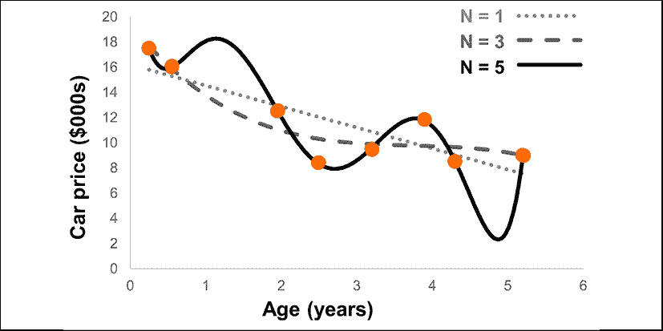

图 4.9：使用不同多项式次数 N 预测汽车价格的回归模型。你会选择哪个？

随着**N**从 1 增加到 5，拟合曲线变得更加复杂：这表明底层模型变得更加复杂。通过观察这三条曲线，我们可以注意到以下几点：

+   当**N = 1**（虚线）时，我们的模型与之前遇到的简单线性回归模型完全相同。虽然这是一个很好的起点，但它看起来有点过于“简单”，因为它没有考虑到汽车价格在头几个月内的强烈贬值。

+   当**N = 3**（虚线）时，我们得到了一条更有鼓舞性的拟合曲线，因为我们清晰地看到汽车早期的价格贬值更为明显，之后曲线逐渐趋于平稳。这看起来很稳固，因为它符合我们的商业理解。

+   当**N = 5**（实线）时，我们几乎完全拟合了现有的数据点。然而，这听起来“好得令人难以置信”，实际上，曲线的形状是人为地构建的，以便符合这些数据点，而没有对价格随年龄变化的演变提供坚实的建模。比如在大约 1.5 岁时，价格竟然不合常理地高于新车的价格。这看起来像是我们只是“强行”让曲线触碰到这几个“过去”的数据点，而这只是一个目光短浅的目标。相反，我们真正的目的是找到一个稳健的模型，能够预测“下一个”即将上市的汽车价格。

从这个示例中，我们可以开始看到，监督模型的复杂度需要一些微调：如果模型过于简单，它的预测表现必然会很差。另一方面，如果模型过于复杂，我们可能只是“连接了之前的点”：我们最终陷入了将巧合拼凑成一个看似普遍规律的幻觉状态。

我们可以在这个概念的基础上增加一个额外的监督学习示例：这次，我们处理的是分类问题。正如在*图 4.10*中所见，你有一些位于板子上的元素，它们可能是点或者叉。你希望根据它们的位置来预测它们的类别（是点还是叉），方法是通过绘制一条连续的线，区分不同的元素，使得点位于板子的右上角，叉位于左下角。通过应用非线性**支持向量机**（**SVM**）学习算法，你将获得三条复杂度逐渐增加的曲线。

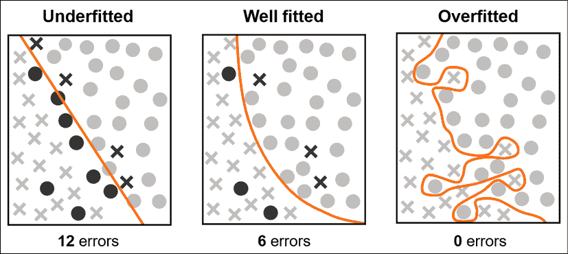

图 4.10：我们希望绘制一条能够区分点（右上角）和叉（左下角）的线。被误分类的元素显示为较深的灰色。哪条线更有可能在处理未来的元素时表现更好？

让我们看看这三种情况：

+   左边的模型是一条直线，看起来像是一种非常初步的方式来区分点和叉。我们似乎在图表的中间区域始终遗漏了一些点，而这些点恰好位于它们应该出现的区域之外。总体来说，我们的准确率接近 75%，因为我们犯了 12 个误分类。

+   中间的模型比之前的模型稍微复杂一些，但也更加准确（这次只有六个错误）。我们现在在这条线上所呈现的曲率很好地解释了之前一直漏掉的点。直觉上，我们犯的六个误分类（它们在图中显示为较深的灰色）看起来更像是“例外”：这条曲线似乎接近一个普遍规则，可能会在未来新的元素出现在板子上时重复。

+   右边的模型显然是最好的：它正确分类了板子上的所有元素，达到了 100%的准确率。然而，这个复杂模型不太可能具有普遍有效性：曲线在当前元素之间呈锯齿状，以避免任何误分类，但我们可以预期，如果新的元素出现，它们可能会由于这些人工弯曲而被误分类。

这些示例展示了监督学习的一个重要特性：如果我们希望构建能够在预测“未来”案例中表现良好的模型，我们需要在学习时找到复杂度的正确平衡。我们可以识别出三种情况，如*表 4.1*中所总结的。让我们从极端情况开始，逐一讨论：

+   **欠拟合模型**。就像在**N = 1**的多项式回归和分类的第一层面一样，欠拟合模型根本不足以做出任何预测。这个简单的模型即使要求它拟合已知数据点，也会产生较大的误差（更高的残差或许多错误分类）。因此，作为一个逻辑结果，我们不能指望同一个模型在未来的案例中神奇地开始表现良好：这使得欠拟合模型在做出任何预测时显得非常无用。

+   **过拟合模型**。这些模型位于欠拟合模型的极端，和前者一样糟糕。模型的数学复杂性使其能够很好地适应已知的数据点，引入了一些不现实的元素，比如回归中的许多波动（当**N = 5**时）或分类中的锯齿状路径。我们“相信”自己已经达到了高准确率，但这仅仅是自我催生的幻觉：每当新的数据点到来时，我们的准确率将因这些人为的复杂性而急剧下降。

+   **良好拟合模型**。就像生活中的许多事情一样：*美德在于中庸*。良好拟合的模型在拟合数据点时准确性不如过拟合模型。然而，考虑到它们在捕捉现象复杂性方面的局限性，它们会倾向于集中于最重要的（较少的）连接，忽略过拟合模型所使用的过于复杂的路径。良好拟合的模型最适合预测“未知”，这正是我们构建监督模型的目的所在。

|  | 欠拟合 | 良好拟合 | 过拟合 |
| --- | --- | --- | --- |
| 模型复杂性 | 低 | 中 | 高 |
| 过去案例的表现 | 低 | 中 | 高 |
| 未来案例的表现 | 低 | 中 | 低 |
| 描述 | 模型过于简单，产生的预测不准确。它无法很好地描述所建模的现象。 | 模型平衡得当。它掌握了具有普遍有效性的模式，这些模式很可能在未来的案例中重复。 | 模型复杂，仅在用于学习的非常具体的点上表现良好。它无法预测未来案例的结果。 |

表 4.1：欠拟合、良好拟合和过拟合模型的典型特征。

好消息是，机器学习模型可以通过改变一组值来“调节”其复杂性，这些值被称为**超参数**，它们调节模型的学习行为。例如，在多项式回归中，**N**不过是模型的一个超参数：通过让**N**从 1 变化到 5（或更多），我们可以控制模型的复杂性，并通过多次尝试找到适合的拟合程度。我们将在本书稍后的部分讨论具体学习算法时，进一步学习超参数。

降低模型复杂性的另一种方法是减少特征数量。特征越少，模型越简单，过拟合的可能性越低。这也是进行降维的另一个动机，这是我们之前介绍的无监督学习场景之一。

现在我们清楚了过拟合模型的病态情况：是时候继续讨论如何诊断它以及可能的解决方案是什么了。

## 验证模型

再次查看*表 4.1*，特别是它的第三行，我们发现，判断一个模型是否拟合良好的唯一方法是评估其在“未见过”样本上的表现。无论是过拟合模型还是欠拟合模型，在未来样本的准确性上都会逊色于拟合良好的模型。但是，如果我们还没有未来样本来进行评估该怎么办呢？

在监督学习中，我们使用的一个基本“技巧”是将已知样本的数据集随机分割成两个子集：一个**训练集**，通常覆盖原始数据的 70%到 80%，另一个是**测试集**，包含剩余的数据。*图 4.11*展示了这个操作，称为**划分**。然后，我们仅使用训练集进行实际的学习，这样就会生成模型。最后，我们将评估模型在测试集上的表现：这是算法在学习时*未曾见过*的数据。这意味着，如果模型通过创建许多波动和弯曲来过度适应训练集，我们将在测试集上得到低性能评分。换句话说，如果模型对训练集过拟合，那么它在测试集上的表现会非常差。通过这个技巧，我们在不进行时间旅行的情况下评估了“未来”样本的准确性！

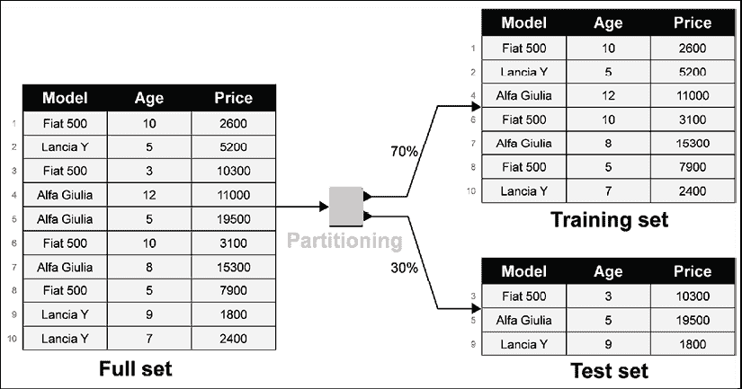

图 4.11：将完整数据集划分为训练集和测试集。行按所需比例随机抽样并分配到两个子集。

*图 4.12*显示了通过增加复杂性，训练集和测试集中的预测误差预期量。通过在模型的超参数上进行调整以增加其复杂性，可以逐步降低训练集中样本的误差。例如，在多项式回归的情况下，从左到右，我们增加了**N**的值：在高复杂度模型下（**N = 5**，我们位于最右边），训练线的误差几乎为零。如果你查看测试集的误差（U 形曲线），你会发现现实情况，并认识到模型的真实预测能力要低得多：只有拟合良好的模型才能确保在“未见过”数据点上的良好表现。

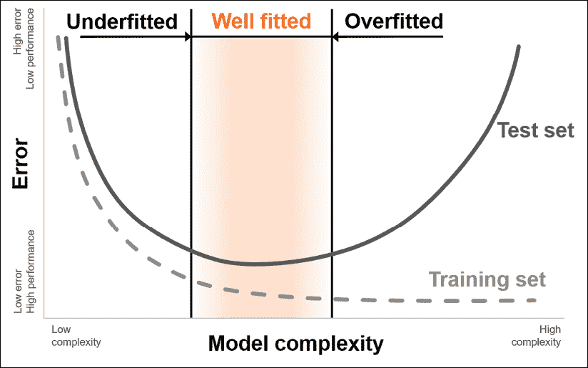

图 4.12：随着复杂度的增加，监督学习模型产生的误差量：对于测试集，呈 U 形曲线

## 综合总结

我们终于拥有了构建和验证拟合良好的监督式机器学习模型所需的所有要素。现在让我们看看这道“菜谱”长什么样子。我们可以将其可视化为由四个基本模块组成的一个递归“结构”，这些模块共同定义了我们的监督学习基本流程：

1.  **数据划分**。为了避免过拟合，我们需要利用一种验证机制，防止在学习过程中使用相同的数据进行评分。因此，我们在监督式学习中总是首先做的步骤是对完整的标记数据集进行划分，以获得训练数据集和测试数据集。在大多数情况下，划分通过随机抽样进行。

1.  **学习者**。训练数据集可以用来通过学习算法训练模型。此操作的输出将是统计模型（通过一组参数定义），该模型可以应用于不同的数据，从而获得预测。

1.  **预测器**。现在我们可以“运行”在前一步中学习的模型，应用到测试集上，测试集已被从训练过程中排除。预测器的输出将是一个附加了额外列的测试集：每行的目标预测值。

1.  **评分器**。预测器的输出包含*实际*目标（我们旨在预测的实际值）及其模型生成的预测值。通过比较这两列的值，我们可以评估预测的表现。计算一个或多个总结性度量得分就足够了，比如我们几页前介绍过的 RMSE、*R*²、灵敏度或完整的混淆矩阵。

就是这样！通过遵循在*图 4.13*中描述的逻辑流程，您可以构建一个监督式模型并评估其真实表现，避免过拟合的风险。

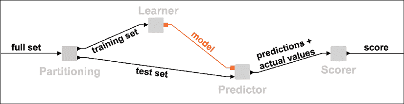

图 4.13：验证监督式机器学习模型的典型流程。为了防止过拟合，您需要对数据进行划分，在训练部分进行学习，最后只在测试部分进行预测和评分。

当然，一旦您有了一个经过验证的模型，您可以放心地将其应用于所有“未来”数据点，最终释放机器学习预测的真正价值。让我们以二手车价格预测为例：您使用包含历史销售的完整数据库来构建和验证模型。一旦您有了经过验证的模型，并且确定它不会过拟合，您就准备好进入实际应用：每次需要估计一辆车的价格时，您可以通过车辆的特征执行该模型并获得预测价格。当然，这一次，您将没有“真实值”可以进行比较，但您可以使用预测的置信区间（例如回归的 RMSE）来预估您将得到的误差范围。

值得花些时间思考一下*图 4.13*所展示的流程：这是你在构建和验证有监督的机器学习模型时可以采用的“基础”过程。许多改进可以逐步应用，以使你的模型越来越好。为了让你对我们可以做出的众多改进有所了解，下面列出一些通过迭代来改善过程的添加方法：

+   划分技巧有一些局限性：例如，如果你从一个相对较小的数据集开始，并且将 30%的数据从学习中保留，你可能会得到不充分的验证，因为模型从中学习的点太少。一个替代方法叫做**k 折交叉验证**，它将整个数据集分成 k 个部分（通常是 5 个或 10 个），并多次迭代，每次使用其中一个部分作为测试集，其他部分用作训练集。最终，你会得到 k 个不同的模型和得分。通过对它们进行平均，你将获得比单次划分更稳健的验证。

+   正如我们之前看到的，你可以“调优”模型的超参数，以最大化在测试集上获得的性能得分（这将反过来确保未来预测的最大准确性，并证明模型的普遍有效性）。你可以循环不同的超参数，将它们作为变量进行管理，并找到使你处于我们在*图 4.12*中看到的 U 形曲线底部的那组值。这一过程叫做**超参数优化**，可以通过使用循环和变量来实现。

+   如前所述，如果数据集中有不具信息量或冗余的特征，你的模型会变得不必要地复杂。有许多技术可以用于识别用于学习的最佳特征子集，它们统称为**特征选择**。一种简单的选择特征的迭代技术叫做**后向消除法**：你从选择所有特征开始。然后，在每次迭代时，你移除一个特征——就是那个如果从集合中移除后，性能下降最小（或增加最大）的特征。经过若干次迭代，你将“尝试”多个特征组合，并可以选择一个最大化整体预测性能的组合。

这些只是你可以使用并创造性结合的一些技术，以提高建模的质量。希望这能给你一些关于你即将进入的世界的启示：机器学习的实践是一种艺术与科学的结合，你总能找到更巧妙的方法，从数据和算法中挤出增量价值。

# 总结

在这一章中，我们介绍了能够从数据中学习的机器背后的基本概念。在剥去人工智能的未来感光环后，我们通过了一系列实际的商业场景，看到智能算法的实际应用。这些例子向我们展示了，如果我们细心观察，往往能够发现借助机器完成智力工作的机会。我们看到，与传统的操作模式不同，机器学习（ML）提供了一种新的方式来完成任务：无论是预测价格、细分消费者，还是优化数字广告策略，学习算法都可以成为我们不知疲倦的伙伴。如果我们好好训练它们，它们可以扩展人类智能，并为我们的业务提供坚实的竞争优势。我们探讨了三种学习算法（监督学习、无监督学习和强化学习）之间的差异，并理解了选择算法时需要考虑的基本驱动因素。接着，我们学习了构建稳健的预测模型并正确评估其性能所需要的步骤，同时避免过拟合的困扰。这是一次在迷人的统计学习世界中的长途旅行，但正如我们所承诺的那样，我们并不需要通过大量的公式或复杂的数学推导。这一章帮助你掌握了机器学习的关键概念的直觉，使你能够快速进入实践并在实践中不断学习。

现在是时候回到 KNIME，基于现实世界的数据构建（并验证）一些机器学习模型了：准备好迎接下一章的内容吧。
