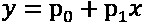
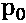
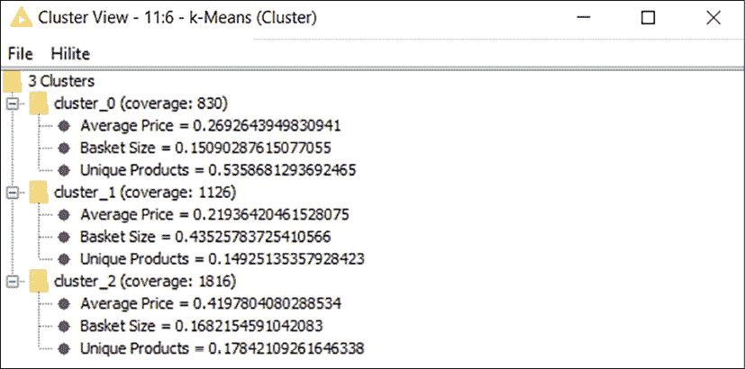

# 第五章：在工作中应用机器学习

你已经听说过如何通过智能算法创造商业价值：现在是时候大显身手了。在本章中，我们将通过几个逐步教程，亲身体验将机器学习应用于具体案例的过程。我们的伙伴 KNIME 回到了舞台上：我们将学习如何构建工作流来使用实际数据实施机器学习模型。我们将接触几个特定的算法，了解它们背后直观的工作原理。我们将窥视它们的数学模型，重点理解基本原理，以便理解它们的结果并在工作中加以利用。

本实用章节将回答几个问题，包括：

+   我如何使用 KNIME 中的监督式机器学习算法进行预测？

+   我如何检查模型是否表现良好？

+   我们如何避免过拟合的风险？

+   我可以使用什么技巧来提高模型的性能？

+   我如何使用聚类算法将相似的元素分组？

本章中的教程涵盖了你可以在工作中依赖机器学习的三种最常见情况：预测数字、分类实体和分组元素。你可以把它们看作是“模板”，在你翻到本章最后一页后，可以广泛地重新应用，并且你很可能会继续将其作为参考。教程的步骤也按它们在日常实践中展开的顺序进行组织，包括为了提高模型性能所需的“反复迭代”。这将帮助你准备面对实际的机器学习应用，现实中机器学习往往需要经历一条曲折的试错路线。

在每个教程中，你将遇到一两个机器学习算法（具体来说，第一个是**线性回归**，第二个是**决策树**和**随机森林**，第三个是**K-means**），这些算法将在实际应用之前进行介绍和解释。让我们从一些初步的预测开始吧！

# 通过回归预测数字

在本教程中，你将假设自己扮演的是一名位于意大利罗马的房地产经纪人的—有点—令人羡慕的角色。你所在的公司拥有多家专注于出租位于永恒之城更广泛都市区的物业的代理机构。你对数据分析的热情引起了首席执行官的注意：她要求你找到一种方法，帮助代理商根据物业的特点客观评估合理的月租。她注意到，当物业的租金与市场不符时，业务将受到严重影响。事实上，如果租金过低，代理费（这是约定租金的固定百分比）最终会低于本应有的水平，导致利润流失。另一方面，如果租金过高，代理机构的收入将需要更长时间才能显现，影响现金流。为新物业设定月租的传统方法是房东与代理商之间的“谈判”，代理商会利用他们对市场的了解（有时还会参考类似物业的基准）来说服房东设定合适的租金。

你确信机器学习有潜力带来改变，并决心找到一种机器学习的方法来改善这一业务流程。你想到的一个方法是使用以前租赁物业的月租数据库（这些物业有完整的描述）来预测未来物业的合理月租，基于其客观特征。这样一种数据驱动的方法，如果传达得当，可以简化定价过程，带来各方的共同利益：房东和代理机构能够迅速达成有利可图的交易，租客则能够获得公正的租金。

能够预测租金价格的机器的前景令人兴奋，让人迫不及待地想开始。你设法获取了最近签署的 4,000 份租赁协议的提取数据（`RomeHousing-History.xlsx`）。表格包含了每个物业的以下信息：

+   *House_ID*: 物业的唯一标识符。

+   *Neighborhood*: 物业所在区域的名称，从`Piazza` `Navona`周围的豪华区域到宁静的湖畔小镇`Castelli` `Romani`。*图 5.1*展示了罗马地区的地图，标出了这些社区的一部分。

+   *Property_type*: 一个字符串，说明物业是`flat`（公寓）、`house`（房屋）、`villa`（别墅）还是`penthouse`（顶层公寓）。

+   *Rooms*: 物业中可用房间的数量，包括浴室。

+   *Surface*: 物业的可用楼面面积，单位为平方米。

+   *Elevator*: 一个二元类别，表示物业是否有电梯（`1`表示有，`0`表示没有）。

+   *Floor_type*: 一个类别，显示物业所在的楼层是`Mezzanine`（夹层）、`Ground`（底层）还是`Upper`（上层）。

+   *Floor_number*：物业所在的楼层，按照欧洲惯例（`0`表示底层，`0.5`表示夹层，`1`表示地面以上的第一层，依此类推）。

+   *Rent*：最终租赁协议中的所有包括项，即月租金，以欧元计算。[地图图像]

    自动生成的描述

图 5.1：我们的房地产覆盖的罗马邻里。你去过这些地方吗？

在构建模型之前，你明智地停下来，认真思考一旦模型完成后，如何实际运用它。你意识到，完成这一工作潜在的商业价值有两个方面：

1.  首先，通过解读模型如何运作，你可以发现一些关于市场价格形成机制的深刻证据。你可能能够找到以下问题的答案：*哪些特征在定价中真正起到了决定性作用？*、*楼层数是否对价值有很大影响？*以及*在其他特征相同的情况下，哪些邻里最为昂贵？*其中一些答案将强化你所在机构已有的市场理解，同时增加将这些知识明确化并正式描述的好处。更有趣的是，其他发现可能是完全意外的，并揭示出你之前未曾了解的原始动态。

1.  其次，你的模型可以用来生成基于数据的租金建议，当新物业进入市场并加入机构的投资组合时。为了让这方面的事情更加有趣，业主向你分享了一份名为(`RomeHousing-NewProperties.xlsx`)的列表，里面列出了 10 个尚未确定租金的即将上市的物业，这些物业使用与历史数据库中相同的特征（如*Neighborhood*、*Property_type*等）。一旦模型完成，你将运用它来对这些样本物业进行示范，展示它的工作原理。

现在你已经清楚了业务需求，最终可以将其转化为具体的机器学习术语，基于我们在上一章学到的内容。你需要建立一个通过学习一些“已知”示例来预测“未知”租金价格的机器：以前租赁过的物业数据库就是你的*标签化*数据集，因为它包含了目标变量的示例，在本案例中，即*Rent*。浏览机器学习算法的目录（*图 4.5*），你意识到我们显然处于*监督式*机器学习的范畴。更具体地说，你需要预测数值（欧元租金），因此你确实需要利用一个进行*回归*的算法。

现在，解决这个商业机会的机器学习方法已经清晰地出现在你面前：你终于可以启动 KNIME 并创建一个新的工作流（**文件** | **新建...** | **新建 KNIME 工作流**）：

1.  作为第一步，你通过将文件（`RomeHousing-History.xlsx`）拖放到空白工作流中，或者通过使用**Excel Reader**节点来加载带标签的数据集。在这两种情况下，KNIME 都会识别文件的结构，你只需接受其默认配置。运行节点后，你将获得如*图 5.2*所示的数据集，其中包含你预期的九列：

    图 5.2：加载到 KNIME 中的历史租赁数据：4,000 个房产供学习使用

当你构建机器学习模型时，你将以各种方式与数据表中的列进行交互。通过在一开始就探索这些列，了解你将要处理的数据是非常明智的。幸运的是，**统计**节点可以帮助你，它会立即显示你需要了解的列的最重要信息。

##  *统计*

这个节点（**分析 > 统计**）计算输入表中每一列的摘要统计信息。其配置对话框顶部出现的复选框（*图 5.3*）让你决定是否**计算数值列的中位数值**：对于大数据集来说，这个计算可能会很耗费计算资源，因此只有在必要时才勾选。中间的列选择器让你决定哪些列应该被视为**名义型**。对于这些列，节点会计算每个唯一值的实例数：这对于分类列非常有用，当你想快速评估表格中每个类别的相对分布时。节点计算的主要摘要指标包括最小值（**Min**）、平均值（**Mean**）、**中位数**、最大值（**Max**）、标准差（**Std. Dev.**）、**偏度**、**峰度**、非数值数据（如缺失值）的计数（**No. Missing**），以及正负无穷大（**No. +∞**、**No. –∞**）。节点还会输出显示值分布的直方图，并且对于名义型列，会列出数据集中最常见和最少见的类别：

**偏度**和**峰度**无疑是上述摘要统计中最不为人知的。然而，它们对于迅速告诉你分布的形状与纯高斯分布的典型钟形曲线有多大不同非常有用。偏度告诉你分布的对称性：如果它的值为正，则表示分布左偏；如果值为负，则表示分布右偏。峰度告诉你分布的平坦程度：如果为负值，则分布比钟形曲线更平坦；如果为正值，则分布的峰值更尖锐。

图 5.3：统计配置：通过其摘要统计探索数据

1.  实现**Statistics**节点并将其与之前的节点连接。当配置时，勾选第一个框，以便我们可以查看数值列的中位数值。在名义值的选择器中，仅保留字符串类型的列（*Neighborhood*，*Property_type*，和*Floor_type*）以及*Elevator*。尽管这个列在形式上是数值型的，但它将我们的样本分为两类：配备电梯的房产和没有电梯的房产：读取每个类别中有多少房产将会很有意思，因此我们将把这个列视为名义列。如果你运行节点并显示其主要输出（只需按*Shift* + *10*，或者在执行节点后，右击它并选择**查看：统计视图**），你将获得一个包含三个有用标签的窗口。第一个标签（*图 5.4*）展示了数值列的所有重点：我们了解到，数据库中房产的平均租金略高于€1,000，中位数的楼层面积约为 70 平方米。我们还了解到没有缺失值：这对我们来说是好消息，因为我们无需进行清理工作：

    图 5.4：统计输出中的数值面板：我的数值特征如何分布？

    第二和第三个（*图 5.5*）标签向你展示了名义列：我们了解到，某些社区（如`Magliana`和`Portuense`）在我们的数据集中比其他社区的表示要少得多。通过查看*Property_type*列的值，我们还了解到，我们租赁的绝大多数房产都是公寓：

    

    图 5.5：统计输出中的顶部/底部面板：检查你的类别列的值

现在我们已经浏览了数据集，并了解了各列的主要特征，我们可以继续进行有趣的部分，设计我们的模型。为了构建一个强健的监督学习模型，我们需要依赖上一章中遇到的典型流程。让我们在这一关键点上刷新记忆：为了避免过拟合的陷阱，我们需要将标记数据随机划分为训练集和测试集，在训练集上学习，在测试集上预测，并最终通过评分预测值来评估模型的预期性能。你可以回到*第四章*，*什么是机器学习？*，查看*图 4.13*，再次了解完整的过程：在实现一个能够预测有用内容的机器时，我们总是需要遵循这一方法。因此，第一步是将所有标记数据行随机划分为两个独立的子集。这正是我们下一个节点的“专长”：**Partitioning**。

##  *划分*

这个节点（**Manipulation > Row > Transform**）执行输入表格的按行拆分，将其拆分为两个表格，分别对应上（第一部分）和下（第二部分）输出端口。其配置窗口顶部的选择器（*图 5.6*）允许你设置第一部分（上输出端口）的大小。你可以指定要包含的行数（**绝对值**），或者指定该部分的相对大小（以百分比表示，**相对[%]**）。第二个选择器指定了将行拆分成两个部分时所使用的方法：

+   **从顶部取**：如果选择此选项，拆分将按照当前排序顺序进行。输入表格的顶部行将进入第一部分，而所有其他行在超过某个阈值后将进入第二部分。阈值的位置取决于你在上面已决定的部分大小。

+   **线性抽样**：在这种情况下，输入表格行的顺序得以保持：每隔 *n*^(行)将会进入一个输出端口，两个部分交替分配。如果，举例来说，你进行线性抽样，目的是创建两个大小相等的部分（每部分包含原始行数的一半），那么你将会得到所有奇数行在一个部分，所有偶数行在另一个部分。如果拆分是三分之一和三分之二，那么第一部分会有每三行中的一行，第二部分则包含所有其他行。如果你的数据集是时间序列，并且记录按时间顺序排列，这种方法特别有用。

+   **随机抽取**：如果选择此选项，你将获得一个随机抽样。唯一可以确保的是，第一部分中的行数将恰好是你在第一个选择器中设置的行数。

+   **分层抽样**：在这种情况下，你同样执行随机抽样，但你强制保持一个名义列的分布在两个输出部分中。例如：如果你有一个描述 1,000 名患者的输入表格，其中 90%标记为`negative`（阴性），10%标记为`positive`（阳性），你可以使用分层抽样来保持每个拆分部分中阳性与阴性患者的比例不变。在这种情况下，如果你希望将 700 行分配到第一部分，你将得到恰好 630 个阴性患者和 70 个阳性患者：比例保持不变。

如果你选择了基于随机选择的拆分方法（上面列表中的最后两个选项），你可以通过勾选**使用随机种子**选框来保护工作流的可重现性。当你指定一个常数值来初始化随机抽样时，你是在“固定”随机行为：结果是每次执行节点时，你都会得到相同的拆分。这在你希望在构建工作流时保持拆分一致，或者希望其他人在他们的机器上得到相同拆分时非常方便：

图 5.6：分割配置对话框：你希望如何分割数据集？

计算机真正难以应对的一件事是表现得随机并执行任何“意外”的操作，因为它们是根据一套确定性的步骤来构建和编程的。因此，计算机利用特殊算法生成**伪随机数**序列，这些序列“看起来”就像是真正的随机数。值得注意的是，这些序列的起始点（**随机种子**）可以决定数字的完整进程。必要时，计算机仍然可以通过查看快速变化的状态（如从上次启动以来 CPU 时钟周期的数量）或通过测量一些微观物理量（如端口上的电压），这些量受到不可控现象的影响，如热噪声和其他量子效应，从而生成随机种子。很有趣的是，计算机在处理这些任务时会遇到我们只需抛个硬币就能完成的事情！

让我们开始典型的监督学习流程，并将完整的房屋数据集分割为训练集和测试集：

1.  让我们实现**分割**节点，并将其与**Excel 阅读器**的输出连接（你可以保持**统计**节点未连接，因为我们不需要使用它的输出）。在配置对话框中，我们确保选择**相对[%]**选项，值为`70`。这意味着，在输入的 4,000 个属性中，将有 70%的数据用于训练（这是合理的做法，因为如*第四章*中所述，*什么是机器学习？*，训练集通常应涵盖总数据集的 70%到 80%）。我们希望分割是随机进行的。在上一步中，我们注意到一些名义列（如*Neighborhood*）在其值的分布上存在不平衡。这意味着，我们有可能在一个较小的邻里（如与`Magliana`相关的 26 行数据）中仅仅获得少量的属性，进而仅将这些数据分配到一个分区。虽然这并非严格要求，但我们最好避免任何可能影响学习的不平衡，因此在对话框中选择**分层抽样**，并对*Neighborhood*进行处理。你也可以勾选下方的复选框，并在右侧输入一个随机种子，如`12345`，这样你就可以确保每次都得到相同的分区。当你运行节点时，你会发现，在上方的输出端口（右键点击节点并选择**第一个分区**）中，你将找到 2,800 行数据，正好是原始数据集的 70%。这是一个好兆头，我们可以继续进行学习步骤。

此时，我们需要添加实现特定机器学习算法的节点（包括学习器和预测器）。预测数字的最简单算法是**线性回归**，这也是我们在本教程中使用的算法。值得先介绍一下其基础数学模型，以便我们为理解其结果做好准备。

## 线性回归算法

线性回归模型是我们在*第四章*《什么是机器学习？》中用来预测二手车价格的简单回归的推广。在那种情况下，我们将价格建模为一条直线，遵循简单的方程：

其中，*y* 是因变量，因此是我们预测的目标（汽车的价格），*x* 是唯一的自变量（在那个例子中是汽车的年龄，单位为年），而  和  是模型的参数，分别定义了直线的*高度*（也称为*偏移量*或*截距*）和*斜率*：

图 5.7：汽车价格的线性回归：随着年龄变化，直线显示了预测值

具体来说，正如你在*图 5.7*中看到的那样，我们有 （它是模型线与纵轴相交的地方）和 ，因此汽车的价格可以通过这个简单模型预测：

一辆 2 年车龄的汽车的价格将被估计为 $12,600，因为：

简单线性回归的*学习器*算法的目的是找到正确的参数（ 和 ），以最小化预测误差，而*预测器*算法则会将模型应用于新的数据，就像我们在得出 2 年车龄汽车估计价格时所做的那样。

线性回归是我们刚刚看到的简单模型的推广。其基础数学描述为：

其中，*y* 仍然是我们试图预测的（单一的）目标变量，各种 *x*[i] 值代表对应我们所拥有的特征的（多个）自变量， 值是定义模型“形状”的参数。由于这次我们有多个自变量（因此我们称之为**多变量模型**），我们无法再通过简单的二维图表中的直线进行“可视化”。尽管如此，它的基础数学模型仍然相当简单，因为它假设每个特征与目标变量之间是“线性”关联的。好了，你刚刚遇到了多变量线性回归模型。

如果我们将这个模型应用于租金预测，我们的目标变量是*Rent*列，而特征（自变量）则是所有其他列，如*Rooms*、*Surface*等。多变量线性回归模型将会是：

并且实现此模型的学习算法的目标是找到“最佳”值，如、、等，这些值能够最小化在训练集上产生的误差。

通过一组给定的公式（并不复杂），我们可以分析性地找到能够最小化线性回归模型误差的参数集。最简单的方法称为**普通最小二乘法（OLS）**：它最小化线性回归的平方误差和。你还记得在*第四章*中介绍的**均方根误差**（**RMSE**）指标吗？通过使用普通最小二乘法程序，我们将最小化 RMSE，这正是我们在这里需要做的。

上面的模型期望每个自变量都是一个数值。那么，我们如何处理数据集中像*Floor_type*这样的名义特征呢？我们可以通过机器学习中的一个常用技巧来解决这个显而易见的限制：创建所谓的**虚拟变量**。这个想法非常简单：我们将每个名义变量转换为多个数值变量。以*Floor_type*为例：这是一个类别变量，其值可以是`Upper`、`Mezzanine`或`Ground floor`。在这种情况下，我们将通过创建三个数值虚拟变量来替换这个类别变量：*Floor_type=Upper*、*Floor_type=Mezzanine*和*Floor_type=Ground*。虚拟变量的值可以是`1`或`0`，取决于类别：对于某一行数据，只有一个虚拟变量的值为`1`，其余的都为`0`。例如，如果某一行数据指的是`Upper`楼层的房产，那么虚拟变量*Floor_type=Upper*的值将为`1`，其他两个将为`0`。

得益于这个技巧，我们可以将线性回归模型应用于任何类别变量；我们只需要将它们“转换”成多个额外的虚拟变量。

我们已经准备好通过引入实现其学习算法的 KNIME 节点，来尝试线性回归模型。

##  *线性回归学习器*

这个节点（**分析 > 挖掘 > 线性/多项式回归**）训练一个多变量线性回归模型，用于预测一个数值量。对于其配置（见*图 5.8*），你需要在顶部的**目标**下拉菜单中选择要预测的数值列：

图 5.8：线性回归学习器的配置对话框：选择要预测的内容和要使用的特征

然后，在中央框中，您可以选择哪些列应作为特征使用：只有右侧绿色框中出现的列才会被视为模型中的自变量。名义列，如字符串，将自动由节点转换为虚拟变量。

如果一个名义列（如*类型*）具有*N*个唯一值（如`A`、`B`和`C`），那么该节点实际上会创建 *N-1* 个虚拟变量（*Type=A* 和 *Type=B*）。实际上，名义值中的一个可以通过所有零的组合来表示：在我们的例子中，如果*类型*是`C`，那么*Type=A*和*Type=B*都会是零，意味着该行唯一可能的值是`C`。这样，我们使模型变得更简单，并避免了所谓的虚拟变量陷阱，这可能导致我们的模型参数无法计算。该节点会自动处理这一点，因此您不必担心：只需要在阅读与虚拟变量相关的模型参数时记住这一点。

通过点击**预定义偏移值**复选框，您可以“强制”将线性回归模型的偏移值（我们之前也叫它  或截距）设置为某个值，或者通过将其设置为零来移除它。这会减少模型最小化误差的“灵活性”，因此会降低其准确性。然而，当您试图降低模型复杂度并提高模型的可解释性时，这个技巧可能会有所帮助，因为我们少了一个参数需要解释。默认情况下，如果输入数据中存在缺失值，此节点将无法执行。为了处理这个问题，您可以提前在工作流中管理它们，使用**缺失值**节点，或者选择配置对话框左下角的**忽略缺失值的行**选项。

执行后，节点将在其第一个输出端口返回回归模型，然后可以通过预测节点用于预测。第二个输出是一个表格（*图 5.9*），其中包含回归模型参数的摘要视图，对于每个变量（包括虚拟变量），您可以找到：

+   **Coeff.**：这是变量的**参数**（也叫系数）。这是我们在回归模型公式中看到的  参数。

+   **标准误差**：这是该参数的**误差标准差**。如果将其与参数值进行比较，你可以大致了解该参数的估计值有多“精确”。你还可以用它来大致获取该参数的置信区间，正如我们在*第四章*《什么是机器学习？》中讨论 RMSE 时所做的那样。在汽车价格回归的例子中，如果*年龄*变量的参数是-1.7，标准误差是 0.1，你可以说，95%的情况下，汽车的价格每年下降$M 1.7 ± 0.2（2 倍标准误差）。

+   **t 值**和**P>|t|**：这两个统计值（**t 值**和**p 值**）是通过应用学生 t 检验生成的，用于说明某个变量对于模型的重要性。p 值越小，你越能有信心拒绝该参数仅仅是“偶然”显著的可能性（这被称为**零假设**）。作为一个通用规则，当 p 值（该表格的最后一列）大于 0.05 时，你应该从模型中删除该变量，因为它可能是不显著的：![表格    自动生成的描述    图 5.9：线性回归学习节点的摘要输出：找出回归的参数，并确定它们是否显著如果在节点执行后右键点击，可以打开一个额外的图形视图（选择**视图：线性回归散点图视图**），在这里你可以直观地比较各个特征与目标之间的关系，寻找陡峭的斜率和其他模式。现在让我们用我们的罗马房产数据来实际操作这个节点，看看它能带来什么：1.  实现**线性回归学习者**节点，并将其与**分区**节点的上输出端口连接，该输出端口是训练集（来自历史租金数据库的 70%随机样本）。在配置窗口中，再次检查*租金*是否被设置为顶部的**目标**变量。就特征而言，此时我们可以保留所有特征，看看哪些是显著的。然而，我们可以删除其中一个，*房屋 ID*，因为我们已经知道不希望使用它。我们不希望用房产的唯一标识符来推断租金。该编号是在房产加入数据库时人为分配的，并且与房产本身的特征无关，因此我们不希望在预测模型中考虑它。运行模型并打开第二个输出端口以获取模型参数的摘要视图。这个总结视图将类似于*图 5.9*中显示的内容，尽管数字可能不同，因为随机划分可能在你的案例中生成了不同的划分：欢迎来到概率模型的世界！然而，我们已经注意到，一些参数的 p 值（表格的最后一列，**P>|t|**）高于 0.05。这意味着我们可以稍后返回此步骤，进行清理并提高模型的性能。目前，让我们继续进行预测并评估模型。##  *回归预测器*

这个节点（**分析 > 挖掘 > 线性/多项式回归**）应用回归模型（作为输入给出的第一个蓝色端口）到数据集（第二个端口），并返回每个输入行的预测结果。该节点不需要任何配置，可以与**线性回归学习器**节点或**多项式回归** **学习器**节点一起使用：如果你想像我们在*第四章*《什么是机器学习？》中那样在不同多项式度数下构建线性回归，可以自行查看该节点（参见*图 4.9*）。

1.  让我们将**回归预测器**节点添加到工作流中并建立连接：将**线性回归学习器**的蓝色方形输出连接到预测器的上输入端口，并将**划分**（测试集）的底部输出端口连接到第二个输入端口。无需配置，因此你可以执行节点并查看输出，输出结果与*图 5.10*中的类似：

    图 5.10：回归预测器节点的输出：我们最终得到了租金价格的预测。

你可以自豪地查看右侧的最后一列，称为*预测（租金）*：对于测试集中的每一行（学习器节点未“见过”的行），该节点生成了租金的预测。这个预测是通过将回归模型的参数直接“应用”到测试集中的每一行的值上获得的。让我们通过一个例子来看这个是如何工作的：考虑*图 5.9*中的参数。在这种情况下，截距（最后一行）为 569.9，*房间数*的参数约为 25.8，*面积*的参数为 9.6，与`Collatino`社区相关的虚拟变量（*Neighborhood=Collatino*）的参数为-561.9，依此类推。当预测器需要为测试集中的第一行（见*图 5.10*中的第一行）生成预测时，它只需将学习器找到的回归模型公式应用到该属性（具有 3 个房间，80 平方米，位于`Collatino`等）中。因此，**回归预测器**节点的结果计算如下：

在这种特定情况下，如果加上所有未在前述公式中报告的其他特征，我们得出的最终预测为€896.4，与实际租金价格€950 相比，误差约为€50：对我们的第一个预测来说，这并不差！要完整了解当前模型的性能，我们需要检查测试集中所有行的预测和实际租金之间的差异，使用**数值评分器**节点。

##  *数值评分器*

此节点（**分析 > 挖掘 > 评分**）通过比较两个数值列来计算回归的摘要性能指标。它唯一需要的配置（*图 5.11*）是选择要比较的两列：您可以在**参考列**下拉菜单中选择回归的目标列，其中包含实际值，然后在下一个标记为**预测列**的列中选择预测值。如果您还想将性能评分作为流变量输出（在进行超参数优化时很有用），则需要勾选底部的**将分数作为流变量输出**框。该节点输出回归的最流行评分指标，包括**确定系数**、**R**² 和 **RMSE**：

图 5.11：数值评分器节点的配置对话框：选择要比较的列。

1.  实现**数值评分器**节点（注意：不要与用于分类的**评分器**节点混淆），并将**回归预测器**的输出连接到其输入端口。在其配置中，请仔细检查顶部下拉菜单中是否包含*租金*和*预测（租金）*，然后运行节点。其输出（*图 5.12*）非常令人鼓舞（当然，您可能会得到与这些图中稍有不同的结果，这是正常的）：

    图 5.12：作为数值评分器节点返回的性能指标：作为您的第一个回归不错

我们得到了一个 R²值为 0.92，这意味着我们当前的模型解释了罗马租金价格的大约 92%的完全变异性。考虑到样本有限和可用特征较少，这看起来已经相当不错了。此外，RMSE 为€110，这意味着我们将在 68%的时间内（一个标准偏差）做出预测误差，绝对值低于€110，而在 95%的时间内，我们的误差将低于€220（RMSE 的两倍）。最后一个性能指标，**平均绝对百分比误差**（**MAPE**），告诉我们，我们的预测租金与实际租金的平均差异约为 10%：再次非常不错。

但我们依然追求最优，并不断质疑自己是否能做些什么来改进模型。最简单的方法是考虑是否可以改善特征的选择。让我们回顾一下回归分析得到的参数（*图 5.9*），看看是否能移除一些不必要（或有害）的特征。当我们从模型中移除多余的特征时，至少会带来两个好处：首先，我们让模型更简洁，便于其他人理解，因为我们需要解释的参数变少了。其次，我们减少了模型在训练集上的过拟合可能性，从而增强了模型的泛化能力。

移除特征的另一个原因是避免**多重共线性**的风险，这种情况发生在特征之间相互关联时。相关的特征是冗余的：它们会降低模型的预测性能，应当被移除。**线性相关性**节点可以帮助你计算表格中所有数字列对之间的相关性。作为替代方案，你可以使用 KNIME Hub 中的**方差膨胀因子滤波器**（**VIF**）组件：根据经验法则，所有 VIF 值大于 5 的变量应该被移除。

我们来看看 p 值（表格的最后一列），看看是否能揭示一些机会。记住，p 值越高，相关特征的意义就越小。我们可以明显看到特征*Elevator*应该被移除：它的 p 值远高于 0.05 的规则阈值，因此我们可以直接将其移除。同时，变量*Property_type*也应该被移除：它的虚拟变量的 p 值较高，唯一例外是*Property_type=Penthouse*（表明`Penthouse`是唯一一个似乎对租金有显著影响的类型）。不过，考虑到数据集中顶层公寓的数量非常少，还是值得移除这个特征，进一步简化模型。让我们尝试一下这种简化，看看会发生什么：

1.  打开**线性回归学习器**节点的配置对话框，将*Elevator*和*Property_type*移到列选择器的左侧框中，以便将它们移除作为模型的特征。

1.  现在我们来运行完整模型，看看是否有变化。为此，只需执行**Numeric Scorer**节点：之前的所有节点将被强制一起运行。

    通过移除这两个特征（见*图 5.13*中的更新结果），我们成功保持了相同的性能水平，证明它们是不必要的。实际上，性能略微提高了（注意到 RMSE 更低），这可能表明由于这些无信息的变量，我们稍微出现了过拟合现象。此外，我们简化了模型，使得模型更容易解释。现在，只需要知道一个房产在罗马的所在区域、房间数、面积和楼层（编号及类型），就能预测它的租金。

    

    图 5.13：移除两个特征后的更新参数和性能评分：每一点改进都很有帮助

这最后的两步展示了我们明智选择特征的价值。正如*第四章*《什么是机器学习？》中所预测的那样，特征选择在机器学习中是一个重要的实践，的确如此。

在这种情况下，我们是“手动”进行特征选择的，通过手动检查参数并选择最不重要的那些。实际上，还有一些系统化和半自动化的技术来找出最适合用于机器学习模型的特征子集。如果你感兴趣，可以查看 KNIME 中的**特征选择**节点，并查看 KNIME Hub 上名为**执行前向特征选择**的示例工作流。

在结束之前，我们需要做最后一件事：是时候将我们的模型应用于 10 个尚未提供租金价格的待租房产了。这将是向公司所有者展示我们发现的一个方式，也为我们提供了一个机会来理解在构建完模型后，如何在实际生活中使用预测模型。事实上，一旦模型构建完成（并且经过过拟合验证，如我们通过在训练集和测试集上进行划分所做的那样），它们会被**投入使用**，以便在需要进行预测时，可以将其应用于未来的样本（在本例中，即 10 个新房产）。让我们通过这些房产来看一下实际操作：

1.  通过拖拽或实现一个**Excel 读取器**节点，加载包含新房产的 Excel 文件*（`RomeHousing-NewProperties.xlsx`）*。执行后，你会看到一个简短的表格，其列与历史数据库完全相同，但——当然——缺少*租金*值。

1.  实现一个新的**回归预测器**节点（或者复制/粘贴现有的节点），并按照*图 5.14*中的显示方式连接它。你应该将**线性回归学习器**的输出（是的，我们将重用之前学到的模型）连接到预测器的第一个输入。然后，将**Excel 读取器**的输出（10 个新房产）连接到预测器的第二个输入。现在，你可以执行该节点并查看输出：

图 5.14：罗马租金预测的完整工作流

现在，你已经具备了所有必要的条件，可以将输出表格（格式与*图 5.15*中类似）带回给房地产所有者，并焦急地等待她的反应，结果反应非常积极！她很喜欢，因为她发现这些估算结果至少从表面看起来非常有道理：

图 5.15：新房产的预测租金：你喜欢在这个价格下租一套位于纳沃纳广场附近的 145 平方米公寓吗？

初步的紧张感很快转变为一种广泛的热情。你创建的模型回应了最初的商业目标。事实上：

+   模型参数的解释告诉我们一些关于价格形成机制的非常有用的信息。例如，你发现电梯的存在和公寓的类型并不像面积、房间数量、楼层以及非常重要的，物业所属的邻里那样重要。通过查看邻里虚拟变量的参数（*图 5.13*），你可以发现每个邻里所带来的额外价值（当然，这些价值需要加到回归模型的其他组成部分上）。例如，纳沃纳广场是迄今为止最贵的地区，而卡斯特尔利·罗马尼则似乎提供（在相同特征下）最具可及性的租金。

+   此外，你现在有了一个简单的方法，可以快速生成一个公平租金的推荐，这可能成为与潜在房东讨论租金时的基础。通过拥有一个基于数据的起始数字，代理商可以更顺利地进行谈判，最终更有可能实现需求和供应在住房市场上更快、更有利的匹配。

恭喜你完成了第一个回归模型！现在是时候向前迈进，挑战自己去做一个不同的任务：预测消费者行为。

# 使用分类预测偏好

在本教程中，你将扮演一位中型全国性消费者银行的市场分析师，负责为大约 30 万名客户提供账户、个人贷款和抵押贷款等服务。该银行目前正在尝试推出一种新的低成本储蓄账户，提供基本服务并配备可以完全在线管理的预付卡。这个新账户的产品经理对目前的情况并不满意，并邀请你参加一次评审会议。从他紧张的表现来看，显然他对试点电话营销活动的结果并不满意。作为这个试点的一部分，从整个银行客户群中随机选取了 1 万名客户，并通过外呼中心进行了电话联系。结果似乎还不错：1,870 名被联系的客户（占总数的 19%）签约开设了新账户。然而，**投资回报率**（**ROI**）的计算让全场观众回到了令人不安的现实。通过呼叫中心联系客户的平均成本为每人 15 美元，而确认销售所带来的增量收入平均为 60 美元。算式很简单：试点电话营销活动花费了 15 万美元，产生的收入仅为 112,200 美元，意味着净损失 37,800 美元。现在大家都明白为什么产品经理看起来失望：如果再对更多客户重复这个活动，结果将是财务上的灾难。

你腼腆地举手问是否可以使用试点电话营销的结果来重新思考活动目标，并提高市场营销工作的投资回报率（ROI）。你解释说，一些机器学习算法可能能够通过学习之前的案例预测客户是否愿意购买产品。像往常一样，你立即获得了尝试你所建议的机会，经理要求你提出一个支持新储蓄账户推出的机器学习方案。

你对刚才发生的事情感到复杂的心情：一方面，你在想自己是不是分享想法有点太急了；另一方面，你也很兴奋，因为你将有机会尝试利用算法来影响这样一个重要的商业案例。你迫不及待想要开始，并请求所有与参与试点的客户相关的信息。你收到的文件（`BankTelemarketing.csv`）包含以下几列：

+   *Age*：客户的年龄。

+   *Job*：描述客户工作类别的字符串，例如 `蓝领`、`管理`、`学生`、`失业` 和 `退休`。

+   *Marital*：婚姻状况，可以是 `已婚`、`单身`、`离婚` 或 `未知`。

+   *Education*：客户目前达到的最高教育水平，范围从 `文盲` 和 `基础教育 4 年`（总共 4 年基础教育）到 `大学学位`。

+   *违约*：这告诉我们客户是否因为长期未支付款项而违约。只有少数客户最终会被标记为违约（`yes`）：大多数客户要么有良好的信用记录（`no`），要么没有足够的历史记录，无法归类为某个类别（`unknown`）。

+   *抵押贷款* 和 *贷款*：分别告诉我们用户是否曾申请过住房抵押贷款或个人贷款。

+   *联系方式*：指示提供的首选联系电话是`固定电话`还是`手机`。

+   *结果*：记录试点活动中呼叫中心联系结果的字符串。它可以是`yes`或`no`，具体取决于客户是否开设了新储蓄账户，或者是否决定拒绝此项优惠。

在开始之前，你需要和产品经理进行一次沟通，以明确在当前情况下，什么样的输出对业务最有价值：

+   首先，了解并记录哪些特征使得客户最有可能购买新银行产品是非常有用的。鉴于该产品的创新性，目前还不清楚哪些人群会特别看中它的提议。了解更多关于这一点的线索有助于构建更具针对性的营销活动，个性化其内容，并且——通过这样做——将呼叫中心试点的经验教训转移到其他媒体接触点。

+   考虑到试点只覆盖了一个相对较小的客户子集——约占总数的 3%——识别“其他”97%的客户进行联系，以最大化营销投资回报率是非常有用的。事实上，我们可以假设，在我们的试点数据集中找到的相同特征——例如年龄、职业、婚姻状况等——也适用于整个客户数据库。如果我们能够根据客户购买产品的*倾向*为剩余客户进行`评分`，那么我们就能将精力集中在最有可能的客户身上，从而大大提高营销活动的效果。换句话说，我们应该建立一个**倾向模型**，对当前（以及未来）客户进行评分，以便更好地进行市场营销定位。我们将使用倾向得分来“限制”下一步营销活动的范围，选择出新产品的客户比例高于 19%的客户子集（就像我们的试点一样）：通过这样做，我们可以提高营销工作的投资回报率。

从机器学习的角度来看，在拨打电话之前，你需要创建一个能预测消费者是否会购买或是否会开设储蓄账户的机器。这仍然是一个典型的监督学习案例，因为你是基于先前的示例（试点电话）来预测某些内容。与罗马房地产案例不同，后者是用*回归*算法预测一个数字（租金价格），在这里，我们需要预测分类列*Outcome*的值。因此，我们需要实现*分类*算法，如决策树和随机森林，我们将很快遇到这些方法。我们已经清楚了业务需求、可用数据以及我们希望采取的机器学习路线：我们具备了开始认真对待这个挑战的所有条件。在 KNIME 中创建一个新的工作流后，我们将数据加载进去：

1.  将文件`BankTelemarketing.csv`拖放到空白工作流中。弹出**CSV Reader**节点对话框后，我们可以快速检查一切正常，然后通过点击**OK**按钮关闭窗口。执行后，节点的输出（*图 5.16*）确认我们的数据集已经准备好：

    图 5.16：试点活动数据：10,000 个客户通过 8 个特征，且我们知道他们与呼叫中心联系的结果

1.  按惯例，我们实现了**统计**节点，来探索数据集的特征。确认其默认配置后，我们检查其主视图的**Top/bottom**选项卡（按*F10*或右键点击选择**视图：统计视图**以打开）。似乎没有缺失值，所有数据都符合我们对试点活动的预期：*Outcome*列显示 1,870 行标注为`yes`，这正是产品经理在其演示中展示的内容。我们还注意到，*Default*列仅有一行表示一个违约客户。这个列仍然可能有用，因为它区分了从未违约的客户和我们不确定的客户，所以我们决定保留它并继续：

    图 5.17：统计节点的 Top/bottom 输出：该样本中仅有一个人违约——对大家有利！

1.  由于我们处于监督学习场景中，我们需要实现通常的分割/学习/预测/评分结构，以便验证是否存在过拟合的风险。我们首先添加**Partitioning**节点，并将其下游连接到**CSV Reader**节点。在其配置对话框中，我们将训练集的**相对**大小设置为 70%，并选择保护目标变量*Outcome*在两个分区中的分布，勾选**分层抽样**选项。此外，我们在随机种子框中填写一个静态数字（如*图 5.18*所示，你可以填写`12345`），并勾选旁边的复选框：

    作为一般规则，在分类的目标变量上始终执行分层抽样。这将减少学习和验证模型时类不平衡的影响。在恢复类分布平衡的其他方法中，可以通过对多数类进行欠采样或对少数类进行过采样来实现。一个有趣的方法是使用诸如**合成少数过采样技术**（SMOTE）这样的算法创建合成（和真实的）额外样本：了解更多信息，请查看**SMOTE**节点。

    

    图 5.18：使用分区节点执行分层抽样：这样可以确保每个分区中都有足够的是和否客户

现在我们已经有了一个训练和测试数据集，可以继续实施我们的第一个分类算法：**决策树**。让我们先了解一下它是如何工作的。

## 决策树算法

决策树是描述决策过程的简单模型。看一下*图 5.19*中显示的树，以了解它们的工作原理。它们的分层结构类似于倒置的树。顶部的根对应于第一个问题：根据可能的答案，会在两个或更多的*分支*之间进行分割。每个分支可以通向额外的问题（及相应的更多分支），也可以终止在*叶子*上，指示决策的结果：

图 5.19：明天你会如何去上班？决策树可以帮助你做出决定。

决策树可用于描述将实体分配给类别的过程：在这种情况下，我们称之为**分类树**。想象一张表，其中每个实体（对应一行）由多个特征（列）描述，并被分配到一种特定的类别中，其中有多种替代方案。例如，将消费者分配到多个类别的分类树将回答消费者属于哪个类别的问题：每个分支对应于对特征进行测试的不同结果（例如*消费者的年龄是否大于 35 岁？*或*这个人是否已婚？*），而每个终端叶子将是可能的类别之一。一旦定义了决策树，就可以将其应用于所有消费者（当前和未来）。对于表中的每个消费者，都要按照决策树进行操作：消费者的特征将决定跟随哪条具体路径，并导致一个单一叶子被分配为消费者的类别。

有许多基于树的学习算法可用于分类。这些算法能够通过从标记的示例中学习来“绘制”决策树。它们可以找出正确的分裂和路径，最终生成一个能够预测新标签数据类别的决策模型。最简单的决策树学习算法会通过迭代进行，从树的根节点开始，检查“最佳的”下一个分裂点，以便以最不模糊的方式区分类别。通过一个实际示例，这个概念将变得清晰。假设我们想构建一个决策树，以预测快餐顾客将会点哪种饮料（可选饮料有汽水、葡萄酒或啤酒），根据他们选择的食物菜单（美味的选择包括比萨、汉堡或沙拉）和桌面构成（是否是孩子、情侣或成人团体）。我们将要学习的数据集将像*图 5.20*所示：我们有 36 行数据，每行代表一个先前的顾客，三列数据分别对应特征（*菜单*和*类型*）和目标类别（*最爱饮料*）。

图 5.20：36 位快餐顾客的饮料偏好：你能根据他们的食物菜单和类型预测他们的饮料偏好吗？  

由于我们只有两个特征，因此生成的决策树只能有两个层级，导致有两种可能的分裂方式：要么第一次分裂是按*菜单*，第二次分裂（在下一级）是按*类型*，要么反过来。学习算法会通过查看每个分支中项目的数量，并检查哪些分裂在类别之间做出“最清晰的区分”，来选择最合适的分裂。

在这种特定情况下，第一次分裂的备选选择就是*图 5.21*中绘制的分裂方式：你可以看到每个分支中顾客的数量，并按不同饮料类别（啤酒、汽水或葡萄酒）进行区分。看看这些数字，问问自己：在左侧按*菜单*进行的分裂和右侧按*类型*进行的分裂之间，哪一个在三种类别中做出了“最纯粹”的区分？

图 5.21：这两种分裂方式中，哪一种能在预测饮料选择上提供更多帮助？

在这种情况下，右侧按*类型*划分似乎是显而易见的：孩子们一致选择苏打水（除了 2 个顾客——希望——他们得到的是无酒精啤酒），团体更喜欢啤酒，而情侣则主要选择葡萄酒。另一种选择（按*菜单*划分）则复杂一些：对于吃沙拉和在某种程度上吃汉堡的人来说，饮料的选择没有这么明确。我们选择右侧选项的偏好是基于人类的直觉：对于算法来说，我们需要一个更具确定性的方法来做出决策。实际上，决策树学习算法使用度量标准来决定哪些划分是最合适的。这些度量标准之一叫做**基尼指数**，或者**不纯度指数**。它的公式非常简单：

其中，*f*[i]是第*i-n*^(th)类的相对频率（它位于*图 5.21*中的*%*列），在*M*个可能的类别中。算法会计算每个可能划分的*I*[G]，并对结果进行平均。基尼指数最低的选项（意味着“最纯”的划分）将胜出。在我们的快餐案例中，左侧选项的总体基尼指数将是以下内容的平均值：

通过对它们进行平均，我们发现左侧选项的基尼指数为 0.60，而右侧选项的基尼指数为 0.38。这些度量标准验证了我们的直觉：右侧选项（按*类型*划分）更“纯净”，因为其基尼指数较低。现在你已经具备了所有元素，能够理解决策树学习算法是如何工作的：它将迭代计算所有可能划分的平均*I*[G]（至少对每个可用特征有一个），选择基尼指数最低的一个，并在下一级的所有可能分支中重复同样的过程，直到无法进一步划分。最后，叶子节点将根据已知示例的大多数归属情况进行分配。例如，看看*图 5.21*中的右侧分支：如果这是树的最后一层，孩子们将被分类为选择苏打水，情侣选择葡萄酒，团体选择啤酒。在*图 5.22*中，你可以看到使用我们上面介绍的快餐数据得到的完整决策树：

图 5.22：根据顾客最喜欢的饮料分类的快餐顾客决策树。你通常会在哪条路径上？

通过查看得到的决策树，你会注意到并非所有顶层的分支都会在下面的层级继续分裂。以左上方的*Type*=`Kids`分支为例：绝大多数孩子（12 个中有 10 个）选择了`Soda`。剩余的样本不足以通过*Menu*做出有意义的进一步分裂，因此树就停在了这里。除了这个基本的停止标准之外，你还可以实现其他（更严格的）条件，通过移除不太有意义的分支来限制树的生长：这些被称为——我必须说，这个名字非常恰当——**修剪机制**。通过修剪决策树，你最终得到的是一个更简单的模型：当你想避免模型过拟合时，这非常有用。想一想：如果你有很多特征和样本，树可能会极其庞大。

每一种值的组合理论上都可能产生一个非常特定的路径。很有可能这些小分支覆盖的只是训练集中偶然出现的一个无关紧要的案例，而这个案例没有普遍价值：这是典型的过拟合问题，我们希望尽可能避免。这就是为什么，正如你很快在 KNIME 中看到的那样，你可能需要激活一些修剪机制，以避免在生长树时过拟合。

让我们再考虑一下与决策树中数值特征相关的问题。在快餐示例中，我们只有名义特征，这使得每一次分裂都很容易想象：每个底层分支涵盖了类别列的一个可能值。如果你有一个数值列需要考虑，算法会检查如果使用数值阈值来划分样本时，基尼指数会是什么。算法会尝试多个阈值，并选择最佳的分裂方式来最小化杂质。假设在我们的示例中，我们有一个额外的特征，叫做*Size*，它统计了每张桌子上坐着的人数。算法会测试多个阈值，并检查如果根据这些条件划分样本时基尼指数会是什么，这些条件包括像“*Size* > 3?”、“*Size* > 5?”和“*Size* > 7?”。如果这些条件中的一个有意义，那么分裂会根据数值变量来进行：所有*Size*低于阈值的样本将进入左分支，其他样本进入右分支。来自所有数值特征的基尼指数将与我们之前看到的所有来自类别变量的指数进行比较：在每一步中，最纯净的分裂会胜出，不管它是什么类型。这就是决策树在分类样本时如何巧妙地混合各种特征类型的方式。

决策树模型可以扩展为预测数字，从而成为**回归树**。在这些树中，每个叶子节点标注了目标变量的不同值。通常，叶子的值只是所有进入该叶子节点的样本的平均值，这些样本经过类似分类树构建机制的过程（使用基尼指数等）。你也可以在 KNIME 中构建回归树：请查看存储库中的**简单回归树**节点。

现在我们知道了决策树是什么，让我们生长一棵树，用它来根据电话营销活动的结果对我们的银行客户进行分类。我们将使用一个新的节点：**决策树学习器**。

##  *决策树学习器*

该节点（**分析 > 挖掘 > 决策树**）训练一个决策树模型，用于预测名义变量（分类）。在其配置对话框中（见*图 5.23*）需要设置的最重要字段是：

+   **类别列**：你需要指定你要预测的名义目标变量。

+   **质量度量**：这是用来决定如何进行分裂的度量标准。默认值是我们上面遇到的**基尼指数**。你也可以选择**增益比**的信息，这通常会创建更多且更小的分支。没有“好”与“不好”的选择，在大多数情况下，两种度量都会生成非常相似的树：你可以尝试它们两者，看看哪个能产生更好的结果。

+   **剪枝方法**：你可以使用此选择器来激活一种强大的剪枝技术，称为**MDL**（**最小描述长度**），它去除不太重要的分支并生成一个平衡的树。

+   **每个节点的最小记录数**：你可以通过设置允许进一步分裂的最小样本数来控制树的生长停止标准。默认情况下，此超参数设置为`2`：这意味着没有分支会生成少于 2 个样本的节点。随着这个数字的增加，你将剪去更多的分支，并得到越来越小的树：这是调整树复杂度并获得最佳拟合模型的有效方法。通过在之前的选择器中激活 MDL 技术，你走的是“捷径”，因为它会自动推测正确的剪枝水平。

图 5.23：决策树学习器节点的配置窗口：今天要剪枝吗？

节点的输出是树模型的定义，可以通过打开其主视图来探索（右键单击节点，选择**View: Decision Tree View**）。在*图 5.24*中，您将找到我们之前获取的快餐分类树的 KNIME 输出（可参见比较*图 5.22*和*5.21*）：在树的每个节点处，您会发现落入每个类值的训练样本数。您可以通过单击每个分割点处显示的带有圆形 **+** 和 **–** 标志来展开和折叠分支：

图 5.24：快餐分类树，由 KNIME 中的 Decision Tree Learner 节点输出。灰色行对应于主要类别

1.  从存储库中拖放**Decision Tree Learner**节点，并将其连接到**Partitioning node**的上输出（训练集）。暂时保留其配置的所有默认值（稍后我们将有机会进行一些修剪）：唯一需要双重检查的选择器是设置**Class column**的选择器，在我们的案例中为*Outcome*。如果您运行节点并打开其决策树视图（选择节点并按 *F10*），您将会看到刚刚生成的树：

    图 5.25：首个根据 Outcome 对银行客户进行分类的树：这只是可用的许多级别和分支的部分视图

当您展开某些分支时，您会意识到树非常宽和深：*图 5.25*展示了树可能的部分外观（根据随机分区，您可能会得到不同的树，这是正常的）。在这种情况下，我们注意到顶部分割将客户分为移动用户和固定电话用户。事情是这样的：对所有特征计算了基尼指数，并且在*Contact*方面得分最低，使其成为区分客户*Outcome*最重要的变量。让我们看看这棵树是否足够好并预测测试集中的结果。

##  *Decision Tree Predictor*

这个（**Analytics > Mining > Decision tree**）应用决策树模型（作为第一个端口的输入）到数据集（第二个端口），并返回每个输入行的预测结果。这个节点不需要任何配置，并且将生成与输入中提供的表格类似的表格，其中包含一个额外的列，包含分类结果。

1.  让我们实施**Decision Tree Predictor**节点，并将其连接到如下所示的方式：该节点获取由**Decision Tree Learner**节点输出的树模型以及**Partitioning**节点的第二输出端口，即我们的测试集。当您执行该节点时，您将找到一个输出，其中包含名为*Prediction (Outcome)*的宝贵附加列。

此时，我们可以通过计算用于分类的指标来评估模型的性能。你还记得在“小狗与松饼”示例中我们获得的准确度、精确度、敏感性和混淆矩阵吗？现在是使用正确的节点：**评分器**来计算这些指标的时候了。

##  *评分器*

该节点（**分析 > 数据挖掘 > 评分**）通过比较两个名义列来计算分类的总体性能评分。其配置步骤（*图 5.26*）非常简单，只需选择要比较的列：你应该在**第一列**下拉框中选择包含观察到的（实际）值的列，而预测值则选择在**第二列**下拉框中。该节点输出评估分类性能的最重要指标，即：混淆矩阵，作为表格显示在第一个输出中（列表示预测值，而行表示实际值），以及总结性指标，如**准确率**、**精确度**和**敏感性**，你可以在节点的第二个输出中找到这些指标。

一些分类的性能指标将取决于你决定将哪个类别视为`正类`：可以查看上一章的*图 4.8*来复习。在评分器节点的第二个输出中，你将看到每个可能类别的一行：每一行包含假设某一特定类别被标记为`正类`，而其他所有类别为`负类`时计算的指标。

图 5.26：评分器节点的配置窗口：只需选择要比较的列

1.  现在我们可以将**评分器**节点添加到工作流中（确保不要选错，选择了只能用于回归的**数值评分器**节点）。然后将它连接到下游的**决策树预测器**。在配置窗口中，我们可以保持默认设置，只需确保**第一列**是*结果*，**第二列**是*预测（结果）*。执行该节点并打开其主视图（*F10* 或右键点击并选择**查看：混淆矩阵**）。

    **评分器**节点的输出（*图 5.27*）告诉我们，模型的准确率为 78.3%：在 100 个预测中，有 78 个是正确的。混淆矩阵帮助我们理解模型是否能为我们的业务场景带来价值：

    

    图 5.27：第一次分类后评分器节点的输出：78%的准确率作为起点并不差

在*图 5.27*所示的情况下，我们在测试集中有 450 名客户（180 + 270），被预测为对账户感兴趣（*预测（结果）* = `yes`）。其中只有 180 人（40%，即我们的模型的精度）被正确预测，这意味着这些客户最终购买了产品。这个数字看起来很低，但已经是一个鼓舞人心的结果：算法能够帮助找到更有可能购买产品的客户子集。如果我们不加区分地对所有客户进行预测——正如我们从试点中所知道的那样——我们会获得 19% 的成功率，而通过集中关注算法识别为潜在客户的（较少的）客户（*预测（结果）* = `yes`），成功率将翻倍，达到 40%。

现在让我们思考如何改进建模结果。我们记得我们的决策树既深又宽：一些分支指向了非常“具体”的案例，这些案例只对训练集中的少数几个示例感兴趣。这看起来不太对：一棵过度适应训练集的决策树可能会在未来的案例中产生高误差，因为它无法理解具有普遍有效性的基本模式。我们可能在过拟合！让我们准备好一把修剪剪刀：我们可以通过减少树的复杂性来修正过拟合，在某些地方做出明智的修剪：

有时，决策树预测节点会生成空预测（在 KNIME 表格中显示为红色`?`，这就是你在*图 5.27*顶部看到的警告信息）。这表明树可能存在过拟合问题：其路径过于“具体”，无法涵盖需要预测的值集合（这种“病态”被称为**没有真实子节点**）。除了处理过拟合问题外，解决缺失值的一个技巧是打开**PMML 设置**面板（**决策树学习器**配置中的第二个选项卡），并将**无真实子节点策略**设置为**返回最后的预测**。

1.  打开**决策树学习器**的配置对话框，并选择**MDL**作为**修剪方法**。这是修剪我们树的最简单和最快的方法：我们也可以尝试增加**每个节点的最小记录数**（可以试试看它的效果），但 MDL 是一种安全的方法，可以快速获得改进。

1.  让我们看看是否有效。我们不需要改变其他内容，所以只需执行**评分器**节点并打开其主视图查看发生了什么。

    当你看到结果时（*图 5.28*），你会感到一阵兴奋：情况变得更好。准确率提高到了 83%，最重要的是，模型的精度大大提升。在测试集中 175 名现在被预测为*Outcome*=`yes`的客户中，117 人最终会真正购买产品。如果我们遵循模型的推荐（我们可以假设它在我们尚未联系的客户群体中也会保持类似的预测效果——即剩余的 97%客户群体），那么我们的营销活动的成功率将提升至 67%，这比最初的 19%基准提高了三倍多！

    

    图 5.28：树修剪后节点评分器的输出：精度

模型之前存在过拟合问题，一些修剪明显有所帮助。如果你现在打开**决策树学习器**节点的树状视图，你会发现一个更简单的模型，它可以被探索并最终进行解释。你可以通过选择根节点（只需左键点击它），然后点击顶部菜单中的**树** | **展开选定分支**来一次性展开所有分支。通过查看这棵树（可能类似于*图 5.29*所示），我们最终可以尝试对模型进行一些解释。观察每个节点中`yes`类别的不同百分比：我们发现一些客户群体对我们的产品表现出不成比例的兴趣：

图 5.29：决策树摘录，按结果分类的银行客户：学生、退休人员和使用固定电话的 60 岁以上客户表现出对我们新储蓄账户的最大兴趣

例如，我们发现这三个细分市场的客户群体：

+   移动设备用户中的学生

+   移动设备用户中退休的人群

+   使用固定电话的 60 岁以上用户

相较于其他所有样本，我们的试点活动受到了更多的响应，超过 50%的样本最终成功开设了新的储蓄账户。我们和产品经理快速聊了一下，并向他展示了这些结果。他对这些发现感到非常兴奋，经过一番思考后，他确认算法所发现的内容在商业上完全有意义。新类型的账户比其他账户具有更低的固定成本，这也解释了为什么它的提案对低收入客户（如学生和退休人员）更具吸引力。此外，这种账户包括一张免费的预付卡，这是一个很棒的工具，既适合学生逐步充值，也适合那些尚未完全信任传统信用卡的年长客户，他们更倾向于控制欺诈风险。账户经理对你分享的信息非常满意，不停地感谢你：通过基于数据的证据，了解到哪些特征使得客户更可能购买他的新品，他现在可以精细调整营销概念，突出利益并强化向潜在客户传递的信息。

你刚刚收到的积极反馈让你精神焕发，接下来你想迅速进入挑战的第二部分：构建一个能够为**97%**尚未联系的客户“评分”的倾向模型。为此，我们首先需要引入另一种特别适合预测倾向的分类算法：**随机森林**。

## 随机森林算法

在机器学习中，为了获得更好的性能，一种常用的方法是**集成学习**。其背后的理念非常简单：不是构建一个单一的模型，而是将多个*基础*模型结合起来，得到一个*集成*模型，集体上比任何单一模型都能产生更强的结果。如果我们将这个概念应用到决策树上，我们将并行构建多个模型，得到一个……森林。然而，如果我们对相同的数据集多次运行前面提到的决策树算法，我们只会得到“复制”的相同树。想想看：我们之前描述的过程（计算基尼指数并构建后续分支）是完全确定性的，当输入相同的时候，始终会产生相同的输出。为了促使基础模型之间的“多样性”，我们需要在输入数据中强制引入一些变化：一种方法是随机抽取输入数据集中的行列子集，并将它们作为不同的训练集提供给独立生长的基础模型。然后，我们只需将多个基础模型的结果聚合成一个单一的集成模型。这被称为**Bagging**，即**Bootstrap 聚合**，它是我们将从决策树过渡到随机森林的秘密武器。

为了理解它是如何工作的，让我们通过一个实际例子来可视化：*图 5.30* 展示了一个简单的决策树和一个基于我们的银行电话营销案例构建的随机森林（由四棵树组成）。

图 5.30：决策树与随机森林对比：使用森林模型可以得到倾向得分和更高的准确性

通过对行和列进行随机抽样，我们成功地从相同的初始数据集中生成了四棵不同的树。看看图中左下角的树（标记为 *#1*）：它只有 *Mortgage* 和 *Contact* 列可以学习，因为它们是该树在其情况下随机抽取的列。考虑到它所提供的行子集（这些行也是通过引导过程随机抽取的），模型应用决策树算法，生成了一棵与其他所有基础模型不同的树（你可以检查底部的四棵树——它们都不同）。考虑到构成我们森林的四棵树，让我们假设我们想预测一个 63 岁退休客户的结果，该客户有房贷并通过固定电话被联系。*相同*的客户将遵循四条*不同*的路径（每棵树一条），最终会导致不同的结果。在这种情况下，4 棵树中有 3 棵一致认为预测结果应该是`yes`。最终的集成预测将通过投票的方式民主产生。由于大多数树认为该客户是`yes`，因此最终的结果将是`yes`，倾向得分为 0.75（3 除以 4）。

我们做出的假设是：越多的树一致认为某个客户被分类为 `yes`，那么该客户“越接近”购买我们的产品。当然，我们通常会建立比四棵树更多的树：每棵树在不同的分支上展示的多样性将使我们的集成模型更“敏感”于特征组合中的微小差异，这些差异能够告诉我们关于客户倾向的有用信息。每棵树都会提供一个稍微“不同”的视角来对客户进行分类：通过将所有这些贡献汇集起来——在一种类似决策众包的方式中——我们获得了更强大的集体预测：这又是多样性在生活中普遍价值的另一个证明！

尽管倾向得分与分类正确的概率相关，但它们并不是同一个概念。我们仍然处于不确定的概率模型世界中：即使 100%的树对某一特定分类达成一致，也不能 100%确信该分类是正确的。

让我们认识一下可以生成森林的 KNIME 节点：见 **随机森林学习器** 节点。

##  *随机森林学习器*

这个节点（**分析 > 挖掘 > 决策树集成 > 随机森林 > 分类**）训练一个用于分类的随机森林模型。在其配置窗口的顶部（*图 5.31*），你可以选择用作分类目标的名义列（**目标列**）。然后，在中间的列选择器中，你可以选择哪些列作为特征（在右侧**包括**框中显示的列）：所有其他列将被学习算法忽略。选项**保存目标分布…**将记录每个叶节点中样本的数量：尽管这会消耗大量内存，但它可以帮助通过**软投票**技术生成更准确的倾向得分，关于这一点我们稍后会讨论。

在窗口底部，你还会看到一个框，让你选择想要生成的树木数量（**模型数量**）。最后，你可以决定勾选一个复选框（标记为**使用静态随机种子**），它类似于你在**分区**节点中找到的内容，让你“固定”用于随机抽取行和列的伪随机数生成器的初始化种子：在这种情况下，输入和配置参数相同的情况下，你将始终获得相同的森林：

图 5.31：随机森林学习器节点的配置窗口：你想在森林中看到多少棵树？

1.  让我们实现**随机森林学习器**节点，并将训练集（**分区**节点的第一个输出端口）连接到它的输入：重新使用决策树学习器使用的相同训练和测试集是没有问题的。如果我们执行该节点并打开其主视图（*F10*或右键点击然后选择**视图：树视图**），我们将看到类似树形结构的输出，就像决策树的情况一样：然而，这次，我们在顶部有一个小的选择器，允许我们滚动查看森林中的 100 棵树。

随机森林是**黑箱**模型，因为它们难以解释：浏览 100 棵不同的树并不能提供关于如何做出预测的线索。然而，有一种简单的方法可以检查哪些特征最为重要。打开**随机森林学习器**节点的第二个输出端口（右键点击并选择**属性统计**）。第一列——称为*#划分（级别 0）*——告诉你该特征作为树的顶部划分被选择了多少次。这个数字越高，说明该特征在模型的学习过程中越有用。

##  *随机森林预测器*

该节点（**分析 > 数据挖掘 > 决策树集成 > 随机森林 > 分类**）应用随机森林模型（需要在第一个灰色输入端口提供）到一个数据集（第二个端口），并返回每一行输入的集成预测。作为其配置的一部分，您可以决定是否要输出每个单独类的倾向分数（**附加个别类概率**）。如果勾选**使用软投票**框，您可以启用更准确的倾向估计：在这种情况下，每棵树的投票将根据学习过程中每个叶子中包含的样本数量进行加权。一个叶子“看到”的样本越多，我们就越能相信它的估计。要使用此功能，您必须在上游的**随机森林学习**节点中选择**保存目标分布…**选项。

图 5.32：随机森林学习器节点的配置对话框。您可以决定是否查看倾向分数。

1.  将**随机森林预测器**节点拖放到工作流中，并将其输入与由**随机森林学习器**输出的森林模型和训练集连接，即**划分**节点的底部输出端口。配置节点时，取消选中**附加整体预测置信度**框，勾选**附加个别类概率**（我们需要的是倾向分数）和**使用软投票**框。执行后，您将在其输出中找到已被预测、*预测（结果）*以及按类划分的倾向分数的测试集。具体来说，顾客对我们产品感兴趣的倾向是*P（结果=是）*。

1.  实现一个新的**Scorer**节点（为了简便，您可以复制/粘贴您为决策树使用的那个），并将其连接到**随机森林预测器**的下游。对于它的配置，只需确保在前两个下拉菜单中选择*结果*和*预测（结果）*。执行后，打开其主输出视图（*F10*）。

    **Scorer**的结果（*图 5.33*）证实，至少在这个案例中，集成模型的性能指标更好。准确度提高了几个小数点，最重要的是（因为它直接影响我们营销活动的投资回报率），精确度达到了 72%（可以打开**准确度统计**输出端口查看，或者从混淆矩阵中轻松计算出来）：

    

    图 5.33：我们随机森林的**Scorer**节点输出。与决策树相比，准确度和精确度都有所提高：多样性有所帮助。

既然我们已经确认建立了一个强健的模型，让我们集中精力在计算出的倾向分数上，看看我们可以用它做什么。

打开**随机森林预测器**节点的输出，并按倾向值从高到低对行进行排序（点击*P（Outcome=yes）*列的标题，然后点击**降序排序**）：你将获得类似于*图 5.34*所示的视图：

图 5.34：随机森林生成的按倾向值降序排列的预测，P（Outcome=yes）：我们在列表中往下翻时，会发现越来越多的不感兴趣的客户（Outcome 列中显示 no）

在列表顶部，我们有测试集中的客户，这些客户是大多数决策树认为感兴趣的。事实上，如果你查看*Outcome*列，会发现大多数行显示`yes`，证明这些客户确实对产品非常感兴趣（当联系他们时，他们同意开设储蓄账户）。如果你向下滚动列表，倾向值会逐渐降低，你会开始在*Outcome*列中看到越来越多的`no`值。现在，让我们再次思考这个商业案例：既然我们有一个能够预测倾向水平的模型，那么我们可以在没有参与试点的其他 97%的客户身上运行它。如果我们按照倾向值的降序排列客户名单（就像我们在测试集上做的那样），我们将获得一份优先的客户呼叫名单。我们预计，最初的电话（打给倾向性最强的人）会有很高的成功率（就像我们在测试集中看到的那样）。

然后，随着时间的推移，成功率会逐渐下降：越来越多的人会开始说`no`，并且在某一时刻，打电话就会变得没有意义。那么，关键问题是：我们应该在什么时刻“停止”以获得该行动的最大投资回报率？我们应该打多少电话？什么是最小的倾向水平，低于这个水平我们应该避免尝试销售？倾向建模的一个令人兴奋的地方在于，你可以在打*任何*电话之前就找到这些问题的答案！

事实上，如果我们假设参与试点的客户是整个客户群的一个公平样本，那么我们可以将测试集（它没有被训练算法“看到”，因此不存在过拟合的风险）作为基础，模拟通过按照倾向值降序呼叫客户的营销活动的 ROI。这正是我们现在要做的：我们需要先按倾向值降序对测试集进行排序（之前进行的临时排序不会影响底层表中行的永久顺序）；然后，我们计算通过“遍历名单”所能获得的累计利润，使用产品经理提供的成本和收入估算数据。我们检查在哪个倾向水平下，我们的利润最大化，从而能准确估算出优化 ROI 所需打的电话数量。开始吧！

1.  实现一个**排序器**节点，并将其连接到**随机森林预测器**节点的输出端。我们希望按倾向性降序对测试集中的客户进行排序，因此选择列*P (Outcome=yes)*并选择**降序**选项。

1.  实现一个**规则引擎**节点来计算我们在每个客户身上赚取的边际利润。我们知道每次通话都会花费我们 15 美元，无论结果如何。我们还知道每个账户开通都会带来 60 美元的增量收入。因此，每个最终购买产品的客户（*Outcome*=`Yes`）带来的利润是 45 美元，而其他所有客户的损失是-15 美元。我们来创建一个列（可以称之为*Profit*），来实现这个简单的逻辑，如*图 5.35*所示：

    图 5.35：用于计算每个客户边际利润的规则引擎节点

为了计算累计利润，我们需要使用一个新的节点，叫做**移动聚合**。

##  *移动聚合*

顾名思义，这个节点（**其他数据类型 > 时间序列 > 平滑**）会在移动窗口上聚合值并计算累计汇总。要使用移动窗口，你需要声明**窗口长度**（即要考虑的行数）和**窗口类型**（即窗口在表格中的移动方向）。例如，如果选择**3**作为长度，**向后**作为类型，则会将前 3 行聚合在一起。如果你想通过从第一行到最后一行累积值进行聚合，则需要勾选**累计计算**框。与“分组”节点类似，**聚合设置**标签会让你选择要聚合的列以及使用的聚合方法：

图 5.36：移动聚合节点的配置对话框：你可以通过移动窗口或逐步累积的方式进行聚合。

1.  实现**移动聚合**节点，并将其连接到**规则引擎**的下游。勾选**累计计算**框，双击左侧的*Profit*列，选择**求和**作为聚合方法。执行节点并打开其输出视图。

    **移动聚合**节点已经累积了每个客户产生的边际利润。如果我们滚动列表（类似于*图 5.37*中显示的列表），并且注意到最后一列*Sum(Profit)*，我们会发现当我们略低于完整列表的前三分之一时，利润达到峰值。当*P (Outcome=yes)*的倾向性接近 0.23 时，我们获得大约 8,200 美元的利润。这意味着，通过只联系倾向性高于这一水平的人（即**分界点**），我们最大化了我们活动的投资回报率（ROI）。

    

    图 5.37：移动聚合节点的输出：似乎当我们呼叫倾向得分大约为 0.23 的人时，我们达到了最大利润。

为了让这个概念更清晰，我们通过使用线图来可视化变化的利润。

##  *线图（本地）*

此节点（**视图 > 本地（Swing）**）生成一个线图。唯一可能需要配置的选项是标记为**显示行数**的框，您可以使用它来扩展用于创建图表的行数限制。

1.  实现一个**线图（本地）**节点，将显示的行数扩展到至少 3,000 行（测试集的大小），执行它，并立刻打开其视图（*Shift* + *F10*）。在**列选择**标签中，仅保留右侧的*Sum(Profit)*，并移除其他所有列。

图表的输出（如*图 5.38*所示）证实了我们在表格中注意到的内容，并使其更加明显：如果我们使用倾向得分来决定客户的呼叫顺序，我们的利润将跟随图中的曲线形状。我们会从利润的急剧增加开始（见左侧的第一段），因为我们打电话给的第一批人（这些人是潜在客户，因为他们的倾向得分很高）实际上会购买产品。接下来，大约在列表的三分之一处（当我们知道倾向得分接近 0.23 时），我们达到了最大可能的利润。之后，随着我们遇到越来越少的感兴趣的客户，利润将迅速下降。如果我们打完列表上的所有人，我们将遭遇显著的损失，这也是我们在试点活动中痛苦学到的经验：

图 5.38：我们机器学习辅助的电话营销活动的累积利润曲线：我们在按倾向排序的列表的三分之一处最大化了投资回报率

通过这次模拟，我们发现，如果将活动限定在倾向得分高于 0.23 的客户（大约占总人口的三分之一），我们将最大化利润。通过计算所需的比例（我们的模拟仅涵盖了*测试集*，总共有 3,000 名客户），我们可以估算如果将我们的倾向模型应用到*整个*银行数据库，我们将获得多少利润。在这种情况下，我们将使用这些得分来决定在剩余 97% 的客户群中呼叫谁。进行大规模电话营销活动的整体“奖池”将带来约 80 万美元的利润，如果我们呼叫三分之一的银行客户。考虑到打这么多电话可能不可行，我们可能会在列表的前面停下来：无论如何，按照我们随机森林现在可以生成的列表进行操作，我们将获得可观的利润。我们刚刚进行的模拟可以作为计划营销支出和确定正确投资水平的工具。产品经理和你的老板对你所做的出色工作感到满意。你无疑证明了识别（并遵循）机器学习方法能够为业务带来可观的价值：在这个案例中，你完全扭转了营销活动的潜在结果。由于数据、算法，以及最重要的，你在利用这些技术方面的专业知识，原本在试点中的巨大损失现在可以转化为有意义的价值。这是一个了不起的结果，而这一切只用了 12 个 KNIME 节点（*图 5.39*）就完成了！

图 5.39：银行电话营销优化的完整工作流程

# 使用聚类对消费者进行细分

在本教程中，你将再次扮演我们在*第三章*《数据转化》中遇到的在线零售商的业务分析师。这一次，你不再是自动化创建一组财务报告，而是追求一个看起来更具吸引力的目标。**客户关系管理**（**CRM**）团队正在寻找一种更智能的方式，与那些选择接收定期新闻通讯的客户进行沟通。与其发送一封统一的每周电子邮件，CRM 经理要求你找到一种基于数据的方法来创建几个有意义的消费者细分。一旦定义了细分，CRM 团队可以为每个细分创建多个消息。通过这样做，他们将为整个客户群提供更加个性化（且更具吸引力）的体验，最终影响客户忠诚度并推动可持续的收入增长。

无监督学习提供了一种经过验证的方法论，可以满足这一业务需求：通过使用聚类算法，我们可以根据客户的特征（如年龄、家庭组成和收入水平）以及他们通过先前购买所表现出的消费模式（例如他们选择的产品的平均价格、总花费金额或订单频率）将客户划分为几个“相似”的群体。这就是机器学习帮助业务的方式：使用聚类对消费者进行适当的细分。

CRM 经理已经开始收集一些基本的消费者级别数据，并获得了一个 CSV 文件（`eCommerce-CRM.csv`），该文件有 4,157 行——每一行代表一个客户——以及四列数据：

+   *Customer_ID*：客户的唯一标识符。

+   *Average Price*：每个客户所有购买商品的平均单价。它为我们提供了客户过去购物选择的“高端性”方向性视图。

+   *Basket Size*：客户在每次下单中购买的平均商品数量。这个指标显示了他们是否更倾向于进行“大宗”购物，即购买大量商品，还是偏好小规模的、基于需求的购物行为。

+   *Unique Products*：客户每次购物时购买的不同商品的平均数量。这个指标显示了每个客户“尝试”的商品种类的广度。它为我们提供了客户是否愿意探索新产品，还是更倾向于“一直购买”相同商品的一个线索。

在我们与 CRM 经理讨论这个数据集时，她确认了我们已经注意到的一个问题：数据中包含的三个消费指标（最后三列）远未能为我们提供每个客户偏好的全面图景。如果我们愿意的话，可以通过汇总交易历史生成更多列：比如按客户计算的购买总数、产生的总价值、购买类别和子类别的“组合”、每个类别和子类别内购买产品的高端程度，还有客户的一些特征，比如他们的年龄、居住区的平均收入等。然而，我们决定继续使用机器学习的力量来处理这个第一个数据集：如果以后需要，我们总可以提高模型的复杂度。现在，重要的是要“开始行动”，并务实地证明从这种新的运营方式中能提取出一些初步的业务价值。在交付物方面，你与业务伙伴达成一致，决定将每个客户分配到少数几个簇中，并整理一些可视化图表来解释簇与簇之间的差异。

现在是时候启动 KNIME，创建一个新的工作流，并将我们的 CRM 提取数据加载到其中：

1.  将文件`eCommerce-CRM.csv`加载到工作流编辑器中。当**CSV Reader**节点对话框弹出时，我们可以检查预览中是否显示了所有四列，然后点击**OK**确认默认设置。执行节点后，我们可以查看输出视图（*图 5.40*）并继续进行下一步：

    图 5.40：加载后的 CRM 提取数据：对于每个客户，我们有三个指标，每个指标都能给我们一些关于其购物习惯的线索

    创建同质的元素组，例如我们案例中的客户，需要使用聚类算法。让我们认识一下今天可能最流行的聚类算法——**k-均值**算法。

## K-均值算法

k-均值算法可能是最简单（也是最常用）的一种聚类方法。它的核心思想非常简单，可以用两行话总结：数据集中的每个元素都被分配到最接近的聚类中。在每一步中，聚类的位置都会被更新，因此它们会变得越来越紧凑。

假设我们想要对一个二维散点图上显示的点集进行聚类。每个点由两个数字描述，分别代表水平和垂直坐标。两点之间的距离可以通过毕达哥拉斯定理轻松计算（是的，就是那个用来计算直角三角形边长的定理——有关细节，请参见*图 5.41*）：

图 5.41：使用毕达哥拉斯定理计算两点之间的距离：你需要计算每个坐标差的平方和的平方根

k-均值算法的目标是创建指定数量（*k*）的同质组，这些组由彼此相对接近的点组成。像许多其他机器学习算法一样，k-均值采用迭代方法：每次迭代时，它根据点与称为**质心**的特殊点的接近程度进行分组。每个点都与其最近的质心关联。然后，算法通过迭代更新质心的位置：在每次迭代中，聚类将趋向于越来越同质化，这意味着这些聚类中的点将逐渐越来越接近。

让我们详细看看 k-均值算法的步骤：

1.  **初始化**：算法的第一步是选择初始质心，每个聚类一个质心。选择方法有很多种。最简单的方式是从我们的数据集中随机选择*k*个点。

1.  **分组**：算法现在计算每个点到每个质心的距离（使用勾股定理），然后每个点都会与其最近的质心匹配（即距离最小的质心）。通过这种方式，靠近一个质心的所有点将被分在一起，因为它们属于同一个簇。

1.  **更新**：算法现在重新计算每个簇的质心，通过对属于该簇的所有点的坐标进行平均来完成。基本上，质心会更新，以便它与新形成的组的质心一致。

在这个过程的这一阶段，我们返回到步骤 *b* 开始新的迭代，并在可能改善质心的情况下重复步骤 *b* 和 *c*。每次迭代时，簇会收敛，意味着它们会变得越来越有意义。当更新步骤不再改变点与簇的分配时，我们就停止。此时，算法终止：一个稳定的解决方案已经找到，当前的簇定义将作为结果输出。如果收敛没有发生，算法无论如何都会在达到预设的最大迭代次数时停止。

这个过程看起来可能仍然比较复杂，但让我强调一下其背后数学的简单性：随机抽样、平均值、平方和勾股定理中的平方根就是我们实现 k-means 算法所需的全部数学。

为了更好地理解算法是如何工作的，我们通过一个具体的例子来讲解，并使用一些图表直观展示不同迭代的演变。为了简化起见，我们将使用一个仅包含两列的简单数据集：通过仅使用两列数据，我们可以在二维散点图（笛卡尔坐标图）上可视化不同点之间的距离。

当我们处理包含多于两列的数据集时（通常情况就是如此），距离的概念变得更加难以在人类的思维中可视化。虽然在三列数据时，我们仍然能想象算法在三维空间中工作，但在四列、五列或十列数据时，我们就必须将任务交给机器了。幸运的是，它们在多维空间中比人类更得心应手。好消息是，计算距离的基本公式（你在 *图 5.41* 中找到的勾股定理）保持不变：你只需要计算 *所有* 维度的距离的平方——无论维度有多少——并对它们进行求和。

回到房地产领域，我们假设有一个数据集，描述了 16 个物业的每平方米价格和年龄（见左侧的*图 5.42*）。我们希望将这些物业聚类为三个同质聚类。我们想要创建这种聚类的商业理由是显而易见的：如果客户对其中任何一处物业表现出兴趣，我们希望立即推荐考虑同一聚类中的所有其他物业，因为它们应该具有*相似*的特征。这个例子在 16 个物业中看起来很简单：对于这么少的数据，我们不需要 k-means 来识别相似性。然而，k-means 的美妙之处在于它可以轻松扩展到许多维度和物业，而我们的大脑在面对更多数据点时就会开始挣扎：

图 5.42：启动 k-means：从 16 个具有不同价格和年龄的物业中（左），随机选择三处并选为初始质心（右）

第一步是初始化：算法将随机选择三处物业，因为请求的聚类数量是三（*k=3*）。算法随机选取了物业**C**、**G**和**I**，如*图 5.42*右侧所示。在第一次迭代中，算法将进行分组步骤：首先，它将使用毕达哥拉斯定理计算每处物业与每个质心之间的距离，并将每处物业与最接近的质心进行关联。让我们通过图形来跟踪 k-means 在每次迭代中的进展。正如你在*图 5.43*左侧所看到的，分组步骤创建了三个初步的聚类，每个聚类由不同的颜色表示。蓝色的物业（**C**、**A**、**B**和**D**）是最接近蓝色质心的，它与物业**C**重合。属于红色聚类的物业（**G**、**E**、**F**和**H**）则最接近红色质心**G**。最后，绿色聚类由物业（**I**、**L**、**M**、**N**、**O**、**P**、**Q**和**R**）组成，它们的最近质心是**I**。接下来的步骤是更新质心：考虑到每个聚类中的点，只需通过计算属于该聚类的物业的价格和年龄的平均值，就能得出聚类的实际质心。例如，我们来看绿色聚类：形成这个聚类的物业往往较老，这使得新的质心出现在散点图的右侧。红色聚类中的质心则向上移动：事实上，与这个聚类相关的物业普遍具有比**C**（旧质心）更高的价格：

图 5.43：k-means 算法的第一次完整迭代：更新步骤后，质心发生了移动

现在我们终于可以开始第二次迭代（*图 5.44*）。我们再次从利用刚刚重新计算的质心对点进行分组开始。由于质心发生了变化，簇的组成发生了变化，一些属性的颜色也发生了变化：例如，属性 **E** 以前是红色的，现在变成了蓝色，因为它最近的质心变成了蓝色的，而不再是红色的。**I** 和 **L** 点也是如此，它们曾是绿色的，现在变成了红色的。看起来我们的算法已经走上了正确的道路，因为它正在趋向一个有意义的解决方案：经过这次迭代后，簇的组成发生了变化，使得它们的元素更加接近。第二步迭代中，算法将再次更新质心，考虑到簇的新组成。最显著的变化是红色簇的质心，它已向底部移动（价格较低的地方），这是由于属性 **I** 和 **L** 被添加到该组：

图 5.44：k-means 算法的第二次迭代：分组变得越来越有意义

在第三次迭代（*图 5.45*）中，算法重复了分组步骤，其他属性的颜色发生了变化（例如，**M** 从绿色变为红色，**F** 变为蓝色）。然而，发生了一些新的变化：尽管质心已经更新，但簇的组成并没有发生任何变化。这是我们的算法已找到一个稳定解并可以终止的标志，返回最终的簇组成：

图 5.45：k-means 算法的第三次也是最后一次迭代：无法再进行更新，算法收敛

这个最终的簇组成看起来非常合理。通过观察散点图，我们还可以对每个簇进行商业解读：

+   蓝色属性（**A**、**B**、**C**、**D**、**E** 和 **F**）位于图表的左上角。它们都是最近建造的，作为新建属性，它们的价格通常高于其他属性。

+   红色属性（**G**、**H**、**I**、**L** 和 **M**）位于图表的底部中央部分，代表的是七十年代建造的建筑，这些建筑使用了较低质量的材料，因此它们的价格更为亲民。

+   最后，绿色点（**N**、**O**、**P**、**Q** 和 **R**）与老旧建筑相关，这些建筑通常更具声望，且价格较高。

我们通过 k-means 算法仅经过几次迭代获得的簇，肯定能帮助房地产经纪人向潜在买家展示令人信服的选择。对于一个仅重复一组简单数学步骤的算法来说，表现相当不错。

使用 k-means 时，自然会有一个问题浮现：*k*的正确值是多少，或者换句话说，我应该创建多少个聚类？尽管有一些数值技术（例如**肘部法则**）可以推断出*k*的最佳值，但机器学习的商业实践要求我们采取另一种不那么数学化的方法。在选择聚类数量时，建议后退一步，考虑聚类定义的实际商业用途。需要问的正确问题是：我应该创建多少个聚类，以便结果可以在我的商业案例中实际应用？以消费者细分和个性化沟通为例，如果我最多只能制作三种版本的新闻通讯，那么创建 100 个消费者聚类是否合理？我们通常会根据商业约束来决定*k*的合理范围，然后选择最易解释的那个值。这段话的寓意是：数据分析既是艺术也是科学，通常需要人类判断来引导算法走上正确的道路。

在回到我们的教程流程之前，先考虑几个关于使用基于距离的方法（如 k-means）时“可能出错”的问题，以及如何避免这些问题：

+   **离群值会破坏游戏规则**。如果数据集中某些数据点存在极端值，它们自然会“与其他点分开”，从而使得聚类过程失去意义。例如，想象一下在我们的房地产案例中，有一套房产的价格是其他房产的十倍：这套特殊房产可能会单独形成一个聚类。大多数情况下，我们不希望发生这种情况，因此我们会在一开始就去除离群值。**数值离群值**节点将为我们完成这项工作。

+   **极端的数值范围差异会导致距离计算不平衡**。这一点通过一个例子很容易理解。再看看*图 5.41*中用于计算距离的公式：在房地产示例中，它会利用房价差异（单位是几千美元）和房龄差异（单位通常是几十年）。当你对这两个数量级差异进行平方计算时，差距会变得更加显著，如公式所示。这意味着房价在计算中会占据不成比例的比重，而房龄的影响几乎可以忽略不计。为了解决这个数值上的劣势，我们需要对在 k-means 中使用的所有度量进行标准化，并将它们的范围缩小到一个共同的范围（通常是从零到一），同时保持数据点之间的差异。这就是**标准化器**节点（以及它的逆节点**反标准化器**节点）在 KNIME 中为我们做的事情。

为了避免这些问题，请记住以下通用建议：在应用 k-means 之前，始终删除离群值并规范化数据。通过更多的实践和专业知识，你可能能够“弯曲”这些规则，以最佳方式满足你特定的业务需求，但在大多数情况下，这两个步骤只能改善你的聚类结果，因此它们是显而易见的。现在，让我们看看如何在 KNIME 中应用它们。

##  *Numeric Outliers*

这个节点 (**Analytics > Statistics**) 在数据表中识别离群值，并根据需要管理它们。在其配置窗口的顶部 (*图 5.46*)，你可以选择考虑哪些列来进行离群值检测：

图 5.46：Numeric Outliers 节点的配置窗口：你希望如何处理极端值？

在右下角的 **Outlier Treatment** 面板中，你可以决定如何处理检测到的离群值。特别地，**Treatment option** 下拉菜单让你选择是要 **删除离群值行**（以便在其余工作流程中忽略这些行）、**删除非离群值行**（以便只保留 *离群值* 并进一步研究它们），还是 **替换离群值**（通过将它们设为缺失值状态，或将其替换为允许范围内的最接近值——你可以在 **Replacement strategy** 菜单中指定偏好）。

设置离群值检测灵敏度的关键参数是 **四分位距倍数 (k)**，你可以在配置窗口的左下角进行设置。要理解它是如何工作的，看看 **图 5.47** 中的 **箱型图**：

图 5.47：如何解读箱线图：中间的盒子覆盖了分布中的 50% 的数据点。超出“胡须”的部分是离群值。

箱型图让我们一眼看出数字分布的关键特征：四分位数值（见图中的 **Q1**、**Q2**，即 **中位数**，和 **Q3**）告诉我们如何“切割”排序后的数字群体，从而使每一段中包含 25% 的值。现在，看看中间的盒子，其长度被称为 **四分位距**（**IQR**）：在这个范围内，我们将找到几乎 50% 的值——这是我们分布的 *核心*。牢记这一点，离群值可以定义为远离这个核心的值。通常，位于第三四分位数以上 1.5 倍四分位距或第一四分位数以下 1.5 倍四分位距之外的值被视为 **轻微离群值**。

它们在*图 5.47*中表示为圆形，而轻微离群值的界限则由你在中央框的上下方看到的虚线“胡须”表示（这也是箱线图又被称为箱形图和胡须图的原因）。如果你将四分位数范围的乘数增加到 3.0，你会发现**极端离群值**，它们在图中显示为十字形。通过在配置对话框中编辑四分位数范围乘数参数，你可以告诉节点它在检测离群值时应该有多“激进”。

让我们立即在 CRM 数据集上利用我们新的节点：

1.  实现一个**Numeric Outliers**节点，并将其与 CSV 读取器的输出端口连接。在它的配置窗口中，取消选择*Customer_ID*列，因为我们不想在聚类中使用它。由于我们关注的是极端离群值，将`3.0`设置为**四分位数范围乘数 (k)**，并选择**删除离群值行**作为**处理选项**。最后，执行该节点并查看它的输出端口。

    第一个输出（**处理后的表格**）是已清理的表格版本，显示只有 3,772 行：这意味着我们删除了 10% 的行，因为它们根据某些列被认为是离群值。我们本可以调整 IQR 乘数值，将其增加到 5.0 或更高，以便关注更极端的值并删除更少的行，但为了本练习的方便，我们可以继续使用当前的设置。该节点的第二个输出（**总结**，如*图 5.48*所示）告诉我们根据每个单独的列被认为是离群值的行数（*Basket Size*似乎是显示出更多极端值的列）：

    

    图 5.48：Numeric Outliers 节点的总结输出视图：哪些列引起了最多的离群值？

在应用 k-means 之前，让我们进行第二步准备：通过**Normalizer**节点将数据标准化到一个特定的范围。

##  *Normalizer*

该节点（在节点库中为**操作 > 列 > 转换（Manipulation > Column > Transform）**）将归一化选定数据集中所有数值列的值。在其配置窗口中（*图 5.49*），首先选择要归一化的列，然后选择归一化方法。最有用的归一化方法（特别适合与基于距离的算法如 k-means 聚类结合使用）是**最小-最大归一化（Min-Max Normalization）**，它将原始范围线性映射到预定义的范围（通常为 0 到 1，但你可以手动编辑文本框中的边界）。使用这种归一化方法，原始的最小值被转换为 0，最大值转换为 1，中间的所有值按比例分配到 0 到 1 范围内。另一种常见的归一化方法是**Z-分数归一化（高斯标准化）**，也叫做**标准化（Standardization）**。使用这种方法，每个值都转化为其相对于总体平均值的标准差数。例如，Z 分数为 -3 表示该值低于总体平均值三个标准差。当你想评估数据点与均值的偏离程度时，这非常有用：

![图形用户界面，应用程序]

描述自动生成

图 5.49：归一化节点的配置窗口：选择要归一化的列和应用的方法

该节点有两个输出：上方的输出端口返回归一化值的表格，下方（青色方块）保存归一化模型。此类模型可以使用**反归一化器（Denormalizer）**节点重新表达原始值，我们将在几页后遇到该节点。

现在我们已经具备了继续进行归一化的所有条件，数据中已没有异常值，CRM 数据准备就绪。

1.  从库中选择**归一化器（Normalizer）**节点，并将其输入连接到**数值异常值（Numeric Outliers）**的第一个输出。节点配置非常简单：通过双击*Customer­­_ID*列并确保它出现在右侧的红框中，来排除该列参与归一化过程。归一化方法的默认设置适合我们：事实上，**最小-最大归一化（Min-Max Normalization）**，其范围在 0 和 1 之间，特别适合使用 k-means 等算法计算距离。最后，点击**确定**并执行节点。

    如果你查看**归一化器（Normalizer）**节点的第一个输出，你会注意到受影响列的值现在都落在了所需的范围内，这正是我们所需要的。现在，所有列在计算基于勾股定理的距离时将具有相同的权重。我们终于可以继续并介绍工作流中的关键节点，这将帮助我们对客户进行聚类：**k-Means**。

## ![图示]

描述自动生成 *k-Means*

这个节点（**Analytics > Mining > Clustering**）使用 k-means 算法对输入表格的行进行聚类。作为其配置的一部分，第一个需要设置的参数（*图 5.50*）是**簇的数量**，可以通过在顶部的文本框中输入整数来选择。然后，你可以选择**中心初始化**的方法，默认情况下是通过随机抽取（你仍然可以设置一个静态随机种子，使过程可重复），以及强制终止时使用的最大迭代次数（默认设置为 99，通常情况下，这已经足够，因为 k-means 通常在更少的迭代中就会收敛）。最后的配置步骤是选择在聚类时要考虑的数字列，可以通过底部的**列选择**面板完成：  

  

图 5.50：k-Means 节点的配置窗口：选择要标准化的列以及应用的方法  

让我们将新的节点应用到标准化的数据上，看看会发生什么。  

1.  实现**k-Means**节点并将其连接到**Normalizer**节点的第一个输出端口。我们可以保持其配置简单，确保**簇的数量**设置为 3，并从列表中取消选择*Customer_ID*，因为我们不想在聚类操作中考虑此列。点击**确定**，然后执行节点并打开其主视图（*Shift* + *F10*，或右键点击然后选择**执行并打开视图...**）。  

    **k-Means**节点的主视图（右键点击节点然后选择**视图：簇视图**，如果需要可以让它显示）将类似于你在*图 5.51*中看到的内容

      

    图 5.51：k-Means 节点的摘要视图：我们可以开始看到三个簇的样子  

    这个摘要视图已经给我们提供了很多信息：k-means 将我们的客户群体分成了三组，分别是 830、1,126 和 1,816 个客户（参见图中的**覆盖率**标签）。如果你展开不同的簇（点击左侧的**+**按钮），你会看到三个中心点的数字描述。例如，参考*图 5.51*，第一个簇（KNIME 通常称之为**cluster_0**）显示出三者中最小的*购物篮大小*和最高的*独特产品*。如果你打开节点的第一个输出端口（右键点击节点然后选择**标记输入**），你将看到每一行已经被分配到三个簇中的一个，正如附加的*簇*列所示（参见*图 5.52*）：  

      

    图 5.52：k-Means 节点的输出：每个客户—无论他们是否喜欢—都会被分配到一个簇  

与我们的业务合作伙伴——CRM 经理达成一致后，我们需要迈出一步，构建几个可视化图表，以简化解释我们聚类结果的过程。

在执行此操作之前，我们意识到我们的数值仍然被标准化并强制限制在 0 到 1 范围内。为了让我们的可视化更容易解读，我们更愿意恢复到原始的尺度。为此，我们可以通过利用**去标准化器**节点来撤销标准化。

##  *去标准化器*

该节点（**操作 > 列 > 转换**）将数据集中的值恢复到其原始范围。它需要两个输入连接：第一个输入是由之前的**标准化器**节点生成的模型，包含标准化方法和参数的描述。第二个输入是需要去标准化的标准化表。该节点不需要任何配置。

1.  实现**去标准化器**节点并设置连接。**标准化器**节点的青色输出应连接到**去标准化器**节点的第一个输入端口。**k-Means**节点的第一个输出应连接到**去标准化器**节点的第二个输入端口。您可以在*图 5.57*中预览最终的工作流，查看如何正确连接。执行节点后，您可以看到值已恢复到原始范围。

为了构建可视化，我们需要另外三个节点。第一个（**颜色管理器**）用于根据数据集的不同行（根据簇）分配颜色，而其他两个（**散点矩阵（局部）**和**条件箱线图**）将生成几个漂亮的图表。

##  *颜色管理器*

该节点（**视图 > 属性**）为数据集的每一行分配颜色。其配置窗口（*图 5.53*）要求您选择两项内容。首先，您需要指定用于评估分配颜色的标称列：与该列相关的每个可能值都将对应一个特定颜色。其次，您需要选择要采用的颜色集。在三个默认颜色集的基础上，您还可以手动定义为标称列的每个可能值分配哪种颜色。为此，您必须在**调色板**选项卡中选择**自定义**，然后使用右侧的选项卡（如**色板**、**RGB**和**CMYK**）手动选择每个标称值的正确颜色：

图 5.53：颜色管理器节点的配置：您可以选择为标称列的每个值分配哪种颜色

1.  添加一个**颜色管理器**节点，并将其连接到**反规范化器**的输出。确认顶部下拉菜单中的*集群*列，然后选择你想要的颜色集。在*图 5.53*的具体示例中，已手动创建一个自定义调色板，以便将蓝色、橙色和绿色分别分配给三个集群。

    现在颜色已设置好，是时候借助新节点汇总第一个图表了。

##  *散点矩阵（本地）*

该节点（**视图 > 本地（Swing）**）生成一个散点图矩阵，在单一视图中展示多个变量组合。该节点无需配置，但你可以选择性地增加最大绘图点数。

1.  在**颜色管理器**之后实施**散点矩阵（本地）**节点。执行并打开其主视图（选择节点后按*F10*）。在底部的**列选择**标签页中，你可以选择显示哪些变量。在我们的例子中，确保在右侧只选择了*平均价格*、*购物篮大小*和*独特产品*：你将得到一个类似于*图 5.54*的视觉效果：

    图 5.54：散点矩阵（本地）节点的输出视图：你的客户变成了彩色点。通过观察点云的分布，你可以解读每个集群的含义

我们刚刚获得的散点矩阵以更人性化的方式呈现了聚类的结果。当我们与 CRM 经理一起查看时，我们注意到一些初步的清晰模式。例如，看看*图 5.54*右上角的图表，该图表显示了*平均价格*（纵轴）和*独特产品*（横轴）。蓝色集群（cluster_0）明显占据图表的右侧，确认这是一个倾向于尝试更多样化产品（高值的*独特产品*）的消费者群体。与此同时，橙色集群（cluster_1）的客户似乎偏好较少独特的产品和较低的价格。相反，绿色集群（cluster_2）包括那些在我们网站购物时愿意支付更高价格的消费者。这一切开始变得有意义，视觉效果已经在帮助我们理解聚类结果方面发挥了巨大作用。

让我们再添加一个视觉元素，以进一步阐明我们片段的组成：请见**条件箱型图**节点。

##  *条件箱型图*

该节点（**视图 > JavaScript**）生成一个交互式视图，其中包含多个箱形图，每个箱形图代表给定类别列中的一个值。这样的视图可以并行比较各分布。其配置窗口（*图 5.55*）要求选择用于区分并行箱形图的**类别列**，并选择要可视化分布的数字列：

图 5.55：条件箱形图节点的配置对话框：您有兴趣比较哪些分布？

1.  拖放**条件箱形图**节点到工作流编辑器，并将其连接到**去归一化器**节点的输出端口。选择*Cluster*作为**类别列**，确保只有**平均价格**、**购物篮大小**和**独特产品**出现在对话框中部的列选择器右侧。点击**确定**，然后按*Shift* + *F10*来执行并打开其主视图。在弹出的交互式窗口中，您可以通过操作**选择的列**下拉菜单来切换可视化的分布：您可以通过点击交互式窗口右上角的图标找到此选择器。

**条件箱形图**节点的输出视图（*图 5.56*）更清晰地阐明了每个集群的关键特征。k-means 算法能够生成三个具有独特和区分特征的均匀集群。箱形图非常适合显示这些差异。举个例子，取图中的第三个图，它涉及到*独特产品*。在这个度量方面，蓝色集群占主导地位：属于该细分的客户购买的独特产品的中位数为 32，而其他集群的中位数接近 10。蓝色箱形图与其他两个箱形图在高度上没有视觉重叠，意味着这种差异是有意义的。另一方面，橙色和绿色集群在独特产品方面似乎相似，因为它们的箱形图几乎重合：

图 5.56：条件箱形图节点的输出：您可以轻松地欣赏各集群间分布的差异

现在我们可以与 CRM 经理一起坐下来，手头有散点矩阵和条件箱形图，我们终于可以描述每个客户细分，并为其含义提供面向业务的解释：

+   蓝色集群包括那些**好奇的客户**，他们愿意尝试不同的产品。在与这个细分群体的沟通中，我们可以为“新到货”产品提供更多空间，并通过提供他们尚未尝试过的丰富产品选择来吸引他们。

+   橙色聚类可能包括**小型零售商**，他们从我们的网站大量购买商品以转售给自己的商店。他们通常购买的产品种类较少，但数量较大。我们可以向他们提供批量折扣，并定期沟通畅销产品列表， 希望能够促使他们将我们的畅销商品纳入他们的商品组合，以实现双方的业务增长。

+   绿色聚类由我们的**高价值客户**组成，他们在购物选择中系统性地将质量置于价格之上。因此，与他们沟通时，我们应该宣传产品组合的高端部分，专注于产品质量和安全性等话题，降低价格折扣和其他促销手段的优先级。

通过仅使用 8 个 KNIME 节点（请参见*图 5.57*中的完整工作流），我们提出了一种简单的客户细分方法，并初步提出了如何在个性化体验中驱动最大价值的建议。通过将我们的合作伙伴（在本例中是 CRM 管理员）的业务专业知识与数据和算法的力量（如 K-均值）结合起来，我们能够实现这种神奇的效果！

图 5.57：使用聚类进行消费者细分的完整工作流

# 总结

在本章中，你亲自触摸到了数据分析和机器学习背后巨大的潜力。你通过让数据和算法发挥作用，解决了三个现实世界中的问题。

在第一个教程中，你成功地预测了房地产租赁价格，准确度相当不错，并在此过程中收集到了一些关于房地产价格形成的有趣见解。你现在已经掌握了一种经过验证的方法论，基于线性回归模型，可以在许多商业案例中复制应用，尤其是在需要预测数值量的场景中。

在第二个教程中，你进入了分类和倾向建模的迷人世界，亲身体验了数据分析在营销中的变革性作用。你能够组建几个分类模型，满足多个业务需求。首先，你通过构建和解释决策树模型，揭示了使产品对客户普遍具有吸引力的“潜规则”。然后，你构建了一个随机森林模型，有效预测了个别银行客户的倾向水平。最后，你成功估算了进一步营销活动的可能 ROI，为企业创造了巨大的价值机会。同样，在此过程中，你还掌握了一系列通用技术，可以在每次需要预测与业务相关的任何内容时轻松重新应用。通过完成这个教程，你还体验到了调整机器学习模型以适应业务需求所需的“反复迭代”过程。

在我们的第三个教程中，你体验了无监督学习的强大功能。你能够组建一个有意义且简洁的客户细分模型，这可以用来设计个性化的沟通策略，并最大化整体客户价值。有了这个新的算法 k-means 在你的“背包”中，你可以潜在地对任何事物进行聚类：商店、产品、合同、缺陷、事件，几乎任何可以从聚类算法带来的整洁性中受益的业务实体。想一想，通过将这一新概念应用到你日常处理的工作项目中，你能创造出什么样的价值。在学习 k-means 的过程中，我们还接触到了异常值这一基本统计概念，并且看到了如何系统地识别和处理异常值。

现在让我们继续前进，学习如何通过自助式仪表板将我们的数据呈现给业务伙伴。是时候认识我们在数据分析旅程中的下一个“旅行伙伴”：Power BI。
