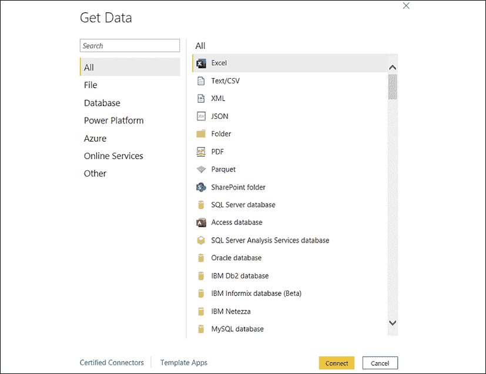
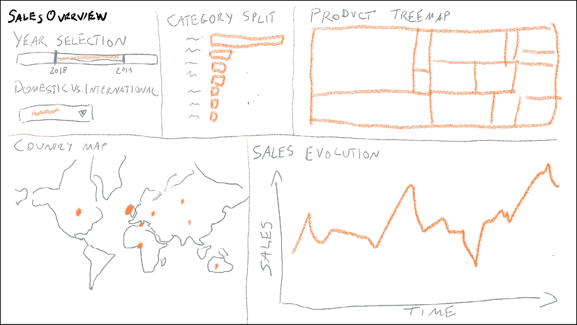
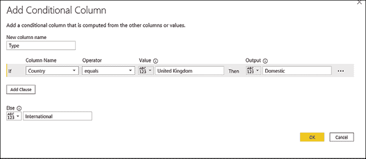
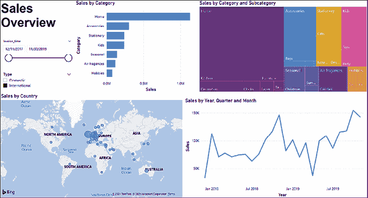
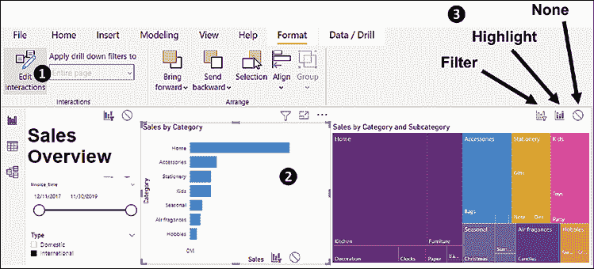
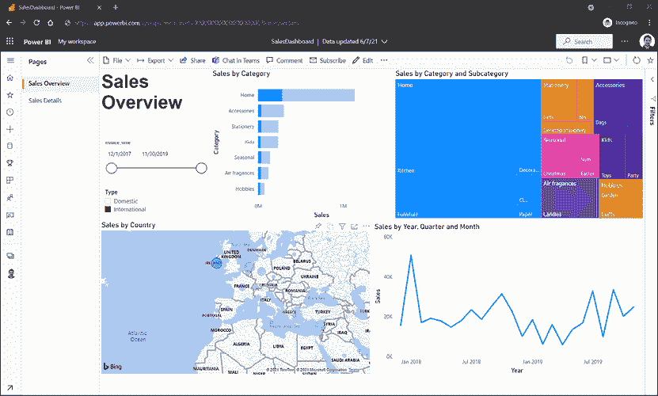

# 第六章：开始使用 Power BI

将数据可视化以理解业务中“发生了什么”：这是组织在利用数据时最初且始终存在的需求。毫不奇怪，商业智能应用程序是公司最早采用的工具，它们往往比“更炫酷”的高级分析工具提前数月（甚至数年）出现。尽管我们可以—可以理解地—对由机器学习算法驱动的预测和指导能力感到兴奋和迫不及待，但一个简单的在线仪表板，展示关键业务指标的演变，往往能在短期内占据主导地位。让更多员工接触到数据将增加识别商业机会的概率，并促使业务经理做出更为有意识和有效的基于数据的决策。这个场景太具吸引力，无法被忽视，现在是时候为我们的数据分析工具箱增加一款能释放描述性分析潜力的工具了：Power BI。

本章将回答以下问题：

+   什么是 Power BI，我该如何开始使用？

+   如何加载、转换和组织数据？

+   如何创建能够互相交互的数据可视化？

+   Power BI 仪表板是什么样的，我该如何创建一个？

在熟悉 Power BI Desktop 用户界面后，我们将一步步构建一个完整的仪表板。最终目标是让你在读完最后一页时，具备创建自己仪表板的所有能力。本章的重点是 Power BI 以及你开始使用它所需的基础内容。接下来的两章将帮助你提升数据可视化和讲故事的能力，让你能够制作出能够有效说服他人的数据图表。一件事一件事地来：现在让我们认识一下我们在数据分析探索中的新英雄。

# Power BI 简介

**Power BI**是微软提供的一项商业智能服务，允许创建在线数据仪表板。让我们来看看它的最基本功能：

+   Power BI 附带一款传统的应用软件，叫做**Power BI Desktop**，你可以免费下载并安装到你的计算机上。Power BI Desktop 提供了 Power BI 的完整设计功能：你可以使用这款软件创建仪表板，保存为本地文件（.pbix 格式），然后与其他用户分享，后者也可以查看和编辑你的仪表板。为了完成本章内容，你只需要使用 Power BI Desktop 应用程序。

+   需要知道的是，Power BI 主要作为云服务提供。如果您决定在公司大规模使用 Power BI，以利用企业数据源并通过浏览器或移动应用程序在线提供仪表板（无需所有用户安装 Power BI Desktop 并通过电子邮件打开共享的文件），那么您可以通过购买 Pro 或 Premium 许可证来实现。这样，您的仪表板将依赖于 Microsoft 云平台 **Azure** 来托管、处理并将数据提供给最终用户。

    如果您的公司使用 Microsoft 365 云服务，您可能已经拥有 Power BI Pro 许可证：值得检查一下这一点。

+   Power BI 利用一个用户友好的 **可视化界面**，让您无需编写任何代码即可设计仪表板。不过，如果您想指定高级查询，可以使用一种编程语言 **DAX**，即 **数据分析表达式**（Data Analysis eXpressions）的缩写。本书中不会涉及 DAX，但了解如果需要，您可以利用它来扩展 Power BI 的功能。

+   Power BI 提供的功能远不止简单的数据可视化。它允许您从不同的来源提取数据，转换并统一表格，应用一些逻辑和算法，并通过互动图表或其他非传统方式使数据变得可访问。例如，Power BI 的一个显著功能是让用户可以通过用简洁的英语输入问题来获取数据，比如 *X 品牌在过去两年的利润变化是什么？* 在这种情况下，您作为设计师的角色将是“教” Power BI 如何理解同事们的问题，例如决定哪些词可以作为同义词来描述相同的实体（例如，*文章*、*SKU* 和 *产品*）。

+   Power BI 可以通过额外的功能和可视化效果来**扩展**。您可以访问 Microsoft 应用商店 **AppSource**（[appsource.microsoft.com](http://appsource.microsoft.com)），在这里您可以免费下载额外的自定义可视化效果。扩展 Power BI 功能的另一种方式是添加 Python 或 R 代码片段，以便实现专业图表或增加机器学习功能。

总的来说，Power BI 承诺成为一个强大且全面的工具，通过易于访问的仪表板帮助公司实现数据民主化：这正是我们所需要的，可以完成我们的数据分析工具箱，并为我们的业务释放可观的价值。在探索其用户界面并熟悉命名约定之前，让我们先在你的计算机上启动 Power BI Desktop。你可以从下载页面 ([powerbi.microsoft.com/en-us/downloads](http://powerbi.microsoft.com/en-us/downloads)) 获取并安装它，或者在 Windows 的 Microsoft Store 应用中查找它。虽然本章并不要求，但你也可以注册一个免费的 Power BI 许可证。这将使你能够访问基于云的服务，并将报告保存在云端（与他人共享则需要购买付费许可证）。

# 走进 Power BI

在 Power BI 中构建一个可用的仪表板需要经过四个基本步骤：加载数据、转换数据、定义数据模型，以及利用数据模型创建数据可视化。如*图 6.1*所示，这四个步骤交替进行，形成一个循环——你的仪表板可能需要几次迭代才能准备好投入使用：

图 6.1：典型的 Power BI 设计流程：加载数据并转换数据，定义模型，构建可视化，并进行迭代

这个过程的每个步骤都依赖于应用程序中的某些特定视图或对话框。通过仅使用少量视图，你就能访问构建仪表板所需的所有功能。*图 6.2*展示了一个简单的“地图”，标明了在哪里可以找到最有用的 Power BI 视图和窗口，以确保你在过程中不会迷失方向：

图 6.2：感觉迷失了吗？这里是你在 Power BI 中找到最有价值视图的地方

在接下来的几页中，我们将带你完成创建仪表板的完整过程，并探索那些在过程中将帮助我们的关键 Power BI 功能。

## 加载数据

不出所料，您在 Power BI 中需要做的第一件事就是加载一些数据。如果您直接点击欢迎屏幕上的**获取数据**，或者点击顶部**主页**功能区中的图标，您将进入**获取数据**窗口，如*图 6.3*所示。这个窗口展示了多种可能的数据连接器，并按左侧显示的类别组织（**文件**、**数据库**、**在线服务**等）。第一类也是最常用的类别是**文件**：在这里，您不仅可以导入 Excel 或 CSV 单个文件，还可以导入整个文件夹，甚至可以从 PDF 报告中提取数据。从**数据库**类别中，您可以连接到许多类型的数据库，并指定 SQL 查询来获取所需数据。在这里，您还可以连接到基于云的平台，如 Amazon Web Services（Redshift）、Google Cloud Platform（BigQuery）以及当然的 Microsoft Azure。**在线服务**类别让您可以连接到其他外部服务，比如 Google Analytics、Salesforce 报告和 Sharepoint 列表。也可以查看**其他**类别：名为**Web**的源让您可以从网页抓取数据，并下载感兴趣的表格或其他网页元素。

图 6.3：Power BI 中的获取数据窗口：定义如何获取所需的数据

通过设置数据连接器，您定义了一个可重复的流程的第一步，用于获取和转换您感兴趣的数据：在 Power BI 中，这样的流程被称为**查询**。定义查询是一种强有力的方式，可以确保您的仪表板能够持续更新。每次刷新报告时，查询都会连接到各个数据源，并拉取最新版本的可用数据。

## 转换数据

对于每个查询，您可以关联一系列的数据转换步骤，这些步骤将在每次新数据到达时应用。在 Power BI 中，您可以通过一种名为**Power Query 编辑器**的工具以可视化方式完成此操作，无需编写任何代码，如*图 6.4*所示。在查询编辑器的左侧，您会看到一个名为**查询**的面板，您可以从中选择要设置转换步骤的查询：只需点击您希望处理的查询名称即可。

你会看到一个类似 Excel 的电子表格视图，位于窗口中间，显示了你转换后的查询的*预览*。单元格的值是只读的：你无法逐个更改它们，实际上，你在这里的目的是为整张表定义可重复的转换步骤，而不是进行单元格级别的更改。你可以使用电子表格的表头来应用一些转换，例如筛选和排序，类似于你在 Excel 中的操作。在右侧，你会看到一个名为 **应用步骤** 的面板，其中列出了至今为止应用的转换步骤的有序列表。第一步很可能是 **来源**，它指示了你加载的原始数据来源的定义。一些转换步骤的右侧会有一个齿轮图标：点击它，你可以编辑该转换步骤的参数。例如，如果查询从 Excel 文件中提取数据，你可以通过点击 **来源** 步骤旁边的齿轮图标来编辑文件路径。

当你选择一个特定的步骤时，电子表格视图会相应更新，显示执行该特定步骤后的查询预览：这在你想要检查*每个步骤中发生了什么*时非常有用：

图 6.4：Power BI 中的 Power Query 编辑器窗口：设计应用于每个查询的转换步骤

通过浏览 **Power Query 编辑器** 窗口顶部的前三个功能区选项卡，即 **主页**、**转换** 和 **添加列**，你可以找到一个包含众多可用转换步骤的*菜单*。这些转换步骤中的许多与我们在 *第二章* 和 *第三章* 中通过 KNIME 使用节点应用的步骤相同。我们来看一下其中最常用的几个。

图 6.5：Power Query 编辑器窗口中的主页功能区选项卡

+   从 **主页** 选项卡 (*图 6.5*) 开始，你可以找到 **选择列** 和 **删除列** 图标，它们让你筛选列，只保留你真正需要的列。

+   同样，**保留行** 和 **删除行** 使你能够减少行数：例如，你可以只保留前 10 行，或删除重复的行。

如果你想根据行的值来筛选行，则需要点击预览电子表格中每列表头右侧出现的箭头。在这里，你还可以使用你喜欢的顺序来排序行。

+   **拆分列** 图标允许你通过使用分隔符（例如，你可以设置 `-` 为分隔符，将 `JUN-22` 拆分为 `JUN` 和 `22`）或按字符数拆分字符串，将其分为多个列。

+   **分组**功能会根据给定的分组定义和汇总逻辑（如求和、平均值或计数）聚合所有行。如果你使用此转换步骤，那么在你的仪表板中将无法使用表格的非聚合版本，因此请谨慎使用此功能。你始终可以通过直接在构建可视化时定义聚合来*动态*地聚合表格，这是我们大多数时候的做法。

+   **合并查询**允许你通过应用一次性连接操作来合并查询。在这里，我们会看到在*第三章*《数据转换》中介绍过的相同连接类型，如*内部连接*、*左外连接*、*右外连接*、*全外连接*，以及更多类型，如*左反连接*（这意味着仅保留左侧表中在右侧没有匹配的行）。你可以创建一个新的查询，包含连接的结果，或者用它替代当前查询。

    需要注意的是，**合并查询**功能并不是在 Power BI 中*连接*具有匹配键的两个表的唯一方式。正如我们将在接下来的几页中学习的，当我们构建数据模型时，我们可以在不静态地一次性连接它们的情况下指定表之间的关系。这意味着只有当你想要运行两个表的最终合并，并接受需要额外空间来保持静态合并版本时，才应使用**合并查询**。

+   使用**附加查询**图标，你可以通过将一个表的行添加到另一个表的行底部来连接两个具有相同列的表。

图 6.6：Power Query 编辑器窗口中的转换标签页

+   转到**转换**标签页（*图 6.6*），我们可以看到**数据类型**下拉菜单，它允许我们选择与列相关联的类型，并尝试进行转换。例如，我们可以使用此功能将包含日期的字符串转换为日期和时间字段。

+   使用**替换值**，你可以将所有具有某个特定值的单元格替换为指定的新值。你也可以用它来将固定值应用于某一列中的所有空单元格。为此，只需使用`null`字符串来指定你想要处理空单元格。

+   **填充**图标让你可以用表格中上方或下方的值替换所有空单元格。当你有一些按时间排序的值，并且你希望*填补空白*以填充最近的可用值时，这非常有用。

+   顾名思义，通过使用**数据透视列**，你可以创建数据透视表，其中列中的值会作为独立列进行汇总。你可能还会发现其反向功能**取消透视列**有用，它会将表格中的列转换为多行显示。

+   **格式**图标允许你操作字符串：例如，你可以将字符串首字母大写（将`tessa`变成`Tessa`）或将其转换为全大写格式（`TESSA`）。

+   使用**四舍五入**功能，你可以指定小数数字的四舍五入逻辑，按你的喜好设置小数位数。

+   在**日期和时间列**部分，你可以提取特定的日期和时间字段，如年份、月份、小时和秒。如果你想提取多个字段，可以首先复制该列（右键点击列标题，然后选择**复制列**），然后根据需要创建多个副本，再将它们替换为所需的字段。

图 6.7：Power Query 编辑器窗口中的“添加列”标签页

+   在**添加列**标签页中（*图 6.7*），你可以通过应用一些逻辑来创建计算列。例如，使用**自定义列**图标，你可以应用数学公式，如`[价格]*[折扣率]`，并将其他列中的值作为变量使用。

+   **条件列**允许你基于对其他列的逻辑条件进行评估，生成一个新的列，这与我们在 KNIME 中使用**规则引擎**节点的做法类似。例如，你可以为所有*价格*列大于 2.5 的行创建一个值为`Expensive`的新列，为其他行创建一个值为`Cheap`的列。

当你完成所有必要的转换步骤后，查询将生成恰好符合你需要的形状和格式的表格。完成后，你可以保存查询（点击**关闭并应用**图标，位于**首页**标签页），并进入下一个步骤：定义数据模型。

## 定义数据模型

在这个过程中，你需要定义由查询生成的表格之间的逻辑关系。为此，只需声明表格之间**匹配列**的关系，即可以在需要时用于合并表格的列。完成这个简单的步骤后，你将定义一个单一的数据模型，随后可以在仪表板可视化中自由使用它。我们这样做是因为一个直接且重要的原因：通过连接匹配键，你可以在同一可视化中使用存储在不同表格中的数据——就像所有表格都已连接，并且可以随时使用，这非常方便。定义清晰的数据模型的一个结果是，你可以通过过滤或选择在图表之间启用交互。例如，假设一个可视化展示了按类别生成的总销售额：点击某个类别名称后，你可以看到另一个可视化展示该类别内最活跃的客户名称，而这些信息存储在不同的表格中。通过知道类别、销售和客户之间的匹配列，Power BI 能够展示用户所需要的数据，并启用深入分析和其他形式的交互。

在 Power BI 中构建数据模型非常轻松。你还记得我们在*第三章*《数据转换》中介绍过的**实体-关系（ER）图**吗？（请参考*图 3.10*复习一下）。Power BI 让你通过使用可用的表格，绘制 ER 图的方式来直观地构建模型。

如你在*图 6.8*中看到的，**模型**视图显示了表格（每个表格都来自于查询中声明的完整转换步骤）作为框体：表格名称以粗体显示在框体的顶部，而列则列在框体内。表格通过线条连接，表示它们之间的关系：

图 6.8：Power BI 中的模型视图：连接表格并构建你的 ER 图

通过使用**模型**视图，你可以轻松地在匹配的列之间声明关系。例如，要在两个不同表格的匹配列之间绘制关系，只需*拖放*一个列到另一个匹配的列上即可。例如，在*图 6.8*中，你可以看到如何通过公共列*StockCode*来建立高亮显示的关系（在 ProductMD 和 Transactions 表格之间）。连接上的箭头表示**交叉筛选方向**：在这种情况下，对 ProductMD 项目应用的筛选也会筛选 Transactions 中的行，而反之则不会发生。连接器末端显示的**1**和*****符号明确了关系的预期**基数**：图中显示的都是**一对多**（**1-to-***)关系，意味着我们期望 ProductMD 中的一行对应 Transactions 中的多行。关系基数的其他可能类型是**一对一**（**1-to-1**）和**多对多**（***-to-***）。

当我们完整地进行教程时，数据模型的作用将更加明显。目前需要记住的是，通过定义关系及其基数和交叉筛选方向（所有这些在**模型**视图中以可视化的方式显示），我们可以确保即使在仪表板中同时使用多个表格时，Power BI 的行为也不会含糊不清。

构建好数据模型后，我们可以进入仪表板创建的最后一个也是最激动人心的部分：设计数据可视化。

## 构建可视化

Power BI 中的仪表板按一组页面组织，每个页面包含多个互相关联的可视化元素，如表格、折线图、散点图、文本标签和按钮。当你执行这一步时，你需要像设计师一样思考，既要保证结构和视觉效果，又要将业务理解和创造力相结合。这项工作既能充满乐趣，又可能非常耗时：但当你最终拥有一个功能完善、价值高的仪表板，供人们用来发现商业机会并做出优越决策时，它肯定会带来回报。当你打开**报告视图**（如*图 6.9*所示）时，你会发现所有需要的工具，来将可视化元素组合在一起，并将它们与底层数据模型中的表格链接起来：

图 6.9：Power BI 中的报告视图：连接表格并构建你的 ER 图

让我们逐一了解**报告**视图中的每个组件，并学习它们的作用：

1.  **报告页面**：这看起来像一张空白纸，你可以在上面绘制你美丽的仪表板。通过使用鼠标，你可以根据需要放置、调整大小和重新定位可视化元素。在报告页面下方，你会找到一组标签，每个标签对应仪表板的一个独立页面。

    根据 Power BI 的官方命名规范，我们在本章中构建的是报告，而不是仪表板：后者是对选定可视化元素的单页汇总聚合功能，仅在 Power BI 服务中可用。为了简便起见，我将在这里继续使用仪表板和报告这两个词来指代我们的最终结果：一组供最终用户交互的连接可视化元素。

1.  **筛选器**：在此部分，你可以通过设置筛选器来决定每个可视化元素显示的数据范围。例如，你可以通过将“*类别*”列从字段面板拖放到**筛选器**面板上的一个框中来设置筛选器。你可以使用筛选器仅显示你选择的数据部分，或者实现某些逻辑，比如*只显示列表中销售前五的产品*。**筛选器**部分有三个不同的面板，分别对应你希望筛选器操作的级别：有些筛选器仅限于特定可视化元素，而其他筛选器则会应用于页面上所有可视化元素，甚至是整个仪表板中任何可视化元素。

1.  **可视化元素**：这一部分是最有趣的，因为它列出了你可以添加到仪表板中的所有可视化类型。正如你从*图 6.10*中看到的那样，安装 Power BI 后，你可以使用超过 30 种不同的可视化类型：

    图 6.10：Power BI 中可用的可视化类型：哪种图表最能让你的数据“发声”？

    你还可以通过启用某些测试版功能的预览（前往**文件** | **选项和设置** | **选项** | **预览功能**进行激活）或从 AppSource 下载它们来添加额外的可视化类型（点击最后一个可视化**...**图标进行下载，登录 Power BI 后即可访问 AppSource，即使是免费账户也可以）。你可以在*图 6.11*中看到从那里获取的额外可用可视化类型的预览： 

    

    图 6.11：创意枯竭了？你可以查看 AppSource 获取更多的可视化类型，并将其添加到你的 Power BI 中。

1.  **属性**：在这一部分，你可以配置你的可视化效果应如何表现和呈现。正如你在*图 6.12*中看到的，这一部分有三个可用的选项卡，分别是**字段**、**格式**和**分析**。**字段**选项卡是首先要处理的部分：通过将数据模型中可用的列拖放到该选项卡中的各个元素中，你可以决定哪些数据应当被可视化。根据你使用的可视化类型，你需要配置的元素会有所不同。例如，*图 6.12*中的示例是一个折线图，其中列*Invoice_time*控制着横轴的内容，而通过折线展示的数值则由列*Quantity*控制。在**格式**选项卡中，你可以使用多个选择器来控制可视化的“外观和感觉”。你可以调节多个可视化属性，从标题到显示在顶部的颜色和线条粗细。最后，在**分析**选项卡中，你可以启用一些基础的建模功能，比如趋势线（基本上是简单线性回归模型或时间序列预测的结果）：

    图 6.12：可视化属性部分：将数据列连接到图表，并决定其显示方式。

1.  **字段**：这个部分位于**报告**视图的右侧，执行了一个简单但至关重要的功能。它列出了数据模型中不同表格中所有可用的列，使你可以轻松地将这些列拖放到过滤器或属性部分。当你点击任何列时，**列工具**功能区会出现在窗口顶部。你可以使用它来更改列的数据类型，或设置其默认的聚合方法（如*求和*、*计数*或*平均值*）：当你希望在使用这些列进行可视化时，精细调整它们的行为时，这个功能非常有用。

我们做到了！我们已经完成了在 Power BI 中构建仪表板所需的四个基本步骤，并借此机会简要了解了该软件的主要功能。

让我们总结一下我们刚刚看到的内容：一切始于将一些原始数据加载到 Power BI 中，选择并配置**获取数据**窗口中提供的正确连接器。利用**Power Query Editor**的丰富功能集，我们将原始数据提升到了一个新的水平，并应用了一系列有序的转换步骤，这使我们得到了多个形状和格式正确的表格（可以随时通过类似电子表格的**数据视图**预览）。此时，我们使用**模型视图**将所有这些表格连接在一起，定义匹配列之间的关系，构建了一个统一的数据模型。最后，我们打开了**报告视图**，在这里我们找到了构建仪表板所需的所有元素（表格和可视化）。现在是时候在接下来的教程中，看看这个过程如何通过从零开始构建一个完整的 Power BI 仪表板来实际操作了。

# 教程：销售仪表板

本教程将带我们回到一个熟悉的业务，这个业务我们已经变得非常熟悉并且喜爱：这是一家位于英国的在线零售商，销售各种场合的礼物。通过使用 KNIME 自动化每周的 Excel 报告（我们在*第三章*，*数据转换*中做过的事），我们获得了相当的声誉，这也把我们再次推到了聚光灯下。随着业务的不断增长，对使更多员工能够使用描述性分析的需求也在扩大。更新一些回答固定问题的 Excel 报告已不再足够。我们希望能够提供机会，让同事们深入了解按季度、国家和产品层级的详细信息，以便他们能够“探索”数据并发现有趣的洞察。

在财务分析师的帮助下（他仍然对我们充满感激）并且在采访了一些经理，了解他们最常见的需求后，我们已经准备好总结出每个用户组的需求，具体如下：

+   所有经理应能够一目了然地看到各类别和子类别在总收入中的相对权重，并看到每个产品组随时间变化的销售演变情况。

+   市场经理应该能够分别查看国内（英国生成的）和国际销售数据，能够按国家和类别深入分析，并相应地规划针对特定国家的数字营销活动。

+   类别经理应有机会按类别深入分析，识别出每个季度和每个国家销售最多的商品。

数据遵循我们在*图 3.10*中遇到的相同模型，并通过三个独立的文件提供给我们：`SalesDashboard-CustomerMD.csv`和`SalesDashboard-ProductMD.csv`分别包含客户和产品的主数据表，而`SalesDashboard-Transactions.xlsx`则包含最新的交易数据（这次，所有数据都包含在一个文件中）。

现在是时候启动 Power BI Desktop 并在我们的计算机上运行，开始创建任何仪表板的第一阶段：加载所需数据：

1.  首先，我们加载存储在文本文件中的客户主数据，该文件为逗号分隔值文件。为此，点击**获取数据**图标，该图标位于**主页**功能区选项卡上，然后选择**文本/CSV**作为数据源类型，再点击**连接**。此时，您将看到一个对话框，您可以选择用于作为数据源的文件，在我们的例子中是`SalesDashboard-CustomerMD.csv`。此时，您将看到文件中记录的表格的预览（*图 6.13*）。Power BI 已正确识别其格式：有两列，列标题以粗体显示在顶部。看起来一切正常，不需要更改任何设置（例如，您可以看到逗号正确地用作列分隔符），所以我们可以点击**加载**以完成此步骤：

    图 6.13：客户主数据源的预览。您可以从窗口中的菜单中修改导入设置。

1.  我们可以重复相同的过程（**获取数据**然后选择**文本/CSV**）来加载产品主数据表。这一次，预览窗口（*图 6.14*）显示列名未被正确识别，而是被分配了一些默认标识符（*Column1*，*Column2*，等等）。这需要进行一些小的转换，才能在我们的数据模型中使用此表格。因此，这次我们点击底部的第二个按钮，**转换数据**：

    图 6.14：产品主数据表的预览：列标题未被识别

1.  点击**转换数据**后，我们要求 Power BI 为查询添加一些转换步骤，以注入产品主数据表：这是**Power Query 编辑器**的工作，它的窗口将会出现。在这种情况下，唯一需要的更改是将 CSV 文件中读取的第一行提升为表格的列标题。为此，点击**将第一行用作标题**按钮，该按钮可以在**主页**功能区菜单中找到（请参见*图 6.15*中的箭头作为指南）。完成后，右侧的**应用的步骤**列表将增加一个**提升标题**步骤：这意味着每次加载新数据时，Power BI 都会作为查询的一部分执行此步骤。我们可以点击左上角的**关闭并应用**图标，继续下一步：

    图 6.15：产品主数据表的 Power Query 编辑器。我们需要将第一行用作标题

1.  包含交易的表格存储在 Excel 文件中。要加载它，您可以点击常规的 **获取数据**，然后选择 **Excel**，或者直接点击 **首页** 功能区菜单中出现的 **Excel** 图标。随后，您将看到一个对话框，您可以预览 Excel 文件中各个工作表包含的表格（*图 6.16*）：

    图 6.16：Excel 预览对话框：选择您要从 Excel 文件导入的表格

    此外，在这种情况下，我们需要向查询中添加一些转换，因此勾选左侧的 `Transactions` 复选框，然后点击 **转换数据**，这将打开 **Power Query 编辑器**。

    当我们查看“交易”表的预览时，我们注意到至少需要进行两次转换才能使其可用。首先，*Invoice_time* 列看起来不对，因为它没有被识别为日期和时间字段。其次，由于我们的业务需求大部分要求分析收入，而我们每个交易只有单价 *Price* 和 *Quantity* 两列，因此我们需要实施一个简单的数学公式，通过乘这两列来获得收入。让我们看看 **Power Query 编辑器** 如何帮助我们解决这两个问题。

1.  如果您查看电子表格视图的标题，您会注意到在每个列标题的左侧，可以找到一个图标，表示其数据类型。例如，靠近 *StockCode* 的 **ABC** 图标告诉我们它是文本字符串，而靠近 *Price* 的 **1.2** 图标表示它是一个十进制数字。如果您点击这些图标中的任何一个，您将看到一个弹出菜单（*图 6.17*），在这里您可以强制转换为不同的数据类型。Power BI 将尝试将其转换为您所希望的类型。让我们对 *Invoice_time* 列进行操作：点击其左侧的类型图标并选择 **日期/时间**（如果弹出窗口询问是否替换当前查询步骤或添加新步骤，选择第一个选项）。您会注意到电子表格视图现在显示了日期和时间，这正是我们想要的：

    图 6.17：Power Query 编辑器中的列类型选择：通过做出正确选择转换列

1.  下一步是添加一个新列，包含每笔交易产生的收入。为此，进入 **添加列** 功能区菜单，然后点击 **自定义列** 图标。您将看到如 *图 6.18* 所示的窗口，在这里您可以定义表达式，类似于我们在 KNIME 中使用 **数学公式** 节点的操作。可用的列显示在右侧：双击 *数量* 使其出现在 **自定义列公式** 框中，然后在键盘上输入 `*`，最后—双击右侧的 *价格* 列。这样，您将得到表达式 `[数量]*[价格]`，这正是我们计算销售额所需要的。现在，您可以通过在顶部的 **新列名称** 框中输入 `销售额` 来指定列名，然后点击 **确定** 按钮：

    图 6.18：在 Power BI 中添加自定义列：使用列作为变量定义数学公式

    您会自豪地发现，新计算出的列 *销售额* 出现在电子表格视图的右侧。然而，它的数据类型仍未定义，您会在标题的左侧看到一个模糊的 **ABC123** 图标。您可以通过点击该图标并选择 **小数** 快速解决此问题。

    始终声明列的数据类型。这样，列可以在您的仪表板可视化中得到最优化使用，并且也能得到适当的聚合。数值列默认在 Power BI 中通过求和聚合，但您可以随时更改每列的聚合函数。为此，进入 **数据** 视图（请参见 *图 6.2* 查找它），选择一列，并使用 **汇总** 下拉菜单，该菜单位于 **列工具** 功能区（对于数值列，您可以选择 **求和**、**平均值**、**最小值**、**最大值**、**计数** 和 **唯一计数**）。

    完成此步骤后，您将看到，在 Power Query 编辑器的帮助下，您创建了一个包含七列的表格，如 *图 6.19* 所示。在右侧的 **已应用步骤** 面板中，您可以找到所有需要进行的转换的排序列表（例如获取存储在 Excel 中的数据、添加列、修改其类型等），以生成您想在仪表板中使用的表格。您可以点击每个步骤以“*回到*”转换流程的那个阶段。您还可以删除任何步骤（点击当选择特定步骤时出现的左侧 **X** 图标）或编辑它：例如，您可以通过点击 **已添加自定义** 步骤右侧的齿轮图标来更改我们添加的自定义公式定义：

    

    图 6.19：您的交易表的完整查询定义：Power Query 编辑器是您在 Power BI 中进行可重复数据转换的得力助手

    尽管大多数转换通常是在添加新数据源时定义的，但您可以稍后通过重新打开 Power Query 编辑器视图来编辑查询（点击**转换数据**图标，位于**主页**功能区菜单中）。

    要继续操作，请点击左上角的**关闭并应用**图标，我们就可以进入仪表板创建过程的下一个阶段：定义数据模型。

1.  如果您进入**模型**视图（点击 Power BI 主窗口左侧工具栏中的第三个图标），您会看到一个熟悉的界面：由我们三张表组成的数据库的 ER 模型（请回到前几页，查看*图 6.8*，它展示了数据**模型**视图的截图）。Power BI 自动识别了表之间的关系并建立了连接，无需我们的干预。当然，在这个案例中比较简单，因为匹配的列正好具有相同的名称和类型。无论如何，我们可以通过使用**模型**视图手动声明或编辑表之间的任何关系。我们可以通过“拖放”一个表中的列到另一个表中的列来创建新的关系。要编辑现有连接，您可以双击连接两张表的线条。点击产品主数据与交易表之间的关系：您将看到**编辑关系**视图，如*图 6.20*所示。下拉菜单让您选择要连接的两张表，而您可以通过点击中间显示的预览表来指定匹配的列。在我们的案例中，我们注意到两个表中的*StockCode*列都被高亮显示，这正是我们想要的。左下角的**基数**下拉菜单让您选择关系的类型（**多对一**、**一对一**、**一对多**或**多对多**）：通过这样做，您是在告诉 Power BI 第一张表中的多少行应与第二张表中的多少行匹配。在这个案例中，我们选择**多对一**，因为多个交易（第一张表）可以对应同一个产品，因此对应到产品主数据表（第二张表）中的一行。您可以将**交叉过滤方向**下拉菜单保持在默认值（**单向**，这是推荐的设置，因为大多数情况下，性能更佳）。由于所有默认选项在此案例中都能很好地工作，因此我们无需做任何更改：点击**确定**并继续：

    图 6.20：在数据模型中管理表之间的关系：哪些列应该匹配？

    在 Power BI 中，两个表之间的活动关系只能通过一对匹配的列来定义。如果你希望在两个表之间匹配多个列，你需要进行一个简单的变通方法：进入**Power Query 编辑器**（点击常规的**转换数据**图标），选择你想要作为单一键值使用的两个或多个列，然后从**转换**菜单中点击**合并列**。在另一个表上也进行此操作，之后你就可以在合并的列之间创建关系了。

1.  双击连接事务表和客户主数据表的关系线，检查这两个表之间的其他关系。确保匹配的列是*Customer_ID*，**基数**是**多对一**，并且**交叉过滤方向**是**单向**。然后点击**确定**，你的数据模型就准备好了！

    此时，我们已经准备好进入最后一个阶段，对一些人来说，这是最令人兴奋的部分：通过一步步构建可视化内容来设计你的仪表盘。许多人在第一次创建数据仪表盘时常犯的一个错误是，在没有明确目标的情况下，直接跳入制作五彩斑斓的图表。我的建议是，始终花一些时间后退一步，思考你具体的业务需求，并简单地*勾画*出仪表盘的样子。考虑你的最终用户可能提出的问题，并思考如何有效地引导他们找到所需的答案。如果有机会，可以将你的草图（或用你熟悉的任何软件制作的数字*原型*）展示给一些最终用户，听取他们的初步反应。你会发现，早期在仪表盘规划上的投入（此时不需要细节，简单的内容概览就足够了）会在后期避免一些昂贵（且令人沮丧）的返工，从而带来回报。

    当你从事大型描述性分析项目时（比如从零开始构建公司的商业智能应用层），规划阶段变得尤为关键。在这种情况下的建议是，保持*敏捷*思维，并在小规模（但总是经过良好规划的）迭代中工作，每一步都逐渐添加功能。另一个建议是，确保及早与业务伙伴（代表仪表盘的最终用户）合作，共同*设计*功能，而不是等到完成后才展示最终产品。

    对于我们的销售仪表板，我们需要制作一个概览页面，其中必须包含按类别和子类别划分的销售情况。条形图和树图可以很好地展示每个产品元素的相对大小（此时不用担心可视化类型；我们将在下一章学习如何选择最佳的图表类型）。折线图将有助于展示随时间变化的趋势，同时，将销售分布可视化到世界地图上，可以揭示任何地区性模式。最后，用户需要能够选择特定的年份范围，并选择是否只查看国内销售（在英国生成的），或者国际销售，或两者都有：需要添加一些筛选器，提供简单的方式来过滤感兴趣的数据。考虑到最终用户的需求，我们设计了你在*图 6.21*中看到的草图：在这一阶段，我们有意远离完美，但至少我们可以自信地继续构建可视化，知道我们正在为之努力的目标是什么：

    

    图 6.21：销售概览仪表板页面的粗略草图：在创建任何图表之前，最好先决定你需要可视化的数据，以满足你的业务需求

1.  转到**报告**视图（主窗口左侧垂直栏上的第一个图标）。在右侧的**可视化**面板中（显示不同图表类型的所有图标），点击带有水平条形图的图标（其工具提示标签，在鼠标停留一秒钟后显示，标注为**堆积条形图**）。此时报告页面上会弹出一个空框：这是我们条形图的占位符。现在我们需要告诉 Power BI，想让这个条形图展示哪些数据。正如*图 6.22*中的箭头所示，我们需要将数据模型中可用的列（在右侧的**字段**面板中列出）拖放到可视化的属性面板中。更具体地说，*类别*列（在“产品主数据”组中找到）应该被放入属性面板中的**轴**框中，而*销售*列（在“交易”表中）应该被放入**值**框中。一旦这样做，条形图会神奇地出现在左侧，你的第一个 Power BI 可视化就完成了！我们可以通过**格式**面板（带有油漆滚轮图标）来改变新创建的可视化的*外观与感觉*（更改颜色、标题、字体、标签等），但目前我们专注于构建仪表板的其余部分，接下来我们将继续制作以下图表：

    图 6.22：在 Power BI 中构建条形图：选择用于轴类别和条形高度的列

1.  按照草图的要求，我们现在添加一个树状图：它将显示每个类别/子类别组合在销售方面的相对大小。在报表页面中点击一个空白区域，然后点击**树状图**可视化图标。为了构建这个可视化，拖动并将感兴趣的字段放入右侧的属性框中（*图 6.23*）：*Category* 应放入**Group**，*Subcategory* 放入**Details**，*Sales* 放入**Values**。到目前为止，你应该已经掌握了在 Power BI 中构建图表的精髓：我们决定需要哪种类型的可视化，然后将数据列与该类型图表可用的不同属性字段连接：

    图 6.23：树状图可视化：显示每个组和子组的相对大小

    你会注意到每个图表的边缘和角落都有一些灰色的控制手柄。利用它们调整图表大小，必要时移动图表，以便将其放置在你喜欢的位置。根据草图的指引，开始将可视化放置到合适的位置。

1.  接下来要添加的可视化是一个折线图，显示随时间变化的销售情况。在报表空间中点击一个空白区域，然后点击**折线图**图标。你可以使用*Invoice_time*作为控制图表**轴**的列，而*Sales*则决定要可视化的**数值**。Power BI 默认只使用时间层次结构的顶级：这意味着一开始，图表将显示按年份汇总的销售数据，只显示 2017-2019 范围内每年的三个值。由于我们想按月显示销售演变，因此需要通过点击可视化右上角的分支箭头，展开时间层次结构的下级（参考*图 6.24*）。下一级显示按年份/季度的拆分，但这还不够，因为我们想进一步细化到年份/月，因此你需要再次点击图标：此时，图表的标题将变为**按年、季度和月份的销售情况**，这表明我们已经得到了所需的结果：

    图 6.24：构建折线图显示随时间演变：你可以根据需要点击图表右上角的箭头图标，以在年份/季度/月/天的层次结构中导航

1.  我们销售概览页面中的下一个图表是世界地图，显示各国的销售情况。好消息是，Power BI 会自动识别表格中的地理名称，简化了创建地图图表的过程。点击报告中的空白区域，然后点击**地图**可视化（图标看起来像一个地球仪；不要和**填充地图**混淆，后者显示的是美国的简图）。如*图 6.25*所示，将*国家*列（来自客户主数据表）拖到**位置**框中，然后使用*销售额*来控制气泡的**大小**。现在，你可以看到一张世界地图，展示收入的来源地：不出所料，最大的气泡出现在英国，考虑到本地客户的普遍存在。

    描述自动生成](img/B17125_06_25.png)

    图 6.25：完整的地图图表：Power BI 能识别国家、州和城市等位置，使得构建数据丰富的地图变得简单。

    在地图可视化中（与 Power BI 中的任何其他图表一样），当你将鼠标悬停在可视化元素上（在这种情况下，是地图上的气泡）时，默认会显示一个工具提示标签，提供该特定元素的精确值（例如，某个国家的总销售额）。许多图表类型允许你通过将字段添加到**工具提示**框中来控制在工具提示中显示的内容。

1.  现在是时候添加一些切片器，让用户选择要在页面上显示的内容。第一个切片器将控制时间维度：我们希望允许用户将销售概览页面上的所有可视化内容限制在特定的时间范围内，以便他们能够在给定的时间段内按类别、子类别或国家评估销售情况。为此，只需要添加一个**切片器**可视化，并将*发票时间*列拖到**字段**框中，如*图 6.26*所示。切片器在 Power BI 中非常受欢迎：你可以根据需要添加多个切片器，并将多个字段组合成一个切片器，以便进行多层次的选择。例如，我们可以将*类别*和*子类别*结合起来，这样用户就可以在选择关注的内容时浏览整个产品层级。

    描述自动生成](img/B17125_06_26.png)

    图 6.26：Power BI 中的切片器：可视化过滤你的数据，以便集中关注最重要的内容。

1.  根据我们的草图，我们的第二个切片器应该区分国内销售和国际销售。由于我们没有一个指定客户所属组别的列，因此我们需要添加一个新的列来满足这一需求。Power BI 提供了**条件列**：这些是计算列，通过应用一组逻辑规则（比如一组*if-then* 语句）来确定每一行的值。你会注意到，这与我们在 KNIME 中使用的**规则引擎**节点非常相似。要在 Power BI 中添加条件列，我们需要通过点击**首页**功能区上的**转换数据**图标返回到 Power Query 编辑器窗口。在左侧的列表中选择客户主数据查询后，我们可以通过进入**添加列**功能区并点击**条件列**来添加列。系统会弹出一个类似于*图 6.27*所示的窗口：在顶部的文本框中选择新列的名称后，我们可以定义一个或多个*if-then* 语句，利用如*等于*、*大于*、*包含*等操作符。通过点击**添加语句**按钮，你可以附加其他条件，并且还可以指定当没有条件满足时使用的默认值（底部的**Else**框）。在我们的案例中，我们只希望新列（我们可以将其命名为*Type*）在*Country*为`United Kingdom`时显示`Domestic`，在其他任何情况下显示`International`：

    图 6.27：添加条件列：定义一组逻辑语句来控制列的值

1.  现在我们有了新的列*Type*，我们可以按照我们为时间切片器所采用的相同步骤，添加一个新的切片器，并将新的条件列拖到**字段**框中。

1.  现在，我们可以通过进入**插入**功能区并点击**文本框**图标来给页面添加标题。我们可以输入任何文本（在这个例子中，我们输入页面标题`Sales Overview`），并调整字体大小和样式来使其看起来更好。通过拖动所有可视化图表并根据我们的原始草图重新排列它们，我们获得了*图 6.28*所示的页面：

    图 6.28：销售概览页面：对于我们的第一个 Power BI 创建作品，表现得相当不错！

    该页面在其简洁性上已经足够吸引人：它包含了几个可视化图表，展示了我们在线零售业务中的关键维度。切片器允许用户在特定的时间框架或国家范围内筛选分析数据。非常重要的是，这些可视化图表彼此互联：用户可以与某个可视化元素互动，导致其他可视化图表重新排列其范围。例如，尝试点击第一个类别柱状图中的任意一条柱子：折线图将显示该特定类别的销售演变，世界地图会重新排列气泡的大小，只考虑该特定国家的收入。如果我们从右上角的树状图中选择一个子类别，同样的事情会发生，所有其他可视化图表将显示该子类别的详细信息。这非常强大，因为我们让用户自主发现数据，根据自己的需求定制视图，而不是直接提供现成的数据分析体验。

    在 Power BI 中，你可以通过按住*CTRL*键一次选择多个元素。尝试按住*CTRL*键并点击柱状图中的两个不同类别：这两个类别的销售数据将在折线图中聚合在一起。你还可以使用此功能在不同的可视化图表之间切片数据。例如，点击地图图表中的一个气泡，并且在按住*CTRL*键的同时，点击树状图中的一个子类别：折线图将显示你从世界地图中选择的特定国家/地区的该子类别的销售时间演变。

    由于各个图表之间是互动的，我们可能需要微调和修改它们的动态行为。例如，如果你点击柱状图中的任何一个类别，树状图会*高亮*你的选择，意味着其他所有类别的颜色将会变淡。如果我们希望树状图有不同的反应呢？我们想要它不是高亮柱状图中选择的类别，而是仅显示那个类别并过滤掉其他所有类别吗？让我们把这个挑战当作一个机会，来看看如何在 Power BI 中改变不同可视化图表之间的交互行为。

1.  转到**格式**功能区菜单（当你选择任何图表时会出现），然后点击左侧的**编辑交互**图标。通过点击可选择*控制*其他可视化的图表（我们可以称之为**前置图表**）。在我们的案例中，点击显示按类别分销销售的条形图。这样，树形图图标的右上方将出现三个图标（确保调整图标大小，以便看到这三个图标）。点击这些图标（见*图 6.29*），你将决定当选择前置图表时，树形图如何响应：**筛选**图标将使该可视化筛选掉其他数据并“聚焦”于选择；**高亮**图标（默认行为）将使该可视化通过不同的颜色强调前置图表上应用的选择；**无**图标将断开连接，使树形图完全“独立”于条形图的任何选择。在我们的案例中，我们点击**筛选**图标（这是我们想要的行为），然后再次点击**编辑交互**图标返回到正常编辑模式：

    图 6.29：更改可视化交互行为的三个步骤：点击“编辑交互”，选择前置图表，然后点击随后的所有可视化上的行为图标（筛选、高亮或不做任何操作）

    并非所有的可视化类型都允许我们在本示例中看到的三种交互方式。例如，折线图只允许**筛选**和**无**交互。

    通过查看原始需求集，我们意识到需要更多的可视化来完成我们的目标。市场营销和类别经理需要超越现有的可视化概览，访问一些更详细的表格展示。我们决定通过添加一页名为“销售详情”的页面来完成仪表板，并配备符合我们剩余需求的一些表格。

1.  点击**报告**视图底部的**+**符号：这将向你的仪表板添加一个空白的新页面。你可以通过右键点击页面标签并选择**重命名页面**来重命名每个页面。

1.  让我们在新页面上添加一个**矩阵**可视化（不要与我们稍后使用的**表格**可视化混淆）。现在，将以下字段添加到各个框中：先将*类别*放入**行**框，然后在其下方放入*子类别*。接下来，将*发票时间*拖到**列**框中，最后，将*销售额*放入**值**框中。

1.  此时，表格仅显示产品和时间层级的顶层（如*图 6.30*所示），因为这是其默认行为。为了使其对我们的业务用户更有用，我们需要通过点击可视化右上角的分支箭头来扩展这些层级（参见*图 6.30*中的步骤 2）。完成行的扩展后，使用**钻取**下拉菜单选择列（参见*图 6.30*中的步骤 3），然后再次点击分支箭头（就像我们之前对行所做的那样）。现在，你已经获得了一个相当丰富的表格，显示了按类别和子类别分的季度销售情况：

    图 6.30：构建矩阵可视化：选择要使用的字段，并决定行和列的聚合级别

1.  为了使矩阵图表更易于访问，我们可以微调一些设置，移除一些不必要的数字。进入**格式**面板（带有油漆滚筒图标的面板），在选项列表中向下滚动，打开**小计**视图，并关闭**列小计**，因为我们不需要年度总和（参见*图 6.31*中的步骤 1）。然后向下滚动，打开**字段格式**视图：在这里，将**值的小数位数**设置为`0`，这样我们就去除了所有不必要的小数值，这些值只会增加杂乱（参见*图 6.31*中的步骤 2）：

    图 6.31：移除矩阵可视化中的杂乱：停用列小计并移除小数位

1.  让我们添加一个新可视化，以便用户根据需要专注于国内或国际销售。这一次，添加一个**圆环图**，并按如下方式设置其字段（我们无需查看截图，因为这个过程现在应该已经非常熟悉）：将列*类型*设置为**图例**，将*销售*设置为**值**。

1.  为了完成我们的详细视图，我们将显示按国家和商品汇总的销售情况。首先，从国家开始：添加一个**表格**可视化，并将**国家**和**销售**列直接拖放到其中（只需确保按照指定顺序，先**国家**，再**销售**）。通过点击新表格可视化中的*销售*标题，按销售额降序排列国家销售，这是我们想要的结果。

1.  为了添加商品详情，让我们再实现一个**表格**可视化，然后按照以下顺序拖放以下列：*描述*、*数量*和*销售*。同样，像之前做的那样，点击表格可视化中的*销售*标题，将畅销商品排在列表顶部。为了避免杂乱，请移除这里和前一个表格中的小数位，使用**字段格式** | **值的小数位数**选择器，就像我们对矩阵视图所做的那样。

1.  我们也应该给这个页面加个标题。去**插入**功能区菜单，点击**文本框**图标并写入`销售详情`。为了保持一致性，尽量使用和第一页相同的字体大小和类型：

图 6.32：销售详情页面：我们的 Power BI 仪表板现在已经完善，可以查看到更精细的国家和产品详情

我们终于完成了：你刚刚整理出来的第二页（见*图 6.32*）很完美地填补了我们之前的空白。用户现在可以深入查看子类别/季度/国家组合（只需点击表格标题，按住*CTRL*键过滤到所需的组合），并检索到各个业务细分中的畅销商品。

当你在 Power BI 服务中发布你的新仪表板（如果你有账户，即便是免费账户，去**主页**功能区菜单，点击**发布**图标试试看），并将其 URL 分享给同事时，你会突然成为他们的英雄！他们现在可以通过任何浏览器访问所需的数据（见*图 6.33*），并自主深入到他们最感兴趣的业务部分：

图 6.33：在 Power BI 服务上发布后的销售概览页面的浏览器视图：我们的仪表板在云端看起来很棒

在旅行中，我们的同事甚至可以在*路上*查看销售结果：你可以在*图 6.34*看到我们仪表板在智能手机上 Power BI 应用中的样子：

图 6.34：通过 iPhone 上的 Power BI 应用访问的销售详情页面：你几乎可以在任何地方访问你的数据

仪表板的维护相对轻便，因为所有可视化的更新现在可以轻松地每天进行。我们定义的各种查询知道从哪里获取数据以及需要哪些转换步骤。当有新数据出现时，只需点击**刷新**图标（位于**主页**功能区菜单上），刷新仪表板，整个仪表板就能保持最新状态。

你不仅通过一个可持续的、现在可以轻松重复的过程，最终让公司内销售数据的访问实现了民主化，而且你还为财务分析师节省了很多宝贵的时间。她不再需要回答那些她以前经常收到的“临时”问题，这些问题迫使她每次都要进行繁琐的手动数据提取。由于数据现在随时可用，人员可以更快、更方便地自己去获取所需的信息，从而将更多的时间交还给我们的财务分析师，让她可以进行更高级的分析。这是一个真正的*双赢*，你应该为能够促成这一切感到非常自豪。

# 总结

完成本章后，你已经为你的数据分析师背包中添加了另一个宝贵的工具：Power BI。你已经学习了如何加载数据，并建立一套数据清洗和转换的常规步骤，使这些数据变得有用。你已经看到了如何定义连接所有表格的关系，从而形成一个统一且连贯的数据模型。你还了解到如何构建互联的可视化图表，允许用户进行交互。你已经创建了一个仪表板，使得业务用户能够在需要时探索他们所需的数据，*捕捞*洞察力并揭示商业机会，完全独立。

现在，想想公司数据库中（甚至是存储在个人笔记本上的 Excel 文件中）那些大部分未被利用且无法访问的数据。通过一个简单的仪表板将这些数据以可视化方式呈现出来，待解锁的商业机会是巨大的，并且在很多情况下，通过像 Power BI 这样的工具，可以轻松实现：你在本章中所学到的知识可以让你成为许多人心中的英雄。

在下一章中，我们将学习一些实用的指南，以提升我们的数据可视化技能：目标是让我们从现在开始，充分利用每一个图表。
