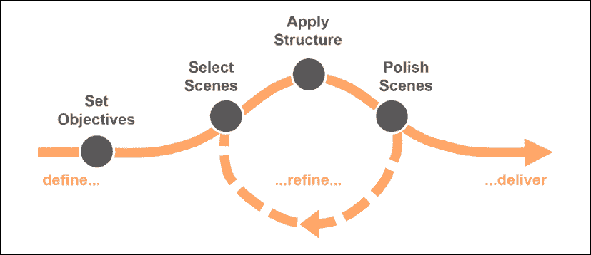
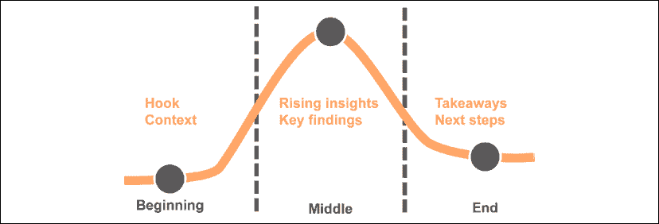
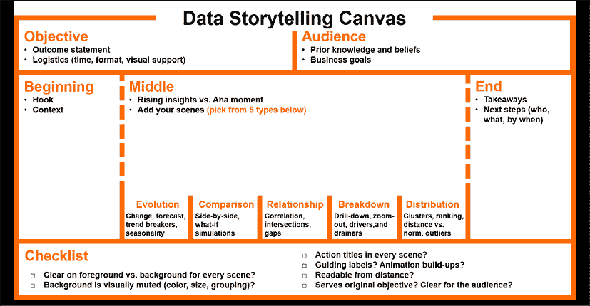

# 第八章：用数据讲故事

这是你没有预料到的章节。制作和传达一部虚构作品中，什么可以是分析性的、科学的和专业的呢？尽管看起来充满矛盾，但讲故事却是从数据中创造经济价值的最实用方法之一。在这一章中，你将了解这一过程是如何运作的，并且如何利用它来为自己谋取优势。

我们将很快回答以下问题：

+   故事与商业和数据分析有什么关系？

+   一个故事的构成要素是什么？

+   如何从我的数据开始构建一个故事？

+   我可以使用什么技巧来讲述推动商业价值的故事？

在本章的第一部分，你将发现是什么让故事如此有效地与他人沟通（并说服他人）。在第二部分，你将学习一种简单的方法论以及一些实用技巧，帮助你自己构建强有力的数据故事。本章不同于书中其他章节，因为它旨在培养一套比你之前看到的更柔和的技能。对于一些更熟悉技术和科学的读者来说，这可能会让人感到有些不适。无论如何，我保证这本章值得一读：你可能会像之前的许多人一样，成为一个意想不到的数据故事爱好者。

# 说服他人的艺术

仅仅“正确”是不够的：这是许多数据从业者面临的平凡且有时令人不安的现实，他们的观点——无论多么真实和深刻——无法被主管接受和听取。正如我们在第一章中看到的那样，通过数据分析创造经济价值有多条路径，我们称之为数据到价值的路径。在大多数情况下，要创造价值，我们需要通过数据来影响他人，促使他们做出正确的决策或采取适当的行动。现在请想一想：到目前为止，你在书中所看到的一切——所有努力转化数据、发现洞察、建立强大模型的工作——如果我们错过了链条的最后一环，即影响他人的行动，这些工作都将悲哀地变得无用。为了防止我们的工作变得无关紧要，最好的办法是将其贯彻到底，直到采取行动，而不是天真地认为“做数学工作就足够了”。为了做到这一点，我们需要通过掌握劝说的艺术与科学，来有说服力地传达我们的观点。

描述劝说动态的最简单（也是最古老）的模型是**修辞学**：它总结了使演讲或书面文件（在我们的案例中，可以是支持管理决策的演示或商业备忘录）在说服他人时成功的三个基本特征。这些特征，也被称为**劝说模式**，包括：

+   **可信度**：发言者、作者或支持者的权威性和个人诚信会使论点更具可信性，更容易被接受。那些能够展示成功的经验记录的人，会更容易获得认可。此外，用于支持某个观点的来源的可靠性，无疑会增强论点的说服力。 |

+   **逻辑严谨性**：清晰且扎实的理性论证链条能够激发听众的智慧和理性，使其更容易接受。如果你能够使用一种被他人接受（并且—特别—易于理解）的逻辑来证明你的观点，最终他们会信服。如果你的逻辑有任何缺陷或无法理解，你的听众将会质疑整个论点，哪怕你完全是对的。 |

+   **情感参与**：如果观众在情感上投入，并且感觉到与案件有个人的关联，他们更有可能同意并采取你推荐的行动。发展情感诉求的方式有很多种，比如使用唤起情感的图像，选择带有情感强调的词语，提到亲身经历，做出人们能个人感同身受的类比，或者创作引人入胜的故事保持高关注度。这个特征要求你识别情感，分辨情绪，并根据环境调整风格和内容，这一系列能力被称为**情商**。

修辞学是一门古老的学科。它最早起源于公元前 5 世纪的西西里岛，在古希腊的叙拉古和阿格里真托的殖民地，作为一种提高法律程序成功几率的技术方法论。它最早由希腊哲学家亚里士多德（384–322 BC）描述，提出了这里展示的三大支柱模型：**伦理**（ἦ*θος*，指的是可信度）、**逻辑**（*λόγος*，逻辑）和**情感**（*πάθος*，情感）。 |

让我们回到商业数据，考察一些具体的例子，看看如何利用修辞学为我们带来优势。*表 8.1*仅展示了我们可以在数据修辞中实施的一些技巧：在浏览这些技巧时，思考一下你是否已经见过它们的实际应用，并开始想象如何在下一次数据呈现中利用这些技巧： |

| 模式 | 驱动因素 | 示例 |
| --- | --- | --- |
| 伦理 | 资历/个人简介 | 我在使用这种方法论方面有 15 年的经验。 |
| 成功案例 | 我们已经在法国尝试了这种方法，它推动了 7%的市场增长。 |
| 权威来源 | 根据斯坦福大学的研究... |
| 支持者/推荐人 | 该模型已由我们的财务总监审核。 |
| 逻辑 | 逻辑推理 | 既然 X 是对的，那么 Y 也必须是对的。 |
| 严谨的商业事实 | 正如表格所示，这个品牌的利润是所有其他品牌的 5 倍。 |
| 科学有效性 | 经测试，该模型达到了 92%的准确率。 |
| **情感** | 隐喻/拟人化 | 认识一下我们的典型客户，Matt：他 35 岁，是一名… |
| 情感画面 | 看看调查中的趋势，我们正朝着悬崖边缘走去… |
| 个人经历 | 我最近也作为消费者亲身经历了相同的情况… |
| 先前的希望与恐惧 | 想象一下，如果我们再次经历去年那样的衰退，后果会如何… |
| 引人入胜的叙事与转折 | 看看如果我们不采取行动会发生什么，接下来是我们如何取胜… |

表 8.1：数据修辞的使用示例

根据你的背景、个人倾向和风格，你可能会发现三种说服方式中的每一种对你来说都更自然或不太自然。一般来说，我们可以观察到这些偏好中的一些模式。

例如，许多数据专业人士会觉得使用**逻各斯**模式最为得心应手：通过将科学方法应用于现有数据，他们能自信地证明自己的观点。数据和逻辑的世界是*他们*的世界。

偏好**伦理学**模式在一定程度上取决于个人演讲者的历史及其在组织中的信誉。幸运的是，个人信誉是可以通过努力逐步建立的。

对于大多数数据从业者来说，最难掌握的模式是**情感**。情感比数字和算法更难以管理。它们无法归入静态和预设的类别。人类的一个迷人之处在于，每个人都是不同的，每个人都有不同的敏感度。毫无疑问，在用数据说服他人时，管理**情感**模式是最艰难的部分，这将需要本章剩余部分的详细探讨。

好消息是，在用数据进行逻辑论证时，有一种经过验证的方式可以实现高度的情感投入，这正是我们现在要重点关注的：构建伟大的故事。

# 讲故事的力量

人类是讲故事的生物。这一特性是我们天性的一部分。当我们的祖先第一次围坐在篝火旁时，故事开始被讲述，语言也随之发展。讲故事的根本目的一直是为了传递知识，使其能够*深入*听众的脑海并说服他们。自人类诞生以来，文化就是通过故事传承的：它们通过口头方式世代相传，远在文字（和 PowerPoint 演示）出现之前。

现在，我们的日常生活完全沉浸在故事中。品牌通过叙事来进行传播：广告将通过一个故事来促使你购买某个产品，而不是单纯列举你应该购买它的理由。当你与好友聊天或在咖啡机旁遇见同事时，你会讲述你生活中的故事，而不是冷冰冰地列出你过去的活动。当你在家消费媒体、读书、看剧或哄孩子入睡时，你正在利用我们每个人都能感受到的对虚构故事的天然吸引力。

在让故事如此核心的众多原因中，有三个具体的原因使得叙事在商业环境中展示数据时如此有效：

1.  **故事比统计数据更能留在人们心中**。多项认知心理学研究证实，当事实以叙事的形式呈现时，它们会比单独列出时更容易在我们的大脑中留下深刻印象。正如斯坦福大学教授戈登·鲍尔和米哈尔·克拉克进行的著名实验所证明的那样，如果通过创造包含这些单词的虚构故事来记忆一系列随机单词，人们的记忆力要比平时强 6 到 7 倍。其他研究还表明，与说明性文本相比，叙事性文本可以阅读得更快，回忆起来也更容易。只要增加一个“串联事实”的情节，你更可能被理解并被记住：就这么简单。

1.  **故事鼓励接受**。当我们观看科幻剧集时，我们完全知道这只是虚构作品，里面的一切都不真实。但我们可能会被它吸引，并且继续观看，迫不及待地跳到下一集。怎么可能呢？这发生是因为，当我们面对一个故事时，我们默契地签署了一项协议，称为**叙事契约**。它的内容大致是：“我同意暂时放下我的怀疑，因为我知道这个故事一定会带来一些好的东西，无论是新的知识，还是娱乐或短暂脱离现实的体验。”当有人在给我们讲故事时，我们同意怀疑的余地，因为我们接受有可能会被惊讶到（甚至改变自己的想法）。许多商业情境要求你让观众跳出当前的信念，因此叙事契约正是你所需要的！大多数决策是由直觉和过去的个人经验驱动的。当你开始讲故事时，你让观众默契地签署了叙事契约，这是让他们心态开放并聆听的绝佳方式。

    正如小说作家所深知的那样，叙事契约只有在我们为虚构世界提供连贯的逻辑时才会有效。正如本章稍后所述，我们必须在数据故事中保持一致性，无论是内容（基本假设、用词）还是外观（如颜色和格式）。

1.  **故事推动连接**。当普林斯顿大学的神经科学家乌里·哈森使用功能性磁共振成像（fMRI）扫描仪研究讲故事者和听众的大脑活动时，他对结果感到惊讶：随着故事的展开，受试者的大脑开始趋于一致，显示出越来越同步的信号模式。故事有能力在参与方之间创造一种情感连接或共鸣的状态。这种连接会让你的受众感觉更亲近你并认同你。因此，他们会更倾向于同意你的数据所建议的内容。

我们在过去几页中看到的所有内容引出了一个简单的结论：故事为我们的数据洞察加上了轮子，让它们走得更快、更远。通过为数据赋予引人入胜的叙事，我们的观点将更具记忆点，更容易被接受。故事讲述是一个有效的工具，它将我们宝贵的洞察带到最重要的地方：决策者的行动能力，改变现状的能力，从而将数据转化为真正的商业价值。既然我们已经了解了*为什么*故事讲述是如此重要的技能，现在让我们看看如何将其应用到我们的数据中。

# 数据故事讲述过程

创作一个引人入胜的数据故事需要将创造力的发挥与结构化方法的应用相结合。在接下来的页面中，我们将揭示每一个**数据故事讲述过程**的步骤，这是你在通过数据和分析影响业务合作伙伴时可以遵循的*方法论*。它是这样运作的：

1.  第一步是**设定目标**，这意味着定义故事的预期结果（预测它将产生的影响），并明确你的受众组成、驱动因素和已有知识。

1.  然后，你需要**选择场景**，你的故事将由这些场景构成，并草拟它们。我们将介绍五种典型的场景类型，你可以将其作为灵感来让数据发声。

1.  一旦你明确了场景，你就可以按顺序排列它们，并**应用结构**，让你的故事流畅地展开。我们将介绍一种基本的三幕结构，这是一种证明有效的组织叙事的基础。

1.  到这时，你将**润色场景**，使其内容更加突出：你将明确哪些内容应该放在背景中，哪些应该在每个场景的前景中被重点展示。

1.  你的草稿可以经历多个周期，你将逐步**优化**它，重新考虑所有场景及其结构，以确保最终达到最初的业务目标。

1.  最终，你的故事将准备好进入黄金时段，你将充满信心地在受众面前**呈现**它。

*图 8.1*展示了数据故事讲述过程的图示总结：你先定义目标，然后经历一个迭代过程，选择、构建和润色场景，最后准备好进行讲述：

图 8.1：数据故事的流程：设定目标，完善场景设置，自信地呈现

构建一个强有力的数据故事并准备好呈现它是需要时间的！你应该主动规划这一过程：如果可能的话，可以在日程中预留一些时间段，为演练留出充足的时间。

让我们从这个过程的第一部分开始：定义你的故事目标。

## 设定目标

达成任何目标的一个基本条件是明确它的样子。数据故事也是如此：这一过程的第一步是向自己明确你想要获得什么，以及从谁那里获得。

思考你期望的具体结果，并试着在脑海中描绘出成功的生动画面：

+   你是希望让某人意识到一些深刻的数据发现吗？在你完成讲述后，他们应该对你的发现以及它所意味着的内容感到信服。

+   你是在为某个项目争取资金支持，还是为你的团队争取额外的投资？你希望达成的目标是，让决策者在听完你的故事后立即批准它。

+   你是否发现了一个商业机会，并想要说服经理人采纳你找到的解决方案？你的目标是让经理人对当前的现状感到不安，并以紧迫感支持你的推荐。

这些例子有些过于刻板和陈词滥调：在实际的商业环境中，你的目标将会是多个项目的组合。不过，在开始构建你的故事之前，你需要尽可能清晰地定义你想要实现的具体情境。把它写下来，因为你将在最后检查你的故事是否符合这一目标。

讲故事总是涉及到一个观众，而观众的特点将决定你如何构建故事并将其生动呈现。我们不能忽视观众——实际上，越是根据观众的需求来调整我们的故事，我们就越能有效地达成目标。在这个初始阶段，你需要集中精力关注两个定义你面前观众的基本特征，也就是：

1.  **当前的知识和先前的信念**：你可以合理地假设他们已经知道哪些关于你将讨论的话题的信息？他们需要哪些背景知识才能跟得上你的讲解？当你解释你用来分析和建模数据的方法时，他们能理解吗？他们对于你故事中的主题有什么已有的看法？是否需要说服他们摆脱任何先入为主的错误假设？花几分钟思考这些问题——或许可以借助那些最了解他们的人——并记下你内容中必须包含的关键要素。通过思考这些问题，你还能提前预见观众的一些提问，并主动做好回答的准备。

1.  **关键业务目标**：你的观众最关心的是什么？目前他们最关注的具体业务指标是什么？他们现在的战略优先事项是什么？例如，是否更重要的是在其他市场迅速扩展业务，还是在当前市场战胜竞争对手？是增加销售还是通过节省成本来提高生产力？你需要清楚地知道他们最关心哪些业务 KPI，这样你才能以这些为基础分享你的发现和建议。在与观众交谈时，切勿低估与他们关注的事项保持一致的重要性：许多数据故事未能引起注意，因为呈现者未能吸引听众的兴趣。你需要说同样的语言，触动他们的痛点。

在你脑海中清晰地描绘出理想结果，并了解观众当前的知识和动机，将帮助你保持相关性、引人入胜并专注于结果：这是你开始构建一篇出色的数据故事的最佳视角。

## 选择场景

既然我们谈论的是故事，我相信如果我们借用一些典型的剧院和电影行业的术语，比如*场景*和*幕*，你应该不会感到惊讶。在戏剧中，场景指的是在某一特定时间发生在某个特定地点的动作。在数据叙事中，场景代表一个准确的陈述，支持这一陈述的是具体的数据发现。场景可以用简洁、明了的短语总结，例如：*自去年九月起，销售额每个月下降 8%*或*现在推出这项新服务，我们预计在不到两年内即可实现盈亏平衡*。场景是你故事的基本组成部分，是构成你叙事链条的各个环节：它们必须独立（由数据有力支持）且简洁，以便有效引导观众了解你的逻辑论证发展。

确定正确的场景组合来构建数据故事是很困难的。如果你有大量的数据，可能会陷入展示超出必要范围的数据的诱惑，包括那些不支持情节发展的数据。你可能最终会展示大量的数据显示，却没有清晰的发现或它们之间的联系：这样做会让你的观众感到非常困惑。另一方面，如果你没有足够的数据证据来支持一个场景，你的故事基础就会崩塌，叙事链条会被打断，论证的逻辑性也会瓦解。此外，一个数据场景必须告诉我们一些吸引人、有价值和对故事发展有功能性作用的信息。如果我们展示某些数据，却没有阐明它为什么重要，我们就会失去观众的关注。

很容易在数据提供的复杂和多样化路径中迷失方向。幸运的是，我们能够识别出几种经常出现的相关数据场景类型：它们作为故事中的转折点效果很好，可以为叙述提供有趣的*转折点*。在我们头脑中清楚地拥有它们可以帮助我们定义我们故事中的场景，这恰恰是我们作为流程的一部分需要做的事情。最常见的五种**数据场景类型**包括演变、比较、关系、分解和分布。我们现在将逐一介绍它们，澄清您应该用来支持特定观点的典型数据证据，并提供示例。

### 演变

这个场景主要突出了随时间推移的某种变化。典型情况是展示 KPI 的增长或下降（*过去 5 年，收入年均增长 7%，在过去 3 个月加速增长*；*在 12 月，用户数量比 11 月减少了 13%*）：这些信息深刻展示了企业的动态状态。分析指标过去的演变可以突出突破趋势和相关的“异常”（*在广告活动期间，我们网站的访问量是平均日访问量的 2.5 倍*）。它还可以展示重复的模式和周期，揭示我们企业运作方式中的季节性组成部分（*12 月至 2 月间热巧克力的消耗通常占年度类别销售的三分之二*）。通过预测模型，我们的场景还可以关注未来可能发生的情况，并警示观众即将发生的事情（*明年我们预计月度新合同将下降 15%，相当于 250 万美元*）。

### 比较

当您带领观众通过对比两个或更多项的并列比较结果时使用这种场景类型：当您希望放大显著差异（*对于我们的经销商来说，销售 A 制造商的汽车比销售 B 和 C 制造商的汽车分别更有利可图，分别是 3.4 倍和 3.7 倍*），或者报告假设模拟的不同结果（*选项 A 每周确保 4500 欧元的增量销售，而选项 B 则不然*）。这种场景在数据叙述中无处不在：通常，您希望利用对比效应来增强差异，并将您的叙述引向特定方向。

如果您在比较场景中以与业务相关的术语传达关键场景，您将使您的数据故事更具影响力。在比较场景中，尝试将差距“货币化”，将其转换为您的观众评估的同一计量单位（如美元销售额、新订阅者数量或成本降低百分点）。

### 关系

通过使用这种场景类型，你可以展示两个度量之间的关系。一种常见的情况是，突出两个量之间相互关联的程度。你可以通过相关系数来总结这种关系（*85%的冰激凌销售波动可以通过天气条件来解释*）或适合这些数据的模型参数（*每增加一美元的价格，我们预计市场份额将下降 12 个百分点*）。

虽然关系场景用于暗示业务关键绩效指标（KPI）之间的因果关系，但你需要辨别相关性和因果性之间的区别，确保向你的听众明确指出这一点。确保明确提到你揭示的关系*不*意味着什么，理想情况下通过提出一些反事实来阐明这一点。这样，你可以防止你的故事被误解，避免给业务带来损害。

另一个情况（与演变场景类型部分重叠）是当你展示两个指标的交集，标明一个度量超过另一个的时刻（*截至去年，制造商 A 超越了制造商 B，成为市场领导者*），或者对两个度量之间逐渐形成的差距进行思考（*制造商 A 现在每个月出货量是制造商 B 的两倍*）。

### 分解

当你将某物分解为其组成部分时，可以使用这个场景。例如，你可以深入挖掘，更细致地展示影响业务指标的主要因素（或负面因素）（*在当前与目标的$10.4M 差距中，$9.2M 完全是由于产品 X*，*我们欧洲的收入中，83%来自意大利，其余部分由西班牙和希腊平均分配*）：当你希望将听众的注意力引导到那些（少数）最重要的组成部分时，这非常有用。你也可以反过来，从详细视图“拉远”到聚合视图，以便与大局进行对比，并为某个具体问题提供更一般性的背景（*我们的商店在两年内销售额翻了一番，但仍然是该地区表现最差的商店*）。

### 分布

这个场景帮助你突出数据点分布中的有趣模式。例如，你可以展示如何将相似的商业实体分组为同质化的集群（*我们的客户群体可以分为四个群体：A、B、C 和 D*），这些群体可以通过它们的典型特征来描述（*A 组的客户大多是单身，每年收入在 50 万到 75 万瑞士法郎之间*）。或者，你可以揭示一个实体在整个群体中的相对位置（*我们的公司财务表现位居行业的上四分之一*）或揭示异常情况（*X 商店是该地区的异常值，因为其货架生产力是所有其他商店的两倍*）。

在本节开头，我们提到过一个好的数据场景总能用一句简明扼要的陈述来总结：通常，这个总结会借助支持性的数据证据。*表 8.2*总结了五种数据场景类型以及你应该使用的典型数据事实来论证你的观点：

| 场景类型 | 典型转折 | 典型支持数据 |
| --- | --- | --- |
| 演变 | 上升或下降，加速或减速，保持稳定，预见未来，揭示过去的趋势破坏者，季节性 | 与上期的变化，和去年同一时期的变化，每期的平均变化，实际变化与预期演变的差距，季节性指数 |
| 比较 | 并排比较，假设模拟，异同对比 | 相对差异，绝对或货币化差距，场景之间的差异，以及结果对比 |
| 关系 | 不同度量之间的相关性，趋势交汇，差距 | 相关系数，一项度量对另一项度量的影响，反转时间，差距积累程度 |
| 细分 | 深入拆解成分，汇总成聚合，聚焦具体，放眼全局 | 部分与整体的相对贡献，成分的显著性，与更高层次的差异，主要驱动因素和影响 |
| 分布 | 成为异常值，属于某个聚类，排名位置 | 四分位数，方差或标准差，偏离常规的距离，顶端与底端，排名，聚类数量，聚类中心 |

表 8.2：数据场景类型及典型转折和支持数据

在构建你的叙事时，可以参考这个表格，决定你想要为数据故事加入的具体转折点——更重要的是，决定你将使用哪个度量来支持它。

## 应用结构

选择了数据场景后，是时候将它们组合成一个连贯且吸引人的结构了。在传达数据洞察时，简洁和直接总是有效的，特别是在商业环境中。因此，我们将采用一个简单明了的三幕剧模型来安排我们的数据故事：它基于经典的叙事结构——**开端**、**中间**和**结尾**。这种结构从希腊悲剧到最新的 Netflix 电视剧，一直是虚构作品的骨架。想想你最喜欢的书或电影：它们可能会从介绍主要人物和描述他们的正常生活（开端）开始，可能还会带有一些关于即将发生的悬念暗示。

然后（在中间），一系列激动人心的事件开始发生：它们让人物经历一些重大的变化，并在过程中面临种种复杂和障碍。这些变化使得紧张情绪起伏不定，最终导致一次重大危机或高潮。最后（在结尾），紧张情绪缓解，人物进入一种“新常态”，这通常不同（如果是幸福结局的话，则更好）于开头所描绘的状态。

这种结构有效！在它的简洁性中，它可以以一种让观众不断翻页或凝视屏幕的方式保持张力。让我们逐个审视这三幕，并看看我们如何应用这种结构（如*图 8.2*所示）来构建一个引人入胜的数据故事：

图 8.2：数据故事的三幕结构。始末分明的开始、中间和结束仍然有效。

### 开始

当你开始你的数据故事时，你希望通过使用所谓的**引子**（Hook）迅速抓住你的听众的注意力：这是一个简短的陈述（可能不需要任何特定的视觉或支持性细节），它使听众渴望听完整个故事，并愿意投入他们的精力跟随你和你的故事几分钟。在数据故事中效果良好的引子可能包括：

+   关于你的主要发现的部分预览（*我们将看到导致上个月顾客满意度下降 10%的原因*）。

+   一个支持你要讨论的主题紧迫性的声明（*数据表明我们只有 20 天的时间来加强生产线，而不影响未完成订单的履行*）。

+   如果你的建议被采纳，可能产生的后果的预期（*我们将了解如何在未来夏季与去年相比增加 210 万美元的销售额*）。

在数据故事的开始，你需要做的另一件事是提供一些通用的**背景信息**，使每个人在讨论你将要讨论的问题时都处于同一起跑线上。考虑一下你希望稍后在故事中展示的数据场景：观众需要完全理解它们的背景是什么？业务的当前状态是什么？此外，如果之前已经对这个主题进行了一些努力（例如早期尝试解决同样的问题），在开始时提醒听众这些努力及其为什么尚未完全令人满意可能会有所帮助。

有时，数据展示以对数据来源、它们的范围和新鲜度的全面描述以及与其限制性有关的详细声明开始。这是一把双刃剑，因为它甚至可以在讲话开始之前就让谈话停下来：它确实可能降低对那些对这些细节不太感兴趣的观众的注意力。建议是将这些技术内容保持在最低限度，仅提及要点，并准备一些后备材料，以便只有在它被提出作为一个问题时才能深入讨论更多细节。

许多演讲者陷入的另一个陷阱是过多分享与项目相关的个人背景细节。这是迅速失去听众兴趣的另一种方式。只有在你的背景有助于增强你在该主题上的权威性时才谈论自己，而且即使如此，也要节制：过多谈论自己会使你的故事变得不那么突出。谦逊是有好处的。

通过抛出一个吸引人的钩子并铺设必要的背景，你已经完成了故事的开端，可以准备进入故事的核心部分。

### 中间

故事的中间部分：这是大多数行动发生的地方。在这一部分，你要铺设一系列场景，逐步建立支持你论点的逻辑。正如数据故事专家布伦特·戴克斯所指出的，你首先要做的是确定**顿悟时刻**：这是你的数据故事的高潮——可以将其看作是戏剧的焦点场景。一旦你明确了顿悟时刻，就可以向后规划所有前面的场景，让观众通过一系列逐渐升高的洞察力被引导，最终将他们带到高潮。

Pixar 的电影导演安德鲁·斯坦顿注意到，观众总是喜欢*为他们的饭菜付出努力*。鉴于我们人类推理和演绎的倾向，他建议故事的中间部分应该留出机会让观众自己将信息拼凑起来，积极参与这个过程，而不是每一步都端到他们面前。斯坦顿建议：“*不要给他们四个*，”他说，“*而是给他们二加二*”。当决策者觉得自己是思考过程的一部分（而不是旁观者）时，他们更有可能接受你的提案。

这就像一个“连点成线”的拼图游戏：编号的点告诉你确切的操作步骤，但你仍然会在自己画线时找到某种内在的满足感，或许还能揭示一些意想不到的东西。实现这一技巧的一个实用方法是，在场景中仅展示一部分可用数据，要求观众思考剩下的部分。例如，你可以利用动画来直观地展示逐步揭示的过程，或者停下来使用翻转白板收集观众的想法（并让他们思考），然后再恢复流程并分享你的观点。通过让他们参与思考，你会将他们带入到这个过程，从而使他们与你更紧密地联系起来。当他们在这个问题上作出立场时，他们也会直接面对自己之前的信念，并可能证明自己错了。

允许观众参与可能会适得其反：例如，某些参与者可能会干扰注意力，转移到他们的具体目标上，从而危及你的叙事。避免这种情况的一个技巧是，在请求观众参与时，明确说明你希望他们做什么：与其仅仅停下来并要求一般性的评论，不如提出一个具体问题，并清楚说明你期望的具体行为。

当你清楚地知道如何通过逐渐升高的洞察力引导到顿悟时刻时，你就可以进入故事结构的下一部分，也是最后一部分。

### 结束

*那又怎样？* 这是观众对数据故事可能做出的最令人畏惧的反应。你要尽力避免这种情况。记住：讲故事的工作不是为了*打扮*数据，使其看起来更美观，或仅仅为了让展示更具吸引力。数据故事实际上是一个实用的工具，用来实现一个非常实际的目标：推动业务行动！故事的结尾有着至关重要的作用——让观众从理论转向实践，从一个好主意转化为实际改变，从一个深刻的洞察力转化为有影响力的决策。许多数据故事——即使逻辑上合理、情感上吸引——在最后一步失败，未能带来任何显著的后果。为避免这种情况，你需要在故事的结尾部分包含两个关键要素。

第一个要素是关键**要点**的列表：这些是三到五个你希望观众记住的信息。要点无疑包括“顿悟时刻”场景的总结，以及你希望观众牢记的每一条建议。仔细选择你的要点：它们不应根据你自己觉得很自豪的发现来选择，而应该根据它们对业务的价值增益来决定（即观众记住并付诸实践的意义）。

数据故事结尾的第二个要素是提出的**下一步行动**列表：这可以是简单的要点列表，或者是一个表格，列出每个有意义的行动的*做什么*、*由谁负责*以及*何时完成*等元素。至关重要的是，不仅要描述需要发生的事情，还要标明负责人和完成期限，以避免你的提议因责任模糊而落空。某些下一步可能在你准备的资料中提前填写好，因为你预计它们会被需要，依据你计划展示的内容。其他则可能在观众对你的故事提出意见时即时决定。无论如何，你需要确保把它们写下来，并验证各责任方的对齐情况。

根据你故事呈现的上下文（例如与少数决策者的简短电话、一个大团队会议或市政厅报告等情况），你需要适当调整故事结尾部分的格式。你可能需要加入简短或长篇的问答和讨论环节，以便鼓励观众积极参与并为决策做出贡献，或明确下一步的必要行动。

这里没有统一的格式：只需考虑一下你的特定观众最终会希望在故事的结尾部分做什么，并据此规划。一旦你准备好了一个简明的要点清单和一些务实的下一步行动，你就拥有了自信结束故事所需的一切，你也为进入数据故事讲述过程的下一步——完善你的场景以使它们更出色——做好了准备。

## 打磨场景

有时，不够经验丰富的数据故事讲述者会天真地认为“让数据说话”就足够了：他们的故事最终变成了一个**信息倾泻**，一系列图表被简单地粘贴在一长串 PowerPoint 幻灯片中。结果呢？让观众感到困惑、失去兴趣，并将他们推得离原本目标越来越远。通过选择合适的（少量的）场景并将其放入稳固的三幕结构中，你已经采取了一些有效的步骤来避免掉入信息倾泻的陷阱。然而，这还不足够，在结束故事之前，你需要花时间打磨你的场景，使它们**聚焦**且**易于理解**。

### 聚焦注意力

在数据故事讲述中，正如生活中的许多其他事情一样，*少即是多*。观众的注意力是稀缺且脆弱的资源，你需要不惜一切代价保护它。如果你仅通过语言来讲述数据故事，而没有任何视觉辅助工具，那么你需要保持语言简洁：使句子简短明了；除非叙述需要，否则避免加入不必要的细节。如果像大多数情况一样，你会配合一些辅助视觉材料（比如带有图表的幻灯片），你需要对这些材料进行严格的必要性检查。幻灯片中的每个视觉元素都会占用观众一定的认知带宽。你不能浪费这种资源——它总是稀缺的——来做装饰、杂乱无章或一些可有可无的附加内容。

系统地保持数据场景聚焦的有效方法是遵循这个简单的两步方法：

1.  识别需要处于**前景**的内容以及需要保持在**背景**的内容。考虑你想在场景中传递的关键信息：所有直接支持你观点的事实都应该被照亮并放在前景中。另一方面，所有为你的信息提供背景支持的其他数据点应被移除或在视觉上弱化。区分前景和背景元素并不难。如果信息是*品牌 X 的增长相对于竞争对手过于突出*，那么显示品牌 X 增长的线条应位于前景，而竞争对手的品牌则应处于背景。如果你想说的是*表现出这两个症状（在 10 个可能的症状中）的患者更可能是阳性*，这两个关键症状应处于前景，其他症状则应置于背景以提供背景信息。

    非数据元素如图形辅助线（网格线、坐标轴和图例等）、重复文本和标志应始终放在背景中，并应视觉上保持柔和（或者在不必要时移除）。

1.  一旦你明确了场景两层中应该包含什么内容，你需要利用你的图形设置来“最小化”背景元素的突出性，以支持前景中的元素。在许多情况下，数据故事在区分这些层面时会失败：所有图表设置都仅保持在它们的“默认”模式下，迫使每个图形元素（线条、柱子、表格单元格等）都平等对待，没有一个能够突出。你希望正好相反的情况发生：注意力应自然地流向应该从众多元素中脱颖而出的少数项目。与其加强关键内容，不如“雕刻”非必要内容：通过这样做，你避免了增加更多可能进一步分散观众注意力的视觉元素。

以下是最常用的引导观众关注重点的方法：

+   **颜色**：给背景元素以低饱和度的颜色，最好是灰色，并为前景元素指定高饱和度的颜色。大多数情况下，你只需在所有场景的前景中一致使用单一的高饱和度颜色（如蓝色、橙色，甚至黑色），并且其他所有元素只用灰色调即可。如果图表中只有特定的部分应该处于前景（如线的一部分或柱状图中的特定柱），则只需将颜色应用于该部分：这将清晰突出其在故事中的独特角色。

注意颜色！避免在故事中不加考虑地使用多种不同颜色，因为它们可能会严重分散注意力。数据场景中出现的颜色越少越好：作为经验法则，永远不要在单个视图中使用超过五种不同的颜色。

+   **尺寸**：对于应保持在背景中的内容，请使用较细的线条和较小的字体。较粗的元素和粗体字体非常有效，可以清晰地区分前景内容。

+   **分组**：将背景中不需要保持分开的元素组合在一起，是使前景内容获得关注的有效方法。典型情况是当图表中有许多重叠的线条（使它们难以区分）或者堆叠在一起的几个（小）子柱难以辨认时，你可以通过将背景中的较小元素聚合为单个项目来解决问题，你可以称其为*其他所有*。

你的第一轮打磨已经完成：你已经确定了应该放在前景的内容，并使其脱颖而出。

### 使场景易于访问

数据故事讲述中的清晰度是必须的，但要实现这一点却相当困难。你的观众在背景、资历、前期知识和注意力集中度方面可能非常多样。因此，为每一位观众清晰地展示内容需要额外的努力。如果你希望做到包容性，你的数据场景应该易于所有人理解，并尽可能自我解释。你可能是你所展示内容的专家，但请记住——你的专业知识不应该是观众完整理解你的故事所必需的。

在构建数据故事的视觉支持时，你可以使用一些经过验证的方法，使你的幻灯片简洁明了，便于所有人理解：

+   **行动标题**：确保每个幻灯片的标题能够直接传达你想表达的观点。一个糟糕的标题是*Sales evolution forecast (in US$), next three years*，而一个好的标题是*我们预计销售在未来 2.5 年内增长 50%*。使用标题来告诉观众你希望他们了解什么，而不仅仅是提供关于他们所看到内容的背景信息。你可以使用其他功能（如轴标题）来解释你展示的指标。你还记得我们说过可以用简洁明了的句子来总结场景吗？把这个句子作为幻灯片的标题。

+   **引导标签**：添加文本框，标示并解释你所展示数据中有趣的部分。典型的做法是，当你圈出一些数据点或一部分线条时，在附近添加一些文字来解释*发生了什么*。如有必要，可以使用线条或箭头将你想要特别说明的数据与其相关的文字注释连接起来。仅通过查看引导标签，观众应该能够自动理解场景中的大部分动作，而无需额外解释。

使用颜色将文本和视觉元素连接起来，指向同一个实体。例如，如果一条蓝色的线代表某个特定品牌，那么在标题或标签中提到该品牌时，使用相同的蓝色。这是一种非常有效的方式，使你的材料自解释且能明确地引导观众。记住，在整个故事中要保持颜色选择的一致性。

+   **构建动画**：考虑以逐步构建的方式组织你的视觉材料。通过几步递进的动画，是传达更复杂思维的有力方式，这能让你逐步引导观众，随着一个个场景的展开，展示更多标签和数据块。动画也适用于强化一些场景类型的情感负荷，比如演变（*这是我们去年获得的利润，接下来...*（动画继续添加预测的开发内容）... *如果产品发布成功，明年可能会达到的目标*）和分解（*在所有西班牙新订阅的用户中*...（动画继续展示深入分析）... *超过 80%的用户仅仅由于收购*）。此外，动画还可以防止观众提前阅读你的材料：他们的好奇心可能会分散他们的注意力，使他们偏离你精心设计的讲解流程。

+   **可读性**：过于复杂的幻灯片可能会导致观众在试图解读他们所看到的内容时，无法集中注意力在你的叙述上。避免视觉信息过载：如果内容太多，你应该问问自己哪些可以删减，哪些可以作为备份材料保留。如果内容都很重要，可以使用多个图表。写字要节省：字数越少越好。保持字数最小化，也能避免“不小心‘读幻灯片’”，而是让你的演讲内容通过表达充分呈现。你还应该检查你使用的字体的可读性：从电脑屏幕前退后两步，看看能否轻松阅读其中的所有数字和文字。

明智地使用标题、标签和动画，你可以使支持数据场景的视觉材料自解释且易于观众理解。一旦你完善了故事的所有部分，你就可以继续向前推进。

## 完成你的故事

数据叙事过程是迭代的。现在你已经有了完整的故事框架，可以回顾它，并批判性地评估是否有进一步改进的机会。以下**检查清单**包含了一些你在此阶段应该问自己的有效（有时甚至是严苛的）问题：

+   这个故事达到了最初的目标吗？在你的脑海中想象期望的结果（决策、变化、批准）：通过这个故事的呈现，它有多大可能变成现实？

+   当前的脚本符合你所面临的后勤限制吗？你认为有足够的时间完成它吗？你是否给了足够的时间进行问答和讨论？

+   这对于观众特别是关键决策者来说是否有吸引力？站在他们的角度想想：他们会如何反应？这是否与他们当前关注的热点话题相符？这是你希望他们思考的内容吗？这真的是他们关心的事情吗？他们会提出什么问题？

+   你是否有一个强而清晰的开头吸引点？它对关键决策者来说是否具有吸引力？

+   你是否提供了足够的初步背景？你是否在一开始就清晰地表达了目标？

+   你是否有明确的待展示数据场景列表？在这些场景中，是否有一个特别突出的？这个场景是否真能引发“啊哈”时刻的反应？

+   提升的见解是否按一定方式逐步展开，以便观众可以轻松跟随？你是否清楚每个场景中你想要传递的唯一信息？

+   你是否根据类型使用了正确的支持事实来支撑每个场景（参见*表 8.2*）？

+   在你用来支持数据场景的视觉材料中，是否有明确的行动标题？数据是否在前景中突出于其他内容？你是否通过清晰的引导标签突出了关键要素？颜色使用是否一致？字体是否太小？

+   你是否在结尾总结了关键收获？这些收获不超过 5 点吗？

+   你是否列出了所有提议的后续步骤，并为每个步骤指定了明确的负责人、描述和截止日期？

+   你是否利用了修辞方式来增强说服力（参见*表 8.1*）？你和你的故事是否看起来可信？有没有什么可以添加的内容，比如来源、个人简介和推荐信，以增强可信度？

+   仔细重新思考你所提供的逻辑思路，并请某人批评并扮演反对者的角色。它是否合逻辑？你的观众是否都能理解并跟随？逻辑链中是否有薄弱环节？

+   你是否通过使用意象、隐喻和个人经验与观众建立情感连接？你的结果是会让人赞同和谦逊，还是让人不悦和傲慢？

当你准备讲述故事时，确保为高质量的**排练**留出一些时间。故事中的一些弱点只有在实际讲述时才会显现出来。没有比通过几次排练更好的方式来打磨你的故事并增强自己讲述时的自信。我强烈建议你准备一个**剧本**，写下你想要说的内容。根据你讲演时的自信程度，你可以仅仅写下一个概要或要传达的关键信息要点，或者写一个完整的逐字剧本。即使在实际讲述时无法通过剧本来读，提前准备好剧本也会带来很大的好处：相信我，这真的有效！

如果你决定将你的故事写成完整的剧本，确保你的呈现方式不会显得机械或呆板。多次排练剧本，这样就不必每次都读它。

## 数据故事画布

本章内容丰富，涵盖的诸多概念、模型和技巧，肯定需要一些实践才能成为习惯。为了随时参考，你可以使用**数据故事画布**，它可以在*图 8.3*中找到（如果需要，你也可以从书籍网站下载可打印版本）：

图 8.3：数据故事画布。按照结构来构建你的下一个故事

画布的结构作为支架，帮助有效构建数据故事。画布的框架将：

+   强迫你思考一些初步的方面，比如目标和受众（先做最重要的事！）。

+   引导你通过数据故事的关键部分（开头、中间和结尾），为你在构建叙事时提供空间，添加场景的占位符。

+   提供一个快速参考（如数据类型列表和简短版检查清单），在准备过程中非常有用，可以随时备用。

你可以在独立模式下使用画布来引导个人思考。如果有机会以团队协作的方式构建故事，你可以重复使用画布的结构来支持合作设计环节。在这种情况下，所有输入和想法可以作为便利贴添加到各个框中，或者作为文本注释添加到虚拟白板上，在进行远程会议时使用。下次尝试一下：这是一种高效的头脑风暴方式，能够汇聚集体创意，最终产生出色的故事。

# 摘要

我希望你像我一样享受本章带我们进入这个广阔而迷人的数据故事世界的激烈旅程。我们可以成为出色的数据分析师或受人尊敬的业务领域专家。然而，在一个商业组织中，我们常常缺乏自由决策和推动事务发生所需的充分权限，即使数据已经证明我们的观点是有效的。故事讲述扩展了数据分析的潜力，它让我们能够将数据转化为创造价值的行动。

我们从将说服的永恒要素（具备可信度、提供逻辑推理和激发情感参与）应用于商业数据开始，探索了故事在推动我们基于数据的建议方面能带来差异的多种原因。接着，我们经历了一个系统的过程，用来构建能够持久的、令人记住的数据故事，利用（简单但有效的）三幕式故事结构和五种原型数据场景类型。之后，我们掌握了一套实用技巧，用来完善故事并对其进行微调，使其呈现方式最有可能实现预期的结果。最后，我们探索了一个实用工具（数据故事画布），可以在需要时加以利用。

在结束和继续前的最后考虑事项：奇怪的是，在这个数据叙事章节中，你没有找到任何数据图表。现在，你应该清楚叙事和数据可视化之间的区别，有时候它们被混淆在一起令人困惑。图表本身并不能“说服”任何人，而故事可以。设计一个看起来不错的视觉比基于扎实叙述构建一个引人入胜的故事要容易得多。我希望你现在能够意识到在数据分析中叙事的至关重要性。

我告诉过你：这是你没有预料到的章节！
