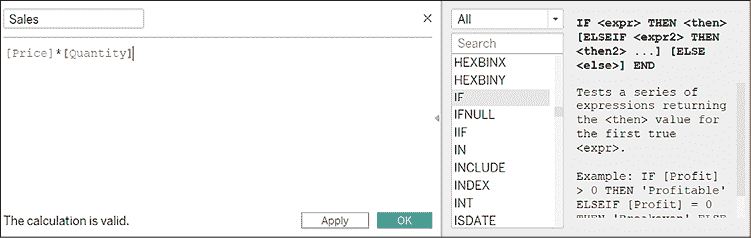

# 第九章：扩展你的工具箱

迅速掌握最新的数据分析工具和新颖技术无疑是一个永无止境的过程。在这个领域，你需要时刻准备好不断更新和扩展你的知识。到目前为止，本书已经涵盖了许多至关重要、与应用无关的数据技术，如数据清理与建模、机器学习、数据可视化和讲故事技巧。我们还学会了如何通过一个由 KNIME 和 Power BI 组成的坚实应用工具箱来应用这些技术。随着我们接近旅程的尽头，我们应该看看还有哪些工具可用，并且如何将所有应用整合在一起，充分发挥它们的最大潜力。

我们将特别讨论以下问题：

+   什么是 Tableau，我如何使用它进行可视化和讲故事？

+   什么是 Python，我如何开始使用它？

+   我如何通过集成 Python 或其他代码来提升我的工作流？

+   如何使用 KNIME 扩展包来增加功能？

+   什么是自动化机器学习，我应该对其未来的商业应用有何期待？

本章并不是为了让你成为 Python、Tableau 和其他工具的自主使用者。此阶段并不需要这样。你最初的工具箱（KNIME 和 Power BI）已经很好地满足了你的基本分析需求。本章的重点是向你展示*其他*可用的工具，并激发你对数据分析未来各种扩展方向的好奇心和兴奋感。

我们将首先介绍 Tableau，另一个数据可视化工具：通过一个简单的例子，我们将看到如何将我们在 Power BI 中学到的知识轻松应用到 Tableau 中。接下来，我们将学习 Python，并获得如何在分析中使用它的友好介绍。我们将看到如何通过扩展包将 Python 代码集成到 KNIME 中。最后，我们将了解自动化机器学习，并借助 H2O.ai 平台看到这一概念的实际应用。本章中的所有工具要么是开源的，要么提供免费试用选项，因此你有机会亲自尝试并评估它们如何帮助你和你的业务。

# 开始使用 Tableau

Tableau 作为斯坦福大学的衍生公司，已经在数据可视化领域开创了近二十年的先河，现在被认为是领先的商业智能平台之一。其直观的拖放式用户界面、与多种数据平台的集成以及高度可定制、高质量的图表类型，使得 Tableau 在商业专业人士、分析师和数据记者中非常受欢迎。

与 Power BI 类似，Tableau 有不同版本。本章我们将使用 **Tableau Public**：这是一款免费的桌面应用程序（您可以从 [public.tableau.com](http://public.tableau.com) 下载），它几乎包含了完整版（名为 **Desktop Professional**）中的所有功能，但也有一些重要的限制。首先，它依赖本地数据，因此您无法连接到远程数据源。此外，公共版本仅允许将结果保存在公共 Tableau 服务器上，该服务器对所有人开放：这意味着您无法将工作保存在计算机上。由于缺乏隐私保护，Tableau Public 不适用于日常业务需求，但我们仍然可以用它来探索 Tableau 的功能，并与 Power BI 进行对比。

您可以使用基于云的服务 **Tableau Server** 在线发布仪表板。您还可以仅通过浏览器设计仪表板，避免安装新软件。为此，您需要在上述 Tableau Public 网站注册，进入个人资料页面，点击 **Create a Viz**。网页版应用的用户界面与我们将在本章中使用的桌面应用非常相似。

延续本书始终贯穿的精神，让我们通过实践来探索 Tableau。 在这篇简短的教程中，我们将基于第*6 章*《Power BI 入门》中使用的销售数据库创建几种可视化：一个展示各类别相对权重的树状图和一个展示销售随时间变化的折线图。这次，三个表格（Transactions，ProductMD 和 CustomerMD）保存在一个单独的 Excel 文件 (`SalesDashboardTableau.xlsx`) 的不同工作表中：

1.  打开 Tableau Public。在第一个屏幕上（看起来类似于*图 9.1*），点击左侧的 **Microsoft Excel**，并打开包含我们数据的文件：

    图 9.1：Tableau Public 的初始屏幕：在左侧选择您想使用的文件类型

1.  在下一个窗口，名为 **Data Source** 屏幕（*图 9.2*）中，您将在左侧看到我们刚刚打开的 Excel 文件中的三个工作表。通过将它们拖到左上方的空白区域，您可以构建一个实体关系图，定义仪表板的基础数据模型：

    图 9.2：Tableau 中的数据源屏幕：拖放您的源表格并构建数据模型

    为了做到这一点，我们需要按照正确的顺序操作。首先，拖动**交易（Transactions）**表并等待几秒钟，直到数据加载并且预览出现在底部。然后，拖动客户主数据（**CustomerMD**）表并将其放置在**交易**框的右侧：两者之间的线表明 Tableau 将连接这两个表。当你释放鼠标按钮时，**编辑关系（Edit Relationship）**窗口将出现（*图 9.3*）：Tableau 成功识别出*客户 ID（Customer ID）*作为用于匹配行的列。我们可以通过关闭窗口来确认该关系，而不对默认设置进行任何更改。一旦完成此操作，就可以将产品主数据（**ProductMD**）表拖动到**交易**右侧，确保结果连接与*图 9.2*中的相似。最后，通过关闭弹出的窗口确认*StockCode*作为匹配列：你的数据模型准备就绪。

    

    图 9.3：编辑关系窗口：为你的连接选择一个或多个匹配条件

    为了继续，点击底部左侧的**工作表 1**标签：你将进入 Tableau 的主界面，称为**工作区（Workspace）**（*图 9.4*）。让我们来探索工作区中的四个基本部分：

    **数据面板（Data Panel）**是你找到所有数据列的地方，按表格进行组织。在这里，你可以拖动你希望在可视化中使用的量，或者创建计算字段。这类似于 Power BI 中的**字段（Fields）**部分。

    **可视化视图**是你可以构建可视化内容的地方。在这里，你可以将数据面板中可用的字段与可视化中的视觉属性连接，在 Tableau 中，这些视觉属性被称为**架子（Shelves）**。例如，条形图的高度、点的位置、它们的颜色、大小以及标签上显示的文本，都是通过**行（Rows）**、**列（Columns）**和**标记（Marks）**架子来控制的（它们的使用将在我们进行教程时变得更加清晰）。在同一视图中，你还可以实现分页功能，并将一个可视化拆分为多个页面，每个页面显示给定列的不同值（你需要将该列拖到**页面（Pages）**架子上）。此外，在可视化视图中，你可以决定使用哪些字段来限制要显示的数据（**筛选器（Filters）**架子）。

    **显示面板（Show Me Panel）**是你可以选择使用的图表类型的地方，比如折线图、树形图、直方图或地理图。

    底部的条形图让你添加**工作表标签**并在它们之间进行导航。在 Tableau 中，每个工作表可以是三种不同类型之一：工作表（一个单独的图表）、仪表板（多个图表的组合）或故事（一个受控的工作表或仪表板序列，旨在传达数据故事，如你在*第八章*《用数据讲故事》中学到的那样）：

    

    图 9.4：Tableau 中的工作区界面：将列拖放到可视化特性中，选择图表类型，并在可视化、仪表板和故事之间切换

    现在我们已经熟悉了工作区界面，可以构建我们的第一个图表，以展示每个类别和子类别在销售额方面的相对大小。然而，我们还没有包含每笔交易生成的收入的列，因此，我们需要首先添加一个计算字段来为我们进行数学计算。

1.  右键单击**数据面板**中的*价格*列，然后选择**创建** | **计算字段…**，如*图 9.5*所示：

    图 9.5：在 Tableau 中创建计算字段：我们可以添加数学公式并生成新的量来进行可视化

    系统会弹出一个对话框（*图 9.6*），让你输入新列的名称（在左上角的文本框中——在本例中我们使用`Sales`），以及要使用的数学表达式，其中字段通过方括号表示。点击窗口最右侧的小箭头。你将打开一个额外的面板，类似于我们在 KNIME 的**数学公式**节点中看到的那样，提供许多可用的逻辑和数学函数，并且右侧有文本描述。在我们的案例中，表达式`[Price]*[Quantity]`就可以：将其写入左侧的框中（Tableau 会在你输入列名时帮助自动补全），然后点击**确定**继续。新的计算字段将出现在**数据面板**中，之后可以根据需要使用：

    

    图 9.6：定义计算字段：根据需要添加合并列的数学表达式

1.  我们现在拥有了制作第一个可视化所需的所有元素：在*第七章*中学习了如何抵制使用饼图的甜蜜诱惑后，我们希望构建一个漂亮的树形图，展示按类别和子类别的销售相对大小。 在 Tableau 中构建可视化需要将感兴趣的数据字段（左侧数据面板中列出的列）拖放到一些可视化属性（在可视化视图中显示的货架）。对于树形图，你可以按照*图 9.7*中的箭头作为指南。首先将*类别*（第一个）和*子类别*（第二个）拖到名为**文本**的框中（稍后在确定图表类型时，它会自动重命名为**标签**）。然后，将新创建的*销售额*字段拖到**大小**框中。最后，将*类别*字段也拖到**颜色**框中，以控制区域的颜色：

    图 9.7：在 Tableau 中构建树形图：将左侧的字段拖放到标记架右侧的框中

    在 Tableau 中构建可视化图表后，你可以轻松地探索不同版本，其中将不同的图表类型应用于相同的数据。要尝试这个操作，请点击右侧**Show Me**面板中的各种框。那些由于当前数据无法渲染的图表类型会被灰显，且无法选择。Tableau 还可能推荐一种特定的图表类型，并用橙色突出其边框。我建议你在选择图表类型时始终牢记商业问题的背景，正如你在*第七章*中学到的那样，*有效地可视化数据*。

    做得好！只需四次拖放，你就已在 Tableau 中构建了第一个可视化图表。我们可以轻松地看到“家居”*类别*（以及其中的“厨房”*子类别*）为我们的业务创造了最大的一块收入。

    接下来是第二个商业问题：这次，我们希望将信息重点放在按*类别*划分的*销售额*趋势上。我们决定创建一个折线图，因为它是我们用来传达与数量随时间变化相关的见解的自然图表类型。

1.  要创建一个新的可视化图表，点击底部**Sheet 1**标签右侧的第一个小**+**图标（或者，你可以点击顶部菜单中的**工作表 | 新建工作表**，或者直接按*CTRL* + *M*）。这样会出现一个空白的**Sheet 2**：这是我们绘制折线图的空间。

1.  第一个拖动的字段是*发票时间*：将其拖到**列**架上。考虑到其类型（包含每个交易的日期和时间），我们需要告诉 Tableau 我们希望按哪个粒度级别（年、季度、月、周等）进行聚合。在此情况下，我们希望可视化每个月交易的一个数据点：右键单击该字段在架上的显示方式，然后在弹出菜单中选择第二个**月**项（参考*图 9.8*作为指导）：

    图 9.8：使用日期字段进行折线图：右键单击该字段并选择所需的时间粒度。在本例中，我们选择按月份进行聚合。

1.  接下来，让我们实现我们想要使用的其他字段，按照*图 9.9*中的拖放操作进行。将*销售额*拖到**行**架上（默认情况下会应用求和聚合，但你可以通过右键单击该字段并在**度量**子菜单中选择适当的函数轻松更改）。下一个要移动的字段是*类别*。将其拖放两次：首先拖到**颜色**框（这样我们就可以按*类别*区分线条），然后拖到**标签**框（这样我们就可以为每条线显示直接标签）：

    图 9.9：在 Tableau 中构建折线图：列和行架分别控制 x 轴和 y 轴

1.  在编排仪表板之前，我们可以通过右键点击每个标签并选择**Rename**来编辑底部的工作表名称。我们可以为第一个和第二个可视化选择更有意义的名称，比如`Business by category`和`Sales trend`。

1.  现在是通过组合这两个可视化来构建仪表板的时机。点击底部**Sheets**选项卡中的第二个**+**图标，或者从顶部菜单中选择**Dashboard | New Dashboard**。

1.  在新仪表板视图的左侧，您会找到我们构建的两个工作表列表，每个工作表对应一个我们创建的图表。要创建仪表板，只需将工作表拖放到右侧的空白区域，就像在*图 9.10*中看到的那样：

    图 9.10：在 Tableau 中构建仪表板：将可视化拖放到它们的位置

    在仪表板视图的左下方，你会找到几个图标，可以将它们拖放到仪表板中，添加额外的对象，比如文本标签、图片、网页或扩展程序。试试看吧。

1.  在发布仪表板之前，让我们配置各可视化之间的交互。如果你点击第一个可视化的任何空白区域，它将被选中，且其边框会高亮（让你可以调整形状，如果需要的话）。同时，几个图标会出现在选中可视化的右上角，正如在*图 9.11*中看到的那样。如果你点击过滤器图标，正如图中的箭头所示，你将把该可视化设置为仪表板中所有其他可视化的过滤器。你可以快速测试这个功能是否正常工作：如果你点击矩形树图中的任何子类别（你可以按住*CTRL*键一次选择多个子类别），你会注意到折线图会相应更新，只显示所选部分的趋势。这正是我们所期待的：

    图 9.11：在 Tableau 仪表板中使用可视化过滤后续图表。点击右上角的过滤器图标

1.  现在我们可以将工作发布到服务器：只需打开顶部的**File**菜单，然后点击**Save to Tableau Public...**。接下来，选择一个名称（我选择了`Ecom Sales Dashboard`），点击**OK**，并等待几秒钟，直到数据上传完成。浏览器将自动打开并显示发布的仪表板，尽显优雅（你可以在 [tiny.cc/ecomdashboard](http://tiny.cc/ecomdashboard) 查看我的版本，并在*图 9.12*中看到）：

图 9.12：发布在 Tableau Public 服务器上的仪表板：让其他人访问并与之互动

在过去几页中，我们快速浏览了 Tableau 的基本功能：我们学习了如何加载数据，如何在一个简单的数据模型中组合数据，创建计算字段，构建可视化并将它们结合在一个交互式仪表板中。我相信你已经注意到 Tableau 与我们在 Power BI 上所学内容之间的相似性。我们本可以继续探索其他商业智能平台，如 Qlik、MicroStrategy 和 TIBCO Spotfire，仅举几例。令人（兴奋的）现实是，它们的工作原理大致相同，最后几章已经为你提供了开始并为你的业务创造价值所需的一切，无论你使用哪个工具。

现在，让我们进入数据分析工具箱的下一个“扩展”阶段，继续使用 Python。

# 用于数据分析的 Python

Python 是一种日益流行的高级编程语言，特别适用于数据分析和机器学习应用。丰富的数据分析相关库的可用性以及易学的语法，使其成为许多数据科学从业者的首选。

Python 名字背后的故事与蛇无关。它的创造者，荷兰程序员 Guido van Rossum，是 1970 年代 BBC 喜剧系列《Monty Python's Flying Circus》的忠实粉丝。所以他为这个项目选择了 Python 这个名字，以此向那个节目中英国喜剧团体的不拘一格的天才致敬。

由于本书侧重于可视化编程，我们不会深入讲解编程原理。相反，本节的目的是让你看到 Python 在熟悉的问题上的实际应用，并了解它如何在我们的日常工作中使用。我们将首先通过一个脚本，重复我们在*第五章*，*在工作中应用机器学习*中看到的回归教程。然后，我们将看到 Python 如何与 KNIME 平滑集成，以充分发挥两种互补的分析编程方法的优势。

## Python 语言的温和介绍

要使用 Python，你可以安装像 Anaconda 这样的开发平台（我们稍后会做这个），或者利用基于网页的界面，如 Colab。Google Colab（Colaboratory 的简称）是一个免费的云服务，允许你编写并运行 Python 代码，而无需任何设置：你可以通过 [colab.research.google.com](http://colab.research.google.com) 访问它。

正如你在*图 9.13*中看到的，Colab 的用户界面是一个交互式网页，你可以在其中添加文本和代码，然后逐行运行：


图 9.13：Google Colab 欢迎界面：无需安装任何软件即可开始使用 Python

为了简化与 KNIME 的比较，让我们使用 Colab 来处理我们在*第五章*《在工作中应用机器学习》中遇到的同一个罗马住房商业案例。作为提醒，目标是通过将线性回归学习算法应用于历史租赁协议数据库来预测租金价格。你可以通过连接到 [tiny.cc/romecolab](https://colab.research.google.com/github/laibniz/AnalyticsMadeEasy/blob/main/Rome_housing.ipynb) 来一步步跟随完整的 Colab 脚本。

让我们逐步分析代码，并理解每一部分的作用：

```py
import pandas as pd
import numpy as np
import statsmodels.formula.api as smf
from sklearn.model_selection import train_test_split
from sklearn.metrics import r2_score, mean_squared_error 
```

第一步是将一些有用的库导入到 Python 环境中。这将使得我们能够利用一些额外的功能（例如加载 Excel 文件和计算线性回归）。特别是在前面的代码中，我们使用了几条`import`语句来引入一些最流行的 Python 库，这些库广泛用于数据分析，具体包括：**Pandas** 用于数据处理，**NumPy** 用于数值运算和数组计算，**Statsmodels** 用于硬核统计分析，**Scikit-learn**（代码中为`sklearn`）用于机器学习：

```py
full_data = pd.read_excel("RomeHousing-History.xlsx") 
full_data.head() 
```

接下来的步骤，我们通过使用`pd.read_excel()`函数读取存储在 Excel 文件中的数据，并将其内容分配给`full_data`变量。然后，我们可以通过可视化数据的前五行来检查导入的数据，使用`head()`函数，输出如*图 9.14*所示：


图 9.14：head() 函数在 Colab 中显示的输出：我们数据集的前五行，是一个非常有用的预览

我们得到的数据正是我们在*第五章*《在工作中应用机器学习》教程开始时遇到的数据（见*图 5.2*中的前几行）。我们可以继续进行每个监督式机器学习过程的第一步，即数据划分：

```py
train_set, test_set = train_test_split(full_data,test_size=0.3) 
```

在`train_test_split()`函数的帮助下，我们对完整数据集进行了随机抽样，并获得了训练集和测试集（我们将其设为总数据的 30%），这些数据分别存储在`train_set`和`test_set`变量中。这行 Python 代码实现了 KNIME 中 **Partitioning** 节点为我们做的操作。现在，我们已经拥有了使用训练集来训练模型所需的一切：

```py
model = smf.ols(formula='Rent ~ Rooms + Surface + \
                         Elevator + Floor_number + \
                         C(Neighborhood) + C(Property_type) + \
                         C(Floor_type)',data=train_set).fit()
print(model.summary()) 
```

利用 `smf.ols()` 函数，这段代码训练了一个普通最小二乘回归模型（OLS，正如我们在 *第五章*，*在工作中应用机器学习* 中遇到的那样），使用 `train_set` 变量作为输入。输出模型存储在一个名为 `model` 的对象中。在训练模型时，我们可以编辑代码中看到的公式字符串（`Rent ~ Rooms + Surface + ...`），以选择哪个列作为目标变量（在我们的案例中是 `Rent`，出现在 `~` 符号之前）以及其他哪些列应作为预测变量（它们出现在 `~` 符号后，并由 `+` 符号分隔）。类别列需要被 `C()` 函数封装（如 `C(Neighborhood)`）：通过这样做，Python 会将它们转换为多个数值列（虚拟变量），这些列与线性回归模型兼容。线性回归公式的定义和名义变量的转换是由 KNIME 中的 **线性回归学习器** 节点在“幕后”完成的，而在 Python 中，它们需要在代码中明确指定。最后，`summary()` 函数总结了回归结果，包括每个特征的系数和 p 值。如果将 Python 中获得的输出（*图 9.15*）与 KNIME 中 **线性回归学习器** 节点的输出（*图 5.9*）进行比较，你会发现数字有所不同（当然，随机抽样总会产生略微不同的结果），但它们是一致的。例如，我们注意到，Piazza Navona 是一个高档社区（因为它的系数，在 `coef` 列中显示，高于所有其他地区），而电梯的存在可以忽略不计（高 p 值，如你在 `P>|t|` 列中看到的）：

![表格描述自动生成图 9.15：Colab 中 OLS 回归的总结输出：由于随机分割，每个特定的模型都是唯一的，因此你会得到不同的数字现在我们可以进行机器学习过程的最后一步：在测试集上进行预测并对结果进行评分：```pypredictions = model.predict(test_set) print('R2 score is',r2_score(test_set.Rent,predictions)) print('Root Mean Squared Error is', \       np.sqrt(mean_squared_error(test_set.Rent,predictions))) ```与我们在 KNIME 中使用 **回归预测器** 节点的操作类似，我们需要将回归模型应用于 `test_set` 并获取一些 `predictions`：正如代码的第一行所示，我们使用 `predict()` 函数来完成这一操作。随后，我们需要通过将测试集中的真实租金值（`test_set.Rent`）与我们的预测结果进行比较，计算两个评分指标，以评估回归的效果，这与我们在 **数值评分器** 节点的 KNIME 教程中所做的类似。具体来说，我们计算评估回归准确性的两个主要汇总指标，这些指标我们在 *第四章*，*什么是机器学习？* 中介绍过：+   **决定系数**，R²，使用 `r2_score()` 函数，该函数以两个列作为参数进行比较。+   **均方根误差**（**RMSE**）为我们提供了一个关于预测误差水平的概念。为了计算这一指标，我们需要结合使用`mean_squared_error()`函数来获取残差的平方平均值，以及`np.sqrt()`来获得其平方根。当我们运行这段代码的最后部分时，我们得到的输出确认我们已经构建了一个相当稳健的模型，因为 R²接近 0.91，而 RMSE 约为€118（当然，你会得到略有不同的值）：```pyR2 score is 0.9144775136955545Root Mean Squared Error is 117.92107041510327 ```新工具，同样的故事：通过编写大约十行 Python 代码，我们复现了在 KNIME 中所做的大部分工作。看看*图 9.16*：灰色的框包含了关键的 Python 函数，它们完成了与我们之前在 KNIME 中遇到的节点相同的任务：

图 9.16：对比视图，展示了 Python 的关键函数与进行线性回归所需的相应 KNIME 节点：基本步骤完全相同

本练习澄清了可视化编程（你在 KNIME 中可以做的事情）与传统编程（你可以使用 Python 或任何其他语言来编写代码）之间的区别。每种方法都有其优缺点，个人偏好选择其中任何一种都是很自然的事情。好消息是……你不必在这两种选择之间做出最终决定。实际上，可视化编程和编码可以结合使用，这样就能为你的数据分析魔法创造出强大的效果。在接下来的几页中，你将学习如何将 Python 代码片段嵌入到 KNIME 工作流中。这是一个非常有价值的技巧，因为它能让你最大程度地利用 KNIME 的易用性与 Python 的广泛功能的结合。即使你此时不打算将 KNIME 与 Python 集成，我也建议你还是浏览接下来的几页。它们将让你有机会了解两个你应该知道的重要功能：KNIME 扩展和 KNIME Hub。

## Python 与 KNIME 的集成

首先，你需要确保你的计算机上已经安装并运行了本地版本的 Python。获取它最简单的方法是安装**Anaconda 个人版**，这是一个非常流行的 Python 数据分析分发平台。下载并安装最新版本的软件，免费提供，下载地址为[anaconda.com/download](http://anaconda.com/download)。Anaconda 内置了多个用于 Python 和 R 编程的应用程序。例如，**Jupyter Notebook**，它让你可以通过 Web 浏览器创建 Python 脚本——就像我们在 Colab 中做的一样，但没有任何限制。在**Anaconda Navigator**的欢迎页面中（*图 9.17*），你可以启动 Jupyter Notebook 或安装其他应用程序，如 RStudio，用于 R 开发：


图 9.17：Anaconda Navigator 的欢迎屏幕：从这里，你可以启动 Jupyter 笔记本进行 Python 编程，或者安装额外的免费包。

如*第二章*《*KNIME 入门*》所述，你可以通过安装额外的扩展来扩展 KNIME 的功能。为了在我们的工作流中嵌入 Python，我们需要安装**KNIME Python 集成**扩展。操作步骤是：打开 KNIME，点击顶部栏的**文件** | **安装 KNIME 扩展...**，然后在顶部的文本框中输入`python`进行搜索 (*图 9.18*)。勾选**KNIME Python 集成**选项，点击**下一步**，然后按照安装过程进行操作：


图 9.18：在 KNIME 中安装扩展的对话框。看看可用的包列表：你可以轻松地通过成千上万个新的 KNIME 节点扩展你的分析工具包。

完成后，系统会提示你重启 KNIME 以应用软件更新。重启后，去节点库并打开**脚本 > Python**文件夹。正如你在*图 9.19*中看到的，通过安装该扩展，你将获得几个可以在工作流中使用的新节点：


图 9.19：安装 KNIME Python 集成扩展后的节点库：几个新节点已经显示出来

在此之前，让我们完成设置 KNIME 与 Anaconda 自带的 Python 环境连接所需的最后一步。操作是：在 KNIME 中点击**文件 | 首选项**，然后在左侧出现的菜单中，选择**KNIME > Python**，或者使用左侧的文本框搜索 Python 首选项窗口，正如你在*图 9.20*中看到的那样。你应该能看到预先填充的 Anaconda 安装目录路径（如果没有，你需要通过点击**浏览...**按钮来设置）。设置完成后，点击**Python 3 (默认)**部分中的第二个**新建环境...**按钮，正如下图所示：这将创建一个新的 Python 环境，包含所有与 KNIME 集成所需的包：


图 9.20：KNIME 首选项中的 Python 窗口：你需要告诉 KNIME 本地 Python 环境的位置

在下一个窗口中 (*图 9.21*)，点击**创建新环境**，并耐心等待环境生成。完成后，你就完成了所有设置，准备好将你所需的 Python 功能集成到 KNIME 工作流中了：


图 9.21：新环境对话框：在 KNIME 中启动 Python 的最后一步

如果你希望在 KNIME 工作流中使用 R 而不是 Python，你需要安装**KNIME 互动式 R 统计集成**，并通过首选项菜单设置 R 环境，类似于我们为 Python 所做的设置。KNIME 还允许你对表格的每一行运行一些 Java 代码：查看**Java 片段**节点了解更多信息。

在你通过安装 Python 扩展获得的新节点中（*图 9.19*），**Python 脚本**无疑是最通用的：该节点允许你嵌入一系列 Python 代码，应用于存储在输入表格中的数据（通常称为 `input_table_1`），以生成一个或多个输出表格（称为 `output_table_1`）。你可以在脚本中引用这些表格，并像使用 Python 中的任何数据框一样自由使用它们。例如，如果你想对两列（*数量* 和 *价格*）进行简单的乘法运算，并输出一个附加列（*销售额*）作为结果，使用此节点的 Python 脚本将如下所示：

```py
output_table_1 = input_table_1
output_table_1['Sales'] = output_table_1['Quantity'] * output_table_1['Price'] 
```

第一行代码只是将输入表复制到输出表中，保持不变。第二行代码应用了对两个列的乘法——就这么简单。我们本可以导入任何库（前提是它们已安装在 Anaconda 的 Python 环境中），并利用它执行我们需要的任何操作。

让我们来看一个简单的工作流，展示在我们的分析工作流中集成 Python 的强大功能。我们无需从头开始构建这个工作流，而是可以在**KNIME Hub**中找到已经存在的版本，KNIME Hub 是一个在线工作流、扩展、组件和节点的资源库。如*图 9.22*所示，打开**KNIME Hub**面板（你会在右上角的**节点描述**标签旁找到它），然后在搜索框中输入 `Python Gaussian Fit`。在众多选项中，你应该能找到一个包含我的名字和照片的工作流：这就是我为你准备的工作流。要将其导入到你的 KNIME 安装中，你只需将框（如图所示）拖动并放到你的工作流编辑器中。另一种方法是导入**KNIME 工作流**（**文件** | **导入 KNIME 工作流...**），你可以在 GitHub 仓库中找到它：


图 9.22：KNIME Hub 面板：搜索你需要的工作流、节点或组件，并将它们拖放到你的工作区

如果你打开**Python View**节点的配置对话框，你将看到如*图 9.23*所示的代码窗口。中间的文本框是你可以编写 Python 代码的地方。在左侧，你会看到输入表中可用的列列表：通过双击它们，相关的 Python 数据框将被添加到代码中。你还可以通过点击**执行脚本**或**执行选定行**按钮来测试你的代码，检查其是否正常运行。如果在执行脚本时遇到任何警告或错误，它们会方便地显示在窗口底部的控制台框中：

![图形用户界面，文本，应用程序

自动生成的描述

图 9.23：Python View 节点的配置窗口：使用 Python 图形库生成任何你喜欢的图表

在这个特定案例中，我们利用**Python View**节点将高斯函数（著名的钟形曲线）拟合到罗马租金价格的分布，并返回带有拟合曲线的直方图。在此阶段无需详细了解代码，但你会注意到，代码中通过`input_table['Rent']`引用了*Rent*列，而生成的图表被保存在名为`output_image`的变量中：你可以在*图 9.24*中看到最终结果：


图 9.24：Python View 节点的输出：罗马的租金价格约为 €1,000

这为你展示了 Python 节点是如何工作的：输入端口的数据被转换为输入变量，在脚本的末尾，分配给输出变量的内容会被返回到节点的输出端口。在你从 KNIME Hub 下载的相同工作流中，你还会看到一个**Python Script**节点的示例：本质上，两个节点都在输入数据上运行 Python 代码，但**Python View**节点“专门”用于输出图像。

在工作流中交织代码具有巨大的潜力。如果你想应用一些复杂的逻辑或重用在 KNIME 之外开发的专用代码来解决你的特定业务需求，你现在可以将这些代码无缝集成进来，极大地扩展你的工具箱功能。

在看到 Python 实际操作后，让我们回到无代码分析的世界，了解高级分析的一个有前景的方向：自动化机器学习。

# 自动化机器学习

“暴力模式发现”：这可以简洁（且生动）地概括**自动化机器学习**，简称**AutoML**，的核心内容。正如你在*第四章*和*第五章*中看到的，构建一个机器学习模型远不是一个线性、单次尝试的过程。获得高性能监督学习模型的常规过程是经历一系列的“反复”尝试：每次我们都会对模型或其特征进行一些“调优”，并检查预测性能是否有所提升。我们已经看到过一些这些机制的实际应用：

+   **超参数优化**：这是对学习算法的操作方式进行调整，比如我们在决策树中启用了剪枝，或改变了多项式回归的次数。在更复杂的模型（如深度神经网络）中，改变参数（例如网络中的神经元数量）可能会显著影响性能。

+   **特征选择**：通过选择特征的子集（并去除冗余特征），使模型学习集中在最重要的部分，从而提升其预测能力。我们在决定从回归模型中移除一些高 p 值特征时就做了这一操作。此外，减少模型运行所需的特征意味着节省时间和计算资源。

+   **特征工程**：通过组合或转换原始特征来生成新的特征，使其对模型更具信息量。例如，这就是我们在回归中创建虚拟变量时所做的。

+   **集成学习**：我们曾提到， 有时可以将不同的算法组合在一个学习过程中。想象一下，预测租金时，使用五个不同的回归模型，然后将这五个中间预测值的平均值作为整体预测：通过将替代模型组合在一起，你可能获得一个更强健的模型。

与其手动逐一检查每个调整步骤的效果，不如构建一个程序，利用所有可用的计算能力来找到通向最佳模型的路径。这正是 AutoML 方法所承诺的目标：自动化识别最大化整体性能（并且——希望——能够带来业务影响）的参数、特征和模型组合的“试错”过程。

AutoML 目前是商业应用 AI 中的热门话题，市面上已有越来越多的产品和开源库，支持将 AutoML 应用于实际任务，包括 H2O.ai、DataRobot、auto-sklearn、Google Cloud AutoML、IBM AutoAI、Amazon AutoGluon 和 Azure AutomatedML。随着我们不断扩展分析工具箱，让我们看看其中一款产品的实际应用：这将给你一个关于目前已有的产品及未来几年内我们公司可能推出的产品的了解。

我们将探索 **H2O Driverless AI**，一个基于云的服务，允许你使用网页界面上传数据，运行 AutoML 进行预测，并解释结果。如果你想亲自测试，可以访问 [h2o.ai/products/h2o-driverless-ai](http://h2o.ai/products/h2o-driverless-ai)，注册一个免费帐户，并创建一个 Driverless AI 实例。

## AutoML 实践：一个 H2O.ai 的示例

在这个示例中，我们将再次使用罗马住房的业务案例：这次，我们将上传 Excel 数据集并创建一个新的实验。*图 9.25* 显示了界面的样子：你可以选择 **目标列**（在我们的案例中是 *租金*），为 **评分器** 选择一个指标（在图中，你可以看到我们选择了 RMSE），然后调节底部的三个旋钮，设置期望的预测 **准确性**、训练模型所需的 **时间** 和 **可解释性** 水平。这部分非常有趣：当你操作旋钮时，系统会更新其“试错”策略（你可以在左侧看到一个动态摘要），并在 AutoML 搜索过程中执行。如果你选择高准确性和低可解释性，你最终将得到高性能的黑箱模型，而如果将可解释性设置为较高水平，你将得到特征较少、便于解释的简单模型，以便向你的业务伙伴解释它是如何工作的：


图 9.25：H2O Driverless AI 中的实验设置页面：通过调节旋钮，确定你希望生成的模型如何被“烹饪”

点击 **启动实验** 后，远程计算资源将为你完成繁重的工作，而你可以去拿点喝的。下图显示了随着越来越多的模型被迭代尝试，得分指标的实时演变，完成后将显示最佳结果（*图 9.26*）：


图 9.26：AutoML 例程的结果：在左下角，你可以看到随着搜索迭代的进行，评分指标是如何变化的

作为 AutoML 过程的一部分，我们还获得了一些有用的视图，帮助我们理解模型的工作原理。请看看为我们的租金预测生成的解释仪表盘（*图 9.27*）：

+   在右上角，我们看到一个条形图显示 **特征重要性**：毫不奇怪，*邻里*是预测租金时最有用的单一列，紧随其后的是物业的 *面积*。

+   在左下角，我们有一个基于树的 **替代模型**：这是 AutoML 例程生成的实际预测模型的“简约”版本。通过查看这个树的前三个层次，我们可以得到一个高层次、易于解释的视图，展示了将最重要特征与租金联系起来的模式。

+   在右下角，我们可以看到**部分依赖**图：它展示了特定特征（在*图 9.27*中为*Surface*）对预测结果（*Rent*）的边际影响。此图为我们提供了一个额外的解释关键，揭示了“租金”如何随着“面积”的增加而上升：

图 9.27：模型解释仪表板：获取有关预测模型如何工作的提示

通过这个例子，我们充分欣赏了 AutoML 方法的所有潜力。只需几次点击，我们便获得了一个强大的预测模型（可以导出并部署以供进一步使用），以及一个简单的框架来解释其结果。需要进一步考虑的是：尽管它看起来像是机器学习的“圣杯”，但在商业环境中使用 AutoML 仍然需要用户始终“知道自己在做什么”。这意味着，构建机器学习专业知识，并且总体上提高数据分析能力（就像在本书中所做的那样），对于充分利用这项技术至关重要，尽管它看起来已变得自动化且易于使用。

AutoML 可以成为我们数据分析工具包中的另一个宝贵工具。好消息是，你会发现这个方法在 KNIME 中也得到了很好的实现，因此你可以将其与本书中所学的其他内容连接起来。如果你打开名为 H2O AutoML for Regression 的示例工作流（你可以在 **KNIME Explorer** 中的示例服务器或在 **KNIME Hub** 中搜索到它），你将被要求安装一个新的扩展：**KNIME H2O 机器学习集成**。通过安装这个扩展，你可以在 KNIME 中使用我们在 H2O Driverless AI 中看到的许多 AutoML 功能。看一下前面提到的示例工作流（*图 9.28*）：通过使用一些 H2O 节点—按照常见的监督学习结构（包括划分、学习者、预测器和评分器）组织—你可以直接在 KNIME 中获得 AutoML 的全部功能：


图 9.28：H2O AutoML 回归 KNIME 工作流：使用 AutoML 为你找到最佳模型

# 总结

我希望这最后一章能让你对进一步扩展数据分析工具箱的各种方向感到兴奋。我们在 Tableau 中迈出了第一步，意识到它在基本功能上与 Power BI 是如此相似。我们还通过对 Python 的友好介绍，了解了这一在数据科学中无处不在的编程语言。当我们将 Python 集成到 KNIME 中时，我们看到了如何从可视化和编码编程两个世界中获取最佳成果。与此同时，我们借此机会学习了如何通过利用 KNIME 庞大的扩展库以及公共的 KNIME Hub 环境来进一步扩展 KNIME。最后，我们对 AutoML 的迷人领域进行了简短的探索，了解了它简化构建高性能机器学习模型过程的强大能力。

在这一章中，我们通过探索新的工具和方法，扩展了我们的工具箱，以便在日常工作中更好地进行数据分析。我的建议是把这变成一个习惯。我在许多数据从业者中看到的一个局限性是，他们认为自己熟悉的少数工具 *永远* 是最适合他们的，从而陷入了自给自足的局限性偏见。所以，别对我们刚刚建立的工具箱感到满足——要做好持续探索的准备：保持好奇心，因为数据分析的不断扩展世界将提供许多精彩的东西！
