# 一、数据可视化和数据探索的重要性

## 学习目标

本章结束时，您将能够:

*   解释为什么数据可视化很重要
*   计算基本统计值，如中值、平均值和方差
*   使用 NumPy 进行数据争论
*   用熊猫来争论数据

在这一章中，你还将了解 NumPy 和熊猫的基本操作。

## 简介

与机器不同，人们通常不具备从给定数据中的一组随机数字和信息中解读大量信息的能力。虽然他们可能知道数据的基本组成，但他们可能需要帮助才能完全理解它。在我们所有的逻辑能力中，我们通过视觉信息的处理最能理解事物。当数据被可视化表示时，理解复杂构建和数字的概率会增加。

Python 最近作为一种编程语言出现，在数据分析方面表现良好。Python 有跨数据科学管道的应用，可以将数据转换成可用的格式，对其进行分析，并从数据中提取有用的结论来很好地表示它。它提供了数据可视化库，可以帮助您快速组装图形表示。

在本书中，您将学习如何将 Python 与各种库结合使用，例如 **NumPy** 、**熊猫**、 **Matplotlib** 、 **seaborn** 和**geo lotlib**，以使用真实世界的数据创建有影响力的数据可视化。除此之外，你还将了解不同类型图表的特点，并比较它们的优缺点。这将帮助您选择适合可视化数据的图表类型。

一旦我们理解了基础知识，我们就可以涵盖更高级的概念，例如交互式可视化以及如何使用 **Bokeh** 来创建讲述故事的动画可视化。完成本书后，您将能够执行**数据辩论**，提取重要信息，并以描述的方式可视化您的见解。

### 数据可视化简介

电脑和智能手机以数字格式存储姓名和数字等数据。**数据表示**是指可以存储、处理和传输数据的形式。

陈述可以讲述一个故事，并向你的观众传达重要的发现。如果不适当地对你的信息进行建模，用它来做出有意义的发现，它的价值就会降低。创建表示有助于实现更清晰、更简洁、更直接的信息视角，使任何人都更容易理解数据。

信息并不真正等同于数据。表示是发现隐藏在数据中的见解的有用工具。因此，表示将信息转换成有用的数据。

### 数据可视化的重要性

与任何其他形式的数据相比，可视化数据非常容易理解。通过使用可视化，我们可以更好地了解数据包含的内容，而不仅仅是查看 Excel 电子表格列中的数据。例如，很容易从下图给出的数字数据中看到一种模式:

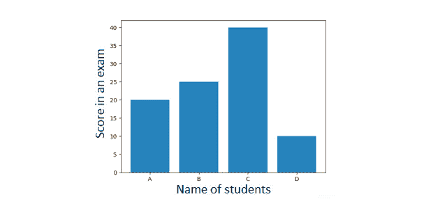

###### 图 1.1:数据可视化的一个简单例子

可视化数据有许多优点，例如:

*   复杂的数据很容易理解
*   可以创建异常值、目标受众和未来市场的简单可视化表示
*   讲故事可以用仪表盘和动画来完成
*   可以通过交互式可视化来探索数据

### 数据角力

为了从可视化数据中得出结论，我们需要处理我们的数据，并将其转换为最佳的表示形式。这就是**数据角力**的用武之地。它是以一种允许机器学习算法显示和理解数据的方式来扩充、转换和丰富数据的学科。

查看下面的数据争论流程图，了解如何获得准确且可操作的数据，供业务分析师处理。如您所见，员工敬业度数据最初是原始形式。它将作为数据帧导入，稍后将被清理。然后，清理后的数据被转换成相应的图形，从中可以对见解进行建模。基于这些见解，我们可以交流最终结果。例如，可以根据从反馈调查、员工任期、离职面谈、一对一会议等收集的原始数据来衡量员工敬业度。这些数据经过清理，并根据推荐、对领导的信任和晋升范围等参数制成图表。百分比，即从图表中产生的见解，有助于我们得出结果，从而确定员工敬业度的衡量标准:

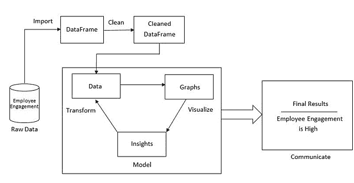

###### 图 1.2:衡量员工敬业度的数据争论过程

### 可视化工具和库

有几种方法可以创建数据可视化。根据您的背景，您可能希望使用非编码工具，如 **Tableau** ，它使您能够对数据有一个良好的感觉。除了将在本书中使用的 Python 之外， **MATLAB** 和 **R** 在数据分析中被大量使用。

然而，Python 是业内最流行的语言。它的易用性和您可以操作和可视化数据的速度，加上大量库的可用性，使 Python 成为最佳选择。

#### 注意

MATLAB([https://www.mathworks.com/products/matlab.html](https://www.mathworks.com/products/matlab.html))、R([https://www.r-project.org](https://www.r-project.org))和 Tableau([https://www.tableau.com](https://www.tableau.com))都不是本书的一部分，所以我们只涵盖重点介绍的 Python 工具和库。

## 统计概述

**统计学**是数值数据的分析、收集、解释和表示的组合。**概率**是对事件发生可能性的度量，量化为 0 到 1 之间的数字。

一个**概率分布**是一个为每个可能事件提供概率的函数。概率分布经常用于统计分析。概率越高，事件发生的可能性越大。概率分布有两种类型，即离散概率分布和连续概率分布。

一个**离散概率分布**显示了一个随机变量可以取的所有值，以及它们的概率。下图说明了离散概率分布的一个示例。如果我们有一个 6 面骰子，我们可以在 1 和 6 之间滚动每个数字。根据滚动的数量，我们有六个事件可以发生。滚动任何数字的概率相等，六个事件中任何一个发生的概率为 1/6:

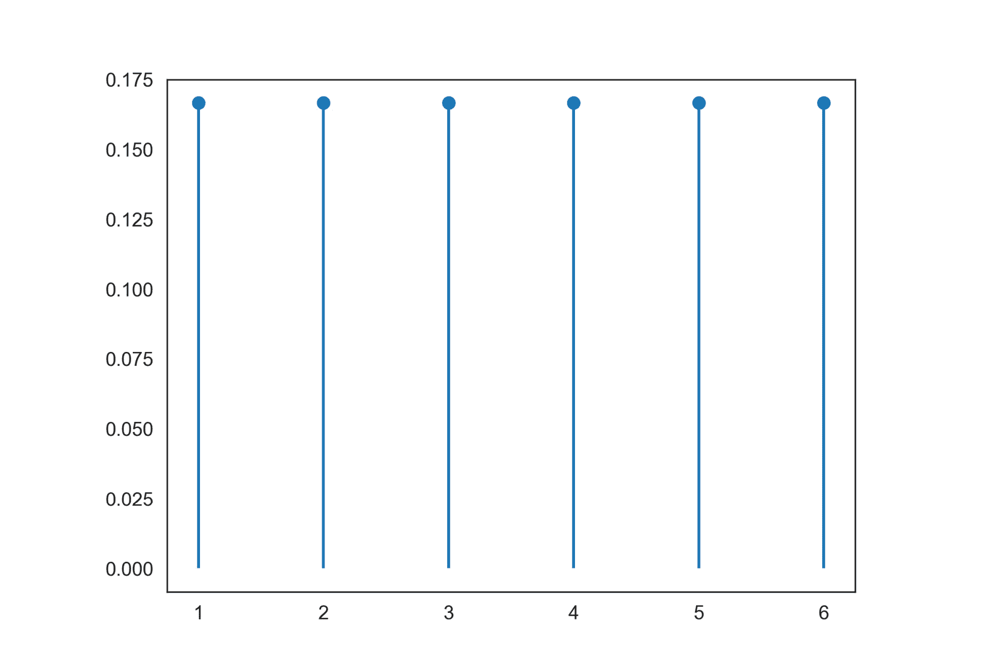

###### 图 1.3:模具辊的离散概率分布

A **连续概率分布**定义了连续随机变量每个可能值的概率。下图说明了连续概率分布的示例。这个例子说明了开车回家所需时间的分布。在大多数情况下，大约需要 60 分钟，但有时需要更少的时间，因为没有交通，有时需要更多的时间，如果有交通堵塞:

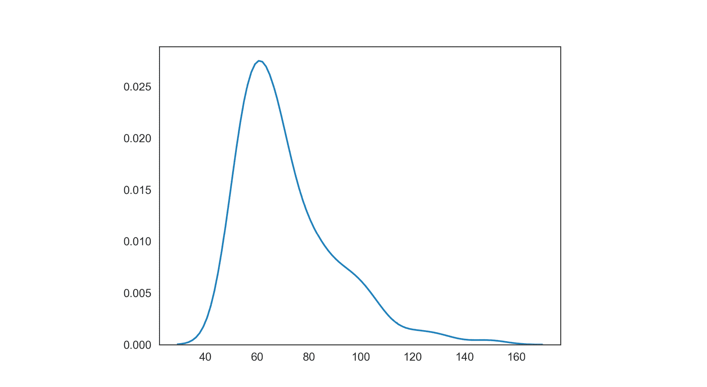

###### 图 1.4:到家时间的连续概率分布

### 中央趋势的度量

中心趋势的度量通常被称为**平均值**，描述概率分布的中心值或典型值。我们将在本章中讨论三种平均值:

*   **Mean**: The arithmetic average that is computed by summing up all measurements and dividing the sum by the number of observations. The mean is calculated as follows:

    

*   **中值**:这是有序数据集的中间值。如果有偶数个观察值，中间值将是两个中间值的平均值。与平均值相比，中位数不太容易出现异常值，因为异常值是数据中的独特值。
*   **模式**:我们对中枢倾向的最后一个衡量，模式定义为最频繁值。在多个值同样频繁的情况下，可能有多个模式。

**示例:**

一个骰子滚动了十次，我们得到了以下数字:4、5、4、3、4、2、1、1、2 和 1。

平均值的计算方法是将所有事件相加，然后除以观察次数:(4+5+4+3+4+2+1+1+2+1)/10=2.7。

为了计算中间值，必须根据模辊的值对其进行排序。有序值如下:1，1，1，2，2，3，4，4，4，5。因为我们有偶数个模辊，我们需要取两个中间值的平均值。两个中间值的平均值为(2+3)/2=2.5。

模式是 1 和 4，因为它们是最常见的两个事件。

### 离散度的度量

**离散度**，也称为**可变性**，是概率分布被拉伸或压缩的程度。

分散的不同度量如下:

*   **方差**:方差是偏离均值的平方的期望值。它描述了一组数字离它们的平均值有多远。方差计算如下:


*   **标准差**:是方差的平方根。
*   **范围**:这是一个数据集中最大值和最小值的差值。
*   **四分位数区间**:也叫**中间延伸**或**中间 50%** ，是第 75 和第 25 个百分位数之间的差值，或上下四分位数之间的差值。

### 相关性

到目前为止，我们讨论的度量只考虑了单个变量。相比之下，**相关性**描述了两个变量之间的统计关系:

在正相关中，两个变量都向同一个方向移动

在负相关中，变量向相反的方向移动

在零相关中，变量是不相关的

#### 注意

你应该知道的一件事是，相关性并不意味着因果关系。相关性描述两个或多个变量之间的关系，而因果关系描述一个事件是如何由另一个事件引起的。例如:穿着鞋子睡觉与醒来时头痛有关。这并不意味着穿着鞋子睡觉会导致早上头痛。可能还有第三个隐藏的变量，例如，有人前一天晚上工作到很晚，这导致他们都穿着鞋子睡着了，醒来时头疼。

**示例:**

你想找一个体面的公寓出租，与你已经找到的其他公寓相比，不要太贵。你在网站上找到的其他公寓价格如下:每月 700 美元、850 美元、1500 美元和 750 美元:

*   平均值为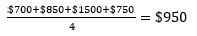
*   中位数为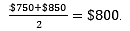
*   标准偏差为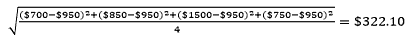
*   范围为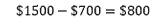
*   在这种情况下，中位数是一个更好的统计指标，因为它不太容易出现异常值(租金为 1，500 美元)。

### 数据类型

了解您正在处理的数据类型非常重要，这样您就可以选择正确的统计度量和正确的可视化。我们将数据分为分类/定性和数字/定量。分类数据描述特征，例如，物体的颜色或一个人的性别。我们可以进一步将分类数据分为名义数据和序数数据。与名义数据相反，序数数据是有顺序的。

数值数据可以分为离散数据和连续数据。如果数据只能有某些值，我们就称之为离散数据，而连续数据可以取任何值(有时限于一个范围)。

另一个要考虑的方面是数据是否有一个时间域——换句话说，它是受时间的约束还是随着时间的推移而变化？如果数据绑定到某个位置，显示空间关系可能会很有趣，因此您也应该记住这一点:

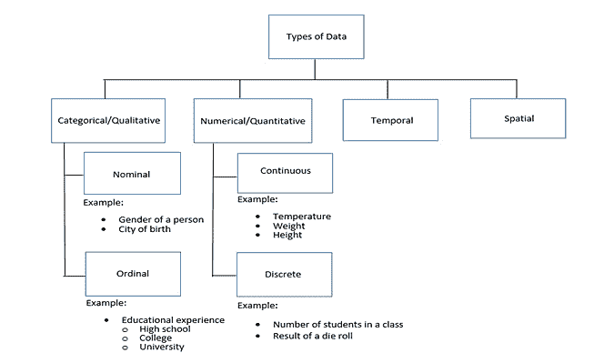

###### 图 1.5:数据类型的分类

### 汇总统计

在现实应用中，我们经常会遇到巨大的数据集，因此**汇总统计**用于汇总数据的重要方面。它们是以简洁明了的方式交流大量信息所必需的。

我们已经讨论了中心趋势和离差的度量，它们都是汇总统计。重要的是要知道，中心趋势的度量显示了一组数据值中的中心点，而离差的度量显示了数据值的分布情况。

下表概述了哪种中心趋势度量最适合特定类型的数据:


###### 图 1.6:不同类型数据的中心趋势的最适合度量

## NumPy

在处理数据时，我们经常需要一种处理多维数组的方法。正如我们之前讨论的，我们还必须对这些数据应用一些基本的数学和统计运算。这正是 **NumPy** 定位自己的地方。它支持大型 n 维数组，是许多高级数学和统计运算的内置支持。

#### 注意

在 NumPy 之前，有一个名为 **Numeric** 的库。然而，它不再被使用，因为 NumPy 的签名 **ndarray** 允许对大型和高维矩阵进行高效处理。

那些数组是 NumPy 的本质。它们比使用 Python 的内置列表更快。除了内置的列表数据类型之外，ndarrays 还提供了一个跨越式的内存视图(例如，Java 中的`int[]`)。因为它们是均匀类型的，这意味着所有的元素必须是相同的类型，所以步幅是一致的，这导致更少的内存浪费和更好的访问时间。

一个**步距**是一个数组中两个相邻元素开始之间的位置数。它们通常以字节或数组元素的大小单位来度量。步幅可以大于或等于元素的大小，但不能小于元素的大小，否则它将与下一个元素的内存位置相交。

#### 注意

请记住，NumPy 数组具有“已定义”的数据类型。这意味着您不能将字符串插入整数类型数组。NumPy 主要用于双精度数据类型。

### 练习 1:加载样本数据集并计算平均值

#### 注意

所有练习和活动都将在 Jupyter 笔记本中开发。请从[https://GitHub . com/trainingypbackt/Data-Visualization-with-Python](https://github.com/TrainingByPackt/Data-Visualization-with-Python)下载带有所有准备好的模板的 GitHub 资源库

在本练习中，我们将加载`normal_distribution.csv`数据集，并计算其中每行和每列的平均值:

1.  Open the `exercise01.ipynb` Jupyter Notebook from the `Lesson01` folder to implement this exercise.

    为此，您需要导航到该文件的路径。在命令行终端中，键入`jupyter-lab.`

2.  现在，您将看到一个浏览器窗口打开，显示您在其中调用上一个命令的目录内容。点击`exercise01.ipynb`。这将打开笔记本。
3.  第 01 章的笔记本现在应该已经打开，可以修改了。简短介绍后，您应该会看到一个导入必要依赖项的单元格。在这种情况下，我们将导入别名为

    ```py
    # importing the necessary dependencies
    import numpy as np
    ```

    的`numpy`
4.  Look for the cell that has a comment saying, "loading the dataset." This is the place you want to insert the `genfromtxt` method call. This method helps in loading the data from a given text or `.csv` file.

    完整的行应该如下所示:

    ```py
    # loading the dataset
    dataset = np.genfromtxt('./data/normal_distribution.csv', delimiter=',')
    ```

5.  If everything works as expected, the generation should run through without any error or output. Have a look at the data you just imported by simply writing the name of the ndarray in the next cell. This is implemented in the following code. Simply executing a cell that returns a value such as an ndarray GI will use Jupyter formatting, which looks nicer and, in most cases, displays more information than using `print`:

    ```py
    # looking at the dataset
    dataset
    ```

    前面代码的输出如下:

    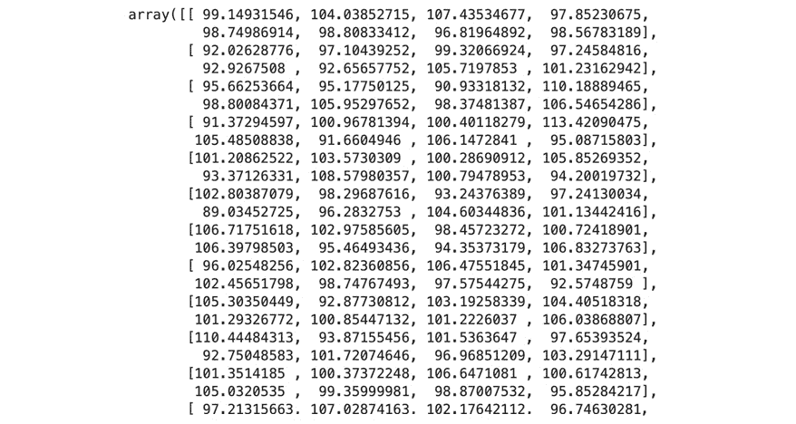

    ###### 图 1.7:正态分布. csv 文件的前几行

6.  To get a quick overview of our dataset, we want to print out the "shape" of it.

    这将为我们提供表单的输出(行、列)。使用`dataset.shape`命令打印出形状。我们也可以将行称为实例，将列称为特征。这意味着我们的数据集有 24 个实例和 8 个特征:

    ```py
    # printing the shape of our dataset
    dataset.shape
    ```

    前面代码的输出如下:

    

    ###### 图 1.8:数据集的形状

7.  Calculating the mean is the next step once we've loaded and checked our dataset.

    `numpy` `array`中的第一行可以通过简单地用零索引来访问，比如:`dataset[0]`。正如我们之前提到的，NumPy 有一些用于计算的内置函数，例如 mean。因此，我们可以简单地调用`np.mean()`并传入数据集行来获得结果。打印输出应该如下所示:

    ```py
    # calculating the mean for the first row
    np.mean(dataset[0])
    ```

    前面代码的输出如下:

    

    ###### 图 1.9:第一行元素的平均值

8.  We can also do the same for the first column by using `np.mean()` in combination with the column indexing `dataset[:, 0]`:

    ```py
    # calculating the mean for the first column
    np.mean(dataset[:, 0])
    ```

    前面代码的输出如下:

    

    ###### 图 1.10:第一列中元素的平均值

9.  If we want to get the mean for every single row, aggregated in a list, we can make use of the `axis` tools of NumPy. By simply passing the `axis` parameter in the `np.mean()` call, we can define the dimension our data will be aggregated on.

    `axis=0`是水平的，`axis=1`是垂直的，所以如果我们想要每行都有结果，我们需要选择`axis=1`:

    ```py
    # mean for each row
    np.mean(dataset, axis=1)
    ```

    前面代码的输出如下:

    

    ###### 图 1.11:每行元素的平均值

    如果要有每一列的结果，需要选择`axis=0`。

    ```py
    # mean for each column
    np.mean(dataset, axis=0)
    ```

    前面代码的输出如下:

    

    ###### 图 1.12:每列元素的平均值

10.  As the last task of this exercise, we also want to have the mean of the whole matrix. We could sum up all the values we retrieved in the previous steps, but NumPy allows us to simply pass in the whole dataset to do this calculation:

    ```py
    # calculating the mean for the whole matrix
    np.mean(dataset)
    ```

    前面代码的输出如下:

    

###### 图 1.13:完整数据集的元素平均值

恭喜你！您已经离将 NumPy 与打印库结合使用并创建有影响力的可视化效果又近了一步。由于我们已经介绍了最基本的内容，并在前面的练习中计算了平均值，现在就看您如何解决即将到来的活动了。

### 活动 1:使用 NumPy 计算给定数字的平均值、中值、方差和标准差

在本练习中，我们将使用所学的技能导入数据集并执行一些基本计算(平均值、中值、方差和标准差)来计算我们的任务。

我们希望巩固我们的新技能并熟悉 NumPy:

1.  从`Lesson01`文件夹打开`activity01.ipynb` Jupyter 笔记本，执行本活动。
2.  现在，`import numpy`进入你的 Jupyter 笔记本，给它取别名`np`。
3.  使用`numpy`的`genfromtxt`方法加载`normal_distribution.csv`数据集。
4.  看看数据库，确保一切正常。
5.  给定数据集，进入并使用内置的`numpy`方法。
6.  使用这些方法，首先计算第三行、最后一列以及前 3 行和前 3 列的交集的平均值。
7.  然后，计算最后一行、最后 3 列和每行的中间值。
8.  计算每列的方差、最后 2 行和前 2 列的交集。
9.  Calculate the standard deviation for the dataset.

    #### 注意:

    这项活动的解决方案可以在第 244 页找到。

恭喜你！您已经使用 NumPy 完成了第一项活动。在接下来的活动中，这些知识将得到进一步巩固。

### 基本数值运算

在本节中，我们将学习基本的 NumPy 操作，如索引、切片、拆分和迭代，并在活动中实现它们。

**索引**

在高级别上，索引 NumPy `array`中的元素的工作方式与内置 Python 列表相同。因此，我们能够索引多维矩阵中的元素:

```py
dataset[0]       # index single element in outermost dimension
dataset[-1]      # index in reversed order in outermost dimension
dataset[1, 1]    # index single element in two-dimensional data
dataset[-1, -1]  # index in reversed order in two-dimensional data
```

**切片**

切片也改编自 Python 的列表。在处理大量数据时，能够轻松地将部分列表分割成新的数组非常有帮助:

```py
dataset[1:3]         # rows 1 and 2
dataset[:2, :2]      # 2x2 subset of the data 
dataset[-1, ::-1]    # last row with elements reversed
dataset[-5:-1, :6:2] # last 4 rows, every other element up to index 6
```

**分裂**

拆分数据在许多情况下都是有帮助的，从只绘制一半的时间序列数据到为机器学习算法分离测试和训练数据。

有两种方法可以横向和纵向拆分数据。水平分裂可以用`hsplit`方法进行。垂直分裂可以用`vsplit`方法完成:

```py
np.hsplit(dataset, (3))  # split horizontally in 3 equal lists
np.vsplit(dataset, (2))  # split vertically in 2 equal lists
```

**迭代**

迭代 NumPy 数据结构 ndarrays 也是可能的。它一个接一个地遍历整个数据列表，访问数组中的每个元素一次。考虑到它们可以有几个维度，索引变得非常复杂。

`nditer`是在给定数量的数组上迭代的多维迭代器对象:

```py
# iterating over whole dataset (each value in each row)
for x in np.nditer(dataset):
    print(x)
```

`ndenumerate`会给我们确切的这个指数，从而为第一行的第二个值返回(`0`、`1`):

```py
# iterating over whole dataset with indices matching the position in the dataset
for index, value in np.ndenumerate(dataset):
    print(index, value) 
```

### 活动 2:索引、切片、拆分和迭代

在本练习中，我们将使用 NumPy 的特性来索引、切片、拆分和迭代数组，以巩固我们所学的内容。我们的客户希望我们证明我们的数据集很好地分布在平均值 100 附近:

1.  从`Lesson01`文件夹打开`activity02.ipynb` Jupyter 笔记本，执行本活动。
2.  现在，`import numpy`进入你的 Jupyter 笔记本，给它取别名`np`。
3.  使用 NumPy 加载`normal_distribution.csv`数据集。通过查看数据库，确保一切正常，就像在前面的活动中一样。遵循笔记本中的任务描述。
4.  加载数据集后，使用前面讨论的索引功能对数据集的第二行(第二行)进行索引，对数据集的最后一个元素(最后一行)进行索引，对第二行的第一个值(第二行，第一个值)进行索引，并对倒数第二行的最后一个值进行索引(使用组合访问)。
5.  创建输入的子列表需要切片。对前两行和前两列的四个元素(2x2)的交集进行切片，选择第五行的每隔一个元素，并颠倒输入顺序，以相反的顺序选择前两行。
6.  如果我们需要一个更小的数据集，我们也可以使用拆分来有效地划分我们的数据集。使用这个概念将数据集水平分割成三个相等的部分，并在索引 2 上垂直分割数据集。
7.  The last task in this activity will be iterating over the complete dataset. Use the previously discussed methods to iterate over the whole dataset, with indices matching the position in the dataset.

    #### 注意:

    这项活动的解决方案可以在第 248 页找到。

恭喜你！我们已经介绍了 NumPy 的大多数基本数据争论方法。在下一个活动中，我们将了解更高级的功能，这些功能将为您提供更好地了解数据的工具。

### 高级数字操作

在本节中，我们将学习 GI 高级 NumPy 操作，如过滤、排序、组合和整形，并在活动中实现它们。

**过滤**

过滤是一个非常强大的工具，如果你想避免异常值，它可以用来清理你的数据。这也有助于更好地了解您的数据。

除了`dataset[dataset > 10]`简写符号外，我们还可以使用内置的 NumPy `extract`方法，它使用不同的符号做同样的事情，但是用更复杂的例子给我们更大的控制力。

如果我们只想提取符合我们给定条件的值的索引，我们可以使用内置的`where`方法。例如，`np.where(dataset > 5)`将返回初始数据集中大于 5:

```py
dataset[dataset > 10]                   # values bigger than 10
np.extract((dataset < 3), dataset)      # alternative – values smaller than 3
dataset[(dataset > 5) & (dataset < 10)] # values bigger 5 and smaller 10
np.where(dataset > 5)                   # indices of values bigger than 5 (rows and cols)
```

**排序**

对数据集的每一行进行排序非常有用。使用 NumPy，我们还能够对其他维度进行排序，例如列。

此外，`argsort`为我们提供了获得索引列表的可能性，这将产生排序列表:

```py
np.sort(dataset)          # values sorted on last axis
np.sort(dataset, axis=0)  # values sorted on axis 0
np.argsort(dataset)       # indices of values in sorted list
```

**组合**

将同一维度的两个数据集保存到不同的文件中时，将行和列堆叠到现有数据集上会很有帮助。

给定两个数据集，我们使用 **vstack** 在`dataset_2`之上“堆叠”`dataset_1`，这将给我们一个组合数据集，所有行来自`dataset_1`，然后是所有行来自`dataset_2`。

如果我们使用 **hstack** ，我们将数据集“一个挨着一个”堆叠，这意味着第一行`dataset_1`的元素后面将是第一行`dataset_2`的元素。这将应用于每一行:

```py
np.vstack([dataset_1, dataset_2])        # combine datasets vertically
np.hstack([dataset_1, dataset_2])        # combine datasets horizontally
np.stack([dataset_1, dataset_2], axis=0) # combine datasets on axis 0
```

#### 注意

结合堆叠可能需要一些时间来适应。更多信息请查看 NumPy 文档中的示例:[https://docs . scipy . org/doc/NumPy-1 . 15 . 0/reference/generated/NumPy . hstack . html .](https://docs.scipy.org/doc/numpy-1.15.0/reference/generated/numpy.hstack.html)

**重塑**

重塑对于某些算法来说至关重要。根据数据的性质，它可能有助于您降低维度，使可视化更容易:

```py
dataset.reshape(-1, 2)       # reshape dataset to two columns x rows
np.reshape(dataset, (1, -1)) # reshape dataset to one row x columns
```

这里，`-1`是 NumPy 自动识别的未知维度。NumPy 将首先计算出任何给定数组的长度和剩余维度，从而确保它满足给定的上述标准。

### 活动 3:过滤、排序、组合和整形

NumPy 的最后一个活动提供了一些更复杂的任务来巩固我们的学习。它还将结合大部分以前学过的方法作为总结。请执行以下步骤:

1.  从`Lesson01`文件夹打开`activity03.ipynb` Jupyter 笔记本，执行本活动。
2.  NumPy 将是此活动唯一必需的依赖项，因此请确保导入它。
3.  再次，使用 NumPy 加载`normal_distribution.csv`数据集。通过查看数据库，确保一切正常。
4.  加载数据集后，使用前面讨论的过滤功能过滤大于 105 的值，过滤介于 90 到 95 之间的值，并获取差值小于 1 到 100 的值的索引。
5.  当试图在序数数据类型列上显示数据时，对数据进行排序是一项重要功能。使用**排序**对每行的值进行排序，对每列的值进行排序，得到每行的位置索引，得到每行的 3 个最小值(其余值不排序)。
6.  使用本章*练习 02* 中的拆分数据，我们还可以使用前面讨论的组合特征将第一列的后半部分重新添加在一起，将第二列添加到我们的组合数据集，并将第三列添加到我们的组合数据集。
7.  Use the reshaping features to reshape the dataset in a one-dimensional list with all the values and reshape the dataset into a matrix with only two columns.

    #### 注意:

    这项活动的解决方案可以在第 252 页找到。

接下来，我们将学习熊猫，这将在处理比简单的多维数字数据更复杂的数据时带来几个优势。pandas 还支持数据集中不同的数据类型，这意味着我们可以有保存字符串的列和其他有数字的列。

正如你所看到的，NumPy 本身有一些非常强大的工具。它们中的一些与熊猫结合时甚至更强大。

## 熊猫

**pands**Python 库提供了数据结构和方法来处理不同类型的数据，例如数值和时间数据。这些操作易于使用，并且针对性能进行了高度优化。

数据格式如 **CSV** 、 **JSON** 和数据库可用于**数据框**的创建。数据帧是数据的内部表示，与表非常相似，但功能更强大。导入和读取文件和内存中的数据被抽象成一个用户友好的界面。在处理丢失的数据时，pandas 提供了内置的解决方案来清理和扩充您的数据，这意味着它会用合理的值来填充丢失的值。

集成的索引和基于标签的切片结合花哨的索引(我们已经在 NumPy 上看到的)使得处理数据变得简单。更复杂的技术，如**重塑**、**旋转、**和**融合**数据，以及**轻松连接**和**合并**数据的可能性，为正确处理您的数据提供了强大的工具。

如果你正在处理**时间序列数据**，诸如**日期范围生成**、**频率转换**、**移动窗口统计**等操作可以为你的扯皮提供一个高级界面。

#### 注意

熊猫的安装说明可以在这里找到:[https://pandas.pydata.org/](https://pandas.pydata.org/)。

### 大熊猫相对于 NumPy 的优势

以下是熊猫的一些优点:

*   **高抽象层次** : pandas 比 NumPy 有更高的抽象层次，给了用户更简单的交互界面。它抽象出一些更复杂的概念，使其更容易使用和理解。
*   **少一点直觉**:很多方法，比如加入、选择、加载文件，都是可以用的，没有太多的直觉，也没有带走熊猫很多强大的天性。
*   **更快的处理**:数据帧的内部表示允许对某些操作进行更快的处理。当然，这总是取决于数据及其结构。
*   **简单的数据框设计**:数据框是为大型数据集的操作而设计的。

### 熊猫的劣势

以下是熊猫的一些缺点:

*   **不太适用**:由于抽象程度较高，一般比 NumPy 不太适用。尤其是当超出其使用范围时，操作很快变得非常复杂和困难。
*   **更多的磁盘空间**:由于数据帧的内部表示和熊猫为了更高性能的执行而交换磁盘空间的方式，复杂操作的内存使用可能会激增。
*   **性能问题**:特别是在执行不推荐的重连接时，内存使用可能会变得很关键，并可能导致性能问题。
*   **Hidden complexity**: The comparatively simple interface has its downsides too. Less experienced users often tend to overuse methods and execute them several times instead of reusing what they've already calculated. This hidden complexity makes users think that the operations themselves are simple, which is not the case.

    #### 注意

    始终尝试思考如何设计您的工作流，而不是过度使用操作。

### 练习 2:加载样本数据集并计算平均值

在本练习中，我们将加载`world_population.csv`数据集，并计算一些行和列的平均值。我们的数据集保存了每个国家的年人口密度。让我们用熊猫来获得一些快速简单的见解:

1.  从`Lesson01`文件夹打开`exercise02.ipynb` Jupyter 笔记本，执行本练习。
2.  导入熊猫库:

    ```py
    # importing the necessary dependencies
    import pandas as pd
    ```

3.  导入熊猫后，我们可以使用`read_csv`方法加载上述数据集。我们希望使用包含国家名称的第一列作为我们的索引。我们将使用`index_col`参数。完整的一行应该是这样的:

    ```py
    # loading the dataset
    dataset = pd.read_csv('./data/world_population.csv', index_col=0)
    ```

4.  As before, have a look at the data you just imported by simply writing the name of the dataset in the next cell. pandas uses a data structure called DataFrames. We want to only print some of the rows to avoid filling the screen. pandas DataFrames come with two methods, `head()` and `tail()`, to do this for you. Both take number, `n`, as a parameter, which describes how many rows should be returned:

    #### 注意

    简单地执行一个返回值的单元格，如数据框，将使用 Jupyter 格式，这看起来更好，在大多数情况下，比使用`print`显示更多的信息。

    ```py
    # looking at the dataset
    dataset.head()
    ```

    前面代码的输出如下:

    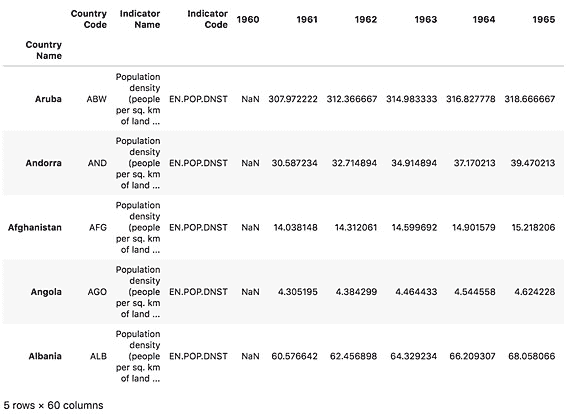

    ###### 图 1.14:数据集的前五行

5.  To get a quick overview of our dataset, we want to print out its shape.

    这将以`(rows, columns)`的形式给出输出。使用`dataset.shape`命令打印出形状。这与 NumPy ndarrays 的工作原理完全相同:

    ```py
    # printing the shape of our dataset
    dataset.shape
    ```

    前面代码的输出如下:

    

    ###### 图 1.15:数据集的形状

6.  Calculating the mean is the next step, once we've loaded and checked our dataset. Indexing rows work a little bit differently and we'll look at this in detail in the activities that follow. For now, we only want to index the column with the year 1961.

    熊猫数据帧有内置的计算功能，如`mean`。这意味着我们可以简单地调用`dataset.mean()`来获得结果。

    打印输出应该如下所示:

    ```py
    # calculating the mean for 1961 column
    dataset["1961"].mean()
    ```

    前面代码的输出如下:

    

    ###### 图 1.16:1961 年栏中元素的平均值

7.  Just to see the difference in population density over the years, we'll do the same with the column for the year 2015 (the population more than doubled in the given time range):

    ```py
    # calculating the mean for 2015 column
    dataset["2015"].mean()
    ```

    前面代码的输出如下:

    

    ###### 图 1.17:2015 年栏中元素的平均值

8.  If we want to get the mean for every single country (row), we can make use of pandas `axis` tools. By simply passing the `axis` parameter in the `dataset.mean()` call, we define the dimension our data will be aggregated on.

    `axis=0`是水平的(每列)`axis=1`是垂直的(每行)，所以如果我们想得到每行的结果，我们需要选择`axis=1`。由于我们的数据集中有 264 行，我们希望将返回国家的数量限制在 10 个。如前所述，我们可以使用参数为 10 的`head(10)`和`tail(10)`方法:

    ```py
    # mean for each country (row)
    dataset.mean(axis=1).head(10)
    ```

    前面代码的输出如下:

    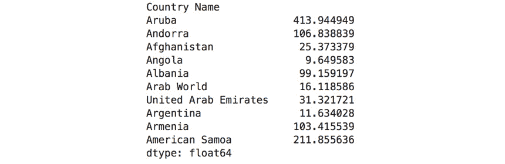

    ###### 图 1.18:前 10 个国家(行)元素的平均值

    下面是 tail 方法的代码:

    ```py
    # mean for each feature (col)
    dataset.mean(axis=0).tail(10)
    ```

    前面代码的输出如下:

    

    ###### 图 1.19:过去 10 年元素平均值(列)

9.  The last task of this exercise is to calculate the mean of the whole DataFrame. Since pandas DataFrames can have different datatypes in each column, aggregating this value on the whole dataset out of the box makes no sense. By default, `axis=0` will be used, which means that this will give us the same result as the cell before:

    ```py
    # calculating the mean for the whole matrix
    dataset.mean()
    ```

    前面代码的输出如下:

    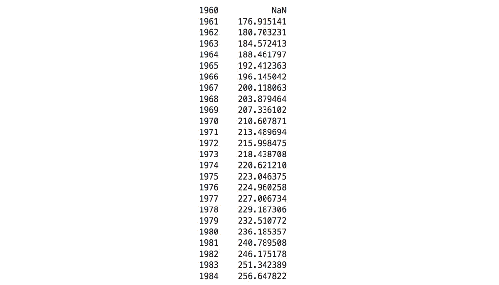

###### 图 1.20:每列元素的平均值

恭喜你！我们现在已经看到熊猫的界面有一些类似于 NumPy 的方法，这使得它真的很容易理解。我们现在已经介绍了最基本的内容，这将帮助你解决第一个使用熊猫的活动。在下面的活动中，你将巩固你对熊猫的基本知识，并使用你刚刚学习的方法来解决几个计算任务。

### 活动 4:用熊猫计算给定数字的平均值、中位数和方差

在本活动中，我们将利用之前学习的导入数据集和进行一些基本计算的技能，并应用它们来解决我们使用熊猫的第一个活动的任务。

我们想巩固我们的新技能，熟悉熊猫:

1.  从`Lesson01`文件夹中打开 Jupyter 笔记本`activity04.ipynb`执行本活动。
2.  由于我们现在正在和熊猫一起工作，我们必须在活动开始时导入它，以便能够在笔记本中使用它。
3.  使用熊猫的`read_csv`方法加载`world_population.csv`数据集。
4.  给定数据集，进入并使用熊猫的内置方法计算第三行、最后一行和国家德国的平均值。
5.  然后，计算最后一行、最后 3 行和前 10 个国家的中位数。
6.  Last, calculate the variance of the last 5 columns.

    #### 注意:

    这项活动的解决方案可以在第 256 页找到。

恭喜你！您已经完成了与熊猫的第一次活动，这向您展示了与 NumPy 和熊猫合作时的一些相似之处和不同之处。在接下来的活动中，这些知识将得到巩固。你还将被介绍熊猫更复杂的特征和方法。

### 熊猫的基本操作

在这一节中，我们将学习基本的熊猫操作，如索引、切片和迭代，并通过一个活动来实现它。

**索引**

用熊猫做索引比用 NumPy 要复杂一点。我们只能访问带有单个括号的列。要使用行的索引来访问它们，我们需要`iloc`方法。如果我们想通过`index_col`(在`read_csv`调用中设置)访问它们，我们需要使用`loc`方法:

```py
dataset["2000"]                    # index the 2000 col
dataset.iloc[-1]                   # index the last row
dataset.loc["Germany"]             # index the row with index Germany
dataset[["2015"]].loc[["Germany"]] # index row Germany and column 2015
```

**切片**

用熊猫切片更有力量。我们可以使用我们已经在 NumPy 中看到的默认切片语法，或者使用多重选择。如果我们想按名称划分不同的行或列，我们可以简单地在括号中传递一个列表:

```py
dataset.iloc[0:10]                 # slice of the first 10 rows
dataset.loc[["Germany", "India"]]  # slice of rows Germany and India
# subset of Germany and India with years 1970/90
dataset.loc[["Germany", "India"]][["1970", "1990"]] 
```

**迭代**

迭代数据帧也是可能的。考虑到它们可以有几个维度和数据类型，索引是非常高级的，并且必须分别对每一行进行迭代:

```py
# iterating the whole dataset
for index, row in dataset.iterrows():
    print(index, row)
```

### **系列**

熊猫系列是一维标签阵列，能够保存任何类型的数据。我们可以通过从. csv 文件、Excel 电子表格或 SQL 数据库中加载数据集来创建系列。有许多不同的方法来创建它们。例如:

*   NumPy 数组:

    ```py
    # import pandas
    import pandas as pd
    # import numpy
    import numpy as np
    # creating a numpy array
    numarr = np.array(['p','y','t','h','o','n'])
    ser = pd.Series(numarr)
    print(ser)
    ```

*   熊猫名单:

    ```py
    # import pandas
    import pandas as pd
    # creating a pandas list
    plist = ['p','y','t','h','o','n']
    ser = pd.Series(plist)
    print(ser)
    ```

### 活动 5:使用熊猫进行索引、切片和迭代

在本练习中，我们将使用前面讨论过的熊猫特征，使用熊猫系列对数据帧进行索引、切片和迭代。为了深入了解数据集，我们需要能够对数据进行显式索引、切片和迭代。例如，我们可以比较几个国家的人口密度增长。

在查看了不同的操作之后，我们想要显示德国、新加坡、美国和印度在 1970 年、1990 年和 2010 年的人口密度:

1.  从`Lesson01`文件夹打开`activity05.ipynb` Jupyter 笔记本，执行本活动。
2.  在加载数据集之前，我们需要导入熊猫。我们将再次使用`pd`别名来指代熊猫。
3.  使用熊猫加载`world_population.csv`数据集。查看数据帧，确保一切正常。
4.  加载数据集后，使用前面讨论的索引功能为美国的行、第二行到最后一行、2000 年的列(系列)和 2000 年的印度人口密度编制索引。
5.  创建数据集的子列表需要切片。使用此概念将第 2 行到第 5 行中的国家分割开来，将德国、新加坡、美国和印度分割开来，并将德国、新加坡、美国和印度分割成 1970 年、1990 年和 2010 年的人口密度。
6.  The last task in this activity will be iterating over the first three countries in our dataset. Use the previously discussed iteration method to iterate over the whole dataset and print the name, country code, and population for the years 1970, 1990, and 2010.

    #### 注意:

    这项活动的解决方案可以在第 261 页找到。

恭喜你！我们已经介绍了大多数使用熊猫的基本数据争论方法。在下一个活动中，我们将了解更高级的功能，如过滤、排序和整形，为下一章做准备。

### 先进熊猫行动

在本节中，我们将学习先进的熊猫操作，如过滤、排序和整形，并在活动中实现它们。

**过滤**

熊猫中的过滤比 NumPy 有更高级别的界面。你仍然可以使用基于“简单”括号的**条件过滤**。但是，您也可以使用更复杂的查询，例如，基于正则表达式筛选行:

```py
dataset.filter(items=["1990"])      # only column 1994
dataset[(dataset["1990"] < 10)]     # countries'population density < 10 in 1999
dataset.filter(like="8", axis=1)    # years containing an 8
dataset.filter(regex="a$", axis=0)  # countries ending with a
```

**排序**

根据给定的行或列对每一行或每一列进行排序将有助于您更好地了解数据，并找到给定数据集的排名。有了熊猫，我们可以很容易地做到这一点。可以使用名为**升序**的参数进行升序和降序排序。当然，您可以通过在`by = [ ]`列表中提供多个值来进行更复杂的排序。然后，这些将用于对第一个值相同的值进行排序:

```py
dataset.sort_values(by=["1999"])        # values sorted by 1999
# values sorted by 1999 descending
dataset.sort_values(by=["1994"], ascending=False)
```

**重塑**

重塑对于简化可视化和算法至关重要。但是，根据您的数据，这可能会变得非常复杂:

```py
dataset.pivot(index=["1999"] * len(dataset), columns="Country Code", values="1999")
```

#### 注意

重塑是一个非常复杂的话题。如果你想深入其中，这是一个很好的入门资源:[https://bit.ly/2SjWzaB](https://bit.ly/2SjWzaB)。

### 活动 6:过滤、排序和整形

熊猫的最后一项活动提供了一些更复杂的任务，也结合了以前学到的大部分方法作为总结。完成这项活动后，学生应该能够阅读最基本的熊猫代码，并理解其逻辑:

1.  从`Lesson01`文件夹打开`activity06.ipynb` Jupyter 笔记本，执行本活动。有关如何在 JupyterLab 中打开 Jupyter 笔记本的说明，请参考本章的介绍。
2.  过滤、排序和整形都是熊猫的方法。在我们使用它们之前，我们必须进口熊猫。
3.  Again, load the `world_population.csv` dataset using pandas and make sure everything works by having a look at the DataFrames:

    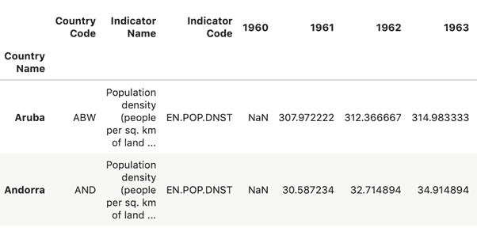

    ###### 图 1.21:查看数据集的前两列

4.  加载数据集后，使用前面讨论的过滤功能，以列的形式获取 1961 年、2000 年和 2015 年，以及 2000 年人口密度大于 500 的所有国家。此外，使用过滤获得一个新的数据集，该数据集只包含 2000 年及以后的年份、以 A 开头的国家以及包含“土地”一词的国家
5.  当试图在序数数据类型列上显示数据时，对数据进行排序是一项重要功能。使用排序操作按 1961 年的升序、2015 年的升序和 2015 年的降序对值进行排序。
6.  If our input dataset does not suit our needs, we have to reshape it. Use the reshaping features to reshape the dataset to 2015 as row and country codes as columns.

    #### 注意:

    这项活动的解决方案可以在第 267 页找到。

你现在已经完成了关于熊猫的主题，这一章到此结束。我们已经了解了帮助您争论和处理数据的基本工具。熊猫本身是一个令人难以置信的强大和大量使用的数据争论工具。

## 总结

NumPy 和熊猫是数据角力的必备工具。它们的用户友好的界面和高性能的实现使数据处理变得容易。尽管它们只对我们的数据集提供了一点点洞察，但它们对于争论、扩充和清理我们的数据集绝对有价值。掌握这些技能将会提高你的可视化质量。

在这一章中，我们学习了 NumPy 和熊猫的基础知识，以及统计学的概念。尽管所涵盖的统计概念非常基本，但它们对于丰富我们的可视化是必要的，因为在大多数情况下，我们的数据集并不直接提供这些信息。这种实践经验将帮助您实施以下章节中的练习和活动。

在下一章中，我们将关注不同类型的可视化，以及如何决定哪种可视化最适合您的情况。这将为您提供理论知识，以便您知道何时使用特定的图表类型以及原因。它还将奠定章节的基础，重点是教你如何使用 Matplotlib 和 seaborn 来创建所讨论的绘图。在我们用 Matplotlib 和 seaborn 介绍了基本的可视化技术之后，我们将深入探讨交互式和动画图表的可能性，这将在我们的可视化中引入讲故事的元素。