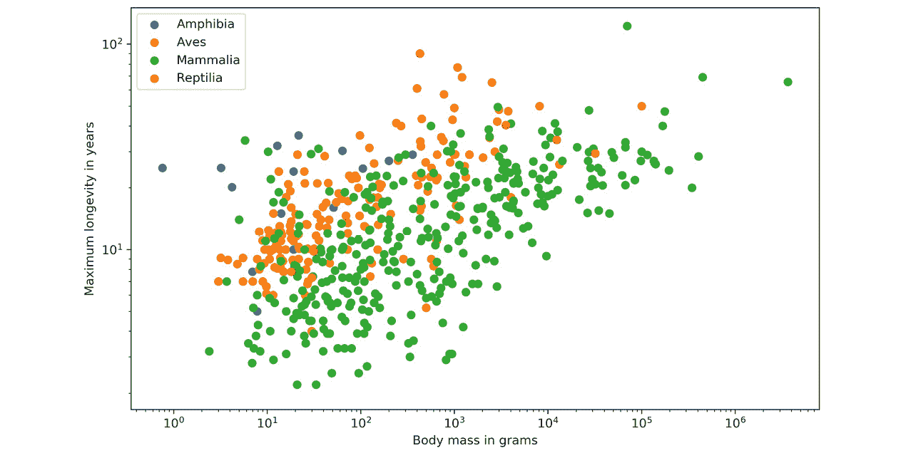

# 二、你需要了解的所有绘图

## 学习目标

本章结束时，您将能够:

*   确定给定数据集和场景的最佳绘图类型
*   解释某些绘图的设计实践
*   设计出色的有形可视化效果

在本章中，我们将学习不同类型绘图的基础知识。

## 简介

在本章中，我们将关注各种可视化，并确定哪种可视化最适合显示给定数据集的特定信息。我们将详细描述每一个可视化，并给出实际的例子，例如随着时间的推移比较不同的股票，或者比较不同电影的收视率。从比较图开始，它非常适合于比较多个变量随时间的变化，我们将看看它们的类型，如折线图、条形图和雷达图。关系图便于显示变量之间的关系。我们将介绍显示两个变量之间关系的散点图、三个变量的气泡图、变量对的相关图，最后是热图。

下面将解释组合图，它用于可视化作为整体一部分的变量，以及饼图、堆叠条形图、堆叠面积图和维恩图。为了更深入地了解变量的分布，使用了分布图。作为分布图的一部分，直方图、密度图、箱线图和小提琴图将被涵盖。最后，我们将讨论点地图、连接地图和点地图，它们可以分为地理图。地理图对于可视化地理空间数据非常有用。

## 对比图

**比较图**包括非常适合比较多个变量或变量随时间变化的图表。对于项目之间的比较，条形图(也称为柱形图)是最好的方法。折线图非常适合可视化随时间变化的变量。对于某个时间段(比如说，少于十个时间点)，也可以使用垂直条形图。雷达图或蜘蛛图非常适合可视化多个组的多个变量。

### 折线图

**折线图**用于显示连续时间段内的定量值，并将信息显示为一系列。折线图非常适合由直线段连接的时间序列。

该值位于 y 轴上，而 x 轴是时间刻度。

**用途**:

*   折线图非常适合比较多个变量以及可视化单个和多个变量的趋势，尤其是如果数据集有多个时间段(大约超过十个)。
*   对于较小的时间段，垂直条形图可能是更好的选择。

下图显示了 20 年来房地产价格(百万美元)的趋势。折线图非常适合显示数据趋势:

###### 图 2.1:单一变量的折线图

**例**:

下图是一个多变量折线图，比较了谷歌、脸书、苹果、亚马逊和微软的股票收盘价。折线图对于比较价值和可视化股票趋势非常有用。正如我们所看到的，亚马逊显示了最高的增长:

###### 图 2.2:显示五家公司股票趋势的折线图

**设计实践**:

*   避免每个图表有太多线条
*   Adjust your scale so that the trend is clearly visible

    #### 注意

    多变量绘图的设计实践。应该有一个图例来描述每个变量。

### 条形图

条形长度对值进行编码。条形图有两种变体:垂直条形图和水平条形图。

**用途**:

*   虽然它们都用于比较不同类别的数值，但垂直条形图有时也用于显示一段时间内的单个变量。

**条形图的注意事项和不注意事项**:

*   不要混淆垂直条形图和直方图。条形图比较不同的变量或类别，而直方图显示单个变量的分布。直方图将在本章后面讨论。
*   另一个常见的错误是使用条形图来显示组或类别之间的中心趋势。在这些情况下，使用箱线图或小提琴图来显示统计度量或分布。

**示例**:

下图显示了一个垂直条形图。每个条形显示了五名学生在测试中获得的 100 分中的分数:

###### 图 2.3:使用学生测试数据的垂直条形图

下图显示了一个水平条形图。每个条形显示了五名学生在测试中获得的 100 分中的分数:

###### 图 2.4:使用学生测试数据的水平条形图

下图比较了电影分级，给出了两个不同的分数。Tomatometer 是对这部电影给予正面评价的认可影评人的百分比。受众分数是 5 分中给出 3.5 分或更高分数的用户的百分比。如我们所见，《火星人》是唯一一部同时获得高分和观众评分的电影。**《霍比特人:意外之旅》**的观众评分相对于 Tomatometer 的评分相对较高，这可能是由于庞大的粉丝群:

###### 图 2.5:比较条形图

**设计实践**:

*   对应于数值变量的轴应该从零开始。从另一个值开始可能会产生误导，因为它会使小的值差异看起来很大。
*   使用水平标签，也就是说，只要横条的数量少，图表看起来不会太杂乱。

### 雷达图

**雷达图**，也称为**蜘蛛**或**网络图**，将多个变量可视化，每个变量绘制在自己的轴上，形成一个多边形。所有轴都是径向排列的，从中心开始，彼此之间的距离相等，并且具有相同的刻度。

**用途**:

*   雷达图非常适合比较单个组或多个组的多个定量变量。
*   它们对于显示数据集中哪些变量得分高或低也很有用，是可视化性能的理想选择

**示例**:

下图显示了单个变量的雷达图。此图表显示学生在不同科目中的分数数据:

###### 图 2.6:一个变量(学生)的雷达图

下图显示了两个变量/组的雷达图。在这里，图表解释了两个学生在不同科目上的分数:

###### 图 2.7:两个变量(两个学生)的雷达图

下图显示了多个变量/组的雷达图。每个图表显示学生在不同科目中的表现数据:

###### 图 2.8:多变量(多主题)面阵雷达图

**设计实践**:

*   尽量在一张雷达图上显示十个或更少的因子，以便于阅读。
*   如上图所示，对多个变量/组使用**刻面**，以保持清晰。

### 活动 7:员工技能比较

你会得到四名员工(甲、乙、丙和丁)的五个属性的分数:效率、质量、承诺、负责任的行为和合作。您的任务是比较员工及其技能:

1.  哪些图表适合这项任务？
2.  You are given the following bar and radar charts. List the advantages and disadvantages for both charts. Which is the better chart for this task in your opinion and why?

    

    ###### 图 2.9:员工技能与条形图的比较

    下图显示了员工技能的雷达图:

    

    ###### 图 2.10:员工技能与雷达图的比较

3.  What could be improved in the respective visualizations?

    #### 注意:

    这项活动的解决方案可以在第 275 页找到。

## 关系图

**关系图**非常适合显示变量之间的关系。散点图显示了一个或多个组的两个变量之间的相关性。气泡图可以用来显示三个变量之间的关系。附加的第三个变量由点大小表示。热图对于揭示两个定性变量之间的模式或关联非常有用。相关图是显示多个变量之间相关性的完美可视化。

### 散点图

**散点图**显示两个数值变量的数据点，在两个轴上显示一个变量。

**用途**:

*   您可以检测两个变量之间是否存在相关性(关系)。
*   它们允许您使用不同的颜色绘制多个组或类别的关系。
*   气泡图是散点图的变体，是可视化第三个变量相关性的绝佳工具。

**示例**:

下图显示了属于单个群体的人的**身高**和**体重**的散点图:

###### 图 2.11:单变量散点图(一组)

下图显示了与上图相同的数据，但不同组之间有所不同。在这种情况下，我们有不同的组: **A** 、 **B** 和 **C** :

###### 图 2.12:多变量散点图(三组)

下图显示了不同种类动物的体重和最大寿命之间的关系。体重和最大寿命之间呈正相关:

###### 图 2.13:动物体重和最大寿命之间的相关性

**设计实践**:

*   从零开始两个轴，以准确表示数据。
*   对数据点使用对比色，避免对具有多个组或类别的散点图使用符号。

**变量** : **带有边缘直方图的散点图**

除了散点图显示两个数值变量之间的相关性之外，您还可以以直方图的形式绘制每个变量的边际分布，以便更好地了解每个变量的分布情况。

**示例**:

下图显示了鸟类动物的体重和最大寿命之间的相关性。还显示了边缘直方图，这有助于更好地了解这两个变量:

###### 图 2.14:体重和边缘直方图 Aves 类最大寿命之间的相关性

### 气泡图

**气泡图**通过引入第三个数值变量扩展了散点图。变量值由点的大小表示。圆点的面积与数值成正比。图例用于将点的大小与实际数值联系起来。

**用途**:

*   显示三个变量之间的相关性。

**例**:

下图显示了突出人类身高和年龄之间关系的气泡图:

###### 图 2.15:显示人类身高和年龄关系的气泡图

**设计实践**:

*   散点图的设计实践也适用于气泡图。
*   不要将它用于非常大量的数据，因为太多的气泡会使图表难以阅读。

### 相关图

相关图是散点图和直方图的组合。本章稍后将详细讨论直方图。相关图或相关矩阵使用散点图可视化每对数值变量之间的关系。

相关矩阵的对角线以直方图的形式表示每个变量的分布。您还可以使用不同的颜色绘制多个组或类别的关系。相关图是探索性数据分析的一个很好的图表，可以让你对数据有所感觉，尤其是变量对之间的相关性。

**示例**:

下图显示了人类身高、体重和年龄的相关图。对角线图显示了每个变量的直方图。非对角线元素显示变量对之间的散点图:

###### 图 2.16:单一类别相关图

下图显示了按颜色将数据样本分成不同组的相关图:

###### 图 2.17:多类别相关图

**设计实践**:

*   从零开始两个轴，以准确表示数据。
*   对数据点使用对比色，避免对具有多个组或类别的散点图使用符号。

### 热图

**热图**是一种可视化，其中包含在矩阵中的值被表示为颜色或颜色饱和度。热图非常适合可视化多元数据，其中分类变量位于行和列中，数字或分类变量表示为颜色或颜色饱和度。

**用途**:

*   多元数据的可视化。非常适合在数据中查找模式。

**示例**:

下图显示了各种电子商务网站电子产品类别页面上最受欢迎产品的热图:

###### 图 2.18:电子产品类热门产品的热图

**变体** : **标注热图**

让我们看看之前在带标注的热图中看到的相同示例:

###### 图 2.19:电子产品类别中受欢迎产品的标注热图

### 活动 8:二十年来发生的道路事故

您将看到一张图表，其中提供了过去二十年中一月、四月、七月和十月发生的道路事故的相关信息:

1.  确定道路事故发生次数最少的年份。
2.  在过去的二十年中，找出事故明显减少的月份:

###### 图 2.20:20 年间的事故总数

#### 注意:

这项活动的解决方案可以在第 275 页找到。

## 组成图

**构图图**如果你把某个事物看成是整体的一部分，那么构图图是理想的。对于静态数据，可以使用饼图、堆积条形图或维恩图。**饼图**或**甜甜圈图**有助于显示各组的比例和百分比。如果你需要一个额外的维度，堆叠条形图是很好的。维恩图是可视化重叠组的最佳方式，其中每个组由一个圆圈表示。对于随时间变化的数据，可以使用堆积条形图或堆积面积图。

### 饼图

**饼状图**通过将一个圆分割成薄片来说明数值比例。每个弧长代表一个类别的一个比例。整圆等于 100%。对于人类来说，比较条比弧长更容易；因此，建议大部分时间使用条形图或堆叠条形图。

**用途**:

*   比较作为整体一部分的项目。

**示例**:

下图显示了一个饼图，显示了板球场地的不同防守位置，如长开、长关、第三人和细腿:

###### 图 2.21:显示板球场上防守位置的饼图

下图显示了世界各地的用水量:

###### 图 2.22:全球用水量饼图

**设计实践**:

*   按照切片大小的递增/递减顺序排列切片，顺时针或逆时针排列。
*   确保每个切片都有不同的颜色。

**变体** : **甜甜圈图**

饼图的另一种选择是**环形图**。与饼图相比，比较切片的大小更容易，因为读者更关注于阅读弧线的长度，而不是面积。圆环图也更节省空间，因为中心被切掉了，所以它可以用来显示信息或进一步将组分成子组。

下图显示了一个基本的圆环图:

###### 图 2.23:圆环图

下图显示了包含子组的圆环图:

###### 图 2.24:包含子组的圆环图

**设计实践**:

*   子类别使用相同的颜色(用于类别)。对不同的子类别使用不同的亮度级别。

### 堆叠条形图

**堆叠条形图**用于显示一个类别如何划分为子类别，以及子类别相对于整体类别的比例。您可以比较每个条形的总金额，也可以显示每个组的百分比。后者也被称为 **100%堆积条形图**，可以更容易地看到各组数量之间的相对差异。

**用途**:

*   比较可分为子变量的变量。

**示例**:

下图显示了包含五个组的通用堆积条形图:

###### 图 2.25:显示笔记本电脑和手机销量的堆积条形图

下图显示了 100%堆叠条形图，其数据与上图中使用的数据相同:

###### 图 2.26: 100%堆叠条形图，显示笔记本电脑、个人电脑和手机的销售情况

下图说明了一家餐馆几天的每日总销售额。不吸烟者的每日总销售额叠加在吸烟者的每日总销售额之上:

###### 图 2.27:按吸烟者和不吸烟者分类的餐馆每日总销售额

**设计实践**:

*   对堆叠的条形使用对比色。
*   确保横条有足够的间距，以消除视觉混乱。每个条形之间的理想间距是条形宽度的一半。
*   按字母顺序、顺序或值对数据进行分类，以便统一排序，让您的受众更容易理解。

### 堆叠面积图

**堆叠面积图**显示了部分-整体关系的趋势。几个组的值相互叠加。它有助于分析个人和整体趋势信息。

**用途**:

*   显示作为整体一部分的时间序列趋势。

**示例**:

下图显示了谷歌、脸书、推特和 Snapchat 等公司过去十年的净利润堆积面积图:

###### 图 2.28:显示四家公司净利润的堆叠面积图

**设计实践**:

*   使用透明颜色可能会提高信息的可见性。

### 活动 9:智能手机销售单位

您想比较五大智能手机制造商的智能手机销量，看看是否有任何趋势:

1.  看下面的折线图，分析每个制造商的销售情况，找出与第三季度相比，第四季度表现优异的制造商。
2.  分析所有厂商的业绩，对销量单位将呈现下降趋势和上升趋势的两家公司进行预测:

###### 图 2.29:智能手机销售单位折线图

#### 注意:

这项活动的解决方案可以在第 275 页找到。

### 文氏图

**文氏图**，也称为**集合图**，显示不同集合的有限集合之间所有可能的逻辑关系。每一组用一个圆来表示。圆圈的大小说明了一个群体的重要性。重叠的大小表示多个组之间的交集。

**用途**:

*   要显示不同集合的重叠

**例**:

*   将下图的交叉点可视化显示了一个学期中选修同一门课的两组学生的维恩图:

###### 图 2.30:显示学生上同一堂课的文氏图

**设计实践**:

*   如果您有三个以上的组，不建议使用维恩图。这将变得难以理解。

## 分布图

**分布图**深入了解数据是如何分布的。对于单个变量，直方图非常适合。对于多个变量，您可以使用方框图或小提琴图。小提琴图可视化了变量的密度，而箱线图仅可视化了每个变量的中位数、四分位数范围和范围。

### 直方图

一个**直方图**可视化了单个数值变量的分布。每个小节代表特定时间间隔的频率。直方图有助于估计统计度量。您可以看到值集中的地方，并且可以轻松检测异常值。您可以用绝对频率值绘制直方图，也可以归一化直方图。如果你想比较多个变量的分布，你可以使用不同的颜色。

**用途**:

*   深入了解数据集的底层分布

**例**:

下图显示了测试组的智商分布。实线表示平均值，虚线表示标准偏差:

###### 图 2.31:由一百名成年人组成的测试组的智商分布

**设计实践**:

*   尝试不同数量的箱，因为直方图的形状可能会有很大的不同。

### 密度图

一个**密度图**显示了一个数值变量的分布。它是直方图的变体，使用**核平滑**，允许更平滑的分布。与直方图相比，它们的一个优点是密度图在确定分布形状方面更好，因为直方图的分布形状在很大程度上取决于面元的数量(数据间隔)。

**用途**:

*   您可以通过在同一轴上绘制密度并使用不同的颜色来比较几个变量的分布。

**例**:

下图显示了基本密度图:

###### 图 2.32:密度图

下图显示了基本的多密度图:

###### 图 2.33:多密度图

**设计实践**:

*   使用对比色绘制多个变量的密度。

### 箱线图

**方框图**显示了多个统计测量值。该框从数据的下四分位数延伸到上四分位数，从而允许我们可视化四分位数之间的范围。方框内的水平线表示中间值。从盒子里伸出的**须**显示了数据的范围。它也是一个显示数据**异常值**的选项，通常是圆形或菱形，超过胡须的末端。

**用途**:

*   如果要比较多个变量或组的统计度量，可以简单地将多个框一个接一个地绘制出来。

**示例**:

下图显示了一个基本的方框图:

###### 图 2.34:显示单变量的箱线图

下图显示了多个变量的基本方框图:

###### 图 2.35:多个变量的箱线图

### 小提琴绘图

**小提琴图**是方块图和密度图的组合。统计测量和分布都是可视化的。中间粗黑条代表四分位数区间，细黑线表示 95%置信区间，白点表示中位数。在中心线的两侧，密度是可视化的。

**用途**:

*   如果您想要比较多个变量或组的统计度量，您可以简单地将多个小提琴一个接一个地绘制出来。

**示例**:

下图显示了单个变量的小提琴图，并显示了学生在**数学**中的表现:

###### 图 2.36:单一变量的小提琴图(数学)

下图显示了两个变量的小提琴图，并显示了学生在**英语**和**数学**中的表现:

###### 图 2.37:多个变量(英语和数学)的小提琴图

下图显示了分成三组的单个变量的小提琴图，并显示了三组学生在**英语**中的表现:

###### 图 2.38:多类别小提琴绘图(三组学生)

**设计实践**:

*   相应地缩放轴，使分布清晰可见且不平坦。

### 活动 10:不同时间间隔的列车频率

为您提供了一个直方图，说明不同时间间隔到达的列车总数:

1.  通过看下面的图表，你能确定最多列车到达的时间间隔吗？
2.  How would the histogram change if the number of trains arriving between 4 and 6 pm were to be increased by 50?

    

###### 图 2.39:不同时间间隔的列车频率

#### 注意:

这项活动的解决方案可以在第 276 页找到。

## 地理绘图

**地质图**是可视化地理空间数据的好方法。Choropleth 地图可用于比较不同国家、州等的定量值。如果你想显示不同位置之间的连接，连接图是必经之路。

### 点图

在**点图**中，每个点代表一定数量的观察值。每个点都有相同的大小和值(每个点代表的观察次数)。这些点不是用来计数的——它们只是用来给人一种数量级的印象。大小和价值是可视化效果和印象的重要因素。您可以为点使用不同的颜色或符号来显示多个类别或组。

**用途**:

*   为了地理空间数据的可视化

**例**:

下图显示了一个点图，其中每个点代表全世界一定数量的公交站点:

###### 图 2.40:显示全球公交站点的点地图

**设计实践**:

*   不要显示太多位置。您应该仍然能够看到地图，以获得实际位置的感觉。
*   选择一个点的大小和值，以便在密集的区域，点开始混合。点地图应该给人一个良好的印象，潜在的空间分布。

### 氯普勒斯地图

在**弦贴图**中，每个图块都被着色以编码一个变量。图块代表地理区域，例如县和国家。Choropleth 地图提供了一个很好的方法来显示一个变量如何在一个地理区域内变化。对于 choropleth 地图，需要记住的一点是，人眼自然会对更大的区域给予更多的关注，因此您可能希望通过按区域划分地图来标准化您的数据。

**用途**:

*   用于地理空间数据的可视化，这些地理空间数据按地理区域分组，例如州或国家

**例**:

下图显示了美国天气预报的地图:

###### 图 2.41:显示美国天气预报的地图

**设计实践**:

*   使用较深的颜色表示较高的值，因为它们被认为是较高的量级。
*   限制颜色的层次，因为人眼只能分辨出多少种颜色。七个色阶应该足够了。

### 连接图

在**连接图**中，每条线代表两个位置之间的一定数量的连接。位置之间的链接可以用代表它们之间最短距离的直线或圆角来绘制。

每条线都具有相同的厚度和值(每条线代表的连接数)。这些线不是用来计数的；它们只是为了给人一种巨大的印象。连接线的大小和值是可视化效果和印象的重要因素。

您可以为线条使用不同的颜色来显示多个类别或组，也可以使用颜色映射来编码连接的长度。

**用途**:

*   为了连接的可视化

**示例**:

下图显示了世界各地航班连接的连接图:

###### 图 2.42:显示全球航班连接的连接图

**设计实践**:

*   不要显示太多的连接。您仍然应该查看地图，以了解起点和终点的实际位置。
*   选择线条粗细和值，以便线条开始在密集区域混合。连接图应该给出底层空间分布的良好印象。

## 什么是好的可视化？

一个好的可视化有多个方面:

*   最重要的是，可视化应该是不言自明的，视觉上有吸引力的。为了使其不言自明，请使用图例、x 轴和 y 轴的描述性标签以及标题。
*   可视化应该讲述一个故事，并且是为你的观众设计的。在创建可视化之前，请考虑您的目标受众—为非专业受众创建简单的可视化，为专业受众创建更详细的技术可视化。想一个故事，用你的形象化来讲述，这样你的形象化会给观众留下印象。

**常见设计实践**:

*   颜色比符号更容易被感知。
*   要在 2D 图上显示其他变量，请使用颜色、形状和大小。
*   保持简单，不要给可视化带来太多信息。

### 活动 11:确定理想的可视化

以下可视化效果并不理想，因为它们不能很好地表示数据。为每个可视化回答以下问题:

1.  这些可视化有哪些不好的方面？
2.  我们如何改进可视化？为这两种场景绘制正确的可视化草图。

第一张图片是根据用户数量来展示前 30 名优酷:

###### 图 2.43:显示前 30 名优酷的饼图

第二个可视化应该说明两天内在赌场玩某个游戏的人数:

###### 图 2.44:显示两天赌场数据的折线图

#### 注意:

这项活动的解决方案可以在第 277 页找到。

## 总结

本章讨论了最重要的可视化。可视化分为比较、关系、组成、分布和地质图。对于每个绘图，都给出了描述、实例和设计实践。比较图，如折线图、条形图和雷达图，非常适合于比较多个变量或变量随时间的变化。关系图非常适合显示变量之间的关系。散点图、气泡图是散点图、相关图和热图的延伸。如果你把某件事看作整体的一部分，那么构图是理想的。我们首先介绍了饼图，然后继续介绍堆叠条形图、堆叠面积图和文氏图。对于深入了解数据分布情况的分布图，我们考虑了直方图、密度图、箱线图和小提琴图。关于地理空间数据，我们讨论了点地图、连接地图和点地图。最后，对什么是好的可视化给出了一些评论。在下一章中，我们将深入 Matplotlib 并创建我们自己的可视化。我们将涵盖本章中讨论的所有绘图。