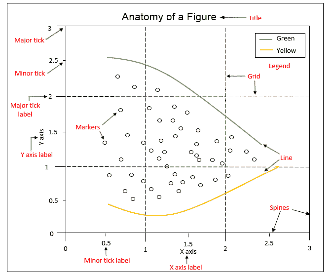
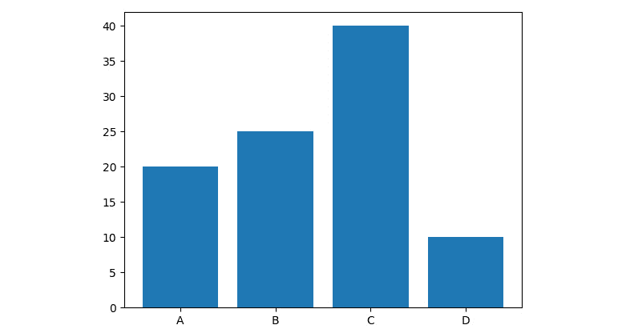
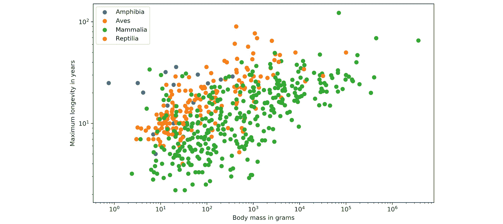

# 三、深入 Matplotlib

## 学习目标

本章结束时，您将能够:

*   描述 Matplotlib 的基本原理
*   使用 Matplotlib 提供的内置绘图创建可视化效果
*   自定义您的可视化图
*   用 TeX 写数学表达式

在本章中，我们将学习如何使用 Matplotlib 自定义您的可视化。

## 简介

**Matplotlib** 可能是 Python 最流行的绘图库。它用于世界各地的数据科学和机器学习可视化。约翰·亨特从 2003 年开始开发 Matplotlib。它旨在模拟当时科学标准的 **MATLAB** 软件的命令。MATLAB 的全局风格等几个特性被引入到 Matplotlib 中，使 MATLAB 用户更容易过渡到 Matplotlib。

在我们开始使用 Matplotlib 创建我们的第一个可视化之前，我们将理解并尝试掌握这些绘图背后的概念。

## Matplotlib 中的绘图概述

**Matplotlib 中的绘图**具有层次结构，嵌套 Python 对象以创建树状结构。每个图都封装在一个`Figure`对象中。这个`Figure`是可视化的顶层容器。它可以有多个轴，这些轴基本上是这个顶层容器中的独立图。

再深入一层，我们再次发现控制轴、刻度线、图例、标题、文本框、网格和许多其他对象的 Python 对象。所有这些对象都可以自定义。

绘图的两个主要组成部分如下:

*   **Figure**

    图形是最外层的容器，用作画布来绘制。它允许您在其中绘制多个图。它不仅保存 Axes 对象，还能够配置**标题**。

*   **Axes**

    轴是实际的绘图或子绘图，这取决于您想要绘制单个还是多个可视化效果。它的子对象包括 x 轴和 y 轴、脊线和图例。

在更高的层次上观察这个设计，我们可以看到这个层次结构允许我们创建一个复杂的和可定制的可视化。

当我们看一个图形的“解剖”时，如下图所示，我们对一个有洞察力的可视化的复杂性有了一个概念。Matplotlib 通过调整**网格**、 **x** 和 **y** 刻度、**刻度标签**和**图例**，不仅让我们能够简单地显示数据，还可以围绕数据设计整个**图形**。这意味着我们可以修改绘图的每一个细节，从标题和图例开始，一直到脊柱上的大刻度和小刻度，以使其更具表现力:



###### 图 3.1:Matplotlib 图形的解剖

深入研究图形对象的解剖结构，我们可以观察到以下组件:

*   **刺**:连接轴刻度线的线
*   **标题**:整个图表对象的文字标签
*   **传说**:描述绘图内容
*   **网格**:用作刻度线延伸的垂直线和水平线
*   **X/Y 轴标签**:脊柱下方 X/Y 轴的文字标签
*   **次要刻度**:主要刻度之间的小数值指示器
*   **次要刻度标签**:将在次要刻度处显示的文本标签
*   **主刻度**:脊柱上的主数值指示器
*   **主要刻度标签**:将在主要刻度处显示的文本标签
*   **线**:用线连接数据点的绘图类型
*   **标记**:用定义的标记绘制每个数据点的绘图类型

在本书中，我们将重点介绍 Matplotlib 的子模块 **pyplot** ，它提供了类似 MATLAB 的绘图。

## Pyplot 基础知识

**pyplot** 包含一个更简单的创建可视化的界面，允许用户绘制数据，而无需明确配置**图形**和**轴**本身。它们被隐式和自动地配置以实现期望的输出。使用别名`plt`引用导入的子模块很方便，如下所示:

```py
import matplotlib.pyplot as plt
```

以下部分描述了使用 pyplot 时执行的一些常见操作。

### 创造图表

我们用`plt.figure()`创建一个新的**图**。这个函数返回一个 Figure 实例，但是它也被传递到后端。接下来的每个与图形相关的命令都应用于当前图形，并且不需要知道图形实例。

默认情况下，该图的宽度为 6.4 英寸，高度为 4.8 英寸，dpi 为 100。要更改图的默认值，我们可以使用参数`figsize`和`dpi`。

下面的代码片段显示了我们如何操作一个图形:

```py
plt.figure(figsize=(10, 5)) #To change the width and the height 
plt.figure(dpi=300) #To change the dpi
```

### 收盘数字

不再使用的图形应该通过显式调用`plt.close()`来关闭，这样也可以有效清理内存。

如果未指定任何内容，当前图形将被关闭。要关闭特定的图形，您可以提供对图形实例的引用或提供图形编号。要找到图形对象的**编号**，我们可以使用`number`属性，如下所示:

```py
plt.gcf().number
```

使用`plt.close('all')`，所有图形将被关闭。以下示例显示了如何创建和关闭图形:

```py
plt.figure(num=10) #Create Figure with Figure number 10
plt.close(10) #Close Figure with Figure number 10
```

### 格式化字符串

在我们实际绘制一些东西之前，让我们快速讨论一下**格式字符串**。它们是指定**颜色**、**标记类型**和**线条样式**的简洁方式。格式字符串被指定为“`[color][marker][line]`”，其中每个项目都是可选的。如果`color`是格式字符串的唯一参数，您可以使用任何`matplotlib.colors`。Matplotlib 可以识别以下格式:

*   RGB 或 RGBA 浮点元组(例如，(0.2，0.4，0.3)或(0.2，0.4，0.3，0.5))
*   RGB 或 RGBA 十六进制字符串(例如，' #0F0F0F '或' #0F0F0F ')

下图是如何以一种特定格式表示颜色的示例:


###### 图 3.2 以字符串格式指定的颜色

下图显示了所有可用的标记选项:


###### 图 3.3:格式字符串中的标记

下图显示了所有可用的线型:


###### 图 3.4:线条样式

### 标绘

使用`plt.plot([x], y, [fmt])`，可以将数据点绘制为线和/或标记。该函数返回表示打印数据的线 2D 对象列表。默认情况下，如果不提供格式字符串，数据点将使用直线和实线连接。`plt.plot([0, 1, 2, 3], [2, 4, 6, 8])`生成一个图，如下图所示。由于`x`是可选的，默认值为`[0, …, N-1]`，`plt.plot([2, 4, 6, 8])`会产生相同的结果:


###### 图 3.5:将数据点绘制成一条线

如果您想要绘制标记而不是线条，您可以指定任何标记类型的格式字符串。例如，`plt.plot([0, 1, 2, 3], [2, 4, 6, 8], 'o')`将数据点显示为圆形，如下图所示:


###### 图 3.6:用标记(圆圈)绘制数据点

要绘制多个数据对，可以使用语法`plt.plot([x], y, [fmt], [x], y2, [fmt2], …)`。`plt.plot([2, 4, 6, 8], 'o', [1, 5, 9, 13], 's')`结果如下图。同样，您可以多次使用`plt.plot`，因为我们使用的是同一个图形和轴:


###### 图 3.7:用多个标记绘制数据点

可以使用任何**线 2D** 属性代替格式字符串来进一步自定义绘图。例如，下面的代码片段显示了我们如何额外指定`linewidth`和`markersize`:

```py
plt.plot([2, 4, 6, 8], color='blue', marker='o', linestyle='dashed', linewidth=2, markersize=12)
```

### 使用熊猫数据帧绘图

使用`pandas.DataFrame`作为数据源非常简单。您可以不提供 x 和 y 值，而是在数据参数中提供`pandas.DataFrame`，并给出`x`和`y`的键，如下所示:

```py
plt.plot('x_key', 'y_key', data=df)
```

### 显示图形

`plt.show()`用于显示一个图形或多个图形。要在 Jupyter 笔记本中显示数字，只需在代码开头设置`%matplotlib inline`命令。

### 保存数字

`plt.savefig(fname)`保存当前图形。您可以指定一些有用的可选参数，如`dpi`、`format`或`transparent`。下面的代码片段给出了一个如何保存图形的示例:

```py
plt.figure()
plt.plot([1, 2, 4, 5], [1, 3, 4, 3], '-o')
plt.savefig('lineplot.png', dpi=300, bbox_inches='tight')
#bbox_inches='tight' removes the outer white margins
```

#### 注意

所有练习和活动都将在 Jupyter 笔记本中开发。请从[https://GitHub . com/trainingypbackt/Data-Visualization-with-Python](https://github.com/TrainingByPackt/Data-Visualization-with-Python)下载带有所有准备好的模板的 GitHub 资源库。

### 练习 3:创建简单的可视化

在本练习中，我们将使用 Matplotlib 创建第一个简单的图:

1.  Open the Jupyter Notebook `exercise03.ipynb` from the `Lesson03` folder to implement this exercise.

    导航到该文件的路径，并在命令行中键入以下内容:`jupyter-lab.`

2.  导入必要的模块，并在 Jupyter 笔记本中进行绘图:

    ```py
    import numpy as np
    import matplotlib.pyplot as plt
    %matplotlib inline
    ```

3.  显式创建一个图形，并将 dpi 设置为 200:

    ```py
    plt.figure(dpi=200)
    ```

4.  Plot the following data pairs `(x, y)` as circles, which are connected via line segments: `(1, 1)`, `(2, 3)`, `(4, 4)`, `(5, 3)` . Then, visualize the plot:

    ```py
    plt.plot([1, 2, 4, 5], [1, 3, 4, 3], '-o')
    plt.show()
    ```

    您的输出应该如下所示:

    

    ###### 图 3.8:在给定数据对的帮助下创建的简单可视化，并通过线段连接

5.  使用`plt.savefig()`方法保存绘图。这里，我们可以在方法中提供一个文件名，或者指定完整的路径:

    ```py
    plt.savefig(exercise03.png);
    ```

## 基本文本和图例功能

我们在本主题中讨论的所有函数，除了图例之外，都创建并返回一个`matplotlib.text.Text()`实例。我们在这里提到它，以便您知道所有讨论的属性也可以用于其他功能。所有文本功能如图 3.9 所示。

### 标签

Matplotlib 提供了一些**标签**功能，我们可以用它们来设置 x 轴和 y 轴的标签。`plt.xlabel()`和`plt.ylabel()`功能用于设置当前轴的标签。`set_xlabel()`和`set_ylabel()`功能用于设置指定轴的标签。

**示例:**

```py
ax.set_xlabel('X Label')
ax.set_ylabel('Y Label')
```

### 标题

一个**标题**描述了一个特定的图表。标题位于中心、左边缘或右边缘的轴上方。标题有两个选项–您可以设置**图形标题**或**轴的标题**。`suptitle()`功能设置当前指定图形的标题。`title()`功能有助于设置当前轴和指定轴的标题。

**示例:**

```py
fig = plt.figure()
fig.suptitle('Suptitle', fontsize=10, fontweight='bold')
```

这将创建一个粗体数字标题，文本标题和字体大小为 10。

### 文本

对于**文本**，有两个选项–您可以将文本添加到图形中，也可以将文本添加到轴中。`figtext(x, y, text)`和`text(x, y, text)`功能在位置`x`或`y`为图形添加文本。

**示例:**

```py
ax.text(4, 6, 'Text in Data Coords', bbox={'facecolor': 'yellow', 'alpha':0.5, 'pad':10})
```

这将创建一个文本为“数据坐标中的文本”的黄色文本框。

### 标注

与放置在轴上任意位置的文本相比，**标注**用于标注绘图的某些特征。在标注中，有两个位置需要考虑:标注的位置`xy`和标注的位置，文本`xytext`。指定参数`arrowprops`非常有用，它会产生一个指向标注位置的箭头。

**示例:**

```py
ax.annotate('Example of Annotate', xy=(4,2), xytext=(8,4), arrowprops=dict(facecolor='green', shrink=0.05))
```

这将创建一个指向数据坐标(4，2)的绿色箭头，文本“标注示例”位于数据坐标(8，4)处:


###### 图 3.9:文本命令的实现

### 传说

为了给你的轴添加一个**传说**，我们必须在艺术家创作时指定`label`参数。为当前轴调用`plt.legend()`或为特定轴调用`Axes.legend()`将添加图例。`loc`参数指定图例的位置。

**示例:**

```py
…
plt.plot([1, 2, 3], label='Label 1')
plt.plot([2, 4, 3], label='Label 2')
plt.legend()
…
```

下图说明了该示例:


###### 图 3.10:图例示例

### 活动 12:使用线图可视化股票趋势

在本活动中，我们将创建一个折线图来显示股票趋势。让我们看看下面的场景:你对投资股票感兴趣。你下载了“五大巨头”:亚马逊、谷歌、苹果、脸书和微软的股价:

1.  用熊猫读取位于子文件夹`data`的数据。
2.  使用 Matplotlib 创建一个折线图，可视化所有五家公司过去五年的收盘价(整个数据序列)。添加标签、标题和图例，使可视化不言自明。使用`plt.grid()`给你的图添加一个网格。
3.  执行上述步骤后，预期输出应该如下:


###### 图 3.11:五家公司股票趋势的可视化

#### 注意:

这项活动的解决方案可以在第 279 页找到。

## 基本绘图

在这一节中，我们将探讨不同类型的基本绘图。

### 条形图

`plt.bar(x, height, [width])`创建竖条图。对于横条，使用`plt.barh()`功能。

**重要参数:**

*   `x`:指定条的 x 坐标
*   `height`:指定条的高度
*   `width`(可选):指定所有条的宽度；默认值为 0.8

**示例:**

```py
plt.bar(['A', 'B', 'C', 'D'], [20, 25, 40, 10]) 
```

上面的代码创建了一个条形图，如下图所示:



###### 图 3.12:一个简单的条形图

如果你想有子类别，你必须多次使用`plt.bar()`功能，移动 x 坐标。这在下面的示例中完成，并在下面的图表中说明。`arange()`函数是 **NumPy** 包中的一种方法，在给定的时间间隔内返回均匀间隔的值。`gca()`功能有助于获取任何当前图形上的当前轴的实例。`set_xticklabels()`功能用于设置带有给定字符串标签列表的 x 刻度标签。

**示例:**

```py
…
labels = ['A', 'B', 'C', 'D']
x = np.arange(len(labels))
width = 0.4
plt.bar(x – width / 2, [20, 25, 40, 10], width=width)
plt.bar(x – width / 2, [30, 15, 30, 20], width=width)
# Ticks and tick labels must be set manually
plt.ticks(x)
ax = plt.gca()	
ax.set_xticklabels(labels)
…
```

上面的代码创建了一个带有子类别的条形图，如下图所示:


###### 图 3.13:带有子类别的条形图

### 活动 13:创建用于电影比较的条形图

在本活动中，我们将使用条形图来比较电影分数。给你五部烂番茄评分的电影。Tomatometer 是对电影给予正面评价的认可 Tomatometer 影评人的百分比。受众分数是 5 分中给出 3.5 分或更高分数的用户的百分比。在五部电影中比较这两个分数:

1.  使用 pandas 读取位于子文件夹数据中的数据。
2.  使用 Matplotlib 创建一个视觉上吸引人的条形图，比较所有五部电影的两个分数。
3.  使用电影标题作为 x 轴的标签。对 y 轴刻度使用 20 的间隔百分比，对 5 的间隔使用次要刻度。给绘图加上一个图例和合适的标题。
4.  执行上述步骤后，预期输出应该如下:


###### 图 3.14:对比五部电影评分的条形图

#### 注意:

这项活动的解决方案可以在第 280 页找到。

### 饼图

`plt.pie(x, [explode], [labels], [autopct])`函数创建一个饼图。

**重要参数:**

*   `x`:指定切片大小。
*   `explode`(可选):指定每个切片的半径偏移分数。分解数组的长度必须与 x 数组相同。
*   `labels`(可选):指定每个切片的标签。
*   `autopct`(可选):根据指定的格式字符串显示切片内的百分比。示例:“%1.1f%%”。

**示例:**

```py
…
plt.pie([0.4, 0.3, 0.2, 0.1], explode=(0.1, 0, 0, 0), labels=['A', 'B', 'C', 'D'])
…
```

下图显示了上述代码的结果:


###### 图 3.15:基本饼图

### 练习 4:创建用水量饼图

在本练习中，我们将使用饼图来可视化用水量:

1.  Open the Jupyter Notebook `exercise04.ipynb` from the `Lesson03` folder to implement this exercise.

    导航到该文件的路径，并在命令行中键入以下内容:`jupyter-lab.`

2.  导入必要的模块，并在 Jupyter 笔记本中进行绘图:

    ```py
    # Import statements
    import pandas as pd
    import matplotlib.pyplot as plt
    %matplotlib inline
    ```

3.  用熊猫读取位于子文件夹数据中的数据:

    ```py
    # Load dataset
    data = pd.read_csv('./data/water_usage.csv')
    ```

4.  使用饼图来可视化用水量。使用分解参数突出显示您选择的一种用法。显示每个切片的百分比，并添加标题:

    ```py
    # Create figure
    plt.figure(figsize=(8, 8), dpi=300)
    # Create pie plot
    plt.pie('Percentage', explode=(0, 0, 0.1, 0, 0, 0), labels='Usage', data=data, autopct='%.0f%%')
    # Add title
    plt.title('Water usage')
    # Show plot
    plt.show()
    ```

下图显示了前面代码的输出:


###### 图 3.16:用水量饼图

### 堆叠条形图

一个**堆叠条形图**使用与条形图相同的`plt.bar`功能。对于每个堆叠条形图，必须调用`plt.bar`函数，并且必须从第二个堆叠条形图开始指定`bottom`参数。通过下面的例子，这一点将变得很清楚:

```py
…
plt.bar(x, bars1)
plt.bar(x, bars2, bottom=bars1)
plt.bar(x, bars3, bottom=np.add(bars1, bars2))
…
```

下图显示了上述代码的结果:


###### 图 3.17:堆叠条形图

### 活动 14:创建堆叠条形图以可视化餐厅表现

在本活动中，我们将使用堆叠条形图来可视化餐厅的表现。让我们看看下面的场景:你是一家餐馆的老板，由于一项新的法律，你必须引入一个禁烟日。为了尽可能减少损失，您需要想象每天有多少销售额，按吸烟者和不吸烟者分类:

1.  使用给定的数据集并创建一个矩阵，其中的元素包含每天的总账单和吸烟者/不吸烟者的账单。
2.  创建一个堆积条形图，将吸烟者和非吸烟者每天的总账单堆积在一起。添加图例、标签和标题。
3.  After executing the preceding steps, the expected output should be as follows:

    

###### 图 3.18:显示餐厅不同日子表现的堆叠条形图

#### 注意:

这项活动的解决方案可以在第 282 页找到。

### 堆叠面积图

`plt.stackplot(x, y)`创建堆叠面积图。

**重要参数:**

*   `x`:指定数据系列的 x 值。
*   `y`:指定数据系列的 y 值。对于多个系列，无论是 2d 阵列，还是任意数量的 1D 阵列，调用以下函数:`plt.stackplot(x, y1, y2, y3, …).`
*   `labels`(可选):将标签指定为每个数据系列的列表或元组。

**示例:**

```py
…
plt.stackplot([1, 2, 3, 4], [2, 4, 5, 8], [1, 5, 4, 2])
…
```

下图显示了上述代码的结果:


###### 图 3.19:堆叠面积图

### 活动 15:使用堆叠面积图比较智能手机销量

在本活动中，我们将使用堆叠面积图来比较智能手机的销售单位。让我们看看下面的场景:你想投资五大智能手机制造商之一。将季度销售单位视为整体的一部分可能是投资哪家公司的好指标:

1.  使用 pandas 读取位于子文件夹数据中的数据。
2.  创建一个视觉上吸引人的堆叠面积图。添加图例、标签和标题。
3.  执行上述步骤后，预期输出应该如下:


###### 图 3.20:不同智能手机厂商销量对比的堆叠面积图

#### 注意:

这项活动的解决方案可以在第 283 页找到。

### 直方图

`plt.hist(x)`创建直方图。

**重要参数:**

*   `x`:指定输入值
*   `bins`:(可选):将面元数指定为整数，或将面元边指定为列表
*   `range`:(可选):以元组的形式指定容器的下限和上限
*   `density`:(可选):如果为真，直方图表示概率密度

**示例:**

```py
…
plt.hist(x, bins=30, density=True)
…
```

下图显示了上述代码的结果:


###### 图 3.21:直方图

`plt.hist2d(x, y)`创建 2D 直方图。下图显示了 2D 历史图的一个示例:


###### 图 3.22:带颜色条的 2D 直方图

### 箱线图

`plt.boxplot(x)`创建方框图。

**重要参数:**

*   `x`:指定输入数据。它为单个框指定一个 1D 数组，或者为多个框指定一系列数组。
*   `notch`:可选:如果为真，将在图中添加凹口，以指示中位数周围的置信区间。
*   `labels`:可选:将标签指定为序列。
*   `showfliers`:可选:默认为真，超出上限绘制异常值。
*   `showmeans`:可选:如果为真，则显示算术平均值。

**示例:**

```py
…
plt.boxplot([x1, x2], labels=['A', 'B'])
…
```

下图显示了上述代码的结果:


###### 图 3.23:方框图

### 活动 16:使用直方图和箱线图来可视化智商

在本练习中，我们将使用直方图和方框图来可视化智商。

#### 注意

`plt.axvline(x, [color=…], [linestyle=…])`在`x`位置画一条垂直线。

1.  为给定的智商分数绘制一个包含 10 个面元的直方图。智商分数呈正态分布，平均值为 100，标准差为 15。将平均值可视化为垂直的红色实线，用垂直虚线表示标准偏差。添加标签和标题。
2.  创建一个方框图来可视化相同的智商分数。添加标签和标题。
3.  为不同测试组的每个智商分数创建一个方框图。添加标签和标题。
4.  The expected output for step 1 is as follows:

    

    ###### 图 3.24:智商测试直方图

5.  The expected output for step 2 is as follows:

    

    ###### 图 3.25:智商分数的方框图

6.  The expected output for step 3 is as follows:

    

###### 图 3.26:不同测试组智商分数的箱线图

#### 注意:

这项活动的解决方案可以在第 284 页找到。

### 散点图

`plt.scatter(x, y)`创建 y 对 x 的散点图，可选地改变标记大小和/或颜色。

**重要参数:**

*   `x`、`y`:指定数据位置。
*   `s`:可选:以点的平方指定标记大小。
*   `c`:可选:指定标记颜色。如果指定了数字序列，这些数字将被映射到颜色映射的颜色。

**示例:**

```py
…
plt.scatter(x, y)
…
```

下图显示了上述代码的结果:


###### 图 3.27:散点图

### 活动 17:使用散点图来可视化各种动物之间的相关性

在本练习中，我们将使用散点图来显示数据集中的相关性。让我们看看下面的场景:给你一个包含各种动物信息的数据集。可视化各种动物属性之间的相关性:

#### 注意

`Axes.set_xscale('log')`和`Axes.set_yscale('log')`分别将 x 轴和 y 轴的刻度改为对数刻度。

1.  给定的数据集不完整。过滤数据，这样你最终得到的样本就包含了一个体重和最长寿命。根据动物种类对数据进行分类。
2.  创建散点图，可视化体重和最大寿命之间的相关性。根据数据样本的类别，使用不同的颜色对数据样本进行分组。添加图例、标签和标题。x 轴和 y 轴都使用对数刻度。
3.  执行上述步骤后，预期输出应该如下:



###### 图 3.28:动物统计的散点图

#### 注意:

这项活动的解决方案可以在第 287 页找到。

### 气泡图

`plt.scatter`功能用于创建气泡图。要可视化第三个或第四个变量，可以使用参数`s`(比例)和`c`(颜色)。

**示例:**

```py
…
plt.scatter(x, y, s=z*500, c=c, alpha=0.5)
plt.colorbar()
…
```

下图显示了上述代码的结果:


###### 图 3.29:带颜色条的气泡图

## 布局

在 Matplotlib 中定义可视化布局有多种方法。我们将从**子图**开始，以及如何使用**紧凑布局**来创建视觉上吸引人的绘图，然后覆盖 **GridSpec** ，这为创建多绘图提供了更灵活的方式。

### 子图

并排显示几个图通常很有用。Matplotlib 提供了子绘图的概念，子绘图是一个图形中的多个轴。这些图可以是网格图、嵌套图等。

探索以下选项来创建子绘图:

*   `plt.subplots(nrows, ncols)`创建一个图表和一组子图。
*   `plt.subplot(nrows, ncols, index)`或等效的`plt.subplot(pos)`给当前图形增加一个子图。指数从 1 开始。`plt.subplot(2, 2, 1)`相当于`plt.subplot(221)`。
*   `Figure.subplots(nrows, ncols)`向指定的图形添加一组子绘图。
*   `Figure.add_subplot(nrows, ncols, index)`或等效的`Figure.add_subplot(pos)`给指定的图形添加一个子图。

要共享 x 轴或 y 轴，必须分别设置参数`sharex`和`sharey`。该轴将具有相同的限制、刻度和比例。

`plt.subplot`和`Figure.add_subplot`可以选择设置投影。对于极坐标投影，设置`projection='polar'`参数或设置`parameter polar=True`参数。

**例 1:**

```py
…
fig, axes = plt.subplots(2, 2)
axes = axes.ravel()
for i, ax in enumerate(axes):
    ax.plot(series[i])
…
…
for i in range(4):
    plt.subplot(2, 2, i+1)
    plt.plot(series[i])
…
```

两个示例产生相同的结果，如下图所示:


###### 图 3.30:子图

**例 2:**

```py
fig, axes = plt.subplots(2, 2, sharex=True, sharey=True)
axes = axes.ravel()
for i, ax in enumerate(axes):
    ax.plot(series[i])
```

将`sharex`和`sharey`设置为真，结果如下图所示。这样可以进行更好的比较:


###### 图 3.31:共享 x 轴和 y 轴的子绘图

### 紧凑布局

`plt.tight_layout()`调整子图参数，使子图在图中很好的契合。

**示例:**

如果不使用`plt.tight_layout()`，子图可能会重叠:

```py
…
fig, axes = plt.subplots(2, 2)
axes = axes.ravel()
for i, ax in enumerate(axes):
    ax.plot(series[i])
    ax.set_title('Subplot ' + str(i))
…
```

下图显示了上述代码的结果:


###### 图 3.32:没有布局选项的子图

使用`plt.tight_layout()`不会导致子绘图重叠:

```py
…
fig, axes = plt.subplots(2, 2)
axes = axes.ravel()
for i, ax in enumerate(axes):
    ax.plot(series[i])
    ax.set_title('Subplot ' + str(i))
plt.tight_layout()
…
```

下图显示了上述代码的结果:


###### 图 3.33:布局紧凑的子图

### 雷达图

**雷达图**，也称为**蜘蛛**或**网络图**，可视化多个变量，每个变量绘制在自己的轴上，形成一个多边形。所有轴都是径向排列的，从中心开始，彼此之间的距离相等，并且具有相同的刻度。

### 练习 5:绘制雷达图

在本练习中，将逐步展示如何创建雷达图:

1.  Open the Jupyter Notebook `exercise05.ipynb` from the `Lesson03` folder to implement this exercise.

    导航到该文件的路径，并在命令行中键入以下内容:`jupyter-lab.`

2.  导入必要的模块，并在 Jupyter 笔记本中进行绘图:

    ```py
    # Import settings
    import numpy as np
    import pandas as pd
    import matplotlib.pyplot as plt
    %matplotlib inline
    ```

3.  以下数据集包含四名员工的五种不同属性的评分:

    ```py
    # Sample data
    # Attributes: Efficiency, Quality, Commitment, Responsible Conduct, Cooperation
    data = pd.DataFrame({
        'Employee': ['A', 'B', 'C', 'D'],
        'Efficiency': [5, 4, 4, 3,],
        'Quality': [5, 5, 3, 3],
        'Commitment': [5, 4, 4, 4],
        'Responsible Conduct': [4, 4, 4, 3],
        'Cooperation': [4, 3, 4, 5]
    })
    ```

4.  创建角度值并关闭绘图:

    ```py
    attributes = list(data.columns[1:])
    values = list(data.values[:, 1:])
    employees = list(data.values[:, 0])
    angles = [n / float(len(attributes)) * 2 * np.pi for n in range(len(attributes))]
    # Close the plot
    angles += angles[:1]
    values = np.asarray(values)
    values = np.concatenate([values, values[:, 0:1]], axis=1)
    ```

5.  用极坐标投影创建子图。设置一个紧凑的布局，这样就不会有任何重叠:

    ```py
    # Create figure
    plt.figure(figsize=(8, 8), dpi=150)
    # Create subplots
    for i in range(4):
        ax = plt.subplot(2, 2, i + 1, polar=True)
        ax.plot(angles, values[i])
        ax.set_yticks([1, 2, 3, 4, 5])
        ax.set_xticks(angles)
        ax.set_xticklabels(attributes)
        ax.set_title(employees[i], fontsize=14, color='r')
    # Set tight layout
    plt.tight_layout()
    # Show plot
    plt.show()
    ```

下图显示了前面代码的输出:


###### 图 3.34:雷达图

### 格思特

`matplotlib.gridspec.GridSpec(nrows, ncols)`指定将放置子图的网格的几何形状。

**示例:**

```py
…
gs = matplotlib.gridspec.GridSpec(3, 4)
ax1 = plt.subplot(gs[:3, :3])
ax2 = plt.subplot(gs[0, 3])
ax3 = plt.subplot(gs[1, 3])
ax4 = plt.subplot(gs[2, 3])
ax1.plot(series[0])
ax2.plot(series[1])
ax3.plot(series[2])
ax4.plot(series[3])
plt.tight_layout()
…
```

下图显示了上述代码的结果:


###### 图 3.35: GridSpec

### 活动 18:创建带有边缘直方图的散点图

在本练习中，我们将使用 **GridSpec** 可视化带有**边缘直方图**的**散点图**:

1.  在之前的活动中已经使用过的给定数据集`AnAge`不完整。过滤数据，这样你最终得到的样本就包含了一个体重和最长寿命。选择所有体重小于 20，000 的 Aves 类样品。
2.  创建具有受约束布局的图形。创建一个 4x4 大小的 gridspec。创建大小为 3x3 的散点图和大小为 1x3 和 3x1 的边缘直方图。添加标签和图形标题。
3.  执行上述步骤后，预期输出应该如下:


###### 图 3.36:带有边缘直方图的散点图

#### 注意:

这项活动的解决方案可以在第 289 页找到。

## 图像

如果您想在可视化中包含图像，或者您正在处理图像数据，Matplotlib 提供了几个处理图像的功能。在本节中，我们将向您展示如何使用 Matplotlib**加载**、**保存**和**绘制**图像。

#### 注意

本主题中使用的图像来自[https://unsplash.com/](https://unsplash.com/)。

### 基本图像操作

以下是用于设计图像的基本操作:

**加载图像**

如果您遇到 Matplotlib 不支持的图像格式，我们建议使用**枕头**库加载图像。在 Matplotlib 中，加载图像是图像子模块的一部分。我们使用别名`mpimg`作为子模块，如下所示:

```py
import matplotlib.image as mpimg
```

`mpimg.imread(fname)`读取图像并将其作为`numpy.array`返回。对于灰度图像，返回的数组有一个形状(高度，宽度)，对于 RGB 图像(高度，宽度，3)，对于 RGBA 图像(高度，宽度，4)。数组值的范围从 0 到 255。

**保存图像**

`mpimg.imsave(fname, array)`将`numpy.array`保存为图像文件。如果没有给出`format`参数，格式是从文件扩展名推导出来的。通过可选参数`vmin`和`vmax`，可以手动设置颜色限制。对于灰度图像，可选参数`cmap`的默认值为`'viridis'`；你可能想把它改成`'gray'`。

**绘制单个图像**

`plt.imshow(img)`显示图像并返回`AxesImage`。对于具有形状(高度、宽度)的灰度图像，图像阵列使用颜色图进行可视化。默认的颜色图是`'viridis'`，如图 3.38 所示。为了实际可视化灰度图像，颜色图必须设置为`'gray'`，即`plt.imshow(img, cmap='gray')`，如下图所示。灰度、RGB 和 RGBA 图像的值可以是`float` 或`uint8`，范围分别为`[0…1]`或`[0…255]`。要手动定义数值范围，必须指定参数`vmin`和`vmax`。下图显示了 RGB 图像的可视化效果:


###### 图 3.37:默认维里迪斯色图的灰度图像

下图显示了带有灰色色图的灰度图像:


###### 图 3.38:带有灰色色图的灰度图像

下图显示了一幅 RGB 图像:


###### 图 3.39: RGB 图像

有时，深入了解颜色值可能会有所帮助。我们可以简单地在图像图中添加一个颜色条。建议使用高对比度的色彩图，例如，'`jet`':

```py
…
plt.imshow(img, cmap='jet')
plt.colorbar()
…
```

下图说明了前面的示例:


###### 图 3.40:带有喷射色图和颜色条的图像

深入了解图像值的另一种方法是绘制直方图，如下图所示。要绘制图像阵列的直方图，必须使用`numpy.ravel`展平阵列:

```py
…
plt.hist(img.ravel(), bins=256, range=(0, 1))
…
```

下图显示了前面代码的输出:


###### 图 3.41:图像值直方图

**在网格中绘制多个图像**

为了在一个网格中绘制多个图像，我们可以简单地使用`plt.subplots`并根据轴绘制一个图像:

```py
…
fig, axes = plt.subplots(1, 2)
for i in range(2):
    axes[i].imshow(imgs[i])
…
```

下图显示了上述代码的结果:


###### 图 3.42:网格中的多个图像

在某些情况下，去掉记号并添加标签是很好的。`axes.set_xticks([])`和`axes.set_yticks([])`分别去除 x 记号和 y 记号。`axes.set_xlabel('label')`增加了一个标签:

```py
…
fig, axes = plt.subplots(1, 2)
labels = ['coast', 'beach']
for i in range(2):
    axes[i].imshow(imgs[i])
    axes[i].set_xticks([])
    axes[i].set_yticks([])
    axes[i].set_xlabel(labels[i])
…
```

下图显示了上述代码的结果:


###### 图 3.43:带有标签的多个图像

### 活动 19:在网格中绘制多个图像

在本练习中，我们将在网格中绘制图像:

1.  从子文件夹数据加载所有四个图像。
2.  在 2x2 网格中可视化图像。移除轴并给每个图像一个标签。
3.  执行上述步骤后，预期输出应该如下:


###### 图 3.44:在 2x2 网格中可视化图像

#### 注意:

这项活动的解决方案可以在第 290 页找到。

## 写数学表达式

如果需要在代码内编写数学表达式，Matplotlib 支持 **TeX** 。你可以把你的数学表达式放在一对美元符号中，在任何文本中使用它。没有必要安装 TeX，因为 Matplotlib 自带解析器。

下面的代码给出了一个例子:

```py
…
plt.xlabel('$x$')
plt.ylabel('$\cos(x)$')
…
```

下图显示了前面代码的输出:


###### 图 3.45:演示数学表达式的图

**TeX 示例:**

*   `'$\alpha_i>\beta_i$'`生产
*   `'$\sum_{i=0}^\infty x_i$'`生产
*   `'$\sqrt[3]{8}$'`生产
*   `'$\frac{3 - \frac{x}{2}}{5}$'`生产

## 总结

在本章中，我们详细介绍了 Matplotlib，这是 Python 最流行的可视化库之一。我们从 pyplot 及其操作的基础开始，然后深入了解有助于丰富文本可视化的众多可能性。本章通过实例介绍了 Matplotlib 提供的最流行的绘图功能，包括比较图、合成图和分布图。这一章以如何形象化图像和写数学表达式为结尾。

在下一章中，我们将了解 Seaborn 图书馆。Seaborn 建立在 Matplotlib 的基础上，提供了更高级别的抽象，使视觉上吸引人的可视化。我们还将讨论高级可视化类型。